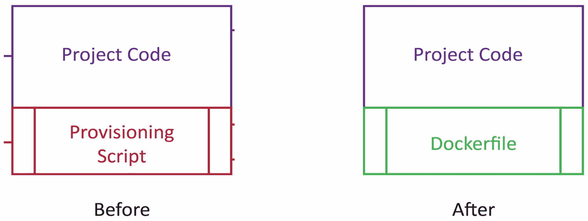
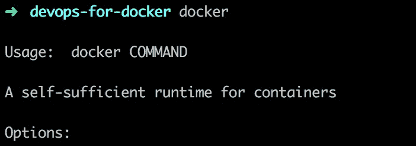
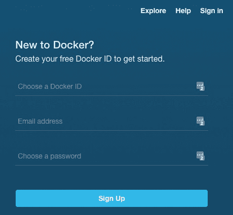
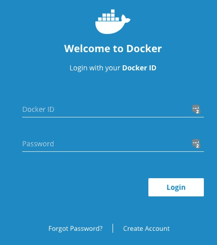

# 第一章：镜像和容器

本课程将涵盖有关容器化的基本概念，作为我们稍后将构建的镜像和容器的基础。我们还将了解 Docker 如何以及为什么参与到 DevOps 生态系统中。在开始之前，我们将看到虚拟化与 Docker 中的容器化有何不同。

# 课程目标

通过本课程结束时，您将能够：

+   描述 Docker 如何改进 DevOps 工作流程

+   解释 Dockerfile 语法

+   构建镜像

+   设置容器和镜像

+   建立本地动态环境

+   在 Docker 容器中运行应用程序

+   通过 Docker Hub 获取 Docker 管理镜像的基本概述

+   将 Docker 镜像部署到 Docker Hub

# 虚拟化与容器化

这个块图示给出了典型虚拟机设置的概述：


在虚拟机中，物理硬件被抽象化，因此我们可以在一个服务器上运行许多服务器。一个 hypervisor 可以帮助实现这一点。

虚拟机有时需要一些时间来启动，并且在容量上很昂贵（它们可以占用几 GB 的空间），尽管它们相对于容器的最大优势是能够运行不同的 Linux 发行版，如 CentOS 而不仅仅是 Ubuntu：


在容器化中，只有应用程序层（代码和依赖项打包的地方）被抽象化，这使得许多容器可以在相同的 OS 内核上运行，但在单独的用户空间上运行。

容器占用空间少，启动快。这使得开发更容易，因为您可以随时删除和启动容器，而不必考虑服务器或开发人员的工作空间有多大。

让我们从快速概述开始，了解 Docker 如何在 DevOps 工作流程和 Docker 环境中发挥作用。

# Docker 如何改进 DevOps 工作流程

DevOps 是一种思维方式，一种文化，一种思维方式。最终目标是尽可能改进和自动化流程。用通俗的语言说，DevOps 要求人们以最懒惰的观点思考，尽可能将大部分甚至所有的流程自动化。

Docker 是一个改进开发生命周期的船运过程的开源容器化平台。请注意，它既不是已经存在的平台的替代品，也不是组织希望它成为的替代品。

Docker 抽象了像 Puppet 这样的配置管理的复杂性。在这种设置下，shell 脚本变得不再必要。Docker 也可以用于小型或大型部署，从一个 hello world 应用到一个完整的生产服务器。

作为不同级别的开发人员，无论是初学者还是专家，您可能已经使用过 Docker，甚至没有意识到。如果您设置了一个持续集成管道来在线运行您的测试，大多数服务器都使用 Docker 来构建和运行您的测试。

Docker 因其灵活性而在技术社区中获得了很多支持，因此许多组织都在运行容器来提供服务。这些组织包括以下：

+   诸如 Circle CI、Travis CI 和 Codeship 之类的持续集成和持续交付平台

+   云平台，如亚马逊网络服务（AWS）和谷歌云平台（GCP）允许开发人员在容器中运行应用程序

+   思科和阿里巴巴集团也在容器中运行一些服务

Docker 在 DevOps 工作流程中的位置涉及但不限于以下内容：

### 注意

开发工作流程中 Docker 的使用案例示例。

统一要求是指使用单个配置文件。Docker 将要求抽象和限制到一个 Dockerfile 文件。

操作系统的抽象意味着不需要担心构建操作系统，因为存在预构建的镜像。

速度必须定义一个 Dockerfile 并构建容器进行测试，或者使用已构建的镜像而无需编写 Dockerfile。Docker 允许开发团队通过 shell 脚本避免对陡峭的学习曲线的投资，因为“自动化工具 X”太复杂了。

## Docker 环境的回顾

我们之前已经介绍了容器化的基本原理。让我强调一下 Docker 为我们带来的替代工作流程。

通常，一个工作应用程序有两个部分：项目代码库和配置脚本。代码库是应用程序代码。它由版本控制管理，并托管在 GitHub 等平台上。

配置脚本可以是一个简单的 shell 脚本，在主机上运行，可以是从 Windows 工作站到云中的完全专用服务器。

使用 Docker 不会干扰项目代码库，但会在配置方面进行创新，改进工作流程和交付速度。这是 Docker 如何实现这一点的一个示例设置：



**Dockerfile** 取代了配置脚本的位置。这两者结合在一起（项目代码和 Dockerfile）形成了一个 **Docker 镜像**。Docker 镜像可以作为一个应用程序运行。从 Docker 镜像中运行的这个应用程序被称为 **Docker 容器**。

Docker 容器允许我们在我们的计算机上以全新的环境运行应用程序，这是完全可丢弃的。这意味着什么？

这意味着我们能够在我们的计算机上声明和运行 Linux 或任何其他操作系统，然后在其中运行我们的应用程序。这也强调了我们可以构建和运行容器，而不会干扰我们计算机的配置。

通过这些，我向您介绍了四个关键词：**image**，**container**，**build** 和 **run**。接下来我们将深入了解 Docker CLI。

# 基本的 Docker 终端命令

打开命令提示符，检查 Docker 是否安装在您的工作站上。在终端上输入 `docker` 命令应该显示以下内容：


这是 Docker 可用子命令的列表。要了解每个子命令的作用，请在终端上输入 `docker-subcommand –help`：



运行 `docker info` 并注意以下内容：

+   容器

+   镜像

+   服务器版本


这个命令显示系统范围的信息。服务器版本号有时很重要，特别是当新版本引入了与旧版本不兼容的东西时。Docker 为他们的社区版提供了稳定版和边缘版。

现在我们将看一下一些常用的命令。

这个命令在 **Docker Hub** 中搜索镜像：

```
docker search <term> (for example, docker search ubuntu)
```

Docker Hub 是默认的 Docker 注册表。Docker 注册表保存了命名的 Docker 镜像。Docker Hub 基本上就是 "Docker 镜像的 GitHub"。之前，我们看过如何运行 Ubuntu 容器而不构建一个；这就是 Ubuntu 镜像存储和版本控制的地方：


“有私有的 Docker 注册表，现在你意识到这一点很重要。” Docker Hub 在[hub.docker.com](http://hub.docker.com)。一些镜像托管在[store.docker.com](http://store.docker.com)，但 Docker Store 包含官方镜像。然而，它主要关注 Docker 镜像的商业方面，并为使用提供工作流程。

注册页面如下所示：



登录页面如下所示：



从结果中，你可以看出用户通过星号的数量对镜像进行了评价。你还可以知道这个镜像是否是官方的。这意味着这个镜像是由注册表推广的，在这种情况下是 Docker Hub。建议新的 Docker 用户使用官方镜像，因为它们有很好的文档，安全，促进最佳实践，并且设计用于大多数用例。一旦你选定了一个镜像，你需要在本地拥有它。

### 注意

确保你能够从 Docker Hub 搜索至少一个镜像。镜像种类从操作系统到库都有，比如 Ubuntu，Node.js 和 Apache。

这个命令允许你从 Docker Hub 搜索：

```
docker search <term>

```

例如，`docker search ubuntu`。

这个命令从注册表中拉取一个镜像到你的本地机器：

```
docker pull

```

例如，`docker pull ubuntu`。

一旦这个命令运行，你会注意到它正在使用默认标签：`latest`。在 Docker Hub 中，你可以看到标签的列表。对于**Ubuntu**，它们在这里列出：[`hub.docker.com/r/library/ubuntu/`](https://hub.docker.com/r/library/ubuntu/) 以及它们各自的 Dockerfiles：


从 Docker Hub 上下载 Ubuntu 镜像配置文件：[`hub.docker.com/r/library/ubuntu/`](https://hub.docker.com/r/library/ubuntu/)。

## 活动 1 —— 使用 docker pull 命令

让你熟悉`docker pull`命令。

这个活动的目标是通过运行列出的命令，以及在探索中寻求其他命令的帮助，通过操作构建的容器来对`docker-pull` CLI 有一个牢固的理解。

1.  Docker 是否正在运行？在终端或命令行应用程序上输入`docker`。

1.  这个命令用于从 Docker Hub 拉取镜像。

```
docker pull

```

图像的种类范围从操作系统到库，例如 Ubuntu、Node.js 和 Apache。此命令允许您从 Docker Hub 中拉取图像：

例如，`docker pull ubuntu`。

此命令列出我们在本地拥有的 Docker 图像：

+   `docker images`

当我们运行命令时，如果我们从 Docker Hub 拉取了图像，我们将能够看到图像列表：


它们根据存储库、标签、图像 ID、创建日期和大小进行列出。存储库只是图像名称，除非它是从不同的注册表中获取的。在这种情况下，您将获得一个没有`http://`和**顶级域（TLD）**的 URL，例如从 Heroku 注册表中的`>registry.heroku.com/<image-name>`。

此命令将检查名为`hello-world`的图像是否在本地存在：

```
docker run <image>

```

例如，`docker run hello-world`：


如果图像不是本地的，它将从默认注册表 Docker Hub 中拉取并默认情况下作为容器运行。

此命令列出正在运行的容器：

```
docker ps
```

如果没有运行的容器，您应该看到一个带有标题的空屏幕：


## Activity 2 — Analyzing the Docker CLI

通过在终端上键入`docker`来确保 Docker CLI 正在运行。

您被要求演示到目前为止涵盖的命令。

让您熟悉 Docker CLI。此活动的目标是通过运行列出的命令以及在探索过程中寻求其他命令的帮助来对`docker-compose` CLI 有牢固的理解，目标不仅是操作构建的容器，而且还要灵活使用 CLI，以便在运行自动化脚本等实际场景中使用它。

1.  Docker 是否正在运行？在终端或命令行应用程序上键入`docker`。

1.  使用 CLI 搜索官方 Apache 图像，使用`docker search apache:`

1.  尝试使用`docker pull apache`拉取图像。

1.  使用`docker images`确认图像在本地的可用性。

1.  奖励：使用`docker run apache`将图像作为容器运行。

1.  奖励：使用`docker stop <container ID>`停止容器。

1.  奖励：使用`docker rm <container ID>`删除容器和图像。

# Dockerfile 语法

每个 Docker 镜像都始于一个**Dockerfile**。要创建一个应用程序或脚本的镜像，只需创建一个名为**Dockerfile**的文件。

### 注意

它没有扩展名，并以大写字母 D 开头。

Dockerfile 是一个简单的文本文档，其中写有模板容器的所有命令。Dockerfile 始终以基础镜像开头。它包含创建应用程序或运行所需脚本的步骤。

在构建之前，让我们快速看一下编写 Dockerfile 的一些最佳实践。

一些最佳实践包括但不限于以下内容：

+   **关注分离**：确保每个 Dockerfile 尽可能地专注于一个目标。这将使其在多个应用程序中更容易重用。

+   **避免不必要的安装**：这将减少复杂性，使镜像和容器足够紧凑。

+   **重用已构建的镜像**：Docker Hub 上有几个构建和版本化的镜像；因此，与其实现一个已经存在的镜像，最好是通过导入来重用。

+   **具有有限数量的层**：最小数量的层将允许一个紧凑或更小的构建。内存是构建镜像和容器时需要考虑的关键因素，因为这也会影响镜像的消费者或客户端。

我们将简单地从 Python 和 JavaScript 脚本开始。选择这些语言是基于它们的流行度和易于演示。

## 为 Python 和 JavaScript 示例编写 Dockerfile。

### 注意

对所选语言没有先验经验，因为它们旨在展示任何语言如何采用容器化的动态视图。

### Python

在开始之前，创建一个新的目录或文件夹；让我们将其用作我们的工作空间。

打开目录并运行`docker search python`。我们将选择官方镜像：`python`。官方镜像在**官方**列中具有值**[OK]**：


前往[hub.docker.com](http://hub.docker.com)或[store.docker.com](http://store.docker.com)搜索 python 以获取正确的标签，或者至少知道带有最新标签的 Python 镜像的版本。我们将在*主题 D*中更多地讨论标签。

镜像标签应该是一个看起来像`3.x.x`或`3.x.x-rc.`的数字。

创建一个名为`run.py`的文件，并输入第一行如下：

```
print("Hello Docker - PY")
```

在同一文件夹级别上创建一个新文件，并将其命名为**Dockerfile**。

### 注意

我们没有 Dockerfile 的扩展名。

在**Dockerfile**中添加以下内容：

```
FROM python
ADD . .
RUN ls
CMD python run.py
```

**FROM**命令，正如前面所提到的，指定了基本图像。

该命令也可以从**继承**的角度来使用。这意味着如果已经存在一个包含这些包的图像，您不必在 Dockerfile 中包含额外的包安装。

**ADD**命令将指定的文件从源复制到图像文件系统中的目标位置。这意味着脚本的内容将被复制到指定的目录中。

在这种情况下，因为`run.py`和 Dockerfile 在同一级别，所以`run.py`被复制到我们正在构建的基本图像文件系统的工作目录中。

**RUN**命令在构建图像时执行。这里运行的`ls`只是为了让我们看到图像文件系统的内容。

**CMD**命令是在基于我们将使用此 Dockerfile 创建的图像运行容器时使用的。这意味着在 Dockerfile 执行结束时，我们打算运行一个容器。

### JavaScript

退出上一个目录并创建一个新目录。这个将演示一个 node 应用程序。

在脚本中添加以下行并保存：

```
console.log("Hello Docker - JS")
```

运行`docker search node` - 我们将选择官方图像：`node`

请记住，官方图像在**官方**列中具有值**[OK]**：


请注意，node 是基于谷歌高性能、开源 JavaScript 引擎 V8 的 JavaScript 运行时。

转到[hub.docker.com](http://hub.docker.com)并搜索 node 以获取正确的标签，或者至少知道具有最新标签的 node 图像的版本是什么。

创建一个新的**Dockerfile**并添加以下内容：

这应该与脚本在同一文件级别。

```
FROM node
ADD . .
RUN ls
CMD node run.js

```

我们现在将涵盖这些内容。

## 活动 3 —— 构建 Dockerfile

确保您的 Docker CLI 正在运行，通过在终端上键入`docker`。

为了让您熟悉 Dockerfile 语法。这项活动的目标是帮助理解和练习使用第三方图像和容器。这有助于更全面地了解协作如何通过容器化来实现。这通过构建已经存在的功能或资源来增加产品交付速度。

您被要求编写一个简单的 Dockerfile，打印`hello-world`。

1.  Docker 是否已经启动？在终端或命令行应用程序上键入`docker`。

1.  创建一个新目录并创建一个新的 Dockerfile。

1.  编写一个包括以下步骤的 Dockerfile：

```
FROM ubuntu:xenial 
RUN apt-get install -y apt-transport-https curl software-properties-common python-software-properties
RUN curl -fsSL https://apt.dockerproject.org/gpg | apt-key add 
RUN echo 'deb https://apt.dockerproject.org/repo ubuntu-xenial main' > /etc/apt/sources.list.d/docker.list
RUN apt-get update
RUN apt-get install -y python3-pip
RUN apt-get install -y build-essential libssl-dev libffi-dev python-dev

```

# 构建镜像

在我们开始构建镜像之前，让我们先了解一下上下文。镜像是一个独立的包，可以运行应用程序或分配服务。镜像是通过 Dockerfile 构建的，Dockerfile 是定义镜像构建方式的模板。

容器被定义为镜像的运行时实例或版本。请注意，这将在您的计算机或主机上作为一个完全隔离的环境运行，这使得它可以被丢弃并用于测试等任务。

有了准备好的 Dockerfiles，让我们进入 Python Dockerfile 目录并构建镜像。

## docker build

构建镜像的命令如下：

```
docker build -t <image-name> <relative location of the Dockerfile>
```

`-t`代表标签。`<image-name>`可以包括特定的标签，比如 latest。建议您始终以这种方式进行操作：给镜像打标签。

**Dockerfile 的相对位置**这里将是一个`点（.）`，表示 Dockerfile 与其余代码处于同一级别；也就是说，它位于项目的根级别。否则，您将进入 Dockerfile 所在的目录。

例如，如果它在 Docker 文件夹中，您将有`docker build -t <image-name> docker`，或者如果它在比根目录更高的文件夹中，您将有两个点。比根目录高两级将用三个点代替一个点。

### 注意

在终端上输出并与 Dockerfiles 中编写的步骤进行比较。您可能希望有两个或更多的 Dockerfiles 来配置不同的情况，比如，一个用于构建生产就绪的应用程序的 Dockerfile，另一个用于测试。无论您有什么原因，Docker 都有解决方案。

默认的 Dockerfile 是 Dockerfile。按照最佳实践，任何额外的 Dockerfile 都被命名为`Dockerfile.<name>`，比如，`Dockerfile.dev`。

要使用除默认 Dockerfile 之外的 Dockerfile 构建镜像，请运行以下命令：`docker build -f Dockerfile.<name> -t <image-name> <Dockerfile 的相对位置>`

### 注意

如果您在不指定不同标签的情况下使用更改 Dockerfile 重新构建镜像，将构建一个新的镜像，并且以`<none>`命名的前一个镜像将被命名。

`docker`构建命令有几个选项，您可以通过运行`docker build --help`来查看。使用名称如 latest 对镜像进行标记也用于版本控制。我们将在*Topic F*中更多地讨论这个问题。

要构建镜像，请在 Python 工作区运行以下命令：

```
>$ docker build -t python-docker .

```

### 注意

尾随的点是语法的重要部分：


### 注意

这里的尾部点是语法的重要部分：


打开 JavaScript 目录，并按以下方式构建 JavaScript 图像：

```
>$ docker build -t js-docker .

```

运行命令将根据**Dockerfile**中的四行命令概述四个步骤。

运行`docker images`列出了你创建的两个图像和之前拉取的任何其他图像。

## 删除 Docker 图像

`docker rmi <image-id>`命令用于删除图像。让我提醒你，可以通过运行`docker images`命令找到图像 ID。

要删除非标记的图像（假定不相关），需要了解 bash 脚本知识。使用以下命令：

```
docker rmi $(docker images | grep "^<none>" | awk "{print $3}")
```

这只是在`docker images`命令的行中搜索带有<none>的图像，并返回第三列中的图像 ID：


## 活动 4 —— 利用 Docker 图像

确保 Docker CLI 正在运行，通过在终端上键入`docker`。

让你熟悉从图像运行容器。

你被要求从*Activity C*中编写的 Dockerfile 构建一个图像。停止运行的容器，删除图像，并使用不同的名称重新构建它。

1.  Docker 是否正在运行？在终端或命令行应用程序上键入`docker`。

1.  打开 JavaScript 示例目录。

1.  运行 `docker build -t <选择一个名称>`（观察步骤并注意结果）。

1.  运行 `docker run <你选择的名称>`。

1.  运行 `docker stop <容器 ID>`。

1.  运行 `docker rmi <在这里添加镜像 ID>`。

1.  运行 `docker build -t <选择新名称>`。

1.  运行 `docker ps`（注意结果；旧图像不应存在）。

# 从图像运行容器

还记得我们提到过容器是从图像构建的吗？命令`docker run <image>`会创建一个基于该图像的容器。可以说容器是图像的运行实例。另一个提醒是，这个图像可以是本地的，也可以在注册表中。

继续运行已创建的图像`docker run python-docker`和`docker run js-docker:`


你注意到了什么？容器运行的输出显示在终端的相应行上。注意，在 Dockerfile 中由 CMD 前导的命令是运行的命令：

```
docker build -t python-docker:test .  and docker build -t js-docker:test .
```

然后，运行以下命令：

```
python-docker:test and docker run js-docker:test
```

### 注意

你不会在终端上看到任何输出。

这不是因为我们没有一个命令`CMD`在容器启动时运行。对于从**Python**和**Node**构建的镜像，都有一个从基础镜像继承的`CMD`。

### 注意

创建的镜像始终继承自基础镜像。

我们运行的两个容器包含运行一次并退出的脚本。检查`docker ps`的结果，您将不会看到之前运行的两个容器的任何内容。但是，运行`docker ps -a`会显示容器及其状态为已退出。

有一个命令列显示容器构建的镜像的 CMD。

运行容器时，可以按以下方式指定名称：

`docker run --name <container-name> <image-name>`（例如，`docker run --name py-docker-container python-docker`）：


我们之前提到，您只想要相关的 Docker 镜像，而不是标记为`<none>`的 Docker 镜像。

至于容器，您需要知道可以从一个镜像中拥有多个容器。`docker rm <container-id>`是删除容器的命令。这适用于已退出的容器（即未运行的容器）。

### 注意

对于仍在运行的容器，您必须要么：

在删除之前停止容器（`docker stop <container-id>`）

强制删除容器（`docker rm <container-id> -f`）

如果运行`docker ps`，将不会列出任何容器，但是如果运行`docker ps -a`，您会注意到列出了容器及其命令列中显示的继承的 CMD 命令：`python3`和`node`：


## Python

Python 镜像的 Dockerfile 中的 CMD 是`python3`。这意味着在容器中运行`python3`命令，然后容器退出。

### 注意

有了这个想法，您可以在自己的机器上运行 Python 而无需安装 Python。

尝试运行此命令：`docker run -it python-docker:test`（使用我们上次创建的镜像）。

我们进入容器中的交互式 bash shell。`-it`指示 Docker 容器创建此 shell。shell 运行`python3`，这是 Python 基础镜像中的 CMD：


在命令`docker run -it python-docker:test python3 run.py, python3 run.py`中，`python3 run.py`会像在容器内的终端中一样运行。请注意`run.py`在容器内，所以会运行。运行`docker run -it python python3 run.py`将指示`run.py`脚本不存在：


同样适用于 JavaScript，表明这个概念是普遍适用的。

`docker run -it js-docker:test`（我们上次创建的图像）将运行一个运行 node 的 shell（在 node 基础图像中的 CMD）：


`docker run -it js-docker:test node run.js` 将输出 `Hello Docker - JS:`


这证明了 Docker 图像中的继承因素。

现在，将 Dockerfile 恢复到它们的原始状态，最后一行上的**CMD 命令**。

# 图像版本控制和 Docker Hub

还记得我们在*主题 D*中谈论过图像版本控制吗？我们通过添加 latest 并在我们的图像中使用一些数字，比如`3.x.x`或`3.x.x-rc.`来实现这一点。

在这个主题中，我们将讨论使用标签进行版本控制，并查看过去官方图像是如何进行版本控制的，从而学习最佳实践。

这里使用的命令是：

```
docker build -t <image-name>:<tag> <relative location of the Dockerfile>
```

比如，我们知道 Python 有几个版本：Python 3.6，3.5 等等。Node.js 有更多的版本。如果你看一下 Docker Hub 上官方的 Node.js 页面，你会看到列表顶部有以下内容：

9.1.0, 9.1, 9, latest (9.1/Dockerfile)（截至 2017 年 11 月）：


这个版本控制系统被称为语义化版本控制。这个版本号的格式是主要版本、次要版本、补丁版本，以增量方式递增：

**主要**：对于不兼容的更改

**次要**：当你有一个向后兼容的更改时

**补丁**：当你进行向后兼容的错误修复时

你会注意到标签，比如`rc`和其他预发布和构建元数据附加到图像上。

在构建图像时，特别是发布到公共或团队时，使用语义化版本控制是最佳实践。

也就是说，我主张你总是这样做，并把这作为个人的口头禅：语义化版本控制是关键。它将消除在处理图像时的歧义和混乱。

# 将 Docker 镜像部署到 Docker Hub

每次运行`docker build`时，创建的镜像都可以在本地使用。通常，Dockerfile 与代码库一起托管；因此，在新的机器上，需要使用`docker build`来创建 Docker 镜像。

通过 Docker Hub，任何开发人员都有机会将 Docker 镜像托管到任何运行 Docker 的机器上。这样做有两个作用：

+   消除了运行`docker build`的重复任务

+   增加了另一种分享应用程序的方式，与分享应用程序代码库和设置过程详细说明的链接相比，这种方式更简单

`docker login`是通过 CLI 连接到 Docker Hub 的命令。您需要在 hub.docker.com 上拥有一个帐户，并通过终端输入用户名和密码。

`docker push <docker-hub-username/image-name[:tag]>`是将镜像发送到注册表 Docker Hub 的命令：


在[hub.docker.com](http://hub.docker.com)上简单搜索您的镜像将输出您的 Docker 镜像。

在新的机器上，简单的`docker pull <docker-hub-username/your-image-name>`命令将在本地生成一个副本。

# 总结

在这节课中，我们做了以下几件事：

+   审查了 DevOps 工作流程和 Docker 的一些用例

+   浏览了 Dockerfile 语法

+   获得了构建应用程序和运行容器的图像的高层理解

+   构建了许多图像，对它们进行了版本控制，并将它们推送到 Docker Hub
