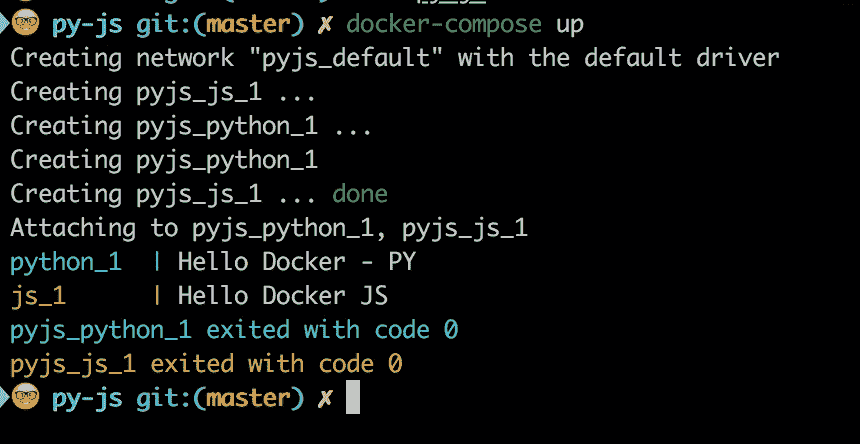
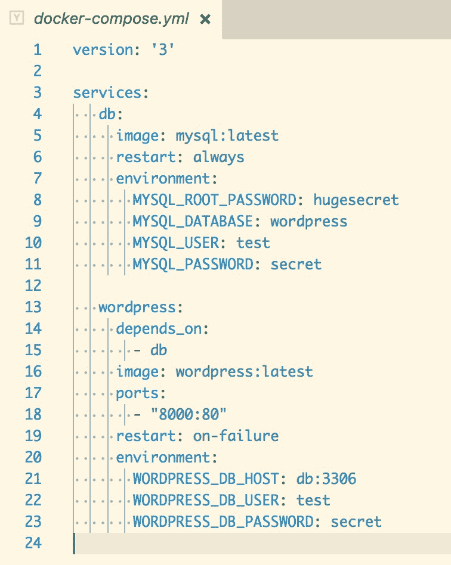

# 第二章：应用容器管理

在本课程中，我们将把我们构建的一个容器扩展为多层设置。这将涉及将应用程序拆分为不同的逻辑部分。例如，我们可以在一个 Docker 容器上运行一个应用程序，并将应用程序的数据放在一个单独的数据库容器中；但是，两者应该作为一个单一实体工作。为此，我们将使用 Docker 的工具来运行多容器应用程序。该工具名为`docker-compose`。简而言之，`docker-compose`是用于定义和运行多容器 Docker 应用程序的工具。

# 课程目标

通过本课程，您将能够：

+   了解多容器应用程序设置的概述

+   通过`docker-compose`文件和 CLI 进行工作

+   管理多个容器和分布式应用程序包

+   使用`docker-compose`设置网络

+   处理和调试不同的应用程序层

# docker-compose 工具

让我们通过查看多容器设置是什么，为什么它很重要，以及 Docker 如何在这种情况下与`docker-compose`工具一起运行得很好来开始本课程。

我们最近介绍了应用程序如何工作，以及它们的各个部分：前端、后端和数据库。

要使用 Docker 运行这样的多层应用程序，需要在不同的终端会话中运行以下命令来启动容器：

```
- docker run <front-end>
- docker run <back-end>
- docker run <database>
```

### 注意

您可以使用（-d）作为分离运行`docker run`，以防止我们在单独的会话中运行三个命令，例如：`docker run <front-end> -d`

也就是说，链接不同的容器（网络）甚至变得特别繁重。

`docker-compose`进来拯救了我们。我们可以从一个文件 - `docker-compose.yml`中定义和运行多个容器。在接下来的主题中，我们将进一步讨论这个问题。首先，让我们安装它。

## 安装 docker-compose

如果您在*第 1 课*中安装了 Docker 的话，`docker-compose`很可能已经与 Docker 一起安装了。要确认这一点，请在终端中运行`docker-compose`。

如果命令被识别，您应该会得到以下输出：


Windows 用户应安装 Docker 的社区版，以便在其旁边安装`docker-compose`。 Docker Toolbox 在其安装中包括`docker-compose`。

### 注意

有关进一步的`docker-compose`安装步骤，请查看文档：[`docs.docker.com/compose/install/`](https://docs.docker.com/compose/install/)。

在这个主题上，请注意卸载它的各种方法。为了卸载程序：

转到**程序和功能**。

寻找 Docker，右键单击，然后**卸载**。

# 多容器应用程序设置概述

在上一课中，我们介绍了 Docker 和容器化。我们运行了一些 Python 和 JavaScript 脚本作为应用程序可以被容器化以及镜像可以被构建的演示。现在我们准备运行一个超越这一点的应用程序。

在 Dockerfile 中，每一行描述一个层。Docker 中使用的联合文件系统允许不同的目录透明地叠加，形成一个统一的文件系统。基础层始终是一个镜像，你可以在其上构建。每个带有命令（比如 RUN、CMD 等）的额外行都会向其添加一个层。层的优势在于，只要层没有被修改，就不会影响构建镜像的那部分。其次，当从 Docker 镜像注册表中拉取镜像时，它是以层的形式拉取的，因此可以减轻拉取和推送镜像时的连接中断等问题。

许多应用程序都是在一个常见的结构下构建的：**前端，后端**和**数据库**。让我们进一步分解并了解如何设置这个结构。

## 前端

当你打开一个 Web 应用程序时，你看到的页面是前端的一部分。有时，前端有控制器（逻辑端）和视图层（哑端）。布局和内容的样式（即 HTML 和 CSS）是视图层。这里的内容由控制器管理。

控制器根据用户的操作和/或数据库更改影响视图层中呈现的内容。举个例子，像 Twitter 这样的应用程序：如果有人关注你，你的数据就会发生变化。控制器将捕捉到这个变化，并用新的关注者数量更新视图层。

## 后端

你可能听说过模型-视图-控制器（MVC）**。**模型位于应用程序的后端。以 Twitter 的早期示例为例，模型不关心 HTML 或其布局。它处理应用程序的状态：关注者和你正在关注的人的数量，推文，图片，视频等。

### 注意

这是后端层包括的内容摘要。后端主要处理应用程序的逻辑。这包括操纵数据库的代码；这意味着所有查询都来自后端。但是，请求来自**前端**。例如，当用户点击按钮时。

您可能也听说过 API 这个术语。API 是**应用程序接口**的缩写。这也位于后端。API 公开应用程序的内部工作原理。

这意味着 API 也可以是应用程序的后端或逻辑层。

让我们以 Twitter 为例来说明。例如发布推文和搜索推文等操作可以很容易地作为 API 中的方法存在，如果 API 被公开，可以从任何前端应用程序调用。

### 注意

Docker 和`docker-compose` CLI 实际上是 API 调用，例如与外部资源或内容进行交互时，比如 Docker Hub。

## 数据库

数据库包含组织良好的数据（信息），易于访问、管理和更新。我们有基于文件的数据库和基于服务器的数据库。

基于服务器的数据库涉及运行服务器进程，接受请求并读写数据库文件本身。例如，数据库可以在云中。

### 注意

基于服务器的数据库托管在虚拟主机上，主要在云平台上，例如 Google Cloud Platform 和 Amazon Web Services。例如，Amazon RDS 和 Google Cloud SQL for PostgreSQL。

从以下链接获取基于服务器的数据库：

+   [`aws.amazon.com/rds/postgresql/`](https://aws.amazon.com/rds/postgresql/)

+   [`cloud.google.com/sql/docs/postgres`](https://cloud.google.com/sql/docs/postgres)

简而言之，开发一直涉及构建应用程序层，而交付一直是一项麻烦，考虑到云平台的价格以及涉及的开发和运营（简称 DevOps）。

Docker 和`docker-compose`帮助我们将所有应用程序组件作为一个单一捆绑包进行管理，这样更便宜、更快速、更容易管理。`docker-compose`帮助我们通过一个文件协调所有应用程序层，并且使用非常简单的定义。

随着我们结束这个概述，重要的是要知道开发人员随着时间的推移，已经创造了不同的堆栈变体来总结他们应用程序的前端、后端和数据库结构。以下是它们的列表及其含义（在本课程中我们不会深入探讨）：

+   PREN - PostgresDB，React，Express，Node.js

+   MEAN - MongoDB，Express，Angular，Node.js

+   VPEN - VueJS，PostgresDB，Express，Node.js

+   LAMP - Linux，Apache，MySQL，PHP

### 注意

重要的是要知道应用程序以这种方式结构化，以管理关注点的分离。

有了应用程序结构的知识，我们可以使用`docker-compose` CLI 并将这些知识付诸实践。

## 使用 docker-compose

使用`docker-compose`需要三个步骤：

1.  使用`Dockerfile`构建应用程序的环境作为一个镜像。

1.  使用`docker-compose.yml`文件来定义应用程序运行所需的服务。

1.  运行`docker-compose up`来运行应用程序。

### 注意

`docker-compose`就像 Docker CLI 一样是一个**命令行界面（CLI）**。运行`docker-compose`会给出一系列命令以及如何使用每个命令。

我们在上一课中已经讨论了镜像，所以第 1 步已经完成。

一些`docker-compose`版本与某些 Docker 版本不兼容。

我们将在第 2 步上停留一段时间。

这是`docker-compose`文件：

+   运行我们在上一课中创建的两个镜像的命令：


### 注意

参考放置在`Code/Lesson-2/example-docker-compose.yml`的完整代码。

访问[`goo.gl/11rwXV`](https://goo.gl/11rwXV)来获取代码。

### docker-compose 首次运行

1.  创建一个新目录并将其命名为`py-js`；如果您喜欢，也可以使用不同的目录名。

1.  在目录中创建一个新文件并将其命名为`docker-compose.yml`。复制上面的图片内容或在`example-docker-compose.yml`中分享的示例。

1.  从目录中运行命令`docker-compose up`。

注意运行`js-docker`和`python-docker`的输出。这也是因为我们在上一课中都本地构建了这两个镜像。

如果您没有这些镜像，运行`docker-compose up`将导致错误，或者尝试从 Docker Hub 上拉取它（如果在线存在）：



+   一个运行**WordPress**的`docker-compose.yml`。WordPress 是一个基于 PHP 和 MySQL 的免费开源**内容管理系统（CMS）**。

## 活动 1 — 使用 docker-compose 运行 WordPress

让您熟悉运行`docker-compose`命令。

有人要求您使用`docker-compose`构建 WordPress 网站。

1.  创建一个新目录并命名为`sandbox`。

1.  创建一个新文件并命名为`docker-compose.yml`。添加`wordpress-docker-compose.yml`中的代码或复制以下图示：

### 注意

参考放置在`Code/Lesson-2/wordpress-docker-compose.yml`的完整代码。

访问[`goo.gl/t7UGvy`](https://goo.gl/t7UGvy)获取代码。

### 注意

注意文件中的缩进。建议在缩进行时使用相等数量的制表符和空格。

在`sandbox`目录中运行`docker-compose up`：


### 注意

您会注意到，基于一个文件，我们有一个应用程序正在运行。这个例子是`docker-compose`强大功能的完美展示。

运行`docker ps`。您会看到正在运行的容器：


打开浏览器，转到地址：`http://0.0.0.0:8000/`。我们将准备好设置 WordPress 网站。

继续设置，一会儿，您就会有一个准备好的 WordPress 网站。

### docker-compose 文件：docker-compose.yml

`docker-compose.yml`是一个 YAML 文件。它定义了**服务、网络**和**卷**。

### 注意

服务是应用程序容器定义，包括与应用程序相关的所有组件，例如**DB，前端**或**后端**。在定义服务时真正重要的是组件，这些组件是网络、卷和环境变量。

任何`docker-compose.yml`的第一行都定义了`docker-compose`文件格式的版本。

通过运行`docker -v`，您可以知道正在运行的 Docker 版本，从而知道应在文件的第一行上放置哪个版本。

对于`docker-compose`文件格式 1.0，第一行是不必要的。每个`docker-compose`文件都引入了一个新的配置或废弃了早期的配置。

我们将使用版本 3.3，并且程序应与版本 3.0 及以上兼容。

确保每个人都在运行版本 3，至少是 1.13.0+的 Docker。

接下来是**服务**。让我们使用这个简化的框架：


### 注意

注意缩进。

在上面的示例中，我们有两个服务，即`db`和`web`。这两个服务只缩进了一次。

定义服务后的下一行定义了要构建镜像的图像或 Dockerfile。

第 4 行将指定`db`服务容器将从哪个图像运行。我们之前提到了许多堆栈；`db`图像可以是任何基于服务器的数据库。

### 注意

要确认您想要使用的堆栈是否存在，请运行以下命令：`docker search <image or name of your preferred stack>`（例如，`docker search mongo`或`docker search postgres`）。

第 6 行解释了 web 服务图像将从相对于 docker-compose.yml 的位置（`。`）中的 Dockerfile 构建。

我们还可以在第 6 行定义 Dockerfile 的名称。例如，在 docker-compose.yml 中，`docker-compose`将搜索具有列出的名称的文件：

```
Line 5| web:build: Dockerfilevolumes:
```

第 7 到 10 行为 web 服务提供了更多的定义。

如在我们用来构建和运行 WordPress 的 docker-compose.yml 中所示，有两个服务：`db`和`wordpress`。在`docker ps`的输出中，这些是容器名称：`sandbox_wordpress_1`和`sandbox_db_1`。

下划线之前的第一个单词表示包含`docker-compose.yml`的目录的名称。该容器名称中的第二个单词是`docker-compose.yml`中定义的服务名称。

我们将在接下来的主题中更详细地讨论。

### docker-compose CLI

一旦安装了`docker-compose`，我提到当您运行`docker-compose`时，您可以期望看到一系列选项。运行`docker-compose –v`。

### 注意

这两个命令，`docker-compose`和`docker-compose -v`，是唯一可以从终端命令行或 Git bash 中打开的任何工作目录中运行的命令。

否则，在`docker-compose`中的其他选项只能在存在`docker-compose.yml`文件的情况下运行。

让我们深入了解常见命令：`docker-compose build`。

此命令构建了模板`docker-compose.ym`中`docker-compose`行中引用的图像（构建：.）。

构建图像也可以通过命令`docker-compose up`来实现。请注意，除非尚未构建图像，或者最近有影响要运行的容器的更改，否则不会发生这种情况。

### 注意

这个命令也适用于 WordPress 示例，即使两个服务都是从 Docker 注册表中的镜像运行，而不是目录中的 Dockerfiles。这将是**拉取**一个镜像而不是构建，因为我们是从 Dockerfile 构建的。

这个命令列出了在`docker-compose.yml`中配置的服务：

+   `docker-compose config --services`

这个命令列出了创建的容器使用的镜像：

+   `docker-compose images`

这个命令列出了来自服务的日志：

+   `docker-compose logs`

`docker-compose logs <service>`列出特定服务的日志，例如，`docker-compose logs db`。

这个命令列出了基于`docker-compose`运行的容器：

+   `docker-compose ps`

请注意，在大多数情况下，`docker-compose ps`和`docker ps`的结果是不同的。在`docker-compose`的上下文中没有运行的容器不会被`docker-compose ps`命令显示出来。

这个命令构建，创建，重新创建和运行服务：

+   `docker-compose up`

### 注意

当运行`docker-compose up`时，如果一个服务退出，整个命令都会退出。

运行`docker-compose up -d`相当于以分离模式运行`docker-compose up`。也就是说，该命令将在后台运行。

## 活动 2 - 分析 docker-compose CLI

让您熟悉`docker-compose` CLI。

您被要求演示运行两个容器产生的更改的差异。

在带有 WordPress `docker-compose.yml`的目录中，例如 sandbox，运行*Activity B-1*的命令，然后运行以下命令：

```
docker-compose up -d
docker-compose stop
docker-compose rm
docker-compose start
docker-compose up -d
docker-compose stop
docker-compose start
```

# 管理多个容器和分布式应用程序包

这是运行 Django 应用程序的`docker-compose.yml`。类似的应用程序可以在`docker-compose`文档的 Django 示例下找到。

从[ttps://docs.docker.com/compose/django/](https://docs.docker.com/compose/django/)下载 Django 示例：


### 注意

参考放置在`Code/Lesson-2/django-docker-compose.yml`的完整代码。

访问[`goo.gl/H624J1`](https://goo.gl/H624J1)以访问代码。

## 改进 Docker 工作流程

为了更多地了解`docker-compose`是如何参与并改进 Docker 工作流程的。

1.  创建一个新目录并命名为`django_docker`。

1.  在`django-docker`目录中，创建一个新的`docker-compose.yml`并添加上图中的信息，或者添加提供的`django-docker-compose.yml`脚本中的信息。

1.  创建一个新的 Dockerfile 并添加提供的 Dockerfile 脚本中的内容。

1.  创建一个 requirements 文件；简单地复制提供的`django-requirements.txt`文件。

1.  运行`docker-compose` up 并观察日志。

请注意，我们能够用一个简单的命令 docker-compose up 来启动两个容器。

### 注意

不需要有 Django 的先验经验；这是为了基本演示目的。`Code/Lesson-2/django-requirements.txt`。

### **拆解 Django Compose 文件**

首先，这个文件有多少个服务？是的，有两个：`db`和`web`。服务`db`基于 Postgres 镜像。服务 web 是从包含此`docker-compose.yml`的相同目录中的 Dockerfile 构建的。

没有`docker-compose`文件，`db`服务容器将以以下方式运行：


这个命令被翻译为以下内容：


在终端中打开另一个标签页或窗口，运行`docker ps`。你会看到容器正在运行。

另一方面，根据示例，`web`服务容器将按以下步骤运行：


第二个命令，拆解后的格式如下：

```
docker run (the command)
          -p  shows the <workstation-port>:<container-port>   (8000:8000)
          -v: shows the <present-working-directory>  `pwd` <working-directory-in-container>  (:/django_docker)
          <docker image> (django-web)
          <command-to-run-when-the-container-starts> (python3 manage.py runserver 0.0.0.0.8000)
```

因此，上述命令被翻译为以下内容：


使用`docker-compose.yml`的一个优势是，不需要在终端中一遍又一遍地运行命令，你只需要运行一个命令，就可以运行文件中包含的所有容器。

我们在上一课没有涵盖卷和端口。我会花时间帮助我们理解这一点。

### 使用卷持久化数据

卷用于持久化 Docker 容器生成和使用的数据。

### 注意

卷持久化本地文件或脚本的任何更新。这会在容器端产生相同的变化。

在这种情况下，命令如下：


在主命令之后的 docker run 选项中：

```
-v .:/django_docker
```

这在`docker-compose.yml`文件中。


### 注意

只要在`docker-compose`文件中定义了卷，例如文件更新，本地更改将自动同步到容器中的文件。


### 端口

Django 和其他 Web 服务器一样，运行在特定端口上。用于构建 Django 镜像的 Dockerfile 具有类似于此命令：`EXPOSE 8000`。当容器运行时，此端口保持打开并可供连接。

在 Django Dockerfile 中，我们将端口定义为`8000`，并在数字前加上地址`(0.0.0.0):`


数字`0.0.0.0`定义了运行容器的主机地址。

### 注意

地址告诉`docker-compose`在我们的机器上运行容器，或者简而言之，本地主机。如果我们跳过地址，只是暴露端口，我们的设置将产生意外结果，如空白页面。

考虑`docker run`选项中的以下行：

```
	-p 8000:8000
```


以及在`do‑cker-compose.yml`中的以下行：


`docker-compose`端口格式将本地工作站端口映射到容器端口。格式如下：

```
-p <workstation-port>:<container-port>
```

这允许我们从本地机器访问从容器端口映射的端口 8000。

最后有一个选项`depends_on`，它是特定于`docker-compose.yml`的。`depends_on`指定容器启动的顺序，只要我们运行`docker-compose` run。

在我们的情况下，`depends_on`选项位于 web 服务下。这意味着 web 服务容器依赖于`db`服务容器：


## 活动 3 — 运行 docker-compose 文件

让您熟悉`docker-compose`的语法和命令。

您被要求构建并运行一个简单的 Python 应用程序，该应用程序从图像`josephmuli/flask-app`中暴露端口 5000。定义一个`docker-compose`文件，并将 Postgres 图像扩展为数据库。确保数据库与应用程序相关联。

1.  我已经预先构建了一个名为`josephmuli/flask-app`的图像。在您的`docker-compose.yml`文件中扩展此图像。

1.  确保编写版本 3 的`docker-compose`并定义两个服务。

1.  在端口`5000`上运行应用程序。

1.  打开浏览器并检查监听端口。

# 使用 docker-compose 进行网络连接

默认情况下，`docker-compose`为您的应用程序设置了一个单一网络，其中每个容器都可以访问和发现其他容器。

网络的名称是根据它所在的目录的名称而命名的。因此，如果您的目录名为`py_docker`，当您运行`docker-compose up`时，创建的网络就叫做`py_docker_default`。

我们在前面的主题中提到了端口，当创建 WordPress 容器时。为了更好地解释网络，我们将使用用于启动 WordPress 应用程序的`docker-compose.yml`：



在这个文件中，我们有两个服务：`db`和`wordpress`。

在 WordPress 服务中，我们有`ports`选项将端口`80`映射到端口`8000`。难怪，WordPress 应用程序在我们的浏览器上运行在`0.0.0.0:8000`。

`db`服务中没有 ports 选项。然而，如果你去`docker hub 页面查看 mysql`，你会注意到端口`3306`是暴露的。这是 MySQL 的标准端口。你可以从这里获取更多关于 MySQL 的信息：[`hub.docker.com/r/library/mysql`](https://hub.docker.com/r/library/mysql)。

### 注意

我们没有为 DB 进行端口映射，因为我们不一定需要将端口映射到我们的计算机上；相反，我们希望 WordPress 应用程序映射到 DB 进行通信。

我们没有为`db`进行端口映射，因为我们不一定需要将端口映射到我们的本地工作站或计算机上。我们只需要它在容器环境中暴露，因此它可以从 Web 服务中连接，就像第 23 行中的`WORDPRESS_DB_HOST: db:3306`一样。

### 注意

在`docker-compose`文件中，这是如何连接一个容器到另一个容器的方法：

1.  注意所连接的镜像暴露的端口。

1.  引用连接到它的服务下的容器；在我们的情况下，`db`服务被 WordPress 服务连接。

由于我们将服务命名为`db`，我们将这个连接称为`db:3306`。

因此，格式是`<service>:<service 暴露的端口>`。

## 运行 WordPress 容器

为了更好地理解容器是如何连接、同步和通信的。

在 compose 文件中，你注意到了 restart 选项吗？这个选项的可用值如下：

+   no

+   always

+   on-failure

+   unless-stopped


如果没有指定，那么默认值是`no`。这意味着容器不会在任何情况下重新启动。然而，在这里`db`服务已经被指定为 restart: always，所以容器总是会重新启动。

让我们看看 Django 示例，并了解网络是如何工作的。这是`docker-compose.yml`：


立即，您可能看不到 WordPress 站点中存在网络部分。这是一个片段：

```
DATABASES = {
'default': {
'ENGINE': 'django.db.backends.postgresql',
'NAME': 'postgres',
'USER': 'postgres',
'HOST': 'db',
'PORT': 5432,
}
}
```

问题是，我们怎么知道名称和用户是`postgres`，主机是`db`，端口是`5432`？

这些是在`postgres`镜像和我们运行的容器中设置的默认值。

要更清楚地了解，您可以查看官方 Postgres Docker 库中的这一行。

您可以从 GitHub 获取一个 Postgres Docker 示例：[`github.com/docker-library/postgres/blob/master/10/docker-entrypoint.sh#L101.`](https://github.com/docker-library/postgres/blob/master/10/docker-entrypoint.sh#L101.)


如前所述，主机是`DB`，因为服务名称是通过运行`postgres`镜像创建的`db`。

您可以从 GitHub 获取一个 Postgres Docker 示例：[`github.com/docker-library/postgres/blob/master/10/Dockerfile#L132:`](https://github.com/docker-library/postgres/blob/master/10/Dockerfile#L132:)


间接地证明了为什么以那种方式配置了`settings.py`。

# 总结

在本课程中，我们已经完成了以下工作：

+   讨论并展示了一个多容器设置

+   通过`docker-compose`命令逐步构建和运行多个容器

+   获得了对容器网络和如何在本地机器上持久保存数据的高层理解

+   构建和运行应用程序，甚至无需设置，通过 Docker Hub
