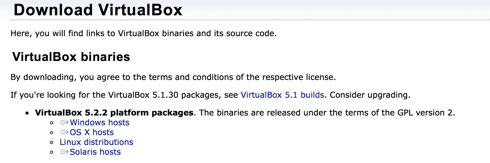
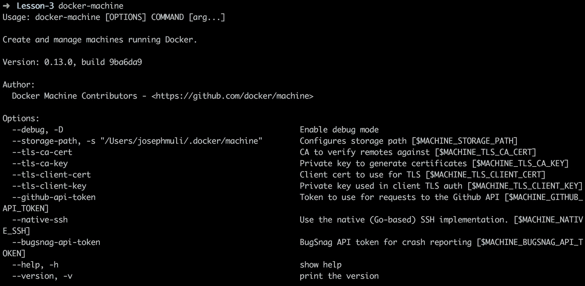
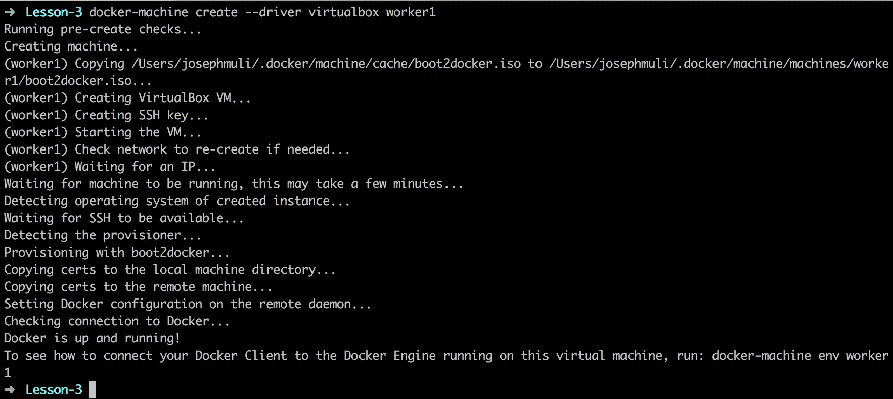
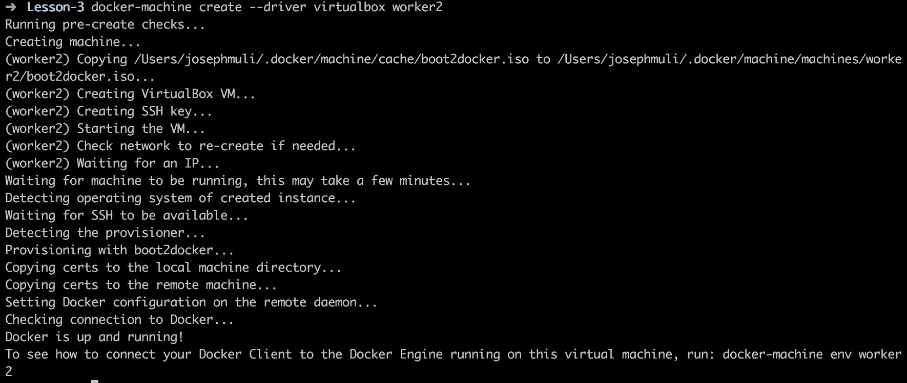
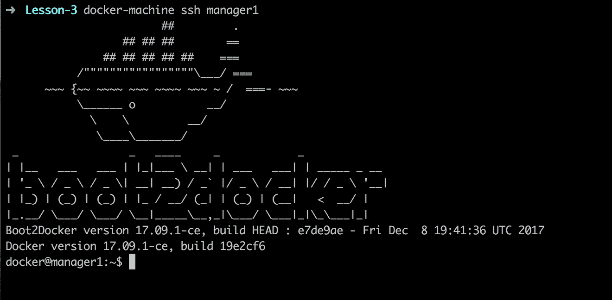
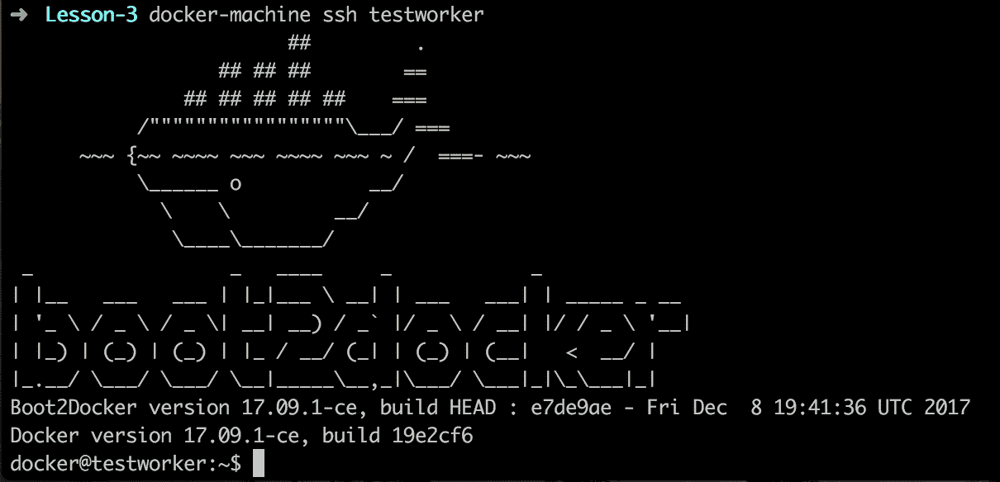

# 第三章。编排和交付

创建 Docker 主机集群的主要动机是为了实现高可用性。大多数，如果不是全部的集群和编排工具，如 Docker Swarm 和 Kubernetes，都利用集群创建主从关系。这确保了在环境中任何一个节点出现故障时，总是有一个节点可以借助。在向云提供商部署集群时，您可以利用一些技术来确保您的环境是高可用的，例如 Consul，并利用云的本地容错设计，通过在不同的可用性区域部署主节点和节点。

# 课程目标

到本课程结束时，您将能够：

+   获取 Docker Swarm 模式的概述

+   使用 Docker 引擎创建一组 Docker 引擎

+   在一组中管理服务和应用程序

+   扩展服务以处理应用程序的更多请求

+   负载均衡 Docker Swarm 部署

+   安全地管理 Docker 容器和部署

# 编排

在我们的本地环境中运行容器很容易，不需要我们付出很多努力；但是在云端，我们需要一种不同的思维方式和工具来帮助我们实现这一目标。我们的环境应该是高可用的、容错的和易于扩展的。协调资源和/或容器的过程，导致了一个整合的工作流程，这就是编排。

首先，让我们熟悉一些在编排时使用的术语：

+   `docker-engine`：这指的是我们当前在计算机上安装的 Docker 包或安装

+   `docker-machine`：一个帮助我们在虚拟主机上安装 Docker 的工具

+   `虚拟主机`：这些是在物理主机下运行的虚拟服务器

+   `docker-swarm`：Docker 的集群工具

+   `docker 主机`：已安装或设置了 Docker 的主机或服务器

+   `节点`：连接到群集的 Docker 主机

+   `集群`：一组 Docker 主机或节点

+   `副本`：一个实例的副本或多个副本

+   `任务`：在节点上运行的定义操作

+   `服务`：一组任务

### 注意

以下是整个课程中最常见的术语：

+   `docker-engine`：在我们的计算机上运行 Docker；

+   `docker-machine`：一个帮助我们安装 Docker 的工具或 CLI

+   `虚拟主机`：在物理主机上运行的主机或服务器。

+   `docker-swarm:`Docker 的集群工具

+   `Docker host`：运行 Docker 的任何服务器或主机

+   `Node`：这指的是绑定到 swarm 集群的任何主机。

+   `Cluster`：一组受管理和控制的主机。

+   `Replica`：其他正在运行的主机的副本，用于各种任务

+   任务：安装、升级或移除等操作。

+   `Service`：多个任务定义一个服务。

现在我们至少熟悉了上述术语，我们准备使用`docker-machine`实施 Docker Swarm 编排流程。

# Docker Swarm 概述

Docker Swarm 是 Docker 容器的**集群**工具。它允许您建立和管理一组 Docker **节点**作为一个单一的**虚拟系统**。这意味着我们可以在计算机上的多个主机上运行 Docker。

我们通过管理器来控制 swarm 集群，管理器主要**处理**和**控制**容器。通过 swarm 管理器，您可以创建一个主管理器实例和多个**副本**实例，以防主要实例失败。这意味着在 swarm 中可以有多个管理器！

### 注意

一个 swarm 是从一个管理节点创建的，其他 Docker 机器加入集群，可以作为工作节点或管理节点。

集群化很重要，因为它创建了一组合作系统，提供冗余，从而创建了一个容错环境。例如，如果一个或多个节点宕机，Docker Swarm 将故障转移到另一个正常工作的节点。

**Swarm manager** 执行以下角色：

+   接受`docker`命令

+   执行针对集群的命令

+   支持高可用性；部署主要和次要实例，可以在主要实例宕机时接管

Docker Swarm 使用**调度**来优化资源并确保环境的效率。它将**分配容器**给最合适的**节点**。这意味着 Docker Swarm 将容器分配给最健康的节点。

### 注意

记住，节点是运行 Docker 的**主机**，而不是**容器**。

Swarm 可以配置为使用以下任一调度策略：

+   **Random**：将新的容器部署到随机节点。

+   **Spread**：Swarm 将新的容器部署到具有最少数量容器的节点。

+   **Binpack**：binpack 策略涉及将新的容器部署到具有最多容器的节点。

您可以在以下网址下载 VirtualBox：[`www.virtualbox.org/wiki/Downloads`](https://www.virtualbox.org/wiki/Downloads)：



### 注意

为了模拟一个 Docker Swarm 集群，我们需要在本地安装一个 hypervisor（hypervisor type 2 是一种安装在现有操作系统上的软件应用程序的虚拟机管理器），在这种情况下是 VirtualBox，它将允许我们通过`docker-machine`创建多个运行 Docker 的主机，并将它们添加到集群中。在部署到云供应商时，可以使用它们的计算服务来实现，例如 AWS 上的 EC2。

对于 Windows 操作系统，选择您的操作系统分发版，您应该立即获得下载。运行可执行文件并安装 VirtualBox。

# 使用 Docker Engine 创建一个 Swarm

在创建我们的集群之前，让我们快速概述一下`docker-machine cli`。在您的终端上键入`docker-machine`应该会给您这个输出：



就在下面，我们有我们的命令列表：


### 注意

请记住，当您需要澄清某些事情时，始终使用`help`选项，即`docker-machine stop --help`

要创建我们的第一个 Docker Swarm 集群，我们将使用`docker-machine`首先创建我们的管理器和工作节点。

在创建第一台机器之前，快速概述我们的目标给出了以下内容：我们将拥有四台 docker-machines，一个管理器和三个工作节点；它们都在 VirtualBox 上运行，因此有四个虚拟机。

## 创建 Docker 机器

此命令用于创建一个新的虚拟 Docker 主机：

```
docker-machine create --driver <driver> <machine_name>

```

这意味着我们的 Docker 主机将在 VirtualBox 上运行，但由`docker-machine`进行管理和控制。`--driver`选项指定要使用的驱动程序来创建机器。在这种情况下，我们的驱动程序是 VirtualBox。

我们的命令将是`docker-machine create --driver virtualbox manager1`。

### 注意

我们在命令中需要指定驱动程序，因为这是我们主机的基础，这意味着我们的`manager1`机器将在 VirtualBox 上作为虚拟主机运行。有多个供应商提供的多个驱动程序可用，但这是用于演示目的的最佳驱动程序。


## 创建机器清单

此命令将提供当前主机上所有 Docker 机器的列表以及有关机器的状态、驱动程序等的更多信息：`docker-machine ls`


### 注意

列出我们的机器非常重要，因为它给我们提供了机器状态的更新。我们并不真正会收到错误通知，有时错误可能会积累成为一个重大事件。在对机器进行一些工作之前，这将给出一个简要的概述。可以通过`docker-machine status`命令运行更详细的检查。

## 工作机器创建

我们将按照相同的流程为我们的 swarm 集群创建三个工作机器，换句话说，连续三次运行`docker-machine create --driver virtualbox <machine_name>`，在每次运行时将`worker1, worker2`和`worker3`作为`<machine_name>`的值传递：



最后，最后一个工作节点将显示如下：


这样做后，运行`docker-machine ls`，如果创建成功，您将看到类似以下的输出：


### 注意

根据它们的用途命名机器有助于避免意外地呼叫错误的主机。

## 初始化我们的 Swarm

现在我们的机器正在运行，是时候创建我们的 swarm 了。这将通过管理节点`manager1`完成。以下是我们将采取的步骤，以实现一个完整的 swarm：

1.  连接到管理节点。

1.  声明`manager1`节点为管理者并宣布其地址。

1.  获取节点加入 swarm 的邀请地址。

我们将使用`ssh`进行连接。`ssh`是一种安全的网络协议，用于访问或连接主机或服务器。

### 注意

Docker 机器通过`docker-machine cli`进行控制。Docker Swarm 作为一个服务运行，将所有 Docker 机器绑定在一个管理机器或节点下。这并不意味着 swarm 集群中的机器是相等或相似的，它们可能在运行不同的服务或操作，例如，数据库主机和 Web 服务器。Docker Swarm 帮助编排主机。

此命令用于获取一个或多个 Docker 机器的 IP 地址：

```
docker-machine ip <machine_names>

```

此命令用于获取一个或多个 Docker 机器的 IP 地址。`<machine_name>`是我们需要 IP 地址的机器的名称。在我们的情况下，我们将用它来获取`manager1`节点的 IP 地址，因为在初始化 swarm 模式时我们将需要它：


## 连接到一个机器

此命令用于使用`SSH`登录到机器：

```
docker-machine ssh <machine_name>

```

成功连接到我们的`manager1`后，我们应该得到以下输出：



### 注意

在云供应商上使用`ssh 协议`将需要通过用户名和密码或`ssh 密钥`进行身份验证和/或授权。我们不会深入讨论这个问题，因为这只是一个演示。

## 初始化 Swarm 模式

以下是初始化 Swarm 模式的命令：

```
docker swarm init --advertise-addr <MANAGER_IP>

```

让我们在管理节点内运行此命令以初始化 Swarm。`advertise-addr`选项用于指定将向集群的其他成员广告的地址，以进行 API 访问和网络。

在这种情况下，它的值是`管理者 IP 地址`，其值是我们之前运行`docker-machine ip manager1`得到的：

### 注意

我们之前提到过，Docker Swarm 是通过管理节点将所有机器绑定和编排的服务。为了实现这一点，Docker Swarm 让我们通过管理者的地址来广告集群，包括在`docker swarm init`命令中包含`advertise-addr`。


运行该命令的输出显示我们的节点现在是一个管理者！

请注意，我们还有两个命令：一个应该允许我们邀请其他节点加入集群，另一个是将另一个管理者添加到集群中。

### 注意

在设计高可用性时，建议有多个管理者节点，以便在主管理者节点发生故障时接管。

### 注意

确保您保存输出中列出的两个命令，它们将有助于添加其他主机到集群中。

## 将工作节点添加到我们的 Swarm

此命令用于添加 Swarm 工作节点`：`

```
docker swarm join --token <provided_token> <manager_ip>:<port>

```

在我们可以将工作节点添加到集群之前，我们需要通过`ssh`连接到它们。

我们通过运行`docker-machine ssh <node_name>`，然后运行我们从`manager1 节点`得到的邀请命令来实现这一点。

### 注意

`docker-machine`命令可以从任何目录运行，并且始终与创建的机器一起工作。

首先，我们将使用`exit`命令退出管理节点：


然后，我们通过`ssh`连接到一个工作节点：



最后，我们将节点添加到集群中：


## 查看集群状态

我们使用此命令来查看我们集群的状态：

```
docker node ls
```

我们使用这个命令来查看我们集群的状态。这个命令在管理节点上运行，并显示我们集群中所有节点的状态和可用性。在我们的管理节点上运行这个命令会显示类似以下的输出：


## 活动 1 — 添加节点到集群

确保您有一个管理节点和节点邀请命令。

让您熟悉 `ssh` 和集群管理。

您被要求连接至少两个节点并将它们添加到集群中。

1.  `ssh` 进入您的第一个节点：

1.  在节点上运行邀请命令加入集群。记住，我们在第一次初始化管理节点时得到了这个命令：

1.  退出节点，`ssh` 进入另一个节点，并运行命令：

1.  `ssh` 进入管理节点，通过 `docker node ls` 检查集群状态：

# 在 Swarm 中管理服务和应用程序

现在我们的集群已经准备好了，是时候在我们的集群上安排一些服务了。如前所述，管理节点的角色是接受 Docker 命令并将其应用于集群。因此，我们将在管理节点上创建服务。

### 注意

在这一点上，worker 节点上真的没有太多可以做的，因为它们完全受管理节点控制。

## 创建服务

此命令用于创建服务：

```
docker service create --replicas <count> -p <host_port>:<container_port> --name <service_name> <image_name>

```

我们在管理节点上运行这个命令，正如前面所提到的。我们将使用我们在上一课中构建的 WordPress 示例。由于我们已经在本地拥有这个镜像，所以不需要从 hub 上拉取它。

我们的副本数量将是三，因为我们目前有三个工作节点；通过运行 `docker node ls` 确认您的节点编号。

### 注意

我们不创建副本数量；这引入了以下主题。`-p <host_port>:<container_port>` 将容器映射到我们计算机上定义的端口，与容器端口相对应。我们不需要与我们的节点编号相同数量的副本。其他节点可以处理不同的应用程序层，例如数据库：


我们创建了一个基于 WordPress 镜像的 web，并将主机端口 `80` 映射到容器端口 `80`。

## 服务列表

此命令用于查看当前正在运行的服务：

```
docker service ls
```

此命令用于查看当前正在运行的服务以及更多信息，例如副本、镜像、端口等。

从以下输出中，我们可以看到我们刚刚启动的服务和相关信息：


## 服务状态

此命令用于了解我们的服务是否运行正常：

```
docker service ps <service_name>
```

查看服务列表不会为我们提供所有所需的信息，比如我们的服务部署在哪些节点上。但是，我们可以知道我们的服务是否运行正常以及遇到的错误（如果有）。当我们在管理节点上运行此命令时，我们会得到以下输出：


### 注意

查看状态非常重要。在我们对节点进行升级或更新的情况下，运行`docker ps`会通知我们节点的状态。在理想的 Docker Swarm 设置中，当一个节点宕机时，管理节点会重新分配流量到可用节点，因此很难注意到停机时间，除非有监控可用。在处理节点之前，始终运行此命令以检查节点的状态。

## 我们如何知道我们的网站正在运行？

我们可以通过在浏览器上打开任何工作节点的 IP 地址来验证 WordPress 是否正在运行：


这是 WordPress 在我们的浏览器上的外观截图：


### 注意

打开任何运行 WordPress Web 服务的 IP 地址，包括管理节点，都会打开相同的地址。

## 活动 2 — 在集群上运行服务

确保您有一个管理节点正在运行。

让您熟悉集群中的服务管理。

已要求您向集群添加一个新的`postgres`服务。

1.  创建一个新节点并将其命名为`dbworker`：

```
docker-machine create --driver virtualbox dbworker
```


1.  将新的工作节点添加到集群中：

1.  创建一个新的数据库服务，并将其命名为`db`，使用 postgres 镜像作为基础：

```
docker service create --replicas 1 --name db postgres
```

以下是输出的截图：


1.  通过以下步骤验证`postgres`是否正在运行：

1.  将运行在`dbworker 节点`中的`postgres`容器映射到您的计算机上：

```
docker run --name db -e POSTGRES_PASSWORD=postgres -d -p 5432:5432 postgres

```


1.  运行`docker ps`以列出正在运行的容器；这应该有我们的`postgres`容器，状态应为`UP`：

1.  通过以下方式退出并停止容器：

# 扩展服务上下。

随着进入应用程序的请求数量增加或减少，将需要扩展基础架构。我们最近使用了运行相同 WordPress 安装的节点副本。

### 注意

这是一个生产级设置的非常基本的示例。理想情况下，我们需要更多的管理节点和副本，但由于我们正在运行演示，这将足够了。

扩展涉及根据应用程序的流量增加和减少资源。

## 扩展我们的数据库服务

我们将扩展我们的数据库服务，作为扩展服务的示例。在现实世界的场景中，云服务如 Google Cloud Platform 和 Amazon Web Services 可能定义了自动扩展服务，其中创建了一些副本，并通过称为**负载平衡**的服务在副本之间分发流量。我们将在下一个活动中深入探讨这一点。首先，我们要从基础知识开始了解扩展是如何工作的。扩展数据库的命令格式如下：

```
docker service scale <service_name>=<count>
```

要扩展服务，请传入我们创建服务时提供的服务名称以及要将其增加到的副本数。

### 注意

`--detach=false`允许我们查看复制进度。命令是`docker service scale <service_name>=<count>:`


从上面的输出中，我们可以看到我们的`db`服务已经被复制。我们现在在`dbworker`节点上运行了两个数据库服务。

## Swarm 如何知道在哪里安排服务？

我们之前介绍了调度模式；它们包括以下内容：

+   随机

+   Spread

+   Binpack

Docker Swarm 的默认调度策略是`spread`，它将新服务分配给资源**最少**的节点。

### 注意

如果在 swarm 上没有额外的未分配节点，则要扩展的服务将在当前运行的节点上复制。

swarm 管理器将使用 spread 策略并根据资源分配。

然后，我们可以使用`docker service ls`命令验证操作是否成功，我们可以看到副本的数量为两个：


缩减规模与扩大规模非常相似，只是我们传递的副本计数比以前少。从以下输出中，我们将规模缩减到一个副本，并验证副本计数为一个：


## Swarm 如何在副本之间平衡请求？

负载均衡器有助于处理和管理应用程序中的请求。在应用程序处理大量请求的情况下，可能在不到 5 分钟内就有 1000 个请求，我们需要在我们的应用程序上有多个副本和一个负载均衡器，特别是逻辑（后端）部分。负载均衡器有助于分发请求并防止实例过载，最终导致停机时间。

在像**Google Cloud Platform**或**Amazon Web Services**这样的云平台上部署到生产环境时，您可以利用外部负载均衡器将请求路由到您的 Swarm 主机。

Docker Swarm 包括一个内置的路由服务，使得群集中的每个节点都能接受对已发布端口的传入连接，即使节点上没有运行服务。`postgres`服务默认使用端口`5432`。

## 活动 3 —— 在 Swarm 上扩展服务

确保您至少有一个管理节点、两个服务和三个工作节点的群集。

让您熟悉扩展服务和复制节点。

要求将网络服务扩展到四个副本，数据库服务扩展到两个副本。

1.  创建三个新的工作节点，两个用于网络服务，一个用于数据库服务。

1.  连接到管理节点并扩展网络和数据库服务。

1.  使用 docker service ls 确认服务副本计数；最终结果应该如下：

+   WordPress 网络服务应该有两个副本计数

+   Postgres 数据库服务应该有四个副本计数

# 总结

在本课程中，我们已经完成了以下工作：

+   讨论了编排，并提到了一些示例工具

+   讨论了集群化以及为什么它在生产级设置中很重要

+   通过在 VirtualBox 上运行 Docker Machines 学习了虚拟主机

+   通过 Docker Swarm 以及如何创建和管理节点集群来了解

+   介绍了包括在我们的群集上运行的 Wordpress 在内的示例服务

+   对使用`docker-machine cli`进行工作有了高层次的理解

+   讨论了负载均衡以及 Docker Swarm 如何管理这一点

恭喜你到达终点！以下是我们通过课程获得的知识的总结。

在这本书中，我们涵盖了以下内容：

+   讨论了 DevOps 以及 Docker 如何促进工作流程

+   了解了如何在 Dockerfiles 上为应用程序创建模板

+   构建镜像和容器并将它们推送到 Docker Hub

+   通过`docker-compose`管理容器

+   学会了如何通过 Docker Swarm 编排我们的应用程序
