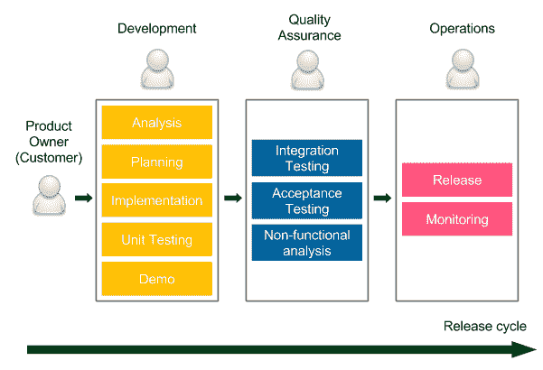
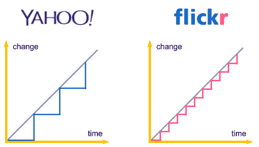
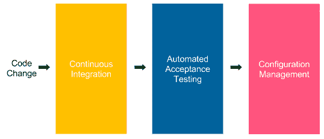
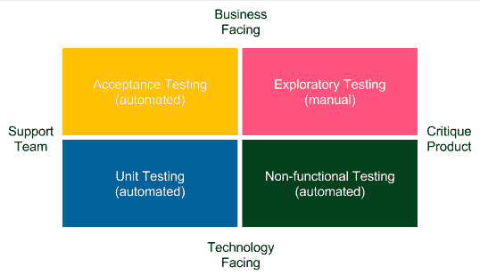
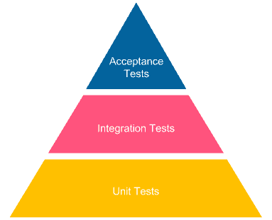
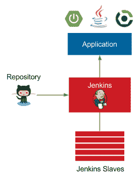

# 介绍持续交付

大多数开发人员面临的常见问题是如何快速而安全地发布已实施的代码。然而，传统上使用的交付流程是一个陷阱的来源，通常会导致开发人员和客户的失望。本章介绍了持续交付方法的概念，并为本书的其余部分提供了背景。

本章涵盖以下要点：

+   介绍传统的交付流程及其缺点

+   描述持续交付的概念及其带来的好处

+   比较不同公司如何交付其软件

+   解释自动化部署流水线及其阶段

+   对不同类型的测试及其在流程中的位置进行分类

+   指出成功的持续交付流程的先决条件

+   介绍本书中将使用的工具

+   展示本书中将构建的完整系统

# 什么是持续交付？

持续交付的最准确定义由 Jez Humble 提出，如下所述：“持续交付是能够以可持续的方式将各种类型的变更，包括新功能、配置变更、错误修复和实验，安全快速地投入生产或交付给用户的能力。”该定义涵盖了关键点。

为了更好地理解，让我们想象一个场景。你负责产品，比如说电子邮件客户端应用程序。用户向你提出一个新的需求——他们希望按大小对邮件进行排序。你决定开发需要大约一周的时间。用户可以在什么时候期待使用这个功能呢？通常，在开发完成后，你首先将已完成的功能交给质量保证团队，然后再交给运维团队，这需要额外的时间，从几天到几个月不等。因此，即使开发只花了一周的时间，用户也要在几个月后才能收到！持续交付方法通过自动化手动任务来解决这个问题，使用户能够在实施新功能后尽快收到。

为了更好地展示要自动化的内容和方式，让我们从描述目前大多数软件系统使用的交付流程开始。

# 传统的交付流程

传统的交付流程，顾名思义，已经存在多年，并在大多数 IT 公司中实施。让我们定义一下它的工作原理，并评论其缺点。

# 介绍传统交付过程

任何交付过程都始于客户定义的需求，并以在生产环境上发布结束。差异在于中间。传统上，它看起来如下发布周期图表所示：

发布周期始于**产品负责人**提供的需求，他代表**客户**（利益相关者）。然后有三个阶段，在这些阶段中，工作在不同的团队之间传递：

+   **开发**：在这里，开发人员（有时与业务分析师一起）致力于产品。他们经常使用敏捷技术（Scrum 或 Kanban）来提高开发速度并改善与客户的沟通。演示会议被组织起来以获得客户的快速反馈。所有良好的开发技术（如测试驱动开发或极限编程实践）都受到欢迎。实施完成后，代码传递给质量保证团队。

+   **质量保证**：这个阶段通常被称为**用户验收测试**（**UAT**），它需要对主干代码库进行代码冻结，以防止新的开发破坏测试。质量保证团队执行一系列**集成测试**，**验收测试**和**非功能测试**（性能，恢复，安全等）。检测到的任何错误都会返回给开发团队，因此开发人员通常也有很多工作要做。完成 UAT 阶段后，质量保证团队批准了下一个发布计划的功能。

+   **运营**：最后一个阶段，通常是最短的一个阶段，意味着将代码传递给**运营**团队，以便他们可以执行发布并监控生产。如果出现任何问题，他们会联系开发人员帮助处理生产系统。

发布周期的长度取决于系统和组织，但通常范围从一周到几个月不等。我听说过最长的是一年。我工作过的最长周期是季度为基础，每个部分的时间分配如下：开发-1.5 个月，UAT-1 个月和 3 周，发布（严格的生产监控）-1 周。

传统交付过程在 IT 行业广泛使用，这可能不是你第一次读到这样的方法。尽管如此，它有许多缺点。让我们明确地看一下它们，以了解为什么我们需要努力追求更好的东西。

# 传统交付过程的缺点

传统交付过程的最显著缺点包括以下内容：

+   **交付速度慢**：在这里，客户在需求规定之后很长时间才收到产品。这导致了不满意的上市时间和客户反馈的延迟。

+   **长反馈周期**：反馈周期不仅与客户有关，还与开发人员有关。想象一下，你意外地创建了一个错误，而你在 UAT 阶段才得知。修复你两个月前工作的东西需要多长时间？即使是小错误也可能需要几周的时间。

+   **缺乏自动化**：稀少的发布不鼓励自动化，这导致了不可预测的发布。

+   **风险的紧急修复**：紧急修复通常不能等待完整的 UAT 阶段，因此它们往往会以不同的方式进行测试（UAT 阶段缩短）或者根本不进行测试。

+   **压力**：不可预测的发布对运营团队来说是有压力的。而且，发布周期通常安排得很紧，这给开发人员和测试人员增加了额外的压力。

+   **沟通不畅**：工作从一个团队传递到另一个团队代表了瀑布式方法，人们开始只关心自己的部分，而不是整个产品。如果出了什么问题，通常会导致责备游戏，而不是合作。

+   **共同责任**：没有团队从头到尾对产品负责。对于开发人员来说，“完成”意味着需求已经实现。对于测试人员来说，“完成”意味着代码已经测试过。对于运营人员来说，“完成”意味着代码已经发布。

+   **工作满意度降低**：每个阶段对不同的团队来说都很有趣，但其他团队需要支持这个过程。例如，开发阶段对开发人员来说很有趣，但在另外两个阶段，他们仍然需要修复错误并支持发布，这通常对他们来说一点都不有趣。

这些缺点只是传统交付过程相关挑战的冰山一角。你可能已经感觉到一定有更好的方法来开发软件，而这种更好的方法显然就是持续交付的方法。

# 持续交付的好处

“你的组织需要多长时间来部署只涉及一行代码的更改？你是否能够重复、可靠地做到这一点？”这些是 Mary 和 Tom Poppendieck（《实施精益软件开发》的作者）的著名问题，被 Jez Humble 和其他作者多次引用。实际上，对这些问题的回答是衡量交付流程健康的唯一有效标准。

为了能够持续交付，而不需要花费大量资金雇佣 24/7 工作的运维团队，我们需要自动化。简而言之，持续交付就是将传统交付流程的每个阶段转变为一系列脚本，称为自动化部署管道或持续交付管道。然后，如果不需要手动步骤，我们可以在每次代码更改后运行流程，因此持续向用户交付产品。

持续交付让我们摆脱了繁琐的发布周期，因此带来了以下好处：

+   **快速交付**：市场推出时间大大缩短，因为客户可以在开发完成后立即使用产品。请记住，软件在用户手中之前不会产生收入。

+   **快速反馈循环**：想象一下，你在代码中创建了一个 bug，当天就进入了生产环境。修复当天工作的东西需要多长时间？可能不多。这与快速回滚策略一起，是保持生产稳定的最佳方式。

+   **低风险发布**：如果每天发布，那么流程变得可重复，因此更安全。俗话说，“如果疼，就多做几次。”

+   **灵活的发布选项**：如果需要立即发布，一切都已准备就绪，因此发布决策不会带来额外的时间/成本。

不用说，我们可以通过消除所有交付阶段并直接在生产环境上进行开发来实现所有好处。然而，这会导致质量下降。实际上，引入持续交付的整个困难在于担心质量会随着消除手动步骤而下降。在本书中，我们将展示如何以安全的方式处理这个问题，并解释为什么与常见观念相反，持续交付的产品 bug 更少，更适应客户的需求。

# 成功案例

我最喜欢的持续交付故事是 Rolf Russell 在其中一次演讲中讲述的。故事如下。2005 年，雅虎收购了 Flickr，这是开发者世界中两种文化的冲突。当时的 Flickr 是一家以初创公司方法为主的公司。相反，雅虎是一家拥有严格规定和安全至上态度的大型公司。他们的发布流程有很大不同。雅虎使用传统的交付流程，而 Flickr 每天发布多次。开发人员实施的每个更改都在当天上线。他们甚至在页面底部有一个页脚，显示最后一次发布的时间以及进行更改的开发人员的头像。

雅虎很少部署，每次发布都带来了很多经过充分测试和准备的更改。Flickr 以非常小的块工作，每个功能都被分成小的增量部分，并且每个部分都快速部署到生产环境。差异如下图所示：

你可以想象当两家公司的开发人员相遇时会发生什么。雅虎显然把 Flickr 的同事当作不负责任的初级开发人员，“一群不知道自己在做什么的软件牛仔。”因此，他们想要改变的第一件事是将 QA 团队和 UAT 阶段加入 Flickr 的交付流程。然而，在应用更改之前，Flickr 的开发人员只有一个愿望。他们要求评估整个雅虎公司中最可靠的产品。当发生这种情况时，令人惊讶的是，雅虎所有软件中，Flickr 的停机时间最短。雅虎团队起初不理解，但还是让 Flickr 保持他们当前的流程。毕竟，他们是工程师，所以评估结果是确凿的。只是过了一段时间，他们意识到持续交付流程对雅虎的所有产品都有益处，他们开始逐渐在所有地方引入它。

故事中最重要的问题是-Flickr 如何成为最可靠的系统？实际上，这个事实的原因已经在前面的部分提到过。如果一个发布是少量风险的话：

+   代码更改的增量很小

+   这个过程是可重复的。

这就是为什么，即使发布本身是一项困难的活动，但频繁进行发布时要安全得多。

雅虎和 Flickr 的故事只是许多成功公司的一个例子，对于这些公司来说，持续交付流程被证明是正确的。其中一些甚至自豪地分享了他们系统的细节，如下：

+   **亚马逊**：2011 年，他们宣布在部署之间平均达到 11.6 秒

+   **Facebook**：2013 年，他们宣布每天部署代码更改两次

+   **HubSpot**：2013 年，他们宣布每天部署 300 次

+   **Atlassian**：2016 年，他们发布了一项调查，称他们 65%的客户实践持续交付

您可以在[`continuousdelivery.com/evidence-case-studies/`](https://continuousdelivery.com/evidence-case-studies/)阅读有关持续交付流程和个案研究的更多研究。

请记住，统计数据每天都在变得更好。然而，即使没有任何数字，想象一下每行代码您实现都安全地进入生产的世界。客户可以迅速做出反应并调整他们的需求，开发人员很高兴，因为他们不必解决那么多的错误，经理们很满意，因为他们总是知道当前的工作状态。毕竟，记住，唯一真正的进展度量是发布的软件。

# 自动化部署流水线

我们已经知道持续交付流程是什么，以及为什么我们使用它。在这一部分，我们将描述如何实施它。

让我们首先强调传统交付流程中的每个阶段都很重要。否则，它根本不会被创建。没有人想在没有测试的情况下交付软件！UAT 阶段的作用是检测错误，并确保开发人员创建的内容是客户想要的。运维团队也是如此——软件必须配置、部署到生产环境并进行监控。这是毋庸置疑的。那么，我们如何自动化这个过程，以便保留所有阶段？这就是自动化部署流水线的作用，它由以下图表中呈现的三个阶段组成：

自动化部署流水线是一系列脚本，每次提交到存储库的代码更改后都会执行。如果流程成功，最终会部署到生产环境。

每个步骤对应传统交付流程中的一个阶段，如下所示：

+   持续集成：这个阶段检查不同开发人员编写的代码是否能够整合在一起

+   自动验收测试：这取代了手动的 QA 阶段，并检查开发人员实现的功能是否符合客户的要求

+   配置管理：这取代了手动操作阶段-配置环境并部署软件。

让我们深入了解每个阶段的责任和包括哪些步骤。

# 持续集成

持续集成阶段为开发人员提供了第一次反馈。它从代码库检出代码，编译代码，运行单元测试，并验证代码质量。如果任何步骤失败，管道执行将停止，开发人员应该做的第一件事是修复持续集成构建。这个阶段的关键是时间；它必须及时执行。例如，如果这个阶段需要一个小时才能完成，那么开发人员会更快地提交代码，这将导致持续失败的管道。

持续集成管道通常是起点。设置它很简单，因为一切都在开发团队内部完成，不需要与 QA 和运维团队达成协议。

# 自动验收测试

自动验收测试阶段是与客户（和 QA）一起编写的一套测试，旨在取代手动的 UAT 阶段。它作为一个质量门，决定产品是否准备发布。如果任何验收测试失败，那么管道执行将停止，不会运行进一步的步骤。它阻止了进入配置管理阶段，因此也阻止了发布。

自动化验收阶段的整个理念是将质量构建到产品中，而不是在后期进行验证。换句话说，当开发人员完成实现时，软件已经与验收测试一起交付，这些测试验证了软件是否符合客户的要求。这是对测试软件思维的一个重大转变。不再有一个人（或团队）批准发布，一切都取决于通过验收测试套件。这就是为什么创建这个阶段通常是持续交付过程中最困难的部分。它需要与客户的密切合作，并在过程的开始（而不是结束）创建测试。

在遗留系统的情况下，引入自动化验收测试尤其具有挑战性。我们在第九章 *高级持续交付*中对这个主题进行了更详细的描述。

关于测试类型及其在持续交付过程中的位置通常存在很多混淆。也经常不清楚如何自动化每种类型，应该有多少覆盖范围，以及 QA 团队在整个开发过程中应该扮演什么角色。让我们使用敏捷测试矩阵和测试金字塔来澄清这一点。

# 敏捷测试矩阵

Brian Marick 在他的一系列博客文章中，以所谓的敏捷测试矩阵的形式对软件测试进行了分类。它将测试放置在两个维度上：业务或技术面向和支持程序员或批评产品。让我们来看看这个分类：

让我们简要评论一下每种类型的测试：

+   **验收测试（自动化）**：这些测试代表了从业务角度看到的功能需求。它们以故事或示例的形式由客户和开发人员编写，以达成关于软件应该如何工作的一致意见。

+   **单元测试（自动化）**：这些测试帮助开发人员提供高质量的软件并最小化错误数量。

+   **探索性测试（手动）**：这是手动的黑盒测试，试图破坏或改进系统。

+   **非功能性测试（自动化）**：这些测试代表了与性能、可扩展性、安全性等相关的系统属性。

这个分类回答了持续交付过程中最重要的问题之一：QA 在过程中的角色是什么？

手动 QA 执行探索性测试，因此他们与系统一起玩耍，试图破坏它，提出问题，思考改进。自动化 QA 帮助进行非功能性和验收测试，例如，他们编写代码来支持负载测试。总的来说，QA 在交付过程中并没有他们特别的位置，而是在开发团队中扮演着一个角色。

在自动化的持续交付过程中，不再有执行重复任务的手动 QA 的位置。

你可能会看到分类，想知道为什么你在那里看不到集成测试。Brian Marick 在哪里，以及将它们放在持续交付管道的哪里？

为了解释清楚，我们首先需要提到，集成测试的含义取决于上下文。对于（微）服务架构，它们通常意味着与验收测试完全相同，因为服务很小，不需要除单元测试和验收测试之外的其他测试。如果构建了模块化应用程序，那么通过集成测试，我们通常指的是绑定多个模块（但不是整个应用程序）并一起测试它们的组件测试。在这种情况下，集成测试位于验收测试和单元测试之间。它们的编写方式与验收测试类似，但通常更加技术化，并且需要模拟不仅是外部服务，还有内部模块。集成测试与单元测试类似，代表了“代码”视角，而验收测试代表了“用户”视角。关于持续交付流水线，集成测试只是作为流程中的一个单独阶段实施。

# 测试金字塔

前一节解释了过程中每种测试类型代表的含义，但没有提到我们应该开发多少测试。那么，在单元测试的情况下，代码覆盖率应该是多少呢？验收测试呢？

为了回答这些问题，迈克·科恩在他的书《敏捷成功：使用 Scrum 进行软件开发》中创建了所谓的测试金字塔。让我们看一下图表，以便更好地理解它。

当我们向金字塔顶部移动时，测试变得更慢，创建起来更昂贵。它们通常需要触及用户界面，并雇佣一个单独的测试自动化团队。这就是为什么验收测试不应该以 100%的覆盖率为目标。相反，它们应该以特性为导向，仅验证选定的测试场景。否则，我们将在测试开发和维护上花费巨资，我们的持续交付流水线构建将需要很长时间来执行。

在金字塔底部情况就不同了。单元测试便宜且快速，因此我们应该努力实现 100%的代码覆盖率。它们由开发人员编写，并且为他们提供应该是任何成熟团队的标准程序。

我希望敏捷测试矩阵和测试金字塔澄清了验收测试的角色和重要性。

让我们转向持续交付流程的最后阶段，配置管理。

# 配置管理

配置管理阶段负责跟踪和控制软件及其环境中的变化。它涉及准备和安装必要的工具，扩展服务实例的数量和分布，基础设施清单，以及与应用部署相关的所有任务。

配置管理是解决手动在生产环境部署和配置应用程序带来的问题的解决方案。这种常见做法导致一个问题，即我们不再知道每个服务在哪里运行以及具有什么属性。配置管理工具（如 Ansible、Chef 或 Puppet）能够在版本控制系统中存储配置文件，并跟踪在生产服务器上所做的每一次更改。

3. 取代运维团队手动任务的额外努力是负责应用程序监控。通常通过将运行系统的日志和指标流式传输到一个共同的仪表板来完成，该仪表板由开发人员（或者在下一节中解释的 DevOps 团队）监控。

# 7. 持续交付的先决条件

本书的其余部分致力于如何实施成功的持续交付流水线的技术细节。然而，该过程的成功不仅取决于本书中介绍的工具。在本节中，我们全面审视整个过程，并定义了三个领域的持续交付要求：

+   1. 组织结构及其对开发过程的影响

+   4. 产品及其技术细节

+   6. 开发团队及其使用的实践

# 2. 组织先决条件

组织的工作方式对引入持续交付流程的成功有很大影响。这有点类似于引入 Scrum。许多组织希望使用敏捷流程，但他们不改变他们的文化。除非组织结构进行了调整，否则你无法在开发团队中使用 Scrum。例如，你需要一个产品负责人、利益相关者和理解在冲刺期间不可能进行任何需求更改的管理层。否则，即使有良好的意愿，你也无法成功。持续交付流程也是如此；它需要调整组织结构。让我们来看看三个方面：DevOps 文化、流程中的客户和业务决策。

# 5. DevOps 文化

很久以前，当软件是由个人或微型团队编写时，开发、质量保证和运营之间没有明确的分离。一个人开发代码，测试它，然后将其投入生产。如果出了问题，同一个人调查问题，修复它，然后重新部署到生产环境。现在组织开发的方式逐渐改变，当系统变得更大，开发团队增长时。然后，工程师开始专门从事某个领域。这是完全有道理的，因为专业化会导致生产力的提升。然而，副作用是沟通开销。特别是如果开发人员、质量保证和运营在组织中处于不同的部门，坐在不同的建筑物中，或者外包到不同的国家。这种组织结构对持续交付流程不利。我们需要更好的东西，我们需要适应所谓的 DevOps 文化。

在某种意义上，DevOps 文化意味着回归到根本。一个人或一个团队负责所有三个领域，如下图所示：

！

能够转向 DevOps 模式而不损失生产力的原因是自动化。与质量保证和运营相关的大部分任务都被移至自动化交付流程，因此可以由开发团队管理。

DevOps 团队不一定只需要由开发人员组成。在许多正在转型的组织中，一个常见的情景是创建由四名开发人员、一个质量保证人员和一个运营人员组成的团队。然而，他们需要密切合作（坐在一起，一起开会，共同开发同一个产品）。

小型 DevOps 团队的文化影响软件架构。功能需求必须被很好地分离成（微）服务或模块，以便每个团队可以独立处理一个部分。

组织结构对软件架构的影响已经在 1967 年观察到，并被规定为康威定律：“任何设计系统（广义定义）的组织都将产生一个结构与组织沟通结构相同的设计。”

# 客户端在流程中

在持续交付采用过程中，客户（或产品负责人）的角色略有变化。传统上，客户参与定义需求，回答开发人员的问题，参加演示，并参与用户验收测试阶段，以确定构建的是否符合他们的意图。

在持续交付中，没有用户验收测试，客户在编写验收测试的过程中至关重要。对于一些已经以可测试的方式编写需求的客户来说，这并不是一个很大的转变。对于其他人来说，这意味着改变思维方式，使需求更加技术导向。

在敏捷环境中，一些团队甚至不接受没有验收测试的用户故事（需求）。即使这些技术可能听起来太严格，但通常会导致更好的开发生产力。

# 业务决策

在大多数公司中，业务对发布计划有影响。毕竟，决定交付哪些功能以及何时交付与公司的不同部门（例如营销）相关，并且对企业具有战略意义。这就是为什么发布计划必须在业务和开发团队之间重新审视和讨论。

显然，有一些技术，如功能切换或手动流水线步骤，有助于在指定时间发布功能。我们将在书中稍后描述它们。准确地说，持续交付这个术语并不等同于持续部署。前者意味着每次提交到存储库都会自动发布到生产环境。持续交付要求较少严格，意味着每次提交都会产生一个发布候选版本，因此允许最后一步（发布到生产环境）是手动的。

在本书的其余部分，我们将互换使用持续交付和持续部署这两个术语。

# 技术和开发先决条件

从技术方面来看，有一些要求需要牢记。我们将在整本书中讨论它们，所以在这里只是简单提一下而不详细讨论：

+   **自动构建、测试、打包和部署操作**：所有操作都需要能够自动化。如果我们处理的系统无法自动化，例如由于安全原因或其复杂性，那么就不可能创建完全自动化的交付流程。

+   **快速流水线执行**：流水线必须及时执行，最好在 5-15 分钟内。如果我们的流水线执行需要几个小时或几天，那么就不可能在每次提交到仓库后运行它。

+   **快速故障恢复**：快速回滚或系统恢复的可能性是必须的。否则，由于频繁发布，我们会冒着生产健康的风险。

+   **零停机部署**：部署不能有任何停机时间，因为我们每天发布多次。

+   **基于主干的开发**：开发人员必须定期签入主分支。否则，如果每个人都在自己的分支上开发，集成很少，因此发布也很少，这恰恰与我们想要实现的相反。

我们将在整本书中更多地讨论这些先决条件以及如何解决它们。记住这一点，让我们转到本章的最后一节，介绍我们计划在本书中构建的系统以及我们将用于此目的的工具。

# 构建持续交付过程

我们介绍了持续交付过程的理念、好处和先决条件。在本节中，我们描述了将在整本书中使用的工具及其在完整系统中的位置。

如果你对持续交付过程的想法更感兴趣，那么可以看看杰兹·汉布尔和大卫·法利的一本优秀书籍，《持续交付：通过构建、测试和部署自动化实现可靠的软件发布》。

# 介绍工具

首先，具体的工具总是比理解其在流程中的作用更不重要。换句话说，任何工具都可以用另一个扮演相同角色的工具替换。例如，Jenkins 可以用 Atlassian Bamboo 替换，Chief 可以用 Ansible 替换。这就是为什么每一章都以为什么需要这样的工具以及它在整个流程中的作用的一般描述开始。然后，具体的工具会与其替代品进行比较描述。这种形式给了你选择适合你环境的正确工具的灵活性。

另一种方法可能是在思想层面上描述持续交付过程；然而，我坚信用代码提取的确切示例，读者可以自行运行，会更好地理解这个概念。

有两种阅读本书的方式。第一种是阅读和理解持续交付流程的概念。第二种是创建自己的环境，并在阅读时执行所有脚本，以理解细节。

让我们快速看一下本书中将使用的工具。然而，在本节中，这只是对每种技术的简要介绍，随着本书的进行，会呈现更多细节。

# Docker 生态系统

Docker 作为容器化运动的明确领导者，在近年来主导了软件行业。它允许将应用程序打包成与环境无关的镜像，因此将服务器视为资源的集群，而不是必须为每个应用程序配置的机器。Docker 是本书的明确选择，因为它完全适合（微）服务世界和持续交付流程。

随着 Docker 一起出现的还有其他技术，如下所示：

+   **Docker Hub**：这是 Docker 镜像的注册表

+   **Docker Compose**：这是一个定义多容器 Docker 应用程序的工具

+   **Docker Swarm**：这是一个集群和调度工具

# Jenkins

Jenkins 绝对是市场上最受欢迎的自动化服务器。它有助于创建持续集成和持续交付流水线，以及一般的任何其他自动化脚本序列。高度插件化，它有一个伟大的社区，不断通过新功能扩展它。更重要的是，它允许将流水线编写为代码，并支持分布式构建环境。

# Ansible

Ansible 是一个自动化工具，可帮助进行软件供应、配置管理和应用部署。它的趋势比任何其他配置管理引擎都要快，很快就可以超过它的两个主要竞争对手：Chef 和 Puppet。它使用无代理架构，并与 Docker 无缝集成。

# GitHub

GitHub 绝对是所有托管版本控制系统中的第一名。它提供了一个非常稳定的系统，一个出色的基于 Web 的用户界面，以及免费的公共存储库服务。话虽如此，任何源代码控制管理服务或工具都可以与持续交付一起使用，无论是在云端还是自托管，无论是基于 Git、SVN、Mercurial 还是其他任何工具。

# Java/Spring Boot/Gradle

多年来，Java 一直是最受欢迎的编程语言。这就是为什么在本书中大多数代码示例都使用 Java。与 Java 一起，大多数公司使用 Spring 框架进行开发，因此我们使用它来创建一个简单的 Web 服务，以解释一些概念。Gradle 用作构建工具。它仍然比 Maven 不那么受欢迎，但发展速度更快。与往常一样，任何编程语言、框架或构建工具都可以替换，持续交付流程将保持不变，所以如果您的技术栈不同，也不用担心。

# 其他工具

我们随意选择了 Cucumber 作为验收测试框架。其他类似的解决方案有 Fitnesse 和 JBehave。对于数据库迁移，我们使用 Flyway，但任何其他工具也可以，例如 Liquibase。

# 创建完整的持续交付系统

您可以从两个角度看待本书的组织方式。

第一个角度是基于自动部署流水线的步骤。每一章都让您更接近完整的持续交付流程。如果您看一下章节的名称，其中一些甚至命名为流水线阶段的名称：

+   持续集成流水线

+   自动验收测试

+   使用 Ansible 进行配置管理

其余章节提供了介绍、总结或与流程相关的附加信息。

本书的内容还有第二个视角。每一章描述了环境的一个部分，这个环境又为持续交付流程做好了充分的准备。换句话说，本书逐步展示了如何逐步构建一个完整系统的技术。为了帮助您了解我们计划在整本书中构建的系统，现在让我们来看看每一章中系统将如何发展。

如果您目前不理解概念和术语，不用担心。我们将在相应的章节中从零开始解释一切。

# 介绍 Docker

在第二章中，*介绍 Docker*，我们从系统的中心开始构建一个打包为 Docker 镜像的工作应用程序。本章的输出如下图所示：

一个 docker 化的应用程序（Web 服务）作为一个容器在**Docker 主机**上运行，并且可以像直接在主机上运行一样访问。这得益于端口转发（在 Docker 术语中称为端口发布）。

# 配置 Jenkins

在第三章中，*配置 Jenkins*，我们准备了 Jenkins 环境。多个代理（从）节点的支持使其能够处理大量并发负载。结果如下图所示：

**Jenkins**主节点接受构建请求，但执行是在一个**Jenkins 从节点**（代理）机器上启动的。这种方法提供了 Jenkins 环境的水平扩展。

# 持续集成流水线

在第四章中，*持续集成流水线*，我们展示了如何创建持续交付流水线的第一阶段，即提交阶段。本章的输出是下图所示的系统：

该应用程序是使用 Spring Boot 框架编写的简单的 Java Web 服务。Gradle 用作构建工具，GitHub 用作源代码仓库。对 GitHub 的每次提交都会自动触发 Jenkins 构建，该构建使用 Gradle 编译 Java 代码，运行单元测试，并执行其他检查（代码覆盖率，静态代码分析等）。Jenkins 构建完成后，会向开发人员发送通知。

在这一章之后，您将能够创建一个完整的持续集成流水线。

# 自动验收测试

在第五章中，*自动验收测试*，我们最终合并了书名中的两种技术：*Docker*和*Jenkins*。结果如下图所示：

图中的附加元素与自动验收测试阶段有关：

+   **Docker Registry**：在持续集成阶段之后，应用程序首先被打包成一个 JAR 文件，然后作为一个 Docker 镜像。然后将该镜像推送到**Docker Registry**，它充当了 docker 化应用程序的存储库。

+   **Docker 主机**：在执行验收测试套件之前，应用程序必须启动。Jenkins 触发一个**Docker 主机**机器从**Docker Registry**拉取 docker 化的应用程序并启动它。

+   **Docker Compose**：如果完整的应用程序由多个 Docker 容器组成（例如，两个 Web 服务：使用应用程序 2 的应用程序 1），那么**Docker Compose**有助于将它们一起运行。

+   **Cucumber**：应用程序在**Docker 主机**上启动后，Jenkins 运行了一套用**Cucumber**框架编写的验收测试。

# Ansible/持续交付流水线的配置管理

在接下来的两章中，即第六章，*使用 Ansible 进行配置管理*和第七章，*持续交付流水线*，我们完成了持续交付流水线。输出是下图所示的环境：

Ansible 负责环境，并使得同一应用程序可以部署到多台机器上。因此，我们将应用程序部署到暂存环境，运行验收测试套件，最后将应用程序发布到生产环境，通常是在多个实例上（在多个 Docker 主机上）。

# 使用 Docker Swarm 进行集群/高级持续交付

在第八章中，*使用 Docker Swarm 进行集群*，我们用机器集群替换了每个环境中的单个主机。第九章，*高级持续交付*，此外还将数据库添加到了持续交付流程中。本书中创建的最终环境如下图所示：

暂存和生产环境配备有 Docker Swarm 集群，因此应用程序的多个实例在集群上运行。我们不再需要考虑我们的应用程序部署在哪台精确的机器上。我们只关心它们的实例数量。Jenkins 从属也是在集群上运行。最后的改进是使用 Flyway 迁移自动管理数据库模式，这已经整合到交付流程中。

我希望你已经对我们在本书中计划构建的内容感到兴奋。我们将逐步进行，解释每一个细节和所有可能的选项，以帮助你理解程序和工具。阅读本书后，你将能够在你的项目中引入或改进持续交付流程。

# 摘要

在本章中，我们介绍了从想法开始的持续交付过程，讨论了先决条件，并介绍了本书其余部分使用的工具。本章的关键要点如下：

+   目前大多数公司使用的交付流程存在重大缺陷，可以通过现代自动化工具进行改进

+   持续交付方法提供了许多好处，其中最重要的是：快速交付、快速反馈周期和低风险发布

+   持续交付流水线包括三个阶段：持续集成、自动验收测试和配置管理

+   引入持续交付通常需要组织文化和结构的变革。

+   在持续交付的背景下，最重要的工具是 Docker、Jenkins 和 Ansible

在下一章中，我们将介绍 Docker，并介绍如何构建一个 Docker 化的应用程序。
