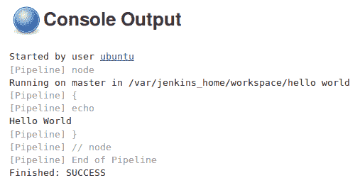
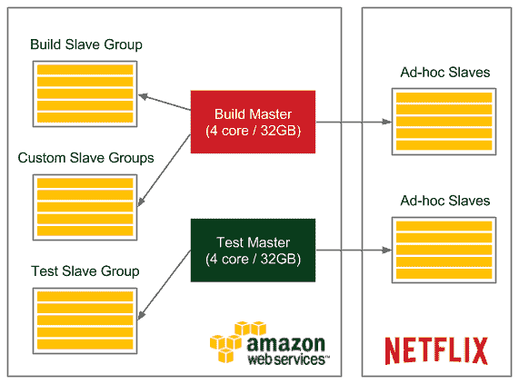
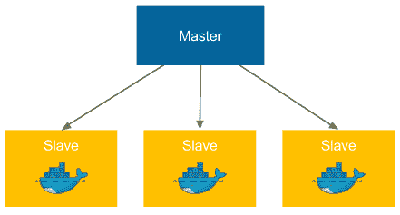

# 第三章：配置 Jenkins

我们已经看到如何配置和使用 Docker。在本章中，我们将介绍 Jenkins，它可以单独使用，也可以与 Docker 一起使用。我们将展示这两个工具的结合产生了令人惊讶的好结果：自动配置和灵活的可扩展性。

本章涵盖以下主题：

+   介绍 Jenkins 及其优势

+   安装和启动 Jenkins

+   创建第一个流水线

+   使用代理扩展 Jenkins

+   配置基于 Docker 的代理

+   构建自定义主从 Docker 镜像

+   配置安全和备份策略

# Jenkins 是什么？

Jenkins 是用 Java 编写的开源自动化服务器。凭借非常活跃的基于社区的支持和大量的插件，它是实施持续集成和持续交付流程的最流行工具。以前被称为 Hudson，Oracle 收购 Hudson 并决定将其开发为专有软件后更名为 Jenkins。Jenkins 仍然在 MIT 许可下，并因其简单性、灵活性和多功能性而备受推崇。

Jenkins 优于其他持续集成工具，是最广泛使用的其类软件。这一切都是可能的，因为它的特性和能力。

让我们来看看 Jenkins 特性中最有趣的部分。

+   **语言无关**：Jenkins 有很多插件，支持大多数编程语言和框架。此外，由于它可以使用任何 shell 命令和任何安装的软件，因此适用于可以想象的每个自动化流程。

+   **可扩展的插件**：Jenkins 拥有一个庞大的社区和大量可用的插件（1000 多个）。它还允许您编写自己的插件，以定制 Jenkins 以满足您的需求。

+   **便携**：Jenkins 是用 Java 编写的，因此可以在任何操作系统上运行。为了方便，它还以许多版本提供：Web 应用程序存档（WAR）、Docker 镜像、Windows 二进制、Mac 二进制和 Linux 二进制。

+   **支持大多数 SCM**：Jenkins 与几乎所有现有的源代码管理或构建工具集成。再次，由于其广泛的社区和插件，没有其他持续集成工具支持如此多的外部系统。

+   **分布式**：Jenkins 具有内置的主/从模式机制，可以将其执行分布在位于多台机器上的多个节点上。它还可以使用异构环境，例如，不同的节点可以安装不同的操作系统。

+   **简单性**：安装和配置过程简单。无需配置任何额外的软件，也不需要数据库。可以完全通过 GUI、XML 或 Groovy 脚本进行配置。

+   **面向代码**：Jenkins 管道被定义为代码。此外，Jenkins 本身可以使用 XML 文件或 Groovy 脚本进行配置。这允许将配置保存在源代码存储库中，并有助于自动化 Jenkins 配置。

# Jenkins 安装

Jenkins 安装过程快速简单。有不同的方法可以做到这一点，但由于我们已经熟悉 Docker 工具及其带来的好处，我们将从基于 Docker 的解决方案开始。这也是最简单、最可预测和最明智的方法。然而，让我们先提到安装要求。

# 安装要求

最低系统要求相对较低：

+   Java 8

+   256MB 可用内存

+   1 GB 以上的可用磁盘空间

然而，需要明白的是，要求严格取决于您打算如何使用 Jenkins。如果 Jenkins 用于为整个团队提供持续集成服务器，即使是小团队，建议具有 1 GB 以上的可用内存和 50 GB 以上的可用磁盘空间。不用说，Jenkins 还执行一些计算并在网络上传输大量数据，因此 CPU 和带宽至关重要。

为了了解在大公司的情况下可能需要的要求，*Jenkins 架构*部分介绍了 Netflix 的例子。

# 在 Docker 上安装

让我们看看使用 Docker 安装 Jenkins 的逐步过程。

Jenkins 镜像可在官方 Docker Hub 注册表中找到，因此为了安装它，我们应该执行以下命令：

```
$ docker run -p <host_port>:8080 -v <host_volume>:/var/jenkins_home jenkins:2.60.1
```

我们需要指定第一个`host_port`参数——Jenkins 在容器外可见的端口。第二个参数`host_volume`指定了 Jenkins 主目录映射的目录。它需要被指定为卷，并因此永久持久化，因为它包含了配置、管道构建和日志。

例如，让我们看看在 Linux/Ubuntu 上 Docker 主机的安装步骤会是什么样子。

1.  **准备卷目录**：我们需要一个具有管理员所有权的单独目录来保存 Jenkins 主目录。让我们用以下命令准备一个：

```
 $ mkdir $HOME/jenkins_home
 $ chown 1000 $HOME/jenkins_home
```

1.  **运行 Jenkins 容器**：让我们将容器作为守护进程运行，并给它一个合适的名称：

```
 $ docker run -d -p 49001:8080 
        -v $HOME/jenkins_home:/var/jenkins_home --name 
        jenkins jenkins:2.60.1
```

1.  **检查 Jenkins 是否正在运行**：过一会儿，我们可以通过打印日志来检查 Jenkins 是否已经正确启动：

```
 $ docker logs jenkins
 Running from: /usr/share/jenkins/jenkins.war
 webroot: EnvVars.masterEnvVars.get("JENKINS_HOME")
 Feb 04, 2017 9:01:32 AM Main deleteWinstoneTempContents
 WARNING: Failed to delete the temporary Winstone file 
        /tmp/winstone/jenkins.war
 Feb 04, 2017 9:01:32 AM org.eclipse.jetty.util.log.JavaUtilLog info
 INFO: Logging initialized @888ms
 Feb 04, 2017 9:01:32 AM winstone.Logger logInternal
 ...
```

在生产环境中，您可能还希望设置反向代理，以隐藏 Jenkins 基础设施在代理服务器后面。如何使用 Nginx 服务器进行设置的简要说明可以在[`wiki.jenkins-ci.org/display/JENKINS/Installing+Jenkins+with+Docker`](https://wiki.jenkins-ci.org/display/JENKINS/Installing+Jenkins+with+Docker)找到。

完成这几个步骤后，Jenkins 就可以使用了。基于 Docker 的安装有两个主要优点：

+   **故障恢复**：如果 Jenkins 崩溃，只需运行一个指定了相同卷的新容器。

+   **自定义镜像**：您可以根据自己的需求配置 Jenkins 并将其存储为 Jenkins 镜像。然后可以在您的组织或团队内共享，而无需一遍又一遍地重复相同的配置步骤。

在本书的所有地方，我们使用的是版本 2.60.1 的 Jenkins。

# 在没有 Docker 的情况下安装

出于前面提到的原因，建议安装 Docker。但是，如果这不是一个选择，或者有其他原因需要采取其他方式进行安装，那么安装过程同样简单。例如，在 Ubuntu 的情况下，只需运行：

```
$ wget -q -O - https://pkg.jenkins.io/debian/jenkins.io.key | sudo apt-key add -
$ sudo sh -c 'echo deb http://pkg.jenkins.io/debian-stable binary/ > /etc/apt/sources.list.d/jenkins.list'
$ sudo apt-get update
$ sudo apt-get install jenkins
```

所有安装指南（Ubuntu、Mac、Windows 等）都可以在官方 Jenkins 页面[`jenkins.io/doc/book/getting-started/installing/`](https://jenkins.io/doc/book/getting-started/installing/)上找到。

# 初始配置

无论您选择哪种安装方式，Jenkins 的第一次启动都需要进行一些配置步骤。让我们一步一步地走过它们：

1.  在浏览器中打开 Jenkins：`http://localhost:49001`（对于二进制安装，默认端口为`8080`）。

1.  Jenkins 应该要求输入管理员密码。它可以在 Jenkins 日志中找到：

```
 $ docker logs jenkins
 ...
 Jenkins initial setup is required. An admin user has been created 
        and a password generated.
 Please use the following password to proceed to installation:

 c50508effc6843a1a7b06f6491ed0ca6

 ...
```

1.  接受初始密码后，Jenkins 会询问是否安装建议的插件，这些插件适用于最常见的用例。您的答案当然取决于您的需求。然而，作为第一个 Jenkins 安装，让 Jenkins 安装所有推荐的插件是合理的。

1.  安装插件后，Jenkins 要求设置用户名、密码和其他基本信息。如果你跳过它，步骤 2 中的令牌将被用作管理员密码。

安装完成后，您应该看到 Jenkins 仪表板：


我们已经准备好使用 Jenkins 并创建第一个管道。

# Jenkins 你好世界

整个 IT 世界的一切都始于 Hello World 的例子。

让我们遵循这个规则，看看创建第一个 Jenkins 管道的步骤：

1.  点击*新建项目*。

1.  将`hello world`输入为项目名称，选择管道，然后点击确定。

1.  有很多选项。我们现在会跳过它们，直接进入管道部分。

1.  在脚本文本框中，我们可以输入管道脚本：

```
      pipeline {
           agent any
           stages {
                stage("Hello") {
                     steps {
                          echo 'Hello World'
                     }
                }
           }
      }
```

1.  点击*保存*。

1.  点击*立即构建*。

我们应该在构建历史下看到#1。如果我们点击它，然后点击*控制台输出*，我们将看到管道构建的日志。



我们刚刚看到了第一个例子，成功的输出意味着 Jenkins 已经正确安装。现在，让我们转移到稍微更高级的 Jenkins 配置。

我们将在第四章中更详细地描述管道语法，*持续集成管道*。

# Jenkins 架构

hello world 作业几乎没有时间执行。然而，管道通常更复杂，需要时间来执行诸如从互联网下载文件、编译源代码或运行测试等任务。一个构建可能需要几分钟到几小时。

在常见情况下，也会有许多并发的管道。通常，整个团队，甚至整个组织，都使用同一个 Jenkins 实例。如何确保构建能够快速顺利地运行？

# 主节点和从节点

Jenkins 很快就会变得过载。即使是一个小的（微）服务，构建也可能需要几分钟。这意味着一个频繁提交的团队很容易就能够使 Jenkins 实例崩溃。

因此，除非项目非常小，Jenkins 不应该执行构建，而是将它们委托给从节点（代理）实例。准确地说，我们当前运行的 Jenkins 称为 Jenkins 主节点，它可以委托给 Jenkins 代理。

让我们看一下呈现主从交互的图表：


在分布式构建环境中，Jenkins 主节点负责：

+   接收构建触发器（例如，提交到 GitHub 后）

+   发送通知（例如，在构建失败后发送电子邮件或 HipChat 消息）

+   处理 HTTP 请求（与客户端的交互）

+   管理构建环境（在从节点上编排作业执行）

构建代理是一个负责构建开始后发生的一切的机器。

由于主节点和从节点的责任不同，它们有不同的环境要求：

+   **主节点**：这通常是一个专用的机器，内存从小型项目的 200 MB 到大型单主项目的 70GB 以上不等。

+   **从节点**：没有一般性要求（除了它应该能够执行单个构建之外，例如，如果项目是一个需要 100GB RAM 的巨型单体，那么从节点机器需要满足这些需求）。

代理也应尽可能通用。例如，如果我们有不同的项目：一个是 Java，一个是 Python，一个是 Ruby，那么每个代理都可以构建任何这些项目将是完美的。在这种情况下，代理可以互换，有助于优化资源的使用。

如果代理不能足够通用以匹配所有项目，那么可以对代理和项目进行标记，以便给定的构建将在给定类型的代理上执行。

# 可扩展性

我们可以使用 Jenkins 从节点来平衡负载和扩展 Jenkins 基础架构。这个过程称为水平扩展。另一种可能性是只使用一个主节点并增加其机器的资源。这个过程称为垂直扩展。让我们更仔细地看看这两个概念。

# 垂直扩展

垂直扩展意味着当主机负载增加时，会向主机的机器应用更多资源。因此，当我们的组织中出现新项目时，我们会购买更多的 RAM，增加 CPU 核心，并扩展 HDD 驱动器。这可能听起来像是一个不可行的解决方案；然而，它经常被使用，甚至被知名组织使用。将单个 Jenkins 主设置在超高效的硬件上有一个非常强大的优势：维护。任何升级、脚本、安全设置、角色分配或插件安装都只需在一个地方完成。

# 水平扩展

水平扩展意味着当组织增长时，会启动更多的主实例。这需要将实例智能分配给团队，并且在极端情况下，每个团队都可以拥有自己的 Jenkins 主实例。在这种情况下，甚至可能不需要从属实例。

缺点是可能难以自动化跨项目集成，并且团队的一部分开发时间花在了 Jenkins 维护上。然而，水平扩展具有一些显著的优势：

+   主机器在硬件方面不需要特殊。

+   不同的团队可以有不同的 Jenkins 设置（例如，不同的插件集）

+   团队通常会感到更好，并且如果实例是他们自己的话，他们会更有效地使用 Jenkins。

+   如果一个主实例宕机，不会影响整个组织

+   基础设施可以分为标准和关键任务

+   一些维护方面可以简化，例如，五人团队可以重用相同的 Jenkins 密码，因此我们可以跳过角色和安全设置（当然，只有在企业网络受到良好防火墙保护的情况下才可能）

# 测试和生产实例

除了扩展方法，还有一个问题：如何测试 Jenkins 升级、新插件或流水线定义？Jenkins 对整个公司至关重要。它保证了软件的质量，并且（在持续交付的情况下）部署到生产服务器。这就是为什么它需要高可用性，因此绝对不是为了测试的目的。这意味着应该始终存在两个相同的 Jenkins 基础架构实例：测试和生产。

测试环境应该尽可能与生产环境相似，因此也需要相似数量的附加代理。

# 示例架构

我们已经知道应该有从属者，（可能是多个）主节点，以及一切都应该复制到测试和生产环境中。然而，完整的情况会是什么样子呢？

幸运的是，有很多公司发布了他们如何使用 Jenkins 以及他们创建了什么样的架构。很难衡量更多的公司是偏好垂直扩展还是水平扩展，但从只有一个主节点实例到每个团队都有一个主节点都有。范围很广。

让我们以 Netflix 为例，来完整了解 Jenkins 基础设施的情况（他们在 2012 年旧金山 Jenkins 用户大会上分享了**计划中的基础设施**）：



他们有测试和生产主节点实例，每个实例都拥有一组从属者和额外的临时从属者。总共，它每天提供大约 2000 个构建。还要注意，他们的基础设施部分托管在 AWS 上，部分托管在他们自己的服务器上。

我们应该已经对 Jenkins 基础设施的外观有一个大致的想法，这取决于组织的类型。

现在让我们专注于设置代理的实际方面。

# 配置代理

我们已经知道代理是什么，以及何时可以使用。但是，如何设置代理并让其与主节点通信呢？让我们从问题的第二部分开始，描述主节点和代理之间的通信协议。

# 通信协议

为了让主节点和代理进行通信，必须建立双向连接。

有不同的选项可以启动它：

+   **SSH**：主节点使用标准的 SSH 协议连接到从属者。Jenkins 内置了 SSH 客户端，所以唯一的要求是从属者上配置了 SSHD 服务器。这是最方便和稳定的方法，因为它使用标准的 Unix 机制。

+   **Java Web Start**：在每个代理机器上启动 Java 应用程序，并在 Jenkins 从属应用程序和主 Java 应用程序之间建立 TCP 连接。如果代理位于防火墙网络内，主节点无法启动连接，通常会使用这种方法。

+   **Windows 服务**：主节点在远程机器上注册代理作为 Windows 服务。这种方法不鼓励使用，因为设置很棘手，图形界面的使用也有限制。

如果我们知道通信协议，让我们看看如何使用它们来设置代理。

# 设置代理

在低级别上，代理始终使用上面描述的协议与 Jenkins 主服务器通信。然而，在更高级别上，我们可以以各种方式将从节点附加到主服务器。差异涉及两个方面：

+   **静态与动态**：最简单的选项是在 Jenkins 主服务器中永久添加从节点。这种解决方案的缺点是，如果我们需要更多（或更少）的从节点，我们总是需要手动更改一些东西。更好的选择是根据需要动态提供从节点。

+   **特定与通用**：代理可以是特定的（例如，基于 Java 7 的项目有不同的代理，基于 Java 8 的项目有不同的代理），也可以是通用的（代理充当 Docker 主机，流水线在 Docker 容器内构建）。

这些差异导致了四种常见的代理配置策略：

+   永久代理

+   永久 Docker 代理

+   Jenkins Swarm 代理

+   动态提供的 Docker 代理

让我们逐个检查每种解决方案。

# 永久代理

我们从最简单的选项开始，即永久添加特定代理节点。可以完全通过 Jenkins Web 界面完成。

# 配置永久代理

在 Jenkins 主服务器上，当我们打开“管理 Jenkins”，然后点击“管理节点”，我们可以查看所有已附加的代理。然后，通过点击“新建节点”，给它一个名称，并点击“确定”按钮，最终我们应该看到代理的设置页面：


让我们来看看我们需要填写的参数：

+   **名称**：这是代理的唯一名称

+   **描述**：这是代理的任何可读描述

+   **执行器数量**：这是从节点上可以并行运行的构建数量

+   **远程根目录**：这是从节点上的专用目录，代理可以用它来运行构建作业（例如，`/var/jenkins`）；最重要的数据被传输回主服务器，因此目录并不重要

+   **标签**：这包括匹配特定构建的标签（相同标记），例如，仅基于 Java 8 的项目

+   **用法**：这是决定代理是否仅用于匹配标签（例如，仅用于验收测试构建）还是用于任何构建的选项

+   **启动方法**：这包括以下内容：

+   **通过 Java Web Start 启动从属**：在这里，代理将建立连接；可以下载 JAR 文件以及在从属机器上运行它的说明

+   **通过在主节点上执行命令启动从属**：这是在主节点上运行的自定义命令，大多数情况下它会发送 Java Web Start JAR 应用程序并在从属上启动它（例如，`ssh <slave_hostname> java -jar ~/bin/slave.jar`）

+   **通过 SSH 启动从属代理**：在这里，主节点将使用 SSH 协议连接到从属

+   **让 Jenkins 将此 Windows 从属作为 Windows 服务进行控制**：在这里，主节点将启动内置于 Windows 中的远程管理设施

+   **可用性**：这是决定代理是否应该一直在线或者在某些条件下主节点应该将其离线的选项

当代理正确设置后，可以将主节点离线，这样就不会在其上执行任何构建，它只会作为 Jenkins UI 和构建协调器。

# 理解永久从属

正如前面提到的，这种解决方案的缺点是我们需要为不同的项目类型维护多个从属类型（标签）。这种情况如下图所示：


在我们的示例中，如果我们有三种类型的项目（**java7**，**java8**和**ruby**），那么我们需要维护三个分别带有标签的（集合）从属。这与我们在维护多个生产服务器类型时遇到的问题相同，如第二章 *引入 Docker*中所述。我们通过在生产服务器上安装 Docker Engine 来解决了这个问题。让我们尝试在 Jenkins 从属上做同样的事情。

# 永久 Docker 从属

这种解决方案的理念是永久添加通用从属。每个从属都配置相同（安装了 Docker Engine），并且每个构建与 Docker 镜像一起定义，构建在其中运行。

# 配置永久 Docker 从属

配置是静态的，所以它的完成方式与我们为永久从属所做的完全相同。唯一的区别是我们需要在每台将用作从属的机器上安装 Docker。然后，通常我们不需要标签，因为所有从属都可以是相同的。在从属配置完成后，我们在每个流水线脚本中定义 Docker 镜像。

```
pipeline {
     agent {
          docker {
               image 'openjdk:8-jdk-alpine'
          }
     }
     ...
}
```

当构建开始时，Jenkins 从服务器会从 Docker 镜像`openjdk:8-jdk-alpine`启动一个容器，然后在该容器内执行所有流水线步骤。这样，我们始终知道执行环境，并且不必根据特定项目类型单独配置每个从服务器。

# 理解永久 Docker 代理

看着我们为永久代理所采取的相同场景，图表如下：



每个从服务器都是完全相同的，如果我们想构建一个依赖于 Java 8 的项目，那么我们在流水线脚本中定义适当的 Docker 镜像（而不是指定从服务器标签）。

# Jenkins Swarm 代理

到目前为止，我们总是不得不在 Jenkins 主服务器中永久定义每个代理。这样的解决方案，即使在许多情况下都足够好，如果我们需要频繁扩展从服务器的数量，可能会成为负担。Jenkins Swarm 允许您动态添加从服务器，而无需在 Jenkins 主服务器中对其进行配置。

# 配置 Jenkins Swarm 代理

使用 Jenkins Swarm 的第一步是在 Jenkins 中安装**自组织 Swarm 插件模块**插件。我们可以通过 Jenkins Web UI 在“管理 Jenkins”和“管理插件”下进行。完成此步骤后，Jenkins 主服务器准备好动态附加 Jenkins 从服务器。

第二步是在每台将充当 Jenkins 从服务器的机器上运行 Jenkins Swarm 从服务器应用程序。我们可以使用`swarm-client.jar`应用程序来完成。

`swarm-client.jar`应用程序可以从 Jenkins Swarm 插件页面下载：[`wiki.jenkins-ci.org/display/JENKINS/Swarm+Plugin`](https://wiki.jenkins-ci.org/display/JENKINS/Swarm+Plugin)。在该页面上，您还可以找到其执行的所有可能选项。

要附加 Jenkins Swarm 从节点，只需运行以下命令：

```
$ java -jar swarm-client.jar -master <jenkins_master_url> -username <jenkins_master_user> -password <jenkins_master_password> -name jenkins-swarm-slave-1
```

在撰写本书时，存在一个`client-slave.jar`无法通过安全的 HTTPS 协议工作的未解决错误，因此需要在命令执行中添加`-disableSslVerification`选项。

成功执行后，我们应该注意到 Jenkins 主服务器上出现了一个新的从服务器，如屏幕截图所示：


现在，当我们运行构建时，它将在此代理上启动。

添加 Jenkins Swarm 代理的另一种可能性是使用从`swarm-client.jar`工具构建的 Docker 镜像。Docker Hub 上有一些可用的镜像。我们可以使用`csanchez/jenkins-swarm-slave`镜像。

# 了解 Jenkins Swarm 代理

Jenkins Swarm 允许动态添加代理，但它没有说明是否使用特定的或基于 Docker 的从属，所以我们可以同时使用它。乍一看，Jenkins Swarm 可能看起来并不是很有用。毕竟，我们将代理设置从主服务器移到了从属，但仍然需要手动完成。然而，正如我们将在第八章中看到的那样，*使用 Docker Swarm 进行集群*，Jenkins Swarm 可以在服务器集群上动态扩展从属。

# 动态配置的 Docker 代理

另一个选项是设置 Jenkins 在每次启动构建时动态创建一个新的代理。这种解决方案显然是最灵活的，因为从属的数量会动态调整到构建的数量。让我们看看如何以这种方式配置 Jenkins。

# 配置动态配置的 Docker 代理

我们需要首先安装 Docker 插件。与 Jenkins 插件一样，我们可以在“管理 Jenkins”和“管理插件”中进行。安装插件后，我们可以开始以下配置步骤：

1.  打开“管理 Jenkins”页面。

1.  单击“配置系统”链接。

1.  在页面底部，有云部分。

1.  单击“添加新的云”并选择 Docker。

1.  填写 Docker 代理的详细信息。


1.  大多数参数不需要更改；但是，我们需要设置其中两个如下：

+   +   **Docker URL**：代理将在其中运行的 Docker 主机机器的地址

+   **凭据**：如果 Docker 主机需要身份验证的凭据

如果您计划在运行主服务器的相同 Docker 主机上使用它，则 Docker 守护程序需要在`docker0`网络接口上进行监听。您可以以与*在服务器上安装*部分中描述的类似方式进行操作。这与我们在维护多个生产服务器类型时遇到的问题相同，如第二章中所述，*介绍 Docker*，通过更改`/lib/systemd/system/docker.service`文件中的一行为`ExecStart=/usr/bin/dockerd -H 0.0.0.0:2375 -H fd://`

1.  单击“添加 Docker 模板”并选择 Docker 模板。

1.  填写有关 Docker 从属镜像的详细信息：


我们可以使用以下参数：

+   **Docker 镜像**：Jenkins 社区中最受欢迎的从属镜像是`evarga/jenkins-slave`

+   **凭据**：对`evarga/jenkins-slave`镜像的凭据是：

+   用户名：`jenkins`

+   密码：`jenkins`

+   **实例容量**：这定义了同时运行的代理的最大数量；初始设置可以为 10

除了`evarga/jenkins-slave`之外，也可以构建和使用自己的从属镜像。当存在特定的环境要求时，例如安装了 Python 解释器时，这是必要的。在本书的所有示例中，我们使用了`leszko/jenkins-docker-slave`。

保存后，一切都设置好了。我们可以运行流水线来观察执行是否真的在 Docker 代理上进行，但首先让我们深入了解一下 Docker 代理的工作原理。

# 理解动态提供的 Docker 代理

动态提供的 Docker 代理可以被视为标准代理机制的一层。它既不改变通信协议，也不改变代理的创建方式。那么，Jenkins 会如何处理我们提供的 Docker 代理配置呢？

以下图表展示了我们配置的 Docker 主从架构：


让我们逐步描述 Docker 代理机制的使用方式：

1.  当 Jenkins 作业启动时，主机会在从属 Docker 主机上从`jenkins-slave`镜像运行一个新的容器。

1.  jenkins-slave 容器实际上是安装了 SSHD 服务器的 ubuntu 镜像。

1.  Jenkins 主机会自动将创建的代理添加到代理列表中（与我们在*设置代理*部分手动操作的方式相同）。

1.  代理是通过 SSH 通信协议访问以执行构建的。

1.  构建完成后，主机会停止并移除从属容器。

将 Jenkins 主机作为 Docker 容器运行与将 Jenkins 代理作为 Docker 容器运行是独立的。两者都是合理的选择，但它们中的任何一个都可以单独工作。

这个解决方案在某种程度上类似于永久的 Docker 代理解决方案，因为最终我们是在 Docker 容器内运行构建。然而，不同之处在于从属节点的配置。在这里，整个从属都是 docker 化的，不仅仅是构建环境。因此，它具有以下两个巨大的优势：

+   自动代理生命周期：创建、添加和移除代理的过程是自动化的。

+   可扩展性：实际上，从容器主机可能不是单个机器，而是由多台机器组成的集群（我们将在第八章中介绍使用 Docker Swarm 进行集群化，*使用 Docker Swarm 进行集群化*）。在这种情况下，添加更多资源就像添加新机器到集群一样简单，并且不需要对 Jenkins 进行任何更改。

Jenkins 构建通常需要下载大量项目依赖项（例如 Gradle/Maven 依赖项），这可能需要很长时间。如果 Docker 代理自动为每个构建进行配置，那么值得为它们设置一个 Docker 卷，以便在构建之间启用缓存。

# 测试代理

无论选择了哪种代理配置，现在我们应该检查它是否正常工作。

让我们回到 hello world 流水线。通常，构建的持续时间比 hello-world 示例长，所以我们可以通过在流水线脚本中添加睡眠来模拟它：

```
pipeline {
     agent any
     stages {
          stage("Hello") {
               steps {
                    sleep 300 // 5 minutes
                    echo 'Hello World'
               }
          }
     }
}
```

点击“立即构建”并转到 Jenkins 主页后，我们应该看到构建是在代理上执行的。现在，如果我们多次点击构建，不同的代理应该执行不同的构建（如下截图所示）：

为了防止作业在主节点上执行，记得将主节点设置为离线或在节点管理配置中将**执行器数量**设置为`0`。

通过观察代理执行我们的构建，我们确认它们已经正确配置。现在，让我们看看为什么以及如何创建我们自己的 Jenkins 镜像。

# 自定义 Jenkins 镜像

到目前为止，我们使用了从互联网上拉取的 Jenkins 镜像。我们使用`jenkins`作为主容器，`evarga/jenkins-slave`作为从容器。然而，我们可能希望构建自己的镜像以满足特定的构建环境要求。在本节中，我们将介绍如何做到这一点。

# 构建 Jenkins 从容器

让我们从从容器镜像开始，因为它经常被定制。构建执行是在代理上执行的，因此需要调整代理的环境以适应我们想要构建的项目。例如，如果我们的项目是用 Python 编写的，可能需要 Python 解释器。同样的情况也适用于任何库、工具、测试框架或项目所需的任何内容。

您可以通过查看其 Dockerfile 来查看`evarga/jenkins-slave`镜像中已安装的内容[`github.com/evarga/docker-images`](https://github.com/evarga/docker-images)。

构建和使用自定义镜像有三个步骤：

1.  创建一个 Dockerfile。

1.  构建镜像。

1.  更改主节点上的代理配置。

举个例子，让我们创建一个为 Python 项目提供服务的从节点。为了简单起见，我们可以基于`evarga/jenkins-slave`镜像构建它。让我们按照以下三个步骤来做：

1.  **Dockerfile**：让我们在 Dockerfile 中创建一个新目录，内容如下：

```
 FROM evarga/jenkins-slave
 RUN apt-get update && \
 apt-get install -y python
```

基础 Docker 镜像`evarga/jenkins-slave`适用于动态配置的 Docker 代理解决方案。对于永久性 Docker 代理，只需使用`alpine`、`ubuntu`或任何其他镜像即可，因为 docker 化的不是从节点，而只是构建执行环境。

1.  **构建镜像**：我们可以通过执行以下命令来构建镜像：

```
 $ docker build -t jenkins-slave-python .
```

1.  **配置主节点**：当然，最后一步是在 Jenkins 主节点的配置中设置`jenkins-slave-python`，而不是`evarga/jenkins-slave`（如*设置 Docker 代理*部分所述）。

从节点的 Dockerfile 应该保存在源代码仓库中，并且可以由 Jenkins 自动执行构建。使用旧的 Jenkins 从节点构建新的 Jenkins 从节点镜像没有问题。

如果我们需要 Jenkins 构建两种不同类型的项目，例如一个基于 Python，另一个基于 Ruby，该怎么办？在这种情况下，我们可以准备一个足够通用以支持 Python 和 Ruby 的代理。然而，在 Docker 的情况下，建议创建第二个从节点镜像（通过类比创建`jenkins-slave-ruby`）。然后，在 Jenkins 配置中，我们需要创建两个 Docker 模板并相应地标记它们。

# 构建 Jenkins 主节点

我们已经有一个自定义的从节点镜像。为什么我们还想要构建自己的主节点镜像呢？其中一个原因可能是我们根本不想使用从节点，而且由于执行将在主节点上进行，它的环境必须根据项目的需求进行调整。然而，这是非常罕见的情况。更常见的情况是，我们会想要配置主节点本身。

想象一下以下情景，您的组织将 Jenkins 水平扩展，每个团队都有自己的实例。然而，有一些共同的配置，例如：一组基本插件，备份策略或公司标志。然后，为每个团队重复相同的配置是一种浪费时间。因此，我们可以准备共享的主镜像，并让团队使用它。

Jenkins 使用 XML 文件进行配置，并提供基于 Groovy 的 DSL 语言来对其进行操作。这就是为什么我们可以将 Groovy 脚本添加到 Dockerfile 中，以操纵 Jenkins 配置。而且，如果需要比 XML 更多的更改，例如插件安装，还有特殊的脚本来帮助 Jenkins 配置。

Dockerfile 指令的所有可能性都在 GitHub 页面[`github.com/jenkinsci/docker`](https://github.com/jenkinsci/docker)上有详细描述。

例如，让我们创建一个已经安装了 docker-plugin 并将执行者数量设置为 5 的主镜像。为了做到这一点，我们需要：

1.  创建 Groovy 脚本以操纵`config.xml`并将执行者数量设置为`5`。

1.  创建 Dockerfile 以安装 docker-plugin 并执行 Groovy 脚本。

1.  构建图像。

让我们使用提到的三个步骤构建 Jenkins 主镜像。

1.  **Groovy 脚本**：让我们在`executors.groovy`文件内创建一个新目录，内容如下：

```
import jenkins.model.*
Jenkins.instance.setNumExecutors(5)
```

完整的 Jenkins API 可以在官方页面[`javadoc.jenkins.io/`](http://javadoc.jenkins.io/)上找到。

1.  **Dockerfile**：在同一目录下，让我们创建 Dockerfile：

```
FROM jenkins
COPY executors.groovy 
      /usr/share/jenkins/ref/init.groovy.d/executors.groovy
RUN /usr/local/bin/install-plugins.sh docker-plugin
```

1.  **构建图像**：我们最终可以构建图像：

```
$ docker build -t jenkins-master .
```

创建图像后，组织中的每个团队都可以使用它来启动自己的 Jenkins 实例。

拥有自己的主从镜像可以为我们组织中的团队提供配置和构建环境。在接下来的部分，我们将看到 Jenkins 中还有哪些值得配置。

# 配置和管理

我们已经涵盖了 Jenkins 配置的最关键部分：代理配置。由于 Jenkins 具有高度可配置性，您可以期望有更多的可能性来调整它以满足您的需求。好消息是配置是直观的，并且可以通过 Web 界面访问，因此不需要任何详细的描述。所有内容都可以在“管理 Jenkins”子页面下更改。在本节中，我们只会关注最有可能被更改的一些方面：插件、安全和备份。

# 插件

Jenkins 是高度面向插件的，这意味着许多功能都是通过插件提供的。它们可以以几乎无限的方式扩展 Jenkins，考虑到庞大的社区，这是 Jenkins 如此成功的原因之一。Jenkins 的开放性带来了风险，最好只从可靠的来源下载插件或检查它们的源代码。

选择插件的数量实际上有很多。其中一些在初始配置过程中已经自动安装了。另一个（Docker 插件）是在设置 Docker 代理时安装的。有用于云集成、源代码控制工具、代码覆盖等的插件。你也可以编写自己的插件，但最好先检查一下你需要的插件是否已经存在。

有一个官方的 Jenkins 页面可以浏览插件[`plugins.jenkins.io/`](https://plugins.jenkins.io/)。

# 安全

您应该如何处理 Jenkins 安全取决于您在组织中选择的 Jenkins 架构。如果您为每个小团队都有一个 Jenkins 主服务器，那么您可能根本不需要它（假设企业网络已设置防火墙）。然而，如果您为整个组织只有一个 Jenkins 主服务器实例，那么最好确保您已经很好地保护了它。

Jenkins 自带自己的用户数据库-我们在初始配置过程中已经创建了一个用户。您可以通过打开“管理用户”设置页面来创建、删除和修改用户。内置数据库可以在小型组织的情况下使用；然而，对于大量用户，您可能希望使用 LDAP。您可以在“配置全局安全”页面上选择它。在那里，您还可以分配角色、组和用户。默认情况下，“已登录用户可以做任何事情”选项被设置，但在大规模组织中，您可能需要考虑更详细的细粒度。

# 备份

俗话说：“有两种人：那些备份的人，和那些将要备份的人”。信不信由你，备份可能是你想要配置的东西。要备份哪些文件，从哪些机器备份？幸运的是，代理自动将所有相关数据发送回主服务器，所以我们不需要担心它们。如果你在容器中运行 Jenkins，那么容器本身也不重要，因为它不保存任何持久状态。我们唯一感兴趣的地方是 Jenkins 主目录。

我们可以安装一个 Jenkins 插件（帮助我们设置定期备份），或者简单地设置一个 cron 作业将目录存档到一个安全的地方。为了减小大小，我们可以排除那些不感兴趣的子文件夹（这将取决于你的需求；然而，几乎可以肯定的是，你不需要复制："war"，"cache"，"tools"和"workspace"）。

有很多插件可以帮助备份过程；最常见的一个叫做**备份插件**。

# 蓝色海洋 UI

Hudson（Jenkins 的前身）的第一个版本于 2005 年发布。它已经在市场上超过 10 年了。然而，它的外观和感觉并没有改变太多。我们已经使用它一段时间了，很难否认它看起来过时。Blue Ocean 是一个重新定义了 Jenkins 用户体验的插件。如果 Jenkins 在美学上让你不满意，那么值得一试。

您可以在[`jenkins.io/projects/blueocean/`](https://jenkins.io/projects/blueocean/)的蓝色海洋页面上阅读更多信息！[](assets/8bc21c85-2ef8-4974-8bdf-24d022228c4f.png)

# 练习

在本章中，我们学到了很多关于 Jenkins 配置的知识。为了巩固这些知识，我们建议进行两个练习，准备 Jenkins 镜像并测试 Jenkins 环境。

1.  创建 Jenkins 主和从属 Docker 镜像，并使用它们来运行能够构建 Ruby 项目的 Jenkins 基础设施：

+   创建主 Dockerfile，自动安装 Docker 插件。

+   构建主镜像并运行 Jenkins 实例

+   创建从属 Dockerfile（适用于动态从属供应），安装 Ruby 解释器

+   构建从属镜像

+   在 Jenkins 实例中更改配置以使用从属镜像

1.  创建一个流水线，运行一个打印`Hello World from Ruby`的 Ruby 脚本：

+   创建一个新的流水线

+   使用以下 shell 命令即时创建`hello.rb`脚本：

`sh "echo "puts 'Hello World from Ruby'" > hello.rb"`

+   添加命令以使用 Ruby 解释器运行`hello.rb`

+   运行构建并观察控制台输出

# 总结

在本章中，我们已经介绍了 Jenkins 环境及其配置。所获得的知识足以建立完整基于 Docker 的 Jenkins 基础设施。本章的关键要点如下：

+   Jenkins 是一种通用的自动化工具，可与任何语言或框架一起使用。

+   Jenkins 可以通过插件进行高度扩展，这些插件可以自行编写或在互联网上找到。

+   Jenkins 是用 Java 编写的，因此可以安装在任何操作系统上。它也作为 Docker 镜像正式提供。

+   Jenkins 可以使用主从架构进行扩展。主实例可以根据组织的需求进行水平或垂直扩展。

+   Jenkins 的代理可以使用 Docker 实现，这有助于自动配置和动态分配从机。

+   可以为 Jenkins 主和 Jenkins 从创建自定义 Docker 镜像。

+   Jenkins 是高度可配置的，应始终考虑的方面是：安全性和备份。

在下一章中，我们将专注于已经通过“hello world”示例接触过的部分，即管道。我们将描述构建完整持续集成管道的思想和方法。
