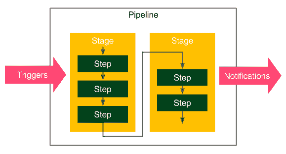
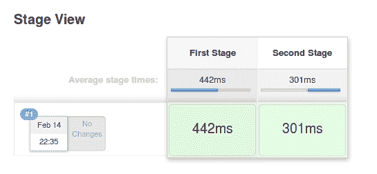
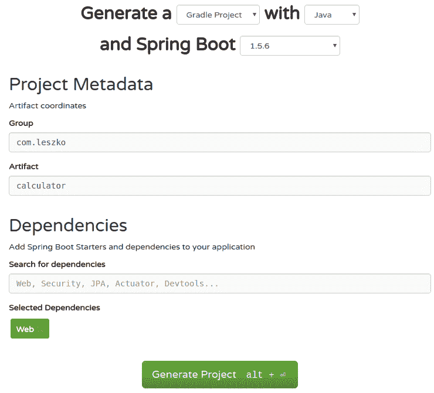
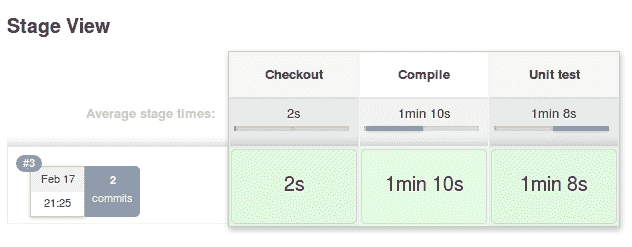
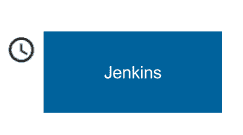
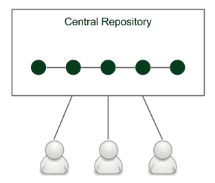
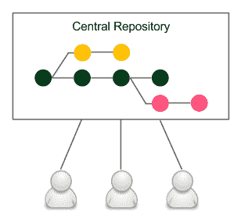
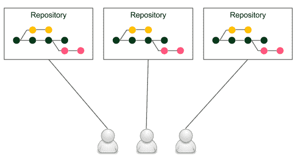
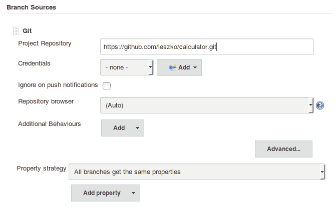
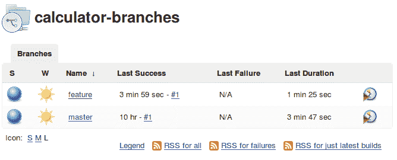

# 第四章：持续集成管道

我们已经知道如何配置 Jenkins。在本章中，您将看到如何有效地使用它，重点放在 Jenkins 核心的功能上，即管道。通过从头开始构建完整的持续集成过程，我们将描述现代团队导向的代码开发的所有方面。

本章涵盖以下要点：

+   解释管道的概念

+   介绍 Jenkins 管道语法

+   创建持续集成管道

+   解释 Jenkinsfile 的概念

+   创建代码质量检查

+   添加管道触发器和通知

+   解释开发工作流程和分支策略

+   介绍 Jenkins 多分支

# 介绍管道

管道是一系列自动化操作，通常代表软件交付和质量保证过程的一部分。它可以简单地被看作是一系列脚本，提供以下额外的好处：

+   **操作分组**：操作被分组到阶段中（也称为**门**或**质量门**），引入了结构到过程中，并清晰地定义了规则：如果一个阶段失败，就不会执行更多的阶段

+   **可见性**：过程的所有方面都被可视化，这有助于快速分析失败，并促进团队协作

+   **反馈**：团队成员一旦发现问题，就可以迅速做出反应

管道的概念对于大多数持续集成工具来说是相似的，但命名可能有所不同。在本书中，我们遵循 Jenkins 的术语。

# 管道结构

Jenkins 管道由两种元素组成：阶段和步骤。以下图显示了它们的使用方式：

以下是基本的管道元素：

+   **步骤**：单个操作（告诉 Jenkins 要做什么，例如，从存储库检出代码，执行脚本）

+   **阶段**：步骤的逻辑分离（概念上区分不同的步骤序列，例如**构建，测试**和**部署**），用于可视化 Jenkins 管道的进展

从技术上讲，可以创建并行步骤；然而，最好将其视为真正需要优化目的时的例外。

# 多阶段 Hello World

例如，让我们扩展`Hello World`管道，包含两个阶段：

[PRE0]

管道在环境方面没有特殊要求（任何从属代理），并在两个阶段内执行三个步骤。当我们点击“立即构建”时，我们应该看到可视化表示：

管道成功了，我们可以通过单击控制台查看步骤执行详细信息。如果任何步骤失败，处理将停止，不会运行更多的步骤。实际上，管道的整个目的是阻止所有进一步的步骤执行并可视化失败点。

# 管道语法

我们已经讨论了管道元素，并已经使用了一些管道步骤，例如`echo`。在管道定义内部，我们还可以使用哪些其他操作？

在本书中，我们使用了为所有新项目推荐的声明性语法。不同的选项是基于 Groovy 的 DSL 和（在 Jenkins 2 之前）XML（通过 Web 界面创建）。

声明性语法旨在使人们尽可能简单地理解管道，即使是那些不经常编写代码的人。这就是为什么语法仅限于最重要的关键字。

让我们准备一个实验，在我们描述所有细节之前，阅读以下管道定义并尝试猜测它的作用：

[PRE1]

希望管道没有吓到你。它相当复杂。实际上，它是如此复杂，以至于它包含了所有可能的 Jenkins 指令。为了回答实验谜题，让我们逐条看看管道的执行指令：

1.  使用任何可用的代理。

1.  每分钟自动执行。

1.  如果执行时间超过 5 分钟，请停止。

1.  在开始之前要求布尔输入参数。

1.  将`Rafal`设置为环境变量 NAME。

1.  仅在`true`输入参数的情况下：

+   打印`来自 Rafal 的问候`

+   打印`测试 chrome 浏览器`

+   打印`测试 firefox 浏览器`

1.  无论执行过程中是否出现任何错误，都打印`我总是会说再见！`

让我们描述最重要的 Jenkins 关键字。声明性管道总是在`pipeline`块内指定，并包含部分、指令和步骤。我们将逐个讨论它们。

完整的管道语法描述可以在官方 Jenkins 页面上找到[`jenkins.io/doc/book/pipeline/syntax/`](https://jenkins.io/doc/book/pipeline/syntax/)。

# 部分

部分定义了流水线的结构，通常包含一个或多个指令或步骤。它们使用以下关键字进行定义：

+   **阶段**：这定义了一系列一个或多个阶段指令

+   **步骤**：这定义了一系列一个或多个步骤指令

+   **后置**：这定义了在流水线构建结束时运行的一个或多个步骤指令序列；标有条件（例如 always，success 或 failure），通常用于在流水线构建后发送通知（我们将在*触发器和通知*部分详细介绍）。

# 指令

指令表达了流水线或其部分的配置：

+   **代理**：这指定执行的位置，并可以定义`label`以匹配同样标记的代理，或者使用`docker`来指定动态提供环境以执行流水线的容器

+   触发器：这定义了触发流水线的自动方式，可以使用`cron`来设置基于时间的调度，或者使用`pollScm`来检查仓库的更改（我们将在*触发器和通知*部分详细介绍）

+   **选项**：这指定了特定于流水线的选项，例如`timeout`（流水线运行的最长时间）或`retry`（流水线在失败后应重新运行的次数）

+   **环境**：这定义了在构建过程中用作环境变量的一组键值

+   **参数**：这定义了用户输入参数的列表

+   **阶段**：这允许对步骤进行逻辑分组

+   **当**：这确定阶段是否应根据给定条件执行

# 步骤

步骤是流水线最基本的部分。它们定义了要执行的操作，因此它们实际上告诉 Jenkins**要做什么**。

+   **sh**：这执行 shell 命令；实际上，几乎可以使用`sh`来定义任何操作

+   **自定义**：Jenkins 提供了许多可用作步骤的操作（例如`echo`）；其中许多只是用于方便的`sh`命令的包装器；插件也可以定义自己的操作

+   **脚本**：这执行基于 Groovy 的代码块，可用于一些需要流程控制的非常规情况

可用步骤的完整规范可以在以下网址找到：[`jenkins.io/doc/pipeline/steps/`](https://jenkins.io/doc/pipeline/steps/)。

请注意，流水线语法非常通用，从技术上讲，几乎可以用于任何自动化流程。这就是为什么应该将流水线视为一种结构化和可视化的方法。然而，最常见的用例是实现我们将在下一节中看到的持续集成服务器。

# 提交流水线

最基本的持续集成流程称为提交流水线。这个经典阶段，顾名思义，从主存储库提交（或在 Git 中推送）开始，并导致构建成功或失败的报告。由于它在代码每次更改后运行，构建时间不应超过 5 分钟，并且应消耗合理数量的资源。提交阶段始终是持续交付流程的起点，并且在开发过程中提供了最重要的反馈循环，不断提供代码是否处于健康状态的信息。

提交阶段的工作如下。开发人员将代码提交到存储库，持续集成服务器检测到更改，构建开始。最基本的提交流水线包含三个阶段：

+   **检出**：此阶段从存储库下载源代码

+   **编译**：此阶段编译源代码

+   **单元测试**：此阶段运行一套单元测试

让我们创建一个示例项目，看看如何实现提交流水线。

这是一个使用 Git、Java、Gradle 和 Spring Boot 等技术的项目的流水线示例。然而，相同的原则适用于任何其他技术。

# 检出

从存储库检出代码始终是任何流水线中的第一个操作。为了看到这一点，我们需要有一个存储库。然后，我们将能够创建一个流水线。

# 创建 GitHub 存储库

在 GitHub 服务器上创建存储库只需几个步骤：

1.  转到[`github.com/`](https://github.com/)页面。

1.  如果还没有帐户，请创建一个。

1.  点击“新存储库”。

1.  给它一个名字，`calculator`。

1.  选中“使用 README 初始化此存储库”。

1.  点击“创建存储库”。

现在，您应该看到存储库的地址，例如`https://github.com/leszko/calculator.git`。

# 创建一个检出阶段

我们可以创建一个名为`calculator`的新流水线，并将代码放在一个名为 Checkout 的阶段的**流水线脚本**中：

[PRE2]

流水线可以在任何代理上执行，它的唯一步骤只是从存储库下载代码。我们可以点击“立即构建”并查看是否成功执行。

请注意，Git 工具包需要安装在执行构建的节点上。

当我们完成检出时，我们准备进行第二阶段。

# 编译

为了编译一个项目，我们需要：

1.  创建一个带有源代码的项目。

1.  将其推送到存储库。

1.  将编译阶段添加到流水线。

# 创建一个 Java Spring Boot 项目

让我们使用 Gradle 构建的 Spring Boot 框架创建一个非常简单的 Java 项目。

Spring Boot 是一个简化构建企业应用程序的 Java 框架。Gradle 是一个基于 Apache Maven 概念的构建自动化系统。

创建 Spring Boot 项目的最简单方法是执行以下步骤：

1.  转到[`start.spring.io/`](http://start.spring.io/)页面。

1.  选择 Gradle 项目而不是 Maven 项目（如果您更喜欢 Maven，也可以保留 Maven）。

1.  填写组和 Artifact（例如，`com.leszko`和`calculator`）。

1.  将 Web 添加到依赖项。

1.  单击生成项目。

1.  应下载生成的骨架项目（`calculator.zip`文件）。

以下屏幕截图显示了[`start.spring.io/`](http://start.spring.io/)页面：

# 将代码推送到 GitHub

我们将使用 Git 工具执行`commit`和`push`操作：

为了运行`git`命令，您需要安装 Git 工具包（可以从[`git-scm.com/downloads`](https://git-scm.com/downloads)下载）。

让我们首先将存储库克隆到文件系统：

[PRE3]

将从[`start.spring.io/`](http://start.spring.io/)下载的项目解压到 Git 创建的目录中。

如果您愿意，您可以将项目导入到 IntelliJ、Eclipse 或您喜欢的 IDE 工具中。

结果，`calculator`目录应该有以下文件：

[PRE4]

为了在本地执行 Gradle 操作，您需要安装 Java JDK（在 Ubuntu 中，您可以通过执行`sudo apt-get install -y default-jdk`来完成）。

我们可以使用以下代码在本地编译项目：

[PRE5]

在 Maven 的情况下，您可以运行`./mvnw compile`。Gradle 和 Maven 都编译`src`目录中的 Java 类。

您可以在[`docs.gradle.org/current/userguide/java_plugin.html`](https://docs.gradle.org/current/userguide/java_plugin.html)找到所有可能的 Gradle 指令（用于 Java 项目）。

现在，我们可以将其`commit`和`push`到 GitHub 存储库中：

[PRE6]

运行`git push`命令后，您将被提示输入 GitHub 凭据（用户名和密码）。

代码已经在 GitHub 存储库中。如果您想检查它，可以转到 GitHub 页面并查看文件。

# 创建一个编译阶段

我们可以使用以下代码在管道中添加一个`编译`阶段：

[PRE7]

请注意，我们在本地和 Jenkins 管道中使用了完全相同的命令，这是一个非常好的迹象，因为本地开发过程与持续集成环境保持一致。运行构建后，您应该看到两个绿色的框。您还可以在控制台日志中检查项目是否已正确编译。

# 单元测试

是时候添加最后一个阶段了，即单元测试，检查我们的代码是否符合预期。我们必须：

+   添加计算器逻辑的源代码

+   为代码编写单元测试

+   添加一个阶段来执行单元测试

# 创建业务逻辑

计算器的第一个版本将能够添加两个数字。让我们将业务逻辑作为一个类添加到`src/main/java/com/leszko/calculator/Calculator.java`文件中：

[PRE8]

为了执行业务逻辑，我们还需要在单独的文件`src/main/java/com/leszko/calculator/CalculatorController.java`中添加网络服务控制器：

[PRE9]

这个类将业务逻辑公开为一个网络服务。我们可以运行应用程序并查看它的工作方式：

[PRE10]

它应该启动我们的网络服务，我们可以通过浏览器导航到页面`http://localhost:8080/sum?a=1&b=2`来检查它是否工作。这应该对两个数字（`1`和`2`）求和，并在浏览器中显示`3`。

# 编写单元测试

我们已经有了可工作的应用程序。我们如何确保逻辑按预期工作？我们已经尝试过一次，但为了不断了解，我们需要进行单元测试。在我们的情况下，这可能是微不足道的，甚至是不必要的；然而，在实际项目中，单元测试可以避免错误和系统故障。

让我们在文件`src/test/java/com/leszko/calculator/CalculatorTest.java`中创建一个单元测试：

[PRE11]

我们可以使用`./gradlew test`命令在本地运行测试。然后，让我们`commit`代码并将其`push`到存储库中：

[PRE12]

# 创建一个单元测试阶段

现在，我们可以在管道中添加一个`单元测试`阶段：

[PRE13]

在 Maven 的情况下，我们需要使用`./mvnw test`。

当我们再次构建流水线时，我们应该看到三个框，这意味着我们已经完成了持续集成流水线：

# Jenkinsfile

到目前为止，我们一直直接在 Jenkins 中创建流水线代码。然而，这并不是唯一的选择。我们还可以将流水线定义放在一个名为`Jenkinsfile`的文件中，并将其与源代码一起`commit`到存储库中。这种方法更加一致，因为流水线的外观与项目本身密切相关。

例如，如果您不需要代码编译，因为您的编程语言是解释性的（而不是编译的），那么您将不会有`Compile`阶段。您使用的工具也取决于环境。我们使用 Gradle/Maven，因为我们构建了 Java 项目；然而，对于用 Python 编写的项目，您可以使用 PyBuilder。这导致了一个想法，即流水线应该由编写代码的同一人员，即开发人员创建。此外，流水线定义应与代码一起放在存储库中。

这种方法带来了即时的好处，如下所示：

+   在 Jenkins 失败的情况下，流水线定义不会丢失（因为它存储在代码存储库中，而不是在 Jenkins 中）

+   流水线更改的历史记录被存储

+   流水线更改经过标准的代码开发过程（例如，它们要经过代码审查）

+   对流水线更改的访问受到与对源代码访问完全相同的限制

# 创建 Jenkinsfile

我们可以创建`Jenkinsfile`并将其推送到我们的 GitHub 存储库。它的内容几乎与我们编写的提交流水线相同。唯一的区别是，检出阶段变得多余，因为 Jenkins 必须首先检出代码（与`Jenkinsfile`一起），然后读取流水线结构（从`Jenkinsfile`）。这就是为什么 Jenkins 在读取`Jenkinsfile`之前需要知道存储库地址。

让我们在项目的根目录中创建一个名为`Jenkinsfile`的文件：

[PRE14]

我们现在可以`commit`添加的文件并`push`到 GitHub 存储库：

[PRE15]

# 从 Jenkinsfile 运行流水线

当`Jenkinsfile`在存储库中时，我们所要做的就是打开流水线配置，在`Pipeline`部分：

+   将定义从`Pipeline script`更改为`Pipeline script from SCM`

+   在 SCM 中选择 Git

+   将`https://github.com/leszko/calculator.git`放入存储库 URL

！

保存后，构建将始终从 Jenkinsfile 的当前版本运行到存储库中。

我们已成功创建了第一个完整的提交流水线。它可以被视为最小可行产品，并且实际上，在许多情况下，它作为持续集成流程是足够的。在接下来的章节中，我们将看到如何改进提交流水线以使其更好。

# 代码质量阶段

我们可以通过额外的步骤扩展经典的持续集成三个步骤。最常用的是代码覆盖和静态分析。让我们分别看看它们。

# 代码覆盖

考虑以下情景：您有一个良好配置的持续集成流程；然而，项目中没有人编写单元测试。它通过了所有构建，但这并不意味着代码按预期工作。那么该怎么办？如何确保代码已经测试过了？

解决方案是添加代码覆盖工具，运行所有测试并验证代码的哪些部分已执行。然后，它创建一个报告显示未经测试的部分。此外，当未经测试的代码太多时，我们可以使构建失败。

有很多工具可用于执行测试覆盖分析；对于 Java 来说，最流行的是 JaCoCo、Clover 和 Cobertura。

让我们使用 JaCoCo 并展示覆盖检查在实践中是如何工作的。为了做到这一点，我们需要执行以下步骤：

1.  将 JaCoCo 添加到 Gradle 配置中。

1.  将代码覆盖阶段添加到流水线中。

1.  可选地，在 Jenkins 中发布 JaCoCo 报告。

# 将 JaCoCo 添加到 Gradle

为了从 Gradle 运行 JaCoCo，我们需要通过在插件部分添加以下行将`jacoco`插件添加到`build.gradle`文件中：

[PRE16]

接下来，如果我们希望在代码覆盖率过低的情况下使 Gradle 失败，我们还可以将以下配置添加到`build.gradle`文件中：

[PRE17]

此配置将最小代码覆盖率设置为 20%。我们可以使用以下命令运行它：

[PRE18]

该命令检查代码覆盖率是否至少为 20%。您可以尝试不同的最小值来查看构建失败的级别。我们还可以使用以下命令生成测试覆盖报告：

[PRE19]

您还可以在`build/reports/jacoco/test/html/index.html`文件中查看完整的覆盖报告：

！

# 添加代码覆盖阶段

将代码覆盖率阶段添加到流水线中与之前的阶段一样简单：

[PRE20]

添加了这个阶段后，如果有人提交了未经充分测试的代码，构建将失败。

# 发布代码覆盖率报告

当覆盖率低且流水线失败时，查看代码覆盖率报告并找出尚未通过测试的部分将非常有用。我们可以在本地运行 Gradle 并生成覆盖率报告；然而，如果 Jenkins 为我们显示报告会更方便。

为了在 Jenkins 中发布代码覆盖率报告，我们需要以下阶段定义：

[PRE21]

此阶段将生成的 JaCoCo 报告复制到 Jenkins 输出。当我们再次运行构建时，我们应该会看到代码覆盖率报告的链接（在左侧菜单下方的“立即构建”下）。

要执行`publishHTML`步骤，您需要在 Jenkins 中安装**HTML Publisher**插件。您可以在[`jenkins.io/doc/pipeline/steps/htmlpublisher/#publishhtml-publish-html-reports`](https://jenkins.io/doc/pipeline/steps/htmlpublisher/#publishhtml-publish-html-reports)了解有关该插件的更多信息。

我们已经创建了代码覆盖率阶段，显示了未经测试且因此容易出现错误的代码。让我们看看还可以做些什么来提高代码质量。

如果您需要更严格的代码覆盖率，可以检查变异测试的概念，并将 PIT 框架阶段添加到流水线中。在[`pitest.org/`](http://pitest.org/)了解更多信息。

# 静态代码分析

您的代码可能运行得很好，但是代码本身的质量如何呢？我们如何确保它是可维护的并且以良好的风格编写的？

静态代码分析是一种自动检查代码而不实际执行的过程。在大多数情况下，它意味着对源代码检查一系列规则。这些规则可能适用于各种方面；例如，所有公共类都需要有 Javadoc 注释；一行的最大长度是 120 个字符，或者如果一个类定义了`equals()`方法，它也必须定义`hashCode()`方法。

对 Java 代码进行静态分析的最流行工具是 Checkstyle、FindBugs 和 PMD。让我们看一个例子，并使用 Checkstyle 添加静态代码分析阶段。我们将分三步完成这个过程：

1.  添加 Checkstyle 配置。

1.  添加 Checkstyle 阶段。

1.  可选地，在 Jenkins 中发布 Checkstyle 报告。

# 添加 Checkstyle 配置

为了添加 Checkstyle 配置，我们需要定义代码检查的规则。我们可以通过指定`config/checkstyle/checkstyle.xml`文件来做到这一点：

[PRE22]

配置只包含一个规则：检查公共类、接口和枚举是否用 Javadoc 记录。如果没有，构建将失败。

完整的 Checkstyle 描述可以在[`checkstyle.sourceforge.net/config.html`](http://checkstyle.sourceforge.net/config.html)找到。

我们还需要将`checkstyle`插件添加到`build.gradle`文件中：

[PRE23]

然后，我们可以运行以下代码来运行`checkstyle`：

[PRE24]

在我们的项目中，这应该会导致失败，因为我们的公共类（`Calculator.java`，`CalculatorApplication.java`，`CalculatorTest.java`，`CalculatorApplicationTests.java`）都没有 Javadoc 注释。我们需要通过添加文档来修复它，例如，在`src/main/java/com/leszko/calculator/CalculatorApplication.java`文件中：

[PRE25]

现在，构建应该成功。

# 添加静态代码分析阶段

我们可以在流水线中添加一个“静态代码分析”阶段：

[PRE26]

现在，如果有人提交了一个没有 Javadoc 的公共类文件，构建将失败。

# 发布静态代码分析报告

与 JaCoCo 非常相似，我们可以将 Checkstyle 报告添加到 Jenkins 中：

[PRE27]

它会生成一个指向 Checkstyle 报告的链接。

我们已经添加了静态代码分析阶段，可以帮助找到错误并在团队或组织内标准化代码风格。

# SonarQube

SonarQube 是最广泛使用的源代码质量管理工具。它支持多种编程语言，并且可以作为我们查看的代码覆盖率和静态代码分析步骤的替代品。实际上，它是一个单独的服务器，汇总了不同的代码分析框架，如 Checkstyle、FindBugs 和 JaCoCo。它有自己的仪表板，并且与 Jenkins 集成良好。

与将代码质量步骤添加到流水线不同，我们可以安装 SonarQube，在那里添加插件，并在流水线中添加一个“sonar”阶段。这种解决方案的优势在于，SonarQube 提供了一个用户友好的 Web 界面来配置规则并显示代码漏洞。

您可以在其官方页面[`www.sonarqube.org/`](https://www.sonarqube.org/)上阅读有关 SonarQube 的更多信息。

# 触发器和通知

到目前为止，我们一直通过点击“立即构建”按钮手动构建流水线。这样做虽然有效，但不太方便。所有团队成员都需要记住，在提交到存储库后，他们需要打开 Jenkins 并开始构建。流水线监控也是一样；到目前为止，我们手动打开 Jenkins 并检查构建状态。在本节中，我们将看到如何改进流程，使得流水线可以自动启动，并在完成后通知团队成员其状态。

# 触发器

自动启动构建的操作称为流水线触发器。在 Jenkins 中，有许多选择，但它们都归结为三种类型：

+   外部

+   轮询 SCM（源代码管理）

+   定时构建

让我们来看看每一个。

# 外部

外部触发器很容易理解。它意味着 Jenkins 在被通知者调用后开始构建，通知者可以是其他流水线构建、SCM 系统（例如 GitHub）或任何远程脚本。

下图展示了通信：

GitHub 在推送到存储库后触发 Jenkins 并开始构建。

要以这种方式配置系统，我们需要以下设置步骤：

1.  在 Jenkins 中安装 GitHub 插件。

1.  为 Jenkins 生成一个秘钥。

1.  设置 GitHub Web 钩子并指定 Jenkins 地址和秘钥。

对于最流行的 SCM 提供商，通常都会提供专门的 Jenkins 插件。

还有一种更通用的方式可以通过对端点`<jenkins_url>/job/<job_name>/build?token=<token>`进行 REST 调用来触发 Jenkins。出于安全原因，它需要在 Jenkins 中设置`token`，然后在远程脚本中使用。

Jenkins 必须可以从 SCM 服务器访问。换句话说，如果我们使用公共 GitHub 来触发 Jenkins，那么我们的 Jenkins 服务器也必须是公共的。这也适用于通用解决方案；`<jenkins_url>`地址必须是可访问的。

# 轮询 SCM

轮询 SCM 触发器有点不太直观。下图展示了通信：

Jenkins 定期调用 GitHub 并检查存储库是否有任何推送。然后，它开始构建。这可能听起来有些反直觉，但是至少有两种情况可以使用这种方法：

+   Jenkins 位于防火墙网络内（GitHub 无法访问）

+   提交频繁，构建时间长，因此在每次提交后执行构建会导致过载

**轮询 SCM**的配置也更简单，因为从 Jenkins 到 GitHub 的连接方式已经设置好了（Jenkins 从 GitHub 检出代码，因此需要访问权限）。对于我们的计算器项目，我们可以通过在流水线中添加`triggers`声明（在`agent`之后）来设置自动触发：

[PRE28]

第一次手动运行流水线后，自动触发被设置。然后，它每分钟检查 GitHub，对于新的提交，它会开始构建。为了测试它是否按预期工作，您可以提交并推送任何内容到 GitHub 存储库，然后查看构建是否开始。

我们使用神秘的`* * * * *`作为`pollSCM`的参数。它指定 Jenkins 应该多久检查新的源更改，并以 cron 样式字符串格式表示。

cron 字符串格式在[`en.wikipedia.org/wiki/Cron`](https://en.wikipedia.org/wiki/Cron)中描述（与 cron 工具一起）。

# 计划构建

计划触发意味着 Jenkins 定期运行构建，无论存储库是否有任何提交。

如下图所示，不需要与任何系统进行通信：

计划构建的实现与轮询 SCM 完全相同。唯一的区别是使用`cron`关键字而不是`pollSCM`。这种触发方法很少用于提交流水线，但适用于夜间构建（例如，在夜间执行的复杂集成测试）。

# 通知

Jenkins 提供了很多宣布其构建状态的方式。而且，与 Jenkins 中的所有内容一样，可以使用插件添加新的通知类型。

让我们逐一介绍最流行的类型，以便您选择适合您需求的类型。

# 电子邮件

通知 Jenkins 构建状态的最经典方式是发送电子邮件。这种解决方案的优势是每个人都有邮箱；每个人都知道如何使用邮箱；每个人都习惯通过邮箱接收信息。缺点是通常有太多的电子邮件，而来自 Jenkins 的电子邮件很快就会被过滤掉，从未被阅读。

电子邮件通知的配置非常简单；只需：

+   已配置 SMTP 服务器

+   在 Jenkins 中设置其详细信息（在管理 Jenkins | 配置系统中）

+   在流水线中使用`mail to`指令

流水线配置可以如下：

[PRE29]

请注意，所有通知通常在流水线的`post`部分中调用，该部分在所有步骤之后执行，无论构建是否成功或失败。我们使用了`always`关键字；然而，还有不同的选项：

+   **始终：**无论完成状态如何都执行

+   **更改：**仅在流水线更改其状态时执行

+   **失败：**仅在流水线处于**失败**状态时执行

+   **成功：**仅在流水线处于**成功**状态时执行

+   **不稳定：**仅在流水线处于**不稳定**状态时执行（通常是由测试失败或代码违规引起的）

# 群聊

如果群聊（例如 Slack 或 HipChat）是团队中的第一种沟通方式，那么考虑在那里添加自动构建通知是值得的。无论使用哪种工具，配置的过程始终是相同的：

1.  查找并安装群聊工具的插件（例如**Slack 通知**插件）。

1.  配置插件（服务器 URL、频道、授权令牌等）。

1.  将发送指令添加到流水线中。

让我们看一个 Slack 的样本流水线配置，在构建失败后发送通知：

[PRE30]

# 团队空间

随着敏捷文化的出现，人们认为最好让所有事情都发生在团队空间里。与其写电子邮件，不如一起见面；与其在线聊天，不如当面交谈；与其使用任务跟踪工具，不如使用白板。这个想法也适用于持续交付和 Jenkins。目前，在团队空间安装大屏幕（也称为**构建辐射器**）非常普遍。因此，当你来到办公室时，你看到的第一件事就是流水线的当前状态。构建辐射器被认为是最有效的通知策略之一。它们确保每个人都知道构建失败，并且作为副作用，它们提升了团队精神并促进了面对面的沟通。

由于开发人员是有创造力的存在，他们发明了许多其他与“辐射器”起着相同作用的想法。一些团队挂大型扬声器，当管道失败时会发出哔哔声。其他一些团队有玩具，在构建完成时会闪烁。我最喜欢的之一是 Pipeline State UFO，它是 GitHub 上的开源项目。在其页面上，您可以找到如何打印和配置挂在天花板下并信号管道状态的 UFO 的描述。您可以在[`github.com/Dynatrace/ufo`](https://github.com/Dynatrace/ufo)找到更多信息。

由于 Jenkins 可以通过插件进行扩展，其社区编写了许多不同的方式来通知构建状态。其中，您可以找到 RSS 订阅、短信通知、移动应用程序、桌面通知器等。

# 团队开发策略

我们已经描述了持续集成管道应该是什么样子的一切。但是，它应该在什么时候运行？当然，它是在提交到存储库后触发的，但是提交到哪个分支？只提交到主干还是每个分支都提交？或者它应该在提交之前而不是之后运行，以便存储库始终保持健康？或者，怎么样采用没有分支的疯狂想法？

对于这些问题并没有单一的最佳答案。实际上，您使用持续集成过程的方式取决于团队的开发工作流程。因此，在我们继续之前，让我们描述一下可能的工作流程是什么。

# 开发工作流程

开发工作流程是您的团队将代码放入存储库的方式。当然，这取决于许多因素，如源代码控制管理工具、项目特定性或团队规模。

因此，每个团队以稍微不同的方式开发代码。但是，我们可以将它们分类为三种类型：基于主干的工作流程、分支工作流程和分叉工作流程。

所有工作流程都在[`www.atlassian.com/git/tutorials/comparing-workflows`](https://www.atlassian.com/git/tutorials/comparing-workflows)上详细描述，并附有示例。

# 基于主干的工作流程

基于主干的工作流程是最简单的策略。其概述如下图所示：

有一个中央存储库，所有对项目的更改都有一个单一入口，称为主干或主要。团队的每个成员都克隆中央存储库，以拥有自己的本地副本。更改直接提交到中央存储库。

# 分支工作流

分支工作流，顾名思义，意味着代码被保存在许多不同的分支中。这个想法如下图所示：

当开发人员开始开发新功能时，他们从主干创建一个专用分支，并在那里提交所有与功能相关的更改。这使得多个开发人员可以轻松地在不破坏主代码库的情况下开发功能。这就是为什么在分支工作流的情况下，保持主干健康是没有问题的。当功能完成时，开发人员会从主干重新设置功能分支，并创建一个包含所有与功能相关代码更改的拉取请求。这会打开代码审查讨论，并留出空间来检查更改是否不会影响主干。当代码被其他开发人员和自动系统检查接受后，它就会合并到主代码库中。然后，在主干上再次运行构建，但几乎不应该失败，因为它在分支上没有失败。

# 分叉工作流

分叉工作流在开源社区中非常受欢迎。其思想如下图所示：

每个开发人员都有自己的服务器端存储库。它们可能是官方存储库，也可能不是，但从技术上讲，每个存储库都是完全相同的。

分叉字面上意味着从其他存储库创建一个新存储库。开发人员将代码推送到自己的存储库，当他们想要集成代码时，他们会创建一个拉取请求到其他存储库。

分支工作流的主要优势在于集成不一定通过中央存储库。它还有助于所有权，因为它允许接受他人的拉取请求，而不给予他们写入权限。

在面向需求的商业项目中，团队通常只开发一个产品，因此有一个中央存储库，因此这个模型归结为分支工作流，具有良好的所有权分配，例如，只有项目负责人可以将拉取请求合并到中央存储库中。

# 采用持续集成

我们描述了不同的开发工作流程，但它们如何影响持续集成配置呢？

# 分支策略

每种开发工作流程都意味着不同的持续集成方法：

+   **基于主干的工作流程**：意味着不断与破损的管道作斗争。如果每个人都提交到主代码库，那么管道经常会失败。在这种情况下，旧的持续集成规则是：“如果构建失败，开发团队立即停止正在做的事情并立即解决问题”。

+   **分支工作流程**：解决了破损主干的问题，但引入了另一个问题：如果每个人都在自己的分支上开发，那么集成在哪里？一个功能通常需要几周甚至几个月的时间来开发，而在这段时间内，分支没有集成到主代码中，因此不能真正称为“持续”集成；更不用说不断需要合并和解决冲突。

+   **分叉工作流程**：意味着每个存储库所有者管理持续集成过程，这通常不是问题。然而，它与分支工作流程存在相同的问题。

没有银弹，不同的组织选择不同的策略。最接近完美的解决方案是使用分支工作流程的技术和基于主干工作流程的哲学。换句话说，我们可以创建非常小的分支，并经常将它们集成到主分支中。这似乎兼具两者的优点，但要求要么有微小的功能，要么使用功能切换。由于功能切换的概念非常适合持续集成和持续交付，让我们花点时间来探讨一下。

# 功能切换

功能切换是一种替代维护多个源代码分支的技术，以便在功能完成并准备发布之前进行测试。它用于禁用用户的功能，但在测试时为开发人员启用。功能切换本质上是在条件语句中使用的变量。

功能切换的最简单实现是标志和 if 语句。使用功能切换进行开发，而不是使用功能分支开发，看起来如下：

1.  必须实现一个新功能。

1.  创建一个新的标志或配置属性`feature_toggle`（而不是`feature`分支）。

1.  每个与功能相关的代码都添加到`if`语句中（而不是提交到`feature`分支），例如：

[PRE31]

1.  在功能开发期间：

+   使用`feature_toggle = true`在主分支上进行编码（而不是在功能分支上进行编码）

+   从主分支进行发布，使用`feature_toggle = false`

1.  当功能开发完成时，所有`if`语句都被移除，并且从配置中移除了`feature_toggle`（而不是将`feature`合并到主分支并删除`feature`分支）。

功能切换的好处在于所有开发都是在“主干”上进行的，这样可以实现真正的持续集成，并减轻合并代码的问题。

# Jenkins 多分支

如果您决定以任何形式使用分支，长期功能分支或推荐的短期分支，那么在将其合并到主分支之前知道代码是否健康是很方便的。这种方法可以确保主代码库始终保持绿色，幸运的是，使用 Jenkins 可以很容易地实现这一点。

为了在我们的计算器项目中使用多分支，让我们按照以下步骤进行：

1.  打开主 Jenkins 页面。

1.  点击“新建项目”。

1.  输入`calculator-branches`作为项目名称，选择多分支管道，然后点击“确定”。

1.  在分支来源部分，点击“添加来源”，然后选择 Git。

1.  将存储库地址输入到项目存储库中。

1.  如果没有其他运行，则设置 1 分钟为间隔，然后勾选“定期运行”。

1.  点击“保存”。

每分钟，此配置会检查是否有任何分支被添加（或删除），并创建（或删除）由 Jenkinsfile 定义的专用管道。

我们可以创建一个新的分支并看看它是如何工作的。让我们创建一个名为`feature`的新分支并将其`push`到存储库中：

[PRE32]

一会儿之后，您应该会看到一个新的分支管道被自动创建并运行：

现在，在将功能分支合并到主分支之前，我们可以检查它是否是绿色的。这种方法不应该破坏主构建。

在 GitHub 的情况下，有一种更好的方法，使用“GitHub 组织文件夹”插件。它会自动为所有项目创建具有分支和拉取请求的管道。

一个非常类似的方法是为每个拉取请求构建一个管道，而不是为每个分支构建一个管道，这会产生相同的结果；主代码库始终保持健康。

# 非技术要求

最后但同样重要的是，持续集成并不全是关于技术。相反，技术排在第二位。詹姆斯·肖尔在他的文章《每日一美元的持续集成》中描述了如何在没有任何额外软件的情况下设置持续集成过程。他所使用的只是一个橡皮鸡和一个铃铛。这个想法是让团队在一个房间里工作，并在一个空椅子上设置一台独立的计算机。把橡皮鸡和铃铛放在那台计算机前。现在，当你计划签入代码时，拿起橡皮鸡，签入代码，去空的计算机，检出最新的代码，在那里运行所有的测试，如果一切顺利，放回橡皮鸡并敲响铃铛，这样每个人都知道有东西被添加到了代码库。

《每日一美元的持续集成》是由詹姆斯·肖尔（James Shore）撰写的，可以在以下网址找到：[`www.jamesshore.com/Blog/Continuous-Integration-on-a-Dollar-a-Day.html`](http://www.jamesshore.com/Blog/Continuous-Integration-on-a-Dollar-a-Day.html)。

这个想法有点过于简化，自动化工具很有用；然而，主要信息是，没有每个团队成员的参与，即使是最好的工具也无济于事。杰兹·汉布尔（Jez Humble）在他的著作《持续交付》中提到了持续集成的先决条件，可以用以下几点重新表述：

+   **定期签入**：引用*迈克·罗伯茨*的话，“连续性比你想象的更频繁”，最少每天一次。

+   **创建全面的单元测试**：不仅仅是高测试覆盖率，可能没有断言但仍保持 100%的覆盖率。

+   **保持流程迅速**：持续集成必须需要很短的时间，最好在 5 分钟以内。10 分钟已经很长了。

+   **监控构建**：这可以是一个共同的责任，或者你可以适应每周轮换的**构建主管**角色。

# 练习

你已经学到了如何配置持续集成过程。由于“熟能生巧”，我们建议进行以下练习：

1.  创建一个 Python 程序，用作命令行参数传递的两个数字相乘。添加单元测试并将项目发布到 GitHub 上：

+   创建两个文件`calculator.py`和`test_calculator.py`

+   你可以在[`docs.python.org/library/unittest.html`](https://docs.python.org/library/unittest.html)使用`unittest`库。

+   运行程序和单元测试

1.  为 Python 计算器项目构建持续集成流水线：

+   使用 Jenkinsfile 指定管道

+   配置触发器，以便在存储库有任何提交时自动运行管道

+   管道不需要“编译”步骤，因为 Python 是一种可解释语言

+   运行管道并观察结果

+   尝试提交破坏管道每个阶段的代码，并观察它在 Jenkins 中的可视化效果

# 总结

在本章中，我们涵盖了持续集成管道的所有方面，这总是持续交付的第一步。本章的关键要点：

+   管道提供了组织任何自动化流程的一般机制；然而，最常见的用例是持续集成和持续交付

+   Jenkins 接受不同的管道定义方式，但推荐的是声明性语法

+   提交管道是最基本的持续集成过程，正如其名称所示，它应该在每次提交到存储库后运行

+   管道定义应存储在存储库中作为 Jenkinsfile

+   提交管道可以通过代码质量阶段进行扩展

+   无论项目构建工具如何，Jenkins 命令应始终与本地开发命令保持一致

+   Jenkins 提供了广泛的触发器和通知

+   团队或组织内部应谨慎选择开发工作流程，因为它会影响持续集成过程，并定义代码开发的方式

在下一章中，我们将专注于持续交付过程的下一个阶段，自动接受测试。它可以被认为是最重要的，而且在许多情况下，是最难实现的步骤。我们将探讨接受测试的概念，并使用 Docker 进行示例实现。
