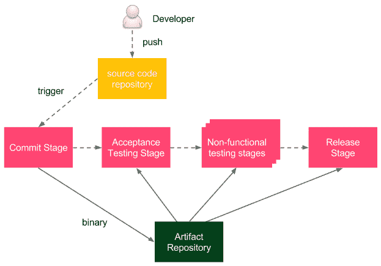
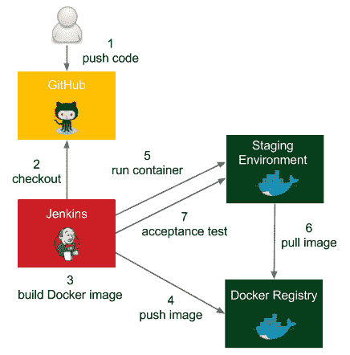
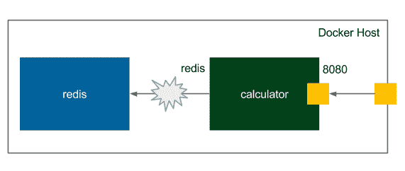
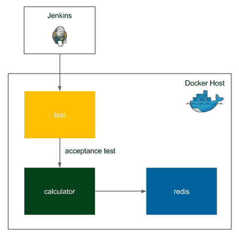
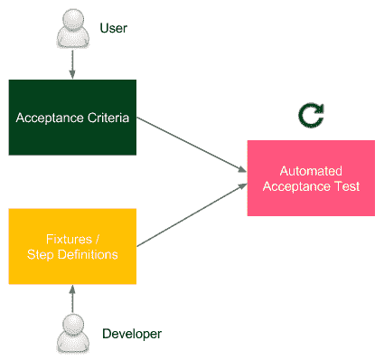
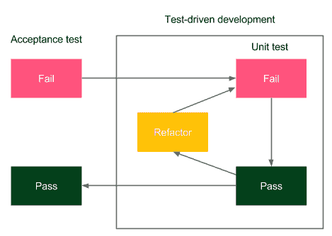

# 自动验收测试

我们已经配置了持续交付过程的提交阶段，现在是时候解决验收测试阶段了，这通常是最具挑战性的部分。通过逐渐扩展流水线，我们将看到验收测试自动化的不同方面。

本章涵盖以下内容：

+   介绍验收测试过程及其困难

+   解释工件存储库的概念

+   在 Docker Hub 上创建 Docker 注册表

+   安装和保护私有 Docker 注册表

+   在 Jenkins 流水线中实施验收测试

+   介绍和探索 Docker Compose

+   在验收测试过程中使用 Docker Compose

+   与用户一起编写验收测试

# 介绍验收测试

验收测试是为了确定业务需求或合同是否得到满足而进行的测试。它涉及对完整系统进行黑盒测试，从用户的角度来看，其积极的结果应意味着软件交付的验收。有时也称为用户验收测试（UAT）、最终用户测试或测试版测试，这是开发过程中软件满足*真实世界*受众的阶段。

许多项目依赖于由质量保证人员或用户执行的手动步骤来验证功能和非功能要求，但是，以编程可重复操作的方式运行它们要合理得多。

然而，自动验收测试可能被认为是困难的，因为它们具有特定的特点：

+   面向用户：它们需要与用户一起编写，这需要技术和非技术两个世界之间的理解。

+   依赖集成：被测试的应用程序应该与其依赖一起运行，以检查整个系统是否正常工作。

+   环境身份：暂存（测试）和生产环境应该是相同的，以确保在生产环境中运行时，应用程序也能如预期般运行。

+   应用程序身份：应用程序应该只构建一次，并且相同的二进制文件应该被传输到生产环境。这保证了在测试和发布之间没有代码更改，并消除了不同构建环境的风险。

+   相关性和后果：如果验收测试通过，应该清楚地表明应用程序从用户角度来看已经准备好发布。

我们在本章的不同部分解决了所有这些困难。通过仅构建一次 Docker 镜像并使用 Docker 注册表进行存储和版本控制，可以实现应用程序身份。Docker Compose 有助于集成依赖项，提供了一种构建一组容器化应用程序共同工作的方式。在“编写验收测试”部分解释了以用户为中心创建测试的方法，而环境身份则由 Docker 工具本身解决，并且还可以通过下一章描述的其他工具进行改进。关于相关性和后果，唯一的好答案是要记住验收测试必须始终具有高质量。

验收测试可能有多重含义；在本书中，我们将验收测试视为从用户角度进行的完整集成测试，不包括性能、负载和恢复等非功能性测试。

# Docker 注册表

Docker 注册表是用于存储 Docker 镜像的存储库。确切地说，它是一个无状态的服务器应用程序，允许在需要时发布（推送）和检索（拉取）镜像。我们已经在运行官方 Docker 镜像时看到了注册表的示例，比如`jenkins`。我们从 Docker Hub 拉取了这些镜像，这是一个官方的基于云的 Docker 注册表。使用单独的服务器来存储、加载和搜索软件包是一个更一般的概念，称为软件存储库，甚至更一般的是构件存储库。让我们更仔细地看看这个想法。

# 构件存储库

虽然源代码管理存储源代码，但构件存储库专门用于存储软件二进制构件，例如编译后的库或组件，以后用于构建完整的应用程序。为什么我们需要使用单独的工具在单独的服务器上存储二进制文件？

+   文件大小：构件文件可能很大，因此系统需要针对它们的下载和上传进行优化。

+   版本：每个上传的构件都需要有一个版本，这样可以方便浏览和使用。然而，并不是所有的版本都需要永久存储；例如，如果发现了一个 bug，我们可能对相关的构件不感兴趣并将其删除。

+   修订映射：每个构件应该指向源代码的一个确切修订版本，而且二进制创建过程应该是可重复的。

+   **包**：构件以编译和压缩的形式存储，因此这些耗时的步骤不需要重复进行。

+   **访问控制**：用户可以以不同方式限制对源代码和构件二进制文件的访问。

+   **客户端**：构件存储库的用户可以是团队或组织外的开发人员，他们希望通过其公共 API 使用库。

+   **用例**：构件二进制文件用于保证部署到每个环境的确切相同的构建版本，以便在失败情况下简化回滚过程。

最受欢迎的构件存储库是 JFrog Artifactory 和 Sonatype Nexus。

构件存储库在持续交付过程中扮演着特殊的角色，因为它保证了相同的二进制文件在所有流水线步骤中被使用。

让我们看一下下面的图，展示了它是如何工作的：



**开发人员**将更改推送到**源代码存储库**，这会触发流水线构建。作为**提交阶段**的最后一步，会创建一个二进制文件并存储在构件存储库中。之后，在交付过程的所有其他阶段中，都会拉取并使用相同的二进制文件。

构建的二进制文件通常被称为**发布候选版本**，将二进制文件移动到下一个阶段的过程称为**提升**。

根据编程语言和技术的不同，二进制格式可能会有所不同。

例如，在 Java 的情况下，通常会存储 JAR 文件，在 Ruby 的情况下会存储 gem 文件。我们使用 Docker，因此我们将 Docker 镜像存储为构件，并且用于存储 Docker 镜像的工具称为 Docker 注册表。

一些团队同时维护两个存储库，一个是用于 JAR 文件的构件存储库，另一个是用于 Docker 镜像的 Docker 注册表。虽然在 Docker 引入的第一阶段可能会有用，但没有理由永远维护两者。

# 安装 Docker 注册表

首先，我们需要安装一个 Docker 注册表。有许多选项可用，但其中两个比其他更常见，一个是基于云的 Docker Hub 注册表，另一个是您自己的私有 Docker 注册表。让我们深入了解一下。

# Docker Hub

Docker Hub 是一个提供 Docker 注册表和其他功能的基于云的服务，例如构建镜像、测试它们以及直接从代码存储库中拉取代码。Docker Hub 是云托管的，因此实际上不需要任何安装过程。你需要做的就是创建一个 Docker Hub 账户：

1.  在浏览器中打开[`hub.docker.com/`](https://hub.docker.com/)。

1.  填写密码、电子邮件地址和 Docker ID。

1.  收到电子邮件并点击激活链接后，帐户已创建。

Docker Hub 绝对是开始使用的最简单选项，并且允许存储私有和公共图像。

# 私有 Docker 注册表

Docker Hub 可能并不总是可接受的。对于企业来说，它并不免费，更重要的是，许多公司有政策不在其自己的网络之外存储其软件。在这种情况下，唯一的选择是安装私有 Docker 注册表。

Docker 注册表安装过程快速简单，但是要使其在公共环境中安全可用，需要设置访问限制和域证书。这就是为什么我们将这一部分分为三个部分：

+   安装 Docker 注册表应用程序

+   添加域证书

+   添加访问限制

# 安装 Docker 注册表应用程序

Docker 注册表可用作 Docker 镜像。要启动它，我们可以运行以下命令：

```
$ docker run -d -p 5000:5000 --restart=always --name registry registry:2
```

默认情况下，注册表数据存储为默认主机文件系统目录中的 docker 卷。要更改它，您可以添加`-v <host_directory>:/var/lib/registry`。另一种选择是使用卷容器。

该命令启动注册表并使其通过端口 5000 可访问。`registry`容器是从注册表镜像（版本 2）启动的。`--restart=always`选项导致容器在关闭时自动重新启动。

考虑设置负载均衡器，并在用户数量较大的情况下启动几个 Docker 注册表容器。

# 添加域证书

如果注册表在本地主机上运行，则一切正常，不需要其他安装步骤。但是，在大多数情况下，我们希望为注册表设置专用服务器，以便图像广泛可用。在这种情况下，Docker 需要使用 SSL/TLS 保护注册表。该过程与公共 Web 服务器配置非常相似，并且强烈建议使用 CA（证书颁发机构）签名证书。如果获取 CA 签名的证书不是一个选项，那么我们可以自签名证书或使用`--insecure-registry`标志。

您可以在[`docs.docker.com/registry/insecure/#using-self-signed-certificates`](https://docs.docker.com/registry/insecure/#using-self-signed-certificates)阅读有关创建和使用自签名证书的信息。

无论证书是由 CA 签名还是自签名，我们都可以将`domain.crt`和`domain.key`移动到`certs`目录并启动注册表。

```
$ docker run -d -p 5000:5000 --restart=always --name registry -v `pwd`/certs:/certs -e REGISTRY_HTTP_TLS_CERTIFICATE=/certs/domain.crt -e REGISTRY_HTTP_TLS_KEY=/certs/domain.key registry:2
```

在使用自签名证书的情况下，客户端必须明确信任该证书。为了做到这一点，他们可以将`domain.crt`文件复制到`/etc/docker/certs.d/<docker_host_domain>:5000/ca.crt`。

不建议使用`--insecure-registry`标志，因为它根本不提供安全性。

# 添加访问限制

除非我们在一个良好安全的私人网络中使用注册表，否则我们应该配置认证。

这样做的最简单方法是使用`registry`镜像中的`htpasswd`工具创建具有密码的用户：

```
$ mkdir auth
$ docker run --entrypoint htpasswd registry:2 -Bbn <username> <password> > auth/passwords
```

该命令运行`htpasswd`工具来创建`auth/passwords`文件（其中包含一个用户）。然后，我们可以使用一个授权访问它的用户来运行注册表：

```
$ docker run -d -p 5000:5000 --restart=always --name registry -v `pwd`/auth:/auth -e "REGISTRY_AUTH=htpasswd" -e "REGISTRY_AUTH_HTPASSWD_REALM=Registry Realm" -e REGISTRY_AUTH_HTPASSWD_PATH=/auth/passwords -v `pwd`/certs:/certs -e REGISTRY_HTTP_TLS_CERTIFICATE=/certs/domain.crt -e REGISTRY_HTTP_TLS_KEY=/certs/domain.key registry:2
```

该命令除了设置证书外，还创建了仅限于`auth/passwords`文件中指定的用户的访问限制。

因此，在使用注册表之前，客户端需要指定用户名和密码。

在`--insecure-registry`标志的情况下，访问限制不起作用。

# 其他 Docker 注册表

当涉及基于 Docker 的工件存储库时，Docker Hub 和私有注册表并不是唯一的选择。

其他选项如下：

+   通用存储库：广泛使用的通用存储库，如 JFrog Artifactory 或 Sonatype Nexus，实现了 Docker 注册表 API。它们的优势在于一个服务器可以存储 Docker 镜像和其他工件（例如 JAR 文件）。这些系统也是成熟的，并提供企业集成。

+   基于云的注册表：Docker Hub 并不是唯一的云提供商。大多数面向云的服务都在云中提供 Docker 注册表，例如 Google Cloud 或 AWS。

+   自定义注册表：Docker 注册表 API 是开放的，因此可以实现自定义解决方案。而且，镜像可以导出为文件，因此可以简单地将镜像存储为文件。

# 使用 Docker 注册表

当注册表配置好后，我们可以展示如何通过三个步骤与其一起工作：

+   构建镜像

+   将镜像推送到注册表

+   从注册表中拉取镜像

# 构建镜像

让我们使用第二章中的示例，*介绍 Docker*，并构建一个安装了 Ubuntu 和 Python 解释器的图像。在一个新目录中，我们需要创建一个 Dockerfile：

```
FROM ubuntu:16.04
RUN apt-get update && \
    apt-get install -y python
```

现在，我们可以构建图像：

```
$ docker build -t ubuntu_with_python .
```

# 推送图像

为了推送创建的图像，我们需要根据命名约定对其进行标记：

```
<registry_address>/<image_name>:<tag>
```

"`registry_address`"可以是：

+   在 Docker Hub 的情况下的用户名

+   私有注册表的域名或 IP 地址和端口（例如，`localhost:5000`）

在大多数情况下，`<tag>`的形式是图像/应用程序版本。

让我们标记图像以使用 Docker Hub：

```
$ docker tag ubuntu_with_python leszko/ubuntu_with_python:1
```

我们也可以在`build`命令中标记图像：`"docker`

`build -t leszko/ubuntu_with_python:1 . "`.

如果存储库配置了访问限制，我们需要首先授权它：

```
$ docker login --username <username> --password <password>
```

可以使用`docker login`命令而不带参数，并且 Docker 会交互式地要求用户名和密码。

现在，我们可以使用`push`命令将图像存储在注册表中：

```
$ docker push leszko/ubuntu_with_python:1
```

请注意，无需指定注册表地址，因为 Docker 使用命名约定来解析它。图像已存储，我们可以使用 Docker Hub Web 界面进行检查，该界面可在[`hub.docker.com`](https://hub.docker.com)上找到。

# 拉取图像

为了演示注册表的工作原理，我们可以在本地删除图像并从注册表中检索它：

```
$ docker rmi ubuntu_with_python leszko/ubuntu_with_python:1
```

我们可以使用`docker images`命令看到图像已被删除。然后，让我们从注册表中检索图像：

```
$ docker pull leszko/ubuntu_with_python:1
```

如果您使用免费的 Docker Hub 帐户，您可能需要在拉取之前将`ubuntu_with_python`存储库更改为公共。

我们可以使用`docker images`命令确认图像已经恢复。

当我们配置了注册表并了解了它的工作原理后，我们可以看到如何在持续交付流水线中使用它并构建验收测试阶段。

# 流水线中的验收测试

我们已经理解了验收测试的概念，并知道如何配置 Docker 注册表，因此我们已经准备好在 Jenkins 流水线中进行第一次实现。

让我们看一下呈现我们将使用的过程的图表：



该过程如下：

1.  开发人员将代码更改推送到 GitHub。

1.  Jenkins 检测到更改，触发构建并检出当前代码。

1.  Jenkins 执行提交阶段并构建 Docker 图像。

1.  Jenkins 将图像推送到 Docker 注册表。

1.  Jenkins 在暂存环境中运行 Docker 容器。

1.  部署 Docker 主机需要从 Docker 注册表中拉取镜像。

1.  Jenkins 对运行在暂存环境中的应用程序运行验收测试套件。

为了简单起见，我们将在本地运行 Docker 容器（而不是在单独的暂存服务器上）。为了远程运行它，我们需要使用`-H`选项或配置`DOCKER_HOST`环境变量。我们将在下一章中介绍这部分内容。

让我们继续上一章开始的流水线，并添加三个更多的阶段：

+   `Docker 构建`

+   `Docker push`

+   `验收测试`

请记住，您需要在 Jenkins 执行器（代理从属节点或主节点，在无从属节点配置的情况下）上安装 Docker 工具，以便它能够构建 Docker 镜像。

如果您使用动态配置的 Docker 从属节点，那么目前还没有提供成熟的 Docker 镜像。您可以自行构建，或者使用`leszko/jenkins-docker-slave`镜像。您还需要在 Docker 代理配置中标记`privileged`选项。然而，这种解决方案有一些缺点，因此在生产环境中使用之前，请阅读[`jpetazzo.github.io/2015/09/03/do-not-use-docker-in-docker-for-ci/`](http://jpetazzo.github.io/2015/09/03/do-not-use-docker-in-docker-for-ci/)。

# Docker 构建阶段

我们希望将计算器项目作为 Docker 容器运行，因此我们需要创建 Dockerfile，并在 Jenkinsfile 中添加`"Docker 构建"`阶段。

# 添加 Dockerfile

让我们在计算器项目的根目录中创建 Dockerfile：

```
FROM frolvlad/alpine-oraclejdk8:slim
COPY build/libs/calculator-0.0.1-SNAPSHOT.jar app.jar
ENTRYPOINT ["java", "-jar", "app.jar"]
```

Gradle 的默认构建目录是`build/libs/`，`calculator-0.0.1-SNAPSHOT.jar`是打包成一个 JAR 文件的完整应用程序。请注意，Gradle 自动使用 Maven 风格的版本`0.0.1-SNAPSHOT`对应用程序进行了版本化。

Dockerfile 使用包含 JDK 8 的基础镜像（`frolvlad/alpine-oraclejdk8:slim`）。它还复制应用程序 JAR（由 Gradle 创建）并运行它。让我们检查应用程序是否构建并运行：

```
$ ./gradlew build
$ docker build -t calculator .
$ docker run -p 8080:8080 --name calculator calculator
```

使用上述命令，我们已经构建了应用程序，构建了 Docker 镜像，并运行了 Docker 容器。过一会儿，我们应该能够打开浏览器，访问`http://localhost:8080/sum?a=1&b=2`，并看到`3`作为结果。

我们可以停止容器，并将 Dockerfile 推送到 GitHub 存储库：

```
$ git add Dockerfile
$ git commit -m "Add Dockerfile"
$ git push
```

# 将 Docker 构建添加到流水线

我们需要的最后一步是在 Jenkinsfile 中添加“Docker 构建”阶段。通常，JAR 打包也被声明为一个单独的`Package`阶段：

```
stage("Package") {
     steps {
          sh "./gradlew build"
     }
}

stage("Docker build") {
     steps {
          sh "docker build -t leszko/calculator ."
     }
}
```

我们没有明确为镜像版本，但每个镜像都有一个唯一的哈希 ID。我们将在下一章中介绍明确的版本控制。

请注意，我们在镜像标签中使用了 Docker 注册表名称。没有必要将镜像标记两次为“calculator”和`leszko/calculator`。

当我们提交并推送 Jenkinsfile 时，流水线构建应该会自动开始，我们应该看到所有的方框都是绿色的。这意味着 Docker 镜像已经成功构建。

还有一个适用于 Docker 的 Gradle 插件，允许在 Gradle 脚本中执行 Docker 操作。您可以在以下链接中看到一个示例：[`spring.io/guides/gs/spring-boot-docker/`](https://spring.io/guides/gs/spring-boot-docker/)。

# Docker push 阶段

当镜像准备好后，我们可以将其存储在注册表中。`Docker push`阶段非常简单。只需在 Jenkinsfile 中添加以下代码即可：

```
stage("Docker push") {
     steps {
          sh "docker push leszko/calculator"
     }
}
```

如果 Docker 注册表受到访问限制，那么首先我们需要使用`docker login`命令登录。不用说，凭据必须得到很好的保护，例如，使用专用凭据存储，如官方 Docker 页面上所述：[`docs.docker.com/engine/reference/commandline/login/#credentials-store`](https://docs.docker.com/engine/reference/commandline/login/#credentials-store)。

和往常一样，将更改推送到 GitHub 存储库会触发 Jenkins 开始构建，过一段时间后，我们应该会看到镜像自动存储在注册表中。

# 验收测试阶段

要执行验收测试，首先需要将应用程序部署到暂存环境，然后针对其运行验收测试套件。

# 向流水线添加一个暂存部署

让我们添加一个阶段来运行`calculator`容器：

```
stage("Deploy to staging") {
     steps {
          sh "docker run -d --rm -p 8765:8080 --name calculator leszko/calculator"
     }
}
```

运行此阶段后，`calculator`容器将作为守护程序运行，将其端口发布为`8765`，并在停止时自动删除。

# 向流水线添加一个验收测试

验收测试通常需要运行一个专门的黑盒测试套件，检查系统的行为。我们将在“编写验收测试”部分进行介绍。目前，为了简单起见，让我们通过使用`curl`工具调用 Web 服务端点并使用`test`命令检查结果来执行验收测试。

在项目的根目录中，让我们创建`acceptance_test.sh`文件：

```
#!/bin/bash
test $(curl localhost:8765/sum?a=1\&b=2) -eq 3
```

我们使用参数`a=1`和`b=2`调用`sum`端点，并期望收到`3`的响应。

然后，`Acceptance test`阶段可以如下所示：

```
stage("Acceptance test") {
     steps {
          sleep 60
          sh "./acceptance_test.sh"
     }
}
```

由于`docker run -d`命令是异步的，我们需要使用`sleep`操作来确保服务已经在运行。

没有好的方法来检查服务是否已经在运行。睡眠的替代方法可能是一个脚本，每秒检查服务是否已经启动。

# 添加一个清理阶段环境

作为验收测试的最后一步，我们可以添加分段环境清理。这样做的最佳位置是在`post`部分，以确保即使失败也会执行：

```
post {
     always {
          sh "docker stop calculator"
     }
}
```

这个声明确保`calculator`容器不再在 Docker 主机上运行。

# Docker Compose

没有依赖关系的生活是轻松的。然而，在现实生活中，几乎每个应用程序都链接到数据库、缓存、消息系统或另一个应用程序。在（微）服务架构的情况下，每个服务都需要一堆其他服务来完成其工作。单片架构并没有消除这个问题，一个应用程序通常至少有一些依赖，至少是数据库。

想象一位新人加入你的开发团队；设置整个开发环境并运行带有所有依赖项的应用程序需要多长时间？

当涉及到自动化验收测试时，依赖问题不再仅仅是便利的问题，而是变成了必要性。虽然在单元测试期间，我们可以模拟依赖关系，但验收测试套件需要一个完整的环境。我们如何快速设置并以可重复的方式进行？幸运的是，Docker Compose 是一个可以帮助的工具。

# 什么是 Docker Compose？

Docker Compose 是一个用于定义、运行和管理多容器 Docker 应用程序的工具。服务在配置文件（YAML 格式）中定义，并可以使用单个命令一起创建和运行。

Docker Compose 使用标准的 Docker 机制来编排容器，并提供了一种方便的方式来指定整个环境。

Docker Compose 具有许多功能，最有趣的是：

+   构建一组服务

+   一起启动一组服务

+   管理单个服务的状态

+   在运行之间保留卷数据

+   扩展服务的规模

+   显示单个服务的日志

+   在运行之间缓存配置和重新创建更改的容器

有关 Docker Compose 及其功能的详细描述，请参阅官方页面：[`docs.docker.com/compose/`](https://docs.docker.com/compose/)。

我们从安装过程开始介绍 Docker Compose 工具，然后介绍 docker-compose.yml 配置文件和`docker-compose`命令，最后介绍构建和扩展功能。

# 安装 Docker Compose

安装 Docker Compose 的最简单方法是使用 pip 软件包管理器：

您可以在[`pip.pypa.io/en/stable/installing/`](https://pip.pypa.io/en/stable/installing/)找到 pip 工具的安装指南，或者在 Ubuntu 上使用`sudo apt-get install python-pip`。

```
$ pip install docker-compose
```

要检查 Docker Compose 是否已安装，我们可以运行：

```
$ docker-compose --version
```

所有操作系统的安装指南都可以在[`docs.docker.com/compose/install/`](https://docs.docker.com/compose/install/)找到。

# 定义 docker-compose.yml

`docker-compose.yml`文件用于定义容器的配置、它们之间的关系和运行时属性。

换句话说，当 Dockerfile 指定如何创建单个 Docker 镜像时，`docker-compose.yml`指定了如何在 Docker 镜像之外设置整个环境。

`docker-compose.yml`文件格式有三个版本。在本书中，我们使用的是最新和推荐的版本 3。更多信息请阅读：[`docs.docker.com/compose/compose-file/compose-versioning/`](https://docs.docker.com/compose/compose-file/compose-versioning/)。

`docker-compose.yml`文件具有许多功能，所有这些功能都可以在官方页面找到：[`docs.docker.com/compose/compose-file/`](https://docs.docker.com/compose/compose-file/)。我们将在持续交付过程的上下文中介绍最重要的功能。

让我们从一个例子开始，假设我们的计算器项目使用 Redis 服务器进行缓存。在这种情况下，我们需要一个包含两个容器`calculator`和`redis`的环境。在一个新目录中，让我们创建`docker-compose.yml`文件。

```
version: "3"
services:
     calculator:
          image: calculator:latest
          ports:
               - 8080
     redis:
          image: redis:latest
```

环境配置如下图所示：



让我们来看看这两个容器的定义：

+   **redis**：来自官方 Docker Hub 最新版本的`redis`镜像的容器。

+   **calculator**：来自本地构建的`calculator`镜像的最新版本的容器。它将`8080`端口发布到 Docker 主机（这是`docker`命令的`-p`选项的替代）。该容器链接到`redis`容器，这意味着它们共享相同的网络，`redis` IP 地址在`calculator`容器内部的`redis`主机名下可见。

如果我们希望通过不同的主机名来访问服务（例如，通过 redis-cache 而不是 redis），那么我们可以使用链接关键字创建别名。

# 使用 docker-compose 命令

`docker-compose`命令读取定义文件并创建环境：

```
$ docker-compose up -d
```

该命令在后台启动了两个容器，`calculator`和`redis`（使用`-d`选项）。我们可以检查容器是否在运行：

```
$ docker-compose ps
 Name                   Command            State          Ports 
---------------------------------------------------------------------------
project_calculator_1   java -jar app.jar    Up     0.0.0.0:8080->8080/tcp
project_redis_1        docker-entrypoint.sh redis ... Up 6379/tcp
```

容器名称以项目名称`project`为前缀，该名称取自放置`docker-compose.yml`文件的目录的名称。我们可以使用`-p <project_name>`选项手动指定项目名称。由于 Docker Compose 是在 Docker 之上运行的，我们也可以使用`docker`命令来确认容器是否在运行：

```
$ docker ps
CONTAINER ID  IMAGE             COMMAND                 PORTS
360518e46bd3  calculator:latest "java -jar app.jar"     0.0.0.0:8080->8080/tcp 
2268b9f1e14b  redis:latest      "docker-entrypoint..."  6379/tcp
```

完成后，我们可以拆除环境：

```
$ docker-compose down
```

这个例子非常简单，但这个工具本身非常强大。通过简短的配置和一堆命令，我们可以控制所有服务的编排。在我们将 Docker Compose 用于验收测试之前，让我们看看另外两个 Docker Compose 的特性：构建镜像和扩展容器。

# 构建镜像

在前面的例子中，我们首先使用`docker build`命令构建了`calculator`镜像，然后可以在 docker-compose.yml 中指定它。还有另一种方法让 Docker Compose 构建镜像。在这种情况下，我们需要在配置中指定`build`属性而不是`image`。

让我们把`docker-compose.yml`文件放在计算器项目的目录中。当 Dockerfile 和 Docker Compose 配置在同一个目录中时，前者可以如下所示：

```
version: "3"
services:
     calculator:
          build: .
          ports:
               - 8080
     redis:
          image: redis:latest
```

`docker-compose build`命令构建镜像。我们还可以要求 Docker Compose 在运行容器之前构建镜像，使用`docker-compose --build up`命令。

# 扩展服务

Docker Compose 提供了自动创建多个相同容器实例的功能。我们可以在`docker-compose.yml`中指定`replicas: <number>`参数，也可以使用`docker-compose scale`命令。

例如，让我们再次运行环境并复制`calculator`容器：

```
$ docker-compose up -d
$ docker-compose scale calculator=5
```

我们可以检查正在运行的容器：

```
$ docker-compose ps
 Name                     Command             State Ports 
---------------------------------------------------------------------------
calculator_calculator_1   java -jar app.jar   Up   0.0.0.0:32777->8080/tcp
calculator_calculator_2   java -jar app.jar   Up   0.0.0.0:32778->8080/tcp
calculator_calculator_3   java -jar app.jar   Up   0.0.0.0:32779->8080/tcp
calculator_calculator_4   java -jar app.jar   Up   0.0.0.0:32781->8080/tcp
calculator_calculator_5   java -jar app.jar   Up   0.0.0.0:32780->8080/tcp
calculator_redis_1        docker-entrypoint.sh redis ... Up 6379/tcp
```

五个`calculator`容器完全相同，除了容器 ID、容器名称和发布端口号。

它们都使用相同的 Redis 容器实例。现在我们可以停止并删除所有容器：

```
$ docker-compose down
```

扩展容器是 Docker Compose 最令人印象深刻的功能之一。通过一个命令，我们可以扩展克隆实例的数量。Docker Compose 负责清理不再使用的容器。

我们已经看到了 Docker Compose 工具最有趣的功能。

在接下来的部分，我们将重点介绍如何在自动验收测试的情境中使用它。

# 使用 Docker Compose 进行验收测试

Docker Compose 非常适合验收测试流程，因为它可以通过一个命令设置整个环境。更重要的是，在测试完成后，也可以通过一个命令清理环境。如果我们决定在生产环境中使用 Docker Compose，那么另一个好处是验收测试使用的配置、工具和命令与发布的应用程序完全相同。

要了解如何在 Jenkins 验收测试阶段应用 Docker Compose，让我们继续计算器项目示例，并将基于 Redis 的缓存添加到应用程序中。然后，我们将看到两种不同的方法来运行验收测试：先 Jenkins 方法和先 Docker 方法。

# 使用多容器环境

Docker Compose 提供了容器之间的依赖关系；换句话说，它将一个容器链接到另一个容器。从技术上讲，这意味着容器共享相同的网络，并且一个容器可以从另一个容器中看到。为了继续我们的示例，我们需要在代码中添加这个依赖关系，我们将在几个步骤中完成。

# 向 Gradle 添加 Redis 客户端库

在`build.gradle`文件中，在`dependencies`部分添加以下配置：

```
compile "org.springframework.data:spring-data-redis:1.8.0.RELEASE"
compile "redis.clients:jedis:2.9.0"
```

它添加了负责与 Redis 通信的 Java 库。

# 添加 Redis 缓存配置

添加一个新文件`src/main/java/com/leszko/calculator/CacheConfig.java`：

```
package com.leszko.calculator;
import org.springframework.cache.CacheManager;
import org.springframework.cache.annotation.CachingConfigurerSupport;
import org.springframework.cache.annotation.EnableCaching;
import org.springframework.context.annotation.Bean;
import org.springframework.context.annotation.Configuration;
import org.springframework.data.redis.cache.RedisCacheManager;
import org.springframework.data.redis.connection.RedisConnectionFactory;
import org.springframework.data.redis.connection.jedis.JedisConnectionFactory;
import org.springframework.data.redis.core.RedisTemplate;

/** Cache config. */
@Configuration
@EnableCaching
public class CacheConfig extends CachingConfigurerSupport {
    private static final String REDIS_ADDRESS = "redis";

    @Bean
    public JedisConnectionFactory redisConnectionFactory() {
        JedisConnectionFactory redisConnectionFactory = new
          JedisConnectionFactory();
        redisConnectionFactory.setHostName(REDIS_ADDRESS);
        redisConnectionFactory.setPort(6379);
        return redisConnectionFactory;
    }

    @Bean
    public RedisTemplate<String, String> redisTemplate(RedisConnectionFactory cf) {
        RedisTemplate<String, String> redisTemplate = new RedisTemplate<String, 
          String>();
        redisTemplate.setConnectionFactory(cf);
        return redisTemplate;
    }

    @Bean
    public CacheManager cacheManager(RedisTemplate redisTemplate) {
        return new RedisCacheManager(redisTemplate);
    }
}
```

这是一个标准的 Spring 缓存配置。请注意，对于 Redis 服务器地址，我们使用`redis`主机名，这是由于 Docker Compose 链接机制自动可用。

# 添加 Spring Boot 缓存

当缓存配置好后，我们最终可以将缓存添加到我们的网络服务中。为了做到这一点，我们需要更改`src/main/java/com/leszko/calculator/Calculator.java`文件如下：

```
package com.leszko.calculator;
import org.springframework.cache.annotation.Cacheable;
import org.springframework.stereotype.Service;

/** Calculator logic */
@Service
public class Calculator {
    @Cacheable("sum")
    public int sum(int a, int b) {
        return a + b;
    }
}
```

从现在开始，求和计算将被缓存在 Redis 中，当我们调用`calculator`网络服务的`/sum`端点时，它将首先尝试从缓存中检索结果。

# 检查缓存环境

假设我们的 docker-compose.yml 在计算器项目的目录中，我们现在可以启动容器了：

```
$ ./gradlew clean build
$ docker-compose up --build -d
```

我们可以检查计算器服务发布的端口：

```
$ docker-compose port calculator 8080
0.0.0.0:32783
```

如果我们在`localhost:32783/sum?a=1&b=2`上打开浏览器，计算器服务应该回复`3`，同时访问`redis`服务并将缓存值存储在那里。为了查看缓存值是否真的存储在 Redis 中，我们可以访问`redis`容器并查看 Redis 数据库内部：

```
$ docker-compose exec redis redis-cli

127.0.0.1:6379> keys *
1) "\xac\xed\x00\x05sr\x00/org.springframework.cache.interceptor.SimpleKeyL\nW\x03km\x93\xd8\x02\x00\x02I\x00\bhashCode\x00\x06paramst\x00\x13[Ljava/lang/Object;xp\x00\x00\x03\xe2ur\x00\x13[Ljava.lang.Object;\x90\xceX\x9f\x10s)l\x02\x00\x00xp\x00\x00\x00\x02sr\x00\x11java.lang.Integer\x12\xe2\xa0\xa4\xf7\x81\x878\x02\x00\x01I\x00\x05valuexr\x00\x10java.lang.Number\x86\xac\x95\x1d\x0b\x94\xe0\x8b\x02\x00\x00xp\x00\x00\x00\x01sq\x00~\x00\x05\x00\x00\x00\x02"
2) "sum~keys"
```

`docker-compose exec`命令在`redis`容器内执行了`redis-cli`（Redis 客户端以浏览其数据库内容）命令。然后，我们可以运行`keys *`来打印 Redis 中存储的所有内容。

您可以通过计算器应用程序进行更多操作，并使用不同的值在浏览器中打开，以查看 Redis 服务内容增加。之后，重要的是使用`docker-compose down`命令拆除环境。

在接下来的章节中，我们将看到多容器项目的两种验收测试方法。显然，在 Jenkins 上采取任何行动之前，我们需要提交并推送所有更改的文件（包括`docker-compose.yml`）到 GitHub。

请注意，对于进一步的步骤，Jenkins 执行器上必须安装 Docker Compose。

# 方法 1 - 首先进行 Jenkins 验收测试

第一种方法是以与单容器应用程序相同的方式执行验收测试。唯一的区别是现在我们有两个容器正在运行，如下图所示：

![从用户角度来看，`redis`容器是不可见的，因此单容器和多容器验收测试之间唯一的区别是我们使用`docker-compose up`命令而不是`docker run`。其他 Docker 命令也可以用它们的 Docker Compose 等效命令替换：`docker-compose build` 替换 `docker build`，`docker-compose push` 替换 `docker push`。然而，如果我们只构建一个镜像，那么保留 Docker 命令也是可以的。# 改变暂存部署阶段让我们改变 `部署到暂存` 阶段来使用 Docker Compose：```stage("Deploy to staging") {    steps {        sh "docker-compose up -d"    }}```我们必须以完全相同的方式改变清理：```post {    always {        sh "docker-compose down"    }}```# 改变验收测试阶段为了使用 `docker-compose scale`，我们没有指定我们的 web 服务将发布在哪个端口号下。如果我们这样做了，那么扩展过程将失败，因为所有克隆将尝试在相同的端口号下发布。相反，我们让 Docker 选择端口。因此，我们需要改变 `acceptance_test.sh` 脚本，首先找出端口号是多少，然后使用正确的端口号运行 `curl`。```#!/bin/bashCALCULATOR_PORT=$(docker-compose port calculator 8080 | cut -d: -f2)test $(curl localhost:$CALCULATOR_PORT/sum?a=1\&b=2) -eq 3```让我们找出我们是如何找到端口号的：1.  `docker-compose port calculator 8080` 命令检查 web 服务发布在哪个 IP 和端口地址下（例如返回 `127.0.0.1:57648`）。1.  `cut -d: -f2` 选择只有端口（例如，对于 `127.0.0.1:57648`，它返回 `57648`）。我们可以将更改推送到 GitHub 并观察 Jenkins 的结果。这个想法和单容器应用程序的想法是一样的，设置环境，运行验收测试套件，然后拆除环境。尽管这种验收测试方法很好并且运行良好，让我们看看另一种解决方案。# 方法 2 – 先 Docker 验收测试在 Docker-first 方法中，我们创建了一个额外的 `test` 容器，它从 Docker 主机内部执行测试，如下图所示：

这种方法在检索端口号方面简化了验收测试脚本，并且可以在没有 Jenkins 的情况下轻松运行。它也更符合 Docker 的风格。

缺点是我们需要为测试目的创建一个单独的 Dockerfile 和 Docker Compose 配置。

# 为验收测试创建一个 Dockerfile

我们将首先为验收测试创建一个单独的 Dockerfile。让我们在计算器项目中创建一个新目录 `acceptance` 和一个 Dockerfile。

```
FROM ubuntu:trusty
RUN apt-get update && \
    apt-get install -yq curl
COPY test.sh .
CMD ["bash", "test.sh"]
```

它创建一个运行验收测试的镜像。

# 为验收测试创建一个 docker-compose.yml

在同一个目录下，让我们创建 `docker-compose-acceptance.yml` 来提供测试编排：

```
version: "3"
services:
    test:
        build: ./acceptance
```

它创建一个新的容器，链接到被测试的容器：`calculator`。而且，内部始终是 8080，这就消除了端口查找的麻烦部分。

# 创建验收测试脚本

最后缺失的部分是测试脚本。在同一目录下，让我们创建代表验收测试的`test.sh`文件：

```
#!/bin/bash
sleep 60
test $(curl calculator:8080/sum?a=1\&b=2) -eq 3
```

它与之前的验收测试脚本非常相似，唯一的区别是我们可以通过`calculator`主机名来访问计算器服务，端口号始终是`8080`。此外，在这种情况下，我们在脚本内等待，而不是在 Jenkinsfile 中等待。

# 运行验收测试

我们可以使用根项目目录下的 Docker Compose 命令在本地运行测试：

```
$ docker-compose -f docker-compose.yml -f acceptance/docker-compose-acceptance.yml -p acceptance up -d --build
```

该命令使用两个 Docker Compose 配置来运行`acceptance`项目。其中一个启动的容器应该被称为`acceptance_test_1`，并对其结果感兴趣。我们可以使用以下命令检查其日志：

```
$ docker logs acceptance_test_1
 %   Total %   Received % Xferd Average Speed Time 
 100 1     100 1        0 0     1       0     0:00:01
```

日志显示`curl`命令已成功调用。如果我们想要检查测试是成功还是失败，可以检查容器的退出代码：

```
$ docker wait acceptance_test_1
0
```

`0`退出代码表示测试成功。除了`0`之外的任何代码都意味着测试失败。测试完成后，我们应该像往常一样清理环境：

```
$ docker-compose -f docker-compose.yml -f acceptance/docker-compose-acceptance.yml -p acceptance down
```

# 更改验收测试阶段

最后一步，我们可以将验收测试执行添加到流水线中。让我们用一个新的**验收测试**阶段替换 Jenkinsfile 中的最后三个阶段：

```
stage("Acceptance test") {
    steps {
        sh "docker-compose -f docker-compose.yml 
                   -f acceptance/docker-compose-acceptance.yml build test"
        sh "docker-compose -f docker-compose.yml 
                   -f acceptance/docker-compose-acceptance.yml 
                   -p acceptance up -d"
        sh 'test $(docker wait acceptance_test_1) -eq 0'
    }
}
```

这一次，我们首先构建`test`服务。不需要构建`calculator`镜像；它已经在之前的阶段完成了。最后，我们应该清理环境：

```
post {
    always {
        sh "docker-compose -f docker-compose.yml 
                   -f acceptance/docker-compose-acceptance.yml 
                   -p acceptance down"
    }
}
```

在 Jenkinsfile 中添加了这个之后，我们就完成了第二种方法。我们可以通过将所有更改推送到 GitHub 来测试这一点。

# 比较方法 1 和方法 2

总之，让我们比较两种解决方案。第一种方法是从用户角度进行真正的黑盒测试，Jenkins 扮演用户的角色。优点是它非常接近于在生产中将要做的事情；最后，我们将通过其 Docker 主机访问容器。第二种方法是从另一个容器的内部测试应用程序。这种解决方案在某种程度上更加优雅，可以以简单的方式在本地运行；但是，它需要创建更多的文件，并且不像在生产中将来要做的那样通过其 Docker 主机调用应用程序。

在下一节中，我们将远离 Docker 和 Jenkins，更仔细地研究编写验收测试的过程。

# 编写验收测试

到目前为止，我们使用`curl`命令执行一系列验收测试。这显然是一个相当简化的过程。从技术上讲，如果我们编写一个 REST Web 服务，那么我们可以将所有黑盒测试写成一个大脚本，其中包含多个`curl`调用。然而，这种解决方案非常难以阅读、理解和维护。而且，这个脚本对非技术的业务相关用户来说完全无法理解。如何解决这个问题，创建具有良好结构、可读性强的测试，并满足其基本目标：自动检查系统是否符合预期？我将在本节中回答这个问题。

# 编写面向用户的测试

验收测试是为用户编写的，应该让用户能够理解。这就是为什么编写它们的方法取决于客户是谁。

例如，想象一个纯粹的技术人员。如果你编写了一个优化数据库存储的 Web 服务，而你的系统只被其他系统使用，并且只被其他开发人员读取，那么你的测试可以以与单元测试相同的方式表达。通常情况下，测试是好的，如果开发人员和用户都能理解。

在现实生活中，大多数软件都是为了提供特定的业务价值而编写的，而这个业务价值是由非开发人员定义的。因此，我们需要一种共同的语言来合作。一方面，业务了解需要什么，但不知道如何做；另一方面，开发团队知道如何做，但不知道需要什么。幸运的是，有许多框架可以帮助连接这两个世界，例如 Cucumber、FitNesse、JBehave、Capybara 等等。它们彼此之间有所不同，每一个都可能成为一本单独的书的主题；然而，编写验收测试的一般思想是相同的，并且可以用以下图表来表示：



**验收标准**由用户（或其代表产品所有者）与开发人员的帮助下编写。它们通常以以下场景的形式编写：

```
Given I have two numbers: 1 and 2
When the calculator sums them
Then I receive 3 as a result
```

开发人员编写称为**fixtures**或**步骤定义**的测试实现，将人性化的 DSL 规范与编程语言集成在一起。因此，我们有了一个可以很好集成到持续交付管道中的自动化测试。

不用说，编写验收测试是一个持续的敏捷过程，而不是瀑布式过程。这需要开发人员和业务方的不断协作，以改进和维护测试规范。

对于具有用户界面的应用程序，直接通过界面执行验收测试可能很诱人（例如，通过记录 Selenium 脚本）；然而，如果没有正确执行，这种方法可能导致测试速度慢且与界面层紧密耦合的问题。

让我们看看实践中编写验收测试的样子，以及如何将它们绑定到持续交付管道中。

# 使用验收测试框架

让我们使用黄瓜框架为计算器项目创建一个验收测试。如前所述，我们将分三步完成这个过程：

+   创建验收标准

+   创建步骤定义

+   运行自动化验收测试

# 创建验收标准

让我们将业务规范放在`src/test/resources/feature/calculator.feature`中：

```
Feature: Calculator
    Scenario: Sum two numbers
        Given I have two numbers: 1 and 2
        When the calculator sums them
        Then I receive 3 as a result
```

这个文件应该由用户在开发人员的帮助下创建。请注意，它是以非技术人员可以理解的方式编写的。

# 创建步骤定义

下一步是创建 Java 绑定，以便特性规范可以被执行。为了做到这一点，我们创建一个新文件`src/test/java/acceptance/StepDefinitions.java`：

```
package acceptance;

import cucumber.api.java.en.Given;
import cucumber.api.java.en.Then;
import cucumber.api.java.en.When;
import org.springframework.web.client.RestTemplate;

import static org.junit.Assert.assertEquals;

/** Steps definitions for calculator.feature */
public class StepDefinitions {
    private String server = System.getProperty("calculator.url");

    private RestTemplate restTemplate = new RestTemplate();

    private String a;
    private String b;
    private String result;

    @Given("^I have two numbers: (.*) and (.*)$")
    public void i_have_two_numbers(String a, String b) throws Throwable {
        this.a = a;
        this.b = b;
    }

    @When("^the calculator sums them$")
    public void the_calculator_sums_them() throws Throwable {
        String url = String.format("%s/sum?a=%s&b=%s", server, a, b);
        result = restTemplate.getForObject(url, String.class);
    }

    @Then("^I receive (.*) as a result$")
    public void i_receive_as_a_result(String expectedResult) throws Throwable {
        assertEquals(expectedResult, result);
    }
}
```

特性规范文件中的每一行（`Given`，`When`和`Then`）都与 Java 代码中相应的方法匹配。通配符`(.*)`作为参数传递。请注意，服务器地址作为 Java 属性`calculator.url`传递。该方法执行以下操作：

+   `i_have_two_numbers`：将参数保存为字段

+   `the_calculator_sums_them`：调用远程计算器服务并将结果存储在字段中

+   `i_receive_as_a_result`：断言结果是否符合预期

# 运行自动化验收测试

要运行自动化测试，我们需要进行一些配置：

1.  **添加 Java 黄瓜库**：在`build.gradle`文件中，将以下代码添加到`dependencies`部分：

```
        testCompile("info.cukes:cucumber-java:1.2.4")
        testCompile("info.cukes:cucumber-junit:1.2.4")
```

1.  **添加 Gradle 目标**：在同一文件中，添加以下代码：

```
       task acceptanceTest(type: Test) {
            include '**/acceptance/**'
            systemProperties System.getProperties()
       }

       test {
            exclude '**/acceptance/**'
       }
```

这将测试分为单元测试（使用`./gradlew test`运行）和验收测试（使用`./gradlew acceptanceTest`运行）。

1.  **添加 JUnit 运行器**：添加一个新文件`src/test/java/acceptance/AcceptanceTest.java`：

```
        package acceptance;

        import cucumber.api.CucumberOptions;
        import cucumber.api.junit.Cucumber;
        import org.junit.runner.RunWith;

        /** Acceptance Test */
        @RunWith(Cucumber.class)
        @CucumberOptions(features = "classpath:feature")
        public class AcceptanceTest { }
```

这是验收测试套件的入口点。

在进行此配置之后，如果服务器正在本地主机上运行，我们可以通过执行以下代码来测试它：

```
$ ./gradlew acceptanceTest -Dcalculator.url=http://localhost:8080
```

显然，我们可以将此命令添加到我们的`acceptance_test.sh`中，而不是`curl`命令。这将使 Cucumber 验收测试在 Jenkins 流水线中运行。

# 验收测试驱动开发

与持续交付过程的大多数方面一样，验收测试更多地关乎人而不是技术。测试质量当然取决于用户和开发人员的参与，但也取决于测试创建的时间，这可能不太直观。

最后一个问题是，在软件开发生命周期的哪个阶段应准备验收测试？或者换句话说，我们应该在编写代码之前还是之后创建验收测试？

从技术上讲，结果是一样的；代码既有单元测试，也有验收测试覆盖。然而，考虑先编写测试的想法是很诱人的。TDD（测试驱动开发）的理念可以很好地适用于验收测试。如果在编写代码之前编写单元测试，结果代码会更清洁、结构更好。类似地，如果在系统功能之前编写验收测试，结果功能将更符合客户的需求。这个过程，通常称为验收测试驱动开发，如下图所示：



用户与开发人员以人性化的 DSL 格式编写验收标准规范。开发人员编写固定装置，测试失败。然后，使用 TDD 方法进行内部功能开发。功能完成后，验收测试应该通过，这表明功能已完成。

一个非常好的做法是将 Cucumber 功能规范附加到问题跟踪工具（例如 JIRA）中的请求票据上，以便功能总是与其验收测试一起请求。一些开发团队采取了更激进的方法，拒绝在没有准备验收测试的情况下开始开发过程。毕竟，这是有道理的，*你怎么能开发客户无法测试的东西呢？*

# 练习

在本章中，我们涵盖了很多新材料，为了更好地理解，我们建议做练习，并创建自己的验收测试项目：

1.  创建一个基于 Ruby 的 Web 服务`book-library`来存储书籍：

验收标准以以下 Cucumber 功能的形式交付：

```
Scenario: Store book in the library
Given: Book "The Lord of the Rings" by "J.R.R. Tolkien" with ISBN number  
"0395974682"
When: I store the book in library
Then: I am able to retrieve the book by the ISBN number
```

+   +   为 Cucumber 测试编写步骤定义

+   编写 Web 服务（最简单的方法是使用 Sinatra 框架：[`www.sinatrarb.com/`](http://www.sinatrarb.com/)，但您也可以使用 Ruby on Rails）。

+   书应具有以下属性：名称，作者和 ISBN。

+   Web 服务应具有以下端点：

+   POST`/books/`以添加书籍

+   GET`books/<isbn>`以检索书籍

+   数据可以存储在内存中。

+   最后，检查验收测试是否通过。

1.  将“book-library”添加为 Docker 注册表中的 Docker 图像：

1.  +   在 Docker Hub 上创建一个帐户。

+   为应用程序创建 Dockerfile。

+   构建 Docker 图像并根据命名约定对其进行标记。

+   将图像推送到 Docker Hub。

1.  创建 Jenkins 流水线以构建 Docker 图像，将其推送到 Docker 注册表并执行验收测试：

+   +   创建一个“Docker 构建”阶段。

+   创建“Docker 登录”和“Docker 推送”阶段。

+   创建一个执行验收测试的“测试”容器，并使用 Docker Compose 执行测试。

+   在流水线中添加“验收测试”阶段。

+   运行流水线并观察结果。

# 摘要

在本章中，您学会了如何构建完整和功能齐全的验收测试阶段，这是持续交付过程的重要组成部分。本章的关键要点：

+   接受测试可能很难创建，因为它们结合了技术挑战（应用程序依赖关系，环境设置）和个人挑战（开发人员与业务的合作）。

+   验收测试框架提供了一种以人类友好的语言编写测试的方法，使非技术人员能够理解。

+   Docker 注册表是 Docker 镜像的工件存储库。

+   Docker 注册表与持续交付流程非常匹配，因为它提供了一种在各个阶段和环境中使用完全相同的 Docker 镜像的方式。

+   Docker Compose 编排一组相互交互的 Docker 容器。它还可以构建镜像和扩展容器。

+   Docker Compose 可以帮助在运行一系列验收测试之前设置完整的环境。

+   验收测试可以编写为 Docker 镜像，Docker Compose 可以运行完整的环境以及测试，并提供结果。

在下一章中，我们将介绍完成持续交付流水线所需的缺失阶段。
