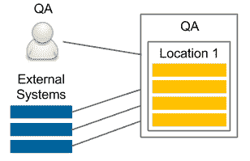
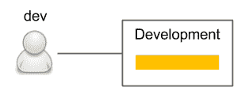

# 持续交付流水线

我们已经涵盖了持续交付过程中最关键的部分：提交阶段、构件存储库、自动验收测试和配置管理。

在本章中，我们将重点关注最终流水线的缺失部分，即环境和基础设施、应用程序版本控制和非功能性测试。

本章涵盖以下要点：

+   设计不同的软件环境及其基础设施

+   保护 Jenkins 代理和服务器之间的连接

+   引入各种非功能性测试

+   介绍持续交付过程中非功能性测试的挑战

+   解释不同类型的应用程序版本控制

+   完成持续交付流水线

+   介绍烟雾测试的概念并将其添加到最终流水线中

# 环境和基础设施

到目前为止，我们总是使用一个 Docker 主机来处理一切，并将其视为无尽资源的虚拟化，我们可以在其中部署一切。显然，Docker 主机实际上可以是一组机器，我们将在接下来的章节中展示如何使用 Docker Swarm 创建它。然而，即使 Docker 主机在资源方面是无限的，我们仍然需要考虑底层基础设施，至少有两个原因：

+   机器的物理位置很重要

+   不应在生产物理机器上进行测试

考虑到这些事实，在本节中，我们将讨论不同类型的环境，在持续交付过程中的作用以及基础设施安全方面。

# 环境类型

有四种最常见的环境类型：生产、暂存、QA（测试）和开发。让我们讨论每种环境及其基础设施。

# 生产

生产环境是最终用户使用的环境。它存在于每家公司中，当然，它是最重要的环境。

让我们看看下面的图表，看看大多数生产环境是如何组织的：


用户通过负载均衡器访问服务，负载均衡器选择确切的机器。如果应用程序在多个物理位置发布，那么（首先）设备通常是基于 DNS 的地理负载均衡器。在每个位置，我们都有一个服务器集群。如果我们使用 Docker，那么这个服务器集群可以隐藏在一个或多个 Docker 主机后面（这些主机在内部由使用 Docker Swarm 的许多机器组成）。

机器的物理位置很重要，因为请求-响应时间可能会因物理距离而有显着差异。此外，数据库和其他依赖服务应该位于靠近部署服务的机器上。更重要的是，数据库应该以一种方式进行分片，以使不同位置之间的复制开销最小化。否则，我们可能会等待数据库在彼此相距很远的实例之间达成共识。有关物理方面的更多细节超出了本书的范围，但重要的是要记住，Docker 并不总是解决问题的灵丹妙药。

容器化和虚拟化使您可以将服务器视为无限资源；然而，一些物理方面，如位置，仍然相关。

# 暂存

暂存环境是发布候选版本部署的地方，以便在上线之前进行最终测试。理想情况下，这个环境应该是生产环境的镜像。

让我们看看以下内容，以了解在交付过程的背景下，这样的环境应该是什么样子的：


请注意，暂存环境是生产的精确克隆。如果应用程序在多个位置部署，那么暂存环境也应该有多个位置。

在持续交付过程中，所有自动接受功能和非功能测试都针对这个环境运行。虽然大多数功能测试通常不需要相同的类似生产的基础设施，但在非功能（尤其是性能）测试的情况下，这是必须的。

为了节省成本，暂存基础设施与生产环境不同（通常包含较少的机器）并不罕见。然而，这种方法可能导致许多生产问题。 *Michael T. Nygard* 在他的著作 *Release It!* 中举了一个真实场景的例子，其中暂存环境使用的机器比生产环境少。

故事是这样的：在某家公司，系统一直很稳定，直到某个代码更改导致生产环境变得极其缓慢，尽管所有压力测试都通过了。这是怎么可能的？事实上，有一个同步点，每个服务器都要与其他服务器通信。在暂存环境中，只有一个服务器，所以实际上没有阻塞。然而，在生产环境中，有许多服务器，导致服务器相互等待。这个例子只是冰山一角，如果暂存环境与生产环境不同，许多生产问题可能无法通过验收测试来测试。

# QA

QA 环境（也称为测试环境）旨在供 QA 团队进行探索性测试，以及依赖我们服务的外部应用程序进行集成测试。QA 环境的用例和基础设施如下图所示：



虽然暂存环境不需要稳定（在持续交付的情况下，它在每次提交到存储库的代码更改后都会更改），但 QA 实例需要提供一定的稳定性，并公开与生产环境相同（或向后兼容）的 API。与暂存环境相反，基础设施可以与生产环境不同，因为其目的不是确保发布候选版本正常工作。

一个非常常见的情况是为了 QA 实例的目的分配较少的机器（例如，只来自一个位置）。

部署到 QA 环境通常是在一个单独的流水线中进行的，这样它就可以独立于自动发布流程。这种方法很方便，因为 QA 实例的生命周期与生产环境不同（例如，QA 团队可能希望对从主干分支出来的实验性代码进行测试）。

# 开发

开发环境可以作为所有开发人员共享的服务器创建，或者每个开发人员可以拥有自己的开发环境。这里呈现了一个简单的图表：



开发环境始终包含代码的最新版本。它用于实现开发人员之间的集成，并且可以像 QA 环境一样对待，但是由开发人员而不是 QA 使用。

# 持续交付中的环境

对于持续交付过程，暂存环境是必不可少的。在一些非常罕见的情况下，当性能不重要且项目没有太多依赖性时，我们可以在本地（开发）Docker 主机上执行验收测试（就像我们在上一章中所做的那样），但这应该是一个例外，而不是规则。在这种情况下，我们总是面临与环境相关的一些生产问题的风险。

其他环境通常对于持续交付并不重要。如果我们希望在每次提交时部署到 QA 或开发环境，那么我们可以为此创建单独的流水线（小心不要混淆主要发布流水线）。在许多情况下，部署到 QA 环境是手动触发的，因为它可能与生产环境有不同的生命周期。

# 保护环境

所有环境都需要得到很好的保护。这是明显的。更明显的是，最重要的要求是保持生产环境的安全，因为我们的业务取决于它，任何安全漏洞的后果在那里可能是最严重的。

安全是一个广泛的话题。在本节中，我们只关注与持续交付过程相关的主题。然而，建立完整的服务器基础设施需要更多关于安全的知识。

在持续交付过程中，从属必须能够访问服务器，以便它可以部署应用程序。

提供从属机器与服务器凭据的不同方法：

+   **将 SSH 密钥放入从属中：**如果我们不使用动态 Docker 从属配置，那么我们可以配置 Jenkins 从属机器以包含私有 SSH 密钥。

+   **将 SSH 密钥放入从属镜像中：**如果我们使用动态 Docker 从属配置，我们可以将 SSH 私钥添加到 Docker 从属镜像中。然而，这会产生可能的安全漏洞，因为任何访问该镜像的人都将可以访问生产服务器。

+   **Jenkins 凭据**：我们可以配置 Jenkins 来存储凭据并在流程中使用它们。

+   **复制到从属 Jenkins 插件**：我们可以在启动 Jenkins 构建时动态地将 SSH 密钥复制到从属系统中。

每种解决方案都有一些优点和缺点。在使用任何一种解决方案时，我们都必须格外小心，因为当一个从属系统可以访问生产环境时，任何人入侵从属系统就等于入侵生产环境。

最危险的解决方案是将 SSH 私钥放入 Jenkins 从属系统镜像中，因为镜像存储的所有地方（Docker 注册表或带有 Jenkins 的 Docker 主机）都需要得到很好的保护。

# 非功能性测试

在上一章中，我们学到了很多关于功能需求和自动化验收测试。然而，对于非功能性需求，我们应该怎么办呢？甚至更具挑战性的是，如果没有需求怎么办？在持续交付过程中，我们应该完全跳过它们吗？让我们在本节中回答这些问题。

软件的非功能性方面总是重要的，因为它们可能对系统的运行造成重大风险。

例如，许多应用程序失败，是因为它们无法承受用户数量突然增加的负载。在《可用性工程》一书中，Jakob Nielsen 写道，1.0 秒是用户思维流程保持不间断的极限。想象一下，我们的系统在负载增加的情况下开始超过这个极限。用户可能会因为性能问题而停止使用服务。考虑到这一点，非功能性测试与功能性测试一样重要。

长话短说，我们应该始终为非功能性测试采取以下步骤：

+   决定哪些非功能性方面对我们的业务至关重要

+   对于每一个：

+   指定测试的方式与我们为验收测试所做的方式相同

+   在持续交付流程中添加一个阶段（在验收测试之后，应用程序仍然部署在暂存环境中）

+   应用程序只有在所有非功能性测试通过后才能进入发布阶段

无论非功能性测试的类型如何，其思想总是相同的。然而，方法可能略有不同。让我们来看看不同的测试类型以及它们带来的挑战。

# 非功能性测试的类型

功能测试总是与系统行为相关。相反，非功能测试涉及许多不同的方面。让我们讨论最常见的系统属性以及它们如何在持续交付过程中进行测试。

# 性能测试

性能测试是最广泛使用的非功能测试。它们衡量系统的响应能力和稳定性。我们可以创建的最简单的性能测试是向 Web 服务发送请求并测量其往返时间（RTT）。

性能测试有不同的定义。在许多地方，它们意味着包括负载、压力和可伸缩性测试。有时它们也被描述为白盒测试。在本书中，我们将性能测试定义为衡量系统延迟的最基本的黑盒测试形式。

为了进行性能测试，我们可以使用专用框架（对于 Java 来说，最流行的是 JMeter），或者只是使用我们用于验收测试的相同工具。一个简单的性能测试通常被添加为管道阶段，就在验收测试之后。如果往返时间超过给定限制，这样的测试应该失败，并且它可以检测到明显减慢服务的错误。

Jenkins 的 JMeter 插件可以显示随时间变化的性能趋势。

# 负载测试

负载测试用于检查系统在有大量并发请求时的功能。虽然系统对单个请求可能非常快，但这并不意味着它在同时处理 1000 个请求时速度足够快。在负载测试期间，我们测量许多并发调用的平均请求-响应时间，通常是从许多机器上执行的。负载测试是发布周期中非常常见的 QA 阶段。为了自动化它，我们可以使用与简单性能测试相同的工具；然而，在较大系统的情况下，我们可能需要一个单独的客户端环境来执行大量并发请求。

# 压力测试

压力测试，也称为容量测试或吞吐量测试，是一种确定多少并发用户可以访问我们的服务的测试。这听起来与负载测试相同；然而，在负载测试的情况下，我们将并发用户数量（吞吐量）设置为一个给定的数字，检查响应时间（延迟），并且如果超过限制，则使构建失败。然而，在压力测试期间，我们保持延迟恒定，并增加吞吐量以发现系统仍然可操作时的最大并发调用数量。因此，压力测试的结果可能是通知我们的系统可以处理 10,000 个并发用户，这有助于我们为高峰使用时间做好准备。

压力测试不太适合连续交付流程，因为它需要进行长时间的测试，同时并发请求数量不断增加。它应该准备为一个独立的脚本或一个独立的 Jenkins 流水线，并在需要时触发，当我们知道代码更改可能会导致性能问题时。

# 可扩展性测试

可扩展性测试解释了当我们增加更多服务器或服务时延迟和吞吐量的变化。完美的特征应该是线性的，这意味着如果我们有一个服务器，当有 100 个并行用户使用时，平均请求-响应时间为 500 毫秒，那么添加另一个服务器将保持响应时间不变，并允许我们添加另外 100 个并行用户。然而，在现实中，由于保持服务器之间的数据一致性，通常很难实现这一点。

可扩展性测试应该是自动化的，并且应该提供图表，展示机器数量和并发用户数量之间的关系。这些数据有助于确定系统的限制以及增加更多机器不会有所帮助的点。

可扩展性测试，类似于压力测试，很难放入连续交付流程中，而应该保持独立。

# 耐久测试

耐久测试，也称为长期测试，长时间运行系统，以查看性能是否在一定时间后下降。它们可以检测内存泄漏和稳定性问题。由于它们需要系统长时间运行，因此在连续交付流程中运行它们是没有意义的。

# 安全测试

安全测试涉及与安全机制和数据保护相关的不同方面。一些安全方面纯粹是功能需求，例如身份验证、授权或角色分配。这些部分应该与任何其他功能需求一样在验收测试阶段进行检查。还有其他安全方面是非功能性的；例如，系统应该受到 SQL 注入的保护。没有客户可能会明确指定这样的要求，但这是隐含的。

安全测试应该作为连续交付的一个流水线阶段包括在内。它们可以使用与验收测试相同的框架编写，也可以使用专门的安全测试框架，例如 BDD 安全。

安全也应始终成为解释性测试过程的一部分，测试人员和安全专家会发现安全漏洞并添加新的测试场景。

# 可维护性测试

可维护性测试解释了系统维护的简单程度。换句话说，它们评判了代码质量。我们已经在提交阶段有了相关的阶段，检查测试覆盖率并进行静态代码分析。Sonar 工具也可以提供一些关于代码质量和技术债务的概述。

# 恢复测试

恢复测试是一种确定系统在因软件或硬件故障而崩溃后能够多快恢复的技术。最好的情况是，即使系统的一部分服务停止，系统也不会完全崩溃。一些公司甚至会故意进行生产故障，以检查他们是否能够在灾难中生存。最著名的例子是 Netflix 和他们的混沌猴工具，该工具会随机终止生产环境的随机实例。这种方法迫使工程师编写能够使系统对故障具有弹性的代码。

恢复测试显然不是连续交付过程的一部分，而是定期事件，用于检查整体健康状况。

您可以在[`github.com/Netflix/chaosmonkey`](https://github.com/Netflix/chaosmonkey)了解更多关于混沌猴的信息。

还有许多与代码和持续交付过程更接近或更远的非功能测试类型。其中一些与法律相关，如合规性测试；其他与文档或国际化相关。还有可用性测试和容量测试（检查系统在大量数据情况下的表现）。然而，大多数这些测试在持续交付过程中并没有任何作用。

# 非功能挑战

非功能方面给软件开发和交付带来了新的挑战：

+   **长时间运行测试**：测试可能需要很长时间运行，并且可能需要特殊的执行环境。

+   **增量性质**：很难设置测试应该在何时失败的限值（除非 SLA 定义得很好）。即使设置了边缘限制，应用程序也可能逐渐接近限制。实际上，在大多数情况下，没有任何代码更改导致测试失败。

+   **模糊的需求**：用户通常对非功能需求没有太多的输入。他们可能会提供一些关于请求-响应时间或用户数量的指导，但他们可能不会太了解可维护性、安全性或可扩展性。

+   **多样性**：有很多不同的非功能测试，选择应该实施哪些需要做一些妥协。

解决非功能方面的最佳方法是采取以下步骤：

1.  列出所有非功能测试类型。

1.  明确划掉您的系统不需要的测试。您可能不需要某种测试的原因有很多，例如：

+   该服务非常小，简单的性能测试就足够了

+   该系统仅内部使用，仅供只读，因此可能不需要进行任何安全检查。

+   该系统仅设计用于一台机器，不需要任何扩展

+   创建某些测试的成本太高

1.  将您的测试分为两组：

+   **持续交付**：可以将其添加到流水线中

+   **分析**：由于执行时间、性质或相关成本，无法将其添加到流水线中

1.  对于持续交付组，实施相关的流水线阶段。

1.  对于分析组：

+   创建自动化测试

+   安排何时运行它们

+   安排会议讨论它们的结果并制定行动计划

一个非常好的方法是进行夜间构建，其中包括不适合持续交付流程的长时间测试。然后，可以安排每周一次的会议来监视和分析系统性能的趋势。

正如所述，有许多类型的非功能性测试，它们给交付过程带来了额外的挑战。然而，为了系统的稳定性，这些测试绝不能被简单地跳过。技术实现因测试类型而异，但在大多数情况下，它们可以以类似的方式实现功能验收测试，并应该针对暂存环境运行。

如果您对非功能性测试、系统属性和系统稳定性感兴趣，请阅读 Michael T. Nygard 的书《发布它！》。

# 应用版本控制

到目前为止，在每次 Jenkins 构建期间，我们都创建了一个新的 Docker 镜像，将其推送到 Docker 注册表，并在整个过程中使用**最新**版本。然而，这种解决方案至少有三个缺点：

+   如果在 Jenkins 构建期间，在验收测试之后，有人推送了图像的新版本，那么我们可能会发布未经测试的版本。

+   我们总是推送以相同方式命名的镜像；因此，在 Docker 注册表中，它被有效地覆盖了。

+   仅通过哈希样式 ID 来管理没有版本的图像非常困难

管理 Docker 镜像版本与持续交付过程的推荐方式是什么？在本节中，我们将看到不同的版本控制策略，并学习在 Jenkins 流水线中创建版本的不同方法。

# 版本控制策略

有不同的应用版本控制方式。

让我们讨论这些最流行的解决方案，这些解决方案可以与持续交付过程一起应用（每次提交都创建一个新版本）。

+   语义化版本控制：最流行的解决方案是使用基于序列的标识符（通常以 x.y.z 的形式）。这种方法需要 Jenkins 在存储库中进行提交，以增加当前版本号，通常存储在构建文件中。这种解决方案得到了 Maven、Gradle 和其他构建工具的良好支持。标识符通常由三个数字组成。

+   **x**：这是主要版本；当增加此版本时，软件不需要向后兼容

+   **y**：这是次要版本；当增加版本时，软件需要向后兼容

+   **z:** 这是构建编号；有时也被认为是向后和向前兼容的更改

+   **时间戳**：对于应用程序版本，使用构建的日期和时间比顺序号更简洁，但在持续交付过程中非常方便，因为它不需要 Jenkins 向存储库提交。

+   **哈希**：随机生成的哈希版本具有日期时间的好处，并且可能是可能的最简单的解决方案。缺点是无法查看两个版本并告诉哪个是最新的。

+   **混合**：有许多先前描述的解决方案的变体，例如，带有日期时间的主要和次要版本。

所有解决方案都可以与持续交付流程一起使用。语义化版本控制要求从构建执行向存储库提交，以便在源代码存储库中增加版本。

Maven（和其他构建工具）推广了版本快照，为未发布的版本添加了后缀 SNAPSHOT，但仅用于开发过程。由于持续交付意味着发布每个更改，因此没有快照。

# Jenkins 流水线中的版本控制

正如前面所述，使用软件版本控制时有不同的可能性，每种可能性都可以在 Jenkins 中实现。

举个例子，让我们使用日期时间。

为了使用 Jenkins 中的时间戳信息，您需要安装 Build Timestamp 插件，并在 Jenkins 配置中设置时间戳格式（例如为"yyyyMMdd-HHmm"）。

在我们使用 Docker 镜像的每个地方，我们需要添加标签后缀：`${BUILD_TIMESTAMP}`。

例如，`Docker 构建`阶段应该是这样的：

```
sh "docker build -t leszko/calculator:${BUILD_TIMESTAMP} ."
```

更改后，当我们运行 Jenkins 构建时，我们应该在我们的 Docker 注册表中使用时间戳版本标记图像。

请注意，在显式标记图像后，它不再隐式标记为最新版本。

版本控制完成后，我们终于准备好完成持续交付流程。

# 完成持续交付流程

在讨论了 Ansible、环境、非功能测试和版本控制的所有方面后，我们准备扩展 Jenkins 流水线并完成一个简单但完整的持续交付流程。

我们将分几步来完成：

+   创建暂存和生产环境清单

+   更新验收测试以使用远程主机（而不是本地）

+   将应用程序发布到生产环境

+   添加一个冒烟测试，确保应用程序已成功发布

# 清单

在最简单的形式中，我们可以有两个环境：暂存和生产，每个环境都有一个 Docker 主机。在现实生活中，如果我们希望在不同位置拥有服务器或具有不同要求，可能需要为每个环境添加更多的主机组。

让我们创建两个 Ansible 清单文件。从暂存开始，我们可以定义`inventory/staging`文件。假设暂存地址是`192.168.0.241`，它将具有以下内容：

```
[webservers]
web1 ansible_host=192.168.0.241 ansible_user=admin
```

类比而言，如果生产 IP 地址是`192.168.0.242`，那么`inventory/production`应该如下所示：

```
[webservers]
web2 ansible_host=192.168.0.242 ansible_user=admin
```

只为每个环境拥有一个机器可能看起来过于简化了；然而，使用 Docker Swarm（我们稍后在本书中展示），一组主机可以隐藏在一个 Docker 主机后面。

有了定义的清单，我们可以更改验收测试以使用暂存环境。

# 验收测试环境

根据我们的需求，我们可以通过在本地 Docker 主机上运行应用程序（就像我们在上一章中所做的那样）或者使用远程暂存环境来测试应用程序。前一种解决方案更接近于生产中发生的情况，因此可以被认为是更好的解决方案。这与上一章的*方法 1：首先使用 Jenkins 验收测试*部分非常接近。唯一的区别是现在我们将应用程序部署到远程 Docker 主机上。

为了做到这一点，我们可以使用带有`-H`参数的`docker`（或`docker-compose`命令），该参数指定了远程 Docker 主机地址。这将是一个很好的解决方案，如果您不打算使用 Ansible 或任何其他配置管理工具，那么这就是前进的方式。然而，出于本章已经提到的原因，使用 Ansible 是有益的。在这种情况下，我们可以在持续交付管道中使用`ansible-playbook`命令。

```
stage("Deploy to staging") {
    steps {
        sh "ansible-playbook playbook.yml -i inventory/staging"
    }
}
```

如果`playbook.yml`和 docker-compose.yml 看起来与*使用 Docker 的 Ansible*部分中的内容相同，那么将足以将应用程序与依赖项部署到暂存环境中。

“验收测试”阶段与上一章完全相同。唯一的调整可能是暂存环境的主机名（或其负载均衡器）。还可以添加用于对运行在暂存环境上的应用程序进行性能测试或其他非功能测试的阶段。

在所有测试通过后，是时候发布应用程序了。

# 发布

生产环境应尽可能接近暂存环境。发布的 Jenkins 步骤也应与将应用程序部署到暂存环境的阶段非常相似。

在最简单的情况下，唯一的区别是清单文件和应用程序配置（例如，在 Spring Boot 应用程序的情况下，我们将设置不同的 Spring 配置文件，这将导致使用不同的属性文件）。在我们的情况下，没有应用程序属性，所以唯一的区别是清单文件。

```
stage("Release") {
    steps {
        sh "ansible-playbook playbook.yml -i inventory/production"
    }
}
```

实际上，如果我们想要实现零停机部署，发布步骤可能会更加复杂。关于这个主题的更多内容将在接下来的章节中介绍。

发布完成后，我们可能认为一切都已完成；然而，还有一个缺失的阶段，即冒烟测试。

# 冒烟测试

冒烟测试是验收测试的一个非常小的子集，其唯一目的是检查发布过程是否成功完成。否则，我们可能会出现这样的情况：应用程序完全正常，但发布过程中出现问题，因此我们可能最终得到一个无法工作的生产环境。

冒烟测试通常与验收测试以相同的方式定义。因此，管道中的“冒烟测试”阶段应该如下所示：

```
stage("Smoke test") {
    steps {
        sleep 60
        sh "./smoke_test.sh"
    }
}
```

设置完成后，连续交付构建应该自动运行，并且应用程序应该发布到生产环境。通过这一步，我们已经完成了连续交付管道的最简单但完全有效的形式。

# 完整的 Jenkinsfile

总之，在最近的章节中，我们创建了相当多的阶段，这导致了一个完整的连续交付管道，可以成功地应用于许多项目。

接下来我们看到计算器项目的完整 Jenkins 文件：

```
pipeline {
  agent any

  triggers {
    pollSCM('* * * * *')
  }

  stages {
    stage("Compile") { steps { sh "./gradlew compileJava" } }
    stage("Unit test") { steps { sh "./gradlew test" } }

    stage("Code coverage") { steps {
      sh "./gradlew jacocoTestReport"
      publishHTML (target: [
              reportDir: 'build/reports/jacoco/test/html',
              reportFiles: 'index.html',
              reportName: "JaCoCo Report" ])
      sh "./gradlew jacocoTestCoverageVerification"
    } }

    stage("Static code analysis") { steps {
      sh "./gradlew checkstyleMain"
      publishHTML (target: [
              reportDir: 'build/reports/checkstyle/',
              reportFiles: 'main.html',
              reportName: "Checkstyle Report" ])
    } }

    stage("Build") { steps { sh "./gradlew build" } }

    stage("Docker build") { steps {
      sh "docker build -t leszko/calculator:${BUILD_TIMESTAMP} ."
   } }

    stage("Docker push") { steps {
      sh "docker push leszko/calculator:${BUILD_TIMESTAMP}"
    } }

    stage("Deploy to staging") { steps {
      sh "ansible-playbook playbook.yml -i inventory/staging"
      sleep 60
    } }

    stage("Acceptance test") { steps { sh "./acceptance_test.sh" } }  

    // Performance test stages

    stage("Release") { steps {
      sh "ansible-playbook playbook.yml -i inventory/production"
      sleep 60
    } }

    stage("Smoke test") { steps { sh "./smoke_test.sh" } }
  }
}
```

您可以在 GitHub 上找到这个 Jenkinsfile：[`github.com/leszko/calculator/blob/master/Jenkinsfile`](https://github.com/leszko/calculator/blob/master/Jenkinsfile)。

# 练习

在本章中，我们涵盖了持续交付管道的许多新方面；为了更好地理解这个概念，我们建议您进行以下练习：

1.  添加一个性能测试，测试“hello world”服务：

+   “hello world”服务可以从上一章中获取

+   创建一个`performance_test.sh`脚本，同时进行 100 次调用，并检查平均请求-响应时间是否低于 1 秒

+   您可以使用 Cucumber 或`curl`命令来执行脚本

1.  创建一个 Jenkins 管道，构建“hello world”网络服务作为版本化的 Docker 镜像，并执行性能测试：

+   创建“Docker 构建”阶段，用于构建带有“hello world”服务的 Docker 镜像，并添加时间戳作为版本标记

+   创建一个使用 Docker 镜像的 Ansible 剧本

+   添加“部署到暂存”阶段，将镜像部署到远程机器

+   添加“性能测试”阶段，执行`performance_test.sh`

+   运行管道并观察结果

# 摘要

在本章中，我们完成了持续交付管道，最终发布了应用程序。以下是本章的要点：

+   为了持续交付的目的，两个环境是必不可少的：暂存和生产。

+   非功能测试是持续交付过程的重要组成部分，应始终被视为管道阶段。

+   不符合持续交付过程的非功能测试应被视为定期任务，以监控整体性能趋势。

+   应用程序应始终进行版本控制；但是，版本控制策略取决于应用程序的类型。

+   最小的持续交付管道可以被实现为一系列以发布和冒烟测试为结束的脚本阶段。

+   冒烟测试应始终作为持续交付管道的最后阶段添加，以检查发布是否成功。

在下一章中，我们将介绍 Docker Swarm 工具，该工具可帮助我们创建 Docker 主机集群。
