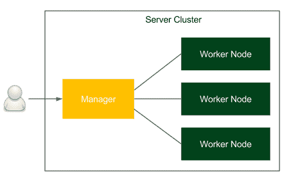
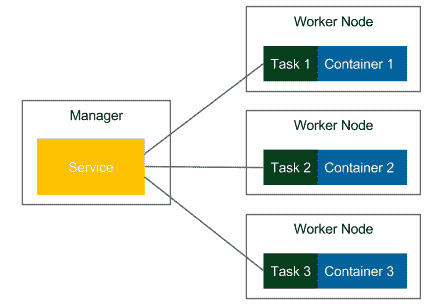
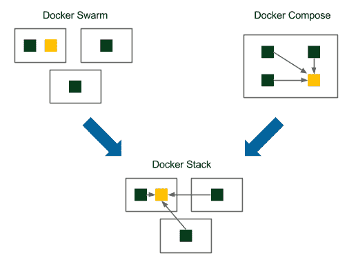
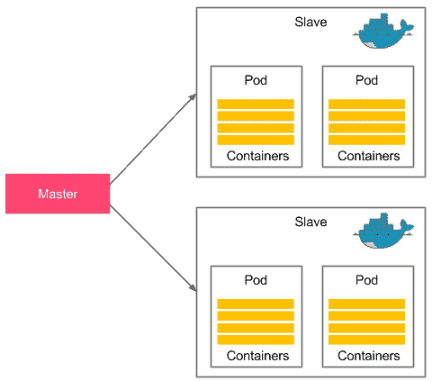
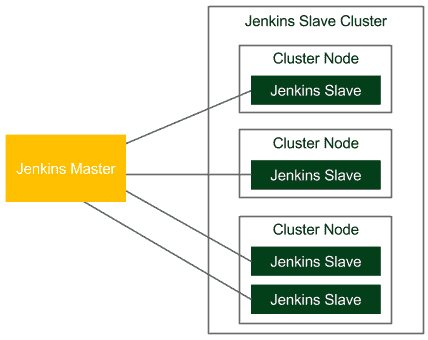

# 使用 Docker Swarm 进行集群化

我们已经涵盖了持续交付流水线的所有基本方面。在本章中，我们将看到如何将 Docker 环境从单个 Docker 主机更改为一组机器，并如何与 Jenkins 一起使用它。

本章涵盖以下内容：

+   解释服务器集群的概念

+   介绍 Docker Swarm 及其最重要的功能

+   介绍如何从多个 Docker 主机构建群集

+   在集群上运行和扩展 Docker 镜像

+   探索高级群集功能：滚动更新、排水节点、多个管理节点和调整调度策略

+   在集群上部署 Docker Compose 配置

+   介绍 Kubernetes 和 Apache Mesos 作为 Docker Swarm 的替代方案

+   在集群上动态扩展 Jenkins 代理

# 服务器集群

到目前为止，我们已经分别与每台机器进行了交互。即使我们使用 Ansible 在多台服务器上重复相同的操作，我们也必须明确指定应在哪台主机上部署给定服务。然而，在大多数情况下，如果服务器共享相同的物理位置，我们并不关心服务部署在哪台特定的机器上。我们所需要的只是让它可访问并在许多实例中复制。我们如何配置一组机器以便它们共同工作，以至于添加新的机器不需要额外的设置？这就是集群的作用。

在本节中，您将介绍服务器集群的概念和 Docker Swarm 工具包。

# 介绍服务器集群

服务器集群是一组连接的计算机，它们以一种可以类似于单个系统的方式一起工作。服务器通常通过本地网络连接，连接速度足够快，以确保服务分布的影响很小。下图展示了一个简单的服务器集群：



用户通过称为管理器的主机访问集群，其界面应类似于常规 Docker 主机。在集群内，有多个工作节点接收任务，执行它们，并通知管理器它们的当前状态。管理器负责编排过程，包括任务分派、服务发现、负载平衡和工作节点故障检测。

管理者也可以执行任务，这是 Docker Swarm 的默认配置。然而，对于大型集群，管理者应该配置为仅用于管理目的。

# 介绍 Docker Swarm

Docker Swarm 是 Docker 的本地集群系统，将一组 Docker 主机转换为一个一致的集群，称为 swarm。连接到 swarm 的每个主机都扮演管理者或工作节点的角色（集群中必须至少有一个管理者）。从技术上讲，机器的物理位置并不重要；然而，将所有 Docker 主机放在一个本地网络中是合理的，否则，管理操作（或在多个管理者之间达成共识）可能需要大量时间。

自 Docker 1.12 以来，Docker Swarm 已经作为 swarm 模式被原生集成到 Docker Engine 中。在旧版本中，需要在每个主机上运行 swarm 容器以提供集群功能。

关于术语，在 swarm 模式下，运行的镜像称为**服务**，而不是在单个 Docker 主机上运行的**容器**。一个服务运行指定数量的**任务**。任务是 swarm 的原子调度单元，保存有关容器和应在容器内运行的命令的信息。**副本**是在节点上运行的每个容器。副本的数量是给定服务的所有容器的预期数量。

让我们看一下展示术语和 Docker Swarm 集群过程的图像：



我们首先指定一个服务，Docker 镜像和副本的数量。管理者会自动将任务分配给工作节点。显然，每个复制的容器都是从相同的 Docker 镜像运行的。在所呈现的流程的上下文中，Docker Swarm 可以被视为 Docker Engine 机制的一层，负责容器编排。

在上面的示例图像中，我们有三个任务，每个任务都在单独的 Docker 主机上运行。然而，也可能所有容器都在同一个 Docker 主机上启动。一切取决于分配任务给工作节点的管理节点使用的调度策略。我们将在后面的单独章节中展示如何配置该策略。

# Docker Swarm 功能概述

Docker Swarm 提供了许多有趣的功能。让我们来看看最重要的几个：

+   负载均衡：Docker Swarm 负责负载均衡和分配唯一的 DNS 名称，使得部署在集群上的应用可以与部署在单个 Docker 主机上的应用一样使用。换句话说，一个集群可以以与 Docker 容器类似的方式发布端口，然后集群管理器在集群中的服务之间分发请求。

+   动态角色管理：Docker 主机可以在运行时添加到集群中，因此无需重新启动集群。而且，节点的角色（管理器或工作节点）也可以动态更改。

+   动态服务扩展：每个服务都可以通过 Docker 客户端动态地扩展或缩减。管理节点负责从节点中添加或删除容器。

+   故障恢复：管理器不断监视节点，如果其中任何一个失败，新任务将在不同的机器上启动，以便声明的副本数量保持不变。还可以创建多个管理节点，以防止其中一个失败时发生故障。

+   滚动更新：对服务的更新可以逐步应用；例如，如果我们有 10 个副本并且想要进行更改，我们可以定义每个副本部署之间的延迟。在这种情况下，当出现问题时，我们永远不会出现没有副本正常工作的情况。

+   两种服务模式：可以运行在两种模式下：

+   复制服务：指定数量的复制容器根据调度策略算法分布在节点之间。

+   全球服务：集群中的每个可用节点上都运行一个容器

+   安全性：由于一切都在 Docker 中，Docker Swarm 强制执行 TLS 身份验证和通信加密。还可以使用 CA（或自签名）证书。

让我们看看这在实践中是什么样子。

# 实际中的 Docker Swarm

Docker Engine 默认包含了 Swarm 模式，因此不需要额外的安装过程。由于 Docker Swarm 是一个本地的 Docker 集群系统，管理集群节点是通过`docker`命令完成的，因此非常简单和直观。让我们首先创建一个管理节点和两个工作节点。然后，我们将从 Docker 镜像运行和扩展一个服务。

# 建立一个 Swarm

为了设置一个 Swarm，我们需要初始化管理节点。我们可以在一个即将成为管理节点的机器上使用以下命令来做到这一点：

```
$ docker swarm init

Swarm initialized: current node (qfqzhk2bumhd2h0ckntrysm8l) is now a manager.

To add a worker to this swarm, run the following command:
docker swarm join \
--token SWMTKN-1-253vezc1pqqgb93c5huc9g3n0hj4p7xik1ziz5c4rsdo3f7iw2-df098e2jpe8uvwe2ohhhcxd6w \
192.168.0.143:2377

To add a manager to this swarm, run 'docker swarm join-token manager' and follow the instructions.
```

一个非常常见的做法是使用`--advertise-addr <manager_ip>`参数，因为如果管理机器有多个潜在的网络接口，那么`docker swarm init`可能会失败。

在我们的情况下，管理机器的 IP 地址是`192.168.0.143`，显然，它必须能够从工作节点（反之亦然）访问。请注意，在控制台上打印了要在工作机器上执行的命令。还要注意，已生成了一个特殊的令牌。从现在开始，它将被用来连接机器到集群，并且必须保密。

我们可以使用`docker node`命令来检查 Swarm 是否已创建：

```
$ docker node ls
ID                          HOSTNAME       STATUS  AVAILABILITY  MANAGER STATUS
qfqzhk2bumhd2h0ckntrysm8l * ubuntu-manager Ready   Active        Leader
```

当管理器正常运行时，我们准备将工作节点添加到 Swarm 中。

# 添加工作节点

为了将一台机器添加到 Swarm 中，我们必须登录到给定的机器并执行以下命令：

```
$ docker swarm join \
--token SWMTKN-1-253vezc1pqqgb93c5huc9g3n0hj4p7xik1ziz5c4rsdo3f7iw2-df098e2jpe8uvwe2ohhhcxd6w \
192.168.0.143:2377

This node joined a swarm as a worker.
```

我们可以使用`docker node ls`命令来检查节点是否已添加到 Swarm 中。假设我们已经添加了两个节点机器，输出应该如下所示：

```
$ docker node ls
ID                          HOSTNAME        STATUS  AVAILABILITY  MANAGER STATUS
cr7vin5xzu0331fvxkdxla22n   ubuntu-worker2  Ready   Active 
md4wx15t87nn0c3pyv24kewtz   ubuntu-worker1  Ready   Active 
qfqzhk2bumhd2h0ckntrysm8l * ubuntu-manager  Ready   Active        Leader
```

在这一点上，我们有一个由三个 Docker 主机组成的集群，`ubuntu-manager`，`ubuntu-worker1`和`ubuntu-worker2`。让我们看看如何在这个集群上运行一个服务。

# 部署一个服务

为了在集群上运行一个镜像，我们不使用`docker run`，而是使用专门为 Swarm 设计的`docker service`命令（在管理节点上执行）。让我们启动一个单独的`tomcat`应用并给它命名为`tomcat`：

```
$ docker service create --replicas 1 --name tomcat tomcat
```

该命令创建了服务，因此发送了一个任务来在一个节点上启动一个容器。让我们列出正在运行的服务：

```
$ docker service ls
ID            NAME    MODE        REPLICAS  IMAGE
x65aeojumj05  tomcat  replicated  1/1       tomcat:latest
```

日志确认了`tomcat`服务正在运行，并且有一个副本（一个 Docker 容器正在运行）。我们甚至可以更仔细地检查服务：

```
$ docker service ps tomcat
ID           NAME      IMAGE          NODE            DESIRED STATE CURRENT STATE 
kjy1udwcnwmi tomcat.1  tomcat:latest  ubuntu-manager  Running     Running about a minute ago
```

如果您对服务的详细信息感兴趣，可以使用`docker service inspect <service_name>`命令。

从控制台输出中，我们可以看到容器正在管理节点（`ubuntu-manager`）上运行。它也可以在任何其他节点上启动；管理器会自动使用调度策略算法选择工作节点。我们可以使用众所周知的`docker ps`命令来确认容器正在运行：

```
$ docker ps
CONTAINER ID     IMAGE
COMMAND           CREATED            STATUS              PORTS            NAMES
6718d0bcba98     tomcat@sha256:88483873b279aaea5ced002c98dde04555584b66de29797a4476d5e94874e6de 
"catalina.sh run" About a minute ago Up About a minute   8080/tcp         tomcat.1.kjy1udwcnwmiosiw2qn71nt1r
```

如果我们不希望任务在管理节点上执行，可以使用`--constraint node.role==worker`选项来限制服务。另一种可能性是完全禁用管理节点执行任务，使用`docker node update --availability drain <manager_name>`。

# 扩展服务

当服务运行时，我们可以扩展或缩小它，以便它在许多副本中运行：

```
$ docker service scale tomcat=5
tomcat scaled to 5
```

我们可以检查服务是否已扩展：

```
$ docker service ps tomcat
ID            NAME     IMAGE          NODE            DESIRED STATE  CURRENT STATE 
kjy1udwcnwmi  tomcat.1  tomcat:latest  ubuntu-manager  Running    Running 2 minutes ago 
536p5zc3kaxz  tomcat.2  tomcat:latest  ubuntu-worker2  Running    Preparing 18 seconds ago npt6ui1g9bdp  tomcat.3  tomcat:latest  ubuntu-manager  Running    Running 18 seconds ago zo2kger1rmqc  tomcat.4  tomcat:latest  ubuntu-worker1  Running    Preparing 18 seconds ago 1fb24nf94488  tomcat.5  tomcat:latest  ubuntu-worker2  Running    Preparing 18 seconds ago  
```

请注意，这次有两个容器在`manager`节点上运行，一个在`ubuntu-worker1`节点上，另一个在`ubuntu-worker2`节点上。我们可以通过在每台机器上执行`docker ps`来检查它们是否真的在运行。

如果我们想要删除服务，只需执行以下命令即可：

```
$ docker service rm tomcat
```

您可以使用`docker service ls`命令检查服务是否已被删除，因此所有相关的`tomcat`容器都已停止并从所有节点中删除。

# 发布端口

Docker 服务，类似于容器，具有端口转发机制。我们可以通过添加`-p <host_port>:<container:port>`参数来使用它。启动服务可能如下所示：

```
$ docker service create --replicas 1 --publish 8080:8080 --name tomcat tomcat
```

现在，我们可以打开浏览器，在地址`http://192.168.0.143:8080/`下查看 Tomcat 的主页。

该应用程序可在充当负载均衡器并将请求分发到工作节点的管理主机上使用。可能听起来有点不太直观的是，我们可以使用任何工作节点的 IP 地址访问 Tomcat，例如，如果工作节点在`192.168.0.166`和`192.168.0.115`下可用，我们可以使用`http://192.168.0.166:8080/`和`http://192.168.0.115:8080/`访问相同的运行容器。这是可能的，因为 Docker Swarm 创建了一个路由网格，其中每个节点都有如何转发已发布端口的信息。

您可以阅读有关 Docker Swarm 如何进行负载平衡和路由的更多信息[`docs.docker.com/engine/swarm/ingress/`](https://docs.docker.com/engine/swarm/ingress/)。

默认情况下，使用内部 Docker Swarm 负载平衡。因此，只需将所有请求发送到管理机器，它将负责在节点之间进行分发。另一种选择是配置外部负载均衡器（例如 HAProxy 或 Traefik）。

我们已经讨论了 Docker Swarm 的基本用法。现在让我们深入了解更具挑战性的功能。

# 高级 Docker Swarm

Docker Swarm 提供了许多在持续交付过程中有用的有趣功能。在本节中，我们将介绍最重要的功能。

# 滚动更新

想象一下，您部署了应用程序的新版本。您需要更新集群中的所有副本。一种选择是停止整个 Docker Swarm 服务，并从更新后的 Docker 镜像运行一个新的服务。然而，这种方法会导致服务停止和新服务启动之间的停机时间。在持续交付过程中，停机时间是不可接受的，因为部署可以在每次源代码更改后进行，这通常是经常发生的。那么，在集群中如何实现零停机部署呢？这就是滚动更新的作用。

滚动更新是一种自动替换服务副本的方法，一次替换一个副本，以确保一些副本始终在工作。Docker Swarm 默认使用滚动更新，并且可以通过两个参数进行控制：

+   `update-delay`：启动一个副本和停止下一个副本之间的延迟（默认为 0 秒）

+   `update-parallelism`：同时更新的最大副本数量（默认为 1）

Docker Swarm 滚动更新过程如下：

1.  停止`<update-parallelism>`数量的任务（副本）。

1.  在它们的位置上，运行相同数量的更新任务。

1.  如果一个任务返回**RUNNING**状态，那么等待`<update-delay>`时间。

1.  如果任何时候任何任务返回**FAILED**状态，则暂停更新。

`update-parallelism`参数的值应该根据我们运行的副本数量进行调整。如果数量较小，服务启动速度很快，保持默认值 1 是合理的。`update-delay`参数应设置为比我们应用程序预期的启动时间更长的时间，这样我们就会注意到失败，因此暂停更新。

让我们来看一个例子，将 Tomcat 应用程序从版本 8 更改为版本 9。假设我们有`tomcat:8`服务，有五个副本：

```
$ docker service create --replicas 5 --name tomcat --update-delay 10s tomcat:8
```

我们可以使用`docker service ps tomcat`命令检查所有副本是否正在运行。另一个有用的命令是`docker service inspect`命令，可以帮助检查服务：

```
$ docker service inspect --pretty tomcat

ID:    au1nu396jzdewyq2y8enm0b6i
Name:    tomcat
Service Mode:    Replicated
 Replicas:    5
Placement:
UpdateConfig:
 Parallelism:    1
 Delay:    10s
 On failure:    pause
 Max failure ratio: 0
ContainerSpec:
 Image:    tomcat:8@sha256:835b6501c150de39d2b12569fd8124eaebc53a899e2540549b6b6f8676538484
Resources:
Endpoint Mode:    vip
```

我们可以看到服务已经创建了五个副本，来自于`tomcat:8`镜像。命令输出还包括有关并行性和更新之间的延迟时间的信息（由`docker service create`命令中的选项设置）。

现在，我们可以将服务更新为`tomcat:9`镜像：

```
$ docker service update --image tomcat:9 tomcat
```

让我们看看发生了什么：

```
$ docker service ps tomcat
ID            NAME      IMAGE     NODE            DESIRED STATE  CURRENT STATE 
4dvh6ytn4lsq  tomcat.1  tomcat:8  ubuntu-manager  Running    Running 4 minutes ago 
2mop96j5q4aj  tomcat.2  tomcat:8  ubuntu-manager  Running    Running 4 minutes ago 
owurmusr1c48  tomcat.3  tomcat:9  ubuntu-manager  Running    Preparing 13 seconds ago 
r9drfjpizuxf   \_ tomcat.3  tomcat:8  ubuntu-manager  Shutdown   Shutdown 12 seconds ago 
0725ha5d8p4v  tomcat.4  tomcat:8  ubuntu-manager  Running    Running 4 minutes ago 
wl25m2vrqgc4  tomcat.5  tomcat:8  ubuntu-manager  Running    Running 4 minutes ago       
```

请注意，`tomcat:8`的第一个副本已关闭，第一个`tomcat:9`已经在运行。如果我们继续检查`docker service ps tomcat`命令的输出，我们会注意到每隔 10 秒，另一个副本处于关闭状态，新的副本启动。如果我们还监视`docker inspect`命令，我们会看到值**UpdateStatus: State**将更改为**updating**，然后在更新完成后更改为**completed**。

滚动更新是一个非常强大的功能，允许零停机部署，并且应该始终在持续交付过程中使用。

# 排水节点

当我们需要停止工作节点进行维护，或者我们只是想将其从集群中移除时，我们可以使用 Swarm 排水节点功能。排水节点意味着要求管理器将所有任务移出给定节点，并排除它不接收新任务。结果，所有副本只在活动节点上运行，排水节点处于空闲状态。

让我们看看这在实践中是如何工作的。假设我们有三个集群节点和一个具有五个副本的 Tomcat 服务：

```
$ docker node ls
ID                          HOSTNAME        STATUS  AVAILABILITY  MANAGER STATUS
4mrrmibdrpa3yethhmy13mwzq   ubuntu-worker2  Ready   Active 
kzgm7erw73tu2rjjninxdb4wp * ubuntu-manager  Ready   Active        Leader
yllusy42jp08w8fmze43rmqqs   ubuntu-worker1  Ready   Active 

$ docker service create --replicas 5 --name tomcat tomcat
```

让我们检查一下副本正在哪些节点上运行：

```
$ docker service ps tomcat
ID            NAME      IMAGE          NODE            DESIRED STATE  CURRENT STATE 
zrnawwpupuql  tomcat.1  tomcat:latest  ubuntu-manager  Running    Running 17 minutes ago 
x6rqhyn7mrot  tomcat.2  tomcat:latest  ubuntu-worker1  Running    Running 16 minutes ago 
rspgxcfv3is2  tomcat.3  tomcat:latest  ubuntu-worker2  Running    Running 5 weeks ago 
cf00k61vo7xh  tomcat.4  tomcat:latest  ubuntu-manager  Running    Running 17 minutes ago 
otjo08e06qbx  tomcat.5  tomcat:latest  ubuntu-worker2  Running    Running 5 weeks ago      
```

有两个副本正在`ubuntu-worker2`节点上运行。让我们排水该节点：

```
$ docker node update --availability drain ubuntu-worker2
```

节点被设置为**drain**可用性，因此所有副本应该移出该节点：

```
$ docker service ps tomcat
ID            NAME      IMAGE          NODE            DESIRED STATE  CURRENT STATE
zrnawwpupuql  tomcat.1  tomcat:latest  ubuntu-manager  Running    Running 18 minutes ago 
x6rqhyn7mrot  tomcat.2  tomcat:latest  ubuntu-worker1  Running    Running 17 minutes ago qrptjztd777i  tomcat.3  tomcat:latest  ubuntu-worker1  Running    Running less than a second ago 
rspgxcfv3is2   \_ tomcat.3  tomcat:latest  ubuntu-worker2  Shutdown   Shutdown less than a second ago 
cf00k61vo7xh  tomcat.4  tomcat:latest  ubuntu-manager  Running    Running 18 minutes ago k4c14tyo7leq  tomcat.5  tomcat:latest  ubuntu-worker1  Running    Running less than a second ago 
otjo08e06qbx   \_ tomcat.5  tomcat:latest  ubuntu-worker2  Shutdown   Shutdown less than a second ago   
```

我们可以看到新任务在`ubuntu-worker1`节点上启动，并且旧副本已关闭。我们可以检查节点的状态：

```
$ docker node ls
ID                          HOSTNAME        STATUS  AVAILABILITY  MANAGER STATUS
4mrrmibdrpa3yethhmy13mwzq   ubuntu-worker2  Ready   Drain 
kzgm7erw73tu2rjjninxdb4wp * ubuntu-manager  Ready   Active        Leader
yllusy42jp08w8fmze43rmqqs   ubuntu-worker1  Ready   Active   
```

如预期的那样，`ubuntu-worker2`节点可用（状态为`Ready`），但其可用性设置为排水，这意味着它不托管任何任务。如果我们想要将节点恢复，可以将其可用性检查为`active`：

```
$ docker node update --availability active ubuntu-worker2
```

一个非常常见的做法是排水管理节点，结果是它不会接收任何任务，只做管理工作。

排水节点的另一种方法是从工作节点执行`docker swarm leave`命令。然而，这种方法有两个缺点：

+   有一段时间，副本比预期少（离开 Swarm 之后，在主节点开始在其他节点上启动新任务之前）

+   主节点不控制节点是否仍然在集群中

出于这些原因，如果我们计划暂停工作节点一段时间然后再启动它，建议使用排空节点功能。

# 多个管理节点

拥有单个管理节点是有风险的，因为当管理节点宕机时，整个集群也会宕机。在业务关键系统的情况下，这种情况显然是不可接受的。在本节中，我们将介绍如何管理多个主节点。

为了将新的管理节点添加到系统中，我们需要首先在（当前单一的）管理节点上执行以下命令：

```
$ docker swarm join-token manager

To add a manager to this swarm, run the following command:

docker swarm join \
--token SWMTKN-1-5blnptt38eh9d3s8lk8po3069vbjmz7k7r3falkm20y9v9hefx-a4v5olovq9mnvy7v8ppp63r23 \
192.168.0.143:2377
```

输出显示了令牌和需要在即将成为管理节点的机器上执行的整个命令。执行完毕后，我们应该看到添加了一个新的管理节点。

另一种添加管理节点的选项是使用`docker node promote <node>`命令将其从工作节点角色提升为管理节点。为了将其重新转换为工作节点角色，我们可以使用`docker node demote <node>`命令。

假设我们已经添加了两个额外的管理节点；我们应该看到以下输出：

```
$ docker node ls
ID                          HOSTNAME         STATUS  AVAILABILITY  MANAGER STATUS
4mrrmibdrpa3yethhmy13mwzq   ubuntu-manager2  Ready   Active 
kzgm7erw73tu2rjjninxdb4wp * ubuntu-manager   Ready   Active        Leader
pkt4sjjsbxx4ly1lwetieuj2n   ubuntu-manager1  Ready   Active        Reachable
```

请注意，新的管理节点的管理状态设置为可达（或留空），而旧的管理节点是领导者。其原因是始终有一个主节点负责所有 Swarm 管理和编排决策。领导者是使用 Raft 共识算法从管理节点中选举出来的，当它宕机时，会选举出一个新的领导者。

Raft 是一种共识算法，用于在分布式系统中做出决策。您可以在[`raft.github.io/`](https://raft.github.io/)上阅读有关其工作原理的更多信息（并查看可视化）。用于相同目的的非常流行的替代算法称为 Paxos。

假设我们关闭了`ubuntu-manager`机器；让我们看看新领导者是如何选举的：

```
$ docker node ls
ID                          HOSTNAME         STATUS  AVAILABILITY  MANAGER STATUS
4mrrmibdrpa3yethhmy13mwzq   ubuntu-manager2  Ready   Active        Reachable
kzgm7erw73tu2rjjninxdb4wp   ubuntu-manager   Ready   Active        Unreachable 
pkt4sjjsbxx4ly1lwetieuj2n * ubuntu-manager1  Ready   Active        Leader
```

请注意，即使其中一个管理节点宕机，Swarm 也可以正常工作。

管理节点的数量没有限制，因此听起来管理节点越多，容错能力就越好。这是真的，然而，拥有大量管理节点会影响性能，因为所有与 Swarm 状态相关的决策（例如，添加新节点或领导者选举）都必须使用 Raft 算法在所有管理节点之间达成一致意见。因此，管理节点的数量始终是容错能力和性能之间的权衡。

Raft 算法本身对管理者的数量有限制。分布式决策必须得到大多数节点的批准，称为法定人数。这一事实意味着建议使用奇数个管理者。

要理解为什么，让我们看看如果我们有两个管理者会发生什么。在这种情况下，法定人数是两个，因此如果任何一个管理者宕机，那么就不可能达到法定人数，因此也无法选举领导者。结果，失去一台机器会使整个集群失效。我们增加了一个管理者，但整个集群变得不太容错。在三个管理者的情况下情况会有所不同。然后，法定人数仍然是两个，因此失去一个管理者不会停止整个集群。这是一个事实，即使从技术上讲并不是被禁止的，但只有奇数个管理者是有意义的。

集群中的管理者越多，就涉及到越多与 Raft 相关的操作。然后，“管理者”节点应该被放入排水可用性，以节省它们的资源。

# 调度策略

到目前为止，我们已经了解到管理者会自动将工作节点分配给任务。在本节中，我们将深入探讨自动分配的含义。我们介绍 Docker Swarm 调度策略以及根据我们的需求进行配置的方法。

Docker Swarm 使用两个标准来选择合适的工作节点：

+   **资源可用性**：调度器知道节点上可用的资源。它使用所谓的**扩展策略**，试图将任务安排在负载最轻的节点上，前提是它符合标签和约束指定的条件。

+   **标签和约束**：

+   标签是节点的属性。有些标签是自动分配的，例如`node.id`或`node.hostname`；其他可以由集群管理员定义，例如`node.labels.segment`。

+   约束是服务创建者应用的限制，例如，仅选择具有特定标签的节点

标签分为两类，`node.labels`和`engine.labels`。第一类是由运营团队添加的；第二类是由 Docker Engine 收集的，例如操作系统或硬件特定信息。

例如，如果我们想在具体节点`ubuntu-worker1`上运行 Tomcat 服务，那么我们需要使用以下命令：

```
$ docker service create --constraint 'node.hostname == ubuntu-worker1' tomcat
```

我们还可以向节点添加自定义标签：

```
$ docker node update --label-add segment=AA ubuntu-worker1
```

上述命令添加了一个标签`node.labels.segment`，其值为`AA`。然后，在运行服务时我们可以使用它：

```
$ docker service create --constraint 'node.labels.segment == AA' tomcat
```

这个命令只在标记有给定段`AA`的节点上运行`tomcat`副本。

标签和约束使我们能够配置服务副本将在哪些节点上运行。尽管这种方法在许多情况下是有效的，但不应该过度使用，因为最好让副本分布在多个节点上，并让 Docker Swarm 负责正确的调度过程。

# Docker Compose 与 Docker Swarm

我们已经描述了如何使用 Docker Swarm 来部署一个服务，该服务又从给定的 Docker 镜像中运行多个容器。另一方面，还有 Docker Compose，它提供了一种定义容器之间依赖关系并实现容器扩展的方法，但所有操作都在一个 Docker 主机内完成。我们如何将这两种技术合并起来，以便我们可以指定`docker-compose.yml`文件，并自动将容器分布在集群上？幸运的是，有 Docker Stack。

# 介绍 Docker Stack

Docker Stack 是在 Swarm 集群上运行多个关联容器的方法。为了更好地理解它如何将 Docker Compose 与 Docker Swarm 连接起来，让我们看一下下面的图：



Docker Swarm 编排哪个容器在哪台物理机上运行。然而，容器之间没有任何依赖关系，因此为了它们进行通信，我们需要手动链接它们。相反，Docker Compose 提供了容器之间的链接。在前面图中的例子中，一个 Docker 镜像（部署为三个复制的容器）依赖于另一个 Docker 镜像（部署为一个容器）。然而，所有容器都运行在同一个 Docker 主机上，因此水平扩展受限于一台机器的资源。Docker Stack 连接了这两种技术，并允许使用`docker-compose.yml`文件在一组 Docker 主机上运行链接容器的完整环境。

# 使用 Docker Stack

举个例子，让我们使用依赖于`redis`镜像的`calculator`镜像。让我们将这个过程分为四个步骤：

1.  指定`docker-compose.yml`。

1.  运行 Docker Stack 命令。

1.  验证服务和容器。

1.  移除堆栈。

# 指定 docker-compose.yml

我们已经在前面的章节中定义了`docker-compose.yml`文件，它看起来类似于以下内容：

```
version: "3"
services:
    calculator:
        deploy:
            replicas: 3
        image: leszko/calculator:latest
        ports:
        - "8881:8080"
    redis:
        deploy:
            replicas: 1
        image: redis:latest
```

请注意，所有镜像在运行`docker stack`命令之前必须推送到注册表，以便它们可以从所有节点访问。因此，不可能在`docker-compose.yml`中构建镜像。

使用所提供的 docker-compose.yml 配置，我们将运行三个`calculator`容器和一个`redis`容器。计算器服务的端点将在端口`8881`上公开。

# 运行 docker stack 命令

让我们使用`docker stack`命令来运行服务，这将在集群上启动容器：

```
$ docker stack deploy --compose-file docker-compose.yml app
Creating network app_default
Creating service app_redis
Creating service app_calculator
```

Docker 计划简化语法，以便不需要`stack`这个词，例如，`docker deploy --compose-file docker-compose.yml app`。在撰写本文时，这仅在实验版本中可用。

# 验证服务和容器

服务已经启动。我们可以使用`docker service ls`命令来检查它们是否正在运行：

```
$ docker service ls
ID            NAME            MODE        REPLICAS  IMAGE
5jbdzt9wolor  app_calculator  replicated  3/3       leszko/calculator:latest
zrr4pkh3n13f  app_redis       replicated  1/1       redis:latest
```

我们甚至可以更仔细地查看服务，并检查它们部署在哪些 Docker 主机上：

```
$ docker service ps app_calculator
ID            NAME              IMAGE                     NODE  DESIRED STATE  CURRENT STATE 
jx0ipdxwdilm  app_calculator.1  leszko/calculator:latest  ubuntu-manager  Running    Running 57 seconds ago 
psweuemtb2wf  app_calculator.2  leszko/calculator:latest  ubuntu-worker1  Running    Running about a minute ago 
iuas0dmi7abn  app_calculator.3  leszko/calculator:latest  ubuntu-worker2  Running    Running 57 seconds ago 

$ docker service ps app_redis
ID            NAME         IMAGE         NODE            DESIRED STATE  CURRENT STATE 
8sg1ybbggx3l  app_redis.1  redis:latest  ubuntu-manager  Running  Running about a minute ago    
```

我们可以看到，`ubuntu-manager`机器上启动了一个`calculator`容器和一个`redis`容器。另外两个`calculator`容器分别在`ubuntu-worker1`和`ubuntu-worker2`机器上运行。

请注意，我们明确指定了`calculator` web 服务应该发布的端口号。因此，我们可以通过管理者的 IP 地址`http://192.168.0.143:8881/sum?a=1&b=2`来访问端点。操作返回`3`作为结果，并将其缓存在 Redis 容器中。

# 移除 stack

当我们完成了 stack，我们可以使用方便的`docker stack rm`命令来删除所有内容：

```
$ docker stack rm app
Removing service app_calculator
Removing service app_redis
Removing network app_default
```

使用 Docker Stack 允许在 Docker Swarm 集群上运行 Docker Compose 规范。请注意，我们使用了确切的`docker-compose.yml`格式，这是一个很大的好处，因为对于 Swarm，不需要指定任何额外的内容。

这两种技术的合并使我们能够在 Docker 上部署应用程序的真正力量，因为我们不需要考虑单独的机器。我们只需要指定我们的（微）服务如何相互依赖，用 docker-compose.yml 格式表达出来，然后让 Docker 来处理其他一切。物理机器可以简单地被视为一组资源。

# 替代集群管理系统

Docker Swarm 不是唯一用于集群 Docker 容器的系统。尽管它是开箱即用的系统，但可能有一些有效的理由安装第三方集群管理器。让我们来看一下最受欢迎的替代方案。

# Kubernetes

Kubernetes 是一个由谷歌最初设计的开源集群管理系统。尽管它不是 Docker 原生的，但集成非常顺畅，而且有许多额外的工具可以帮助这个过程；例如，**kompose** 可以将 `docker-compose.yml` 文件转换成 Kubernetes 配置文件。

让我们来看一下 Kubernetes 的简化架构：



Kubernetes 和 Docker Swarm 类似，它也有主节点和工作节点。此外，它引入了 **pod** 的概念，表示一组一起部署和调度的容器。大多数 pod 都有几个容器组成一个服务。Pod 根据不断变化的需求动态构建和移除。

Kubernetes 相对较年轻。它的开发始于 2014 年；然而，它基于谷歌的经验，这是它成为市场上最受欢迎的集群管理系统之一的原因之一。越来越多的组织迁移到 Kubernetes，如 eBay、Wikipedia 和 Pearson。

# Apache Mesos

Apache Mesos 是一个在 2009 年由加州大学伯克利分校发起的开源调度和集群系统，早在 Docker 出现之前就开始了。它提供了一个在 CPU、磁盘空间和内存上的抽象层。Mesos 的一个巨大优势是它支持任何 Linux 应用程序，不一定是（Docker）容器。这就是为什么可以创建一个由数千台机器组成的集群，并且用于 Docker 容器和其他程序，例如基于 Hadoop 的计算。

让我们来看一下展示 Mesos 架构的图：


Apache Mesos，类似于其他集群系统，具有主从架构。它使用安装在每个节点上的节点代理进行通信，并提供两种类型的调度器，Chronos - 用于 cron 风格的重复任务和 Marathon - 提供 REST API 来编排服务和容器。

与其他集群系统相比，Apache Mesos 非常成熟，并且已经被许多组织采用，如 Twitter、Uber 和 CERN。

# 比较功能

Kubernetes、Docker Swarm 和 Mesos 都是集群管理系统的不错选择。它们都是免费且开源的，并且它们都提供重要的集群管理功能，如负载均衡、服务发现、分布式存储、故障恢复、监控、秘钥管理和滚动更新。它们在持续交付过程中也可以使用，没有太大的区别。这是因为，在 Docker 化的基础设施中，它们都解决了同样的问题，即 Docker 容器的集群化。然而，显然，这些系统并不完全相同。让我们看一下表格，展示它们之间的区别：

|  | **Docker Swarm** | **Kubernetes** | **Apache Mesos** |
| --- | --- | --- | --- |
| **Docker 支持** | 本机支持 | 支持 Docker 作为 Pod 中的容器类型之一 | Mesos 代理（从属）可以配置为托管 Docker 容器 |
| **应用程序类型** | Docker 镜像 | 容器化应用程序（Docker、rkt 和 hyper） | 任何可以在 Linux 上运行的应用程序（也包括容器） |
| **应用程序定义** | Docker Compose 配置 | Pod 配置，副本集，复制控制器，服务和部署 | 以树形结构形成的应用程序组 |
| 设置过程 | 非常简单 | 根据基础设施的不同，可能需要运行一个命令或者进行许多复杂的操作 | 相当复杂，需要配置 Mesos、Marathon、Chronos、Zookeeper 和 Docker 支持 |
| **API** | Docker REST API | REST API | Chronos/Marathon REST API |
| **用户界面** | Docker 控制台客户端，Shipyard 等第三方 Web 应用 | 控制台工具，本机 Web UI（Kubernetes 仪表板） | Mesos、Marathon 和 Chronos 的官方 Web 界面 |
| **云集成** | 需要手动安装 | 大多数提供商（Azure、AWS、Google Cloud 等）提供云原生支持 | 大多数云提供商提供支持 |
| **最大集群大小** | 1,000 个节点 | 1,000 个节点 | 50,000 个节点 |
| **自动扩展** | 不可用 | 根据观察到的 CPU 使用情况提供水平 Pod 自动扩展 | Marathon 根据资源（CPU/内存）消耗、每秒请求的数量和队列长度提供自动扩展 |

显然，除了 Docker Swarm、Kubernetes 和 Apache Mesos 之外，市场上还有其他可用的集群系统。然而，它们并不那么受欢迎，它们的使用量随着时间的推移而减少。

无论选择哪个系统，您都可以将其用于暂存/生产环境，也可以用于扩展 Jenkins 代理。让我们看看如何做到这一点。

# 扩展 Jenkins

服务器集群的明显用例是暂存和生产环境。在使用时，只需连接物理机即可增加环境的容量。然而，在持续交付的背景下，我们可能还希望通过在集群上运行 Jenkins 代理（从属）节点来改进 Jenkins 基础设施。在本节中，我们将看两种不同的方法来实现这个目标。

# 动态从属配置

我们在《配置 Jenkins》的第三章中看到了动态从属配置。使用 Docker Swarm，这个想法保持完全一样。当构建开始时，Jenkins 主服务器会从 Jenkins 从属 Docker 镜像中运行一个容器，并在容器内执行 Jenkinsfile 脚本。然而，Docker Swarm 使解决方案更加强大，因为我们不再局限于单个 Docker 主机，而是可以提供真正的水平扩展。向集群添加新的 Docker 主机有效地扩展了 Jenkins 基础设施的容量。

在撰写本文时，Jenkins Docker 插件不支持 Docker Swarm。其中一个解决方案是使用 Kubernetes 或 Mesos 作为集群管理系统。它们每个都有一个专用的 Jenkins 插件：Kubernetes 插件（[`wiki.jenkins.io/display/JENKINS/Kubernetes+Plugin`](https://wiki.jenkins.io/display/JENKINS/Kubernetes+Plugin)）和 Mesos 插件（[`wiki.jenkins.io/display/JENKINS/Mesos+Plugin`](https://wiki.jenkins.io/display/JENKINS/Mesos+Plugin)）。

无论从属是如何配置的，我们总是通过安装适当的插件并在 Manage Jenkins | Configure System 的 Cloud 部分中添加条目来配置它们。

# Jenkins Swarm

如果我们不想使用动态从属配置，那么集群化 Jenkins 从属的另一个解决方案是使用 Jenkins Swarm。我们在《配置 Jenkins》的第三章中描述了如何使用它。在这里，我们为 Docker Swarm 添加描述。

首先，让我们看看如何使用从 swarm-client.jar 工具构建的 Docker 镜像来运行 Jenkins Swarm 从属。Docker Hub 上有一些可用的镜像；我们可以使用 csanchez/jenkins-swarm-slave 镜像：

```
$ docker run csanchez/jenkins-swarm-slave:1.16 -master -username -password -name jenkins-swarm-slave-2
```

该命令执行应该与第三章中介绍的具有完全相同的效果，*配置 Jenkins*；它动态地向 Jenkins 主节点添加一个从节点。

然后，为了充分利用 Jenkins Swarm，我们可以在 Docker Swarm 集群上运行从节点容器：

```
$ docker service create --replicas 5 --name jenkins-swarm-slave csanchez/jenkins-swarm-slave -master -disableSslVerification -username -password -name jenkins-swarm-slave
```

上述命令在集群上启动了五个从节点，并将它们附加到了 Jenkins 主节点。请注意，通过执行 docker service scale 命令，可以非常简单地通过水平扩展 Jenkins。

# 动态从节点配置和 Jenkins Swarm 的比较

动态从节点配置和 Jenkins Swarm 都可以在集群上运行，从而产生以下图表中呈现的架构：



Jenkins 从节点在集群上运行，因此非常容易进行水平扩展和缩减。如果我们需要更多的 Jenkins 资源，我们就扩展 Jenkins 从节点。如果我们需要更多的集群资源，我们就向集群添加更多的物理机器。

这两种解决方案之间的区别在于，动态从节点配置会在每次构建之前自动向集群添加一个 Jenkins 从节点。这种方法的好处是，我们甚至不需要考虑此刻应该运行多少 Jenkins 从节点，因为数量会自动适应流水线构建的数量。这就是为什么在大多数情况下，动态从节点配置是首选。然而，Jenkins Swarm 也具有一些显著的优点：

+   **控制从节点数量**：使用 Jenkins Swarm，我们明确决定此刻应该运行多少 Jenkins 从节点。

+   **有状态的从节点**：许多构建共享相同的 Jenkins 从节点，这可能听起来像一个缺点；然而，当一个构建需要从互联网下载大量依赖库时，这就成为了一个优势。在动态从节点配置的情况下，为了缓存这些依赖，我们需要设置一个共享卷。

+   **控制从节点运行的位置**：使用 Jenkins Swarm，我们可以决定不在集群上运行从节点，而是动态选择主机；例如，对于许多初创公司来说，当集群基础设施成本高昂时，从节点可以动态地在开始构建的开发人员的笔记本电脑上运行。

集群化 Jenkins 从属节点带来了许多好处，这就是现代 Jenkins 架构应该看起来的样子。这样，我们可以为持续交付过程提供动态的水平扩展基础设施。

# 练习

在本章中，我们详细介绍了 Docker Swarm 和集群化过程。为了增强这方面的知识，我们建议进行以下练习：

1.  建立一个由三个节点组成的 Swarm 集群：

+   +   使用一台机器作为管理节点，另外两台机器作为工作节点

+   您可以使用连接到一个网络的物理机器，来自云提供商的机器，或者具有共享网络的 VirtualBox 机器

+   使用 `docker node` 命令检查集群是否正确配置

1.  在集群上运行/扩展一个 hello world 服务：

+   +   服务可以与第二章中描述的完全相同

+   发布端口，以便可以从集群外部访问

+   将服务扩展到五个副本

+   向“hello world”服务发出请求，并检查哪个容器正在提供请求

1.  使用在 Swarm 集群上部署的从属节点来扩展 Jenkins：

+   +   使用 Jenkins Swarm 或动态从属节点供应

+   运行管道构建并检查它是否在其中一个集群化的从属节点上执行

# 总结

在本章中，我们看了一下 Docker 环境的集群化方法，这些方法可以实现完整的分段/生产/Jenkins 环境的设置。以下是本章的要点：

+   聚类是一种配置一组机器的方法，从许多方面来看，它可以被视为一个单一的系统

+   Docker Swarm 是 Docker 的本地集群系统

+   可以使用内置的 Docker 命令动态配置 Docker Swarm 集群

+   可以使用 docker service 命令在集群上运行和扩展 Docker 镜像

+   Docker Stack 是在 Swarm 集群上运行 Docker Compose 配置的方法

+   支持 Docker 的最流行的集群系统是 Docker Swarm、Kubernetes 和 Apache Mesos

+   Jenkins 代理可以使用动态从属节点供应或 Jenkins Swarm 插件在集群上运行

在下一章中，我们将描述持续交付过程的更高级方面，并介绍构建流水线的最佳实践
