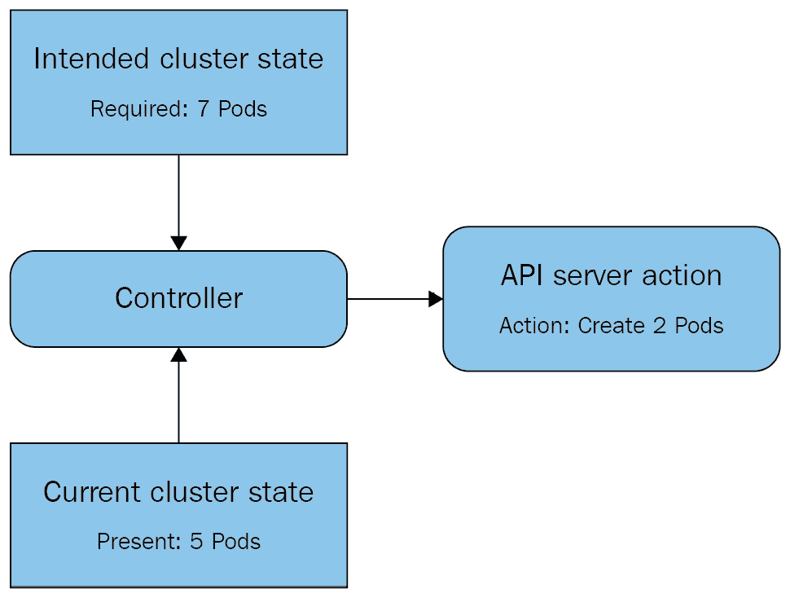
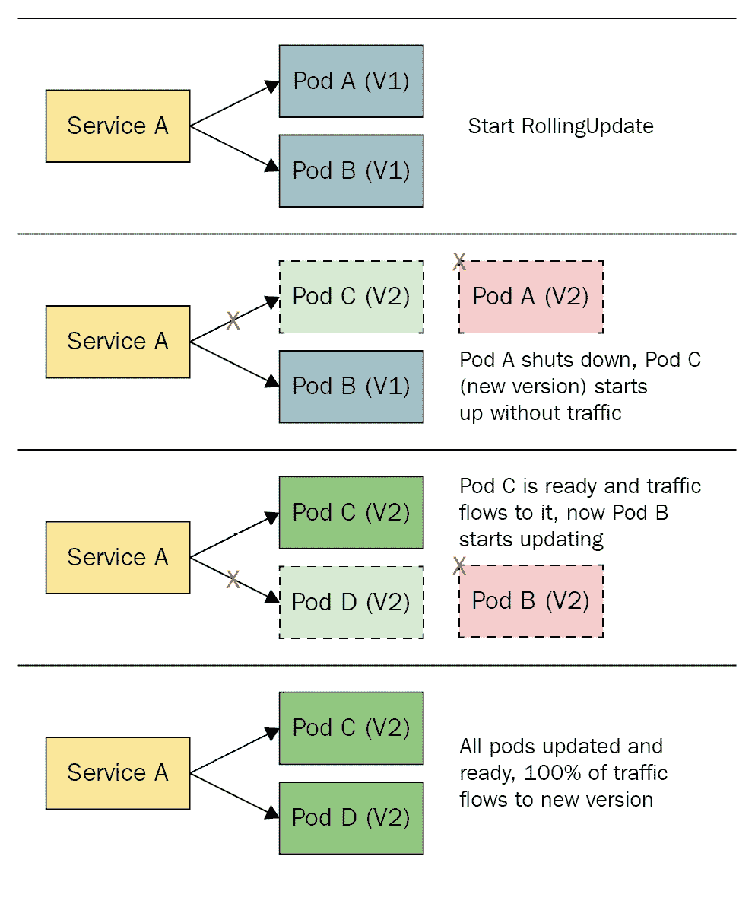

# 第四章：扩展和部署您的应用程序

在本章中，我们将学习用于运行应用程序和控制 Pod 的高级 Kubernetes 资源。首先，我们将介绍 Pod 的缺点，然后转向最简单的 Pod 控制器 ReplicaSets。然后我们将转向部署，这是将应用程序部署到 Kubernetes 的最流行方法。然后，我们将介绍特殊资源，以帮助您部署特定类型的应用程序–水平 Pod 自动缩放器、DaemonSets、StatefulSets 和 Jobs。最后，我们将通过一个完整的示例将所有内容整合起来，演示如何在 Kubernetes 上运行复杂的应用程序。

在本章中，我们将涵盖以下主题：

+   了解 Pod 的缺点及其解决方案

+   使用 ReplicaSets

+   控制部署

+   利用水平 Pod 自动缩放

+   实施 DaemonSets

+   审查 StatefulSets 和 Jobs

+   把所有东西放在一起

# 技术要求

为了运行本章中详细介绍的命令，您需要一台支持`kubectl`命令行工具的计算机，以及一个可用的 Kubernetes 集群。请参阅*第一章*，*与 Kubernetes 通信*，了解快速启动和运行 Kubernetes 的几种方法，以及如何安装`kubectl`工具的说明。

本章中使用的代码可以在书籍的 GitHub 存储库中找到[`github.com/PacktPublishing/Cloud-Native-with-Kubernetes/tree/master/Chapter4`](https://github.com/PacktPublishing/Cloud-Native-with-Kubernetes/tree/master/Chapter4)。

# 了解 Pod 的缺点及其解决方案

正如我们在上一章*第三章*中所回顾的，*在 Kubernetes 上运行应用程序容器*，在 Kubernetes 中，Pod 是在节点上运行一个或多个应用程序容器的实例。创建一个 Pod 就足以像在任何其他容器中一样运行应用程序。

也就是说，使用单个 Pod 来运行应用程序忽略了在容器中运行应用程序的许多好处。容器允许我们将应用程序的每个实例视为一个可以根据需求进行扩展或缩减的无状态项目，通过启动应用程序的新实例来满足需求。

这既可以让我们轻松扩展应用程序，又可以通过在给定时间提供多个应用程序实例来提高应用程序的可用性。如果我们的一个实例崩溃，应用程序仍将继续运行，并将自动扩展到崩溃前的水平。在 Kubernetes 上，我们通过使用 Pod 控制器资源来实现这一点。

## Pod 控制器

Kubernetes 提供了几种 Pod 控制器的选择。最简单的选择是使用 ReplicaSet，它维护特定 Pod 的给定数量的实例。如果一个实例失败，ReplicaSet 将启动一个新实例来替换它。

其次，有部署，它们自己控制一个 ReplicaSet。在 Kubernetes 上运行应用程序时，部署是最受欢迎的控制器，它们使得通过 ReplicaSet 进行滚动更新来升级应用程序变得容易。

水平 Pod 自动缩放器将部署带到下一个级别，允许应用根据性能指标自动缩放到不同数量的实例。

最后，在某些特定情况下可能有一些特殊的控制器可能是有价值的：

+   DaemonSets，每个节点上运行一个应用程序实例并维护它们

+   StatefulSets，其中 Pod 身份保持静态以帮助运行有状态的工作负载

+   作业，它在指定数量的 Pod 上启动，运行完成，然后关闭。

控制器的实际行为，无论是默认的 Kubernetes 控制器，如 ReplicaSet，还是自定义控制器（例如 PostgreSQL Operator），都应该很容易预测。标准控制循环的简化视图看起来像下面的图表：



图 4.1- Kubernetes 控制器的基本控制循环

正如您所看到的，控制器不断地检查**预期的集群状态**（我们希望有七个此应用程序的 Pod）与**当前的集群状态**（我们有五个此应用程序的 Pod 正在运行）是否匹配。当预期状态与当前状态不匹配时，控制器将通过 API 采取行动来纠正当前状态以匹配预期状态。

到目前为止，您应该明白为什么在 Kubernetes 上需要控制器：Pod 本身在提供高可用性应用程序方面不够强大。让我们继续讨论最简单的控制器：ReplicaSet。

# 使用 ReplicaSets

ReplicaSet 是最简单的 Kubernetes Pod 控制器资源。它取代了较旧的 ReplicationController 资源。

ReplicaSet 和 ReplicationController 之间的主要区别在于 ReplicationController 使用更基本类型的*选择器* - 确定应该受控制的 Pod 的过滤器。

虽然 ReplicationControllers 使用简单的基于等式（*key=value*）的选择器，但 ReplicaSets 使用具有多种可能格式的选择器，例如`matchLabels`和`matchExpressions`，这将在本章中进行审查。

重要说明

除非您有一个非常好的理由，否则不应该使用 ReplicationController 而应该使用 ReplicaSet-坚持使用 ReplicaSets。

ReplicaSets 允许我们通知 Kubernetes 维护特定 Pod 规范的一定数量的 Pod。ReplicaSet 的 YAML 与 Pod 的 YAML 非常相似。实际上，整个 Pod 规范都嵌套在 ReplicaSet 的 YAML 中，位于`template`键下。

还有一些其他关键区别，可以在以下代码块中观察到：

replica-set.yaml

```
apiVersion: apps/v1
kind: ReplicaSet
metadata:
  name: myapp-group
  labels:
    app: myapp
spec:
  replicas: 3
  selector:
    matchLabels:
      app: myapp
  template:
    metadata:
      labels:
        app: myapp
    spec:
      containers:
      - name: myapp-container
        image: busybox
```

正如您所看到的，除了`template`部分（本质上是一个 Pod 定义），在我们的 ReplicaSet 规范中还有一个`selector`键和一个`replicas`键。让我们从`replicas`开始。

## 副本

`replicas`键指定了副本数量，我们的 ReplicaSet 将确保在任何给定时间始终运行指定数量的副本。如果一个 Pod 死掉或停止工作，我们的 ReplicaSet 将创建一个新的 Pod 来替代它。这使得 ReplicaSet 成为一个自愈资源。

ReplicaSet 控制器如何决定一个 Pod 何时停止工作？它查看 Pod 的状态。如果 Pod 的当前状态不是“*Running*”或“*ContainerCreating*”，ReplicaSet 将尝试启动一个新的 Pod。

正如我们在*第三章*中讨论的那样，*在 Kubernetes 上运行应用容器*，容器创建后 Pod 的状态由存活探针、就绪探针和启动探针驱动，这些探针可以针对 Pod 进行特定配置。这意味着您可以设置特定于应用程序的方式来判断 Pod 是否以某种方式损坏，并且您的 ReplicaSet 可以介入并启动一个新的 Pod 来替代它。

## 选择器

`selector`键很重要，因为 ReplicaSet 的工作方式是以选择器为核心实现的控制器。ReplicaSet 的工作是确保与其选择器匹配的运行中的 Pod 数量是正确的。

比如说，你有一个现有的 Pod 运行你的应用程序 `MyApp`。这个 Pod 被标记为 `selector` 键为 `App=MyApp`。

现在假设你想创建一个具有相同应用程序的 ReplicaSet，这将增加你的应用程序的三个额外实例。你使用相同的选择器创建一个 ReplicaSet，并指定三个副本，目的是总共运行四个实例，因为你已经有一个在运行。

一旦你启动 ReplicaSet，会发生什么？你会发现运行该应用程序的总 pod 数将是三个，而不是四个。这是因为 ReplicaSet 有能力接管孤立的 pods 并将它们纳入其管理范围。

当 ReplicaSet 启动时，它会看到已经存在一个与其 `selector` 键匹配的现有 Pod。根据所需的副本数，ReplicaSet 将关闭现有的 Pods 或启动新的 Pods，以匹配 `selector` 以创建正确的数量。

## 模板

`template` 部分包含 Pod，并支持与 Pod YAML 相同的所有字段，包括元数据部分和规范本身。大多数其他控制器都遵循这种模式 - 它们允许你在更大的控制器 YAML 中定义 Pod 规范。

现在你应该了解 ReplicaSet 规范的各个部分以及它们的作用。让我们继续使用我们的 ReplicaSet 来运行应用程序。

## 测试 ReplicaSet

现在，让我们部署我们的 ReplicaSet。

复制先前列出的 `replica-set.yaml` 文件，并在与你的 YAML 文件相同的文件夹中使用以下命令在你的集群上运行它：

```
kubectl apply -f replica-set.yaml
```

为了检查 ReplicaSet 是否已正确创建，请运行 `kubectl get pods` 来获取默认命名空间中的 Pods。

由于我们没有为 ReplicaSet 指定命名空间，它将默认创建。`kubectl get pods` 命令应该给你以下结果：

```
NAME                            READY     STATUS    RESTARTS   AGE
myapp-group-192941298-k705b     1/1       Running   0          1m
myapp-group-192941298-o9sh8     1/1       Running   0        1m
myapp-group-192941298-n8gh2     1/1       Running   0        1m
```

现在，尝试使用以下命令删除一个 ReplicaSet Pod：

```
kubectl delete pod myapp-group-192941298-k705b
```

ReplicaSet 将始终尝试保持指定数量的副本在线。

让我们使用 `kubectl get` 命令再次查看我们正在运行的 pods：

```
NAME                         READY  STATUS             RESTARTS AGE
myapp-group-192941298-u42s0  1/1    ContainerCreating  0     1m
myapp-group-192941298-o9sh8  1/1    Running            0     2m
myapp-group-192941298-n8gh2  1/1    Running            0     2m
```

如你所见，我们的 ReplicaSet 控制器正在启动一个新的 pod，以保持我们的副本数为三。

最后，让我们使用以下命令删除我们的 ReplicaSet：

```
kubectl delete replicaset myapp-group
```

清理了一下我们的集群，让我们继续学习一个更复杂的控制器 - 部署。

# 控制部署

虽然 ReplicaSets 包含了您想要运行高可用性应用程序的大部分功能，但大多数时候您会想要使用部署来在 Kubernetes 上运行应用程序。

部署比 ReplicaSets 有一些优势，实际上它们通过拥有和控制一个 ReplicaSet 来工作。

部署的主要优势在于它允许您指定`rollout`过程 - 也就是说，应用程序升级如何部署到部署中的各个 Pod。这让您可以轻松配置控件以阻止糟糕的升级。

在我们回顾如何做到这一点之前，让我们看一下部署的整个规范：

deployment.yaml

```
apiVersion: apps/v1
kind: Deployment
metadata:
  name: myapp-deployment
  labels:
    app: myapp
spec:
  replicas: 3
  strategy:
    type: RollingUpdate
    rollingUpdate:
      maxSurge: 25%
      maxUnavailable: 25% 
  selector:
    matchLabels:
      app: myapp
  template:
    metadata:
      labels:
        app: myapp
    spec:
      containers:
      - name: myapp-container
        image: busybox
```

正如您所看到的，这与 ReplicaSet 的规范非常相似。我们在这里看到的区别是规范中的一个新键：`strategy`。

使用`strategy`设置，我们可以告诉部署方式升级我们的应用程序，可以通过`RollingUpdate`或`Recreate`。

`Recreate`是一种非常基本的部署方法：部署中的所有 Pod 将同时被删除，并将使用新版本创建新的 Pod。`Recreate`不能给我们太多控制权来防止糟糕的部署 - 如果由于某种原因新的 Pod 无法启动，我们将被困在一个完全无法运行的应用程序中。

另一方面，使用`RollingUpdate`，部署速度较慢，但控制更加严格。首先，新应用程序将逐步推出，逐个 Pod。我们可以指定`maxSurge`和`maxUnavailable`的值来调整策略。

滚动更新的工作方式是这样的 - 当部署规范使用 Pod 容器的新版本进行更新时，部署将逐个关闭一个 Pod，创建一个新的带有新应用程序版本的 Pod，等待新的 Pod 根据就绪检查注册为`Ready`，然后继续下一个 Pod。

`maxSurge`和`maxUnavailable`参数允许您加快或减慢此过程。`maxUnavailable`允许您调整在部署过程中不可用的最大 Pod 数量。这可以是百分比或固定数量。`maxSurge`允许您调整在任何给定时间内可以创建的超出部署副本数量的最大 Pod 数量。与`maxUnavailable`一样，这可以是百分比或固定数量。

以下图表显示了`RollingUpdate`过程：



图 4.2 - 部署的 RollingUpdate 过程

正如您所看到的，“滚动更新”过程遵循了几个关键步骤。部署尝试逐个更新 Pod。只有在成功更新一个 Pod 之后，更新才会继续到下一个 Pod。

## 使用命令控制部署。

正如我们所讨论的，我们可以通过简单地更新其 YAML 文件来更改我们的部署，使用声明性方法。然而，Kubernetes 还为我们提供了一些在`kubectl`中控制部署的特殊命令。

首先，Kubernetes 允许我们手动扩展部署-也就是说，我们可以编辑应该运行的副本数量。

要将我们的`myapp-deployment`扩展到五个副本，我们可以运行以下命令：

```
kubectl scale deployment myapp-deployment --replicas=5
```

同样，如果需要，我们可以将我们的`myapp-deployment`回滚到旧版本。为了演示这一点，首先让我们手动编辑我们的部署，以使用容器的新版本：

```
Kubectl set image deployment myapp-deployment myapp-container=busybox:1.2 –record=true
```

这个命令告诉 Kubernetes 将我们部署中容器的版本更改为 1.2。然后，我们的部署将按照前面的图表中的步骤来推出我们的更改。

现在，假设我们想回到之前更新容器图像版本之前的版本。我们可以使用`rollout undo`命令轻松实现这一点：

```
Kubectl rollout undo deployment myapp-deployment
```

在我们之前的情况下，我们只有两个版本，初始版本和我们更新容器的版本，但如果有其他版本，我们可以在`undo`命令中指定它们，就像这样：

```
Kubectl rollout undo deployment myapp-deployment –to-revision=10
```

这应该让您对为什么部署如此有价值有所了解-它们为我们提供了对应用程序新版本的推出的精细控制。接下来，我们将讨论一个与部署和副本集协同工作的 Kubernetes 智能缩放器。

# 利用水平 Pod 自动缩放器

正如我们所看到的，部署和副本集允许您指定应在某个时间可用的副本的总数。然而，这些结构都不允许自动缩放-它们必须手动缩放。

水平 Pod 自动缩放器（HPA）通过作为更高级别的控制器存在，可以根据 CPU 和内存使用等指标改变部署或副本集的副本数量来提供这种功能。

默认情况下，HPA 可以根据 CPU 利用率进行自动缩放，但通过使用自定义指标，可以扩展此功能。

HPA 的 YAML 文件如下所示：

hpa.yaml

```
apiVersion: autoscaling/v1
kind: HorizontalPodAutoscaler
metadata:
  name: myapp-hpa
spec:
  maxReplicas: 5
  minReplicas: 2
  scaleTargetRef:
    apiVersion: apps/v1
    kind: Deployment
    name: myapp-deployment
  targetCPUUtilizationPercentage: 70
```

在上述规范中，我们有`scaleTargetRef`，它指定了 HPA 应该自动缩放的内容，以及调整参数。

`scaleTargetRef`的定义可以是部署（Deployment）、副本集（ReplicaSet）或复制控制器（ReplicationController）。在这种情况下，我们已经定义了 HPA 来扩展我们之前创建的部署`myapp-deployment`。

对于调整参数，我们使用默认的基于 CPU 利用率的扩展，因此我们可以使用`targetCPUUtilizationPercentage`来定义运行我们应用程序的每个 Pod 的预期 CPU 利用率。如果我们的 Pod 的平均 CPU 使用率超过 70%，我们的 HPA 将扩展部署规范，如果它长时间下降到以下水平，它将缩小部署。

典型的扩展事件看起来像这样：

1.  部署的平均 CPU 使用率超过了三个副本的 70%。

1.  HPA 控制循环注意到 CPU 利用率的增加。

1.  HPA 使用新的副本计数编辑部署规范。这个计数是基于 CPU 利用率计算的，目的是使每个节点的 CPU 使用率保持在 70%以下的稳定状态。

1.  部署控制器启动一个新的副本。

1.  这个过程会重复自身来扩展或缩小部署。

总之，HPA 跟踪 CPU 和内存利用率，并在超出边界时启动扩展事件。接下来，我们将审查 DaemonSets，它们提供了一种非常特定类型的 Pod 控制器。

# 实施 DaemonSets

从现在到本章结束，我们将审查更多关于具有特定要求的应用程序运行的小众选项。

我们将从 DaemonSets 开始，它们类似于 ReplicaSets，只是副本的数量固定为每个节点一个副本。这意味着集群中的每个节点将始终保持应用程序的一个副本处于活动状态。

重要说明

重要的是要记住，在没有额外的 Pod 放置控制（如污点或节点选择器）的情况下，这个功能只会在每个节点上创建一个副本，我们将在*第八章*中更详细地介绍*Pod 放置控制*。

这最终看起来像典型 DaemonSet 的下图所示：


图 4.3 - DaemonSet 分布在三个节点上

正如您在上图中所看到的，每个节点（由方框表示）包含一个由 DaemonSet 控制的应用程序的 Pod。

这使得 DaemonSets 非常适合在节点级别收集指标或在每个节点上提供网络处理。DaemonSet 规范看起来像这样：

daemonset-1.yaml

```
apiVersion: apps/v1 
kind: DaemonSet
metadata:
  name: log-collector
spec:
  selector:
      matchLabels:
        name: log-collector   
  template:
    metadata:
      labels:
        name: log-collector
    spec:
      containers:
      - name: fluentd
        image: fluentd
```

如您所见，这与您典型的 ReplicaSet 规范非常相似，只是我们没有指定副本的数量。这是因为 DaemonSet 会尝试在集群中的每个节点上运行一个 Pod。

如果您想指定要运行应用程序的节点子集，可以使用节点选择器，如下面的文件所示：

daemonset-2.yaml

```
apiVersion: apps/v1 
kind: DaemonSet
metadata:
  name: log-collector
spec:
  selector:
      matchLabels:
        name: log-collector   
  template:
    metadata:
      labels:
        name: log-collector
    spec:
      nodeSelector:
        type: bigger-node 
      containers:
      - name: fluentd
        image: fluentd
```

这个 YAML 将限制我们的 DaemonSet 只能在其标签中匹配`type=bigger-node`的节点上运行。我们将在*第八章*中更多地了解有关节点选择器的信息，*Pod 放置控制*。现在，让我们讨论一种非常适合运行有状态应用程序（如数据库）的控制器类型 - StatefulSet。

# 理解 StatefulSets

StatefulSets 与 ReplicaSets 和 Deployments 非常相似，但有一个关键的区别，使它们更适合有状态的工作负载。StatefulSets 保持每个 Pod 的顺序和标识，即使 Pod 被重新调度到新节点上。

例如，在一个有 3 个副本的 StatefulSet 中，将始终存在 Pod 1、Pod 2 和 Pod 3，并且这些 Pod 将在 Kubernetes 和存储中保持它们的标识（我们将在*第七章*中介绍，*Kubernetes 上的存储*），无论发生任何重新调度。

让我们来看一个简单的 StatefulSet 配置：

statefulset.yaml

```
apiVersion: apps/v1
kind: StatefulSet
metadata:
  name: stateful
spec:
  selector:
    matchLabels:
      app: stateful-app
  replicas: 5
  template:
    metadata:
      labels:
        app: stateful-app
    spec:
      containers:
      - name: app
        image: busybox
```

这个 YAML 将创建一个具有五个应用程序副本的 StatefulSet。

让我们看看 StatefulSet 如何与典型的 Deployment 或 ReplicaSet 不同地维护 Pod 标识。让我们使用以下命令获取所有 Pods：

```
kubectl get pods
```

输出应如下所示：

```
NAME      		   READY     STATUS    RESTARTS   AGE
stateful-app-0     1/1       Running   0         55s
stateful-app-1     1/1       Running   0         48s
stateful-app-2     1/1       Running   0         26s
stateful-app-3     1/1       Running   0         18s
stateful-app-4     0/1       Pending   0         3s
```

如您所见，在这个例子中，我们有五个 StatefulSet Pods，每个都有一个数字指示其标识。这个属性对于有状态的应用程序非常有用，比如数据库集群。在 Kubernetes 上运行数据库集群时，主 Pod 与副本 Pod 的标识很重要，我们可以使用 StatefulSet 标识来轻松管理它。

另一个有趣的地方是，您可以看到最终的 Pod 仍在启动，并且随着数字标识的增加，Pod 的年龄也在增加。这是因为 StatefulSet Pods 是按顺序逐个创建的。

StatefulSets 在持久的 Kubernetes 存储中非常有价值，以便运行有状态的应用程序。我们将在第七章《Kubernetes 上的存储》中了解更多相关内容，但现在让我们讨论另一个具有非常特定用途的控制器：Jobs。

# 使用 Jobs

Kubernetes 中 Job 资源的目的是运行可以完成的任务，这使它们不太适合长时间运行的应用程序，但非常适合批处理作业或类似任务，可以从并行性中受益。

以下是 Job 规范 YAML 的样子：

job-1.yaml

```
apiVersion: batch/v1
kind: Job
metadata:
  name: runner
spec:
  template:
    spec:
      containers:
      - name: run-job
        image: node:lts-jessie
        command: ["node", "job.js"]
      restartPolicy: Never
  backoffLimit: 4
```

这个 Job 将启动一个单独的 Pod，并运行一个命令 `node job.js`，直到完成，然后 Pod 将关闭。在这个和未来的示例中，我们假设使用的容器镜像有一个名为 `job.js` 的文件，其中包含了作业逻辑。`node:lts-jessie` 容器镜像默认情况下不会有这个文件。这是一个不使用并行性运行的 Job 的示例。正如您可能从 Docker 的使用中知道的那样，多个命令参数必须作为字符串数组传递。

为了创建一个可以并行运行的 Job（也就是说，多个副本同时运行 Job），您需要以一种可以在结束进程之前告诉它 Job 已完成的方式来开发应用程序代码。为了做到这一点，每个 Job 实例都需要包含代码，以确保它执行更大批处理任务的正确部分，并防止发生重复工作。

有几种应用程序模式可以实现这一点，包括互斥锁和工作队列。此外，代码需要检查整个批处理任务的状态，这可能需要通过更新数据库中的值来处理。一旦 Job 代码看到更大的任务已经完成，它就应该退出。

完成后，您可以使用 `parallelism` 键向作业代码添加并行性。以下代码块显示了这一点：

job-2.yaml

```
apiVersion: batch/v1
kind: Job
metadata:
  name: runner
spec:
  parallelism: 3
  template:
    spec:
      containers:
      - name: run-job
        image: node:lts-jessie
        command: ["node", "job.js"]
      restartPolicy: Never
  backoffLimit: 4
```

如您所见，我们使用 `parallelism` 键添加了三个副本。此外，您可以将纯作业并行性替换为指定数量的完成次数，在这种情况下，Kubernetes 可以跟踪 Job 已完成的次数。您仍然可以为此设置并行性，但如果不设置，它将默认为 1。

下一个规范将运行一个 Job 完成 4 次，每次运行 2 次迭代：

job-3.yaml

```
apiVersion: batch/v1
kind: Job
metadata:
  name: runner
spec:
  parallelism: 2
  completions: 4
  template:
    spec:
      containers:
      - name: run-job
        image: node:lts-jessie
        command: ["node", "job.js"]
      restartPolicy: Never
  backoffLimit: 4
```

Kubernetes 上的作业提供了一种很好的方式来抽象一次性进程，并且许多第三方应用程序将它们链接到工作流中。正如你所看到的，它们非常容易使用。

接下来，让我们看一个非常相似的资源，CronJob。

## CronJobs

CronJobs 是用于定时作业执行的 Kubernetes 资源。这与你可能在你喜欢的编程语言或应用程序框架中找到的 CronJob 实现非常相似，但有一个关键的区别。Kubernetes CronJobs 触发 Kubernetes Jobs，这提供了一个额外的抽象层，可以用来触发每天晚上的批处理作业。

Kubernetes 中的 CronJobs 使用非常典型的 cron 表示法进行配置。让我们来看一下完整的规范：

cronjob-1.yaml

```
apiVersion: batch/v1beta1
kind: CronJob
metadata:
  name: hello
spec:
  schedule: "0 1 * * *"
  jobTemplate:
    spec:
      template:
        spec:
          containers:
           - name: run-job
             image: node:lts-jessie
             command: ["node", "job.js"]
          restartPolicy: OnFailure
```

这个 CronJob 将在每天凌晨 1 点创建一个与我们之前的 Job 规范相同的 Job。要快速查看 cron 时间表示法，以解释我们凌晨 1 点工作的语法，请继续阅读。要全面了解 cron 表示法，请查看[`man7.org/linux/man-pages/man5/crontab.5.html`](http://man7.org/linux/man-pages/man5/crontab.5.html)。

Cron 表示法由五个值组成，用空格分隔。每个值可以是数字整数、字符或组合。这五个值中的每一个代表一个时间值，格式如下，从左到右：

+   分钟

+   小时

+   一个月中的某一天（比如`25`）

+   月

+   星期几（例如，`3` = 星期三）

之前的 YAML 假设了一个非并行的 CronJob。如果我们想增加 CronJob 的批处理能力，我们可以像之前的作业规范一样添加并行性。以下代码块显示了这一点：

cronjob-2.yaml

```
apiVersion: batch/v1beta1
kind: CronJob
metadata:
  name: hello
spec:
  schedule: "0 1 * * *"
  jobTemplate:
    spec:
      parallelism: 3
      template:
        spec:
          containers:
           - name: run-job
             image: node:lts-jessie
             command: ["node", "job.js"]
          restartPolicy: OnFailure
```

请注意，为了使其工作，你的 CronJob 容器中的代码需要优雅地处理并行性，这可以使用工作队列或其他类似的模式来实现。

我们现在已经审查了 Kubernetes 默认提供的所有基本控制器。让我们利用我们的知识，在下一节中运行一个更复杂的应用程序示例在 Kubernetes 上。

# 把所有这些放在一起

我们现在有了在 Kubernetes 上运行应用程序的工具集。让我们看一个真实的例子，看看如何将所有这些组合起来运行一个具有多个层和功能分布在 Kubernetes 资源上的应用程序：


图 4.4 - 多层应用程序图表

正如您在前面的代码中所看到的，我们的示例应用程序包含一个运行.NET Framework 应用程序的 Web 层，一个运行 Java 的中间层或服务层，一个运行 Postgres 的数据库层，最后是一个日志/监控层。

我们对每个层级的控制器选择取决于我们计划在每个层级上运行的应用程序。对于 Web 层和中间层，我们运行无状态应用程序和服务，因此我们可以有效地使用 Deployments 来处理更新、蓝/绿部署等。

对于数据库层，我们需要我们的数据库集群知道哪个 Pod 是副本，哪个是主节点 - 因此我们使用 StatefulSet。最后，我们的日志收集器需要在每个节点上运行，因此我们使用 DaemonSet 来运行它。

现在，让我们逐个查看每个层级的示例 YAML 规范。

让我们从基于 JavaScript 的 Web 应用程序开始。通过在 Kubernetes 上托管此应用程序，我们可以进行金丝雀测试和蓝/绿部署。需要注意的是，本节中的一些示例使用在 DockerHub 上不公开可用的容器映像名称。要使用此模式，请将示例调整为您自己的应用程序容器，或者如果您想在没有实际应用程序逻辑的情况下运行它，只需使用 busybox。

Web 层的 YAML 文件可能如下所示：

example-deployment-web.yaml

```
apiVersion: apps/v1
kind: Deployment
metadata:
  name: webtier-deployment
  labels:
    tier: web
spec:
  replicas: 10
  strategy:
    type: RollingUpdate
    rollingUpdate:
      maxSurge: 50%
      maxUnavailable: 25% 
  selector:
    matchLabels:
      tier: web
  template:
    metadata:
      labels:
        tier: web
    spec:
      containers:
      - name: reactapp-container
        image: myreactapp
```

在前面的 YAML 中，我们使用`tier`标签对我们的应用程序进行标记，并将其用作我们的`matchLabels`选择器。

接下来是中间层服务层。让我们看看相关的 YAML：

example-deployment-mid.yaml

```
apiVersion: apps/v1
kind: Deployment
metadata:
  name: midtier-deployment
  labels:
    tier: mid
spec:
  replicas: 8
  strategy:
    type: RollingUpdate
    rollingUpdate:
      maxSurge: 25%
      maxUnavailable: 25% 
  selector:
    matchLabels:
      tier: mid
  template:
    metadata:
      labels:
        tier: mid
    spec:
      containers:
      - name: myjavaapp-container
        image: myjavaapp
```

正如您在前面的代码中所看到的，我们的中间层应用程序与 Web 层设置非常相似，并且我们使用了另一个 Deployment。

现在是有趣的部分 - 让我们来看看我们的 Postgres StatefulSet 的规范。我们已经在这个代码块中进行了一些截断，以便适应页面，但您应该能够看到最重要的部分：

example-statefulset.yaml

```
apiVersion: apps/v1
kind: StatefulSet
metadata:
  name: postgres-db
  labels:
    tier: db
spec:
  serviceName: "postgres"
  replicas: 2
  selector:
    matchLabels:
      tier: db
  template:
    metadata:
      labels:
        tier: db
    spec:
      containers:
      - name: postgres
        image: postgres:latest
        envFrom:
          - configMapRef:
              name: postgres-conf
        volumeMounts:
        - name: pgdata
          mountPath: /var/lib/postgresql/data
          subPath: postgres
```

在前面的 YAML 文件中，我们可以看到一些我们尚未审查的新概念 - ConfigMaps 和卷。我们将在*第六章*，*Kubernetes 应用程序配置*和*第七章*，*Kubernetes 上的存储*中更仔细地了解它们的工作原理，但现在让我们专注于规范的其余部分。我们有我们的`postgres`容器以及在默认的 Postgres 端口`5432`上设置的端口。

最后，让我们来看看我们的日志应用程序的 DaemonSet。这是 YAML 文件的一部分，我们为了长度又进行了截断：

example-daemonset.yaml

```
apiVersion: apps/v1
kind: DaemonSet
metadata:
  name: fluentd
  namespace: kube-system
  labels:
    tier: logging
spec:
  updateStrategy:
    type: RollingUpdate
  template:
    metadata:
      labels:
        tier: logging
    spec:
      tolerations:
      - key: node-role.kubernetes.io/master
        effect: NoSchedule
      containers:
      - name: fluentd
        image: fluent/fluentd-kubernetes-daemonset:v1-debian-papertrail
        env:
          - name: FLUENT_PAPERTRAIL_HOST
            value: "mycompany.papertrailapp.com"
          - name: FLUENT_PAPERTRAIL_PORT
            value: "61231"
          - name: FLUENT_HOSTNAME
            value: "DEV_CLUSTER"
```

在这个 DaemonSet 中，我们正在设置 FluentD（一个流行的开源日志收集器）将日志转发到 Papertrail，一个基于云的日志收集器和搜索工具。同样，在这个 YAML 文件中，有一些我们以前没有审查过的内容。例如，`tolerations`部分用于`node-role.kubernetes.io/master`，实际上允许我们的 DaemonSet 将 Pod 放置在主节点上，而不仅仅是工作节点上。我们将在*第八章* *Pod 放置控制*中审查这是如何工作的。

我们还在 Pod 规范中直接指定环境变量，这对于相对基本的配置来说是可以的，但是可以通过使用 Secrets 或 ConfigMaps（我们将在*第六章* *Kubernetes 应用配置*中进行审查）来改进，以避免将其放入我们的 YAML 代码中。

# 摘要

在本章中，我们回顾了在 Kubernetes 上运行应用程序的一些方法。首先，我们回顾了为什么 Pod 本身不足以保证应用程序的可用性，并介绍了控制器。然后，我们回顾了一些简单的控制器，包括 ReplicaSets 和 Deployments，然后转向具有更具体用途的控制器，如 HPAs、Jobs、CronJobs、StatefulSets 和 DaemonSets。最后，我们将所有学到的知识应用到了在 Kubernetes 上运行复杂应用程序的实现中。

在下一章中，我们将学习如何使用 Services 和 Ingress 将我们的应用程序（现在具有高可用性）暴露给世界。

# 问题

1.  ReplicaSet 和 ReplicationController 之间有什么区别？

1.  Deployment 相对于 ReplicaSet 的优势是什么？

1.  什么是 Job 的一个很好的用例？

1.  为什么 StatefulSets 对有状态的工作负载更好？

1.  我们如何使用 Deployments 支持金丝雀发布流程？

# 进一步阅读

+   官方 Kubernetes 文档：[`kubernetes.io/docs/home/`](https://kubernetes.io/docs/home/)

+   Kubernetes Job 资源的文档：[`kubernetes.io/docs/concepts/workloads/controllers/job/`](https://kubernetes.io/docs/concepts/workloads/controllers/job/)

+   FluentD DaemonSet 安装文档：[`github.com/fluent/fluentd-kubernetes-daemonset`](https://github.com/fluent/fluentd-kubernetes-daemonset)

+   *Kubernetes The Hard Way*: [`github.com/kelseyhightower/kubernetes-the-hard-way`](https://github.com/kelseyhightower/kubernetes-the-hard-way)
