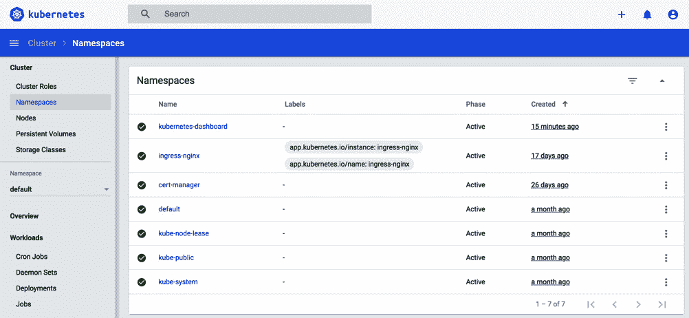
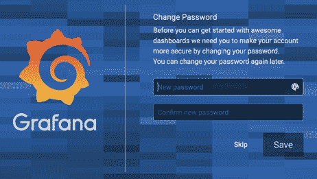
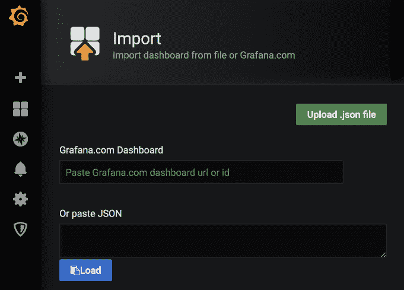
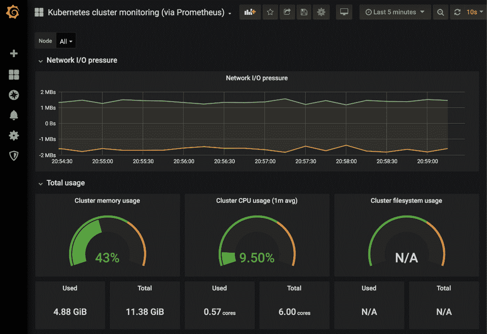
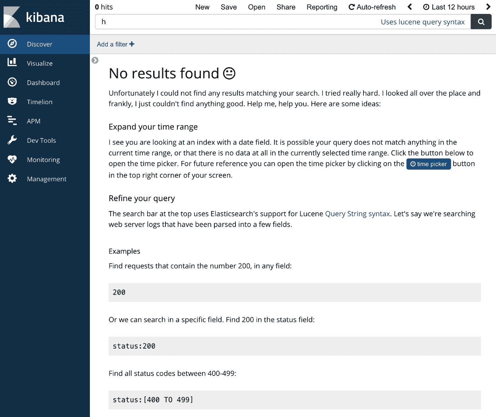
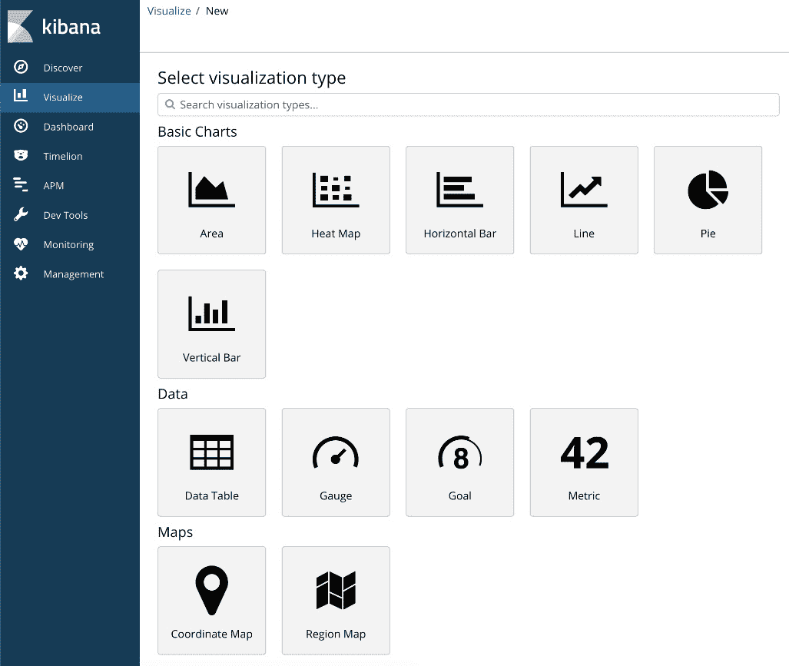
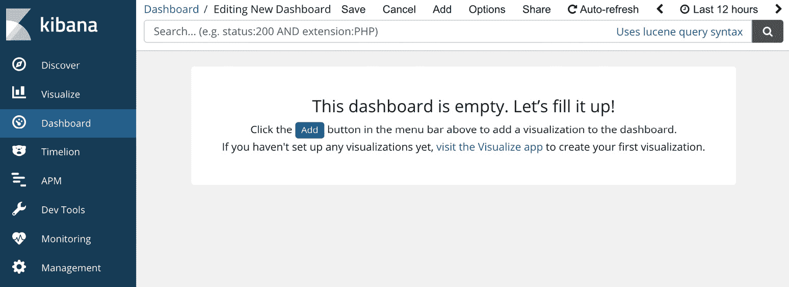

# 第九章：Kubernetes 上的可观测性

本章深入讨论了在生产环境中运行 Kubernetes 时强烈建议实施的能力。首先，我们讨论了在分布式系统（如 Kubernetes）的上下文中的可观测性。然后，我们看一下内置的 Kubernetes 可观测性堆栈以及它实现的功能。最后，我们学习如何通过生态系统中的额外可观测性、监控、日志记录和指标基础设施来补充内置的可观测性工具。本章中学到的技能将帮助您将可观测性工具部署到您的 Kubernetes 集群，并使您能够了解您的集群（以及在其上运行的应用程序）的运行方式。

在本章中，我们将涵盖以下主题：

+   在 Kubernetes 上理解可观测性

+   使用默认的可观测性工具 - 指标、日志和仪表板

+   实施生态系统的最佳实践

首先，我们将学习 Kubernetes 为可观测性提供的开箱即用工具和流程。

# 技术要求

为了运行本章中详细介绍的命令，您需要一台支持`kubectl`命令行工具的计算机，以及一个正常运行的 Kubernetes 集群。请参阅*第一章*，*与 Kubernetes 通信*，了解快速启动和安装 kubectl 工具的几种方法。

本章中使用的代码可以在该书的 GitHub 存储库中找到：

[`github.com/PacktPublishing/Cloud-Native-with-Kubernetes/tree/master/Chapter9`](https://github.com/PacktPublishing/Cloud-Native-with-Kubernetes/tree/master/Chapter9)

# 在 Kubernetes 上理解可观测性

没有监控的生产系统是不完整的。在软件中，我们将可观测性定义为在任何时间点都能够了解系统的性能（在最好的情况下，还能了解原因）。可观测性在安全性、性能和运行能力方面带来了显著的好处。通过了解您的系统在虚拟机、容器和应用程序级别的响应方式，您可以调整它以高效地运行，快速响应事件，并更容易地排除错误。

例如，让我们来看一个场景，您的应用程序运行非常缓慢。为了找到瓶颈，您可能会查看应用程序代码本身，Pod 的资源规格，部署中的 Pod 数量，Pod 级别或节点级别的内存和 CPU 使用情况，以及外部因素，比如在集群外运行的 MySQL 数据库。

通过添加可观察性工具，您将能够诊断许多这些变量，并找出可能导致应用程序减速的问题。

Kubernetes 作为一个成熟的容器编排系统，为我们提供了一些默认工具来监控我们的应用程序。在本章中，我们将把可观察性分为四个概念：指标、日志、跟踪和警报。让我们来看看每一个：

+   **指标**在这里代表着查看系统当前状态的数值表示能力，特别关注 CPU、内存、网络、磁盘空间等。这些数字让我们能够判断当前状态与系统最大容量之间的差距，并确保系统对用户保持可用。

+   **日志**指的是从应用程序和系统中收集文本日志的做法。日志可能是 Kubernetes 控制平面日志和应用程序 Pod 自身的日志的组合。日志可以帮助我们诊断 Kubernetes 系统的可用性，但它们也可以帮助我们排除应用程序错误。

+   **跟踪**指的是收集分布式跟踪。跟踪是一种可观察性模式，提供了对请求链的端到端可见性 - 这些请求可以是 HTTP 请求或其他类型的请求。在使用微服务的分布式云原生环境中，这个主题尤为重要。如果您有许多微服务并且它们相互调用，那么在涉及多个服务的单个端到端请求时，很难找到瓶颈或问题。跟踪允许您查看每个服务对服务调用的每个环节分解的请求。

+   **警报**对应于在发生某些事件时设置自动触点的做法。警报可以设置在*指标*和*日志*上，并通过各种媒介传递，从短信到电子邮件再到第三方应用程序等等。

在这四个可观测性方面之间，我们应该能够了解我们集群的健康状况。然而，可以配置许多不同的可能的指标、日志甚至警报。因此，了解要寻找的内容非常重要。下一节将讨论 Kubernetes 集群和应用程序健康最重要的可观测性领域。

## 了解对 Kubernetes 集群和应用程序健康至关重要的内容

在 Kubernetes 或第三方可观测性解决方案提供的大量可能的指标和日志中，我们可以缩小一些最有可能导致集群出现重大问题的指标。无论您最终选择使用哪种可观测性解决方案，您都应该将这些要点放在最显眼的位置。首先，让我们看一下 CPU 使用率与集群健康之间的关系。

### 节点 CPU 使用率

在您的可观测性解决方案中，跨 Kubernetes 集群节点的 CPU 使用率状态是一个非常重要的指标。我们在之前的章节中已经讨论过，Pod 可以为 CPU 使用率定义资源请求和限制。然而，当限制设置得比集群的最大 CPU 容量更高时，节点仍然可能过度使用 CPU。此外，运行我们控制平面的主节点也可能遇到 CPU 容量问题。

CPU 使用率达到最大的工作节点可能会表现不佳，或者限制运行在 Pod 上的工作负载。如果 Pod 上没有设置限制，或者节点的总 Pod 资源限制大于其最大容量，即使其总资源请求较低，也很容易发生这种情况。CPU 使用率达到最大的主节点可能会影响调度器、kube-apiserver 或其他控制平面组件的性能。

总的来说，工作节点和主节点的 CPU 使用率应该在您的可观测性解决方案中可见。最好的方法是通过一些指标（例如在本章后面将要介绍的 Grafana 等图表解决方案）以及对集群中节点的高 CPU 使用率的警报来实现。

内存使用率也是一个非常重要的指标，与 CPU 类似，需要密切关注。

### 节点内存使用率

与 CPU 使用率一样，内存使用率也是集群中需要密切观察的一个极其重要的指标。内存使用率可以通过 Pod 资源限制进行过度使用，对于集群中的主节点和工作节点都可能出现与 CPU 使用率相同的问题。

同样，警报和指标的组合对于查看集群内存使用情况非常重要。我们将在本章后面学习一些工具。

下一个重要的可观察性部分，我们将不再关注指标，而是关注日志。

### 控制平面日志记录

### 当运行时，Kubernetes 控制平面的组件会输出日志，这些日志可以用于深入了解集群操作。正如我们将在《第十章》*Chapter 10*中看到的那样，这些日志也可以在故障排除中起到重要作用，*故障排除 Kubernetes*。Kubernetes API 服务器、控制器管理器、调度程序、kube 代理和 kubelet 的日志对于某些故障排除或可观察性原因都非常有用。

### 应用程序日志记录

应用程序日志记录也可以并入 Kubernetes 的可观察性堆栈中——能够查看应用程序日志以及其他指标可能对操作员非常有帮助。

### 应用程序性能指标

与应用程序日志记录一样，应用程序性能指标和监控对于在 Kubernetes 上运行的应用程序的性能非常重要。在应用程序级别进行内存使用和 CPU 分析可以成为可观察性堆栈中有价值的一部分。

一般来说，Kubernetes 提供了应用程序监控和日志记录的数据基础设施，但不提供诸如图表和搜索等更高级的功能。考虑到这一点，让我们回顾一下 Kubernetes 默认提供的工具，以解决这些问题。

# 使用默认的可观察性工具

Kubernetes 甚至在不添加任何第三方解决方案的情况下就提供了可观察性工具。这些本机 Kubernetes 工具构成了许多更强大解决方案的基础，因此讨论它们非常重要。由于可观察性包括指标、日志、跟踪和警报，我们将依次讨论每个内容，首先关注 Kubernetes 本机解决方案。首先，让我们讨论指标。

## Kubernetes 上的指标

通过简单运行`kubectl describe pod`，可以获得关于应用程序的大量信息。我们可以看到有关 Pod 规范的信息，它所处的状态以及阻止其功能的关键问题。

假设我们的应用程序出现了一些问题。具体来说，Pod 没有启动。为了调查，我们运行`kubectl describe pod`。作为*第一章*中提到的 kubectl 别名的提醒，`kubectl describe pod`与`kubectl describe pods`是相同的。这是`describe pod`命令的一个示例输出 - 我们除了`Events`信息之外剥离了所有内容：

图 9.1 - 描述 Pod 事件输出

正如您所看到的，这个 Pod 没有被调度，因为我们的 Nodes 都没有内存了！这将是一个值得进一步调查的好事。

让我们继续。通过运行`kubectl describe nodes`，我们可以了解很多关于我们的 Kubernetes Nodes 的信息。其中一些信息对我们系统的性能非常重要。这是另一个示例输出，这次是来自`kubectl describe nodes`命令。而不是将整个输出放在这里，因为可能会相当冗长，让我们聚焦在两个重要部分 - `Conditions`和`Allocated resources`。首先，让我们回顾一下`Conditions`部分：

图 9.2 - 描述 Node 条件输出

正如您所看到的，我们已经包含了`kubectl describe nodes`命令输出的`Conditions`块。这是查找任何问题的好地方。正如我们在这里看到的，我们的 Node 实际上正在遇到问题。我们的`MemoryPressure`条件为 true，而`Kubelet`内存不足。难怪我们的 Pod 无法调度！

接下来，检查`分配的资源`块：

[PRE0]

现在我们看到了一些指标！看起来我们的 Pod 正在请求过多的内存，导致我们的 Node 和 Pod 出现问题。从这个输出中可以看出，Kubernetes 默认已经在收集有关我们的 Nodes 的指标数据。没有这些数据，调度器将无法正常工作，因为维护 Pod 资源请求与 Node 容量是其最重要的功能之一。

然而，默认情况下，这些指标不会向用户显示。实际上，它们是由每个 Node 的`Kubelet`收集并传递给调度器来完成其工作。幸运的是，我们可以通过部署 Metrics Server 轻松地获取这些指标到我们的集群中。

Metrics Server 是一个官方支持的 Kubernetes 应用程序，它收集指标信息并在 API 端点上公开它以供使用。实际上，Metrics Server 是使水平 Pod 自动缩放器工作所必需的，但它并不总是默认包含在内，这取决于 Kubernetes 发行版。

部署 Metrics Server 非常快速。在撰写本书时，可以使用以下命令安装最新版本：

[PRE1]

重要说明

有关如何使用 Metrics Server 的完整文档可以在[`github.com/kubernetes-sigs/metrics-server`](https://github.com/kubernetes-sigs/metrics-server)找到。

一旦 Metrics Server 运行起来，我们就可以使用一个全新的 Kubernetes 命令。`kubectl top`命令可用于 Pod 或节点，以查看有关内存和 CPU 使用量的详细信息。

让我们看一些示例用法。运行`kubectl top nodes`以查看节点级别的指标。以下是命令的输出：

图 9.3-节点指标输出

正如您所看到的，我们能够看到绝对和相对的 CPU 和内存使用情况。

重要说明

CPU 核心以`millcpu`或`millicores`来衡量。1000`millicores`相当于一个虚拟 CPU。内存以字节为单位。

接下来，让我们来看一下`kubectl top pods`命令。使用`-namespace kube-system`标志运行它，以查看`kube-system`命名空间中的 Pod。

为此，我们运行以下命令：

[PRE2]

然后我们得到以下输出：

[PRE3]

正如您所看到的，该命令使用与`kubectl top nodes`相同的绝对单位-毫核和字节。在查看 Pod 级别的指标时，没有相对百分比。

接下来，我们将看一下 Kubernetes 如何处理日志记录。

## Kubernetes 上的日志记录

我们可以将 Kubernetes 上的日志记录分为两个领域- *应用程序日志* 和 *控制平面日志*。让我们从控制平面日志开始。

### 控制平面日志

控制平面日志是指由 Kubernetes 控制平面组件（如调度程序、API 服务器等）创建的日志。对于纯净的 Kubernetes 安装，控制平面日志可以在节点本身找到，并且需要直接访问节点才能查看。对于设置为使用`systemd`的组件的集群，日志可以使用`journalctl`CLI 工具找到（有关更多信息，请参阅以下链接：[`manpages.debian.org/stretch/systemd/journalctl.1.en.html`](https://manpages.debian.org/stretch/systemd/journalctl.1.en.html)）。

在主节点上，您可以在文件系统的以下位置找到日志：

+   在`/var/log/kube-scheduler.log`中，您可以找到 Kubernetes 调度器的日志。

+   在`/var/log/kube-controller-manager.log`中，您可以找到控制器管理器的日志（例如，查看扩展事件）。

+   在`/var/log/kube-apiserver.log`中，您可以找到 Kubernetes API 服务器的日志。

在工作节点上，日志可以在文件系统的两个位置找到：

+   在`/var/log/kubelet.log`中，您可以找到 kubelet 的日志。

+   在`/var/log/kube-proxy.log`中，您可以找到 kube 代理的日志。

尽管通常情况下，集群健康受 Kubernetes 主节点和工作节点组件的影响，但跟踪应用程序日志也同样重要。

### 应用程序日志

在 Kubernetes 上查找应用程序日志非常容易。在我们解释它是如何工作之前，让我们看一个例子。

要检查特定 Pod 的日志，可以使用`kubectl logs <pod_name>`命令。该命令的输出将显示写入容器的`stdout`或`stderr`的任何文本。如果一个 Pod 有多个容器，您必须在命令中包含容器名称：

[PRE4]

在幕后，Kubernetes 通过使用容器引擎的日志驱动程序来处理 Pod 日志。通常，任何写入`stdout`或`stderr`的日志都会被持久化到每个节点的磁盘中的`/var/logs`文件夹中。根据 Kubernetes 的分发情况，可能会设置日志轮换，以防止日志占用节点磁盘空间过多。此外，Kubernetes 组件，如调度器、kubelet 和 kube-apiserver 也会将日志持久化到节点磁盘空间中，通常在`/var/logs`文件夹中。重要的是要注意默认日志记录功能的有限性 - Kubernetes 的强大可观察性堆栈肯定会包括第三方解决方案用于日志转发，我们很快就会看到。

接下来，对于一般的 Kubernetes 可观察性，我们可以使用 Kubernetes 仪表板。

## 安装 Kubernetes 仪表板

Kubernetes 仪表板提供了 kubectl 的所有功能，包括查看日志和编辑资源，都可以在图形界面中完成。设置仪表板非常容易，让我们看看如何操作。

仪表板可以通过单个`kubectl apply`命令安装。要进行自定义，请查看 Kubernetes 仪表板 GitHub 页面[`github.com/kubernetes/dashboard`](https://github.com/kubernetes/dashboard)。

要安装 Kubernetes 仪表板的版本，请运行以下`kubectl`命令，将`<VERSION>`标签替换为您所需的版本，根据您正在使用的 Kubernetes 版本（再次检查 Dashboard GitHub 页面以获取版本兼容性）：

[PRE5]

在我们的案例中，截至本书撰写时，我们将使用 v2.0.4 - 最终的命令看起来像这样：

[PRE6]

安装了 Kubernetes 仪表板后，有几种方法可以访问它。

重要提示

通常不建议使用 Ingress 或公共负载均衡器服务，因为 Kubernetes 仪表板允许用户更新集群对象。如果由于某种原因您的仪表板登录方法受到损害或容易被发现，您可能面临着很大的安全风险。

考虑到这一点，我们可以使用`kubectl port-forward`或`kubectl proxy`来从本地机器查看我们的仪表板。

在本例中，我们将使用`kubectl proxy`命令，因为我们还没有在示例中使用过它。

`kubectl proxy`命令与`kubectl port-forward`命令不同，它只需要一个命令即可代理到集群上运行的每个服务。它通过直接将 Kubernetes API 代理到本地机器上的一个端口来实现这一点，默认端口为`8081`。有关`kubectl proxy`命令的详细讨论，请查看[`kubernetes.io/docs/reference/generated/kubectl/kubectl-commands#proxy`](https://kubernetes.io/docs/reference/generated/kubectl/kubectl-commands#proxy)上的文档。

为了使用`kubectl proxy`访问特定的 Kubernetes 服务，您只需要正确的路径。运行`kubectl proxy`后访问 Kubernetes 仪表板的路径将如下所示：

[PRE7]

正如您所看到的，我们在浏览器中放置的`kubectl proxy`路径是在本地主机端口`8001`上，并提到了命名空间（`kubernetes-dashboard`）、服务名称和选择器（`https:kubernetes-dashboard`）以及代理路径。

让我们将 Kubernetes 仪表板的 URL 放入浏览器中并查看结果：

图 9.4 - Kubernetes 仪表板登录

当我们部署和访问 Kubernetes 仪表板时，我们会看到一个登录界面。我们可以创建一个服务账户（或使用我们自己的）来登录仪表板，或者简单地链接我们的本地 `Kubeconfig` 文件。通过使用特定服务账户的令牌登录到 Kubernetes 仪表板，仪表板用户将继承该服务账户的权限。这允许您指定用户将能够使用 Kubernetes 仪表板执行哪种类型的操作 - 例如，只读权限。

让我们继续为我们的 Kubernetes 仪表板创建一个全新的服务账户。您可以自定义此服务账户并限制其权限，但现在我们将赋予它管理员权限。要做到这一点，请按照以下步骤操作：

1.  我们可以使用以下 Kubectl 命令来命令式地创建一个服务账户：

[PRE8]

这将产生以下输出，确认了我们服务账户的创建：

[PRE9]

1.  现在，我们需要将我们的服务账户链接到一个 ClusterRole。您也可以使用 Role，但我们希望我们的仪表板用户能够访问所有命名空间。为了使用单个命令将服务账户链接到 `cluster-admin` 默认 ClusterRole，我们可以运行以下命令：

[PRE10]

这个命令将产生以下输出：

[PRE11]

1.  运行此命令后，我们应该能够登录到我们的仪表板！首先，我们只需要找到我们将用于登录的令牌。服务账户的令牌存储为 Kubernetes 秘密，所以让我们看看它是什么样子。运行以下命令以查看我们的令牌存储在哪个秘密中：

[PRE12]

在输出中，您应该会看到一个类似以下的秘密：

[PRE13]

1.  现在，为了获取我们用于登录到仪表板的令牌，我们只需要使用以下命令描述秘密内容：

[PRE14]

生成的输出将如下所示：

[PRE15]

1.  要登录到仪表板，复制`token`旁边的字符串，将其复制到 Kubernetes 仪表板登录界面上的令牌输入中，然后点击**登录**。您应该会看到 Kubernetes 仪表板概览页面！

1.  继续在仪表板上点击 - 您应该能够看到您可以使用 kubectl 查看的所有相同资源，并且您可以在左侧边栏中按命名空间进行过滤。例如，这是一个**命名空间**页面的视图：

图 9.5 - Kubernetes 仪表板详细信息

1.  您还可以单击单个资源，甚至使用仪表板编辑这些资源，只要您用于登录的服务帐户具有适当的权限。

这是从部署详细页面编辑部署资源的视图：

图 9.6 – Kubernetes 仪表板编辑视图

Kubernetes 仪表板还允许您查看 Pod 日志，并深入了解集群中的许多其他资源类型。要了解仪表板的全部功能，请查看先前提到的 GitHub 页面上的文档。

最后，为了完成我们对 Kubernetes 上默认可观察性的讨论，让我们来看一下警报。

## Kubernetes 上的警报和跟踪

不幸的是，可观察性谜题的最后两个部分——*警报*和*跟踪*——目前还不是 Kubernetes 上的本机功能。为了创建这种类型的功能，让我们继续我们的下一节——从 Kubernetes 生态系统中整合开源工具。

# 利用生态系统最佳增强 Kubernetes 的可观察性

正如我们所讨论的，尽管 Kubernetes 提供了强大的可见性功能的基础，但通常是由社区和供应商生态系统来创建用于度量、日志、跟踪和警报的高级工具。对于本书的目的，我们将专注于完全开源的自托管解决方案。由于许多这些解决方案在度量、日志、跟踪和警报之间满足多个可见性支柱的需求，因此在我们的审查过程中，我们将分别审查每个解决方案，而不是将解决方案分类到每个可见性支柱中。

让我们从用于度量和警报的技术常用组合**Prometheus**和**Grafana**开始。

## 介绍 Prometheus 和 Grafana

Prometheus 和 Grafana 是 Kubernetes 上典型的可见性技术组合。Prometheus 是一个时间序列数据库、查询层和具有许多集成的警报系统，而 Grafana 是一个复杂的图形和可视化层，与 Prometheus 集成。我们将带您了解这些工具的安装和使用，从 Prometheus 开始。

### 安装 Prometheus 和 Grafana

有许多在 Kubernetes 上安装 Prometheus 的方法，但大多数都使用部署来扩展服务。对于我们的目的，我们将使用 `kube-prometheus` 项目（[`github.com/coreos/kube-prometheus`](https://github.com/coreos/kube-prometheus)）。该项目包括一个 `operator` 以及几个**自定义资源定义**（**CRDs**）。它还将自动为我们安装 Grafana！

操作员本质上是 Kubernetes 上的一个应用控制器（像其他 Pod 中部署的应用程序一样部署），它恰好会向 Kubernetes API 发出命令，以便正确运行或操作其应用程序。

另一方面，CRD 允许我们在 Kubernetes API 内部建模自定义功能。我们将在*第十三章*中学到更多关于操作员和 CRDs 的知识，但现在只需将操作员视为创建*智能部署*的一种方式，其中应用程序可以正确地控制自身并根据需要启动其他 Pod 和部署 – 将 CRD 视为一种使用 Kubernetes 存储特定应用程序关注点的方式。

要安装 Prometheus，首先我们需要下载一个发布版，这可能会因 Prometheus 的最新版本或您打算使用的 Kubernetes 版本而有所不同：

[PRE16]

接下来，使用任何工具解压文件。首先，我们需要安装 CRDs。一般来说，大多数 Kubernetes 工具安装说明都会让您首先在 Kubernetes 上创建 CRDs，因为如果底层 CRD 尚未在 Kubernetes 上创建，那么任何使用 CRD 的其他设置都将失败。

让我们使用以下命令安装它们：

[PRE17]

在创建 CRDs 时，我们需要等待几秒钟。此命令还将为我们的资源创建一个 `monitoring` 命名空间。一旦一切准备就绪，让我们使用以下命令启动其余的 Prometheus 和 Grafana 资源：

[PRE18]

让我们来谈谈这个命令实际上会创建什么。整个堆栈包括以下内容：

+   **Prometheus 部署**：Prometheus 应用程序的 Pod

+   **Prometheus 操作员**：控制和操作 Prometheus 应用程序 Pod

+   **Alertmanager 部署**：用于指定和触发警报的 Prometheus 组件

+   **Grafana**：一个强大的可视化仪表板

+   **Kube-state-metrics 代理**：从 Kubernetes API 状态生成指标

+   **Prometheus 节点导出器**：将节点硬件和操作系统级别的指标导出到 Prometheus

+   **用于 Kubernetes 指标的 Prometheus 适配器**：用于将 Kubernetes 资源指标 API 和自定义指标 API 摄入到 Prometheus 中

所有这些组件将为我们的集群提供复杂的可见性，从命令平面到应用程序容器本身。

一旦堆栈已经创建（通过使用`kubectl get po -n monitoring`命令进行检查），我们就可以开始使用我们的组件。让我们从简单的 Prometheus 开始使用。

### 使用 Prometheus

尽管 Prometheus 的真正力量在于其数据存储、查询和警报层，但它确实为开发人员提供了一个简单的 UI。正如您将在后面看到的，Grafana 提供了更多功能和自定义选项，但值得熟悉 Prometheus UI。

默认情况下，`kube-prometheus`只会为 Prometheus、Grafana 和 Alertmanager 创建 ClusterIP 服务。我们需要将它们暴露到集群外部。在本教程中，我们只是将服务端口转发到我们的本地机器。对于生产环境，您可能希望使用 Ingress 将请求路由到这三个服务。

为了`port-forward`到 Prometheus UI 服务，使用`port-forward` kubectl 命令：

[PRE19]

我们需要使用端口`9090`来访问 Prometheus UI。在您的机器上访问服务`http://localhost:3000`。

您应该看到类似以下截图的内容：

图 9.7 – Prometheus UI

您可以看到，Prometheus UI 有一个**Graph**页面，这就是您在*图 9.4*中看到的内容。它还有自己的 UI 用于查看配置的警报 – 但它不允许您通过 UI 创建警报。Grafana 和 Alertmanager 将帮助我们完成这项任务。

要执行查询，导航到**Graph**页面，并将查询命令输入到**Expression**栏中，然后单击**Execute**。Prometheus 使用一种称为`PromQL`的查询语言 – 我们不会在本书中完全向您介绍它，但 Prometheus 文档是学习的好方法。您可以使用以下链接进行参考：[`prometheus.io/docs/prometheus/latest/querying/basics/`](https://prometheus.io/docs/prometheus/latest/querying/basics/)。

为了演示这是如何工作的，让我们输入一个基本的查询，如下所示：

[PRE20]

此查询将列出每个节点上发送到 kubelet 的 HTTP 请求的总数，对于每个请求类别，如下截图所示：

图 9.8 – HTTP 请求查询

您还可以通过单击**表**旁边的**图表**选项卡以图形形式查看请求，如下截图所示：

图 9.9 – HTTP 请求查询 – 图表视图

这提供了来自前面截图数据的时间序列图表视图。正如您所见，图表功能相当简单。

Prometheus 还提供了一个**警报**选项卡，用于配置 Prometheus 警报。通常，这些警报是通过代码配置而不是使用**警报**选项卡 UI 配置的，所以我们将在审查中跳过该页面。有关更多信息，您可以查看官方的 Prometheus 文档[`prometheus.io/docs/alerting/latest/overview/`](https://prometheus.io/docs/alerting/latest/overview/)。

让我们继续前往 Grafana，在那里我们可以通过可视化扩展 Prometheus 强大的数据工具。

### 使用 Grafana

Grafana 提供了强大的工具来可视化指标，支持许多可以实时更新的图表类型。我们可以将 Grafana 连接到 Prometheus，以便在 Grafana UI 上查看我们的集群指标图表。

要开始使用 Grafana，请执行以下操作：

1.  我们将结束当前的端口转发（*CTRL* + *C*即可），并设置一个新的端口转发监听器到 Grafana UI：

[PRE21]

1.  再次导航到`localhost:3000`以查看 Grafana UI。您应该能够使用**用户名**：`admin`和**密码**：`admin`登录，然后您应该能够按照以下截图更改初始密码：

图 9.10 – Grafana 更改密码屏幕

1.  登录后，您将看到以下屏幕。Grafana 不会预先配置任何仪表板，但我们可以通过单击如下截图所示的**+**号轻松添加它们：

图 9.11 – Grafana 主页

1.  每个 Grafana 仪表板都包括一个或多个不同集合的指标图。要添加一个预配置的仪表板（而不是自己创建一个），请单击左侧菜单栏上的加号（**+**）并单击**导入**。您应该会看到以下截图所示的页面：

图 9.12 – Grafana 仪表板导入

我们可以通过此页面使用 JSON 配置或粘贴公共仪表板 ID 来添加仪表板。

1.  您可以在 [`grafana.com/grafana/dashboards/315`](https://grafana.com/grafana/dashboards/315) 找到公共仪表板及其关联的 ID。仪表板＃315 是 Kubernetes 的一个很好的起始仪表板 - 让我们将其添加到标有**Grafana.com 仪表板**的文本框中，然后单击**Load**。

1.  然后，在下一页中，从**Prometheus**选项下拉菜单中选择**Prometheus**数据源，用于在多个数据源之间进行选择（如果可用）。单击**Import**，应该加载仪表板，看起来像以下截图：

图 9.13 – Grafana 仪表盘

这个特定的 Grafana 仪表板提供了对集群中网络、内存、CPU 和文件系统利用率的良好高级概述，并且按照 Pod 和容器进行了细分。它配置了**网络 I/O 压力**、**集群内存使用**、**集群 CPU 使用**和**集群文件系统使用**的实时图表 - 尽管最后一个选项可能根据您安装 Prometheus 的方式而不启用。

最后，让我们看一下 Alertmanager UI。

### 使用 Alertmanager

Alertmanager 是一个用于管理从 Prometheus 警报生成的警报的开源解决方案。我们之前作为堆栈的一部分安装了 Alertmanager - 让我们看看它能做什么：

1.  首先，让我们使用以下命令`port-forward` Alertmanager 服务：

[PRE22]

1.  像往常一样，导航到 `localhost:3000`，查看如下截图所示的 UI。它看起来与 Prometheus UI 类似：

图 9.14 – Alertmanager UI

Alertmanager 与 Prometheus 警报一起工作。您可以使用 Prometheus 服务器指定警报规则，然后使用 Alertmanager 将类似的警报分组为单个通知，执行去重，并创建*静音*，这实质上是一种静音警报的方式，如果它们符合特定规则。

接下来，我们将回顾 Kubernetes 的一个流行日志堆栈 - Elasticsearch、FluentD 和 Kibana。

## 在 Kubernetes 上实现 EFK 堆栈

类似于流行的 ELK 堆栈（Elasticsearch、Logstash 和 Kibana），EFK 堆栈将 Logstash 替换为 FluentD 日志转发器，在 Kubernetes 上得到了很好的支持。实现这个堆栈很容易，让我们可以使用纯开源工具在 Kubernetes 上开始日志聚合和搜索功能。

### 安装 EFK 堆栈

在 Kubernetes 上安装 EFK Stack 有很多种方法，但 Kubernetes GitHub 存储库本身有一些支持的 YAML，所以让我们就使用那个吧：

1.  首先，使用以下命令克隆或下载 Kubernetes 存储库：

[PRE23]

1.  清单位于`kubernetes/cluster/addons`文件夹中，具体位于`fluentd-elasticsearch`下：

[PRE24]

对于生产工作负载，我们可能会对这些清单进行一些更改，以便为我们的集群正确定制配置，但出于本教程的目的，我们将保留所有内容为默认值。让我们开始引导我们的 EFK 堆栈的过程。

1.  首先，让我们创建 Elasticsearch 集群本身。这在 Kubernetes 上作为一个 StatefulSet 运行，并提供一个 Service。要创建集群，我们需要运行两个`kubectl`命令：

[PRE25]

重要提示

关于 Elasticsearch StatefulSet 的一个警告 - 默认情况下，每个 Pod 的资源请求为 3GB 内存，因此如果您的节点没有足够的可用内存，您将无法按默认配置部署它。

1.  接下来，让我们部署 FluentD 日志代理。这些将作为一个 DaemonSet 运行 - 每个节点一个 - 并将日志从节点转发到 Elasticsearch。我们还需要创建包含基本 FluentD 代理配置的 ConfigMap YAML。这可以进一步定制以添加诸如日志过滤器和新来源之类的内容。

1.  要安装代理和它们的配置的 DaemonSet，请运行以下两个`kubectl`命令：

[PRE26]

1.  现在我们已经创建了 ConfigMap 和 FluentD DaemonSet，我们可以创建我们的 Kibana 应用程序，这是一个用于与 Elasticsearch 交互的 GUI。这一部分作为一个 Deployment 运行，带有一个 Service。要将 Kibana 部署到我们的集群，运行最后两个`kubectl`命令：

[PRE27]

1.  一旦所有东西都已启动，这可能需要几分钟，我们就可以像我们之前对 Prometheus 和 Grafana 做的那样访问 Kibana UI。要检查我们刚刚创建的资源的状态，我们可以运行以下命令：

[PRE28]

1.  一旦 FluentD、Elasticsearch 和 Kibana 的所有 Pod 都处于**Ready**状态，我们就可以继续进行。如果您的任何 Pod 处于**Error**或**CrashLoopBackoff**阶段，请参阅`addons`文件夹中的 Kubernetes GitHub 文档以获取更多信息。

1.  一旦我们确认我们的组件正常工作，让我们使用`port-forward`命令来访问 Kibana UI。顺便说一句，我们的 EFK 堆栈组件将位于`kube-system`命名空间中 - 因此我们的命令需要反映这一点。因此，让我们使用以下命令：

[PRE29]

这个命令将从 Kibana UI 开始一个`port-forward`到您本地机器的端口`8080`。

1.  让我们在`localhost:8080`上查看 Kibana UI。根据您的确切版本和配置，它应该看起来像下面这样：

图 9.15 – 基本 Kibana UI

Kibana 为搜索和可视化日志、指标等提供了几种不同的功能。对于我们的目的来说，仪表板中最重要的部分是**日志**，因为在我们的示例中，我们仅将 Kibana 用作日志搜索 UI。

然而，Kibana 还有许多其他功能，其中一些与 Grafana 相当。例如，它包括一个完整的可视化引擎，**应用程序性能监控**（**APM**）功能，以及 Timelion，一个用于时间序列数据的表达式引擎，非常类似于 Prometheus 的 PromQL。Kibana 的指标功能类似于 Prometheus 和 Grafana。

1.  为了让 Kibana 工作，我们首先需要指定一个索引模式。要做到这一点，点击**可视化**按钮，然后点击**添加索引模式**。从模式列表中选择一个选项，并选择带有当前日期的索引，然后创建索引模式。

现在我们已经设置好了，**发现**页面将为您提供搜索功能。这使用 Apache Lucene 查询语法（[`www.elastic.co/guide/en/elasticsearch/reference/6.7/query-dsl-query-string-query.html#query-string-syntax`](https://www.elastic.co/guide/en/elasticsearch/reference/6.7/query-dsl-query-string-query.html#query-string-syntax)），可以处理从简单的字符串匹配表达式到非常复杂的查询。在下面的屏幕截图中，我们正在对字母`h`进行简单的字符串匹配。

图 9.16 – 发现 UI

当 Kibana 找不到任何结果时，它会为您提供一组方便的可能解决方案，包括查询示例，正如您在*图 9.13*中所看到的。

现在您已经知道如何创建搜索查询，可以在**可视化**页面上从查询中创建可视化。这些可视化可以从包括图形、图表等在内的可视化类型中选择，然后使用特定查询进行自定义，如下面的屏幕截图所示：

图 9.17 – 新可视化

接下来，这些可视化可以组合成仪表板。这与 Grafana 类似，多个可视化可以添加到仪表板中，然后可以保存和重复使用。

您还可以使用搜索栏进一步过滤您的仪表板可视化 - 非常巧妙！下面的屏幕截图显示了如何将仪表板与特定查询关联起来：

图 9.18 – 仪表板 UI

如您所见，可以使用**添加**按钮为特定查询创建仪表板。

接下来，Kibana 提供了一个名为*Timelion*的工具，这是一个时间序列可视化综合工具。基本上，它允许您将单独的数据源合并到单个可视化中。Timelion 非常强大，但其功能集的全面讨论超出了本书的范围。下面的屏幕截图显示了 Timelion UI - 您可能会注意到与 Grafana 的一些相似之处，因为这两组工具提供了非常相似的功能：

图 9.19 – Timelion UI

如您所见，在 Timelion 中，查询可以用于驱动实时更新的图形，就像在 Grafana 中一样。

此外，虽然与本书关联较小，但 Kibana 提供了 APM 功能，这需要一些进一步的设置，特别是在 Kubernetes 中。在本书中，我们依赖 Prometheus 获取这种类型的信息，同时使用 EFK 堆栈搜索我们应用程序的日志。

现在我们已经介绍了用于度量和警报的 Prometheus 和 Grafana，以及用于日志记录的 EFK 堆栈，观察性谜题中只剩下一个部分。为了解决这个问题，我们将使用另一个优秀的开源软件 - Jaeger。

## 使用 Jaeger 实现分布式跟踪

Jaeger 是一个与 Kubernetes 兼容的开源分布式跟踪解决方案。Jaeger 实现了 OpenTracing 规范，这是一组用于定义分布式跟踪的标准。

Jaeger 提供了一个用于查看跟踪并与 Prometheus 集成的 UI。官方 Jaeger 文档可以在[`www.jaegertracing.io/docs/`](https://www.jaegertracing.io/docs/)找到。始终检查文档以获取新信息，因为自本书出版以来可能已经发生了变化。

### 使用 Jaeger Operator 安装 Jaeger

要安装 Jaeger，我们将使用 Jaeger Operator，这是本书中首次遇到的操作员。在 Kubernetes 中，*操作员*只是一种创建自定义应用程序控制器的模式，它们使用 Kubernetes 的语言进行通信。这意味着，您不必部署应用程序的各种 Kubernetes 资源，您可以部署一个单独的 Pod（通常是单个部署），该应用程序将与 Kubernetes 通信并为您启动所有其他所需的资源。它甚至可以进一步自我操作应用程序，在必要时进行资源更改。操作员可能非常复杂，但它们使我们作为最终用户更容易在我们的 Kubernetes 集群上部署商业或开源软件。

要开始使用 Jaeger Operator，我们需要为 Jaeger 创建一些初始资源，然后操作员将完成其余工作。安装 Jaeger 的先决条件是在我们的集群上安装了`nginx-ingress`控制器，因为这是我们将访问 Jaeger UI 的方式。

首先，我们需要为 Jaeger 创建一个命名空间。我们可以通过`kubectl create namespace`命令获取它：

[PRE30]

现在我们的命名空间已创建，我们需要创建一些 Jaeger 和操作员将使用的**CRDs**。我们将在我们的 Kubernetes 扩展章节中深入讨论 CRDs，但现在，把它们看作是一种利用 Kubernetes API 来构建应用程序自定义功能的方式。使用以下步骤，让我们安装 Jaeger：

1.  要创建 Jaeger CRDs，请运行以下命令：

[PRE31]

创建了我们的 CRDs 后，操作员需要创建一些角色和绑定以便进行工作。

1.  我们希望 Jaeger 在我们的集群中拥有全局权限，因此我们将创建一些可选的 ClusterRoles 和 ClusterRoleBindings。为了实现这一点，我们运行以下命令：

[PRE32]

1.  现在，我们终于拥有了操作员工作所需的所有要素。让我们用最后一个`kubectl`命令安装操作员：

[PRE33]

1.  最后，使用以下命令检查操作员是否正在运行：

[PRE34]

如果操作员正常运行，您将看到类似以下输出，部署中将有一个可用的 Pod：

图 9.20 - Jaeger Operator Pod 输出

我们现在已经启动并运行了我们的 Jaeger Operator - 但是 Jaeger 本身并没有在运行。为什么会这样？Jaeger 是一个非常复杂的系统，可以以不同的配置运行，操作员使得部署这些配置变得更加容易。

Jaeger Operator 使用一个名为`Jaeger`的 CRD 来读取您的 Jaeger 实例的配置，此时操作员将在 Kubernetes 上部署所有必要的 Pod 和其他资源。

Jaeger 可以以三种主要配置运行：*AllInOne*，*Production*和*Streaming*。对这些配置的全面讨论超出了本书的范围（请查看之前分享的 Jaeger 文档链接），但我们将使用 AllInOne 配置。这个配置将 Jaeger UI，Collector，Agent 和 Ingestor 组合成一个单独的 Pod，不包括任何持久存储。这非常适合演示目的 - 要查看生产就绪的配置，请查看 Jaeger 文档。

为了创建我们的 Jaeger 部署，我们需要告诉 Jaeger Operator 我们选择的配置。我们使用之前创建的 CRD - Jaeger CRD 来做到这一点。为此创建一个新文件：

Jaeger-allinone.yaml

[PRE35]

我们只是使用了可能的 Jaeger 类型配置的一个小子集 - 再次查看完整的文档以了解全部情况。

现在，我们可以通过运行以下命令来创建我们的 Jaeger 实例：

[PRE36]

这个命令创建了我们之前安装的 Jaeger CRD 的一个实例。此时，Jaeger Operator 应该意识到已经创建了 CRD。不到一分钟，我们的实际 Jaeger Pod 应该正在运行。我们可以通过以下命令列出 observability 命名空间中的所有 Pod 来检查：

[PRE37]

作为输出，您应该看到为我们的全功能实例新创建的 Jaeger Pod：

[PRE38]

当我们的集群上也运行有 Ingress 控制器时，Jaeger Operator 会创建一个 Ingress 记录。这意味着我们可以简单地使用 kubectl 列出我们的 Ingress 条目，以查看如何访问 Jaeger UI。

您可以使用这个命令列出 Ingress：

[PRE39]

输出应该显示您的 Jaeger UI 的新 Ingress，如下所示：

图 9.21 - Jaeger UI 服务输出

现在，您可以导航到集群 Ingress 记录中列出的地址，查看 Jaeger UI。它应该看起来像下面这样：

图 9.22 – Jaeger UI

如您所见，Jaeger UI 非常简单。顶部有三个标签-**搜索**、**比较**和**系统架构**。我们将专注于**搜索**标签，但是要了解其他两个标签的更多信息，请查看 Jaeger 文档[`www.jaegertracing.io`](https://www.jaegertracing.io)。

Jaeger **搜索** 页面允许我们根据许多输入搜索跟踪。我们可以根据跟踪中包含的服务来搜索，也可以根据标签、持续时间等进行搜索。然而，现在我们的 Jaeger 系统中什么都没有。

原因是，即使我们已经启动并运行了 Jaeger，我们的应用程序仍然需要配置为将跟踪发送到 Jaeger。这通常需要在代码或框架级别完成，超出了本书的范围。如果您想尝试 Jaeger 的跟踪功能，可以安装一个示例应用程序-请参阅 Jaeger 文档页面[`www.jaegertracing.io/docs/1.18/getting-started/#sample-app-hotrod`](https://www.jaegertracing.io/docs/1.18/getting-started/#sample-app-hotrod)。

通过服务将跟踪发送到 Jaeger，可以查看跟踪。Jaeger 中的跟踪如下所示。为了便于阅读，我们裁剪了跟踪的后面部分，但这应该可以让您对跟踪的外观有一个很好的想法：

图 9.23 – Jaeger 中的跟踪视图

如您所见，Jaeger UI 视图将服务跟踪分成组成部分。每个服务之间的调用，以及服务内部的任何特定调用，在跟踪中都有自己的行。您看到的水平条形图从左到右移动，每个跟踪中的单独调用都有自己的行。在这个跟踪中，您可以看到我们有 HTTP 调用、SQL 调用，以及一些 Redis 语句。

您应该能够看到 Jaeger 和一般跟踪如何帮助开发人员理清服务之间的网络调用，并帮助找到瓶颈所在。

通过对 Jaeger 的回顾，我们对可观察性桶中的每个问题都有了一个完全开源的解决方案。然而，这并不意味着没有商业解决方案有用的情况-在许多情况下是有用的。

## 第三方工具

除了许多开源库之外，还有许多商业产品可用于 Kubernetes 上的指标、日志和警报。其中一些可能比开源选项更强大。

通常，大多数指标和日志工具都需要您在集群上配置资源，以将指标和日志转发到您选择的服务。在本章中我们使用的示例中，这些服务在集群中运行，尽管在商业产品中，这些通常可以是单独的 SaaS 应用程序，您可以登录分析日志并查看指标。例如，在本章中我们配置的 EFK 堆栈中，您可以支付 Elastic 提供的托管解决方案，其中解决方案的 Elasticsearch 和 Kibana 部分将托管在 Elastic 的基础设施上，从而降低了解决方案的复杂性。此外，还有许多其他解决方案，包括 Sumo Logic、Logz.io、New Relic、DataDog 和 AppDynamics 等供应商提供的解决方案。

对于生产环境，通常会使用单独的计算资源（可以是单独的集群、服务或 SaaS 工具）来执行日志和指标分析。这确保了运行实际软件的集群可以专门用于应用程序，并且任何昂贵的日志搜索或查询功能可以单独处理。这也意味着，如果我们的应用程序集群崩溃，我们仍然可以查看日志和指标，直到故障发生的时刻。

# 总结

在本章中，我们学习了关于 Kubernetes 上的可观察性。我们首先了解了可观察性的四个主要原则：指标、日志、跟踪和警报。然后我们发现了 Kubernetes 本身提供的可观察性工具，包括它如何管理日志和资源指标，以及如何部署 Kubernetes 仪表板。最后，我们学习了如何实施和使用一些关键的开源工具，为这四个支柱提供可视化、搜索和警报。这些知识将帮助您为未来的 Kubernetes 集群构建健壮的可观察性基础设施，并帮助您决定在集群中观察什么最重要。

在下一章中，我们将运用我们在 Kubernetes 上学到的可观察性知识来帮助我们排除应用程序故障。

# 问题

1.  解释指标和日志之间的区别。

1.  为什么要使用 Grafana 而不是简单地使用 Prometheus UI？

1.  在生产环境中运行 EFK 堆栈（以尽量减少生产应用集群的计算负载），堆栈的哪些部分会在生产应用集群上运行？哪些部分会在集群外运行？

# 进一步阅读

+   Kibana Timelion 的深度审查：[`www.elastic.co/guide/en/kibana/7.10/timelion-tutorial-create-time-series-visualizations.html`](https://www.elastic.co/guide/en/kibana/7.10/timelion-tutorial-create-time-series-visualizations.html)
