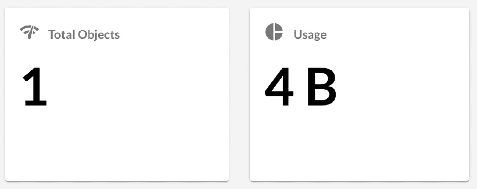
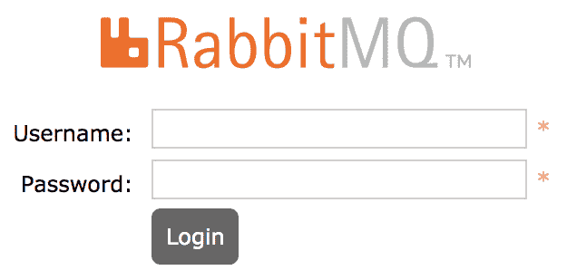

# 第十五章：Kubernetes 上的有状态工作负载

本章详细介绍了在数据库中运行有状态工作负载时行业的当前状态。我们将讨论在 Kubernetes 上运行数据库、存储和队列时使用 Kubernetes（和流行的开源项目）。案例研究教程将包括在 Kubernetes 上运行对象存储、数据库和队列系统。

在本章中，我们将首先了解有状态应用在 Kubernetes 上的运行方式，然后学习如何使用 Kubernetes 存储来支持有状态应用。然后，我们将学习如何在 Kubernetes 上运行数据库，并涵盖消息传递和队列。让我们从讨论为什么有状态应用在 Kubernetes 上比无状态应用复杂得多开始。

在本章中，我们将涵盖以下主题：

+   在 Kubernetes 上理解有状态应用

+   使用 Kubernetes 存储支持有状态应用

+   在 Kubernetes 上运行数据库

+   在 Kubernetes 上实现消息传递和队列

# 技术要求

为了运行本章中详细介绍的命令，您需要一台支持`kubectl`命令行工具以及一个正常运行的 Kubernetes 集群的计算机。请参阅*第一章*，*与 Kubernetes 通信*，了解快速启动和安装 kubectl 工具的几种方法。

本章中使用的代码可以在该书的 GitHub 存储库中找到：

[`github.com/PacktPublishing/Cloud-Native-with-Kubernetes/tree/master/Chapter15`](https://github.com/PacktPublishing/Cloud-Native-with-Kubernetes/tree/master/Chapter15)

# 在 Kubernetes 上理解有状态应用

Kubernetes 为运行无状态和有状态应用提供了出色的基元，但有状态工作负载在 Kubernetes 上的成熟度要花更长时间。然而，近年来，一些基于 Kubernetes 的高调有状态应用框架和项目已经证明了 Kubernetes 上有状态应用日益成熟。让我们首先回顾其中一些，以便为本章的其余部分做铺垫。

## 流行的 Kubernetes 原生有状态应用

有许多类型的有状态应用程序。虽然大多数应用程序都是有状态的，但只有其中某些组件存储*状态*数据。我们可以从应用程序中移除这些特定的有状态组件，并专注于我们审查的这些组件。在本书中，我们将讨论数据库、队列和对象存储，略过像我们在*第七章*中审查的持久存储组件，*Kubernetes 上的存储*。我们还将介绍一些不太通用的组件作为荣誉提及。让我们从数据库开始！

### 与 Kubernetes 兼容的数据库

除了典型的**数据库**（**DBs**）和可以使用 StatefulSets 或社区操作员部署在 Kubernetes 上的键值存储，如**Postgres**、**MySQL**和**Redis**，还有一些专为 Kubernetes 设计的重要选项：

+   **CockroachDB**：可以无缝部署在 Kubernetes 上的分布式 SQL 数据库

+   **Vitess**：一个 MySQL 分片编排器，允许 MySQL 全球可扩展性，也可以通过操作员在 Kubernetes 上安装

+   **YugabyteDB**：类似于**CockroachDB**的分布式 SQL 数据库，还支持类似 Cassandra 的查询

接下来，让我们看看 Kubernetes 上的排队和消息传递。

### Kubernetes 上的队列、流和消息传递

同样，有一些行业标准选项，如**Kafka**和**RabbitMQ**，可以使用社区 Helm 图表和操作员部署在 Kubernetes 上，另外还有一些专门开源和闭源选项：

+   **NATS**：开源消息传递和流系统

+   **KubeMQ**：Kubernetes 本地消息代理

接下来，让我们看看 Kubernetes 上的对象存储。

### Kubernetes 上的对象存储

对象存储从 Kubernetes 获取基于卷的持久存储，并添加一个对象存储层，类似于（在许多情况下与 Amazon S3 的 API 兼容）：

+   **Minio**：为高性能而构建的与 S3 兼容的对象存储。

+   **Open IO**：类似于*Minio*，具有高性能并支持 S3 和 Swift 存储。

接下来，让我们看看一些荣誉提及。

### 荣誉提及

除了前述的通用组件，还有一些更专业（但仍然分类的）有状态应用程序可以在 Kubernetes 上运行：

+   **密钥和认证管理**：**Vault**、**Keycloak**

+   **容器注册表**：**Harbor**、**Dragonfly**、**Quay**

+   **工作流管理**：带有 Kubernetes 操作员的**Apache Airflow**

既然我们已经回顾了一些有状态应用程序的类别，让我们谈谈这些状态密集型应用程序在 Kubernetes 上通常是如何实现的。

## 了解在 Kubernetes 上运行有状态应用程序的策略

虽然使用 ReplicaSet 或 Deployment 在 Kubernetes 上部署有状态应用程序并没有本质上的问题，但你会发现大多数在 Kubernetes 上的有状态应用程序使用 StatefulSets。我们在*第四章*中讨论了 StatefulSets，*扩展和部署您的应用程序*，但为什么它们对应用程序如此有用？我们将在本章中回顾并回答这个问题。

主要原因是 Pod 身份。许多分布式有状态应用程序都有自己的集群机制或共识算法。为了简化这些类型应用程序的流程，StatefulSets 提供了基于顺序系统的静态 Pod 命名，从`0`到`n`。这个特性，再加上滚动更新和创建方法，使得应用程序更容易集群化，这对于像 CockroachDB 这样的云原生数据库非常重要。

为了说明 StatefulSets 如何帮助在 Kubernetes 上运行有状态应用程序，让我们看看如何使用 StatefulSets 在 Kubernetes 上运行 MySQL。

现在，要明确一点，在 Kubernetes 上运行单个 MySQL Pod 非常简单。我们只需要找到一个 MySQL 容器镜像，并确保它具有适当的配置和`startup`命令。

然而，当我们试图扩展我们的数据库时，我们开始遇到问题。与简单的无状态应用程序不同，我们可以在不创建新状态的情况下扩展我们的部署，MySQL（像许多其他数据库一样）有自己的集群和共识方法。MySQL 集群的每个成员都知道其他成员，最重要的是，它知道集群的领导者是哪个成员。这就是像 MySQL 这样的数据库可以提供一致性保证和**原子性、一致性、隔离性、持久性**（**ACID**）合规性的方式。

因此，由于 MySQL 集群中的每个成员都需要知道其他成员（最重要的是主节点），我们需要以一种方式运行我们的 DB Pods，以便它们有一个共同的方式来找到并与 DB 集群的其他成员进行通信。

StatefulSets 提供这种功能的方式，正如我们在本节开头提到的，是通过 Pod 的序数编号。这样，运行在 Kubernetes 上需要自我集群的应用程序就知道，将使用从`0`到`n`开始的常见命名方案。此外，当特定序数的 Pod 重新启动时，例如`mysql-pod-2`，相同的 PersistentVolume 将被挂载到在该序数位置启动的新 Pod 上。这允许在 StatefulSet 中单个 Pod 重新启动时保持状态的一致性，这使得应用程序更容易形成稳定的集群。

为了看到这在实践中是如何工作的，让我们看一下 MySQL 的 StatefulSet 规范。

### 在 StatefulSets 上运行 MySQL

以下的 YAML 规范是从 Kubernetes 文档版本中调整的。它展示了我们如何在 StatefulSets 上运行 MySQL 集群。我们将分别审查 YAML 规范的每个部分，以便我们可以准确理解这些机制如何与 StatefulSet 的保证相互作用。

让我们从规范的第一部分开始：

statefulset-mysql.yaml

[PRE0]

正如你所看到的，我们将创建一个具有三个`replicas`的 MySQL 集群。

这段内容没有太多其他令人兴奋的地方，所以让我们继续讨论`initContainers`的开始。在`initContainers`和常规容器之间，将有相当多的容器在此 Pod 中运行，因此我们将分别解释每个容器。接下来是第一个`initContainer`实例：

[PRE1]

这个第一个`initContainer`，正如你所看到的，是 MySQL 容器镜像。现在，这并不意味着我们不会在 Pod 中持续运行 MySQL 容器。这是一个你会经常在复杂应用中看到的模式。有时相同的容器镜像既用作`initContainer`实例，又用作 Pod 中正常运行的容器。这是因为该容器具有正确的嵌入式脚本和工具，可以以编程方式执行常见的设置任务。

在这个例子中，MySQL 的`initContainer`创建一个文件`/mnt/conf.d/server-id.cnf`，并向文件中添加一个`server` ID，该 ID 对应于 StatefulSet 中 Pod 的`ordinal` ID。在写入`ordinal` ID 时，它添加了`100`作为偏移量，以避免 MySQL 中`server-id` ID 的保留值为`0`。

然后，根据 Pod 的`ordinal` D 是否为`0`，它将配置复制到卷中，用于主 MySQL 服务器或从 MySQL 服务器。

接下来，让我们看一下下一节中的第二个`initContainer`（为了简洁起见，我们省略了一些卷挂载信息的代码，但完整的代码可以在本书的 GitHub 存储库中找到）：

[PRE2]

正如你所看到的，这个`initContainer`根本不是 MySQL！相反，容器镜像是一个叫做 Xtra Backup 的工具。为什么我们需要这个容器呢？

考虑这样一种情况：一个全新的 Pod，带有全新的空的持久卷加入了集群。在这种情况下，数据复制过程将需要通过从 MySQL 集群中的其他成员进行复制来复制所有数据。对于大型数据库来说，这个过程可能会非常缓慢。

因此，我们有一个`initContainer`实例，它从 StatefulSet 中的另一个 MySQL Pod 中加载数据，以便 MySQL 的数据复制功能有一些数据可供使用。如果 MySQL Pod 中已经有数据，则不会加载数据。`[[ -d /var/lib/mysql/mysql ]] && exit 0`这一行是用来检查是否存在现有数据的。

一旦这两个`initContainer`实例成功完成了它们的任务，我们就有了所有 MySQL 配置，这得益于第一个`initContainer`，并且我们从 MySQL StatefulSet 的另一个成员那里得到了一组相对较新的数据。

现在，让我们继续讨论 StatefulSet 定义中的实际容器，从 MySQL 本身开始：

[PRE3]

正如你所看到的，这个 MySQL 容器设置相当基本。除了环境变量外，我们还挂载了之前创建的配置。这个 Pod 还有一些存活和就绪探针配置 - 请查看本书的 GitHub 存储库了解详情。

现在，让我们继续查看我们的最终容器，这看起来很熟悉 - 实际上是另一个 Xtra Backup 的实例！让我们看看它是如何配置的：

[PRE4]

这个容器设置有点复杂，所以让我们逐节审查一下。

我们从`initContainers`知道，Xtra Backup 会从 StatefulSet 中的另一个 Pod 中加载数据，以便为复制到 StatefulSet 中的其他成员做好准备。

在这种情况下，Xtra Backup 容器实际上启动了复制！这个容器首先会检查它所在的 Pod 是否应该是 MySQL 集群中的从属 Pod。如果是，它将从主节点开始数据复制过程。

最后，Xtra Backup 容器还将在端口`3307`上打开一个监听器，如果请求，将向 Pod 中的数据发送一个克隆。这是在其他 StatefulSet 中的 Pod 请求克隆时发送克隆数据的设置。请记住，第一个`initContainer`查看 StatefulSet 中的其他 Pod，以便获取克隆。最后，StatefulSet 中的每个 Pod 都能够请求克隆，以及运行一个可以向其他 Pod 发送数据克隆的进程。

最后，让我们来看一下`volumeClaimTemplate`。规范的这一部分还列出了先前容器的卷挂载和 Pod 的卷设置（但出于简洁起见，我们将其省略。请查看本书的 GitHub 存储库以获取其余部分）：

[PRE5]

正如您所看到的，最后一个容器或卷列表的卷设置并没有什么特别有趣的地方。然而，值得注意的是`volumeClaimTemplates`部分，因为只要 Pod 在相同的序数位置重新启动，数据就会保持不变。集群中添加的新 Pod 将以空白的 PersistentVolume 开始，这将触发初始数据克隆。

所有这些 StatefulSets 的特性，再加上 Pods 和工具的正确配置，都可以让在 Kubernetes 上轻松扩展有状态的数据库。

现在我们已经讨论了为什么有状态的 Kubernetes 应用程序可能会使用 StatefulSets，让我们继续实施一些来证明它！我们将从一个对象存储应用程序开始。

# 在 Kubernetes 上部署对象存储

对象存储与文件系统或块存储不同。它提供了一个封装文件的更高级抽象，给它一个标识符，并经常包括版本控制。然后可以通过其特定标识符访问文件。

最流行的对象存储服务可能是 AWS S3，但 Azure Blob Storage 和 Google Cloud Storage 是类似的替代方案。此外，还有几种可以在 Kubernetes 上运行的自托管对象存储技术，我们在上一节中进行了审查。

在本书中，我们将回顾在 Kubernetes 上配置和使用 Minio。Minio 是一个强调高性能的对象存储引擎，可以部署在 Kubernetes 上，除了其他编排技术，如 Docker Swarm 和 Docker Compose。

Minio 支持使用运算符和 Helm 图表进行 Kubernetes 部署。在本书中，我们将专注于运算符，但有关 Helm 图表的更多信息，请查看 Minio 文档[`docs.min.io/docs`](https://docs.min.io/docs)。让我们开始使用 Minio Operator，这将让我们审查一些很酷的社区扩展到 kubectl。

## 安装 Minio Operator

安装 Minio Operator 将与我们迄今为止所做的任何事情都大不相同。实际上，Minio 提供了一个`kubectl`插件，以便管理运算符和整个 Minio 的安装和配置。

在本书中，我们并没有多谈`kubectl`插件，但它们是 Kubernetes 生态系统中不断增长的一部分。`kubectl`插件可以提供额外的功能，以新的`kubectl`命令的形式。

为了安装`minio` kubectl 插件，我们使用 Krew，这是一个`kubectl`的插件管理器，可以通过一个命令轻松搜索和添加`kubectl`插件。

## 安装 Krew 和 Minio kubectl 插件

所以首先，让我们安装 Krew。安装过程取决于您的操作系统和环境，但对于 macOS，它看起来像以下内容（查看[Krew 文档](https://krew.sigs.k8s.io/docs)以获取更多信息）：

1.  首先，让我们使用以下终端命令安装 Krew CLI 工具：

[PRE6]

1.  现在，我们可以使用以下命令将 Krew 添加到我们的`PATH`变量中：

[PRE7]

在新的 shell 中，我们现在可以开始使用 Krew！Krew 可以使用`kubectl krew`命令访问。

1.  要安装 Minio kubectl 插件，您可以运行以下`krew`命令：

[PRE8]

现在，安装了 Minio kubectl 插件，让我们看看如何在我们的集群上设置 Minio。

## 启动 Minio Operator

首先，我们需要在我们的集群上安装 Minio Operator。这个部署将控制我们以后需要做的所有 Minio 任务：

1.  我们可以使用以下命令安装 Minio Operator：

[PRE9]

这将导致以下输出：

[PRE10]

1.  要检查 Minio Operator 是否准备就绪，让我们用以下命令检查我们的 Pods：

[PRE11]

您应该在输出中看到 Minio Operator Pod 正在运行：

[PRE12]

现在，我们在 Kubernetes 上正确运行 Minio Operator。接下来，我们可以创建一个 Minio 租户。

## 创建一个 Minio 租户

下一步是创建一个**租户**。由于 Minio 是一个多租户系统，每个租户都有自己的命名空间，用于存储桶和对象，另外还有单独的持久卷。此外，Minio Operator 以高可用设置和数据复制的方式启动 Minio 分布式模式。

在创建 Minio 租户之前，我们需要为 Minio 安装一个**容器存储接口**（**CSI**）驱动程序。CSI 是存储提供商和容器之间的标准化接口方式，Kubernetes 实现了 CSI，以允许第三方存储提供商编写自己的驱动程序，以便无缝集成到 Kubernetes 中。Minio 建议使用 Direct CSI 驱动程序来管理 Minio 的持久卷。

要安装 Direct CSI 驱动程序，我们需要使用 Kustomize 运行`kubectl apply`命令。然而，Direct CSI 驱动程序的安装需要设置一些环境变量，以便根据正确的配置创建 Direct CSI 配置，如下所示：

1.  首先，让我们根据 Minio 的建议来创建这个环境文件：

默认.env

[PRE13]

正如你所看到的，这个环境文件确定了 Direct CSI 驱动程序将挂载卷的位置。

1.  一旦我们创建了`default.env`，让我们使用以下命令将这些变量加载到内存中：

[PRE14]

1.  最后，让我们使用以下命令安装 Direct CSI 驱动程序：

[PRE15]

这应该会产生以下输出：

[PRE16]

1.  在继续创建 Minio 租户之前，让我们检查一下我们的 CSI Pods 是否已经正确启动。运行以下命令进行检查：

[PRE17]

如果 CSI Pods 已经启动，你应该会看到类似以下的输出：

[PRE18]

1.  现在我们的 CSI 驱动程序已安装，让我们创建 Minio 租户 - 但首先，让我们看一下`kubectl minio tenant create`命令生成的 YAML：

[PRE19]

如果你想直接创建 Minio 租户而不检查 YAML，可以使用以下命令：

[PRE20]

这个命令只会创建租户，而不会先显示 YAML。然而，由于我们使用的是 Direct CSI 实现，我们需要更新 YAML。因此，仅使用命令是行不通的。现在让我们来看一下生成的 YAML 文件。

出于空间原因，我们不会完整查看文件，但让我们看一下`Tenant`**自定义资源定义**（**CRD**）的一些部分，Minio Operator 将使用它来创建托管我们的 Minio 租户所需的资源。首先，让我们看一下规范的上部分，应该是这样的：

my-minio-tenant.yaml

[PRE21]

正如您所看到的，此文件指定了`Tenant` CRD 的一个实例。我们的规范的第一部分指定了两个容器，一个用于 Minio 控制台，另一个用于 Minio `server`本身。此外，`replicas`值反映了我们在`kubectl minio tenant create`命令中指定的内容。最后，它指定了 Minio`console`的秘钥的名称。

接下来，让我们看一下 Tenant CRD 的底部部分：

[PRE22]

正如您所看到的，`Tenant`资源指定了一些服务器（也由`creation`命令指定），与副本的数量相匹配。它还指定了内部 Minio 服务的名称，以及要使用的`volumeClaimTemplate`实例。

然而，这个规范对我们的目的不起作用，因为我们正在使用 Direct CSI。让我们使用一个使用 Direct CSI 的新`volumeClaimTemplate`来更新`zones`密钥，如下所示（将此文件保存为`my-updated-minio-tenant.yaml`）。这里只是该文件的`zones`部分，我们已经更新了：

my-updated-minio-tenant.yaml

[PRE23]

1.  现在让我们继续创建我们的 Minio 租户！我们可以使用以下命令来完成：

[PRE24]

这应该导致以下输出：

[PRE25]

此时，Minio Operator 将开始为我们的新 Minio 租户创建必要的资源，几分钟后，除了运算符之外，您应该看到一些 Pods 启动，类似于以下内容：

图 15.1 – Minio Pods 输出

现在我们的 Minio 租户已经完全运行起来了！接下来，让我们看一下 Minio 控制台，看看我们的租户是什么样子的。

## 访问 Minio 控制台

首先，为了获取控制台的登录信息，我们需要获取两个密钥的内容，这些密钥保存在自动生成的`<TENANT NAME>-console-secret`秘钥中。

为了获取控制台的`access`密钥和`secret`密钥（在我们的情况下将是自动生成的），让我们使用以下两个命令。在我们的情况下，我们使用我们的`my-tenant`租户来获取`access`密钥：

[PRE26]

为了获取`secret`密钥，我们使用以下命令：

[PRE27]

现在，我们的 Minio 控制台将在一个名为`<TENANT NAME>-console`的服务上可用。

让我们使用`port-forward`命令访问这个控制台。在我们的情况下，这将是如下所示：

[PRE28]

然后，我们的 Minio 控制台将在浏览器上的`https://localhost:8081`上可用。您需要接受浏览器的安全警告，因为在这个示例中，我们还没有为本地主机的控制台设置 TLS 证书。输入从前面步骤中获得的`access`密钥和`secret`密钥来登录！

现在我们已经登录到控制台，我们可以开始向我们的 Minio 租户添加内容。首先，让我们创建一个存储桶。要做到这一点，点击左侧边栏上的**存储桶**，然后点击**创建存储桶**按钮。

在弹出窗口中，输入存储桶的名称（在我们的情况下，我们将使用`my-bucket`）并提交表单。您应该在列表中看到一个新的存储桶 - 请参阅以下截图以获取示例：

图 15.2 - 存储桶

现在，我们的分布式 Minio 设置已经准备就绪，还有一个要上传的存储桶。让我们通过向我们全新的对象存储系统上传文件来结束这个示例！

我们将使用 Minio CLI 进行上传，这使得与 Minio 等兼容 S3 存储进行交互的过程变得更加容易。我们将在 Kubernetes 内部运行一个预加载了 Minio CLI 的容器镜像，而不是从我们的本地机器使用 Minio CLI，因为只有在集群内访问 Minio 时 TLS 设置才能生效。

首先，我们需要获取 Minio 的`access`密钥和`secret`，这与我们之前获取的控制台`access`密钥和`secret`不同。要获取这些密钥，运行以下控制台命令（在我们的情况下，我们的租户是`my-tenant`）。首先，获取`access`密钥：

[PRE29]

然后，获取`secret`密钥：

[PRE30]

现在，让我们启动带有 Minio CLI 的 Pod。为此，让我们使用以下 Pod 规范：

minio-mc-pod.yaml

[PRE31]

使用以下命令创建这个 Pod：

[PRE32]

然后，要`exec`进入这个`minio-mc` Pod，我们运行通常的`exec`命令：

[PRE33]

现在，让我们在 Minio CLI 中为我们新创建的 Minio 分布式集群配置访问。我们可以使用以下命令来完成这个操作（在这个配置中，`--insecure`标志是必需的）：

[PRE34]

此命令的 Pod IP 可以是我们的任一租户 Minio Pods 的 IP - 在我们的情况下，这些是`my-tenant-zone-0-0`和`my-tenant-zone-0-1`。运行此命令后，系统将提示您输入访问密钥和秘密密钥。输入它们，如果成功，您将看到一个确认消息，看起来像这样：

[PRE35]

现在，为了测试 CLI 配置是否正常工作，我们可以使用以下命令创建另一个测试存储桶：

[PRE36]

这应该会产生以下输出：

[PRE37]

作为我们设置的最后一个测试，让我们将一个文件上传到我们的 Minio 存储桶！

首先，仍然在`minio-mc` Pod 上，创建一个名为`test.txt`的文本文件。用任何您喜欢的文本填充文件。

现在，让我们使用以下命令将其上传到我们最近创建的存储桶中：

[PRE38]

您应该会看到一个带有上传进度的加载栏，最终显示整个文件大小已上传。

作为最后的检查，转到 Minio 控制台上的**仪表板**页面，查看对象是否显示出来，如下图所示：

图 15.3 – 仪表板

正如您所看到的，我们的文件已成功上传！

就这些关于 Minio 的内容 - 在配置方面还有很多事情可以做，但这超出了本书的范围。请查看[`docs.min.io/`](https://docs.min.io/)上的文档以获取更多信息。

接下来，让我们看看在 Kubernetes 上运行数据库。

# 在 Kubernetes 上运行数据库

现在我们已经看过了 Kubernetes 上的对象存储工作负载，我们可以继续进行数据库的讨论。正如我们在本章和本书其他地方讨论过的那样，许多数据库支持在 Kubernetes 上运行，具有不同程度的成熟度。

首先，有几个传统和现有的数据库引擎支持部署到 Kubernetes。通常，这些引擎将有受支持的 Helm 图表或操作员。例如，诸如 PostgreSQL 和 MySQL 之类的 SQL 数据库有受各种不同组织支持的 Helm 图表和操作员。诸如 MongoDB 之类的 NoSQL 数据库也有支持的部署到 Kubernetes 的方式。

除了这些先前存在的数据库引擎之外，诸如 Kubernetes 之类的容器编排器已经导致了一个新类别的创建 - **NewSQL**数据库。

这些数据库提供了 NoSQL 数据库的令人难以置信的可扩展性，还具有符合 SQL 标准的 API。它们可以被视为一种在 Kubernetes（和其他编排器）上轻松扩展 SQL 的方式。CockroachDB 在这里是一个受欢迎的选择，**Vitess**也是如此，它不仅仅是一个替代 NewSQL 数据库，而且还可以轻松扩展 MySQL 引擎。

在本章中，我们将专注于部署 CockroachDB，这是一个为分布式环境构建的现代 NewSQL 数据库，非常适合 Kubernetes。

## 在 Kubernetes 上运行 CockroachDB

要在我们的集群上运行 CockroachDB，我们将使用官方的 CockroachDB Helm 图表：

1.  我们需要做的第一件事是添加 CockroachDB Helm 图表存储库，使用以下命令：

[PRE39]

这应该会产生以下输出：

[PRE40]

1.  在安装图表之前，让我们创建一个自定义的`values.yaml`文件，以便调整一些 CockroachDB 的默认设置。我们的演示文件如下所示：

Cockroach-db-values.yaml

[PRE41]

正如您所看到的，我们指定了`2`GB 的 PersistentVolume 大小，`1`GB 的 Pod 内存限制和请求，以及 CockroachDB 的配置文件内容。此配置文件包括`cache`和最大`memory`的设置，它们设置为内存限制大小的 25%，为`256`MB。这个比例是 CockroachDB 的最佳实践。请记住，这些并不是所有生产就绪的设置，但它们对我们的演示来说是有效的。

1.  在这一点上，让我们继续使用以下 Helm 命令创建我们的 CockroachDB 集群：

[PRE42]

如果成功，您将看到来自 Helm 的冗长部署消息，我们将不在此重现。让我们使用以下命令检查在我们的集群上到底部署了什么：

[PRE43]

您将看到类似以下的输出：

[PRE44]

正如您所看到的，我们在一个 StatefulSet 中有三个 Pods，另外还有一个用于一些初始化任务的设置 Pod。

1.  为了检查我们的集群是否正常运行，我们可以使用 CockroachDB Helm 图表输出中方便给出的命令（它将根据您的 Helm 发布名称而变化）：

[PRE45]

如果成功，将打开一个类似以下的提示符的控制台：

[PRE46]

接下来，我们将使用 SQL 测试 CockroachDB。

## 使用 SQL 测试 CockroachDB

现在，我们可以对我们的新 CockroachDB 数据库运行 SQL 命令了！

1.  首先，让我们使用以下命令创建一个数据库：

[PRE47]

1.  接下来，让我们创建一个简单的表：

[PRE48]

1.  然后，让我们使用这个命令添加一些数据：

[PRE49]

1.  最后，让我们使用以下命令确认数据：

[PRE50]

这将给您以下输出：

[PRE51]

成功！

正如您所看到的，我们有一个完全功能的分布式 SQL 数据库。让我们继续进行最后一个我们将审查的有状态工作负载类型：消息传递。

# 在 Kubernetes 上实现消息传递和队列

对于消息传递，我们将实现 RabbitMQ，这是一个支持 Kubernetes 的开源消息队列系统。消息系统通常用于应用程序中，以解耦应用程序的各个组件，以支持规模和吞吐量，以及异步模式，如重试和服务工作器群。例如，一个服务可以将消息放入持久消息队列，然后由监听队列的工作容器接收。这允许轻松的水平扩展，并且相对于负载均衡方法，更容忍整个组件的停机。

RabbitMQ 是消息队列的众多选项之一。正如我们在本章的第一节中提到的，RabbitMQ 是消息队列的行业标准选项，不一定是专为 Kubernetes 构建的队列系统。然而，它仍然是一个很好的选择，并且非常容易部署，我们很快就会看到。

让我们从在 Kubernetes 上实现 RabbitMQ 开始！

## 在 Kubernetes 上部署 RabbitMQ

在 Kubernetes 上安装 RabbitMQ 可以通过运算符或 Helm 图轻松完成。出于本教程的目的，我们将使用 Helm 图：

1.  首先，让我们添加适当的`helm`存储库（由**Bitnami**提供）：

[PRE52]

1.  接下来，让我们创建一个自定义值文件来调整一些参数：

Values-rabbitmq.yaml

[PRE53]

正如您所看到的，在这种情况下，我们正在禁用持久性，这对于快速演示非常有用。

1.  然后，RabbitMQ 可以通过以下命令轻松安装到集群中：

[PRE54]

成功后，您将看到来自 Helm 的确认消息。RabbitMQ Helm 图还包括管理 UI，让我们使用它来验证我们的安装是否成功。

1.  首先，让我们开始将端口转发到`rabbitmq`服务：

[PRE55]

然后，我们应该能够在`http://localhost:15672`上访问 RabbitMQ 管理 UI。它将如下所示：

图 15.4 - RabbitMQ 管理控制台登录

1.  现在，我们应该能够使用值文件中指定的用户名和密码登录到仪表板。登录后，您将看到 RabbitMQ 仪表板的主视图。

重要的是，您将看到 RabbitMQ 集群中节点的列表。在我们的案例中，我们只有一个单一节点，显示如下：

图 15.5 - RabbitMQ 管理控制台节点项目

对于每个节点，您可以看到名称和一些元数据，包括内存、正常运行时间等。

1.  为了添加新队列，导航到屏幕顶部的**队列**，然后点击屏幕底部的**添加新队列**。填写表单如下，然后点击**添加队列**：

图 15.6 - RabbitMQ 管理控制台队列创建

如果成功，屏幕应该会刷新，您的新队列将添加到列表中。这意味着我们的 RabbitMQ 设置正常工作！

1.  最后，现在我们有了一个队列，我们可以向其发布消息。要做到这一点，点击**队列**页面上新创建的队列，然后点击**发布消息**。

1.  在**有效载荷**文本框中写入任何文本，然后点击**发布消息**。您应该会看到一个确认弹出窗口，告诉您您的消息已成功发布，并且屏幕应该会刷新，显示您的消息在队列中，如下图所示：

图 15.7 - RabbitMQ 管理控制台队列状态

1.  最后，为了模拟从队列中获取消息，点击页面底部附近的**获取消息**，这将展开显示一个新部分，然后点击**获取消息**按钮。您应该看到您发送的消息的输出，证明队列系统正常工作！

# 摘要

在本章中，我们学习了如何在 Kubernetes 上运行有状态的工作负载。首先，我们回顾了一些有状态工作负载的高级概述以及每种工作负载的一些示例。然后，我们继续实际在 Kubernetes 上部署这些工作负载之一 - 对象存储系统。接下来，我们使用 NewSQL 数据库 CockroachDB 做了同样的事情，向您展示了如何在 Kubernetes 上轻松部署 CockroachDB 集群。

最后，我们向您展示了如何使用 Helm 图表在 Kubernetes 上部署 RabbitMQ 消息队列。本章中使用的技能将帮助您在 Kubernetes 上部署和使用流行的有状态应用程序模式。

如果你已经读到这里，感谢你一直陪伴我们阅读完这本书的所有 15 章！我希望你已经学会了如何使用广泛的 Kubernetes 功能，现在你已经拥有了构建和部署复杂应用程序所需的所有工具。

# 问题

1.  Minio 的 API 兼容哪种云存储提供？

1.  对于分布式数据库，StatefulSet 有哪些好处？

1.  用你自己的话来说，什么让有状态的应用在 Kubernetes 上运行变得困难？

# 进一步阅读

+   Minio 快速入门文档：[`docs.min.io/docs/minio-quickstart-guide.html`](https://docs.min.io/docs/minio-quickstart-guide.html)

+   CockroachDB Kubernetes 指南：[`www.cockroachlabs.com/docs/v20.2/orchestrate-a-local-cluster-with-kubernetes`](https://www.cockroachlabs.com/docs/v20.2/orchestrate-a-local-cluster-with-kubernetes)
