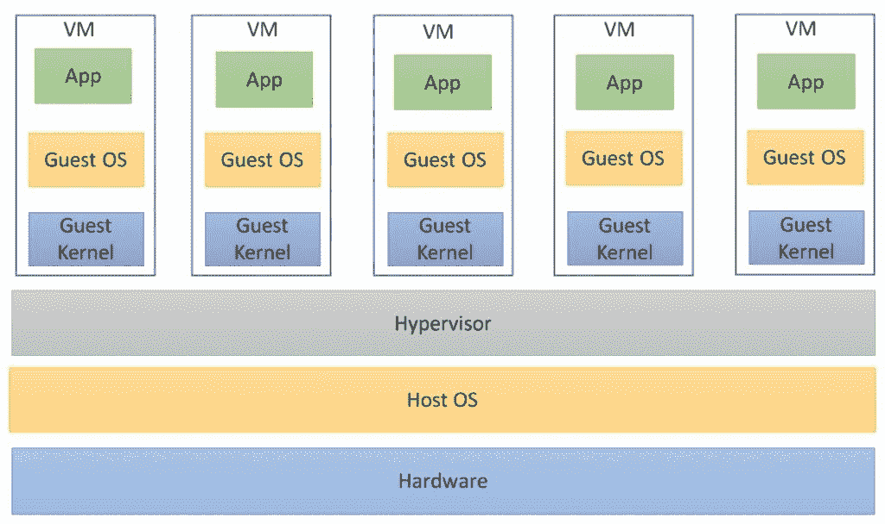
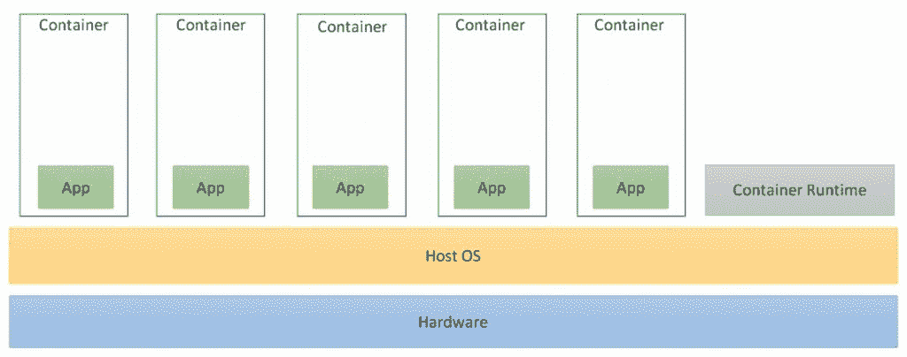

# 使用容器

本章介绍了容器和与之相关的各种主题。在本章中，我们将涵盖以下主题：

+   虚拟化的历史背景

+   容器的介绍

+   容器组件

+   容器的类型

+   容器运行时工具的类型

+   Docker 的安装

+   Docker 实践

# 虚拟化的历史背景

传统虚拟化出现在 Linux 内核中，以 Xen 和 KVM 等虚拟机监视程序的形式。这允许用户以**虚拟机**（**VM**）的形式隔离其运行时环境。虚拟机运行其自己的操作系统内核。用户尝试尽可能多地使用主机机器上的资源。然而，使用这种形式的虚拟化难以实现高密度，特别是当部署的应用程序与内核相比较小时；主机的大部分内存被运行在其上的多个内核副本所消耗。因此，在这种高密度工作负载中，使用诸如*chroot jails*之类的技术来划分机器，提供了不完善的工作负载隔离并带来了安全隐患。

2001 年，以 Linux vServer 的形式引入了操作系统虚拟化，作为一系列内核补丁。

这导致了早期形式的容器虚拟化。在这种形式的虚拟化中，内核对属于不同租户的进程进行分组和隔离，每个租户共享相同的内核。

这是一张表，解释了各种发展，使操作系统虚拟化成为可能：

| **年份和发展** | **描述** |
| --- | --- |
| 1979 年：chroot | 容器概念早在 1979 年就出现了，使用 UNIX chroot。后来，在 1982 年，这被纳入了 BSD。使用 chroot，用户可以更改任何正在运行的进程及其子进程的根目录，将其与主操作系统和目录分离。 |
| 2000 年：FreeBSD Jails | FreeBSD Jails 是由 Derrick T. Woolworth 于 2000 年在 R＆D associates 为 FreeBSD 引入的。它是类似于 chroot 的操作系统系统调用，具有用于隔离文件系统、用户、网络等的附加进程沙盒功能。 |
| 2001 年：Linux vServer | 另一种可以在计算机系统上安全分区资源（文件系统、CPU 时间、网络地址和内存）的监狱机制。 |
| 2004 年：Solaris 容器 | Solaris 容器适用于 x86 和 SPARC 系统，并于 2004 年 2 月首次公开发布。它们是系统资源控制和区域提供的边界分离的组合。 |
| 2005 年：OpenVZ | OpenVZ 类似于 Solaris 容器，并利用经过修补的 Linux 内核提供虚拟化、隔离、资源管理和检查点。 |
| 2006 年：进程容器 | 谷歌在 2006 年实施了进程容器，用于限制、记账和隔离一组进程的资源使用（CPU、内存、磁盘 I/O、网络等）。 |
| 2007 年：控制组 | 控制组，也称为 CGroups，是由谷歌实施并于 2007 年添加到 Linux 内核中的。CGroups 有助于限制、记账和隔离一组进程的资源使用（内存、CPU、磁盘、网络等）。 |
| 2008 年：LXC | LXC 代表 Linux 容器，使用 CGroups 和 Linux 命名空间实施。与其他容器技术相比，LXC 在原始 Linux 内核上运行。 |
| 2011 年：Warden | Warden 是 Cloud Foundry 在 2011 年使用 LXC 初期阶段实施的；后来，它被他们自己的实现所取代。 |
| 2013 年：LMCTFY | **LMCTFY**代表**让我来为你容纳**。它是谷歌容器堆栈的开源版本，提供 Linux 应用程序容器。 |
| 2013 年：Docker | Docker 始于 2016 年。如今它是最广泛使用的容器管理工具。 |
| 2014 年：Rocket | Rocket 是来自 CoreOS 的另一个容器运行时工具。它出现是为了解决早期版本 Docker 的安全漏洞。Rocket 是另一个可以用来替代 Docker 的选择，具有更好的安全性、可组合性、速度和生产要求。 |
| 2016 年：Windows 容器 | 微软在 2015 年为基于 Windows 的应用程序向 Microsoft Windows Server 操作系统添加了容器支持（Windows 容器）。借助这一实施，Docker 将能够在 Windows 上本地运行 Docker 容器，而无需运行虚拟机。 |

# 容器简介

Linux 容器是操作系统级别的虚拟化，可以在单个主机上提供多个隔离的环境。它们不像虚拟机那样使用专用的客户操作系统，而是共享主机操作系统内核和硬件。

在容器成为关注焦点之前，主要使用多任务处理和基于传统虚拟化程序的虚拟化。多任务处理允许多个应用程序在同一台主机上运行，但是它在不同应用程序之间提供了较少的隔离。

基于传统虚拟化程序的虚拟化允许多个客户机在主机机器上运行。每个客户机都运行自己的操作系统。这种方法提供了最高级别的隔离，以及在同一硬件上同时运行不同操作系统的能力。

然而，它也带来了一些缺点：

+   每个操作系统启动需要一段时间

+   每个内核占用自己的内存和 CPU，因此虚拟化的开销很大

+   I/O 效率较低，因为它必须通过不同的层

+   资源分配不是基于细粒度的，例如，内存在虚拟机创建时分配，一个虚拟机空闲的内存不能被其他虚拟机使用

+   保持每个内核最新的维护负担很大

以下图解释了虚拟化的概念：



容器提供了最好的两种方式。为了为容器提供隔离和安全的环境，它们使用 Linux 内核功能，如 chroot、命名空间、CGroups、AppArmor、SELinux 配置文件等。

通过 Linux 安全模块确保了容器对主机机器内核的安全访问。由于没有内核或操作系统启动，启动速度更快。资源分配是细粒度的，并由主机内核处理，允许有效的每个容器的服务质量（QoS）。下图解释了容器虚拟化。

然而，与基于传统虚拟化程序的虚拟化相比，容器也有一些缺点：客户操作系统受限于可以使用相同内核的操作系统。

传统的虚拟化程序提供了额外的隔离，这在容器中是不可用的，这意味着在容器中嘈杂的邻居问题比在传统的虚拟化程序中更为显著：



# 容器组件

Linux 容器通常由五个主要组件组成：

+   **内核命名空间**: 命名空间是 Linux 容器的主要构建模块。它们将各种类型的 Linux 资源，如网络、进程、用户和文件系统，隔离到不同的组中。这允许不同组的进程完全独立地查看它们的资源。可以分隔的其他资源包括进程 ID 空间、IPC 空间和信号量空间。

+   **控制组**: 控制组，也称为 CGroups，限制和记录不同类型的资源使用，如 CPU、内存、磁盘 I/O、网络 I/O 等，跨一组不同的进程。它们有助于防止一个容器由于另一个容器导致的资源饥饿或争用，并因此维护 QoS。

+   **安全性**: 容器中的安全性是通过以下组件提供的:

+   **根权限**: 这将有助于通过降低根用户的权限来执行特权容器中的命名空间，有时甚至可以完全取消根用户的权限。

+   **自主访问控制(DAC)**: 它基于用户应用的策略来调解对资源的访问，以便个别容器不能相互干扰，并且可以由非根用户安全地运行。

+   **强制访问控制(MAC)**: 强制访问控制(MAC)，如 AppArmor 和 SELinux，并不是创建容器所必需的，但通常是其安全性的关键要素。MAC 确保容器代码本身以及容器中运行的代码都没有比进程本身需要的更大程度的访问权限。这样，它最小化了授予恶意或被入侵进程的权限。

+   **工具集**: 在主机内核之上是用户空间的工具集，如 LXD、Docker 和其他库，它们帮助管理容器。


# 容器的类型

容器的类型如下:

# 机器容器

机器容器是共享主机操作系统内核但提供用户空间隔离的虚拟环境。它们看起来更像虚拟机。它们有自己的 init 进程，并且可以运行有限数量的守护程序。程序可以安装、配置和运行，就像在任何客户操作系统上一样。与虚拟机类似，容器内运行的任何内容只能看到分配给该容器的资源。当使用情况是运行一组相同或不同版本的发行版时，机器容器非常有用。

机器容器拥有自己的操作系统并不意味着它们正在运行自己内核的完整副本。相反，它们运行一些轻量级的守护程序，并具有一些必要的文件，以在另一个操作系统中提供一个独立的操作系统。

诸如 LXC、OpenVZ、Linux vServer、BSD Jails 和 Solaris zones 之类的容器技术都适用于创建机器容器。

以下图显示了机器容器的概念：


# 应用容器

虽然机器容器旨在运行多个进程和应用程序，但应用容器旨在打包和运行单个应用程序。它们被设计得非常小。它们不需要包含 shell 或`init`进程。应用容器所需的磁盘空间非常小。诸如 Docker 和 Rocket 之类的容器技术就是应用容器的例子。

以下图解释了应用容器：

****

# 容器运行时工具的类型

今天有多种解决方案可用于管理容器。本节讨论了替代类型的容器。

# Docker

**Docker**是全球领先的容器平台软件。它自 2013 年以来就可用。Docker 是一个容器运行时工具，旨在通过使用容器更轻松地创建、部署和运行应用程序。Docker 通过容器化大大降低了管理应用程序的复杂性。它允许应用程序使用与主机操作系统相同的 Linux 内核，而不像虚拟机那样创建具有专用硬件的全新操作系统。Docker 容器可以在 Linux 和 Windows 工作负载上运行。Docker 容器已经在软件开发中实现了巨大的效率提升，但需要 Swarm 或 Kubernetes 等运行时工具。

# Rocket

**Rocket**是来自 CoreOS 的另一个容器运行时工具。它出现是为了解决 Docker 早期版本中的安全漏洞。Rocket 是 Docker 的另一种可能性或选择，具有最解决的安全性、可组合性、速度和生产要求。Rocket 在许多方面与 Docker 构建了不同的东西。主要区别在于 Docker 运行具有根权限的中央守护程序，并将一个新的容器作为其子进程，而 Rocket 从不以根权限旋转容器。然而，Docker 始终建议在 SELinux 或 AppArmor 中运行容器。自那时起，Docker 已经提出了许多解决方案来解决这些缺陷。

# LXD

**LXD**是 Ubuntu 管理 LXC 的容器超级监视器。LXD 是一个守护程序，提供运行容器和管理相关资源的 REST API。LXD 容器提供与传统虚拟机相同的用户体验，但使用 LXC，这提供了类似于容器的运行性能和比虚拟机更好的利用率。LXD 容器运行完整的 Linux 操作系统，因此通常运行时间较长，而 Docker 应用程序容器则是短暂的。这使得 LXD 成为一种与 Docker 不同的机器管理工具，并且更接近软件分发。

# OpenVZ

**OpenVZ**是 Linux 的基于容器的虚拟化技术，允许在单个物理服务器上运行多个安全、隔离的 Linux 容器，也被称为**虚拟环境**（**VEs**）和**虚拟专用服务器**（**VPS**）。OpenVZ 可以更好地利用服务器，并确保应用程序不发生冲突。它类似于 LXC。它只能在基于 Linux 的操作系统上运行。由于所有 OpenVZ 容器与主机共享相同的内核版本，用户不允许进行任何内核修改。然而，由于共享主机内核，它也具有低内存占用的优势。

# Windows Server 容器

Windows Server 2016 将 Linux 容器引入了 Microsoft 工作负载。微软与 Docker 合作，将 Docker 容器的优势带到 Microsoft Windows Server 上。他们还重新设计了核心 Windows 操作系统，以实现容器技术。有两种类型的 Windows 容器：Windows 服务器容器和 Hyper-V 隔离。

Windows 服务器容器用于在 Microsoft 工作负载上运行应用程序容器。它们使用进程和命名空间隔离技术，以确保多个容器之间的隔离。它们还与主机操作系统共享相同的内核，因为这些容器需要与主机相同的内核版本和配置。这些容器不提供严格的安全边界，不应用于隔离不受信任的代码。

# Hyper-V 容器

Hyper-V 容器是一种 Windows 容器，相对于 Windows 服务器容器提供了更高的安全性。Hyper-V 在轻量级、高度优化的 Hyper-V 虚拟机中托管 Windows 服务器容器。因此，它们提供了更高程度的资源隔离，但以牺牲主机的效率和密度为代价。当主机操作系统的信任边界需要额外的安全性时，可以使用它们。在这种配置中，容器主机的内核不与同一主机上的其他容器共享。由于这些容器不与主机或主机上的其他容器共享内核，它们可以运行具有不同版本和配置的内核。用户可以选择在运行时使用或不使用 Hyper-V 隔离来运行容器。

# 清晰容器

虚拟机安全但非常昂贵且启动缓慢，而容器启动快速并提供了更高效的替代方案，但安全性较低。英特尔的清晰容器是基于 Hypervisor 的虚拟机和 Linux 容器之间的折衷解决方案，提供了类似于传统 Linux 容器的灵活性，同时还提供了基于硬件的工作负载隔离。

清晰容器是一个包裹在自己独立的超快、精简的虚拟机中的容器，提供安全性和效率。清晰容器模型使用了经过优化以减少内存占用和提高启动性能的快速轻量级的 QEMU hypervisor。它还在内核中优化了 systemd 和核心用户空间，以实现最小内存消耗。这些特性显著提高了资源利用效率，并相对于传统虚拟机提供了增强的安全性和速度。

英特尔清晰容器提供了一种轻量级机制，用于将客户环境与主机隔离，并为工作负载隔离提供基于硬件的执行。此外，操作系统层从主机透明、安全地共享到每个英特尔清晰容器的地址空间中，提供了高安全性和低开销的最佳组合。

由于清晰容器提供的安全性和灵活性增强，它们的采用率很高。如今，它们与 Docker 项目无缝集成，并增加了英特尔 VT 的保护。英特尔和 CoreOS 密切合作，将清晰容器整合到 CoreOS 的 Rocket（Rkt）容器运行时中。

# Docker 的安装

Docker 有两个版本，**社区版（CE）**和**企业版（EE）**：

+   **Docker 社区版（CE）**：它非常适合希望开始使用 Docker 并可能正在尝试基于容器的应用程序的开发人员和小团队。

+   **Docker 企业版（EE）**：它专为企业开发和 IT 团队设计，他们在生产环境中构建，发布和运行业务关键应用程序

本节将演示在 Ubuntu 16.04 上安装 Docker CE 的说明。在官方 Ubuntu 16.04 存储库中提供的 Docker 安装包可能不是最新版本。要获取最新版本，请从官方 Docker 存储库安装 Docker。本节将向您展示如何做到这一点：

1.  首先，将官方 Docker 存储库的 GPG 密钥添加到系统中：

```
 $ curl -fsSL https://download.docker.com/linux/ubuntu/gpg |
        sudo apt-key add 
```

1.  将 Docker 存储库添加到 APT 源：

```
 $ sudo add-apt-repository "deb [arch=amd64]
 https://download.docker.com/linux/ubuntu $(lsb_release -cs) stable" 
```

1.  接下来，使用新添加的存储库更新 Docker 软件包的软件包数据库：

```
 $ sudo apt-get update 
```

1.  确保要安装 Docker 存储库而不是默认的 Ubuntu 16.04 存储库：

```
 $ apt-cache policy docker-ce 
```

1.  您应该看到类似以下的输出：

```
 docker-ce:
          Installed: (none)
          Candidate: 17.06.0~ce-0~ubuntu
          Version table:
             17.06.0~ce-0~ubuntu 500
                500 https://download.docker.com/linux/ubuntu xenial/stable 
 amd64 Packages
             17.03.2~ce-0~ubuntu-xenial 500
                500 https://download.docker.com/linux/ubuntu xenial/stable 
 amd64 Packages
             17.03.1~ce-0~ubuntu-xenial 500
               500 https://download.docker.com/linux/ubuntu xenial/stable 
 amd64 Packages
             17.03.0~ce-0~ubuntu-xenial 500
              500 https://download.docker.com/linux/ubuntu xenial/stable 
 amd64 Packages
```

请注意，`docker-ce`未安装，但安装候选项来自 Ubuntu 16.04 的 Docker 存储库。`docker-ce`版本号可能不同。

1.  最后，安装 Docker：

```
 $ sudo apt-get install -y docker-ce 
```

1.  Docker 现在应该已安装，守护程序已启动，并且已启用进程以在启动时启动。检查它是否正在运行：

```
 $ sudo systemctl status docker
        docker.service - Docker Application Container Engine
           Loaded: loaded (/lib/systemd/system/docker.service; enabled; 
 vendor preset: enabled)
           Active: active (running) since Sun 2017-08-13 07:29:14 UTC; 45s
 ago
             Docs: https://docs.docker.com
         Main PID: 13080 (dockerd)
           CGroup: /system.slice/docker.service
                   ├─13080 /usr/bin/dockerd -H fd://
                   └─13085 docker-containerd -l 
 unix:///var/run/docker/libcontainerd/docker-containerd.sock --
 metrics-interval=0 --start
```

1.  通过运行 hello-world 镜像验证 Docker CE 是否正确安装：

```
 $ sudo docker run hello-world 
        Unable to find image 'hello-world:latest' locally 
        latest: Pulling from library/hello-world 
        b04784fba78d: Pull complete 
        Digest:
 sha256:f3b3b28a45160805bb16542c9531888519430e9e6d6ffc09d72261b0d26
 ff74f 
        Status: Downloaded newer image for hello-world:latest 

        Hello from Docker! 
 This message shows that your installation appears to be
 working correctly.
```

```
 To generate this message, Docker took the following steps:
 The Docker client contacted the Docker daemon
 The Docker daemon pulled the hello-world image from the Docker Hub
 The Docker daemon created a new container from that image, 
 which ran the executable that produced the output you are 
 currently reading 
 The Docker daemon streamed that output to the Docker client, 
 which sent it to your terminal
 To try something more ambitious, you can run an Ubuntu 
 container with the following:
 $ docker run -it ubuntu bash 
        Share images, automate workflows, and more with a free Docker ID: 
 https://cloud.docker.com/ 
 For more examples and ideas,
 visit: https://docs.docker.com/engine/userguide/.
```

# Docker 实践

本节将解释如何使用 Docker 在容器内运行任何应用程序。在上一节中解释的 Docker 安装也安装了 docker 命令行实用程序或 Docker 客户端。让我们探索`docker`命令。使用`docker`命令包括传递一系列选项和命令，后跟参数。

语法采用以下形式：

```
$ docker [option] [command] [arguments]
# To see help for individual command
$ docker help [command]  
```

要查看有关 Docker 和 Docker 版本的系统范围信息，请使用以下命令：

```
$ sudo docker info
$ sudo docker version  
```

Docker 有许多子命令来管理 Docker 守护程序管理的多个资源。以下是 Docker 支持的管理命令列表：

| **管理命令** | **描述** |
| --- | --- |
| `Config` | 管理 Docker 配置 |
| `container` | 管理容器 |
| `image` | 管理镜像 |
| `network` | 管理网络 |
| `Node` | 管理 Swarrn 节点 |
| `Plugin` | 管理插件 |
| `secret` | 管理 Docker 秘密 |
| `Service` | 管理服务 |
| `Stack` | 管理 Docker 堆栈 |
| `Swarm` | 管理群集 |
| `System` | 管理 Docker |
| `Volume` | 管理卷 |

在下一节中，我们将探索容器和镜像资源。

# 使用 Docker 镜像工作

镜像是一个轻量级的、独立的可执行包，包括运行软件所需的一切，包括代码、运行时、库、环境变量和配置文件。Docker 镜像用于创建 Docker 容器。镜像存储在 Docker Hub 中。

# 列出镜像

您可以通过运行 Docker images 子命令列出 Docker 主机中所有可用的镜像。默认的 Docker 镜像将显示所有顶级镜像，它们的存储库和标签，以及它们的大小：

```
$ sudo docker images
REPOSITORY          TAG                 IMAGE ID            CREATED             SIZE
wordpress           latest              c4260b289fc7        10 days ago         406MB
mysql               latest              c73c7527c03a        2 weeks ago         412MB
hello-world         latest              1815c82652c0        2 months ago        1.84kB 
```

# 获取新镜像

Docker 将自动下载在 Docker 主机系统中不存在的任何镜像。如果未提供标签，则`docker pull`子命令将始终下载该存储库中具有最新标签的镜像。如果提供了标签，它将拉取具有该标签的特定镜像。

要拉取基础镜像，请执行以下操作：

```
$ sudo docker pull Ubuntu 
# To pull specific version 
$ sudo docker pull ubuntu:16.04 
```

# 搜索 Docker 镜像

Docker 最重要的功能之一是许多人为各种目的创建了 Docker 镜像。其中许多已经上传到 Docker Hub。您可以通过使用 docker search 子命令在 Docker Hub 注册表中轻松搜索 Docker 镜像：

```
$ sudo docker search ubuntu
NAME                                           DESCRIPTION                                     STARS     OFFICIAL   AUTOMATED
rastasheep/ubuntu-sshd                         Dockerized SSH service, built on top of of...   97                   [OK]
ubuntu-upstart                                 Upstart is an event-based replacement for ...   76        [OK]
ubuntu-debootstrap                             debootstrap --variant=minbase --components...   30        [OK]
nuagebec/ubuntu                                Simple always updated Ubuntu docker images...   22                   [OK]
tutum/ubuntu                                   Simple Ubuntu docker images with SSH access     18  
```

# 删除镜像

要删除一个镜像，请运行以下命令：

```
$ sudo docker rmi hello-world
Untagged: hello-world:latest
Untagged: hello-world@sha256:b2ba691d8aac9e5ac3644c0788e3d3823f9e97f757f01d2ddc6eb5458df9d801
Deleted: sha256:05a3bd381fc2470695a35f230afefd7bf978b566253199c4ae5cc96fafa29b37
Deleted: sha256:3a36971a9f14df69f90891bf24dc2b9ed9c2d20959b624eab41bbf126272a023  
```

有关与 Docker 镜像相关的其余命令，请参考 Docker 文档。

# 使用 Docker 容器工作

容器是镜像的运行时实例。默认情况下，它完全与主机环境隔离，只有在配置为这样做时才能访问主机文件和端口。

# 创建容器

启动容器很简单，因为`docker run`传递了您想要运行的镜像名称以及在容器内运行此命令。如果镜像不存在于本地机器上，Docker 将尝试从公共镜像注册表中获取它：

```
$ sudo docker run --name hello_world ubuntu /bin/echo hello world  
```

在上面的例子中，容器将启动，打印 hello world，然后停止。容器被设计为在其中执行的命令退出后停止。

例如，让我们使用 Ubuntu 中的最新镜像运行一个容器。`-i`和`-t`开关的组合为您提供了对容器的交互式 shell 访问：

```
$ sudo docker run -it ubuntu
root@a5b3bce6ed1b:/# ls
bin  boot  dev  etc  home  lib  lib64  media  mnt  opt  proc  root 
run  sbin  srv  sys  tmp  usr  var  
```

# 列出容器

您可以使用以下命令列出在 Docker 主机上运行的所有容器：

```
# To list active containers
$ sudo docker ps

# To list all containers
$ sudo docker ps -a
CONTAINER ID        IMAGE               COMMAND                  CREATED             STATUS                      PORTS               NAMES
2db72a5a0b99        ubuntu              "/bin/echo hello w..." 
58 seconds ago      Exited (0) 58 seconds ago 
hello_world  
```

# 检查容器的日志

您还可以使用以下方法查看正在运行的容器记录的信息：

```
$ sudo docker logs hello_world
hello world  
```

# 启动容器

您可以使用以下方法启动已停止的容器：

```
$ sudo docker start hello_world  
```

同样，您可以使用诸如停止、暂停、取消暂停、重启、重新启动等命令来操作容器。

# 删除容器

您还可以使用以下方法删除已停止的容器：

```
$ sudo docker delete hello_world

# To delete a running container, use -force parameter
$ sudo docker delete --force [container]  
```

有关 Docker 容器的其他命令，请参考 Docker 文档。

# 摘要

在本章中，我们学习了容器及其类型。我们还了解了容器中的组件。我们看了不同的容器运行时工具。我们深入了解了 Docker，安装了它，并进行了实际操作练习。我们还学习了使用 Docker 管理容器和镜像的命令。在下一章中，我们将了解当今可用的不同 COE 工具。
