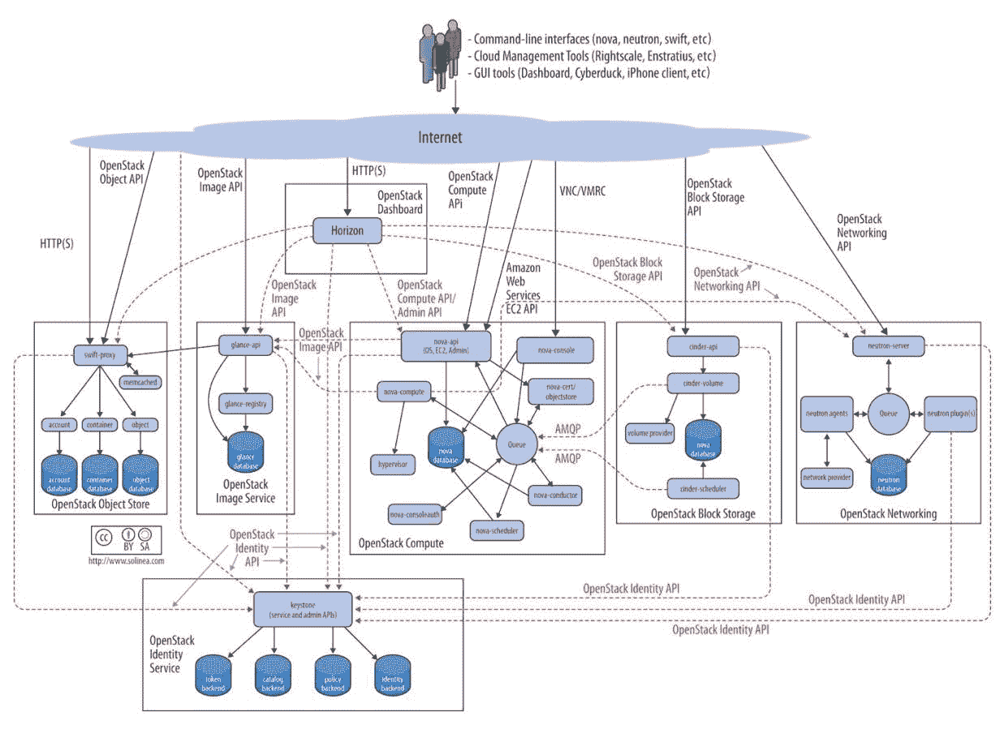
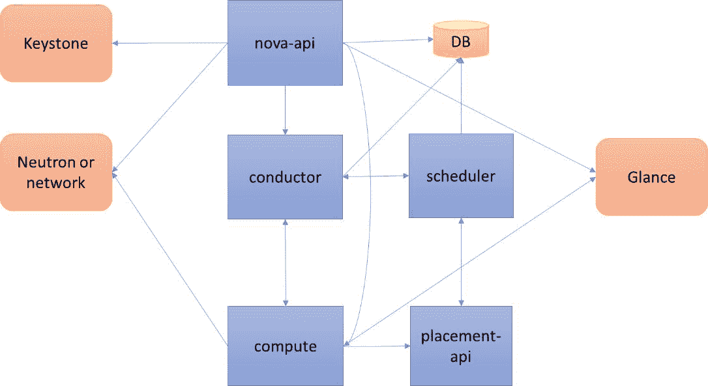
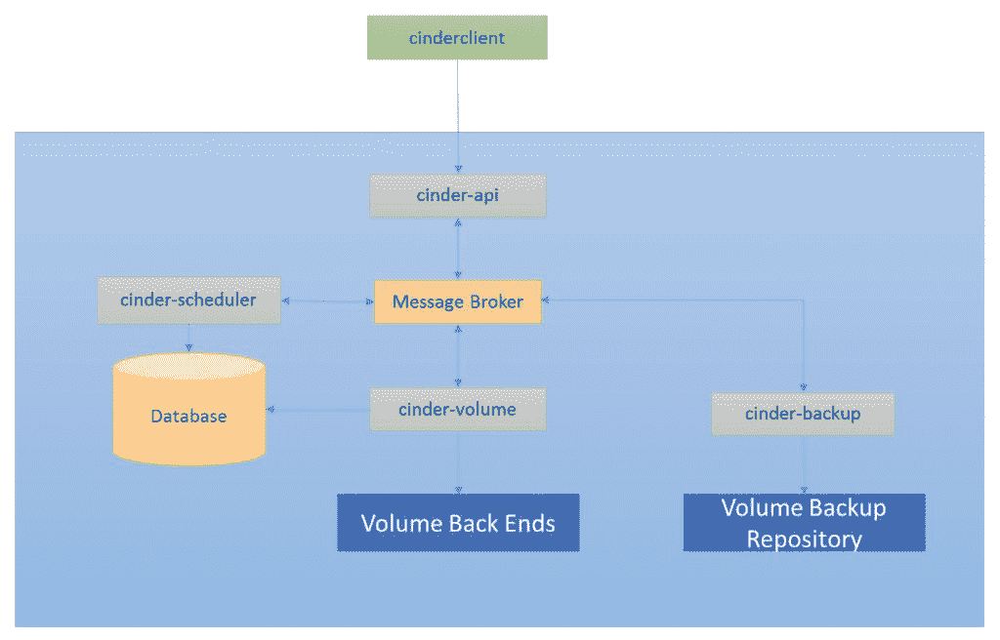
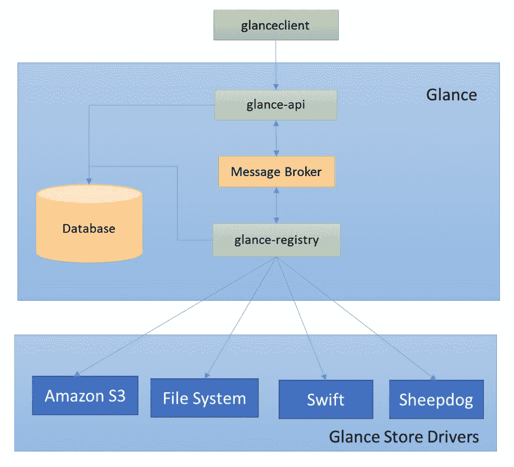
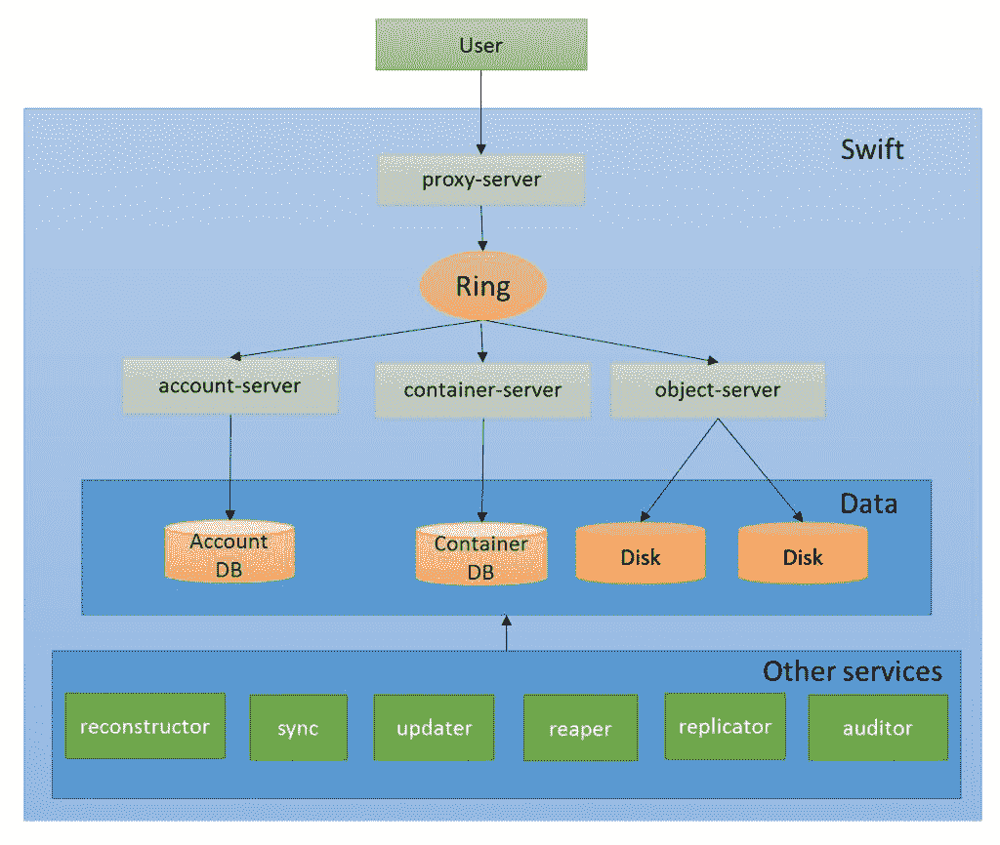

# 第三章：OpenStack 架构

本章将从介绍 OpenStack 开始。然后本章将解释 OpenStack 的架构，并进一步解释 OpenStack 中的每个核心项目。最后，本章将演示 DevStack 安装并使用它来执行一些 OpenStack 操作。本章将涵盖以下内容：

+   OpenStack 介绍

+   OpenStack 架构

+   KeyStone 介绍，OpenStack 身份服务

+   Nova 介绍，OpenStack 计算服务

+   Neutron 介绍，OpenStack 网络服务

+   Cinder 介绍，OpenStack 块存储服务

+   Glance 介绍，OpenStack 镜像服务

+   Swift 介绍，OpenStack 对象服务

+   DevStack 安装

# OpenStack 介绍

OpenStack 是一个用于创建私有和公共云的免费开源软件。它提供一系列相关的组件来管理和访问跨数据中心的大型计算、网络和存储资源池。用户可以使用基于 Web 的用户界面和命令行或 REST API 来管理它。OpenStack 于 2010 年由 Rackspace 和 NASA 开源。目前，它由非营利实体 OpenStack Foundation 管理。

# OpenStack 架构

以下图（来自：[`docs.openstack.org/arch-design/design.html`](https://docs.openstack.org/arch-design/design.html)）代表了 OpenStack 的逻辑架构以及用户如何连接到各种服务。OpenStack 有多个组件用于不同的目的，比如用于管理计算资源的 Nova，用于管理操作系统镜像的 Glance 等等。我们将在接下来的章节中详细了解每个组件。

简单来说，如果用户请求使用 CLI 或 API 来提供 VM，请求将由 Nova 处理。Nova 然后与 KeyStone 进行通信以验证请求，与 Glance 进行 OS 镜像通信，并与 Neutron 进行网络资源设置。然后，在从每个组件接收到响应后，启动 VM 并向用户返回响应：

# KeyStone 介绍，OpenStack 身份服务

KeyStone 是一个 OpenStack 身份服务，提供以下功能：

+   **身份提供者**：在 OpenStack 中，身份以用户名和密码的形式表示为用户。在简单的设置中，KeyStone 将用户的身份存储在其数据库中。但建议在生产中使用 LDAP 等第三方身份提供者。

+   **API 客户端身份验证**：身份验证是验证用户身份的过程。KeyStone 可以通过使用诸如 LDAP 和 AD 等许多第三方后端来进行身份验证。一旦经过身份验证，用户将获得一个令牌，可以用来访问其他 OpenStack 服务的 API。

+   **多租户授权**：KeyStone 通过为每个租户的每个用户添加角色来提供访问特定资源的授权。当用户访问任何 OpenStack 服务时，服务会验证用户的角色以及他/她是否可以访问资源。

+   **服务发现**：KeyStone 管理一个服务目录，其他服务可以在其中注册它们的端点。每当其他服务想要与任何特定服务进行交互时，它可以参考服务目录并获取该服务的地址。

KeyStone 包含以下组件：

+   **KeyStone API**：KeyStone API 是一个 WSGI 应用程序，用于处理所有传入请求

+   **服务**：KeyStone 由许多通过 API 端点公开的内部服务组成。这些服务以一种组合的方式被前端 API 所使用

+   **身份**：身份服务处理与用户凭据验证和与用户和组数据相关的 CRUD 操作的请求。在生产环境中，可以使用诸如 LDAP 之类的第三方实体作为身份服务后端

+   **资源**：资源服务负责管理与项目和域相关的数据

+   **分配**：分配服务负责角色和将角色分配给用户

+   **令牌**：令牌服务负责管理和验证令牌

+   **目录**：目录服务负责管理服务端点并提供发现服务

+   **策略**：策略服务负责提供基于规则的授权

以下图表示了 KeyStone 的架构：

# 介绍 Nova，OpenStack 计算服务

Nova 是 OpenStack 的计算服务，提供了一种创建和管理计算实例（也称为虚拟机）的方式。Nova 具有创建和管理以下功能：

+   虚拟机

+   裸金属服务器

+   系统容器

Nova 包含多个服务，每个服务执行不同的功能。它们通过 RPC 消息传递机制进行内部通信。

Nova 包含以下组件：

+   Nova API：Nova API 服务处理传入的 REST 请求，以创建和管理虚拟服务器。API 服务主要处理数据库读写，并通过 RPC 与其他服务通信，生成对 REST 请求的响应。

+   放置 API：Nova 放置 API 服务在 14.0.0 牛顿版本中引入。该服务跟踪每个提供程序的资源提供程序库存和使用情况。资源提供程序可以是共享存储池、计算节点等。

+   调度程序：调度程序服务决定哪个计算主机获得实例。

+   计算：计算服务负责与 hypervisors 和虚拟机通信。它在每个计算节点上运行。

+   主管：主管服务充当数据库代理，处理对象转换并协助请求协调。

+   数据库：数据库是用于数据存储的 SQL 数据库。

+   消息队列：此路由的信息在不同的 Nova 服务之间移动。

+   网络：网络服务管理 IP 转发、桥接、VLAN 等。

以下图表示了 Nova 的架构：

# 介绍 Neutron，OpenStack 网络服务

Neutron 是 OpenStack 的网络服务，为 OpenStack 云提供各种网络选项。它的旧名称是 Quantum，后来更名为 Neutron。Neutron 使用各种插件提供不同的网络配置。

Neutron 包含以下组件：

+   Neutron 服务器（`neutron-server`和`neutron-*-plugin`）：Neutron 服务器处理传入的 REST API 请求。它使用插件与数据库通信

+   插件代理（`neutron-*-agent`）：插件代理在每个计算节点上运行，以管理本地虚拟交换机（vswitch）配置

+   DHCP 代理（`neutron-dhcp-agent`）：DHCP 代理为租户网络提供 DHCP 服务。此代理负责维护所有 DHCP 配置

+   L3 代理（`neutron-l3-agent`）：L3 代理为租户网络上 VM 的外部网络访问提供 L3/NAT 转发

+   网络提供商服务（SDN 服务器/服务）：此服务为租户网络提供额外的网络服务

+   消息队列：在 Neutron 进程之间路由信息

+   数据库：数据库是用于数据存储的 SQL 数据库

以下图表示了 Neutron 的架构：

# Cinder 是 OpenStack 的块存储服务

Cinder 是 OpenStack 的块存储服务，为 Nova 中的虚拟机提供持久的块存储资源。Cinder 使用 LVM 或其他插件驱动程序来提供存储。用户可以使用 Cinder 来创建、删除和附加卷。此外，还可以使用更高级的功能，如克隆、扩展卷、快照和写入图像，作为虚拟机和裸金属的可引导持久实例。Cinder 也可以独立于其他 OpenStack 服务使用。

块存储服务由以下组件组成，并为管理卷提供高可用性、容错性和可恢复性的解决方案：

+   **cinder-api**：一个 WSGI 应用程序，用于验证和路由请求到 cinder-volume 服务

+   **cinder-scheduler**：调度对最佳存储提供程序节点的请求，以创建卷

+   **cinder-volume**：与各种存储提供程序进行交互，并处理读写请求以维护状态。它还与 cinder-scheduler 进行交互。

+   **cinder-backup**：将卷备份到 OpenStack 对象存储（Swift）。它还与各种存储提供程序进行交互

消息队列在块存储过程之间路由信息。以下图是 Cinder 的架构图：

# Glance 是 OpenStack 的图像服务

Glance 是 OpenStack 的图像服务项目，为磁盘和服务器图像的发现、注册和检索提供能力。用户可以上传和发现数据图像和元数据定义，这些定义旨在与其他服务一起使用。简而言之，Glance 是用于管理虚拟机、容器和裸金属图像的中央存储库。Glance 具有 RESTful API，允许查询图像元数据以及检索实际图像。

OpenStack 镜像服务 Glance 包括以下组件：

+   **glance-api**：一个 WSGI 应用程序，用于接受图像 API 调用以进行图像发现、检索和存储。它使用 Keystone 进行身份验证，并将请求转发到 glance-registry。

+   **glance-registry**：一个私有的内部服务，用于存储、处理和检索有关图像的元数据。元数据包括大小和类型等项目。

+   **数据库**：它存储图像元数据。您可以根据自己的喜好选择 MySQL 或 SQLite。

+   **图像文件的存储库**：支持各种存储库类型来存储图像。

+   **元数据定义服务**: 为供应商、管理员、服务和用户提供一个通用 API，以有意义地定义自己的自定义元数据。这些元数据可以用于不同类型的资源，如图像、工件、卷、口味和聚合。定义包括新属性的键、描述、约束以及它可以关联的资源类型。

以下图是 Glance 的架构图。Glance 还具有客户端-服务器架构，为用户提供 REST API，通过该 API 可以对服务器执行请求：

# Swift 介绍，OpenStack 对象存储

Swift 是 OpenStack 的对象存储服务，可用于在能够存储 PB 级数据的服务器集群上存储冗余、可扩展的数据。它提供了一个完全分布式的、可通过 API 访问的存储平台，可以直接集成到应用程序中，也可用于备份、归档和数据保留。Swift 使用分布式架构，没有中央控制点，这使得它具有高可用性、分布式性和最终一致的对象存储解决方案。它非常适合存储可以无限增长并且可以检索和更新的非结构化数据。

数据被写入多个节点，扩展到不同区域，以确保数据在集群中的复制和完整性。集群可以通过添加新节点进行水平扩展。在节点故障的情况下，数据会被复制到其他活动节点。

Swift 以层次结构组织数据。它记录容器的存储列表，容器用于存储对象列表，对象用于存储带有元数据的实际数据。

Swift 具有以下主要组件，以实现高可用性、高耐久性和高并发性。Swift 还有许多其他服务，如更新程序、审计程序和复制程序，用于处理日常任务，以提供一致的对象存储解决方案：

+   **代理服务器**: 公共 API 通过代理服务器公开。它处理所有传入的 API 请求，并将请求路由到适当的服务。

+   **环**: 环将数据的逻辑名称映射到特定磁盘上的位置。Swift 中针对不同资源有不同的环。

+   **区域**: 区域将数据与其他区域隔离开来。如果一个区域发生故障，集群不会受到影响，因为数据在区域之间复制。

+   **账户**：账户是存储账户中容器列表的数据库。它分布在集群中。

+   **容器**：容器是存储容器中对象列表的数据库。它分布在集群中。

+   **对象**：数据本身。

+   **分区**：它存储对象、账户数据库和容器数据库，并帮助管理数据在集群中的位置。

以下图显示了 Swift 的架构图：

# DevStack 安装

DevStack 是一组可扩展的脚本，用于快速搭建完整的开发 OpenStack 环境。DevStack 仅用于开发和测试目的。请注意，它不应该在生产环境中使用。DevStack 默认安装所有核心组件，包括 Nova、Neutron、Cinder、Glance、Keystone 和 Horizon。

Devstack 可以在 Ubuntu 16.04/17.04、Fedora 24/25 和 CentOS/RHEL 7 以及 Debian 和 OpenSUSE 上运行。

在本节中，我们将在 Ubuntu 16.04 上设置一个基本的 OpenStack 环境，并尝试一些命令来测试 OpenStack 中的各个组件。

1.  使用以下方法添加一个 stack 用户。您应该以启用了`sudo`的非 root 用户身份运行 DevStack：

[PRE0]

1.  现在为用户添加`sudo`权限。

[PRE1]

1.  下载 DevStack。DevStack 默认安装来自 Git 的项目的主版本。您也可以指定使用稳定的分支：

[PRE2]

1.  创建`local.conf`文件。这是 DevStack 用于安装的`config`文件。以下是 DevStack 启动所需的最小配置（请参考[`docs.openstack.org/devstack/latest/`](https://docs.openstack.org/devstack/latest/)获取更多配置信息）：

[PRE3]

1.  开始安装。这可能需要大约 15 到 20 分钟，具体取决于您的互联网连接和主机容量：

[PRE4]

您将看到类似以下的输出：

[PRE5]

您可以访问 Horizon 来体验 OpenStack 的 Web 界面，或者您可以在 shell 中使用`openrc`，然后使用 OpenStack 命令行工具来管理虚拟机、网络、卷和镜像。以下是您的操作步骤：

[PRE6]

# 创建 KeyStone 用户

现在让我们创建一个用户，然后为其分配管理员角色。这些操作将由 KeyStone 处理：

[PRE7]

# 为用户分配角色

我们将为我们的用户`my-new-user`分配一个管理员角色：

[PRE8]

# 使用 Nova 创建虚拟机

让我们使用 Nova 创建一个虚拟机。我们将使用 Glance 中的 cirros 镜像和 Neutron 中的网络。

Glance 中可用的图像列表是由 DevStack 创建的：

[PRE9]

还要检查由 DevStack 安装创建的 Neutron 中的网络列表：

[PRE10]

Nova 提供了一个指定 VM 资源的 flavor。以下是由 DevStack 在 Nova 中创建的 flavor 列表：

[PRE11]

我们将创建一个密钥对，用于 SSH 到在 Nova 中创建的 VM：

[PRE12]

让我们使用之前列出的所有资源创建一个 VM：

[PRE13]

检查服务器列表，以验证 VM 是否成功启动：

[PRE14]

# 将卷附加到 VM

现在我们的 VM 正在运行，让我们尝试做一些更有雄心的事情。我们现在将在 Cinder 中创建一个卷，并将其附加到我们正在运行的 VM 上：

[PRE15]

让我们检查 Cinder 中的卷列表。我们将看到我们的卷已创建并处于可用状态：

[PRE16]

让我们将这个卷附加到我们的 VM 上：

[PRE17]

验证卷是否已附加：

[PRE18]

您可以在这里看到卷已附加到我们的`test-vm`虚拟机上。

# 将图像上传到 Swift

我们将尝试将图像上传到 Swift。首先，检查帐户详细信息：

[PRE19]

我们将创建一个图像容器来存储所有我们的图像。同样，我们可以在一个帐户中创建多个容器，使用任何逻辑名称来存储不同类型的数据：

[PRE20]

现在我们有了一个容器，让我们将一个图像上传到容器中：

[PRE21]

您可以看到图像已成功上传到 Swift 对象存储。

在 OpenStack 中还有许多其他可用的功能，您可以在每个项目的用户指南中阅读到。

# 摘要

在本章中，我们为您提供了 OpenStack 的基本介绍以及 OpenStack 中可用的组件。我们讨论了各个项目的组件和架构。然后，我们完成了一个 DevStack 安装，为运行 OpenStack 设置了一个开发环境。然后，我们进行了一些关于使用 Nova 进行 VM 的实际配置。这包括添加一个 KeyStone 用户，为他们分配角色，并在 VM 配置完成后将卷附加到 VM。此外，我们还看了如何使用 Swift 上传和下载文件。在下一章中，我们将看看 OpenStack 中容器化的状态。
