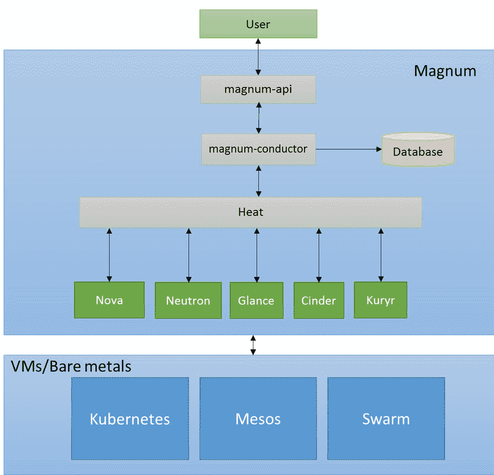

# 第五章：Magnum - OpenStack 中的 COE 管理

本章将解释用于管理**容器编排引擎**（**COE**）的 OpenStack 项目 Magnum。Magnum 是用于管理基础架构并在 OpenStack 顶部运行容器的 OpenStack 项目，由不同的技术支持。在本章中，我们将涵盖以下主题：

+   Magnum 介绍

+   概念

+   主要特点

+   组件

+   演练

+   Magnum DevStack 安装

+   管理 COE

# Magnum 介绍

Magnum 是一个 OpenStack 服务，由 OpenStack 容器团队于 2014 年创建，旨在实现**容器编排引擎**（**COE**），提供在 OpenStack 中将容器部署和管理为一流资源的能力。

目前，Magnum 支持 Kubernetes、Apache Mesos 和 Docker Swarm COE。Magnum 使用 Heat 在 OpenStack 提供的 VM 或裸金属上进行这些 COE 的编排。它使用包含运行容器所需工具的 OS 映像。Magnum 提供了与 KeyStone 兼容的 API 和一个完整的多租户解决方案，用于在 OpenStack 集群顶部管理您的 COE。

Magnum 集群是由不同的 OpenStack 服务提供的各种资源集合。它由 Nova 提供的一组 VM、Neutron 创建的连接这些 VM 的网络、Cinder 创建的连接 VM 的卷等组成。Magnum 集群还可以具有一些外部资源，具体取决于创建集群时提供的选项。例如，我们可以通过在集群模板中指定`-master-lb-enabled`选项来为我们的集群创建外部负载均衡器。

Magnum 的一些显着特点是：

+   为 COE 的完整生命周期管理提供标准 API

+   支持多个 COE，如 Kubernetes、Swarm、Mesos 和 DC/OS

+   支持扩展或缩小集群的能力

+   支持容器集群的多租户

+   不同的容器集群部署模型选择：VM 或裸金属

+   提供基于 KeyStone 的多租户安全和认证管理

+   基于 Neutron 的多租户网络控制和隔离

+   支持 Cinder 为容器提供卷

+   与 OpenStack 集成

+   启用安全容器集群访问（**传输层安全**（**TLS**））

+   集群还可以使用外部基础设施，如 DNS、公共网络、公共发现服务、Docker 注册表、负载均衡器等

+   Barbican 提供了用于集群内部的 TLS 证书等秘密的存储

+   基于 Kuryr 的容器级隔离网络

# 概念

Magnum 有几种不同类型的对象构成了 Magnum 系统。在本节中，我们将详细了解每一个对象，以及它们在 Magnum 中的用途。两个重要的对象是集群和集群模板。以下是 Magnum 对象的列表：

# 集群模板

这以前被称为**Baymodel**。集群模板相当于一个 Nova flavor。一个对象存储关于集群的模板信息，比如密钥对、镜像等，这些信息用于一致地创建新的集群。一些参数与集群的基础设施相关，而另一些参数则是针对特定的 COE。不同的 COE 可以存在多个集群模板。

如果一个集群模板被任何集群使用，那么它就不能被更新或删除。

# 集群

这以前被称为**Bay**。它是一个节点对象的集合，用于调度工作。这个节点可以是虚拟机或裸金属。Magnum 根据特定的集群模板中定义的属性以及集群的一些额外参数来部署集群。Magnum 部署由集群驱动程序提供的编排模板，以创建和配置 COE 运行所需的所有基础设施。创建集群后，用户可以使用每个 COE 的本机 CLI 在 OpenStack 上运行他们的应用程序。

# 集群驱动程序

集群驱动程序包含了设置集群所需的所有必要文件。它包含了一个热模板，定义了为任何集群创建的资源，安装和配置集群上的服务的脚本，驱动程序的版本信息，以及模板定义。

# 热堆栈模板

**Heat Stack Template**（**HOT**）是一个定义将形成 COE 集群的资源的模板。每种 COE 类型都有一个不同的模板，取决于其安装步骤。这个模板被 Magnum 传递给 Heat，以建立一个完整的 COE 集群。

# 模板定义

模板定义表示 Magnum 属性和 Heat 模板属性之间的映射。它还有一些被 Magnum 使用的输出。它指示了给定集群将使用哪种集群类型。

# 证书

证书是 Magnum 中代表集群 CA 证书的对象。Magnum 在创建集群时生成服务器和客户端证书，以提供 Magnum 服务和 COE 服务之间的安全通信。CA 证书和密钥存储在 Magnum 中，供用户安全访问集群。用户需要生成客户端证书、客户端密钥和证书签名请求（CSR），然后发送请求给 Magnum 进行签名，并下载签名证书以访问集群。

# 服务

服务是一个存储有关`magnum-conductor`二进制信息的对象。该对象包含有关服务运行的主机、服务是否已禁用、最后一次的详细信息等信息。管理员可以使用这些信息来查看`magnum-conductor`服务的状态。

# 统计

Magnum 还管理每个项目使用情况的统计信息。这些信息对于管理目的很有帮助。统计对象包含有关管理员或用户对租户的当前使用情况的一些指标，甚至对所有活动租户的信息。它们提供信息，例如集群总数、节点总数等。

# 配额

配额是一个存储任何给定项目资源配额的对象。对资源施加配额限制了可以消耗的资源数量，这有助于在创建时保证资源的公平分配。如果特定项目需要更多资源，配额的概念提供了根据需求增加资源计数的能力，前提是不超出系统约束。配额与物理资源密切相关，并且是可计费的实体。

# 关键特性

在前一节中，我们了解到 Magnum 除了管理 COE 基础设施外，还提供了各种功能。在接下来的章节中，我们将讨论 Magnum 中的一些高级功能。

# Kubernetes 的外部负载均衡器

Magnum 默认使用 Flannel 为 Kubernetes 中的资源提供网络。Pod 和服务可以使用这个私有容器网络相互访问和访问外部互联网。然而，这些资源无法从外部网络访问。为了允许外部网络访问，Magnum 提供了为 Kubernetes 集群设置外部负载均衡器的支持。

请参阅[`docs.openstack.org/magnum/latest/user/#steps-for-the-cluster-administrator`](https://docs.openstack.org/magnum/latest/user/#steps-for-the-cluster-administrator)以使用 Magnum 设置 Kubernetes 负载均衡器。

# 传输层安全性

Magnum 允许我们使用 TLS 在集群服务和外部世界之间建立安全通信。Magnum 中的 TLS 通信在三个层面上使用：

+   Magnum 服务与集群 API 端点之间的通信。

+   集群工作节点与主节点之间的通信。

+   终端用户与集群之间的通信。终端用户使用本机客户端库与集群交互，并使用证书在安全网络上进行通信。这适用于 CLI 和使用特定集群客户端的程序。每个客户端都需要有效的证书来进行身份验证并与集群通信。

前两种情况由 Magnum 在内部实现，并创建、存储和配置服务以使用证书进行通信，不向用户公开。最后一种情况涉及用户创建证书、签名并使用它来访问集群。

Magnum 使用 Barbican 存储证书。这提供了另一层证书存储的安全性。Magnum 还支持其他存储证书的方式，例如将它们存储在主节点的本地文件系统中或在 Magnum 数据库中存储。

有关如何配置客户端以访问安全集群的更多详细信息，请参阅[`docs.openstack.org/magnum/latest/user/#interfacing-with-a-secure-cluster`](https://docs.openstack.org/magnum/latest/user/#interfacing-with-a-secure-cluster)。

# 扩展

扩展是 Magnum 的另一个强大功能。Magnum 支持集群的扩展，而容器的扩展不在 Magnum 的范围内。扩展集群可以帮助用户向集群添加或删除节点。在扩展时，Magnum 创建一个虚拟机或裸金属，部署 COE 服务，然后将其注册到集群。在缩减规模时，Magnum 尝试删除工作负载最小的节点。

请参阅*管理 COEs*部分，了解如何扩展集群。

# 存储

Magnum 支持 Cinder 为容器提供块存储，可以是持久的或临时的存储。

# 临时存储

容器文件系统的所有更改都可以存储在本地文件系统或 Cinder 卷中。这是在容器退出后被删除的临时存储。Magnum 提供额外的 Cinder 卷用作容器的临时存储。用户可以在集群模板中使用`docker-volume-size`属性指定卷的大小。此外，用户还可以选择不同的卷类型，例如设备映射器，并使用`docker_volume_type`属性覆盖此选项。

# 持久存储

当容器退出时，可能需要持久保存容器的数据。可以为此目的挂载 Cinder 卷。当容器退出时，卷将被卸载，从而保留数据。

有许多第三方卷驱动程序支持 Cinder 作为后端，例如 Rexray 和 Flocker。Magnum 目前支持 Rexray 作为 Swarm 的卷驱动程序，以及 Mesos 和 Cinder 作为 Kubernetes 的卷驱动程序。

# 通知

Magnum 生成有关使用数据的通知。这些数据对于第三方应用程序用于计费、配额管理、监控等目的非常有用。为了提供通知的标准格式，Magnum 使用**Cloud Auditing Data Federation**（**CADF**）格式。

# 容器监控

Magnum 还支持对容器进行监控。它收集诸如容器 CPU 负载、可用 Inodes 数量、累积接收字节数、内存、节点的 CPU 统计等指标。提供的监控堆栈依赖于 COE 环境中存在的一组容器和服务：

+   cAdvisor

+   节点导出器

+   Prometheus

+   Grafana

用户可以通过在 Magnum 集群模板的定义中指定给定的两个可配置标签来设置此监控堆栈，即`prometheus_monitoring`设置为 True 时，监控将被启用，以及`grafana_admin_password`，这是管理员密码。

# 组件

*Magnum Conductor*部分的图表显示了 Magnum 的架构，其中有两个名为`magnum-api`和`magnum-conductor`的二进制文件构成了 Magnum 系统。Magnum 与 Heat 进行交互进行编排。这意味着 Heat 是与其他项目（如 Nova、Neutron 和 Cinder）交流以为 COE 设置基础设施的 OpenStack 组件，然后在其上安装 COE。我们现在将了解服务的详细功能。

# Magnum API

Magnum API 是一个 WSGI 服务器，用于为用户发送给 Magnum 的 API 请求提供服务。Magnum API 有许多控制器来处理每个资源的请求：

+   Baymodel

+   Bay

+   证书

+   集群

+   集群模板

+   Magnum 服务

+   配额

+   统计

Baymodel 和 Bay 将分别由集群和集群模板替换。每个控制器处理特定资源的请求。它们验证权限请求，验证 OpenStack 资源（例如验证集群模板中传递的镜像是否存在于 Glance 中），为资源创建带有输入数据的数据库对象，并通过 AMQP 服务器将请求传递给`magnum-conductor`。对`magnum-conductor`的调用可以是同步的或异步的，具体取决于每个操作所花费的处理时间。

例如，列表调用可以是同步的，因为它们不耗时，而创建请求可以是异步的。收到来自 conductor 服务的响应后，`magnum-api`服务将响应返回给用户。

# Magnum conductor

Magnum conductor 是为 Magnum 提供协调和数据库查询支持的 RPC 服务器。它是无状态的和水平可扩展的，这意味着可以同时运行多个 conductor 服务实例。`magnum-conductor`服务选择集群驱动程序，然后将模板文件发送到 Heat 服务进行安装，并最终更新数据库以获取对象详细信息。

这是 Magnum 的架构图，显示了 Magnum 中的不同组件，它们与其他 OpenStack 项目的通信，以及为运行任何 COE 而提供的基础设施：

# 演练

在本节中，我们将为您介绍 Magnum 创建 COE 集群的过程。本节涉及 OpenStack 中各个项目的请求流程和组件交互。在 Magnum 中，为集群提供基础设施涉及 OpenStack 内部多个组件之间的交互。

在 Magnum 中为集群提供基础设施的请求流程如下：

1.  用户通过 CLI 或 Horizon 向`magnum-api`发送 REST API 调用以创建集群，并使用从 KeyStone 接收的身份验证令牌。

1.  `magnum-api`接收请求，并将请求发送到 KeyStone 进行令牌验证和访问权限验证。

1.  KeyStone 验证令牌，并发送带有角色和权限的更新身份验证标头。

1.  `magnum-api`然后验证请求的配额。如果配额超过硬限制，将引发异常，指出*资源限制已超出*，并且请求将以`403` HTTP 状态退出。

1.  然后对集群模板中指定的所有 OpenStack 资源进行验证。例如，`magnum-api`会与`nova-api`进行通信，以检查指定的密钥对是否存在。如果验证失败，请求将以`400` HTTP 状态退出。

1.  如果请求中未指定名称，`magnum-api`会为集群生成一个名称。

1.  `magnum-api`然后为集群创建数据库对象。

1.  `magnum-api`向 magnum-conductor 发送 RPC 异步调用请求，以进一步处理请求。

1.  `magnum-conductor`从消息队列中提取请求。

1.  `magnum-conductor`将集群的状态设置为`CREATE_IN_PROGRESS`并将条目存储在数据库中。

1.  `magnum-conductor`为集群创建受托人、信任和证书，并将它们设置为以后使用的集群。

1.  根据集群分布、COE 类型和集群模板中提供的服务器类型，`magnum-conductor`为集群选择驱动程序。

1.  然后，`magnum-conductor`从集群驱动程序中提取模板文件、模板、环境文件和热参数，然后将请求发送到 Heat 以创建堆栈。

1.  然后，Heat 会与多个 OpenStack 服务进行通信，如 Nova、Neutron 和 Cinder，以设置集群并在其上安装 COE。

1.  在 Heat 中创建堆栈后，在 Magnum 数据库中将堆栈 ID 和集群状态设置为`CREATE_COMPLETE`。

Magnum 中有定期任务，会在特定时间间隔内同步 Magnum 数据库中的集群状态。

# Magnum DevStack 安装

为了开发目的安装 Magnum 与 DevStack，请按照以下步骤进行：

1.  如有需要，为 DevStack 创建一个根目录：

[PRE0]

1.  我们将使用最小的`local.conf`设置来运行 DevStack，以启用 Magnum、Heat 和 Neutron：

[PRE1]

请注意，我们必须在这里使用 Barbican 来存储 Magnum 生成的 TLS 证书。有关详细信息，请参阅*关键特性*部分下的*传输层安全*部分。

还要确保在`local.conf`中使用适当的接口进行设置。

1.  现在，运行 DevStack：

[PRE2]

1.  您将拥有一个正在运行的 Magnum 设置。要验证安装，请检查正在运行的 Magnum 服务列表：

[PRE3]

# 管理 COE

Magnum 为 OpenStack 集群的生命周期提供无缝管理。当前操作是基本的 CRUD 操作，还有一些高级功能，如集群的扩展、设置外部负载均衡器、使用 TLS 设置安全集群等。在本节中，我们将创建一个 Swarm 集群模板，使用该模板创建一个 Swarm 集群，然后在集群上运行一些工作负载以验证我们的集群状态。

首先，我们将准备我们的会话，以便能够使用各种 OpenStack 客户端，包括 Magnum、Neutron 和 Glance。创建一个新的 shell 并源自 DevStack 的`openrc`脚本：

[PRE4]

创建一个用于集群模板的密钥对。这个密钥对将用于 ssh 到集群节点：

[PRE5]

DevStack 在 Glance 中为 Magnum 的使用创建了一个 Fedora Atomic 微型 OS 镜像。用户还可以在 Glance 中创建其他镜像以供其集群使用。验证在 Glance 中创建的镜像：

[PRE6]

现在，创建一个具有 swarm COE 类型的 Magnum 集群模板。这与 Nova flavor 类似，告诉 Magnum 如何构建集群。集群模板指定了集群中要使用的所有资源，例如 Fedora Atomic 镜像、Nova 密钥对、网络等等：

[PRE7]

使用以下命令验证集群模板的创建：

[PRE8]

使用前面的模板创建一个集群。这个集群将导致创建一组安装了 Docker Swarm 的 VM：

[PRE9]

集群将初始状态设置为`CREATE_IN_PROGRESS`。当 Magnum 完成创建集群时，将把状态更新为`CREATE_COMPLETE`。

Heat 可以用来查看堆栈或特定集群状态的详细信息。

要检查所有集群堆栈的列表，请使用以下命令：

[PRE10]

要查看集群的详细信息，请执行以下操作：

[PRE11]

现在我们需要设置 Docker CLI 以使用我们使用适当凭据创建的 swarm 集群。

创建一个`dir`来存储`certs`和`cd`。`DOCKER_CERT_PATH`环境变量被 Docker 使用，它期望这个目录中有`ca.pem`、`key.pem`和`cert.pem`：

[PRE12]

生成 RSA 密钥：

[PRE13]

创建`openssl`配置以帮助生成 CSR：

[PRE14]

运行`openssl req`命令生成 CSR：

[PRE15]

现在您已经有了客户端 CSR，请使用 Magnum CLI 对其进行签名，并下载签名证书：

[PRE16]

设置 CLI 以使用 TLS。这个`env var`被 Docker 使用：

[PRE17]

设置要使用的正确主机，即 Swarm API 服务器端点的公共 IP 地址。

这个`env var`被 Docker 使用：

[PRE18]

接下来，我们将在这个 Swarm 集群中创建一个容器。这个容器将四次 ping 地址`8.8.8.8`：

[PRE19]

你应该看到类似以下的输出：

[PRE20]

创建集群后，您可以通过更新`node_count`属性动态地向集群中添加或删除节点。例如，要添加一个节点，执行以下操作：

[PRE21]

当更新过程继续进行时，集群的状态将为`UPDATE_IN_PROGRESS`。更新完成后，状态将更新为`UPDATE_COMPLETE`。减少`node_count`会删除已删除节点上的所有现有 pod/容器。Magnum 尝试删除工作负载最小的节点。

# 摘要

在本章中，我们详细了解了 OpenStack 容器基础设施管理服务 Magnum。我们研究了 Magnum 中的不同对象。然后，我们了解了 Magnum 的组件和架构。接着，我们提供了 Magnum 中用户请求工作流程的详细概述。

最后，我们看了如何使用 DevStack 安装 Magnum 的开发设置，然后使用 Magnum CLI 进行了实际操作，创建了一个 Docker Swarm COE。

在下一章中，我们将学习 Zun，这是 OpenStack 的一个容器管理服务。
