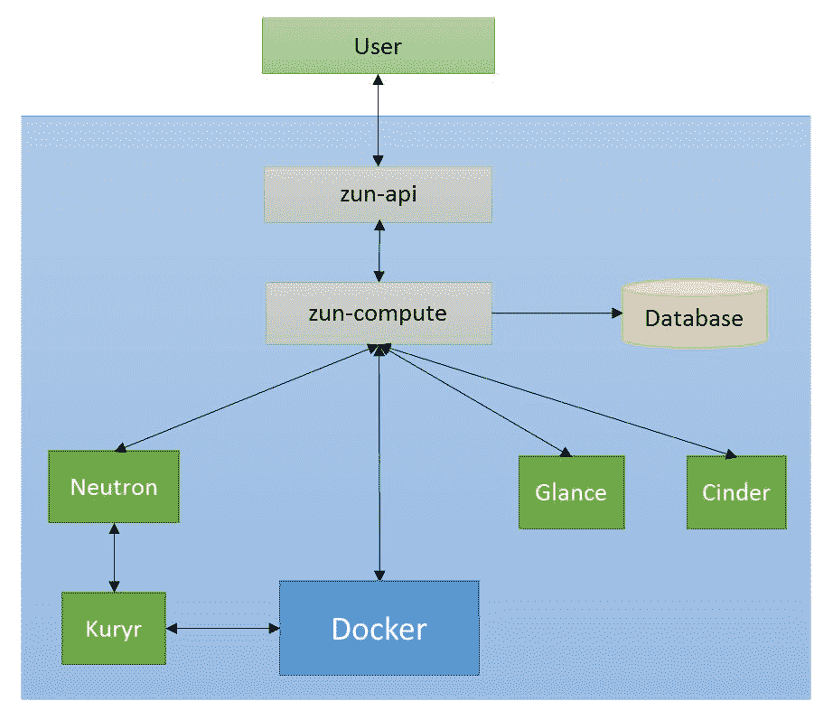

# 第六章：Zun - OpenStack 中的容器管理

在本章中，我们将了解用于管理容器的 OpenStack 项目 Zun。Zun 是 OpenStack 中唯一可用的解决方案，允许用户管理其应用程序容器，支持不同技术，并结合了其他 OpenStack 组件（如 Cinder、Glance 和 Neutron）的优点。Zun 为在 OpenStack IaaS 上运行容器化应用程序提供了强大的平台。

本章将涵盖以下主题：

+   Zun 简介

+   概念

+   关键特性

+   组件

+   演练

+   Zun DevStack 安装

+   管理容器

# Zun 简介

Zun 是在 Mitaka 周期由 Magnum 团队成员开发的 OpenStack 服务。在 2016 年的 OpenStack Austin Summit 上做出了一个决定，创建一个新项目来允许管理容器，并让 Magnum 容器基础设施管理服务仅管理运行容器的基础设施。结果就是 Zun 项目。

Zun 是 OpenStack 的容器管理服务，提供 API 来管理后端使用不同技术抽象的容器。Zun 支持 Docker 作为容器运行时工具。目前，Zun 与许多 OpenStack 服务集成，如用于网络的 Neutron，用于管理容器镜像的 Glance，以及为容器提供卷的 Cinder。

Zun 相比 Docker 有各种附加功能，使其成为容器管理的强大解决方案。以下是 Zun 一些显著特点的列表：

+   为容器的完整生命周期管理提供标准 API

+   提供基于 KeyStone 的多租户安全性和认证管理

+   支持使用 runc 和 clear container 管理容器的 Docker

+   通过将单个容器打包到具有小占地面积的虚拟机中，支持 clear container 提供更高的安全性

+   支持 Cinder 为容器提供卷

+   基于 Kuryr 的容器级隔离网络

+   通过 Heat 支持容器编排

+   容器组合，称为 capsules，允许用户将多个具有相关资源的容器作为单个单元运行

+   支持 SR-IOV 功能，可实现将物理 PCIe 设备跨虚拟机和容器共享

+   支持与容器进行交互式会话

+   Zun 允许用户通过暴露 CPU 集来运行具有专用资源的重型工作负载。

# 概念

在接下来的章节中，我们将看看 Zun 系统中可用的各种对象。

# 容器

在 Zun 中，容器是最重要的资源。Zun 中的容器代表用户运行的任何应用程序容器。容器对象存储信息，如镜像、命令、工作目录、主机等。Zun 是一个可扩展的解决方案；它也可以支持其他容器运行时工具。它为每个工具实现了基于驱动程序的实现。Zun 中的 Docker 驱动程序通过 Docker 管理容器。Zun 中的容器支持许多高级操作，包括 CRUD 操作，如创建、启动、停止、暂停、删除、更新、终止等。

# 镜像

Zun 中的镜像是容器镜像。这些镜像由 Docker Hub 或 Glance 管理。用户可以在创建容器之前下载镜像并将其保存到 Glance 以节省时间。镜像对象存储信息，如镜像名称、标签、大小等。支持的操作包括上传、下载、更新和搜索镜像。

# 服务

Zun 中的服务代表`zun-compute`服务。Zun 可以运行多个`zun-compute`服务实例以支持可伸缩性。该对象用于建立在 Zun 集群中运行的计算服务的状态。服务存储信息，如状态、启用或禁用、上次已知时间等。

# 主机

Zun 中的主机代表计算节点的资源。计算节点是容器运行的物理机器。这用于建立 Zun 中可用资源和已使用资源的列表。Zun 中的主机对象存储有关计算节点的有用信息，如总内存、空闲内存、运行、停止或暂停容器的总数、总 CPU、空闲 CPU 等。

# 胶囊

Zun 中的胶囊代表包含多个容器和其他相关资源的组合单元。胶囊中的容器彼此共享资源，并紧密耦合以作为单个单元一起工作。胶囊对象存储信息，如容器列表、CPU、内存等。

# 容器驱动程序

Zun 旨在成为 OpenStack 顶部容器管理的可扩展解决方案。Zun 支持 Docker 来管理容器。它还旨在未来支持多种其他工具，如 Rocket。为了支持这一点，Zun 有一系列容器驱动程序，可以与许多其他运行时工具实现，并作为 Zun 的解决方案提供。用户可以选择使用他们选择的工具来管理他们的容器。

# 镜像驱动程序

我们已经了解到 Zun 可以支持多个容器运行时工具来管理容器。同样，它支持多个镜像驱动程序来管理容器镜像，如 Glance 驱动程序和 Docker 驱动程序。镜像驱动程序也是可配置的；用户可以根据其用例选择任何可用的解决方案。

# 网络驱动程序

Zun 中的网络驱动程序提供了两个容器之间以及容器与虚拟机之间的通信能力。Zun 有一个 Kuryr 驱动程序来管理所有容器的网络资源。它支持创建和删除网络、连接和断开容器与网络的连接等操作。

# 关键特性

Zun 除了基本的容器管理之外，还具有许多高级功能。在本节中，我们将讨论 Zun 中的一些高级功能。还有许多其他功能正在进行中，例如 SRIOV 网络、PCIe 设备等，这些在 Zun 文档中有所提及。

# Cinder 集成

Zun 支持将持久存储附加到容器中，即使容器退出后仍然存在。这种存储可以用来存储大量数据，超出主机范围，如果主机宕机，这种存储更加可靠。这种支持是通过 Cinder 在 Zun 中实现的。用户可以挂载和卸载 Cinder 卷到他们的容器中。用户首先需要在 Cinder 中创建卷，然后在创建容器时提供卷。

# 容器组合

Zun 支持将多个容器作为单个单元创建。这个单元在 Zun 中被称为 capsule。这个概念与 Kubernetes 中的 pod 非常相似。一个 capsule 包含多个容器和所有相关的资源，如网络和存储，紧密耦合。capsule 中的所有容器都被调度到同一主机上，并共享资源，如 Linux 命名空间、CGroups 等。

# Kuryr 网络

Zun 创建的容器可以与 Nova 创建的虚拟机进行交互。这一功能由`Kuryr-libnetwork`提供。它与 Neutron 进行交互，为容器创建必要的网络资源，并为其他 OpenStack 资源提供通信路径。

# 容器沙盒

Zun 有一系列沙盒容器。沙盒是一个具有与之关联的所有 IaaS 资源的容器，例如端口，IP 地址，卷等。沙盒的目的是将管理这些 IaaS 资源的开销与应用容器分离。沙盒可以管理单个或多个容器，并提供所有所需的资源。

# CPU 集

Zun 允许用户运行具有专用资源的高性能容器。 Zun 向用户公开其主机功能，用户可以在创建容器时指定所需的 CPU。

调度程序会筛选具有可用资源的节点，并在该节点上为容器提供资源。主机信息将在数据库中更新，以反映更新后的资源。

# 组件

* Zun WebSocket 代理 *部分中的图表显示了 Zun 的架构。 Zun 有两个二进制文件：`zun-api`和`zun-compute`。这两个服务共同承载容器管理的整个生命周期。这些服务与其他 OpenStack 服务进行交互，例如 Glance 用于容器图像，Cinder 用于为容器提供卷，Neutron 用于容器与外部世界之间的连接。对容器的请求最终传达给在计算节点上运行的 Docker 服务。然后 Docker 为用户创建容器。

# zun-api

`zun-api`是一个 WSGI 服务器，用于为用户的 API 请求提供服务。对于 Zun 中的每个资源，都有单独的处理程序：

+   容器

+   主机

+   镜像

+   Zun 服务

每个控制器处理特定资源的请求。它们验证权限请求，验证 OpenStack 资源，包括验证图像是否存在于 Docker Hub 或 Glance，并为具有输入数据的资源创建 DB 对象。请求将转发给计算管理器。在从`zun-compute`服务接收到响应后，`zun-api`服务将响应返回给用户。

# Zun 调度程序

Zun 中的调度程序不是 RPC 服务。它是一个简单的 Python 类，对计算节点应用过滤器，并选择适当的节点来处理请求。然后，计算管理器通过 RPC 调用将请求传递给所选的`zun-compute`。对`zun-compute`的调用可以是同步或异步的，具体取决于每个操作所花费的处理时间。例如，列表调用可以是同步的，因为它们不耗时，而创建请求可以是异步的。

# zun-compute

`zun-compute`服务是 Zun 系统的主要组件。它执行大部分后端操作，隐藏了所有复杂性。`zun-compute`为每个请求选择适当的驱动程序，并为容器创建相关资源，如网络资源。然后，它将带有所有必要信息的请求传递给驱动程序。`zun-compute`与多个项目进行交流，获取各种资源，例如从 Glance 获取容器镜像，从 Neutron 获取网络资源。

# Zun WebSocket 代理

Zun 具有用于以交互模式运行容器的 WebSocket 代理服务。该服务与容器建立安全连接，以在其中运行任何命令：

# Walk-through

在本节中，我们将为您介绍在 Zun 中如何创建容器以及用户请求如何从用户传递到创建容器的 Docker。Zun 与其他多个 OpenStack 服务进行交互，以获取容器所需的资源。

在 Zun 中创建容器的请求流程如下：

1.  用户通过 CLI 或 Horizon 向`zun-api`服务发送 REST API 调用以创建集群，并使用从 KeyStone 接收的身份验证令牌。

1.  `zun-api`接收请求，并向 KeyStone 发送令牌和访问权限的验证请求。

1.  KeyStone 验证令牌，并发送带有角色和权限的更新身份验证标头。

1.  `zun-api`然后从请求中解析一些参数，例如安全组、内存和运行时，并对其进行验证。

1.  `zun-api`创建了请求的网络。`zun-api`向 Neutron 发送请求，以确保请求的网络或端口可用。如果不可用，`zun-api`将向 Neutron 发送另一个请求，以搜索可用网络并为容器创建新的 Docker 网络。

1.  `zun-api`然后检查请求的镜像是否可用。如果未找到镜像，则请求将以`400` HTTP 状态失败。

1.  如果请求中未提供容器的名称，`zun-api`会为容器生成一个名称。

1.  然后，`zun-api`为容器创建数据库对象。

1.  `zun-api`将请求发送到计算 API 管理器。计算管理器从调度程序中查找目标计算节点。

1.  然后，`zun-api`将异步调用请求发送到在上一步中选择的`zun-compute`以进一步处理请求。

1.  `zun-compute`从消息队列中获取请求。

1.  `zun-compute`将容器的`task_state`设置为`IMAGE_PULLING`并将条目存储在数据库中。

1.  `zun-compute`调用图像驱动程序下载图像。

1.  成功下载图像后，数据库中的`task_state`现在设置为`CONTAINER_CREATING`。

1.  现在，`zun-compute`声明容器所需的资源，并更新计算节点资源表中的所需信息。

1.  最后，向 Docker 发送请求以使用所有必需的参数创建容器。

1.  Docker 驱动程序创建容器，将状态设置为`CREATED`，`status_reason`设置为`None`，并将容器对象保存在数据库中。

1.  容器成功完成后，`task_state`设置为`None`。

Zun 中有定期任务，在特定时间间隔内同步 Zun 数据库中的容器状态。

# Zun DevStack 安装

我们现在将看看如何使用 DevStack 安装 Zun 的开发设置：

如有需要，创建 DevStack 的根目录：

[PRE0]

要克隆 DevStack 存储库，请执行以下操作：

[PRE1]

现在，创建一个最小的`local.conf`来运行 DevStack 设置。我们将启用以下插件来创建 Zun 设置：

+   `devstack-plugin-container`：此插件安装 Docker

+   `kuryr-libnetwork`：这是使用 Neutron 提供网络服务的 Docker libnetwork 驱动程序

[PRE2]

现在运行 DevStack：

[PRE3]

创建一个新的 shell 并源自 DevStack `openrc`脚本以使用 Zun CLI：

[PRE4]

现在，让我们通过查看服务列表来验证 Zun 的安装：

[PRE5]

让我们看一下主机列表，其中还显示了在 Zun 中注册供使用的计算节点：

[PRE6]

我们可以看到我们有一个计算节点，即主机本身。现在，让我们也看看主机中可用的资源：

[PRE7]

我们可以看到`zun-compute`服务正在运行。当前设置只安装了一个计算服务；您也可以安装多节点 Zun 设置。请参考[`github.com/openstack/zun/blob/master/doc/source/contributor/quickstart.rst`](https://github.com/openstack/zun/blob/master/doc/source/contributor/quickstart.rst) 获取更多详细信息。

# 管理容器

现在我们有一个运行中的 Zun 设置，我们将在本节尝试对容器进行一些操作。

我们现在将在 Zun 中创建一个容器。但在此之前，让我们检查一下 Docker 的状态：

[PRE8]

我们可以看到现在没有容器存在。现在，让我们创建容器：

[PRE9]

现在，让我们查看 Zun 列表以检查容器状态：

[PRE10]

我们可以看到容器处于创建状态。让我们也在 Docker 中检查一下容器：

[PRE11]

现在，让我们启动容器并查看日志：

[PRE12]

让我们对容器进行一些高级操作。我们现在将使用 Zun 创建一个交互式容器：

[PRE13]

现在，让我们删除容器：

[PRE14]

我们现在将查看一些命令，以了解在 Zun 中如何管理镜像。下载一个 Ubuntu 镜像：

[PRE15]

现在让我们看一下 Zun 中的镜像列表：

[PRE16]

# 总结

在本章中，我们学习了 OpenStack 容器管理服务 Zun。我们深入研究了 Zun 中的不同对象。然后，我们还了解了 Zun 的组件和架构。本章还详细介绍了用户请求在 Zun 中管理容器的工作流程。然后，我们看了如何使用 DevStack 在 Zun 中安装开发设置，并使用 Zun CLI 进行了实际操作，创建了一个容器，并对容器进行了启动和停止等其他操作。在下一章中，我们将学习 Kuryr，它使用 Neutron 为容器提供网络资源。
