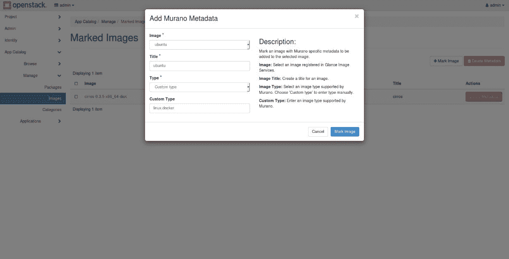
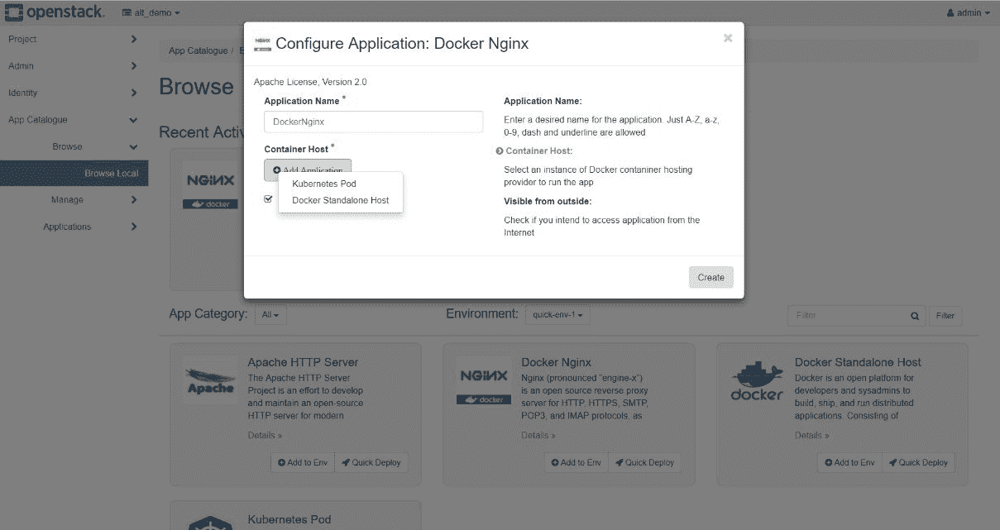
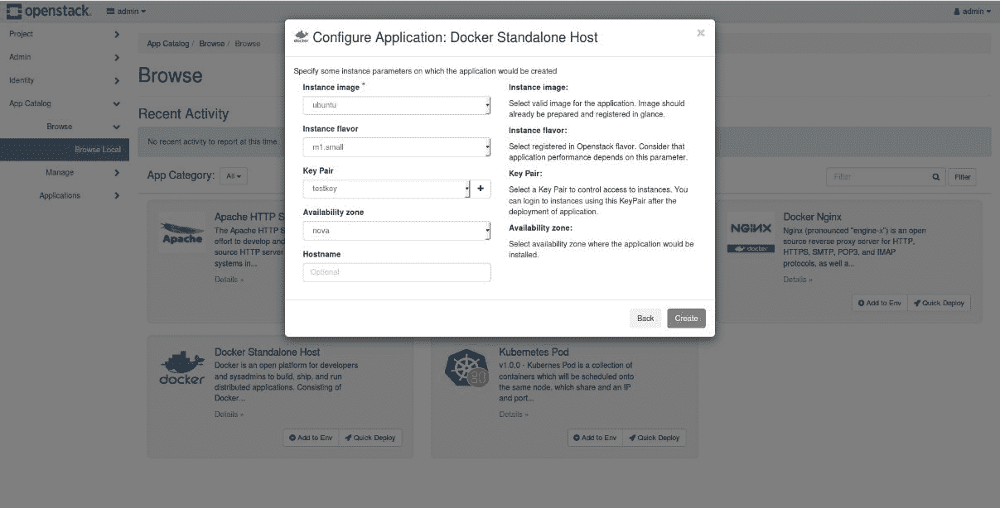

# Murano - 在 OpenStack 上的容器化应用部署

本章将解释 OpenStack 项目 Murano，它是 OpenStack 的应用程序目录，使应用程序开发人员和云管理员能够发布各种云就绪应用程序在一个可浏览的分类目录中。Murano 大大简化了在 OpenStack 基础设施上的应用程序部署，只需点击一下即可。在本章中，我们将讨论以下主题：

+   Murano 简介

+   Murano 概念

+   主要特点

+   Murano 组件

+   演练

+   Murano DevStack 安装

+   部署容器化应用程序

# Murano 简介

Murano 是 OpenStack 应用程序目录服务，提供各种云就绪应用程序，可以轻松部署在 OpenStack 上，抽象出所有复杂性。它简化了在 OpenStack IaaS 上打包和部署各种应用程序。它是外部应用程序和 OpenStack 的集成点，支持应用程序的完整生命周期管理。Murano 应用程序可以在 Docker 容器或 Kubernetes Pod 中运行。

Murano 是一个强大的解决方案，适用于寻求在 OpenStack 上部署应用程序的最终用户，他们不想担心部署复杂性。

以下是 Murano 提供的功能列表：

+   提供生产就绪的应用程序和动态 UI

+   支持运行容器化应用程序

+   支持在 Windows 和 Linux 系统上部署应用程序

+   使用 Barbican 保护数据

+   支持使用**Heat Orchestration Templates** (**HOT**)运行应用程序包

+   部署多区域应用程序

+   允许将 Cinder 卷附加到应用程序中的 VM，并将包存储在 Glare 中

+   将类似的包打包在一起，比如基于容器的应用程序

+   为计费目的提供与环境和应用程序相关的统计信息

# Murano 概念

在这一部分，我们将讨论 Murano 中使用的不同概念。

# 环境

在 Murano 中，环境表示由单个租户管理的一组应用程序。没有两个租户可以共享环境中的应用程序。另外，一个环境中的应用程序与其他环境是独立的。在一个环境中逻辑相关的多个应用程序可以共同形成一个更复杂的应用程序。

# 打包

Murano 中的软件包是一个 ZIP 存档，其中包含所有安装脚本、类定义、动态 UI 表单、图像列表和应用部署的指令。这个软件包被 Murano 导入并用于部署应用程序。可以将各种软件包上传到 Murano 以用于不同的应用程序。

# 会话

Murano 允许来自不同位置的多个用户对环境进行修改。为了允许多个用户同时进行修改，Murano 使用会话来存储所有用户的本地修改。当将任何应用程序添加到环境时，会创建一个会话，部署开始后，会话将变为无效。会话不能在多个用户之间共享。

# 环境模板

一组应用程序可以形成一个复杂的应用程序。为了定义这样的应用程序，Murano 使用**环境模板**的概念。模板中的每个应用程序由单个租户管理。可以通过将模板转换为环境来部署此模板。

# 部署

部署用于表示安装应用程序的过程。它存储环境状态、事件和任何应用程序部署中的错误等信息。

# 包

在 Murano 中，包代表一组类似的应用程序。包中的应用程序不需要紧密相关。它们根据使用情况进行排序。

一个例子是，创建一个由 MySQL 或 Oracle 应用程序组成的数据库应用程序包。可以直接在 Murano 中导入一个包，这将依次导入包中的所有应用程序。

# 类别

应用程序可以根据其类型分为不同的类别，例如应用程序服务器、大数据和数据库。

# 关键特性

Murano 具有许多先进的功能，使其成为 OpenStack 上应用程序管理的强大解决方案。在本节中，我们将讨论 Murano 中的一些高级功能。

# 生产就绪的应用程序

Murano 有各种云就绪的应用程序，可以在 VM 或裸金属上非常轻松地配置。这不需要任何安装、基础设施管理等知识，使得对于 OpenStack 用户来说，部署复杂应用程序变得非常容易。用户可以选择在 Docker 主机或 Kubernetes Pod 上运行他们的应用程序。

# 应用程序目录 UI

Murano 为最终用户提供了一个界面，可以轻松浏览可用的应用程序。用户只需点击一个按钮即可部署任何复杂的应用程序。该界面是动态的，它在应用程序被部署时提供用户输入的表单。它还允许应用程序标记，提供有关每个应用程序的信息，显示最近的活动等。

# 分发工作负载

Murano 允许用户在部署任何应用程序时选择区域。这样，您的应用程序可以在跨区域进行分布，以实现可伸缩性和高可用性，同时进行任何灾难恢复。

# 应用程序开发

**Murano 编程语言**（**MuranoPL**）可用于定义应用程序。它使用 YAML 和 YAQL 进行应用程序定义。它还具有一些核心库，定义了几个应用程序中使用的常见函数。MuranoPL 还支持垃圾回收，这意味着它会释放应用程序的所有资源。

# Murano 存储库

Murano 支持从不同来源安装包，如文件、URL 和存储库。Murano 可以从自定义存储库导入应用程序包。它会从存储库下载所有依赖的包和镜像（如果已定义）以进行应用程序部署。

请参考[`docs.openstack.org/murano/latest/admin/appdev-guide/muranopackages/repository.html`](https://docs.openstack.org/murano/latest/admin/appdev-guide/muranopackages/repository.html)设置自定义存储库。

# Cinder 卷

Murano 支持将 Cinder 卷附加到应用程序中的虚拟机，并支持从 Cinder 卷引导这些虚拟机。可以附加多个卷到应用程序以用于存储目的。

请参考[`docs.openstack.org/murano/latest/admin/appdev-guide/cinder_volume_supporting.html`](https://docs.openstack.org/murano/latest/admin/appdev-guide/cinder_volume_supporting.html)了解如何在 Murano 中使用 Cinder 卷的详细步骤。

# Barbican 支持

Barbican 是 OpenStack 项目，用于支持诸如密码和证书之类的敏感数据。Murano 确保通过将数据存储在 Barbican 中来保护您的数据。您需要安装 Barbican，并配置 Murano 以使用 Barbican 作为后端存储解决方案。

# HOT 包

Murano 支持从 Heat 模板中组合应用程序包。您可以将任何 Heat 模板添加到 Murano 作为新的部署包。Murano 支持从 Heat 模板自动和手动组合应用程序包的方式。

有关在 Murano 中使用 Heat 模板的详细信息，请参阅[`docs.openstack.org/murano/latest/admin/appdev-guide/hot_packages.html`](https://docs.openstack.org/murano/latest/admin/appdev-guide/hot_packages.html)。

# Murano 组件

*The Murano dashboard*部分的图解释了 Murano 的架构。Murano 具有与其他 OpenStack 组件类似的架构。它也有 API 服务和引擎作为主要组件。还有其他组件，如`murano-agent`，Murano 仪表板和 python 客户端，即`murano-pythonclient`。让我们详细看看每个组件。

# Murano API

Murano API（`murano-api`）是一个 WSGI 服务器，用于为用户提供 API 请求。Murano API 针对每种资源类型都有不同的控制器。每个控制器处理特定资源的请求。它们验证权限的请求，验证请求中提供的数据，并为具有输入数据的资源创建一个 DB 对象。请求被转发到`murano-engine`服务。收到来自`murano-engine`的响应后，`murano-api`服务将响应返回给用户。

# Murano 引擎

Murano 引擎（`murano-engine`）是大部分编排发生的地方。它向 Heat（OpenStack 编排服务）发出一系列调用，以创建部署应用程序所需的基础资源，如 VM 和卷。它还在 VM 内启动一个名为`murano-agent`的代理，以安装外部应用程序。

# Murano 代理

Murano 代理（`murano-agent`）是在部署的虚拟机内运行的服务。它在虚拟机上进行软件配置和安装。VM 镜像是使用此代理构建的。

# Murano 仪表板

Murano 仪表板为用户提供 Web UI，以便轻松浏览访问 Murano 中可用的应用程序。它支持基于角色的访问控制：


# 步骤

在本节中，我们将介绍 Murano 如何部署应用程序。Murano 与多个 OpenStack 服务进行交互，以获取应用程序部署所需的资源。

在 Murano 中部署应用程序的请求流程如下：

1.  用户在收到 KeyStone 的身份验证令牌后，通过 CLI 或 Horizon 向`murano-api`服务发送 REST API 调用以部署环境

1.  `murano-api`服务接收请求，并向 KeyStone 发送验证令牌和访问权限的请求

1.  KeyStone 验证令牌，并发送带有角色和权限的更新身份验证标头

1.  `murano-api`服务检查会话是否有效。如果会话无效或已部署，则请求将以`403` HTTP 状态失败

1.  检查以确定之前是否已删除环境。如果未删除，则在任务表中创建条目以存储此操作的信息

1.  `murano-api`服务通过 RPC 异步调用将请求发送到`murano-engine`服务，JSON 对象包含类类型、应用程序详情和用户数据（如果有的话）

1.  `murano-engine`服务从消息队列中接收请求

1.  它创建一个将与应用程序一起使用的 KeyStone 信任

1.  它下载所需的软件包，并验证所需的类是否可用和可访问

1.  `murano-engine`服务然后创建模型中定义的所有类

1.  然后调用每个应用程序的部署方法。在此阶段，`murano-engine`与 Heat 交互以创建应用程序运行所需的网络、虚拟机和其他资源

1.  实例运行后，将运行一个用户数据脚本来安装和运行 VM 上的`murano-agent`

1.  `murano-agent`服务执行软件配置和安装步骤

1.  安装完成后，`murano-engine`向 API 服务发送关于完成情况的响应

1.  `murano-api`服务然后在数据库中将环境标记为已部署

# Murano DevStack 安装

我们现在将看到如何使用 DevStack 安装 Murano 的开发设置。

1.  如有需要，为 DevStack 创建根目录：

```
        $ sudo mkdir -p /opt/stack
        $ sudo chown $USER /opt/stack  
```

1.  克隆 DevStack 存储库：

```
        $ git clone https://git.openstack.org/openstack-dev/devstack 
        /opt/stack/devstack

```

1.  现在创建一个用于运行 DevStack 设置的最小`local.conf`：

```
        $ cat > /opt/stack/devstack/local.conf << END
        [[local|localrc]]
        HOST_IP=$(ip addr | grep 'state UP' -A2 | tail -n1 | awk '{print
        $2}' | cut -f1  -d'/')
        DATABASE_PASSWORD=password
        RABBIT_PASSWORD=password
        SERVICE_TOKEN=password
        SERVICE_PASSWORD=password
        ADMIN_PASSWORD=password
        enable_plugin murano git://git.openstack.org/openstack/murano
        END 
```

1.  现在运行 DevStack：

```
        $ cd /opt/stack/devstack
        $ ./stack.sh  
```

现在应该已安装 Murano。要验证安装，请运行以下命令：

```
$ sudo systemctl status devstack@murano-*
 devstack@murano-engine.service - Devstack devstack@murano-
engine.service
 Loaded: loaded (/etc/systemd/system/devstack@murano-
engine.service; enabled; vendor preset: enabled)
 Active: active (running) since Thu 2017-11-02 04:32:28 EDT; 2 
weeks 5 days ago
 Main PID: 30790 (murano-engine)
 CGroup: /system.slice/system-devstack.slice/devstack@murano-
engine.service
 ├─30790 /usr/bin/python /usr/local/bin/murano-engine --
config-file /etc/murano/murano.conf
 ├─31016 /usr/bin/python /usr/local/bin/murano-engine --
config-file /etc/murano/murano.conf
 ├─31017 /usr/bin/python /usr/local/bin/murano-engine --
config-file /etc/murano/murano.conf
 ├─31018 /usr/bin/python /usr/local/bin/murano-engine --
config-file /etc/murano/murano.conf
 └─31019 /usr/bin/python /usr/local/bin/murano-engine --
config-file /etc/murano/murano.conf
 devstack@murano-api.service - Devstack devstack@murano-api.service
 Loaded: loaded (/etc/systemd/system/devstack@murano-api.service; 
enabled; vendor preset: enabled)
 Active: active (running) since Thu 2017-11-02 04:32:26 EDT; 2 
weeks 5 days ago
 Main PID: 30031 (uwsgi)
 Status: "uWSGI is ready"
 CGroup: /system.slice/system-devstack.slice/devstack@murano-
api.service
 ├─30031 /usr/local/bin/uwsgi --ini /etc/murano/murano-api-
uwsgi.ini
 ├─30034 /usr/local/bin/uwsgi --ini /etc/murano/murano-api-
uwsgi.ini
 └─30035 /usr/local/bin/uwsgi --ini /etc/murano/murano-api-
uwsgi.ini
```

您可以看到`murano-api`和`murano-engine`服务都已启动并运行。

# 部署容器化应用程序

在前一节中，您学习了如何使用 DevStack 安装 Murano。现在我们将看到如何使用 Murano 来在 OpenStack 上安装应用程序。由于 Murano 提供了可浏览的动态 UI，我们将使用 Horizon 中的应用程序目录选项卡来运行我们的应用程序。

在此示例中，我们将在 Docker 中安装一个 NGINX 容器化应用程序。我们将需要以下软件包来运行此应用程序：

+   Docker 接口库：此库定义了构建 Docker 应用程序的框架。它提供了所有应用程序和由 Docker 支持的主机服务使用的数据结构和常用接口。

+   Docker 独立主机：这是一个常规的 Docker 主机应用程序。所有容器应用程序都在运行使用 Docker 和`murano-agent`构建的映像的专用 VM 内运行。

+   Kubernetes Pod：此应用程序提供了在 OpenStack VM 上使用 Kubernetes 运行容器化应用程序的基础设施。这对于 Docker 独立主机应用程序是可选的。

+   Nginx 应用程序：Nginx 是一个 Web 服务器应用程序，将使用 Docker 独立主机或 Kubernetes Pod 应用程序运行。

所有 Murano 的容器应用程序都可以在[`github.com/openstack/k8s-docker-suite-app-murano`](https://github.com/openstack/k8s-docker-suite-app-murano)找到。

现在让我们开始使用 Murano 仪表板来运行我们的容器应用程序。通过输入您的凭据登录到您的 Horizon 仪表板：

1.  从[`github.com/openstack/k8s-docker-suite-app-murano`](https://github.com/openstack/k8s-docker-suite-app-murano)下载软件包

1.  为上述列出的每个应用程序创建一个`.zip`存档

1.  现在在仪表板上导航到应用程序目录|管理|软件包

1.  点击导入软件包

选择文件作为软件包源，并浏览上传您的应用程序的 ZIP 文件。填写每个应用程序所需的 UI 表单，并单击“单击完成上传软件包”。现在，通过导航到应用程序目录|浏览|本地浏览，您可以浏览可用的应用程序。您将看到这样的页面：


1.  按照[`github.com/openstack/k8s-docker-suite-app-murano/tree/master/DockerStandaloneHost/elements`](https://github.com/openstack/k8s-docker-suite-app-murano/tree/master/DockerStandaloneHost/elements)中提供的步骤构建 VM 映像

1.  标记要由 Murano 使用的图像。导航到应用程序目录|管理|标记的图像，单击标记图像，并按照以下截图中提供的详细信息填写：



1.  通过单击快速部署来部署应用程序

您可以在下面的截图中看到，我们有两个选择供我们选择作为容器主机：Kubernetes Pod 和 Docker 独立主机。我们将选择后者作为选项：



1.  填写要为我们的应用程序创建的 VM 的详细信息，如下所示：



1.  单击创建以创建我们部署的环境

您将被自动重定向到应用程序目录|应用程序|环境中新创建的环境。

1.  单击部署环境以开始安装您的应用程序和所需的基础设施。

您将看到下面的截图，显示它开始创建 VM，Docker 将在其上运行：


在前面的部署成功完成后，您将能够看到一个新的虚拟机被创建，如下面的截图所示，并且您的 Nginx 应用程序在 VM 内的 Docker 容器中运行：


您可以登录到 VM 并访问 Nginx 应用程序。我们现在已经成功在 OpenStack 上安装了一个容器化的 Nginx 应用程序。

# 摘要

在本章中，您详细了解了 Murano，这是 OpenStack 的应用程序目录服务。我们深入研究了 Murano 中可用的不同概念。然后，您还了解了 Murano 的组件和架构。本章还详细概述了用户请求使用 Murano 部署应用程序的工作流程。然后我们看到如何使用 DevStack 安装 Murano 的开发设置，并且我们在使用 Murano 仪表板创建环境，向其添加应用程序并部署环境时进行了实际操作。

在下一章中，您将了解 Kolla，它提供了用于部署 OpenStack 服务的生产就绪容器和工具。
