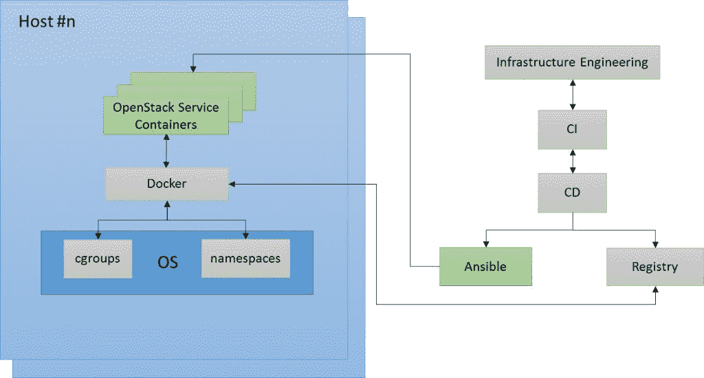

# 第九章：Kolla - OpenStack 的容器化部署

在本章中，您将了解 Kolla。它为操作 OpenStack 云提供了生产就绪的容器和部署工具。本章的内容如下：

+   Kolla 介绍

+   关键特性

+   架构

+   部署容器化的 OpenStack 服务

# Kolla 介绍

OpenStack 云由多个服务组成，每个服务与其他服务进行交互。OpenStack 没有集成的产品发布。每个项目在每 6 个月后都会遵循一个发布周期。这为运营商提供了更大的灵活性，可以从多个选项中进行选择，并为他们构建自定义的部署解决方案。然而，这也带来了部署和管理 OpenStack 云的复杂性。

这些服务需要可扩展、可升级和随时可用。Kolla 提供了一种在容器内运行这些服务的方式，这使得 OpenStack 云具有快速、可靠、可扩展和可升级的优势。Kolla 打包了 OpenStack 服务及其要求，并在容器镜像中设置了所有配置。

Kolla 使用 Ansible 来运行这些容器镜像，并在裸金属或虚拟机上非常容易地部署或升级 OpenStack 集群。Kolla 容器被配置为将数据存储在持久存储上，然后可以重新挂载到主机操作系统上，并成功恢复以防止任何故障。

为了部署 OpenStack，Kolla 有三个项目如下：

+   **kolla:** 所有 OpenStack 项目的 Docker 容器镜像都在这个项目中维护。Kolla 提供了一个名为 kolla-build 的镜像构建工具，用于为大多数项目构建容器镜像。

+   **kolla-ansible:** 这提供了用于在 Docker 容器内部部署 OpenStack 的 Ansible 剧本。它支持 OpenStack 云的一体化和多节点设置。

+   **kolla-kubernetes:** 这在 Kubernetes 上部署 OpenStack。它旨在利用 Kubernetes 的自愈、健康检查、升级和其他功能，用于管理容器化的 OpenStack 部署。kolla-kubernetes 使用 Ansible 剧本和 Jinja2 模板来生成服务的配置文件。

# 关键特性

在本节中，我们将看到 Kolla 的一些关键特性。

# 高可用部署

OpenStack 生态系统由多个服务组成，它们只运行单个实例，有时会成为任何灾难的单点故障，并且无法扩展到单个实例之外。为了使其可扩展，Kolla 部署了配置了 HA 的 OpenStack 云。因此，即使任何服务失败，也可以在不中断当前操作的情况下进行扩展。这个特性使 Kolla 成为一个理想的解决方案，可以轻松升级和扩展而无需任何停机时间。

# Ceph 支持

Kolla 使用 Ceph 向运行我们的 OpenStack 环境的虚拟机添加持久数据，以便我们可以轻松从任何灾难中恢复，从而使 OpenStack 云更加可靠。Ceph 还用于存储 glance 镜像。

# 图像构建

Kolla 提供了一个名为 kolla-build 的工具，可以在 CentOs、Ubuntu、Debian 和 Oracle Linux 等多个发行版上构建容器镜像。可以一次构建多个依赖组件。

# Docker Hub 支持

您可以直接从 Docker Hub 拉取图像。您可以在[`hub.docker.com/u/kolla/`](https://hub.docker.com/u/kolla/)上查看所有 Kolla 图像。

# 本地注册表支持

Kolla 还支持将图像推送到本地注册表。有关设置本地注册表，请参阅[`docs.openstack.org/kolla-ansible/latest/user/multinode.html#deploy-a-registry`](https://docs.openstack.org/kolla-ansible/latest/user/multinode.html#deploy-a-registry)。

# 多个构建源

Kolla 支持从多个源构建二进制和源代码。二进制是由主机操作系统的软件包管理器安装的软件包，而源代码可以是 URL、本地存储库或 tarball。有关更多详细信息，请参阅[`docs.openstack.org/kolla/latest/admin/image-building.html#build-openstack-from-source`](https://docs.openstack.org/kolla/latest/admin/image-building.html#build-openstack-from-source)。

# Dockerfile 定制

Kolla 支持从 Jinja2 模板构建图像，这为运营商提供了更好的灵活性。运营商可以定制他们的图像构建，包括安装附加软件包、安装插件、更改一些配置设置等。有关如何进行不同定制的更多详细信息，请参阅[`docs.openstack.org/kolla/latest/admin/image-building.html#dockerfile-customisation`](https://docs.openstack.org/kolla/latest/admin/image-building.html#dockerfile-customisation)。

# 架构

在本节中，我们将看到使用 Kolla 的 OpenStack 架构。以下图显示了 Kolla 完成的**高可用**（**HA**）OpenStack 多模式设置。

这里的基础设施工程意味着为基础设施管理编写的代码或应用程序。代码提交到 Gerrit 进行审查，然后 CI 系统审查并检查代码的正确性。一旦代码获得 CI 的批准，CD 系统将构建的输出，即基于 Kolla 的 OpenStack 容器，输入到本地注册表中。

之后，Ansible 联系 Docker，并使用 HA 启动我们的 OpenStack 多节点环境：



# 部署容器化的 OpenStack 服务

在本节中，我们将了解 Kolla 如何使用 kolla-ansible 部署容器化的 OpenStack。在撰写本文时，kolla-kubernetes 正在开发中。

请注意，这不是 Kolla 的完整指南。

Kolla 现在正在发展，因此指南经常进行升级。请参考[`docs.openstack.org/kolla-ansible/latest/`](https://docs.openstack.org/kolla-ansible/latest/)提供的最新文档。我们将尝试解释使用 Kolla 和子项目部署 OpenStack 的一般过程。

使用 Kolla 部署 OpenStack 非常容易。Kolla 在 Docker 或 Kubernetes 上提供全功能和多节点安装。基本上涉及四个步骤：

+   设置本地注册表

+   自动主机引导

+   构建镜像

+   部署镜像

# 设置本地注册表

Kolla 构建的容器镜像需要一个本地注册表进行存储。对于全功能部署来说，这是可选的，可以使用 Docker 缓存。Docker Hub 包含 Kolla 所有主要版本的所有镜像。但是，强烈建议多节点部署确保镜像的单一来源。还建议在生产环境中通过 HTTPS 运行注册表以保护镜像。

有关设置本地注册表的详细步骤，请参考[`docs.openstack.org/kolla-ansible/latest/user/multinode.html#deploy-a-registry`](https://docs.openstack.org/kolla-ansible/latest/user/multinode.html#deploy-a-registry)的指南。

# 自动主机引导

Kolla 安装需要在我们希望运行 OpenStack 的主机上安装一些软件包和工具，例如 Docker、libvirt 和 NTP。这些依赖项可以通过主机引导自动安装和配置。kolla-ansible 提供了用于准备和安装 OpenStack 主机的 bootstrap-servers playbook。

要快速准备主机，请运行此命令：

```
$ kolla-ansible -i <inventory_file> bootstrap-servers  
```

# 构建镜像

在这一步中，我们将为所有 OpenStack 服务构建 Docker 容器镜像。在构建镜像时，我们可以指定镜像的基本发行版、来源和标签。这些镜像将被推送到本地注册表。

在 Kolla 中构建镜像就像运行此命令一样简单：

```
$ kolla-build  
```

此命令默认构建基于 CentOS 的所有镜像。要使用特定的发行版构建镜像，请使用`-b`选项：

```
$ kolla-build -b ubuntu  
```

要为特定项目构建镜像，请将项目名称传递给命令：

```
$ kolla-build nova zun  
```

Kolla 中的一个高级功能是镜像配置文件。配置文件用于定义 OpenStack 中一组相关的项目。Kolla 中定义的一些配置文件如下：

+   **infra**：所有基础设施相关的项目

+   **main**：这些是 OpenStack 的核心项目，如 Nova、Neutron、KeyStone 和 Horizon

+   **aux**：这些是额外的项目，如 Zun 和 Ironic

+   **default**：这是一个准备好的云所需的一组最小项目

也可以在`kolla-build.conf`对象中定义新的配置文件。只需在`.conf`文件的`[profile]`部分下添加一个新的配置文件即可：

```
[profiles]
containers=zun,magnum,heat  
```

在上面的示例中，我们设置了一个名为`containers`的新配置文件，用于表示 OpenStack 中与容器化相关的一组项目。还提到并使用了`heat`项目，因为它是`magnum`所需的。此外，您还可以使用此配置文件为这些项目创建镜像：

```
$ kolla-build -profile containers  
```

还可以使用这些命令将镜像推送到 Docker Hub 或本地注册表：

```
$ kolla-build -push # push to Docker Hub
$ kolla-build -registry <URL> --push # push to local registry  
```

Kolla 还提供了更高级的操作，例如从源代码和 Docker 文件自定义构建镜像。您可以参考[`docs.openstack.org/kolla/latest/admin/image-building.html`](https://docs.openstack.org/kolla/latest/admin/image-building.html) [获取更多详细信息。](https://docs.openstack.org/kolla/latest/admin/image-building.html)

# 部署镜像

现在我们已经准备好部署 OpenStack 所需的所有镜像；kolla-ansible 联系 Docker 并提供这些镜像来运行它们。部署可以是单一节点或多节点。决定是在 kolla-ansible 中可用的 Ansible 清单文件上做出的。此清单文件包含集群中基础设施主机的信息。Kolla 中的部署过程需要环境变量和密码，这些变量和密码在配置文件和清单文件中指定，以配置高可用性的 OpenStack 集群。

用于 OpenStack 部署的所有配置选项和密码分别存储在`/etc/kolla/globals.yml`和`/etc/kolla/passwords.yml`中。手动编辑这些文件以指定您选择的安装，如下所示：

```
kolla_base_distro: "centos"
kolla_install_type: "source"  
```

您可以使用以下命令生成密码：

```
$ kolla-genpwd  
```

您可以在部署目标节点上运行`prechecks`来检查它们是否处于状态：

```
$ kolla-ansible prechecks -i <inventory-file>  
```

现在我们准备好部署 OpenStack。运行以下命令：

```
$ kolla-ansible deploy -i <inventory-file>  
```

要验证安装，请查看`docker`中的容器列表：

```
$ docker ps -a  
```

您应该看到所有运行的 OpenStack 服务容器。现在让我们生成`admin-openrc.sh`文件以使用我们的 OpenStack 集群。生成的文件将存储在`/etc/kolla`目录中：

```
$ kolla-ansible post-deploy  
```

现在安装`python-openstackclient`：

```
$ pip install python-openstackclient  
```

要初始化 neutron 网络和 glance 镜像，请运行此命令：

```
$ . /etc/kolla/admin-openrc.sh
#On centOS
$ /usr/share/kolla-ansible/init-runonce
#ubuntu
$ /usr/local/share/kolla-ansible/init-runonce  
```

成功部署 OpenStack 后，您可以访问 Horizon 仪表板。Horizon 将在`kolla_external_fqdn`或`kolla_internal_fqdn`中指定的 IP 地址或主机名处提供。如果在部署期间未设置这些变量，则它们默认为`kolla_internal_vip_address`。

有关使用 kolla-ansible 部署多节点 OpenStack 云的详细步骤，请参阅[`docs.openstack.org/project-deploy-guide/kolla-ansible/latest/multinode.html`](https://docs.openstack.org/project-deploy-guide/kolla-ansible/latest/multinode.html)，使用 kolla-kubernetes 请参阅[`docs.openstack.org/kolla-kubernetes/latest/deployment-guide.html`](https://docs.openstack.org/kolla-kubernetes/latest/deployment-guide.html)。

# 摘要

在本章中，您了解了 Kolla，它部署了一个容器化的 OpenStack 云。我们看了看 Kolla 中可用的各种项目，并了解了它们的一般功能。然后我们深入了解了 Kolla 的一些关键特性，并讨论了 OpenStack 部署的 Kolla 架构。您还学会了如何使用 Kolla 构建镜像，并最终了解了 Kolla 的部署过程。

在下一章中，我们将探讨保护容器的最佳实践，以及使用不同 OpenStack 项目的优势。
