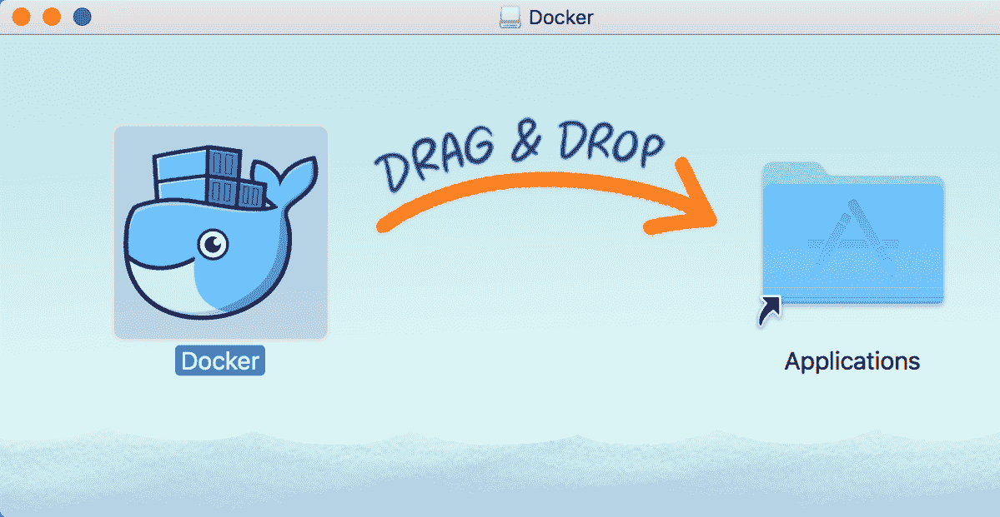
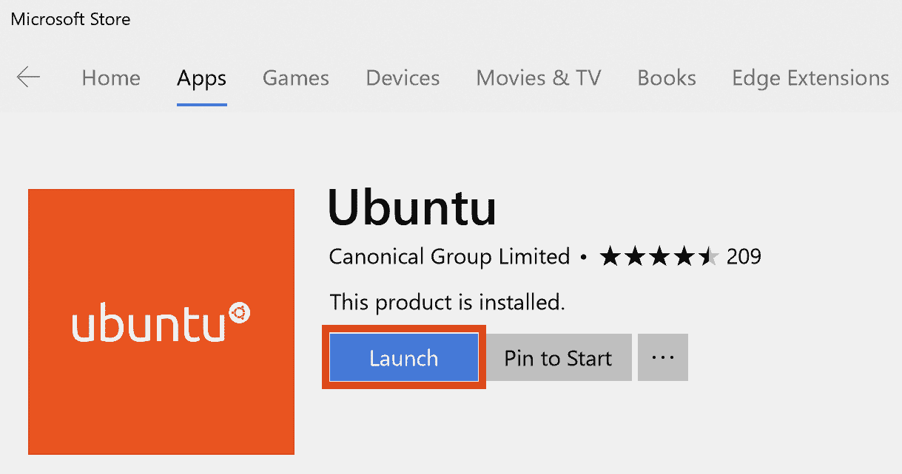
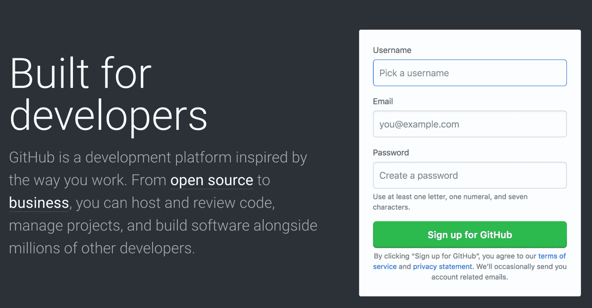
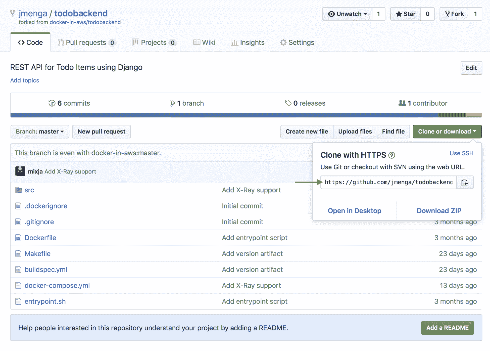
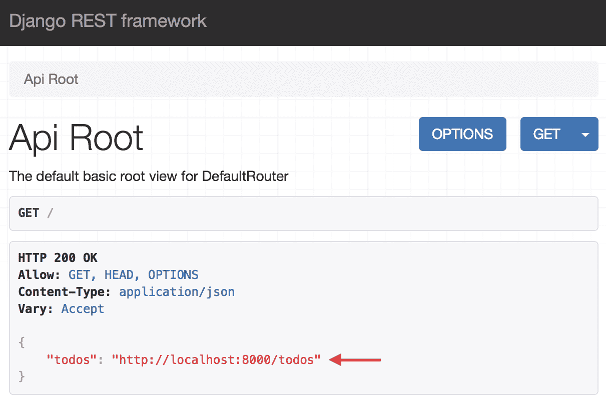
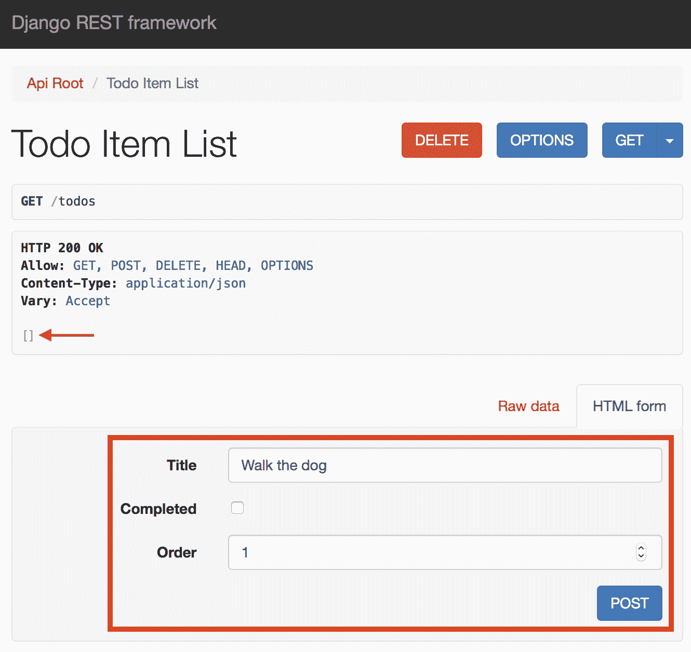

# 容器和 Docker 基础知识

Docker 和 Amazon Web Services 是目前最炙手可热和最受欢迎的两种技术。Docker 目前是全球最流行的容器平台，而 Amazon Web Services 是排名第一的公共云提供商。无论是大型还是小型组织都在大规模地采用容器技术，公共云已不再是初创企业的游乐场，大型企业和组织也纷纷迁移到云端。好消息是，本书将为您提供有关如何同时使用 Docker 和 AWS 来帮助您比以往更快更高效地测试、构建、发布和部署应用程序的实用、现实世界的见解和知识。

在本章中，我们将简要讨论 Docker 的历史，为什么 Docker 如此革命性，以及 Docker 的高级架构。我们将描述支持在 AWS 中运行 Docker 的各种服务，并根据组织的需求讨论为什么您可能会选择一个服务而不是另一个服务。

然后，我们将专注于使用 Docker 在本地环境中运行起来，并安装运行本书示例应用程序所需的各种软件前提条件。示例应用程序是一个简单的用 Python 编写的 Web 应用程序，它将数据存储在 MySQL 数据库中，本书将使用示例应用程序来帮助您解决诸如测试、构建和发布 Docker 镜像，以及在 AWS 上部署和运行 Docker 应用程序等真实世界挑战。在将示例应用程序打包为 Docker 镜像之前，您需要了解应用程序的外部依赖项以及测试、构建、部署和运行应用程序所需的关键任务，并学习如何安装应用程序依赖项、运行单元测试、在本地启动应用程序，并编排诸如建立示例应用程序所需的初始数据库架构和表等关键操作任务。

本章将涵盖以下主题：

+   容器和 Docker 简介

+   为什么容器是革命性的

+   Docker 架构

+   AWS 中的 Docker

+   设置本地 Docker 环境

+   安装示例应用程序

# 技术要求

以下列出了完成本章所需的技术要求：

+   满足软件和硬件清单中定义的最低规格的计算机环境

以下 GitHub 网址包含本章中使用的代码示例：[`github.com/docker-in-aws/docker-in-aws/tree/master/ch1`](https://github.com/docker-in-aws/docker-in-aws/tree/master/ch1)[.](https://github.com/docker-in-aws/docker-in-aws/tree/master/ch3)

查看以下视频，了解代码的实际应用：

[`bit.ly/2PEKlVQ`](http://bit.ly/2PEKlVQ)

# 容器和 Docker 简介

近年来，容器已成为技术世界中的共同语言，很难想象仅仅几年前，只有技术界的一小部分人甚至听说过容器。

要追溯容器的起源，您需要倒回到 1979 年，当时 Unix V7 引入了 chroot 系统调用。chroot 系统调用提供了将运行中进程的根目录更改为文件系统中的不同位置的能力，并且是提供某种形式的进程隔离的第一个机制。chroot 于 1982 年添加到伯克利软件发行版（BSD）中（这是现代 macOS 操作系统的祖先），在容器化和隔离方面没有太多其他进展，直到 2000 年发布了一个名为 FreeBSD Jails 的功能，它提供了称为“jails”的单独环境，每个环境都可以分配自己的 IP 地址，并且可以在网络上独立通信。

2004 年，Solaris 推出了 Solaris 容器的第一个公共测试版（最终成为 Solaris Zones），通过创建区域提供系统资源分离。这是我记得在 2007 年使用的技术，帮助克服了昂贵的物理 Sun SPARC 基础设施的缺乏，并在单个 SPARC 服务器上运行应用程序的多个版本。

在 2000 年代中期，容器的进展更加显著，Open Virtuozzo（Open VZ）于 2005 年发布，它对 Linux 内核进行了补丁，提供了操作系统级的虚拟化和隔离。2006 年，谷歌推出了一个名为进程容器（最终更名为控制组或 cgroups）的功能，提供了限制一组进程的 CPU、内存、网络和磁盘使用的能力。2008 年，一个名为 Linux 命名空间的功能，提供了将不同类型的资源相互隔离的能力，与 cgroups 结合起来创建了 Linux 容器（LXC），形成了今天我们所知的现代容器的初始基础。

2010 年，随着云计算开始流行起来，一些平台即服务（PaaS）初创公司出现了，它们为特定的应用程序框架（如 Java Tomcat 或 Ruby on Rails）提供了完全托管的运行时环境。一家名为 dotCloud 的初创公司非常不同，因为它是第一家“多语言”PaaS 提供商，意味着您可以使用他们的服务运行几乎任何应用程序环境。支撑这一技术的是 Linux 容器，dotCloud 添加了一些专有功能，为他们的客户提供了一个完全托管的容器平台。到了 2013 年，PaaS 市场已经真正进入了 Gartner 炒作周期的失望低谷，dotCloud 濒临财务崩溃。该公司的联合创始人之一 Solomon Hykes 向董事会提出了一个开源他们的容器管理技术的想法，他感觉到有巨大的潜力。然而，董事会不同意，但 Solomon 和他的技术团队仍然继续前进，剩下的就是历史。

在 2013 年将 Docker 作为一个新的开源容器管理平台向世界宣布后，Docker 迅速崛起，成为开源世界和供应商社区的宠儿，很可能是历史上增长最快的技术之一。到 2014 年底，Docker 1.0 发布时，已经下载了超过 1 亿个 Docker 容器 - 快进到 2018 年 3 月，这个数字已经达到了*370* *亿*次下载。到 2017 年底，财富 100 强公司中使用容器的比例达到了 71%，表明 Docker 和容器已经成为创业公司和企业普遍接受的技术。如今，如果您正在构建基于微服务架构的现代分布式应用程序，那么您的技术栈很可能是以 Docker 和容器为基础。

# 容器为何是革命性的

容器的简短而成功的历史证明了它的价值，这引出了一个问题，*为什么容器如此受欢迎*？以下提供了这个问题的一些更重要的答案：

+   轻量级：容器经常与虚拟机进行比较，在这种情况下，容器比虚拟机要轻量得多。与典型虚拟机需要几分钟启动时间相比，容器可以在几秒钟内为您的应用程序启动一个隔离和安全的运行时环境。容器镜像也比虚拟机镜像要小得多。

+   速度：容器很快 - 它们可以在几秒内下载和启动，并且在几分钟内您就可以测试、构建和发布您的 Docker 镜像以供立即下载。这使得组织能够更快地创新，这在当今竞争日益激烈的环境中至关重要。

+   便携：Docker 使您能够更轻松地在本地机器、数据中心和公共云上运行应用程序。因为 Docker 包含了应用程序的完整运行时环境，包括操作系统依赖和第三方软件包，您的容器主机不需要任何特殊的预先设置或针对每个应用程序的特定配置 - 所有这些特定的依赖和要求都包含在 Docker 镜像中，使得“但在我的机器上可以运行！”这样的评论成为过去的遗迹。

+   **安全性**：关于容器安全性的讨论很多，但在我看来，如果实施正确，容器实际上比非容器替代方法提供了更高的安全性。主要原因是容器非常好地表达了安全上下文 - 在容器级别应用安全控制通常代表了这些控制的正确上下文级别。很多这些安全控制都是“默认”提供的 - 例如，命名空间本质上是一种安全机制，因为它们提供了隔离。一个更明确的例子是，它们可以在每个容器基础上应用 SELinux 或 AppArmor 配置文件，这样很容易根据每个容器的特定安全要求定义不同的配置文件。

+   **自动化**：组织正在采用诸如持续交付之类的软件交付实践，其中自动化是基本要求。Docker 本身支持自动化 - 在其核心，Dockerfile 是一种自动化规范，允许 Docker 客户端自动构建您的容器，而其他 Docker 工具如 Docker Compose 允许您表达连接的多容器环境，您可以在几秒钟内自动创建和拆除。

# Docker 架构

正如本书前言中所讨论的，我假设您至少具有基本的 Docker 工作知识。如果您是 Docker 的新手，那么我建议您通过阅读[`docs.docker.com/engine/docker-overview/`](https://docs.docker.com/engine/docker-overview/)上的 Docker 概述，并通过运行一些 Docker 教程来补充学习本章内容。

Docker 架构包括几个核心组件，如下所示：

+   **Docker 引擎**：它提供了用于运行容器工作负载的几个服务器代码组件，包括用于与 Docker 客户端通信的 API 服务器，以及提供 Docker 核心运行时的 Docker 守护程序。守护程序负责完整的容器和其他资源的生命周期，并且还内置了集群支持，允许您构建 Docker 引擎的集群或群集。

+   Docker 客户端：这提供了一个用于构建 Docker 镜像、运行 Docker 容器以及管理其他资源（如 Docker 卷和 Docker 网络）的客户端。Docker 客户端是您在使用 Docker 时将要使用的主要工具，它与 Docker 引擎和 Docker 注册表组件进行交互。

+   Docker 注册表：这负责存储和分发您应用程序的 Docker 镜像。Docker 支持公共和私有注册表，并且通过 Docker 注册表打包和分发您的应用程序是 Docker 成功的主要原因之一。在本书中，您将从 Docker Hub 下载第三方镜像，并将自己的应用程序镜像存储在名为弹性容器注册表（ECR）的私有 AWS 注册表服务中。

+   Docker Swarm：Swarm 是一组 Docker 引擎，形成一个自管理和自愈的集群，允许您水平扩展容器工作负载，并在 Docker 引擎故障时提供弹性。Docker Swarm 集群包括一些形成集群控制平面的主节点，以及一些实际运行您的容器工作负载的工作节点。

当您使用上述组件时，您将与 Docker 架构中的许多不同类型的对象进行交互：

+   镜像：镜像是使用 Dockerfile 构建的，其中包括一些关于如何为您的容器构建运行时环境的指令。执行每个构建指令的结果被存储为一组层，并作为可下载和可安装的镜像进行分发，Docker 引擎读取每个层中的指令，以构建基于给定镜像的所有容器的运行时环境。

+   容器：容器是 Docker 镜像的运行时表现形式。在幕后，容器由一组 Linux 命名空间、控制组和存储组成，共同创建了一个隔离的运行时环境，您可以在其中运行给定的应用程序进程。

+   **卷**：默认情况下，容器的基础存储机制基于联合文件系统，允许从 Docker 镜像中的各个层构建虚拟文件系统。这种方法非常高效，因为您可以共享层并从这些共享层构建多个容器，但是这会带来性能损失，并且不支持持久性。 Docker 卷提供对专用可插拔存储介质的访问，您的容器可以使用该介质进行 IO 密集型应用程序和持久化数据。

+   **网络**：默认情况下，Docker 容器各自在其自己的网络命名空间中运行，这提供了容器之间的隔离。但是，它们仍然必须提供与其他容器和外部世界的网络连接。 Docker 支持各种网络插件，支持容器之间的连接，甚至可以跨 Docker Swarm 集群进行扩展。

+   **服务**：服务提供了一个抽象，允许您通过在 Docker Swarm 集群中的多个 Docker 引擎上启动多个容器或服务副本来扩展您的应用程序，并且可以在这些 Docker 引擎上进行负载平衡。

# 在 AWS 中运行 Docker

除了 Docker 之外，本书将针对的另一个主要技术平台是 AWS。

AWS 是世界领先的公共云提供商，因此提供了多种运行 Docker 应用程序的方式：

+   **弹性容器服务（ECS）**：2014 年，AWS 推出了 ECS，这是第一个支持 Docker 的专用公共云服务。 ECS 提供了一种混合托管服务，ECS 负责编排和部署您的容器应用程序（例如容器管理平台的控制平面），而您负责提供 Docker 引擎（称为 ECS 容器实例），您的容器实际上将在这些实例上运行。 ECS 是免费使用的（您只需支付运行您的容器的 ECS 容器实例），并且消除了管理容器编排和确保应用程序始终运行的许多复杂性。但是，这需要您管理运行 ECS 容器实例的 EC2 基础设施。 ECS 被认为是亚马逊的旗舰 Docker 服务，因此将是本书重点关注的主要服务。

+   Fargate：Fargate 于 2017 年底推出，提供了一个完全托管的容器平台，可以为您管理 ECS 控制平面和 ECS 容器实例。使用 Fargate，您的容器应用程序部署到共享的 ECS 容器实例基础设施上，您无法看到这些基础设施，而 AWS 进行管理，这样您就可以专注于构建、测试和部署容器应用程序，而不必担心任何基础设施。Fargate 是一个相对较新的服务，在撰写本书时，其区域可用性有限，并且有一些限制，这意味着它并不适用于所有用例。我们将在第十四章《Fargate 和 ECS 服务发现》中介绍 Fargate 服务。

+   弹性 Kubernetes 服务（EKS）：EKS 于 2018 年 6 月推出，支持流行的开源 Kubernetes 容器管理平台。EKS 类似于 ECS，它是一个混合托管服务，亚马逊提供完全托管的 Kubernetes 主节点（Kubernetes 控制平面），您提供 Kubernetes 工作节点，以 EC2 自动扩展组的形式运行您的容器工作负载。与 ECS 不同，EKS 并不免费，在撰写本书时，其费用为每小时 0.20 美元，加上与工作节点相关的任何 EC2 基础设施成本。鉴于 Kubernetes 作为一个云/基础设施不可知的容器管理平台以及其开源社区的不断增长的受欢迎程度，EKS 肯定会变得非常受欢迎，我们将在第十七章《弹性 Kubernetes 服务》中介绍 Kubernetes 和 EKS。

+   弹性 Beanstalk（EBS）：Elastic Beanstalk 是 AWS 提供的一种流行的平台即服务（PaaS）产品，提供了一个完整和完全托管的环境，针对不同类型的流行编程语言和应用框架，如 Java、Python、Ruby 和 Node.js。Elastic Beanstalk 还支持 Docker 应用程序，允许您支持各种使用您选择的编程语言编写的应用程序。您将在第十五章《弹性 Beanstalk》中学习如何部署多容器 Docker 应用程序。

+   在 AWS 中的 Docker Swarm：Docker Swarm 是内置在 Docker 中的本地容器管理和集群平台，利用本地 Docker 和 Docker Compose 工具链来管理和部署容器应用程序。在撰写本书时，AWS 并未提供 Docker Swarm 的托管服务，但 Docker 提供了一个 CloudFormation 模板（CloudFormation 是 AWS 提供的免费基础设施即代码自动化和管理服务），允许您快速在 AWS 中部署与本地 AWS 提供的 Elastic Load Balancing（ELB）和 Elastic Block Store（EBS）服务集成的 Docker Swarm 集群。我们将在章节《在 AWS 中的 Docker Swarm》中涵盖所有这些内容以及更多内容。

+   CodeBuild：AWS CodeBuild 是一个完全托管的构建服务，支持持续交付用例，提供基于容器的构建代理，您可以使用它来测试、构建和部署应用程序，而无需管理与持续交付系统传统相关的任何基础设施。CodeBuild 使用 Docker 作为其容器平台，以按需启动构建代理，您将在章节《持续交付 ECS 应用程序》中介绍 CodeBuild 以及其他持续交付工具，如 CodePipeline。

+   批处理：AWS Batch 是基于 ECS 的完全托管服务，允许您运行基于容器的批处理工作负载，无需担心管理或维护任何支持基础设施。我们在本书中不会涵盖 AWS Batch，但您可以在[`aws.amazon.com/batch/`](https://aws.amazon.com/batch/)了解更多关于此服务的信息。

在 AWS 上运行 Docker 应用程序有各种各样的选择，因此根据组织或特定用例的要求选择合适的解决方案非常重要。

如果您是一家希望快速在 AWS 上使用 Docker 并且不想管理任何支持基础设施的中小型组织，那么 Fargate 或 Elastic Beanstalk 可能是您更喜欢的选项。Fargate 支持与关键的 AWS 服务原生集成，并且是一个构建组件，不会规定您构建、部署或运行应用程序的方式。在撰写本书时，Fargate 并不是所有地区都可用，与其他解决方案相比价格昂贵，并且有一些限制，比如不能支持持久存储。Elastic Beanstalk 为管理您的 Docker 应用程序提供了全面的端到端解决方案，提供了各种开箱即用的集成，并包括操作工具来管理应用程序的完整生命周期。Elastic Beanstalk 确实要求您接受一个非常有主见的框架和方法论，来构建、部署和运行您的应用程序，并且可能难以定制以满足您的需求。

如果您是一个有特定安全和合规要求的大型组织，或者只是希望对运行容器工作负载的基础架构拥有更大的灵活性和控制权，那么您应该考虑 ECS、EKS 和 Docker Swarm。ECS 是 AWS 的本地旗舰容器管理平台，因此拥有大量客户群体多年来一直在大规模运行容器。正如您将在本书中了解到的，ECS 与 CloudFormation 集成，可以让您使用基础设施即代码的方法定义所有集群、应用服务和容器定义，这可以与其他 AWS 资源结合使用，让您能够通过点击按钮部署完整、复杂的环境。尽管如此，ECS 的主要批评是它是 AWS 特有的专有解决方案，这意味着您无法在其他云环境中使用它，也无法在自己的基础设施上运行它。越来越多的大型组织正在寻找基础设施和云无关的云管理平台，如果这是您的目标，那么您应该考虑 EKS 或 Docker Swarm。Kubernetes 已经席卷了容器编排世界，现在是最大和最受欢迎的开源项目之一。AWS 现在提供了 EKS 这样的托管 Kubernetes 服务，这使得在 AWS 中轻松启动和运行 Kubernetes 变得非常容易，并且可以利用与 CloudFormation、弹性负载均衡（ELB）和弹性块存储（EBS）服务的核心集成。Docker Swarm 是 Kubernetes 的竞争对手，尽管它似乎已经输掉了容器编排的霸主地位争夺战，但它有一个优势，那就是作为 Docker 的本地开箱即用功能与 Docker 集成，使用熟悉的 Docker 工具非常容易启动和运行。Docker 目前确实发布了 CloudFormation 模板，并支持与 AWS 服务的关键集成，这使得在 AWS 中轻松启动和运行变得非常容易。然而，人们对这类解决方案的持久性存在担忧，因为 Docker Inc.是一个商业实体，而 Kubernetes 的日益增长的流行度和主导地位可能会迫使 Docker Inc.将未来的重点放在其付费的 Docker 企业版和其他商业产品上。

如您所见，选择适合您的解决方案时有许多考虑因素，而本书的好处在于您将学习如何使用这些方法中的每一种来在 AWS 中部署和运行 Docker 应用程序。无论您现在认为哪种解决方案更适合您，我鼓励您阅读并完成本书中的所有章节，因为您将学到的大部分内容都可以应用于其他解决方案，并且您将更有能力根据您的期望结果定制和构建全面的容器管理解决方案。

# 设置本地 Docker 环境

完成介绍后，是时候开始设置本地 Docker 环境了，您将使用该环境来测试、构建和部署本书中使用的示例应用程序的 Docker 镜像。现在，我们将专注于启动和运行 Docker，但请注意，稍后我们还将使用您的本地环境与本书中讨论的各种容器管理平台进行交互，并使用 AWS 控制台、AWS 命令行界面和 AWS CloudFormation 服务来管理所有 AWS 资源。

尽管本书的标题是 Docker on Amazon Web Services，但重要的是要注意 Docker 容器有两种类型：

+   Linux 容器

+   Windows 容器

本书专注于 Linux 容器，这些容器旨在在安装了 Docker Engine 的基于 Linux 的内核上运行。当您想要使用本地环境来构建、测试和本地运行 Linux 容器时，这意味着您必须能够访问本地基于 Linux 的 Docker Engine。如果您正在使用基于 Linux 的系统，如 Ubuntu，您可以在操作系统中本地安装 Docker Engine。但是，如果您使用 Windows 或 macOS，则需要设置一个运行 Docker Engine 的本地虚拟机，并为您的操作系统安装 Docker 客户端。

幸运的是，Docker 在 Windows 和 macOS 环境中有很好的打包和工具，使得这个过程非常简单，我们现在将讨论如何在 macOS、Windows 10 和 Linux 上设置本地 Docker 环境，以及本书中将使用的其他工具，如 Docker Compose 和 GNU Make。对于 Windows 10 环境，我还将介绍如何设置 Windows 10 Linux 子系统与本地 Docker 安装进行交互，这将为您提供一个环境，您可以在其中运行本书中使用的其他基于 Linux 的工具。

在我们继续之前，还需要注意的是，从许可的角度来看，Docker 目前有两个不同的版本，您可以在[`docs.docker.com/install/overview/`](https://docs.docker.com/install/overview/)了解更多信息。

+   社区版（CE）

+   企业版（EE）

我们将专门使用免费的社区版（Docker CE），其中包括核心 Docker 引擎。Docker CE 适用于本书中将涵盖的所有技术和服务，包括弹性容器服务（ECS）、Fargate、Docker Swarm、弹性 Kubernetes 服务（EKS）和弹性 Beanstalk。

除了 Docker，我们还需要其他一些工具来帮助自动化一些构建、测试和部署任务，这些任务将贯穿本书的整个过程：

+   Docker Compose：这允许您在本地和 Docker Swarm 集群上编排和运行多容器环境

+   Git：这是从 GitHub 分叉和克隆示例应用程序以及为本书中创建的各种应用程序和环境创建您自己的 Git 存储库所需的

+   GNU Make 3.82 或更高版本：这提供了任务自动化，允许您运行简单命令（例如`make test`）来执行给定的任务

+   jq：用于解析 JSON 的命令行实用程序

+   curl：命令行 HTTP 客户端

+   tree：用于在 shell 中显示文件夹结构的命令行客户端

+   Python 解释器：这是 Docker Compose 和我们将在后面的章节中安装的 AWS 命令行界面（CLI）工具所需的

+   pip：用于安装 Python 应用程序的 Python 包管理器，如 AWS CLI

本书中使用的一些工具仅代表性，这意味着如果您愿意，可以用替代工具替换它们。例如，您可以用另一个工具替换 GNU Make 来提供任务自动化。

您还需要的另一个重要工具是一个体面的文本编辑器 - Visual Studio Code（[`code.visualstudio.com/`](https://code.visualstudio.com/)）和 Sublime Text（[`www.sublimetext.com/`](https://www.sublimetext.com/)）是在 Windows、macOS 和 Linux 上都可用的绝佳选择。

现在，让我们讨论如何为以下操作系统安装和配置本地 Docker 环境：

+   macOS

+   Windows 10

+   Linux

# 在 macOS 环境中设置

如果您正在运行 macOS，最快的方法是安装 Docker for Mac，您可以在[`docs.docker.com/docker-for-mac/install/`](https://docs.docker.com/docker-for-mac/install/)了解更多信息，并从[`store.docker.com/editions/community/docker-ce-desktop-mac`](https://store.docker.com/editions/community/docker-ce-desktop-mac)下载。在幕后，Docker for Mac 利用本机 macOS 虚拟机框架，创建一个 Linux 虚拟机来运行 Docker Engine，并在本地 macOS 环境中安装 Docker 客户端。

首先，您需要创建一个免费的 Docker Hub 账户，然后完成注册并登录，点击**获取 Docker**按钮下载最新版本的 Docker：


下载 Docker for Mac

完成下载后，打开下载文件，将 Docker 图标拖到应用程序文件夹中，然后运行 Docker：

安装 Docker

按照 Docker 安装向导进行操作，完成后，您应该在 macOS 工具栏上看到一个 Docker 图标：

macOS 工具栏上的 Docker 图标

如果单击此图标并选择**首选项**，将显示 Docker 首选项对话框，允许您配置各种 Docker 设置。您可能希望立即更改的一个设置是分配给 Docker Engine 的内存，我已将其从默认的 2GB 增加到 8GB：

增加内存

此时，您应该能够启动终端并运行`docker info`命令：

```
> docker info
Containers: 0
 Running: 0
 Paused: 0
 Stopped: 0
Images: 0
Server Version: 18.06.0-ce
Storage Driver: overlay2
 Backing Filesystem: extfs
 Supports d_type: true
 Native Overlay Diff: true
...
...
```

您还可以使用`docker run`命令启动新的容器：

```
> docker run -it alpine echo "Hello World"
Unable to find image 'alpine:latest' locally
latest: Pulling from library/alpine
ff3a5c916c92: Pull complete
Digest: sha256:e1871801d30885a610511c867de0d6baca7ed4e6a2573d506bbec7fd3b03873f
Status: Downloaded newer image for alpine:latest
Hello World
> docker ps -a
CONTAINER ID      IMAGE   COMMAND              CREATED       STATUS                 
a251bd2c53dd      alpine  "echo 'Hello World'" 3 seconds ago Exited (0) 2 seconds ago 
> docker rm a251bd2c53dd
a251bd2c53dd
```

在上面的示例中，您必须运行基于轻量级 Alpine Linux 发行版的`alpine`镜像，并运行`echo "Hello World"`命令。`-it`标志指定您需要在交互式终端环境中运行容器，这允许您查看标准输出并通过控制台与容器进行交互。

一旦容器退出，您可以使用`docker ps`命令显示正在运行的容器，并附加`-a`标志以显示正在运行和已停止的容器。最后，您可以使用`docker rm`命令删除已停止的容器。

# 安装其他工具

正如本节前面讨论的那样，我们还需要一些其他工具来帮助自动化一些构建、测试和部署任务。在 macOS 上，其中一些工具已经包含在内，如下所述：

+   **Docker Compose**：在安装 Docker for Mac 时已经包含在内。

+   **Git**：当您安装 Homebrew 软件包管理器（我们将很快讨论 Homebrew）时，会安装 XCode 命令行实用程序，其中包括 Git。如果您使用另一个软件包管理器，可能需要使用该软件包管理器安装 Git。

+   **GNU Make 3.82 或更高版本**：macOS 包括 Make 3.81，不完全满足 3.82 版本的要求，因此您需要使用 Homebrew 等第三方软件包管理器安装 GNU Make。

+   **curl**：这在 macOS 中默认包含，因此无需安装。

+   **jq 和 tree**：这些在 macOS 中默认情况下不包括在内，因此需要通过 Homebrew 等第三方软件包管理器安装。

+   **Python 解释器**：macOS 包括系统安装的 Python，您可以使用它来运行 Python 应用程序，但我建议保持系统 Python 安装不变，而是使用 Homebrew 软件包管理器安装 Python（[`docs.brew.sh/Homebrew-and-Python`](https://docs.brew.sh/Homebrew-and-Python)）。

+   **pip**：系统安装的 Python 不包括流行的 PIP Python 软件包管理器，因此如果使用系统 Python 解释器，必须单独安装此软件。如果选择使用 Homebrew 安装 Python，这将包括 PIP。

在 macOS 上安装上述工具的最简单方法是首先安装一个名为 Homebrew 的第三方软件包管理器。您可以通过简单地浏览到 Homebrew 主页[`brew.sh/`](https://brew.sh/)来安装 Homebrew：

安装 Homebrew

只需将突出显示的命令复制并粘贴到终端提示符中，即可自动安装 Homebrew 软件包管理器。完成后，您将能够使用`brew`命令安装先前列出的每个实用程序：

```
> brew install make --with-default-names
==> Downloading https://ftp.gnu.org/gnu/make/make-4.2.1.tar.bz2
Already downloaded: /Users/jmenga/Library/Caches/Homebrew/make-4.2.1.tar.bz2
==> ./configure --prefix=/usr/local/Cellar/make/4.2.1_1
==> make install
/usr/local/Cellar/make/4.2.1_1: 13 files, 959.5KB, built in 29 seconds
> brew install jq tree ==> Downloading https://homebrew.bintray.com/bottles/jq-1.5_3.high_sierra.bottle.tar.gz
Already downloaded: /Users/jmenga/Library/Caches/Homebrew/jq-1.5_3.high_sierra.bottle.tar.gz
==> Downloading https://homebrew.bintray.com/bottles/tree-1.7.0.high_sierra.bottle.1.tar.gz
Already downloaded: /Users/jmenga/Library/Caches/Homebrew/tree-1.7.0.high_sierra.bottle.1.tar.gz
==> Pouring jq-1.5_3.high_sierra.bottle.tar.gz
/usr/local/Cellar/jq/1.5_3: 19 files, 946.6KB
==> Pouring tree-1.7.0.high_sierra.bottle.1.tar.gz
/usr/local/Cellar/tree/1.7.0: 8 files, 114.3KB

```

您必须首先使用`--with-default-names`标志安装 GNU Make，这将替换在 macOS 上安装的系统版本的 Make。如果您喜欢省略此标志，则 GNU 版本的 make 将通过`gmake`命令可用，并且现有的系统版本的 make 不会受到影响。

最后，要使用 Homebrew 安装 Python，您可以运行`brew install python`命令，这将安装 Python 3 并安装 PIP 软件包管理器。请注意，当您使用`brew`安装 Python 3 时，Python 解释器通过`python3`命令访问，而 PIP 软件包管理器通过`pip3`命令访问，而不是`pip`命令：

```
> brew install python
==> Installing dependencies for python: gdbm, openssl, readline, sqlite, xz
...
...
==> Caveats
Python has been installed as
  /usr/local/bin/python3

Unversioned symlinks `python`, `python-config`, `pip` etc. pointing to
`python3`, `python3-config`, `pip3` etc., respectively, have been installed into
  /usr/local/opt/python/libexec/bin

If you need Homebrew's Python 2.7 run
  brew install python@2

Pip, setuptools, and wheel have been installed. To update them run
  pip3 install --upgrade pip setuptools wheel

You can install Python packages with
  pip3 install <package>
They will install into the site-package directory
  /usr/local/lib/python3.7/site-packages

See: https://docs.brew.sh/Homebrew-and-Python
==> Summary
/usr/local/Cellar/python/3.7.0: 4,788 files, 102.2MB
```

在 macOS 上，如果您使用通过 brew 或其他软件包管理器安装的 Python，还应将站点模块`USER_BASE/bin`文件夹添加到本地路径，因为这是 PIP 将安装任何使用`--user`标志安装的应用程序或库的位置（AWS CLI 是您将在本书后面以这种方式安装的应用程序的一个示例）：

```
> python3 -m site --user-base
/Users/jmenga/Library/Python/3.7
> echo 'export PATH=/Users/jmenga/Library/Python/3.7/bin:$PATH' >> ~/.bash_profile > source ~/.bash_profile 
```

确保在前面的示例中使用单引号，这样可以确保在您的 shell 会话中不会展开对`$PATH`的引用，而是将其作为文字值写入`.bash_profile`文件。

在前面的示例中，您使用`--user-base`标志调用站点模块，该标志告诉您用户二进制文件将安装在何处。然后，您可以将此路径的`bin`子文件夹添加到您的`PATH`变量中，并将其附加到您的主目录中的`.bash_profile`文件中，每当您生成新的 shell 时都会执行该文件，确保您始终能够执行已使用`--user`标志安装的 Python 应用程序。请注意，您可以使用`source`命令立即处理`.bash_profile`文件，而无需注销并重新登录。

# 设置 Windows 10 环境

就像对于 macOS 一样，如果您正在运行 Windows 10，最快的方法是安装 Docker for Windows，您可以在[`docs.docker.com/docker-for-windows/`](https://docs.docker.com/docker-for-windows/)上了解更多信息，并从[`store.docker.com/editions/community/docker-ce-desktop-windows`](https://store.docker.com/editions/community/docker-ce-desktop-windows)下载。在幕后，Docker for Windows 利用了称为 Hyper-V 的本机 Windows hypervisor，创建了一个虚拟机来运行 Docker 引擎，并为 Windows 安装了一个 Docker 客户端。

首先，您需要创建一个免费的 Docker Hub 帐户，以便继续进行，一旦完成注册并登录，点击**获取 Docker**按钮下载最新版本的 Docker for Windows。

完成下载后，开始安装并确保未选择使用 Windows 容器选项：

使用 Linux 容器

安装将继续，并要求您注销 Windows 以完成安装。重新登录 Windows 后，您将被提示启用 Windows Hyper-V 和容器功能：

启用 Hyper-V

您的计算机现在将启用所需的 Windows 功能并重新启动。一旦您重新登录，打开 Windows 的 Docker 应用程序，并确保选择**在不使用 TLS 的情况下在 tcp://localhost:2375 上公开守护程序**选项：

启用对 Docker 的传统客户端访问

必须启用此设置，以便允许 Windows 子系统访问 Docker 引擎。

# 安装 Windows 子系统

现在您已经安装了 Docker for Windows，接下来需要安装 Windows 子系统，该子系统提供了一个 Linux 环境，您可以在其中安装 Docker 客户端、Docker Compose 和本书中将使用的其他工具。

如果您使用的是 Windows，那么在本书中我假设您正在使用 Windows 子系统作为您的 shell 环境。

要启用 Windows 子系统，您需要以管理员身份运行 PowerShell（右键单击 PowerShell 程序，然后选择**以管理员身份运行**），然后运行以下命令：

```
PS > Enable-WindowsOptionalFeature -Online -FeatureName Microsoft-Windows-Subsystem-Linux 
```

启用此功能后，您将被提示重新启动您的机器。一旦您的机器重新启动，您就需要安装一个 Linux 发行版。您可以在文章[`docs.microsoft.com/en-us/windows/wsl/install-win10`](https://docs.microsoft.com/en-us/windows/wsl/install-win10)中找到各种发行版的链接 - 参见[安装您选择的 Linux 发行版](https://docs.microsoft.com/en-us/windows/wsl/install-win10#install-your-linux-distribution-of-choice)中的第 1 步。

例如，Ubuntu 的链接是[`www.microsoft.com/p/ubuntu/9nblggh4msv6`](https://www.microsoft.com/p/ubuntu/9nblggh4msv6)，如果您点击**获取应用程序**，您将被引导到本地机器上的 Microsoft Store 应用程序，并且您可以免费下载该应用程序：

为 Windows 安装 Ubuntu 发行版

下载完成后，点击**启动**按钮，这将运行 Ubuntu 安装程序并在 Windows 子系统中安装 Ubuntu。您将被提示输入用户名和密码，假设您正在使用 Ubuntu 发行版，您可以运行`lsb_release -a`命令来显示安装的 Ubuntu 的具体版本：

为 Windows 安装 Ubuntu 发行版所提供的信息适用于 Windows 10 的最新版本。对于较旧的 Windows 10 版本，您可能需要按照[`docs.microsoft.com/en-us/windows/wsl/install-win10#for-anniversary-update-and-creators-update-install-using-lxrun`](https://docs.microsoft.com/en-us/windows/wsl/install-win10#for-anniversary-update-and-creators-update-install-using-lxrun)中的说明进行操作。

请注意，Windows 文件系统被挂载到 Linux 子系统下的`/mnt/c`目录（其中`c`对应于 Windows C:驱动器），因此为了使用安装在 Windows 上的文本编辑器来修改您可以在 Linux 子系统中访问的文件，您可能需要将您的主目录更改为您的 Windows 主目录，即`/mnt/c/Users/<用户名>`，如下所示：

```
> exec sudo usermod -d /mnt/c/Users/jmenga jmenga
[sudo] password for jmenga:
```

请注意，在输入上述命令后，Linux 子系统将立即退出。如果您再次打开 Linux 子系统（点击**开始**按钮并输入**Ubuntu**），您的主目录现在应该是您的 Windows 主目录：

```
> pwd
/mnt/c/Users/jmenga
> echo $HOME
/mnt/c/Users/jmenga
```

# 在 Windows 子系统中安装 Docker for Linux

现在您已经安装了 Windows 子系统，您需要在您的发行版中安装 Docker 客户端、Docker Compose 和其他支持工具。在本节中，我将假设您正在使用 Ubuntu Xenial（16.04）发行版。

安装 Docker，请按照[`docs.docker.com/install/linux/docker-ce/ubuntu/#install-docker-ce`](https://docs.docker.com/install/linux/docker-ce/ubuntu/#install-docker-ce)上的说明安装 Docker：

```
> sudo apt-get update Get:1 http://security.ubuntu.com/ubuntu xenial-security InRelease [107 kB]
Hit:2 http://archive.ubuntu.com/ubuntu xenial InRelease
Get:3 http://archive.ubuntu.com/ubuntu xenial-updates InRelease [109 kB]
...
...
> sudo apt-get install \
 apt-transport-https \
 ca-certificates \
 curl \
 software-properties-common
...
...
> curl -fsSL https://download.docker.com/linux/ubuntu/gpg | sudo apt-key add - OK> sudo add-apt-repository \
 "deb [arch=amd64] https://download.docker.com/linux/ubuntu \
 $(lsb_release -cs) stable" > sudo apt-get update
...
...
> sudo apt-get install docker-ce
...
...
> docker --version
Docker version 18.06.0-ce, build 0ffa825
> docker info
Cannot connect to the Docker daemon at unix:///var/run/docker.sock. Is the docker daemon running?
```

在上面的示例中，您必须按照各种说明将 Docker CE 存储库添加到 Ubuntu 中。安装完成后，您必须执行`docker --version`命令来检查安装的版本，然后执行`docker info`命令来连接到 Docker 引擎。请注意，这会失败，因为 Windows 子系统是一个用户空间组件，不包括运行 Docker 引擎所需的必要内核组件。

Windows 子系统不是一种虚拟机技术，而是依赖于 Windows 内核提供的内核仿真功能，使底层的 Windows 内核看起来像 Linux 内核。这种内核仿真模式不支持支持容器的各种系统调用，因此无法运行 Docker 引擎。

要使 Windows 子系统能够连接到由 Docker for Windows 安装的 Docker 引擎，您需要将`DOCKER_HOST`环境变量设置为`localhost:2375`，这将配置 Docker 客户端连接到 TCP 端口`2375`，而不是尝试连接到默认的`/var/run/docker.sock`套接字文件：

```
> export DOCKER_HOST=localhost:2375
> docker info
Containers: 0
 Running: 0
 Paused: 0
 Stopped: 0
Images: 0
Server Version: 18.06.0-ce
Storage Driver: overlay2
 Backing Filesystem: extfs
 Supports d_type: true
 Native Overlay Diff: true
...
...
> echo "export DOCKER_HOST=localhost:2375" >> ~/.bash_profile
```

因为您在安装 Docker 和 Windows 时之前启用了**在 tcp://localhost:2375 上无需 TLS 暴露守护程序**选项，以将本地端口暴露给 Windows 子系统，Docker 客户端现在可以与在由 Docker for Windows 安装的单独的 Hyper-V 虚拟机中运行的 Docker 引擎进行通信。您还将`export DOCKER_HOST`命令添加到用户的主目录中的`.bash_profile`文件中，每次生成新的 shell 时都会执行该命令。这确保您的 Docker 客户端将始终尝试连接到正确的 Docker 引擎。

# 在 Windows 子系统中安装其他工具

在这一点上，您需要在 Windows 子系统中安装以下支持工具，我们将在本书中一直使用：

+   Python

+   pip 软件包管理器

+   Docker Compose

+   Git

+   GNU Make

+   jq

+   构建基本工具和 Python 开发库（用于构建示例应用程序的依赖项）

只需按照正常的 Linux 发行版安装程序来安装上述每个组件。Ubuntu 16.04 的 Linux 子系统发行版已经包含了 Python 3，因此您可以运行以下命令来安装 pip 软件包管理器，并设置您的环境以便能够定位可以使用`--user`标志安装的 Python 软件包：

```
> curl -O https://bootstrap.pypa.io/get-pip.py > python3 get-pip.py --user
Collecting pip
...
...
Installing collected packages: pip, setuptools, wheel
Successfully installed pip-10.0.1 setuptools-39.2.0 wheel-0.31.1
> rm get-pip.py
> python3 -m site --user-base /mnt/c/Users/jmenga/.local > echo 'export PATH=/mnt/c/Users/jmenga/.local/bin:$PATH' >> ~/.bash_profile
> source ~/.bash_profile 
```

现在，您可以使用`pip install docker-compose --user`命令来安装 Docker Compose：

```
> pip install docker-compose --user
Collecting docker-compose
...
...
Successfully installed cached-property-1.4.3 docker-3.4.1 docker-compose-1.22.0 docker-pycreds-0.3.0 dockerpty-0.4.1 docopt-0.6.2 jsonschema-2.6.0 texttable-0.9.1 websocket-client-0.48.0
> docker-compose --version
docker-compose version 1.22.0, build f46880f
```

最后，您可以使用`apt-get install`命令安装 Git、GNU Make、jq、tree、构建基本工具和 Python3 开发库：

```
> sudo apt-get install git make jq tree build-essential python3-dev
Reading package lists... Done
Building dependency tree
...
...
Setting up jq (1.5+dfsg-1) ...
Setting up make (4.1-6) ...
Processing triggers for libc-bin (2.23-0ubuntu10) ...
> git --version
git version 2.7.4
> make --version
GNU Make 4.1
Built for x86_64-pc-linux-gnu
Copyright (C) 1988-2014 Free Software Foundation, Inc.
License GPLv3+: GNU GPL version 3 or later <http://gnu.org/licenses/gpl.html>
This is free software: you are free to change and redistribute it.
There is NO WARRANTY, to the extent permitted by law.
> jq --version
jq-1.5-1-a5b5cbe
```

# 设置 Linux 环境

Docker 在 Linux 上有原生支持，这意味着您可以在本地操作系统中安装和运行 Docker 引擎，而无需设置虚拟机。Docker 官方支持以下 Linux 发行版（[`docs.docker.com/install/`](https://docs.docker.com/install/)）来安装和运行 Docker CE：

+   CentOS：参见[`docs.docker.com/install/linux/docker-ce/centos/`](https://docs.docker.com/install/linux/docker-ce/centos/)

+   Debian：参见[`docs.docker.com/install/linux/docker-ce/debian/`](https://docs.docker.com/install/linux/docker-ce/debian/)

+   Fedora：参见[`docs.docker.com/install/linux/docker-ce/fedora/`](https://docs.docker.com/install/linux/docker-ce/fedora/)

+   Ubuntu：参见[`docs.docker.com/install/linux/docker-ce/ubuntu/`](https://docs.docker.com/install/linux/docker-ce/ubuntu/)

安装完 Docker 后，您可以按照以下步骤安装完成本书所需的各种工具：

+   **Docker Compose**：请参阅[`docs.docker.com/compose/install/`](https://docs.docker.com/compose/install/)上的 Linux 选项卡。另外，由于您需要 Python 来安装 AWS CLI 工具，您可以使用`pip` Python 软件包管理器来安装 Docker Compose，就像之前在 Mac 和 Windows 上演示的那样，运行`pip install docker-compose`。

+   **Python**，**pip**，**Git**，**GNU Make**，**jq**，**tree**，**构建基本工具**和**Python3 开发库**：使用您的 Linux 发行版的软件包管理器（例如`yum`或`apt`）来安装这些工具。在使用 Ubuntu Xenial 时，可以参考上面的示例演示。

# 安装示例应用程序

现在，您已经设置好了本地环境，支持 Docker 和完成本书所需的各种工具，是时候为本课程安装示例应用程序了。

示例应用程序是一个名为**todobackend**的简单的待办事项 Web 服务，提供了一个 REST API，允许您创建、读取、更新和删除待办事项（例如*洗车*或*遛狗*）。这个应用程序是一个基于 Django 的 Python 应用程序，Django 是一个用于创建 Web 应用程序的流行框架。您可以在[`www.djangoproject.com/`](https://www.djangoproject.com/)上了解更多信息。如果您对 Python 不熟悉，不用担心 - 示例应用程序已经为您创建，您在阅读本书时需要做的就是构建和测试应用程序，将应用程序打包和发布为 Docker 镜像，然后使用本书中讨论的各种容器管理平台部署您的应用程序。

# Forking the sample application

要安装示例应用程序，您需要从 GitHub 上*fork*该应用程序（我们将很快讨论这意味着什么），这需要您拥有一个活跃的 GitHub 账户。如果您已经有 GitHub 账户，可以跳过这一步，但是如果您没有账户，可以在[`github.com`](https://github.com)免费注册一个账户：

Signing up for GitHub

一旦您拥有一个活跃的 GitHub 账户，您就可以访问示例应用程序存储库[`github.com/docker-in-aws/todobackend`](https://github.com/docker-in-aws/todobackend)。与其克隆存储库，一个更好的方法是*fork*存储库，这意味着将在您自己的 GitHub 账户中创建一个新的存储库，该存储库与原始的`todobackend`存储库链接在一起（因此称为*fork*）。*Fork*是开源社区中的一种流行模式，允许您对*fork*存储库进行自己独立的更改。对于本书来说，这是特别有用的，因为您将对`todobackend`存储库进行自己的更改，添加一个本地 Docker 工作流来构建、测试和发布示例应用程序作为 Docker 镜像，以及在本书的进程中进行其他更改。

要*fork*存储库，请点击右上角的*fork*按钮：

Forking the todobackend repository

点击分叉按钮几秒钟后，将创建一个名为`<your-github-username>/todobackend`的新存储库。此时，您可以通过单击克隆或下载按钮来克隆存储库的分支。如果您刚刚设置了一个新帐户，请选择使用 HTTPS 克隆选项并复制所呈现的 URL：



获取 todobackend 存储库的 Git URL

打开一个新的终端并运行`git clone <repository-url>`命令，其中`<repository-url>`是您在前面示例中复制的 URL，然后进入新创建的`todobackend`文件夹：

```
> git clone https://github.com/<your-username>/todobackend.git
Cloning into 'todobackend'...
remote: Counting objects: 231, done.
remote: Total 231 (delta 0), reused 0 (delta 0), pack-reused 231
Receiving objects: 100% (231/231), 31.75 KiB | 184.00 KiB/s, done.
```

```
Resolving deltas: 100% (89/89), done.
> cd todobackend todobackend> 
```

在阅读本章时，我鼓励您经常提交您所做的任何更改，以及清晰标识所做更改的描述性消息。

示例存储库包括一个名为`final`的分支，该分支代表完成本书中所有章节后存储库的最终状态。如果遇到任何问题，您可以使用`git checkout final`命令将其作为参考点。您可以通过运行`git checkout master`命令切换回主分支。

如果您对 Git 不熟悉，可以参考在线的众多教程（例如，[`www.atlassian.com/git/tutorials`](https://www.atlassian.com/git/tutorials)），但通常在提交更改时，您需要执行以下命令：

```
> git pull
Already up to date.
> git diff
diff --git a/Dockerfile b/Dockerfile
index e56b47f..4a73ce3 100644
--- a/Dockerfile
+++ b/Dockerfile
-COPY --from=build /build /build
-COPY --from=build /app /app
-WORKDIR /app
+# Create app user
+RUN addgroup -g 1000 app && \
+ adduser -u 1000 -G app -D app

+# Copy and install application source and pre-built dependencies
> git status
On branch master
Your branch is up to date with 'origin/master'.

Changes not staged for commit:
  (use "git add <file>..." to update what will be committed)
  (use "git checkout -- <file>..." to discard changes in working directory)

  modified: src/todobackend/settings.py
  modified: src/todobackend/wsgi.py

Untracked files:
  (use "git add <file>..." to include in what will be committed)

  docker-compose.yml
  src/acceptance.bats
> git add -A > git commit -a -m "Some commit message"
> git push -u origin master
> git push
```

您应该经常检查您是否拥有存储库的最新版本，方法是运行`git pull`命令，这样可以避免混乱的自动合并和推送失败，特别是当您与其他人一起合作时。接下来，您可以使用`git diff`命令显示您对现有文件所做的任何更改，而`git status`命令则显示对现有文件的文件级更改，并标识您可能已添加到存储库的任何新文件。`git add -A`命令将所有新文件添加到存储库，而`git commit -a -m "<message>"`命令将提交所有更改（包括您使用`git add -A`添加的任何文件）并附带指定的消息。最后，您可以使用`git push`命令推送您的更改-第一次推送时，您必须使用`git push -u origin <branch>`命令指定远程分支的原点-之后您可以只使用更短的`git push`变体来推送您的更改。

一个常见的错误是忘记将新文件添加到您的 Git 存储库中，这可能直到您将存储库克隆到另一台机器上才会显现出来。在提交更改之前，始终确保运行`git status`命令以识别任何尚未被跟踪的新文件。

# 在本地运行示例应用程序

现在您已经在本地下载了示例应用程序的源代码，您现在可以构建和在本地运行该应用程序。当您将应用程序打包成 Docker 镜像时，您需要详细了解如何构建和运行您的应用程序，因此在本地运行应用程序是能够为您的应用程序构建容器的旅程的第一步。

# 安装应用程序依赖项

要运行该应用程序，您需要首先安装应用程序所需的任何依赖项。示例应用程序包括一个名为`requirements.txt`的文件，位于`src`文件夹中，其中列出了必须安装的所有必需的 Python 软件包，以便应用程序运行：

```
Django==2.0
django-cors-headers==2.1.0
djangorestframework==3.7.3
mysql-connector-python==8.0.11
pytz==2017.3
uwsgi==2.0.17
```

要安装这些要求，请确保您已更改到`src`文件夹，并配置 PIP 软件包管理器以使用`-r`标志读取要求文件。请注意，日常开发的最佳实践是在虚拟环境中安装应用程序依赖项（请参阅[`packaging.python.org/guides/installing-using-pip-and-virtualenv/`](https://packaging.python.org/guides/installing-using-pip-and-virtualenv/)），但是考虑到我们主要是为了演示目的安装应用程序，我不会采取这种方法：

```
todobackend> cd src
src> pip3 install -r requirements.txt --user
Collecting Django==2.0 (from -r requirements.txt (line 1))
...
...
Successfully installed Django-2.0 django-cors-headers-2.1.0 djangorestframework-3.7.3 mysql-connector-python-8.0.11 pytz-2017.3 uwsgi-2.0.17
```

随着时间的推移，每个依赖项的特定版本可能会更改，以确保示例应用程序继续按预期工作。

# 运行数据库迁移

安装了应用程序依赖项后，您可以运行`python3 manage.py`命令来执行各种 Django 管理功能，例如运行测试、生成静态网页内容、运行数据库迁移以及运行您的 Web 应用程序的本地实例。

在本地开发环境中，您首先需要运行数据库迁移，这意味着您的本地数据库将根据应用程序配置的适当数据库模式进行初始化。默认情况下，Django 使用 Python 附带的轻量级*SQLite*数据库，适用于开发目的，并且无需设置即可运行。因此，您只需运行`python3 manage.py migrate`命令，它将自动为您运行应用程序中配置的所有数据库迁移：

```
src> python3 manage.py migrate
Operations to perform:
  Apply all migrations: admin, auth, contenttypes, sessions, todo
Running migrations:
  Applying contenttypes.0001_initial... OK
  Applying auth.0001_initial... OK
  Applying admin.0001_initial... OK
  Applying admin.0002_logentry_remove_auto_add... OK
  Applying contenttypes.0002_remove_content_type_name... OK
  Applying auth.0002_alter_permission_name_max_length... OK
  Applying auth.0003_alter_user_email_max_length... OK
  Applying auth.0004_alter_user_username_opts... OK
  Applying auth.0005_alter_user_last_login_null... OK
  Applying auth.0006_require_contenttypes_0002... OK
  Applying auth.0007_alter_validators_add_error_messages... OK
  Applying auth.0008_alter_user_username_max_length... OK
  Applying auth.0009_alter_user_last_name_max_length... OK
  Applying sessions.0001_initial... OK
  Applying todo.0001_initial... OK
```

当您运行 Django 迁移时，Django 将自动检测是否存在现有模式，并在不存在模式时创建新模式（在前面的示例中是这种情况）。如果再次运行迁移，请注意 Django 检测到已经存在最新模式，因此不会应用任何内容：

```
src> python3 manage.py migrate
Operations to perform:
  Apply all migrations: admin, auth, contenttypes, sessions, todo
Running migrations:
  No migrations to apply.
```

# 运行本地开发 Web 服务器

现在本地 SQLite 数据库已经就位，您可以通过执行`python3 manage.py runserver`命令来运行应用程序，该命令将在 8000 端口上启动本地开发 Web 服务器：

```
src> python3 manage.py runserver
Performing system checks...

System check identified no issues (0 silenced).
July 02, 2018 - 07:23:49
Django version 2.0, using settings 'todobackend.settings'
Starting development server at http://127.0.0.1:8000/
Quit the server with CONTROL-C.
```

如果您在浏览器中打开`http://localhost:8000/`，您应该会看到一个名为**Django REST framework**的网页：

todobackend 应用程序

此页面是应用程序的根，您可以看到 Django REST 框架为使用浏览器时导航 API 提供了图形界面。如果您使用`curl`命令而不是浏览器，请注意 Django 检测到一个简单的 HTTP 客户端，并且只返回 JSON 响应：

```
src> curl localhost:8000
{"todos":"http://localhost:8000/todos"}
```

如果您单击 todos 项目的超媒体链接（`http://localhost:8000/todos`），您将看到一个当前为空的待办事项列表：

待办事项列表

请注意，您可以使用 Web 界面创建具有标题和顺序的新待办事项，一旦单击 POST 按钮，它将填充待办事项列表：

创建待办事项

当然，您也可以使用命令行和`curl`命令来创建新的待办事项，列出所有待办事项并更新待办事项：

```
> curl -X POST -H "Content-Type: application/json" localhost:8000/todos \
 -d '{"title": "Wash the car", "order": 2}'
{"url":"http://localhost:8000/todos/2","title":"Wash the car","completed":false,"order":2}

> curl -s localhost:8000/todos | jq
[
 {
 "url": "http://localhost:8000/todos/1",
 "title": "Walk the dog",
 "completed": false,
 "order": 1
 },
 {
 "url": "http://localhost:8000/todos/2",
 "title": "Wash the car",
 "completed": false,
 "order": 2
 }
]

> curl -X PATCH -H "Content-Type: application/json" localhost:8000/todos/2 \
 -d '{"completed": true}' {"url":"http://localhost:8000/todos/2","title":"Wash the car","completed":true,"order":1}
```

在前面的示例中，您首先使用`HTTP POST`方法创建一个新的待办事项，然后验证 Todos 列表现在包含两个待办事项，将`curl`命令的输出传输到之前安装的`jq`实用程序中以格式化返回的项目。最后，您使用`HTTP PATCH`方法对待办事项进行部分更新，将该项目标记为已完成。

您创建和修改的所有待办事项都将保存在应用程序数据库中，在这种情况下，这是一个运行在您的开发机器上的 SQLite 数据库。

# 在本地测试示例应用程序

现在您已经浏览了示例应用程序，让我们看看如何在本地运行测试以验证应用程序是否按预期运行。todobackend 应用程序包括一小组待办事项的测试，这些测试位于`src/todo/tests.py`文件中。了解这些测试的编写方式超出了本书的范围，但是知道如何运行这些测试对于能够测试、构建和最终将应用程序打包成 Docker 镜像至关重要。

在测试应用程序时，很常见的是有额外的依赖项，这些依赖项是特定于应用程序测试的，如果你正在构建应用程序以在生产环境中运行，则不需要这些依赖项。这个示例应用程序在一个名为`src/requirements_test.txt`的文件中定义了测试依赖项，该文件导入了`src/requirements.txt`中的所有核心应用程序依赖项，并添加了额外的特定于测试的依赖项：

```
-r requirements.txt
colorama==0.3.9
coverage==4.4.2
django-nose==1.4.5
nose==1.3.7
pinocchio==0.4.2
```

要安装这些依赖项，您需要运行 PIP 软件包管理器，引用`requirements_test.txt`文件：

```
src> pip3 install -r requirements_test.txt --user
Requirement already satisfied: Django==2.0 in /usr/local/lib/python3.7/site-packages (from -r requirements.txt (line 1)) (2.0)
Requirement already satisfied: django-cors-headers==2.1.0 in /usr/local/lib/python3.7/site-packages (from -r requirements.txt (line 2)) (2.1.0)
...
...
Installing collected packages: django-coverage, nose, django-nose, pinocchio
Successfully installed django-nose-1.4.5 pinocchio-0.4.2
```

现在，您可以通过运行`python3 manage.py test`命令来运行示例应用程序的测试，传入`--settings`标志，这允许您指定自定义设置配置。在示例应用程序中，有额外的测试设置，这些设置在`src/todobackend/settings_test.py`文件中定义，扩展了`src/todobackend/settings.py`中包含的默认设置，增加了测试增强功能，如规范样式格式和代码覆盖统计：

```
src> python3 manage.py test --settings todobackend.settings_test
Creating test database for alias 'default'...

Ensure we can create a new todo item
- item has correct title
- item was created
- received 201 created status code
- received location header hyperlink

Ensure we can delete all todo items
- all items were deleted
- received 204 no content status code

Ensure we can delete a todo item
- received 204 no content status code
- the item was deleted

Ensure we can update an existing todo item using PATCH
- item was updated
- received 200 ok status code

Ensure we can update an existing todo item using PUT
- item was updated
- received 200 created status code

----------------------------------------------------------------------
XML: /Users/jmenga/todobackend/src/unittests.xml
Name                              Stmts   Miss  Cover
-----------------------------------------------------
todo/__init__.py                      0      0   100%
todo/admin.py                         1      1     0%
todo/migrations/0001_initial.py       5      0   100%
todo/migrations/__init__.py           0      0   100%
todo/models.py                        6      6     0%
todo/serializers.py                   7      0   100%
todo/urls.py                          6      0   100%
todo/views.py                        17      0   100%
-----------------------------------------------------
TOTAL                                42      7    83%
----------------------------------------------------------------------
Ran 12 tests in 0.281s

OK

Destroying test database for alias 'default'...
```

请注意，Django 测试运行器会扫描存储库中的各个文件夹以寻找测试，创建一个测试数据库，然后运行每个测试。在所有测试完成后，测试运行器会自动销毁测试数据库，因此您无需执行任何手动设置或清理任务。

# 摘要

在本章中，您了解了 Docker 和容器，并了解了容器的历史以及 Docker 如何成为最受欢迎的解决方案之一，用于测试、构建、部署和运行容器工作负载。您了解了 Docker 的基本架构，其中包括 Docker 客户端、Docker 引擎和 Docker 注册表，并介绍了在使用 Docker 时将使用的各种类型的对象和资源，包括 Docker 镜像、卷、网络、服务，当然还有 Docker 容器。

我们还讨论了在 AWS 中运行 Docker 应用程序的各种选项，包括弹性容器服务、Fargate、弹性 Kubernetes 服务、弹性 Beanstalk，以及运行自己的 Docker 平台，如 Docker Swarm。

然后，您在本地环境中安装了 Docker，它在 Linux 上得到原生支持，并且在 macOS 和 Windows 平台上需要虚拟机。Docker for Mac 和 Docker for Windows 会自动为您安装和配置虚拟机，使得在这些平台上更容易地开始并运行 Docker。您还学习了如何将 Windows 子系统与 Docker for Windows 集成，这将允许您支持本书中将使用的基于*nix 的工具。

最后，您设置了 GitHub 账户，将示例应用程序存储库 fork 到您的账户，并将存储库克隆到您的本地环境。然后，您学习了如何安装示例应用程序的依赖项，如何运行本地开发服务器，如何运行数据库迁移以确保应用程序数据库架构和表位于正确位置，以及如何运行单元测试以确保应用程序按预期运行。在您能够测试、构建和发布应用程序作为 Docker 镜像之前，理解所有这些任务是很重要的。这将是下一章的重点，您将在其中创建一个完整的本地 Docker 工作流程，自动化创建适用于生产的 Docker 镜像的过程。

# 问题

1.  正确/错误：Docker 客户端使用命名管道与 Docker 引擎通信。

1.  正确/错误：Docker 引擎在 macOS 上原生运行。

1.  正确/错误：Docker 镜像会发布到 Docker 商店供下载。

1.  你安装了 Windows 子系统用于 Linux，并安装了 Docker 客户端。你的 Docker 客户端无法与 Windows 上的 Docker 通信。你该如何解决这个问题？

1.  真/假：卷、网络、容器、镜像和服务都是您可以使用 Docker 处理的实体。

1.  你通过运行`pip install docker-compose --user`命令标志来安装 Docker Compose，但是当尝试运行程序时收到了**docker-compose: not found**的消息。你该如何解决这个问题？

# 进一步阅读

您可以查看以下链接，了解本章涵盖的主题的更多信息：

+   Docker 概述：[`docs.docker.com/engine/docker-overview/`](https://docs.docker.com/engine/docker-overview/)

+   Docker 入门：[`docs.docker.com/get-started/`](https://docs.docker.com/get-started/)

+   Mac 上的 Docker 安装说明：[`docs.docker.com/docker-for-mac/install/`](https://docs.docker.com/docker-for-mac/install/)

+   Windows 上的 Docker 安装说明：[`docs.docker.com/docker-for-windows/install/`](https://docs.docker.com/docker-for-windows/install/)

+   Ubuntu 上的 Docker 安装说明：[`docs.docker.com/install/linux/docker-ce/ubuntu/`](https://docs.docker.com/install/linux/docker-ce/ubuntu/)

+   Debian 上的 Docker 安装说明：[`docs.docker.com/install/linux/docker-ce/debian/`](https://docs.docker.com/install/linux/docker-ce/debian/)

+   Centos 上的 Docker 安装说明：[`docs.docker.com/install/linux/docker-ce/centos/`](https://docs.docker.com/install/linux/docker-ce/centos/)

+   Fedora 上的 Docker 安装说明：[`docs.docker.com/install/linux/docker-ce/fedora/`](https://docs.docker.com/install/linux/docker-ce/fedora/)

+   Linux 子系统的 Windows 安装说明：[`docs.microsoft.com/en-us/windows/wsl/install-win10`](https://docs.microsoft.com/en-us/windows/wsl/install-win10)

+   macOS 的 Homebrew 软件包管理器：[`brew.sh/`](https://brew.sh/)

+   PIP 软件包管理器用户安装：[`pip.pypa.io/en/stable/user_guide/#user-installs`](https://pip.pypa.io/en/stable/user_guide/#user-installs)

+   Git 用户手册：[`git-scm.com/docs/user-manual.html`](https://git-scm.com/docs/user-manual.html)

+   GitHub 指南：[`guides.github.com/`](https://guides.github.com/)

+   分叉 GitHub 存储库：[`guides.github.com/activities/forking/`](https://guides.github.com/activities/forking/)

+   Django Web Framework: [`www.djangoproject.com/`](https://www.djangoproject.com/)

+   Django REST Framework: [`www.django-rest-framework.org/`](http://www.django-rest-framework.org/)
