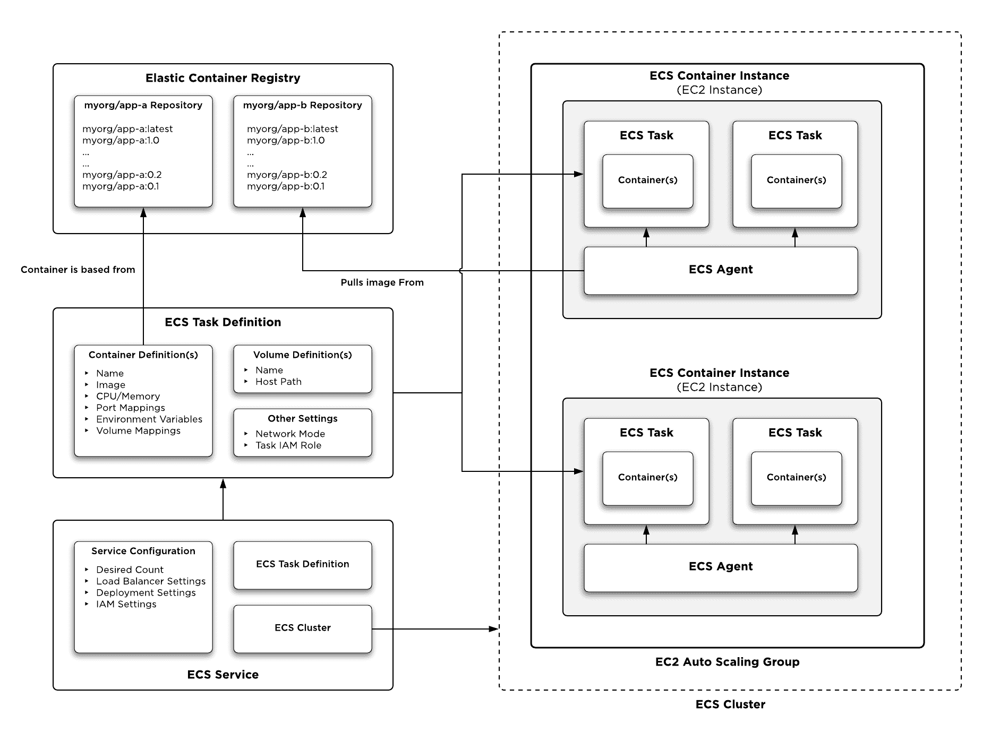
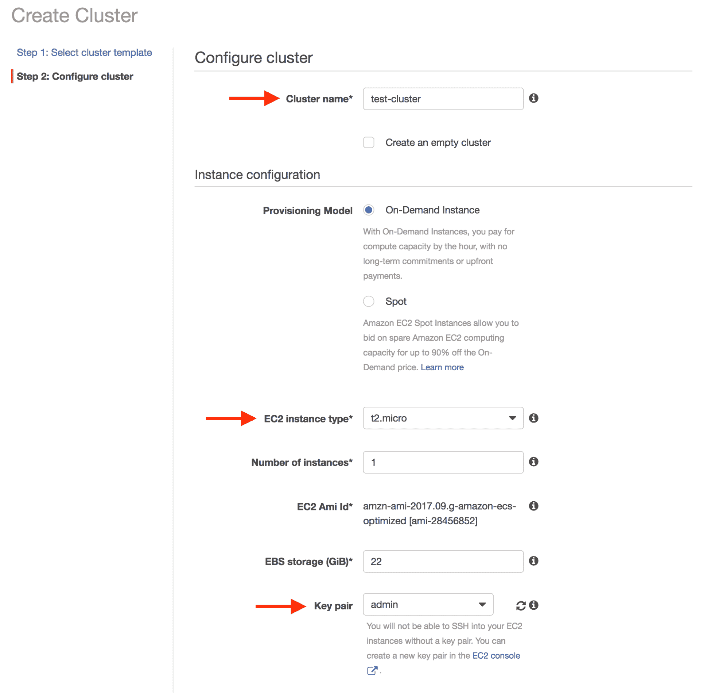
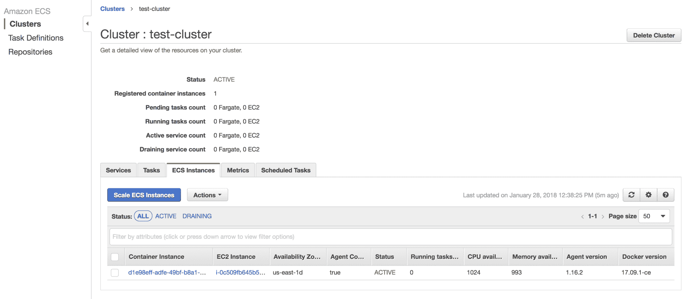
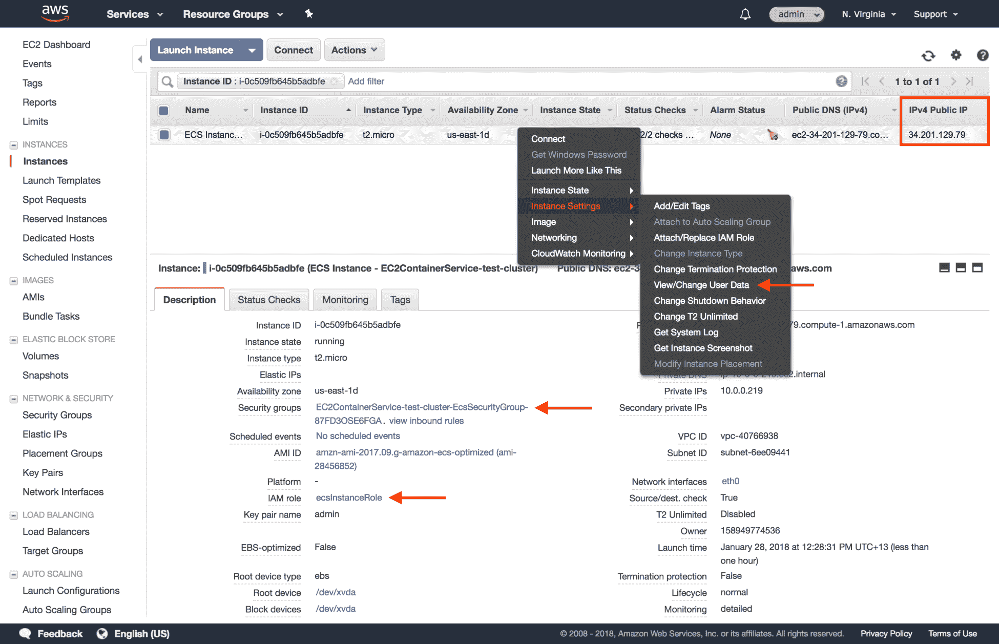
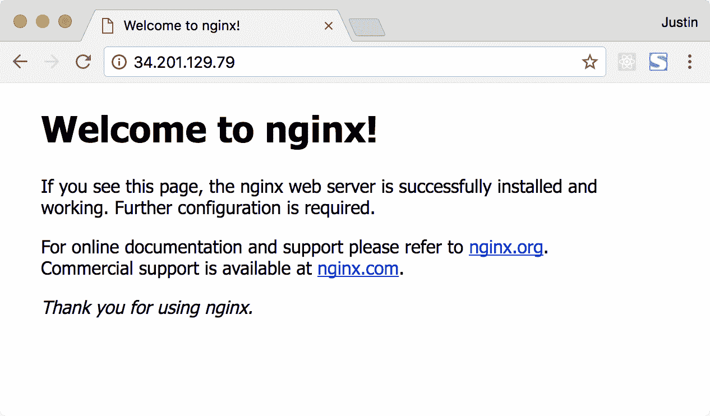
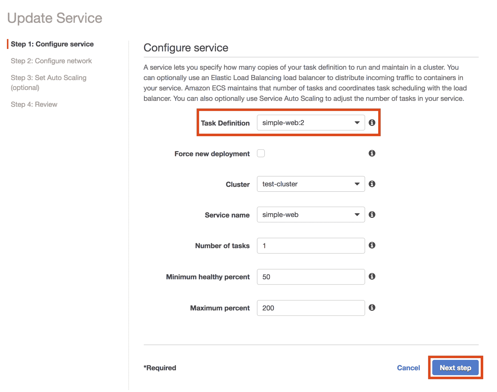
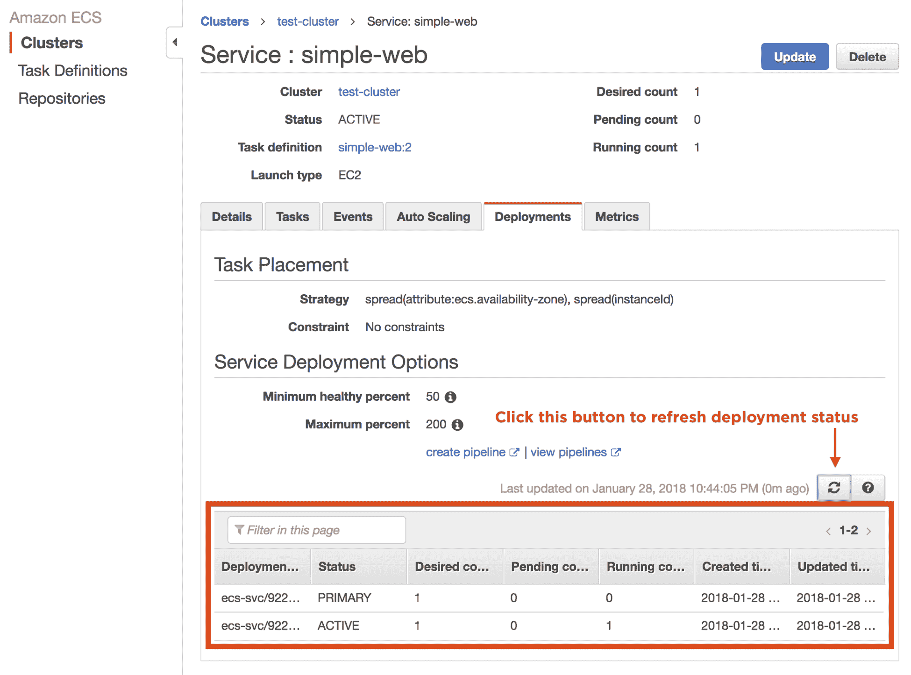
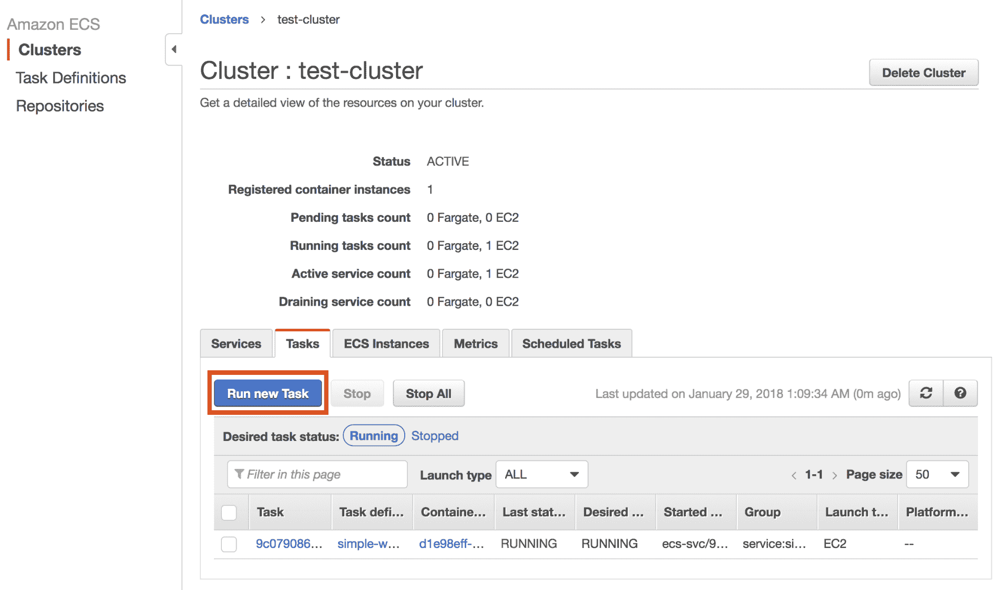

# 第四章：ECS 简介

弹性容器服务（ECS）是一项流行的 AWS 托管服务，为您的应用程序提供容器编排，并与各种 AWS 服务和工具集成。

在本章中，您将学习 ECS 的关键概念；ECS 的架构方式，并了解 ECS 的各个组件，包括弹性容器注册表（ECR），ECS 集群，ECS 容器实例，ECS 任务定义，ECS 任务和 ECS 服务。本章的重点将是使用 AWS 控制台创建您的第一个 ECS 集群，定义 ECS 任务定义，并配置 ECS 服务以部署您的第一个容器应用程序到 ECS。您将更仔细地了解 ECS 集群是如何由 ECS 容器实例形成的，并检查 ECS 容器实例的内部，以进一步了解 ECS 如何与您的基础架构连接以及如何部署和管理容器。最后，您将介绍 ECS 命令行界面（CLI），这是一个有用的工具，可以快速搭建 ECS 集群，任务定义和服务，它使用流行的 Docker Compose 格式来定义您的容器和服务。

将涵盖以下主题：

+   ECS 架构

+   创建 ECS 集群

+   理解 ECS 容器实例

+   创建 ECS 任务定义

+   创建 ECS 服务

+   部署 ECS 服务

+   运行 ECS 任务

+   使用 ECS CLI

# 技术要求

以下是完成本章所需的技术要求：

+   Docker Engine 18.06 或更高版本

+   Docker Compose 1.22 或更高版本

+   jq

+   对 AWS 账户的管理员访问权限

+   根据第三章的说明配置本地 AWS 配置文件

+   在第二章中配置的示例应用程序的工作 Docker 工作流程（请参阅[`github.com/docker-in-aws/docker-in-aws/tree/master/ch2`](https://github.com/docker-in-aws/docker-in-aws/tree/master/ch2)）。

以下 GitHub URL 包含本章中使用的代码示例：[`github.com/docker-in-aws/docker-in-aws/tree/master/ch4`](https://github.com/docker-in-aws/docker-in-aws/tree/master/ch4)。

查看以下视频以查看代码实际操作：

[`bit.ly/2MTG1n3`](http://bit.ly/2MTG1n3)

# ECS 架构

ECS 是 AWS 托管服务，为您提供了构建在 AWS 中部署和操作容器应用程序的核心构建块。

在 2017 年 12 月之前，弹性容器服务被称为 EC2 容器服务。

ECS 允许您：

+   构建和发布您的 Docker 镜像到私有仓库

+   创建描述容器镜像、配置和运行应用程序所需资源的定义。

+   使用您自己的 EC2 基础设施或使用 AWS 托管基础设施启动和运行您的容器

+   管理和监视您的容器

+   编排滚动部署新版本或修订您的容器应用程序

为了提供这些功能，ECS 包括以下图表中说明的一些组件，并在下表中描述：

| 组件 | 描述 |
| --- | --- |
| 弹性容器注册表（ECR） | 提供安全的私有 Docker 镜像仓库，您可以在其中发布和拉取您的 Docker 镜像。我们将在第五章中深入研究 ECR，*使用 ECR 发布 Docker 镜像*。 |
| ECS 集群 | 运行您的容器应用程序的 ECS 容器实例的集合。 |
| ECS 容器实例 | 运行 Docker 引擎和 ECS 代理的 EC2 实例，该代理与 AWS ECS 服务通信，并允许 ECS 管理容器应用程序的生命周期。每个 ECS 容器实例都加入到单个 ECS 集群中。 |
| ECS 代理 | 以 Docker 容器的形式运行的软件组件，与 AWS ECS 服务通信。代理负责代表 ECS 管理 Docker 引擎，从注册表中拉取 Docker 镜像，启动和停止 ECS 任务，并向 ECS 发布指标。 |
| ECS 任务定义 | 定义组成您的应用程序的一个或多个容器和相关资源。每个容器定义包括指定容器镜像、应分配给容器的 CPU 和内存量、运行时环境变量等许多配置选项的信息。 |
| ECS 任务 | ECS 任务是 ECS 任务定义的运行时表现，代表在给定 ECS 集群上运行的任务定义中定义的容器。ECS 任务可以作为短暂的临时任务运行，也可以作为长期任务运行，这些任务是 ECS 服务的构建块。 |
| ECS 服务 | ECS 服务定义了在给定的 ECS 集群上运行的一个或多个长期运行的 ECS 任务实例，并代表您通常会考虑为您的应用程序或微服务实例。ECS 服务定义了一个 ECS 任务定义，针对一个 ECS 集群，并且还包括一个期望的计数，它定义了与服务关联的基于 ECS 任务定义的实例或 ECS 任务的数量。您的 ECS 服务可以与 AWS 弹性负载均衡服务集成，这允许您为您的 ECS 服务提供高可用的、负载均衡的服务端点，并且还支持新版本应用程序的滚动部署。 |
| AWS ECS | 管理 ECS 架构中的所有组件。提供管理 ECS 代理的服务端点，与其他 AWS 服务集成，并允许客户管理其 ECR 存储库、ECS 任务定义和 ECS 集群。 |

随着我们在本章中的进展，参考以下图表以获得各种 ECS 组件之间关系的视觉概述。

ECS 架构

# 创建 ECS 集群

为了帮助您了解 ECS 的基础知识，我们将通过 AWS 控制台逐步进行一系列配置任务。

我们首先将创建一个 ECS 集群，这是一组将运行您的容器应用程序的 ECS 容器实例，并且通常与 EC2 自动扩展组密切相关，如下图所示。

可以通过以下步骤执行创建 ECS 集群的操作：

本章中的所有 AWS 控制台配置示例都基于您已登录到 AWS 控制台并假定了适当的管理角色，如在第三章“开始使用 AWS”中所述。撰写本章时，本节中描述的任务特定于 us-east-1（北弗吉尼亚）地区，因此在继续之前，请确保您已在 AWS 控制台中选择了该地区。

1.  从主 AWS 控制台中，在计算部分中选择“服务”|“弹性容器服务”。

1.  如果您以前没有在您的 AWS 账户和地区中使用或配置过 ECS，您将看到一个欢迎屏幕，并且可以通过单击“开始”按钮来调用一个入门配置向导。

1.  在撰写本文时，入门向导只允许您使用 Fargate 部署类型开始。我们将在后面的章节中了解有关 Fargate 的信息，因此请滚动到屏幕底部，然后单击**取消**。

1.  您将返回到 ECS 控制台，现在可以通过单击**创建集群**按钮开始创建 ECS 集群。

1.  在**选择集群模板**屏幕上，选择**EC2 Linux + Networking**模板，该模板将通过启动基于特殊的 ECS 优化 Amazon 机器映像（AMI）的 EC2 实例来设置网络资源和支持 Linux 的 Docker 的 EC2 自动扩展组，我们稍后将了解更多信息。完成后，单击**下一步**继续。

1.  在**配置集群**屏幕上，配置一个名为**test-cluster**的集群名称，确保**EC2 实例类型**设置为**t2.micro**以符合免费使用条件，并将**密钥对**设置为您在早期章节中创建的 EC2 密钥对。请注意，将创建新的 VPC 和子网，以及允许来自互联网（`0.0.0.0/0`）的入站 Web 访问（TCP 端口`80`）的安全组。完成后，单击**创建**开始创建集群：

配置 ECS 集群

1.  此时，将显示启动状态屏幕，并将创建一些必要的资源来支持您的 ECS 集群。完成集群创建后，单击**查看集群**按钮继续。

现在，您将转到刚刚创建的`test-cluster`的详细信息屏幕。恭喜 - 您已成功部署了第一个 ECS 集群！

集群详细信息屏幕为您提供有关 ECS 集群的配置和操作数据 - 例如，如果您单击**ECS 实例**选项卡，则会显示集群中每个 ECS 容器实例的列表：

ECS 集群详细信息

您可以看到向导创建了一个单个容器实例，该实例正在从部署到显示的可用区的 EC2 实例上运行。请注意，您还可以查看有关 ECS 容器实例的其他信息，例如 ECS 代理版本和状态、运行任务、CPU/内存使用情况，以及 Docker Engine 的版本。

ECS 集群没有比这更多的东西——它本质上是一组 ECS 容器实例，这些实例又是运行 Docker 引擎以及提供 CPU、内存和网络资源来运行容器的 EC2 实例。

# 理解 ECS 容器实例

使用 AWS 控制台提供的向导创建 ECS 集群非常容易，但是显然，在幕后进行了很多工作来使您的 ECS 集群正常运行。本入门章节范围之外的所有创建资源的讨论都是不在讨论范围内的，但是在这个阶段，集中关注 ECS 容器实例并对其进行进一步详细检查是有用的，因为它们共同构成了 ECS 集群的核心。

# 加入 ECS 集群

当 ECS 创建集群向导启动实例并创建我们的 ECS 集群时，您可能会想知道 ECS 容器实例如何加入 ECS 集群。这个问题的答案非常简单，可以通过单击新创建集群中 ECS 容器实例的 EC2 实例 ID 链接来轻松理解。

此链接将带您转到 EC2 仪表板，其中选择了与容器实例关联的 EC2 实例，如下一个屏幕截图所示。请注意，我已经突出显示了一些元素，我们在讨论 ECS 容器实例时将会回顾到它们：

EC2 实例详情

如果您右键单击实例并选择**实例设置** | **查看/更改用户数据**（参见上一个屏幕截图），您将看到实例的用户数据，这是在实例创建时运行的脚本，可用于帮助初始化您的 EC2 实例：

加入 ECS 集群的 EC2 实例用户数据脚本

通过入门向导配置的用户数据脚本显示在上一个屏幕截图中，正如您所看到的，这是一个非常简单的 bash 脚本，它将`ECS_CLUSTER=test-cluster`文本写入名为`/etc/ecs/ecs.config`的文件中。在这个例子中，回想一下，`test-cluster`是您为 ECS 集群配置的名称，因此在引用的 ECS 代理配置文件中的这一行配置告诉运行在 ECS 容器实例上的代理尝试注册到名为`test-cluster`的 ECS 集群。

`/etc/ecs/ecs.config`文件包含许多其他配置选项，我们将在第六章中进一步详细讨论*构建自定义 ECS 容器实例*。

# 授予加入 ECS 集群的访问权限

在上一个屏幕截图中，请注意连接到 ECS 集群不需要凭据—您可能会原谅认为 ECS 只允许任何 EC2 实例加入 ECS 集群，但当然这并不安全。

EC2 实例包括一个名为 IAM 实例配置文件的功能，它将 IAM 角色附加到定义实例可以执行的各种 AWS 服务操作的 EC2 实例上。在您的 EC2 实例的 EC2 仪表板中，您可以看到一个名为**ecsInstanceRole**的角色已分配给您的实例，如果您点击此角色，您将被带到 IAM 仪表板，显示该角色的**摘要**页面。

在**权限**选项卡中，您可以看到一个名为`AmazonEC2ContainerServiceforEC2Role`的 AWS 托管策略附加到该角色，如果您展开该策略，您可以看到与该策略相关的各种 IAM 权限，如下面的屏幕截图所示：

EC2 实例角色 IAM 策略

请注意，该策略允许`ecs:RegisterContainerInstance`操作，这是 ECS 容器实例加入 ECS 集群所需的 ECS 权限，并且该策略还授予了`ecs:CreateCluster`权限，这意味着尝试注册到当前不存在的 ECS 集群的 ECS 容器实例将自动创建一个新的集群。

还有一件需要注意的事情是，该策略适用于所有资源，由`"Resource": "*"`属性指定，这意味着分配了具有此策略的角色的任何 EC2 实例都能够加入您帐户和区域中的任何 ECS 集群。再次强调，这可能看起来不太安全，但请记住，这是一个旨在简化授予 ECS 容器实例所需权限的策略，在后面的章节中，我们将讨论如何创建自定义 IAM 角色和策略，以限制特定 ECS 容器实例可以加入哪些 ECS 集群。

# 管理 ECS 容器实例

通常，ECS 容器实例应该是自管理的，需要很少的直接管理，但是总会有一些时候你需要排查你的 ECS 容器实例，因此学习如何连接到你的 ECS 容器实例并了解 ECS 容器实例内部发生了什么是很有用的。

# 连接到 ECS 容器实例

ECS 容器实例是常规的 Linux 主机，因此您可能期望，连接到您的实例只是意味着能够与实例建立安全外壳（SSH）会话：

1.  如果您在 EC2 仪表板中导航回到您的实例，我们首先需要配置附加到您的实例的安全组，以允许入站 SSH 访问。您可以通过点击安全组，选择入站选项卡，然后点击**编辑按钮**来修改安全组的入站规则来实现这一点。

1.  在**编辑入站规则**对话框中，点击**添加规则**按钮，并使用以下设置添加新规则：

+   协议：TCP

+   端口范围：22

+   来源：我的 IP

为 SSH 访问添加安全组规则

1.  点击**保存**后，您将允许来自您的公共 IP 地址的入站 SSH 访问到 ECS 容器实例。如果您在浏览器中返回到您的 EC2 实例，现在您可以复制公共 IP 地址并 SSH 到您的实例。

以下示例演示了如何建立与实例的 SSH 连接，使用`-i`标志引用与实例关联的 EC2 密钥对的私钥。您还需要使用用户名`ec2-user`登录，这是 Amazon Linux 中包含的默认非 root 用户：

```
> ssh -i ~/.ssh/admin.pem ec2-user@34.201.120.79
The authenticity of host '34.201.120.79 (34.201.120.79)' can't be established.
ECDSA key fingerprint is SHA256:c/MniTAq931tJj8bCVtRUP9gixM/ZXZSqDuMENqpod0.
Are you sure you want to continue connecting (yes/no)? yes
Warning: Permanently added '34.201.120.79' (ECDSA) to the list of known hosts.

   __| __| __|
   _| ( \__ \ Amazon ECS-Optimized Amazon Linux AMI 2017.09.g
 ____|\___|____/

For documentation visit, http://aws.amazon.com/documentation/ecs
5 package(s) needed for security, out of 7 available
Run "sudo yum update" to apply all updates.
```

首先要注意的是登录横幅指示此实例基于 Amazon ECS-Optimized Amazon Linux AMI，这是创建 ECS 容器实例时默认和推荐的 Amazon Machine Image（AMI）。AWS 定期维护此 AMI，并使用与 ECS 推荐使用的 Docker 和 ECS 代理版本定期更新，因此这是迄今为止最简单的用于 ECS 容器实例的平台，我强烈建议使用此 AMI 作为 ECS 容器实例的基础。

您可以在此处了解有关此 AMI 的更多信息：[`docs.aws.amazon.com/AmazonECS/latest/developerguide/ecs-optimized_AMI.html`](https://docs.aws.amazon.com/AmazonECS/latest/developerguide/ecs-optimized_AMI.html)。它包括每个 ECS 支持的区域的当前 AMI 映像 ID 列表。

在第六章中，*构建自定义 ECS 容器实例*，您将学习如何自定义和增强 Amazon ECS 优化的 Amazon Linux AMI。

# 检查本地 Docker 环境

正如您可能期望的那样，您的 ECS 容器实例将运行一个活动的 Docker 引擎，您可以通过运行`docker info`命令来收集有关其信息：

```
> docker info
Containers: 1
 Running: 1
 Paused: 0
 Stopped: 0
Images: 2
Server Version: 17.09.1-ce
Storage Driver: devicemapper
 Pool Name: docker-docker--pool
 Pool Blocksize: 524.3kB
 Base Device Size: 10.74GB
 Backing Filesystem: ext4
...
...
```

在这里，您可以看到实例正在运行 Docker 版本 17.09.1-ce，使用设备映射器存储驱动程序，并且当前只有一个容器正在运行。

现在让我们通过执行`docker container ps`命令来查看运行的容器：

```
> docker ps
CONTAINER ID   IMAGE                            COMMAND    CREATED          STATUS          NAMES
a1b1a89b5e9e   amazon/amazon-ecs-agent:latest   "/agent"   36 minutes ago   Up 36 minutes   ecs-agent
```

您可以看到 ECS 代理实际上作为一个名为`ecs-agent`的容器运行，这应该始终在您的 ECS 容器实例上运行，以便您的 ECS 容器实例由 ECS 管理。

# 检查 ECS 代理

如前所示，ECS 代理作为 Docker 容器运行，我们可以使用`docker container inspect`命令来收集有关此容器如何工作的一些见解。在先前的示例中，我们引用了 ECS 代理容器的名称，然后使用 Go 模板表达式以及`--format`标志来过滤命令输出，显示 ECS 代理容器到 ECS 容器实例主机的各种绑定挂载或卷映射。

在许多命令示例中，我正在将输出传输到`jq`实用程序，这是一个用于在命令行解析 JSON 输出的实用程序。 `jq`不是 Amazon Linux AMI 默认包含的，因此您需要通过运行`sudo yum install jq`命令来安装`jq`。

```
> docker container inspect ecs-agent --format '{{json .HostConfig.Binds}}' | jq
[
  "/var/run:/var/run",
  "/var/log/ecs:/log",
  "/var/lib/ecs/data:/data",
  "/etc/ecs:/etc/ecs",
  "/var/cache/ecs:/var/cache/ecs",
  "/cgroup:/sys/fs/cgroup",
  "/proc:/host/proc:ro",
  "/var/lib/ecs/dhclient:/var/lib/dhclient",
  "/lib64:/lib64:ro",
  "/sbin:/sbin:ro"
]
```

运行 docker container inspect 命令

请注意，将`/var/run`文件夹从主机映射到代理，这将允许 ECS 代理访问位于`/var/run/docker.sock`的 Docker 引擎套接字，从而允许 ECS 代理管理 Docker 引擎。您还可以看到 ECS 代理日志将写入 Docker 引擎主机文件系统上的`/var/log/ecs`。

# 验证 ECS 代理

ECS 代理包括一个本地 Web 服务器，可用于内省当前的 ECS 代理状态。

以下示例演示了使用`curl`命令内省 ECS 代理：

```
> curl -s localhost:51678 | jq
{
  "AvailableCommands": [
    "/v1/metadata",
    "/v1/tasks",
    "/license"
  ]
}
> curl -s localhost:51678/v1/metadata | jq
{
  "Cluster": "test-cluster",
  "ContainerInstanceArn": "arn:aws:ecs:us-east-1:385605022855:container-instance/f67cbfbd-1497-47c0-b56c-a910c923ba70",
  "Version": "Amazon ECS Agent - v1.16.2 (998c9b5)"
}
```

审查 ECS 代理

请注意，ECS 代理监听端口 51678，并提供三个可以查询的端点：

+   `/v1/metadata`：描述容器实例加入的集群、容器实例的 Amazon 资源名称（ARN）和 ECS 代理版本

+   `/v1/tasks`：返回当前正在运行的任务列表。目前我们还没有将任何 ECS 服务或任务部署到我们的集群，因此此列表为空

+   `/license`：提供适用于 ECS 代理软件的各种软件许可证

`/v1/metadata`端点特别有用，因为您可以使用此端点来确定 ECS 代理是否成功加入了给定的 ECS 集群。我们将在第六章中使用这一点，构建自定义 ECS 容器实例来执行实例创建的健康检查，以确保我们的实例已成功加入了正确的 ECS 集群。

# ECS 容器实例日志

每个 ECS 容器实例都包括可帮助排除故障的日志文件。

您将处理的主要日志包括以下内容：

+   Docker 引擎日志：位于`/var/log/docker`

+   ECS 代理日志：位于`/var/log/ecs`

请注意，有两种类型的 ECS 代理日志：

+   初始化日志：位于`/var/log/ecs/ecs-init.log`，这些日志提供与`ecs-init`服务相关的输出，这是一个 Upstart 服务，确保 ECS 代理在容器实例启动时运行。

+   代理日志：位于`/var/log/ecs/ecs-agent.log.*`，这些日志提供与 ECS 代理操作相关的输出。这些日志是您检查任何与 ECS 代理相关问题的最常见日志。

# 创建 ECS 任务定义

现在您已经设置了 ECS 集群并了解了 ECS 容器实例如何注册到集群，现在是时候配置 ECS 任务定义了，该定义定义了您要为应用程序部署的容器的配置。ECS 任务定义可以定义一个或多个容器，以及其他元素，例如容器可能需要读取或写入的卷。

为了简化问题，我们将创建一个非常基本的任务定义，该任务将运行官方的 Nginx Docker 镜像，该镜像发布在[`hub.docker.com/_/nginx/`](https://hub.docker.com/_/nginx/)。Nginx 是一个流行的 Web 服务器，默认情况下将提供欢迎页面，现在这足以代表一个简单的 Web 应用程序。

现在，让我们通过执行以下步骤为我们的简单 Web 应用程序创建一个 ECS 任务定义：

1.  在 ECS 控制台上导航到**服务** | **弹性容器服务**。您可以通过从左侧菜单中选择**任务定义**并单击**创建新任务定义**按钮来创建一个新的任务定义。

1.  在**选择启动类型兼容性**屏幕上，选择**EC2 启动类型**，这将配置任务定义在基于您拥有和管理的基础设施上启动 ECS 集群。

1.  在**配置任务和容器定义**屏幕上，配置**任务定义名称**为**simple-web**，然后向下滚动并单击**添加容器**以添加新的容器定义。

1.  在**添加容器**屏幕上，配置以下设置，完成后单击**添加按钮**以创建容器定义。此容器定义将在 ECS 容器主机上将端口 80 映射到容器中的端口`80`，允许从外部世界访问 Nginx Web 服务器：

+   **容器名称**：nginx

+   **镜像**：nginx

+   **内存限制**：`250` MB 硬限制

+   **端口映射**：主机端口`80`，容器端口`80`，协议 tcp：

创建容器定义

1.  通过单击**配置任务和容器定义**页面底部的**创建**按钮完成任务定义的创建。

# 创建 ECS 服务

我们已经创建了一个 ECS 集群，并配置了一个 ECS 任务定义，其中包括一个运行 Nginx 的单个容器，具有适当的端口映射配置，以将 Nginx Web 服务器暴露给外部世界。

现在我们需要定义一个 ECS 服务，这将配置 ECS 以部署一个或多个实例到我们的 ECS 集群。ECS 服务将给定的 ECS 任务定义部署到给定的 ECS 集群，允许您配置要运行多少个实例（ECS 任务）的引用 ECS 任务定义，并控制更高级的功能，如负载均衡器集成和应用程序的滚动更新。

要创建一个新的 ECS 服务，请完成以下步骤：

1.  在 ECS 控制台上，从左侧选择集群，然后单击您在本章前面创建的**test-cluster**：

选择要创建 ECS 服务的 ECS 集群

1.  在集群详细信息页面，选择**服务**选项卡，然后点击**创建**来创建一个新服务。

1.  在配置服务屏幕上，配置以下设置，完成后点击**下一步**按钮。请注意，我们在本章前面创建的任务定义和 ECS 集群都有所提及：

+   **启动类型**：EC2

+   **任务定义**：simple-web:1

+   **集群**：test-cluster

+   **服务名称**：simple-web

+   **任务数量**：1

1.  ECS 服务配置设置的其余部分是可选的。继续点击**下一步**，直到到达**审阅**屏幕，在那里您可以审阅您的设置并点击**创建服务**来完成 ECS 服务的创建。

1.  **启动状态**屏幕现在将出现，一旦您的服务已创建，点击**查看服务**按钮。

1.  服务详细信息屏幕现在将出现在您的新 ECS 服务中，您应该看到一个处于运行状态的单个 ECS 任务，这意味着与 simple-web ECS 任务定义相关联的 Nginx 容器已成功启动：

完成新 ECS 服务的创建

此时，您现在应该能够浏览到您新部署的 Nginx Web 服务器，您可以通过浏览到您之前作为 ECS 集群的一部分创建的 ECS 容器实例的公共 IP 地址来验证。如果一切正常，您应该会看到默认的**欢迎使用 nginx**页面，如下截图所示：

浏览到 Nginx Web 服务器

# 部署 ECS 服务

现在您已成功创建了一个 ECS 服务，让我们来看看 ECS 如何管理容器应用的新部署。重要的是要理解，ECS 任务定义是不可变的—也就是说，一旦创建了任务定义，就不能修改任务定义，而是需要创建一个全新的任务定义或创建当前任务定义的*修订版*，您可以将其视为给定任务定义的新版本。

ECS 将 ECS 任务定义的逻辑名称定义为*family*，ECS 任务定义的给定修订版以*family*:*revision*的形式表示—例如，`my-task-definition:3`指的是*my-task-definition*家族的第 3 个修订版。

这意味着为了部署一个容器应用的新版本，您需要执行一些步骤：

1.  创建一个新的 ECS 任务定义修订，其中包含已更改为应用程序新版本的配置设置。这通常只是您为应用程序构建的 Docker 镜像关联的图像标签，但是任何配置更改，比如分配的内存或 CPU 资源的更改，都将导致创建 ECS 任务定义的新修订。

1.  更新您的 ECS 服务以使用 ECS 任务定义的新修订版。每当以这种方式更新 ECS 服务时，ECS 将自动执行应用程序的滚动更新，试图优雅地用基于新 ECS 任务定义修订的新容器替换组成 ECS 服务的每个运行容器。

为了演示这种行为，现在让我们修改本章前面创建的 ECS 任务定义，并通过以下步骤更新 ECS 服务：

1.  在 ECS 控制台中，从左侧选择任务定义，然后点击您之前创建的 simple-web 任务定义。

1.  注意，当前任务定义修订只有一个存在——在任务定义名称后的冒号后面标明修订号。例如，simple-web:1 指的是 simple-web 任务定义的修订 1。选择当前任务定义修订，然后点击创建新修订以基于现有任务定义修订创建新的修订。

1.  创建新的任务定义修订屏幕显示出来，这与您之前配置的创建新任务定义屏幕非常相似。滚动到容器定义部分，点击 Nginx 容器以修改 Nginx 容器定义。

1.  我们将对任务定义进行的更改是修改端口映射，从当前端口 80 的静态主机映射到主机上的动态端口映射。这可以通过简单地将主机端口设置为空来实现，在这种情况下，Docker 引擎将从基础 ECS 容器实例上的临时端口范围中分配动态端口。对于我们使用的 Amazon Linux AMI，此端口范围介于`32768`和`60999`之间。动态端口映射的好处是我们可以在同一主机上运行多个容器实例 - 如果静态端口映射已经存在，只能启动一个容器实例，因为随后的容器实例将尝试绑定到已使用的端口`80`。完成配置更改后，点击**更新**按钮继续。

1.  在**创建新的任务定义版本**屏幕的底部点击**创建**按钮，完成新版本的创建。

要获取 Docker 使用的临时端口范围，您可以检查`/proc/sys/net/ipv4/ip_local_port_range`文件的内容。如果您的操作系统上没有此文件，Docker 将使用`49153`到`65535`的端口范围。

此时，已从您的 ECS 任务定义创建了一个新版本（版本 2）。现在，您需要通过完成以下步骤来更新您的 ECS 服务以使用新的任务定义版本。

1.  在 ECS 控制台中，从左侧选择**集群**，选择您的测试集群。在服务选项卡上，选择您的 ECS 服务旁边的复选框，然后点击**更新**按钮。

1.  在配置服务屏幕上的任务定义下拉菜单中，您应该能够选择您刚刚创建的任务定义的新版本（simple-web:2）。完成后，继续点击**下一步**按钮，直到到达审阅屏幕，在这时您可以点击**更新服务**按钮完成配置更改：

修改 ECS 服务任务定义

1.  与您创建 ECS 服务时之前看到的类似，启动状态屏幕将显示。如果您点击**查看服务**按钮，您将进入 ECS 服务详细信息屏幕，如果选择部署选项卡，您应该看到正在部署的任务定义的新版本：

ECS 服务部署

请注意，有两个部署——活动部署显示现有的 ECS 服务部署，并指示当前有一个正在运行的容器。主要部署显示基于新修订的新 ECS 服务部署，并指示期望计数为 1，但请注意运行计数尚未为 1。

如果您定期刷新部署状态，您将能够观察到新任务定义修订版部署时的各种状态变化：

部署更改将会相当快速地进行，所以如果您没有看到任何这些更改，您可以随时更新 ECS 服务，以使用 ECS 任务定义的第一个修订版本来强制进行新的部署。

1.  主要部署应该指示挂起计数为 1，这意味着新版本的容器即将启动。

新部署待转换

1.  主要部署接下来将转换为运行计数为 1，这意味着新版本的容器正在与现有容器一起运行：

新部署运行转换

1.  在这一点上，现有容器现在可以停止，所以您应该看到活动部署的运行计数下降到零：

旧部署停止转换

1.  活动部署从部署选项卡中消失，滚动部署已完成：

滚动部署完成

在这一点上，我们已成功执行了 ECS 服务的滚动更新，值得指出的是，新的动态端口映射配置意味着您的 Nginx Web 服务器不再在端口 80 上对外界进行监听，而是在 ECS 容器实例动态选择的端口上进行监听。

您可以通过尝试浏览到您的 Nginx Web 服务器的公共 IP 地址来验证这一点——这应该会导致连接失败，因为 Web 服务器不再在端口 80 上运行。如果您选择**Tasks**选项卡，找到**simple-web** ECS 服务，您可以点击任务，找出我们的 Web 服务器现在正在监听的端口。

在扩展 Nginx 容器后，您可以看到在这种情况下，ECS 容器实例主机上的端口`32775`映射到 Nginx 容器上的端口`80`，但由于 ECS 容器实例分配的安全组仅允许在端口`80`上进行入站访问，因此您无法从互联网访问该端口。

为了使动态端口映射有用，您需要将您的 ECS 服务与应用程序负载均衡器相关联，负载均衡器将自动检测每个 ECS 服务实例的动态端口映射，并将传入的请求负载均衡到负载均衡器上定义的静态端口到每个 ECS 服务实例。您将在后面的章节中了解更多相关内容。ECS 服务动态端口映射

# 运行 ECS 任务

我们已经看到了如何将长时间运行的应用程序部署为 ECS 服务，但是如何使用 ECS 运行临时任务或短暂的容器呢？答案当然是创建一个 ECS 任务，通常用于运行临时任务，例如运行部署脚本，执行数据库迁移，或者执行定期批处理。

尽管 ECS 服务本质上是长时间运行的 ECS 任务，但 ECS 确实会对您自己创建的 ECS 任务与 ECS 服务进行不同的处理，如下表所述：

| 场景/特性 | ECS 服务行为 | ECS 任务行为 |
| --- | --- | --- |
| 容器停止或失败 | ECS 将始终尝试维护给定 ECS 服务的期望计数，并将尝试重新启动容器，如果活动计数由于容器停止或失败而低于期望计数。 | ECS 任务是一次性执行，要么成功，要么失败。ECS 永远不会尝试重新运行失败的 ECS 任务。 |
| 任务定义配置 | 您无法覆盖给定 ECS 服务的任何 ECS 任务定义配置。 | ECS 任务允许您覆盖环境变量和命令行设置，允许您利用单个 ECS 任务定义来运行各种不同类型的 ECS 任务。 |
| 负载均衡器集成 | ECS 服务具有与 AWS 弹性负载均衡服务的完全集成。 | ECS 任务不与任何负载均衡服务集成。 |

ECS 服务与 ECS 任务

让我们现在看看如何使用 AWS 控制台运行 ECS 任务。您将创建一个非常简单的 ECS 任务，该任务将在 ECS 任务定义中定义的 Nginx 镜像中运行`sleep 300`命令。

这将导致任务在执行之前休眠五分钟，模拟短暂的临时任务：

1.  在 ECS 控制台上，选择左侧的**集群**，然后单击名为**test-cluster**的集群。

1.  选择**任务**选项卡，单击**运行新任务**按钮以创建新的 ECS 任务：

运行 ECS 任务

1.  在**运行任务**屏幕上，首先选择**EC2**作为**启动类型**，并确保**任务定义**和**集群**设置正确配置。如果您展开**高级选项**部分，注意您可以为**nginx**容器指定容器覆盖。请注意，要配置命令覆盖，您必须以逗号分隔的格式提供要运行的命令及其任何参数，例如，要执行`sleep 300`命令，您必须配置**sleep,300**的命令覆盖。配置完成后，单击**运行任务**以执行新的 ECS 任务：

配置 ECS 任务

此时，您将返回到 ECS 集群的任务选项卡，您应该看到一个状态为**挂起**的新任务：

ECS 任务处于挂起状态

新任务应该很快转换为**运行**状态，如果我们让任务运行，它最终会在五分钟后退出。

现在让我们利用这个机会观察 ECS 任务在停止时的行为。如果您选择所有任务并单击**停止**按钮，系统将提示您确认是否要停止每个任务。确认要停止每个任务后，**任务**窗格应立即显示没有活动任务，然后单击刷新按钮几次后，您应该看到一个任务重新启动。这个任务是由 ECS 自动启动的，以保持 simple-web 服务的期望计数为 1。

# 使用 ECS CLI

在本章中，我们专注于使用 AWS 控制台来开始使用 ECS。AWS 编写和维护的另一个工具称为 ECS CLI，它允许您从命令行创建 ECS 集群并部署 ECS 任务和服务。

ECS CLI 与 AWS CLI 在许多方面不同，但主要区别包括：

+   ECS CLI 专注于与 ECS 交互，并且仅支持与为 ECS 提供支持资源的其他 AWS 服务进行交互，例如 AWS CloudFormation 和 EC2 服务。

+   ECS CLI 操作比 AWS CLI 操作更粗粒度。例如，ECS CLI 将编排创建 ECS 集群及其所有支持资源，就像您在本章前面使用的 ECS 集群向导的行为一样，而 AWS CLI 则专注于执行单个特定任务的更细粒度操作。

+   ECS CLI 是用 Golang 编写的，而 AWS CLI 是用 Python 编写的。这确实引入了一些行为差异——例如，ECS CLI 不支持启用了 MFA（多因素认证）的 AWS 配置文件的使用，这意味着您需要使用不需要 MFA 的 AWS 凭据和角色。

ECS CLI 的一个特别有用的功能是它支持 Docker Compose 文件的第 1 版和第 2 版，这意味着您可以使用 Docker Compose 来提供对多容器环境的通用描述。ECS CLI 还允许您使用基于 YAML 的配置文件来定义您的基础设施，因此可以被视为一个简单而功能强大的基础设施即代码工具。

一般来说，ECS CLI 对于快速搭建沙盒/开发环境以进行快速原型设计或测试非常有用。对于部署正式的非生产和生产环境，您应该使用诸如 Ansible、AWS CloudFormation 或 Terraform 等工具和服务，这些工具和服务提供了对您运行生产级环境所需的所有 AWS 资源的更广泛支持。

ECS CLI 包括完整的文档，您可以在 [`docs.aws.amazon.com/AmazonECS/latest/developerguide/ECS_CLI.html`](https://docs.aws.amazon.com/AmazonECS/latest/developerguide/ECS_CLI.html) 找到。您还可以查看 ECS CLI 源代码并在 [`github.com/aws/amazon-ecs-cli`](https://github.com/aws/amazon-ecs-cli) 上提出问题。

# 删除测试集群

此时，您应该按照 ECS 仪表板中的以下步骤删除本章中创建的测试集群：

1.  从集群中选择测试集群

1.  选择并更新 simple-web ECS 服务，使其期望计数为 0

1.  等待直到 simple-web ECS 任务计数下降到 0

1.  选择测试集群，然后单击删除集群按钮

# 摘要

在本章中，您了解了 ECS 架构，并了解了构成 ECS 的核心组件。您了解到 ECS 集群是一组 ECS 容器实例，这些实例在 EC2 自动扩展组实例上运行 Docker 引擎。AWS 为您提供了预构建的 ECS 优化 AMI，使得使用 ECS 能够快速启动和运行。每个 ECS 容器实例包括一个作为系统容器运行并与 ECS 通信的 ECS 代理，提供启动、停止和部署容器所需的管理和控制平面。

接下来，您创建了一个 ECS 任务定义，该定义定义了一个或多个容器和卷定义的集合，包括容器映像、环境变量和 CPU/内存资源分配等信息。有了您的 ECS 集群和 ECS 任务定义，您随后能够创建和配置一个 ECS 服务，引用 ECS 任务定义来定义 ECS 服务的容器配置，并将一个或多个实例的 ECS 服务定位到您的 ECS 集群。

ECS 支持滚动部署以更新容器应用程序，您可以通过简单地创建 ECS 任务定义的新版本，然后将定义与 ECS 服务关联来成功部署新的应用程序更改。

最后，您学会了如何使用 ECS CLI 简化创建 ECS 集群和服务，使用 Docker Compose 作为通用机制来定义任务定义和 ECS 服务。

在下一章中，您将更仔细地了解弹性容器注册表（ECR）服务，您将学习如何创建自己的私有 ECR 存储库，并将您的 Docker 映像发布到这些存储库。

# 问题

1.  列出三个在使用 ECS 运行长时间运行的 Docker 容器所需的 ECS 组件

1.  真/假：ECS 代理作为 upstart 服务运行

1.  在使用 ECS CLI 时，您使用什么配置文件格式来定义基础架构？

1.  真/假：您可以将两个实例的 ECS 任务部署到单个实例 ECS 集群并进行静态端口映射

1.  真/假：ECS CLI 被认为是将 Docker 环境部署到生产环境的最佳工具

1.  使用 ECS 运行每晚运行 15 分钟的批处理作业时，您将配置什么？

1.  真/假：ECS 任务定义是可变的，可以修改

1.  真/假：您可以通过运行`curl localhost:51678`命令来检查给定 Docker Engine 上代理的当前状态

# 更多信息

您可以查看以下链接以获取有关本章涵盖的主题的更多信息：

+   ECS 开发人员指南：[`docs.aws.amazon.com/AmazonECS/latest/developerguide/Welcome.html`](https://docs.aws.amazon.com/AmazonECS/latest/developerguide/Welcome.html)

+   Amazon ECS-Optimized AMI：[`docs.aws.amazon.com/AmazonECS/latest/developerguide/ecs-optimized_AMI.html`](https://docs.aws.amazon.com/AmazonECS/latest/developerguide/ecs-optimized_AMI.html)

+   ECS 容器实例所需的权限：[`docs.aws.amazon.com/AmazonECS/latest/developerguide/instance_IAM_role.html`](https://docs.aws.amazon.com/AmazonECS/latest/developerguide/instance_IAM_role.html)

+   ECS 代理文档：[`docs.aws.amazon.com/AmazonECS/latest/developerguide/ECS_agent.html`](https://docs.aws.amazon.com/AmazonECS/latest/developerguide/ECS_agent.html)

+   使用 ECS CLI：[`docs.aws.amazon.com/AmazonECS/latest/developerguide/ECS_CLI.html`](https://docs.aws.amazon.com/AmazonECS/latest/developerguide/ECS_CLI.html)

+   ECS 代理 GitHub 存储库：[`github.com/aws/amazon-ecs-agent`](https://github.com/aws/amazon-ecs-agent)

+   ECS init GitHub 存储库：[`github.com/aws/amazon-ecs-init`](https://github.com/aws/amazon-ecs-init)

+   ECS CLI GitHub 存储库：[`github.com/aws/amazon-ecs-cli`](https://github.com/aws/amazon-ecs-cli)
