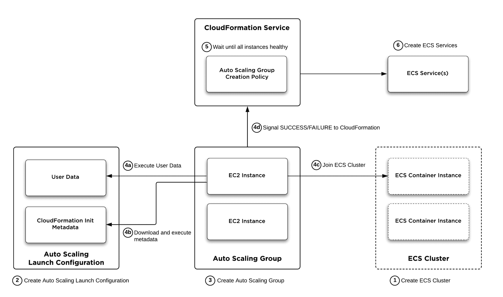
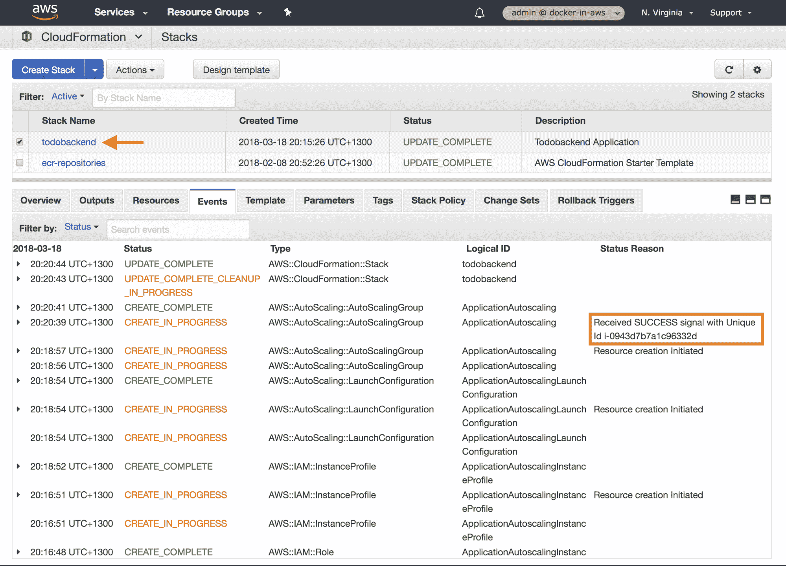

# 创建 ECS 集群

在上一章中，您学习了如何构建自定义 ECS 容器实例 Amazon Machine Image（AMI），介绍了您在生产实际用例中通常需要的功能，包括自定义存储配置、CloudWatch 日志支持以及与 CloudFormation 的集成。

在本章中，您将使用自定义机器映像构建 ECS 集群，该集群由基于您的自定义机器映像的 ECS 容器实例组成。与之前章节的方法不同，讨论配置 AWS 资源的各种方法，本章将专注于使用基础设施即代码的方法，并使用 CloudFormation 定义您的 ECS 集群和支持资源。

部署 ECS 集群的标准模型基于 EC2 自动扩展组，它由一组 EC2 实例组成，可以根据各种因素自动扩展或缩小。在 ECS 集群的用例中，EC2 自动扩展组是一组 ECS 容器实例，共同形成一个 ECS 集群，您可以将您的 ECS 服务和 ECS 任务部署到其中。您将学习如何定义 EC2 自动扩展组，定义控制您的 EC2 实例部署方式的启动配置，并配置 CloudFormation Init 元数据，该元数据允许您在实例创建时触发自定义初始化逻辑，并等待每个实例发出初始化成功的信号。最后，您将配置支持资源，如 IAM 实例配置文件和 EC2 安全组，然后创建您的 CloudFormation 堆栈，部署您的 ECS 集群和底层 EC2 自动扩展组。

将涵盖以下主题：

+   部署概述

+   定义 ECS 集群

+   配置 EC2 自动扩展组

+   定义 EC2 自动扩展启动配置

+   配置 CloudFormation Init Metadata

+   配置自动扩展组创建策略

+   配置 EC2 实例配置文件

+   配置 EC2 安全组

+   部署和测试 ECS 集群

# 技术要求

本章列出了完成本章所需的技术要求：

+   AWS 账户的管理员访问权限

+   根据第三章的说明配置本地 AWS 配置文件

+   AWS CLI

此 GitHub URL 包含本章中使用的代码示例：[`github.com/docker-in-aws/docker-in-aws/tree/master/ch7`](https://github.com/docker-in-aws/docker-in-aws/tree/master/ch7)[.](https://github.com/docker-in-aws/docker-in-aws/tree/master/ch4)

查看以下视频以查看代码实际运行情况：

[`bit.ly/2PaK6AM`](http://bit.ly/2PaK6AM)

# 部署概述

接下来两章的目标是建立支持基础设施和资源，以便使用 AWS 部署 Docker 应用程序。根据将基础设施定义为代码的最佳实践精神，您将定义一个 CloudFormation 模板，其中包括支持 Docker 应用程序在 ECS 中运行所需的所有 AWS 资源。随着您在每个章节中的进展，您将逐渐添加更多的资源，直到您拥有一个完整的解决方案，可以在 AWS 中使用 ECS 部署您的 Docker 应用程序。

考虑到这一点，本章的重点是学习如何使用 CloudFormation 构建 ECS 集群，正如您在之前的章节中已经学到的，ECS 集群是一组 ECS 容器实例，您可以在运行 ECS 服务或 ECS 任务时对其进行定位。

ECS 集群本身是非常简单的构造 - 它们只是定义了一组 ECS 容器实例和一个集群名称。然而，这些集群是如何形成的，涉及到更多的工作，并需要几个支持资源，包括以下内容：

+   **EC2 自动扩展组**：定义具有相同配置的 EC2 实例集合。

+   **EC2 自动扩展启动配置**：定义自动扩展组中新创建实例的启动配置。启动配置通常包括用户数据脚本，这些脚本在实例首次运行时执行，并可用于触发您在上一章中安装的 CloudFormation 助手脚本与 CloudFormation Init Metadata 交互的自定义机器映像。

+   **CloudFormation Init Metadata**：定义每个自动扩展组中的 EC2 实例在初始创建时应运行的初始化逻辑，例如运行配置命令、启用服务以及创建用户和组。CloudFormation Init Metadata 比用户数据提供的配置能力更强大，最重要的是，它为每个实例提供了一种向 CloudFormation 发出信号的机制，表明实例已成功配置自身。

+   **CloudFormation Creation Policy**：定义了确定 CloudFormation 何时可以将 EC2 自动扩展组视为已成功创建并继续在 CloudFormation 堆栈中提供其他依赖项的标准。这基于 CloudFormation 从 EC2 自动扩展组中的每个 EC2 实例接收到可配置数量的成功消息。

有其他方法可以形成 ECS 集群，但是对于大规模生产环境，通常希望使用 EC2 自动扩展组，并使用 CloudFormation 以及相关的 CloudFormation Init Metadata 和 Creation Policies 来以稳健、可重复、基础设施即代码的方式部署您的集群。

这些组件如何一起工作可能最好通过图表来描述，然后简要描述 ECS 集群是如何从这些组件中形成的，之后您将学习如何执行每个相关的配置任务，以创建自己的 ECS 集群。

以下图表说明了使用 EC2 自动扩展组和 CloudFormation 创建 ECS 集群的部署过程：

使用 EC2 自动扩展组和 CloudFormation 部署 ECS 集群的概述

在前面的图表中，一般的方法如下：

1.  作为 CloudFormation 部署的一部分，CloudFormation 确定已准备好开始创建配置的 ECS 集群资源。ECS 集群资源将被引用在 EC2 自动扩展启动配置资源中的 CloudFormation Init Metadata 中，因此必须首先创建此 ECS 集群资源。请注意，此时 ECS 集群为空，正在等待 ECS 容器实例加入集群。

1.  CloudFormation 创建了一个 EC2 自动扩展启动配置资源，该资源定义了 EC2 自动扩展组中每个 EC2 实例在实例创建时将应用的启动配置。启动配置包括一个用户数据脚本，该脚本调用安装在 EC2 实例上的 CloudFormation 辅助脚本，后者又下载定义了每个实例在创建时应执行的一系列命令和其他初始化操作的 CloudFormation Init Metadata。

1.  一旦启动配置资源被创建，CloudFormation 将创建 EC2 自动扩展组资源。自动扩展组的创建将触发 EC2 自动扩展服务在组中创建可配置的期望数量的 EC2 实例。

1.  每当 EC2 实例启动时，它会应用启动配置，执行用户数据脚本，并下载并执行 CloudFormation Init Metadata 中定义的配置任务。这将包括各种初始化任务，在我们的特定用例中，实例将执行您在上一章中添加到自定义机器映像中的第一次运行脚本，以加入配置的 ECS 集群，确保 CloudWatch 日志代理配置为记录到正确的 CloudWatch 日志组，启动和启用 Docker 和 ECS 代理，最后，验证 EC2 实例成功加入 ECS 集群，并向 CloudFormation 发出信号，表明 EC2 实例已成功启动。

1.  自动扩展组配置了创建策略，这是 CloudFormation 的一个特殊功能，它会导致 CloudFormation 等待直到从自动扩展组中的 EC2 实例接收到可配置数量的成功信号。通常，您将配置为 EC2 自动扩展组中的所有实例，确保所有实例成功加入 ECS 集群并且健康，然后才能继续其他的配置任务。

1.  在 ECS 集群中有正确数量的从 EC2 自动扩展组派生的 ECS 容器实例的情况下，CloudFormation 可以安全地配置其他需要健康的 ECS 集群的 ECS 资源。例如，您可以创建一个 ECS 服务，该服务将将您的容器应用程序部署到 ECS 集群中。

# 定义 ECS 集群

现在您已经了解了 ECS 集群配置过程的概述，让我们逐步进行所需的配置，以使 ECS 集群正常运行。

如部署概述所示，您将使用 CloudFormation 以基础设施即代码的方式创建资源，因为您刚刚开始这个旅程，您首先需要创建这个 CloudFormation 模板，我假设您正在根据第五章“使用 ECR 发布 Docker 镜像”中在**todobackend-aws**存储库中创建的文件`stack.yml`中定义，如下例所示：

```
> touch stack.yml
> tree .
.
├── ecr.yml
└── stack.yml

0 directories, 2 files
```

在 todobackend-aws 存储库中建立

您现在可以在`stack.yml`文件中建立一个基本的 CloudFormation 模板，并创建您的 ECS 集群资源：

```
AWSTemplateFormatVersion: "2010-09-09"

Description: Todobackend Application

Resources:
  ApplicationCluster:
    Type: AWS::ECS::Cluster
    Properties:
      ClusterName: todobackend-cluster
```

定义一个 CloudFormation 模板

如前面的示例所示，定义 ECS 集群非常简单，`AWS::ECS::Cluster`资源类型只有一个可选属性叫做`ClusterName`。确保您的环境配置了正确的 AWS 配置文件后，您现在可以使用`aws cloudformation deploy`命令创建和部署堆栈，并使用`aws ecs list-clusters`命令验证您的集群是否已创建，就像下面的示例中演示的那样：

```
> export AWS_PROFILE=docker-in-aws
> aws cloudformation deploy --template-file stack.yml --stack-name todobackend
Enter MFA code for arn:aws:iam::385605022855:mfa/justin.menga:

Waiting for changeset to be created..
Waiting for stack create/update to complete
Successfully created/updated stack - todobackend
> aws ecs list-clusters
{
    "clusterArns": [
        "arn:aws:ecs:us-east-1:385605022855:cluster/todobackend-cluster"
    ]
}
```

使用 CloudFormation 创建 ECS 集群

# 配置 EC2 自动扩展组

您已经建立了一个 ECS 集群，但如果没有 ECS 容器实例来提供容器运行时和计算资源，该集群就没有太多用处。此时，您可以创建单独的 ECS 容器实例并加入到集群中，但是，如果您需要运行需要支持数十甚至数百个容器的生产工作负载，根据集群当前资源需求动态添加和移除 ECS 容器实例，这种方法就不可行了。

AWS 提供的用于为 ECS 容器实例提供这种行为的机制是 EC2 自动扩展组，它作为一组具有相同配置的 EC2 实例的集合，被称为启动配置。EC2 自动扩展服务是 AWS 提供的托管服务，负责管理您的 EC2 自动扩展组和组成组的 EC2 实例的生命周期。这种机制提供了云的核心原则之一-弹性-并允许您根据应用程序的需求动态扩展或缩减服务您应用程序的 EC2 实例数量。

在 ECS 的背景下，您可以将 ECS 集群通常视为与 EC2 自动扩展组有密切关联，ECS 容器实例则是 EC2 自动扩展组中的 EC2 实例，其中 ECS 代理和 Docker 引擎是每个 EC2 实例上运行的应用程序。这并不完全正确，因为您可以拥有跨多个 EC2 自动扩展组的 ECS 集群，但通常情况下，您的 ECS 集群和 EC2 自动扩展组之间会有一对一的关系，ECS 容器实例与 EC2 实例直接关联。

现在您了解了 EC2 自动缩放组的基本背景以及它们与 ECS 的特定关系，重要的是要概述在创建 EC2 自动缩放组时需要与之交互的各种配置构造：

+   自动缩放组：定义了一组 EC2 实例，并为该组指定了最小、最大和期望的容量。

+   启动配置：启动配置定义了应用于每个 EC2 实例在实例创建时的通用配置。

+   CloudFormation Init 元数据：定义可以应用于实例创建的自定义初始化逻辑。

+   IAM 实例配置文件和角色：授予每个 EC2 实例与 ECS 服务交互和发布到 CloudWatch 日志的权限。

+   EC2 安全组：定义入站和出站网络策略规则。至少，这些规则必须允许每个 EC2 实例上运行的 ECS 代理与 ECS API 进行通信。

请注意，我正在提出一种自上而下的方法来定义 EC2 自动缩放组的要求，这在使用声明性基础设施即代码方法（例如 CloudFormation）时是可能的。在实际实现这些资源时，它们将以自下而上的方式应用，首先创建依赖项（例如安全组和 IAM 角色），然后创建启动配置，最后创建自动缩放组。当然，这是由 CloudFormation 处理的，因此我们可以专注于所需的状态配置，让 CloudFormation 处理满足所需状态的具体执行要求。

# 创建 EC2 自动缩放组

在创建 EC2 自动缩放组时，您需要定义的第一个资源是 EC2 自动缩放组本身，在 CloudFormation 术语中，它被定义为`AWS::AutoScaling::AutoScalingGroup`类型的资源。

```
AWSTemplateFormatVersion: "2010-09-09"

Description: Todobackend Application

Parameters:
  ApplicationDesiredCount:
 Type: Number
 Description: Desired EC2 instance count
  ApplicationSubnets:
 Type: List<AWS::EC2::Subnet::Id>
 Description: Target subnets for EC2 instances

Resources:
  ApplicationCluster:
    Type: AWS::ECS::Cluster
    Properties:
      ClusterName: todobackend-cluster
  ApplicationAutoscaling:
 Type: AWS::AutoScaling::AutoScalingGroup
 Properties:
 LaunchConfigurationName: !Ref ApplicationAutoscalingLaunchConfiguration
 MinSize: 0
 MaxSize: 4
 DesiredCapacity: !Ref ApplicationDesiredCount
 VPCZoneIdentifier: !Ref ApplicationSubnets
 Tags:
 - Key: Name
 Value: !Sub ${AWS::StackName}-ApplicationAutoscaling-instance
 PropagateAtLaunch: "true"
```

定义 EC2 自动缩放组

前面示例中的配置是满足定义 EC2 自动缩放组的最低要求的基本配置，如下所示：

+   `LaunchConfigurationName`：应该应用于组中每个实例的启动配置的名称。在前面的示例中，我们使用`Ref`内部函数的简写语法，结合一个名为`ApplicationAutoscalingLaunchConfiguration`的资源的名称，这是我们将很快定义的资源。

+   `MinSize`，`MaxSize`和`DesiredCapacity`：自动扩展组中实例的绝对最小值，绝对最大值和期望数量。EC2 自动扩展组将始终尝试保持期望数量的实例，尽管它可能根据您在`MinSize`和`MaxSize`属性的范围内的自己的标准暂时扩展或缩减实例的数量。在前面的示例中，您引用了一个名为`ApplicationDesiredCount`的参数，以定义期望的实例数量，具有缩减为零实例或扩展为最多四个实例的能力。

+   `VPCZoneIdentifier`：EC2 实例应部署到的目标子网列表。在前面的示例中，您引用了一个名为`ApplicationSubnets`的输入参数，它被定义为`List<AWS::EC2::Subnet::Id>`类型的参数。这可以简单地提供为逗号分隔的列表，您很快将看到定义这样一个列表的示例。

+   `Tags`：定义要附加到自动扩展组的一个或多个标记。至少，定义`Name`标记是有用的，以便您可以清楚地识别您的 EC2 实例，在前面的示例中，您使用`Fn::Sub`内在函数的简写形式来动态注入由`AWS::StackName`伪参数定义的堆栈名称。`PropagateAtLaunch`标记配置标记在每次 EC2 实例启动时附加，确保配置的名称对于每个实例都可见。

有关如何配置自动扩展组资源的更多信息，请参阅 AWS CloudFormation 文档（[`docs.aws.amazon.com/AWSCloudFormation/latest/UserGuide/aws-properties-as-group.html`](https://docs.aws.amazon.com/AWSCloudFormation/latest/UserGuide/aws-properties-as-group.html)）。

# 配置 CloudFormation 输入参数

在前面的示例中，您向 CloudFormation 模板添加了名为`ApplicationDesiredCount`和`ApplicationSubnets`的参数，您需要在部署模板时为其提供值。

`ApplicationDesiredCount`参数只需要是配置的 MinSize 和 MaxSize 属性之间的数字（即 0 和 4 之间），但是，要确定您帐户中子网 ID 的值，您可以使用`aws ec2 describe-subnets`命令，如下所示：

```
> aws ec2 describe-subnets --query "Subnets[].[SubnetId,AvailabilityZone]" --output table
-----------------------------------
| DescribeSubnets                 |
+------------------+--------------+
| subnet-a5d3ecee  | us-east-1a   |
| subnet-c2abdded  | us-east-1d   |
| subnet-aae11aa5  | us-east-1f   |
| subnet-fd3a43c2  | us-east-1e   |
| subnet-324e246f  | us-east-1b   |
| subnet-d281a2b6  | us-east-1c   |
+------------------+--------------+
```

使用 AWS CLI 查询子网

在前面的示例中，您使用了一个 JMESPath 查询表达式来选择每个子网的`SubnetId`和`AvailabilityZone`属性，并以表格格式显示输出。在这里，我们只是利用了为您的账户在默认 VPC 中创建的默认子网，但是根据您网络拓扑的性质，您可以使用在您的账户中定义的任何子网。

在这个例子中，我们将使用`us-east-1a`和`us-east-1b`可用区中的两个子网，你接下来的问题可能是，我们如何将这些值传递给 CloudFormation 堆栈？AWS CLI 目前只能通过命令行标志与`aws cloudformation deploy`命令一起提供输入参数的能力，然而，当您有大量堆栈输入并且想要持久化它们时，这种方法很快变得乏味和笨拙。

我们将采用的一个非常简单的方法是在`todobackend-aws`存储库的根目录下定义一个名为`dev.cfg`的配置文件中的各种输入参数：

```
ApplicationDesiredCount=1
ApplicationSubnets=subnet-a5d3ecee,subnet-324e246f
```

为堆栈参数定义一个配置文件 dev.cfg

配置文件的方法是在新的一行上以`<key>=<value>`格式添加每个参数，稍后在本章中，您将看到我们如何可以将此文件与`aws cloudformation deploy`命令一起使用。在前面的示例中，请注意我们将`ApplicationSubnets`参数值配置为逗号分隔的列表，这是在配置 CloudFormation 参数时配置任何列表类型的标准格式。

堆栈参数通常是特定于环境的，因此根据您的环境命名您的配置文件是有意义的。例如，如果您有开发和生产环境，您可能会分别称呼您的配置文件为`dev.cfg`和`prod.cfg`。

# 定义 EC2 自动扩展启动配置

尽管您已经定义了一个 EC2 自动扩展组资源，但是您还不能部署您的 CloudFormation 模板，因为自动扩展组引用了一个名为`ApplicationAutoscalingLaunchConfiguration`的资源，该资源尚未定义。

EC2 自动扩展启动配置定义了在启动时应用于每个实例的配置，并提供了一种确保自动扩展组中的每个实例保持一致的常见方法。

以下示例演示了在 CloudFormation 模板中配置自动扩展启动配置：

```
...
...
Parameters:
  ApplicationDesiredCount:
    Type: Number
    Description: Desired EC2 instance count
  ApplicationImageId:
 Type: String
 Description: ECS Amazon Machine Image (AMI) ID
  ApplicationSubnets:
    Type: List<AWS::EC2::Subnet::Id>
    Description: Target subnets for EC2 instances

Resources:
  ApplicationAutoscalingLaunchConfiguration:
    Type: AWS::AutoScaling::LaunchConfiguration
 Properties:
 ImageId: !Ref ApplicationImageId
 InstanceType: t2.micro
 KeyName: admin
 IamInstanceProfile: !Ref ApplicationAutoscalingInstanceProfile
 SecurityGroups:
 - !Ref ApplicationAutoscalingSecurityGroup
 UserData:
 Fn::Base64:
 Fn::Sub: |
 #!/bin/bash
 /opt/aws/bin/cfn-init -v --stack ${AWS::StackName} \
 --resource ApplicationAutoscalingLaunchConfiguration \
 --region ${AWS::Region}
 /opt/aws/bin/cfn-signal -e $? --stack ${AWS::StackName} \
 --resource ApplicationAutoscaling \
 --region ${AWS::Region}
  ApplicationCluster:
    Type: AWS::ECS::Cluster
    Properties:
      ClusterName: todobackend-cluster
  ApplicationAutoscaling:
    Type: AWS::AutoScaling::AutoScalingGroup
    Properties:
      LaunchConfigurationName: !Ref ApplicationAutoscalingLaunchConfiguration
      MinSize: 0
      MaxSize: 4
      DesiredCapacity: !Ref ApplicationDesiredCount
      VPCZoneIdentifier: !Ref ApplicationSubnets
      Tags:
        - Key: Name
          Value: !Sub ${AWS::StackName}-ApplicationAutoscaling-instance
          PropagateAtLaunch: "true"
```

定义 EC2 自动扩展启动配置

请注意，您指定了`AWS::AutoScaling::LaunchConfiguration`资源类型，并为您的启动配置配置了以下属性：

+   `ImageId`: EC2 实例将从中启动的镜像的 AMI。对于我们的用例，您将使用在上一章中创建的 AMI。此属性引用了一个名为`ApplicationImageId`的新参数，因此您需要将此参数与自定义机器映像的 AMI ID 添加到`dev.cfg`文件中。

+   `InstanceType`: EC2 实例的实例系列和类型。

+   `KeyName`: 将被允许对每个 EC2 实例进行 SSH 访问的 EC2 密钥对。

+   `IamInstanceProfile`: 要附加到 EC2 实例的 IAM 实例配置文件。正如您在前几章中学到的，为了支持作为 ECS 容器实例的操作，IAM 实例配置文件必须授予 EC2 实例与 ECS 服务交互的权限。在前面的示例中，您引用了一个名为`ApplicationAutoscalingInstanceProfile`的资源，您将在本章后面创建。

+   `SecurityGroups`: 要附加到每个实例的 EC2 安全组。这些定义了应用于网络流量的入站和出站安全规则，至少必须允许与 ECS 服务、CloudWatch 日志服务和其他相关的 AWS 服务进行通信。同样，您引用了一个名为`ApplicationAutoscalingSecurityGroup`的资源，您将在本章后面创建。

+   `UserData`: 定义在实例创建时运行的用户数据脚本。这必须作为 Base64 编码的字符串提供，您可以使用`Fn::Base64`内在函数让 CloudFormation 自动执行此转换。您定义一个 bash 脚本，首先运行`cfn-init`命令，该命令将下载并执行与`ApplicationAutoscalingLaunchConfiguration`引用资源相关的 CloudFormation Init 元数据，然后运行`cfn-signal`命令来向 CloudFormation 发出信号，指示`cfn-init`是否成功运行（请注意，`cfn-signal`引用`AutoscalingGroup`资源，而不是`ApplicationAutoscalingLaunchConfiguration`资源）。

注意使用`Fn::Sub`函数后跟管道运算符(`|`)，这使您可以输入自由格式文本，该文本将遵守所有换行符，并允许您使用`AWS::StackName`和`AWS::Region`伪参数引用正确的堆栈名称和 AWS 区域。

您可能会注意到在 UserData bash 脚本中未设置`set -e`标志，这是有意为之的，因为我们希望`cfn-signal`脚本将`cfn-init`脚本的退出代码报告给 CloudFormation（由`-e $?`选项定义，其中`$?`输出最后一个进程的退出代码）。如果包括`set -e`，则如果`cfn-init`返回错误，脚本将立即退出，`cfn-signal`将无法向 CloudFormation 发出失败信号。

```
ApplicationDesiredCount=1 ApplicationImageId=ami-ec957491
ApplicationSubnets=subnet-a5d3ecee,subnet-324e246f
```

将 ApplicationImageId 参数添加到 dev.cfg 文件

# 配置 CloudFormation Init 元数据

到目前为止，在我们的堆栈中，您执行的最复杂的配置部分是`UserData`属性，作为自动扩展启动配置的一部分。

回想一下，在上一章中，当您创建了一个自定义机器映像时，您安装了`cfn-bootstrap` CloudFormation 助手脚本，其中包括在前面的示例中引用的`cfn-init`和`cfn-signal`脚本。这些脚本旨在与称为 CloudFormation Init 元数据的功能一起使用，我们将在下面的示例中进行配置，如下例所示：

```
...
...
Resources:
  ...
  ...
  ApplicationAutoscalingLaunchConfiguration:
    Type: AWS::AutoScaling::LaunchConfiguration
    Metadata:
 AWS::CloudFormation::Init:
 config:
 commands:            05_public_volume:
 command: mkdir -p /data/public
 06_public_volume_permissions:
 command: chown -R 1000:1000 /data/public
 10_first_run:
 command: sh firstrun.sh
 cwd: /home/ec2-user
 env:
                ECS_CLUSTER: !Ref ApplicationCluster
 STACK_NAME: !Ref AWS::StackName
 AUTOSCALING_GROUP: ApplicationAutoscaling
 AWS_DEFAULT_REGION: !Ref AWS::Region
    Properties:
      ImageId: !Ref ApplicationImageId
      InstanceType: t2.micro
      KeyName: admin
      IamInstanceProfile: !Ref ApplicationAutoscalingInstanceProfile
      SecurityGroups:
        - !Ref ApplicationAutoscalingSecurityGroup
      UserData:
        Fn::Base64:
          Fn::Sub: |
            #!/bin/bash
            /opt/aws/bin/cfn-init -v --stack ${AWS::StackName} \
              --resource ApplicationAutoscalingLaunchConfiguration \
              --region ${AWS::Region}
            /opt/aws/bin/cfn-signal -e $? --stack ${AWS::StackName} \
              --resource ApplicationAutoscaling \
              --region ${AWS::Region}
  ...
  ...
```

配置 CloudFormation Init 元数据

在上面的示例中，您可以看到 CloudFormation Init 元数据定义了一个包含`commands`指令的配置集，该指令定义了几个命令对象：

+   `05_public_volume` - 在我们定制的 ECS AMI 中创建一个名为`public`的文件夹，该文件夹位于`/data`挂载下。我们需要这个路径，因为我们的应用程序需要一个公共卷，静态文件将位于其中，而我们的应用程序以非 root 用户身份运行。稍后我们将创建一个 Docker 卷，该卷引用此路径，并注意因为 ECS 目前仅支持绑定挂载，所以需要预先在底层 Docker 主机上创建一个文件夹（有关更多详细信息，请参见[`github.com/aws/amazon-ecs-agent/issues/1123#issuecomment-405063273`](https://github.com/aws/amazon-ecs-agent/issues/1123#issuecomment-405063273)）。

+   `06_public_volume_permissions` - 这将更改前一个命令中创建的`/data/public`文件夹的所有权，使其由 ID 为 1000 的用户和组拥有。这是 todobackend 应用程序运行的相同用户 ID/组 ID，因此将允许应用程序读取和写入`/data/public`文件夹。

+   `10_first_run` - 在工作目录`/home/ec2-user`中运行`sh firstrun.sh`命令，回顾前一章提到的自定义机器镜像中包含的第一次运行脚本，用于在实例创建时执行自定义初始化任务。这个第一次运行脚本包括对许多环境变量的引用，这些环境变量在 CloudFormation Init 元数据的`env`属性下定义，并为第一次运行脚本提供适当的值。

为了进一步说明`10_first_run`脚本的工作原理，以下代码片段配置了 ECS 容器实例加入 ECS 集群，由`ECS_CLUSTER`环境变量定义：

```
#!/usr/bin/env bash
set -e

# Configure ECS Agent
echo "ECS_CLUSTER=${ECS_CLUSTER}" > /etc/ecs/ecs.config
...
...
```

第一次运行脚本片段

类似地，`STACK_NAME`、`AUTOSCALING_GROUP`和`AWS_DEFAULT_REGION`变量都用于配置 CloudWatch 日志代理：

```
...
...
# Write AWS Logs region
sudo tee /etc/awslogs/awscli.conf << EOF > /dev/null
[plugins]
cwlogs = cwlogs
[default]
region = ${AWS_DEFAULT_REGION}
EOF

# Write AWS Logs config
sudo tee /etc/awslogs/awslogs.conf << EOF > /dev/null
[general]
state_file = /var/lib/awslogs/agent-state 

[/var/log/dmesg]
file = /var/log/dmesg
log_group_name = /${STACK_NAME}/ec2/${AUTOSCALING_GROUP}/var/log/dmesg
log_stream_name = {instance_id}
...
...
```

第一次运行脚本片段

# 配置自动扩展组创建策略

在前一节中，您配置了用户数据脚本和 CloudFormation Init 元数据，以便您的 ECS 容器实例可以执行适合于给定目标环境的首次初始化和配置。虽然每个实例都会向 CloudFormation 发出 CloudFormation Init 过程的成功或失败信号，但您需要显式地配置 CloudFormation 等待每个自动扩展组中的实例发出成功信号，这一点非常重要，如果您希望确保在 ECS 集群注册或由于某种原因失败之前，不会尝试将 ECS 服务部署到 ECS 集群。

CloudFormation 包括一个称为创建策略的功能，允许您在创建 EC2 自动扩展组和 EC2 实例时指定可选的创建成功标准。当创建策略附加到 EC2 自动扩展组时，CloudFormation 将等待自动扩展组中的可配置数量的实例发出成功信号，然后再继续进行，这为我们提供了强大的能力，以确保您的 ECS 自动扩展组和相应的 ECS 集群处于健康状态，然后再继续创建 CloudFormation 堆栈中的其他资源。回想一下在上一章中，您自定义机器映像中第一次运行脚本的最后一步是查询本地 ECS 代理元数据，以验证实例是否已加入配置的 ECS 集群，因此，如果第一次运行脚本成功完成并且 cfn-signal 向 CloudFormation 发出成功信号，我们知道该实例已成功注册到 ECS 集群。

以下示例演示了如何在现有的 EC2 自动扩展组资源上配置创建策略：

```
Resources:
  ...
  ...
  ApplicationAutoscaling:
    Type: AWS::AutoScaling::AutoScalingGroup
    CreationPolicy:
 ResourceSignal:
 Count: !Ref ApplicationDesiredCount
 Timeout: PT15M
    Properties:
      LaunchConfigurationName: !Ref ApplicationAutoscalingLaunchConfiguration
      MinSize: 0
      MaxSize: 4
      DesiredCapacity: !Ref ApplicationDesiredCount
      VPCZoneIdentifier: !Split [",", !Ref ApplicationSubnets]
      Tags:
        - Key: Name
          Value: !Sub ${AWS::StackName}-ApplicationAutoscaling-instance
          PropagateAtLaunch: "true"
```

在 CloudFormation 中配置创建策略

正如您在前面的示例中所看到的，使用`CreationPolicy`属性配置创建策略，目前，这些策略只能为 EC2 自动扩展组资源、EC2 实例资源和另一种特殊类型的 CloudFormation 资源调用等待条件进行配置。

`ResourceSignal`对象包括一个`Count`属性，该属性定义了确定自动扩展组是否已成功创建所需的最小成功信号数量，并引用`ApplicationDesiredCount`参数，这意味着您期望自动扩展组中的所有实例都能成功创建。`Timeout`属性定义了等待所有成功信号的最长时间 - 如果在此时间范围内未满足配置的计数，则将认为自动扩展组未成功创建，并且堆栈部署将失败并回滚。此属性使用一种称为**ISO8601 持续时间格式**的特殊格式进行配置，`PT15M`的值表示 CloudFormation 将等待最多 15 分钟的所有成功信号。

# 配置 EC2 实例配置文件

在前面示例中定义的 EC2 自动扩展启动配置中，您引用了一个 IAM 实例配置文件，我们需要在堆栈中创建为一个单独的资源。EC2 实例配置文件允许您附加一个 IAM 角色，您的 EC2 实例可以使用该角色来访问 AWS 资源和服务，在 ECS 容器实例使用情况下。回想一下第四章，当您创建第一个 ECS 集群时，自动附加了一个 IAM 实例配置文件和相关的 IAM 角色，授予了各种 ECS 权限。

因为我们正在从头开始配置 ECS 集群和自动扩展组，我们需要明确定义适当的 IAM 实例配置文件和关联的 IAM 角色，就像以下示例中所示的那样：

```

Resources:
  ...
  ...
  ApplicationAutoscalingInstanceProfile:
 Type: AWS::IAM::InstanceProfile
 Properties:
 Roles:
 - Ref: ApplicationAutoscalingInstanceRole
 ApplicationAutoscalingInstanceRole:
 Type: AWS::IAM::Role
 Properties:
 AssumeRolePolicyDocument:
 Version: "2012-10-17"
 Statement:
 - Effect: Allow
 Principal:
 Service:
 - ec2.amazonaws.com
 Action:
 - sts:AssumeRole
 Policies:
 - PolicyName: ECSContainerInstancePermissions
 PolicyDocument: 
 Version: "2012-10-17"
 Statement:
 - Effect: Allow
 Action:
 - ecs:RegisterContainerInstance
 - ecs:DeregisterContainerInstance
                  - ecs:UpdateContainerInstancesState
 Resource: !Sub ${ApplicationCluster.Arn}
 - Effect: Allow
 Action:
 - ecs:DiscoverPollEndpoint
 - ecs:Submit*
 - ecs:Poll
 - ecs:StartTelemetrySession
 Resource: "*"
 - Effect: Allow
 Action: 
 - ecr:BatchCheckLayerAvailability
 - ecr:BatchGetImage
 - ecr:GetDownloadUrlForLayer
 - ecr:GetAuthorizationToken
 Resource: "*"
 - Effect: Allow
 Action:
 - logs:CreateLogGroup
 - logs:CreateLogStream
 - logs:PutLogEvents
 - logs:DescribeLogStreams
 Resource: !Sub arn:aws:logs:${AWS::Region}:${AWS::AccountId}:log-group:/${AWS::StackName}*
...
...
```

定义 IAM 实例配置文件和 IAM 角色

在前面的示例中，您不是附加`AmazonEC2ContainerServiceforEC2Role`托管策略，而是附加了一个定义了类似权限集的自定义策略，注意以下区别：

+   未授予创建集群的权限，因为您已经在堆栈中自己创建了 ECS 集群。

+   注册、注销和更新容器实例状态的权限仅限于您堆栈中定义的 ECS 集群。相比之下，`AmazonEC2ContainerServiceforEC2Role`角色授予您账户中所有集群的权限，因此您的自定义配置被认为更安全。

+   自定义策略授予`logs:CreateLogGroup`权限 - 即使日志组已经创建，CloudWatch 日志代理也需要此权限。在前面的示例中，我们将此权限限制为以当前堆栈名称为前缀的日志组，限制了这些权限的范围。

# 配置 EC2 安全组

您几乎已经完成了部署 ECS 集群和 EC2 自动扩展组所需的配置，但是我们还需要创建一个最终资源，即您之前在`ApplicationAutoscalingLaunchConfiguration`资源配置中引用的`ApplicationAutoscalingSecurityGroup`资源：

```
Parameters:
  ApplicationDesiredCount:
    Type: Number
    Description: Desired EC2 instance count
  ApplicationImageId:
    Type: String
    Description: ECS Amazon Machine Image (AMI) ID
  ApplicationSubnets:
    Type: List<AWS::EC2::Subnet::Id>
    Description: Target subnets for EC2 instances
  VpcId:
 Type: AWS::EC2::VPC::Id
 Description: Target VPC

Resources:
  ApplicationAutoscalingSecurityGroup:
 Type: AWS::EC2::SecurityGroup
 Properties:
 GroupDescription: !Sub ${AWS::StackName} Application Autoscaling Security Group
 VpcId: !Ref VpcId
 SecurityGroupIngress:
 - IpProtocol: tcp
 FromPort: 22
 ToPort: 22
 CidrIp: 0.0.0.0/0
 SecurityGroupEgress:
 - IpProtocol: udp
 FromPort: 53
 ToPort: 53
 CidrIp: 0.0.0.0/0
 - IpProtocol: tcp
 FromPort: 80
 ToPort: 80
 CidrIp: 0.0.0.0/0
 - IpProtocol: tcp
 FromPort: 443
 ToPort: 443
 CidrIp: 0.0.0.0/0
...
...
```

定义 EC2 安全组

在上面的示例中，您允许入站 SSH 访问您的实例，并允许您的实例访问互联网上的 DNS、HTTP 和 HTTPS 资源。这不是最安全的安全组配置，在生产用例中，您至少会将 SSH 访问限制在内部管理地址，但为了简化和演示目的，您配置了一组相当宽松的安全规则。

查找堆栈依赖的外部资源的物理标识符的更可扩展的方法是使用一个称为 CloudFormation exports 的功能，它允许您将有关资源的数据导出到其他堆栈。例如，您可以在一个名为 network-resources 的堆栈中定义所有网络资源，然后配置一个 CloudFormation 导出，将该堆栈创建的 VPC 资源的 VPC ID 导出。然后，可以通过使用`Fn::ImportValue`内部函数在其他 CloudFormation 堆栈中引用这些导出。有关此方法的更多详细信息，请参见[`docs.aws.amazon.com/AWSCloudFormation/latest/UserGuide/using-cfn-stack-exports.html`](https://docs.aws.amazon.com/AWSCloudFormation/latest/UserGuide/using-cfn-stack-exports.html)。

```
> aws ec2 describe-vpcs
{
    "Vpcs": [
        {
            "CidrBlock": "172.31.0.0/16",
            "DhcpOptionsId": "dopt-a037f9d8",
            "State": "available",
            "VpcId": "vpc-f8233a80",
            "InstanceTenancy": "default",
            "CidrBlockAssociationSet": [
                {
                    "AssociationId": "vpc-cidr-assoc-32524958",
                    "CidrBlock": "172.31.0.0/16",
                    "CidrBlockState": {
                        "State": "associated"
                    }
                }
```

```
            ],
            "IsDefault": true
        }
    ]
}
```

请注意，您还定义了一个新参数，称为 VPC ID，它指定将在其中创建安全组的 VPC 的 ID，您可以使用`aws ec2 describe-vpcs`命令获取默认 VPC 的 ID，该 VPC 默认在您的 AWS 账户中创建：确定您的 VPC ID

一旦您有了正确的 VPC ID 值，您需要更新您的`dev.cfg`文件，以包括`VpcId`参数和值：

```
ApplicationDesiredCount=1ApplicationImageId=ami-ec957491
ApplicationSubnets=subnet-a5d3ecee,subnet-324e246f
VpcId=vpc-f8233a80
```

在 dev.cfg 中配置 VpcId 参数

# 部署和测试 ECS 集群

您现在已经完成了 CloudFormation 模板的配置，是时候部署您在上一节中所做的更改了。请记住，您创建了一个单独的配置文件，名为`dev.cfg`，用于存储每个堆栈参数的值。以下示例演示了如何使用`aws cloudformation deploy`命令来部署您更新的堆栈并引用您的输入参数值：

```
> aws cloudformation deploy --template-file stack.yml \
 --stack-name todobackend --parameter-overrides $(cat dev.cfg) \
 --capabilities CAPABILITY_NAMED_IAM

Waiting for changeset to be created..
Waiting for stack create/update to complete
Successfully created/updated stack - todobackend
```

使用参数覆盖部署 CloudFormation 堆栈

在前面的例子中，您使用`--parameter-overrides`标志为模板期望的每个参数指定值。而不是每次手动输入这些值，您只需使用 bash 替换并列出本地`dev.cfg`文件的内容，该文件以正确的格式表示每个参数名称和值。

还要注意，因为您的 CloudFormation 堆栈现在包括 IAM 资源，您必须使用`--capabilities`标志，并将其值指定为`CAPABILITY_IAM`或`CAPABILITY_NAMED_IAM`。当您这样做时，您正在承认 CloudFormation 将代表您创建 IAM 资源，并且您授予权限。虽然只有在创建命名 IAM 资源时才需要指定`CAPABILITY_NAMED_IAM`值（我们没有），但我发现这样更通用，更不容易出错，总是引用这个值。

假设您的模板没有配置错误，您的堆栈应该可以成功部署，如果您浏览到 AWS 控制台中的 CloudFormation，选择 todobackend 堆栈，您可以查看堆栈部署过程中发生的各种事件：

查看 CloudFormation 部署状态

在前面的截图中，您可以看到 CloudFormation 在`20:18:56`开始创建一个自动扩展组，然后一分半钟后，在`20:20:39`，从自动扩展组中的单个 EC2 实例接收到一个成功的信号。这满足了接收所需数量的实例的创建策略标准，堆栈更新成功完成。

此时，您的 ECS 集群应该有一个注册和活动的 ECS 容器实例，您可以使用`aws ecs describe-cluster`命令来验证。

```
> aws ecs describe-clusters --cluster todobackend-cluster
{
    "clusters": [
        {
            "clusterArn": "arn:aws:ecs:us-east-1:385605022855:cluster/todobackend-cluster",
            "clusterName": "todobackend-cluster",
 "status": "ACTIVE",
 "registeredContainerInstancesCount": 1,
            "runningTasksCount": 0,
            "pendingTasksCount": 0,
            "activeServicesCount": 0,
            "statistics": []
        }
    ],
    "failures": []
}
```

验证 ECS 集群

在上一个例子中，您可以看到 ECS 集群有一个注册的 ECS 容器实例，集群的状态是活动的，这意味着您的 ECS 集群已准备好运行 ECS 任务和服务。

您还可以通过导航到 EC2 控制台，并从左侧菜单中选择自动扩展组来验证您的 EC2 自动扩展组是否正确创建：

验证 EC2 自动扩展组

在上一个截图中，请注意您的自动缩放组的名称包括堆栈名称（`todobackend`）、逻辑资源名称（`ApplicationAutoscaling`）和一个随机字符串值（`XFSR1DDVFG9J`）。这说明了 CloudFormation 的一个重要概念 - 如果您没有显式地为资源命名（假设资源具有`Name`或等效属性），那么 CloudFormation 将附加一个随机字符串以确保资源具有唯一的名称。

如果您按照并且配置您的堆栈没有任何错误，那么您的 CloudFormation 堆栈应该能够成功部署，就像之前的截图演示的那样。有可能，使用大约 150 行配置的 CloudFormation 模板，您会出现错误，您的 CloudFormation 部署将失败。如果您遇到问题并且无法解决部署问题，请参考此 GitHub URL 作为参考：[`github.com/docker-in-aws/docker-in-aws/blob/master/ch7/todobackend-aws`](https://github.com/docker-in-aws/docker-in-aws/blob/master/ch7/todobackend-aws)

# 摘要

在本章中，您学习了如何创建一个 ECS 集群，包括一个 EC2 自动缩放组和基于自定义 Amazon 机器映像的 ECS 容器实例，使用基础设施即代码的方法使用 CloudFormation 定义所有资源。

您了解了 ECS 集群如何简单地是 ECS 容器实例的逻辑分组，并由管理一组 EC2 实例的 EC2 自动缩放组组成。EC2 自动缩放组可以动态地进行缩放，您将 EC2 自动缩放启动配置附加到了您的自动缩放组，该配置为每个添加到组中的新 EC2 实例提供了一组通用的设置。

CloudFormation 为确保自动扩展组中的实例正确初始化提供了强大的功能，您学会了如何配置用户数据以调用您在自定义机器映像中安装的 CloudFormation 辅助脚本，然后下载附加到启动配置资源的 CloudFormation Init 元数据中定义的可配置初始化逻辑。一旦 CloudFormation Init 过程完成，辅助脚本会向 CloudFormation 发出初始化过程的成功或失败信号，并为自动扩展组配置了一个创建策略，该策略定义了必须报告成功的实例数量，以便将整个自动扩展组资源视为健康。

接下来，您需要将 IAM 实例配置文件和安全组附加到启动配置中，确保您的 ECS 容器实例具有与 ECS 服务交互，从 ECR 下载图像，将日志发布到 CloudWatch 日志以及与相关的 AWS API 端点通信所需的权限。

通过核心自动扩展组、启动配置和其他支持资源的部署，您成功地使用 CloudFormation 部署了您的集群，建立了运行 ECS 任务和服务所需的基础设施基础。在下一章中，您将在此基础上构建，扩展您的 CloudFormation 模板以定义 ECS 任务定义、ECS 服务和部署完整端到端应用环境所需的其他支持资源。

# 问题

1.  真/假：EC2 自动扩展组允许您为每个实例定义固定的 IP 地址。

1.  EC2 用户数据需要应用什么类型的编码？

1.  您如何在 CloudFormation 模板中引用当前的 AWS 区域？

1.  真/假：`Ref`内在函数只能引用 CloudFormation 模板中的资源。

1.  在使用 CloudFormation Init 元数据时，您需要在 EC2 实例上运行哪两个辅助脚本？

1.  您正在尝试使用亚马逊发布的标准 ECS 优化 AMI 创建 EC2 自动扩展组和 ECS 集群，但是您收到错误消息，指示没有实例注册到目标 ECS 集群，即使 CloudFormation 报告自动扩展组已创建。您如何解决这个问题？

1.  真/假：`aws cloudformation create`命令用于部署和更新 CloudFormation 堆栈。

1.  您正在尝试在没有默认互联网路由的私有子网中部署 ECS 集群，但是集群中的 ECS 容器实例未能注册到 ECS。这最有可能的解释是什么？

# 进一步阅读

您可以查看以下链接，了解本章涵盖的主题的更多信息：

+   CloudFormation EC2 自动扩展组资源参考：[`docs.aws.amazon.com/AWSCloudFormation/latest/UserGuide/aws-properties-as-group.html`](https://docs.aws.amazon.com/AWSCloudFormation/latest/UserGuide/aws-properties-as-group.html)

+   CloudFormation EC2 自动扩展启动配置资源参考：[`docs.aws.amazon.com/AWSCloudFormation/latest/UserGuide/aws-properties-as-launchconfig.html`](https://docs.aws.amazon.com/AWSCloudFormation/latest/UserGuide/aws-properties-as-launchconfig.html)

+   CloudFormation IAM 实例配置文件资源参考：[`docs.aws.amazon.com/AWSCloudFormation/latest/UserGuide/aws-resource-iam-instanceprofile.html`](https://docs.aws.amazon.com/AWSCloudFormation/latest/UserGuide/aws-resource-iam-instanceprofile.html)

+   CloudFormation IAM 角色资源参考：[`docs.aws.amazon.com/AWSCloudFormation/latest/UserGuide/aws-resource-iam-role.html`](https://docs.aws.amazon.com/AWSCloudFormation/latest/UserGuide/aws-resource-iam-role.html)

+   CloudFormation EC2 安全组资源参考：[`docs.aws.amazon.com/AWSCloudFormation/latest/UserGuide/aws-properties-ec2-security-group.html`](https://docs.aws.amazon.com/AWSCloudFormation/latest/UserGuide/aws-properties-ec2-security-group.html)

+   Amazon ECS API 操作支持的资源级权限：[`docs.aws.amazon.com/AmazonECS/latest/developerguide/ecs-supported-iam-actions-resources.html`](https://docs.aws.amazon.com/AmazonECS/latest/developerguide/ecs-supported-iam-actions-resources.html)

+   CloudFormation 辅助脚本：[`docs.aws.amazon.com/AWSCloudFormation/latest/UserGuide/cfn-helper-scripts-reference.html`](https://docs.aws.amazon.com/AWSCloudFormation/latest/UserGuide/cfn-helper-scripts-reference.html)

+   CloudFormation Init Metadata Reference: [`docs.aws.amazon.com/AWSCloudFormation/latest/UserGuide/aws-resource-init.html`](https://docs.aws.amazon.com/AWSCloudFormation/latest/UserGuide/aws-resource-init.html)

+   CloudFormation 创建策略属性：[`docs.aws.amazon.com/AWSCloudFormation/latest/UserGuide/aws-attribute-creationpolicy.html`](https://docs.aws.amazon.com/AWSCloudFormation/latest/UserGuide/aws-attribute-creationpolicy.html)
