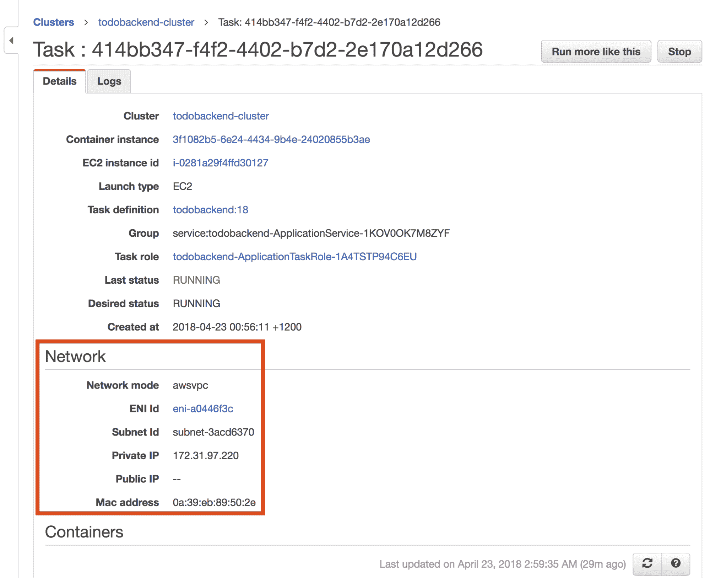

# 第十章：隔离网络访问

应用安全的基本组件是控制网络访问的能力，无论是应用内部还是应用外部。AWS 提供了 EC2 安全组，可以在每个网络接口上应用到您的 EC2 实例。这种机制对于部署到 EC2 实例的传统应用程序非常有效，但对于容器应用程序来说效果不佳，因为它们通常在共享的 EC2 实例上运行，并通过 EC2 实例上的共享主机接口进行通信。对于 ECS 来说，直到最近的方法是为您需要支持在给定 ECS 容器实例上运行的所有容器的网络安全需求应用两个安全组，这降低了安全规则的有效性，对于具有高安全要求的应用程序来说是不可接受的。直到最近，这种方法的唯一替代方案是为每个应用程序构建专用的 ECS 集群，以确保满足应用程序的安全要求，但这会增加额外的基础设施和运营开销。

AWS 在 2017 年底宣布了一项名为 ECS 任务网络的功能，引入了动态分配弹性网络接口（ENI）给您的 ECS 容器实例的能力，这个 ENI 专门用于给定的 ECS 任务。这使您能够为每个容器应用程序创建特定的安全组，并在同一 ECS 容器实例上同时运行这些应用程序，而不会影响安全性。

在本章中，您将学习如何配置 ECS 任务网络，这需要您了解 ECS 任务网络的工作原理，为任务网络配置 ECS 任务定义，并创建部署与您的任务网络启用的 ECS 任务定义相关联的 ECS 服务。与您在上一章中配置的 ECS 任务角色功能相结合，这将使您能够构建高度安全的容器应用程序环境，以在 IAM 权限和网络安全级别上执行隔离和分离。

将涵盖以下主题：

+   理解 ECS 任务网络

+   配置 NAT 网关

+   配置 ECS 任务网络

+   部署和测试 ECS 任务网络

# 技术要求

以下列出了完成本章所需的技术要求：

+   对 AWS 账户的管理员访问

+   根据第三章的说明配置本地 AWS 配置文件

+   AWS CLI 1.15.71 或更高版本

+   完成第九章，并成功将示例应用程序部署到 AWS

以下 GitHub URL 包含本章中使用的代码示例：[`github.com/docker-in-aws/docker-in-aws/tree/master/ch10`](https://github.com/docker-in-aws/docker-in-aws/tree/master/ch10)。

观看以下视频以查看代码的实际操作：

[`bit.ly/2MUBJfs`](http://bit.ly/2MUBJfs)

# 理解 ECS 任务网络

在幕后，ECS 任务网络实际上是一个相当复杂的功能，它依赖于许多 Docker 网络功能，并需要对 Docker 网络有详细的了解。作为在 AWS 中使用 ECS 设计、构建和部署容器环境的人，好消息是你不必理解这个细节层次，你只需要对 ECS 任务网络如何工作有一个高层次的理解。因此，在本节中，我将提供 ECS 任务网络如何工作的高层次概述，但是，如果你对 ECS 任务网络如何工作感兴趣，这篇来自 AWS 的博客文章提供了更多信息([`aws.amazon.com/blogs/compute/under-the-hood-task-networking-for-amazon-ecs/`](https://aws.amazon.com/blogs/compute/under-the-hood-task-networking-for-amazon-ecs/))。

# Docker 桥接网络

要理解 ECS 任务网络，有助于了解 Docker 网络和 ECS 容器的标准配置是如何默认工作的。默认情况下，ECS 任务定义配置为 Docker 桥接网络模式，如下图所示：

Docker 桥接网络

在上图中，您可以看到每个 ECS 任务都有自己的专用网络接口，这是由 Docker 引擎在创建 ECS 任务容器时动态创建的。Docker 桥接接口是一个类似于以太网交换机的第 2 层网络组件，它在 Docker 引擎主机内部连接每个 Docker 容器网络接口。

请注意，每个容器都有一个 IP 地址，位于`172.16.0.x`子网内，而 ECS 容器实例的外部 AWS 公共网络和弹性网络接口的 IP 地址位于`172.31.0.x`子网内，您可以看到所有容器流量都通过单个主机网络接口路由，在 AWS EC2 实例的情况下，这是分配给实例的默认弹性网络接口。弹性网络接口（ENI）是一种 EC2 资源，为您的 VPC 子网提供网络连接，并且是您认为每个 EC2 实例使用的标准网络接口。

ECS 代理也作为一个 Docker 容器运行，与其他容器不同的是它以主机网络模式运行，这意味着它使用主机操作系统的网络接口（即 ENI）进行网络通信。因为容器位于内部对 Docker 引擎主机的不同 IP 网络上，为了与外部世界建立网络连接，Docker 在 ENI 上配置了 iptables 规则，将所有出站网络流量转换为弹性网络接口的 IP 地址，并为入站网络流量设置动态端口映射规则。例如，前面图表中一个容器的动态端口映射规则会将`172.31.0.99:32768`的传入流量转换为`172.16.0.101:8000`。

iptables 是标准的 Linux 内核功能，为您的 Linux 主机提供网络访问控制和网络地址转换功能。

尽管许多应用程序使用网络地址转换（NAT）运行良好，但有些应用程序对 NAT 的支持不佳，甚至根本无法支持，并且对于网络流量较大的应用程序，使用 NAT 可能会影响性能。还要注意，应用于 ENI 的安全组是所有容器、ECS 代理和操作系统本身共享的，这意味着安全组必须允许所有这些组件的组合网络连接要求，这可能会危及您的容器和 ECS 容器实例的安全。

可以配置 ECS 任务定义以在主机网络模式下运行，这意味着它们的网络配置类似于 ECS 代理配置，不需要网络地址转换（NAT）。主机网络模式具有自己的安全性影响，通常不建议用于希望避免 NAT 或需要网络隔离的应用程序，而应该使用 ECS 任务网络来满足这些要求。主机网络应谨慎使用，仅用于执行系统功能的 ECS 任务，例如日志记录或监视辅助容器。

# ECS 任务网络

现在您对 ECS 容器实例及其关联容器的默认网络配置有了基本了解，让我们来看看当您配置 ECS 任务网络时，这个情况会如何改变。以下图表概述了 ECS 任务网络的工作原理：

ECS 任务网络

在上图中，每个 ECS 任务都被分配和配置为使用自己专用的弹性网络接口。这与第一个图表有很大不同，其中容器使用由 Docker 动态创建的内部网络接口，而 ECS 负责动态创建每个 ECS 任务的弹性网络接口。这对 ECS 来说更加复杂，但优势在于您的容器可以直接附加到 VPC 子网，并且可以拥有自己独立的安全组。这意味着您的容器网络端口不再需要复杂的功能，如动态端口映射，这会影响安全性和性能，您的容器端口直接暴露给 AWS 网络环境，并可以直接被负载均衡器访问。

在前面的图表中需要注意的一点是外部网络配置，引入了私有子网和公共子网的概念。我以这种方式表示网络连接，因为在撰写本文时，ECS 任务网络不支持为每个动态创建的 ENI 分配公共 IP 地址，因此如果您的容器需要互联网连接，则确实需要额外的 VPC 网络设置。此设置涉及在公共网络上创建 NAT 网关或 HTTP 代理，然后您的 ECS 任务可以将互联网流量路由到该网关。在当前 todobackend 应用程序的情况下，第九章介绍的入口脚本与位于互联网上的 AWS Secrets Manager API 通信，因此需要类似于第一个图表中显示的网络设置。

ECS 代理没有无法分配公共 IP 地址的限制，因为它使用在创建时分配给实例的默认 EC2 实例 ENI。例如，在前面的图表中，您可以将 ECS 代理使用的默认 ENI 连接到公共网络或具有互联网连接的其他网络。

通过比较前面的两个图表，您可以看到 ECS 任务网络简化了 ECS 容器实例的内部网络配置，使其看起来更像是传统的虚拟机网络模型，如果您想象 ECS 容器实例是一台裸金属服务器，您的容器是虚拟机。这带来了更高的性能和安全性，但需要更复杂的外部网络设置，需要为出站互联网连接配置 NAT 网关或 HTTP 代理，并且 ECS 负责动态附加 ENI 到您的实例，这也带来了自己的限制。

例如，可以附加到给定 EC2 实例的 ENI 的最大数量取决于 EC2 实例类型，如果您查看[`docs.aws.amazon.com/AWSEC2/latest/UserGuide/using-eni.html#AvailableIpPerENI`](https://docs.aws.amazon.com/AWSEC2/latest/UserGuide/using-eni.html#AvailableIpPerENI)，您会发现免费套餐 t2.micro 实例类型仅支持最多两个 ENI，这限制了您可以在 ECS 任务网络模式下运行的 ECS 任务的最大数量为每个实例只能运行一个（因为一个 ENI 始终保留给主机）。

# 配置 NAT 网关

正如您在前一节中了解到的，在撰写本文时，ECS 任务网络不支持分配公共 IP 地址，这意味着您必须配置额外的基础设施来支持应用程序可能需要的任何互联网连接。尽管应用程序可以通过堆栈中的应用程序负载均衡器进行无出站互联网访问，但应用程序容器入口脚本确实需要在启动时与 AWS Secrets Manager 服务通信，这需要与 Secrets Manager API 通信的互联网连接。

为了提供这种连接性，您可以采用两种典型的方法：

+   **配置 NAT 网关**：这是 AWS 管理的服务，为出站通信提供网络地址转换，使位于私有子网上的主机和容器能够访问互联网。

+   **配置 HTTP 代理**：这提供了一个前向代理，其中配置了代理支持的应用程序并将 HTTP、HTTPS 和 FTP 请求转发到您的代理。

我通常推荐后一种方法，因为它可以根据 DNS 命名限制对 HTTP 和 HTTPS 流量的访问（后者取决于所使用的 HTTP 代理的能力），而 NAT 网关只能根据 IP 地址限制访问。然而，设置代理确实需要更多的努力，并且需要管理额外的服务的运营开销，因此为了专注于 ECS 任务网络并保持简单，我们将在本章中实施 NAT 网关方法。

# 配置私有子网和路由表

为了支持具有典型路由配置的 NAT 网关，我们需要首先添加一个私有子网以及一个私有路由表，这些将作为 CloudFormation 资源添加到您的 todobackend 堆栈中。以下示例演示了在 todobackend-aws 存储库的根目录中的`stack.yml`文件中执行此配置：

为了保持本示例简单，我们正在创建 todobackend 应用程序堆栈中的网络资源，但通常您会在单独的网络重点 CloudFormation 堆栈中创建网络子网和相关资源，如 NAT 网关。

[PRE0]

创建私有子网和路由表

在前面的例子中，您创建了私有子网和路由表资源，然后通过`PrivateSubnetRouteTableAssociation`资源将它们关联起来。这个配置意味着从私有子网发送的所有网络流量将根据私有路由表中发布的路由进行路由。请注意，您只在本地 AWS 区域的可用区 A 中指定了一个子网—在实际情况下，您通常会为高可用性配置至少两个可用区中的两个子网。还有一点需要注意的是，您必须确保为您的子网配置的`CidrBlock`落在为您的 VPC 配置的 IP 范围内，并且没有分配给任何其他子网。

以下示例演示了使用 AWS CLI 来确定 VPC IP 范围并查看现有子网 CIDR 块：

[PRE1]

查询 VPC 和子网 CIDR 块

在前面的例子中，您可以看到默认的 VPC 已经配置了一个 CIDR 块`172.31.0.0/16`，您还可以看到已经分配给默认 VPC 中创建的默认子网的现有 CIDR 块。如果您回到第一个例子，您会看到我们选择了这个块中的下一个`/20`子网（`172.31.96.0/20`）用于新定义的私有子网。

# 配置 NAT 网关

在私有路由配置就绪后，您现在可以配置 NAT 网关和其他支持资源。

NAT 网关需要一个弹性 IP 地址，这是出站流量经过 NAT 网关时将显示为源自的固定公共 IP 地址，并且必须安装在具有互联网连接的公共子网上。

以下示例演示了配置 NAT 网关以及关联的弹性 IP 地址：

[PRE2]

配置 NAT 网关

在前面的例子中，您创建了一个为 VPC 分配的弹性 IP 地址，然后通过`AllocationId`属性将分配的 IP 地址链接到 NAT 网关。

弹性 IP 地址在计费方面有些有趣，因为 AWS 只要您在积极使用它们，就不会向您收费。如果您创建弹性 IP 地址但没有将它们与 EC2 实例或 NAT 网关关联，那么 AWS 将向您收费。有关弹性 IP 地址计费方式的更多详细信息，请参见[`aws.amazon.com/premiumsupport/knowledge-center/elastic-ip-charges/`](https://aws.amazon.com/premiumsupport/knowledge-center/elastic-ip-charges/)。

注意在指定`SubnetId`时使用了`Fn::Select`内在函数，重要的是要理解子网必须与将链接到 NAT 网关的子网和路由表资源位于相同的可用区。在我们的用例中，这是可用区 A，`ApplicationSubnets`输入包括两个子网 ID，分别位于可用区 A 和 B，因此您选择第一个从零开始的子网 ID。请注意，您可以使用以下示例中演示的`aws ec2 describe-subnets`命令来验证子网的可用区：

[PRE3]

按可用区查询子网 ID

在前面的示例中，您可以看到`dev.cfg`文件中`ApplicationSubnets`输入中的第一项是`us-east-1a`的子网 ID，确保 NAT 网关将安装到正确的可用区。

# 为您的私有子网配置路由

配置 NAT 网关的最后一步是为您的私有子网配置默认路由，指向您的 NAT 网关资源。此配置将确保所有出站互联网流量将被路由到您的 NAT 网关，然后执行地址转换，使您的私有主机和容器能够与互联网通信。

以下示例演示了为您之前创建的私有路由表添加默认路由：

[PRE4]

配置默认路由

在前面的示例中，您可以看到您配置了`RouteTableId`和`NatGatewayId`属性，以确保您在第一个示例中创建的私有路由表的默认路由设置为您在后面示例中创建的 NAT 网关。

现在您已经准备好部署您的更改，但在这之前，让我们在 todobackend-aws 存储库中创建一个名为**ecs-task-networking**的单独分支，这样您就可以在本章末尾轻松恢复您的更改：

[PRE5]

创建 ECS 任务网络分支

现在，您可以使用您一直在本书中用于堆栈部署的熟悉的`aws cloudformation deploy`命令部署您的更改：

[PRE6]

部署更改到 todobackend 应用程序

在前面的示例中，成功部署 CloudFormation 更改后，您使用`aws ec2 describe-subnets`命令查询您创建的新子网的子网 ID，因为您稍后在本章中将需要这个值。您还运行`aws ec2 describe-nat-gateways`命令来验证 NAT 网关是否成功创建，并查看网关的弹性 IP 地址，该地址由突出显示的`PublicIP`属性表示。请注意，您还应检查默认路由是否正确创建，如以下示例所示：

[PRE7]

检查默认路由

在前面的示例中，您可以看到存在两个默认路由，一个默认路由与 NAT 网关关联，另一个与互联网网关关联，证实您帐户中的一个路由表正在将互联网流量路由到您新创建的 NAT 网关。

# 配置 ECS 任务网络

现在，您已经建立了支持 ECS 任务网络私有 IP 寻址要求的网络基础设施，您可以继续在 ECS 资源上配置 ECS 任务网络。这需要以下配置和考虑：

+   您必须配置 ECS 任务定义和 ECS 服务以支持 ECS 任务网络。

+   任务定义的网络模式必须设置为`awsvpc`。

+   用于 ECS 任务网络的弹性网络接口只能与一个 ECS 任务关联。根据您的 ECS 实例类型，这将限制您在任何给定的 ECS 容器实例中可以运行的 ECS 任务的最大数量。

+   使用配置了 ECS 任务网络的 ECS 任务部署比传统的 ECS 部署时间更长，因为需要创建一个弹性网络接口并将其绑定到您的 ECS 容器实例。

+   由于您的容器应用程序有一个专用的网络接口，动态端口映射不再可用，您的容器端口直接暴露在网络接口上。

+   当使用`awsvpc`网络模式的 ECS 服务与应用程序负载均衡器目标组一起使用时，目标类型必须设置为`ip`（默认值为`instance`）。

动态端口映射的移除意味着，例如，todobackend 应用程序（运行在端口 8000 上）将在启用任务网络的情况下在外部使用端口`8000`访问，而不是通过动态映射的端口。这将提高生成大量网络流量的应用程序的性能，并且意味着您的安全规则可以针对应用程序运行的特定端口，而不是允许访问动态端口映射使用的临时网络端口范围。

# 为任务网络配置 ECS 任务定义

配置 ECS 任务定义以使用任务网络的第一步是配置您的 ECS 任务定义。以下示例演示了修改`ApplicationTaskDefinition`资源以支持 ECS 任务网络：

[PRE8]

配置 ECS 任务定义以使用任务网络

在上面的示例中，`NetworkMode`属性已添加并配置为`awsvpc`的值。默认情况下，此属性设置为`bridge`，实现了默认的 Docker 行为，如第一个图中所示，包括一个 Docker 桥接口，并配置了网络地址转换以启用动态端口映射。通过将网络模式设置为`awsvpc`，ECS 将确保从此任务定义部署的任何 ECS 任务都分配了专用的弹性网络接口（ENI），并配置任务定义中的容器以使用 ENI 的网络堆栈。此示例中的另一个配置更改是从`PortMappings`部分中删除了`HostPort: 0`配置，因为 ECS 任务网络不使用或支持动态端口映射。

# 为任务网络配置 ECS 服务

将 ECS 任务定义配置为使用正确的任务网络模式后，接下来需要配置 ECS 服务。您的 ECS 服务配置定义了 ECS 应该创建 ENI 的目标子网，并且还定义了应该应用于 ENI 的安全组。以下示例演示了在 todobackend 堆栈中更新`ApplicationService`资源：

[PRE9]

配置 ECS 服务以使用任务网络

在前面的例子中，向 ECS 服务定义添加了一个名为`NetworkConfiguration`的新属性。每当您启用任务网络时，都需要此属性，并且您可以看到需要配置与 ECS 将创建的 ENI 相关联的子网和安全组。请注意，您引用了本章前面创建的`PrivateSubnet`资源，这确保您的容器网络接口不会直接从互联网访问。一个不太明显的变化是`Role`属性已被移除 - 每当您使用使用 ECS 任务网络的 ECS 服务时，AWS 会自动配置 ECS 角色，并且如果您尝试设置此角色，将会引发错误。

# 为任务网络配置支持资源

如果您回顾一下前面的例子，您会注意到您引用了一个名为`ApplicationSecurityGroup`的新安全组，需要将其添加到您的模板中，如下例所示：

[PRE10]

[PRE11]

为任务网络配置安全组

在前面的例子中，您首先创建了一个安全组，其中包括一个出站规则集，允许出站 DNS 和 HTTPS 流量，这是必需的，以允许您容器中的入口脚本与 AWS Secrets Manager API 进行通信。请注意，您需要修改现有的`AWS::EC2::SecurityGroupIngress`和`AWS::EC2::SecurityGroupEgress`资源，这些资源之前允许应用负载均衡器/应用数据库与应用自动扩展组实例之间的访问。您可以看到，对于`ApplicationLoadBalancerToApplicationEgress`和`ApplicationLoadBalancerToApplicationEgress`资源，端口范围已从`32768`的临时端口范围减少到`60999`，仅为端口`8000`，这导致了更安全的配置。此外，ECS 容器实例控制平面（与`ApplicationAutoscalingSecurityGroup`资源相关联）现在无法访问您的应用数据库（现在只有您的应用可以这样做），这再次更安全。

当前对 todobackend 堆栈的修改存在一个问题，即您尚未更新`MigrateTaskDefinition`以使用任务网络。我之所以不这样做的主要原因是因为这将需要您的 ECS 容器实例支持比免费套餐 t2.micros 支持的更多弹性网络接口，并且还需要更新 ECS 任务运行器自定义资源以支持运行临时 ECS 任务。当然，如果您想在生产环境中使用 ECS 任务网络，您需要解决这些问题，但是出于提供对 ECS 任务网络的基本理解的目的，我选择不这样做。这意味着如果您进行任何需要运行迁移任务的更改，它将失败，并且一旦本章完成，您将恢复 todobackend 堆栈配置，以确保不使用 ECS 任务网络来完成剩余的章节。

最后，您需要对模板进行最后一次更改，即修改与 ECS 服务关联的应用程序负载均衡器目标组。当您的 ECS 服务运行在`awsvpc`网络模式下的任务时，您必须将目标组类型从默认值`instance`更改为`ip`的值，如下例所示，因为您的 ECS 任务现在具有自己独特的 IP 地址：

[PRE12]

更新应用程序负载均衡器目标组目标类型

# 部署和测试 ECS 任务网络

您现在可以部署更改并验证 ECS 任务网络是否正常工作。如果运行`aws cloudformation deploy`命令，应该会发生以下情况：

+   将创建应用程序任务定义的新修订版本，该版本配置为 ECS 任务网络。

+   ECS 服务配置将检测更改并尝试部署新的修订版本，以及 ECS 服务配置更改。ECS 将动态地将新的 ENI 附加到私有子网，并将此 ENI 分配给`ApplicationService`资源的新 ECS 任务。

部署完成后，您应该验证应用程序仍在正常工作，一旦完成此操作，您可以浏览到 ECS 控制台，单击您的 ECS 服务，并选择服务的当前运行任务。

以下屏幕截图显示了 ECS 任务屏幕：

ECS 任务处于任务网络模式

如您所见，任务的网络模式现在是`awsvpc`，并且已经从本章前面创建的私有子网中动态分配了一个 ENI。如果您点击 ENI ID 链接，您将能够验证附加到 ENI 的安全组，并且还可以检查 ENI 是否已附加到您的某个 ECS 容器实例中。

在这一点上，您应该将在本章中进行的最终一组更改提交到 ECS 任务网络分支，检出主分支，并重新部署您的 CloudFormation 堆栈。这将撤消本章中所做的所有更改，将您的堆栈恢复到上一章末尾时的相同状态。这是必需的，因为我们不希望不得不升级到更大的实例类型来适应`MigrateTaskDefinition`资源和我们将在后续章节中测试的未来自动扩展方案：

[PRE13]

还原 todobackend-aws 存储库

# 摘要

在本章中，您学会了如何使用 ECS 任务网络增加 Docker 应用程序的网络隔离和安全性。ECS 任务网络将默认的 Docker 桥接和 NAT 网络配置更改为每个 ECS 任务接收自己的专用弹性网络接口或 ENI 的模型。这意味着您的 Docker 应用程序被分配了自己的专用安全组，并且可以通过其发布的端口直接访问，这避免了实现动态端口映射等功能的需要，这些功能可能会影响性能并需要更宽松的安全规则才能工作。然而，ECS 任务网络也带来了一系列挑战和限制，包括更复杂的网络拓扑来适应当前仅支持私有 IP 地址的限制，以及每个 ENI 只能运行单个 ECS 任务的能力。

ECS 任务网络目前不支持公共 IP 地址，这意味着如果您的任务需要出站互联网连接，您必须提供 NAT 网关或 HTTP 代理。NAT 网关是 AWS 提供的托管服务，您学会了如何配置用于 ECS 任务的私有子网，以及如何配置私有路由表将互联网流量路由到您在现有公共子网中创建的 NAT 网关。

您已经了解到，配置 ECS 任务网络需要在 ECS 任务定义中指定 awsvpc 网络模式，并且需要向 ECS 服务添加网络配置，指定 ECS 任务将连接到的子网和将应用的安全组。如果您的应用由应用负载均衡器提供服务，您还需要确保与 ECS 服务关联的目标组的目标类型配置为`ip`，而不是默认的`instance`目标类型。如果您要将这些更改应用到现有环境中，您可能还需要更新附加到资源的安全组，例如负载均衡器和数据库，因为您的 ECS 任务不再与应用于 ECS 容器实例级别的安全组相关联，并且具有自己的专用安全组。

在接下来的两章中，您将学习如何处理 ECS 的一些更具挑战性的运营方面，包括管理 ECS 容器实例的生命周期和对 ECS 集群进行自动扩展。

# 问题

1.  真/假：默认的 Docker 网络配置使用 iptables 执行网络地址转换。

1.  您有一个应用程序，形成应用程序级别的集群，并使用 EC2 元数据来发现运行您的应用程序的其他主机的 IP 地址。当您使用 ECS 运行应用程序时，您会注意到您的应用程序正在使用`172.16.x.x/16`地址，但您的 EC2 实例配置为`172.31.x.x/16`地址。哪些 Docker 网络模式可以帮助解决这个问题？

1.  真/假：在 ECS 任务定义的`NetworkMode`中，`host`值启用了 ECS 任务网络。

1.  您为 ECS 任务定义启用了 ECS 任务网络，但是您的应用负载均衡器无法再访问您的应用程序。您检查了附加到 ECS 容器实例的安全组的规则，并确认您的负载均衡器被允许访问您的应用程序。您如何解决这个问题？

1.  您为 ECS 任务定义启用了 ECS 任务网络，但是您的容器在启动时失败，并显示无法访问位于互联网上的位置的错误。您如何解决这个问题？

1.  在 t2.micro 实例上最大可以运行多少个 ENI？

1.  在 t2.micro 实例上以任务网络模式运行的 ECS 任务的最大数量是多少？

1.  在 t2.micro 实例上以任务网络模式运行的最大容器数量是多少？

1.  启用 ECS 任务网络模式后，您收到一个部署错误，指示目标组具有目标类型实例，与 awsvpc 网络模式不兼容。您如何解决这个问题？

1.  启用 ECS 任务网络模式后，您收到一个部署错误，指出您不能为需要服务关联角色的服务指定 IAM 角色。您如何解决这个问题？

# 进一步阅读

您可以查看以下链接，了解本章涵盖的主题的更多信息：

+   Docker 网络概述：[`docs.docker.com/network/`](https://docs.docker.com/network/)

+   使用 awsvpc 网络模式的任务网络：[`docs.aws.amazon.com/AmazonECS/latest/developerguide/task-networking.html`](https://docs.aws.amazon.com/AmazonECS/latest/developerguide/task-networking.html)

+   底层原理：Amazon ECS 的任务网络：[`aws.amazon.com/blogs/compute/under-the-hood-task-networking-for-amazon-ecs/`](https://aws.amazon.com/blogs/compute/under-the-hood-task-networking-for-amazon-ecs/)

+   EC2 实例类型的最大网络接口：[`docs.aws.amazon.com/AWSEC2/latest/UserGuide/using-eni.html#AvailableIpPerENI`](https://docs.aws.amazon.com/AWSEC2/latest/UserGuide/using-eni.html#AvailableIpPerENI)

+   NAT 网关：[`docs.aws.amazon.com/AmazonVPC/latest/UserGuide/vpc-nat-gateway.html`](https://docs.aws.amazon.com/AmazonVPC/latest/UserGuide/vpc-nat-gateway.html)

+   CloudFormation NAT 网关资源参考：[`docs.aws.amazon.com/AWSCloudFormation/latest/UserGuide/aws-resource-ec2-natgateway.html`](https://docs.aws.amazon.com/AWSCloudFormation/latest/UserGuide/aws-resource-ec2-natgateway.html)

+   CloudFormation EC2 弹性 IP 地址资源参考：[`docs.aws.amazon.com/AWSCloudFormation/latest/UserGuide/aws-properties-ec2-eip.html`](https://docs.aws.amazon.com/AWSCloudFormation/latest/UserGuide/aws-properties-ec2-eip.html)

+   CloudFormation EC2 子网资源参考：[`docs.aws.amazon.com/AWSCloudFormation/latest/UserGuide/aws-resource-ec2-subnet.html`](https://docs.aws.amazon.com/AWSCloudFormation/latest/UserGuide/aws-resource-ec2-subnet.html)

+   CloudFormation EC2 子网路由表关联资源参考: [`docs.aws.amazon.com/AWSCloudFormation/latest/UserGuide/aws-resource-ec2-subnet-route-table-assoc.html`](https://docs.aws.amazon.com/AWSCloudFormation/latest/UserGuide/aws-resource-ec2-subnet-route-table-assoc.html)

+   CloudFormation EC2 路由表资源参考: [`docs.aws.amazon.com/AWSCloudFormation/latest/UserGuide/aws-resource-ec2-route-table.html`](https://docs.aws.amazon.com/AWSCloudFormation/latest/UserGuide/aws-resource-ec2-route-table.html)

+   CloudFormation EC2 路由资源参考: [`docs.aws.amazon.com/AWSCloudFormation/latest/UserGuide/aws-resource-ec2-route.html`](https://docs.aws.amazon.com/AWSCloudFormation/latest/UserGuide/aws-resource-ec2-route.html)

+   为 Amazon ECS 使用服务关联角色: [`docs.aws.amazon.com/AmazonECS/latest/developerguide/using-service-linked-roles.html`](https://docs.aws.amazon.com/AmazonECS/latest/developerguide/using-service-linked-roles.html)
