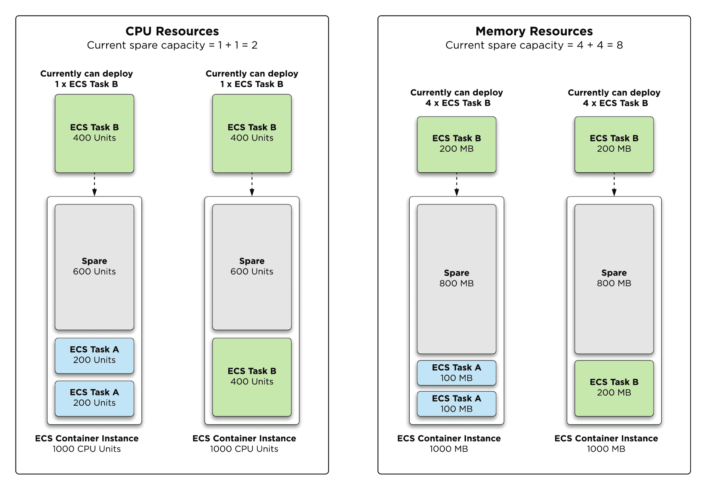
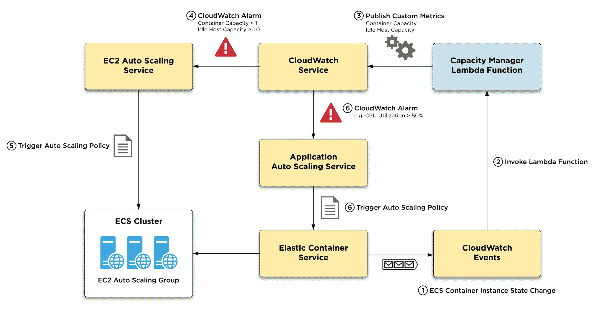
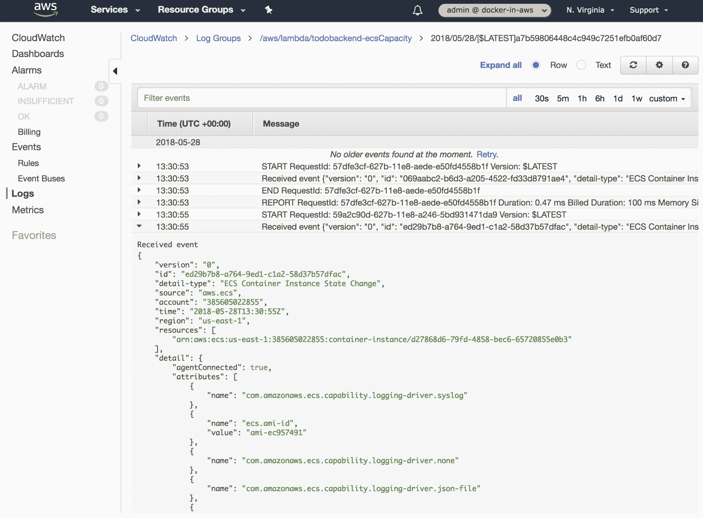
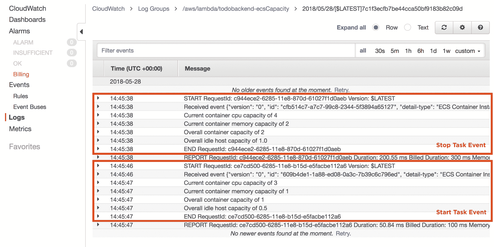
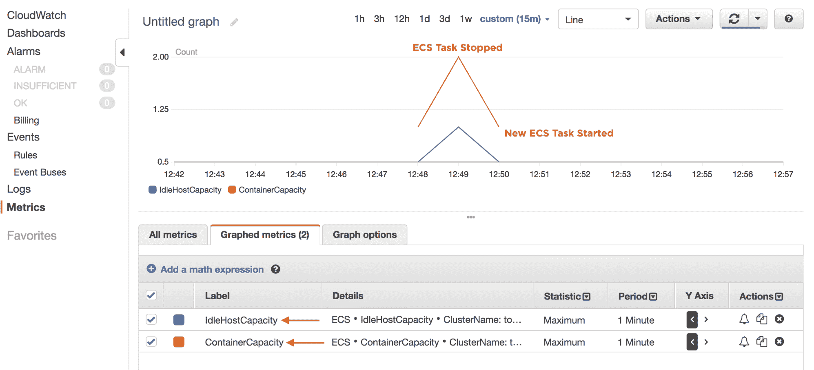
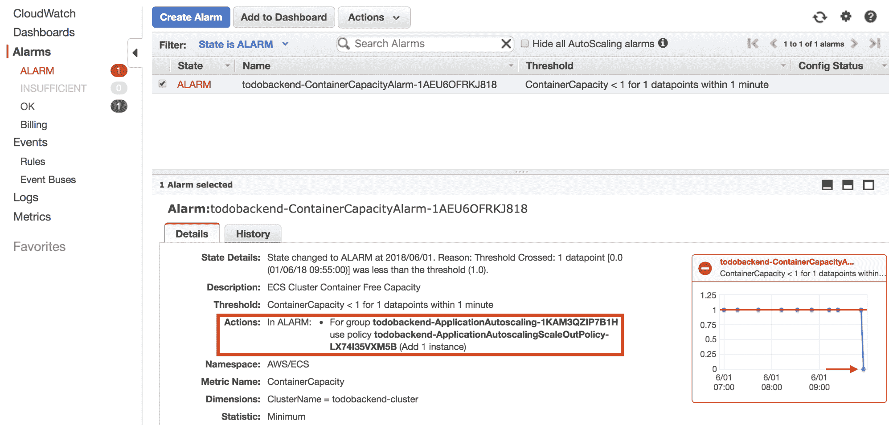
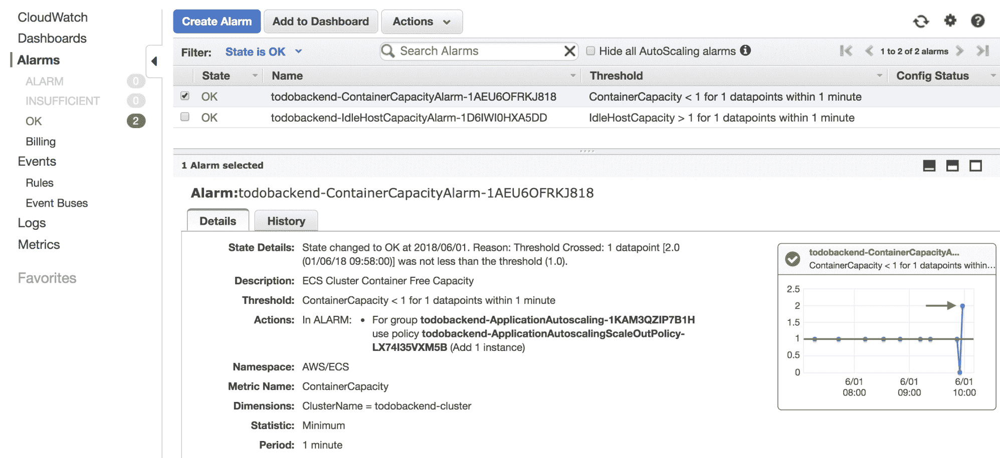
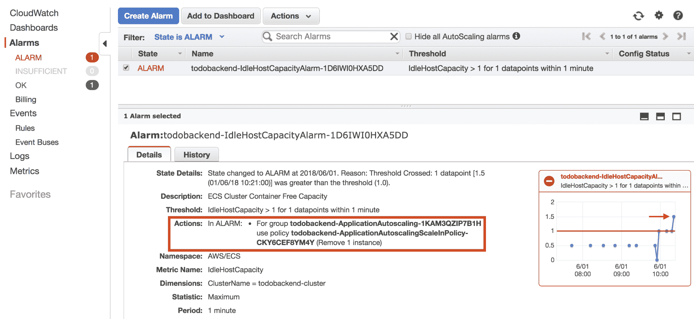

# ECS 自动扩展

**弹性**是云计算的基本原则之一，描述了根据需求自动扩展应用程序的能力，以确保客户获得最佳体验和响应性，同时通过仅在实际需要时提供额外容量来优化成本。

AWS 支持通过两个关键功能来扩展使用 ECS 部署的 Docker 应用程序：

+   **应用程序自动扩展**：这使用 AWS 应用程序自动扩展服务，并支持在 ECS 服务级别进行自动扩展，您的 ECS 服务运行的 ECS 任务或容器的数量可以增加或减少。

+   **EC2 自动扩展**：这使用 EC2 自动扩展服务，并支持在 EC2 自动扩展组级别进行自动扩展，您的自动扩展组中的 EC2 实例数量可以增加或减少。在 ECS 的上下文中，您的 EC2 自动扩展组通常对应于 ECS 集群，而单独的 EC2 实例对应于 ECS 容器实例，因此 EC2 自动扩展正在管理您的 ECS 集群的整体容量。

由于这里涉及两种范式，为您的 Docker 应用程序实现自动扩展可能是一个具有挑战性的技术概念，更不用说以可预测和可靠的方式成功实现了。更糟糕的是，截至撰写本书的时间，应用程序自动扩展和 EC2 自动扩展是完全独立的功能，彼此之间没有集成，因此，您需要确保这两个功能能够相互配合。

在分析这些功能时，好消息是应用程序自动扩展非常容易理解和实现。使用应用程序自动扩展，您只需定义应用程序的关键性能指标，并增加（增加）或减少（减少）运行应用程序的 ECS 任务的数量。坏消息是，当应用于在 ECS 集群中自动扩展 ECS 容器实例时，EC2 自动扩展绝对是一个更难处理的命题。在这里，您需要确保您的 ECS 集群为在集群中运行的所有 ECS 任务提供足够的计算、内存和网络资源，并确保您的集群能够在应用程序自动扩展时增加或减少容量。

扩展 ECS 集群的另一个挑战是确保您不会在缩减/缩小事件期间从集群中移除的 ECS 容器实例上中断服务并排空正在运行的任务。第十一章中实施的 ECS 生命周期挂钩解决方案会为您处理这一问题，确保在允许 EC2 自动扩展服务将实例移出服务之前，ECS 容器实例会排空所有正在运行的任务。

解决扩展 ECS 集群资源的问题是本章的主要焦点，一旦解决了这个问题，您将能够任意扩展您的 ECS 服务，并确保您的 ECS 集群会动态地添加或移除 ECS 容器实例，以确保您的应用程序始终具有足够和最佳的资源。在本章中，我们将首先专注于解决 ECS 集群容量管理的问题，然后讨论如何配置 AWS 应用程序自动扩展服务以自动扩展您的 ECS 服务和应用程序。

将涵盖以下主题：

+   了解 ECS 集群资源

+   计算 ECS 集群容量

+   实施 ECS 集群容量管理解决方案

+   配置 CloudWatch 事件以触发容量管理计算

+   发布与 ECS 集群容量相关的自定义 CloudWatch 指标

+   配置 CloudWatch 警报和 EC2 自动扩展策略以扩展您的 ECS 集群

+   配置 ECS 应用程序自动扩展

# 技术要求

以下列出了完成本章所需的技术要求：

+   AWS 账户的管理员访问权限

+   根据第三章的说明配置本地 AWS 配置文件

+   AWS CLI

+   本章是从第十一章继续下去的，因此需要您成功完成那里定义的所有配置任务。

以下 GitHub URL 包含本章中使用的代码示例：[`github.com/docker-in-aws/docker-in-aws/tree/master/ch12`](https://github.com/docker-in-aws/docker-in-aws/tree/master/ch12)。

查看以下视频以查看代码的实际操作：

[`bit.ly/2PdgtPr`](http://bit.ly/2PdgtPr)

# 了解 ECS 集群资源

在您开始管理 ECS 集群的容量之前，您需要清楚而牢固地了解影响 ECS 集群容量的各种资源。

一般来说，有三个关键资源需要考虑：

+   CPU

+   内存

+   网络

# CPU 资源

**CPU**是 Docker 支持和管理的核心资源。ECS 利用 Docker 的 CPU 资源管理能力，并公开通过 ECS 任务定义管理这些资源的能力。ECS 根据*CPU 单位*定义 CPU 资源，其中单个 CPU 核心包含 1,024 个 CPU 单位。在配置 ECS 任务定义时，您需要指定 CPU 保留，这定义了每当 CPU 时间存在争用时将分配给应用程序的 CPU 时间。

请注意，CPU 保留并不限制 ECS 任务可以使用多少 CPU-每个 ECS 任务都可以自由地突发并使用所有可用的 CPU 资源-当 CPU 存在争用时才会应用保留，并且 Docker 会根据每个运行的 ECS 任务的配置保留公平地分配 CPU 时间。

重要的是要理解，每个 CPU 保留都会从给定的 ECS 容器实例的可用 CPU 容量中扣除。例如，如果您的 ECS 容器实例有 2 个 CPU 核心，那就相当于总共有 2,048 个 CPU 单位。如果您运行了配置为 500、600 和 700 CPU 单位的 3 个 ECS 任务，这意味着您的 ECS 容器实例有 2,048 - (500 + 600 + 700)，或 248 个 CPU 单位可用。请注意，每当 ECS 调度程序需要运行新的 ECS 任务时，它将始终确保目标 ECS 容器实例具有足够的 CPU 容量来运行任务。根据前面的例子，如果需要启动一个保留 400 个 CPU 单位的新 ECS 任务，那么剩余 248 个 CPU 单位的 ECS 容器实例将不被考虑，因为它当前没有足够的 CPU 资源可用：


分配 CPU 资源

在配置 CPU 保留方面，您已经学会了如何通过 CloudFormation 进行此操作-请参阅第八章*使用 ECS 部署应用程序*中的*使用 CloudFormation 定义 ECS 任务定义*示例，在该示例中，您通过一个名为`Cpu`的属性为 todobackend 容器定义分配了 245 的值。

# 内存资源

内存是另一个通过 Docker 管理的基本资源，其工作方式类似于 CPU，尽管您可以为给定的 ECS 任务保留和限制内存容量，但在管理 CPU 容量时，您只能保留（而不是限制）CPU 资源。当涉及到配置 ECS 任务的内存时，这种额外的限制内存的能力会导致三种情况：

+   **仅内存保留**：这种情况的行为与 CPU 保留的工作方式相同。Docker 将从 ECS 容器实例的可用内存中扣除配置的保留，并在内存有争用时尝试分配这些内存。ECS 将允许 ECS 任务使用 ECS 容器实例支持的最大内存量。内存保留是在 ECS 任务容器定义中使用`MemoryReservation`属性进行配置的。

+   **内存保留+限制**：在这种情况下，内存保留的工作方式与前一种情况相同，但 ECS 任务可以使用的最大内存量受到配置内存限制的限制。一般来说，配置内存保留和内存限制被认为是最佳选择。内存限制是在 ECS 任务容器定义中使用`Memory`属性进行配置的。

+   **仅内存限制**：在这种情况下，ECS 将内存保留和内存限制值视为相同，这意味着 ECS 将从可用的 ECS 容器实例内存中扣除配置的内存限制，并且还将限制内存使用到相同的限制。

配置内存保留和限制是直接的-如果您回顾一下第八章*使用 CloudFormation 定义 ECS 任务定义*部分，您会发现您可以配置`MemoryReservation`属性来配置 395 MB 的保留。如果您想配置内存限制，您还需要使用适当的最大限制值配置`Memory`属性。

# 网络资源

CPU 和内存是您期望您的 ECS 集群控制和管理的典型和明显的资源。另一组不太明显的资源是*网络资源*，可以分为两类：

+   **主机网络端口**：每当您为 ECS 服务配置静态端口映射时，主机网络端口是您需要考虑的资源。原因是静态端口映射使用 ECS 容器实例公开的一个常用端口 - 例如，如果您创建了一个 ECS 任务，其中静态端口映射公开了给定应用程序的端口 80，那么如果端口 80 仍在使用中，您将无法在同一 ECS 容器实例主机上部署 ECS 任务的另一个实例。

+   **主机网络接口**：如果您正在使用 ECS 任务网络，重要的是要了解，该功能目前要求您为每个 ECS 任务实现单个弹性网络接口（ENI）。因为 EC2 实例对每种实例类型支持的 ENI 数量有限制，因此使用 ECS 任务网络配置的 ECS 任务数量将受到 ECS 容器实例可以支持的 ENI 最大数量的限制。

# 计算 ECS 集群容量

在计算 ECS 集群容量之前，您需要清楚地了解哪些资源会影响容量以及如何计算每种资源的当前容量。一旦为每个单独的资源定义了这一点，您就需要在所有资源上应用一个综合计算，这将导致最终计算出当前容量。

计算容量可能看起来是一项相当艰巨的任务，特别是当考虑到不同类型的资源以及它们的行为时：

+   **CPU**：这是您可以使用的最简单的资源，因为每个 CPU 预留只是从集群的可用 CPU 容量中扣除。

+   **内存**：根据内存计算集群的当前容量与 CPU 相同，因为内存预留会从集群的可用内存容量中扣除。根据本章早期讨论，内存预留的配置受到内存限制和内存预留的各种排列组合的影响，但基本上一旦确定了内存预留，计算方式与 CPU 资源相同。

+   静态网络端口：如果您的 ECS 集群需要支持使用静态端口映射的*任何*容器，那么您需要将您的 ECS 容器实例网络端口视为一种资源。例如，如果一个容器应用程序始终在 ECS 容器实例上使用端口 80，那么您只能在每个实例上部署一个容器，而不管该实例可能拥有多少 CPU、内存或其他资源。

+   网络接口：如果您有任何配置为 ECS 任务网络的 ECS 服务或任务，重要的是要了解，您目前只能在一个网络接口上运行一个 ECS 任务。例如，如果您正在运行一个 t2.micro 实例，这意味着您只能在一个实例上运行一个启用了任务网络的 ECS 任务，因为 t2.micro 只能支持一个弹性网络接口用于 ECS 任务网络。

鉴于示例应用程序未使用 ECS 任务网络，并且正在使用动态端口映射进行部署，我们在本章的其余部分只考虑 CPU 和内存资源。如果您对包含静态网络端口的示例解决方案感兴趣，请查看我的《使用亚马逊网络服务进行生产中的 Docker》课程的 Auto Scaling ECS Applications 模块。

挑战在于如何考虑所有 ECS 服务和任务，然后根据所有前述考虑做出决定，决定何时应该扩展或缩减集群中实例的数量。我见过的一种常见且有些天真的方法是独立地处理每个资源，并相应地扩展您的实例。例如，一旦您的集群的内存容量用尽，您就会添加一个新的容器实例，同样，如果您的集群即将耗尽 CPU 容量，也会这样做。如果您纯粹考虑扩展的能力，这种方法是有效的，但是当您想要缩减集群时，它就不起作用了。如果您仅基于当前内存容量来缩减集群，那么在 CPU 容量方面，您可能会过早地缩减，因为如果您从集群中移除一个实例，您的集群可能没有足够的 CPU 容量。

这将使您的集群陷入自动扩展循环中-也就是说，您的集群不断地扩展然后再缩小，这是因为各个资源容量独立地驱动着缩小和扩展的决策，而没有考虑对其他资源的影响。

解决这一挑战的关键在于您需要做出*单一*的扩展或缩小决策，并考虑您集群中*所有*适用的资源。这可能会使整体问题看起来更难解决，但实际上它非常简单。解决方案的关键在于您始终考虑*最坏情况*，并基于此做出决策。例如，如果您的集群中有足够的 CPU 和内存容量，但是所有静态端口映射都在所有集群实例上使用，最坏情况是，如果您缩小集群并删除一个实例，您将无法再支持使用受影响的静态端口映射的当前 ECS 任务。因此，这里的决策是简单的，纯粹基于最坏情况-所有其他情况都被忽略。

# 计算容器容量

在计算集群容量时的一个关键考虑因素是，您需要对资源容量进行归一化计算，以便每个资源的容量可以以一个通用和等效的格式来表达，独立于每个单独资源的具体计量单位。这在做出考虑所有资源的集体决策时至关重要，而这样做的一种自然方式是以当前可用的未分配资源来支持多少额外的 ECS 任务数量来表达资源容量。此外，与最坏情况的主题保持一致，您不需要考虑所有需要支持的不同 ECS 任务-您只需要考虑当前正在计算容量的资源的最坏情况的 ECS 任务（需要最多资源的任务）。

例如，如果您有两个需要分别需要 200 CPU 单位和 400 CPU 单位的 ECS 任务，那么您只需要根据需要 400 CPU 单位的 ECS 任务来计算 CPU 容量：


公式中带有有点奇怪的倒立的 A 的表达意思是“对于给定的 taskDefinitions 集合中的每个 taskCpu 值”。

一旦确定了需要支持的最坏情况 ECS 任务，就可以开始计算集群目前可以支持的额外 ECS 任务数量。假设最坏情况的 ECS 任务需要 400 个 CPU 单位，如果现在假设您的集群中有两个实例，每个实例都有 600 个 CPU 单位的空闲容量，这意味着您目前可以支持额外的 2 个 ECS 任务：


计算容器容量

这里需要注意的是，您需要按照每个实例的基础进行计算，而不仅仅是在整个集群上进行计算。使用先前的例子，如果您考虑整个集群的空闲 CPU 容量，您有 1,200 个 CPU 单位可用，因此您将计算出三个 ECS 任务的空闲容量，但实际情况是您不能*分割*ECS 任务跨越 2 个实例，因此如果您按照每个实例的空闲容量进行考虑，显然您只能在每个实例上支持一个额外的 ECS 任务，从而得到集群中总共 2 个额外的 ECS 任务的正确总数。

这可以形式化为一个数学方程，如下所示，其中公式右侧的注释表示取*floor*或计算的最低最近整数值，并且代表集群中的一个实例：


如果您对内存资源重复之前的方法，将计算一个单独的计算，以内存的形式定义集群的当前备用容量。如果我们假设内存的最坏情况 ECS 任务需要 500MB 内存，并且两个实例都有 400MB 可用，显然就内存而言，集群目前没有备用容量：


如果现在考虑 CPU 的两个先前计算（目前有两个空闲的 ECS 任务）和内存（目前没有空闲的 ECS 任务），显然最坏情况是内存容量计算为零个空闲的 ECS 任务，可以形式化如下：


请注意，虽然我们没有将静态网络端口和网络接口的计算纳入到我们的解决方案中以帮助简化，但一般的方法是相同的 - 计算每个实例的当前容量并求和以获得资源的整体集群容量值，然后将该值纳入整体集群容量的计算中：


# 决定何时扩展

在这一点上，我们已经确定您需要评估集群中每个当前资源容量，并以当前集群可以支持的空闲或备用 ECS 任务数量来表达，然后使用最坏情况的计算（最小值）来确定您当前集群的整体容量。一旦您完成了这个计算，您需要决定是否应该扩展集群，或者保持当前集群容量不变。当然，您还需要决定何时缩小集群，但我们将很快单独讨论这个话题。

现在，我们将专注于是否应该扩展集群（即增加容量），因为这是更简单的情景来评估。规则是，至少在当前集群容量小于 1 时，您应该扩展您的集群：


换句话说，如果您当前的集群容量不足以支持一个更糟的情况的 ECS 任务，您应该向 ECS 集群添加一个新实例。这是有道理的，因为您正在努力确保您的集群始终具有足够的容量来支持新的 ECS 任务的启动。当然，如果您希望获得更多的空闲容量，您可以将此阈值提高，这可能适用于更动态的环境，其中容器经常启动和关闭。

# 计算空闲主机容量

如果我们现在考虑缩减规模的情况，这就变得有点难以确定了。我们讨论过的备用 ECS 任务容量计算是相关且必要的，但是你需要从这些角度思考：如果你从集群中移除一个 ECS 容器实例，是否有足够的容量来运行所有当前正在运行的 ECS 任务，以及至少还有一个额外的 ECS 任务的备用容量？另一种表达方式是计算集群的*空闲主机容量*——如果集群中有多于 1.0 个主机处于空闲状态，那么你可以安全地缩减集群规模，因为减少一个主机会导致剩余的正值非零容量。请注意，我们指的是整个集群中的空闲主机容量——所以把这看作更像是一个虚拟主机计算，因为你可能不会有完全空闲的主机。这个虚拟主机计算是安全的，因为如果我们从集群中移除一个主机，我们在第十一章*管理 ECS 基础设施生命周期*中介绍的生命周期钩子和 ECS 容器实例排空功能将确保任何运行在要移除的实例上的容器将被迁移到集群中的其他实例上。

还需要了解的是，空闲主机容量必须大于 1.0，而不是等于 1.0，因为你必须有足够的备用容量来运行一个 ECS 任务，否则你将触发一个扩展规模的动作，导致自动扩展的扩展/缩减循环。

要确定当前的空闲主机容量，我们需要了解以下内容：

+   每个不同类型的 ECS 资源对应的每个 ECS 容器实例可以运行的最大 ECS 任务数量（表示为）。

+   整个集群中每种类型的 ECS 资源的当前空闲容量（表示为），这是我们在确定是否扩展规模时已经计算过的。

有了这些信息，你可以按照以下方式计算给定资源的空闲主机容量：


# 空闲主机容量示例

为了更清楚地说明这一点，让我们通过以下示例来进行计算，如下图所示，假设以下情况：

+   最坏情况下需要 400 个 CPU 单位的 ECS 任务 CPU 要求

+   最坏情况下需要 200 MB 的 ECS 任务内存

+   每个 ECS 容器实例支持最多 1,000 个 CPU 单位和 1,000 MB 内存

+   当前在 ECS 集群中有两个 ECS 容器实例

+   每个 ECS 容器实例目前有 600 个 CPU 单位的空闲容量。使用之前讨论的空闲容量计算，这相当于集群中的当前空闲容量为 2

+   ECS 任务的 CPU 资源，我们将称之为 。

+   每个 ECS 容器实例目前有 800 MB 的空闲容量。使用之前讨论的空闲容量计算，这相当于集群中的当前空闲容量为 8 个 ECS 任务的内存资源，我们将称之为 ：

空闲主机容量

我们可以首先计算  值如下：


对于 CPU，它等于 2，对于内存等于*5*：


通过计算这些值并了解集群当前的空闲容量，我们现在可以计算每个资源的空闲主机容量：


以下是如何计算最坏情况下的空闲主机容量：


在这一点上，鉴于空闲主机容量为 1.0，我们应该*不*缩减集群，因为容量目前*不大于*1。这可能看起来有些反直觉，因为您确实有一个空闲主机，但如果此时删除一个实例，将导致集群的可用 CPU 容量为 0，并且集群将扩展，因为没有空闲的 CPU 容量。

# 实施 ECS 自动扩展解决方案

现在您已经很好地了解了如何计算 ECS 集群容量，以便进行扩展和缩减决策，我们准备实施一个自动扩展解决方案，如下图所示：



以下提供了在前面的图表中显示的解决方案的步骤：

1.  在计算 ECS 集群容量之前，您需要一个机制来触发容量的计算，最好是在 ECS 容器实例的容量发生变化时触发。这可以通过利用 CloudWatch Events 服务来实现，该服务为包括 ECS 在内的各种 AWS 服务发布事件，并允许您创建*事件规则*，订阅特定事件并使用各种机制（包括 Lambda 函数）处理它们。CloudWatch 事件支持接收有关 ECS 容器实例状态更改的信息，这代表了触发集群容量计算的理想机制，因为 ECS 容器实例的可用资源的任何更改都将触发状态更改事件。

1.  一个负责计算 ECS 集群容量的 Lambda 函数会在每个 ECS 容器实例状态变化事件触发时被触发。

1.  Lambda 函数不会决定自动扩展集群，而是简单地以 CloudWatch 自定义指标的形式发布当前容量，报告当前空闲容器容量和空闲主机容量。

1.  CloudWatch 服务配置了警报，当空闲容器容量或空闲主机容量低于或超过扩展或收缩集群的阈值时，会触发 EC2 自动扩展操作。

1.  EC2 自动扩展服务配置了 EC2 自动扩展策略，这些策略会在 CloudWatch 引发的警报时被调用。

1.  除了配置用于管理 ECS 集群容量的 CloudWatch 警报外，您还可以为每个 ECS 服务配置适当的 CloudWatch 警报，然后触发 AWS 应用自动扩展服务，以扩展或收缩运行您的 ECS 服务的 ECS 任务数量。例如，在前面的图表中，ECS 服务配置了一个应用自动扩展策略，当 ECS 服务的 CPU 利用率超过 50%时，会增加 ECS 任务的数量。

现在让我们实现解决方案的各个组件。

# 为 ECS 配置 CloudWatch 事件

我们需要执行的第一个任务是设置一个 CloudWatch 事件规则，订阅 ECS 容器实例状态变化事件，并配置一个 Lambda 函数作为目标，用于计算 ECS 集群容量。

以下示例演示了如何向 todobackend-aws `stack.yml` CloudFormation 模板添加 CloudWatch 事件规则：

```
...
...
Resources:
  EcsCapacityPermission:
 Type: AWS::Lambda::Permission
 Properties:
 Action: lambda:InvokeFunction
 FunctionName: !Ref EcsCapacityFunction
 Principal: events.amazonaws.com
 SourceArn: !Sub ${EcsCapacityEvents.Arn}
 EcsCapacityEvents:
 Type: AWS::Events::Rule
 Properties:
 Description: !Sub ${AWS::StackName} ECS Events Rule
 EventPattern:
 source:
 - aws.ecs
 detail-type:
 - ECS Container Instance State Change
 detail:
 clusterArn:
 - !Sub ${ApplicationCluster.Arn}
 Targets:
 - Arn: !Sub ${EcsCapacityFunction.Arn}
 Id: !Sub ${AWS::StackName}-ecs-events
  LifecycleHook:
    Type: AWS::AutoScaling::LifecycleHook
...
...
```

`EcsCapacityEvents` 资源定义了事件规则，并包括两个关键属性：

+   `EventPattern`：定义了与此规则匹配事件的模式。所有 CloudWatch 事件都包括 `source`、`detail-type` 和 `detail` 属性，事件模式确保只有与 ECS 事件相关的 ECS 事件（由 `source` 模式 `aws.ecs` 定义）与 ECS 容器实例状态更改（由 `detail-type` 模式定义）与 `ApplicationCluster` 资源（由 `detail` 模式定义）相关的事件将被匹配到规则。

+   `Targets`：定义了事件应该路由到的目标资源。在前面的例子中，你引用了一个名为 `EcsCapacityFunction` 的 Lambda 函数的 ARN，你很快将定义它。

`EcsCapacityPermission` 资源确保 CloudWatch 事件服务有权限调用 `EcsCapacityFunction` Lambda 函数。这是任何调用 Lambda 函数的服务的常见方法，你可以添加一个 Lambda 权限，授予给定 AWS 服务（由 `Principal` 属性定义）对于给定资源（由 `SourceArn` 属性定义）调用 Lambda 函数（`FunctionName` 属性）的能力。

现在，让我们添加引用的 Lambda 函数，以及一个 IAM 角色和 CloudWatch 日志组：

```
...
...
Resources:
  EcsCapacityRole:
 Type: AWS::IAM::Role
 Properties:
 AssumeRolePolicyDocument:
 Version: "2012-10-17"
 Statement:
 - Action:
 - sts:AssumeRole
 Effect: Allow
 Principal:
 Service: lambda.amazonaws.com
 Policies:
 - PolicyName: EcsCapacityPermissions
 PolicyDocument:
 Version: "2012-10-17"
 Statement:
 - Sid: ManageLambdaLogs
 Effect: Allow
 Action:
 - logs:CreateLogStream
 - logs:PutLogEvents
 Resource: !Sub ${EcsCapacityLogGroup.Arn}
 EcsCapacityFunction:
 Type: AWS::Lambda::Function
 DependsOn:
 - EcsCapacityLogGroup
 Properties:
 Role: !Sub ${EcsCapacityRole.Arn}
 FunctionName: !Sub ${AWS::StackName}-ecsCapacity
 Description: !Sub ${AWS::StackName} ECS Capacity Manager
 Code:
 ZipFile: |
 import json
 def handler(event, context):
 print("Received event %s" % json.dumps(event))
 Runtime: python3.6
 MemorySize: 128
 Timeout: 300
 Handler: index.handler
  EcsCapacityLogGroup:
 Type: AWS::Logs::LogGroup
 DeletionPolicy: Delete
 Properties:
 LogGroupName: !Sub /aws/lambda/${AWS::StackName}-ecsCapacity
 RetentionInDays: 7
  EcsCapacityPermission:
    Type: AWS::Lambda::Permission
...
...
```

到目前为止，你应该已经对如何使用 CloudFormation 定义 Lambda 函数有了很好的理解，所以我不会深入描述前面的例子。但是请注意，目前我已经实现了一个基本的函数，它只是简单地打印出接收到的任何事件——我们将使用这个函数来初步了解 ECS 容器实例状态更改事件的结构。

此时，你现在可以使用 `aws cloudformation deploy` 命令部署你的更改：

```
> export AWS_PROFILE=docker-in-aws
> aws cloudformation deploy --template-file stack.yml \
 --stack-name todobackend --parameter-overrides $(cat dev.cfg) \
 --capabilities CAPABILITY_NAMED_IAM
Enter MFA code for arn:aws:iam::385605022855:mfa/justin.menga:

Waiting for changeset to be created..
Waiting for stack create/update to complete
Successfully created/updated stack - todobackend
```

部署完成后，你可以通过停止运行在 ECS 集群上的现有 ECS 任务来触发 ECS 容器实例状态更改：

```
> aws ecs list-tasks --cluster todobackend-cluster
{
    "taskArns": [
        "arn:aws:ecs:us-east-1:385605022855:task/5754a076-6f5c-47f1-8e73-c7b229315e31"
    ]
}
> aws ecs stop-task --cluster todobackend-cluster --task 5754a076-6f5c-47f1-8e73-c7b229315e31
```

```
{
    "task": {
        ...
        ...
        "lastStatus": "RUNNING",
        "desiredStatus": "STOPPED",
        ...
        ...
    }
}
```

由于这个 ECS 任务与 ECS 服务相关联，ECS 将自动启动一个新的 ECS 任务，如果你前往 CloudWatch 控制台，选择日志，然后打开用于处理 ECS 容器实例状态更改事件的 Lambda 函数的日志组的最新日志流(`/aws/lambda/todobackend-ecsCapacity`)，你应该会看到一些事件已被记录：



在前面的屏幕截图中，您可以看到在几秒钟内记录了两个事件，这些事件代表您停止 ECS 任务，然后 ECS 自动启动新的 ECS 任务，以确保链接的 ECS 服务达到其配置的期望计数。

您可以看到`source`和`detail-type`属性与您之前配置的事件模式匹配，如果您在第二个事件中继续向下滚动，您应该会找到一个名为`registeredResources`和`remainingResources`的属性，如下例所示：

```
{
  ...
  ...
  "clusterArn":  "arn:aws:ecs:us-east-1:385605022855:cluster/todobackend-cluster",      
  "containerInstanceArn":  "arn:aws:ecs:us-east-1:385605022855:container-instance/d27868d6-79fd-4858-bec6-65720855e0b3",
 "ec2InstanceId":  "i-0d9bd79d19a843216",
  "registeredResources": [             
    { "name":  "CPU", "type":  "INTEGER", "integerValue":  1024 },
    {       "name":  "MEMORY",                 
       "type":  "INTEGER",                 
       "integerValue":  993 },
    { "name":  "PORTS",                 
       "type":  "STRINGSET",                 
       "stringSetValue": ["22","2376","2375","51678","51679"]
    }
  ],
  "remainingResources": [ 
    { 
      "name": "CPU", 
      "type": "INTEGER", 
      "integerValue": 774 
    },
    { 
       "name": "MEMORY", 
       "type": "INTEGER", 
       "integerValue": 593 
    },
    {
       "name": "PORTS", 
       "type": "STRINGSET", 
       "stringSetValue": ["22","2376","2375","51678","51679"]
    }
  ],
  ...
  ...
}
```

`registeredResources`属性定义了分配给实例的总资源，而`remainingResources`指示每个资源的当前剩余数量。因为在前面的示例中，当 ECS 为 todobackend 服务启动新的 ECS 任务时会引发事件，因此从`registeredResources`中扣除了分配给此任务的总 250 个 CPU 单位和 400 MB 内存，然后反映在`remainingResources`属性中。还要注意在示例 12-6 的输出顶部，事件包括其他有用的信息，例如 ECS 集群 ARN 和 ECS 容器实例 ARN 值（由`clusterArn`和`containerInstanceArn`属性指定）。

# 编写计算集群容量的 Lambda 函数

现在，您已经设置了一个 CloudWatch 事件和 Lambda 函数，每当检测到 ECS 容器实例状态变化时就会被调用，您现在可以在 Lambda 函数中实现所需的应用程序代码，以执行适当的 ECS 集群容量计算。

```
...
...
Resources:
  ...
  ...
  EcsCapacityFunction:
    Type: AWS::Lambda::Function
    DependsOn:
      - EcsCapacityLogGroup
    Properties:
      Role: !Sub ${EcsCapacityRole.Arn}
      FunctionName: !Sub ${AWS::StackName}-ecsCapacity
      Description: !Sub ${AWS::StackName} ECS Capacity Manager
      Code:
 ZipFile: |
 import json
          import boto3
          ecs = boto3.client('ecs')
          # Max memory and CPU - you would typically inject these as environment variables
          CONTAINER_MAX_MEMORY = 400
          CONTAINER_MAX_CPU = 250

          # Get current CPU
          def check_cpu(instance):
            return sum(
              resource['integerValue']
              for resource in instance['remainingResources']
              if resource['name'] == 'CPU'
            )
          # Get current memory
          def check_memory(instance):
            return sum(
              resource['integerValue']
              for resource in instance['remainingResources']
              if resource['name'] == 'MEMORY'
            )
          # Lambda entrypoint
          def handler(event, context):
            print("Received event %s" % json.dumps(event))

            # STEP 1 - COLLECT RESOURCE DATA
            cluster = event['detail']['clusterArn']
            # The maximum CPU availble for an idle ECS instance
            instance_max_cpu = next(
              resource['integerValue']
              for resource in event['detail']['registeredResources']
              if resource['name'] == 'CPU')
            # The maximum memory availble for an idle ECS instance
            instance_max_memory = next(
              resource['integerValue']
              for resource in event['detail']['registeredResources']
              if resource['name'] == 'MEMORY')
            # Get current container capacity based upon CPU and memory
            instance_arns = ecs.list_container_instances(
              cluster=cluster
            )['containerInstanceArns']
            instances = [
              instance for instance in ecs.describe_container_instances(
                cluster=cluster,
                containerInstances=instance_arns
              )['containerInstances']
              if instance['status'] == 'ACTIVE'
            ]
            cpu_capacity = 0
            memory_capacity = 0
            for instance in instances:
              cpu_capacity += int(check_cpu(instance)/CONTAINER_MAX_CPU)
              memory_capacity += int(check_memory(instance)/CONTAINER_MAX_MEMORY)
            print("Current container cpu capacity of %s" % cpu_capacity)
            print("Current container memory capacity of %s" % memory_capacity)

            # STEP 2 - CALCULATE OVERALL CONTAINER CAPACITY
            container_capacity = min(cpu_capacity, memory_capacity)
            print("Overall container capacity of %s" % container_capacity)

            # STEP 3 - CALCULATE IDLE HOST COUNT
            idle_hosts = min(
              cpu_capacity / int(instance_max_cpu / CONTAINER_MAX_CPU),
              memory_capacity / int(instance_max_memory / CONTAINER_MAX_MEMORY)
            )
            print("Overall idle host capacity of %s" % idle_hosts)
      Runtime: python3.6
      MemorySize: 128
      Timeout: 300
      Handler: index.handler
...
...
```

在前面的示例中，您首先定义了 ECS 任务的最大 CPU 和最大内存，这是进行各种集群容量计算所必需的，我们使用当前配置的 CPU 和内存设置来支持 todobackend 服务，因为这是我们集群上唯一支持的应用程序。在`handler`函数中，第一步是使用接收到的 CloudWatch 事件收集当前的资源容量数据。该事件包括有关 ECS 容器实例在`registeredResources`属性中的最大容量的详细信息，还包括实例所属的 ECS 集群。该函数首先列出集群中的所有实例，然后使用 ECS 客户端上的`describe_container_instances`调用加载每个实例的详细信息。

对每个实例收集的信息仅限于活动实例，因为您不希望包括可能处于 DRAINING 状态或其他非活动状态的实例的资源。

前面示例中的代码只能在 Python 3.x 环境中正确运行，因此请确保您的 Lambda 函数配置为使用 Python 3.6。

收集有关每个 ECS 容器实例的必要信息后，然后迭代每个实例并计算 CPU 和内存容量。这调用了查询每个实例的`remainingResources`属性的辅助函数，该函数返回每个资源的当前可用容量。每个计算都以您之前定义的最大容器大小来表达，并将它们相加以提供整个集群的 CPU 和内存容量，以供信息目的打印。

下一步是计算整体容器容量，这可以通过取先前计算的资源容量的最小值来轻松计算，这将用于确定您的 ECS 集群何时需要扩展，至少当容器容量低于零时。最后，进行空闲主机容量计算 - 此值将用于确定您的 ECS 集群何时应该缩减，只有当空闲主机容量大于 1.0 时才会发生，如前所述。

# 为计算集群容量添加 IAM 权限

关于前面示例中的代码需要注意的一点是，它需要能够调用 ECS 服务并执行`ListContainerInstances`和`DescribeContainerInstances` API 调用的能力。这意味着您需要向 Lambda 函数 IAM 角色添加适当的 IAM 权限，如下例所示：

```
...
...
Resources:
  ...
  ...
  EcsCapacityRole:
    Type: AWS::IAM::Role
    Properties:
      AssumeRolePolicyDocument:
        Version: "2012-10-17"
        Statement:
          - Action:
              - sts:AssumeRole
            Effect: Allow
            Principal:
              Service: lambda.amazonaws.com
      Policies:
        - PolicyName: EcsCapacityPermissions
          PolicyDocument:
            Version: "2012-10-17"
            Statement:
              - Sid: ListContainerInstances
 Effect: Allow
 Action:
 - ecs:ListContainerInstances
 Resource: !Sub ${ApplicationCluster.Arn}
 - Sid: DescribeContainerInstances
 Effect: Allow
 Action:
 - ecs:DescribeContainerInstances
 Resource: "*"
 Condition:
 ArnEquals:
 ecs:cluster: !Sub ${ApplicationCluster.Arn}
              - Sid: ManageLambdaLogs
                Effect: Allow
                Action:
                - logs:CreateLogStream
                - logs:PutLogEvents
                Resource: !Sub ${EcsCapacityLogGroup.Arn}
  ...
  ...
```

# 测试集群容量计算

您已经添加了计算集群容量所需的代码，并确保您的 Lambda 函数有适当的权限来查询 ECS 以确定集群中所有 ECS 容器实例的当前容量。您现在可以使用`aws cloudformation deploy`命令部署您的更改，一旦部署完成，您可以通过停止运行在 todobackend ECS 集群中的任何 ECS 任务来再次测试您的 Lambda 函数。

如果您查看 Lambda 函数的 CloudWatch 日志，您应该会看到类似于这里显示的事件：



请注意，当您停止 ECS 任务（如停止任务事件所表示的），Lambda 函数报告 CPU 容量为 4，内存容量为 2，总体容量为 2，这是计算出的每个资源容量的最小值。

如果您对此进行合理检查，您应该会发现计算是准确和正确的。对于初始事件，因为您停止了 ECS 任务，没有任务在运行，因此可用的 CPU 和内存资源分别为 1,024 个单位和 993 MB（即 t2.micro 实例的容量）。这相当于以下容器容量：

+   CPU 容量 = 1024 / 250 = 4

+   内存容量 = 993 / 400 = 2

当 ECS 自动替换停止的 ECS 任务时，您会看到集群容量下降，因为新的 ECS 任务（具有 250 个 CPU 单位和 400 MB 内存）现在正在消耗资源：

+   CPU 容量 = 1024 - 250 / 250 = 774 / 250 = 3

+   内存容量 = 993 - 400 / 400 = 593 / 400 = 1

最后，您可以看到，当您停止 ECS 任务时，总体空闲主机容量正确计算为 1.0，这是正确的，因为此时集群上没有运行任何 ECS 任务。当 ECS 替换停止的任务时，总体空闲主机容量减少为 0.5，因为 ECS 容器实例现在运行的是最多可以在单个实例上运行的两个 ECS 任务中的一个，就内存资源而言。

# 发布自定义 CloudWatch 指标

此时，我们正在计算确定何时需要扩展或缩小集群的适当指标，并且函数中需要执行的最终任务是发布自定义 CloudWatch 事件指标，我们可以使用这些指标来触发自动扩展策略：

```
...
...
Resources:
  ...
  ...
  EcsCapacityFunction:
    Type: AWS::Lambda::Function
    DependsOn:
      - EcsCapacityLogGroup
    Properties:
      Role: !Sub ${EcsCapacityRole.Arn}
      FunctionName: !Sub ${AWS::StackName}-ecsCapacity
      Description: !Sub ${AWS::StackName} ECS Capacity Manager
      Code:
        ZipFile: |
          import json
          import boto3
          import datetime
          ecs = boto3.client('ecs') cloudwatch = boto3.client('cloudwatch') # Max memory and CPU - you would typically inject these as environment variables
          CONTAINER_MAX_MEMORY = 400
          CONTAINER_MAX_CPU = 250          ...
          ...
          # Lambda entrypoint
          def handler(event, context):
            print("Received event %s" % json.dumps(event))            ...
            ...# STEP 3 - CALCULATE IDLE HOST COUNT            idle_hosts = min(
              cpu_capacity / int(instance_max_cpu / CONTAINER_MAX_CPU),
              memory_capacity / int(instance_max_memory / CONTAINER_MAX_MEMORY)
            )
            print("Overall idle host capacity of %s" % idle_hosts)

 # STEP 4 - PUBLISH CLOUDWATCH METRICS
 cloudwatch.put_metric_data(
 Namespace='AWS/ECS',
 MetricData=[
              {
                'MetricName': 'ContainerCapacity',
                'Dimensions': [{
                  'Name': 'ClusterName',
                  'Value': cluster.split('/')[-1]
                }],
                'Timestamp': datetime.datetime.utcnow(),
                'Value': container_capacity
              }, 
              {
 'MetricName': 'IdleHostCapacity',
 'Dimensions': [{
 'Name': 'ClusterName',
 'Value': cluster.split('/')[-1]
 }],
 'Timestamp': datetime.datetime.utcnow(),
 'Value': idle_hosts
 }
            ])
      Runtime: python3.6
      MemorySize: 128
      Timeout: 300
      Handler: index.handler
...
...
```

在前面的示例中，您使用 CloudWatch 客户端的`put_metric_data`函数来发布 AWS/ECS 命名空间中的`ContainerCapacity`和`IdleHostCapacity`自定义指标。这些指标基于 ECS 集群进行维度化，由 ClusterName 维度名称指定，并且仅限于 todobackend ECS 集群。

确保 Lambda 函数正确运行的最后一个配置任务是授予函数权限以发布 CloudWatch 指标。这可以通过在先前示例中创建的`EcsCapacityRole`中添加适当的 IAM 权限来实现：

```
...
...
Resources:
  ...
  ...
  EcsCapacityRole:
    Type: AWS::IAM::Role
    Properties:
      AssumeRolePolicyDocument:
        Version: "2012-10-17"
        Statement:
          - Action:
              - sts:AssumeRole
            Effect: Allow
            Principal:
              Service: lambda.amazonaws.com
      Policies:
        - PolicyName: EcsCapacityPermissions
          PolicyDocument:
            Version: "2012-10-17"
            Statement:
              - Sid: PublishCloudwatchMetrics
 Effect: Allow
 Action:
 - cloudwatch:putMetricData
 Resource: "*"
              - Sid: ListContainerInstances
                Effect: Allow
                Action:
                  - ecs:ListContainerInstances
                Resource: !Sub ${ApplicationCluster.Arn}
              - Sid: DescribeContainerInstances
                Effect: Allow
                Action:
                  - ecs:DescribeContainerInstances
                Resource: "*"
                Condition:
                  ArnEquals:
                    ecs:cluster: !Sub ${ApplicationCluster.Arn}
              - Sid: ManageLambdaLogs
                Effect: Allow
                Action:
                - logs:CreateLogStream
                - logs:PutLogEvents
                Resource: !Sub ${EcsCapacityLogGroup.Arn}
  ...
  ...
```

如果您现在使用`aws cloudformation deploy`命令部署更改，然后停止运行的 ECS 任务，在切换到 CloudWatch 控制台后，您应该能够看到与您的 ECS 集群相关的新指标被发布。如果您从左侧菜单中选择**指标**，然后在**所有指标**下选择**ECS > ClusterName**，您应该能够看到您的自定义指标（`ContainerCapacity`和`IdleHostCapacity`）。以下截图显示了这些指标基于一分钟内收集的最大值进行绘制。在图表的 12:49 处，您可以看到当您停止 ECS 任务时，`ContainerCapacity`和`IdleHostCapacity`指标都增加了，然后一旦 ECS 启动了新的 ECS 任务，这两个指标的值都减少了，因为新的 ECS 任务从您的集群中分配了资源：



# 为集群容量管理创建 CloudWatch 警报。

现在，您可以在 ECS 集群中计算和发布 ECS 集群容量指标，每当 ECS 集群中的 ECS 容器实例状态发生变化时。整体解决方案的下一步是实施 CloudWatch 警报，这将在指标超过或低于与集群容量相关的指定阈值时触发自动扩展操作。

以下代码演示了向 todobackend 堆栈添加两个 CloudWatch 警报：

```
...
...
Resources:
  ...
  ...
 ContainerCapacityAlarm:
 Type: AWS::CloudWatch::Alarm
 Properties:
 AlarmDescription: ECS Cluster Container Free Capacity
 AlarmActions:
        - !Ref ApplicationAutoscalingScaleOutPolicy
 Namespace: AWS/ECS
 Dimensions:
 - Name: ClusterName
 Value: !Ref ApplicationCluster
 MetricName: ContainerCapacity
 Statistic: Minimum
 Period: 60
 EvaluationPeriods: 1
 Threshold: 1
 ComparisonOperator: LessThanThreshold
 TreatMissingData: ignore
 IdleHostCapacityAlarm:
 Type: AWS::CloudWatch::Alarm
 Properties:
 AlarmDescription: ECS Cluster Container Free Capacity
 AlarmActions:
        - !Ref ApplicationAutoscalingScaleInPolicy
 Namespace: AWS/ECS
 Dimensions:
 - Name: ClusterName
 Value: !Ref ApplicationCluster
 MetricName: IdleHostCapacity
 Statistic: Maximum
 Period: 60
 EvaluationPeriods: 1
 Threshold: 1
 ComparisonOperator: GreaterThanThreshold
 TreatMissingData: ignore
  ...
  ...
```

在前面的示例中，您添加了两个 CloudWatch 警报-一个`ContainerCapacityAlarm`，每当容器容量低于 1 时将用于触发扩展操作，以及一个`IdleHostCapacityAlarm`，每当空闲主机容量大于 1 时将用于触发缩减操作。每个警报的各种属性在此处有进一步的描述：

+   `AlarmActions`：定义应该采取的操作，如果警报违反其配置的条件。在这里，我们引用了我们即将定义的 EC2 自动扩展策略资源，这些资源在引发警报时会触发适当的自动扩展扩展或缩减操作。

+   `Namespace`：定义警报所关联的指标的命名空间。

+   `Dimensions`：定义指标与给定命名空间内的资源的关系的上下文。在前面的示例中，上下文配置为我们堆栈内的 ECS 集群。

+   `MetricName`：定义指标的名称。在这里，我们指定了在上一节中发布的每个自定义指标的名称。

+   `统计`：定义应该评估的指标的统计数据。这实际上是一个非常重要的参数，在容器容量警报的情况下，设置最大值确保短暂指标不会不必要地触发警报，假设在每个评估周期内至少有 1 个值超过配置的阈值。对于空闲主机容量警报也是如此，但方向相反。

+   `Period`、`EvaluationPeriods`、`Threshold`和`ComparisonOperator`：这些定义了指标必须在配置的阈值和比较运算符的范围之外的时间范围。如果超出了这些范围，将会触发警报。

+   `TreatMissingData`：此设置定义了如何处理缺少的指标数据。在我们的用例中，由于我们仅在 ECS 容器实例状态更改时发布指标数据，因此将值设置为`ignore`可以确保我们不会将缺失的数据视为有问题的指示。

# 创建 EC2 自动扩展策略

现在，您需要创建您在每个 CloudWatch 警报资源中引用的 EC2 自动扩展策略资源。

以下示例演示了向 todobackend 堆栈添加扩展和缩减策略：

```
...
...
Resources:
  ...
  ...
 ApplicationAutoscalingScaleOutPolicy:
    Type: AWS::AutoScaling::ScalingPolicy
    Properties:
      PolicyType: SimpleScaling
      AdjustmentType: ChangeInCapacity
      ScalingAdjustment: 1
      AutoScalingGroupName: !Ref ApplicationAutoscaling
      Cooldown: 600
  ApplicationAutoscalingScaleInPolicy:
    Type: AWS::AutoScaling::ScalingPolicy
    Properties:
      PolicyType: SimpleScaling
      AdjustmentType: ChangeInCapacity
      ScalingAdjustment: -1
      AutoScalingGroupName: !Ref ApplicationAutoscaling
      Cooldown: 600
  ...
  ...
  ApplicationAutoscaling:
    Type: AWS::AutoScaling::AutoScalingGroup
    DependsOn:
      - DmesgLogGroup
      - MessagesLogGroup
      - DockerLogGroup
      - EcsInitLogGroup
      - EcsAgentLogGroup
    CreationPolicy:
      ResourceSignal:
 Count: 1
        Timeout: PT15M
    UpdatePolicy:
      AutoScalingRollingUpdate:
        SuspendProcesses:
 - HealthCheck
 - ReplaceUnhealthy
 - AZRebalance
 - AlarmNotification
 - ScheduledActions        MinInstancesInService: 1
        MinSuccessfulInstancesPercent: 100
        WaitOnResourceSignals: "true"
        PauseTime: PT15M
    Properties:
      LaunchConfigurationName: !Ref ApplicationAutoscalingLaunchConfiguration
      MinSize: 0
      MaxSize: 4
 DesiredCapacity: 1        ...
        ...

```

在上面的示例中，您定义了两种`SimpleScaling`类型的自动扩展策略，它代表了您可以实现的最简单的自动扩展形式。各种自动扩展类型的讨论超出了本书的范围，但如果您对了解更多可用选项感兴趣，可以参考[`docs.aws.amazon.com/autoscaling/ec2/userguide/as-scale-based-on-demand.html`](https://docs.aws.amazon.com/autoscaling/ec2/userguide/as-scale-based-on-demand.html)。`AdjustmentType`和`ScalingAdjustment`属性配置为增加或减少自动扩展组的一个实例的大小，而`Cooldown`属性提供了一种机制，以确保在指定的持续时间内禁用进一步的自动扩展操作，这可以帮助避免集群频繁地扩展和缩减。

请注意，`ApplicationAutoscaling`的`UpdatePolicy`设置已更新以包括`SuspendProcesses`参数，该参数配置 CloudFormation 在进行自动扩展滚动更新时禁用某些操作过程。这特别是在滚动更新期间禁用自动扩展操作很重要，因为您不希望自动扩展操作干扰由 CloudFormation 编排的滚动更新。最后，我们还将`ApplicationAutoscaling`资源上的各种计数设置为固定值 1，因为自动扩展现在将管理我们的 ECS 集群的大小。

# 测试 ECS 集群容量管理

现在，我们已经拥有了计算 ECS 集群容量、发布指标和触发警报的所有组件，这将调用自动扩展操作，让我们部署我们的更改并测试解决方案是否按预期工作。

# 测试扩展

人为触发扩展操作，我们需要在`dev.cfg`配置文件中将`ApplicationDesiredCount`输入参数设置为 2，这将增加我们的 ECS 服务的 ECS 任务计数为 2，并导致 ECS 集群中的单个 ECS 容器实例不再具有足够的资源来支持任何进一步的附加容器：

```
ApplicationDesiredCount=2
ApplicationImageId=ami-ec957491
ApplicationImageTag=5fdbe62
ApplicationSubnets=subnet-a5d3ecee,subnet-324e246f
VpcId=vpc-f8233a80
```

此配置更改应导致`ContainerCapacity`指标下降到配置的警报阈值`1`以下，我们可以通过运行`aws cloudformation deploy`命令将更改部署到 CloudFormation 来进行测试。

部署完成后，如果您浏览到 CloudWatch 控制台并从左侧菜单中选择警报，您应该会看到您的容器容量警报进入警报状态（可能需要几分钟），如前所示：



您可以在操作详细信息中看到 CloudWatch 警报已触发应用程序自动扩展的扩展策略，并且在左侧的图表中注意到，这是因为容器容量由于单个 ECS 容器实例上运行的 ECS 任务增加而下降到 0。

如果您现在导航到 EC2 控制台，从左侧菜单中选择**自动扩展组**，然后选择 todobackend 自动扩展组的**活动历史**选项卡，您会看到自动扩展组中当前实例计数为`2`，并且由于容器容量警报转换为警报状态而启动了一个新的 EC2 实例：


一旦新的 ECS 容器实例被添加到 ECS 集群中，新的容量计算将会发生，如果您切换回 CloudWatch 控制台，您应该看到 ContainerCapacity 警报最终转换为 OK 状态，如下面的截图所示：



在右下角的图表中，您可以看到添加一个新的 ECS 容器实例的效果，这将把容器容量从`0`增加到`2`，将容器容量警报置为 OK 状态。

# 测试缩减规模

现在您已经成功测试了 ECS 集群容量管理解决方案的扩展行为，让我们现在通过在`dev.cfg`文件中将`ApplicationDesiredCount`减少到 1，并运行`aws cloudformation deploy`命令来部署修改后的计数，人为地触发缩减行为：

```
ApplicationDesiredCount=1
ApplicationImageId=ami-ec957491
ApplicationImageTag=5fdbe62
ApplicationSubnets=subnet-a5d3ecee,subnet-324e246f
VpcId=vpc-f8233a80
```

一旦这个改变被部署，您应该在 CloudWatch 控制台上看到空闲主机容量警报在几分钟后变为 ALARM 状态：



在前面的截图中，空闲主机容量从 1.0 增加到 1.5，因为现在我们只有一个正在运行的 ECS 任务和两个 ECS 容器实例在集群中。这触发了配置的应用程序自动缩放缩减策略，它将减少 ECS 集群容量到一个 ECS 容器实例，并最终空闲主机容量警报将转换为 OK 状态。

# 配置 AWS 应用自动扩展服务

我们现在已经有了一个 ECS 集群容量管理解决方案，它将自动扩展和缩减您的 ECS 集群，当新的 ECS 任务在您的 ECS 集群中出现和消失时。到目前为止，我们通过手动增加 todobackend ECS 服务的任务数量来人为测试这一点，然而在您的真实应用中，您通常会使用 AWS 应用自动扩展服务，根据应用程序最合适的指标动态地扩展和缩减您的 ECS 服务。

ECS 集群容量的另一个影响因素是部署新应用程序，以 ECS 任务定义更改的形式应用到 ECS 服务。ECS 的滚动更新机制通常会暂时增加 ECS 任务数量，这可能会导致 ECS 集群在短时间内扩展，然后再缩小。您可以通过调整容器容量在降低到配置的最小阈值之前可以持续的时间来调整此行为，并且还可以增加必须始终可用的最小容器容量阈值。这种方法可以在集群中建立更多的备用容量，从而使您能够对容量变化做出较少激进的响应，并吸收滚动部署引起的瞬时容量波动。

AWS 应用自动扩展比 EC2 自动扩展更复杂，至少需要几个组件：

+   **CloudWatch 警报**：这定义了您感兴趣的指标，并在应该扩展或缩小时触发。

+   **自动扩展目标**：这定义了应用程序自动扩展将应用于的目标组件。对于我们的场景，这将被配置为 todobackend ECS 服务。

+   **自动扩展 IAM 角色**：您必须创建一个 IAM 角色，授予 AWS 应用自动扩展服务权限来管理您的 CloudWatch 警报，读取您的应用自动扩展策略，并修改您的 ECS 服务以增加或减少 ECS 服务任务数量。

+   **扩展和缩小策略**：这些定义了与扩展 ECS 服务和缩小 ECS 服务相关的行为。

# 配置 CloudWatch 警报

让我们首先通过在`stack.yml`模板中添加一个 CloudWatch 警报来触发应用程序自动扩展：

```
...
...
Resources:
  ApplicationServiceLowCpuAlarm:
 Type: AWS::CloudWatch::Alarm
 Properties:
 AlarmActions:
 - !Ref ApplicationServiceAutoscalingScaleInPolicy
 AlarmDescription: Todobackend Service Low CPU 
 Namespace: AWS/ECS
 Dimensions:
 - Name: ClusterName
 Value: !Ref ApplicationCluster
 - Name: ServiceName
 Value: !Sub ${ApplicationService.Name}
 MetricName: CPUUtilization
 Statistic: Average
 Period: 60
 EvaluationPeriods: 3
 Threshold: 20
 ComparisonOperator: LessThanThreshold
 ApplicationServiceHighCpuAlarm:
 Type: AWS::CloudWatch::Alarm
 Properties:
 AlarmActions:
 - !Ref ApplicationServiceAutoscalingScaleOutPolicy
 AlarmDescription: Todobackend Service High CPU 
 Namespace: AWS/ECS
 Dimensions:
 - Name: ClusterName
 Value: !Ref ApplicationCluster
 - Name: ServiceName
 Value: !Sub ${ApplicationService.Name}
 MetricName: CPUUtilization
 Statistic: Average
 Period: 60
 EvaluationPeriods: 3
 Threshold: 40
 ComparisonOperator: GreaterThanThreshold
  ...
  ...
```

在前面的示例中，为低 CPU 和高 CPU 条件创建了警报，并将其维度设置为运行在 todobackend ECS 集群上的 todobackend ECS 服务。当 ECS 服务的平均 CPU 利用率在 3 分钟（3 x 60 秒）的时间内大于 40%时，将触发高 CPU 警报，当平均 CPU 利用率在 3 分钟内低于 20%时，将触发低 CPU 警报。在每种情况下，都配置了警报操作，引用了我们即将创建的扩展和缩小策略资源。

# 定义自动扩展目标

AWS 应用自动缩放要求您定义自动缩放目标，这是您需要扩展或缩小的资源。对于 ECS 的用例，这被定义为 ECS 服务，如前面的示例所示：

```
...
...
Resources:
 ApplicationServiceAutoscalingTarget:
 Type: AWS::ApplicationAutoScaling::ScalableTarget
 Properties:
 ServiceNamespace: ecs
 ResourceId: !Sub service/${ApplicationCluster}/${ApplicationService.Name}
 ScalableDimension: ecs:service:DesiredCount
 MinCapacity: 1
 MaxCapacity: 4
 RoleARN: !Sub ${ApplicationServiceAutoscalingRole.Arn}
  ...
  ...
```

在前面的示例中，您为自动缩放目标定义了以下属性：

+   `ServiceNamespace`：定义目标 AWS 服务的命名空间。当针对 ECS 服务时，将其设置为 `ecs`。

+   `ResourceId`：与目标关联的资源的标识符。对于 ECS，这是以 `service/<ecs-cluster-name>/<ecs-service-name>` 格式定义的。

+   `ScalableDimension`：指定可以扩展的目标资源类型的属性。在 ECS 服务的情况下，这是 `DesiredCount` 属性，其定义为 `ecs:service:DesiredCount`。

+   `MinCapacity` 和 `MaxCapacity`：期望的 ECS 服务计数可以扩展的最小和最大边界。

+   `RoleARN`：应用自动缩放服务将用于扩展和缩小目标的 IAM 角色的 ARN。在前面的示例中，您引用了下一节中将创建的 IAM 资源。

有关上述每个属性的更多详细信息，您可以参考 [应用自动缩放 API 参考](https://docs.aws.amazon.com/autoscaling/application/APIReference/API_RegisterScalableTarget.html)。

# 创建自动缩放 IAM 角色

在应用自动缩放目标的资源定义中，您引用了应用自动缩放服务将扮演的 IAM 角色。以下示例定义了此 IAM 角色以及应用自动缩放服务所需的权限：

```
...
...
Resources:
  ApplicationServiceAutoscalingRole:
 Type: AWS::IAM::Role
 Properties:
 AssumeRolePolicyDocument:
 Version: "2012-10-17"
 Statement:
 - Action:
 - sts:AssumeRole
 Effect: Allow
 Principal:
 Service: application-autoscaling.amazonaws.com
 Policies:
 - PolicyName: AutoscalingPermissions
 PolicyDocument:
 Version: "2012-10-17"
 Statement:
 - Effect: Allow
 Action:
 - application-autoscaling:DescribeScalableTargets
 - application-autoscaling:DescribeScalingActivities
 - application-autoscaling:DescribeScalingPolicies
 - cloudwatch:DescribeAlarms
 - cloudwatch:PutMetricAlarm
 - ecs:DescribeServices
 - ecs:UpdateService
 Resource: "*"
  ApplicationServiceAutoscalingTarget:
    Type: AWS::ApplicationAutoScaling::ScalableTarget
  ...
  ...
```

您可以看到应用自动缩放服务需要与应用自动缩放服务本身关联的一些读取权限，以及管理 CloudWatch 警报的能力，并且必须能够更新 ECS 服务以管理 ECS 服务的期望计数。请注意，您必须在 `AssumeRolePolicyDocument` 部分中将主体指定为 `application-autoscaling.amazonaws.com`，这允许应用自动缩放服务扮演该角色。

# 配置扩展和缩小策略

配置应用自动缩放时的最后一个任务是添加扩展和缩小策略：

```
...
...
Resources:
  ApplicationServiceAutoscalingScaleInPolicy:
 Type: AWS::ApplicationAutoScaling::ScalingPolicy
 Properties:
 PolicyName: ScaleIn
 PolicyType: StepScaling
 ScalingTargetId: !Ref ApplicationServiceAutoscalingTarget
 StepScalingPolicyConfiguration:
 AdjustmentType: ChangeInCapacity
 Cooldown: 360
 MetricAggregationType: Average
 StepAdjustments:
 - ScalingAdjustment: -1
 MetricIntervalUpperBound: 0
 ApplicationServiceAutoscalingScaleOutPolicy:
Type: AWS::ApplicationAutoScaling::ScalingPolicy
 Properties:
 PolicyName: ScaleOut
 PolicyType: StepScaling
 ScalingTargetId: !Ref ApplicationServiceAutoscalingTarget
 StepScalingPolicyConfiguration:
 AdjustmentType: ChangeInCapacity
 Cooldown: 360
 MetricAggregationType: Average
 StepAdjustments:
 - ScalingAdjustment: 1
 MetricIntervalLowerBound: 0
```

```
ApplicationServiceAutoscalingRole:
    Type: AWS::IAM::Role
  ...
  ...
```

在这里，您定义了扩展和缩小策略，确保资源名称与您之前引用的那些匹配，当您配置用于触发策略的 CloudWatch 警报时。`PolicyType`参数指定您正在配置 Step-Scaling 策略，它们的工作方式类似于您之前定义的 EC2 自动缩放策略，并允许您以增量步骤进行缩放。其余属性都相当容易理解，尽管`StepAdjustments`属性确实需要进一步描述。

`ScalingAdjustment`指示每次缩放时您将增加或减少 ECS 服务计数的数量，而`MetricIntervalLowerBound`和`MetricIntervalUpperBound`属性允许您在超出警报阈值时定义额外的边界，以便您的自动缩放操作应用。

在上面的示例中显示的配置是，每当 CPU 利用率超过或低于配置的 CloudWatch 警报阈值时，应用程序自动缩放将始终被调用。这是因为未配置的上限和下限默认为无穷大或负无穷大，因此在警报阈值和无穷大/负无穷大之间的任何指标值都将触发警报。为了进一步澄清指标间隔边界的上下文，如果您改为配置`MetricIntervalLowerBound`值为 10 和`MetricIntervalUpperBound`为 30，当超过 CloudWatch 警报阈值（当前配置为 40%的 CPU 利用率）时，自动缩放操作将仅在 50%利用率（阈值+`MetricIntervalLowerBound`或 40+10=50）和 70%利用率（`阈值`+`MetricIntervalUpperBound`或 40+30=70%）之间应用。

# 部署应用程序自动缩放

在这一点上，您现在已经准备部署您的 ECS 应用程序自动缩放解决方案。运行`aws cloudformation deploy`命令后，如果您浏览到 ECS 控制台，选择 todobackend 集群和 todobackend ECS 服务，在自动缩放选项卡上，您应该看到您的新应用程序自动缩放配置已经就位：


现在，每当您的 ECS 服务的 CPU 利用率超过 40%（在所有 ECS 任务中平均），您的 ECS 服务的期望计数将增加一个。只要 CPU 利用率超过 40%，这将持续下去，最多增加到 4 个任务，根据前面示例的配置，每个自动扩展操作之间将应用 360 秒的冷却期。

在 ECS 服务级别上，您无需担心底层 ECS 集群资源，因为您的 ECS 集群容量管理解决方案确保集群中始终有足够的空闲容量来容纳额外的 ECS 任务。这意味着您现在可以根据每个 ECS 服务的特定性能特征独立扩展每个 ECS 服务，并强调了了解每个应用程序的最佳 ECS 任务资源分配的重要性。

# 总结

在本章中，您创建了一个全面的自动扩展解决方案，可以让您根据应用程序负载和客户需求自动扩展您的 ECS 服务和应用程序，同时确保底层 ECS 集群有足够的资源来部署新的 ECS 任务。

首先，您了解了关键的 ECS 资源，包括 CPU、内存、网络端口和网络接口，以及 ECS 如何分配这些资源。在管理 ECS 集群容量时，这些资源决定了 ECS 容器实例是否能够运行特定的 ECS 任务，因此您必须了解每种资源的消耗情况至关重要。

接下来，您实现了一个 ECS 集群容量管理解决方案，该解决方案在 ECS 容器实例状态发生变化时计算 ECS 集群容量。ECS 通过 CloudWatch 事件发布这些状态更改，您创建了一个 CloudWatch 事件规则，触发一个 Lambda 函数来计算当前的集群容量。该函数计算了两个关键指标——容器容量，表示集群当前可以支持的额外容器或 ECS 任务的数量，以及空闲主机容量，定义了整个集群中当前有多少“虚拟”主机处于空闲状态。容器容量用于扩展您的 ECS 集群，在容器容量低于 1 时添加额外的 ECS 容器实例，这意味着集群不再具有足够的资源来部署额外的 ECS 任务。空闲主机容量用于缩小您的 ECS 集群，在空闲主机容量大于 1.0 时移除 ECS 容器实例，这意味着您可以安全地移除一个 ECS 容器实例，并仍然有能力部署新的 ECS 任务。

我们讨论的一个关键概念是始终要为所有资源的最坏情况共同进行这些计算的要求，这确保了当您拥有某种类型资源的充足空闲容量时，您永远不会进行缩小，但可能对另一种类型资源的容量较低。

最后，您学会了如何配置 AWS 应用程序自动扩展服务来扩展和缩小您的 ECS 服务。在这里，您根据应用程序特定的适当指标来扩展单个 ECS 服务，因为您是在单个 ECS 服务的上下文中进行扩展，所以在这个级别进行自动扩展是简单定义和理解的。扩展您的 ECS 服务最终是驱动您整体 ECS 集群容量变化的原因，而您实现的 ECS 集群容量管理解决方案负责处理这一点，使您能够自动扩展您的 ECS 服务，而无需担心对底层 ECS 集群的影响。

在下一章中，您将学习如何将您的 ECS 应用程序持续交付到 AWS，将我们在前几章中讨论过的所有功能都纳入其中。这将使您能够以完全自动化的方式部署最新的应用程序更改，减少运营开销，并为开发团队提供快速反馈。

# 问题

1.  真/假：当您使用 ECS 并部署自己的 ECS 容器实例时，ECS 会自动为您扩展集群。

1.  您使用哪个 AWS 服务来扩展您的 ECS 集群？

1.  您使用哪个 AWS 服务来扩展您的 ECS 服务？

1.  您的应用程序需要最少 300MB，最多 1GB 的内存才能运行。您会在 ECS 任务定义中配置哪些参数来支持这个配置？

1.  您将 3 个不同的 ECS 任务部署到单个实例 ECS 集群中，每个任务运行不同的应用程序，并配置每个 ECS 任务保留 10 个 CPU 单位。在繁忙时期，其中一个 ECS 任务占用了 CPU，减慢了其他 ECS 任务的速度。假设 ECS 容器实例的容量为 1,000 个 CPU 单位，您可以采取什么措施来避免一个 ECS 任务占用 CPU？

1.  真/假：如果您只为 ECS 任务使用动态端口映射，您就不需要担心网络端口资源。

1.  您在 AWS 部署了一个支持总共四个网络接口的实例。假设所有 ECS 任务都使用 ECS 任务网络，那么实例的容量是多少？

1.  在 EC2 自动缩放组中，何时应该禁用自动缩放？你会如何做？

1.  您的 ECS 集群目前有 2 个 ECS 容器实例，每个实例有 500 个 CPU 单位和 500MB 的内存剩余容量。您只向集群部署了一种应用程序，目前有两个 ECS 任务正在运行。假设 ECS 任务需要 500 个 CPU 单位、500MB 的内存，并且静态端口映射到 TCP 端口 80，那么集群当前的整体剩余容量是多少个 ECS 任务？

1.  您的 ECS 集群需要支持 3 个不同的 ECS 任务，分别需要 300MB、400MB 和 500MB 的内存。如果您的每个 ECS 容器实例都有 2GB 的内存，那么在进行 ECS 集群容量计算时，您会将每个 ECS 容器实例的最大容器数量计算为多少？

# 进一步阅读

您可以查看以下链接，了解本章涵盖的主题的更多信息：

+   ECS 服务自动缩放：[`docs.aws.amazon.com/AmazonECS/latest/developerguide/service-auto-scaling.html`](https://docs.aws.amazon.com/AmazonECS/latest/developerguide/service-auto-scaling.html)

+   EC2 自动扩展用户指南：[`docs.aws.amazon.com/autoscaling/ec2/userguide/what-is-amazon-ec2-auto-scaling.html`](https://docs.aws.amazon.com/autoscaling/ec2/userguide/what-is-amazon-ec2-auto-scaling.html)

+   EC2 自动扩展策略类型：[`docs.aws.amazon.com/autoscaling/ec2/userguide/as-scaling-simple-step.html`](https://docs.aws.amazon.com/autoscaling/ec2/userguide/as-scaling-simple-step.html)

+   自动扩展组滚动更新的推荐最佳实践：[`aws.amazon.com/premiumsupport/knowledge-center/auto-scaling-group-rolling-updates/`](https://aws.amazon.com/premiumsupport/knowledge-center/auto-scaling-group-rolling-updates/)

+   应用自动扩展用户指南：[`docs.aws.amazon.com/autoscaling/application/userguide/what-is-application-auto-scaling.html`](https://docs.aws.amazon.com/autoscaling/application/userguide/what-is-application-auto-scaling.html)

+   任务定义参数参考（请参阅`cpu`、`memory`和`memoryReservation`参数）：[`docs.aws.amazon.com/AmazonECS/latest/developerguide/task_definition_parameters.html#container_definitions`](https://docs.aws.amazon.com/AmazonECS/latest/developerguide/task_definition_parameters.html#container_definitions)

+   CloudFormation CloudWatch 事件规则资源参考：[`docs.aws.amazon.com/AWSCloudFormation/latest/UserGuide/aws-resource-events-rule.html`](https://docs.aws.amazon.com/AWSCloudFormation/latest/UserGuide/aws-resource-events-rule.html)

+   CloudFormation CloudWatch 警报资源参考：[`docs.aws.amazon.com/AWSCloudFormation/latest/UserGuide/aws-properties-cw-alarm.html`](https://docs.aws.amazon.com/AWSCloudFormation/latest/UserGuide/aws-properties-cw-alarm.html)

+   CloudFormation EC2 自动扩展策略资源参考：[`docs.aws.amazon.com/AWSCloudFormation/latest/UserGuide/aws-properties-as-policy.html`](https://docs.aws.amazon.com/AWSCloudFormation/latest/UserGuide/aws-properties-as-policy.html)

+   CloudFormation 应用自动扩展可扩展目标资源参考：[`docs.aws.amazon.com/AWSCloudFormation/latest/UserGuide/aws-resource-applicationautoscaling-scalabletarget.html`](https://docs.aws.amazon.com/AWSCloudFormation/latest/UserGuide/aws-resource-applicationautoscaling-scalabletarget.html)

+   CloudFormation 应用程序自动扩展策略资源参考：[`docs.aws.amazon.com/AWSCloudFormation/latest/UserGuide/aws-resource-applicationautoscaling-scalingpolicy.html`](https://docs.aws.amazon.com/AWSCloudFormation/latest/UserGuide/aws-resource-applicationautoscaling-scalingpolicy.html)
