# 持续交付 ECS 应用程序

**持续交付**是创建一个可重复和可靠的软件发布过程的实践，以便您可以频繁且按需地将新功能部署到生产环境，成本和风险更低。采用持续交付有许多好处，如今越来越多的组织正在采用它，以更快地将功能推向市场，提高客户满意度，并降低软件交付成本。

实施持续交付需要在软件交付的端到端生命周期中实现高度自动化。到目前为止，在这门课程中，您已经使用了许多支持自动化和持续交付的技术。例如，Docker 本身带来了高度自动化，并促进了可重复和一致的构建过程，这些都是持续交付的关键组成部分。`todobackend`存储库中的 make 工作流进一步实现了这一点，自动化了 Docker 镜像的完整测试、构建和发布工作流程。在整个课程中，我们还广泛使用了 CloudFormation，它使我们能够以完全自动化的方式创建、更新和销毁完整的 AWS 环境，并且可以轻松地以可靠和一致的方式部署新功能（以新的 Docker 镜像形式）。持续交付将所有这些功能和能力整合在一起，创建了一个端到端的软件变更交付过程，从开发和提交源代码的时间到回归测试和部署到生产的时间。为了实现这种端到端的协调和自动化，我们需要采用专为此目的设计的新工具，AWS 提供了一系列服务来实现这一点，包括 AWS CodePipeline、CodeBuild 和 CloudFormation。

在本章中，您将学习如何实现一个端到端的持续交付流水线（使用 CodePipeline、CodeBuild 和 CloudFormation），该流水线将持续测试、构建和发布 Docker 镜像，然后持续将新构建的 Docker 镜像部署到非生产环境。该流水线还将支持对生产环境进行受控发布，自动创建必须经过审查和批准的变更集，然后才能将新变更部署到生产环境。

本章将涵盖以下主题：

+   介绍 CodePipeline 和 CodeBuild

+   创建自定义 CodeBuild 容器

+   为您的应用程序存储库添加 CodeBuild 支持

+   使用 CodePipeline 创建持续集成流水线

+   使用 CodePipeline 创建持续部署流水线

+   持续将您的应用程序交付到生产环境

# 技术要求

以下列出了完成本章所需的技术要求：

+   AWS 账户的管理员访问权限。

+   本地 AWS 配置文件，根据第三章的说明进行配置。

+   AWS CLI 版本 1.15.71 或更高

+   本章继续自第十二章，因此需要您成功完成第十二章中定义的所有配置任务。

+   本章要求您将`todobackend`和`todobackend-aws`存储库发布到您具有管理访问权限的 GitHub 账户。

以下 GitHub URL 包含本章中使用的代码示例：[`github.com/docker-in-aws/docker-in-aws/tree/master/ch13`](https://github.com/docker-in-aws/docker-in-aws/tree/master/ch13)

查看以下视频以查看代码的实际操作：

[`bit.ly/2BVGMYI`](http://bit.ly/2BVGMYI)

# 介绍 CodePipeline 和 CodeBuild

CodePipeline 和 CodeBuild 是 AWS 开发工具组合中的两项服务，与我们在本书中广泛使用的 CloudFormation 服务一起，为创建完整和全面的持续交付解决方案提供了构建块，为您的应用程序从开发到生产铺平道路。

CodePipeline 允许您创建复杂的流水线，将应用程序的源代码、构建、测试和发布应用程序工件，然后将应用程序部署到非生产和生产环境中。这些流水线的顶层构建模块是阶段，它们必须始终以包含一个或多个流水线的源材料的源阶段开始，例如应用程序的源代码仓库。然后，每个阶段可以由一个或多个操作组成，这些操作会产生一个工件，可以在流水线的后续阶段中使用，或者实现期望的结果，例如部署到一个环境。您可以按顺序或并行定义操作，这使您能够编排几乎任何您想要的场景；例如，我已经使用 CodePipeline 以高度受控的方式编排了完整、复杂的多应用程序环境的部署，这样可以轻松地进行可视化和管理。

每个 CodePipeline 流水线必须定义至少两个阶段，我们将在最初看到一个示例，当我们创建一个包括源阶段（从源代码仓库收集应用程序源代码）和构建阶段（从源阶段收集的应用程序源代码测试、构建和发布应用程序工件）的持续集成流水线。

理解这里的一个重要概念是“工件”的概念。CodePipeline 中的许多操作都会消耗输入工件并产生输出工件，一个操作消耗早期操作的输出的能力是 CodePipeline 工作原理的本质。

例如，以下图表说明了我们将创建的初始持续集成流水线：

持续集成流水线

在上图中，**源阶段**包括一个与您的 todobackend GitHub 存储库相关联的**源操作**。每当对 GitHub 存储库进行提交更改时，此操作将下载最新的源代码，并生成一个输出工件，将您的源代码压缩并使其可用于紧随其后的构建阶段。**构建阶段**有一个**构建操作**，它将您的源操作输出工件作为输入，然后测试、构建和发布 Docker 镜像。上图中的**构建操作**由 AWS CodeBuild 服务执行，该服务是一个完全托管的构建服务，为按需运行构建作业提供基于容器的构建代理。CodePipeline 确保 CodeBuild 构建作业提供了一个包含应用程序源代码的输入工件，这样 CodeBuild 就可以运行本地测试、构建和发布工作流程。

到目前为止，我们已经讨论了 CodePipeline 中源和构建阶段的概念；您在流水线中将使用的另一个常见阶段是部署阶段，在该阶段中，您将应用程序工件部署到目标环境。以下图示了如何扩展上图中显示的流水线，以持续部署您的应用程序：

持续部署流水线

在上图中，添加了一个新阶段（称为**Dev 阶段**）；它利用 CodePipeline 与 CloudFormation 的集成将应用程序部署到非生产环境中，我们称之为 dev（开发）。因为我们使用 CloudFormation 进行部署，所以需要提供一个 CloudFormation 堆栈进行部署，这是通过在源阶段添加 todobackend-aws 存储库作为另一个源操作来实现的。**部署操作**还需要另一个输入工件，用于定义要部署的 Docker 镜像的标签，这是通过构建阶段中的 CodeBuild 构建操作的输出工件（称为`ApplicationVersion`）提供的。如果现在这些都不太明白，不要担心；我们将在本章中涵盖所有细节并设置这些流水线，但至少了解阶段、操作以及如何在它们之间传递工件以实现所需的结果是很重要的。

最后，CodePipeline 可以支持部署到多个环境，本章的最后一部分将扩展我们的流水线，以便在生产环境中执行受控发布，如下图所示：

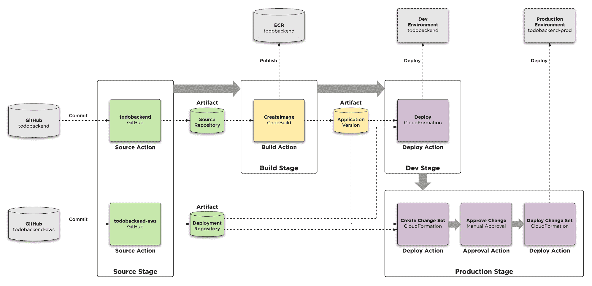持续交付流水线

在前面的图表中，流水线添加了一个新阶段（称为**生产阶段**），只有在您的应用程序成功部署在开发环境中才能执行。与开发阶段的持续部署方法不同，后者立即部署到开发环境中，生产阶段首先创建一个 CloudFormation 变更集，该变更集标识了部署的所有更改，然后触发一个手动批准操作，需要某人审查变更集并批准或拒绝更改。假设更改得到批准，生产阶段将部署更改到生产环境中，这些操作集合将共同提供对生产（或其他受控）环境的受控发布的支持。

现在您已经对 CodePipeline 有了一个高层次的概述，让我们开始创建我们在第一个图表中讨论的持续集成流水线。在构建这个流水线之前，我们需要构建一个自定义的构建容器，以满足 todobackend 存储库中定义的 Docker 工作流的要求，并且我们还需要添加对 CodeBuild 的支持，之后我们可以在 CodePipeline 中创建我们的流水线。

# 创建自定义 CodeBuild 容器

AWS CodeBuild 提供了一个构建服务，使用容器构建代理来执行您的构建。CodeBuild 提供了许多 AWS 策划的镜像，针对特定的应用程序语言和/或平台，比如[Python，Java，PHP 等等](https://docs.aws.amazon.com/codebuild/latest/userguide/build-env-ref-available.html)。CodeBuild 确实提供了一个专为构建 Docker 镜像而设计的镜像；然而，这个镜像有一定的限制，它不包括 AWS CLI、GNU make 和 Docker Compose 等工具，而我们构建 todobackend 应用程序需要这些工具。

虽然您可以在 CodeBuild 中运行预构建步骤来安装额外的工具，但这种方法会减慢构建速度，因为安装额外工具将在每次构建时都会发生。CodeBuild 确实支持使用自定义镜像，这允许您预打包所有应用程序构建所需的工具。

对于我们的用例，CodeBuild 构建环境必须包括以下内容：

+   访问 Docker 守护程序，鉴于构建建立了一个多容器环境来运行集成和验收测试

+   Docker Compose

+   GNU Make

+   AWS CLI

您可能想知道如何满足第一个要求，因为您的 CodeBuild 运行时环境位于一个隔离的容器中，无法直接访问其正在运行的基础架构。Docker 确实支持**Docker 中的 Docker**（**DinD**）的概念，其中 Docker 守护程序在您的 Docker 容器内运行，允许您安装一个可以构建 Docker 镜像并使用工具如 Docker Compose 编排多容器环境的 Docker 客户端。

Docker 中的 Docker 实践有些有争议，并且是使用 Docker 更像虚拟机而不是容器的一个例子。然而，为了运行构建，这种方法是完全可以接受的。

# 定义自定义 CodeBuild 容器

首先，我们需要构建我们的自定义 CodeBuild 镜像，我们将在名为`Dockerfile.codebuild`的 Dockerfile 中定义，该文件位于 todobackend-aws 存储库中。

以下示例显示了 Dockerfile：

```
FROM docker:dind

RUN apk add --no-cache bash make python3 && \
    pip3 install --no-cache-dir docker-compose awscli
```

因为 Docker 发布了一个 Docker 中的 Docker 镜像，我们可以简单地基于这个镜像进行定制；我们免费获得了 Docker 中的 Docker 功能。DinD 镜像基于 Alpine Linux，并已经包含所需的 Docker 守护程序和 Docker 客户端。接下来，我们将添加我们构建所需的特定工具。这包括 bash shell，GNU make 和 Python 3 运行时，这是安装 Docker Compose 和 AWS CLI 所需的。

您现在可以使用`docker build`命令在本地构建此镜像，如下所示：

```
> docker build -t codebuild -f Dockerfile.codebuild .
Sending build context to Docker daemon 405.5kB
Step 1/2 : FROM docker:dind
dind: Pulling from library/docker
ff3a5c916c92: Already exists
1a649ea86bca: Pull complete
ce35f4d5f86a: Pull complete
d0600fe571bc: Pull complete
e16e21051182: Pull complete
a3ea1dbce899: Pull complete
133d8f8629ec: Pull complete
71a0f0a757e5: Pull complete
0e081d1eb121: Pull complete
5a14be8d6d21: Pull complete
Digest: sha256:2ca0d4ee63d8911cd72aa84ff2694d68882778a1c1f34b5a36b3f761290ee751
Status: Downloaded newer image for docker:dind
 ---> 1f44348b3ad5
Step 2/2 : RUN apk add --no-cache bash make python3 && pip3 install --no-cache-dir docker-compose awscli
 ---> Running in d69027d58057
...
...
Successfully built 25079965c64c
Successfully tagged codebuild:latest
```

在上面的示例中，使用名称为`codebuild`创建新构建的 Docker 镜像。现在这样做是可以的，但是我们需要将此 CodeBuild 发布到**弹性容器注册表**（**ECR**），以便 CodeBuild 可以使用。

# 为自定义 CodeBuild 容器创建存储库

现在，您已经构建了一个自定义的 CodeBuild 图像，您需要将图像发布到 CodeBuild 可以从中拉取图像的位置。如果您使用 ECR，通常会将此图像发布到 ECR 中的存储库，这就是我们将采取的方法。

首先，您需要在`todobackend-aws`文件夹的根目录中的`ecr.yml`文件中添加一个新的存储库，该文件夹是您在本章中创建的：

```
AWSTemplateFormatVersion: "2010-09-09"

Description: ECR Resources

Resources:
  CodebuildRepository:
 Type: AWS::ECR::Repository
 Properties:
RepositoryName: docker-in-aws/codebuild
 RepositoryPolicyText:
 Version: '2008-10-17'
 Statement:
 - Sid: CodeBuildAccess
 Effect: Allow
 Principal:
 Service: codebuild.amazonaws.com
 Action:
 - ecr:GetDownloadUrlForLayer
 - ecr:BatchGetImage
 - ecr:BatchCheckLayerAvailability
  TodobackendRepository:
    Type: AWS::ECR::Repository
  ...
  ...
```

在前面的示例中，您创建了一个名为`docker-in-aws/codebuild`的新存储库，这将导致一个名为`<account-id>.dkr.ecr.<region>.amazonaws.com/docker-in-aws/codebuild`的完全限定存储库（例如`385605022855.dkr.ecr.us-east-1.amazonaws.com/docker-in-aws/codebuild`）。请注意，您必须授予 CodeBuild 服务拉取访问权限，因为 CodeBuild 需要拉取图像以运行作为其构建容器。

您现在可以使用`aws cloudformation deploy`命令将更改部署到 ECR 堆栈，您可能还记得来自章节《使用 ECR 发布 Docker 镜像》的命令，部署到名为 ecr-repositories 的堆栈：

```
> export AWS_PROFILE=docker-in-aws
> aws cloudformation deploy --template-file ecr.yml --stack-name ecr-repositories
Enter MFA code for arn:aws:iam::385605022855:mfa/justin.menga:

Waiting for changeset to be created..
Waiting for stack create/update to complete
Successfully created/updated stack - ecr-repositories
```

部署完成后，您需要使用您之前创建的图像的完全限定名称重新标记图像，然后您可以登录到 ECR 并发布图像：

```
> docker tag codebuild 385605022855.dkr.ecr.us-east-1.amazonaws.com/docker-in-aws/codebuild
> eval $(aws ecr get-login --no-include-email)
WARNING! Using --password via the CLI is insecure. Use --password-stdin.
Login Succeeded
> docker push 385605022855.dkr.ecr.us-east-1.amazonaws.com/docker-in-aws/codebuild
The push refers to repository [385605022855.dkr.ecr.us-east-1.amazonaws.com/docker-in-aws/codebuild]
770fb042ae3b: Pushed
0cdc6e0d843b: Pushed
395fced17f47: Pushed
3abf4e550e49: Pushed
0a6dfdbcc220: Pushed
27760475e1ac: Pushed
5270ef39cae0: Pushed
2c88066e123c: Pushed
b09386d6aa0f: Pushed
1ed7a5e2d1b3: Pushed
cd7100a72410: Pushed
latest: digest:
sha256:858becbf8c64b24e778e6997868f587b9056c1d1617e8d7aa495a3170761cf8b size: 2618
```

# 向您的应用程序存储库添加 CodeBuild 支持

每当您创建 CodeBuild 项目时，必须定义 CodeBuild 应如何测试和构建应用程序源代码，然后发布应用程序工件和/或 Docker 镜像。 CodeBuild 在构建规范中定义这些任务，构建规范提供了 CodeBuild 代理在运行构建时应执行的构建说明。

CodeBuild 允许您以多种方式提供构建规范：

+   **自定义**：CodeBuild 查找项目的源存储库中定义的文件。默认情况下，这是一个名为`buildspec.yml`的文件；但是，您还可以配置一个自定义文件，其中包含您的构建规范。

+   **预配置**：当您创建 CodeBuild 项目时，可以在项目设置的一部分中定义构建规范。

+   按需：如果您使用 AWS CLI 或 SDK 启动 CodeBuild 构建作业，您可以覆盖预配置或自定义的构建规范

一般来说，我建议使用自定义方法，因为它允许存储库所有者（通常是您的开发人员）独立配置和维护规范；这是我们将采取的方法。

以下示例演示了在名为`buildspec.yml`的文件中向 todobackend 存储库添加构建规范：

```
version: 0.2

phases:
  pre_build:
    commands:
      - nohup /usr/local/bin/dockerd --host=unix:///var/run/docker.sock --storage-driver=overlay&
      - timeout -t 15 sh -c "until docker info; do echo .; sleep 1; done"
      - export BUILD_ID=$(echo $CODEBUILD_BUILD_ID | sed 's/^[^:]*://g')
      - export APP_VERSION=$CODEBUILD_RESOLVED_SOURCE_VERSION.$BUILD_ID
      - make login
  build:
    commands:
      - make test
      - make release
      - make publish
  post_build:
    commands:
      - make clean
      - make logout
```

构建规范首先指定了必须包含在每个构建规范中的版本，本书编写时最新版本为`0.2`。接下来，您定义了阶段序列，这是必需的，定义了 CodeBuild 将在构建的各个阶段运行的命令。在前面的示例中，您定义了三个阶段：

+   `pre_build`：CodeBuild 在构建之前运行的命令。在这里，您可以运行诸如登录到 ECR 或构建成功运行所需的任何其他命令。

+   `build`：这些命令运行您的构建步骤。

+   `post_build`：CodeBuild 在构建后运行的命令。这些通常涉及清理任务，例如退出 ECR 并删除临时文件。

您可以在[`docs.aws.amazon.com/codebuild/latest/userguide/build-spec-ref.html`](https://docs.aws.amazon.com/codebuild/latest/userguide/build-spec-ref.html)找到有关 CodeBuild 构建规范的更多信息。

在`pre_build`阶段，您执行以下操作：

+   前两个命令用于在自定义 CodeBuild 镜像中启动 Docker 守护程序；`nohup`命令将 Docker 守护程序作为后台任务启动，而`timeout`命令用于确保 Docker 守护程序已成功启动，然后再继续尝试。

+   导出一个`BUILD_ID`环境变量，用于将构建信息添加到将为您的构建生成的应用程序版本中。此`BUILD_ID`值将被添加到构建阶段期间构建的 Docker 镜像附加的应用程序版本标记中，因此，它只能包含与 Docker 标记格式兼容的字符。CodeBuild 作业 ID 通过`CODEBUILD_BUILD_ID`环境变量暴露给您的构建代理，并且格式为`<project-name>:<job-id>`，其中`<job-id>`是 UUID 值。CodeBuild 作业 ID 中的冒号在 Docker 标记中不受支持；因此，您可以使用`sed`表达式剥离作业 ID 的`<project-name>`部分，只留下将包含在 Docker 标记中的作业 ID 值。

+   导出`APP_VERSION`环境变量，在 Makefile 中用于定义构建的 Docker 镜像上标记的应用程序版本。当您在 CodeBuild 与 CodePipeline 一起使用时，重要的是要了解，呈现给 CodeBuild 的源构件实际上是位于 S3 存储桶中的一个压缩版本，CodePipeline 在从源代码库克隆源代码后创建。CodePipeline 不包括任何 Git 元数据；因此，在 todobackend Makefile 中的`APP_VERSION`指令 - `export APP_VERSION ?= $(shell git rev-parse --short HEAD` - 将失败，因为 Git 客户端将没有任何可用的 Git 元数据。幸运的是，在 GNU Make 中的`?=`语法意味着如果环境中已经定义了前述环境变量的值，那么就使用该值。因此，我们可以在 CodeBuild 环境中导出`APP_VERSION`，并且 Make 将只使用配置的值，而不是运行 Git 命令。在前面的示例中，您从一个名为`CODEBUILD_RESOLVED_SOURCE_VERSION`的变量构造了`APP_VERSION`，它是源代码库的完整提交哈希，并由 CodePipeline 设置。您还附加了在前一个命令中计算的`BUILD_ID`变量，这允许您将特定的 Docker 镜像构建跟踪到一个 CodeBuild 构建作业。

+   使用源代码库中包含的`make login`命令登录到 ECR。

一旦`pre_build`阶段完成，构建阶段就很简单了，只需执行我们在本书中迄今为止手动执行的各种构建步骤。最终的`post_build`阶段运行`make clean`任务来拆除 Docker Compose 环境，然后通过运行`make logout`命令删除任何本地 ECR 凭据。

一个重要的要点是`post_build`阶段始终运行，即使构建阶段失败也是如此。这意味着您应该仅将`post_build`任务保留为无论构建是否通过都会运行的操作。例如，您可能会尝试将`make publish`任务作为`post_build`步骤运行；但是，如果您这样做，且前一个构建阶段失败，CodeBuild 仍将尝试运行 make publish 任务，因为它被定义为`post_build`步骤。将 make publish 任务放置在构建阶段的最后一个操作确保如果 make test 或 make release 失败，构建阶段将立即以错误退出，绕过 make publish 操作并继续执行`post_build`步骤中的清理任务。

您可以在[`docs.aws.amazon.com/codebuild/latest/userguide/view-build-details.html#view-build-details-phases`](https://docs.aws.amazon.com/codebuild/latest/userguide/view-build-details.html#view-build-details-phases)找到有关所有 CodeBuild 阶段以及它们在成功/失败时是否执行的更多信息。

您需要执行的最后一步是将更改提交并推送到您的 Git 存储库，以便在配置 CodePipeline 和 CodeBuild 时新创建的`buildspec.yml`文件可用：

```
> git add -A
> git commit -a -m "Add build specification"
[master ab7ac16] Add build specification
 1 file changed, 19 insertions(+)
 create mode 100644 buildspec.yml
> git push
Counting objects: 3, done.
Delta compression using up to 8 threads.
Compressing objects: 100% (3/3), done.
Writing objects: 100% (3/3), 584 bytes | 584.00 KiB/s, done.
Total 3 (delta 1), reused 0 (delta 0)
remote: Resolving deltas: 100% (1/1), completed with 1 local object.
To github.com:docker-in-aws/todobackend.git
   5fdbe62..ab7ac16 master -> master
```

# 使用 CodePipeline 创建持续集成管道

现在，您已经建立了支持 CodeBuild 的先决条件，您可以创建一个持续集成的 CodePipeline 管道，该管道将使用 CodeBuild 来测试、构建和发布您的 Docker 镜像。持续集成侧重于不断将应用程序源代码更改合并到主分支，并通过创建构建并针对其运行自动化测试来验证更改。

根据本章第一个图表，当您为持续集成配置 CodePipeline 管道时，通常涉及两个阶段：

+   **源阶段**：下载源应用程序存储库，并使其可用于后续阶段。对于我们的用例，您将把 CodePipeline 连接到 GitHub 存储库的主分支，对该存储库的后续提交将自动触发新的管道执行。

+   **构建阶段**：运行在源应用程序存储库中定义的构建、测试和发布工作流程。对于我们的用例，我们将使用 CodeBuild 来运行此阶段，它将执行源存储库中定义的构建任务`buildspec.yml`文件，这是在本章前面创建的。

# 使用 AWS 控制台创建 CodePipeline 管道

要开始，请首先从 AWS 控制台中选择**服务**，然后选择**CodePipeline**。如果这是您第一次使用 CodePipeline，您将看到一个介绍页面，您可以单击“开始”按钮开始 CodePipeline 向导。

首先要求您为管道输入名称，然后单击“下一步”，您将被提示设置源提供程序，该提供程序定义将在您的管道中使用的源存储库或文件的提供程序：


在从下拉菜单中选择 GitHub 后，单击“连接到 GitHub”按钮，这将重定向您到 GitHub，在那里您将被提示登录并授予 CodePipeline 对您的 GitHub 帐户的访问权限：

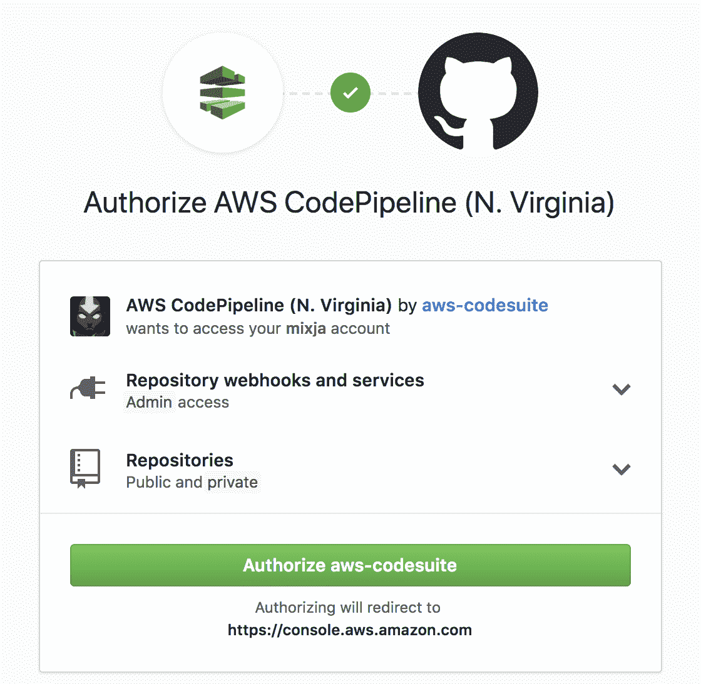

点击授权 aws-codesuite 按钮后，您将被重定向回 CodePipeline 向导，您可以选择 todobackend 存储库和主分支：


如果单击“下一步”，您将被要求选择构建提供程序，该提供程序定义将在您的管道中执行构建操作的构建服务的提供程序：


在选择 AWS CodeBuild 并选择“创建新的构建项目”选项后，您需要配置构建项目，如下所示：

+   环境镜像：对于环境镜像，请选择“指定 Docker 镜像”选项，然后将环境类型设置为 Linux，自定义镜像类型设置为 Amazon ECR；然后选择您在本章前面发布的`docker-in-aws/codebuild repository/latest`镜像。

+   高级：确保设置特权标志，如下面的屏幕截图所示。每当您在 Docker 中运行 Docker 镜像时，这是必需的：


完成构建项目配置后，请确保在单击“下一步”继续之前，单击“保存构建项目”。

在下一阶段，您将被要求定义一个部署阶段。在这一点上，我们只想执行测试、构建和发布我们的 Docker 应用程序的持续集成任务，因此选择“无部署”选项，然后单击“下一步”继续：


最后一步是配置 CodePipeline 可以假定的 IAM 角色，以执行管道中的各种构建和部署任务。单击“创建角色”按钮，这将打开一个新窗口，要求您创建一个新的 IAM 角色，具有适当的权限，供 CodePipeline 使用：


在审阅政策文件后，单击“允许”，这将在 CodePipeline 向导中选择新角色。最后，单击“下一步”，审查管道配置，然后单击“创建管道”以创建新管道。

在这一点上，您的管道将被创建，并且您将被带到您的管道的管道配置视图。每当您第一次为管道创建管道时，CodePipeline 将自动触发管道的第一次执行，几分钟后，您应该注意到管道的构建阶段失败了：


要了解有关构建失败的更多信息，请单击“详细信息”链接，这将弹出有关失败的更多详细信息，并且还将包括到构建失败的 CodeBuild 作业的链接。如果单击此链接并向下滚动，您会看到失败发生在`pre_build`阶段，并且在构建日志中，问题与 IAM 权限问题有关：

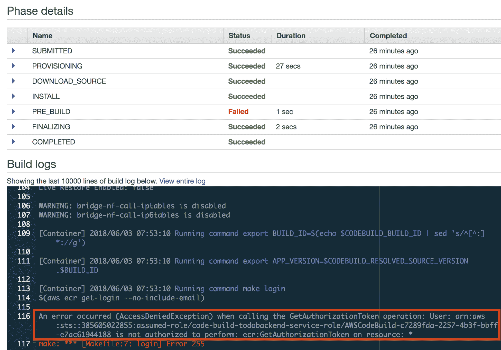

问题在于 CodePipeline 向导期间自动创建的 IAM 角色不包括登录到 ECR 的权限。

为了解决这个问题，打开 IAM 控制台，从左侧菜单中选择角色，找到由向导创建的`code-build-todobackend-service-role`。在权限选项卡中，点击附加策略，找到`AmazonEC2ContainerRegistryPowerUser`托管策略，并点击附加策略按钮。power user 角色授予登录、拉取和推送权限，因为我们将作为构建工作流的一部分发布到 ECR，所以需要这个级别的访问权限。完成配置后，角色的权限选项卡应该与下面的截图一样：


现在您已经解决了权限问题，请导航回到您的流水线的 CodePipeline 详细信息视图，点击构建阶段的重试按钮，并确认重试失败的构建。这一次，几分钟后，构建应该成功完成，您可以使用`aws ecr list-images`命令来验证已经发布了新的镜像到 ECR：

```
> aws ecr list-images --repository-name docker-in-aws/todobackend \
 --query imageIds[].imageTag --output table
-----------------------------------------------------------------------------------
| ListImages                                                                      |
+---------------------------------------------------------------------------------+
| 5fdbe62                                                                         |
| latest                                                                          |
| ab7ac1649e8ef4d30178c7f68899628086155f1d.10f5ef52-e3ff-455b-8ffb-8b760b7b9c55   |
+---------------------------------------------------------------------------------+
```

请注意，最后发布的镜像的格式为`<long commit hash>`.`<uuid>`，其中`<uuid>`是 CodeBuild 作业 ID，证实 CodeBuild 已成功将新镜像发布到 ECR。

# 使用 CodePipeline 创建持续交付流水线

此时，您已经拥有了一个持续集成流水线，每当在主分支上推送提交到您的源代码库时，它将自动发布新的 Docker 镜像。在某个时候，您将希望将 Docker 镜像部署到一个环境（也许是一个分段环境，在那里您可以运行一些端到端测试来验证您的应用程序是否按预期工作），然后再部署到为最终用户提供服务的生产环境。虽然您可以通过手动更新`ApplicationImageTag`输入来手动部署这些更改到 todobackend 堆栈，但理想情况下，您希望能够自动将这些更改持续部署到至少一个环境中，这样可以立即让开发人员、测试人员和产品经理访问，并允许从参与应用程序开发的关键利益相关者那里获得快速反馈。

这个概念被称为持续部署。换句话说，每当您持续集成和构建经过测试的软件构件时，您就会持续部署这些构件。持续部署在当今非常普遍，特别是如果您部署到非生产环境。远不那么普遍的是一直持续部署到生产环境。要实现这一点，您必须具有高度自动化的部署后测试，并且至少根据我的经验，这对大多数组织来说仍然很难实现。更常见的方法是持续交付，您可以将其视为一旦确定您的发布准备好投入生产，就能自动部署到生产的能力。

持续交付允许常见的情况，即您需要对生产环境进行受控发布，而不是一旦发布可用就持续部署到生产环境。这比一直持续部署到生产环境更可行，因为它允许在选择部署到生产环境之前对非生产环境进行手动测试。

现在您已经了解了持续交付的背景，让我们扩展我们的管道以支持持续交付。

CodePipeline 包括对 ECS 作为部署目标的支持，您可以将持续集成管道发布的新镜像部署到目标 ECS 集群和 ECS 服务。在本章中，我将使用 CloudFormation 来部署应用程序更改；但是，您可以在[`docs.aws.amazon.com/AmazonECS/latest/developerguide/ecs-cd-pipeline.html`](https://docs.aws.amazon.com/AmazonECS/latest/developerguide/ecs-cd-pipeline.html)了解更多关于 ECS 部署机制的信息。

这一阶段的第一步是配置您的代码更改的持续部署到非生产环境，这需要您执行以下配置操作，这些操作将在后续详细讨论：

+   在您的源代码存储库中发布版本信息

+   为您的部署存储库添加 CodePipeline 支持

+   将您的部署存储库添加到 CodePipeline

+   为您的构建操作添加一个输出构件

+   为 CloudFormation 部署创建一个 IAM 角色

+   在管道中添加一个部署阶段

# 在您的源代码存储库中发布版本信息

我们流水线的一个关键要求是能够将新构建的 Docker 镜像部署到我们的 AWS 环境中。目前，CodePipeline 并不真正了解发布的 Docker 镜像标记。我们知道该标记在 CodeBuild 环境中配置，但 CodePipeline 并不了解这一点。

为了使用在 CodeBuild 构建阶段生成的 Docker 镜像标记，您需要生成一个输出构件，首先由 CodeBuild 收集，然后在 CodePipeline 中的未来部署阶段中提供。

为了做到这一点，您必须首先定义 CodeBuild 应该收集的构件，您可以通过在 todobackend 存储库中的`buildspec.yml`构建规范中添加`artifacts`参数来实现这一点：

```
version: 0.2

phases:
  pre_build:
    commands:
      - nohup /usr/local/bin/dockerd --host=unix:///var/run/docker.sock --storage-driver=overlay&
      - timeout -t 15 sh -c "until docker info; do echo .; sleep 1; done"
      - export BUILD_ID=$(echo $CODEBUILD_BUILD_ID | sed 's/^[^:]*://g')
      - export APP_VERSION=$CODEBUILD_RESOLVED_SOURCE_VERSION.$BUILD_ID
      - make login
  build:
    commands:
      - make test
      - make release
      - make publish
      - make version > version.json
  post_build:
    commands:
      - make clean
      - make logout

artifacts:
 files:
 - version.json
```

在上面的示例中，`artifacts`参数配置 CodeBuild 在位置`version.json`查找构件。请注意，您还需要向构建阶段添加一个额外的命令，该命令将`make version`命令的输出写入`version.json`文件，CodeBuild 期望在那里找到构件。

在这一点上，请确保您提交并推送更改到 todobackend 存储库，以便将来的构建可以使用这些更改。

# 向部署存储库添加 CodePipeline 支持

当您使用 CodePipeline 使用 CloudFormation 部署您的环境时，您需要确保您可以提供一个包含输入堆栈参数、堆栈标记和堆栈策略配置的配置文件。该文件必须以 JSON 格式实现，如[`docs.aws.amazon.com/AWSCloudFormation/latest/UserGuide/continuous-delivery-codepipeline-cfn-artifacts.html#w2ab2c13c15c15`](https://docs.aws.amazon.com/AWSCloudFormation/latest/UserGuide/continuous-delivery-codepipeline-cfn-artifacts.html#w2ab2c13c15c15)中定义的那样，因此我们需要修改`todobackend-aws`存储库中输入参数文件的格式，该文件目前以`<parameter>=<value>`格式位于名为`dev.cfg`的文件中。根据所引用的文档，您所有的输入参数都需要位于一个名为`Parameters`的键下的 JSON 文件中，您可以在`todobackend-aws`存储库的根目录下定义一个名为`dev.json`的新文件。

```
{ 
  "Parameters": {
    "ApplicationDesiredCount": "1",
    "ApplicationImageId": "ami-ec957491",
    "ApplicationImageTag": "latest",
    "ApplicationSubnets": "subnet-a5d3ecee,subnet-324e246f",
    "VpcId": "vpc-f8233a80"
  }
}
```

在前面的例子中，请注意我已将`ApplicationImageTag`的值更新为`latest`。这是因为我们的流水线实际上会动态地从流水线的构建阶段获取`ApplicationImageTag`输入的值，而`latest`值是一个更安全的默认值，以防您希望从命令行手动部署堆栈。

此时，`dev.cfg`文件是多余的，可以从您的存储库中删除；但是，请注意，鉴于`aws cloudformation deploy`命令期望以`<parameter>=<value>`格式提供输入参数，您需要修改手动从命令行运行部署的方式。

您可以解决这个问题的一种方法是使用`jq`实用程序将新的`dev.json`配置文件转换为所需的`<parameter>=<value>`格式：

```
> aws cloudformation deploy --template-file stack.yml --stack-name todobackend \
    --parameter-overrides $(cat dev.json | jq -r '.Parameters|to_entries[]|.key+"="+.value') \
    --capabilities CAPABILITY_NAMED_IAM
```

这个命令现在相当冗长，为了简化运行这个命令，您可以向`todobackend-aws`存储库添加一个简单的 Makefile：

```
.PHONY: deploy

deploy/%:
  aws cloudformation deploy --template-file stack.yml --stack-name todobackend-$* \
    --parameter-overrides $$(cat $*.json | jq -r '.Parameters|to_entries[]|.key+"="+.value') \
    --capabilities CAPABILITY_NAMED_IAM
```

在前面的例子中，任务名称中的`%`字符捕获了一个通配文本值，无论何时执行`make deploy`命令。例如，如果您运行`make deploy`/`dev`，那么`%`字符将捕获`dev`，如果您运行`make deploy`/`prod`，那么捕获的值将是`prod`。然后，您可以使用`$*`变量引用捕获的值，您可以看到我们已经在堆栈名称（`todobackend-$*`，在前面的例子中会扩展为`todobackend-dev`和`todobackend-prod`）和用于 cat`dev.json`或`prod.json`文件的命令中替换了这个变量。请注意，因为在本书中我们一直将堆栈命名为`todobackend`，所以这个命令对我们来说不太适用，但是如果您将堆栈重命名为`todobackend-dev`，这个命令将使手动部署到特定环境变得更加容易。

在继续之前，您需要添加新的`dev.json`文件，提交并推送更改到源 Git 存储库，因为我们将很快将`todobackend-aws`存储库添加为 CodePipeline 流水线中的另一个源。

# 为 CloudFormation 部署创建 IAM 角色

当您使用 CodePipeline 部署 CloudFormation 堆栈时，CodePipeline 要求您指定一个 IAM 角色，该角色将由 CloudFormation 服务来部署您的堆栈。CloudFormation 支持指定 CloudFormation 服务将承担的 IAM 角色，这是一个强大的功能，允许更高级的配置场景，例如从中央构建账户进行跨账户部署。此角色必须指定 CloudFormation 服务作为可信实体，可以承担该角色；因此，通常不能使用为人员访问创建的管理角色，例如您在本书中一直在使用的管理员角色。

要创建所需的角色，请转到 IAM 控制台，从左侧菜单中选择“角色”，然后点击“创建角色”按钮。在“选择服务”部分，选择“CloudFormation”，然后点击“下一步：权限”继续。在“附加权限策略”屏幕上，您可以创建或选择一个适当的策略，其中包含创建堆栈所需的各种权限。为了保持简单，我将只选择“AdministratorAccess”策略。但是，在实际情况下，您应该创建或选择一个仅授予创建 CloudFormation 堆栈所需的特定权限的策略。点击“下一步：审阅”按钮后，指定角色名称为`cloudformation-deploy`，然后点击“创建角色”按钮创建新角色：

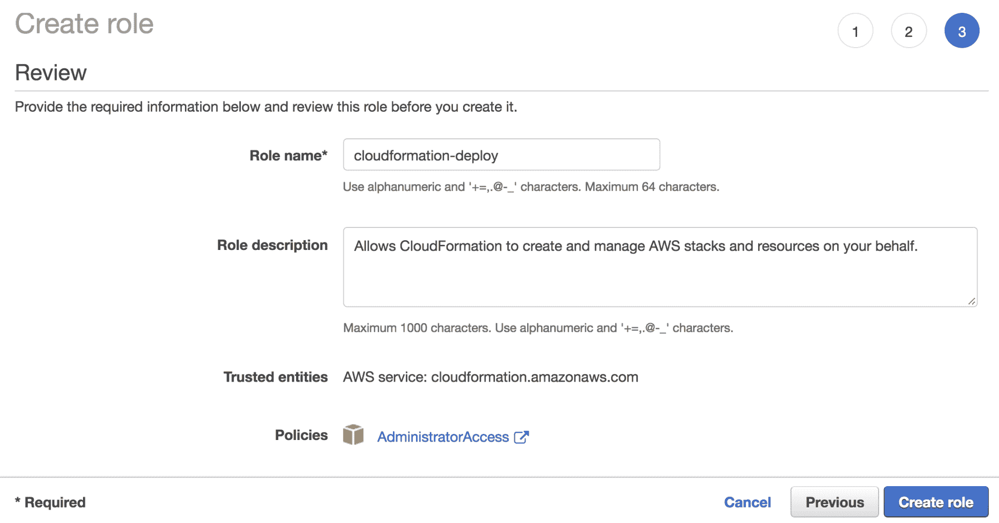

# 向 CodePipeline 添加部署存储库

现在，您已经准备好了适当的堆栈配置文件和 IAM 部署角色，可以开始修改管道，以支持将应用程序更改持续交付到目标 AWS 环境。您需要执行的第一个修改是将 todobackend-aws 存储库作为另一个源操作添加到管道的源阶段。要执行此操作，请转到管道的详细信息视图，并点击“编辑”按钮。

在编辑屏幕中，您可以点击源阶段右上角的铅笔图标，这将改变视图并允许您添加一个新的源操作，可以在当前操作之前、之后或与当前操作在同一级别：

编辑管道

对于我们的场景，我们可以并行下载部署存储库源；因此，在与其他源存储库相同级别添加一个新操作，这将打开一个添加操作对话框。选择“动作类别”为“源”，配置一个名称为`DeploymentRepository`或类似的操作名称，然后选择 GitHub 作为源提供者，并单击“连接到 GitHub”按钮，在`docker-in-aws/todobackend-aws`存储库上选择主分支：

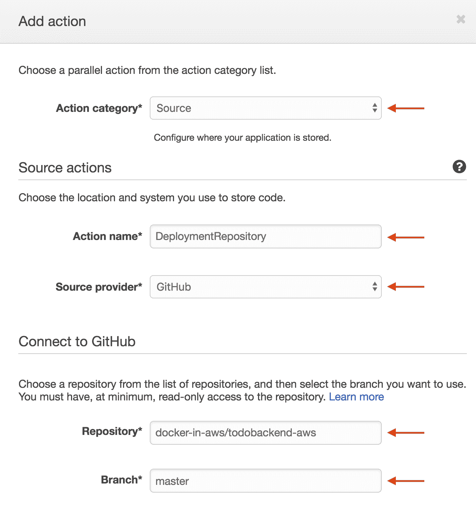添加部署存储库

接下来，滚动到页面底部，并为此源操作的输出工件配置一个名称。CodePipeline 将使部署存储库中的基础架构模板和配置可用于管道中的其他阶段，您可以通过配置的输出工件名称引用它们：

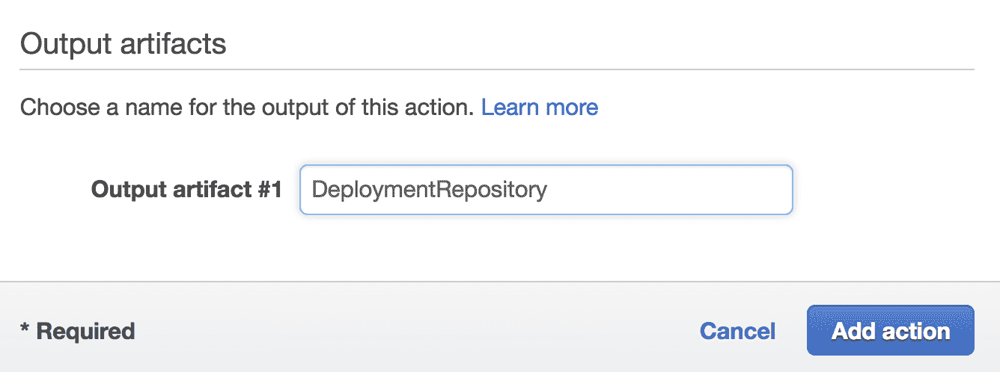配置输出工件名称

在前面的截图中，您还将输出工件名称配置为`DeploymentRepository`（与源操作名称相同），这有助于，因为管道详细信息视图仅显示阶段和操作名称，不显示工件名称。

# 在构建阶段添加输出工件

添加部署存储库操作后，编辑管道屏幕应如下截图所示：

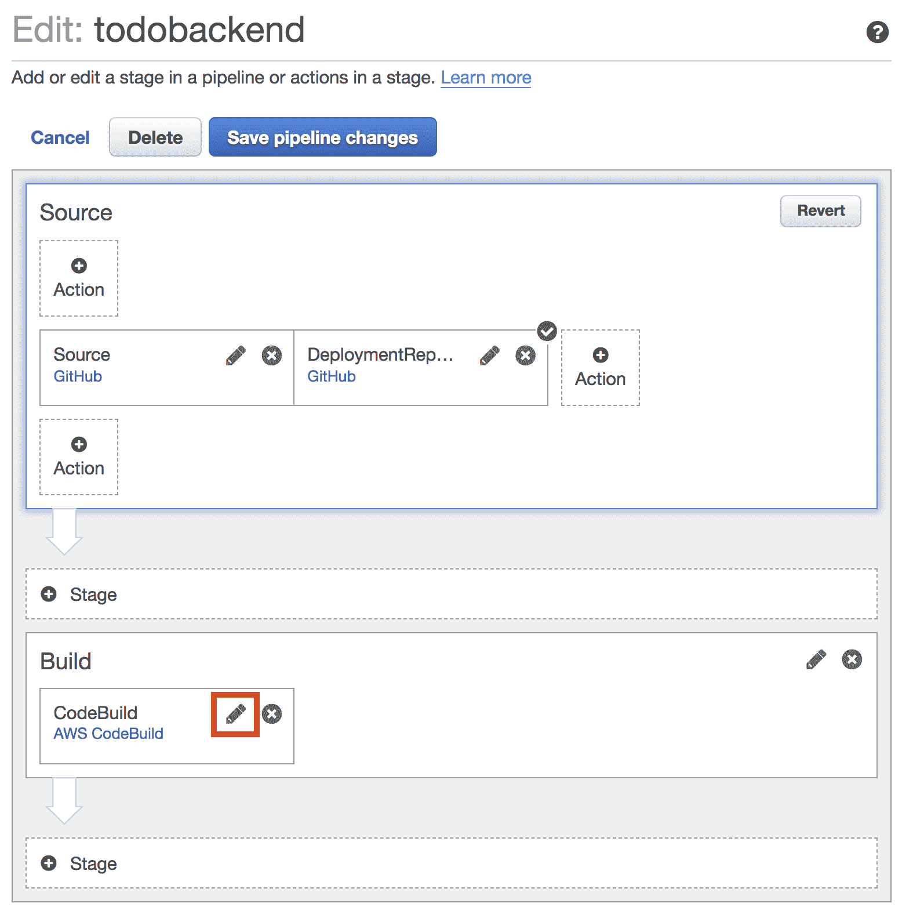编辑管道屏幕

您需要执行的下一个管道配置任务是修改构建阶段中的 CodeBuild 构建操作，该操作是由 CodePipeline 向导为您创建的，当您创建管道时。

您可以通过点击前面截图中 CodeBuild 操作框右上角的铅笔图标来执行此操作，这将打开编辑操作对话框：

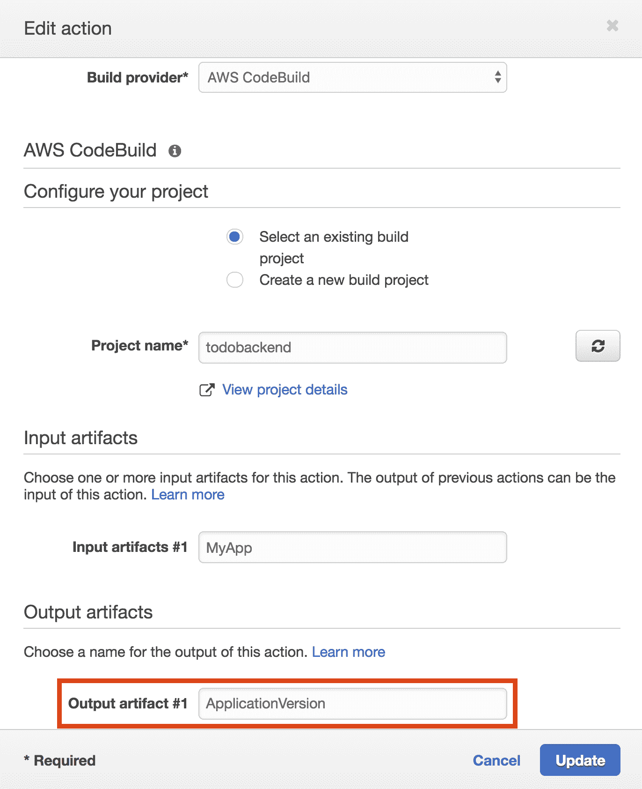编辑构建操作

在前面的截图中，请注意 CodePipeline 向导已经配置了输入和输出工件：

+   输入工件：CodePipeline 向导将其命名为`MyApp`，这指的是与您创建管道时引用的源存储库相关联的输出工件（在本例中，这是 GitHub todobackend 存储库）。如果要重命名此工件，必须确保在拥有操作（在本例中是源阶段中的源操作）上重命名输出工件名称，然后更新任何使用该工件作为输入的操作。

+   输出工件：CodePipeline 向导默认将其命名为`MyAppBuild`，然后可以在流水线的后续阶段中引用。输出工件由`buildspec.yml`文件中的 artifacts 属性确定，对于我们的用例，这个工件不是应用程序构建，而是捕获版本元数据（`version.json`）的版本工件，因此我们将这个工件重命名为`ApplicationVersion`。

# 向流水线添加部署阶段

在上述截图中单击“更新”按钮后，您可以通过单击构建阶段下方的“添加阶段”框来添加一个新阶段。对于阶段名称，请输入名称`Dev`，这将代表部署到名为 Dev 的环境，然后单击“添加操作”框以添加新操作：

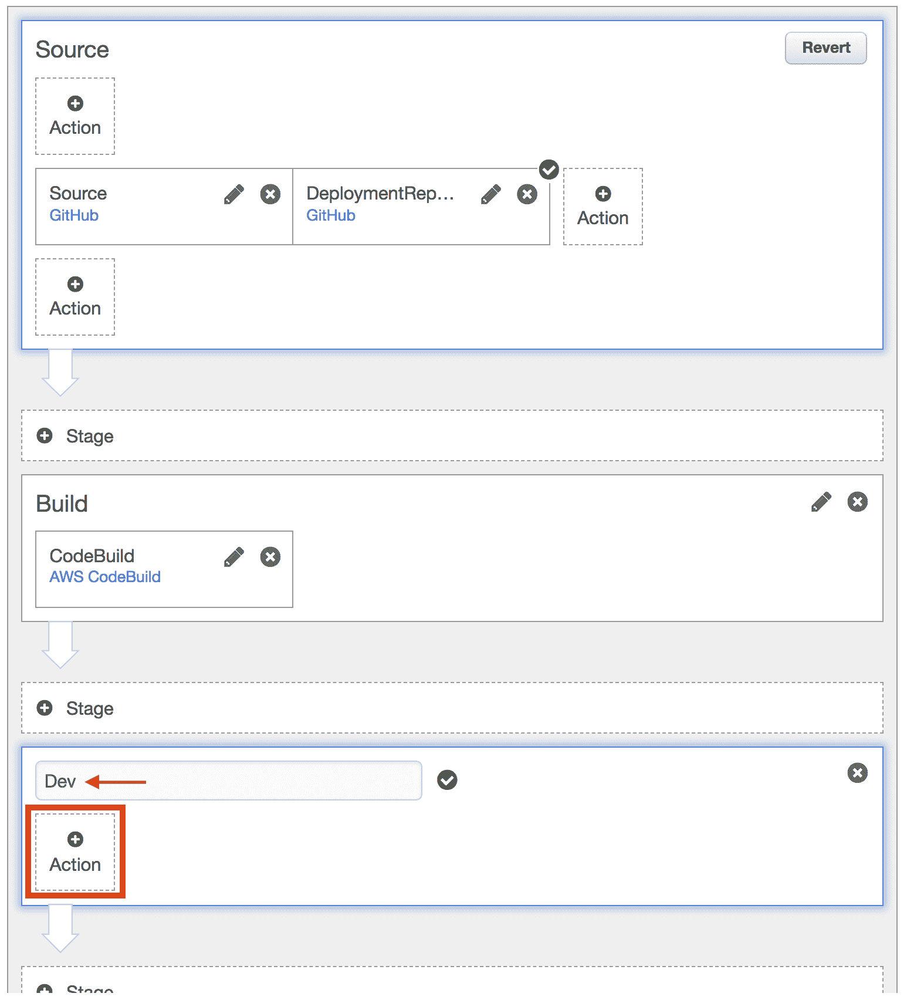添加部署操作

因为这是一个部署阶段，所以从操作类别下拉菜单中选择“部署”，配置一个操作名称为“部署”，并选择 AWS CloudFormation 作为部署提供程序：

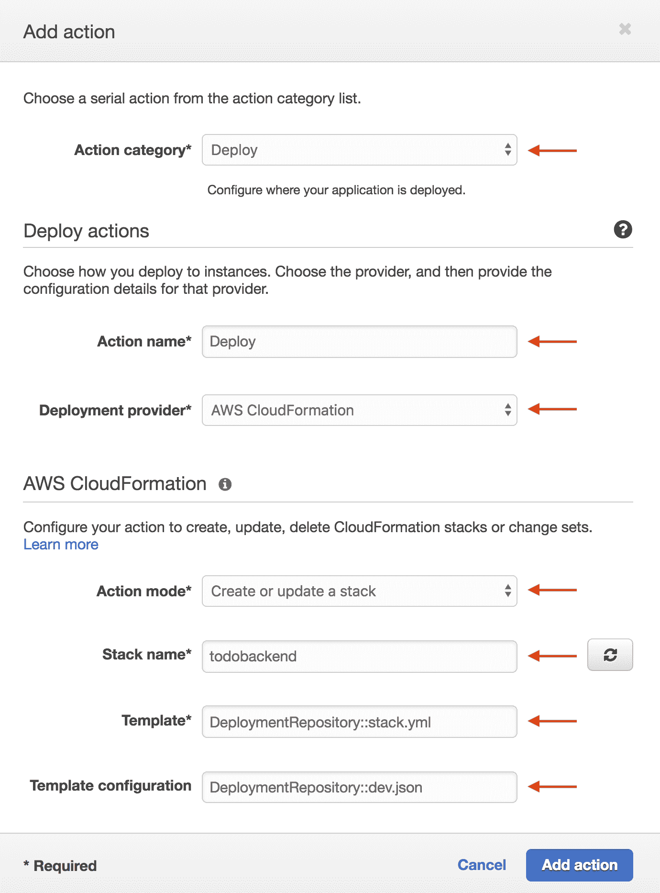配置 CloudFormation 部署操作

这将公开与 CloudFormation 部署相关的一些配置参数，如前面的截图所示：

+   操作模式：选择“创建或更新堆栈”选项，如果堆栈不存在，则将创建一个新堆栈，或者更新现有堆栈。

+   堆栈名称：引用您在之前章节中已部署的现有 todobackend 堆栈。

+   模板：指的是应该部署的 CloudFormation 模板文件。这是以`InputArtifactName::TemplateFileName`的格式表示的，在我们的情况下是`DeploymentRepository::stack.yml`，因为我们为`DeploymentRepository`源操作配置了一个输出工件名称，并且我们的堆栈位于存储库根目录的`stack.yml`文件中。

+   模板配置：指的是用于提供堆栈参数、标记和堆栈策略的配置文件。这需要引用您之前创建的新`dev.json`文件，在`todobackend-aws`部署存储库中；它与模板参数的格式相同，值为`DeploymentRepository::dev.json`。

一旦您配置了前面截图中显示的属性，请继续向下滚动并展开高级部分，如下面的截图所示：

配置额外的 CloudFormation 部署操作属性

以下描述了您需要配置的每个额外参数：

+   功能：这授予了 CloudFormation 部署操作的权限，以代表您创建 IAM 资源，并且与您传递给`aws cloudformation deploy`命令的`--capabilities`标志具有相同的含义。

+   角色名称：这指定了 CloudFormation 部署操作使用的 IAM 角色，用于部署您的 CloudFormation 堆栈。引用您之前创建的`cloudformation-deploy`角色。

+   参数覆盖：此参数允许您覆盖通常由模板配置文件（`dev.json`）或 CloudFormation 模板中的默认值提供的输入参数值。对于我们的用例，我们需要覆盖`ApplicationImageTag`参数，因为这需要反映作为构建阶段的一部分创建的图像标记。CodePipeline 支持两种类型的参数覆盖（请参阅[使用参数覆盖函数](https://docs.aws.amazon.com/AWSCloudFormation/latest/UserGuide/continuous-delivery-codepipeline-parameter-override-functions.html)），对于我们的用例，我们使用`Fn::GetParam`覆盖，它可以用于从由您的流水线输出的工件中提取属性值的 JSON 文件中。回想一下，在本章的前面，我们向 todobackend 存储库添加了一个`make version`任务，该任务输出了作为 CodeBuild 构建规范的一部分收集的`version.json`文件。我们更新了构建操作以引用此工件为`ApplicationVersion`。在前面的屏幕截图中，提供给`Fn::GetParam`调用的输入列表首先引用了工件（`ApplicationVersion`），然后是工件中 JSON 文件的路径（`version.json`），最后是 JSON 文件中保存参数覆盖值的键（`Version`）。

+   输入工件：这必须指定您在部署配置中引用的任何输入工件。在这里，我们添加了`DeploymentRepository`（用于模板和模板配置参数）和`ApplicationVersion`（用于参数覆盖配置）。

完成后，单击“添加操作”按钮，然后您可以单击“保存管道更改”以完成管道的配置。在这一点上，您可以通过单击“发布更改”按钮来测试您的新部署操作是否正常工作，这将手动触发管道的新执行；几分钟内，您的管道应该成功构建、测试和发布一个新的镜像作为构建阶段的一部分，然后成功通过 dev 阶段将更改部署到您的 todobackend 堆栈：

通过 CodePipeline 成功部署 CloudFormation

在上面的屏幕截图中，您可以在部署期间或之后单击“详细信息”链接，这将带您到 CloudFormation 控制台，并向您显示有关正在进行中或已完成的部署的详细信息。如果您展开“参数”选项卡，您应该会看到 ApplicationImageTag 引用的标签格式为`<长提交哈希>`.`<codebuild 作业 ID>`，这证实我们的流水线实际上已部署了在构建阶段构建的 Docker 镜像：

确认覆盖的输入参数

# 使用 CodePipeline 持续交付到生产环境

现在我们正在持续部署到非生产环境，我们持续交付旅程的最后一步是启用能够以受控方式将应用程序发布到生产环境的能力。CodePipeline 通过利用 CloudFormation 的一个有用特性来支持这一能力，称为变更集。变更集描述了将应用于给定 CloudFormation 堆栈的各种配置更改，这些更改基于可能已应用于堆栈模板文件和/或输入参数的任何更改。对于新的应用程序发布，通常只会更改定义新应用程序构件版本的输入参数。例如，我们的流水线的 dev 阶段覆盖了`ApplicationImageTag`输入参数。在某些情况下，您可能会对 CloudFormation 堆栈和输入参数进行更广泛的更改。例如，您可能需要为容器添加新的环境变量，或者向堆栈添加新的基础设施组件或支持服务。这些更改通常会提交到您的部署存储库中，并且鉴于我们的部署存储库是我们流水线中的一个源，对部署存储库的任何更改都将被捕获为一个变更。

CloudFormation 变更集为您提供了一个机会，可以审查即将应用于目标环境的任何更改，如果变更集被认为是安全的，那么您可以从该变更集发起部署。CodePipeline 支持生成 CloudFormation 变更集作为部署操作，然后可以与单独的手动批准操作结合使用，允许适当的人员审查变更集，随后批准或拒绝变更。如果变更得到批准，那么您可以从变更集触发部署，从而提供一种有效的方式来对生产环境或任何需要某种形式的变更控制的环境进行受控发布。

现在让我们扩展我们的流水线，以支持将应用程序发布受控地部署到新的生产环境，这需要您执行以下配置更改：

+   向部署存储库添加新的环境配置文件

+   向流水线添加创建变更集操作

+   向流水线添加手动批准操作

+   向流水线添加部署变更集操作

+   部署到生产环境

# 向部署存储库添加新的环境配置文件

因为我们正在创建一个新的生产环境，我们需要向部署存储库添加一个环境配置文件，其中将包括特定于您的生产环境的输入参数。如前面的示例所示，演示了在`todobackend-aws`存储库的根目录下添加一个名为`prod.json`的新文件：

```
{ 
  "Parameters": {
    "ApplicationDesiredCount": "1",
    "ApplicationImageId": "ami-ec957491",
    "ApplicationImageTag": "latest",
    "ApplicationSubnets": "subnet-a5d3ecee,subnet-324e246f",
    "VpcId": "vpc-f8233a80"
  }
}
```

您可以看到配置文件的格式与我们之前修改的`dev.json`文件相同。在现实世界的情况下，您当然会期望配置文件中有所不同。例如，我们正在使用相同的应用子网和 VPC ID；您通常会为生产环境拥有一个单独的 VPC，甚至一个单独的账户，但为了保持简单，我们将生产环境部署到与开发环境相同的 VPC 和子网中。

您还需要对我们的 CloudFormation 堆栈文件进行一些微小的更改，因为其中有一些硬编码的名称，如果您尝试在同一 AWS 账户中创建一个新堆栈，将会导致冲突。

```
...
...
Resources:
  ...
  ...
  ApplicationCluster:
    Type: AWS::ECS::Cluster
    Properties:
      # ClusterName: todobackend-cluster
      ClusterName: !Sub: ${AWS::StackName}-cluster
  ...
  ...
  MigrateTaskDefinition:
    Type: AWS::ECS::TaskDefinition
    Properties:
      # Family: todobackend-migrate
      Family: !Sub ${AWS::StackName}-migrate
      ...
      ...
  ApplicationTaskDefinition:
    Type: AWS::ECS::TaskDefinition
    Properties:
      # Family: todobackend
      Family: !Ref AWS::StackName
  ...
  ...
```

在前面的示例中，我已经注释了以前的配置，然后突出显示了所需的新配置。在所有情况下，我们将硬编码的对 todobackend 的引用替换为对堆栈名称的引用。鉴于 CloudFormation 堆栈名称在给定的 AWS 账户和区域内必须是唯一的，这确保了修改后的资源将具有唯一名称，不会与同一账户和区域内的其他堆栈发生冲突。

为了保持简单，生产环境的 CloudFormation 堆栈将使用我们在*管理秘密*章节中创建的相同秘密。在现实世界的情况下，您会为每个环境维护单独的秘密。

在放置新的配置文件和模板更改后，确保在继续下一部分之前已经将更改提交并推送到 GitHub：

```
> git add -A
> git commit -a -m "Add prod environment support"
[master a42af8d] Add prod environment support
 2 files changed, 12 insertions(+), 3 deletions(-)
 create mode 100644 prod.json
> git push
...
...
```

# 向管道添加创建变更集操作

我们现在准备向我们的管道中添加一个新阶段，用于将我们的应用部署到生产环境。我们将在这个阶段创建第一个操作，即创建一个 CloudFormation 变更集。

在管道的详细信息视图中，单击“编辑”按钮，然后在 dev 阶段之后添加一个名为 Production 的新阶段，然后向新阶段添加一个操作：

向管道添加一个生产阶段

在“添加操作”对话框中，您需要创建一个类似于为 dev 阶段创建的部署操作的操作，但有一些变化：

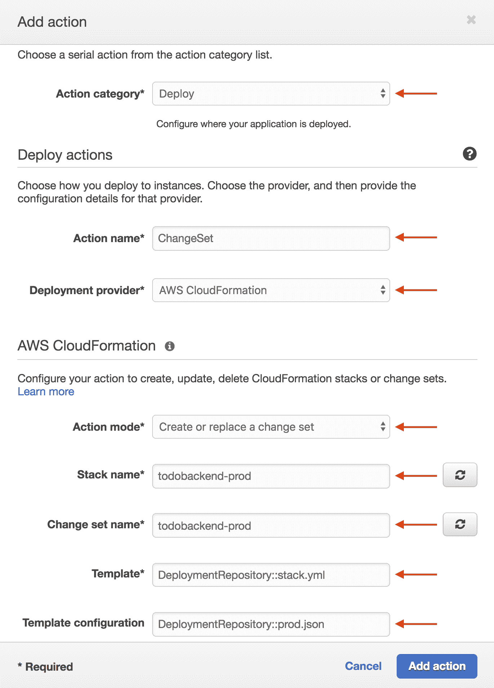向管道添加创建更改集操作

如果您将 dev 阶段的部署操作配置与前面截图中显示的新创建更改集操作配置进行比较，您会发现配置非常相似，除了以下关键差异：

+   操作模式：您可以将其配置为`create`或`replace`更改集，而不是部署堆栈，只会创建一个新的更改集。

+   堆栈名称：由于此操作涉及我们的生产环境，您需要配置一个新的堆栈名称，我们将其称为`todobackend-prod`。

+   更改集名称：这定义了更改集的名称。我通常将其命名为与堆栈名称相同，因为该操作将在每次执行时创建或替换更改集。

+   模板配置：在这里，您需要引用之前示例中添加到`todobackend-aws`存储库的新`prod.json`文件，因为这个文件包含特定于生产环境的输入参数。该文件通过从`todobackend-aws`存储库创建的`DeploymentRepository`工件提供。

接下来，您需要向下滚动，展开高级部分，使用`Fn::GetParam`语法配置参数覆盖属性，并最终将`ApplicationVersion`和`DeploymentRepository`工件配置为输入工件。这与您之前为`dev`/`deploy`操作执行的配置相同。

# 向管道添加手动批准操作

完成更改集操作的配置后，您需要添加一个在更改集操作之后执行的新操作：

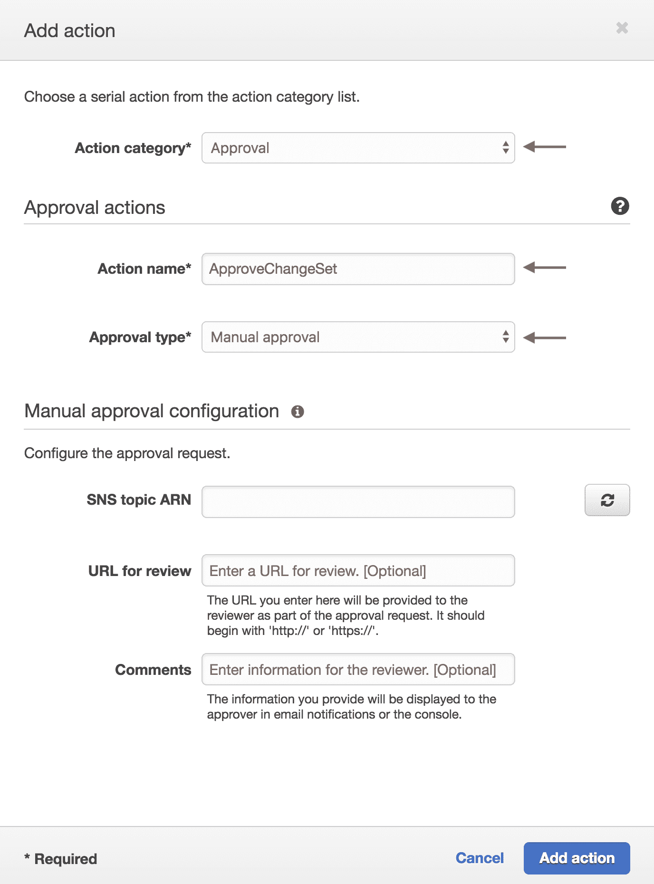向管道添加批准操作

在“添加操作”对话框中，选择“批准”作为操作类别，然后配置一个操作名称为 ApproveChangeSet。选择手动批准类型后，注意您可以添加 SNS 主题 ARN 和其他信息到手动批准请求。然后可以用于向批准者发送电子邮件，或触发执行一些自定义操作的 lambda 函数，例如将消息发布到 Slack 等消息工具中。

# 向管道添加部署更改集操作

您需要创建的最后一个操作是，在批准 ApproveChangeSet 操作后，部署先前在 ChangeSet 操作中创建的更改集：

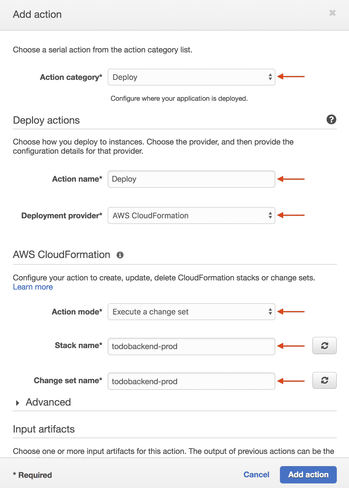向流水线添加执行更改集操作

在上述截图中，我们选择了“执行更改集”操作模式，然后配置了堆栈名称和更改集名称，这些名称必须与您在 ChangeSet 操作中之前配置的相同值匹配。

# 部署到生产环境

在上述截图中单击“添加操作”后，您的新生产阶段的管道配置应如下所示：

向流水线添加创建更改集操作

在这一点上，您可以通过单击“保存管道更改”按钮保存管道更改，并通过单击“发布更改”按钮测试新的管道阶段，这将强制执行新的管道执行。在管道成功执行构建和开发阶段后，生产阶段将首次被调用，由 ChangeSet 操作创建一个 CloudFormation 更改集，之后将触发批准操作。

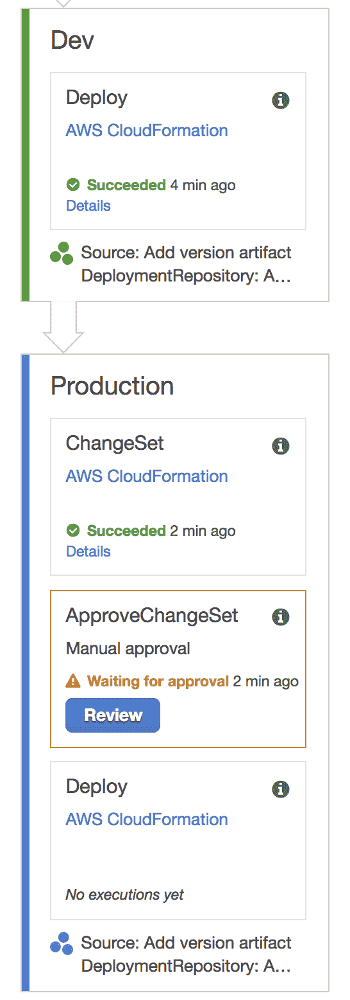向流水线添加创建更改集操作

现在管道将等待批准，这是批准者通常会通过单击 ChangeSet 操作的“详细信息”链接来审查先前创建的更改集：

CloudFormation 更改集

正如您在上述截图中所看到的，更改集指示将创建堆栈中的所有资源，因为生产环境目前不存在。随后的部署应该有非常少的更改，因为堆栈将就位，典型的更改是部署新的 Docker 镜像。

审查更改集并返回到 CodePipeline 详细视图后，您现在可以通过单击“审查”按钮来批准（或拒绝）更改集。这将呈现一个批准或拒绝修订对话框，在这里您可以添加评论并批准或拒绝更改：

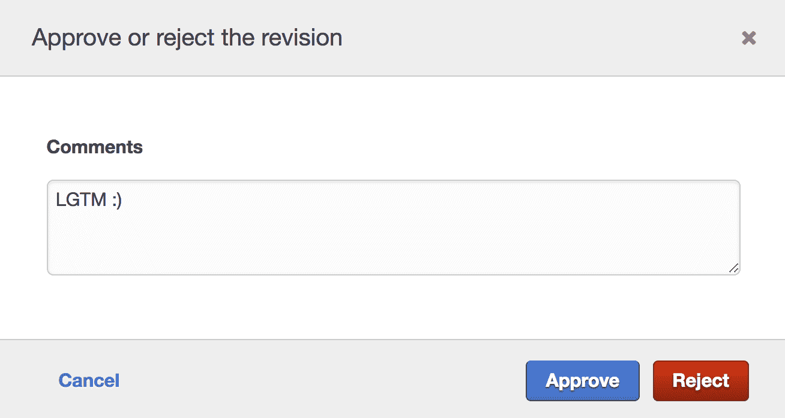批准或拒绝手动批准操作

如果您点击“批准”，流水线将继续执行下一个操作，即部署与之前 ChangeSet 操作相关联的变更集。对于这次执行，将部署一个名为`todobackend-prod`的新堆栈，一旦完成，您就成功地使用 CodePipeline 部署了一个全新的生产环境！

在这一点上，您应该测试并验证您的新堆栈和应用程序是否按预期工作，按照“使用 ECS 部署应用程序”章节中“部署应用程序负载均衡器”部分的步骤获取应用程序负载均衡器端点的 DNS 名称，您的生产应用程序端点将从中提供服务。我还鼓励您触发流水线，无论是手动触发还是通过对任一存储库进行测试提交，然后审查生成的后续变更集，以进行对现有环境的应用程序部署。请注意，您可以选择何时部署到生产环境。例如，您的开发人员可能多次提交应用程序更改，每次更改都会自动部署到非生产环境，然后再选择部署下一个版本到生产环境。当您选择部署到生产环境时，您的生产阶段将采用最近成功部署到非生产环境的最新版本。

一旦您完成了对生产部署的测试，如果您使用的是免费套餐账户，请记住您现在有多个 EC2 实例和 RDS 实例在运行，因此您应该考虑拆除您的生产环境，以避免产生费用。

# 摘要

在本章中，您创建了一个端到端的持续交付流水线，该流水线自动测试、构建和发布您的应用程序的 Docker 镜像，持续将新的应用程序更改部署到非生产环境，并允许您在生成变更集并在部署到生产环境之前需要手动批准的情况下执行受控发布。

您学会了如何将您的 GitHub 存储库与 CodePipeline 集成，方法是将它们定义为源阶段中的源操作，然后创建一个构建阶段，该阶段使用 CodeBuild 来测试、构建和发布应用程序的 Docker 镜像。您向 todobackend 存储库添加了构建规范，CodeBuild 使用它来执行您的构建，并创建了一个自定义的 CodeBuild 容器，该容器能够在 Docker 中运行 Docker，以允许您构建 Docker 镜像并在 Docker Compose 环境中执行集成和验收测试。

接下来，您在 CodePipeline 中创建了一个部署阶段，该阶段会自动将应用程序更改部署到我们在本书中一直使用的 todobackend 堆栈。这要求您在源阶段为`todobackend-aws`存储库添加一个新的源操作，这使得 CloudFormation 堆栈文件和环境配置文件可用作以后的 CloudFormation 部署操作的工件。您还需要为 todobackend 存储库创建一个输出工件，这种情况下，它只是捕获了在构建阶段构建和发布的 Docker 镜像标记，并使其可用于后续阶段。然后，您将此工件作为参数覆盖引用到您的 dev 阶段部署操作中，使用构建操作版本工件中输出的 Docker 镜像标记覆盖`ApplicationImageTag`参数。

最后，您扩展了管道以支持在生产环境中进行受控发布，这需要创建一个创建变更集操作，该操作创建一个 CloudFormation 变更集，一个手动批准操作，允许某人审查变更集并批准/拒绝它，以及一个部署操作，执行先前生成的变更集。

在下一章中，我们将改变方向，介绍 AWS Fargate 服务，它允许您部署 Docker 应用程序，而无需部署和管理自己的 ECS 集群和 ECS 容器实例。我们将利用这个机会通过使用 Fargate 部署 X-Ray 守护程序来为 AWS X-Ray 服务添加支持，并将通过使用 ECS 服务发现发布守护程序端点。

# 问题

1.  您通常在应用程序存储库的根目录中包含哪个文件以支持 AWS CodeBuild？

1.  真/假：AWS CodeBuild 是一个构建服务，它会启动虚拟机并使用 AWS CodeDeploy 运行构建脚本。

1.  您需要运行哪些 Docker 配置来支持 Docker 镜像和多容器构建环境的构建？

1.  您希望在部署 CloudFormation 模板之前审查所做的更改。您将使用 CloudFormation 的哪个功能来实现这一点？

1.  在使用 CodePipeline CloudFormation 部署操作部署 CloudFormation 堆栈时，必须信任哪个服务以用于指定这些操作的服务角色？

1.  您设置了一个新的 CodeBuild 项目，其中包括一个发布到弹性容器注册表的构建任务。当您尝试发布图像时，第一次构建失败。您确认目标 ECR 存储库存在，并且您可以手动发布图像到存储库。这个问题的可能原因是什么？

1.  您为 CodeBuild 创建了一个自定义构建容器，并将其发布到 ECR，并创建了一个允许您的 AWS 账户从 ECR 拉取访问的存储库策略。在执行构建时，您会收到失败的消息，指示 CodeBuild 无法重试自定义镜像。您将如何解决这个问题？

1.  您创建了一个自定义构建容器，该容器使用 Docker in Docker 来支持 Docker 镜像构建。当构建容器启动并尝试启动 Docker 守护程序时，会出现权限错误。您将如何解决这个问题？

# 进一步阅读

您可以查看以下链接，了解本章涵盖的主题的更多信息：

+   CodePipeline 用户指南：[`docs.aws.amazon.com/codepipeline/latest/userguide/welcome.html`](https://docs.aws.amazon.com/codepipeline/latest/userguide/welcome.html)

+   CodeBuild 用户指南：[`docs.aws.amazon.com/codebuild/latest/userguide/welcome.html`](https://docs.aws.amazon.com/codebuild/latest/userguide/welcome.html)

+   CodeBuild 的构建规范参考：[`docs.aws.amazon.com/codebuild/latest/userguide/build-spec-ref.html`](https://docs.aws.amazon.com/codebuild/latest/userguide/build-spec-ref.html)

+   使用 AWS CodePipeline 与 CodeBuild：[`docs.aws.amazon.com/codebuild/latest/userguide/how-to-create-pipeline.html`](https://docs.aws.amazon.com/codebuild/latest/userguide/how-to-create-pipeline.html)

+   AWS CodePipeline 管道结构参考：[`docs.aws.amazon.com/codepipeline/latest/userguide/reference-pipeline-structure.html`](https://docs.aws.amazon.com/codepipeline/latest/userguide/reference-pipeline-structure.html)

+   使用参数覆盖函数与 AWS CodePipeline 管道：[`docs.aws.amazon.com/AWSCloudFormation/latest/UserGuide/continuous-delivery-codepipeline-parameter-override-functions.html`](https://docs.aws.amazon.com/AWSCloudFormation/latest/UserGuide/continuous-delivery-codepipeline-parameter-override-functions.html)
