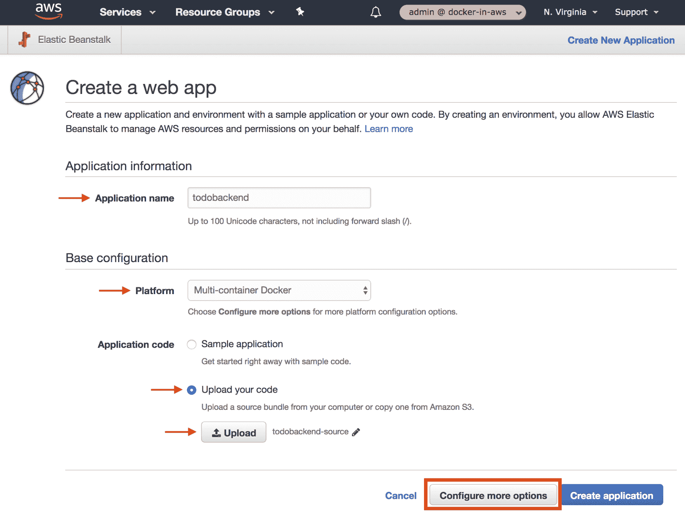
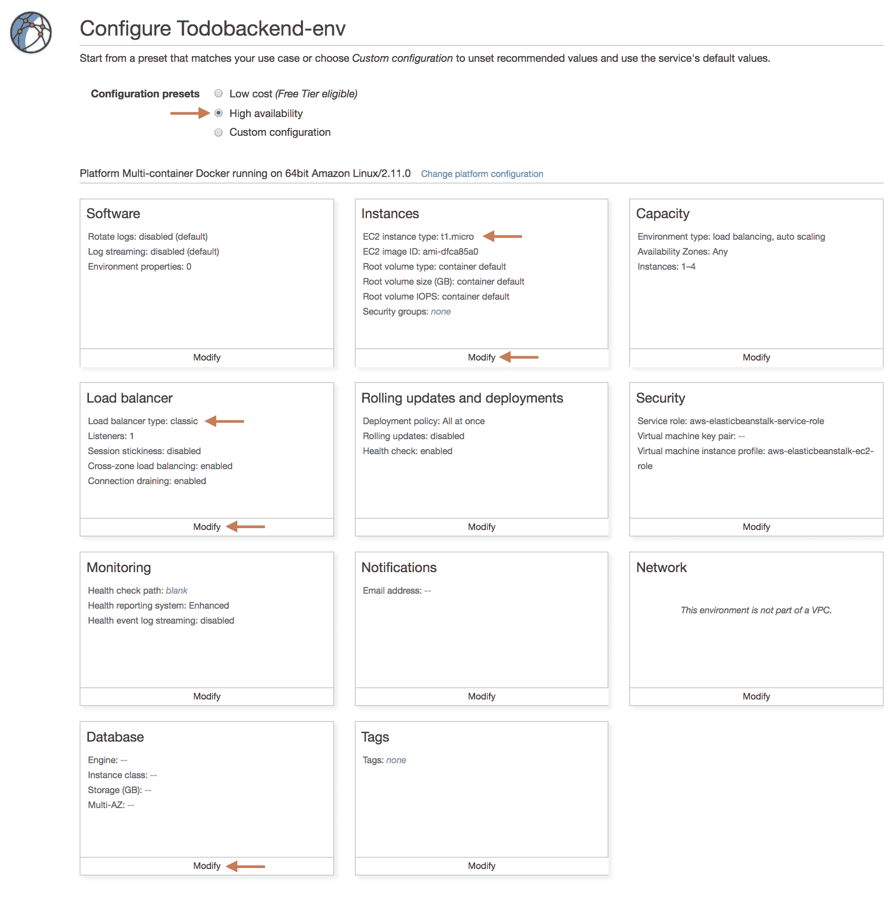
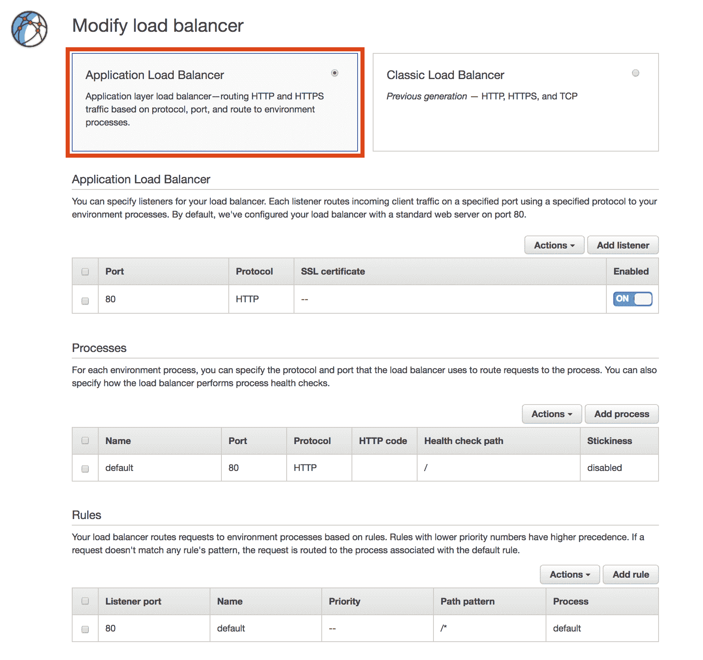
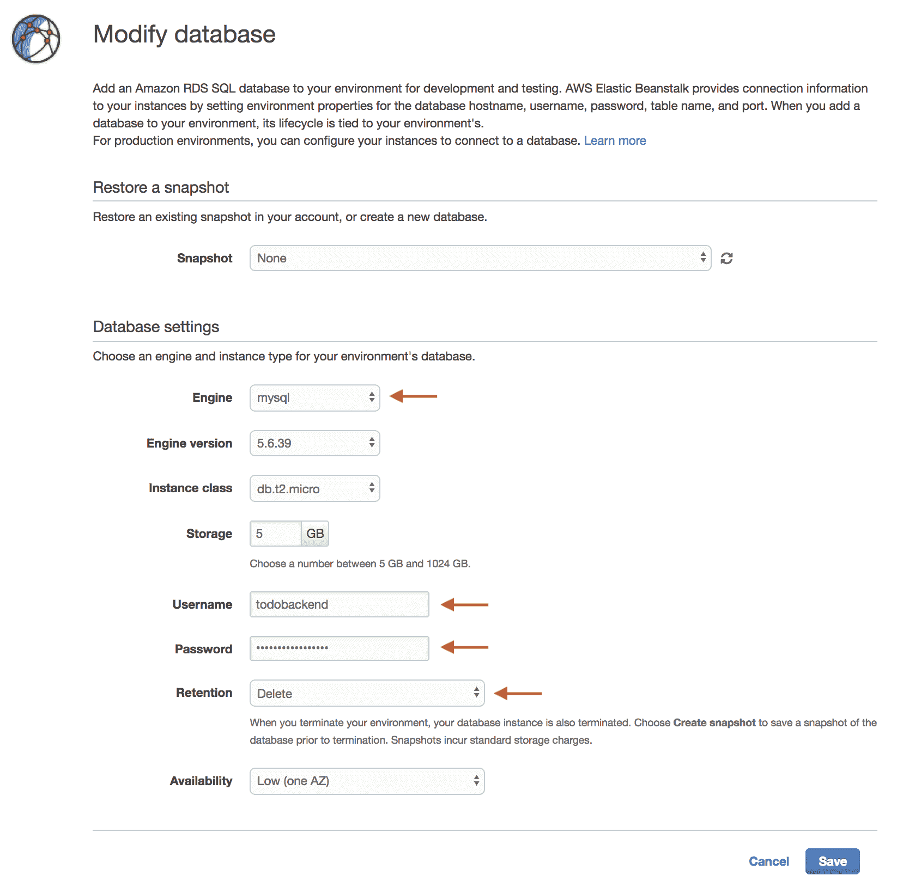
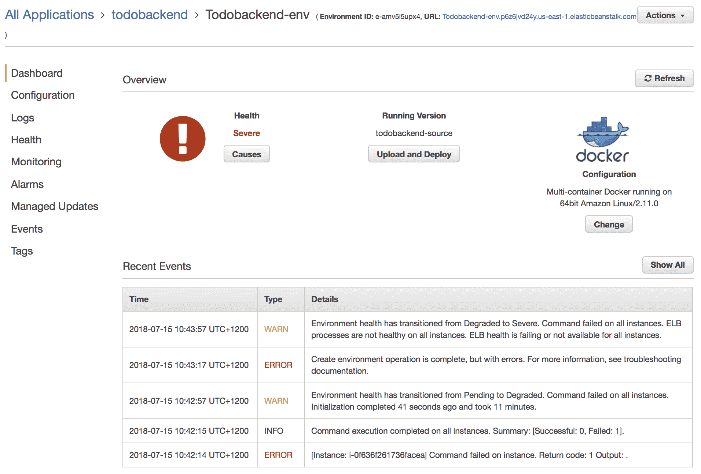
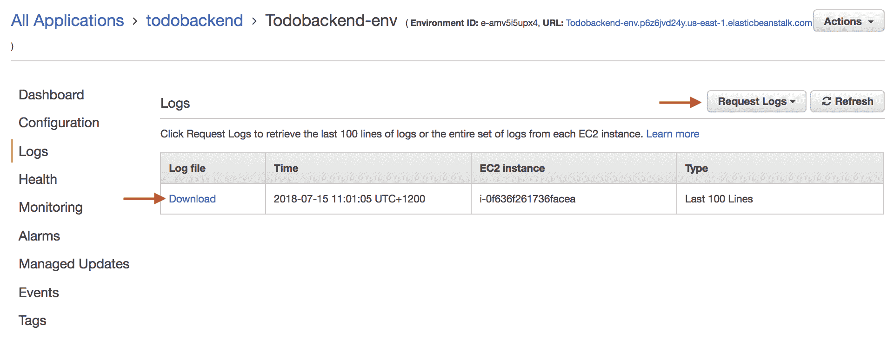
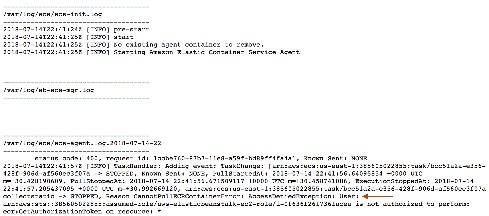
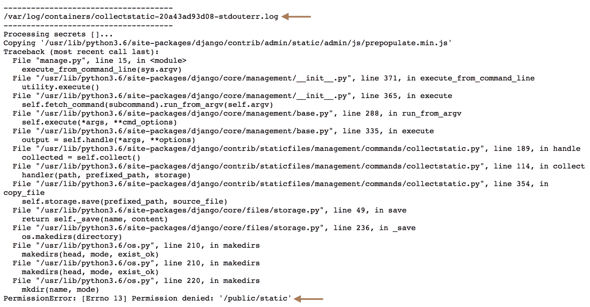

# 第十五章：弹性 Beanstalk

到目前为止，在本书中，我们已经专注于使用弹性容器服务（ECS）及其变体 AWS Fargate 来管理和部署 Docker 应用程序。本书的其余部分将专注于您可以使用的替代技术，以在 AWS 中运行 Docker 应用程序，我们将首先介绍的是弹性 Beanstalk。

弹性 Beanstalk 属于行业通常称为**平台即服务**（**PaaS**）的类别，旨在为您的应用程序提供受管的运行时环境，让您专注于开发、部署和操作应用程序，而不必担心周围的基础设施。为了强调这一范式，弹性 Beanstalk 专注于支持各种流行的编程语言，如 Node.js、PHP、Python、Ruby、Java、.NET 和 Go 应用程序。创建弹性 Beanstalk 应用程序时，您会指定目标编程语言，弹性 Beanstalk 将部署一个支持您的编程语言和相关运行时和应用程序框架的环境。弹性 Beanstalk 还将部署支持基础设施，如负载均衡器和数据库，更重要的是，它将配置您的环境，以便您可以轻松访问日志、监控信息和警报，确保您不仅可以部署应用程序，还可以监视它们，并确保它们处于最佳状态下运行。

除了前面提到的编程语言外，弹性 Beanstalk 还支持 Docker 环境，这意味着它可以支持在 Docker 容器中运行的任何应用程序，无论编程语言或应用程序运行时如何。在本章中，您将学习如何使用弹性 Beanstalk 来管理和部署 Docker 应用程序。您将学习如何使用 AWS 控制台创建弹性 Beanstalk 应用程序并创建一个环境，其中包括应用程序负载均衡器和我们应用程序所需的 RDS 数据库实例。您将遇到一些初始设置问题，并学习如何使用 AWS 控制台和弹性 Beanstalk 命令行工具来诊断和解决这些问题。

为了解决这些问题，您将配置一个名为**ebextensions**的功能，这是 Elastic Beanstalk 的高级配置功能，可用于将许多自定义配置方案应用于您的应用程序。您将利用 ebextensions 来解决 Docker 卷的权限问题，将 Elastic Beanstalk 生成的默认环境变量转换为应用程序期望的格式，并最终确保诸如执行数据库迁移之类的一次性部署任务仅在每个应用程序部署的单个实例上运行。

本章不旨在详尽介绍 Elastic Beanstalk，并且只关注与部署和管理 Docker 应用程序相关的核心场景。有关对其他编程语言的支持和更高级场景的覆盖，请参考[AWS Elastic Beanstalk 开发人员指南](https://docs.aws.amazon.com/elasticbeanstalk/latest/dg/Welcome.html)。

本章将涵盖以下主题：

+   Elastic Beanstalk 简介

+   使用 AWS 控制台创建 Elastic Beanstalk 应用程序

+   使用 Elastic Beanstalk CLI 管理 Elastic Beanstalk 应用程序

+   自定义 Elastic Beanstalk 应用程序

+   部署和测试 Elastic Beanstalk 应用程序

# 技术要求

本章的技术要求如下：

+   AWS 帐户的管理员访问权限

+   本地环境按照第一章的说明进行配置

+   本地 AWS 配置文件，按照第三章的说明进行配置

+   Python 2.7 或 3.x

+   PIP 软件包管理器

+   AWS CLI 版本 1.15.71 或更高版本

+   Docker 18.06 CE 或更高版本

+   Docker Compose 1.22 或更高版本

+   GNU Make 3.82 或更高版本

本章假设您已成功完成本书迄今为止涵盖的所有配置任务

以下 GitHub URL 包含本章中使用的代码示例：[`github.com/docker-in-aws/docker-in-aws/tree/master/ch14`](https://github.com/docker-in-aws/docker-in-aws/tree/master/ch14)。

查看以下视频以查看代码的实际操作：

[`bit.ly/2MDhtj2`](http://bit.ly/2MDhtj2)

# Elastic Beanstalk 简介

正如本章介绍中所讨论的，Elastic Beanstalk 是 AWS 提供的 PaaS 服务，允许您专注于应用程序代码和功能，而不必担心支持应用程序所需的周围基础设施。为此，Elastic Beanstalk 在其方法上有一定的偏见，并且通常以特定的方式工作。Elastic Beanstalk 尽可能地利用其他 AWS 服务，并试图消除与这些服务集成的工作量和复杂性，如果您按照 Elastic Beanstalk 期望您使用这些服务的方式，这将非常有效。如果您在一个中小型组织中运行一个小团队，Elastic Beanstalk 可以为您提供很多价值，提供了大量的开箱即用功能。然而，一旦您的组织发展壮大，并且希望优化和标准化部署、监控和操作应用程序的方式，您可能会发现您已经超出了 Elastic Beanstalk 的个体应用程序重点的范围。

例如，重要的是要了解 Elastic Beanstalk 基于每个 EC2 实例的单个 ECS 任务定义的概念运行，因此，如果您希望在共享基础设施上运行多个容器工作负载，Elastic Beanstalk 不是您的正确选择。相同的情况也适用于日志记录和操作工具 - 一般来说，Elastic Beanstalk 提供了其专注于个体应用程序的工具链，而您的组织可能希望采用跨多个应用程序运行的标准工具集。就个人而言，我更喜欢使用 ECS 提供的更灵活和可扩展的方法，但我必须承认，Elastic Beanstalk 免费提供的一些开箱即用的操作和监控工具对于快速启动应用程序并与其他 AWS 服务完全集成非常有吸引力。

# Elastic Beanstalk 概念

本章主要关注使用 Elastic Beanstalk 运行 Docker 应用程序，因此不要期望对 Elastic Beanstalk 及其支持的所有编程语言进行详尽的覆盖。然而，在我们开始创建 Elastic Beanstalk 应用程序之前，了解基本概念是很重要的，我将在这里简要介绍一下。

在使用 Elastic Beanstalk 时，您创建*应用程序*，可以定义一个或多个*环境*。以 todobackend 应用程序为例，您将把 todobackend 应用程序定义为 Elastic Beanstalk 应用程序，并创建一个名为 Dev 的环境和一个名为 Prod 的环境，以反映我们迄今部署的开发和生产环境。每个环境引用应用程序的特定版本，其中包含应用程序的可部署代码。对于 Docker 应用程序，源代码包括一个名为`Dockerrun.aws.json`的规范，该规范定义了应用程序的容器环境，可以引用外部 Docker 镜像或引用用于构建应用程序的本地 Dockerfile。

另一个重要的概念要了解的是，在幕后，Elastic Beanstalk 在常规 EC2 实例上运行您的应用程序，并遵循一个非常严格的范例，即每个 EC2 实例运行一个应用程序实例。每个 Elastic Beanstalk EC2 实例都运行一个根据目标应用程序特别策划的环境，例如，在多容器 Docker 应用程序的情况下，EC2 实例包括 Docker 引擎和 ECS 代理。Elastic Beanstalk 还允许您通过 SSH 访问和管理这些 EC2 实例（在本章中我们将使用 Linux 服务器），尽管您通常应该将此访问保留用于故障排除目的，并且永远不要尝试直接修改这些实例的配置。

# 创建一个 Elastic Beanstalk 应用程序

现在您已经了解了 Elastic Beanstalk 的基本概念，让我们把注意力转向创建一个新的 Elastic Beanstalk 应用程序。您可以使用各种方法创建和配置 Elastic Beanstalk 应用程序：

+   AWS 控制台

+   AWS CLI 和 SDK

+   AWS CloudFormation

+   Elastic Beanstalk CLI

在本章中，我们将首先在 AWS 控制台中创建一个 Elastic Beanstalk 应用程序，然后使用 Elastic Beanstalk CLI 来管理、更新和完善应用程序。

创建 Docker 应用程序时，重要的是要了解 Elastic Beanstalk 支持两种类型的 Docker 应用程序：

+   单容器应用程序：[`docs.aws.amazon.com/elasticbeanstalk/latest/dg/docker-singlecontainer-deploy.html`](https://docs.aws.amazon.com/elasticbeanstalk/latest/dg/docker-singlecontainer-deploy.html)

+   多容器应用程序：[`docs.aws.amazon.com/elasticbeanstalk/latest/dg/create_deploy_docker_ecs.html`](https://docs.aws.amazon.com/elasticbeanstalk/latest/dg/create_deploy_docker_ecs.html)

对于我们的用例，我们将采用与之前章节中为 ECS 配置 todobackend 应用程序的非常相似的方法，因此我们将需要一个多容器应用程序，因为我们之前在 ECS 任务定义中定义了一个名为**todobackend**的主应用程序容器定义和一个**collectstatic**容器定义（请参阅章节*使用 CloudFormation 定义 ECS 任务定义*中的*部署使用 ECS 的应用程序*）。总的来说，我建议采用多容器方法，无论您的应用程序是否是单容器应用程序，因为原始的单容器应用程序模型违反了 Docker 最佳实践，并且在应用程序要求发生变化或增长时，强制您从单个容器中运行所有内容。

# 创建 Dockerrun.aws.json 文件

无论您创建的是什么类型的 Docker 应用程序，您都必须首先创建一个名为`Dockerrun.aws.json`的文件，该文件定义了组成您的应用程序的各种容器。该文件以 JSON 格式定义，并基于您在之前章节中配置的 ECS 任务定义格式，我们将以此为`Dockerrun.aws.json`文件中的设置基础。

让我们在`todobackend-aws`存储库中创建一个名为`eb`的文件夹，并定义一个名为`Dockerrun.aws.json`的新文件，如下所示：

```
{
  "AWSEBDockerrunVersion": 2,
  "volumes": [
    {
      "name": "public",
      "host": {"sourcePath": "/tmp/public"}
    }
  ],
  "containerDefinitions": [
    {
      "name": "todobackend",
      "image": "385605022855.dkr.ecr.us-east-1.amazonaws.com/docker-in-aws/todobackend",
      "essential": true,
      "memoryReservation": 395,
      "mountPoints": [
        {
          "sourceVolume": "public",
          "containerPath": "/public"
        }
      ],
      "environment": [
        {"name":"DJANGO_SETTINGS_MODULE","value":"todobackend.settings_release"}
      ],
      "command": [
        "uwsgi",
        "--http=0.0.0.0:8000",
        "--module=todobackend.wsgi",
        "--master",
        "--die-on-term",
        "--processes=4",
        "--threads=2",
        "--check-static=/public"
      ],
      "portMappings": [
        {
          "hostPort": 80,
          "containerPort": 8000
        }
      ]
    },
    {
      "name": "collectstatic",
      "image": "385605022855.dkr.ecr.us-east-1.amazonaws.com/docker-in-aws/todobackend",
      "essential": false,
      "memoryReservation": 5,
      "mountPoints": [
        {
          "sourceVolume": "public",
          "containerPath": "/public"
        }
      ],
      "environment": [
        {"name":"DJANGO_SETTINGS_MODULE","value":"todobackend.settings_release"}
      ],
      "command": [
        "python3",
        "manage.py",
        "collectstatic",
        "--no-input"
      ]
    }
  ]
}
```

在定义多容器 Docker 应用程序时，您必须指定并使用规范格式的第 2 版本，该版本通过`AWSEBDockerrunVersion`属性进行配置。如果您回顾一下章节*使用 ECS 部署应用程序*中的*使用 CloudFormation 定义 ECS 任务定义*，您会发现`Dockerrun.aws.json`文件的第 2 版本规范非常相似，尽管格式是 JSON，而不是我们在 CloudFormation 模板中使用的 YAML 格式。我们使用驼峰命名来定义每个参数。

文件包括两个容器定义——一个用于主要的 todobackend 应用程序，另一个用于生成静态内容——我们定义了一个名为`public`的卷，用于存储静态内容。我们还配置了一个静态端口映射，将容器端口 8000 映射到主机的端口 80，因为 Elastic Beanstalk 默认期望您的 Web 应用程序在端口 80 上监听。

请注意，与我们用于 ECS 的方法相比，有一些重要的区别。

+   **镜像**：我们引用相同的 ECR 镜像，但是我们没有指定镜像标签，这意味着最新版本的 Docker 镜像将始终被部署。`Dockerrun.aws.json`文件不支持参数或变量引用，因此如果您想引用一个明确的镜像，您需要一个自动生成此文件的持续交付工作流作为构建过程的一部分。

+   **环境**：请注意，我们没有指定与数据库配置相关的任何环境变量，比如`MYSQL_HOST`或`MYSQL_USER`。我们将在本章后面讨论这样做的原因，但现在要明白的是，当您在 Elastic Beanstalk 中使用 RDS 的集成支持时，自动可用于应用程序的环境变量遵循不同的格式，我们需要转换以满足我们应用程序的期望。

+   **日志**：我已经删除了 CloudWatch 日志配置，以简化本章，但您完全可以在您的容器中包含 CloudWatch 日志配置。请注意，如果您使用了 CloudWatch 日志，您需要修改 Elastic Beanstalk EC2 服务角色，以包括将您的日志写入 CloudWatch 日志的权限。我们将在本章后面看到一个例子。

我还删除了`XRAY_DAEMON_ADDRESS`环境变量，以保持简单，因为您可能不再在您的环境中运行 X-Ray 守护程序。请注意，如果您确实想支持 X-Ray，您需要确保附加到 Elastic Beanstalk 实例的实例安全组包含允许与 X-Ray 守护程序进行网络通信的安全规则。

现在我们已经定义了一个`Dockerrun.aws.json`文件，我们需要创建一个 ZIP 存档，其中包括这个文件。Elastic Beanstalk 要求您的应用程序源代码以 ZIP 或 WAR 存档格式上传，因此有这个要求。您可以通过使用`zip`实用程序从命令行执行此操作：

```
todobackend-aws/eb> zip -9 -r app.zip . -x .DS_Store
adding: Dockerrun.aws.json (deflated 69%)
```

这将在`todobackend-aws/eb`文件夹中创建一个名为`app.zip`的存档，使用`-r`标志指定 zip 应该递归添加所有可能存在的文件夹中的所有文件（这将在本章后面的情况下发生）。在指定`app.zip`的存档名称后，我们通过指定`.`而不是`*`来引用当前工作目录，因为使用`.`语法将包括任何隐藏的目录或文件（同样，这将在本章后面的情况下发生）。

还要注意，在 macOS 环境中，您可以使用`-x`标志来排除`.DS_Store`目录元数据文件，以防止其被包含在存档中。

# 使用 AWS 控制台创建一个弹性 Beanstalk 应用程序

现在我们准备使用 AWS 控制台创建一个弹性 Beanstalk 应用程序。要开始，请选择**服务** | **弹性 Beanstalk**，然后单击**开始**按钮创建一个新应用程序。在**创建 Web 应用程序**屏幕上，指定一个名为 todobackend 的应用程序名称，配置一个**多容器 Docker**的平台，最后使用**上传您的代码**选项为**应用程序代码**设置上传之前创建的`app.zip`文件：

创建一个弹性 Beanstalk Web 应用程序

接下来，点击**配置更多选项**按钮，这将呈现一个名为**配置 Todobackend-Env**的屏幕，允许您自定义应用程序。请注意，默认情况下，弹性 Beanstalk 将您的第一个应用程序环境命名为`<application-name>-Env`，因此名称为**Todobackend-Env**。

在配置预设部分，选择**高可用性**选项，这将向您的配置添加一个负载均衡器：

配置弹性 Beanstalk Web 应用程序

如果您查看当前设置，您会注意到**EC2 实例类型**在**实例**部分是**t1.micro**，**负载均衡器类型**在**负载均衡器**部分是**经典**，而**数据库**部分目前未配置。让我们首先通过单击**实例**部分的**修改**链接，更改**实例类型**，然后单击**保存**来修改**EC2 实例类型**为免费层**t2.micro**实例类型：

修改 EC2 实例类型

接下来，通过单击**负载均衡器**部分中的**修改**链接，然后单击**保存**，将**负载均衡器类型**更改为**应用程序负载均衡器**。请注意，默认设置期望在**应用程序负载均衡器**和**规则**部分中将您的应用程序暴露在端口`80`上，以及您的容器在 EC2 实例上的端口 80 上，如**进程**部分中定义的那样：



修改负载均衡器类型

最后，我们需要通过单击**数据库**部分中的**修改**链接为应用程序定义数据库配置。选择**mysql**作为**引擎**，指定适当的**用户名**和**密码**，最后将**保留**设置为**删除**，因为我们只是为了测试目的而使用这个环境。其他设置的默认值足够，因此在完成配置后，可以单击**保存**按钮：

配置数据库设置

在这一点上，您已经完成了应用程序的配置，并且可以单击**配置 Todobackend-env**屏幕底部的**创建应用程序**按钮。弹性 Beanstalk 现在将开始创建您的应用程序，并在控制台中显示此过程的进度。

弹性 Beanstalk 应用程序向导在幕后创建了一个包括您指定的所有资源和配置的 CloudFormation 堆栈。也可以使用 CloudFormation 创建自己的弹性 Beanstalk 环境，而不使用向导。

一段时间后，应用程序的创建将完成，尽管您可以看到应用程序存在问题：

初始应用程序状态

# 配置 EC2 实例配置文件

我们已经创建了一个新的弹性 Beanstalk 应用程序，但由于几个错误，当前应用程序的健康状态记录为严重。

如果您在左侧菜单中选择**日志**选项，然后选择**请求日志** | **最后 100 行**，您应该会看到一个**下载**链接，可以让您查看最近的日志活动：

初始应用程序状态

在您的浏览器中应该打开一个新的标签页，显示各种 Elastic Beanstalk 日志。在顶部，您应该看到 ECS 代理日志，最近的错误应该指示 ECS 代理无法从 ECR 将图像拉入您的`Dockerrun.aws.json`规范中：

Elastic Beanstalk ECS 代理错误

为了解决这个问题，我们需要配置与附加到我们的 Elastic Beanstalk 实例的 EC2 实例配置文件相关联的 IAM 角色，以包括从 ECR 拉取图像的权限。我们可以通过从左侧菜单中选择**配置**并在**安全**部分中查看**虚拟机实例配置文件**设置来查看 Elastic Beanstalk 正在使用的角色：

查看安全配置

您可以看到正在使用名为**aws-elasticbeanstalk-ec2-role**的 IAM 角色，因此，如果您从导航栏中选择**服务** | **IAM**，选择**角色**，然后找到 IAM 角色，您需要按照以下方式将`AmazonEC2ContainerRegistryReadOnly`策略附加到角色：

将 AmazonEC2ContainerRegistryReadOnly 策略附加到 Elastic Beanstack EC2 实例角色

在这一点上，我们应该已经解决了之前导致应用程序启动失败的权限问题。您现在需要配置 Elastic Beanstalk 尝试重新启动应用程序，可以使用以下任一技术来执行：

+   上传新的应用程序源文件-这将触发新的应用程序部署。

+   重新启动应用程序服务器

+   重建环境

鉴于我们的应用程序源（在 Docker 应用程序的情况下是`Dockerrun.aws.json`文件）没有更改，最不破坏性和最快的选项是重新启动应用程序服务器，您可以通过在**所有应用程序** | **todobackend** | **Todobackend-env**配置屏幕的右上角选择**操作** | **重新启动应用程序服务器(s)**来执行。

几分钟后，您会注意到您的应用程序仍然存在问题，如果您重复获取最新日志的过程，并扫描这些日志，您会发现**collectstatic**容器由于权限错误而失败：

collectstatic 权限错误

回想一下，在本书的早些时候，我们如何在我们的 ECS 容器实例上配置了一个具有正确权限的文件夹，以托管**collectstatic**容器写入的公共卷？对于 Elastic Beanstalk，为 Docker 应用程序创建的默认 EC2 实例显然没有以这种方式进行配置。

我们将很快解决这个问题，但现在重要的是要了解还有其他问题。要了解这些问题，您需要尝试访问应用程序，您可以通过单击 All Applications | todobackend | Todobackend-env 配置屏幕顶部的 URL 链接来实现：

获取 Elastic Beanstalk 应用程序 URL

浏览到此链接应立即显示静态内容文件未生成：

缺少静态内容

如果您单击**todos**链接以查看当前的 Todo 项目列表，您将收到一个错误，指示应用程序无法连接到 MySQL 数据库：

数据库连接错误

问题在于我们尚未向`Dockerrun.aws.json`文件添加任何数据库配置，因此我们的应用程序默认使用本地主机来定位数据库。

# 使用 CLI 配置 Elastic Beanstalk 应用程序

我们将很快解决我们应用程序中仍然存在的问题，但为了解决这些问题，我们将继续使用 Elastic Beanstalk CLI 来继续配置我们的应用程序并解决这些问题。

在我们开始使用 Elastic Beanstalk CLI 之前，重要的是要了解，当前版本的该应用程序在与我们在早期章节中引入的多因素身份验证（MFA）要求进行交互时存在一些挑战。如果您继续使用 MFA，您会注意到每次执行 Elastic Beanstalk CLI 命令时都会提示您。

为了解决这个问题，我们可以通过首先将用户从`Users`组中删除来临时删除 MFA 要求：

```
> aws iam remove-user-from-group --user-name justin.menga --group-name Users
```

接下来，在本地的`~/.aws/config`文件中的`docker-in-aws`配置文件中注释掉`mfa_serial`行：

```
[profile docker-in-aws]
source_profile = docker-in-aws
role_arn = arn:aws:iam::385605022855:role/admin
role_session_name=justin.menga
region = us-east-1
# mfa_serial = arn:aws:iam::385605022855:mfa/justin.menga
```

请注意，这并不理想，在实际情况下，您可能无法或不想临时禁用特定用户的 MFA。在考虑 Elastic Beanstalk 时，请记住这一点，因为您通常会依赖 Elastic Beanstalk CLI 执行许多操作。

现在 MFA 已被临时禁用，您可以安装 Elastic Beanstalk CLI，您可以使用 Python 的`pip`软件包管理器来安装它。安装完成后，可以通过`eb`命令访问它：

```
> pip3 install awsebcli --user
Collecting awsebcli
...
...
Installing collected packages: awsebcli
Successfully installed awsebcli-3.14.2
> eb --version
EB CLI 3.14.2 (Python 3.6.5)
```

下一步是在您之前创建的`todobackend/eb`文件夹中初始化 CLI：

```
todobackend/eb> eb init --profile docker-in-aws

Select a default region
1) us-east-1 : US East (N. Virginia)
2) us-west-1 : US West (N. California)
3) us-west-2 : US West (Oregon)
4) eu-west-1 : EU (Ireland)
5) eu-central-1 : EU (Frankfurt)
6) ap-south-1 : Asia Pacific (Mumbai)
7) ap-southeast-1 : Asia Pacific (Singapore)
8) ap-southeast-2 : Asia Pacific (Sydney)
9) ap-northeast-1 : Asia Pacific (Tokyo)
10) ap-northeast-2 : Asia Pacific (Seoul)
11) sa-east-1 : South America (Sao Paulo)
12) cn-north-1 : China (Beijing)
13) cn-northwest-1 : China (Ningxia)
14) us-east-2 : US East (Ohio)
15) ca-central-1 : Canada (Central)
16) eu-west-2 : EU (London)
17) eu-west-3 : EU (Paris)
(default is 3): 1

Select an application to use
1) todobackend
2) [ Create new Application ]
(default is 2): 1
Cannot setup CodeCommit because there is no Source Control setup, continuing with initialization
```

`eb init`命令使用`--profile`标志来指定本地 AWS 配置文件，然后提示您将要交互的区域。然后 CLI 会检查是否存在任何现有的 Elastic Beanstalk 应用程序，并询问您是否要管理现有应用程序或创建新应用程序。一旦您做出选择，CLI 将在名为`.elasticbeanstalk`的文件夹下将项目信息添加到当前文件夹中，并创建或追加到`.gitignore`文件。鉴于我们的`eb`文件夹是**todobackend**存储库的子目录，将`.gitignore`文件的内容追加到**todobackend**存储库的根目录是一个好主意：

```
todobackend-aws/eb> cat .gitignore >> ../.gitignore todobackend-aws/eb> rm .gitignore 
```

您现在可以使用 CLI 查看应用程序的当前状态，列出应用程序环境，并执行许多其他管理任务：

```
> eb status
Environment details for: Todobackend-env
  Application name: todobackend
  Region: us-east-1
  Deployed Version: todobackend-source
  Environment ID: e-amv5i5upx4
  Platform: arn:aws:elasticbeanstalk:us-east-1::platform/multicontainer Docker running on 64bit Amazon Linux/2.11.0
  Tier: WebServer-Standard-1.0
  CNAME: Todobackend-env.p6z6jvd24y.us-east-1.elasticbeanstalk.com
  Updated: 2018-07-14 23:23:28.931000+00:00
  Status: Ready
  Health: Red
> eb list
* Todobackend-env
> eb open
> eb logs 
Retrieving logs...
============= i-0f636f261736facea ==============
-------------------------------------
/var/log/ecs/ecs-init.log
-------------------------------------
2018-07-14T22:41:24Z [INFO] pre-start
2018-07-14T22:41:25Z [INFO] start
2018-07-14T22:41:25Z [INFO] No existing agent container to remove.
2018-07-14T22:41:25Z [INFO] Starting Amazon Elastic Container Service Agent

-------------------------------------
/var/log/eb-ecs-mgr.log
-------------------------------------
2018-07-14T23:20:37Z "cpu": "0",
2018-07-14T23:20:37Z "containers": [
...
...
```

请注意，`eb status`命令会列出应用程序的 URL 在`CNAME`属性中，请记下这个 URL，因为您需要在本章中测试您的应用程序。您还可以使用`eb open`命令访问您的应用程序，这将在您的默认浏览器中打开应用程序的 URL。

# 管理 Elastic Beanstalk EC2 实例

在使用 Elastic Beanstalk 时，能够访问 Elastic Beanstalk EC2 实例是很有用的，特别是如果您需要进行一些故障排除。

CLI 包括建立与 Elastic Beanstalk EC2 实例的 SSH 连接的功能，您可以通过运行`eb ssh --setup`命令来设置它：

```
> eb ssh --setup
WARNING: You are about to setup SSH for environment "Todobackend-env". If you continue, your existing instances will have to be **terminated** and new instances will be created. The environment will be temporarily unavailable.
To confirm, type the environment name: Todobackend-env

Select a keypair.
1) admin
2) [ Create new KeyPair ]
(default is 1): 1
Printing Status:
Printing Status:
INFO: Environment update is starting.
INFO: Updating environment Todobackend-env's configuration settings.
INFO: Created Auto Scaling launch configuration named: awseb-e-amv5i5upx4-stack-AWSEBAutoScalingLaunchConfiguration-8QN6BJJX43H
INFO: Deleted Auto Scaling launch configuration named: awseb-e-amv5i5upx4-stack-AWSEBAutoScalingLaunchConfiguration-JR6N80L37H2G
INFO: Successfully deployed new configuration to environment.
```

请注意，设置 SSH 访问需要您终止现有实例并创建新实例，因为您只能在创建 EC2 实例时将 SSH 密钥对与实例关联。在选择您在本书中早期创建的现有 `admin` 密钥对后，CLI 终止现有实例，创建一个新的自动缩放启动配置以启用 SSH 访问，然后启动新实例。

在创建弹性 Beanstalk 应用程序时，您可以通过在配置向导的安全部分中配置 EC2 密钥对来避免此步骤。

现在，您可以按照以下步骤 SSH 进入您的弹性 Beanstalk EC2 实例：

```
> eb ssh -e "ssh -i ~/.ssh/admin.pem"
INFO: Attempting to open port 22.
INFO: SSH port 22 open.
INFO: Running ssh -i ~/.ssh/admin.pem ec2-user@34.239.245.78
The authenticity of host '34.239.245.78 (34.239.245.78)' can't be established.
ECDSA key fingerprint is SHA256:93m8hag/EtCPb5i7YrYHUXFPloaN0yUHMVFFnbMlcLE.
Are you sure you want to continue connecting (yes/no)? yes
Warning: Permanently added '34.239.245.78' (ECDSA) to the list of known hosts.
 _____ _ _ _ ____ _ _ _
| ____| | __ _ ___| |_(_) ___| __ ) ___ __ _ _ __ ___| |_ __ _| | | __
| _| | |/ _` / __| __| |/ __| _ \ / _ \/ _` | '_ \/ __| __/ _` | | |/ /
| |___| | (_| \__ \ |_| | (__| |_) | __/ (_| | | | \__ \ || (_| | | <
|_____|_|\__,_|___/\__|_|\___|____/ \___|\__,_|_| |_|___/\__\__,_|_|_|\_\
 Amazon Linux AMI

This EC2 instance is managed by AWS Elastic Beanstalk. Changes made via SSH
WILL BE LOST if the instance is replaced by auto-scaling. For more information
on customizing your Elastic Beanstalk environment, see our documentation here:
http://docs.aws.amazon.com/elasticbeanstalk/latest/dg/customize-containers-ec2.html
```

默认情况下，`eb ssh` 命令将尝试使用名为 `~/.ssh/<ec2-keypair-name>.pem` 的 SSH 私钥，本例中为 `~/.ssh/admin.pem`。如果您的 SSH 私钥位于不同位置，您可以使用 `-e` 标志来覆盖使用的文件，就像上面的示例中演示的那样。

现在，您可以查看一下您的弹性 Beanstalk EC2 实例。鉴于我们正在运行一个 Docker 应用程序，您可能首先倾向于运行 `docker ps` 命令以查看当前正在运行的容器：

```
[ec2-user@ip-172-31-20-192 ~]$ docker ps
Got permission denied while trying to connect to the Docker daemon socket at unix:///var/run/docker.sock: Get http://%2Fvar%2Frun%2Fdocker.sock/v1.37/containers/json: dial unix /var/run/docker.sock: connect: permission denied
```

令人惊讶的是，标准的 `ec2-user` 没有访问 Docker 的权限 - 为了解决这个问题，我们需要添加更高级的配置，称为 **ebextensions**。

# 自定义弹性 Beanstalk 应用程序

如前一节所讨论的，我们需要添加一个 ebextension，它只是一个配置文件，可用于自定义您的弹性 Beanstalk 环境以适应我们现有的弹性 Beanstalk 应用程序。这是一个重要的概念需要理解，因为我们最终将使用相同的方法来解决我们应用程序当前存在的所有问题。

要配置 `ebextensions`，首先需要在存储 `Dockerrun.aws.json` 文件的 `eb` 文件夹中创建一个名为 `.ebextensions` 的文件夹（请注意，您需要断开 SSH 会话，转到您的弹性 Beanstalk EC2 实例，并在本地环境中执行此操作）：

```
todobackend/eb> mkdir .ebextensions todobackend/eb> touch .ebextensions/init.config
```

`.ebextensions` 文件夹中具有 `.config` 扩展名的每个文件都将被视为 ebextension，并在应用程序部署期间由弹性 Beanstalk 处理。在上面的示例中，我们创建了一个名为 `init.config` 的文件，现在我们可以配置它以允许 `ec2-user` 访问 Docker 引擎：

```
commands:
  01_add_ec2_user_to_docker_group:
    command: usermod -aG docker ec2-user
    ignoreErrors: true
```

我们在`commands`键中添加了一个名为`01_add_ec2_user_to_docker_group`的命令指令，这是一个顶级属性，定义了在设置和部署最新版本应用程序到实例之前应该运行的命令。该命令运行`usermod`命令，以确保`ec2-user`是`docker`组的成员，这将授予`ec2-user`访问 Docker 引擎的权限。请注意，您可以使用`ignoreErrors`属性来确保忽略任何命令失败。

有了这个配置，我们可以通过在`eb`文件夹中运行`eb deploy`命令来部署我们应用程序的新版本，这将自动创建我们现有的`Dockerrun.aws.json`和新的`.ebextensions/init.config`文件的 ZIP 存档。

```
todobackend-aws/eb> rm app.zip
todobackend-aws/eb> eb deploy
Uploading todobackend/app-180715_195517.zip to S3\. This may take a while.
Upload Complete.
INFO: Environment update is starting.
INFO: Deploying new version to instance(s).
INFO: Stopping ECS task arn:aws:ecs:us-east-1:385605022855:task/dd2a2379-1b2c-4398-9f44-b7c25d338c67.
INFO: ECS task: arn:aws:ecs:us-east-1:385605022855:task/dd2a2379-1b2c-4398-9f44-b7c25d338c67 is STOPPED.
INFO: Starting new ECS task with awseb-Todobackend-env-amv5i5upx4:3.
INFO: ECS task: arn:aws:ecs:us-east-1:385605022855:task/d9fa5a87-1329-401a-ba26-eb18957f5070 is RUNNING.
INFO: New application version was deployed to running EC2 instances.
INFO: Environment update completed successfully.
```

我们首先删除您第一次创建 Elastic Beanstalk 应用程序时创建的初始`app.zip`存档，因为`eb deploy`命令会自动处理这个问题。您可以看到一旦新配置上传，部署过程涉及停止和启动运行我们应用程序的 ECS 任务。

部署完成后，如果您建立一个新的 SSH 会话到 Elastic Beanstalk EC2 实例，您应该能够运行`docker`命令：

```
[ec2-user@ip-172-31-20-192 ~]$ docker ps --format "{{.ID}}: {{.Image}}"
63183a7d3e67: 385605022855.dkr.ecr.us-east-1.amazonaws.com/docker-in-aws/todobackend
45bf3329a686: amazon/amazon-ecs-agent:latest
```

您可以看到实例当前正在运行 todobackend 容器，并且还运行 ECS 代理。这表明 Elastic Beanstalk 中的 Docker 支持在后台使用 ECS 来管理和部署基于容器的应用程序。

# 解决 Docker 卷权限问题

在本章的前面，我们遇到了一个问题，即 collectstatic 容器无法写入公共卷。问题在于 Elastic Beanstalk EC2 实例上运行的 ECS 代理创建了一个*绑定*挂载，这些挂载始终以 root 权限创建。这会阻止我们的 collectstatic 容器以 app 用户的身份写入公共卷，因此我们需要一些方法来解决这个问题。

正如我们已经看到的，`ebextensions`功能可以在 Elastic Beanstalk EC2 实例上运行命令，我们将再次利用这个功能来确保公共卷被配置为允许我们容器中的`app`用户读写`.ebextensions/init.config`文件：

```
commands:
  01_add_ec2_user_to_docker_group:
    command: usermod -aG docker ec2-user
    ignoreErrors: true
 02_docker_volumes:
 command: |
 mkdir -p /tmp/public
 chown -R 1000:1000 /tmp/public
```

我们添加了一个名为`02_docker_volumes`的新命令指令，它将在`01_add_ec2_user_to_docker_group`命令之后执行。请注意，您可以使用 YAML 管道运算符（`|`）来指定多行命令字符串，从而允许您指定要运行的多个命令。我们首先创建`/tmp/public`文件夹，该文件夹是`Dockerrun.aws.json`文件中公共卷主机`sourcePath`属性所指的位置，然后确保用户 ID/组 ID 值为`1000:1000`拥有此文件夹。因为应用程序用户的用户 ID 为 1000，组 ID 为 1000，这将使任何以该用户身份运行的进程能够写入和读取公共卷。

在这一点上，您可以使用`eb deploy`命令将新的应用程序配置上传到 Elastic Beanstalk（请参阅前面的示例）。部署完成后，您可以通过运行`eb open`命令浏览到应用程序的 URL，并且现在应该看到 todobackend 应用程序的静态内容和格式正确。

# 配置数据库设置

我们已解决了访问公共卷的问题，但是应用程序仍然无法工作，因为我们没有传递任何环境变量来配置数据库设置。造成这种情况的原因是，当您在 Elastic Beanstalk 中配置数据库时，所有数据库设置都可以通过以下环境变量获得：

+   `RDS_HOSTNAME`

+   `RDS_USERNAME`

+   `RDS_PASSWORD`

+   `RDS_DB_NAME`

+   `RDS_PORT`

todobackend 应用程序的问题在于它期望以 MYSQL 为前缀的与数据库相关的设置，例如，`MYSQL_HOST`用于配置数据库主机名。虽然我们可以更新我们的应用程序以使用 RDS 前缀的环境变量，但我们可能希望将我们的应用程序部署到其他云提供商，而 RDS 是 AWS 特定的技术。

另一种选择，尽管更复杂的方法是将环境变量映射写入 Elastic Beanstalk 实例上的文件，将其配置为 todobackend 应用程序容器可以访问的卷，然后修改我们的 Docker 镜像以在容器启动时注入这些映射。这要求我们修改位于`todobackend`存储库根目录中的`entrypoint.sh`文件中的 todobackend 应用程序的入口脚本：

```
#!/bin/bash
set -e -o pipefail

# Inject AWS Secrets Manager Secrets
# Read space delimited list of secret names from SECRETS environment variable
echo "Processing secrets [${SECRETS}]..."
read -r -a secrets <<< "$SECRETS"
for secret in "${secrets[@]}"
do
  vars=$(aws secretsmanager get-secret-value --secret-id $secret \
    --query SecretString --output text \
    | jq -r 'to_entries[] | "export \(.key)='\''\(.value)'\''"')
  eval $vars
done

# Inject runtime environment variables
if [ -f /init/environment ]
then
 echo "Processing environment variables from /init/environment..."
 export $(cat /init/environment | xargs)
fi

# Run application
exec "$@"
```

在上面的例子中，我们添加了一个新的测试表达式，用于检查是否存在一个名为`/init/environment`的文件，使用语法`[ -f /init/environment ]`。如果找到了这个文件，我们假设该文件包含一个或多个环境变量设置，格式为`<环境变量>=<值>` - 例如：

```
MYSQL_HOST=abc.xyz.com
MYSQL_USERNAME=todobackend
...
...
```

有了前面的格式，我们接着使用`export $(cat /init/environment | xargs)`命令，该命令会扩展为`export MYSQL_HOST=abc.xyz.com MYSQL_USERNAME=todobackend ... ...`，使用前面的例子，确保在`/init/environment`文件中定义的每个环境变量都被导出到环境中。

如果您现在提交您对`todobackend`存储库的更改，并运行`make login`，`make test`，`make release`和`make publish`命令，最新的`todobackend` Docker 镜像现在将包括更新后的入口脚本。现在，我们需要修改`todobackend-aws/eb`文件夹中的`Dockerrun.aws.json`文件，以定义一个名为`init`的新卷和挂载：

```
{
  "AWSEBDockerrunVersion": 2,
  "volumes": [
    {
      "name": "public",
      "host": {"sourcePath": "/tmp/public"}
    },
 {
 "name": "init",
 "host": {"sourcePath": "/tmp/init"}
 }
  ],
  "containerDefinitions": [
    {
      "name": "todobackend",
      "image": "385605022855.dkr.ecr.us-east-1.amazonaws.com/docker-in-aws/todobackend",
      "essential": true,
      "memoryReservation": 395,
      "mountPoints": [
        {
          "sourceVolume": "public",
          "containerPath": "/public"
        },
{
 "sourceVolume": "init",
 "containerPath": "/init"
 }
      ],
      "environment": [
```

```
{"name":"DJANGO_SETTINGS_MODULE","value":"todobackend.settings_release"}
      ],
   ...
   ...
```

有了这个卷映射到弹性 Beanstalk EC2 实例上的`/tmp/init`和`todobackend`容器中的`/init`，现在我们所需要做的就是将环境变量设置写入到 EC2 实例上的`/tmp/init/environment`，这将显示为`todobackend`容器中的`/init/environment`，并使用我们对入口脚本所做的修改来触发文件的处理。这里的想法是，我们将弹性 Beanstalk RDS 实例设置写入到 todobackend 应用程序所期望的适当环境变量设置中。

在我们能够做到这一点之前，我们需要一个机制来获取 RDS 设置 - 幸运的是，每个弹性 Beanstalk 实例上都有一个名为`/opt/elasticbeanstalk/deploy/configuration/containerconfiguration`的文件，其中包含整个环境和应用程序配置的 JSON 文件格式。

如果您 SSH 到一个实例，您可以使用`jq`实用程序（它已经预先安装在弹性 Beanstalk 实例上）来提取您的弹性 Beanstalk 应用程序的 RDS 实例设置：

```
> sudo jq '.plugins.rds.env' -r \ 
 /opt/elasticbeanstalk/deploy/configuration/containerconfiguration
{
  "RDS_PORT": "3306",
  "RDS_HOSTNAME": "aa2axvguqnh17c.cz8cu8hmqtu1.us-east-1.rds.amazonaws.com",
  "RDS_USERNAME": "todobackend",
  "RDS_DB_NAME": "ebdb",
  "RDS_PASSWORD": "some-super-secret"
}
```

有了这个提取 RDS 设置的机制，我们现在可以修改`.ebextensions/init.config`文件，将这些设置中的每一个写入到`/tmp/init/environment`文件中，该文件将通过`init`卷暴露给`todobackend`容器，位于`/init/environment`：

```
commands:
  01_add_ec2_user_to_docker_group:
    command: usermod -aG docker ec2-user
    ignoreErrors: true
  02_docker_volumes:
    command: |
      mkdir -p /tmp/public
 mkdir -p /tmp/init
      chown -R 1000:1000 /tmp/public
 chown -R 1000:1000 /tmp/init

container_commands:
 01_rds_settings:
 command: |
 config=/opt/elasticbeanstalk/deploy/configuration/containerconfiguration
 environment=/tmp/init/environment
 echo "MYSQL_HOST=$(jq '.plugins.rds.env.RDS_HOSTNAME' -r $config)" >> $environment
 echo "MYSQL_USER=$(jq '.plugins.rds.env.RDS_USERNAME' -r $config)" >> $environment
 echo "MYSQL_PASSWORD=$(jq '.plugins.rds.env.RDS_PASSWORD' -r $config)" >> $environment
 echo "MYSQL_DATABASE=$(jq '.plugins.rds.env.RDS_DB_NAME' -r $config)" >> $environment
 chown -R 1000:1000 $environment
```

我们首先修改`02_docker_volumes`指令，创建 init 卷映射到的`/tmp/init`路径，并确保在 todobackend 应用程序中运行的 app 用户对此文件夹具有读/写访问权限。接下来，我们添加`container_commands`键，该键指定应在应用程序配置应用后但在应用程序启动之前执行的命令。请注意，这与`commands`键不同，后者在应用程序配置应用之前执行命令。

`container_commands`键的命名有些令人困惑，因为它暗示命令将在 Docker 容器内运行。实际上并非如此，`container_commands`键与 Docker 中的容器完全无关。

`01_rds_settings`命令编写了应用程序所需的各种 MYSQL 前缀环境变量设置，通过执行`jq`命令获取每个变量的适当值，就像我们之前演示的那样。因为这个文件是由 root 用户创建的，所以我们最终确保`app`用户对`/tmp/init/environment`文件具有读/写访问权限，该文件将通过 init 卷作为`/init/environment`存在于容器中。

如果您现在使用`eb deploy`命令部署更改，一旦部署完成并导航到 todobackend 应用程序 URL，如果尝试列出 Todos 项目（通过访问`/todos`），请注意现在显示了一个新错误：

访问 todobackend Todos 项目错误

回想一下，当您之前访问相同的 URL 时，todobackend 应用程序尝试使用 localhost 访问 MySQL，但现在我们收到一个错误，指示在`ebdb`数据库中找不到`todo_todoitem`表。这证实了应用程序现在正在与 RDS 实例通信，但由于我们尚未运行数据库迁移，因此不支持应用程序的架构和表。

# 运行数据库迁移

要解决我们应用程序的当前问题，我们需要一个机制，允许我们运行数据库迁移以创建所需的数据库架构和表。这也必须发生在每次应用程序更新时，但这应该只发生一次*每次*应用程序更新。例如，如果您有多个 Elastic Beanstalk 实例，您不希望在每个实例上运行迁移。相反，您希望迁移仅在每次部署时运行一次。

在上一节中介绍的`container_commands`键中包含一个有用的属性叫做`leader_only`，它配置 Elastic Beanstalk 只在领导者实例上运行指定的命令。这是第一个可用于部署的实例。因此，我们可以在`todobackend-aws/eb`文件夹中的`.ebextensions/init.config`文件中添加一个新的指令，每次应用程序部署时只运行一次迁移：

```
commands:
  01_add_ec2_user_to_docker_group:
    command: usermod -aG docker ec2-user
    ignoreErrors: true
  02_docker_volumes:
    command: |
      mkdir -p /tmp/public
      mkdir -p /tmp/init
      chown -R 1000:1000 /tmp/public
      chown -R 1000:1000 /tmp/init

container_commands:
  01_rds_settings:
    command: |
      config=/opt/elasticbeanstalk/deploy/configuration/containerconfiguration
      environment=/tmp/init/environment
      echo "MYSQL_HOST=$(jq '.plugins.rds.env.RDS_HOSTNAME' -r $config)" >> $environment
      echo "MYSQL_USER=$(jq '.plugins.rds.env.RDS_USERNAME' -r $config)" >> $environment
      echo "MYSQL_PASSWORD=$(jq '.plugins.rds.env.RDS_PASSWORD' -r $config)" >> $environment
      echo "MYSQL_DATABASE=$(jq '.plugins.rds.env.RDS_DB_NAME' -r $config)" >> $environment
      chown -R 1000:1000 $environment
  02_migrate:
 command: |
 echo "python3 manage.py migrate --no-input" >> /tmp/init/commands
 chown -R 1000:1000 /tmp/init/commands
 leader_only: true
```

在这里，我们将`python3 manage.py migrate --no-input`命令写入`/tmp/init/commands`文件，该文件将暴露给应用程序容器，位置在`/init/commands`。当然，这要求我们现在修改`todobackend`存储库中的入口脚本，以查找这样一个文件并执行其中包含的命令，如下所示：

```
#!/bin/bash
set -e -o pipefail

# Inject AWS Secrets Manager Secrets
# Read space delimited list of secret names from SECRETS environment variable
echo "Processing secrets [${SECRETS}]..."
read -r -a secrets <<< "$SECRETS"
for secret in "${secrets[@]}"
do
  vars=$(aws secretsmanager get-secret-value --secret-id $secret \
    --query SecretString --output text \
    | jq -r 'to_entries[] | "export \(.key)='\''\(.value)'\''"')
  eval $vars
done

# Inject runtime environment variables
if [ -f /init/environment ]
then
  echo "Processing environment variables from /init/environment..."
  export $(cat /init/environment | xargs)
fi # Inject runtime init commands
if [ -f /init/commands ]
then
  echo "Processing commands from /init/commands..."
  source /init/commands
fi

# Run application
exec "$@"
```

在这里，我们添加了一个新的测试表达式，检查`/init/commands`文件是否存在，如果存在，我们使用`source`命令来执行文件中包含的每个命令。因为这个文件只会在领导者弹性 Beanstalk 实例上写入，入口脚本将在每次部署时只调用这些命令一次。

在这一点上，您需要通过运行`make login`，`make test`，`make release`和`make publish`命令来重新构建 todobackend Docker 镜像，之后您可以通过从`todobackend-aws/eb`目录运行`eb deploy`命令来部署 Elastic Beanstalk 更改。一旦这个成功完成，如果您 SSH 到您的 Elastic Beanstalk 实例并审查当前活动的 todobackend 应用程序容器的日志，您应该会看到数据库迁移是在容器启动时执行的：

```
> docker ps --format "{{.ID}}: {{.Image}}"
45b8cdac0c92: 385605022855.dkr.ecr.us-east-1.amazonaws.com/docker-in-aws/todobackend
45bf3329a686: amazon/amazon-ecs-agent:latest
> docker logs 45b8cdac0c92
Processing secrets []...
Processing environment variables from /init/environment...
Processing commands from /init/commands...
Operations to perform:
  Apply all migrations: admin, auth, contenttypes, sessions, todo
Running migrations:
  Applying contenttypes.0001_initial... OK
  Applying auth.0001_initial... OK
  Applying admin.0001_initial... OK
  Applying admin.0002_logentry_remove_auto_add... OK
  Applying contenttypes.0002_remove_content_type_name... OK
  Applying auth.0002_alter_permission_name_max_length... OK
  Applying auth.0003_alter_user_email_max_length... OK
  Applying auth.0004_alter_user_username_opts... OK
  Applying auth.0005_alter_user_last_login_null... OK
  Applying auth.0006_require_contenttypes_0002... OK
  Applying auth.0007_alter_validators_add_error_messages... OK
  Applying auth.0008_alter_user_username_max_length... OK
  Applying auth.0009_alter_user_last_name_max_length... OK
  Applying sessions.0001_initial... OK
  Applying todo.0001_initial... OK
[uwsgi-static] added check for /public
*** Starting uWSGI 2.0.17 (64bit) on [Sun Jul 15 11:18:06 2018] ***
```

如果您现在浏览应用程序 URL，您应该会发现应用程序是完全可用的，并且您已成功将 Docker 应用程序部署到 Elastic Beanstalk。

在结束本章之前，您应该通过将您的用户帐户重新添加到`Users`组来恢复您在本章前面暂时禁用的 MFA 配置：

```
> aws iam add-user-to-group --user-name justin.menga --group-name Users
```

然后在本地的`~/.aws/config`文件中重新启用`docker-in-aws`配置文件中的`mfa_serial`行：

```
[profile docker-in-aws]
source_profile = docker-in-aws
role_arn = arn:aws:iam::385605022855:role/admin
role_session_name=justin.menga
region = us-east-1
mfa_serial = arn:aws:iam::385605022855:mfa/justin.menga 
```

您还可以通过浏览主 Elastic Beanstalk 仪表板并单击**操作|删除**按钮旁边的**todobackend**应用程序来删除 Elastic Beanstalk 环境。这将删除 Elastic Beanstalk 环境创建的 CloudFormation 堆栈，其中包括应用程序负载均衡器、RDS 数据库实例和 EC2 实例。

# 总结

在本章中，您学会了如何使用 Elastic Beanstalk 部署多容器 Docker 应用程序。您了解了为什么以及何时会选择 Elastic Beanstalk 而不是其他替代容器管理服务，如 ECS，总的结论是 Elastic Beanstalk 非常适合规模较小的组织和少量应用程序，但随着组织的增长，需要开始专注于提供共享容器平台以降低成本、复杂性和管理开销时，它变得不那么有用。

您使用 AWS 控制台创建了一个 Elastic Beanstalk 应用程序，这需要您定义一个名为`Dockerrun.aws.json`的单个文件，其中包括运行应用程序所需的容器定义和卷，然后自动部署应用程序负载均衡器和最小配置的 RDS 数据库实例。将应用程序快速运行到完全功能状态是有些具有挑战性的，需要您定义名为`ebextensions`的高级配置文件，这些文件允许您调整 Elastic Beanstalk 以满足应用程序的特定需求。您学会了如何安装和设置 Elastic Beanstalk CLI，使用 SSH 连接到 Elastic Beanstalk 实例，并部署对`Dockerrun.aws.json`文件和`ebextensions`文件的配置更改。这使您能够为以非根用户身份运行的容器应用程序在 Elastic Beanstalk 实例上设置正确权限的卷，并引入了一个特殊的 init 卷，您可以在其中注入环境变量设置和应作为容器启动时执行的命令。

在下一章中，我们将看一下 Docker Swarm 以及如何在 AWS 上部署和运行 Docker Swarm 集群来部署和运行 Docker 应用程序。

# 问题

1.  真/假：Elastic Beanstalk 只支持单容器 Docker 应用程序。

1.  使用 Elastic Beanstalk 创建 Docker 应用程序所需的最低要求是什么？

1.  真/假：`.ebextensions` 文件夹存储允许您自定义 Elastic Beanstalk 实例的 YAML 文件。

1.  您创建了一个部署存储在 ECR 中的 Docker 应用程序的新 Elastic Beanstalk 服务。在初始创建时，应用程序失败，Elastic Beanstalk 日志显示错误，包括“CannotPullECRContainerError”一词。您将如何解决此问题？

1.  真/假：在不进行任何额外配置的情况下，以非根用户身份运行的 Docker 容器在 Elastic Beanstalk 环境中可以读取和写入 Docker 卷。

1.  真/假：您可以将 `leader_only` 属性设置为 true，在 `commands` 键中仅在一个 Elastic Beanstalk 实例上运行命令。

1.  真/假：`eb connect` 命令用于建立对 Elastic Beanstalk 实例的 SSH 访问。

1.  真/假：Elastic Beanstalk 支持将应用程序负载均衡器集成到您的应用程序中。

# 进一步阅读

您可以查看以下链接，了解本章涵盖的主题的更多信息：

+   弹性 Beanstalk 开发人员指南：[`docs.aws.amazon.com/elasticbeanstalk/latest/dg/Welcome.html`](https://docs.aws.amazon.com/elasticbeanstalk/latest/dg/Welcome.html)

+   多容器 Docker 环境：[`docs.aws.amazon.com/elasticbeanstalk/latest/dg/create_deploy_docker_ecs.html`](https://docs.aws.amazon.com/elasticbeanstalk/latest/dg/create_deploy_docker_ecs.html)

+   将 Elastic Beanstalk 与其他 AWS 服务一起使用：[`docs.aws.amazon.com/elasticbeanstalk/latest/dg/AWSHowTo.html`](https://docs.aws.amazon.com/elasticbeanstalk/latest/dg/AWSHowTo.html)

+   使用配置文件进行高级环境配置：[`docs.aws.amazon.com/elasticbeanstalk/latest/dg/ebextensions.html`](https://docs.aws.amazon.com/elasticbeanstalk/latest/dg/ebextensions.html)

+   Elastic Beanstalk 命令行界面：[`docs.aws.amazon.com/elasticbeanstalk/latest/dg/eb-cli3.html`](https://docs.aws.amazon.com/elasticbeanstalk/latest/dg/eb-cli3.html)
