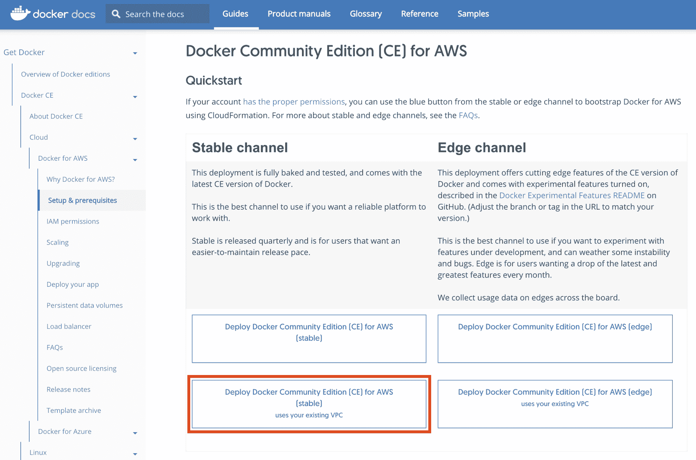
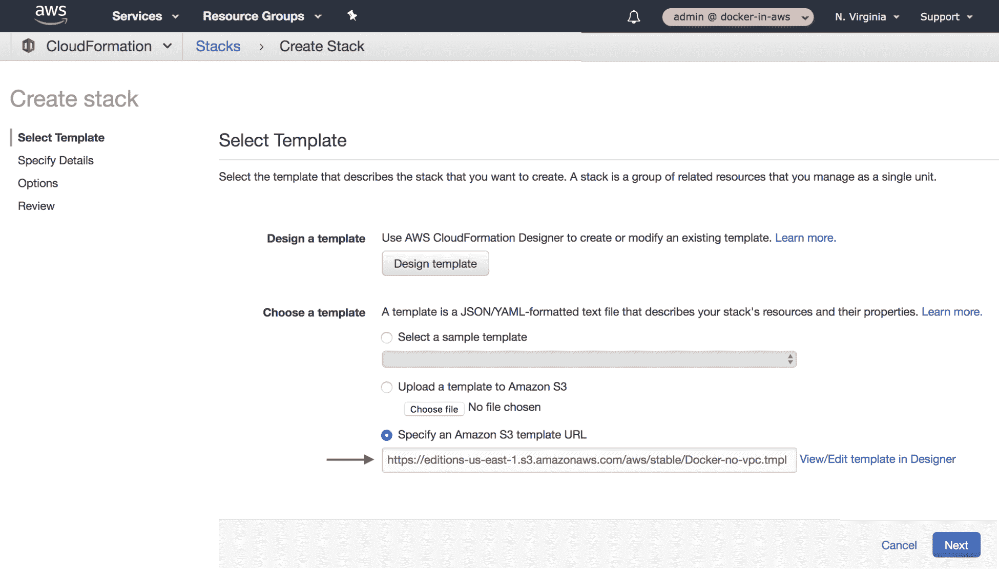
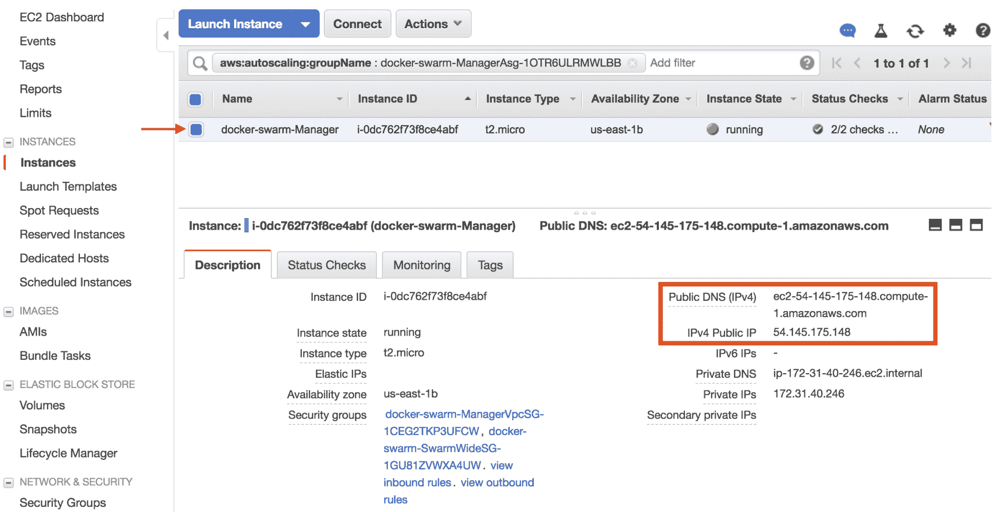
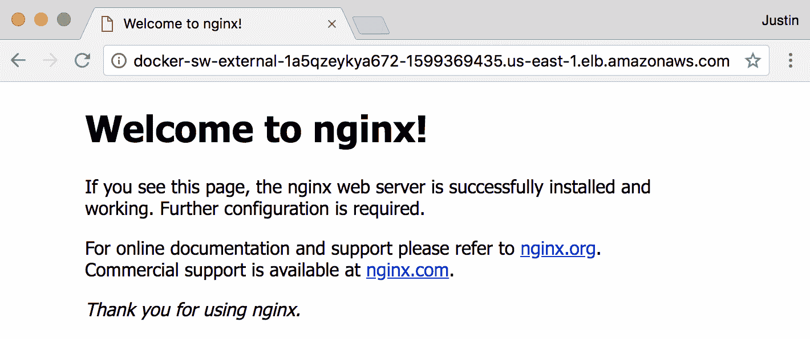
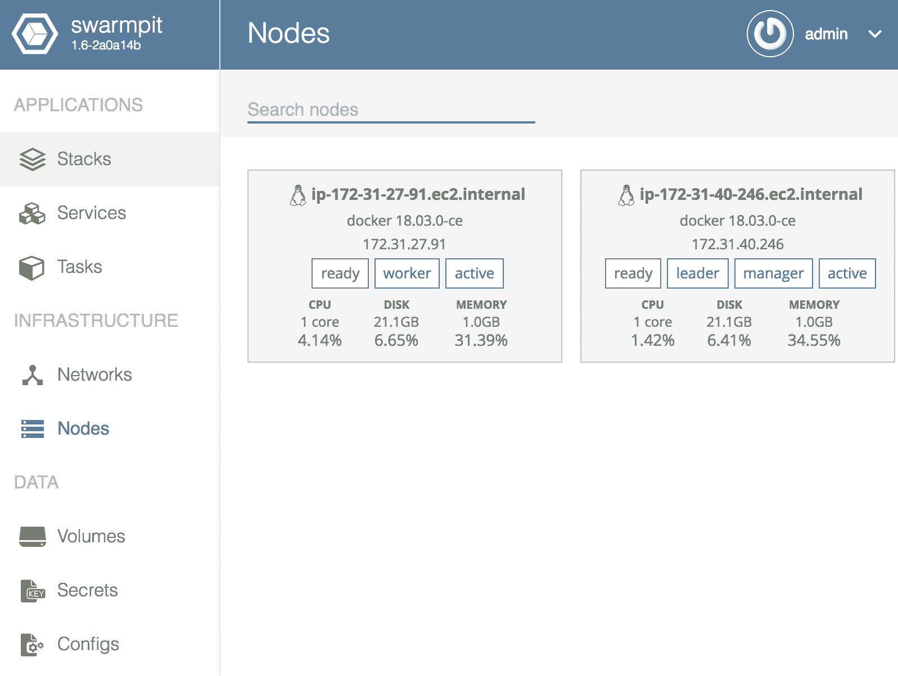
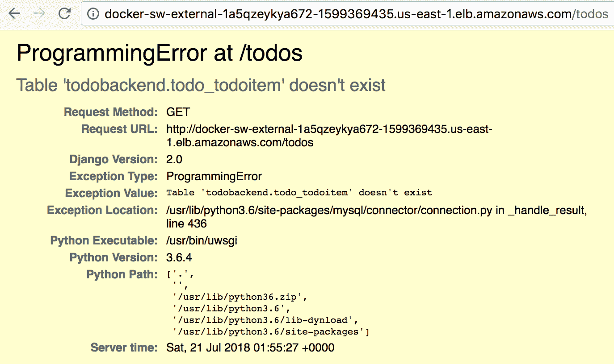

# 第十六章：AWS 中的 Docker Swarm

Docker Swarm 代表了 Docker 的本机容器管理平台，直接内置到 Docker Engine 中，对于许多第一次使用 Docker 的人来说，Docker Swarm 是他们首次了解和学习的容器管理平台，因为它是 Docker Engine 的集成功能。Docker Swarm 自然是 AWS 支持的 ECS、Fargate、弹性 Beanstalk 和最近的弹性 Kubernetes 服务（EKS）的竞争对手，因此您可能会想知道为什么一本关于 AWS 中的 Docker 的书会有一个专门介绍 Docker Swarm 的章节。许多组织更喜欢使用与云提供商无关的容器管理平台，可以在 AWS、谷歌云和 Azure 等其他云提供商以及本地运行，如果这对您和您的组织是这种情况，那么 Docker Swarm 肯定是值得考虑的选项。

在本章中，您将学习如何使用 Docker for AWS 解决方案将 Docker Swarm 部署到 AWS，该解决方案使得在 AWS 上快速启动和运行 Docker Swarm 集群变得非常容易。您将学习如何管理和访问 Swarm 集群的基础知识，如何创建和部署服务到 Docker Swarm，以及如何利用与 Docker for AWS 解决方案集成的许多 AWS 服务。这将包括将 Docker Swarm 与弹性容器注册表（ECR）集成，通过与 AWS 弹性负载均衡（ELB）集成将应用程序发布到外部世界，使用 AWS 弹性文件系统（EFS）创建共享卷，以及使用 AWS 弹性块存储（EBS）创建持久卷。

最后，您将学习如何解决关键的运营挑战，包括运行一次性部署任务，使用 Docker secrets 进行秘密管理，以及使用滚动更新部署应用程序。通过本章的学习，您将了解如何将 Docker Swarm 集群部署到 AWS，如何将 Docker Swarm 与 AWS 服务集成，以及如何将生产应用程序部署到 Docker Swarm。

本章将涵盖以下主题：

+   Docker Swarm 简介

+   安装 Docker for AWS

+   访问 Docker Swarm

+   将 Docker 服务部署到 Docker Swarm

+   将 Docker 堆栈部署到 Docker Swarm

+   将 Docker Swarm 与 ECR 集成

+   使用 EFS 创建共享 Docker 卷

+   使用 EBS 创建持久 Docker 卷

+   支持一次性部署任务

+   执行滚动更新

# 技术要求

以下是本章的技术要求：

+   对 AWS 账户的管理访问权限

+   本地环境按照第一章的说明进行配置

+   本地 AWS 配置文件，按照第三章的说明进行配置

+   AWS CLI 版本 1.15.71 或更高版本

+   Docker 18.06 CE 或更高版本

+   Docker Compose 1.22 或更高版本

+   GNU Make 3.82 或更高版本

本章假定您已经完成了本书中的所有前一章节

以下 GitHub URL 包含本章中使用的代码示例：[`github.com/docker-in-aws/docker-in-aws/tree/master/ch16`](https://github.com/docker-in-aws/docker-in-aws/tree/master/ch16)。

查看以下视频以查看代码的实际操作：

[`bit.ly/2ogdBpp`](http://bit.ly/2ogdBpp)

# Docker Swarm 介绍

**Docker Swarm**是 Docker Engine 的一个本地集成功能，提供集群管理和容器编排功能，允许您在生产环境中规模化运行 Docker 容器。每个运行版本 1.13 或更高版本的 Docker Engine 都包括在 swarm 模式下运行的能力，提供以下功能：

+   **集群管理**：所有在 swarm 模式下运行的节点都包括本地集群功能，允许您快速建立集群，以便部署您的应用程序。

+   **多主机网络**：Docker 支持覆盖网络，允许您创建虚拟网络，所有连接到网络的容器可以私下通信。这个网络层完全独立于连接 Docker Engines 的物理网络拓扑，这意味着您通常不必担心传统的网络约束，比如 IP 地址和网络分割——Docker 会为您处理所有这些。

+   **服务发现和负载均衡**：Docker Swarm 支持基于 DNS 的简单服务发现模型，允许您的应用程序发现彼此，而无需复杂的服务发现协议或基础设施。Docker Swarm 还支持使用 DNS 轮询自动负载均衡流量到您的应用程序，并可以集成外部负载均衡器，如 AWS Elastic Load Balancer 服务。

+   **服务扩展和滚动更新**：您可以轻松地扩展和缩小您的服务，当需要更新您的服务时，Docker 支持智能的滚动更新功能，并在部署失败时支持回滚。

+   声明式服务模型：Docker Swarm 使用流行的 Docker Compose 规范来声明性地定义应用程序服务、网络、卷等，以易于理解和维护的格式。

+   **期望状态**：Docker Swarm 持续监视应用程序和运行时状态，确保您配置的服务按照期望的状态运行。例如，如果您配置一个具有 2 个实例或副本计数的服务，Docker Swarm 将始终尝试维持这个计数，并在现有节点失败时自动部署新的副本到新节点。

+   **生产级运维功能，如秘密和配置管理**：一些功能，如 Docker 秘密和 Docker 配置，是 Docker Swarm 独有的，并为实际的生产问题提供解决方案，例如安全地将秘密和配置数据分发给您的应用程序。

在 AWS 上运行 Docker Swarm 时，Docker 提供了一个名为 Docker for AWS CE 的社区版产品，您可以在[`store.docker.com/editions/community/docker-ce-aws`](https://store.docker.com/editions/community/docker-ce-aws)找到更多信息。目前，Docker for AWS CE 是通过预定义的 CloudFormation 模板部署的，该模板将 Docker Swarm 与许多 AWS 服务集成在一起，包括 EC2 自动扩展、弹性负载均衡、弹性文件系统和弹性块存储。很快您将会看到，这使得在 AWS 上快速搭建一个新的 Docker Swarm 集群变得非常容易。

# Docker Swarm 与 Kubernetes 的比较

首先，正如本书的大部分内容所证明的那样，我是一个 ECS 专家，如果您的容器工作负载完全在 AWS 上运行，那么我的建议，至少在撰写本书时，几乎总是会选择 ECS。然而，许多组织不想被锁定在 AWS 上，他们希望采用云无关的方法，这就是 Docker Swarm 目前是其中一种领先的解决方案的原因。

目前，Docker Swarm 与 Kubernetes 直接竞争，我们将在下一章讨论。可以说，Kubernetes 似乎已经确立了自己作为首选的云无关容器管理平台，但这并不意味着您一定要忽视 Docker Swarm。

总的来说，我个人认为 Docker Swarm 更容易设置和使用，至少对我来说，一个关键的好处是它使用熟悉的工具，比如 Docker Compose，这意味着你可以非常快速地启动和运行，特别是如果你之前使用过这些工具。对于只想快速启动并确保事情顺利进行的较小组织来说，Docker Swarm 是一个有吸引力的选择。Docker for AWS 解决方案使在 AWS 中建立 Docker Swarm 集群变得非常容易，尽管 AWS 最近通过推出弹性 Kubernetes 服务（EKS）大大简化了在 AWS 上使用 Kubernetes 的过程——关于这一点，我们将在下一章中详细介绍。

最终，我鼓励你以开放的心态尝试两者，并根据你和你的组织目标的最佳容器管理平台做出自己的决定。

# 安装 Docker for AWS

在 AWS 中快速启动 Docker Swarm 的推荐方法是使用 Docker for AWS，你可以在[`docs.docker.com/docker-for-aws/`](https://docs.docker.com/docker-for-aws/)上了解更多。如果你浏览到这个页面，在设置和先决条件部分，你将看到允许你安装 Docker 企业版（EE）和 Docker 社区版（CE）for AWS 的链接。

我们将使用免费的 Docker CE for AWS（稳定版），请注意你可以选择部署到全新的 VPC 或现有的 VPC：

选择 Docker CE for AWS 选项

鉴于我们已经有一个现有的 VPC，如果你点击部署 Docker CE for AWS（稳定版）用户现有的 VPC 选项，你将被重定向到 AWS CloudFormation 控制台，在那里你将被提示使用 Docker 发布的模板创建一个新的堆栈：



创建 Docker for AWS 堆栈

点击下一步后，你将被提示指定一些参数，这些参数控制了你的 Docker Swarm Docker 安装的配置。我不会描述所有可用的选项，所以假设对于我没有提到的任何参数，你应该保留默认配置。

+   **堆栈名称**：为你的堆栈指定一个合适的名称，例如 docker-swarm。

+   **Swarm Size**: 在这里，您可以指定 Swarm 管理器和工作节点的数量。最少可以指定一个管理器，但我建议还配置一个工作节点，以便您可以测试将应用程序部署到多节点 Swarm 集群。

+   **Swarm Properties**: 在这里，您应该配置 Swarm EC2 实例以使用您现有的管理员 SSH 密钥（EC2 密钥对），并启用创建 EFS 存储属性的先决条件，因为我们将在本章后面使用 EFS 提供共享卷。

+   **Swarm Manager Properties**: 将 Manager 临时存储卷类型更改为 gp2（SSD）。

+   **Swarm Worker Properties**: 将工作节点临时存储卷类型更改为 gp2（SSD）。

+   **VPC/网络**: 选择现有的默认 VPC，然后确保您指定选择 VPC 时显示的 VPC CIDR 范围（例如`172.31.0.0/16`），然后从默认 VPC 中选择适当的子网作为公共子网 1 至 3。

完成上述配置后，点击两次“下一步”按钮，最后在“审阅”屏幕上，选择“我承认 AWS CloudFormation 可能创建 IAM 资源”选项，然后点击“创建”按钮。

此时，您的新 CloudFormation 堆栈将被创建，并且应在 10-15 分钟内完成。请注意，如果您想要增加集群中的管理器和/或工作节点数量，建议的方法是执行 CloudFormation 堆栈更新，修改定义管理器和工作节点计数的适当输入参数。另外，要升级 Docker for AWS Swarm Cluster，您应该应用包含 Docker Swarm 和其他各种资源更新的最新 CloudFormation 模板。

# 由 Docker for AWS CloudFormation 堆栈创建的资源

如果您在 CloudFormation 控制台的新堆栈中查看资源选项卡，您将注意到创建了各种资源，其中最重要的资源列在下面：

+   **CloudWatch 日志组**: 这存储了通过您的 Swarm 集群安排的所有容器日志。只有在堆栈创建期间启用了使用 Cloudwatch 进行容器日志记录参数时（默认情况下，此参数已启用），才会创建此资源。

+   **外部负载均衡器**: 创建了一个经典的弹性负载均衡器，用于发布对您的 Docker 应用程序的公共访问。

+   **弹性容器注册表 IAM 策略**：创建了一个 IAM 策略，并附加到所有 Swarm 管理器和工作节点 EC2 实例角色，允许对 ECR 进行读取/拉取访问。如果您将 Docker 镜像存储在 ECR 中，这是必需的，适用于我们的场景。

+   **其他资源**：还创建了各种资源，例如用于集群管理操作的 DynamoDB 表，以及用于 EC2 自动扩展生命周期挂钩的简单队列服务（SQS）队列，用于 Swarm 管理器升级场景。

如果单击“输出”选项卡，您会注意到一个名为 DefaultDNSTarget 的输出属性，它引用了外部负载均衡器的公共 URL。请注意这个 URL，因为稍后在本章中，示例应用将可以从这里访问：

Docker for AWS 堆栈输出

# 访问 Swarm 集群

在 CloudFormation 堆栈输出中，还有一个名为 Managers 的属性，它提供了指向每个 Swarm 管理器的 EC2 实例的链接：

Swarm Manager 自动扩展组

您可以使用这些信息来获取您的 Swarm 管理器之一的公共 IP 地址或 DNS 名称。一旦您有了这个 IP 地址，您就可以建立到管理器的 SSH 连接。

```
> ssh -i ~/.ssh/admin.pem docker@54.145.175.148
The authenticity of host '54.145.175.148 (54.145.175.148)' can't be established.
ECDSA key fingerprint is SHA256:Br/8IMAuEzPOV29B8zdbT6H+DjK9sSEEPSbXdn+v0YM.
Are you sure you want to continue connecting (yes/no)? yes
Warning: Permanently added '54.145.175.148' (ECDSA) to the list of known hosts.
Welcome to Docker!
~ $ docker ps --format "{{ .ID }}: {{ .Names }}"
a5a2dfe609e4: l4controller-aws
0d7f5d2ae4a0: meta-aws
d54308064314: guide-aws
58cb47dad3e1: shell-aws
```

请注意，当访问管理器时，您必须指定一个用户名为`docker`，如果运行`docker ps`命令，您会看到默认情况下管理器上运行着四个系统容器：

+   **shell-aws**：这提供了对管理器的 SSH 访问，这意味着您建立到 Swarm 管理器的 SSH 会话实际上是在这个容器内运行的。

+   **meta-aws**：提供通用的元数据服务，包括提供允许新成员加入集群的令牌。

+   **guide-aws**：执行集群状态管理操作，例如将每个管理器添加到 DynamoDB，以及其他诸如清理未使用的镜像和卷以及停止的容器等日常任务。

+   **l4controller-aws**：管理与 Swarm 集群的外部负载均衡器的集成。该组件负责发布新端口，并确保它们可以在弹性负载均衡器上访问。请注意，您不应直接修改集群的 ELB，而应依赖`l4controller-aws`组件来管理 ELB。

要查看和访问集群中的其他节点，您可以使用`docker node ls`命令：

```
> docker node ls
ID                         HOSTNAME                      STATUS   MANAGER STATUS   ENGINE VERSION
qna4v46afttl007jq0ec712dk  ip-172-31-27-91.ec2.internal  Ready                     18.03.0-ce
ym3jdy1ol17pfw7emwfen0b4e* ip-172-31-40-246.ec2.internal Ready    Leader           18.03.0-ce
> ssh docker@ip-172-31-27-91.ec2.internal Permission denied (publickey,keyboard-interactive).
```

请注意，工作节点不允许公共 SSH 访问，因此您只能通过管理器从 SSH 访问工作节点。然而，有一个问题：鉴于管理节点没有本地存储管理员 EC2 密钥对的私钥，您无法建立与工作节点的 SSH 会话。

# 设置本地访问 Docker Swarm

虽然您可以通过 SSH 会话远程运行 Docker 命令到 Swarm 管理器，但是能够使用本地 Docker 客户端与远程 Swarm 管理器守护程序进行交互要容易得多，在那里您可以访问本地 Docker 服务定义和配置。我们还有一个问题，即无法通过 SSH 访问工作节点，我们可以通过使用 SSH 代理转发和 SSH 隧道这两种技术来解决这两个问题。

# 配置 SSH 代理转发

设置 SSH 代理转发，首先使用`ssh-add`命令将您的管理员 SSH 密钥添加到本地 SSH 代理中：

```
> ssh-add -K ~/.ssh/admin.pem
Identity added: /Users/jmenga/.ssh/admin.pem (/Users/jmenga/.ssh/admin.pem)
> ssh-add -L
ssh-rsa AAAAB3NzaC1yc2EAAAADAQABAAABAQCkF7aAzIRayGHiiR81wcz/k9b+ZdmAEkdIBU0pOvAaFYjrDPf4JL4I0rJjdpFBjFZIqKXM9dLWg0skENYSUl9pfLT+CzValQat/XpBw/HfwzbzMy8wqcKehN0pB4V1bpzfOYe7lTLmTYIQ/21wW63QVlZnNyV1VZiVgN5DcLqgiG5CHHAooMIbiExAYvRrgo8XEXoqFRODLwIn4HZ7OAtojWzxElBx+EC4lmDekykgxnfGd30QgATIEF8/+UzM17j91JJohfxU7tA3GhXkScMBXnxBhdOftVvtB8/bGc+DHjJlkYSxL20792eBEv/ZsooMhNFxGLGhidrznmSeC8qL /Users/jmenga/.ssh/admin.pem
```

`-K`标志是特定于 macOS 的，并将您的 SSH 密钥的密码添加到您的 OS X 钥匙串中，这意味着此配置将在重新启动后持续存在。如果您不使用 macOS，可以省略`-K`标志。

现在您可以使用`-A`标志访问您的 Swarm 管理器，该标志配置 SSH 客户端使用您的 SSH 代理身份。使用 SSH 代理还可以启用 SSH 代理转发，这意味着用于与 Swarm 管理器建立 SSH 会话的 SSH 密钥可以自动用于或转发到您可能在 SSH 会话中建立的其他 SSH 连接：

```
> ssh -A docker@54.145.175.148
Welcome to Docker!
~ $ ssh docker@ip-172-31-27-91.ec2.internal
Welcome to Docker!
```

如您所见，使用 SSH 代理转发解决了访问工作节点的问题。

# 配置 SSH 隧道

**SSH 隧道**是一种强大的技术，允许您通过加密的 SSH 会话安全地隧道网络通信到远程主机。 SSH 隧道通过暴露一个本地套接字或端口，该套接字或端口连接到远程主机上的远程套接字或端口。这可以产生您正在与本地服务通信的错觉，当与 Docker 一起工作时特别有用。

以下命令演示了如何使运行在 Swarm 管理器上的 Docker 套接字显示为运行在本地主机上的端口：

```
> ssh -i ~/.ssh/admin.pem -NL localhost:2374:/var/run/docker.sock docker@54.145.175.148 &
[1] 7482
> docker -H localhost:2374 ps --format "{{ .ID }}: {{ .Names }}"
a5a2dfe609e4: l4controller-aws
0d7f5d2ae4a0: meta-aws
d54308064314: guide-aws
58cb47dad3e1: shell-aws
> export DOCKER_HOST=localhost:2374
> docker node ls --format "{{ .ID }}: {{ .Hostname }}" qna4v46afttl007jq0ec712dk: ip-172-31-27-91.ec2.internal
ym3jdy1ol17pfw7emwfen0b4e: ip-172-31-40-246.ec2.internal
```

传递给第一个 SSH 命令的`-N`标志指示客户端不发送远程命令，而`-L`或本地转发标志配置了将本地主机上的 TCP 端口`2374`映射到远程 Swarm 管理器上的`/var/run/docker.sock` Docker Engine 套接字。命令末尾的和符号（`&`）使命令在后台运行，并将进程 ID 作为此命令的输出发布。

有了这个配置，现在您可以运行 Docker 客户端，本地引用`localhost:2374`作为连接到远程 Swarm 管理器的本地端点。请注意，您可以使用`-H`标志指定主机，也可以通过导出环境变量`DOCKER_HOST`来指定主机。这将允许您在引用本地文件的同时执行远程 Docker 操作，从而更轻松地管理和部署到 Swarm 集群。

尽管 Docker 确实包括了一个客户端/服务器模型，可以在 Docker 客户端和远程 Docker Engine 之间进行通信，但要安全地进行这样的通信需要相互传输层安全性（TLS）和公钥基础设施（PKI）技术，这些技术设置和维护起来很复杂。使用 SSH 隧道来暴露远程 Docker 套接字要容易得多，而且被认为与任何形式的远程 SSH 访问一样安全。

# 将应用程序部署到 Docker Swarm

现在您已经使用 Docker for AWS 安装了 Docker Swarm，并建立了与 Swarm 集群的管理连接，我们准备开始部署应用程序。将应用程序部署到 Docker Swarm 需要使用`docker service`和`docker stack`命令，这些命令在本书中尚未涉及，因此在处理 todobackend 应用程序的部署之前，我们将通过部署一些示例应用程序来熟悉这些命令。

# Docker 服务

尽管您在 Swarm 集群中可以技术上部署单个容器，但应避免这样做，并始终使用 Docker *服务*作为部署到 Swarm 集群的标准单位。实际上，我们已经使用 Docker Compose 来使用 Docker 服务，但是与 Docker Swarm 一起使用时，它们被提升到了一个新的水平。

要创建一个 Docker 服务，您可以使用`docker service create`命令，下面的示例演示了如何使用流行的 Nginx Web 服务器搭建一个非常简单的 Web 应用程序：

```
> docker service create --name nginx --publish published=80,target=80 --replicas 2 nginx ez24df69qb2yq1zhyxma38dzo
overall progress: 2 out of 2 tasks
1/2: running [==================================================>]
2/2: running [==================================================>]
verify: Service converged
> docker service ps --format "{{ .ID }} ({{ .Name }}): {{ .Node }} {{ .CurrentState }}" nginx 
```

```
wcq6jfazrums (nginx.1): ip-172-31-27-91.ec2.internal  Running 2 minutes ago
i0vj5jftf6cb (nginx.2): ip-172-31-40-246.ec2.internal Running 2 minutes ago
```

`--name`标志为服务提供了友好的名称，而`--publish`标志允许您发布服务将从中访问的外部端口（在本例中为端口`80`）。`--replicas`标志定义了服务应部署多少个容器，最后您指定了要运行的服务的图像的名称（在本例中为 nginx）。请注意，您可以使用`docker service ps`命令来列出运行服务的各个容器和节点。

如果现在尝试浏览外部负载均衡器的 URL，您应该收到默认的**Welcome to nginx!**网页：

Nginx 欢迎页面要删除一个服务，您可以简单地使用`docker service rm`命令：

```
> docker service rm nginx
nginx
```

# Docker 堆栈

**Docker 堆栈**被定义为一个复杂的、自包含的环境，由多个服务、网络和/或卷组成，并在 Docker Compose 文件中定义。

一个很好的 Docker 堆栈的例子，将立即为我们的 Swarm 集群增加一些价值，是一个名为**swarmpit**的开源 Swarm 管理工具，您可以在[`swarmpit.io/`](https://swarmpit.io/)上了解更多。要开始使用 swarmpit，请克隆[`github.com/swarmpit/swarmpit`](https://github.com/swarmpit/swarmpit)存储库到本地文件夹，然后打开存储库根目录中的`docker-compose.yml`文件。

```
version: '3.6'

services:
```

```

  app:
    image: swarmpit/swarmpit:latest
    environment:
      - SWARMPIT_DB=http://db:5984
    volumes:
      - /var/run/docker.sock:/var/run/docker.sock:ro
    ports:
 - target: 8080
 published: 8888
 mode: ingress
    networks:
      - net
    deploy:
      resources:
        limits:
          cpus: '0.50'
          memory: 1024M
        reservations:
          cpus: '0.25'
          memory: 512M
      placement:
        constraints:
          - node.role == manager

  db:
    image: klaemo/couchdb:2.0.0
    volumes:
      - db-data:/opt/couchdb/data
    networks:
      - net
    deploy:
      resources:
        limits:
          cpus: '0.30'
          memory: 512M
        reservations:
          cpus: '0.15'
          memory: 256M
 placement:
 constraints:
 - node.role == manager

  agent:
    ...
    ...

networks:
  net:
    driver: overlay

volumes:
  db-data:
    driver: local
```

我已经突出显示了对文件的修改，即将 Docker Compose 文件规范版本更新为 3.6，修改 app 服务的端口属性，以便在端口 8888 上外部发布管理 UI，并确保数据库仅部署到集群中的 Swarm 管理器。固定数据库的原因是确保在任何情况下，如果数据库容器失败，Docker Swarm 将尝试将数据库容器重新部署到存储本地数据库卷的同一节点。

如果您意外地擦除了 swarmpit 数据库，请注意管理员密码将被重置为默认值 admin，如果您已将 swarmpit 管理界面发布到公共互联网上，这将构成重大安全风险。

有了这些更改，现在可以运行`docker stack deploy`命令来部署 swarmpit 管理应用程序：

```
> docker stack deploy -c docker-compose.yml swarmpit
Creating network swarmpit_net
Creating service swarmpit_agent
Creating service swarmpit_app
Creating service swarmpit_db
> docker stack services swarmpit
ID            NAME            MODE        REPLICAS  IMAGE                     PORTS
8g5smxmqfc6a  swarmpit_app    replicated  1/1       swarmpit/swarmpit:latest  *:8888->8080/tcp
omc7ewvqjecj  swarmpit_db     replicated  1/1
```

```
klaemo/couchdb:2.0.0
u88gzgeg8rym  swarmpit_agent  global      2/2       swarmpit/agent:latest
```

您可以看到`docker stack deploy`命令比`docker service create`命令简单得多，因为 Docker Compose 文件包含了所有的服务配置细节。在端口 8888 上浏览您的外部 URL，并使用默认用户名和密码`admin`/`admin`登录，然后立即通过选择右上角的管理员下拉菜单并选择**更改密码**来更改管理员密码。更改管理员密码后，您可以查看 swarmpit 管理 UI，该界面提供了有关您的 Swarm 集群的大量信息。以下截图展示了**基础设施** | **节点**页面，其中列出了集群中的节点，并显示了每个节点的详细信息：

swarmkit 管理界面

# 将示例应用部署到 Docker Swarm

我们现在进入了本章的业务端，即将我们的示例 todobackend 应用部署到新创建的 Docker swarm 集群。正如你所期望的那样，我们将遇到一些挑战，需要执行以下配置任务：

+   将 Docker Swarm 集成到弹性容器注册表

+   定义堆栈

+   创建用于托管静态内容的共享存储

+   创建 collectstatic 服务

+   创建用于存储 todobackend 数据库的持久性存储

+   使用 Docker Swarm 进行秘密管理

+   运行数据库迁移

# 将 Docker Swarm 集成到弹性容器注册表

todobackend 应用已经发布在现有的弹性容器注册表（ECR）存储库中，理想情况下，我们希望能够集成我们的 Docker swarm 集群，以便我们可以从 ECR 拉取私有镜像。截至撰写本书时，ECR 集成在某种程度上得到支持，即您可以在部署时将注册表凭据传递给 Docker swarm 管理器，这些凭据将在集群中的所有节点之间共享。但是，这些凭据在 12 小时后会过期，目前没有本机机制来自动刷新这些凭据。

为了定期刷新 ECR 凭据，以便您的 Swarm 集群始终可以从 ECR 拉取镜像，您需要执行以下操作：

+   确保您的管理器和工作节点具有从 ECR 拉取的权限。Docker for AWS CloudFormation 模板默认配置了此访问权限，因此您不必担心配置此项。

+   将`docker-swarm-aws-ecr-auth`自动登录系统容器部署为服务，发布在[`github.com/mRoca/docker-swarm-aws-ecr-auth`](https://github.com/mRoca/docker-swarm-aws-ecr-auth)。安装后，此服务会自动刷新集群中所有节点上的 ECR 凭据。

要部署`docker-swarm-aws-ecr-auth`服务，您可以使用以下`docker service create`命令：

```
> docker service create \
    --name aws_ecr_auth \
    --mount type=bind,source=/var/run/docker.sock,destination=/var/run/docker.sock \
    --constraint 'node.role == manager' \
    --restart-condition 'none' \
    --detach=false \
    mroca/swarm-aws-ecr-auth
lmf37a9pbzc3nzhe88s1nzqto
overall progress: 1 out of 1 tasks
1/1: running [==================================================>]
verify: Service converged
```

请注意，一旦此服务启动运行，您必须为使用 ECR 镜像部署的任何服务包括`--with-registry-auth`标志。

以下代码演示了使用`docker service create`命令部署 todobackend 应用程序，以及`--with-registry-auth`标志：

```
> export AWS_PROFILE=docker-in-aws
> $(aws ecr get-login --no-include-email)
WARNING! Using --password via the CLI is insecure. Use --password-stdin.
Login Succeeded
> docker service create --name todobackend --with-registry-auth \
 --publish published=80,target=8000 --env DJANGO_SETTINGS_MODULE=todobackend.settings_release\
 385605022855.dkr.ecr.us-east-1.amazonaws.com/docker-in-aws/todobackend \
 uwsgi --http=0.0.0.0:8000 --module=todobackend.wsgi p71rje93a6pqvipqf2a14v6cc
overall progress: 1 out of 1 tasks
1/1: running [==================================================>]
verify: Service converged
```

您可以通过浏览到外部负载均衡器 URL 来验证 todobackend 服务确实已部署：

部署 todobackend 服务

请注意，因为我们还没有生成任何静态文件，todobackend 服务缺少静态内容。稍后当我们创建 Docker Compose 文件并为 todobackend 应用程序部署堆栈时，我们将解决这个问题。

# 定义一个堆栈

虽然您可以使用`docker service create`等命令部署服务，但是您可以使用`docker stack deploy`命令非常快速地部署完整的多服务环境，引用捕获各种服务、网络和卷配置的 Docker Compose 文件，构成您的堆栈。将堆栈部署到 Docker Swarm 需要 Docker Compose 文件规范的版本 3，因此我们不能使用`todobackend`存储库根目录下的现有`docker-compose.yml`文件来定义我们的 Docker Swarm 环境，并且我建议保持开发和测试工作流分开，因为 Docker Compose 版本 2 规范专门支持适用于持续交付工作流的功能。

现在，让我们开始为 todobackend 应用程序定义一个堆栈，我们可以通过在`todobackend`存储库的根目录创建一个名为`stack.yml`的文件来部署到 AWS 的 Docker Swarm 集群中：

```
version: '3.6'

networks:
  net:
    driver: overlay

services:
  app:
    image: 385605022855.dkr.ecr.us-east-1.amazonaws.com/docker-in-aws/todobackend
    ports:
      - target: 8000
        published: 80
    networks:
      - net
    environment:
      DJANGO_SETTINGS_MODULE: todobackend.settings_release
    command:
      - uwsgi
      - --http=0.0.0.0:8000
      - --module=todobackend.wsgi
      - --master
      - --die-on-term
      - --processes=4
      - --threads=2
      - --check-static=/public
```

```

    deploy:
      replicas: 2
      update_config:
        parallelism: 1
        delay: 30s

```

我们指定的第一个属性是强制性的`version`属性，我们将其定义为 3.6 版本，这是在撰写本书时支持的最新版本。接下来，我们配置顶级网络属性，该属性指定了堆栈将使用的 Docker 网络。您将创建一个名为`net`的网络，该网络实现了`overlay`驱动程序，该驱动程序在 Swarm 集群中的所有节点之间创建了一个虚拟网络段，堆栈中定义的各种服务可以在其中相互通信。通常，您部署的每个堆栈都应该指定自己的覆盖网络，这样可以在每个堆栈之间提供分割，并且无需担心集群的 IP 寻址或物理网络拓扑。

接下来，您必须定义一个名为`app`的单个服务，该服务代表了主要的 todobackend web 应用程序，并通过`image`属性指定了您在之前章节中发布的 todobackend 应用程序的完全限定名称的 ECR 镜像。请注意，Docker 堆栈不支持`build`属性，必须引用已发布的 Docker 镜像，这是为什么您应该始终为开发、测试和构建工作流程分别拥有单独的 Docker Compose 规范的一个很好的理由。

`ports`属性使用了长格式配置语法（在之前的章节中，您使用了短格式语法），这提供了更多的配置选项，允许您指定容器端口 8000（由`target`属性指定）将在端口 80 上对外发布（由`published`属性指定），而`networks`属性配置`app`服务附加到您之前定义的`net`网络。请注意，`environment`属性没有指定任何数据库配置设置，现在的重点只是让应用程序运行起来，尽管状态可能有些混乱，但我们将在本章后面配置数据库访问。

最后，`deploy`属性允许您控制服务的部署方式，`replica`属性指定部署两个服务实例，`update_config`属性配置滚动更新，以便一次更新一个实例（由`parallelism`属性指定），每个更新实例之间延迟 30 秒。

有了这个配置，您现在可以使用`docker stack deploy`命令部署您的堆栈了：

```
> $(aws ecr get-login --no-include-email)
WARNING! Using --password via the CLI is insecure. Use --password-stdin.
Login Succeeded
> docker stack deploy --with-registry-auth -c stack.yml todobackend Creating network todobackend_net
Creating service todobackend_app
> docker service ps todobackend_app --format "{{ .Name }} -> {{ .Node }} ({{ .CurrentState }})"
todobackend_app.1 -> ip-172-31-27-91.ec2.internal (Running 6 seconds ago)
todobackend_app.2 -> ip-172-31-40-246.ec2.internal (Running 6 seconds ago)
```

请注意，我首先登录到 ECR——这一步并非绝对必需，但如果未登录到 ECR，Docker 客户端将无法确定与最新标签关联的当前图像哈希，并且会出现以下警告：

```
> docker stack deploy --with-registry-auth -c stack.yml todobackend image 385605022855.dkr.ecr.us-east-1.amazonaws.com/docker-in-aws/todobackend:latest could not be accessed on a registry to record
its digest. Each node will access 385605022855.dkr.ecr.us-east-1.amazonaws.com/docker-in-aws/todobackend:latest independently,
possibly leading to different nodes running different
versions of the image.
...
...
```

如果您现在浏览外部负载均衡器 URL，todobackend 应用程序应该加载，但您会注意到应用程序缺少静态内容，如果您尝试访问 `/todos`，将会出现数据库配置错误，这是可以预料的，因为我们尚未配置任何数据库设置或考虑如何在 Docker Swarm 中运行 **collectstatic** 过程。

# 为托管静态内容创建共享存储

Docker for AWS 解决方案包括 Cloudstor 卷插件，这是由 Docker 构建的存储插件，旨在支持流行的云存储机制以实现持久存储。

在 AWS 的情况下，此插件提供了与以下类型的持久存储的开箱即用集成：

+   **弹性块存储**（**EBS**）：提供面向专用（非共享）访问的块级存储。这提供了高性能，能够将卷分离和附加到不同的实例，并支持快照和恢复操作。EBS 存储适用于数据库存储或任何需要高吞吐量和最小延迟来读写本地数据的应用程序。

+   **弹性文件系统**（**EFS**）：使用 **网络文件系统**（**NFS**）版本 4 协议提供共享文件系统访问。NFS 允许在多个主机之间同时共享存储，但这比 EBS 存储要低得多。NFS 存储适用于共享常见文件并且不需要高性能的应用程序。在之前部署 Docker for AWS 解决方案时，您选择了为 EFS 创建先决条件，这为 Cloudstor 卷插件集成了一个用于 Swarm 集群的 EFS 文件系统。

正如您在之前的章节中所了解的，todobackend 应用程序对存储静态内容有特定要求，尽管我通常不建议将 EFS 用于这种用例，但静态内容的要求代表了一个很好的机会，可以演示如何在 Docker Swarm 环境中配置和使用 EFS 作为共享卷。

```
version: '3.6'

networks:
  net:
    driver: overlay

volumes:
 public:
 driver: cloudstor:aws
 driver_opts:
 backing: shared

services:
  app:
    image: 385605022855.dkr.ecr.us-east-1.amazonaws.com/docker-in-aws/todobackend
    ports:
      - target: 8000
        published: 80
    networks:
```

```

      - net
 volumes:
 - public:/public
    ...
    ...
```

首先，您必须创建一个名为`public`的卷，并指定驱动程序为`cloudstor:aws`，这可以确保 Cloudstor 驱动程序加载了 AWS 支持。要创建一个 EFS 卷，您只需配置一个名为`backing`的驱动选项，值为`shared`，然后在`app`服务中挂载到`/public`。

如果您现在使用`docker stack deploy`命令部署您的更改，卷将被创建，并且`app`服务实例将被更新：

```
> docker stack deploy --with-registry-auth -c stack.yml todobackend
Updating service todobackend_app (id: 59gpr2x9n7buikeorpf0llfmc)
> docker volume ls
DRIVER          VOLUME NAME
local           bd3d2804c796064d6e7c4040040fd474d9adbe7aaf68b6e30b1d195b50cdefde
local           sshkey
cloudstor:aws   todobackend_public
>  docker service ps todobackend_app \
 --format "{{ .Name }} -> {{ .DesiredState }} ({{ .CurrentState }})"
todobackend_app.1 -> Running (Running 44 seconds ago)
todobackend_app.1 -> Shutdown (Shutdown 45 seconds ago)
todobackend_app.2 -> Running (Running 9 seconds ago)
todobackend_app.2 -> Shutdown (Shutdown 9 seconds ago)
```

您可以使用`docker volume ls`命令查看当前卷，您会看到一个新的卷，根据约定命名为`<stack name>_<volume name>`（例如，`todobackend_public`），并且驱动程序为`cloudstor:aws`。请注意，`docker service ps`命令输出显示`todobackend.app.1`首先被更新，然后 30 秒后`todobackend.app.2`被更新，这是基于您在`app`服务的`deploy`设置中应用的早期滚动更新配置。

要验证卷是否成功挂载，您可以使用`docker ps`命令查询 Swarm 管理器上运行的任何 app 服务容器，然后使用`docker exec`来验证`/public`挂载是否存在，并且`app`用户可以读写 todobackend 容器运行的。

```
> docker ps -f name=todobackend -q
60b33d8b0bb1
> docker exec -it 60b33d8b0bb1 touch /public/test
> docker exec -it 60b33d8b0bb1 ls -l /public
total 4
-rw-r--r-- 1 app app 0 Jul 19 13:45 test
```

一个重要的要点是，在前面的示例中显示的`docker volume`和其他`docker`命令只在您连接的当前 Swarm 节点的上下文中执行，并且不会显示卷或允许您访问集群中其他节点上运行的容器。要验证卷确实是共享的，并且可以被我们集群中其他 Swarm 节点上运行的 app 服务容器访问，您需要首先 SSH 到 Swarm 管理器，然后 SSH 到集群中的单个工作节点：

```
> ssh -A docker@54.145.175.148
Welcome to Docker!
~ $ docker node ls
ID                          HOSTNAME                        STATUS  MANAGER  STATUS
qna4v46afttl007jq0ec712dk   ip-172-31-27-91.ec2.internal    Ready   Active 
ym3jdy1ol17pfw7emwfen0b4e * ip-172-31-40-246.ec2.internal   Ready   Active   Leader
> ssh docker@ip-172-31-27-91.ec2.internal
Welcome to Docker!
> docker ps -f name=todobackend -q
71df5495080f
~ $ docker exec -it 71df5495080f ls -l /public
total 4
-rw-r--r-- 1 app app 0 Jul 19 13:58 test
~ $ docker exec -it 71df5495080f rm /public/test
```

正如您所看到的，该卷在工作节点上是可用的，可以看到我们在另一个实例上创建的`/public/test`文件，证明该卷确实是共享的，并且可以被所有`app`服务实例访问，而不管底层节点如何。

# 创建一个 collectstatic 服务

现在您已经有了一个共享卷，我们需要考虑如何定义和执行 collectstatic 过程来生成静态内容。迄今为止，在本书中，您已经将 collectstatic 过程作为一个需要在定义的部署序列中的特定时间发生的命令式任务执行，然而 Docker Swarm 提倡最终一致性的概念，因此您应该能够部署您的堆栈，并且有一个可能失败但最终会成功的 collectstatic 过程运行，此时达到了应用程序的期望状态。这种方法与我们之前采取的命令式方法非常不同，但被认为是良好架构的现代云原生应用程序的最佳实践。

为了演示这是如何工作的，我们首先需要拆除 todobackend 堆栈，这样您就可以观察在 Docker 存储引擎创建和挂载 EFS 支持的卷时 collectstatic 过程中将发生的失败：

```
> docker stack rm todobackend
Removing service todobackend_app
Removing network todobackend_net
> docker volume ls
DRIVER         VOLUME NAME
local          sshkey
cloudstor:aws  todobackend_public
> docker volume rm todobackend_public
```

需要注意的一点是，Docker Swarm 在销毁堆栈时不会删除卷，因此您需要手动删除卷以完全清理环境。

现在我们可以向堆栈添加一个 collectstatic 服务：

```
version: '3.6'

networks:
  net:
    driver: overlay

volumes:
  public:
    driver: cloudstor:aws
    driver_opts:
      backing: shared

services:
  app:
    image: 385605022855.dkr.ecr.us-east-1.amazonaws.com/docker-in-aws/todobackend
    ports:
      - target: 8000
        published: 80
    networks:
      - net
    volumes:
      - public:/public
    ...
    ...
  collectstatic:
 image: 385605022855.dkr.ecr.us-east-1.amazonaws.com/docker-in-aws/todobackend volumes:
 - public:/public    networks:
 - net
 environment:
 DJANGO_SETTINGS_MODULE: todobackend.settings_release
 command:
 - python3
 - manage.py
 - collectstatic
 - --no-input
 deploy:
 replicas: 1
 restart_policy:
 condition: on-failure
 delay: 30s
 max_attempts: 6
```

`collectstatic` 服务挂载 `public` 共享卷，并运行适当的 `manage.py` 任务来生成静态内容。在 `deploy` 部分，我们配置了一个副本数量为 1，因为 `collectstatic` 服务只需要在部署时运行一次，然后配置了一个 `restart_policy`，指定 Docker Swarm 在失败时应尝试重新启动服务，每次重新启动尝试之间间隔 30 秒，最多尝试 6 次。这提供了最终一致的行为，因为它允许 collectstatic 在 EFS 卷挂载操作正在进行时最初失败，然后在卷挂载和准备就绪后最终成功。

如果您现在部署堆栈并监视 collectstatic 服务，您可能会注意到一些最初的失败：

```
> docker stack deploy --with-registry-auth -c stack.yml todobackend
Creating network todobackend_default
Creating network todobackend_net
Creating service todobackend_collectstatic
Creating service todobackend_app
> docker service ps todobackend_collectstatic NAME                        NODE                          DESIRED STATE CURRENT STATE
todobackend_collectstatic.1 ip-172-31-40-246.ec2.internal Running       Running 2 seconds ago
\_ todobackend_collectstatic.1 ip-172-31-40-246.ec2.internal Shutdown     Rejected 32 seconds ago
```

`docker service ps`命令不仅显示当前服务状态，还显示服务历史（例如任何先前尝试运行服务），您可以看到 32 秒前第一次尝试运行`collectstatic`失败，之后 Docker Swarm 尝试重新启动服务。这次尝试成功了，尽管`collectstatic`服务最终会完成并退出，但由于重启策略设置为失败，Docker Swarm 不会尝试重新启动服务，因为服务没有错误退出。这支持了在失败时具有重试功能的“一次性”服务的概念，Swarm 尝试再次运行服务的唯一时机是在为服务部署新配置到集群时。

如果您现在浏览外部负载均衡器的 URL，您应该会发现 todobackend 应用程序的静态内容现在被正确呈现，但是数据库配置错误仍然存在。

# 创建用于存储应用程序数据库的持久存储

现在我们可以将注意力转向应用程序数据库，这是 todobackend 应用程序的一个基本支持组件。如果您在 AWS 上运行，我的典型建议是，无论容器编排平台如何，都要像我们在本书中一样使用关系数据库服务（RDS），但是 todobackend 应用程序对应用程序数据库的要求提供了一个机会，可以演示如何使用 Docker for AWS 解决方案支持持久存储。

除了 EFS 支持的卷之外，Cloudstor 卷插件还支持*可重定位*的弹性块存储（EBS）卷。可重定位意味着插件将自动将容器当前分配的 EBS 卷重新分配到另一个节点，以防 Docker Swarm 确定必须将容器从一个节点重新分配到另一个节点。在重新分配 EBS 卷时实际发生的情况取决于情况：

+   新节点位于相同的可用区：插件只是从现有节点的 EC2 实例中分离卷，并在新节点上重新附加卷。

+   新节点位于不同的可用区：在这里，插件对现有卷进行快照，然后从快照在新的可用区创建一个新卷。完成后，之前的卷将被销毁。

重要的是要注意，Docker 仅支持对可移动的 EBS 支持卷的单一访问，也就是说，在任何给定时间，应该只有一个容器读取/写入该卷。如果您需要对卷进行共享访问，那么必须创建一个 EFS 支持的共享卷。

现在，让我们定义一个名为`data`的卷来存储 todobackend 数据库，并创建一个`db`服务，该服务将运行 MySQL 并附加到`data`卷：

```
version: '3.6'

networks:
  net:
    driver: overlay

volumes:
  public:
    driver: cloudstor:aws
    driver_opts:
      backing: shared
 data:
 driver: cloudstor:aws
 driver_opts: 
 backing: relocatable
 size: 10
 ebstype: gp2

services:
  app:
    image: 385605022855.dkr.ecr.us-east-1.amazonaws.com/docker-in-aws/todobackend
    ports:
      - target: 8000
        published: 80
    networks:
      - net
    volumes:
      - public:/public
    ...
    ...
  collectstatic:
    image: 385605022855.dkr.ecr.us-east-1.amazonaws.com/docker-in-aws/todobackend
    volumes:
      - public:/public
    ...
    ...
  db:
 image: mysql:5.7
 environment:
 MYSQL_DATABASE: todobackend
 MYSQL_USER: todo
 MYSQL_PASSWORD: password
 MYSQL_ROOT_PASSWORD: password
 networks:
 - net
 volumes:
 - data:/var/lib/mysql
 command:
 - --ignore-db-dir=lost+found
 deploy:
      replicas: 1
 placement:
 constraints:
 - node.role == manager
```

首先，我们创建一个名为`data`的卷，并将驱动程序配置为`cloudstor:aws`。在驱动程序选项中，我们指定了一个可移动的后端来创建一个 EBS 卷，指定了 10GB 的大小和`gp2`（SSD）存储的 EBS 类型。然后，我们定义了一个名为`db`的新服务，该服务运行官方的 MySQL 5.7 镜像，将`db`服务附加到先前定义的 net 网络，并将数据卷挂载到`/var/lib/mysql`，这是 MySQL 存储其数据库的位置。请注意，由于 Cloudstor 插件将挂载的卷格式化为`ext4`，在格式化过程中会自动创建一个名为`lost+found`的文件夹，这会导致[MySQL 容器中止](https://github.com/docker-library/mysql/issues/69#issuecomment-365927214)，因为它认为存在一个名为`lost+found`的现有数据库。

为了克服这一点，我们传入一个称为`--ignore-db-dir`的单个标志，该标志引用`lost+found`文件夹，该文件夹传递给 MySQL 镜像入口点，并配置 MySQL 守护进程忽略此文件夹。

最后，我们定义了一个放置约束，将强制`db`服务部署到 Swarm 管理器，这将允许我们通过将此放置约束更改为工作程序来测试数据卷的可移动特性。

如果您现在部署堆栈并监视`db`服务，您应该观察到服务需要一些时间才能启动，同时数据卷正在初始化：

```
> docker stack deploy --with-registry-auth -c stack.yml todobackend
docker stack deploy --with-registry-auth -c stack.yml todobackend
Updating service todobackend_app (id: 28vrdqcsekdvoqcmxtum1eaoj)
Updating service todobackend_collectstatic (id: sowciy4i0zuikf93lmhi624iw)
Creating service todobackend_db
> docker service ps todobackend_db --format "{{ .Name }} ({{ .ID }}): {{ .CurrentState }}" todobackend_db.1 (u4upsnirpucs): Preparing 35 seconds ago
> docker service ps todobackend_db --format "{{ .Name }} ({{ .ID }}): {{ .CurrentState }}"
todobackend_db.1 (u4upsnirpucs): Running 2 seconds ago
```

要验证 EBS 卷是否已创建，可以使用 AWS CLI 如下：

```
> aws ec2 describe-volumes --filters Name=tag:CloudstorVolumeName,Values=* \
    --query "Volumes[*].{ID:VolumeId,Zone:AvailabilityZone,Attachment:Attachments,Tag:Tags}"
[
    {
        "ID": "vol-0db01995ba87433b3",
        "Zone": "us-east-1b",
        "Attachment": [
            {
                "AttachTime": "2018-07-20T09:58:16.000Z",
                "Device": "/dev/xvdf",
                "InstanceId": "i-0dc762f73f8ce4abf",
                "State": "attached",
                "VolumeId": "vol-0db01995ba87433b3",
                "DeleteOnTermination": false
            }
        ],
        "Tag": [
            {
                "Key": "CloudstorVolumeName",
                "Value": "todobackend_data"
            },
            {
                "Key": "StackID",
                "Value": "0825319e9d91a2fc0bf06d2139708b1a"
            }
        ]
    }
]
```

请注意，由 Cloudstor 插件创建的 EBS 卷标记为`CloudstorVolumeName`的键和 Docker Swarm 卷名称的值。在上面的示例中，您还可以看到该卷已在 us-east-1b 可用区创建。

# 迁移 EBS 卷

现在，您已成功创建并附加了一个 EBS 支持的数据卷，让我们通过更改其放置约束来测试将`db`服务从管理节点迁移到工作节点：

```
version: '3.6'
...
...
services:
  ...
  ...
  db:
    image: mysql:5.7
    environment:
      MYSQL_DATABASE: todobackend
      MYSQL_USER: todo
      MYSQL_PASSWORD: password
      MYSQL_ROOT_PASSWORD: password
    networks:
      - net
    volumes:
      - data:/var/lib/mysql
    command:
      - --ignore-db-dir=lost+found
    deploy:
      replicas: 1
      placement:
        constraints:
 - node.role == worker
```

如果你现在部署你的更改，你应该能够观察到 EBS 迁移过程：

```
> volumes='aws ec2 describe-volumes --filters Name=tag:CloudstorVolumeName,Values=*
 --query "Volumes[*].{ID:VolumeId,State:Attachments[0].State,Zone:AvailabilityZone}"
 --output text' > snapshots='aws ec2 describe-snapshots --filters Name=status,Values=pending
    --query "Snapshots[].{Id:VolumeId,Progress:Progress}" --output text' > docker stack deploy --with-registry-auth -c stack.yml todobackend
Updating service todobackend_app (id: 28vrdqcsekdvoqcmxtum1eaoj)
Updating service todobackend_collectstatic (id: sowciy4i0zuikf93lmhi624iw)
Updating service todobackend_db (id: 4e3sc0dlot9lxlmt5kwfw3sis)
> eval $volumes vol-0db01995ba87433b3 detaching us-east-1b
> eval $volumes vol-0db01995ba87433b3 None us-east-1b
> eval $snapshots vol-0db01995ba87433b3 76%
> eval $snapshots
vol-0db01995ba87433b3 99%
> eval $volumes vol-0db01995ba87433b3 None us-east-1b
vol-07e328572e6223396 None us-east-1a
> eval $volume
vol-07e328572e6223396 None us-east-1a
> eval $volume
vol-07e328572e6223396 attached us-east-1a
> docker service ps todobackend_db --format "{{ .Name }} ({{ .ID }}): {{ .CurrentState }}"
todobackend_db.1 (a3i84kwz45w9): Running 1 minute ago
todobackend_db.1 (u4upsnirpucs): Shutdown 2 minutes ago
```

我们首先定义一个`volumes`查询，显示当前 Cloudstor 卷的状态，以及一个`snapshots`查询，显示任何正在进行中的 EBS 快照。在部署放置约束更改后，我们运行卷查询多次，并观察当前位于`us-east-1b`的卷，过渡到`分离`状态，然后到`无`状态（分离）。

然后我们运行快照查询，在那里你可以看到一个快照正在为刚刚分离的卷创建，一旦这个快照完成，我们运行卷查询多次来观察旧卷被移除并且在`us-east-1a`创建了一个新卷，然后被附加。在这一点上，`todobackend_data`卷已经从`us-east-1b`的管理者迁移到了`us-east-1a`，你可以通过执行`docker service ps`命令来验证`db`服务现在已经重新启动并运行。

由于 Docker for AWS CloudFormation 模板为管理者和工作者创建了单独的自动扩展组，有可能管理者和工作者正在相同的子网和可用区中运行，这将改变上面示例的行为。

在我们继续下一节之前，实际上我们需要拆除我们的堆栈，因为在我们的堆栈文件中使用明文密码的当前密码管理策略并不理想，而且我们的数据库已经使用这些密码进行了初始化。

```
> docker stack rm todobackend
Removing service todobackend_app
Removing service todobackend_collectstatic
Removing service todobackend_db
Removing network todobackend_net
> docker volume ls
DRIVER          VOLUME NAME
local           sshkey
cloudstor:aws   todobackend_data
cloudstor:aws   todobackend_public
> docker volume rm todobackend_public
todobackend_public
> docker volume rm todobackend_data
todobackend_data
```

请记住，每当你拆除一个堆栈时，你必须手动删除在该堆栈中使用过的任何卷。

# 使用 Docker secrets 进行秘密管理

在前面的例子中，当我们创建`db`服务时，我们实际上并没有配置应用程序与`db`服务集成，因为虽然我们专注于如何创建持久存储，但我没有将`app`服务与`db`服务集成的另一个原因是因为我们目前正在以明文配置`db`服务的密码，这并不理想。

Docker Swarm 包括一个名为 Docker secrets 的功能，为在 Docker Swarm 集群上运行的应用程序提供安全的密钥管理解决方案。密钥存储在内部加密的存储机制中，称为*raft log*，该机制被复制到集群中的所有节点，确保被授予对密钥访问权限的任何服务和相关容器可以安全地访问密钥。

要创建 Docker 密钥，您可以使用`docker secret create`命令：

```
> openssl rand -base64 32 | docker secret create todobackend_mysql_password -
wk5fpokcz8wbwmuw587izl1in
> openssl rand -base64 32 | docker secret create todobackend_mysql_root_password -
584ojwg31c0oidjydxkglv4qz
> openssl rand -base64 50 | docker secret create todobackend_secret_key -
t5rb04xcqyrqiglmfwrfs122y
> docker secret ls
ID                          NAME                              CREATED          UPDATED
wk5fpokcz8wbwmuw587izl1in   todobackend_mysql_password        57 seconds ago   57 seconds ago
584ojwg31c0oidjydxkglv4qz   todobackend_mysql_root_password   50 seconds ago   50 seconds ago
t5rb04xcqyrqiglmfwrfs122y   todobackend_secret_key            33 seconds ago   33 seconds ago
```

在前面的例子中，我们使用`openssl rand`命令以 Base64 格式生成随机密钥，然后将其作为标准输入传递给`docker secret create`命令。我们为 todobackend 用户的 MySQL 密码和 MySQL 根密码创建了 32 个字符的密钥，最后创建了一个 50 个字符的密钥，用于 todobackend 应用程序执行的加密操作所需的 Django `SECRET_KEY`设置。

现在我们已经创建了几个密钥，我们可以配置我们的堆栈来使用这些密钥：

```
version: '3.6'

networks:
  ...

volumes:
  ...

secrets:
 todobackend_mysql_password:
 external: true
 todobackend_mysql_root_password:
 external: true
 todobackend_secret_key:
 external: true

services:
  app:
    ...
    ...
    environment:
      DJANGO_SETTINGS_MODULE: todobackend.settings_release
 MYSQL_HOST: db
 MYSQL_USER: todo
    secrets:
 - source: todobackend_mysql_password
 target: MYSQL_PASSWORD
 - source: todobackend_secret_key
 target: SECRET_KEY
    command:
    ...
    ...
  db:
    image: mysql:5.7
    environment:
      MYSQL_DATABASE: todobackend
      MYSQL_USER: todo
      MYSQL_PASSWORD_FILE: /run/secrets/mysql_password
      MYSQL_ROOT_PASSWORD_FILE: /run/secrets/mysql_root_password
    secrets:
 - source: todobackend_mysql_password
 target: mysql_password
 - source: todobackend_mysql_root_password
 target: mysql_root_password
  ...
  ...
```

我们首先声明顶级`secrets`参数，指定我们之前创建的每个密钥的名称，并将每个密钥配置为`external`，因为我们在堆栈之外创建了这些密钥。如果您不使用外部密钥，必须在文件中定义您的密钥，这并不能解决安全地存储密码在堆栈定义和配置之外的问题，因此将您的密钥作为独立于堆栈的单独实体创建会更安全。

然后，我们重新配置`app`服务以通过`secrets`属性消耗每个密钥。请注意，我们指定了`MYSQL_PASSWORD`和`SECRET_KEY`的目标。每当您将密钥附加到服务时，将在`/run/secrets`创建一个基于内存的 tmpfs 挂载点，每个密钥存储在位置`/run/secrets/<target-name>`，因此对于`app`服务，将挂载以下密钥：

+   `/run/secrets/MYSQL_PASSWORD`

+   `/run/secrets/SECRET_KEY`

我们将在以后学习如何配置我们的应用程序来使用这些密钥，但也请注意，我们配置了`MYSQL_HOST`和`MYSQL_USER`环境变量，以便我们的应用程序知道如何连接到`db`服务以及要进行身份验证的用户。

接下来，我们配置`db`服务以使用 MySQL 密码和根密码密钥，并在这里配置每个密钥的目标，以便以下密钥在`db`服务容器中挂载：

+   `/run/secrets/mysql_password`

+   `/run/secrets/mysql_root_password`

最后，我们从`db`服务中删除了`MYSQL_PASSWORD`和`MYSQL_ROOT_PASSWORD`环境变量，并用它们的基于文件的等效项替换，引用了每个配置的秘密的路径。

在这一点上，如果您部署了新更新的堆栈（如果您之前没有删除堆栈，您需要在此之前执行此操作，以确保您可以使用新凭据重新创建数据库），一旦您的 todobackend 服务成功启动，您可以通过运行`docker ps`命令来确定在 Swarm 管理器上运行的`app`服务实例的容器 ID，之后您可以检查`/run/secrets`目录的内容：

```
> docker stack deploy --with-registry-auth -c stack.yml todobackend
Creating network todobackend_net
Creating service todobackend_db
Creating service todobackend_app
Creating service todobackend_collectstatic
> docker ps -f name=todobackend -q
7804a7496fa2
> docker exec -it 7804a7496fa2 ls -l /run/secrets
total 8
-r--r--r-- 1 root root 45 Jul 20 23:49 MYSQL_PASSWORD
-r--r--r-- 1 root root 70 Jul 20 23:49 SECRET_KEY
> docker exec -it 7804a7496fa2 cat /run/secrets/MYSQL_PASSWORD
qvImrAEBDz9OWJS779uvs/EWuf/YlepTlwPkx4cLSHE=
```

正如您所看到的，您之前创建的秘密现在可以在`/run/secrets`文件夹中使用，如果您现在浏览发布应用程序的外部负载均衡器 URL 上的`/todos`路径，不幸的是，您将收到`访问被拒绝`的错误：


数据库认证错误

问题在于，尽管我们已经在`app`服务中挂载了数据库秘密，但我们的 todobackend 应用程序不知道如何使用这些秘密，因此我们需要对 todobackend 应用程序进行一些修改，以便能够使用这些秘密。

# 配置应用程序以使用秘密

在之前的章节中，我们使用了一个入口脚本来支持诸如在容器启动时注入秘密等功能，然而同样有效（实际上更好更安全）的方法是配置您的应用程序以原生方式支持您的秘密管理策略。

对于 Docker 秘密，这非常简单，因为秘密被挂载在容器的本地文件系统中的一个众所周知的位置（`/run/secrets`）。以下演示了修改`todobackend`存储库中的`src/todobackend/settings_release.py`文件以支持 Docker 秘密，正如您应该记得的那样，这些是我们传递给`app`服务的设置，由环境变量配置`DJANGO_SETTINGS_MODULE=todobackend.settings_release`指定。

```
from .settings import *
import os

# Disable debug
DEBUG = True

# Looks up secret in following order:
# 1\. /run/secret/<key>
# 2\. Environment variable named <key>
# 3\. Value of default or None if no default supplied
def secret(key, default=None):
 root = os.environ.get('SECRETS_ROOT','/run/secrets')
 path = os.path.join(root,key)
 if os.path.isfile(path):
 with open(path) as f:
 return f.read().rstrip()
 else:
 return os.environ.get(key,default)

# Set secret key
SECRET_KEY = secret('SECRET_KEY', SECRET_KEY)

# Must be explicitly specified when Debug is disabled
ALLOWED_HOSTS = os.environ.get('ALLOWED_HOSTS', '*').split(',')

# Database settings
DATABASES = {
    'default': {
        'ENGINE': 'mysql.connector.django',
        'NAME': os.environ.get('MYSQL_DATABASE','todobackend'),
        'USER': os.environ.get('MYSQL_USER','todo'),
 'PASSWORD': secret('MYSQL_PASSWORD','password'),
        'HOST': os.environ.get('MYSQL_HOST','localhost'),
        'PORT': os.environ.get('MYSQL_PORT','3306'),
    },
    'OPTIONS': {
      'init_command': "SET sql_mode='STRICT_TRANS_TABLES'"
    }
}

STATIC_ROOT = os.environ.get('STATIC_ROOT', '/public/static')
MEDIA_ROOT = os.environ.get('MEDIA_ROOT', '/public/media')

MIDDLEWARE.insert(0,'aws_xray_sdk.ext.django.middleware.XRayMiddleware')
```

我们首先创建一个名为`secret()`的简单函数，该函数以设置或`key`的名称作为输入，并在无法找到秘密时提供一个可选的默认值。然后，该函数尝试查找路径`/run/secrets`（可以通过设置环境变量`SECRETS_ROOT`来覆盖此路径），并查找与请求的键相同名称的文件。如果找到该文件，则使用`f.read().rstrip()`调用读取文件的内容，`rstrip()`函数会去除`read()`函数返回的换行符。否则，该函数将查找与键相同名称的环境变量，如果所有这些查找都失败，则返回传递给`secret()`函数的`default`值（该值本身具有默认值`None`）。

有了这个函数，我们可以简单地调用秘密函数，如对`SECRET_KEY`和`DATABASES['PASSWORD']`设置进行演示，并以`SECRET_KEY`设置为例，该函数将按以下优先顺序返回：

1.  `/run/secrets/SECRET_KEY`的内容值

1.  环境变量`SECRET_KEY`的值

1.  传递给`secrets()`函数的默认值的值（在本例中，从基本设置文件导入的`SECRET_KEY`设置）

现在我们已经更新了 todobackend 应用程序以支持 Docker secrets，您需要提交您的更改，然后测试、构建和发布您的更改。请注意，您需要在连接到本地 Docker 引擎的单独 shell 中执行此操作（而不是连接到 Docker Swarm 集群）：

```
> git commit -a -m "Add support for Docker secrets"
[master 3db46c4] Add support for Docker secrets
> make login
...
...
> make test
...
...
> make release
...
...
> make publish
...
...
```

一旦您的镜像成功发布，切换回连接到 Swarm 集群的终端会话，并使用`docker stack deploy`命令重新部署您的堆栈：

```
> docker stack deploy --with-registry-auth -c stack.yml todobackend
Updating service todobackend_app (id: xz0tl79iv75qvq3tw6yqzracm)
Updating service todobackend_collectstatic (id: tkal4xxuejmf1jipsg24eq1bm)
Updating service todobackend_db (id: 9vj845j54nsz360q70lk1nrkr)
> docker service ps todobackend_app --format "{{ .Name }}: {{ .CurrentState }}"
todobackend_app.1: Running 20 minutes ago
todobackend_app.2: Running 20 minutes ago
```

如果您运行`docker service ps`命令，如前面的示例所示，您可能会注意到您的 todobackend 服务没有重新部署（在某些情况下，服务可能会重新部署）。原因是我们在堆栈文件中默认使用最新的镜像。为了确保我们能够持续交付和部署我们的应用程序，我们需要引用特定版本或构建标签，这是您应该始终采取的最佳实践方法，因为它将强制在每次服务更新时部署显式版本的镜像。

通过我们的本地工作流程，我们可以利用 todobackend 应用程序存储库中已经存在的`Makefile`，并包含一个`APP_VERSION`环境变量，返回当前的 Git 提交哈希，随后我们可以在我们的堆栈文件中引用它：

```
version: '3.6'

services:
  app:
 image: 385605022855.dkr.ecr.us-east-1.amazonaws.com/docker-in-aws/todobackend:${APP_VERSION}
    ...
    ...
  collectstatic:
 image: 385605022855.dkr.ecr.us-east-1.amazonaws.com/docker-in-aws/todobackend:${APP_VERSION}
    ...
    ...
```

有了这个配置，我们现在需要在`todobackend`存储库的根目录中添加一个`Makefile`的部署配方，当 Docker 客户端解析堆栈文件时，它将自动使`APP_VERSION`环境变量可用：

```
.PHONY: test release clean version login logout publish deploy

export APP_VERSION ?= $(shell git rev-parse --short HEAD)

version:
  @ echo '{"Version": "$(APP_VERSION)"}'

deploy: login
  @ echo "Deploying version ${APP_VERSION}..."
 docker stack deploy --with-registry-auth -c stack.yml todobackend 
login:
  $$(aws ecr get-login --no-include-email)
...
...
```

`deploy`配方引用`login`配方，确保我们始终首先运行等效的`make login`，然后再运行`deploy`配方中的任务。这个配方只是运行`docker stack deploy`命令，这样我们现在可以通过运行`make deploy`来部署对我们堆栈的更新：

```
> make deploy
Deploying version 3db46c4,,,
docker stack deploy --with-registry-auth -c stack.yml todobackend
Updating service todobackend_app (id: xz0tl79iv75qvq3tw6yqzracm)
Updating service todobackend_collectstatic (id: tkal4xxuejmf1jipsg24eq1bm)
Updating service todobackend_db (id: 9vj845j54nsz360q70lk1nrkr)
> docker service ps todobackend_app --format "{{ .Name }}: {{ .CurrentState }}"
todobackend_app.1: Running 5 seconds ago
todobackend_app.1: Shutdown 6 seconds ago
todobackend_app.2: Running 25 minutes ago
> docker service ps todobackend_app --format "{{ .Name }}: {{ .CurrentState }}"
todobackend_app.1: Running 45 seconds ago
todobackend_app.1: Shutdown 46 seconds ago
todobackend_app.2: Running 14 seconds ago
todobackend_app.2: Shutdown 15 seconds ago
```

因为我们的堆栈现在配置了一个特定的图像标记，由`APP_VERSION`变量（在前面的示例中为`3db46c4`）定义，所以一旦检测到更改，`app`服务就会被更新。您可以使用`docker service ps`命令来确认这一点，就像之前演示的那样，并且我们已经配置这个服务以每次更新一个实例，并且每次更新之间有 30 秒的延迟。

如果您现在浏览外部负载均衡器 URL 上的`/todos`路径，认证错误现在应该被替换为`表不存在`错误，这证明我们现在至少能够连接到数据库，但还没有处理数据库迁移作为我们的 Docker Swarm 解决方案的一部分：



数据库错误

# 运行数据库迁移

现在我们已经建立了一个安全访问堆栈中的 db 服务的机制，我们需要执行的最后一个配置任务是添加一个将运行数据库迁移的服务。这类似于我们之前创建的 collectstatic 服务，它需要是一个“一次性”任务，只有在我们创建堆栈或部署新版本的应用程序时才执行：

```
version: '3.6'

networks:
  ...

volumes:
  ...

secrets:
  ...

services:
  app:
    ...
  migrate:
 image: 385605022855.dkr.ecr.us-east-1.amazonaws.com/docker-in-aws/todobackend:${APP_VERSION}
 networks:
 - net
 environment:
 DJANGO_SETTINGS_MODULE: todobackend.settings_release
 MYSQL_HOST: db
 MYSQL_USER: todo
 secrets:
 - source: todobackend_mysql_password
 target: MYSQL_PASSWORD
```

```
command:
 - python3
 - manage.py
 - migrate
 - --no-input
 deploy:
 replicas: 1
 restart_policy:
 condition: on-failure
 delay: 30s
 max_attempts: 6
  collectstatic:
    ...
  db:
    ...
```

新的`migrate`服务的所有设置应该是不言自明的，因为我们之前已经为其他服务配置过它们。`deploy`配置尤其重要，并且与其他一次性 collectstatic 服务配置相同，Docker Swarm 将尝试确保`migrate`服务的单个副本能够成功启动最多六次，每次尝试之间延迟 30 秒。

如果您现在运行`make deploy`来部署您的更改，`migrate`服务应该能够成功完成：

```
> make deploy
Deploying version 3db46c4...
docker stack deploy --with-registry-auth -c stack.yml todobackend
Updating service todobackend_collectstatic (id: tkal4xxuejmf1jipsg24eq1bm)
Updating service todobackend_db (id: 9vj845j54nsz360q70lk1nrkr)
Updating service todobackend_app (id: xz0tl79iv75qvq3tw6yqzracm)
Creating service todobackend_migrate
> docker service ps todobackend_migrate --format "{{ .Name }}: {{ .CurrentState }}"
todobackend_migrate.1: Complete 18 seconds ago
```

为了验证迁移实际上已经运行，因为我们在创建 Docker Swarm 集群时启用了 CloudWatch 日志，您可以在 CloudWatch 日志控制台中查看`migrate`服务的日志。当使用 Docker for AWS 解决方案模板部署集群时，会创建一个名为`<cloudformation-stack-name>-lg`的日志组，我们的情况下是`docker-swarm-lg`。如果您在 CloudWatch 日志控制台中打开此日志组，您将看到为在 Swarm 集群中运行或已运行的每个容器存在日志流：


部署 migrate 服务

您可以看到最近的日志流与`migrate`服务相关，如果您打开此日志流，您可以确认数据库迁移已成功运行：


migrate 服务日志流

此时，您的应用程序应该已成功运行，并且您应该能够与应用程序交互以创建、更新、查看和删除待办事项。验证这一点的一个好方法是运行您在早期章节中创建的验收测试，这些测试包含在 todobackend 发布图像中，并确保通过`APP_URL`环境变量传递外部负载均衡器 URL，这可以作为自动部署后测试的策略。

```
> docker run -it --rm \ 
 -e APP_URL=http://docker-sw-external-1a5qzeykya672-1599369435.us-east-1.elb.amazonaws.com \ 
 385605022855.dkr.ecr.us-east-1.amazonaws.com/docker-in-aws/todobackend:3db46c4 \
 bats /app/src/acceptance.bats
```

```
Processing secrets []...
1..4
ok 1 todobackend root
```

```
ok 2 todo items returns empty list
ok 3 create todo item
ok 4 delete todo item
```

您现在已成功将 todobackend 应用程序部署到在 AWS 上运行的 Docker Swarm 集群中，我鼓励您进一步测试您的应用程序是否已经准备好投入生产，方法是拆除/重新创建堆栈，并通过进行测试提交和创建新的应用程序版本来运行一些示例部署。

完成后，您应该提交您所做的更改，并不要忘记通过在 CloudFormation 控制台中删除`docker-swarm`堆栈来销毁您的 Docker Swarm 集群。

# 总结

在本章中，您学会了如何使用 Docker Swarm 和 Docker for AWS 解决方案部署 Docker 应用程序。Docker for AWS 提供了一个 CloudFormation 模板，允许您在几分钟内设置一个 Docker Swarm 集群，并提供与 AWS 服务的集成，包括弹性负载均衡器服务、弹性文件系统和弹性块存储。

在创建了一个 Docker Swarm 集群之后，您学会了如何通过配置 SSH 隧道来为本地 Docker 客户端建立与 Swarm 管理器的远程访问，该隧道链接到 Swarm 管理器上的`/var/run/docker.sock`套接字文件，并将其呈现为本地端点，以便您的 Docker 客户端可以与之交互。这使得管理 Swarm 集群的体验类似于管理本地 Docker Engine。

您学会了如何创建和部署 Docker 服务，这些服务通常代表长时间运行的应用程序，但也可以代表一次性任务，比如运行数据库迁移或生成静态内容文件。Docker 堆栈代表复杂的多服务环境，并使用 Docker Compose 版本 3 规范进行定义，并使用`docker stack deploy`命令进行部署。使用 Docker Swarm 的一个优势是可以访问 Docker secrets 功能，该功能允许您将秘密安全地存储在加密的 raft 日志中，该日志会自动复制并在集群中的所有节点之间共享。然后，Docker secrets 可以作为内存 tmpfs 挂载暴露给服务，位于`/run/secrets`。您已经学会了如何轻松地配置您的应用程序以集成 Docker secrets 功能。

最后，您学会了如何解决在生产环境中运行容器时遇到的常见操作挑战，例如如何提供持久的、持久的存储访问，以 EBS 卷的形式，这些卷可以自动与您的容器重新定位，如何使用 EFS 提供对共享卷的访问，以及如何编排部署新的应用程序功能，支持运行一次性任务和滚动升级您的应用程序服务。

在本书的下一章和最后一章中，您将了解到 AWS 弹性 Kubernetes 服务（EKS），该服务于 2018 年中期推出，支持 Kubernetes，这是一种与 Docker Swarm 竞争的领先开源容器管理平台。

# 问题

1.  真/假：Docker Swarm 是 Docker Engine 的本机功能。

1.  您使用哪个 Docker 客户端命令来创建服务？

1.  正确/错误：Docker Swarm 包括三种节点类型——管理器、工作节点和代理。

1.  正确/错误：Docker for AWS 提供与 AWS 应用负载均衡器的集成。

1.  正确/错误：当后备设置为可重定位时，Cloudstor AWS 卷插件会创建一个 EFS 支持的卷。

1.  正确/错误：您创建了一个使用 Cloudstor AWS 卷插件提供位于可用性区域 us-west-1a 的 EBS 支持卷的数据库服务。发生故障，并且在可用性区域 us-west-1b 中创建了一个新的数据库服务容器。在这种情况下，原始的 EBS 卷将重新附加到新的数据库服务容器上。

1.  您需要在 Docker Stack deploy 和 Docker service create 命令中附加哪个标志以与私有 Docker 注册表集成？

1.  您部署了一个从 ECR 下载图像的堆栈。第一次部署成功，但是当您尝试在第二天执行新的部署时，您注意到您的 Docker swarm 节点无法拉取 ECR 图像。您该如何解决这个问题？

1.  您应该使用哪个版本的 Docker Compose 规范来定义 Docker Swarm 堆栈？

1.  正确/错误：在配置单次服务时，您应该将重启策略配置为 always。

# 进一步阅读

您可以查看以下链接，了解本章涵盖的主题的更多信息：

+   Docker 社区版适用于 AWS：[`store.docker.com/editions/community/docker-ce-aws`](https://store.docker.com/editions/community/docker-ce-aws)

+   Docker for AWS 文档：[`docs.docker.com/docker-for-aws`](https://docs.docker.com/docker-for-aws)

+   Docker Compose 文件版本 3 参考：[`docs.docker.com/compose/compose-file/`](https://docs.docker.com/compose/compose-file/)

+   Docker 适用于 AWS 的持久数据卷：[`docs.docker.com/docker-for-aws/persistent-data-volumes/`](https://docs.docker.com/docker-for-aws/persistent-data-volumes/)

+   Docker for AWS 模板存档：[`docs.docker.com/docker-for-aws/archive/`](https://docs.docker.com/docker-for-aws/archive/)

+   使用 Docker secrets 管理敏感数据：[`docs.docker.com/engine/swarm/secrets/`](https://docs.docker.com/engine/swarm/secrets/)

+   Docker 命令行参考：[`docs.docker.com/engine/reference/commandline/cli/`](https://docs.docker.com/engine/reference/commandline/cli/)

+   Docker 入门-第四部分：Swarm：[`docs.docker.com/get-started/part4/`](https://docs.docker.com/get-started/part4/)

+   Docker 入门-第五部分：Stacks：[`docs.docker.com/get-started/part5`](https://docs.docker.com/get-started/part5/)

+   Docker for AWS Swarm ECR 自动登录：[`github.com/mRoca/docker-swarm-aws-ecr-auth`](https://github.com/mRoca/docker-swarm-aws-ecr-auth)

+   SSH 代理转发：[`developer.github.com/v3/guides/using-ssh-agent-forwarding/`](https://developer.github.com/v3/guides/using-ssh-agent-forwarding/)
