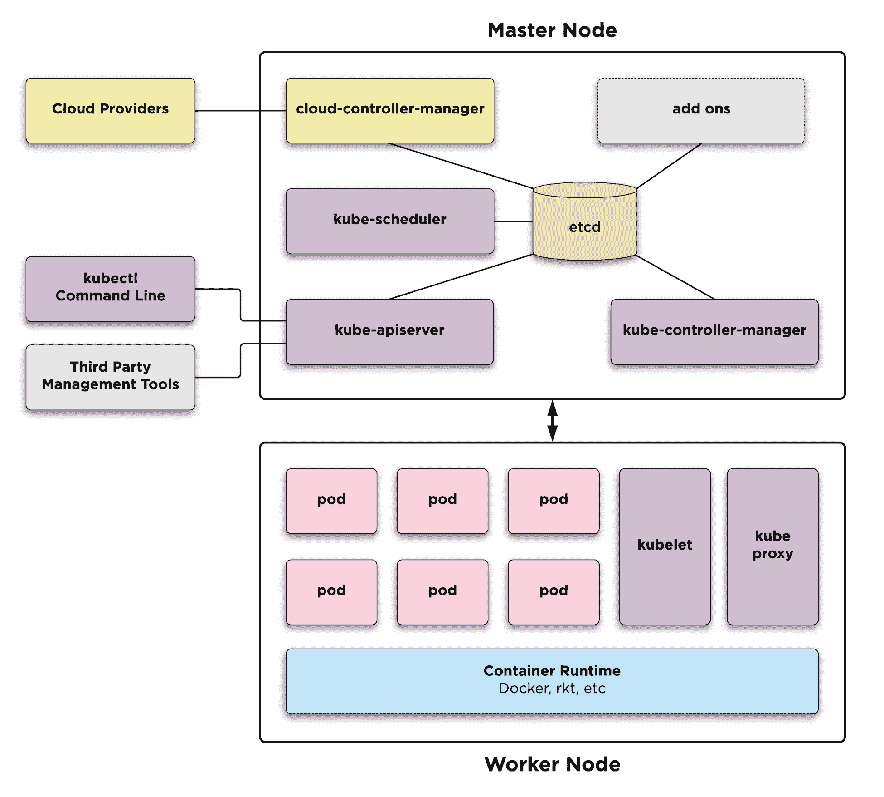
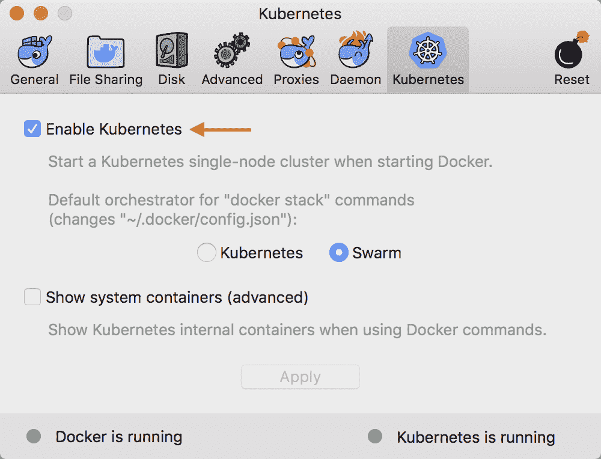
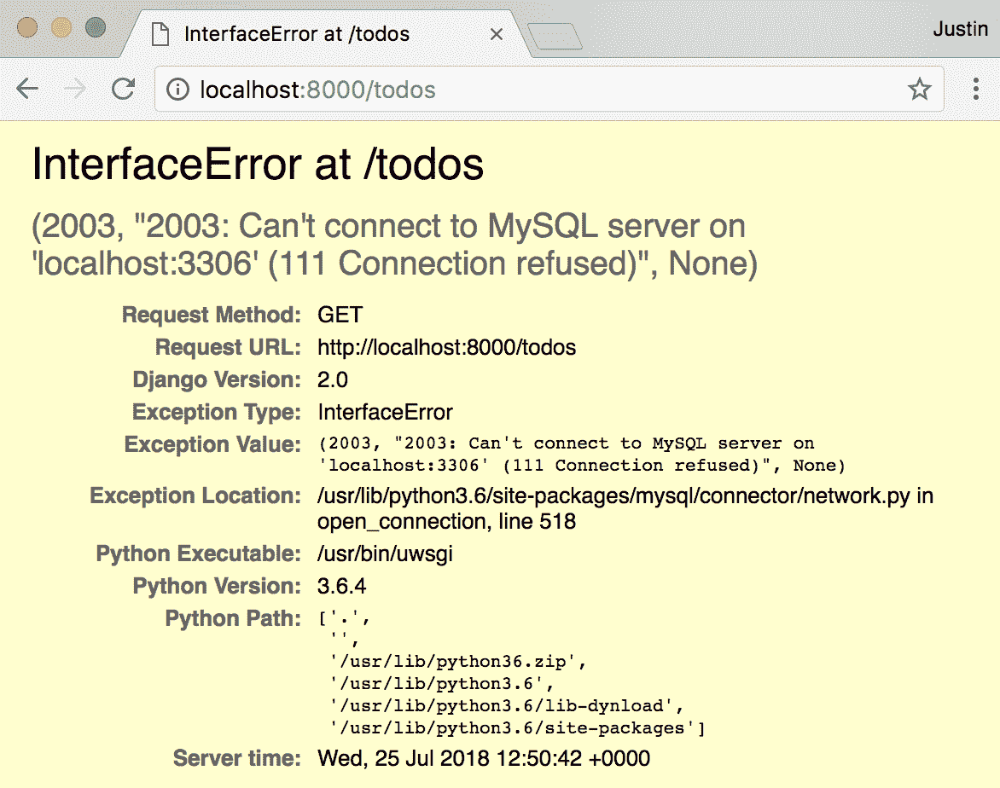
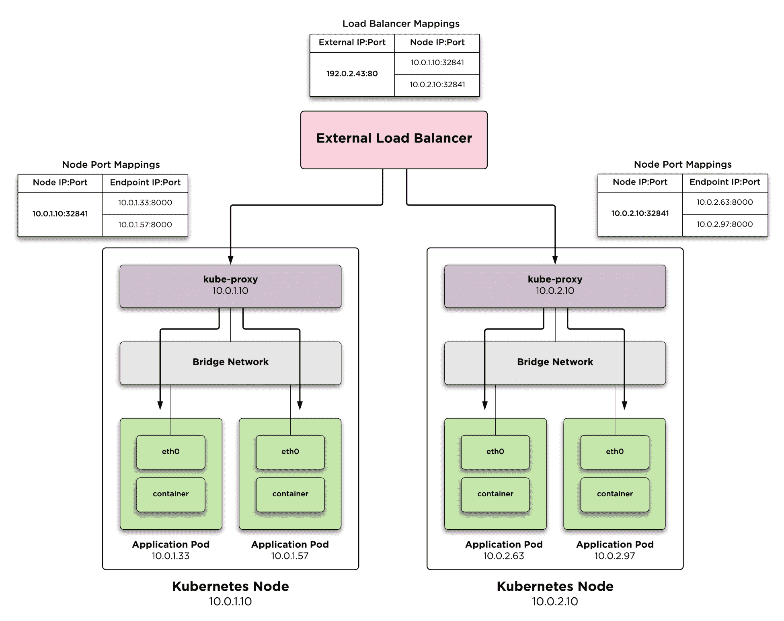
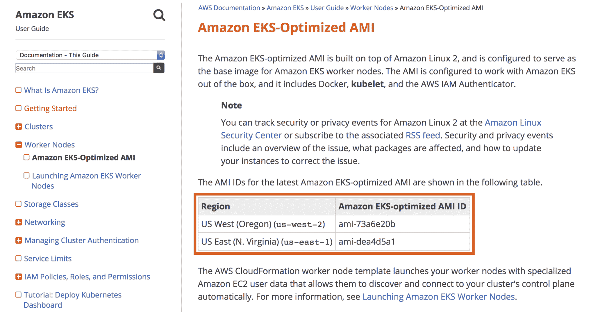
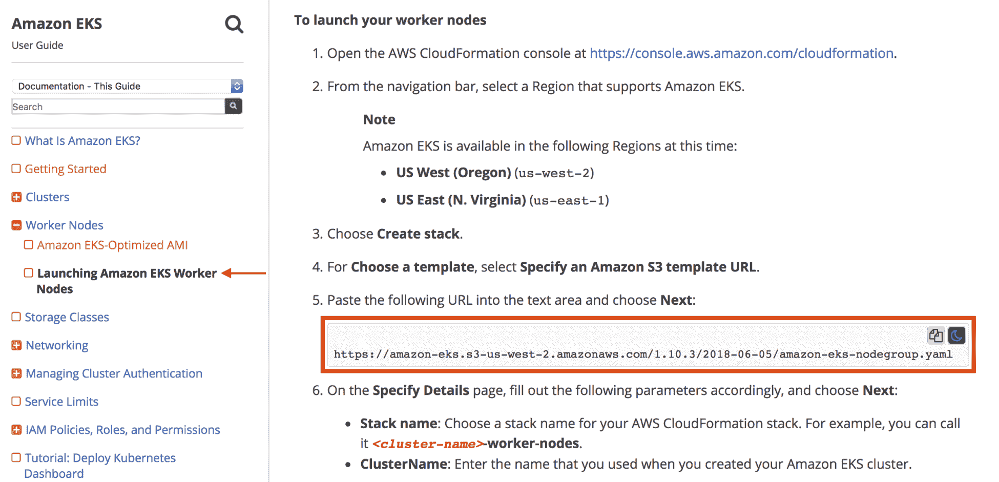
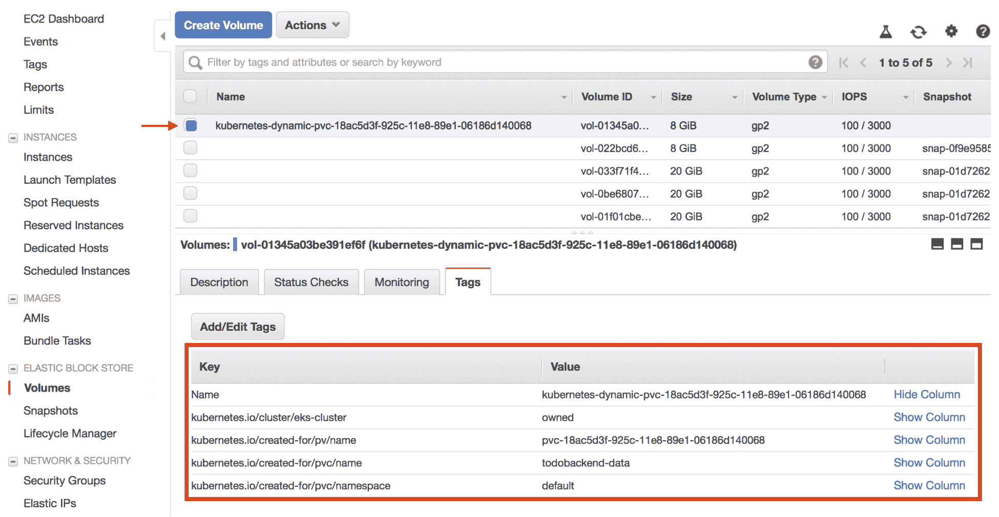

# 第十七章：弹性 Kubernetes 服务

Kubernetes 是一种流行的开源容器管理平台，最初由谷歌开发，基于谷歌自己内部的 Borg 容器平台。Kubernetes 借鉴了谷歌在大规模运行容器方面的丰富经验，现在得到了所有主要云平台提供商的支持，包括 AWS Elastic Kubernetes Service（EKS）的发布。EKS 提供了一个托管的 Kubernetes 集群，您可以在其中部署容器应用程序，而无需担心日常运营开销和集群管理的复杂性。AWS 已经完成了建立一个强大和可扩展平台的大部分工作，使得使用 Kubernetes 变得比以往更容易。

在本章中，您将被介绍到 Kubernetes 的世界，我们将通过如何配置 Kubernetes 来确保我们能够成功部署和操作本书中使用的示例应用程序，并在 AWS 中建立一个 EKS 集群，您将使用本地开发的配置部署应用程序。这将为您提供实际的、现实世界的见解，作为应用程序所有者，您可以将您的容器工作负载部署到 Kubernetes，并且您可以快速地开始使用 EKS。

我们将首先学习如何在本地使用 Docker for Mac 和 Docker for Windows 对 Kubernetes 进行本地支持。您可以直接启动一个本地单节点集群，减少了通常需要进行的大量手动配置，以便快速启动本地环境。您将学习如何创建运行 Kubernetes 中示例应用程序所需的各种资源，解决关键的运营挑战，如为应用程序数据库提供持久存储、管理密钥和运行一次性任务，如数据库迁移。

一旦您建立了一个工作配置，可以在 Kubernetes 中本地运行示例应用程序，我们将把注意力转向开始使用 EKS，创建 EKS 集群，并建立一个 EC2 自动扩展组，管理运行容器工作负载的工作节点。您将学习如何从本地环境设置对集群的访问，并继续部署 Kubernetes 仪表板，该仪表板提供了丰富的管理用户界面，您可以从中部署和管理应用程序。最后，您将设置与其他 AWS 服务的集成，包括弹性块存储（EBS）和弹性负载均衡（ELB），并将示例应用程序部署到您的 EKS 集群。

本章将涵盖以下主题：

+   Kubernetes 简介

+   Kubernetes 架构

+   开始使用 Kubernetes

+   使用 Docker Desktop 安装 Kubernetes

+   创建核心 Kubernetes 资源，包括 pod、部署和服务

+   创建持久卷

+   创建 Kubernetes secrets

+   运行 Kubernetes 作业

+   创建 EKS 集群

+   建立对 EKS 集群的访问

+   将应用程序部署到 EKS

# 技术要求

以下是本章的技术要求：

+   AWS 账户的管理员访问权限

+   本地 AWS 配置文件，按照第三章的说明进行配置

+   AWS CLI 版本 1.15.71 或更高版本

+   Docker 18.06 或更高版本

+   Docker Compose 1.22 或更高版本

+   GNU Make 3.82 或更高版本

+   本章假设您已经完成了本书中的所有前几章。

以下 GitHub 网址包含本章中使用的代码示例：[`github.com/docker-in-aws/docker-in-aws/tree/master/ch17`](https://github.com/docker-in-aws/docker-in-aws/tree/master/ch17)。

观看以下视频，了解代码的实际操作：

[`bit.ly/2LyGtSY`](http://bit.ly/2LyGtSY)

# Kubernetes 简介

**Kubernetes**是一个开源的容器管理平台，由 Google 在 2014 年开源，并在 2015 年通过 1.0 版本实现了生产就绪。在短短三年的时间里，它已经成为最受欢迎的容器管理平台，并且非常受大型组织的欢迎，这些组织希望将他们的应用程序作为容器工作负载来运行。Kubernetes 是 GitHub 上最受欢迎的开源项目之一（[`github.com/cncf/velocity/blob/master/docs/top30_chart_creation.md`](https://github.com/cncf/velocity/blob/master/docs/top30_chart_creation.md)），根据[Redmonk](https://redmonk.com/fryan/2017/09/10/cloud-native-technologies-in-the-fortune-100/)的说法，截至 2017 年底，Kubernetes 在财富 100 强公司中被使用率达到了 54%。

Kubernetes 的关键特性包括以下内容：

+   **平台无关**：Kubernetes 可以在任何地方运行，从您的本地机器到数据中心，以及在 AWS、Azure 和 Google Cloud 等云提供商中，它们现在都提供集成的托管 Kubernetes 服务。

+   **开源**：Kubernetes 最大的优势在于其社区和开源性质，这使得 Kubernetes 成为了全球领先的开源项目之一。主要组织和供应商正在投入大量时间和资源来为平台做出贡献，确保整个社区都能从这些持续的增强中受益。

+   **血统**：Kubernetes 的根源来自 Google 内部的 Borg 平台，自从 2000 年代初以来一直在大规模运行容器。Google 是容器技术的先驱之一，毫无疑问是容器的最大采用者之一，如果不是最大的采用者。在 2014 年，Google 表示他们每周运行 20 亿个容器，而当时大多数企业刚刚通过一个名为 Docker 的新项目听说了容器技术。这种血统和传统确保了 Google 在多年大规模运行容器中所学到的许多经验教训都被包含在 Kubernetes 平台中。

+   **生产级容器管理功能**：Kubernetes 提供了您在其他竞争平台上期望看到并会遇到的所有容器管理功能。这包括集群管理、多主机网络、可插拔存储、健康检查、服务发现和负载均衡、服务扩展和滚动更新、期望阶段配置、基于角色的访问控制以及秘密管理等。所有这些功能都以模块化的构建块方式实现，使您可以调整系统以满足组织的特定要求，这也是 Kubernetes 现在被认为是企业级容器管理的黄金标准的原因之一。

# Kubernetes 与 Docker Swarm

在上一章中，我提出了关于 Docker Swarm 与 Kubernetes 的个人看法，这一次我将继续，这次更加关注为什么选择 Kubernetes 而不是 Docker Swarm。当您阅读本章时，应该会发现 Kubernetes 具有更为复杂的架构，这意味着学习曲线更高，而我在本章中涵盖的内容只是 Kubernetes 可能实现的一小部分。尽管如此，一旦您理解了这些概念，至少从我的角度来看，您应该会发现最终 Kubernetes 更加强大、更加灵活，可以说 Kubernetes 肯定比 Docker Swarm 更具“企业级”感觉，您可以调整更多的参数来定制 Kubernetes 以满足您的特定需求。

Kubernetes 相对于 Docker Swarm 和其他竞争对手最大的优势可能是其庞大的社区，这意味着几乎可以在更广泛的 Kubernetes 社区和生态系统中找到关于几乎任何配置方案的信息。Kubernetes 运动背后有很多动力，随着 AWS 等领先供应商和提供商采用 Kubernetes 推出自己的产品和解决方案，这一趋势似乎正在不断增长。

# Kubernetes 架构

在架构上，Kubernetes 以集群的形式组织自己，其中主节点形成集群控制平面，工作节点运行实际的容器工作负载：

Kubernetes 架构

在每个主节点中，存在许多组件：

+   **kube-apiserver**：这个组件公开 Kubernetes API，是您用来与 Kubernetes 控制平面交互的前端组件。

+   **etcd**：这提供了一个跨集群的分布式和高可用的键/值存储，用于存储 Kubernetes 配置和操作数据。

+   **kube-scheduler**：这将 pod 调度到工作节点上，考虑资源需求、约束、数据位置和其他因素。稍后您将了解更多关于 pod 的信息，但现在您可以将它们视为一组相关的容器和卷，需要一起创建、更新和部署。

+   **kube-controller-manager**：这负责管理控制器，包括一些组件，用于检测节点何时宕机，确保 pod 的正确数量的实例或副本正在运行，为在 pod 中运行的应用程序发布服务端点，并管理集群的服务帐户和 API 访问令牌。

+   **cloud-controller-manager**：这提供与底层云提供商交互的控制器，使云提供商能够支持特定于其平台的功能。云控制器的示例包括服务控制器，用于创建、更新和删除云提供商负载均衡器，以及卷控制器，用于创建、附加、分离和删除云提供商支持的各种存储卷技术。

+   **插件**：有许多可用的插件可以扩展集群的功能。这些以 pod 和服务的形式运行，提供集群功能。在大多数安装中通常部署的一个插件是集群 DNS 插件，它为在集群上运行的服务和 pod 提供自动 DNS 命名和解析。

在所有节点上，存在以下组件：

+   **kubelet**：这是在集群中每个节点上运行的代理，确保 pod 中的所有容器健康运行。kubelet 还可以收集容器指标，可以发布到监控系统。

+   **kube-proxy**：这管理每个节点上所需的网络通信、端口映射和路由规则，以支持 Kubernetes 支持的各种服务抽象。

+   **容器运行时**：提供运行容器的容器引擎。最受欢迎的容器运行时是 Docker，但是也支持 rkt（Rocket）或任何 OCI 运行时规范实现。

+   **Pods**：Pod 是部署容器应用程序的核心工作单元。每个 Pod 由一个或多个容器和相关资源组成，并且一个单一的网络接口，这意味着给定 Pod 中的每个容器共享相同的网络堆栈。

请注意，工作节点只直接运行先前列出的组件，而主节点运行到目前为止我们讨论的所有组件，允许主节点也运行容器工作负载，例如单节点集群的情况。

Kubernetes 还提供了一个名为**kubectl**的客户端组件，它提供了通过 Kubernetes API 管理集群的能力。**kubectl**支持 Windows、macOS 和 Linux，并允许您轻松管理和在本地和远程之间切换多个集群。

# 开始使用 Kubernetes

现在您已经简要介绍了 Kubernetes，让我们专注于在本地环境中启动和运行 Kubernetes。

在本书中的早期，当您设置本地开发环境时，如果您使用的是 macOS 或 Windows，您安装了 Docker Desktop 的社区版（CE）版本（Docker for Mac 或 Docker for Windows，在本章中我可能统称为 Docker Desktop），其中包括对 Kubernetes 的本地支持。

如果您使用的是不支持 Kubernetes 的 Docker for Mac/Windows 的变体，或者使用 Linux，您可以按照以下说明安装 minikube：[`github.com/kubernetes/minikube`](https://github.com/kubernetes/minikube)。本节中包含的大多数示例应该可以在 minikube 上运行，尽管诸如负载平衡和动态主机路径配置等功能可能不会直接支持，需要一些额外的配置。

要启用 Kubernetes，请在本地 Docker Desktop 设置中选择**Kubernetes**，并勾选**启用 Kubernetes**选项。一旦您点击**应用**，Kubernetes 将被安装，并需要几分钟来启动和运行：

使用 Docker for Mac 启用 Kubernetes

Docker Desktop 还会自动为您安装和配置 Kubernetes 命令行实用程序`kubectl`，该实用程序可用于验证您的安装：

[PRE0]

如果您正在使用 Windows 的 Docker 与 Linux 子系统配合使用，您需要通过运行以下命令将`kubectl`安装到子系统中（有关更多详细信息，请参见[`kubernetes.io/docs/tasks/tools/install-kubectl/#install-kubectl-binary-via-native-package-management`](https://kubernetes.io/docs/tasks/tools/install-kubectl/#install-kubectl-binary-via-native-package-management)）：

[PRE1]

安装`kubectl`后，如果您之前将 Linux 子系统的主文件夹更改为 Windows 主文件夹，则现在应该能够与本地 Kubernetes 集群进行交互，无需进一步配置。

如果您的主文件夹与 Windows 主文件夹不同（默认情况下是这种情况），那么您将需要设置一个符号链接，指向 Windows 主文件夹中的`kubectl`配置文件，之后您应该能够使用`kubectl`与本地 Kubernetes 安装进行交互：

[PRE2]

Windows 的 Linux 子系统还允许您运行 Windows 命令行程序，因此您也可以运行`kubectl.exe`来调用 Windows kubectl 组件。

# 创建一个 pod

在 Kubernetes 中，您将应用程序部署为*pods*，这些 pods 指的是一个或多个容器和其他与之密切相关的资源，共同代表您的应用程序。**pod**是 Kubernetes 中的核心工作单元，概念上类似于 ECS 任务定义，尽管在底层它们以完全不同的方式工作。

Kubernetes 的常用简写代码是 k8s，其中名称 Kubernetes 中的“ubernete”部分被数字 8 替换，表示“ubernete”中的字符数。

在创建我们的第一个 pod 之前，让我们在 todobackend 存储库中建立一个名为`k8s`的文件夹，该文件夹将保存 todobackend 应用程序的所有 Kubernetes 配置，然后创建一个名为`app`的文件夹，该文件夹将存储与核心 todobackend 应用程序相关的所有资源定义：

[PRE3]

以下代码演示了 todobackend 应用程序的基本 pod 定义，我们将其保存到`k8s/app/deployment.yaml`文件中：

[PRE4]

pod 配置文件的格式很容易遵循，通常情况下，您看到的大多数参数都与使用 Docker Compose 定义容器时的同名参数相对应。一个经常引起混淆的重要区别是`command`参数-在 Kubernetes 中，此参数相当于`ENTRYPOINT` Dockerfile 指令和 Docker Compose 服务规范中的`entrypoint`参数，而在 Kubernetes 中，`args`参数相当于 CMD 指令（Dockerfile）和 Docker Compose 中的`command`服务参数。这意味着在前面的配置中，我们的容器中的默认入口脚本被绕过，而是直接运行 uwsgi web 服务器。

`imagePullPolicy`属性值为`IfNotPresent`配置了 Kubernetes 只有在本地 Docker Engine 注册表中没有可用的镜像时才拉取镜像，这意味着在尝试创建 pod 之前，您必须确保已运行现有的 todobackend Docker Compose 工作流以在本地构建和标记 todobackend 镜像。这是必需的，因为当您在 AWS EC2 实例上运行 Kubernetes 时，Kubernetes 只包括对 ECR 的本机支持，并且在您在 AWS 之外运行 Kubernetes 时，不会本地支持 ECR。

有许多第三方插件可用，允许您管理 AWS 凭据并拉取 ECR 镜像。一个常见的例子可以在[`github.com/upmc-enterprises/registry-creds`](https://github.com/upmc-enterprises/registry-creds)找到。

要创建我们的 pod 并验证它是否正在运行，您可以运行`kubectl apply`命令，使用`-f`标志引用您刚刚创建的部署文件，然后运行`kubectl get pods`命令：

[PRE5]

您可以看到 pod 的状态为`Running`，并且已经部署了一个容器到在您的本地 Docker Desktop 环境中运行的单节点 Kubernetes 集群。一个重要的要注意的是，已部署的 todobackend 容器无法与外部世界通信，因为从 pod 及其关联的容器中没有发布任何网络端口。

Kubernetes 的一个有趣之处是您可以使用 Kubernetes API 与您的 pod 进行交互。为了演示这一点，首先运行`kubectl proxy`命令，它会设置一个本地 HTTP 代理，通过普通的 HTTP 接口公开 API：

[PRE6]

您现在可以通过 URL `http://localhost:8001/api/v1/namespaces/default/pods/todobackend:8000/proxy/` 访问 pod 上的容器端口 8000：

运行 kubectl 代理

如您所见，todobackend 应用正在运行，尽管它缺少静态内容，因为我们还没有生成它。还要注意页面底部的 todos 链接（`http://localhost:8001/todos`）是无效的，因为 todobackend 应用程序不知道通过代理访问应用程序的 API 路径。

Kubernetes 的另一个有趣特性是通过运行 `kubectl port-forward` 命令，将 Kubernetes 客户端的端口暴露给应用程序，从而连接到指定的 pod，这样可以实现从 Kubernetes 客户端到应用程序的端口转发：

[PRE7]

如果您现在尝试访问 `http://localhost:8000`，您应该能看到 todobackend 的主页，并且页面底部的 todos 链接现在应该是可访问的：

访问一个端口转发的 pod

您可以看到，再次，我们的应用程序并不处于完全功能状态，因为我们还没有配置任何数据库设置。

# 创建一个部署

尽管我们已经能够发布我们的 todobackend 应用程序，但我们用来做这件事的机制并不适合实际的生产使用，而且只对有限的本地开发场景真正有用。

在现实世界中运行我们的应用程序的一个关键要求是能够扩展或缩减应用程序容器的实例或*副本*数量。为了实现这一点，Kubernetes 支持一类资源，称为*控制器*，它负责协调、编排和管理给定 pod 的多个副本。一种流行的控制器类型是*部署*资源，正如其名称所示，它包括支持创建和更新 pod 的新版本，以及滚动升级和在部署失败时支持回滚等功能。

以下示例演示了如何更新 `todobackend` 仓库中的 `k8s/app/deployment.yaml` 文件来定义一个部署资源：

[PRE8]

我们将之前的 pod 资源更新为现在的 deployment 资源，使用顶级 spec 属性（即 spec.template）的 template 属性内联定义应该部署的 pod。部署和 Kubernetes 的一个关键概念是使用基于集合的标签选择器匹配来确定部署适用于哪些资源或 pod。在前面的示例中，部署资源的 spec 指定了两个副本，并使用 selectors.matchLabels 来将部署与包含标签 app 值为 todobackend 的 pod 匹配。这是一个简单但强大的范例，可以以灵活和松散耦合的方式创建自己的结构和资源之间的关系。请注意，我们还向容器定义添加了 readinessProbe 和 livenessProbe 属性，分别创建了 readiness probe 和 liveness probe。readiness probe 定义了 Kubernetes 应执行的操作，以确定容器是否准备就绪，而 liveness probe 用于确定容器是否仍然健康。在前面的示例中，readiness probe 使用 HTTP GET 请求到端口 8000 来确定部署控制器何时应允许连接转发到容器，而 liveness probe 用于在容器不再响应 liveness probe 时重新启动容器。有关不同类型的探针及其用法的更多信息，请参阅 https://kubernetes.io/docs/tasks/configure-pod-container/configure-liveness-readiness-probes/。

要创建新的部署资源，我们可以首先删除现有的 pod，然后使用 kubectl 应用 todobackend 仓库中的 k8s/app/deployment.yaml 文件：

[PRE9]

创建部署后，您可以看到配置的副本数量以两个 pod 的形式部署，每个都有一个唯一的名称。只要您配置的 readiness probe 成功，每个 pod 的状态就会立即转换为 ready。

# 创建服务

在这一点上，我们已经为我们的应用程序定义了一个 pod，并使用部署资源部署了多个应用程序副本，现在我们需要确保外部客户端可以连接到我们的应用程序。鉴于我们有多个应用程序副本正在运行，我们需要一个能够提供稳定服务端点、跟踪每个副本位置并在所有副本之间负载平衡传入连接的组件。

*服务*是提供此类功能的 Kubernetes 资源，每个服务都被分配一个虚拟 IP 地址，可以用来访问一组 pod，并且对虚拟 IP 地址的传入连接进行负载平衡到每个 pod 副本，基于通过一个名为 kube-proxy 的标准 Kubernetes 系统资源管理和更新的 iptables 规则：

Kubernetes 中的服务和端点

在上图中，一个客户端 pod 正试图使用虚拟 IP 地址`10.1.1.1`的端口`80`(`10.1.1.1:80`)与应用程序 pod 进行通信。请注意，服务虚拟 IP 地址在集群中的每个节点上都是公开的，**kube-proxy**组件负责更新 iptables 规则，以循环方式选择适当的端点，将客户端连接路由到。由于虚拟 IP 地址在集群中的每个节点上都是公开的，因此任何节点上的任何客户端都可以与服务通信，并且流量会均匀地分布在整个集群中。

现在您已经对服务的工作原理有了高层次的理解，让我们实际在`k8s/app/deployment.yaml`文件中定义一个新的服务，该文件位于`todobackend`存储库中：

[PRE10]

请注意，您可以使用`---`分隔符在单个 YAML 文件中定义多个资源，并且我们可以创建一个名为 todobackend 的服务，该服务使用标签匹配将服务绑定到具有`app=todobackend`标签的任何 pod。在`spec.ports`部分，我们将端口 80 配置为服务的传入或监听端口，该端口将连接负载平衡到每个 pod 上的 8000 端口。

我们的服务定义已经就位，现在您可以使用`kubectl apply`命令部署服务：

[PRE11]

您可以使用`kubectl get svc`命令查看当前服务，并注意到每个服务都包括一个唯一的集群 IP 地址，这是集群中其他资源可以用来与与服务关联的 pod 进行通信的虚拟 IP 地址。`kubectl get endpoints`命令显示与每个服务关联的实际端点，您可以看到对`todobackend`服务虚拟 IP 地址`10.103.210.17:80`的连接将负载均衡到`10.1.0.27:8000`和`10.1.0.30:8000`。

每个服务还分配了一个唯一的 DNS 名称，格式为`<service-name>.<namespace>.svc.cluster.local`。Kubernetes 中的默认命名空间称为`default`，因此对于我们的 todobackend 应用程序，它将被分配一个名为`todobackend.default.svc.cluster.local`的名称，您可以使用`kubectl run`命令验证在集群内是否可访问：

[PRE12]

在上面的示例中，您可以简单地查询 todobackend，因为 Kubernetes 将 DNS 搜索域发送到`<namespace>.svc.cluster.local`（在我们的用例中为`default.svc.cluster.local`），您可以看到这将解析为 todobackend 服务的集群 IP 地址。

重要的是要注意，集群 IP 地址只能在 Kubernetes 集群内访问 - 如果没有进一步的配置，我们无法从外部访问此服务。

# 暴露服务

为了允许外部客户端和系统与 Kubernetes 服务通信，您必须将服务暴露给外部世界。按照 Kubernetes 的风格，有多种选项可用于实现这一点，这些选项由 Kubernetes 的`ServiceTypes`控制：

+   节点端口：此服务类型将 Kubernetes 每个节点上的外部端口映射到为服务配置的内部集群 IP 和端口。这为您的服务创建了几个外部连接点，随着节点的进出可能会发生变化，这使得创建稳定的外部服务端点变得困难。

+   负载均衡器：表示专用的外部第 4 层（TCP 或 UDP）负载均衡器，专门映射到您的服务。部署的实际负载均衡器取决于您的目标平台 - 例如，对于 AWS，将创建一个经典的弹性负载均衡器。这是一个非常受欢迎的选项，但一个重要的限制是每个服务都会创建一个负载均衡器，这意味着如果您有很多服务，这个选项可能会变得非常昂贵。

+   **Ingress**：这是一个共享的第 7 层（HTTP）负载均衡器资源，其工作方式类似于 AWS 应用程序负载均衡器，其中对单个 HTTP/HTTPS 端点的连接可以根据主机标头或 URL 路径模式路由到多个服务。鉴于您可以跨多个服务共享一个负载均衡器，因此这被认为是基于 HTTP 的服务的最佳选择。

发布您的服务的最流行的方法是使用负载均衡器方法，其工作方式如下图所示：

Kubernetes 中的负载均衡

外部负载均衡器发布客户端将连接到的外部服务端点，在前面的示例中是`192.0.2.43:80`。负载均衡器服务端点将与具有与服务关联的活动 pod 的集群中的节点相关联，每个节点都通过**kube-proxy**组件设置了节点端口映射。然后，节点端口映射将映射到节点上的每个本地端点，从而实现在整个集群中高效均匀地进行负载平衡。

对于集群内部客户端的通信，通信仍然使用服务集群 IP 地址，就像本章前面描述的那样。

在本章后面，我们将看到如何将 AWS 负载均衡器与 EKS 集成，但是目前您的本地 Docker 桌面环境包括对其自己的负载均衡器资源的支持，该资源会在您的主机上发布一个外部端点供您的服务使用。向服务添加外部负载均衡器非常简单，就像在以下示例中演示的那样，我们修改了`k8s/app/deployments.yaml`文件中的配置，该文件位于 todobackend 存储库中：

[PRE13]

为了在您的环境中部署适当的负载均衡器，所需的全部就是将`spec.type`属性设置为`LoadBalancer`，Kubernetes 将自动创建一个外部负载均衡器。您可以通过应用更新后的配置并运行`kubectl get svc`命令来测试这一点：

[PRE14]

请注意，`kubectl get svc`输出现在显示 todobackend 服务的外部 IP 地址为 localhost（当使用 Docker Desktop 时，localhost 始终是 Docker 客户端可访问的外部接口），并且它在端口 80 上外部发布，您可以通过运行`curl localhost`命令来验证这一点。外部端口映射到单节点集群上的端口 31417，这是**kube-proxy**组件监听的端口，以支持我们之前描述的负载均衡器架构。

# 向您的 pods 添加卷

现在我们已经了解了如何在 Kubernetes 集群内部和外部发布我们的应用程序，我们可以专注于通过添加对 todobackend 应用程序的各种部署活动和依赖项的支持，使 todobackend 应用程序完全功能。

首先，我们将解决为 todobackend 应用程序提供静态内容的问题 - 正如您从之前的章节中了解的那样，我们需要运行**collectstatic**任务，以确保 todobackend 应用程序的静态内容可用，并且应该在部署 todobackend 应用程序时运行。**collectstatic**任务需要将静态内容写入一个卷，然后由主应用程序容器挂载，因此让我们讨论如何向 Kubernetes pods 添加卷。

Kubernetes 具有强大的存储子系统，支持各种卷类型，您可以在[`kubernetes.io/docs/concepts/storage/volumes/#types-of-volumes`](https://kubernetes.io/docs/concepts/storage/volumes/#types-of-volumes)上阅读更多信息。对于**collectstatic**用例，[emptyDir](https://kubernetes.io/docs/concepts/storage/volumes/#emptydir)卷类型是合适的，这是一个遵循每个 pod 生命周期的卷 - 它会随着 pod 的创建和销毁而动态创建和销毁 - 因此它适用于诸如缓存和提供静态内容之类的用例，这些内容在 pod 创建时可以轻松重新生成。

以下示例演示了向`k8s/app/deployment.yaml`文件添加公共`emptyDir`卷：

[PRE15]

我们在 pod 模板的 `spec.Volumes` 属性中定义了一个名为 `public` 的卷，然后在 todobackend 容器定义中使用 `volumeMounts` 属性将 `public` 卷挂载到 `/public`。我们的用例的一个重要配置要求是设置 `spec.securityContext.fsGroup` 属性，该属性定义了将配置为文件系统挂载点的组所有者的组 ID。我们将此值设置为 `1000`；回想一下前几章中提到的，todobackend 映像以 `app` 用户运行，其用户/组 ID 为 1000。此配置确保 todobackend 容器能够读取和写入 `public` 卷的静态内容。

如果您现在部署配置更改，您应该能够使用 `kubectl exec` 命令来检查 todobackend 容器文件系统，并验证我们能够读取和写入 `/public` 挂载点：

[PRE16]

`kubectl exec` 命令类似于 `docker exec` 命令，允许您在当前运行的 pod 容器中执行命令。此命令必须引用 pod 的名称，我们使用 `kubectl get pods` 命令以及 JSON 路径查询来提取此名称。正如您所看到的，**todobackend** 容器中的 `app` 用户能够读取和写入 `/public` 挂载点。

# 向您的 pod 添加初始化容器

在为静态内容准备了临时卷后，我们现在可以专注于安排 **collectstatic** 任务来为我们的应用程序生成静态内容。Kubernetes 支持 [初始化容器](https://kubernetes.io/docs/concepts/workloads/pods/init-containers/)，这是一种特殊类型的容器，在 pod 中启动主应用程序容器之前执行。Kubernetes 将确保您的初始化容器运行完成并成功完成，然后再启动您的应用程序，如果您指定了多个初始化容器，Kubernetes 将按顺序执行它们，直到所有初始化容器都完成。

以下代码演示了向 `k8s/app/deployment.yaml` 文件添加初始化容器：

[PRE17]

您现在可以部署您的更改，并使用 `kubectl logs` 命令来验证 collectstatic 初始化容器是否成功执行：

[PRE18]

如果您现在在浏览器中浏览 `http://localhost`，您应该能够验证静态内容现在正确呈现：

todobackend 应用程序具有正确的静态内容

# 添加数据库服务

使 todobackend 应用程序完全功能的下一步是添加一个数据库服务，该服务将托管 todobackend 应用程序数据库。我们将在我们的 Kubernetes 集群中运行此服务，但是在 AWS 中的真实生产用例中，我通常建议使用关系数据库服务（RDS）。

定义数据库服务需要两个主要的配置任务：

+   创建持久存储

+   创建数据库服务

# 创建持久存储

我们的数据库服务的一个关键要求是持久存储，在我们的单节点本地 Kubernetes 开发环境中，[hostPath](https://kubernetes.io/docs/concepts/storage/volumes/#hostpath)卷类型代表提供简单持久存储需求的标准选项。

虽然您可以通过在卷定义中直接指定路径来轻松创建 hostPath 卷（请参阅[`kubernetes.io/docs/concepts/storage/volumes/#hostpath`](https://kubernetes.io/docs/concepts/storage/volumes/#hostpath)中的示例 pod 定义），但这种方法的一个问题是它对底层卷类型创建了硬依赖，并且如果您想要删除 pod 和与卷关联的数据，则需要手动清理。

Docker Desktop Kubernetes 支持的一个非常有用的功能是包含一个名为`docker.io/hostpath`的动态卷提供程序，它会自动为您创建 hostPath 类型的卷，该卷可通过运行`kubectl get sc`命令查看的默认*storage class*来使用：

[PRE19]

存储类提供了对底层卷类型的抽象，这意味着您的 pod 可以从特定类中请求存储。这包括通用要求，如卷大小，而无需担心底层卷类型。在 Docker Desktop 的情况下，开箱即用包含了一个默认的存储类，它使用 hostPath 卷类型来提供存储请求。

然而，当我们稍后在 AWS 中使用 EKS 设置 Kubernetes 集群时，我们将配置一个使用 AWS Elastic Block Store（EBS）作为底层卷类型的默认存储类。采用这种方法意味着我们不需要更改我们的 pod 定义，因为我们将在每个环境中引用相同的存储类。

如果您正在使用 minikube，名为`k8s.io/minikube-hostpath`的动态 provisioner 提供了类似于 Docker hostpath provisioner 的功能，但是将卷挂载在`/tmp/hostpath-provisioner`下。

要使用存储类而不是直接在 pod 定义中指定卷类型，您需要创建*持久卷索赔*，它提供了存储需求的逻辑定义，如卷大小和访问模式。让我们定义一个持久卷索赔，但在此之前，我们需要在 todobackend 存储库中建立一个名为`k8s/db`的新文件夹，用于存储我们的数据库服务配置：

[PRE20]

在这个文件夹中，我们将创建一个名为`k8s/db/storage.yaml`的文件，在其中我们将定义一个持久卷索赔。

[PRE21]

我们在一个专用文件中创建索赔（称为`todobackend-data`），因为这样可以让我们独立管理索赔的生命周期。在前面的示例中未包括的一个属性是`spec.storageClassName`属性 - 如果省略此属性，将使用默认的存储类，但请记住您可以创建和引用自己的存储类。`spec.accessModes`属性指定存储应该如何挂载 - 在本地存储和 AWS 中的 EBS 存储的情况下，我们只希望一次只有一个容器能够读写卷，这由`ReadWriteOnce`访问模式包含。

`spec.resources.requests.storage`属性指定持久卷的大小，在这种情况下，我们配置为 8GB。

如果您正在使用 Windows 版的 Docker，第一次尝试使用 Docker hostPath provisioner 时，将提示您与 Docker 共享 C:\。

如果您现在使用`kubectl`部署持久卷索赔，可以使用`kubectl get pvc`命令查看您新创建的索赔：

[PRE22]

您可以看到，当您创建持久卷索赔时，会动态创建一个持久卷。在使用 Docker Desktop 时，实际上是在路径`~/.docker/Volumes/<persistent-volume-claim>/<volume>`中创建的。

[PRE23]

如果您正在使用 Windows 版的 Docker 并且正在使用 Windows 子系统用于 Linux，您可以在 Windows 主机上创建一个符号链接到`.docker`文件夹：

[PRE24]

请注意，如果您按照第一章中的说明进行了设置，*容器和 Docker 基础知识*，为了设置 Windows Subsystem for Linux，您已经将 `/mnt/c/Users/<user-name>/` 配置为您的主目录，因此您不需要执行上述配置。

# 创建数据库服务

现在我们已经创建了一个持久卷索赔，我们可以定义数据库服务。我们将在 `todobackend` 仓库中的一个新文件 `k8s/db/deployment.yaml` 中定义数据库服务，其中我们创建了一个服务和部署定义：

[PRE25]

我们首先定义一个名为 `todobackend-db` 的服务，它发布默认的 MySQL TCP 端口 `3306`。请注意，我们指定了 `spec.clusterIP` 值为 `None`，这将创建一个无头服务。无头服务对于单实例服务非常有用，并允许使用 pod 的 IP 地址作为服务端点，而不是使用 **kube-proxy** 组件与虚拟 IP 地址进行负载均衡到单个端点。定义无头服务仍将发布服务的 DNS 记录，但将该记录与 pod IP 地址关联，确保 **todobackend** 应用可以通过名称连接到 `todobackend-db` 服务。然后，我们为 `todobackend-db` 服务创建一个部署，并定义一个名为 `data` 的卷，该卷映射到我们之前创建的持久卷索赔，并挂载到 MySQL 容器中的数据库数据目录 (`/var/lib/mysql`)。请注意，我们指定了 `args` 属性（在 Docker/Docker Compose 中相当于 CMD/command 指令），它配置 MySQL 忽略 `lost+found` 目录（如果存在的话）。虽然在使用 Docker Desktop 时这不会成为问题，但在 AWS 中会成为问题，原因与前面的 Docker Swarm 章节中讨论的原因相同。最后，我们创建了一个类型为 `exec` 的活动探针，执行 `mysqlshow` 命令来检查在 MySQL 容器内部可以本地进行与 MySQL 数据库的连接。由于 MySQL 密钥位于文件中，我们将 MySQL 命令包装在一个 shell 进程 (`/bin/sh`) 中，这允许我们使用 `$(cat /tmp/secrets/MYSQL_PASSWORD)` 命令替换。

Kubernetes 允许您在执行时使用语法`$(<environment variable>)`来解析环境变量。例如，前面存活探针中包含的`$(MYSQL_USER)`值将在执行探针时解析为环境变量`MYSQL_USER`。有关更多详细信息，请参阅[`kubernetes.io/docs/tasks/inject-data-application/define-command-argument-container/#use-environment-variables-to-define-arguments`](https://kubernetes.io/docs/tasks/inject-data-application/define-command-argument-container/#use-environment-variables-to-define-arguments)。

如果您现在部署数据库服务和部署资源，可以使用`kubectl get svc`和`kubectl get endpoints`命令来验证无头服务配置：

[PRE26]

请注意，`todobackend-db`服务部署时的集群 IP 为 none，这意味着服务的发布端点是`todobackend-db` pod 的 IP 地址。

您还可以通过列出本地主机上`~/.docker/Volumes/todobackend-data`目录中物理卷的内容来验证数据卷是否正确创建：

[PRE27]

[PRE28]

如果您现在只删除数据库服务和部署，您应该能够验证持久卷未被删除并持续存在，这意味着您随后可以重新创建数据库服务并重新附加到`data`卷而不会丢失数据。

[PRE29]

前面的代码很好地说明了为什么我们将持久卷索赔分离成自己的文件的原因 - 这样做意味着我们可以轻松地管理数据库服务的生命周期，而不会丢失任何数据。如果您确实想要销毁数据库服务及其数据，您可以选择删除持久卷索赔，这样 Docker Desktop **hostPath**提供程序将自动删除持久卷和任何存储的数据。

Kubernetes 还支持一种称为 StatefulSet 的控制器，专门用于有状态的应用程序，如数据库。您可以在[`kubernetes.io/docs/concepts/workloads/controllers/statefulset/`](https://kubernetes.io/docs/concepts/workloads/controllers/statefulset/)上阅读更多关于 StatefulSets 的信息。

# 创建和使用秘密

Kubernetes 支持*secret*对象，允许将诸如密码或令牌之类的敏感数据以加密格式安全存储，然后根据需要私密地暴露给您的容器。Kubernetes 秘密以键/值映射或字典格式存储，这与 Docker 秘密不同，正如您在上一章中看到的，Docker 秘密通常只存储秘密值。

您可以使用文字值手动创建秘密，也可以将秘密值包含在文件中并应用该文件。我建议使用文字值创建您的秘密，以避免将您的秘密存储在配置文件中，这可能会意外地提交并推送到您的源代码存储库中。

[PRE30]

在上面的示例中，您使用`kubectl create secret generic`命令创建了一个名为`todobackend-secret`的秘密，其中存储了三个秘密值。请注意，每个值都使用与预期环境变量相同的键存储，这将使这些值的配置易于消耗。

现在创建了秘密，您可以配置`todobackend`和`db`部署以使用该秘密。Kubernetes 包括一种特殊的卷类型，称为秘密，允许您在容器中的可配置位置挂载您的秘密，然后您的应用程序可以安全和私密地读取。

# 为数据库服务使用秘密

让我们首先更新`k8s/db/deployment.yaml`文件中定义的数据库部署资源，以使用`todobackend-secret`：

[PRE31]

首先创建一个名为`secrets`的卷，类型为`secret`，引用我们之前创建的`todobackend-secret`。默认情况下，所有秘密项目都将可用，但是您可以通过可选的`items`属性控制发布到卷的项目。因为`todobackend-secret`包含特定于 todobackend 应用程序的`SECRET_KEY`秘密，我们配置`items`列表以排除此项目，并仅呈现`MYSQL_PASSWORD`和`MYSQL_ROOT_PASSWORD`键。请注意，指定的`path`是必需的，并且表示为相对路径，基于秘密卷在每个容器中挂载的位置。

然后，您将`secrets`卷作为只读挂载到`/tmp/secrets`中的`db`容器，并更新与密码相关的环境变量，以引用秘密文件，而不是直接使用环境中的值。请注意，每个秘密值将被创建在基于秘密卷挂载到的文件夹中的键命名的文件中。

要部署我们的新配置，您首先需要删除数据库服务及其关联的持久卷，因为这包括了先前的凭据，然后重新部署数据库服务。您可以通过在执行删除和应用操作时引用整个`k8s/db`目录来轻松完成此操作，而不是逐个指定每个文件：

[PRE32]

一旦您重新创建了`db`服务，您可以使用`kubectl exec`命令来验证`MYSQL_PASSWORD`和`MYSQL_ROOT_PASSWORD`秘密项目是否已写入`/tmp/secrets`：

[PRE33]

# 为应用程序使用秘密

现在，我们需要通过修改`k8s/app/deployment.yaml`文件来更新 todobackend 服务以使用我们的秘密：

[PRE34]

您必须定义`secrets`卷，并确保只有`MYSQL_PASSWORD`和`SECRET_KEY`项目暴露给**todobackend**容器。在**todobackend**应用程序容器中只读挂载卷后，您必须使用`SECRETS_ROOT`环境变量配置到`secrets`挂载的路径。回想一下，在上一章中，我们为**todobackend**应用程序添加了对 Docker 秘密的支持，默认情况下，它期望您的秘密位于`/run/secrets`。但是，因为`/run`是一个特殊的 tmpfs 文件系统，您不能在此位置使用常规文件系统挂载您的秘密，因此我们需要配置`SECRETS_ROOT`环境变量，重新配置应用程序将查找的秘密位置。我们还必须配置`MYSQL_HOST`和`MYSQL_USER`环境变量，以便与`MYSQL_PASSWORD`秘密一起，**todobackend**应用程序具有连接到数据库服务所需的信息。

如果您现在部署更改，您应该能够验证**todobackend**容器中挂载了正确的秘密项目：

[PRE35]

如果您浏览`http://localhost/todos`，您应该会收到一个错误，指示数据库表不存在，这意味着应用程序现在成功连接和验证到数据库，但缺少应用程序所需的模式和表。

# 运行作业

我们的**todobackend**应用程序几乎完全功能，但是有一个关键的部署任务，我们需要执行，那就是运行数据库迁移，以确保**todobackend**数据库中存在正确的模式和表。正如您在本书中所看到的，数据库迁移应该在每次部署时只执行一次，而不管我们的应用程序运行的实例数量。Kubernetes 通过一种特殊类型的控制器*job*支持这种性质的任务，正如其名称所示，运行一个任务或进程（以 pod 的形式）直到作业成功完成。

为了创建所需的数据库迁移任务作业，我们将创建一个名为`k8s/app/migrations.yaml`的新文件，该文件位于`todobackend`存储库中，这样可以独立于在同一位置定义的`deployment.yaml`文件中的其他应用程序资源来运行作业。

[PRE36]

您必须指定一种`Job`的类型来配置此资源作为作业，大部分情况下，配置与我们之前创建的 pod/deployment 模板非常相似，除了`spec.backoffLimit`属性，它定义了 Kubernetes 在失败时应尝试重新运行作业的次数，以及模板`spec.restartPolicy`属性，它应始终设置为`Never`以用于作业。

如果您现在运行作业，您应该能够验证数据库迁移是否成功运行：

[PRE37]

在这一点上，您已经成功地部署了 todobackend 应用程序，处于完全功能状态，您应该能够连接到 todobackend 应用程序，并创建、更新和删除待办事项。

# 创建 EKS 集群

现在您已经对 Kubernetes 有了扎实的了解，并且已经定义了部署和本地运行 todobackend 应用程序所需的核心资源，是时候将我们的注意力转向弹性 Kubernetes 服务（EKS）了。

EKS 支持的核心资源是 EKS 集群，它代表了一个完全托管、高可用的 Kubernetes 管理器集群，为您处理 Kubernetes 控制平面。在本节中，我们将重点关注在 AWS 中创建 EKS 集群，建立对集群的认证和访问，并部署 Kubernetes 仪表板。

创建 EKS 集群包括以下主要任务：

+   安装客户端组件：为了管理您的 EKS 集群，您需要安装各种客户端组件，包括`kubectl`（您已经安装了）和 AWS IAM 认证器用于 Kubernetes 工具。

+   创建集群资源：这建立了 Kubernetes 的控制平面组件，包括 Kubernetes 主节点。在使用 EKS 时，主节点作为一个完全托管的服务提供。

+   为 EKS 配置 kubectl：这允许您使用本地 kubectl 客户端管理 EKS。

+   创建工作节点：这包括用于运行容器工作负载的 Kubernetes 节点。在使用 EKS 时，您需要负责创建自己的工作节点，通常会以 EC2 自动扩展组的形式部署。就像对于 ECS 服务一样，AWS 提供了一个 EKS 优化的 AMI（[`docs.aws.amazon.com/eks/latest/userguide/eks-optimized-ami.html`](https://docs.aws.amazon.com/eks/latest/userguide/eks-optimized-ami.html)），其中包括所有必要的软件组件，使工作节点能够加入您的 EKS 集群。

+   部署 Kubernetes 仪表板：Kubernetes 仪表板为您提供了一个基于 Web 的管理界面，用于管理和监视您的集群和容器应用程序。

在撰写本文时，EKS 集群不属于 AWS 免费套餐，并且每分钟收费 0.20 美元，因此在继续之前请记住这一点（请参阅[`aws.amazon.com/eks/pricing/`](https://aws.amazon.com/eks/pricing/)获取最新定价信息）。我们将使用 CloudFormation 模板来部署 EKS 集群和 EKS 工作节点，因此您可以根据需要轻松拆除和重新创建 EKS 集群和工作节点，以减少成本。

# 安装客户端组件

要管理您的 EKS 集群，您必须安装`kubectl`，以及 AWS IAM 认证器用于 Kubernetes 组件，它允许`kubectl`使用您的 IAM 凭据对您的 EKS 集群进行身份验证。

您已经安装了`kubectl`，因此要安装用于 Kubernetes 的 AWS IAM 认证器，您需要安装一个名为`aws-iam-authenticator`的二进制文件，该文件由 AWS 发布如下：

[PRE38]

# 创建集群资源

在创建您的 EKS 集群之前，您需要确保您的 AWS 账户满足以下先决条件：

+   **VPC 资源**：EKS 资源必须部署到具有至少三个子网的 VPC 中。AWS 建议您为每个 EKS 集群创建自己的专用 VPC 和子网，但是在本章中，我们将使用在您的 AWS 账户中自动创建的默认 VPC 和子网。请注意，当您创建 VPC 并定义集群将使用的子网时，您必须指定*所有*子网，您期望您的工作节点*和*负载均衡器将被部署在其中。一个推荐的模式是在私有子网中部署您的工作节点，并确保您还包括了公共子网，以便 EKS 根据需要创建面向公众的负载均衡器。

+   **EKS 服务角色**：在创建 EKS 集群时，您必须指定一个 IAM 角色，该角色授予 EKS 服务管理您的集群的访问权限。

+   **控制平面安全组**：您必须提供一个用于 EKS 集群管理器和工作节点之间的控制平面通信的安全组。安全组规则将由 EKS 服务修改，因此您应为此要求创建一个新的空安全组。

AWS 文档包括一个入门（[`docs.aws.amazon.com/eks/latest/userguide/getting-started.html`](https://docs.aws.amazon.com/eks/latest/userguide/getting-started.html)）部分，其中提供了如何使用 AWS 控制台创建 EKS 集群的详细信息。鉴于 EKS 受 CloudFormation 支持，并且我们在本书中一直使用的基础设施即代码方法，我们需要在`todobackend-aws`存储库中创建一个名为`eks`的文件夹，并在一个名为`todobackend-aws/eks/stack.yml`的新 CloudFormation 模板文件中定义我们的 EKS 集群和相关的 EKS 服务角色：

[PRE39]

模板需要两个输入参数 - 目标 VPC ID 和目标子网 ID。`EksServiceRole`资源创建了一个 IAM 角色，授予`eks.awsamazon.com`服务代表您管理 EKS 集群的能力，如`ManagedPolicyArns`属性中引用的托管策略所指定的。然后，您必须为控制平面通信定义一个空安全组，并最后定义 EKS 集群资源，引用`EksServiceRole`资源的`RoleArn`属性，并定义一个针对输入`ApplicationSubnets`的 VPC 配置，并使用`EksClusterSecurityGroup`资源。

现在，您可以使用`aws cloudformation deploy`命令部署此模板，如下所示：

[PRE40]

集群将大约需要 10 分钟来创建，一旦创建完成，您可以使用 AWS CLI 获取有关集群的更多信息：

[PRE41]

集群端点和证书颁发机构数据在本章后面都是必需的，因此请注意这些值。

# 为 EKS 配置 kubectl

使用您创建的 EKS 集群，现在需要将新集群添加到本地的`kubectl`配置中。`kubectl`知道的所有集群默认都在一个名为`~/.kube/config`的文件中定义，目前如果您使用 Docker for Mac 或 Docker for Windows，则该文件将包括一个名为`docker-for-desktop-cluster`的单个集群。

以下代码演示了将您的 EKS 集群和相关配置添加到`~/.kube/config`文件中：

[PRE42]

在`clusters`属性中首先添加一个名为`eks-cluster`的新集群，指定您在创建 EKS 集群后捕获的证书颁发机构数据和服务器端点。然后添加一个名为`eks`的上下文，这将允许您在本地 Kubernetes 服务器和 EKS 集群之间切换，并最后在用户部分添加一个名为`aws`的新用户，该用户由`eks`上下文用于对 EKS 集群进行身份验证。`aws`用户配置配置 kubectl 执行您之前安装的`aws-iam-authenticator`组件，传递参数`token -i eks-cluster`，并使用您本地的`docker-in-aws`配置文件进行身份验证访问。执行此命令将自动返回一个身份验证令牌给`kubectl`，然后可以用于对 EKS 集群进行身份验证。

在上述配置就位后，您现在应该能够访问一个名为`eks`的新上下文，并验证连接到您的 EKS 集群，如下所示：

[PRE43]

请注意，如果您在前几章中设置了**多因素身份验证**（**MFA**）配置，每次对您的 EKS 集群运行`kubectl`命令时，都会提示您输入 MFA 令牌，这将很快变得烦人。

要暂时禁用 MFA，您可以使用`aws iam remove-user-from-group`命令将用户帐户从用户组中移除：

[PRE44]

然后在`~/.aws/config`文件中为您的本地 AWS 配置文件注释掉`mfa_serial`行：

[PRE45]

# 创建工作节点

设置 EKS 的下一步是创建将加入您的 EKS 集群的工作节点。与由 AWS 完全管理的 Kubernetes 主节点不同，您负责创建和管理您的工作节点。AWS 提供了一个 EKS 优化的 AMI，其中包含加入 EKS 集群并作为 EKS 工作节点运行所需的所有软件。您可以浏览[`docs.aws.amazon.com/eks/latest/userguide/eks-optimized-ami.html`](https://docs.aws.amazon.com/eks/latest/userguide/eks-optimized-ami.html)来获取您所在地区的最新 AMI ID：

Amazon EKS-Optimized AMI

在编写本书时，EKS-Optimized AMI 需要使用我们在前几章中学到的**cfn-init**框架进行广泛配置。创建工作节点的推荐方法是使用由 AWS 发布的预定义 CloudFormation 模板，该模板已经包含了在[`docs.aws.amazon.com/eks/latest/userguide/launch-workers.html`](https://docs.aws.amazon.com/eks/latest/userguide/launch-workers.html)中指定的所需配置：

工作节点 CloudFormation 模板 URL

您现在可以通过在 AWS 控制台中选择**服务** | **CloudFormation**，单击**创建堆栈**按钮，并粘贴您之前在**选择模板**部分获取的工作模板 URL 来为您的工作节点创建新的 CloudFormation 堆栈：

创建工作节点 CloudFormation 堆栈

点击**下一步**后，您将被提示输入堆栈名称（您可以指定一个类似`eks-cluster-workers`的名称）并提供以下参数：

+   **ClusterName**：指定您的 EKS 集群的名称（在我们的示例中为`eks-cluster`）。

+   **ClusterControlPlaneSecurityGroup**：控制平面安全组的名称。在我们的示例中，我们在创建 EKS 集群时先前创建了一个名为`eks-cluster-control-plane-sg`的安全组。

+   **NodeGroupName**：这定义了将为您的工作节点创建的 EC2 自动扩展组名称的一部分。对于我们的情况，您可以指定一个名为`eks-cluster-workers`或类似的名称。

+   **NodeAutoScalingGroupMinSize**和**NodeAutoScalingGroupMaxSize**：默认情况下，分别设置为 1 和 3。请注意，CloudFormation 模板将自动缩放组的期望大小设置为`NodeAutoScalingGroupMaxSize`参数的值，因此您可能希望降低此值。

+   **NodeInstanceType**：您可以使用预定义的工作节点 CloudFormation 模板指定的最小实例类型是`t2.small`。对于 EKS，节点实例类型不仅在 CPU 和内存资源方面很重要，而且还对网络要求的 Pod 容量有影响。EKS 网络模型（[`docs.aws.amazon.com/eks/latest/userguide/pod-networking.html`](https://docs.aws.amazon.com/eks/latest/userguide/pod-networking.html)）将 EKS 集群中的每个 Pod 公开为可在您的 VPC 内访问的 IP 地址，使用弹性网络接口（ENI）和运行在每个 ENI 上的次要 IP 地址的组合。您可以参考[`docs.aws.amazon.com/AWSEC2/latest/UserGuide/using-eni.html#AvailableIpPerENI`](https://docs.aws.amazon.com/AWSEC2/latest/UserGuide/using-eni.html#AvailableIpPerENI)，其中描述了各种 EC2 实例类型的每个接口的最大 ENI 和次要 IP 地址的数量，并最终确定了每个节点可以运行的最大 Pod 数量。

+   **NodeImageId**：指定您所在地区的 EKS 优化 AMI 的 ID（请参阅上面的截图）。

+   **KeyName**：指定您帐户中现有的 EC2 密钥对（例如，您在本书中之前创建的管理员密钥对）。

+   **VpcId**：指定您的 EKS 集群所在的 VPC ID。

+   **Subnets**：指定您希望放置工作节点的子网。

一旦您配置了所需的各种参数，点击**下一步**按钮两次，最后确认 CloudFormation 可能会在点击**创建**按钮之前创建 IAM 资源，以部署您的工作节点。当您的堆栈成功创建后，打开堆栈的**输出**选项卡，并记录`NodeInstanceRole`输出，这是下一个配置步骤所需的：

获取 NodeInstanceRole 输出

# 将工作节点加入您的 EKS 集群

CloudFormation 堆栈成功部署后，您的工作节点将尝试加入您的集群，但是在此之前，您需要通过将名为`aws-auth`的 AWS 认证器`ConfigMap`资源应用到您的集群来授予对工作节点的 EC2 实例角色的访问权限。

ConfigMap 只是一个键/值数据结构，用于存储配置数据，可以被集群中的不同资源使用。 `aws-auth` ConfigMap 被 EKS 用于授予 AWS 用户与您的集群进行交互的能力，您可以在[`docs.aws.amazon.com/eks/latest/userguide/add-user-role.html`](https://docs.aws.amazon.com/eks/latest/userguide/add-user-role.html)上了解更多信息。您还可以从[`amazon-eks.s3-us-west-2.amazonaws.com/1.10.3/2018-06-05/aws-auth-cm.yaml`](https://amazon-eks.s3-us-west-2.amazonaws.com/1.10.3/2018-06-05/aws-auth-cm.yaml)下载一个示例`aws-auth` ConfigMap。

创建`aws-auth` ConfigMap， 在`todobackend-aws/eks`文件夹中创建一个名为`aws-auth-cm.yaml`的文件：

[PRE46]

在上面的示例中，您需要粘贴在创建工作节点 CloudFormation 堆栈时获得的`NodeInstanceRole`输出的值。创建此文件后，您现在可以使用`kubectl apply`命令将其应用到您的 EKS 集群，然后通过运行`kubectl get nodes --watch`等待您的工作节点加入集群：

[PRE47]

一旦您的所有工作节点的状态都为`Ready`，您已成功将工作节点加入您的 EKS 集群。

# 部署 Kubernetes 仪表板

设置 EKS 集群的最后一步是将 Kubernetes 仪表板部署到您的集群。Kubernetes 仪表板是一个功能强大且全面的基于 Web 的管理界面，用于管理和监视集群和容器应用程序，并部署为 Kubernetes 集群的 `kube-system` 命名空间中的基于容器的应用程序。仪表板由许多组件组成，我在这里不会详细介绍，但您可以在 [`github.com/kubernetes/dashboard`](https://github.com/kubernetes/dashboard) 上阅读更多关于仪表板的信息。

要部署仪表板，我们将首先创建一个名为 `todobackend-aws/eks/dashboard` 的文件夹，并继续下载和应用组成该仪表板的各种组件到此文件夹：

[PRE48]

然后，您需要创建一个名为 `eks-admin.yaml` 的文件，该文件创建一个具有完整集群管理员特权的服务帐户和集群角色绑定：

[PRE49]

创建此文件后，您需要将其应用于您的 EKS 集群：

[PRE50]

有了 `eks-admin` 服务帐户，您可以通过运行以下命令检索此帐户的身份验证令牌：

[PRE51]

在前面的例子中，关键信息是令牌值，连接到仪表板时需要复制和粘贴。要连接到仪表板，您需要启动 kubectl 代理，该代理提供对 Kubernetes API 的 HTTP 访问：

[PRE52]

如果您现在浏览到 `http://localhost:8001/api/v1/namespaces/kube-system/services/https:kubernetes-dashboard:/proxy/`，您将被提示登录到仪表板，您需要粘贴之前为 `eks-admin` 服务帐户检索的令牌：

登录 Kubernetes 仪表板

一旦您登录，如果将 Namespace 更改为 **kube-system** 并选择 **Workloads** | **Deployments**，可能会显示一个错误，指示找不到 **monitoring-influxdb** 部署的图像：

Kubernetes 仪表板部署失败

如果是这种情况，您需要更新之前下载的 `todobackend-aws/eks/dashboard/influxdb.yml` 文件，以引用 `k8s.gcr.io/heapster-influxdb-amd64:v1.3.3`（这是一个已知问题(`https://github.com/kubernetes/heapster/issues/2059`）可能在您阅读本章时存在或不存在）：

[PRE53]

如果您现在通过运行`kubectl apply -f influxdb.yml`重新应用文件，则仪表板应该显示所有服务都按预期运行。

# 将示例应用程序部署到 EKS

现在我们的 EKS 集群和工作节点已经就位，并且我们已经确认可以向集群部署，是时候将 todobackend 应用程序部署到 EKS 了。在本地定义了在 Kubernetes 中运行应用程序所需的各种资源时，您已经在之前完成了大部分艰苦的工作，现在所需的只是调整一些外部资源，例如负载均衡器和数据库服务的持久卷，以使用 AWS 原生服务。

现在您需要执行以下配置任务：

+   使用 AWS Elastic Block Store（EBS）配置持久卷支持

+   配置支持 AWS Elastic Load Balancers

+   部署示例应用程序

# 使用 AWS EBS 配置持久卷支持

在本章的前面，我们讨论了持久卷索赔和存储类的概念，这使您可以将存储基础设施的细节与应用程序分离。我们了解到，在使用 Docker Desktop 时，提供了一个默认的存储类，它将自动创建类型为 hostPath 的持久卷，这些持久卷可以从本地操作系统的`~/.docker/Volumes`访问，这样在使用 Docker Desktop 与 Kubernetes 时就可以轻松地提供、管理和维护持久卷。

在使用 EKS 时，重要的是要了解，默认情况下，不会为您创建任何存储类。这要求您至少创建一个存储类，如果要支持持久卷索赔，并且在大多数用例中，您通常会定义一个提供标准默认存储介质和卷类型的默认存储类，以支持您的集群。在使用 EKS 时，这些存储类的一个很好的候选者是弹性块存储（EBS），它为在集群中作为工作节点运行的 EC2 实例提供了一种标准的集成机制来支持基于块的卷存储。Kubernetes 支持一种名为`AWSElasticBlockStore`的卷类型，它允许您从工作节点访问和挂载 EBS 卷，并且还包括对名为`aws-ebs`的存储供应商的支持，该供应商提供 EBS 卷的动态提供和管理。

在这个原生支持 AWS EBS 的基础上，非常容易创建一个默认的存储类，它将自动提供 EBS 存储，我们将在名为`todobackend-aws/eks/gp2-storage-class.yaml`的文件中定义它。

[PRE54]

我们将创建一个名为`gp2`的存储类，顾名思义，它将使用`kubernetes.io/aws-ebs`存储供应程序从 AWS 提供`gp2`类型或 SSD 的 EBS 存储。`parameters`部分控制此存储选择，根据存储类型，可能有其他配置选项可用，您可以在[`kubernetes.io/docs/concepts/storage/storage-classes/#aws`](https://kubernetes.io/docs/concepts/storage/storage-classes/#aws)了解更多信息。`reclaimPolicy`的值可以是`Retain`或`Delete`，它控制存储供应程序在从 Kubernetes 中删除与存储类关联的持久卷索赔时是否保留或删除关联的 EBS 卷。对于生产用例，您通常会将其设置为`Retain`，但对于非生产环境，您可能希望将其设置为默认的回收策略`Delete`，以免手动清理不再被集群使用的 EBS 卷。

现在，让我们在我们的 EKS 集群中创建这个存储类，之后我们可以配置新的存储类为集群的默认存储类。

[PRE55]

创建存储类后，您可以使用`kubectl patch`命令向存储类添加注释，将该类配置为默认类。当您运行`kubectl describe sc/gp2`命令查看存储类的详细信息时，您会看到`IsDefaultClass`属性设置为`Yes`，确认新创建的类是集群的默认存储类。

有了这个，**todobackend**应用程序的 Kubernetes 配置现在有了一个默认的存储类，可以应用于`todobackend-data`持久卷索赔，它将根据存储类参数提供一个`gp2`类型的 EBS 卷。

在本章的前面创建的`eksServiceRole` IAM 角色包括`AmazonEKSClusterPolicy`托管策略，该策略授予您的 EKS 集群管理 EBS 卷的能力。如果您选择为 EKS 服务角色实现自定义 IAM 策略，您必须确保包括用于管理卷的各种 EC2 IAM 权限，例如`ec2:AttachVolume`、`ec2:DetachVolume`、`ec2:CreateVolumes`、`ec2:DeleteVolumes`、`ec2:DescribeVolumes`和`ec2:ModifyVolumes`（这不是详尽的清单）。有关由 AWS 定义的 EKS 服务角色和托管策略授予的 IAM 权限的完整清单，请参阅[`docs.aws.amazon.com/eks/latest/userguide/service_IAM_role.html`](https://docs.aws.amazon.com/eks/latest/userguide/service_IAM_role.html)。

# 配置对 AWS 弹性负载均衡器的支持

在本章的前面，当您为 todobackend 应用程序定义 Kubernetes 配置时，您创建了一个类型为`LoadBalancer`的 todobackend 应用程序的服务。我们讨论了负载均衡器的实现细节是特定于部署到的 Kubernetes 集群的平台的，并且在 Docker Desktop 的情况下，Docker 提供了自己的负载均衡器组件，允许服务暴露给开发机器上的本地网络接口。

在使用 EKS 时，好消息是您不需要做任何事情来支持`LoadBalancer`类型的服务 - 您的 EKS 集群将自动为每个服务端点创建并关联一个 AWS 弹性负载均衡器，`AmazonEKSClusterPolicy`托管策略授予了所需的 IAM 权限。

Kubernetes 确实允许您通过配置*注释*来配置`LoadBalancer`类型的供应商特定功能，这是一种元数据属性，将被给定供应商在其目标平台上理解，并且如果在不同平台上部署，比如您的本地 Docker Desktop 环境，将被忽略。您可以在[`kubernetes.io/docs/concepts/services-networking/service/#publishing-services-service-types`](https://kubernetes.io/docs/concepts/services-networking/service/#publishing-services-service-types)了解更多关于这些注释的信息，以下示例演示了向`todobackend/k8s/app/deployment.yaml`文件中的服务定义添加了几个特定于 AWS 弹性负载均衡器的注释：

[PRE56]

在前面的示例中，我们添加了以下注释：

+   `service.beta.kubernetes.io/aws-load-balancer-backend-protocol`: 这将配置后端协议。值为`http`可确保在传入请求上设置`X-Forward-For`标头，以便您的 Web 应用程序可以跟踪客户端 IP 地址。

+   `service.beta.kubernetes.io/aws-load-balancer-connection-draining-enabled`: 这将启用连接排空。

+   `service.beta.kubernetes.io/aws-load-balancer-connection-draining-timeout`: 这指定了连接排空超时。

一个重要的要点是，注释期望每个值都是字符串值，因此请确保引用布尔值，如`"true"`和`"false"`，以及任何数值，如`"60"`，如前面的代码所示。

# 部署示例应用程序

您现在可以准备将示例应用程序部署到 AWS，首先切换到 todobackend 存储库，并确保您正在使用本章前面创建的`eks`上下文：

[PRE57]

# 创建秘密

请注意，应用程序和数据库服务都依赖于我们在本地 Docker Desktop 上手动创建的秘密，因此您首先需要在 EKS 上下文中创建这些秘密：

[PRE58]

# 部署数据库服务

现在可以部署数据库服务，这应该根据您之前创建的默认存储类的配置创建一个新的由 EBS 支持的持久卷：

[PRE59]

您可以看到已创建了持久卷，如果您在 AWS 控制台中浏览**服务** | **EC2**并从左侧 ELASTIC BLOCK STORAGE 菜单中选择**卷**，您应该能够看到持久值的相应 EBS 卷：

查看 EBS 卷

请注意，Kubernetes 使用多个标签标记 EBS 卷，以便轻松识别与给定 EBS 卷关联的哪个持久卷和持久卷索赔。

在 Kubernetes 仪表板中，您可以通过选择**工作负载** | **部署**来验证`todobackend-db`部署是否正在运行：

查看 EBS 卷

# 部署应用程序服务

有了数据库服务，现在可以继续部署应用程序：

[PRE60]

部署应用程序将执行以下任务：

+   创建`todobackend-migrate`作业，运行数据库迁移

+   创建 `todobackend` 部署，其中运行一个 collectstatic initContainer，然后运行主要的 todobackend 应用程序容器

+   创建 `todobackend` 服务，将部署一个带有 AWS ELB 前端的新服务

在 Kubernetes 仪表板中，如果选择 **发现和负载均衡** | **服务** 并选择 **todobackend** 服务，您可以查看服务的每个内部端点，以及外部负载均衡器端点：

在 Kubernetes 仪表板中查看 todobackend 服务您还可以通过运行 `kubectl describe svc/todobackend` 命令来获取外部端点 URL。

如果您单击外部端点 URL，您应该能够验证 todobackend 应用程序是完全功能的，所有静态内容都正确显示，并且能够在应用程序数据库中添加、删除和更新待办事项项目：

验证 todobackend 应用程序

# 拆除示例应用程序

拆除示例应用程序非常简单，如下所示：

[PRE61]

完成后，您应该能够验证与 todobackend 服务关联的弹性负载均衡器资源已被删除，以及 todobackend 数据库的 EBS 卷已被删除，因为您将默认存储类的回收策略配置为删除。当然，您还应该删除本章前面创建的工作节点堆栈和 EKS 集群堆栈，以避免不必要的费用。

# 摘要

在本章中，您学习了如何使用 Kubernetes 和 AWS 弹性 Kubernetes 服务 (EKS) 部署 Docker 应用程序。Kubernetes 已经成为了领先的容器管理平台之一，拥有强大的开源社区，而且现在 AWS 支持 Kubernetes 客户使用 EKS 服务，Kubernetes 肯定会更受欢迎。

您首先学会了如何在 Docker Desktop 中利用 Kubernetes 的本机支持，这使得在本地快速启动和运行 Kubernetes 变得非常容易。您学会了如何创建各种核心 Kubernetes 资源，包括 pod、部署、服务、秘密和作业，这些为在 Kubernetes 中运行应用程序提供了基本的构建块。您还学会了如何配置对持久存储的支持，利用持久卷索赔来将应用程序的存储需求与底层存储引擎分离。

然后，您了解了 EKS，并学会了如何创建 EKS 集群以及相关的支持资源，包括运行工作节点的 EC2 自动扩展组。您建立了对 EKS 集群的访问，并通过部署 Kubernetes 仪表板来测试集群是否正常工作，该仪表板为您的集群提供了丰富而强大的管理用户界面。

最后，您开始部署 todobackend 应用程序到 EKS，其中包括与 AWS Elastic Load Balancer（ELB）服务集成以进行外部连接，以及使用 Elastic Block Store（EBS）提供持久存储。这里的一个重要考虑因素是，当在 Docker Desktop 环境中部署时，我们不需要修改我们之前创建的 Kubernetes 配置，除了添加一些注释以控制 todobackend 服务负载均衡器的配置（在使用 Docker Desktop 时会忽略这些注释，因此被视为“安全”的特定于供应商的配置元素）。您应该始终努力实现这个目标，因为这确保了您的应用程序在不同的 Kubernetes 环境中具有最大的可移植性，并且可以轻松地独立部署，而不受基础 Kubernetes 平台的影响，无论是本地开发环境、AWS EKS 还是 Google Kubernetes Engine（GKE）。

好吧，所有美好的事情都必须结束了，现在是时候恭喜并感谢您完成了这本书！写这本书是一件非常愉快的事情，我希望您已经学会了如何利用 Docker 和 AWS 的力量来测试、构建、部署和操作自己的容器应用程序。

# 问题

1.  True/false: Kubernetes is a native feature of Docker Desktop CE.

1.  您可以使用 commands 属性在 pod 定义中定义自定义命令字符串，并注意到 entrypoint 脚本容器不再被执行。您如何解决这个问题？

1.  正确/错误：Kubernetes 包括三种节点类型-管理节点、工作节点和代理节点。

1.  正确/错误：Kubernetes 提供与 AWS 应用负载均衡器的集成。

1.  正确/错误：Kubernetes 支持将 EBS 卷重新定位到集群中的其他节点。

1.  您可以使用哪个组件将 Kubernetes API 暴露给 Web 应用程序？

1.  正确/错误：Kubernetes 支持与弹性容器注册表的集成。

1.  什么 Kubernetes 资源提供可用于连接到给定应用程序的多个实例的虚拟 IP 地址？

1.  什么 Kubernetes 资源适合运行数据库迁移？

1.  正确/错误：EKS 管理 Kubernetes 管理节点和工作节点。

1.  在使用 EKS 时，默认存储类提供什么类型的 EBS 存储？

1.  您想在每次部署需要在启动 Pod 中的主应用程序之前运行的任务。您将如何实现这一点？

# 进一步阅读

您可以查看以下链接，了解本章涵盖的主题的更多信息：

+   什么是 Kubernetes？：[`kubernetes.io/docs/concepts/overview/what-is-kubernetes/`](https://kubernetes.io/docs/concepts/overview/what-is-kubernetes/)

+   Kubernetes 教程：[`kubernetes.io/docs/tutorials/`](https://kubernetes.io/docs/tutorials/)

+   Kubernetes Pods：[`kubernetes.io/docs/concepts/workloads/pods/pod-overview/`](https://kubernetes.io/docs/concepts/workloads/pods/pod-overview/)

+   Kubernetes 部署：[`kubernetes.io/docs/concepts/workloads/controllers/deployment/`](https://kubernetes.io/docs/concepts/workloads/controllers/deployment/)

+   Kubernetes 作业：[`kubernetes.io/docs/concepts/workloads/controllers/jobs-run-to-completion/`](https://kubernetes.io/docs/concepts/workloads/controllers/jobs-run-to-completion/)

+   Kubernetes 服务：[`kubernetes.io/docs/concepts/services-networking/service/`](https://kubernetes.io/docs/concepts/services-networking/service/)

+   服务和 Pod 的 DNS：[`kubernetes.io/docs/concepts/services-networking/dns-pod-service/`](https://kubernetes.io/docs/concepts/services-networking/dns-pod-service/)

+   Kubernetes 秘密：[`kubernetes.io/docs/concepts/configuration/secret/`](https://kubernetes.io/docs/concepts/configuration/secret/)

+   Kubernetes 卷：[`kubernetes.io/docs/concepts/storage/volumes/`](https://kubernetes.io/docs/concepts/storage/volumes/)

+   Kubernetes 持久卷：[`kubernetes.io/docs/concepts/storage/persistent-volumes/`](https://kubernetes.io/docs/concepts/storage/persistent-volumes/)

+   Kubernetes 存储类：[`kubernetes.io/docs/concepts/storage/storage-classes/`](https://kubernetes.io/docs/concepts/storage/storage-classes/)

+   动态卷配置：[`kubernetes.io/docs/concepts/storage/dynamic-provisioning/`](https://kubernetes.io/docs/concepts/storage/dynamic-provisioning/)

+   Kubectl 命令参考：[`kubernetes.io/docs/reference/generated/kubectl/kubectl-commands`](https://kubernetes.io/docs/reference/generated/kubectl/kubectl-commands)

+   Amazon EKS 用户指南：[`docs.aws.amazon.com/eks/latest/userguide/what-is-eks.html`](https://docs.aws.amazon.com/eks/latest/userguide/what-is-eks.html)

+   EKS 优化 AMI：[`docs.aws.amazon.com/eks/latest/userguide/eks-optimized-ami.html`](https://docs.aws.amazon.com/eks/latest/userguide/eks-optimized-ami.html)

+   EKS 集群 CloudFormation 资源参考：[`docs.aws.amazon.com/AWSCloudFormation/latest/UserGuide/aws-resource-eks-cluster.html`](https://docs.aws.amazon.com/AWSCloudFormation/latest/UserGuide/aws-resource-eks-cluster.html)
