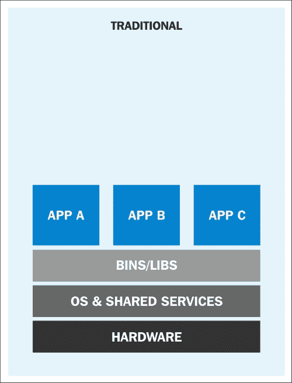
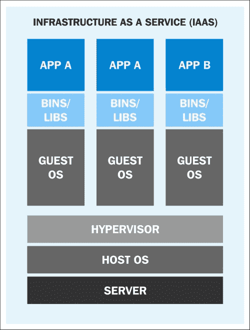
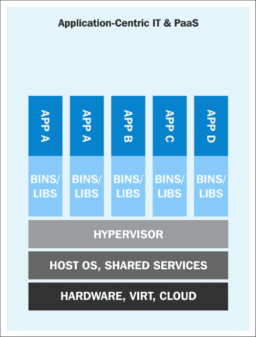
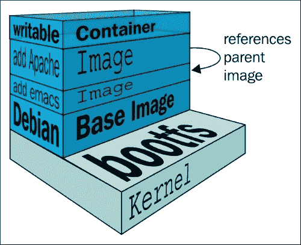

# 第一章：介绍和安装

在本章中，我们将涵盖以下内容：

+   验证 Docker 安装的要求

+   安装 Docker

+   拉取镜像并运行容器

+   向 Docker 添加非 root 用户进行管理

+   使用 Docker Machine 设置 Docker 主机

+   使用 Docker 命令行查找帮助

# 介绍

在 IT 革命的最初阶段，大多数应用程序是直接部署在物理硬件上，通过主机操作系统。由于单一用户空间，运行时在应用程序之间共享。部署是稳定的，以硬件为中心，并且具有长时间的维护周期。大多由 IT 部门管理，并且给开发人员提供了更少的灵活性。在这种情况下，硬件资源经常被低效利用。

以下图表描述了这样的设置：

传统应用程序部署（[`rhsummit.files.wordpress.com/2014/04/rhsummit2014-application-centric_packaging_with_docker_and_linux_containers-20140412riek7.pdf`](https://rhsummit.files.wordpress.com/2014/04/rhsummit2014-application-centric_packaging_with_docker_and_linux_containers-20140412riek7.pdf)）

为了克服传统部署设置的限制，虚拟化被发明了。使用诸如 KVM、XEN、ESX、Hyper-V 等的 hypervisor，我们模拟了虚拟机（VM）的硬件，并在每个虚拟机上部署了一个客户操作系统。VM 可以具有与其主机不同的操作系统；这意味着我们负责管理该 VM 的补丁、安全性和性能。通过虚拟化，应用程序在 VM 级别上被隔离，并由 VM 的生命周期定义。这在投资回报和灵活性方面提供了更好的回报，但增加了复杂性和冗余成本。以下图表描述了典型的虚拟化环境：

在虚拟化环境中的应用程序部署（[`rhsummit.files.wordpress.com/2014/04/rhsummit2014-application-centric_packaging_with_docker_and_linux_containers-20140412riek7.pdf`](https://rhsummit.files.wordpress.com/2014/04/rhsummit2014-application-centric_packaging_with_docker_and_linux_containers-20140412riek7.pdf)）

在虚拟化之后，我们现在正朝着更加应用中心化的 IT 发展。我们已经移除了虚拟机监视器层，以减少硬件仿真和复杂性。应用程序与其运行时环境一起打包，并使用容器进行部署。OpenVZ，Solaris Zones 和 LXC 是容器技术的一些例子。与虚拟机相比，容器的灵活性较低；例如，我们无法在 Linux 操作系统上运行 Microsoft Windows。与虚拟机相比，容器也被认为不太安全，因为在容器中，一切都在主机操作系统上运行。如果容器受到损害，那么可能会完全访问主机操作系统。设置、管理和自动化可能会变得有点复杂。这些是我们在过去几年中没有看到容器大规模采用的一些原因，尽管我们已经有了这项技术。

使用容器进行应用部署（[`rhsummit.files.wordpress.com/2014/04/rhsummit2014-application-centric_packaging_with_docker_and_linux_containers-20140412riek7.pdf`](https://rhsummit.files.wordpress.com/2014/04/rhsummit2014-application-centric_packaging_with_docker_and_linux_containers-20140412riek7.pdf)）

有了 Docker，容器突然成为了一等公民。所有大公司，如 Google，Microsoft，Red Hat，IBM 等，现在都在努力使容器成为主流。

Docker 是由 Solomon Hykes 在 dotCloud 内部项目启动的，他目前是 Docker，Inc.的首席技术官。它于 2013 年 3 月以 Apache 2.0 许可证的形式开源发布。通过 dotCloud 的平台即服务经验，Docker 的创始人和工程师们意识到了运行容器的挑战。因此，他们开发了一种管理容器的标准方式。

Docker 使用了 Linux 的底层内核功能来实现容器化。以下图表描述了 Docker 使用的执行驱动程序和内核功能。我们稍后会讨论执行驱动程序。让我们先看一些 Docker 使用的主要内核功能：

Docker 使用的执行驱动程序和内核功能（[`blog.docker.com/wp-content/uploads/2014/03/docker-execdriver-diagram.png`](http://blog.docker.com/wp-content/uploads/2014/03/docker-execdriver-diagram.png)）

## 命名空间

命名空间是容器的构建模块。有不同类型的命名空间，每个命名空间都将应用程序相互隔离。它们是使用克隆系统调用创建的。也可以附加到现有的命名空间。Docker 使用的一些命名空间在以下部分进行了解释。

### pid 命名空间

`pid`命名空间允许每个容器拥有自己的进程编号。每个`pid`形成自己的进程层次结构。父命名空间可以看到子命名空间并影响它们，但子命名空间既不能看到父命名空间也不能影响它。

如果有两个层次结构，那么在顶层，我们将看到在子命名空间中运行的进程具有不同的 PID。因此，在子命名空间中运行的进程将具有两个 PID：一个在子命名空间中，另一个在父命名空间中。例如，如果我们在容器上运行一个程序（`container.sh`），那么我们也可以在主机上看到相应的程序。

在容器内：

在主机上：

### net 命名空间

有了`pid`命名空间，我们可以在不同的隔离环境中多次运行相同的程序；例如，我们可以在不同的容器上运行 Apache 的不同实例。但是没有`net`命名空间，我们将无法在每个容器上监听端口 80。`net`命名空间允许我们在每个容器上拥有不同的网络接口，从而解决了我之前提到的问题。回环接口在每个容器中也会有所不同。

要在容器中启用网络，我们可以在两个不同的`net`命名空间中创建一对特殊接口，并允许它们彼此通信。特殊接口的一端位于容器内，另一端位于主机系统中。通常，容器内的接口被命名为`eth0`，在主机系统中，它被赋予一个随机名称，如`vethcf1a`。然后，通过主机上的桥接器（`docker0`）将这些特殊接口连接起来，以实现容器之间的通信和数据包路由。

在容器内，你会看到类似以下的东西：

在主机上，它看起来像是这样：

此外，每个`net`命名空间都有自己的路由表和防火墙规则。

### ipc 命名空间

**进程间通信**（**ipc**）提供信号量、消息队列和共享内存段。这些天它并不被广泛使用，但一些程序仍然依赖它。

如果一个容器创建的`ipc`资源被另一个容器消耗，那么运行在第一个容器上的应用程序可能会失败。有了`ipc`命名空间，运行在一个命名空间中的进程无法访问另一个命名空间的资源。

### mnt 命名空间

只需一个 chroot，就可以检查来自 chroot 目录/命名空间的系统的相对路径。`mnt`命名空间将 chroot 的概念提升到了下一个级别。有了`mnt`命名空间，容器可以拥有自己的一组挂载的文件系统和根目录。一个`mnt`命名空间中的进程无法看到另一个`mnt`命名空间的挂载文件系统。

### uts 命名空间

有了`uts`命名空间，我们可以为每个容器设置不同的主机名。

### 用户命名空间

有了`user`命名空间支持，我们可以在主机上拥有非零 ID 的用户，但在容器内可以拥有零 ID。这是因为`user`命名空间允许用户和组 ID 的每个命名空间映射。

有多种方法可以在主机和容器之间以及容器和容器之间共享命名空间。我们将在后续章节中看到如何做到这一点。

## Cgroups

**控制组**（**cgroups**）为容器提供资源限制和计量。来自 Linux 内核文档：

> *控制组提供了一种聚合/分区任务集的机制，并将所有未来的子任务分成具有特定行为的分层组。*

简单来说，它们可以与`ulimit` shell 命令或`setrlimit`系统调用进行比较。cgroups 允许将资源限制设置为一组进程，而不是单个进程。

控制组分为不同的子系统，如 CPU、CPU 集、内存块 I/O 等。每个子系统可以独立使用，也可以与其他子系统分组。cgroups 提供的功能包括：

+   **资源限制**：例如，一个 cgroup 可以绑定到特定的 CPU，因此该组中的所有进程只能在给定的 CPU 上运行

+   **优先级**：一些组可能会获得更多的 CPU 份额

+   **计量**：您可以测量不同子系统的资源使用情况以进行计费

+   **控制**：冻结和重新启动组

一些可以由 cgroups 管理的子系统如下：

+   **blkio**：它设置对块设备（如磁盘、SSD 等）的 I/O 访问

+   **Cpu**：它限制对 CPU 的访问

+   **Cpuacct**：它生成 CPU 资源利用率

+   **Cpuset**：它将多核系统上的 CPU 分配给 cgroup 中的任务

+   **Devices**：它为 cgroup 中的一组任务提供访问

+   **Freezer**：它暂停或恢复 cgroup 中的任务

+   **Memory**：它设置 cgroup 中任务的内存使用限制

有多种方法可以控制 cgroups 的工作。最流行的两种方法是手动访问 cgroup 虚拟文件系统和使用`libcgroup`库访问它。要在 fedora 中使用`libcgroup`，运行以下命令安装所需的软件包：

[PRE0]

安装后，您可以使用以下命令在伪文件系统中获取子系统及其挂载点的列表：

[PRE1]

虽然我们还没有看实际的命令，但让我们假设我们正在运行一些容器，并且想要获取容器的 cgroup 条目。要获取这些条目，我们首先需要获取容器 ID，然后使用`lscgroup`命令获取容器的 cgroup 条目，可以从以下命令中获取：

### 注意

有关更多详细信息，请访问[`docs.docker.com/articles/runmetrics/`](https://docs.docker.com/articles/runmetrics/)。

## 联合文件系统

联合文件系统允许透明地叠加分开的文件系统（称为层）的文件和目录，以创建一个新的虚拟文件系统。在启动容器时，Docker 叠加附加到图像的所有层，并创建一个只读文件系统。在此基础上，Docker 创建一个读/写层，容器的运行时环境使用它。有关更多详细信息，请参阅本章的*拉取图像并运行容器*部分。Docker 可以使用多种联合文件系统变体，包括 AUFS、Btrfs、vfs 和 DeviceMapper。

Docker 可以与不同的执行驱动程序一起工作，例如`libcontainer`、`lxc`和`libvirt`来管理容器。默认的执行驱动程序是`libcontainer`，它是 Docker 的默认驱动程序。它可以为 Docker 操作命名空间、控制组、能力等。

# 验证 Docker 安装的要求

Docker 支持许多 Linux 平台，如 RHEL、Ubuntu、Fedora、CentOS、Debian、Arch Linux 等。它也支持许多云平台，如 Amazon EC2、Rackspace Cloud 和 Google Compute Engine。借助虚拟环境 Boot2Docker，它也可以在 OS X 和 Microsoft Windows 上运行。不久前，微软宣布将在其下一个 Microsoft Windows 版本中添加对 Docker 的本机支持。

在这篇文章中，让我们验证 Docker 安装的要求。我们将在安装了 Fedora 21 的系统上进行检查，尽管相同的步骤也适用于 Ubuntu。

## 准备工作

以 root 用户登录安装了 Fedora 21 的系统。

## 如何做…

执行以下步骤：

1.  Docker 不支持 32 位架构。要检查系统架构，请运行以下命令：

[PRE2]

1.  Docker 支持内核 3.8 或更高版本。它已经被后移至一些内核 2.6，如 RHEL 6.5 及以上版本。要检查内核版本，请运行以下命令：

[PRE3]

1.  运行的内核应支持适当的存储后端。其中一些是 VFS、DeviceMapper、AUFS、Btrfs 和 OverlayFS。

大多数情况下，默认的存储后端或驱动程序是 devicemapper，它使用设备映射器薄配置模块来实现层。它应该默认安装在大多数 Linux 平台上。要检查设备映射器，您可以运行以下命令：

[PRE4]

在大多数发行版中，AUFS 需要一个修改过的内核。

1.  对于 cgroups 和命名空间的支持已经在内核中有一段时间了，并且应该默认启用。要检查它们的存在，您可以查看正在运行的内核的相应配置文件。例如，在 Fedora 上，我可以做类似以下的事情：

[PRE5]

## 工作原理…

通过前面的命令，我们验证了 Docker 安装的要求。

## 另请参阅

+   在 Docker 网站的安装文档中[`docs.docker.com/installation/`](https://docs.docker.com/installation/)

# 安装 Docker

由于有许多发行版支持 Docker，我们将在这篇文章中只看一下 Fedora 21 上的安装步骤。对于其他发行版，您可以参考本文的*另请参阅*部分中提到的安装说明。使用 Docker Machine，我们可以在本地系统、云提供商和其他环境上轻松设置 Docker 主机。我们将在另一篇文章中介绍这个。

## 准备工作

检查前面一篇文章中提到的先决条件。

## 如何做…

1.  使用 yum 安装 Docker：

[PRE6]

## 它是如何工作的...

上述命令将安装 Docker 及其所需的所有软件包。

## 还有更多...

默认的 Docker 守护程序配置文件位于`/etc/sysconfig/docker`，在启动守护程序时使用。以下是一些基本操作：

+   启动服务：

[PRE7]

+   验证安装：

[PRE8]

+   更新软件包：

[PRE9]

+   启用开机启动服务：

[PRE10]

+   停止服务：

[PRE11]

## 另请参阅

+   安装文档位于 Docker 网站上的[`docs.docker.com/installation/`](https://docs.docker.com/installation/)

# 拉取镜像并运行容器

我从下一章借用了这个配方来介绍一些概念。如果您在这个配方中找不到所有的解释，不要担心。我们将在本章节或接下来的几章中详细讨论所有的主题。现在，让我们拉取一个镜像并运行它。在这个配方中，我们还将熟悉 Docker 架构及其组件。

## 准备工作

获取安装了 Docker 的系统访问权限。

## 如何做到...

1.  要拉取一个镜像，请运行以下命令：

[PRE12]

1.  使用以下命令列出现有的镜像：

[PRE13]

1.  使用拉取的镜像创建一个容器，并列出容器为：

## 它是如何工作的...

Docker 具有客户端-服务器架构。其二进制文件包括 Docker 客户端和服务器守护程序，并且可以驻留在同一台主机上。客户端可以通过套接字或 RESTful API 与本地或远程 Docker 守护程序通信。Docker 守护程序构建、运行和分发容器。如下图所示，Docker 客户端将命令发送到运行在主机上的 Docker 守护程序。Docker 守护程序还连接到公共或本地索引，以获取客户端请求的镜像：

Docker 客户端-服务器架构 ([`docs.docker.com/introduction/understanding-docker/`](https://docs.docker.com/introduction/understanding-docker/))

因此，在我们的情况下，Docker 客户端向在本地系统上运行的守护程序发送请求，然后守护程序连接到公共 Docker 索引并下载镜像。一旦下载完成，我们就可以运行它。

## 还有更多...

让我们探索一些我们在这个配方中遇到的关键词：

+   **图像**：Docker 图像是只读模板，在运行时它们为我们提供容器。有一个基本图像和在其上的层的概念。例如，我们可以有一个基本图像的 Fedora 或 Ubuntu，然后我们可以安装软件包或对基本图像进行修改以创建一个新的层。基本图像和新层可以被视为一个新的图像。例如，在下图中，**Debian**是基本图像，**emacs**和**Apache**是添加在其上的两个层。它们非常易于移植，并且可以轻松共享：

Docker 图像层([`docs.docker.com/terms/images/docker-filesystems-multilayer.png`](http://docs.docker.com/terms/images/docker-filesystems-multilayer.png))

层被透明地放在基本图像的顶部，以创建一个统一的文件系统。

+   **注册表**：注册表保存 Docker 图像。它可以是公共的或私有的，您可以从中下载或上传图像。公共 Docker 注册表称为**Docker Hub**，我们稍后会介绍。

+   **索引**：索引管理用户帐户、权限、搜索、标记以及 Docker 注册表公共 Web 界面中的所有好东西。

+   **容器**：容器是由基本图像和在其上的层组合创建的运行图像。它们包含运行应用程序所需的一切。如前图所示，在启动容器时还会添加一个临时层，如果在停止和删除容器后未提交，则会被丢弃。如果提交，则会创建另一个层。

+   **仓库**：一个图像的不同版本可以通过多个标签进行管理，这些标签保存在不同的 GUID 中。仓库是由 GUID 跟踪的图像集合。

## 另请参阅

+   Docker 网站上的文档[`docs.docker.com/introduction/understanding-docker/`](http://docs.docker.com/introduction/understanding-docker/)

+   使用 Docker 1.6，Docker 社区和微软 Windows 发布了 Windows 的 Docker 本机客户端[`azure.microsoft.com/blog/2015/04/16/docker-client-for-windows-is-now-available`](http://azure.microsoft.com/blog/2015/04/16/docker-client-for-windows-is-now-available)

# 添加非 root 用户以管理 Docker

为了方便使用，我们可以允许非 root 用户通过将其添加到 Docker 组来管理 Docker。

## 做好准备

1.  如果还没有，创建 Docker 组：

[PRE14]

1.  创建要授予管理 Docker 权限的用户：

[PRE15]

## 如何做…

运行以下命令以允许新创建的用户管理 Docker：

[PRE16]

## 它是如何工作的…

上述命令将向 Docker 组添加一个用户。添加的用户因此可以执行所有 Docker 操作。这可能存在安全风险。请访问第九章，*Docker 安全*了解更多详情。

# 使用 Docker Machine 设置 Docker 主机

今年早些时候，Docker 发布了编排工具（[`blog.docker.com/2015/02/orchestrating-docker-with-machine-swarm-and-compose/`](https://blog.docker.com/2015/02/orchestrating-docker-with-machine-swarm-and-compose/)）和 Machine、Swarm 和 Compose 可以无缝部署容器。在这个配方中，我们将介绍 Docker Machine，并在以后的章节中查看其他内容。使用 Docker Machine 工具（[`github.com/docker/machine/`](https://github.com/docker/machine/)），您可以使用一个命令在本地云上设置 Docker 主机。它目前处于测试模式，不建议用于生产。它支持诸如 VirtualBox、OpenStack、Google、Digital Ocean 等环境。有关完整列表，您可以访问[`github.com/docker/machine/tree/master/drivers`](https://github.com/docker/machine/tree/master/drivers)。让我们使用这个工具在 Google Cloud 中设置一个主机。

### 注意

我们将仅在本配方中使用 Docker Machine。本章或其他章节中提到的配方可能在 Docker Machine 设置的主机上工作或不工作。

## 准备工作

Docker Machine 不会出现在默认安装中。您需要从其 GitHub 发布链接（[`github.com/docker/machine/releases`](https://github.com/docker/machine/releases)）下载它。请在下载之前检查最新版本和分发。作为 root 用户，下载二进制文件并使其可执行：

[PRE17]

如果您在**Google Compute Engine**（**GCE**）上没有帐户，那么您可以注册免费试用（[`cloud.google.com/compute/docs/signup`](https://cloud.google.com/compute/docs/signup)）来尝试这个配方。我假设您在 GCE 上有一个项目，并且在下载 Docker Machine 二进制文件的系统上安装了 Google Cloud SDK。如果没有，那么您可以按照以下步骤操作：

1.  在本地系统上设置 Google Cloud SDK：

[PRE18]

1.  在 GCE 上创建一个项目（[`console.developers.google.com/project`](https://console.developers.google.com/project)）并获取其项目 ID。请注意，项目名称和其 ID 是不同的。

1.  转到项目主页，在**API 和身份验证**部分下，选择**API**，并启用 Google **Compute Engine API**。

## 如何操作...

1.  将我们收集到的项目 ID 分配给变量`GCE_PROJECT`：

[PRE19]

1.  运行以下命令并输入弹出的网页浏览器上提供的代码：

[PRE20]

1.  列出 Docker Machine 管理的现有主机：

[PRE21]

您可以使用 Docker Machine 管理多个主机。`*`表示活动主机。

1.  显示设置 Docker 客户端环境的命令：

[PRE22]

因此，如果使用前面的环境变量指向 Docker 客户端，我们将连接到在 GCE 上运行的 Docker 守护程序。

1.  并且要指定 Docker 客户端使用我们新创建的机器，请运行以下命令：

[PRE23]

从现在开始，所有 Docker 命令都将在我们在 GCE 上预配的机器上运行，直到设置前面的环境变量。

## 工作原理...

Docker Machine 连接到云提供商并设置带有 Docker Engine 的 Linux VM。它在当前用户的主目录下创建一个`.docker/machine/`目录以保存配置。

## 还有更多...

Docker Machine 提供管理命令，如`create`、`start`、`stop`、`restart`、`kill`、`remove`、`ssh`和其他命令来管理机器。有关详细选项，请查找 Docker Machine 的帮助选项：

[PRE24]

您可以使用`--driver/-d`选项来选择部署的许多端点之一。例如，要使用 VirtualBox 设置环境，请运行以下命令：

[PRE25]

在这里，`dev`是机器名称。默认情况下，最新部署的机器将成为主机。

## 另请参阅

+   Docker 网站上的文档[`docs.docker.com/machine/`](https://docs.docker.com/machine/)

+   在[`docs.docker.com/installation/google/`](https://docs.docker.com/installation/google/)上设置 Docker 在 Google Compute Engine 上的指南

# 使用 Docker 命令行查找帮助

Docker 命令有很好的文档，可以在需要时进行参考。在线文档也有很多，但可能与您正在运行的 Docker 版本的文档不同。

## 准备工作

在您的系统上安装 Docker。

## 如何操作...

1.  在基于 Linux 的系统上，您可以使用`man`命令查找帮助，如下所示：

[PRE26]

1.  还可以使用以下任何命令找到特定子命令的帮助：

[PRE27]

## 工作原理…

`man`命令使用 Docker 软件包安装的`man`页面显示帮助信息。

## 另请参阅

+   Docker 网站上的文档位于[`docs.docker.com/reference/commandline/cli/`](http://docs.docker.com/reference/commandline/cli/)
