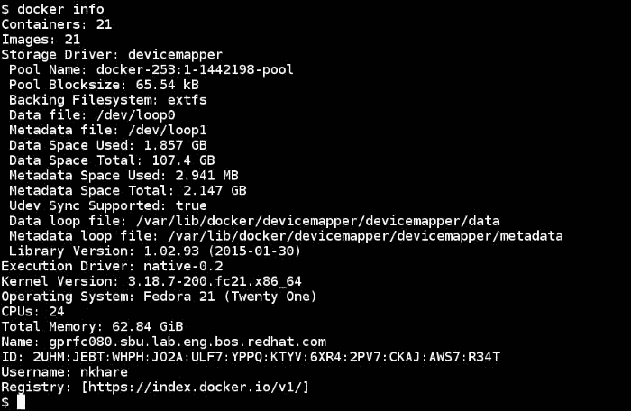
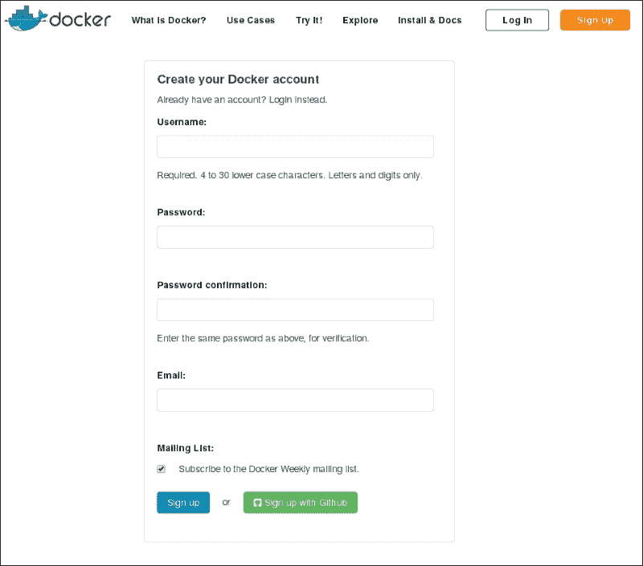
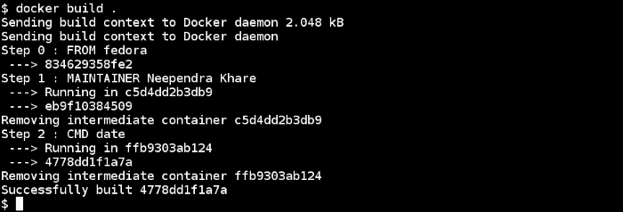
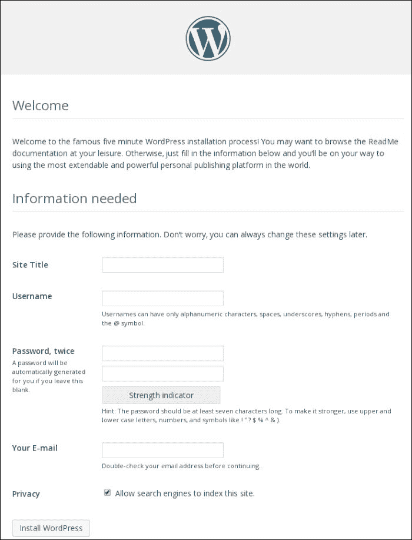
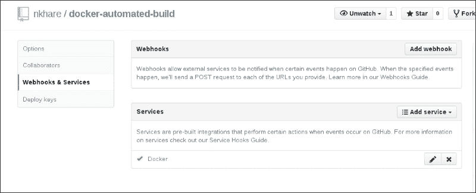

# 第三章：使用 Docker 镜像

在本章中，我们将涵盖以下配方：

+   在 Docker Hub 上创建一个帐户

+   从容器创建一个镜像

+   将镜像发布到注册表

+   查看镜像的历史

+   删除镜像

+   导出镜像

+   导入镜像

+   使用 Dockerfile 构建镜像

+   构建 Apache 镜像 - 一个 Dockerfile 示例

+   从容器中访问 Firefox - 一个 Dockerfile 示例

+   构建 WordPress 镜像 - 一个 Dockerfile 示例

+   设置私有索引/注册表

+   自动化构建 - 使用 GitHub 和 Bitbucket

+   创建基础镜像 - 使用 supermin

+   创建基础镜像 - 使用 Debootstrap

+   可视化层之间的依赖关系

# 介绍

在本章中，我们将专注于与镜像相关的操作。正如我们所知，运行容器需要镜像。您可以使用现有的镜像或创建新的自定义镜像。您需要创建自定义镜像以适应您的开发和部署环境。创建镜像后，您可以通过公共或私有注册表共享它。在我们更多地探索 Docker 镜像之前，让我们看一下`docker info`命令的输出：



前面的命令给出了当前系统范围的信息如下：

+   它有 21 个容器和 21 个镜像。

+   当前的存储驱动程序，`devicemapper`，以及与之相关的信息，如 thin pool 名称，数据，元数据文件等。其他类型的存储驱动程序包括 aufs，btrfs，overlayfs，vfs 等。Devicemapper，btrfs 和 overlayfs 在 Linux 内核中有原生支持。AUFS 支持需要一个经过修补的内核。我们在第一章中讨论了 Union 文件系统，*介绍和安装*。

+   为了利用启用容器化的内核特性，Docker 守护程序必须与 Linux 内核通信。这是通过执行驱动程序完成的。`libconatiner`或`native`是其中之一。其他的有`libvirt`，`lxc`等，我们在第一章中看到了，*介绍和安装*。

+   主机操作系统上的内核版本。

+   在下一节提到的注册表上注册的用户帐户以拉取/推送镜像。

### 注意

我正在使用 Fedora 20/21 作为运行配方的主要环境。它们也应该适用于其他环境。

# 在 Docker Hub 上创建一个帐户

Docker Hub 就像图像的 GitHub。它是一个公共注册表，您可以在其中托管图像，包括公共和私有图像，并与他人合作。它与 GitHub、Bitbucket 集成，并可以触发自动构建。

目前，在 Docker Hub 上创建帐户是免费的。一个仓库可以容纳图像的不同版本。您可以为您的图像创建任意数量的公共仓库。默认情况下，您将拥有一个私有仓库，该仓库对公众不可见。您可以购买更多的私有仓库。您可以通过 Web 浏览器或命令行创建帐户。

## 准备工作

要从命令行注册，您需要在系统上安装 Docker。

## 如何做...

1.  要通过 Docker Hub 的 Web 浏览器创建帐户，请访问[`hub.docker.com/account/signup/`](https://hub.docker.com/account/signup/)并创建一个帐户：

1.  要使用命令行创建一个帐户，请运行以下命令并提交所需的详细信息：

```
$ docker login

```

## 它是如何工作的...

上述步骤将为您创建一个 Docker Hub 帐户。帐户创建后，您将收到一封确认邮件，通过该邮件您需要确认您的身份。

## 另请参阅

+   Docker 网站上的文档：

+   [`docs.docker.com/docker-hub`](https://docs.docker.com/docker-hub)

+   [`docs.docker.com/docker-hub/accounts/`](https://docs.docker.com/docker-hub/accounts/)

# 从容器创建镜像

有几种创建镜像的方法，一种是手动提交层，另一种是通过 Dockerfile。在这个教程中，我们将看到前者，稍后在本章中再看 Dockerfile。

当我们启动一个新的容器时，会附加一个读/写层。如果我们不保存这个层，它将被销毁。在这个教程中，我们将看到如何保存这个层，并使用`docker commit`命令从正在运行或停止的容器中创建一个新的镜像。

## 准备工作

要获取 Docker 镜像，请使用它启动一个容器。

## 如何做...

1.  要进行提交，请运行以下命令：

```
docker commit -a|--author[=""] -m|--message[=""] CONTAINER [REPOSITORY[:TAG]]

```

1.  让我们启动一个容器并使用`install httpd`包创建/修改一些文件：

1.  然后，打开一个新的终端并通过提交创建一个新的镜像：

```
$ docker commit -a "Neependra Khare" -m "Fedora with HTTPD package" 0a15686588ef nkhare/fedora:httpd

```


如您所见，新的镜像现在正在使用`nkhare/fedora`作为名称和`httpd`作为标签提交到本地仓库。

## 它是如何工作的...

在第一章*介绍和安装*中，我们看到在启动容器时，将在容器启动的现有镜像层之上创建一个读/写文件系统层，并且通过安装软件包，一些文件将被添加/修改到该层中。所有这些更改目前都在临时的读/写文件系统层中，该层分配给容器。如果我们停止并删除容器，那么所有先前提到的修改将丢失。

使用 commit，我们创建一个新的层，其中包含自容器启动以来发生的更改，这些更改保存在后端存储驱动程序中。

## 还有更多…

+   查找自容器启动以来已更改的文件：

```
$ docker diff CONTAINER

```

在我们的情况下，我们将看到类似以下代码的内容：

```
$ docker diff 0a15686588ef
.....
C /var/log
A /var/log/httpd
C /var/log/lastlog
.....

```

我们可以在输出的每个条目之前看到一个前缀。以下是这些前缀的列表：

+   `A`: 当文件/目录被添加时

+   `C`: 当文件/目录被修改时

+   `D`: 当文件/目录被删除时

+   默认情况下，在执行提交时容器会被暂停。您可以通过传递`--pause=false`来更改其行为。

## 另请参阅

+   查看`docker commit`的`help`选项：

```
$ docker commit --help

```

+   Docker 网站上的文档[`docs.docker.com/reference/commandline/cli/#commit`](https://docs.docker.com/reference/commandline/cli/#commit)

# 将镜像发布到注册表

假设您已经创建了一个适合组织开发环境的镜像。您可以使用 tar ball 进行共享，我们将在本章后面看到，或者将其放在用户可以拉取的中央位置。这个中央位置可以是公共的或私有的注册表。在本教程中，我们将看到如何使用`docker push`命令将镜像推送到注册表。在本章后面，我们将介绍如何设置私有注册表。

## 准备工作

您需要在 Docker Hub 上拥有有效的帐户才能推送镜像/仓库。

如果您要推送本地镜像/仓库，必须设置本地注册表。

## 如何做…

```
$ docker push NAME[:TAG]

```

默认情况下，前面的命令将使用`docker info`命令中显示的用户名和注册表来推送镜像。如前面的屏幕截图所示，该命令将使用`nkhare`作为用户名，`https://index.docker.io/v1/`作为注册表。

要推送在上一节中创建的图像，请运行以下命令：

```
$ docker push nkhare/fedora:httpd

```


假设您想要将图像推送到本地注册表，该注册表托管在名为`local-registry`的主机上。为此，您首先需要使用注册表主机的名称或 IP 地址以及注册表正在运行的端口号对图像进行标记，然后推送图像。

```
$ docker tag [-f|--force[=false] IMAGE [REGISTRYHOST/][USERNAME/]NAME[:TAG]
$ docker push [REGISTRYHOST/][USERNAME/]NAME[:TAG]

```

例如，假设我们的注册表配置在`shadowfax.example.com`上，然后使用以下命令标记图像：

```
$ docker tag nkhare/fedora:httpd shadowfax.example.com:5000/nkhare/fedora:httpd

```

然后，要推送图像，请使用以下命令：

```
$ docker push shadowfax.example.com:5000/nkhare/fedora:httpd

```

## 它是如何工作的...

它将首先列出制作特定图像所需的所有中间层。然后，它将检查这些层中有多少已经存在于注册表中。最后，它将复制所有不在注册表中的层，并附上构建图像所需的元数据。

## 更多内容...

当我们将图像推送到公共注册表时，我们可以登录 Docker Hub 并查找图像：


## 另请参阅

+   查看`docker push`的`help`选项：

```
$ docker push --help

```

+   Docker 网站上的文档[`docs.docker.com/reference/commandline/cli/#push`](https://docs.docker.com/reference/commandline/cli/#push)

# 查看图像的历史记录

了解我们正在使用的图像是如何创建的很方便。`docker history`命令帮助我们找到所有中间层。

## 准备工作

拉取或导入任何 Docker 图像。

## 如何操作...

1.  要查看图像的历史记录，请考虑以下语法：

```
$ docker history [ OPTIONS ] IMAGE

```

以下是使用上述语法的示例：

```
$ docker history nkhare/fedora:httpd

```


## 它是如何工作的...

通过图像的元数据，Docker 可以知道图像是如何创建的。使用`history`命令，它将递归查看元数据以找到原始来源。

## 更多内容...

查看已提交层的提交消息：

```
$ docker inspect --format='{{.Comment}}' nkhare/fedora:httpd
Fedora with HTTPD package

```

目前，没有直接的方法可以使用一个命令查看每个层的提交消息，但是我们可以使用`inspect`命令，我们之前看到的，对每个层进行查看。

## 另请参阅

+   查看`docker history`的`help`选项：

```
$ docker history --help

```

+   Docker 网站上的文档[`docs.docker.com/reference/commandline/cli/#history`](https://docs.docker.com/reference/commandline/cli/#history)

# 删除图像

要从主机中删除图像，我们可以使用`docker rmi`命令。但是，这不会从注册表中删除图像。

## 准备工作

确保一个或多个 Docker 图像在本地可用。

## 如何做…

1.  要删除图像，请考虑以下语法：

```
$ docker rmi [ OPTIONS ] IMAGE [IMAGE...]

```

在我们的情况下，以下是使用前述语法的示例：

```
$ docker rmi nkhare/fedora:httpd

```


## 还有更多…

如果要删除所有容器和镜像，请执行以下操作；但是，请确保自己知道自己在做什么，因为这是非常具有破坏性的：

+   要停止所有容器，请使用以下命令：

```
$ docker stop 'docker ps -q'

```

+   要删除所有容器，请使用以下命令：

```
$ docker rm 'docker ps -a -q'

```

+   要删除所有图像，请使用以下命令：

```
$ docker rmi 'docker images -q'

```

## 另请参阅

+   查看`docker rmi`的`help`选项：

```
$ docker rmi --help

```

+   Docker 网站上的文档[`docs.docker.com/reference/commandline/cli/#rmi`](https://docs.docker.com/reference/commandline/cli/#rmi)

# 导出图像

假设您有一个客户，其非常严格的政策不允许他们使用来自公共领域的图像。在这种情况下，您可以通过 tar 文件共享图像，稍后可以在另一个系统上导入。在本示例中，我们将看到如何使用`docker save`命令来做到这一点。

## 准备工作

在 Docker 主机上拉取或导入一个或多个 Docker 图像。

## 如何做…

1.  使用以下语法将图像保存在 tar 文件中：

```
$ docker save [-o|--output=""] IMAGE [:TAG]

```

例如，要为 Fedora 创建一个 tar 归档，请运行以下命令：

```
$ docker save --output=fedora.tar fedora

```

如果指定了标签名称与我们要导出的图像名称，例如`fedora:latest`，那么只有与该标签相关的层将被导出。

## 还有更多…

如果没有使用`--output`或`-o`，输出将被流式传输到`STDOUT`：

```
$ docker save fedora:latest > fedora-latest.tar

```

类似地，可以使用以下命令导出容器文件系统的内容：

```
$ docker export CONTAINER  > containerXYZ.tar

```

## 另请参阅

+   查看`docker save`和`docker export`的`help`选项：

```
$ docker save -help
$ docker export --help

```

+   Docker 网站上的文档：

+   [`docs.docker.com/reference/commandline/cli/#save`](https://docs.docker.com/reference/commandline/cli/#save)

+   [`docs.docker.com/reference/commandline/cli/#export`](https://docs.docker.com/reference/commandline/cli/#export)

# 导入图像

要获得图像的本地副本，我们需要从可访问的注册表中拉取它，或者从已导出的图像中导入它，就像我们在之前的示例中看到的那样。使用`docker import`命令，我们导入一个已导出的图像。

## 准备工作

您需要一个可访问的导出的 Docker 镜像。

## 如何做…

1.  要导入图像，我们可以使用以下语法：

```
$ docker import URL|- [REPOSITORY[:TAG]]

```

以下是使用前述语法的示例：

```
$ cat fedora-latest.tar | docker import - fedora:latest

```

或者，您可以考虑以下示例：

```
$ docker import http://example.com/example.tar example/image

```

前面的示例将首先创建一个空的文件系统，然后导入内容。

## 参见

+   查看`docker import`的`help`选项：

```
$ docker import --help

```

+   Docker 网站上的文档[`docs.docker.com/reference/commandline/cli/#import`](https://docs.docker.com/reference/commandline/cli/#import)

# 使用 Dockerfile 构建映像

Dockerfile 帮助我们自动化映像创建，并在我们每次需要时获得完全相同的映像。Docker 构建器从文本文件（Dockerfile）中读取指令，并按顺序依次执行。它可以与 Vagrant 文件进行比较，Vagrant 文件允许您以可预测的方式配置虚拟机。

## 准备工作

具有构建指令的 Dockerfile。

+   创建一个空目录：

```
$ mkdir sample_image
$ cd sample_image

```

+   创建一个名为`Dockerfile`的文件，内容如下：

```
$ cat Dockerfile
# Pick up the base image
FROM fedora
# Add author name
MAINTAINER Neependra Khare
# Add the command to run at the start of container
CMD date

```

## 操作方法...

1.  在创建 Dockerfile 的目录中运行以下命令来构建映像：

```
$ docker build .

```



在构建映像时，我们没有指定任何存储库或标签名称。我们可以使用`-t`选项来指定：

```
$ docker build -t fedora/test .

```


前面的输出与我们之前所做的不同。然而，在这里，我们在每个指令之后都使用缓存。Docker 尝试保存中间映像，就像我们之前看到的那样，并尝试在后续构建中使用它们来加速构建过程。如果你不想缓存中间映像，那么在构建时添加`--no-cache`选项。现在让我们来看一下可用的映像：


## 它是如何工作的...

上下文定义了用于构建 Docker 映像的文件。在前面的命令中，我们将上下文定义为构建。构建由 Docker 守护程序完成，并且整个上下文被传输到守护程序。这就是为什么我们看到`Sending build context to Docker daemon 2.048 kB`消息。如果当前工作目录中有一个名为`.dockerignore`的文件，其中包含文件和目录的列表（以换行符分隔），那么这些文件和目录将被构建上下文忽略。有关`.dockerignore`的更多详细信息，请参阅[`docs.docker.com/reference/builder/#the-dockerignore-file`](https://docs.docker.com/reference/builder/#the-dockerignore-file)。

执行每个指令后，Docker 会提交中间镜像并为下一个指令运行一个容器。在下一个指令运行后，Docker 将再次提交容器以创建中间镜像，并删除在上一步中创建的中间容器。

例如，在上面的屏幕截图中，`eb9f10384509`是一个中间镜像，`c5d4dd2b3db9`和`ffb9303ab124`是中间容器。执行最后一个指令后，将创建最终镜像。在这种情况下，最终镜像是`4778dd1f1a7a`：


可以在`docker images`命令中使用`-a`选项来查找中间层：

```
$ docker images -a

```

## 还有更多…

Dockerfile 的格式如下：

```
INSTRUCTION arguments

```

通常，指令以大写形式给出，但它们不区分大小写。它们按顺序进行评估。以`#`开头的内容被视为注释。

让我们来看看不同类型的指令：

+   `FROM`：这必须是任何 Dockerfile 的第一个指令，它为后续指令设置了基础镜像。默认情况下，假定为最新标签：

```
FROM  <image>

```

或者，考虑以下标签：

```
FROM  <images>:<tag>

```

一个 Dockerfile 中可以有多个`FROM`指令，以创建多个镜像。

如果只提供镜像名称，例如 Fedora 和 Ubuntu，则将从默认的 Docker 注册表（Docker Hub）下载镜像。如果要使用私有或第三方镜像，则必须按以下方式提及：

```
 [registry_hostname[:port]/]user_name/

```

以下是使用上述语法的示例：

```
FROM registry-host:5000/nkhare/f20:httpd

```

+   `MAINTAINER`：这为生成的镜像设置了作者，`MAINTAINER <name>`。

+   `RUN`：我们可以以两种方式执行`RUN`指令——首先，在 shell 中运行（`sh -c`）：

```
RUN <command> <param1> ... <pamamN>

```

其次，直接运行可执行文件：

```
RUN ["executable", "param1",...,"paramN" ]

```

正如我们所知，使用 Docker，我们创建一个覆盖层——在另一个层之上的一层——以创建最终的镜像。通过每个`RUN`指令，我们创建并提交一个层，放在之前提交的层之上。可以从任何已提交的层启动容器。

默认情况下，Docker 会尝试缓存不同`RUN`指令提交的层，以便在后续构建中使用。但是，可以在构建镜像时使用`--no-cache`标志来关闭此行为。

+   `LABEL`：Docker 1.6 添加了一个新功能，可以将任意键值对附加到 Docker 镜像和容器上。我们在第二章的*标记和过滤容器*中介绍了部分内容，*使用 Docker 容器*。要为图像添加标签，我们在 Dockerfile 中使用`LABEL`指令，如`LABEL distro=fedora21`。

+   `CMD`：`CMD`指令在启动容器时提供默认可执行文件。如果`CMD`指令没有可执行文件（参数 2），那么它将为`ENTRYPOINT`提供参数。

```
CMD  ["executable", "param1",...,"paramN" ]
CMD ["param1", ... , "paramN"]
CMD <command> <param1> ... <pamamN>

```

Dockerfile 中只允许一个`CMD`指令。如果指定了多个指令，则只有最后一个会被采纳。

+   `ENTRYPOINT`：这有助于我们将容器配置为可执行文件。与`CMD`类似，`ENTRYPOINT`最多只能有一条指令；如果指定了多条指令，则只有最后一条会被采纳：

```
ENTRYPOINT  ["executable", "param1",...,"paramN" ]
ENTRYPOINT <command> <param1> ... <pamamN>

```

一旦使用`ENTRYPOINT`指令定义了参数，它们就不能在运行时被覆盖。但是，如果我们想要对`ENTRYPOINT`使用不同的参数，可以将`ENTRYPOINT`用作`CMD`。

+   `EXPOSE`：这将在容器上暴露网络端口，容器将在其中运行时监听：

```
EXPOSE  <port> [<port> ... ]

```

我们还可以在启动容器时暴露端口。我们在第二章的*在启动容器时暴露端口*中介绍了这一点，*使用 Docker 容器*。

+   `ENV`：这将将环境变量`<key>`设置为`<value>`。它将传递所有未来的指令，并在从生成的镜像运行容器时持久存在：

```
ENV <key> <value>

```

+   `ADD`：这将文件从源复制到目的地：

```
ADD <src> <dest>

```

以下是包含空格的路径：

```
ADD ["<src>"... "<dest>"]

```

+   `<src>`：这必须是构建目录中的文件或目录，我们正在从中构建图像，也称为构建的上下文。源也可以是远程 URL。

+   `<dest>`：这必须是容器内的绝对路径，源中的文件/目录将被复制到其中。

+   `COPY`：这类似于`ADD.COPY <src> <dest>`：

```
COPY  ["<src>"... "<dest>"]

```

+   `VOLUME`：此指令将使用以下语法创建具有给定名称的挂载点，并将其标记为使用外部卷进行挂载：

```
VOLUME ["/data"]

```

或者，您可以使用以下代码：

```
VOLUME /data

```

+   `USER`：这将使用以下语法为任何后续的运行指令设置用户名：

```
USER  <username>/<UID>

```

+   `WORKDIR`：这为随后的`RUN`、`CMD`和`ENTRYPOINT`指令设置工作目录。它可以在同一个 Dockerfile 中有多个条目。可以给出相对路径，它将相对于之前的`WORKDIR`指令，使用以下语法：

```
WORKDIR <PATH>

```

+   `ONBUILD`：这将向图像添加触发指令，稍后将在将此图像用作另一个图像的基本图像时执行。此触发器将作为下游 Dockerfile 中的`FROM`指令的一部分运行，使用以下语法：

```
ONBUILD [INSTRUCTION]

```

## 另请参阅

+   查看`docker build`的`help`选项：

```
$ docker build -help

```

+   Docker 网站上的文档[`docs.docker.com/reference/builder/`](https://docs.docker.com/reference/builder/)

# 构建 Apache 镜像 - 一个 Dockerfile 示例

我将在从 Fedora-Dockerfiles GitHub 存储库（[`github.com/fedora-cloud/Fedora-Dockerfiles`](https://github.com/fedora-cloud/Fedora-Dockerfiles)）中引用 Dockerfiles，之后对其进行分叉。如果您使用的是 Fedora，那么您也可以安装`fedora-dockerfiles`软件包，以获取`/usr/share/fedora-dockerfiles`中的示例 Dockerfiles。在每个子目录中，您将放置一个 Dockerfile、支持文件和一个 README 文件。

Fedora-Dockerfiles GitHub 存储库将具有最新的示例，我强烈建议您尝试最新的内容。

## 准备工作

使用以下命令克隆 Fedora-Dockerfiles Git 存储库：

```
$ git clone https://github.com/nkhare/Fedora-Dockerfiles.git

```

现在，转到`apache`子目录：

```
$ cd Fedora-Dockerfiles/apache/
$ cat Dockerfile
FROM fedora:20
MAINTAINER "Scott Collier" <scollier@redhat.com>

RUN yum -y update && yum clean all
RUN yum -y install httpd && yum clean all
RUN echo "Apache" >> /var/www/html/index.html

EXPOSE 80

# Simple startup script to avoid some issues observed with container restart
ADD run-apache.sh /run-apache.sh
RUN chmod -v +x /run-apache.sh

CMD ["/run-apache.sh"]

```

其他支持文件包括：

+   `README.md`：这是 README 文件

+   `run-apache.sh`：这是在前台运行`HTTPD`的脚本

+   `LICENSE`：这是 GPL 许可证

## 如何做...

使用以下`build`命令，我们可以构建一个新的镜像：

```
$ docker build -t fedora/apache .
Sending build context to Docker daemon 23.55 kB
Sending build context to Docker daemon
Step 0 : FROM fedora:20
 ---> 6cece30db4f9
Step 1 : MAINTAINER "Scott Collier" <scollier@redhat.com>
 ---> Running in 2048200e6338
 ---> ae8e3c258061
Removing intermediate container 2048200e6338
Step 2 : RUN yum -y update && yum clean all
 ---> Running in df8bc8ee3117
.... Installing/Update packages ...
Cleaning up everything
 ---> 5a6d449e59f6
Removing intermediate container df8bc8ee3117
Step 3 : RUN yum -y install httpd && yum clean all
 ---> Running in 24449e520f18
.... Installing HTTPD ...
Cleaning up everything
 ---> ae1625544ef6
Removing intermediate container 24449e520f18
Step 4 : RUN echo "Apache" >> /var/www/html/index.html
 ---> Running in a35cbcd8d97a
 ---> 251eea31b3ce
Removing intermediate container a35cbcd8d97a
Step 5 : EXPOSE 80
 ---> Running in 734e54f4bf58
 ---> 19503ae2a8cf
Removing intermediate container 734e54f4bf58
Step 6 : ADD run-apache.sh /run-apache.sh
 ---> de35d746f43b
Removing intermediate container 3eec9a46da64
Step 7 : RUN chmod -v +x /run-apache.sh
 ---> Running in 3664efba393f
mode of '/run-apache.sh' changed from 0644 (rw-r--r--) to 0755 (rwxr-xr-x)
 ---> 1cb729521c3f
Removing intermediate container 3664efba393f
Step 8 : CMD /run-apache.sh
 ---> Running in cd5e7534e815
 ---> 5f8041b6002c
Removing intermediate container cd5e7534e815
Successfully built 5f8041b6002c

```

## 它是如何工作的...

构建过程需要一个基本镜像，安装所需的`HTTPD`软件包并创建一个 HTML 页面。然后，它公开端口`80`以提供网页，并设置指令在容器启动时启动 Apache。

## 更多内容...

让我们从创建的镜像中运行容器，获取其 IP 地址，并从中访问网页：


## 另请参阅

+   查看`docker build`的`help`选项：

```
$ docker build --help

```

+   Docker 网站上的文档[`docs.docker.com/reference/builder/`](https://docs.docker.com/reference/builder/)

# 从容器访问 Firefox - 一个 Dockerfile 示例

我们可以通过 Dockerfile 做一些更有趣的事情，比如创建一个只运行 Firefox 的容器。这种用例可以帮助在同一台机器上运行不同版本的多个浏览器，这在进行多浏览器测试时非常有帮助。

## 准备工作

使用以下命令克隆 Fedora-Dockerfiles Git 存储库：

```
$ git clone  https://github.com/nkhare/Fedora-Dockerfiles.git

```

然后，转到`firefox`子目录。

```
$ cd Fedora-Dockerfiles/firefox
$ cat Dockerfile
FROM fedora
MAINTAINER scollier <emailscottcollier@gmail.com>

# Install the appropriate software
RUN yum -y update && yum clean all
RUN yum -y install x11vnc \
firefox xorg-x11-server-Xvfb \
xorg-x11-twm tigervnc-server \
xterm xorg-x11-font \
xulrunner-26.0-2.fc20.x86_64 \
dejavu-sans-fonts \
dejavu-serif-fonts \
xdotool && yum clean all

# Add the xstartup file into the image
ADD ./xstartup /

RUN mkdir /.vnc
RUN x11vnc -storepasswd 123456 /.vnc/passwd
RUN  \cp -f ./xstartup /.vnc/.
RUN chmod -v +x /.vnc/xstartup
RUN sed -i '/\/etc\/X11\/xinit\/xinitrc-common/a [ -x /usr/bin/firefox ] && /usr/bin/firefox &' /etc/X11/xinit/xinitrc

EXPOSE 5901

CMD    ["vncserver", "-fg" ]
# ENTRYPOINT ["vncserver", "-fg" ]

```

支持文件：

+   `README.md`：这是一个 README 文件

+   `LICENSE`：这是 GPL 许可证

+   `xstartup`：这是设置 X11 环境的脚本

## 如何做...

运行以下命令构建镜像：

```
$ docker build  -t fedora/firefox .
Sending build context to Docker daemon 24.58 kB
Sending build context to Docker daemon
Step 0 : FROM fedora
 ---> 834629358fe2
Step 1 : MAINTAINER scollier <emailscottcollier@gmail.com>
 ---> Running in ae0fd3c2cb2e
 ---> 7ffc6c9af827
Removing intermediate container ae0fd3c2cb2e
Step 2 : RUN yum -y update && yum clean all
 ---> Running in 1c67b8772718
..... Installing/Update packages ...
 ---> 075d6ceef3d0
Removing intermediate container 1c67b8772718
Step 3 : RUN yum -y install x11vnc firefox xorg-x11-server-Xvfb xorg-x11-twm tigervnc-server xterm xorg-x11-font xulrunner-26.0-2.fc20.x86_64 dejavu-sans-fonts dejavu-serif-fonts xdotool && yum clean all
..... Installing required packages packages ...
Cleaning up everything
 ---> 986be48760a6
Removing intermediate container c338a1ad6caf
Step 4 : ADD ./xstartup /
 ---> 24fa081dcea5
Removing intermediate container fe98d86ba67f
Step 5 : RUN mkdir /.vnc
 ---> Running in fdb8fe7e697a
 ---> 18f266ace765
Removing intermediate container fdb8fe7e697a
Step 6 : RUN x11vnc -storepasswd 123456 /.vnc/passwd
 ---> Running in c5b7cdba157f
stored passwd in file: /.vnc/passwd
 ---> e4fcf9b17aa9
Removing intermediate container c5b7cdba157f
Step 7 : RUN \cp -f ./xstartup /.vnc/.
 ---> Running in 21d0dc4edb4e
 ---> 4c53914323cb
Removing intermediate container 21d0dc4edb4e
Step 8 : RUN chmod -v +x /.vnc/xstartup
 ---> Running in 38f18f07c996
mode of '/.vnc/xstartup' changed from 0644 (rw-r--r--) to 0755 (rwxr-xr-x)
 ---> caa278024354
Removing intermediate container 38f18f07c996
Step 9 : RUN sed -i '/\/etc\/X11\/xinit\/xinitrc-common/a [ -x /usr/bin/firefox ] && /usr/bin/firefox &' /etc/X11/xinit/xinitrc
 ---> Running in 233e99cab02c
 ---> 421e944ac8b7
Removing intermediate container 233e99cab02c
Step 10 : EXPOSE 5901
 ---> Running in 530cd361cb3c
 ---> 5de01995c156
Removing intermediate container 530cd361cb3c
Step 11 : CMD vncserver -fg
 ---> Running in db89498ae8ce
 ---> 899be39b7feb
Removing intermediate container db89498ae8ce
Successfully built 899be39b7feb

```

## 它是如何工作的...

我们从基本的 Fedora 镜像开始，安装 X Windows System，Firefox，VNC 服务器和其他软件包。然后设置 VNC 服务器启动 X Windows System，然后启动 Firefox。

## 还有更多...

+   要启动容器，请运行以下命令：

```
$ docker run -it -p 5901:5901 fedora/firefox

```

并输入`123456`作为密码。

+   在运行容器时，我们将主机的`5901`端口映射到容器的`5901`端口。为了连接容器内的 VNC 服务器，只需从另一个终端运行以下命令：

```
$ vncviewer localhost:1

```

或者，从网络中的另一台机器上，用 Docker 主机的 IP 地址或 FQDN 替换`localhost`。

## 另请参阅

+   查看`docker build`的`help`选项：

```
$ docker build --help

```

+   Docker 网站上的文档[`docs.docker.com/reference/builder/`](https://docs.docker.com/reference/builder/)

# 构建 WordPress 镜像-一个 Dockerfile 示例

到目前为止，我们已经看到了在容器中运行一个服务的示例。如果我们想要运行一个需要同时运行一个或多个服务的应用程序，那么我们要么需要在同一个容器上运行它们，要么在不同的容器上运行它们并将它们链接在一起。WordPress 就是一个这样的例子，它需要数据库和 web 服务。

Docker 只喜欢每个容器中运行的前台一个进程。因此，为了让 Docker 满意，我们有一个控制进程来管理数据库和 web 服务。在这种情况下，控制进程是 supervisord（[`supervisord.org/`](http://supervisord.org/)）。这是我们用来让 Docker 满意的一个技巧。

同样，我们将使用 Fedora-Dockerfiles 存储库中的 Dockerfile。

## 准备工作

使用以下命令克隆 Fedora-Dockerfiles Git 存储库：

```
$ git clone  https://github.com/nkhare/Fedora-Dockerfiles.git

```

然后，转到`wordpress_single_container`子目录：

```
$ cd Fedora-Dockerfiles/systemd/wordpress_single_container
$ cat Dockerfile
FROM fedora
MAINTAINER scollier <scollier@redhat.com>
RUN yum -y update && yum clean all
RUN yum -y install httpd php php-mysql php-gd pwgen supervisor bash-completion openssh-server psmisc tar && yum clean all
ADD ./start.sh /start.sh
ADD ./foreground.sh /etc/apache2/foreground.sh
ADD ./supervisord.conf /etc/supervisord.conf
RUN echo %sudo  ALL=NOPASSWD: ALL >> /etc/sudoers
ADD http://wordpress.org/latest.tar.gz /wordpress.tar.gz
RUN tar xvzf /wordpress.tar.gz
RUN mv /wordpress/* /var/www/html/.
RUN chown -R apache:apache /var/www/
RUN chmod 755 /start.sh
RUN chmod 755 /etc/apache2/foreground.sh
RUN mkdir /var/run/sshd
EXPOSE 80
EXPOSE 22
CMD ["/bin/bash", "/start.sh"]

```

前面代码中使用的支持文件解释如下：

+   `foreground.sh`：这是一个在前台运行 HTTPS 的脚本。

+   `LICENSE`、`LICENSE.txt`和`UNLICENSE.txt`：这些文件包含许可信息。

+   `README.md`：这是一个 README 文件。

+   `supervisord.conf`：这是一个结果容器，必须同时运行`SSHD`、`MySQL`和`HTTPD`。在这种特殊情况下，使用 supervisor 来管理它们。这是 supervisor 的配置文件。有关此的更多信息，请访问[`supervisord.org/`](http://supervisord.org/)。

+   `start.sh`：这是一个设置 MySQL、HTTPD 并启动 supervisor 守护进程的脚本。

## 如何做…

```
$ docker build -t fedora/wordpress  .
Sending build context to Docker daemon 41.98 kB
Sending build context to Docker daemon
Step 0 : FROM fedora
 ---> 834629358fe2
Step 1 : MAINTAINER scollier <scollier@redhat.com>
 ---> Using cache
 ---> f21eaf47c9fc
Step 2 : RUN yum -y update && yum clean all
 ---> Using cache
 ---> a8f497a6e57c
Step 3 : RUN yum -y install httpd php php-mysql php-gd pwgen supervisor bash-completion openssh-server psmisc tar && yum clean all
 ---> Running in 303234ebf1e1
.... updating/installing packages ....
Cleaning up everything
 ---> cc19a5f5c4aa
Removing intermediate container 303234ebf1e1
Step 4 : ADD ./start.sh /start.sh
 ---> 3f911077da44
Removing intermediate container c2bd643236ef
Step 5 : ADD ./foreground.sh /etc/apache2/foreground.sh
 ---> 3799902a60c5
Removing intermediate container c99b8e910009
Step 6 : ADD ./supervisord.conf /etc/supervisord.conf
 ---> f232433b8925
Removing intermediate container 0584b945f6f7
Step 7 : RUN echo %sudo  ALL=NOPASSWD: ALL >> /etc/sudoers
 ---> Running in 581db01d7350
 ---> ec686e945dfd
Removing intermediate container 581db01d7350
Step 8 : ADD http://wordpress.org/latest.tar.gz /wordpress.tar.gz
Downloading [==================================================>] 6.186 MB/6.186 MB
 ---> e4e902c389a4
Removing intermediate container 6bfecfbe798d
Step 9 : RUN tar xvzf /wordpress.tar.gz
 ---> Running in cd772500a776
.......... untarring wordpress .........
---> d2c5176228e5
Removing intermediate container cd772500a776
Step 10 : RUN mv /wordpress/* /var/www/html/.
 ---> Running in 7b19abeb509c
 ---> 09400817c55f
Removing intermediate container 7b19abeb509c
Step 11 : RUN chown -R apache:apache /var/www/
 ---> Running in f6b9b6d83b5c
 ---> b35a901735d9
Removing intermediate container f6b9b6d83b5c
Step 12 : RUN chmod 755 /start.sh
 ---> Running in 81718f8d52fa
 ---> 87470a002e12
Removing intermediate container 81718f8d52fa
Step 13 : RUN chmod 755 /etc/apache2/foreground.sh
 ---> Running in 040c09148e1c
 ---> 1c76f1511685
Removing intermediate container 040c09148e1c
Step 14 : RUN mkdir /var/run/sshd
 ---> Running in 77177a33aee0
 ---> f339dd1f3e6b
Removing intermediate container 77177a33aee0
Step 15 : EXPOSE 80
 ---> Running in f27c0b96d17f
 ---> 6078f0d7b70b
Removing intermediate container f27c0b96d17f
Step 16 : EXPOSE 22
 ---> Running in eb7c7d90b860
 ---> 38f36e5c7cab
Removing intermediate container eb7c7d90b860
Step 17 : CMD /bin/bash /start.sh
 ---> Running in 5635fe4783da
 ---> c1a327532355
Removing intermediate container 5635fe4783da
Successfully built c1a327532355

```

## 它是如何工作的…

与其他示例一样，我们从基本镜像开始，安装所需的软件包，并复制支持文件。然后设置`sudo`、`download`和`untar` WordPress 在 HTTPD 文档根目录内。之后，我们暴露端口并运行 start.sh 脚本，该脚本设置 MySQL、WordPress、HTTPS 权限并将控制权交给 supervisord。在`supervisord.conf`中，您将看到 supervisord 管理的以下服务条目：

```
[program:mysqld]
command=/usr/bin/mysqld_safe
[program:httpd]
command=/etc/apache2/foreground.sh
stopsignal=6
[program:sshd]
command=/usr/sbin/sshd -D
stdout_logfile=/var/log/supervisor/%(program_name)s.log
stderr_logfile=/var/log/supervisor/%(program_name)s.log
autorestart=true

```

## 还有更多…

+   启动容器，获取其 IP 地址并通过 Web 浏览器打开。在进行语言选择后，您应该看到欢迎屏幕，如下面的屏幕截图所示：

+   现在可以在容器内运行 systemd，这是一种更受欢迎的方式。Systemd 可以管理多个服务。您可以在[`github.com/fedora-cloud/Fedora-Dockerfiles/tree/master/systemd`](https://github.com/fedora-cloud/Fedora-Dockerfiles/tree/master/systemd)中查看 systemd 的示例。

## 另请参阅

+   查看`docker build`的`help`选项：

```
$ docker build --help

```

+   Docker 网站上的文档[`docs.docker.com/reference/builder/`](https://docs.docker.com/reference/builder/)

# 设置私有索引/注册表

正如我们之前看到的，公共 Docker 注册表是可用的 Docker Hub（[`registry.hub.docker.com/`](https://registry.hub.docker.com/)），用户可以通过它推送/拉取镜像。我们还可以在本地环境或云上托管私有注册表。有几种设置本地注册表的方法：

+   使用 Docker Hub 的 Docker 注册表

+   从 Dockerfile 构建镜像并运行注册表容器：

[`github.com/fedora-cloud/Fedora-Dockerfiles/tree/master/registry`](https://github.com/fedora-cloud/Fedora-Dockerfiles/tree/master/registry)

+   配置特定于发行版的软件包，例如提供了 docker-registry 软件包的 Fedora。

设置它的最简单方法是通过注册表容器本身。

## 准备工作

确保 Docker 守护程序在主机上运行，并且您可以通过 Docker 客户端进行连接。

## 如何做…

1.  要在容器上运行注册表，请运行以下命令：

```
$ docker run -p 5000:5000 registry

```

1.  要测试新创建的注册表，请执行以下步骤：

1.  使用以下命令启动容器及其 ID：

```
 $ ID='docker run -d -i fedora /bin/bash'

```

1.  如果需要，附加到新创建的容器并进行一些更改。然后，将这些更改提交到本地存储库：

```
 $ docker commit $ID fedora-20

```

1.  要将镜像推送到本地注册表，我们需要使用注册表主机的主机名或 IP 地址对镜像进行标记。假设我们的注册表主机是 `registry-host`；然后，要对其进行标记，请使用以下命令：

```
$ docker tag fedora-20 registry-host:5000/nkhare/f20

```

1.  由于我们在启动注册表时没有正确配置 HTTPS，因此我们将收到错误，例如 `ping attempt failed with error: Get https://dockerhost:5000/v1/_ping`，这是预期的。为了使我们的示例工作，我们需要向守护程序添加 `--insecure-registry registry-host:5000` 选项。如果您手动启动了 Docker 守护程序，那么我们必须按照以下方式运行命令以允许不安全的注册表：

```
$ docker -d   --insecure-registry registry-host:5000

```

1.  要推送镜像，请使用以下命令：

```
$ docker push registry-host:5000/nkhare/f20

```

1.  要从本地注册表中拉取镜像，请运行以下命令：

```
$ docker pull registry-host:5000/nkhare/f20

```

## 工作原理…

从 Docker Hub 下载官方注册表镜像并在端口 `5000` 上运行它的上述命令。`-p` 选项将容器端口发布到主机系统的端口。我们将在下一章中详细了解端口发布的细节。

也可以使用 docker-registry 应用程序在任何现有服务器上配置注册表。执行此操作的步骤可在 docker-registry GitHub 页面上找到：

[`github.com/docker/docker-registry`](https://github.com/docker/docker-registry)

## 还有更多…

让我们看看 docker-registry 的 Dockerfile，以了解注册表镜像是如何创建的，以及如何设置不同的配置选项：

```
# VERSION 0.1
# DOCKER-VERSION  0.7.3
# AUTHOR:         Sam Alba <sam@docker.com>
# DESCRIPTION:    Image with docker-registry project and dependencies
# TO_BUILD:       docker build -rm -t registry .
# TO_RUN:         docker run -p 5000:5000 registry

# Latest Ubuntu LTS
FROM ubuntu:14.04

# Update
RUN apt-get update \
# Install pip
 && apt-get install -y \
 swig \
 python-pip \
# Install deps for backports.lzma (python2 requires it)
 python-dev \
 python-mysqldb \
 python-rsa \
 libssl-dev \
 liblzma-dev \
 libevent1-dev \
 && rm -rf /var/lib/apt/lists/*

COPY . /docker-registry
COPY ./config/boto.cfg /etc/boto.cfg

# Install core
RUN pip install /docker-registry/depends/docker-registry-core

# Install registry
RUN pip install file:///docker-registry#egg=docker-registry[bugsnag,newrelic,cors]

RUN patch \
 $(python -c 'import boto; import os; print os.path.dirname(boto.__file__)')/connection.py \
 < /docker-registry/contrib/boto_header_patch.diff

ENV DOCKER_REGISTRY_CONFIG /docker-registry/config/config_sample.yml
ENV SETTINGS_FLAVOR dev
EXPOSE 5000
CMD ["docker-registry"]

```

使用上述 Dockerfile，我们将：

+   使用 Ubuntu 的基本镜像安装/更新软件包

+   将 docker-registry 源代码复制到镜像中

+   使用 `pip install` docker-registry

+   设置在运行注册表时使用的配置文件的环境变量

+   使用环境变量设置运行注册表时要使用的 flavor

+   暴露端口 `5000`

+   运行注册表可执行文件

配置文件（`/docker-registry/config/config_sample.yml`）中的风格提供了配置注册表的不同方式。使用上述 Dockerfile，我们将使用环境变量设置`dev`风格。不同类型的风格包括：

+   `common`: 这是所有其他风格的基本设置

+   `local`: 这将数据存储在本地文件系统中

+   `s3`: 这将数据存储在 AWS S3 存储桶中

+   `dev`: 这是使用本地风格的基本配置

+   `test`: 这是单元测试使用的配置

+   `prod`: 这是生产配置（基本上是 S3 风格的同义词）

+   `gcs`: 这将数据存储在 Google 云存储中

+   `swift`: 这将数据存储在 OpenStack Swift 中

+   `glance`: 这将数据存储在 OpenStack Glance 中，备用为本地存储

+   `glance-swift`: 这将数据存储在 OpenStack Glance 中，备用为 Swift

+   `elliptics`: 这将数据存储在椭圆键值存储中

对于上述每种风格，都有不同的配置选项，例如日志级别、身份验证等。所有选项的文档都可以在我之前提到的 docker-registry 的 GitHub 页面上找到。

## 另请参阅

+   GitHub 上的文档 [`github.com/docker/docker-registry`](https://github.com/docker/docker-registry)

# 使用 GitHub 和 Bitbucket 进行自动构建

我们之前已经看到如何将 Docker 镜像推送到 Docker Hub。Docker Hub 允许我们使用其构建集群从 GitHub/Bitbucket 存储库创建自动化镜像。GitHub/Bitbucket 存储库应包含 Dockerfile 和所需的内容以复制/添加到镜像中。让我们在接下来的部分中看一个 GitHub 的例子。

## 准备工作

您将需要在 Docker Hub 和 GitHub 上拥有帐户。您还需要一个具有相应 Dockerfile 的 GitHub 存储库，位于顶层。

## 如何做…

1.  登录到 Docker Hub（[`hub.docker.com/`](https://hub.docker.com/)）并单击绿色加号。在右上角添加存储库图标，然后单击**自动化构建**。选择 GitHub 作为自动化构建的源。然后，选择**公共和私有（推荐）**选项以连接到 GitHub。在提示时提供 GitHub 用户名/密码。选择要执行自动化构建的 GitHub 存储库。

1.  选择 GitHub 存储库后，它会要求您选择要用于自动构建的分支。它还会要求您提供一个标签名称，以在自动构建的镜像之后使用。默认情况下，将使用最新的标签名称。然后，单击**保存并触发构建**按钮开始自动构建过程。就是这样！您的构建现在已提交。您可以单击构建状态来检查构建的状态。

## 它是如何工作的...

当我们选择 GitHub 存储库进行自动构建时，GitHub 会为该存储库启用 Docker 服务。您可以查看 GitHub 存储库的**设置**部分以进行更多配置。每当我们对这个 GitHub 存储库进行任何更改，比如提交，都会使用存储在 GitHub 存储库中的 Dockerfile 触发自动构建。



## 还有更多...

您可以通过转到**您的存储库**部分来获取诸如 Dockerfile、构建详细信息标签和其他信息。它还包含了如何拉取您的镜像的详细信息：


使用自动构建过程创建的镜像无法通过`docker push`命令推送。

您可以在 GitHub 存储库的**Webhooks & Services**部分更改设置，以注销 Docker 服务。这将停止自动构建。

## 另请参阅

+   使用 Bitbucket 设置自动构建的步骤几乎相同。自动构建的挂钩在 Bitbucket 存储库的**设置**部分的**Hooks**部分下进行配置。

+   Docker 网站上的文档[`docs.docker.com/docker-hub/builds/`](https://docs.docker.com/docker-hub/builds/)

# 创建基础镜像-使用 supermin

在本章的前面，我们使用了`FROM`指令来选择要开始的基础镜像。我们创建的镜像可以成为另一个应用程序容器化的基础镜像，依此类推。从一开始到这个链条，我们将有一个来自我们想要使用的基础 Linux 发行版的基础镜像，比如 Fedora、Ubuntu、CentOS 等。

要构建这样的基础镜像，我们需要在目录中安装特定于发行版的基本系统，然后将其导入为 Docker 镜像。使用 chroot 实用程序，我们可以将一个目录伪装成根文件系统，然后在导入为 Docker 镜像之前将所有必要的文件放入其中。Supermin 和 Debootstrap 是可以帮助我们使前述过程更容易的工具。

Supermin 是构建 supermin 应用程序的工具。这些是微型应用程序，可以在飞行中完全实例化。早期这个程序被称为 febootstrap。

## 准备就绪

在要构建基础镜像的系统上安装 supermin。您可以使用以下命令在 Fedora 上安装 supermin：

```
$ yum install supermin

```

## 如何做...

1.  使用`prepare`模式在目录中安装`bash`，`coreutils`和相关依赖项。

```
$ supermin --prepare -o OUTPUTDIR PACKAGE [PACKAGE ...]

```

以下是使用前述语法的示例：

```
$ supermin --prepare bash coreutils -o f21_base

```

1.  现在，使用`build`模式为基础镜像创建一个 chroot 环境：

```
$ supermin --build -o OUTPUTDIR -f chroot|ext2 INPUT [INPUT ...]

```

以下是使用前述语法的示例：

```
$ supermin --build --format chroot f21_base -o f21_image

```

1.  如果我们在输出目录上执行`ls`，我们将看到一个类似于任何 Linux 根文件系统的目录树：

```
$ ls f21_image/
bin  boot  dev  etc  home  lib  lib64  media  mnt  opt  proc  root  run  sbin  srv  sys  tmp  usr  var

```

1.  现在我们可以使用以下命令将目录导出为 Docker 镜像：

```
$ tar -C f21_image/ -c . | docker import - nkhare/f21_base
d6db8b798dee30ad9c84480ef7497222f063936a398ecf639e60599eed7f6560

```

1.  现在，查看`docker images`输出。您应该有一个名为`nkhare/f21_base`的新镜像。

## 它是如何工作的...

Supermin 有两种模式，`prepare`和`build`。使用`prepare`模式，它只是将所有请求的软件包及其依赖项放在一个目录中，而不复制主机操作系统特定的文件。

使用`build`模式，先前通过`prepare`模式创建的 supermin 应用程序将被转换为具有所有必要文件的完整可引导应用程序。此步骤将从主机复制所需的文件/二进制文件到应用程序目录，因此必须在要在应用程序中使用的主机机器上安装软件包。

`build`模式有两种输出格式，chroot 和 ext2。使用 chroot 格式，目录树被写入目录中，而使用 ext2 格式，则创建磁盘映像。我们通过 chroot 格式导出创建的目录来创建 Docker 镜像。

## 还有更多...

Supermin 不特定于 Fedora，应该适用于任何 Linux 发行版。

## 另请参阅

+   使用以下命令查看 supermin 的`man`页面以获取更多信息：

```
$ man supermin

```

+   在线文档[`people.redhat.com/~rjones/supermin/`](http://people.redhat.com/~rjones/supermin/)

+   GitHub 存储库[`github.com/libguestfs/supermin`](https://github.com/libguestfs/supermin)

# 创建基本镜像-使用 Debootstrap

Debootstrap 是一种工具，用于将基于 Debian 的系统安装到已安装系统的目录中。

## 准备工作

在基于 Debian 的系统上使用以下命令安装`debootstrap`：

```
$ apt-get install debootstrap

```

## 如何做…

以下命令可用于使用 Debootstrap 创建基本镜像：

```
$ debootstrap [OPTION...]  SUITE TARGET [MIRROR [SCRIPT]]

```

`SUITE`指的是发布代码名称，`MIRROR`是相应的存储库。如果您想创建 Ubuntu 14.04.1 LTS（Trusty Tahr）的基本镜像，则执行以下操作：

1.  在要安装操作系统的目录上创建一个目录。Debootstrap 还创建了 chroot 环境以安装软件包，就像我们之前在 supermin 中看到的那样。

```
$ mkdir trusty_chroot

```

1.  现在，使用`debootstrap`在我们之前创建的目录中安装 Trusty Tahr：

```
$ debootstrap trusty ./trusty_chroot http://in.archive.ubuntu.com/ubuntu/

```

1.  您将看到类似于任何 Linux 根文件系统的目录树，位于 Trusty Tahr 安装的目录内。

```
$ ls ./trusty_chroot
bin  boot  dev  etc  home  lib  lib64  media  mnt  opt  proc  root  run  sbin  srv  sys  tmp  usr  var

```

1.  现在，我们可以使用以下命令将目录导出为 Docker 镜像：

```
$ tar -C trusty_chroot/ -c . |  docker import - nkhare/trusty_base

```

1.  现在，查看`docker images`输出。您应该有一个名为`nkhare/trusty_base`的新镜像。

## 另请参阅

+   Debootstrap 维基页面[`wiki.debian.org/Debootstrap`](https://wiki.debian.org/Debootstrap)。

+   还有其他几种创建基本镜像的方法。您可以在[`docs.docker.com/articles/baseimages/`](https://docs.docker.com/articles/baseimages/)找到链接。

# 可视化层之间的依赖关系

随着镜像数量的增加，找到它们之间的关系变得困难。有一些实用程序可以找到镜像之间的关系。

## 准备工作

在运行 Docker 守护程序的主机上有一个或多个 Docker 镜像。

## 如何做…

1.  运行以下命令以获取图像的树状视图：

```
$ docker images -t

```

## 工作原理…

层之间的依赖关系将从 Docker 镜像的元数据中获取。

## 还有更多…

从`--viz`到`docker` `images`，我们可以以图形方式看到依赖关系；要做到这一点，您需要安装`graphviz`软件包：

```
$ docker images --viz | dot -Tpng -o /tmp/docker.png
$ display /tmp/docker.png

```

正如在运行上述命令时出现的警告中所述，`-t`和`--viz`选项可能很快就会被弃用。

## 另请参阅

+   以下项目尝试通过使用来自 Docker 的原始 JSON 输出来可视化 Docker 数据[`github.com/justone/dockviz`](https://github.com/justone/dockviz)
