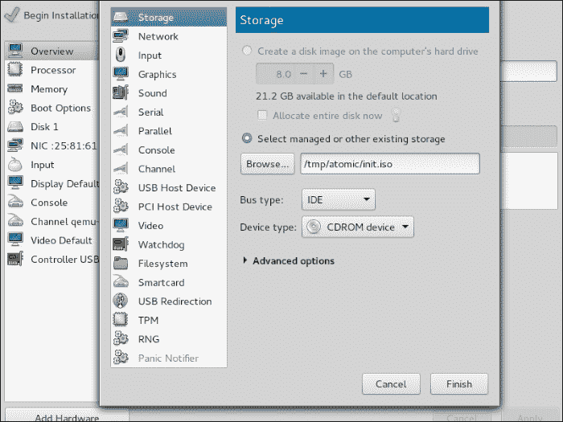
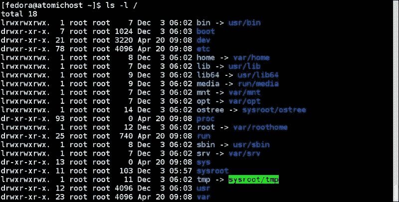
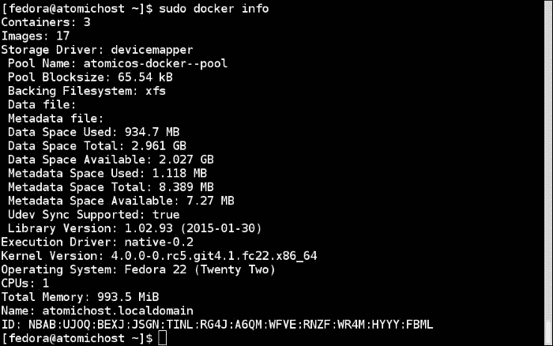
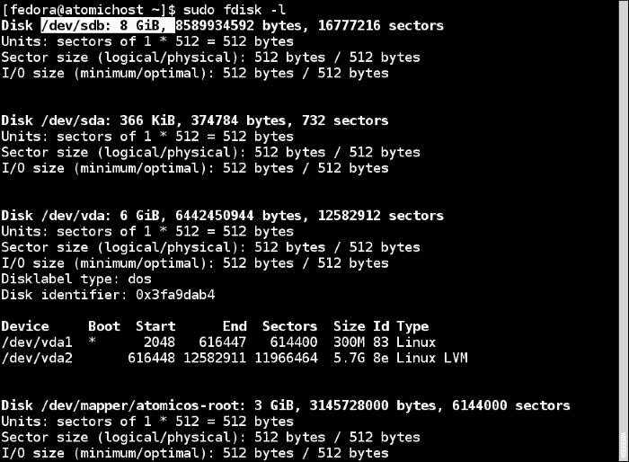
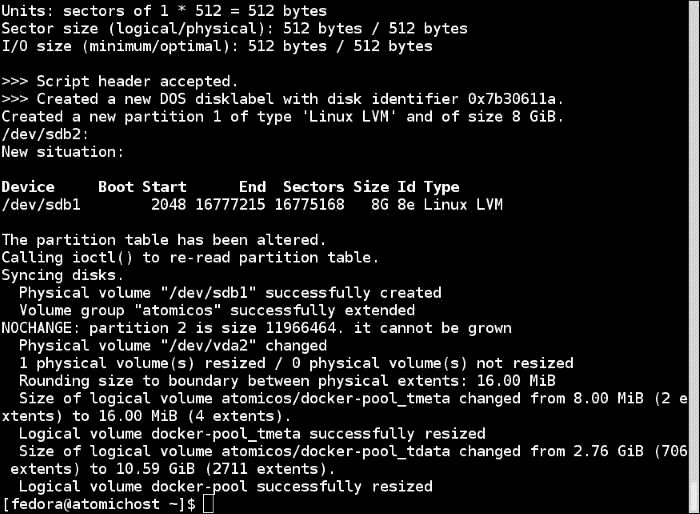
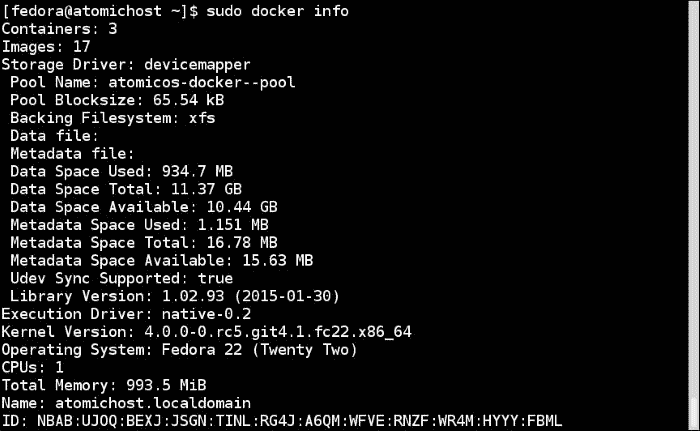
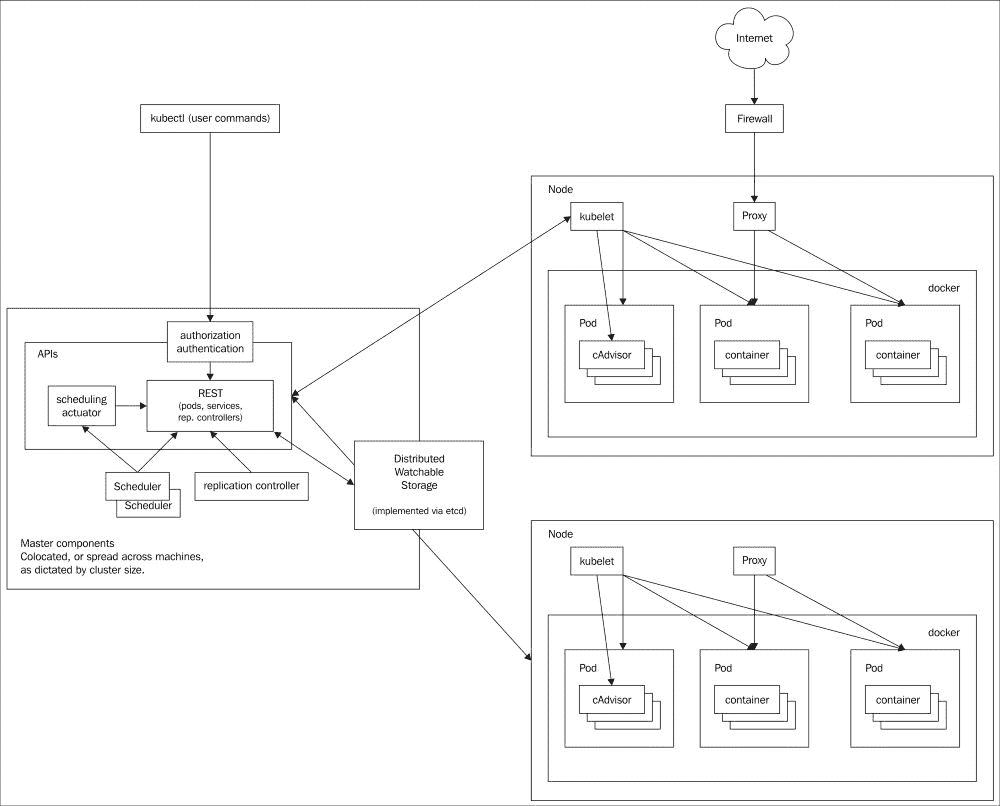

# 第八章：Docker 编排和托管平台

在本章中，我们将涵盖以下配方：

+   使用 Docker Compose 运行应用程序

+   使用 Docker Swarm 设置集群

+   为 Docker 编排设置 CoreOS

+   设置 Project Atomic 主机

+   使用 Project Atomic 进行原子更新/回滚

+   为 Project Atomic 中的 Docker 添加更多存储

+   为 Project Atomic 设置 Cockpit

+   设置 Kubernetes 集群

+   在 Kubernetes 集群中进行扩展和缩减

+   使用 Kubernetes 集群设置 WordPress

# 介绍

在单个主机上运行 Docker 可能对开发环境有好处，但当我们跨多个主机时才能发挥真正的价值。然而，这并不是一件容易的事情。您必须编排这些容器。因此，在本章中，我们将介绍一些编排工具和托管平台。

Docker Inc.宣布了两种工具：

使用 Docker Compose（[`docs.docker.com/compose`](https://docs.docker.com/compose)）创建由多个容器组成的应用程序，使用 Docker Swarm（[`docs.docker.com/swarm/`](https://docs.docker.com/swarm/)）来集群多个 Docker 主机。Docker Compose 以前被称为 Fig（[`www.fig.sh/`](http://www.fig.sh/)）。

CoreOS（[`coreos.com/`](https://coreos.com/)）创建了 etcd（[`github.com/coreos/etcd`](https://github.com/coreos/etcd)）用于一致性和服务发现，fleet（[`coreos.com/using-coreos/clustering`](https://coreos.com/using-coreos/clustering)）用于在集群中部署容器，flannel（[`github.com/coreos/flannel`](https://github.com/coreos/flannel)）用于覆盖网络。

谷歌启动了 Kubernetes（[`kubernetes.io/`](http://kubernetes.io/)）用于 Docker 编排。Kubernetes 提供了应用部署、调度、更新、维护和扩展的机制。

红帽推出了一个专门针对容器的操作系统，名为 Project Atomic（[`www.projectatomic.io/`](http://www.projectatomic.io/)），可以利用 Kubernetes 的编排能力。

甚至微软也宣布了专门为 Docker 设计的操作系统（[`azure.microsoft.com/blog/2015/04/08/microsoft-unveils-new-container-technologies-for-the-next-generation-cloud/`](http://azure.microsoft.com/blog/2015/04/08/microsoft-unveils-new-container-technologies-for-the-next-generation-cloud/)）。

Apache Mesos（[`mesos.apache.org/`](http://mesos.apache.org/)）提供了整个数据中心和云环境的资源管理和调度，还增加了对 Docker（[`mesos.apache.org/documentation/latest/docker-containerizer/`](http://mesos.apache.org/documentation/latest/docker-containerizer/)）的支持。

VMware 还推出了专门针对容器的宿主机 VMware Photon（[`vmware.github.io/photon/`](http://vmware.github.io/photon/)）。

这绝对是一个非常有趣的领域，但许多编排引擎的策略管理工具并没有让开发人员和运维人员的生活变得轻松。当他们从一个平台转移到另一个平台时，他们必须学习不同的工具和格式。如果我们能够有一种标准的方式来构建和启动复合的多容器应用程序，那将是很棒的。Project Atomic 社区似乎正在致力于一种名为 Nulecule 的平台中立规范（[`github.com/projectatomic/nulecule/`](https://github.com/projectatomic/nulecule/)）。关于 Nulecule 的一个很好的描述可以在[`www.projectatomic.io/blog/2015/05/announcing-the-nulecule-specification-for-composite-applications/`](http://www.projectatomic.io/blog/2015/05/announcing-the-nulecule-specification-for-composite-applications/)找到。

> “Nulecule 定义了打包复杂的多容器应用程序的模式和模型，引用了它们的所有依赖关系，包括单个容器映像中的编排元数据，用于构建、部署、监视和主动管理。只需创建一个带有 Nulecule 文件的容器，应用程序就会‘自动运行’。在 Nulecule 规范中，您可以在图形中定义编排提供者、容器位置和配置参数，Atomic App 实现将在提供者的帮助下将它们组合在一起。Nulecule 规范支持多个复合应用程序的聚合，它也是容器和编排引擎不可知的，可以使用任何容器和编排引擎。”

AtomicApp 是 Nulecule 规范的一个参考实现（[`github.com/projectatomic/atomicapp/`](https://github.com/projectatomic/atomicapp/)）。它可以用来引导容器应用程序的安装和运行。AtomicApp 目前支持有限数量的提供者（Docker、Kubernetes、OpenShift），但很快将添加对其他提供者的支持。

相关的是，CentOS 社区正在构建一个 CI 环境，将利用 Nulecule 和 AtomicApp。欲了解更多信息，请访问[`wiki.centos.org/ContainerPipeline`](http://wiki.centos.org/ContainerPipeline)。

所有前述的工具和平台都需要单独的章节来介绍。在本章中，我们将简要探讨 Compose、Swarm、CoreOS、Project Atomic 和 Kubernetes。

# 使用 Docker Compose 运行应用程序

Docker Compose（[`docs.docker.com/compose/`](http://docs.docker.com/compose/)）是运行组成应用程序的相互依赖容器的本地 Docker 工具。我们在一个文件中定义一个多容器应用程序，并将其提供给 Docker Compose，它会设置应用程序。在撰写本文时，Compose 仍未达到生产就绪状态。在本教程中，我们将再次使用 WordPress 作为示例应用程序来运行。

## 准备工作

确保系统上安装了 Docker 版本 1.3 或更高版本。要安装 Docker Compose，请运行以下命令：

```
$ sudo pip install docker-compose

```

## 如何做…

1.  为应用程序创建一个目录，并在其中创建`docker-compose.yml`来定义应用程序：

1.  我们从 Docker Hub 的官方 WordPress Docker 存储库（[`registry.hub.docker.com/_/wordpress/`](https://registry.hub.docker.com/_/wordpress/)）中获取了上述示例。

1.  在应用程序目录中，运行以下命令构建应用程序：

```
$ docker-compose up

```

1.  构建完成后，从`http://localhost:8080`或`http://<host-ip>:8080`访问 WordPress 安装页面。

## 它是如何工作的…

Docker Compose 会从官方 Docker 注册表下载`mariadb`和`wordpress`镜像（如果本地不存在）。首先，它会从`mariadb`镜像启动`db`容器；然后启动`wordpress`容器。接下来，它会与`db`容器进行链接，并将端口导出到主机。

## 更多内容…

我们甚至可以在 Compose 期间从 Dockerfile 构建镜像，然后将其用于应用程序。例如，要构建`wordpress`镜像，我们可以从应用程序的 Compose 目录中获取相应的 Dockerfile 和其他支持文件，并以类似的方式更新`docker-compose.yml`文件：


我们可以启动、停止、重建和获取应用程序的状态。请访问 Docker 网站上的文档。

## 另请参阅

+   Docker Compose YAML 文件参考位于[`docs.docker.com/compose/yml/`](http://docs.docker.com/compose/yml/)

+   Docker Compose 命令行参考位于[`docs.docker.com/compose/cli/`](http://docs.docker.com/compose/cli/)

+   Docker Compose GitHub 存储库位于[`github.com/docker/compose`](https://github.com/docker/compose)

# 使用 Docker Swarm 设置集群

Docker Swarm ([`docs.docker.com/swarm/`](http://docs.docker.com/swarm/))是 Docker 的本机集群。它将多个 Docker 主机分组到一个池中，可以在其中启动容器。在本教程中，我们将使用 Docker Machine ([`docs.docker.com/machine/`](http://docs.docker.com/machine/))来设置 Swarm 集群。在撰写本文时，Swarm 仍未达到生产就绪状态。如果您还记得，我们在第一章中使用 Docker Machine 在 Google Compute Engine 上设置了 Docker 主机，*介绍和安装*。为了保持简单，我们将在这里使用 VirtualBox 作为 Docker Machine 的后端来配置主机。

## 准备工作

1.  在您的系统上安装 VirtualBox ([`www.virtualbox.org/`](https://www.virtualbox.org/))。配置 VirtualBox 的说明不在本书的范围之内。

1.  下载并设置 Docker Machine。在 Fedora x86_64 上，运行以下命令：

```
$ wget  https://github.com/docker/machine/releases/download/v0.2.0/docker-machine_linux-amd64
$ sudo mv  docker-machine_linux-amd64 /usr/local/bin/docker-machine
$ chmod a+x  /usr/local/bin/docker-machine

```

## 操作方法…

1.  使用 Swarm 发现服务，我们首先需要创建一个 Swarm 令牌来唯一标识我们的集群。除了默认的托管发现服务外，Swarm 还支持不同类型的发现服务，如 etcd、consul 和 zookeeper。有关更多详细信息，请访问[`docs.docker.com/swarm/discovery/`](https://docs.docker.com/swarm/discovery/)。要使用默认的托管发现服务创建令牌，我们将首先在 VM 上使用 Docker Machine 设置 Docker 主机，然后获取令牌：

```
$ docker-machine create -d virtualbox local

```

1.  要从本地 Docker 客户端访问我们刚创建的 Docker，请运行以下命令：

```
$ eval "$(docker-machine env local)"

```

1.  要获取令牌，请运行以下命令：

```
$ docker run swarm create
7c3a21b42708cde81d99884116d68fa1

```

1.  使用前一步骤中创建的令牌，设置 Swarm 主节点：

```
$ docker-machine create  -d virtualbox  --swarm  --swarm-master  --swarm-discovery token://7c3a21b42708cde81d99884116d68fa1  swarm-master

```

1.  同样，让我们创建两个 Swarm 节点：

```
$ docker-machine create -d virtualbox  --swarm  --swarm-discovery token://7c3a21b42708cde81d99884116d68fa1 swarm-node-1
$ docker-machine create -d virtualbox  --swarm  --swarm-discovery token://7c3a21b42708cde81d99884116d68fa1 swarm-node-2

```

1.  现在，从本地 Docker 客户端连接到 Docker Swarm：

```
$ eval "$(docker-machine env swarm-master)"

```

1.  Swarm API 与 Docker 客户端 API 兼容。让我们运行`docker info`命令来查看 Swarm 的当前配置/设置：

```
$ docker info

```


如您所见，我们的集群中有三个节点：一个主节点和两个节点。

## 工作原理…

使用我们从托管发现服务获得的唯一令牌，我们在集群中注册了主节点和节点。

## 还有更多...

+   在前面的`docker info`输出中，我们还安排了策略和过滤器。有关这些的更多信息可以在[`docs.docker.com/swarm/scheduler/strategy/`](https://docs.docker.com/swarm/scheduler/strategy/)和[`docs.docker.com/swarm/scheduler/filter/`](https://docs.docker.com/swarm/scheduler/filter/)找到。这些定义了容器将在哪里运行。

+   正在积极开发以集成 Docker Swarm 和 Docker Compose，以便我们将应用指向 Swarm 集群并进行组合。然后应用将在集群上启动。访问[`github.com/docker/compose/blob/master/SWARM.md`](https://github.com/docker/compose/blob/master/SWARM.md)

## 另请参阅

+   Docker 网站上的 Swarm 文档位于[`docs.docker.com/swarm/`](https://docs.docker.com/swarm/)

+   Swarm 的 GitHub 存储库位于[`github.com/docker/swarm`](https://github.com/docker/swarm)

# 为 Docker 编排设置 CoreOS

CoreOS（[`coreos.com/`](https://coreos.com/)）是一种经过重新架构以提供运行现代基础架构堆栈所需功能的 Linux 发行版。它是 Apache 2.0 许可的。它有一个名为 CoreOS Managed Linux（[`coreos.com/products/managed-linux/`](https://coreos.com/products/managed-linux/)）的产品，CoreOS 团队为其提供商业支持。

基本上，CoreOS 提供了托管完整应用程序堆栈的平台。我们可以在不同的云提供商、裸机和虚拟机环境上设置 CoreOS。让我们来看看 CoreOS 的构建模块：

+   etcd

+   容器运行时

+   Systemd

+   Fleet

让我们详细讨论每个：

+   **etcd**：来自 etcd 的 GitHub 页面（[`github.com/coreos/etcd/#etcd`](https://github.com/coreos/etcd/#etcd)）。`etcd`是一个用于共享配置和服务发现的高可用性键值存储。它受到 Apache ZooKeeper 和 doozer 的启发，专注于以下方面：

+   **简单**：可通过 Curl 访问的用户界面 API（HTTP 加 JSON）

+   **安全**：可选的 SSL 客户端证书认证

+   **快速**：每个实例的数千次写入的基准测试

+   **可靠**：使用 Raft 进行适当的分发

它是用 Go 编写的，并使用 Raft 一致性算法（[`raftconsensus.github.io/`](https://raftconsensus.github.io/)）来管理高可用性的复制日志。etcd 可以独立于 CoreOS 使用。我们可以：

+   建立单节点或多节点集群。有关此信息，请访问[`github.com/coreos/etcd/blob/master/Documentation/clustering.md`](https://github.com/coreos/etcd/blob/master/Documentation/clustering.md)。

+   使用 CURL 和不同的库进行访问，可在[`github.com/coreos/etcd/blob/master/Documentation/libraries-and-tools.md`](https://github.com/coreos/etcd/blob/master/Documentation/libraries-and-tools.md)找到。

在 CoreOS 中，`etcd`用于协调集群。它提供了一种以一致的方式存储配置和关于服务的信息的机制。

+   **容器运行时**：CoreOS 支持 Docker 作为容器运行时环境。在 2014 年 12 月，CoreOS 宣布推出了一个新的容器运行时 Rocket ([`coreos.com/blog/rocket/`](https://coreos.com/blog/rocket/))。让我们将讨论限制在目前安装在所有 CoreOS 机器上的 Docker 上。

+   **systemd**：`systemd`是用于启动、停止和管理进程的初始化系统。在 CoreOS 中，它用于：

+   启动 Docker 容器

+   将由容器启动的服务注册到 etcd

Systemd 管理单元文件。示例单元文件如下：

```
[Unit] 
Description=Docker Application Container Engine 
Documentation=http://docs.docker.com 
After=network.target docker.socket
Requires=docker.socket

[Service] 
Type=notify 
EnvironmentFile=-/etc/sysconfig/docker 
EnvironmentFile=-/etc/sysconfig/docker-storage 
ExecStart=/usr/bin/docker -d -H fd:// $OPTIONS $DOCKER_STORAGE_OPTIONS
LimitNOFILE=1048576 
LimitNPROC=1048576 

[Install] 
WantedBy=multi-user.target 
```

此单元文件在 Fedora 21 上使用`ExecStart`中提到的命令启动 Docker 守护程序。Docker 守护程序将在`network target`和`docker socket`服务之后启动。`docker socket`是 Docker 守护程序启动的先决条件。Systemd 目标是将进程分组以便它们可以同时启动的方式。`multi-user`是前面单元文件注册的目标之一。有关更多详细信息，您可以查看 Systemd 的上游文档[`www.freedesktop.org/wiki/Software/systemd/`](http://www.freedesktop.org/wiki/Software/systemd/)。

+   **Fleet**：Fleet ([`coreos.com/using-coreos/clustering/`](https://coreos.com/using-coreos/clustering/))是控制集群级别的`systemd`的集群管理器。systemd 单元文件与一些特定于 Fleet 的属性结合起来实现目标。来自 Fleet 文档([`github.com/coreos/fleet/blob/master/Documentation/architecture.md`](https://github.com/coreos/fleet/blob/master/Documentation/architecture.md))：

> *“Fleet 集群中的每个系统都运行一个`fleetd`守护程序。每个守护程序封装了两个角色：*引擎*和*代理*。引擎主要做出调度决策，而代理执行单元。引擎和代理都使用*协调模型*，定期生成'当前状态'和'期望状态'的快照，并进行必要的工作将前者变异为后者。”*

`etcd`是`fleet`集群中唯一的数据存储。所有持久和临时数据都存储在`etcd`中；单元文件、集群存在、单元状态等。`etcd`也用于 fleet 引擎和代理之间的所有内部通信。

现在我们知道了 CoreOS 的所有构建模块。让我们在本地系统/笔记本上尝试 CoreOS。为了保持简单，我们将使用 Vagrant 来设置环境。

## 准备就绪

1.  在系统上安装 VirtualBox（[`www.virtualbox.org/`](https://www.virtualbox.org/)）和 Vagrant（[`www.vagrantup.com/`](https://www.vagrantup.com/)）。配置这两个东西的说明超出了本书的范围。

1.  克隆`coreos-vagrant`存储库：

```
$ git clone https://github.com/coreos/coreos-vagrant.git
$ cd coreos-vagrant

```

1.  将示例文件`user-data.sample`复制到`user-data`并设置引导集群的令牌：

```
$ cp user-data.sample user-data

```

1.  当我们使用多个节点配置 CoreOS 集群时，我们需要一个令牌来引导集群以选择初始的 etcd 领导者。这项服务由 CoreOS 团队免费提供。我们只需要在浏览器中打开`https://discovery.etcd.io/new`来获取令牌，并在`user-data`文件中更新如下：

1.  将`config.rb.sample`复制到`config.rb`并更改以下行：

```
$num_instances=1

```

现在应该是这样的：

```
$num_instances=3

```

这将要求 Vagrant 设置三个节点集群。默认情况下，Vagrant 配置为从 alpha 版本获取 VM 映像。我们可以通过在 Vagrantfile 中更新`$update_channel`参数将其更改为 beta 或 stable。对于这个示例，我选择了 stable。

## 操作步骤如下…

1.  运行以下命令设置集群：

```
$ vagrant up

```

现在，使用以下截图中显示的命令检查状态：


1.  使用 SSH 登录到其中一个 VM，查看服务状态，并列出集群中的机器：

```
$ vagrant ssh core-01
$ systemctl status etcd fleet
$ fleetctl list-machines

```


1.  创建一个名为`myapp.service`的服务单元文件，内容如下：

```
[Unit] 
Description=MyApp 
After=docker.service 
Requires=docker.service 

[Service] 
TimeoutStartSec=0 
ExecStartPre=-/usr/bin/docker kill busybox1 
ExecStartPre=-/usr/bin/docker rm busybox1 
ExecStartPre=/usr/bin/docker pull busybox 
ExecStart=/usr/bin/docker run --name busybox1 busybox /bin/sh -c "while true; do echo Hello World; sleep 1; done" 
ExecStop=/usr/bin/docker stop busybox1
```

1.  现在让我们提交服务进行调度并启动服务：

```
$ fleetctl submit myapp.service
$ fleetctl start myapp.service
$ fleetctl list-units

```


正如我们所看到的，我们的服务已经在集群中的一个节点上启动。

## 工作原理...

Vagrant 使用云配置文件（`user-data`）来引导 VM。由于它们具有相同的令牌来引导集群，它们选择领导者并开始操作。然后，使用`fleetctl`，这是 fleet 集群管理工具，我们提交单元文件进行调度，该文件在一个节点上启动。

## 还有更多...

+   使用此配方中的云配置文件，我们可以在所有 VM 上启动`etcd`和`fleet`。我们可以选择仅在选定的节点上运行`etcd`，然后配置运行`fleet`的工作节点以连接到 etcd 服务器。可以通过相应地设置云配置文件来完成此操作。有关更多信息，请访问[`coreos.com/docs/cluster-management/setup/cluster-architectures/`](https://coreos.com/docs/cluster-management/setup/cluster-architectures/)。

+   使用`fleet`，我们可以为高可用性配置服务。有关更多信息，请查看[`coreos.com/docs/launching-containers/launching/fleet-unit-files/`](https://coreos.com/docs/launching-containers/launching/fleet-unit-files/)。

+   尽管您的服务正在主机上运行，但您将无法从外部访问它。您需要添加某种路由器和通配符 DNS 配置，以便从外部世界访问您的服务。

## 另请参阅

+   更多详细信息，请参阅 CoreOS 文档[`coreos.com/docs/`](https://coreos.com/docs/)

+   在[`thesecretlivesofdata.com/raft`](http://thesecretlivesofdata.com/raft)上可视化 RAFT 一致性算法

+   如何配置云配置文件，请访问[`coreos.com/docs/cluster-management/setup/cloudinit-cloud-config/`](https://coreos.com/docs/cluster-management/setup/cloudinit-cloud-config/)和[`coreos.com/validate/`](https://coreos.com/validate/)

+   有关 systemd 的文档，请访问[`coreos.com/docs/launching-containers/launching/getting-started-with-systemd/`](https://coreos.com/docs/launching-containers/launching/getting-started-with-systemd/)

+   如何使用 fleet 启动容器，请访问[`coreos.com/docs/launching-containers/launching/launching-containers-fleet/`](https://coreos.com/docs/launching-containers/launching/launching-containers-fleet/)

# 设置 Project Atomic 主机

Project Atomic 通过提供端到端的解决方案来促进以应用为中心的 IT 架构，快速可靠地部署容器化应用程序，并为应用程序和主机提供原子更新和回滚。

这是通过在 Project Atomic 主机上在容器中运行应用程序来实现的，这是一种专门设计用于运行容器的轻量级操作系统。主机可以基于 Fedora、CentOS 或 Red Hat Enterprise Linux。

接下来，我们将详细介绍 Project Atomic 主机的构建模块。

+   **OSTree 和 rpm-OSTree**：OSTree ([`wiki.gnome.org/action/show/Projects/OSTree`](https://wiki.gnome.org/action/show/Projects/OSTree))是一种管理可引导、不可变和版本化文件系统树的工具。使用这个工具，我们可以构建客户端-服务器架构，其中服务器托管一个 OSTree 存储库，订阅它的客户端可以逐步复制内容。

rpm-OSTree 是一种在服务器端将 RPM 解压缩为客户端可以订阅并执行更新的 OSTree 存储库的系统。每次更新都会创建一个新的根，用于下一次重启。在更新期间，`/etc`被重新设置，`/var`则不变。

+   **容器运行时**：截至目前，Project Atomic 只支持 Docker 作为容器运行时。

+   **systemd**：正如我们在之前的配方中看到的，systemd 是一个新的 init 系统。它还帮助为完整的多租户安全性设置 SELinux 策略，并控制 Cgroups 策略，我们在第一章中看到了*介绍和安装*。

Project Atomic 使用 Kubernetes ([`kubernetes.io/`](http://kubernetes.io/))在容器主机集群上部署应用程序。Project Atomic 可以安装在裸机、云提供商、虚拟机等上。在这个配方中，让我们看看如何在 Fedora 上使用 virt-manager 在虚拟机上安装它。

## 做好准备

1.  下载图像：

```
$ wget http://download.fedoraproject.org/pub/fedora/linux/releases/test/22_Beta/Cloud/x86_64/Images/Fedora-Cloud-Atomic-22_Beta-20150415.x86_64.raw.xz

```

我已经下载了 Fedora 22 云图像*用于容器*的测试版图像。您应该在[`getfedora.org/en/cloud/download/`](https://getfedora.org/en/cloud/download/)上寻找最新的云图像*用于容器*。

1.  使用以下命令解压此图像：

```
$ xz -d Fedora-Cloud-Atomic-22_Beta-20150415.x86_64.raw.xz

```

## 如何做到这一点…

1.  我们下载了一个没有为默认用户`fedora`设置任何密码的云镜像。在启动虚拟机时，我们必须通过一个云配置文件来自定义虚拟机。为此，我们需要创建两个文件，`meta-data`和`user-data`，如下所示：

```
$ cat  meta-data
instance-id: iid-local01
local-hostname: atomichost

$ cat user-data
#cloud-config
password: atomic
ssh_pwauth: True
chpasswd: { expire: False }

ssh_authorized_keys:
- ssh-rsa AAAAB3NzaC1yc.........

```

在上面的代码中，我们需要提供完整的 SSH 公钥。然后，我们需要创建一个包含这些文件的 ISO 镜像，我们将使用它来引导虚拟机。由于我们使用的是云镜像，我们的设置将在引导过程中应用于虚拟机。这意味着主机名将设置为`atomichost`，密码将设置为`atomic`，依此类推。要创建 ISO，请运行以下命令：

```
$ genisoimage -output init.iso -volid cidata -joliet -rock user-data meta-data

```

1.  启动 virt-manager。

1.  选择**新建虚拟机**，然后导入现有的磁盘映像。输入我们之前下载的 Project Atomic 映像的路径。选择**操作系统类型**为**Linux**，**版本**为**Fedora 20/Fedora 21（或更高版本）**，然后点击**下一步**。接下来，分配 CPU 和内存，然后点击**下一步**。然后，在安装之前为虚拟机命名并选择**自定义配置**。最后，点击**完成**并查看详细信息。

1.  接下来，点击**添加硬件**，在选择**存储**后，将我们创建的 ISO（`init.iso`）文件附加到虚拟机，并选择**开始安装**：

启动后，您可以看到其主机名已正确设置，并且您将能够使用云初始化文件中给定的密码登录。默认用户是`fedora`，密码是`atomic`，如在`user-data`文件中设置的那样。

## 工作原理…

在这个示例中，我们使用`virt-manager`提供云初始化文件，使用 Project Atomic Fedora 云镜像引导了虚拟机。

## 更多内容…

+   登录后，如果在`/`目录下列出文件，你会看到大多数传统目录都链接到`/var`，因为它在升级过程中会被保留。

+   登录后，您可以像往常一样运行 Docker 命令：

```
$sudo docker run -it fedora bash

```

## 另请参阅

+   有关虚拟管理器的文档，请访问[`virt-manager.org/documentation/`](https://virt-manager.org/documentation/)

+   有关软件包系统、镜像系统和 RPM-OSTree 的更多信息，请访问[`github.com/projectatomic/rpm-ostree/blob/master/doc/background.md`](https://github.com/projectatomic/rpm-ostree/blob/master/doc/background.md)

+   Project Atomic 网站上的快速入门指南，请访问[`www.projectatomic.io/docs/quickstart/`](http://www.projectatomic.io/docs/quickstart/)

+   有关云镜像的资源，请访问[`www.technovelty.org//linux/running-cloud-images-locally.html`](https://www.technovelty.org//linux/running-cloud-images-locally.html)和[`cloudinit.readthedocs.org/en/latest/`](http://cloudinit.readthedocs.org/en/latest/)

+   如何在 Atomic 主机上设置 Kubernetes，网址为[`www.projectatomic.io/blog/2014/11/testing-kubernetes-with-an-atomic-host/`](http://www.projectatomic.io/blog/2014/11/testing-kubernetes-with-an-atomic-host/)和[`github.com/cgwalters/vagrant-atomic-cluster`](https://github.com/cgwalters/vagrant-atomic-cluster)

# 使用 Project Atomic 进行原子更新/回滚

要升级到最新版本或回滚到 Project Atomic 的旧版本，我们使用`atomic host`命令，该命令内部调用 rpm-ostree。

## 准备工作

启动并登录到 Atomic 主机。

## 如何做…

1.  启动后，运行以下命令：

```
$ atomic host status

```

您将看到有关当前正在使用的部署的详细信息。


升级，请运行以下命令：


1.  这将更改和/或添加新的软件包。升级后，我们需要重新启动系统以使用新的更新。让我们重新启动并查看结果：

正如我们所看到的，系统现在已经使用新的更新启动。位于第一行开头的`*`表示活动构建。

1.  要回滚，请运行以下命令：

```
$ sudo atomic host rollback

```

如果我们想使用旧的位，我们将不得不再次重启。

## 工作原理…

对于更新，Atomic 主机连接到托管较新构建的远程存储库，该构建将在下一次重启后下载并使用，直到用户升级或回滚。在回滚的情况下，系统上可用的旧构建将在重启后使用。

## 另请参阅

+   可以在 Project Atomic 网站的文档中找到，网址为[`www.projectatomic.io/docs/os-updates/`](http://www.projectatomic.io/docs/os-updates/)

# 在 Project Atomic 中为 Docker 添加更多存储

Atomic 主机是一个最小的发行版，因此以 6GB 的镜像分发，以保持占用空间小。这是非常少的存储空间来构建和存储大量的 Docker 镜像，因此建议为这些操作附加外部存储。

默认情况下，Docker 使用`/var/lib/docker`作为存储所有与 Docker 相关的文件（包括镜像）的默认目录。在 Project Atomic 中，我们使用直接的 LVM 卷通过 devicemapper 后端将 Docker 镜像和元数据存储在`/dev/atomicos/docker-data`和`/dev/atomicos/docker-meta`中。

因此，为了添加更多存储空间，Project Atomic 提供了一个名为`docker-storage-helper`的辅助脚本，将外部磁盘添加到现有的 LVM thin pool 中。让我们使用`docker info`命令查看当前可用于 Docker 的存储空间：



正如我们所看到的，总数据空间为 2.96 GB，总元数据空间为 8.38 MB。

## 做好准备

1.  停止 VM，如果它正在运行。

1.  向 Project Atomic VM 添加所需大小的额外磁盘。我已经添加了 8 GB。

1.  启动 VM。

1.  检查新添加的磁盘是否对 VM 可见。

## 如何操作...

1.  检查附加磁盘是否可用于 Atomic 主机 VM：

正如我们所看到的，新创建的 8 GB 磁盘对 VM 可用。

1.  由于新添加的磁盘是`/dev/sdb`，因此创建一个名为`/etc/sysconfig/docker-storage-setup`的文件，并包含以下内容：

```
DEVS="/dev/sdb"
[fedora@atomichost ~]$ cat /etc/sysconfig/docker-storage-setup
DEVS="/dev/sdb"

```

1.  运行`docker-storage-setup`命令将`/dev/sdb`添加到现有卷中：

```
$ sudo docker-storage-setup

```



1.  现在，让我们再次使用`docker info`命令查看当前可用于 Docker 的存储空间：

正如我们所看到的，总数据空间和元数据空间都增加了。

## 它是如何工作的...

该过程与扩展任何其他 LVM 卷的过程相同。我们在添加的磁盘上创建一个物理卷，将该物理卷添加到卷组中，然后扩展 LVM 卷。由于我们直接访问 Docker 中的 thin pool，因此我们不需要创建或扩展文件系统或挂载 LVM 卷。

## 还有更多...

+   除了`DEVS`选项之外，您还可以在`/etc/sysconfig/docker-storage-setup`文件中添加`VG`选项以使用不同的卷组。

+   您可以使用`DEVS`选项添加多个磁盘。

+   如果已经在卷组中的磁盘已经在`DEVS`选项中被提及，那么`docker-storage-setup`脚本将退出，因为现有设备已经创建了分区和物理卷。

+   `docker-storage-setup`脚本为`meta-data`保留了 0.1％的大小。这就是为什么我们也看到了 Metadata Space 的增加。

## 另请参阅

+   在 Project Atomic 网站上的文档[`www.projectatomic.io/docs/docker-storage-recommendation/`](http://www.projectatomic.io/docs/docker-storage-recommendation/)

+   在 Project Atomic 上支持的文件系统[`www.projectatomic.io/docs/filesystems/`](http://www.projectatomic.io/docs/filesystems/)

# 为 Project Atomic 设置 Cockpit

Cockpit ([`cockpit-project.org/`](http://cockpit-project.org/))是一个服务器管理器，可以通过 Web 浏览器轻松管理 GNU/Linux 服务器。它也可以用来管理 Project Atomic 主机。一个 Cockpit 实例可以管理多个主机。Cockpit 不会默认随最新的 Project Atomic 一起提供，您需要将其作为**超级特权容器**（**SPC**）启动。SPC 是专门构建的容器，以关闭安全性运行（`--privileged`）；它关闭一个或多个命名空间或将主机 OS 的“卷挂载到”容器中的部分。有关 SPC 的更多详细信息，请参阅[`developerblog.redhat.com/2014/11/06/introducing-a-super-privileged-container-concept/`](https://developerblog.redhat.com/2014/11/06/introducing-a-super-privileged-container-concept/)和[`www.youtube.com/watch?v=eJIeGnHtIYg`](https://www.youtube.com/watch?v=eJIeGnHtIYg)。

因为 Cockpit 作为 SPC 运行，所以可以访问容器内管理原子主机所需的资源。

## 准备工作

设置 Project Atomic 主机并登录。

## 如何操作…

1.  运行以下命令启动 Cockpit 容器：

```
[fedora@atomichost ~]$ sudo atomic run stefwalter/cockpit-ws

```


1.  打开浏览器（`http://<VM IP>:9090`）并使用默认用户/密码`fedora/atomic`登录。登录后，您可以选择当前主机进行管理。您将看到如下所示的屏幕：

## 工作原理…

在这里，我们使用`atomic`命令而不是`docker`命令来启动容器。让我们看看 Cockpit Dockerfile([`github.com/fedora-cloud/Fedora-Dockerfiles/blob/master/cockpit-ws/Dockerfile`](https://github.com/fedora-cloud/Fedora-Dockerfiles/blob/master/cockpit-ws/Dockerfile))，看看为什么我们这样做。在 Dockerfile 中，您将看到一些指令：

```
LABEL INSTALL /usr/bin/docker run -ti --rm --privileged -v /:/host IMAGE /container/atomic-install
LABEL UNINSTALL /usr/bin/docker run -ti --rm --privileged -v /:/host IMAGE /cockpit/atomic-uninstall
LABEL RUN /usr/bin/docker run -d --privileged --pid=host -v /:/host IMAGE /container/atomic-run --local-ssh
```

如果您回忆起第二章中的*使用 Docker 容器*和第三章中的*使用 Docker 镜像*，我们可以使用标签为镜像和容器分配元数据。这里的标签是`INSTALL`、`UNINSTALL`和`RUN`。`atomic`命令是 Project Atomic 特有的命令，它读取这些标签并执行操作。由于容器作为 SPC 运行，因此不需要从主机到容器的端口转发。有关`atomic`命令的更多详细信息，请访问[`developerblog.redhat.com/2015/04/21/introducing-the-atomic-command/`](https://developerblog.redhat.com/2015/04/21/introducing-the-atomic-command/)。

## 还有更多...

您可以通过 GUI 执行几乎所有管理员任务。您可以通过这个管理 Docker 镜像/容器。您可以执行以下操作：

+   拉取镜像

+   启动/停止容器

您还可以将其他机器添加到同一个 Cockpit 实例中，以便从一个中央位置管理它们。

## 另请参阅

+   Cockpit 文档位于[`files.cockpit-project.org/guide/`](http://files.cockpit-project.org/guide/)

# 设置 Kubernetes 集群

Kubernetes 是一个开源的容器编排工具，可以跨集群的多个节点进行操作。目前，它只支持 Docker。它是由 Google 发起的，现在其他公司的开发人员也在为其做出贡献。它提供了应用部署、调度、更新、维护和扩展的机制。Kubernetes 的自动放置、自动重启、自动复制功能确保了应用程序的期望状态得以维持，这是由用户定义的。用户通过 YAML 或 JSON 文件定义应用程序，我们稍后会看到。这些 YAML 和 JSON 文件还包含 API 版本（`apiVersion`字段）来识别模式。以下是 Kubernetes 的架构图：



[`raw.githubusercontent.com/GoogleCloudPlatform/kubernetes/master/docs/architecture.png`](https://raw.githubusercontent.com/GoogleCloudPlatform/kubernetes/master/docs/architecture.png)

让我们来看看 Kubernetes 的一些关键组件和概念。

+   **Pods**：Pod 由一个或多个容器组成，是 Kubernetes 的部署单元。Pod 中的每个容器与同一 Pod 中的其他容器共享不同的命名空间。例如，Pod 中的每个容器共享相同的网络命名空间，这意味着它们可以通过 localhost 进行通信。

+   **节点/从属节点**：节点，以前被称为从属节点，是 Kubernetes 集群中的工作节点，并通过主节点进行管理。Pod 被部署在具有运行它们所需服务的节点上。

+   docker，用于运行容器

+   kubelet，用于与主节点交互

+   代理（kube-proxy），将服务连接到相应的 Pod

+   **主节点**：主节点托管集群级别的控制服务，例如以下内容：

+   **API 服务器**：具有用于与主节点和节点交互的 RESTful API。这是唯一与 etcd 实例通信的组件。

+   **调度器**：在集群中调度作业，例如在节点上创建 Pod。

+   **复制控制器**：确保用户指定数量的 Pod 副本在任何给定时间都在运行。要使用复制控制器管理副本，我们必须定义一个配置文件，其中包含 Pod 的副本计数。

主节点还与 etcd 通信，etcd 是一个分布式键值对。etcd 用于存储配置信息，主节点和节点都使用这些信息。etcd 的 watch 功能用于通知集群中的更改。etcd 可以托管在主节点上或不同的一组系统上。

+   **服务**：在 Kubernetes 中，每个 Pod 都有自己的 IP 地址，并且根据复制控制器的配置，Pod 会不时地被创建和销毁。因此，我们不能依赖于 Pod 的 IP 地址来为应用程序提供服务。为了解决这个问题，Kubernetes 定义了一个抽象，定义了一组逻辑 Pod 和访问它们的策略。这个抽象被称为服务。标签用于定义服务管理的逻辑集合。

+   **标签**：标签是可以附加到对象的键值对，使用它们可以选择对象的子集。例如，服务可以选择具有标签`mysql`的所有 Pod。

+   **卷**: 卷是一个对 pod 中的容器可访问的目录。它类似于 Docker 卷，但不完全相同。Kubernetes 支持不同类型的卷，其中一些是 EmptyDir（临时）、HostDir、GCEPersistentDisk 和 NFS。正在积极开发以支持更多类型的卷。更多细节可以在[`github.com/GoogleCloudPlatform/kubernetes/blob/master/docs/volumes.md`](https://github.com/GoogleCloudPlatform/kubernetes/blob/master/docs/volumes.md)找到。

Kubernetes 可以安装在虚拟机、物理机和云上。要查看完整的矩阵，请查看[`github.com/GoogleCloudPlatform/kubernetes/tree/master/docs/getting-started-guides`](https://github.com/GoogleCloudPlatform/kubernetes/tree/master/docs/getting-started-guides)。在这个示例中，我们将看到如何在虚拟机上使用 VirtualBox 提供程序安装它。这个示例和接下来关于 Kubernetes 的示例是在 Kubernetes 的 v0.17.0 上尝试的。

## 准备工作

1.  从[`www.vagrantup.com/downloads.html`](http://www.vagrantup.com/downloads.html)安装最新的 Vagrant >= 1.6.2。

1.  从[`www.virtualbox.org/wiki/Downloads`](https://www.virtualbox.org/wiki/Downloads)安装最新的 VirtualBox。如何设置这个的详细说明超出了本书的范围。

## 如何做...

1.  运行以下命令在 Vagrant 虚拟机上设置 Kubernetes：

```
$ export KUBERNETES_PROVIDER=vagrant
$ export VAGRANT_DEFAULT_PROVIDER=virtualbox
$ curl -sS https://get.k8s.io | bash

```

## 它是如何工作的...

从`curl`命令下载的 bash 脚本首先下载最新的 Kubernetes 版本，然后运行`./kubernetes/cluster/kube-up.sh` bash 脚本来设置 Kubernetes 环境。由于我们已经指定 Vagrant 为`KUBERNETES_PROVIDER`，脚本首先下载 Vagrant 镜像，然后使用 Salt ([`saltstack.com/`](http://saltstack.com/)) 配置一个主节点和一个节点（minion）虚拟机。初始设置需要几分钟来运行。

Vagrant 在`~/.kubernetes_vagrant_auth`中创建一个凭据文件进行身份验证。

## 还有更多...

类似于`./cluster/kube-up.sh`，还有其他辅助脚本可以在主机上执行不同的操作。确保你在`kubernetes`目录中，在运行以下命令时已经安装了之前的安装：

+   获取节点列表：

```
$ ./cluster/kubectl.sh get nodes

```

+   获取 pod 的列表：

```
$ ./cluster/kubectl.sh get pods

```

+   获取服务列表：

```
$ ./cluster/kubectl.sh get services

```

+   获取复制控制器的列表：

```
$ ./cluster/kubectl.sh get replicationControllers

```

+   销毁 vagrant 集群：

```
$ ./cluster/kube-down.sh

```

+   然后恢复 vagrant 集群：

```
$ ./cluster/kube-up.sh

```

您将看到一些列出的`pods`，`services`和`replicationControllers`，因为 Kubernetes 为内部使用创建它们。

## 另请参阅

+   在[`github.com/GoogleCloudPlatform/kubernetes/blob/master/docs/getting-started-guides/vagrant.md`](https://github.com/GoogleCloudPlatform/kubernetes/blob/master/docs/getting-started-guides/vagrant.md)设置 Vagrant 环境

+   [`github.com/GoogleCloudPlatform/kubernetes/blob/master/docs/user-guide.md`](https://github.com/GoogleCloudPlatform/kubernetes/blob/master/docs/user-guide.md)的 Kubernetes 用户指南

+   在[`github.com/GoogleCloudPlatform/kubernetes/blob/master/docs/api-conventions.md`](https://github.com/GoogleCloudPlatform/kubernetes/blob/master/docs/api-conventions.md)了解 Kubernetes API 约定

# 在 Kubernetes 集群中进行扩展和缩减

在前一节中，我们提到复制控制器确保用户指定数量的 pod 副本在任何给定时间都在运行。要使用复制控制器管理副本，我们必须定义一个具有 pod 副本计数的配置文件。此配置可以在运行时更改。

## 准备就绪

确保 Kubernetes 设置正在按照前面的配方运行，并且您在`kubernetes`目录中，该目录是使用前面的安装创建的。

## 如何做…

1.  启动带有 3 个副本计数的`nginx`容器：

```
$ ./cluster/kubectl.sh run-container my-nginx --image=nginx --replicas=3 --port=80

```


这将启动`nginx`容器的三个副本。列出 pod 以获取状态：

```
$  ./cluster/kubectl.sh get pods

```

1.  获取复制控制器配置：

```
$ ./cluster/kubectl.sh get replicationControllers

```


如您所见，我们有一个`my-nginx`控制器，其副本计数为 3。还有一个`kube-dns`的复制控制器，我们将在下一个配方中探索。

1.  请求复制控制器服务将副本缩减为 1 并更新复制控制器：

```
$ ./cluster/kubectl.sh resize rc my-nginx –replicas=1
$ ./cluster/kubectl.sh get rc

```


1.  获取 pod 列表以进行验证；您应该只看到一个`nginx`的 pod：

```
$  ./cluster/kubectl.sh get pods

```

## 工作原理…

我们请求在主节点上运行的复制控制器服务更新 pod 的副本，这将更新配置并要求节点/从节点相应地进行调整以遵守调整大小。

## 还有更多…

获取服务：

```
$ ./cluster/kubectl.sh get services

```


正如你所看到的，我们之前启动的`nginx`容器没有定义任何服务。这意味着虽然我们有一个正在运行的容器，但我们无法从外部访问它们，因为相应的服务没有定义。

## 另请参阅

+   在[`github.com/GoogleCloudPlatform/kubernetes/blob/master/docs/getting-started-guides/vagrant.md`](https://github.com/GoogleCloudPlatform/kubernetes/blob/master/docs/getting-started-guides/vagrant.md)设置 Vagrant 环境

+   [`github.com/GoogleCloudPlatform/kubernetes/blob/master/docs/user-guide.md`](https://github.com/GoogleCloudPlatform/kubernetes/blob/master/docs/user-guide.md)中的 Kubernetes 用户指南

# 在 Kubernetes 集群中设置 WordPress

在这个教程中，我们将使用 Kubernetes GitHub 中提供的 WordPress 示例([`github.com/GoogleCloudPlatform/kubernetes/tree/master/examples/mysql-wordpress-pd`](https://github.com/GoogleCloudPlatform/kubernetes/tree/master/examples/mysql-wordpress-pd))。给定的示例需要一些更改，因为我们将在 Vagrant 环境中运行它，而不是默认的 Google Compute 引擎。此外，我们将登录到 master 并使用`kubectl`二进制文件，而不是使用辅助函数（例如，`<kubernetes>/cluster/kubectl.sh`）。

## 准备工作

+   确保 Kubernetes 集群已按照上一个教程中描述的那样设置。

+   在安装过程中下载的`kubernetes`目录中，您将找到一个包含许多示例的 examples 目录。让我们转到`mysql-wordpress-pd`目录：

```
$ cd kubernetes/examples/mysql-wordpress-pd
$  ls *.yaml
mysql-service.yaml mysql.yaml wordpress-service.yaml  wordpress.yaml

```

+   这些`.yaml`文件分别描述了`mysql`和`wordpress`的 pod 和服务。

+   在 pod 文件（`mysql.yaml`和`wordpress.yaml`）中，您将找到关于卷和相应`volumeMount`文件的部分。原始示例假定您可以访问 Google Compute Engine 并且已经设置了相应的存储。为简单起见，我们将不设置它，而是使用`EmptyDir`卷选项的临时存储。供参考，我们的`mysql.yaml`将如下所示：

+   对`wordpress.yaml`进行类似的更改。

## 操作步骤…

1.  通过 SSH 登录到 master 节点并查看正在运行的 pod：

```
$ vagrant ssh master
$ kubectl get pods

```


`kube-dns-7eqp5` pod 包含三个容器：`etcd`、`kube2sky`和`skydns`，用于配置内部 DNS 服务器以进行服务名到 IP 的解析。我们稍后会在这个示例中看到它的运行。

在这个示例中使用的 Vagrantfile 是这样创建的，我们之前创建的`kubernetes`目录在 VM 下被共享为`/vagrant`，这意味着我们对主机系统所做的更改也会在这里可见。

1.  从主节点创建`mysql` pod 并检查运行中的 pod：

```
$ kubectl create -f /vagrant/examples/mysql-wordpress-pd/mysql.yaml
$ kubectl get pods

```


我们可以看到，一个名为`mysql`的新 pod 已经被创建，并且正在运行在主机`10.245.1.3`上，这是我们的节点（minion）。

1.  现在让我们为`mysql`创建服务并查看所有服务：

```
$ kubectl create -f /vagrant/examples/mysql-wordpress-pd/mysql-service.yaml
$ kubectl get services

```


我们可以看到，一个名为`mysql`的服务已经被创建。每个服务都有一个虚拟 IP。除了`kubernetes`服务，我们还看到一个名为`kube-dns`的服务，它被用作我们之前看到的`kube-dns` pod 的服务名。

1.  类似于`mysql`，让我们为`wordpress`创建一个 pod：

```
$ kubectl create -f /vagrant/examples/mysql-wordpress-pd/wordpress.yaml

```

使用这个命令，后台会发生一些事情：

+   `wordpress`镜像从官方 Docker 注册表中下载并运行容器。

+   默认情况下，每当一个 pod 启动时，所有现有服务的信息都会导出为环境变量。例如，如果我们登录到`wordpress` pod 并查找`MYSQL`特定的环境变量，我们会看到类似以下的内容：

+   当 WordPress 容器启动时，它运行`/entrypoint.sh`脚本，该脚本查找之前提到的环境变量来启动服务。[`github.com/docker-library/wordpress/blob/master/docker-entrypoint.sh`](https://github.com/docker-library/wordpress/blob/master/docker-entrypoint.sh)。

+   通过`kube-dns`服务，`wordpress`的 PHP 脚本能够进行反向查找以继续向前进行。

1.  启动 pod 后，这里的最后一步是设置`wordpress`服务。在默认示例中，你会在服务文件`(/vagrant/examples/mysql-wordpress-pd/mysql-service.yaml)`中看到类似以下的条目：

```
createExternalLoadBalancer: true
```

这篇文章是为了记住这个示例将在 Google Compute Engine 上运行。所以这里不适用。我们需要做的是像下面这样做一个条目：

```
publicIPs: 
    - 10.245.1.3
```

我们用节点的公共 IP 替换了负载均衡器的条目，这在我们的情况下就是节点（minion）的 IP 地址。因此，`wordpress`文件看起来会像下面这样：


1.  要启动`wordpress`服务，请从主节点上运行以下命令：

```
$ kubectl create -f /vagrant/examples/mysql-wordpress-pd/wordpress-service.yaml

```


我们可以看到我们的 service 也可以通过节点（minion）IP 访问。

1.  要验证一切是否正常工作，我们可以在主节点上安装 links 软件包，通过它我们可以通过命令行浏览 URL 并连接到我们提到的公共 IP：

```
$ sudo yum install links -y
$ links 10.245.1.3

```

有了这些，你应该能看到`wordpress`安装页面。

## 工作原理...

在这个示例中，我们首先创建了一个`mysql`的 pod 和 service。之后，我们将它连接到了一个`wordpress`的 pod，并且为了访问它，我们创建了一个`wordpress`的 service。每个 YAML 文件都有一个`kind`键，用来定义它是什么类型的对象。例如，在 pod 文件中，`kind`被设置为 pod，在 service 文件中，被设置为 service。

## 还有更多...

+   在这个示例设置中，我们只有一个节点（minion）。如果你登录进去，你会看到所有正在运行的容器：

```
$ vagrant ssh minion-1
$ sudo docker ps

```

+   在这个示例中，我们没有配置复制控制器。我们可以通过创建它们来扩展这个示例。

## 另请参阅

+   在[设置 Vagrant 环境](https://github.com/GoogleCloudPlatform/kubernetes/blob/master/docs/getting-started-guides/vagrant.md)上

+   [Kubernetes 用户指南](https://github.com/GoogleCloudPlatform/kubernetes/blob/master/docs/user-guide.md)

+   在[kube-dns](https://github.com/GoogleCloudPlatform/kubernetes/tree/master/cluster/addons/dns)上的文档
