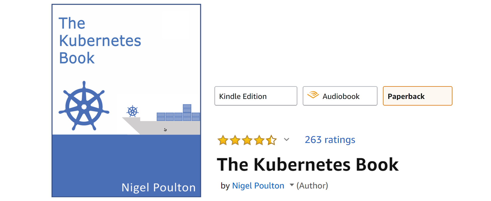

## 第三章：1：从 3 万英尺高空看容器

容器绝对是一种“东西”。

在这一章中，我们将深入讨论一些问题：为什么我们需要容器，它们对我们有什么作用，以及我们在哪里可以使用它们。

### 糟糕的旧日子

应用程序推动业务。如果应用程序出现故障，业务也会出现故障。有时甚至会破产。这些说法每天都更加真实！

大多数应用程序在服务器上运行。在过去，我们只能在一台服务器上运行一个应用程序。Windows 和 Linux 的开放系统世界没有技术能够安全地在同一台服务器上运行多个应用程序。

所以，故事通常是这样的……每当业务需要一个新的应用程序时，IT 部门就会去购买一台新的服务器。而大多数情况下，没有人知道新应用程序的性能要求！这意味着在选择要购买的服务器型号和大小时，IT 部门必须进行猜测。

因此，IT 部门只能做一件事——购买具有很强韧性的大型服务器。毕竟，任何人都不想要的最后一件事，包括企业在内，就是服务器性能不足。性能不足的服务器可能无法执行交易，这可能导致失去客户和收入。因此，IT 部门通常会购买大型服务器。这导致大量服务器的潜在容量只有 5-10%左右。**这是对公司资本和资源的悲剧性浪费！**

### 你好，VMware！

在这一切之中，VMware 公司给世界带来了一份礼物——虚拟机（VM）。几乎一夜之间，世界变成了一个更美好的地方！我们终于有了一种技术，可以让我们在单个服务器上安全地运行多个业务应用程序。庆祝活动开始了！

这改变了游戏规则！IT 部门不再需要在业务要求新应用程序时每次都采购全新的超大型服务器。往往情况是，他们可以在现有的服务器上运行新的应用程序，这些服务器原本还有剩余的容量。

突然之间，我们可以从现有的企业资产中挤出大量的价值，比如服务器，这样公司的投资就能得到更大的回报。

### 虚拟机的缺点

但是……总会有一个“但是”！虚拟机虽然很棒，但远非完美！

每个虚拟机都需要专用的操作系统是一个重大缺陷。每个操作系统都会消耗 CPU、RAM 和存储空间，否则这些资源本可以用来运行更多的应用程序。每个操作系统都需要打补丁和监控。而且在某些情况下，每个操作系统都需要许可证。所有这些都是运营支出和资本支出的浪费。

VM 模型也面临其他挑战。虚拟机启动速度慢，可移植性不佳——在不同的虚拟化平台和云平台之间迁移和移动虚拟机工作负载比预期的更困难。

### 你好，容器！

长期以来，像谷歌这样的大型网络规模的参与者一直在使用容器技术来解决虚拟机模型的缺陷。

在容器模型中，容器大致类似于虚拟机。主要区别在于每个容器不需要自己的完整操作系统。事实上，单个主机上的所有容器共享一个操作系统。这释放了大量的系统资源，如 CPU、RAM 和存储。它还减少了潜在的许可成本，并减少了操作系统补丁和其他维护的开销。最终结果：在资本支出和运营支出方面节省了开支。

容器启动也很快，而且具有超高的可移植性。将容器工作负载从笔记本电脑移动到云端，然后再移动到虚拟机或裸金属在数据中心中都非常容易。

### Linux 容器

现代容器起源于 Linux 世界，是许多人长期努力工作的成果。举一个例子，Google LLC 为 Linux 内核贡献了许多与容器相关的技术。没有这些以及其他的贡献，我们今天就不会有现代容器。

近年来推动容器大规模增长的一些主要技术包括：**内核命名空间**、**控制组**、**联合文件系统**，当然还有**Docker**。再次强调之前所说的——现代容器生态系统深受许多个人和组织的影响，他们为我们当前所建立的坚实基础做出了巨大贡献。谢谢！

尽管如此，容器仍然复杂，并且超出了大多数组织的范围。直到 Docker 出现，容器才真正实现了民主化，并且为大众所能接触。

> * 有许多类似于容器的操作系统虚拟化技术，早于 Docker 和现代容器。有些甚至可以追溯到主机上的 System/360。BSD Jails 和 Solaris Zones 是一些其他众所周知的 Unix 类型容器技术的例子。然而，在本书中，我们将限制我们的讨论和评论在 Docker 所推广的*现代容器*上。

### 你好，Docker！

我们将在下一章更详细地讨论 Docker。但现在，可以说 Docker 是使 Linux 容器对普通人可用的魔法。换句话说，Docker，Inc.让容器变得简单！

### Windows 容器

在过去的几年里，微软公司非常努力地将 Docker 和容器技术带到 Windows 平台上。

在撰写本文时，Windows 容器可用于 Windows 10 和 Windows Server 2016 平台。在实现这一点时，微软与 Docker，Inc.和社区密切合作。

实现容器所需的 Windows 核心内核技术统称为*Windows 容器*。用于处理这些*Windows 容器*的用户空间工具是 Docker。这使得 Windows 上的 Docker 体验几乎与 Linux 上的 Docker 完全相同。这样，熟悉来自 Linux 平台的 Docker 工具集的开发人员和系统管理员将感到在使用 Windows 容器时如同在家一样。

**本书的修订版本包括了许多实验练习的 Linux 和 Windows 示例。**

### Windows 容器与 Linux 容器

重要的是要理解，运行的容器共享其所在主机的内核。这意味着设计为在具有 Windows 内核的主机上运行的容器化应用程序将无法在 Linux 主机上运行。这意味着您可以在高层次上这样考虑——Windows 容器需要 Windows 主机，而 Linux 容器需要 Linux 主机。然而，事情并不那么简单…

在撰写本文时，可以在 Windows 机器上运行 Linux 容器。例如，*Docker for Windows*（Docker，Inc.为 Windows 10 设计的产品）可以在*Windows 容器*和*Linux 容器*之间切换模式。这是一个发展迅速的领域，您应该查阅 Docker 文档以获取最新信息。

### Mac 容器呢？

目前还没有 Mac 容器这样的东西。

但是，您可以使用*Docker for Mac*在 Mac 上运行 Linux 容器。这通过在 Mac 上无缝运行您的容器在轻量级 Linux 虚拟机内实现。这在开发人员中非常受欢迎，他们可以轻松地在 Mac 上开发和测试他们的 Linux 容器。

### Kubernetes 呢？

Kubernetes 是 Google 的一个开源项目，迅速成为容器化应用程序的主要编排器。这只是一种花哨的说法，*Kubernetes 是一个重要的软件，帮助我们部署我们的容器化应用程序并使其保持运行*。

在撰写本文时，Kubernetes 使用 Docker 作为其默认容器运行时 - Kubernetes 的一部分，用于启动和停止容器，以及拉取镜像等。然而，Kubernetes 具有可插拔的容器运行时接口，称为 CRI。这使得很容易将 Docker 替换为不同的容器运行时。在未来，Docker 可能会被`containerd`替换为 Kubernetes 中的默认容器运行时。本书后面会更多介绍`containerd`。

目前，关于 Kubernetes 需要知道的重要事情是，它是一个比 Docker 更高级的平台，目前使用 Docker 进行其低级容器相关操作。

查看我的 Kubernetes 书和我的**Getting Started with Kubernetes** [视频培训课程](https://app.pluralsight.com/library/courses/getting-started-kubernetes/)，了解更多关于 Kubernetes 的信息。

### 章节总结

我们曾经生活在这样一个世界中，每当业务需要一个新的应用程序时，我们就必须为其购买全新的服务器。然后 VMware 出现了，使 IT 部门能够从新的和现有的公司 IT 资产中获得更多价值。但是，尽管 VMware 和虚拟机模型很好，但并不完美。在 VMware 和虚拟化技术的成功之后，出现了一种更新更高效、轻量级的虚拟化技术，称为容器。但最初容器很难实现，并且只在拥有 Linux 内核工程师的网络巨头的数据中心中找到。然后 Docker Inc.出现了，突然之间容器虚拟化技术就面向大众了。

说到 Docker...让我们去找出 Docker 是谁、是什么以及为什么！
