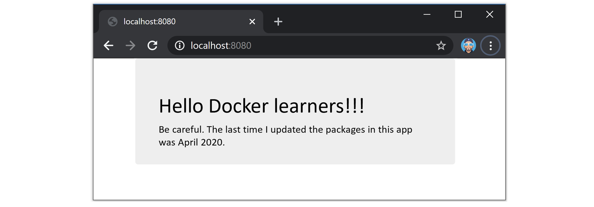
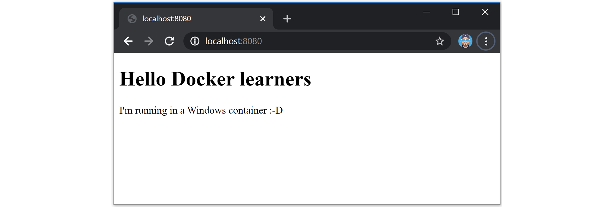

# 第五章：大局观

本章的目的是在我们深入研究后面的章节之前，快速描绘 Docker 的全貌。

我们将把这一章分为两部分：

+   运维视角

+   开发者视角

在运维视角部分，我们将下载一个镜像，启动一个新的容器，登录到新的容器中，在其中运行一个命令，然后销毁它。

在开发者视角部分，我们将更专注于应用程序。我们将从 GitHub 上拉取一些应用代码，检查一个 Dockerfile，将应用程序容器化，作为容器运行它。

这两个部分将让您对 Docker 的全貌有一个很好的了解，以及一些主要组件是如何组合在一起的。**建议您阅读这两部分，以获得*开发*和*运维*的视角。** DevOps？

如果我们在这里做的一些事情对您来说是全新的，不要担心。我们并不打算在本章结束时让您成为专家。这是为了让您对事物有一个*感觉* - 为您做好准备，以便在后面的章节中，当我们深入了解细节时，您对各个部分是如何组合在一起的有一个概念。

您只需要一个带有互联网连接的单个 Docker 主机来跟随我们。这可以是 Linux 或 Windows，无论是您笔记本电脑上的虚拟机、公共云中的实例，还是您数据中心中的裸金属服务器都无所谓。它只需要运行 Docker 并连接到互联网。我们将使用 Linux 和 Windows 来展示示例！

另一个快速获取 Docker 的好方法是使用 Play With Docker（PWD）。Play With Docker 是一个基于 Web 的 Docker 游乐场，您可以免费使用。只需将您的 Web 浏览器指向 https://play-with-docker.com/，您就可以开始使用（您可能需要一个 Docker Hub 帐户才能登录）。这是我最喜欢的快速启动临时 Docker 环境的方法！

### 运维视角

当您安装 Docker 时，您会得到两个主要组件：

+   Docker 客户端

+   Docker 守护程序（有时被称为“服务器”或“引擎”）

守护程序实现了[Docker Engine API](https://docs.docker.com/engine/api/v1.35/)。

在默认的 Linux 安装中，客户端通过本地 IPC/Unix 套接字`/var/run/docker.sock`与守护程序进行通信。在 Windows 上，这是通过命名管道`npipe:////./pipe/docker_engine`进行的。您可以使用`docker version`命令来测试客户端和守护程序（服务器）是否正在运行并相互通信。

```
> docker version
Client:
 Version:       18.01.0-ce
 API version:   1.35
 Go version:    go1.9.2
 Git commit:    03596f5
 Built: Wed Jan 10 20:11:05 2018
 OS/Arch:       linux/amd64
 Experimental:  false
 Orchestrator:  swarm

Server:
 Engine:
  Version:      18.01.0-ce
  API version:  1.35 (minimum version 1.12)
  Go version:   go1.9.2
  Git commit:   03596f5
  Built:        Wed Jan 10 20:09:37 2018
  OS/Arch:      linux/amd64
  Experimental: false 
```

“如果您从`Client`和`Server`那里得到了响应，那就可以继续了。如果您使用 Linux 并且从服务器组件那里得到了错误响应，请尝试在命令前加上`sudo`再次运行命令：`sudo docker version`。如果使用`sudo`可以正常工作，您需要将您的用户帐户添加到本地`docker`组，或者在本书的其余命令前加上`sudo`。

#### 图像

将 Docker 图像视为包含操作系统文件系统和应用程序的对象是很有用的。如果您在运营中工作，这就像一个虚拟机模板。虚拟机模板本质上是一个已停止的虚拟机。在 Docker 世界中，图像实际上是一个已停止的容器。如果您是开发人员，您可以将图像视为*类*。

在您的 Docker 主机上运行`docker image ls`命令。

```
$ docker image ls
REPOSITORY    TAG        IMAGE ID       CREATED       SIZE 
```

“如果您是从新安装的 Docker 主机或 Play With Docker 上进行操作，您将没有任何图像，并且看起来像上面的输出一样。”

将图像放入 Docker 主机称为“拉取”。如果您正在使用 Linux，拉取`ubuntu:latest`镜像。如果您正在使用 Windows，拉取`microsoft/powershell:nanoserver`镜像。

```
`latest``:` `Pulling` `from` `library``/``ubuntu`
`50``aff78429b1``:` `Pull` `complete`
`f6d82e297bce``:` `Pull` `complete`
`275``abb2c8a6f``:` `Pull` `complete`
`9``f15a39356d6``:` `Pull` `complete`
`fc0342a94c89``:` `Pull` `complete`
`Digest``:` `sha256``:``fbaf303``...``c0ea5d1212`
`Status``:` `Downloaded` `newer` `image` `for` `ubuntu``:``latest` 
```

再次运行`docker image ls`命令以查看您刚刚拉取的图像。

```
$ docker images
REPOSITORY      TAG      IMAGE ID        CREATED         SIZE
ubuntu          latest   00fd29ccc6f1    `3` weeks ago     111MB 
```

“我们将在后面的章节中详细介绍图像存储的位置和其中的内容。现在，知道图像包含足够的操作系统（OS）以及运行其设计用途的任何应用程序所需的所有代码和依赖关系就足够了。我们拉取的`ubuntu`图像包含精简版的 Ubuntu Linux 文件系统，包括一些常见的 Ubuntu 实用程序。在 Windows 示例中拉取的`microsoft/powershell`图像包含一个带有 PowerShell 的 Windows Nano Server 操作系统。”

如果您拉取一个应用程序容器，比如`nginx`或`microsoft/iis`，您将获得一个包含一些操作系统以及运行`NGINX`或`IIS`的代码的镜像。

值得注意的是，每个图像都有自己独特的 ID。在使用图像时，您可以使用`ID`或名称来引用它们。如果您使用图像 ID，通常只需输入 ID 的前几个字符就足够了——只要它是唯一的，Docker 就会知道您指的是哪个图像。

#### 容器

现在我们在本地拉取了一个镜像，我们可以使用`docker container run`命令从中启动一个容器。

对于 Linux：

```
`$` `docker` `container` `run` `-``it` `ubuntu``:``latest` `/``bin``/``bash`
`root``@6``dc20d508db0``:``/``#` 
```

对于 Windows：

```
> docker container run -it microsoft/powershell:nanoserver pwsh.exe

Windows PowerShell
Copyright (C) 2016 Microsoft Corporation. All rights reserved.
PS C:\> 
```

仔细观察前面命令的输出。您应该注意到每个实例中 shell 提示符已经改变。这是因为`-it`标志将您的 shell 切换到容器的终端 - 您实际上在新容器内部！

让我们来看看`docker container run`命令。`docker container run`告诉 Docker 守护程序启动一个新的容器。`-it`标志告诉 Docker 使容器交互，并将我们当前的 shell 附加到容器的终端（我们将在容器章节中更具体地讨论这一点）。接下来，命令告诉 Docker 我们希望容器基于`ubuntu:latest`镜像（或者如果您正在使用 Windows，则基于`microsoft/powershell:nanoserver`镜像）。最后，我们告诉 Docker 我们希望在容器内运行哪个进程。对于 Linux 示例，我们正在运行 Bash shell，对于 Windows 容器，我们正在运行 PowerShell。

从容器内运行`ps`命令以列出所有运行中的进程。

**Linux 示例：**

```
`root``@6``dc20d508db0``:``/``#` `ps` `-``elf`
`F` `S` `UID`    `PID`  `PPID`   `NI` `ADDR` `SZ` `WCHAN`  `STIME` `TTY`  `TIME` `CMD`
`4` `S` `root`     `1`     `0`    `0` `-`  `4560` `wait`   `13``:``38` `?`    `00``:``00``:``00` `/``bin``/``bash`
`0` `R` `root`     `9`     `1`    `0` `-`  `8606` `-`      `13``:``38` `?`    `00``:``00``:``00` `ps` `-``elf` 
```

**Windows 示例：**

```
PS C:\> ps

Handles  NPM(K)    PM(K)      WS(K)     CPU(s)     Id  SI ProcessName
-------  ------    -----      -----     ------     --  -- -----------
      0       5      964       1292       0.00   4716   4 CExecSvc
      0       5      592        956       0.00   4524   4 csrss
      0       0        0          4                 0   0 Idle
      0      18     3984       8624       0.13    700   4 lsass
      0      52    26624      19400       1.64   2100   4 powershell
      0      38    28324      49616       1.69   4464   4 powershell
      0       8     1488       3032       0.06   2488   4 services
      0       2      288        504       0.00   4508   0 smss
      0       8     1600       3004       0.03    908   4 svchost
      0      12     1492       3504       0.06   4572   4 svchost
      0      15    20284      23428       5.64   4628   4 svchost
      0      15     3704       7536       0.09   4688   4 svchost
      0      28     5708       6588       0.45   4712   4 svchost
      0      10     2028       4736       0.03   4840   4 svchost
      0      11     5364       4824       0.08   4928   4 svchost
      0       0      128        136      37.02      4   0 System
      0       7      920       1832       0.02   3752   4 wininit
      0       8     5472      11124       0.77   5568   4 WmiPrvSE 
```

Linux 容器只有两个进程：

+   PID 1。这是我们使用`docker container run`命令告诉容器运行的`/bin/bash`进程。

+   PID 9。这是我们运行的`ps -elf`命令/进程，用于列出运行中的进程。

在 Linux 输出中`ps -elf`进程的存在可能有点误导，因为它是一个短暂的进程，一旦`ps`命令退出就会终止。这意味着容器内唯一长时间运行的进程是`/bin/bash`进程。

Windows 容器有更多的活动。这是 Windows 操作系统工作方式的产物。然而，即使 Windows 容器的进程比 Linux 容器多得多，它仍然远少于常规的 Windows **Server**。

按`Ctrl-PQ`退出容器而不终止它。这将使您的 shell 回到 Docker 主机的终端。您可以通过查看 shell 提示符来验证这一点。

现在您回到 Docker 主机的 shell 提示符，再次运行`ps`命令。

**Linux 示例：**

```
$ ps -elf
F S UID        PID  PPID    NI ADDR SZ WCHAN  TIME CMD
`4` S root         `1`     `0`     `0` -  `9407` -      `00`:00:03 /sbin/init
`1` S root         `2`     `0`     `0` -     `0` -      `00`:00:00 `[`kthreadd`]`
`1` S root         `3`     `2`     `0` -     `0` -      `00`:00:00 `[`ksoftirqd/0`]`
`1` S root         `5`     `2`   -20 -     `0` -      `00`:00:00 `[`kworker/0:0H`]`
`1` S root         `7`     `2`     `0` -     `0` -      `00`:00:00 `[`rcu_sched`]`
<Snip>
`0` R ubuntu   `22783` `22475`     `0` -  `9021` -      `00`:00:00 ps -elf 
```

**Windows 示例：**

```
> ps
Handles  NPM(K)    PM(K)      WS(K)     CPU(s)     Id  SI ProcessName
-------  ------    -----      -----     ------     --  -- -----------
    220      11     7396       7872       0.33   1732   0 amazon-ssm-agen
     84       5      908       2096       0.00   2428   3 CExecSvc
     87       5      936       1336       0.00   4716   4 CExecSvc
    203      13     3600      13132       2.53   3192   2 conhost
    210      13     3768      22948       0.08   5260   2 conhost
    257      11     1808        992       0.64    524   0 csrss
    116       8     1348        580       0.08    592   1 csrss
     85       5      532       1136       0.23   2440   3 csrss
    242      11     1848        952       0.42   2708   2 csrss
     95       5      592        980       0.00   4524   4 csrss
    137       9     7784       6776       0.05   5080   2 docker
    401      17    22744      14016      28.59   1748   0 dockerd
    307      18    13344       1628       0.17    936   1 dwm
    <SNIP>
   1888       0      128        136      37.17      4   0 System
    272      15     3372       2452       0.23   3340   2 TabTip
     72       7     1184          8       0.00   3400   2 TabTip32
    244      16     2676       3148       0.06   1880   2 taskhostw
    142       7     6172       6680       0.78   4952   3 WmiPrvSE
    148       8     5620      11028       0.77   5568   4 WmiPrvSE 
```

注意您的 Docker 主机上运行的进程比它们各自的容器多得多。Windows 容器运行的进程比 Windows 主机少得多，而 Linux 容器运行的进程比 Linux 主机少得多。

在之前的步骤中，你按下`Ctrl-PQ`退出了容器。在容器内部这样做会退出容器但不会杀死它。你可以使用`docker container ls`命令查看系统上所有正在运行的容器。

```
$ docker container ls
CONTAINER ID   IMAGE          COMMAND       CREATED  STATUS    NAMES
e2b69eeb55cb   ubuntu:latest  `"/bin/bash"`   `7` mins   Up `7` min  vigilant_borg 
```

上面的输出显示了一个正在运行的容器。这是你之前创建的容器。该输出中容器的存在证明它仍在运行。你还可以看到它是在 7 分钟前创建的，并且已经运行了 7 分钟。

#### 附加到正在运行的容器

你可以使用`docker container exec`命令将你的 shell 附加到正在运行的容器的终端上。由于之前的步骤中的容器仍在运行，让我们重新连接到它。

**Linux 示例：**

这个例子引用了一个名为“vigilant_borg”的容器。你的容器的名称将会不同，所以记得用你的 Docker 主机上正在运行的容器的名称或 ID 来替换“vigilant_borg”。

```
$ docker container `exec` -it vigilant_borg bash
root@e2b69eeb55cb:/# 
```

**Windows 示例：**

这个例子引用了一个名为“pensive_hamilton”的容器。你的容器的名称将会不同，所以记得用你的 Docker 主机上正在运行的容器的名称或 ID 来替换“pensive_hamilton”。

```
> docker container exec -it pensive_hamilton pwsh.exe

Windows PowerShell
Copyright (C) 2016 Microsoft Corporation. All rights reserved.
PS C:\> 
```

`注意你的 shell 提示符再次发生了变化。你再次登录到了容器中。

`docker container exec`命令的格式是：`docker container exec <options> <container-name or container-id> <command/app>`。在我们的例子中，我们使用了`-it`选项将我们的 shell 附加到容器的 shell 上。我们通过名称引用了容器，并告诉它运行 bash shell（在 Windows 示例中是 PowerShell）。我们也可以通过它的十六进制 ID 来引用容器。

再次按下`Ctrl-PQ`退出容器。

你的 shell 提示符应该回到你的 Docker 主机。

再次运行`docker container ls`命令来验证你的容器是否仍在运行。

```
$ docker container ls
CONTAINER ID   IMAGE          COMMAND       CREATED  STATUS    NAMES
e2b69eeb55cb   ubuntu:latest  `"/bin/bash"`   `9` mins   Up `9` min  vigilant_borg 
```

使用`docker container stop`和`docker container rm`命令停止并删除容器。记得用你自己容器的名称/ID 来替换。

```
$ docker container stop vigilant_borg
vigilant_borg

$ docker container rm vigilant_borg
vigilant_borg 
```

通过使用带有`-a`标志的`docker container ls`命令来验证容器是否成功删除。添加`-a`告诉 Docker 列出所有容器，即使是处于停止状态的。

```
$ docker container ls -a
CONTAINER ID    IMAGE    COMMAND    CREATED    STATUS    PORTS    NAMES 
```

`### 开发者视角

容器都是关于应用程序的！

在这一部分，我们将从 Git 仓库克隆一个应用程序，检查它的 Dockerfile，将其容器化，并作为一个容器运行。

Linux 应用程序可以从以下位置克隆：https://github.com/nigelpoulton/psweb.git

Windows 应用程序可以从以下位置克隆：https://github.com/nigelpoulton/dotnet-docker-samples.git

本节的其余部分将带你完成 Linux 示例。然而，两个示例都是将简单的 Web 应用程序容器化，所以过程是一样的。在 Windows 示例中有差异的地方，我们将突出显示，以帮助你跟上。

请从 Docker 主机上的终端运行以下所有命令。

在本地克隆存储库。这将把应用程序代码拉到您的本地 Docker 主机，准备让您将其容器化。

如果您正在按照 Windows 示例进行操作，请确保用 Windows 示例替换以下存储库。

```
$ git clone https://github.com/nigelpoulton/psweb.git
Cloning into `'psweb'`...
remote: Counting objects: `15`, `done`.
remote: Compressing objects: `100`% `(``11`/11`)`, `done`.
remote: Total `15` `(`delta `2``)`, reused `15` `(`delta `2``)`, pack-reused `0`
Unpacking objects: `100`% `(``15`/15`)`, `done`.
Checking connectivity... `done`. 
```

“切换到克隆存储库的目录并列出其内容。

```
$ `cd` psweb
$ ls -l
total `28`
-rw-rw-r-- `1` ubuntu ubuntu  `341` Sep `29` `12`:15 app.js
-rw-rw-r-- `1` ubuntu ubuntu  `216` Sep `29` `12`:15 circle.yml
-rw-rw-r-- `1` ubuntu ubuntu  `338` Sep `29` `12`:15 Dockerfile
-rw-rw-r-- `1` ubuntu ubuntu  `421` Sep `29` `12`:15 package.json
-rw-rw-r-- `1` ubuntu ubuntu  `370` Sep `29` `12`:15 README.md
drwxrwxr-x `2` ubuntu ubuntu `4096` Sep `29` `12`:15 `test`
drwxrwxr-x `2` ubuntu ubuntu `4096` Sep `29` `12`:15 views 
```

“对于 Windows 示例，您应该`cd`到`dotnet-docker-samples\aspnetapp`目录中。

Linux 示例是一个简单的 nodejs web 应用程序。Windows 示例是一个简单的 ASP.NET Core web 应用程序。

两个 Git 存储库都包含一个名为`Dockerfile`的文件。Dockerfile 是一个描述如何将应用程序构建成 Docker 镜像的纯文本文档。

列出 Dockerfile 的内容。

```
$ cat Dockerfile

FROM alpine
LABEL `maintainer``=``"nigelpoulton@hotmail.com"`
RUN apk add --update nodejs nodejs-npm
COPY . /src
WORKDIR /src
RUN  npm install
EXPOSE `8080`
ENTRYPOINT `[``"node"`, `"./app.js"``]` 
```

“Windows 示例中的 Dockerfile 的内容是不同的。然而，在这个阶段这并不重要。我们将在本书的后面更详细地介绍 Dockerfile。现在，理解每一行代表一个指令，用于构建一个镜像就足够了。”

此时，我们已经从远程 Git 存储库中拉取了一些应用程序代码。我们还有一个包含如何将应用程序构建成 Docker 镜像的 Dockerfile 中的指令。

使用`docker image build`命令根据 Dockerfile 中的指令创建一个新的镜像。这个示例创建了一个名为`test:latest`的新 Docker 镜像。

请确保在包含应用程序代码和 Dockerfile 的目录中执行此命令。

```
$ docker image build -t test:latest .

Sending build context to Docker daemon  `74`.75kB
Step `1`/8 : FROM alpine
latest: Pulling from library/alpine
88286f41530e: Pull `complete`
Digest: sha256:f006ecbb824...0c103f4820a417d
Status: Downloaded newer image `for` alpine:latest
 ---> 76da55c8019d
<Snip>
Successfully built f154cb3ddbd4
Successfully tagged test:latest 
```

“> **注意：**在 Windows 示例中，构建可能需要很长时间才能完成。这是因为正在拉取的镜像的大小和复杂性。

构建完成后，请检查新的`test:latest`镜像是否存在于您的主机上。

```
$ docker image ls
REPO     TAG      IMAGE ID        CREATED         SIZE
`test`     latest   f154cb3ddbd4    `1` minute ago    `55`.6MB
... 
```

现在你有了一个新构建的 Docker 镜像，里面有这个应用程序。

从该镜像运行一个容器并测试该应用程序。

**Linux 示例：**

```
$ docker container run -d `\`
  --name web1 `\`
  --publish `8080`:8080 `\`
  test:latest 
```

“打开一个 Web 浏览器，导航到运行容器的 Docker 主机的 DNS 名称或 IP 地址，并将其指向端口 8080。您将看到以下网页。

如果您正在使用 Docker for Windows 或 Docker for Mac 进行操作，您将能够使用`localhost:8080`或`127.0.0.1:8080`。如果您正在使用 Play with Docker 进行操作，您将能够点击终端屏幕上方的`8080`超链接。



图 4.1

**Windows 示例：**

```
> docker container run -d \
  --name web1 \
  --publish 8080:8080 \
  test:latest 
```

打开一个网络浏览器，导航到正在运行容器的 Docker 主机的 DNS 名称或 IP 地址，并将其指向端口 8080。您将看到以下网页。

如果您正在使用 Docker for Windows 或 Play with Docker 进行操作，同样的规则也适用。



图 4.2

干得好。您已经从远程 Git 存储库中获取了一些应用程序代码，并将其构建成了一个 Docker 镜像。然后您从中运行了一个容器。我们称之为“容器化应用程序”。

### 章节总结

在本章的 Op 部分中，您下载了一个 Docker 镜像，从中启动了一个容器，登录到了容器中，执行了其中的一个命令，然后停止并删除了容器。

在 Dev 部分，您通过从 GitHub 拉取一些源代码并使用 Dockerfile 中的指令将其构建成一个镜像，将一个简单的应用程序容器化。然后您运行了容器化的应用程序。

这个*大局观*应该会帮助您理解接下来的章节，我们将在其中更深入地了解镜像和容器。