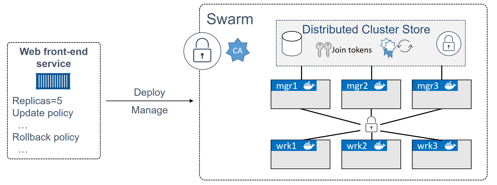
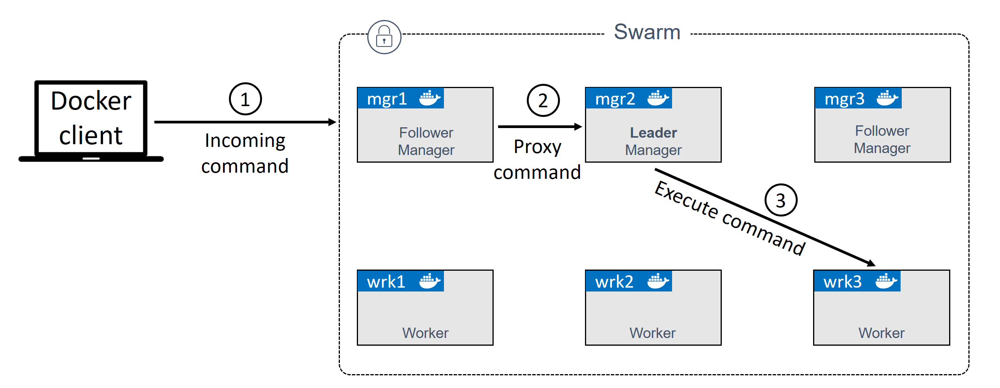

# 第十一章：Docker Swarm

现在我们知道如何安装 Docker，拉取镜像并使用容器，我们需要的下一步是以规模处理事物的方法。这就是 Docker Swarm 出现的地方。

在高层次上，Swarm 有两个主要组件：

+   一个安全的集群

+   一个编排引擎

像往常一样，我们将把本章分为三个部分：

+   TLDR

+   深入探讨

+   命令

我们将使用基于 Linux 的 Swarm 的示例和输出。然而，大多数命令和功能都适用于 Windows 上的 Docker。

### Docker Swarm - TLDR

Docker Swarm 有两个方面：一个是企业级安全的 Docker 主机集群，另一个是用于编排微服务应用程序的引擎。

在集群方面，它将一个或多个 Docker 节点分组，并允许您将它们作为一个集群进行管理。开箱即用，您将获得加密的分布式集群存储、加密网络、相互 TLS、安全的集群加入令牌，以及使管理和轮换证书变得轻而易举的 PKI！您甚至可以非破坏性地添加和删除节点。这是一件美妙的事情！

在编排方面，Swarm 公开了丰富的 API，允许您轻松部署和管理复杂的微服务应用程序。您可以在声明性清单文件中定义应用程序，并使用本机 Docker 命令部署它们。您甚至可以执行滚动更新、回滚和扩展操作。同样，所有这些都可以通过简单的命令完成。

过去，Docker Swarm 是一个单独的产品，你可以在 Docker 引擎之上进行层叠。自 Docker 1.12 以来，它已完全集成到 Docker 引擎中，并可以通过单个命令启用。截至 2018 年，它具有部署和管理本地 Swarm 应用程序以及 Kubernetes 应用程序的能力。尽管在撰写本文时，对 Kubernetes 应用程序的支持相对较新。

### Docker Swarm - 深入探讨

我们将把本章的深入探讨部分分为以下几个部分：

+   Swarm 入门

+   构建一个安全的 Swarm 集群

+   部署一些 Swarm 服务

+   故障排除

引用的示例将基于 Linux，但也适用于 Windows。如果有差异，我们一定会指出。

#### Swarm 模式入门

在集群方面，*Swarm*由一个或多个 Docker *节点*组成。这些可以是物理服务器、虚拟机、树莓派或云实例。唯一的要求是所有节点都可以通过可靠的网络进行通信。

节点被配置为*管理节点*或*工作节点*。*管理节点*负责集群的控制平面，意味着集群的状态和向*工作节点*分发任务等。*工作节点*接受*管理节点*的任务并执行它们。

*swarm*的配置和状态存储在所有管理节点上的分布式*etcd*数据库中。它保存在内存中，并且非常及时更新。但最好的是，它不需要任何配置——它作为 swarm 的一部分安装，并且只需要自己照顾自己。

在集群前端具有颠覆性的东西是安全性的方法。TLS 集成得如此紧密，以至于没有它就不可能构建一个集群。在当今注重安全的世界，像这样的东西都应该得到应有的赞赏！总之，*swarm*使用 TLS 加密通信，验证节点，并授权角色。自动密钥轮换也被加入其中，就像是锦上添花一样！而且一切都进行得如此顺利，以至于你甚至都不知道它的存在！

在应用编排方面，swarm 上调度的原子单位是*服务*。这是 API 中的一个新对象，与 swarm 一起引入，并且是一个更高级的构造，围绕容器添加了一些高级功能。

当一个容器被包装成一个服务时，我们称之为*任务*或*副本*，而服务构造添加了诸如扩展、滚动更新和简单回滚等功能。

高级视图如图 10.1 所示。

图 10.1 高级 swarm

这就足够作为入门了。让我们用一些示例来动手实践吧。

#### 构建一个安全的 Swarm 集群

在本节中，我们将构建一个安全的 swarm 集群，其中包括三个*管理节点*和三个*工作节点*。你可以使用不同数量的*管理节点*和*工作节点*以及不同的名称和 IP 的不同实验室，但接下来的示例将使用图 10.2 中的值。

图 10.2

每个节点都需要安装 Docker，并且需要能够与其余的 swarm 进行通信。如果配置了名称解析，也是有益的——这样可以更容易地在命令输出中识别节点，并在故障排除时有所帮助。

在网络方面，你应该在路由器和防火墙上打开以下端口：

+   `2377/tcp:` 用于安全的客户端到 swarm 的通信

+   `7946/tcp 和 7946/udp:` 用于控制平面的八卦

+   `4789/udp:` 用于基于 VXLAN 的覆盖网络

一旦你满足了先决条件，你就可以继续构建一个集群。

构建集群的过程有时被称为 *初始化集群*，高级过程如下：初始化第一个管理器节点 > 加入其他管理器节点 > 加入工作节点 > 完成。

##### 初始化一个全新的集群

不属于集群的 Docker 节点被称为 *单引擎模式*。一旦它们被添加到集群中，它们就会切换到 *集群模式*。

图 10.3 集群模式 vs 单引擎模式

在 *单引擎模式* 的 Docker 主机上运行 `docker swarm init` 将会将该节点切换到 *集群模式*，创建一个新的 *集群*，并将该节点作为集群的第一个 *管理器*。

然后可以将其他节点作为工作节点和管理器 *加入*。这显然会将它们作为操作的一部分切换到 *集群模式*。

以下步骤将把 **mgr1** 切换到 *集群模式* 并初始化一个新的集群。然后，它将加入 **wrk1**、**wrk2** 和 **wrk3** 作为工作节点 —— 自动将它们切换到 *集群模式*。最后，它将添加 **mgr2** 和 **mgr3** 作为额外的管理器，并将它们切换到 *集群模式*。在该过程结束时，所有 6 个节点都将处于 *集群模式* 并作为同一个集群的一部分运行。

本示例将使用图 10.2 中显示的节点的 IP 地址和 DNS 名称。你的情况可能不同。

1.  登录到 **mgr1** 并初始化一个新的集群（如果你在 Windows 的 PowerShell 终端中跟随操作，请不要忘记使用反引号而不是反斜杠）。

[PRE0]

该命令可以分解如下：

+   `docker swarm init` 告诉 Docker 初始化一个新的集群，并将该节点设为第一个管理器。它还在该节点上启用了集群模式。

+   `--advertise-addr` 是其他节点应该用来连接到此管理器的 IP 和端口。这是一个可选标志，但它可以让你控制在具有多个 IP 的节点上使用哪个 IP。它还可以让你指定一个在节点上不存在的 IP 地址，比如负载均衡器 IP。

+   `--listen-addr` 允许你指定你想要监听的集群流量的 IP 和端口。这通常会匹配 `--advertise-addr`，但在你想要将集群限制在具有多个 IP 的系统上的情况下很有用。在 `--advertise-addr` 指向负载均衡器等远程 IP 地址的情况下也是必需的。

我建议你具体说明并始终使用这两个标志。

集群模式操作的默认端口是**2377**。这是可以自定义的，但惯例是使用`2377/tcp`用于安全（HTTPS）的客户端到集群的连接。

`*列出集群中的节点

[PRE1]

`请注意，**mgr1**目前是集群中唯一的节点，并被列为*Leader*。我们稍后会回到这一点。`*从**mgr1**运行`docker swarm join-token`命令来提取添加新工作节点和管理节点到集群所需的命令和令牌。

[PRE2]

请注意，加入工作节点和管理节点的命令除了加入令牌（`SWMTKN...`）之外是相同的。这意味着节点是作为工作节点还是管理节点加入取决于加入时使用的令牌。**您应该确保您的加入令牌受到保护，因为这是加入节点到集群所需的全部内容！**`*登录**wrk1**并使用`docker swarm join`命令使用工作节点加入令牌加入到集群。

[PRE3]

`--advertise-addr`和`--listen-addr`标志是可选的。我添加了它们，因为我认为在网络配置方面尽可能具体是最佳实践。`*在**wrk2**和**wrk3**上重复上一步，使它们作为工作节点加入到集群。确保您使用**wrk2**和**wrk3**自己的 IP 地址作为`--advertise-addr`和`--listen-addr`标志。*登录**mgr2**并使用用于加入管理节点的令牌使用`docker swarm join`命令将其加入到集群。

[PRE4]

`*在**mgr3**上重复上一步，记得使用**mgr3**的 IP 地址作为`advertise-addr`和`--listen-addr`标志。*通过从集群中的任何管理节点运行`docker node ls`来列出集群中的节点。

[PRE5][PRE6][PRE7]`
