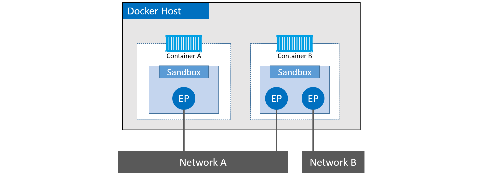
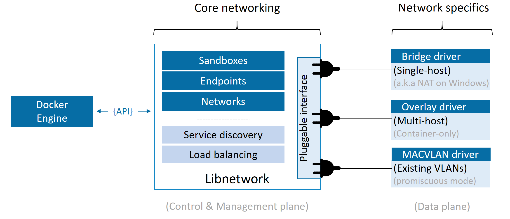
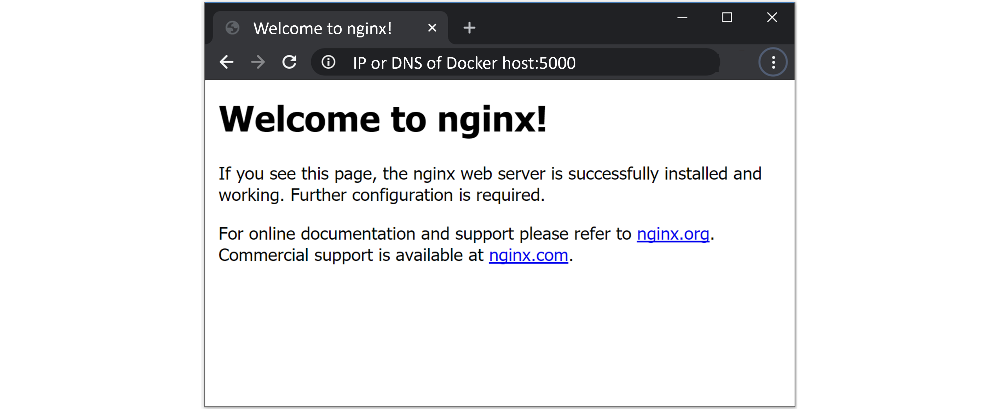
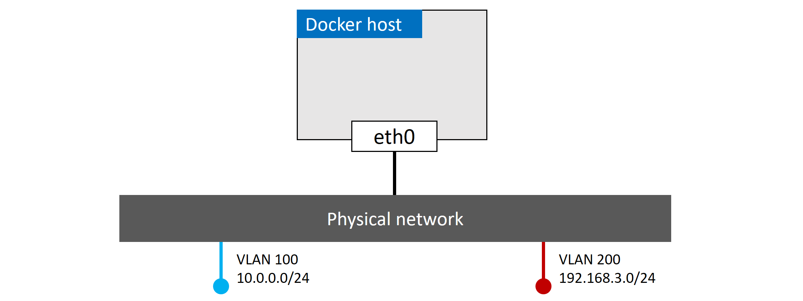
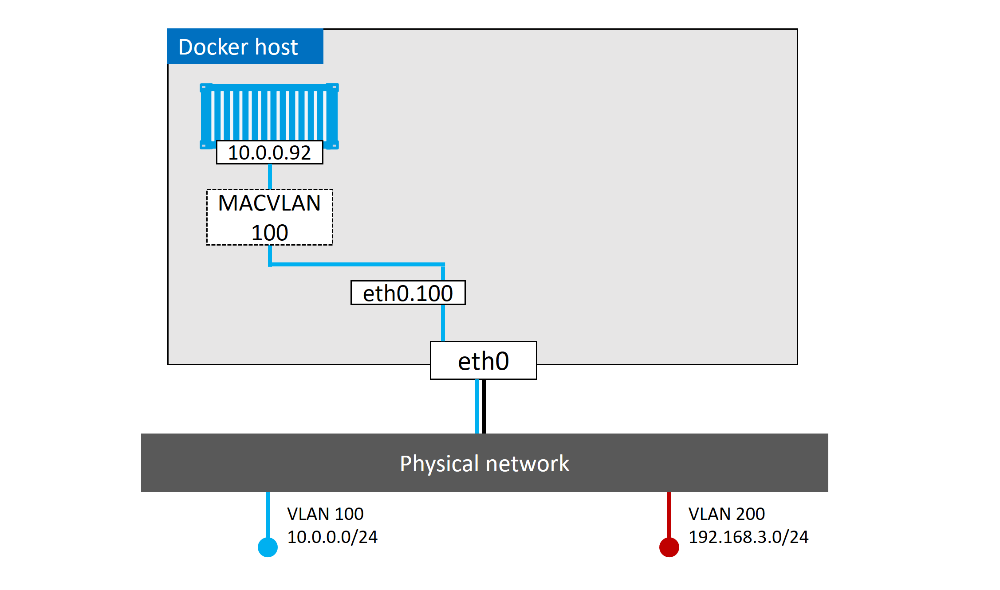
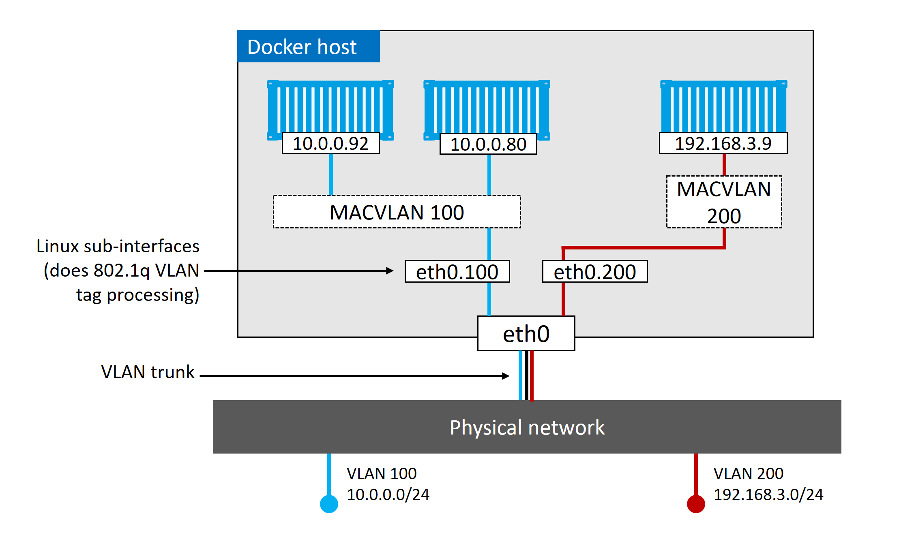
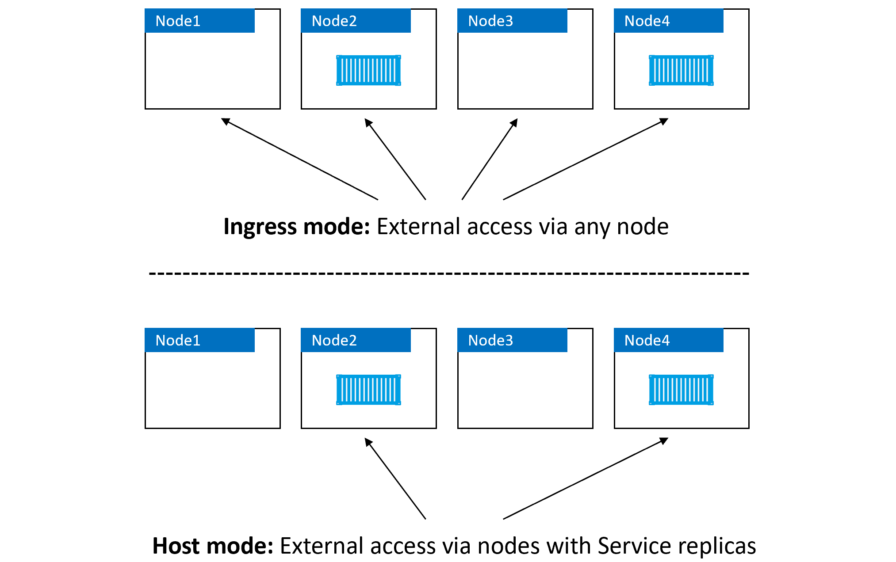

# 第十二章：Docker 网络

总是网络的问题！

每当出现基础设施问题时，我们总是责怪网络。部分原因是网络处于一切的中心位置 —— 没有网络，就没有应用程序！

在 Docker 早期，网络很难 —— 真的很难！如今，这几乎是一种愉悦 ;-)

在本章中，我们将看一下 Docker 网络的基础知识。像容器网络模型（CNM）和`libnetwork`这样的东西。我们还将动手构建一些网络。

像往常一样，我们将把本章分为三个部分：

+   TLDR

+   深入挖掘

+   命令

### Docker 网络 - TLDR

Docker 在容器内运行应用程序，这些应用程序需要在许多不同的网络上进行通信。这意味着 Docker 需要强大的网络能力。

幸运的是，Docker 为容器间网络提供了解决方案，以及连接到现有网络和 VLAN 的解决方案。后者对于需要与外部系统（如 VM 和物理系统）上的功能和服务进行通信的容器化应用程序非常重要。

Docker 网络基于一个名为容器网络模型（CNM）的开源可插拔架构。`libnetwork`是 Docker 对 CNM 的真实实现，它提供了 Docker 的所有核心网络功能。驱动程序插入到`libnetwork`中以提供特定的网络拓扑。

为了创建一个顺畅的开箱即用体验，Docker 附带了一组处理最常见网络需求的本地驱动程序。这些包括单主机桥接网络、多主机覆盖网络以及插入到现有 VLAN 的选项。生态系统合作伙伴通过提供自己的驱动程序进一步扩展了这些功能。

最后但并非最不重要的是，`libnetwork`提供了本地服务发现和基本容器负载均衡解决方案。

这就是大局。让我们进入细节。

### Docker 网络 - 深入挖掘

我们将按照以下方式组织本章节的内容：

+   理论

+   单主机桥接网络

+   多主机覆盖网络

+   连接到现有网络

+   服务发现

+   入口网络

#### 理论

在最高层次上，Docker 网络包括三个主要组件：

+   容器网络模型（CNM）

+   `libnetwork`

+   驱动程序

CNM 是设计规范。它概述了 Docker 网络的基本构建模块。

`libenetwork`是 CNM 的真实实现，被 Docker 使用。它是用 Go 编写的，并实现了 CNM 中概述的核心组件。

驱动程序通过实现特定的网络拓扑，如基于 VXLAN 的覆盖网络，来扩展模型。

图 11.1 显示了它们在非常高的层次上是如何组合在一起的。

图 11.1

让我们更仔细地看一下每一个。

##### 容器网络模型（CNM）

一切都始于设计！

Docker 网络的设计指南是 CNM。它概述了 Docker 网络的基本构建块，您可以在这里阅读完整的规范：https://github.com/docker/libnetwork/blob/master/docs/design.md

我建议阅读整个规范，但在高层次上，它定义了三个构建块：

+   沙盒

+   端点

+   网络

沙盒是一个隔离的网络堆栈。它包括以太网接口、端口、路由表和 DNS 配置。

端点是虚拟网络接口（例如`veth`）。与普通网络接口一样，它们负责建立连接。在 CNM 的情况下，端点的工作是将沙盒连接到网络。

网络是 802.1d 桥的软件实现（更常见的称为交换机）。因此，它们将需要通信的一组端点组合在一起，并进行隔离。

图 11.2 显示了这三个组件以及它们的连接方式。

图 11.2 容器网络模型（CNM）

在 Docker 环境中调度的原子单位是容器，正如其名称所示，容器网络模型的目的是为容器提供网络。图 11.3 显示了 CNM 组件如何与容器相关联——沙盒被放置在容器内，以为它们提供网络连接。

图 11.3

容器 A 有一个接口（端点），连接到网络 A。容器 B 有两个接口（端点），连接到网络 A 和网络 B。这些容器将能够通信，因为它们都连接到网络 A。然而，容器 B 中的两个端点在没有第 3 层路由器的帮助下无法相互通信。

还要了解的重要一点是，端点的行为类似于常规网络适配器，这意味着它们只能连接到单个网络。因此，如果一个容器需要连接到多个网络，它将需要多个端点。

图 11.4 再次扩展了图表，这次添加了一个 Docker 主机。虽然容器 A 和容器 B 在同一主机上运行，但它们的网络堆栈在操作系统级别通过沙盒完全隔离。 

图 11.4

##### Libnetwork

CNM 是设计文档，`libnetwork`是规范实现。它是开源的，用 Go 编写，跨平台（Linux 和 Windows），并被 Docker 使用。

在 Docker 早期，所有的网络代码都存在于守护进程中。这是一场噩梦——守护进程变得臃肿，而且它没有遵循构建模块化工具的 Unix 原则，这些工具可以独立工作，但也可以轻松地组合到其他项目中。因此，所有的核心 Docker 网络代码都被剥离出来，重构为一个名为`libnetwork`的外部库。如今，所有的核心 Docker 网络代码都存在于`libnetwork`中。

正如你所期望的，它实现了 CNM 中定义的所有三个组件。它还实现了本地*服务发现*、*基于入口的容器负载均衡*，以及网络控制平面和管理平面功能。

##### 驱动程序

如果`libnetwork`实现了控制平面和管理平面功能，那么驱动程序就实现了数据平面。例如，连接和隔离都由驱动程序处理。网络对象的实际创建也是如此。这种关系如图 11.5 所示。

图 11.5

Docker 附带了几个内置驱动程序，称为本地驱动程序或*本地驱动程序*。在 Linux 上，它们包括；`bridge`、`overlay`和`macvlan`。在 Windows 上，它们包括；`nat`、`overlay`、`transparent`和`l2bridge`。我们将在本章后面看到如何使用其中一些。

第三方也可以编写 Docker 网络驱动程序。这些被称为*远程驱动程序*，例如`calico`、`contiv`、`kuryr`和`weave`。

每个驱动程序负责在其负责的网络上实际创建和管理所有资源。例如，名为“prod-fe-cuda”的覆盖网络将由`overlay`驱动程序拥有和管理。这意味着`overlay`驱动程序将被调用来创建、管理和删除该网络上的所有资源。

为了满足复杂高度流动的环境的需求，`libnetwork`允许多个网络驱动程序同时处于活动状态。这意味着您的 Docker 环境可以支持各种异构网络。

#### 单主机桥接网络

最简单的 Docker 网络类型是单主机桥接网络。

名称告诉我们两件事：

+   **单主机**告诉我们它只存在于单个 Docker 主机上，并且只能连接位于同一主机上的容器。

+   **桥接**告诉我们它是 802.1d 桥接（第 2 层交换）的实现。

在 Linux 上，Docker 使用内置的`bridge`驱动程序创建单主机桥接网络，而在 Windows 上，Docker 使用内置的`nat`驱动程序创建它们。就所有目的而言，它们的工作方式都是相同的。

图 11.6 显示了两个具有相同本地桥接网络“mynet”的 Docker 主机。尽管网络是相同的，但它们是独立的隔离网络。这意味着图片中的容器无法直接通信，因为它们位于不同的网络上。

图 11.6

每个 Docker 主机都会获得一个默认的单主机桥接网络。在 Linux 上，它被称为“bridge”，在 Windows 上被称为“nat”（是的，这些名称与用于创建它们的驱动程序的名称相同）。默认情况下，这是所有新容器将连接到的网络，除非您在命令行上使用`--network`标志进行覆盖。

以下清单显示了在新安装的 Linux 和 Windows Docker 主机上运行`docker network ls`命令的输出。输出被修剪，只显示每个主机上的默认网络。请注意，网络的名称与用于创建它的驱动程序的名称相同——这是巧合。

[PRE0]

`docker network inspect`命令是一个极好的信息宝库！如果您对底层细节感兴趣，我强烈建议阅读它的输出。

[PRE1]

在 Linux 主机上使用`bridge`驱动程序构建的 Docker 网络基于已存在于 Linux 内核中超过 15 年的经过艰苦打磨的*Linux 桥接*技术。这意味着它们具有高性能和极其稳定！这也意味着您可以使用标准的 Linux 实用程序来检查它们。例如。

[PRE2]

`在所有基于 Linux 的 Docker 主机上，默认的“bridge”网络映射到内核中称为“**docker0**”的基础*Linux 桥接*。我们可以从`docker network inspect`的输出中看到这一点。

[PRE3]

Docker 默认“bridge”网络与 Linux 内核中的“docker0”桥接之间的关系如图 11.7 所示。

图 11.7

图 11.8 通过在顶部添加容器来扩展了图表，这些容器插入到“bridge”网络中。 “bridge”网络映射到主机内核中的“docker0”Linux 桥接，可以通过端口映射将其映射回主机上的以太网接口。

图 11.8

让我们使用`docker network create`命令创建一个名为“localnet”的新单主机桥接网络。

[PRE4]

新网络已创建，并将出现在任何未来的`docker network ls`命令的输出中。如果您使用的是 Linux，还将在内核中创建一个新的*Linux 桥接*。

让我们使用 Linux 的`brctl`工具来查看系统上当前的 Linux 桥接。您可能需要手动安装`brctl`二进制文件，使用`apt-get install bridge-utils`，或者您的 Linux 发行版的等效命令。

[PRE5]

输出显示了两个桥接。第一行是我们已经知道的“docker0”桥接。这与 Docker 中的默认“bridge”网络相关。第二个桥接（br-20c2e8ae4bbb）与新的`localnet` Docker 桥接网络相关。它们都没有启用生成树，并且都没有任何设备连接（`interfaces`列）。

此时，主机上的桥接配置如图 11.9 所示。

图 11.9

让我们创建一个新的容器，并将其连接到新的`localnet`桥接网络。如果您在 Windows 上跟随操作，应该将“`alpine sleep 1d`”替换为“`microsoft/powershell:nanoserver pwsh.exe -Command Start-Sleep 86400`”。

[PRE6]

这个容器现在将位于`localnet`网络上。您可以通过`docker network inspect`来确认。

[PRE7]

输出显示新的“c1”容器位于`localnet`桥接/网络地址转换网络上。

如果我们再次运行 Linux 的`brctl show`命令，我们将看到 c1 的接口连接到`br-20c2e8ae4bbb`桥接上。

[PRE8]

这在图 11.10 中显示。

图 11.10

如果我们将另一个新容器添加到相同的网络中，它应该能够通过名称 ping 通“c1”容器。这是因为所有新容器都已在嵌入式 Docker DNS 服务中注册，因此可以解析同一网络中所有其他容器的名称。

> **注意：** Linux 上的默认`bridge`网络不支持通过 Docker DNS 服务进行名称解析。所有其他*用户定义*的桥接网络都支持！

让我们来测试一下。

1.  创建一个名为“c2”的新交互式容器，并将其放在与“c1”相同的`localnet`网络中。

[PRE9]

您的终端将切换到“c2”容器中。

*从“c2”容器内部，通过名称 ping“c1”容器。

[PRE10]

成功了！这是因为 c2 容器正在运行一个本地 DNS 解析器，它会将请求转发到内部 Docker DNS 服务器。该 DNS 服务器维护了所有使用`--name`或`--net-alias`标志启动的容器的映射。`

尝试在仍然登录到容器的情况下运行一些与网络相关的命令。这是了解 Docker 容器网络工作原理的好方法。以下片段显示了先前在“c2”Windows 容器内运行的`ipconfig`命令。您可以将此 IP 地址与`docker network inspect nat`输出中显示的 IP 地址进行匹配。

[PRE11]

到目前为止，我们已经说过桥接网络上的容器只能与同一网络上的其他容器通信。但是，您可以使用*端口映射*来解决这个问题。

端口映射允许您将容器端口映射到 Docker 主机上的端口。命中配置端口的任何流量都将被重定向到容器。高级流程如图 1.11 所示

图 11.11

在图中，容器中运行的应用程序正在端口 80 上运行。这被映射到主机的`10.0.0.15`接口上的端口 5000。最终结果是所有命中主机`10.0.0.15:5000`的流量都被重定向到容器的端口 80。

让我们通过一个示例来演示将运行 Web 服务器的容器上的端口 80 映射到 Docker 主机上的端口 5000。该示例将在 Linux 上使用 NGINX。如果您在 Windows 上跟随操作，您需要用基于 Windows 的 Web 服务器镜像替换`nginx`。

1.  运行一个新的 Web 服务器容器，并将容器上的端口 80 映射到 Docker 主机上的端口 5000。

[PRE12]

*验证端口映射。

[PRE13]

这表明容器中的端口 80 被映射到 Docker 主机上所有接口的端口 5000。*通过将 Web 浏览器指向 Docker 主机上的端口 5000 来测试配置。要完成此步骤，您需要知道 Docker 主机的 IP 或 DNS 名称。如果您使用的是 Windows 版 Docker 或 Mac 版 Docker，您可以使用`localhost`或`127.0.0.1`。

图 11.12

现在，外部系统可以通过端口映射到 Docker 主机上的 TCP 端口 5000 访问运行在`localnet`桥接网络上的 NGINX 容器。``

``像这样映射端口是有效的，但它很笨拙，而且不具有扩展性。例如，只有一个容器可以绑定到主机上的任何端口。这意味着在我们运行 NGINX 容器的主机上，没有其他容器能够使用端口 5000。这就是单主机桥接网络仅适用于本地开发和非常小的应用程序的原因之一。

#### 多主机叠加网络

我们有一整章专门讲解多主机叠加网络。所以我们会把这一部分简短地介绍一下。

叠加网络是多主机的。它们允许单个网络跨越多个主机，以便不同主机上的容器可以在第 2 层进行通信。它们非常适合容器间通信，包括仅容器应用程序，并且它们具有良好的扩展性。

Docker 提供了一个用于叠加网络的本地驱动程序。这使得创建它们就像在`docker network create`命令中添加`--d overlay`标志一样简单。

#### 连接到现有网络

将容器化应用程序连接到外部系统和物理网络的能力至关重要。一个常见的例子是部分容器化的应用程序 - 容器化的部分需要一种方式与仍在现有物理网络和 VLAN 上运行的非容器化部分进行通信。

内置的`MACVLAN`驱动程序（在 Windows 上是`transparent`）就是为此而创建的。它通过为每个容器分配自己的 MAC 和 IP 地址，使容器成为现有物理网络上的一等公民。我们在图 11.13 中展示了这一点。

图 11.13

从积极的一面来看，MACVLAN 的性能很好，因为它不需要端口映射或额外的桥接 - 您可以通过容器接口连接到主机接口（或子接口）。然而，从消极的一面来看，它需要主机网卡处于**混杂模式**，这在大多数公共云平台上是不允许的。因此，MACVLAN 非常适合您的企业数据中心网络（假设您的网络团队可以适应混杂模式），但在公共云中不起作用。

让我们通过一些图片和一个假设的例子深入了解一下。

假设我们有一个现有的物理网络，其中有两个 VLAN：

+   VLAN 100: 10.0.0.0/24

+   VLAN 200: 192.168.3.0/24

图 11.14

接下来，我们添加一个 Docker 主机并将其连接到网络。

图 11.15

然后，我们需要将一个容器（应用服务）连接到 VLAN 100。为此，我们使用`macvlan`驱动创建一个新的 Docker 网络。但是，`macvlan`驱动需要我们告诉它一些关于我们将要关联的网络的信息。比如：

+   子网信息

+   网关

+   可以分配给容器的 IP 范围

+   在主机上使用哪个接口或子接口

以下命令将创建一个名为“macvlan100”的新 MACVLAN 网络，将容器连接到 VLAN 100。

[PRE14]

`这将创建“macvlan100”网络和 eth0.100 子接口。配置现在看起来像这样。

图 11.16

MACVLAN 使用标准的 Linux 子接口，并且您必须使用 VLAN 的 ID 对它们进行标记。在这个例子中，我们连接到 VLAN 100，所以我们使用`.100`（`etho.100`）对子接口进行标记。

我们还使用了`--ip-range`标志来告诉 MACVLAN 网络可以分配给容器的 IP 地址子集。这个地址范围必须保留给 Docker 使用，并且不能被其他节点或 DHCP 服务器使用，因为没有管理平面功能来检查重叠的 IP 范围。

`macvlan100`网络已准备好用于容器，让我们使用以下命令部署一个。

[PRE15]

`配置现在看起来像图 11.17。但请记住，底层网络（VLAN 100）看不到任何 MACVLAN 的魔法，它只看到具有 MAC 和 IP 地址的容器。考虑到这一点，“mactainer1”容器将能够 ping 并与 VLAN 100 上的任何其他系统通信。非常棒！

> **注意：**如果无法使其工作，可能是因为主机网卡没有处于混杂模式。请记住，公共云平台不允许混杂模式。

图 11.17

到目前为止，我们已经有了一个 MACVLAN 网络，并使用它将一个新容器连接到现有的 VLAN。但事情并不止于此。Docker MACVLAN 驱动是建立在经过验证的 Linux 内核驱动程序的基础上的。因此，它支持 VLAN 干线。这意味着我们可以创建多个 MACVLAN 网络，并将同一台 Docker 主机上的容器连接到它们，如图 11.18 所示。

图 11.18

这基本上涵盖了 MACVLAN。Windows 提供了一个类似的解决方案，使用`transparent`驱动。

##### 容器和服务日志用于故障排除

在继续服务发现之前，快速解决连接问题的说明。

如果您认为容器之间存在连接问题，值得检查守护程序日志和容器日志（应用程序日志）。

在 Windows 系统上，守护程序日志存储在`~AppData\Local\Docker`下，并且可以在 Windows 事件查看器中查看。在 Linux 上，这取决于您使用的`init`系统。如果您正在运行`systemd`，日志将进入`journald`，您可以使用`journalctl -u docker.service`命令查看它们。如果您没有运行`systemd`，您应该查看以下位置：

+   运行`upstart`的 Ubuntu 系统：`/var/log/upstart/docker.log`

+   基于 RHEL 的系统：`/var/log/messages`

+   Debian：`/var/log/daemon.log`

+   Docker for Mac: `~/Library/Containers/com.docker.docker/Data/com.docker.driver.amd64-linux/console-ring`

您还可以告诉 Docker 您希望守护程序日志记录的详细程度。要做到这一点，您需要编辑守护程序配置文件（`daemon.json`），以便将“`debug`”设置为“`true`”，并将“`log-level`”设置为以下之一：

+   `debug` 最详细的选项

+   `info` 默认值和第二最详细的选项

+   `warn` 第三个最详细的选项

+   `error` 第四个最详细的选项

+   `fatal` 最不详细的选项

`daemon.json`的以下片段启用了调试并将级别设置为`debug`。它适用于所有 Docker 平台。

[PRE16]

更改文件后，请务必重新启动 Docker。

这是守护程序日志。那容器日志呢？

独立容器的日志可以使用`docker container logs`命令查看，Swarm 服务的日志可以使用`docker service logs`命令查看。但是，Docker 支持许多日志记录驱动程序，并且它们并不都与`docker logs`命令兼容。

除了引擎日志的驱动程序和配置外，每个 Docker 主机都有默认的容器日志驱动程序和配置。一些驱动程序包括：

+   `json-file`（默认）

+   `journald`（仅在运行`systemd`的 Linux 主机上有效）

+   `syslog`

+   `splunk`

+   `gelf`

`json-file`和`journald`可能是最容易配置的，它们都可以与`docker logs`和`docker service logs`命令一起使用。命令的格式是`docker logs <container-name>`和`docker service logs <service-name>`。

如果您正在使用其他日志记录驱动程序，可以使用第三方平台的本机工具查看日志。

以下来自`daemon.json`的片段显示了配置为使用`syslog`的 Docker 主机。

[PRE17]

`您可以使用`--log-driver`和`--log-opts`标志配置单个容器或服务以使用特定的日志驱动程序。这将覆盖`daemon.json`中设置的任何内容。

容器日志的工作原理是您的应用程序作为其容器中的 PID 1 运行，并将日志发送到`STDOUT`，将错误发送到`STDERR`。然后，日志驱动程序将这些“日志”转发到通过日志驱动程序配置的位置。

如果您的应用程序记录到文件，可以使用符号链接将日志文件写入重定向到 STDOUT 和 STDERR。

以下是针对名为“vantage-db”的容器运行`docker logs`命令的示例，该容器配置为使用`json-file`日志驱动程序。

[PRE18]

“您很有可能会在守护程序日志或容器日志中发现网络连接错误报告。

#### 服务发现

除了核心网络，`libnetwork`还提供了一些重要的网络服务。

*服务发现*允许所有容器和 Swarm 服务通过名称定位彼此。唯一的要求是它们在同一个网络上。

在幕后，这利用了 Docker 的嵌入式 DNS 服务器，以及每个容器中的 DNS 解析器。图 11.19 显示了容器“c1”通过名称 ping 容器“c2”。相同的原理也适用于 Swarm 服务。

图 11.19

让我们逐步了解这个过程。

+   **步骤 1：** `ping c2`命令调用本地 DNS 解析器将名称“c2”解析为 IP 地址。所有 Docker 容器都有一个本地 DNS 解析器。

+   **步骤 2：** 如果本地解析器在其本地缓存中没有“c2”的 IP 地址，它将发起对 Docker DNS 服务器的递归查询。本地解析器预先配置为知道嵌入式 Docker DNS 服务器的详细信息。

+   **步骤 3：** Docker DNS 服务器保存了使用`--name`或`--net-alias`标志创建的所有容器的名称到 IP 映射。这意味着它知道容器“c2”的 IP 地址。

+   **步骤 4：** DNS 服务器将“c2”的 IP 地址返回给“c1”中的本地解析器。它之所以这样做是因为这两个容器在同一个网络上 - 如果它们在不同的网络上，这将无法工作。

+   **步骤 5：** `ping`命令被发送到“c2”的 IP 地址。

每个使用`--name`标志启动的 Swarm 服务和独立容器都将其名称和 IP 注册到 Docker DNS 服务。这意味着所有容器和服务副本都可以使用 Docker DNS 服务找到彼此。

然而，服务发现是*网络范围的*。这意味着名称解析仅适用于相同网络上的容器和服务。如果两个容器在不同的网络上，它们将无法解析彼此。

关于服务发现和名称解析的最后一点...

可以配置 Swarm 服务和独立容器的自定义 DNS 选项。例如，`--dns`标志允许您指定要在嵌入式 Docker DNS 服务器无法解析查询时使用的自定义 DNS 服务器列表。您还可以使用`--dns-search`标志为针对未经验证名称的查询添加自定义搜索域（即当查询不是完全合格的域名时）。

在 Linux 上，所有这些都是通过向容器内的`/etc/resolv.conf`文件添加条目来实现的。

以下示例将启动一个新的独立容器，并将臭名昭著的`8.8.8.8` Google DNS 服务器添加到未经验证的查询中附加的搜索域`dockercerts.com`。

[PRE19]

`#### 入口负载平衡

Swarm 支持两种发布模式，使服务可以从集群外部访问：

+   入口模式（默认）

+   主机模式

通过*入口模式*发布的服务可以从 Swarm 中的任何节点访问 - 即使节点**没有**运行服务副本。通过*主机模式*发布的服务只能通过运行服务副本的节点访问。图 11.20 显示了两种模式之间的区别。

图 11.20

入口模式是默认模式。这意味着每当您使用`-p`或`--publish`发布服务时，它将默认为*入口模式*。要在*主机模式*下发布服务，您需要使用`--publish`标志的长格式**并且**添加`mode=host`。让我们看一个使用*主机模式*的例子。

[PRE20]

`关于命令的一些说明。`docker service create`允许您使用*长格式语法*或*短格式语法*发布服务。短格式如下：`-p 5000:80`，我们已经看过几次了。但是，您不能使用短格式发布*主机模式*的服务。

长格式如下：`--publish published=5000,target=80,mode=host`。这是一个逗号分隔的列表，每个逗号后面没有空格。选项的工作如下：

+   `published=5000`使服务通过端口 5000 在外部可用

+   `target=80`确保对`published`端口的外部请求被映射回服务副本上的端口 80

+   `mode=host`确保外部请求只会在通过运行服务副本的节点进入时到达服务。

入口模式是您通常会使用的模式。

在幕后，*入口模式*使用了一个称为**服务网格**或**Swarm 模式服务网格**的第 4 层路由网格。图 11.21 显示了外部请求到入口模式下暴露的服务的基本流量流向。

图 11.21

让我们快速浏览一下图表。

1.  顶部的命令正在部署一个名为“svc1”的新 Swarm 服务。它将服务附加到`overnet`网络并在 5000 端口上发布它。

1.  像这样发布 Swarm 服务（`--publish published=5000,target=80`）将在入口网络的 5000 端口上发布它。由于 Swarm 中的所有节点都连接到入口网络，这意味着端口是*在整个 Swarm 中*发布的。

1.  集群上实现了逻辑，确保任何命中入口网络的流量，通过**任何节点**，在 5000 端口上都将被路由到端口 80 上的“svc1”服务。

1.  此时，“svc1”服务部署了一个单个副本，并且集群有一个映射规则，规定“*所有命中入口网络 5000 端口的流量都需要路由到运行“svc1”服务副本的节点*”。

1.  红线显示流量命中`node1`的 5000 端口，并通过入口网络路由到运行在 node2 上的服务副本。

重要的是要知道，传入的流量可能会命中任何一个端口为 5000 的四个 Swarm 节点，我们会得到相同的结果。这是因为服务是通过入口网络*在整个 Swarm 中*发布的。

同样重要的是要知道，如果有多个运行的副本，如图 11.22 所示，流量将在所有副本之间平衡。

图 11.22

### Docker 网络-命令

Docker 网络有自己的`docker network`子命令。主要命令包括：

+   `docker network ls`列出本地 Docker 主机上的所有网络。

+   `docker network create` 创建新的 Docker 网络。默认情况下，在 Windows 上使用`nat`驱动程序创建网络，在 Linux 上使用`bridge`驱动程序创建网络。您可以使用`-d`标志指定驱动程序（网络类型）。`docker network create -d overlay overnet`将使用原生 Docker`overlay`驱动程序创建一个名为 overnet 的新覆盖网络。

+   `docker network inspect`提供有关 Docker 网络的详细配置信息。

+   `docker network prune` 删除 Docker 主机上所有未使用的网络。

+   `docker network rm` 删除 Docker 主机上特定的网络。

### 章节总结

容器网络模型（CNM）是 Docker 网络的主设计文档，定义了用于构建 Docker 网络的三个主要构造——*沙盒*、*端点*和*网络*。

`libnetwork` 是用 Go 语言编写的开源库，实现了 CNM。它被 Docker 使用，并且是所有核心 Docker 网络代码的所在地。它还提供了 Docker 的网络控制平面和管理平面。

驱动程序通过添加代码来实现特定的网络类型（如桥接网络和覆盖网络）来扩展 Docker 网络堆栈（`libnetwork`）。Docker 预装了几个内置驱动程序，但您也可以使用第三方驱动程序。

单主机桥接网络是最基本的 Docker 网络类型，适用于本地开发和非常小的应用程序。它们不具备可扩展性，如果要将服务发布到网络外部，则需要端口映射。Linux 上的 Docker 使用内置的 `bridge` 驱动程序实现桥接网络，而 Windows 上的 Docker 使用内置的 `nat` 驱动程序实现它们。

覆盖网络非常流行，是非常适合容器的多主机网络。我们将在下一章中深入讨论它们。

`macvlan` 驱动程序（Windows 上的 `transparent`）允许您将容器连接到现有的物理网络和虚拟局域网。它们通过为容器分配自己的 MAC 和 IP 地址使容器成为一流公民。不幸的是，它们需要在主机 NIC 上启用混杂模式，这意味着它们在公共云中无法工作。

Docker 还使用 `libnetwork` 来实现基本的服务发现，以及用于容器负载均衡入口流量的服务网格。
