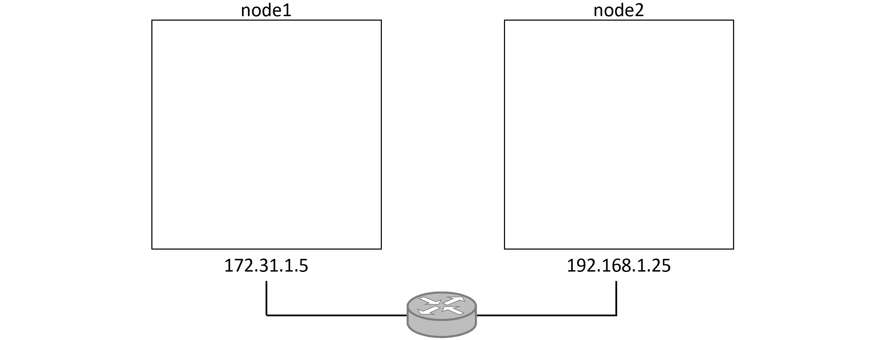
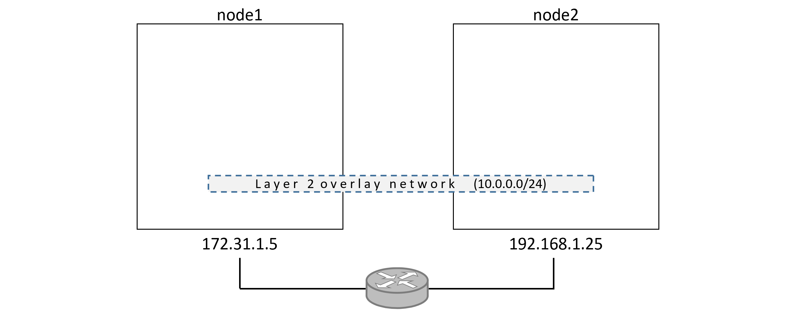
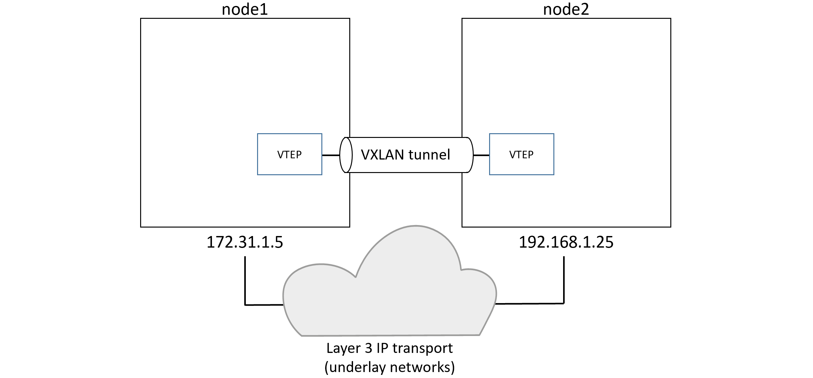
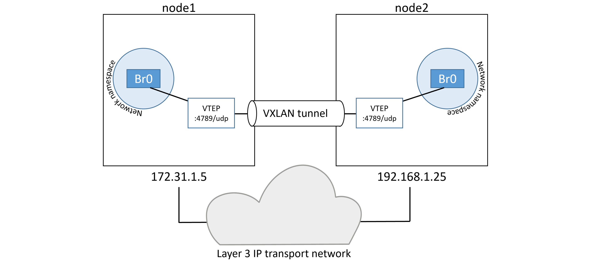
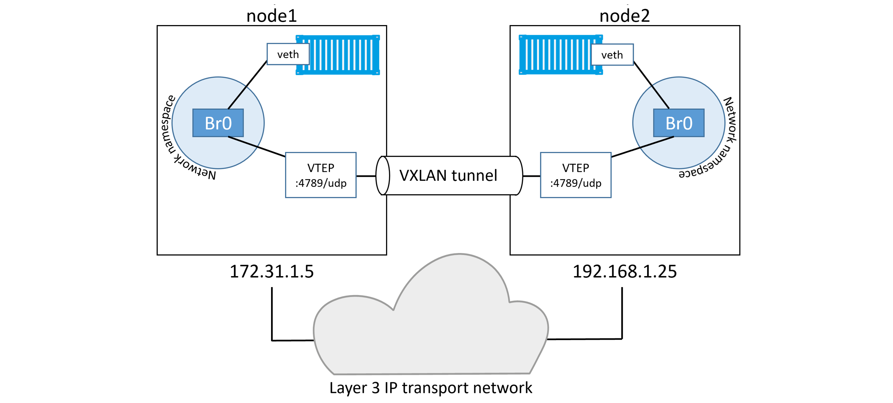
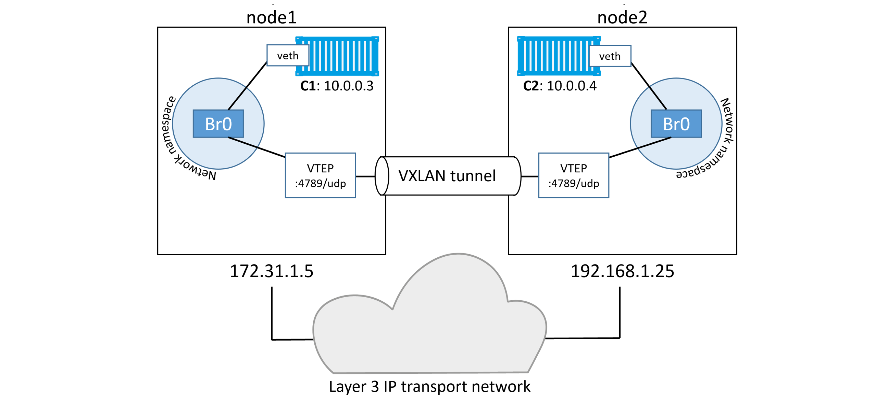

# 第十三章：Docker 叠加网络

叠加网络是我们在容器相关网络中所做的大部分事情的核心。在本章中，我们将介绍本机 Docker 叠加网络的基础知识，这是在 Docker Swarm 集群中实现的。

Windows 上的 Docker 叠加网络具有与 Linux 相同的功能对等性。这意味着我们在本章中使用的示例将在 Linux 和 Windows 上都可以工作。

我们将把本章分为通常的三个部分：

+   简而言之

+   深入挖掘

+   命令

让我们做一些网络魔术！

### Docker 叠加网络 - 简而言之

在现实世界中，容器之间能够可靠且安全地通信是至关重要的，即使它们位于不同的网络上的不同主机上。这就是叠加网络发挥作用的地方。它允许您创建一个扁平、安全的第二层网络，跨越多个主机。容器连接到这个网络并可以直接通信。

Docker 提供了本机叠加网络，简单配置且默认安全。

在幕后，它是建立在`libnetwork`和驱动程序之上的。

+   `libnetwork`

+   `驱动程序`

Libnetwork 是容器网络模型（CNM）的规范实现，驱动程序是实现不同网络技术和拓扑的可插拔组件。Docker 提供了本机驱动程序，如`overlay`驱动程序，第三方也提供了驱动程序。

### Docker 叠加网络 - 深入挖掘

2015 年 3 月，Docker 公司收购了一个名为*Socket Plane*的容器网络初创公司。收购背后的两个原因是为 Docker 带来*真正的网络*，并使容器网络简单到连开发人员都能做到 :-P

他们在这两个方面取得了巨大的进展。

然而，在简单的网络命令背后隐藏着许多复杂的部分。这些是你在进行生产部署和尝试解决问题之前需要了解的内容！

本章的其余部分将分为两个部分：

+   第一部分：我们将在 Swarm 模式下构建和测试 Docker 叠加网络

+   第二部分：我们将解释它是如何工作的理论。

#### 在 Swarm 模式下构建和测试 Docker 叠加网络

对于以下示例，我们将使用两个 Docker 主机，位于两个单独的第二层网络上，通过路由器连接。请参见图 12.1，并注意每个节点所在的不同网络。



图 12.1

您可以在 Linux 或 Windows Docker 主机上跟着做。Linux 应至少具有 4.4 Linux 内核（更新的总是更好），Windows 应为安装了最新热修复的 Windows Server 2016。

##### 构建 Swarm

我们要做的第一件事是将两个主机配置为两节点 Swarm。我们将在**node1**上运行`docker swarm init`命令，使其成为*管理者*，然后在**node2**上运行`docker swarm join`命令，使其成为*工作节点*。

> **警告：**如果您在自己的实验室中跟着做，您需要将 IP 地址、容器 ID、令牌等与您环境中的正确值进行交换。

在**node1**上运行以下命令。

```
$ docker swarm init `\`
  --advertise-addr`=``172`.31.1.5 `\`
  --listen-addr`=``172`.31.1.5:2377

Swarm initialized: current node `(`1ex3...o3px`)` is now a manager. 
```

在**node2**上运行下一个命令。在 Windows Server 上，您可能需要修改 Windows 防火墙规则以允许端口`2377/tcp`、`7946/tcp`和`7946/udp`。

```
$ docker swarm join `\`
  --token SWMTKN-1-0hz2ec...2vye `\`
  `172`.31.1.5:2377
This node joined a swarm as a worker. 
```

我们现在有一个两节点的 Swarm，**node1**作为管理者，**node2**作为工作节点。

##### 创建新的覆盖网络

现在让我们创建一个名为**uber-net**的新的*覆盖网络*。

在**node1**（管理者）上运行以下命令。在 Windows 上，您可能需要为 Windows Docker 节点上的端口`4789/udp`添加规则才能使其工作。

```
$ docker network create -d overlay uber-net
c740ydi1lm89khn5kd52skrd9 
```

完成了！您刚刚创建了一个全新的覆盖网络，该网络对 Swarm 中的所有主机都可用，并且其控制平面已使用 TLS 加密！如果您想加密数据平面，只需在命令中添加`-o encrypted`标志。

您可以使用`docker network ls`命令在每个节点上列出所有网络。

```
$ docker network ls
NETWORK ID      NAME              DRIVER     SCOPE
ddac4ff813b7    bridge            bridge     `local`
389a7e7e8607    docker_gwbridge   bridge     `local`
a09f7e6b2ac6    host              host       `local`
ehw16ycy980s    ingress           overlay    swarm
2b26c11d3469    none              null       `local`
c740ydi1lm89    uber-net          overlay    swarm 
```

在 Windows 服务器上，输出将更像这样：

```
NETWORK ID      NAME             DRIVER      SCOPE
8iltzv6sbtgc    ingress          overlay     swarm
6545b2a61b6f    nat              nat         local
96d0d737c2ee    none             null        local
nil5ouh44qco    uber-net         overlay     swarm 
```

我们创建的网络位于名为**uber-net**的列表底部。其他网络是在安装 Docker 和初始化 Swarm 时自动创建的。

如果您在**node2**上运行`docker network ls`命令，您会注意到它看不到**uber-net**网络。这是因为新的覆盖网络只对运行附加到它们的容器的工作节点可用。这种懒惰的方法通过减少网络八卦的数量来提高网络可扩展性。

##### 将服务附加到覆盖网络

既然我们有了一个覆盖网络，让我们创建一个新的*Docker 服务*并将其附加到它。我们将创建一个具有两个副本（容器）的服务，以便一个在**node1**上运行，另一个在**node2**上运行。这将自动将**uber-net**覆盖扩展到**node2**。

从**node1**运行以下命令。

Linux 示例：

```
$ docker service create --name `test` `\`
   --network uber-net `\`
   --replicas `2` `\`
   ubuntu sleep infinity 
```

Windows 示例：

```
> docker service create --name test `
  --network uber-net `
  --replicas 2 `
  microsoft\powershell:nanoserver Start-Sleep 3600 
```

`> **注意：** Windows 示例使用反引号字符来分割参数，使命令更易读。反引号是 PowerShell 转义换行的方式。

该命令创建了一个名为**test**的新服务，将其附加到**uber-net**叠加网络，并基于提供的镜像创建了两个副本（容器）。在这两个示例中，我们向容器发出了一个休眠命令，以使它们保持运行状态并阻止它们退出。

因为我们运行了两个副本（容器），而 Swarm 有两个节点，一个副本将被调度到每个节点上。

使用`docker service ps`命令验证操作。

```
$ docker service ps `test`
ID          NAME    IMAGE   NODE    DESIRED STATE  CURRENT STATE
77q...rkx   test.1  ubuntu  node1   Running        Running
97v...pa5   test.2  ubuntu  node2   Running        Running 
```

`当 Swarm 在叠加网络上启动容器时，它会自动将该网络扩展到容器所在的节点。这意味着**uber-net**网络现在在**node2**上可见。

恭喜！您已经创建了一个跨越两个位于不同物理底层网络的节点的新叠加网络。您还将两个容器连接到了它。这是多么简单！

#### 测试叠加网络

现在让我们用 ping 命令测试叠加网络。

如图 12.2 所示，我们在不同网络上有两个 Docker 主机，都连接了一个叠加网络。我们在每个节点上都有一个容器连接到叠加网络。让我们看看它们是否可以相互 ping 通。


图 12.2

为了进行测试，我们需要每个容器的 IP 地址（在本次测试中，我们忽略了相同叠加上的容器可以通过名称相互 ping 通的事实）。

运行`docker network inspect`来查看分配给叠加网络的**子网**。

```
$ docker network inspect uber-net
``
    `{`
        `"Name"`: `"uber-net"`,
        `"Id"`: `"c740ydi1lm89khn5kd52skrd9"`,
        `"Scope"`: `"swarm"`,
        `"Driver"`: `"overlay"`,
        `"EnableIPv6"`: false,
        `"IPAM"`: `{`
            `"Driver"`: `"default"`,
            `"Options"`: null,
            `"Config"`: `[`
                `{`
                    `"Subnet"`: `"10.0.0.0/24"`,
                    `"Gateway"`: `"10.0.0.1"`
                `}`
<Snip> 
```

`上面的输出显示**uber-net**的子网为`10.0.0.0/24`。请注意，这与任何一个物理底层网络（`172.31.1.0/24`和`192.168.1.0/24`）都不匹配。

在**node1**和**node2**上运行以下两个命令。这些命令将获取容器的 ID 和 IP 地址。确保在第二个命令中使用您自己实验室中的容器 ID。

```
$ docker container ls
CONTAINER ID   IMAGE           COMMAND           CREATED      STATUS
396c8b142a85   ubuntu:latest   `"sleep infinity"`  `2` hours ago  Up `2` hrs

$ docker container inspect `\`
  --format`=``'{{range .NetworkSettings.Networks}}{{.IPAddress}}{{end}}'` 396c8b`\`
142a85
`10`.0.0.3 
```

`确保您在两个节点上运行这些命令，以获取两个容器的 IP 地址。

图 12.3 显示了到目前为止的配置。在您的实验室中，子网和 IP 地址可能会有所不同。

![图 12.3

图 12.3

正如我们所看到的，有一个跨越两个主机的第 2 层叠加网络，并且每个容器在这个叠加网络上都有一个 IP 地址。这意味着**node1**上的容器将能够使用其来自叠加网络的`10.0.0.4`地址来 ping **node2**上的容器。尽管两个*节点*位于不同的第 2 层底层网络上，这也能够实现。让我们来证明一下。

登录到**node1**上的容器并 ping 远程容器。

要在 Linux Ubuntu 容器上执行此操作，您需要安装`ping`实用程序。如果您正在使用 Windows PowerShell 示例，`ping`实用程序已经安装。

请记住，您的环境中容器的 ID 将是不同的。

Linux 示例：

```
`$` `docker` `container` `exec` `-``it` `396``c8b142a85` `bash`

`root``@396``c8b142a85``:``/``#` `apt``-``get` `update`
`<``Snip``>`

`root``@396``c8b142a85``:``/``#` `apt``-``get` `install` `iputils``-``ping`
`Reading` `package` `lists``...` `Done`
`Building` `dependency` `tree`
`Reading` `state` `information``...` `Done`
`<``Snip``>`
`Setting` `up` `iputils``-``ping` `(``3``:``20121221``-``5u``buntu2``)` `...`
`Processing` `triggers` `for` `libc``-``bin` `(``2.23``-``0u``buntu3``)` `...`

`root``@396``c8b142a85``:``/``#` `ping` `10.0.0.4`
`PING` `10.0.0.4` `(``10.0.0.4``)` `56``(``84``)` `bytes` `of` `data``.`
`64` `bytes` `from` `10.0.0.4``:` `icmp_seq``=``1` `ttl``=``64` `time``=``1.06` `ms`
`64` `bytes` `from` `10.0.0.4``:` `icmp_seq``=``2` `ttl``=``64` `time``=``1.07` `ms`
`64` `bytes` `from` `10.0.0.4``:` `icmp_seq``=``3` `ttl``=``64` `time``=``1.03` `ms`
`64` `bytes` `from` `10.0.0.4``:` `icmp_seq``=``4` `ttl``=``64` `time``=``1.26` `ms`
`^``C`
`root``@396``c8b142a85``:``/``#` 
```

Windows 示例：

```
> docker container exec -it 1a4f29e5a4b6 pwsh.exe
Windows PowerShell
Copyright (C) 2016 Microsoft Corporation. All rights reserved.

PS C:\> ping 10.0.0.4

Pinging 10.0.0.4 with 32 bytes of data:
Reply from 10.0.0.4: bytes=32 time=1ms TTL=128
Reply from 10.0.0.4: bytes=32 time<1ms TTL=128
Reply from 10.0.0.4: bytes=32 time=2ms TTL=128
Reply from 10.0.0.4: bytes=32 time=2ms TTL=12
PS C:\> 
```

`恭喜。**node1**上的容器可以使用叠加网络 ping **node2**上的容器。

您还可以在容器内跟踪 ping 命令的路由。这将报告一个单一的跳跃，证明容器正在通过叠加网络直接通信，对正在穿越的任何底层网络毫不知情。

> **注意：**对于 Linux 示例中的`traceroute`工作，您需要安装`traceroute`软件包。

Linux 示例：

```
`$` `root``@396``c8b142a85``:``/``#` `traceroute` `10.0.0.4`
`traceroute` `to` `10.0.0.4` `(``10.0.0.4``),` `30` `hops` `max``,` `60` `byte` `packets`
 `1`  `test``-``svc``.2.97``v``...``a5``.``uber``-``net` `(``10.0.0.4``)`  `1.110``ms`  `1.034``ms`  `1.073``ms` 
```

Windows 示例：

```
PS C:\> tracert 10.0.0.3

Tracing route to test.2.ttcpiv3p...7o4.uber-net [10.0.0.4]
over a maximum of 30 hops:

  1  <1 ms  <1 ms  <1 ms  test.2.ttcpiv3p...7o4.uber-net [10.0.0.4]

Trace complete. 
```

到目前为止，我们已经用一个命令创建了一个叠加网络。然后我们将容器添加到其中。这些容器被安排在两个位于两个不同第 2 层底层网络上的主机上。一旦我们确定了容器的 IP 地址，我们证明它们可以直接通过叠加网络进行通信。

#### 它是如何工作的理论

既然我们已经看到如何构建和使用容器叠加网络，让我们找出它在幕后是如何组合在一起的。

本节的一些细节将是特定于 Linux 的。然而，相同的总体原则也适用于 Windows。

##### VXLAN 入门

首先，Docker 叠加网络使用 VXLAN 隧道来创建虚拟的第 2 层叠加网络。因此，在我们进一步之前，让我们快速了解一下 VXLAN。

在最高层次上，VXLAN 允许您在现有的第 3 层基础设施上创建一个虚拟的第 2 层网络。我们之前使用的示例在两个第 2 层网络 — 172.31.1.0/24 和 192.168.1.0/24 的基础上创建了一个新的 10.0.0.0/24 第 2 层网络。如图 12.4 所示。



图 12.4

VXLAN 的美妙之处在于，它是一种封装技术，现有的路由器和网络基础设施只会将其视为常规的 IP/UDP 数据包，并且可以处理而无需问题。

为了创建虚拟二层叠加网络，通过底层三层 IP 基础设施创建了一个 VXLAN*隧道*。您可能会听到术语*底层网络*用于指代底层三层基础设施。

VXLAN 隧道的每一端都由 VXLAN 隧道端点（VTEP）终止。正是这个 VTEP 执行了封装/解封装和其他使所有这些工作的魔术。参见图 12.5。



图 12.5

##### 步骤通过我们的两个容器示例

在我们之前构建的示例中，我们有两台主机通过 IP 网络连接。每台主机运行一个容器，并为容器创建了一个 VXLAN 叠加网络以进行连接。

为了实现这一点，在每台主机上创建了一个新的*沙盒*（网络命名空间）。正如在上一章中提到的，*沙盒*类似于一个容器，但它不是运行应用程序，而是运行一个与主机本身的网络堆栈隔离的网络堆栈。

在沙盒内创建了一个名为**Br0**的虚拟交换机（又名虚拟桥）。还创建了一个 VTEP，其中一端连接到**Br0**虚拟交换机，另一端连接到主机网络堆栈（VTEP）。主机网络堆栈的一端在主机连接的底层网络上获取 IP 地址，并绑定到端口 4789 上的 UDP 套接字。每台主机上的两个 VTEP 通过 VXLAN 隧道创建叠加网络，如图 12.6 所示。



图 12.6

这就是创建并准备好供使用的 VXLAN 叠加网络。

然后，每个容器都会获得自己的虚拟以太网（`veth`）适配器，也连接到本地的**Br0**虚拟交换机。拓扑现在看起来像图 12.7，应该更容易看出这两个容器如何在 VXLAN 叠加网络上进行通信，尽管它们的主机位于两个独立的网络上。



图 12.7

##### 通信示例

现在我们已经看到了主要的管道元素，让我们看看这两个容器是如何通信的。

在本例中，我们将 node1 上的容器称为“**C1**”，将 node2 上的容器称为“**C2**”。假设**C1**想要像我们在本章早些时候的实际示例中那样 ping **C2**。



图 12.8

**C1**创建 ping 请求，并将目标 IP 地址设置为**C2**的`10.0.0.4`地址。它通过连接到**Br0**虚拟交换机的`veth`接口发送流量。虚拟交换机不知道该如何发送数据包，因为它的 MAC 地址表（ARP 表）中没有对应于目标 IP 地址的条目。因此，它将数据包洪泛到所有端口。连接到**Br0**的 VTEP 接口知道如何转发帧，因此用自己的 MAC 地址进行回复。这是一个*代理 ARP*回复，并导致**Br0**交换机*学习*如何转发数据包。因此，它更新了 ARP 表，将 10.0.0.4 映射到本地 VTEP 的 MAC 地址。

现在**Br0**交换机已经*学会*了如何将流量转发到**C2**，所有未来发往**C2**的数据包都将直接传输到 VTEP 接口。VTEP 接口知道**C2**，因为所有新启动的容器都使用网络内置的八卦协议将它们的网络细节传播到 Swarm 中的其他节点。

交换机然后将数据包发送到 VTEP 接口，VTEP 接口封装帧，以便可以通过底层传输基础设施发送。在相当高的层面上，这种封装包括向以太网帧添加 VXLAN 头。VXLAN 头包含 VXLAN 网络 ID（VNID），用于将帧从 VLAN 映射到 VXLAN，反之亦然。每个 VLAN 都映射到 VNID，以便可以在接收端解封数据包并转发到正确的 VLAN。这显然保持了网络隔离。封装还将帧包装在具有 node2 上远程 VTEP 的 IP 地址的 UDP 数据包中的*目标 IP 字段*，以及 UDP 端口 4789 套接字信息。这种封装允许数据在底层网络上发送，而底层网络无需了解 VXLAN。

当数据包到达 node2 时，内核会看到它的目的地是 UDP 端口 4789。内核还知道它有一个绑定到此套接字的 VTEP 接口。因此，它将数据包发送到 VTEP，VTEP 读取 VNID，解封数据包，并将其发送到对应 VNID 的本地**Br0**交换机上的 VLAN。然后将其传递给容器 C2。

这是 VXLAN 技术如何被原生 Docker 覆盖网络利用的基础知识。

我们在这里只是浅尝辄止，但这应该足够让您能够开始进行任何潜在的生产 Docker 部署。这也应该让您具备与网络团队讨论 Docker 基础设施的网络方面所需的知识。

最后一件事。Docker 还支持同一覆盖网络内的三层路由。例如，您可以创建一个具有两个子网的覆盖网络，Docker 将负责在它们之间进行路由。创建这样一个网络的命令可能是 `docker network create --subnet=10.1.1.0/24 --subnet=11.1.1.0/24 -d overlay prod-net`。这将导致在 *沙盒* 内创建两个虚拟交换机 **Br0** 和 **Br1**，并且默认情况下会进行路由。

### Docker 覆盖网络 - 命令

+   `docker network create` 是我们用来创建新容器网络的命令。`-d` 标志允许您指定要使用的驱动程序，最常见的驱动程序是 `overlay` 驱动程序。您还可以指定来自第三方的 *远程* 驱动程序。对于覆盖网络，默认情况下控制平面是加密的。只需添加 `-o encrypted` 标志即可加密数据平面（可能会产生性能开销）。

+   `docker network ls` 列出 Docker 主机可见的所有容器网络。运行在 *Swarm 模式* 中的 Docker 主机只会看到托管在特定网络上运行的容器的覆盖网络。这可以将与网络相关的传闻最小化。

+   `docker network inspect` 显示有关特定容器网络的详细信息。这包括 *范围*、*驱动程序*、*IPv6*、*子网配置*、*VXLAN 网络 ID* 和 *加密状态*。

+   `docker network rm` 删除一个网络

### 章节总结

在本章中，我们看到使用 `docker network create` 命令创建新的 Docker 覆盖网络是多么容易。然后我们学习了它们如何在幕后使用 VXLAN 技术组合在一起。

我们只是触及了 Docker 覆盖网络可以做的一小部分。
