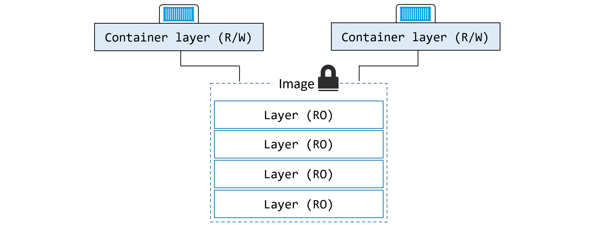

## 第十五章：13：卷和持久数据

是时候看看 Docker 如何管理数据了。我们将看持久和非持久数据。然而，本章的重点将放在持久数据上。

我们将把这一章分为通常的三个部分：

+   简而言之

+   深入探讨

+   命令

### 卷和持久数据-简而言之

数据有两个主要类别。持久和非持久。

持久是你需要*保留*的东西。像客户记录、财务、预订、审计日志，甚至某些类型的应用程序*日志*数据。非持久是你不需要保留的东西。

两者都很重要，Docker 都有相应的选项。

每个 Docker 容器都有自己的非持久存储。它会自动与容器一起创建，并与容器的生命周期相关联。这意味着删除容器将删除这个存储和其中的任何数据。

如果你希望容器的数据保留下来（持久），你需要把它放在*卷*上。卷与容器解耦，这意味着你可以单独创建和管理它们，并且它们不与任何容器的生命周期相关联。最终结果是，你可以删除一个带有卷的容器，而卷不会被删除。

这就是简而言之。让我们仔细看一看。

### 卷和持久数据-深入探讨

容器非常适合微服务设计模式。我们经常将微服务与*短暂*和*无状态*等词联系在一起。所以……微服务都是关于无状态和短暂的工作负载，而容器非常适合微服务。因此，我们经常得出结论，容器必须只适用于短暂的东西。

但这是错误的。完全错误。

#### 容器和非持久数据

容器确实非常擅长处理无状态和非持久的东西。

每个容器都会自动获得一大堆本地存储。默认情况下，这就是容器的所有文件和文件系统所在的地方。你会听到这些被称为*本地存储*、*图形驱动存储*和*快照存储*。无论如何，这是容器的一个组成部分，并与容器的生命周期相关联-当容器创建时它被创建，当容器删除时它被删除。简单。

在 Linux 系统中，它存在于`/var/lib/docker/<storage-driver>/`的某个位置，作为容器的一部分。在 Windows 中，它位于`C:\ProgramData\Docker\windowsfilter\`下。

如果您在 Linux 上的生产环境中运行 Docker，您需要确保将正确的存储驱动程序（图形驱动程序）与 Docker 主机上的 Linux 版本匹配。使用以下列表作为*指南：*

+   **Red Hat Enterprise Linux：**在运行 Docker 17.06 或更高版本的现代 RHEL 版本中使用`overlay2`驱动程序。在旧版本中使用`devicemapper`驱动程序。这适用于 Oracle Linux 和其他与 Red Hat 相关的上游和下游发行版。

+   **Ubuntu：**使用`overlay2`或`aufs`驱动程序。如果您使用的是 Linux 4.x 内核或更高版本，则应选择`overlay2`。

+   **SUSE Linux Enterprise Server：**使用`btrfs`存储驱动程序。

+   **Windows** Windows 只有一个驱动程序，并且默认情况下已配置。

上述列表仅应作为指南使用。随着事物的进展，`overlay2`驱动程序在各个平台上的受欢迎程度正在增加，并且可能成为推荐的存储驱动程序。如果您使用 Docker 企业版（EE）并且有支持合同，您应该咨询最新的兼容性支持矩阵。

让我们回到正题。

默认情况下，容器内的所有存储都使用这个*本地存储*。因此，默认情况下，容器中的每个目录都使用这个存储。

如果您的容器不创建持久数据，*本地存储*就可以了，您可以继续。但是，如果您的容器**需要**持久数据，您需要阅读下一节。

#### 容器和持久数据

在容器中持久保存数据的推荐方法是使用*卷*。

在高层次上，您创建一个卷，然后创建一个容器，并将卷挂载到其中。卷被挂载到容器文件系统中的一个目录，写入该目录的任何内容都将写入卷中。然后，如果您删除容器，卷及其数据仍将存在。

图 13.1 显示了一个 Docker 卷挂载到容器的`/code`目录。写入`/code`目录的任何数据都将存储在卷上，并且在删除容器后仍将存在。



图 13.1 卷和容器的高级视图

在图 13.1 中，`/code`目录是一个 Docker 卷。所有其他目录使用容器的临时本地存储。从卷到`/code`目录的箭头是虚线，表示卷和容器之间的解耦关系。

##### 创建和管理 Docker 卷

卷在 Docker 中是一流的公民。这意味着它们是 API 中的独立对象，并且它们有自己的`docker volume`子命令。

使用以下命令创建名为`myvol`的新卷。

```
$ docker volume create myvol 
```

默认情况下，Docker 会使用内置的`local`驱动程序创建新卷。顾名思义，本地卷仅适用于在其上创建的节点上的容器。使用`-d`标志指定不同的驱动程序。

第三方驱动程序可作为插件使用。这些可以提供高级存储功能，并将外部存储系统与 Docker 集成。图 13.2 显示了外部存储系统（例如 SAN 或 NAS）被用于为卷提供后端存储。驱动程序将外部存储系统及其高级功能集成到 Docker 环境中。


图 13.2 将外部存储插入 Docker

目前，有超过 25 个卷插件。这些涵盖了块存储、文件存储、对象存储等：

+   **块存储**往往具有高性能，并且适用于小块随机访问工作负载。具有 Docker 卷插件的块存储系统的示例包括 HPE 3PAR、Amazon EBS 和 OpenStack 块存储服务（cinder）。

+   **文件存储**包括使用 NFS 和 SMB 协议的系统，并且也适用于高性能工作负载。具有 Docker 卷插件的文件存储系统的示例包括 NetApp FAS、Azure 文件存储和 Amazon EFS。

+   **对象存储**适用于不经常更改的大数据块的长期存储。它通常是内容可寻址的，并且通常性能较低。具有 Docker 卷驱动程序的示例包括 Amazon S3、Ceph 和 Minio。

现在卷已创建，您可以使用`docker volume ls`命令查看它，并使用`docker volume inspect`命令检查它。

```
$ docker volume ls
DRIVER              VOLUME NAME
`local`               myvol

$ docker volume inspect myvol
`[`
    `{`
        `"CreatedAt"`: `"2018-01-12T12:12:10Z"`,
        `"Driver"`: `"local"`,
        `"Labels"`: `{}`,
        `"Mountpoint"`: `"/var/lib/docker/volumes/myvol/_data"`,
        `"Name"`: `"myvol"`,
        `"Options"`: `{}`,
        `"Scope"`: `"local"`
    `}`
`]` 
```

`从`inspect`命令的输出中得出一些有趣的观点。`driver`和`scope`都是`local`。这意味着卷是使用默认的`local`驱动程序创建的，并且仅适用于此 Docker 主机上的容器。`mountpoint`属性告诉我们卷在主机上的哪个位置被展示。在这个例子中，卷在 Docker 主机上的`/var/lib/docker/volumes/myvol/_data`处被展示。在 Windows Docker 主机上，它将报告为`Mountpoint": "C:\\ProgramData\\Docker\\volumes\\myvol\\_data`。

使用`local`驱动程序创建的所有卷在 Linux 上都有自己的目录，位于`/var/lib/docker/volumes`，在 Windows 上位于`C:\ProgramData\Docker\volumes`。这意味着您可以在 Docker 主机的文件系统中看到它们，甚至可以从 Docker 主机读取和写入数据。我们在 Docker Compose 章节中看到了一个例子，我们将文件复制到 Docker 主机上卷的目录中，文件立即出现在容器内的卷中。

现在您可以使用`myvol`卷与 Docker 服务和容器一起使用。例如，您可以使用`docker container run`命令将其挂载到一个新的容器中，使用`--mount`标志。我们马上会看到一些例子。

删除 Docker 卷有两种方法：

+   `docker volume prune`

+   `docker volume rm`

`docker volume prune`将删除**所有未挂载到容器或服务副本的卷**，因此**请谨慎使用！** `docker volume rm`允许您精确指定要删除的卷。这两个命令都不会删除正在被容器或服务副本使用的卷。

由于`myvol`卷未被使用，可以使用`prune`命令删除它。

```
$ docker volume prune

WARNING! This will remove all volumes not used by at least one container.
Are you sure you want to `continue`? `[`y/N`]` y

Deleted Volumes:
myvol
Total reclaimed space: 0B 
```

“恭喜，您已经创建、检查和删除了一个 Docker 卷。而且您做到了所有这一切都没有与容器进行交互。这展示了卷的独立性。”

到目前为止，您已经知道了创建、列出、检查和删除 Docker 卷的所有命令。但是，也可以使用`VOLUME`指令通过 Dockerfile 部署卷。格式为`VOLUME <container-mount-point>`。但是，在 Dockerfile 中无法指定主机目录部分。这是因为*主机*目录本质上是*主机*相关的，这意味着它们可能在主机之间发生变化，并且可能破坏构建。如果通过 Dockerfile 指定，您必须在部署时指定主机目录。

#### 演示容器和服务的卷

现在我们知道了与容器和服务一起使用基本卷相关的 Docker 命令，让我们看看如何使用它们。

我们将在没有卷的系统上工作，我们演示的所有内容都适用于 Linux 和 Windows。

使用以下命令创建一个新的独立容器，并挂载一个名为`bizvol`的卷。

**Linux 示例：**

```
$ docker container run -dit --name voltainer `\`
    --mount `source``=`bizvol,target`=`/vol `\`
    alpine 
```

**Windows 示例：**

对于所有 Windows 示例，请使用 PowerShell，并注意使用反引号（`）将命令拆分成多行。

```
> docker container run -dit --name voltainer `
    --mount source=bizvol,target=c:\vol `
    microsoft/powershell:nanoserver 
```

`即使系统中没有名为`bizvol`的卷，该命令也应该成功运行。这提出了一个有趣的观点：

+   如果您指定一个已存在的卷，Docker 将使用现有的卷

+   如果您指定一个不存在的卷，Docker 会为您创建它

在这种情况下，`bizvol`不存在，因此 Docker 创建了它并将其挂载到新容器中。这意味着您将能够通过`docker volume ls`看到它。

```
$ docker volume ls
DRIVER              VOLUME NAME
`local`               bizvol 
```

`尽管容器和卷有各自的生命周期，但您不能删除正在被容器使用的卷。试试看。

```
$ docker volume rm bizvol
Error response from daemon: unable to remove volume: volume is in use - `[`b44`\`
d3f82...dd2029ca`]` 
```

`卷目前是空的。让我们进入容器并向其中写入一些数据。如果您在 Windows 上进行操作，请记得在`docker container exec`命令的末尾将`sh`替换为`pwsh.exe`。所有其他命令都适用于 Linux 和 Windows。

```
$ docker container `exec` -it voltainer sh

/# `echo` `"I promise to write a review of the book on Amazon"` > /vol/file1

/# ls -l /vol
total `4`
-rw-r--r-- `1` root  root   `50` Jan `12` `13`:49 file1

/# cat /vol/file1
I promise to write a review of the book on Amazon 
```

键入`exit`返回到 Docker 主机的 shell，然后使用以下命令删除容器。

```
$ docker container rm voltainer -f
voltainer 
```

即使容器被删除，卷仍然存在：

```
$ docker container ls -a
CONTAINER ID     IMAGE    COMMAND    CREATED       STATUS

$ docker volume ls
DRIVER              VOLUME NAME
`local`               bizvol 
```

`因为卷仍然存在，您可以查看宿主机上的挂载点，以检查您写入的数据是否仍然存在。

从 Docker 主机的终端运行以下命令。第一个将显示文件仍然存在，第二个将显示文件的内容。

如果您在 Windows 上进行操作，请确保使用`C:\ProgramData\Docker\volumes\bizvol\_data`目录。

```
$ ls -l /var/lib/docker/volumes/bizvol/_data/
total `4`
-rw-r--r-- `1` root root `50` Jan `12` `14`:25 file1

$ cat /var/lib/docker/volumes/bizvol/_data/file1
I promise to write a review of the book on Amazon 
```

`很好，卷和数据仍然存在。

甚至可以将`bizvol`卷挂载到一个新的服务或容器中。以下命令创建一个名为 hellcat 的新 Docker 服务，并将 bizvol 挂载到服务副本的`/vol`目录中。

```
$ docker service create `\`
  --name hellcat `\`
  --mount `source``=`bizvol,target`=`/vol `\`
  alpine sleep 1d

overall progress: `1` out of `1` tasks
`1`/1: running   `[====================================`>`]`
verify: Service converged 
```

`我们没有指定`--replicas`标志，因此只会部署一个服务副本。找出它在 Swarm 中运行的节点。

```
$ docker service ps hellcat
ID         NAME         NODE      DESIRED STATE     CURRENT STATE
l3nh...    hellcat.1    node1     Running           Running `19` seconds ago 
```

`在这个例子中，副本正在`node1`上运行。登录`node1`并获取服务副本容器的 ID。

```
node1$ docker container ls
CTR ID     IMAGE             COMMAND       STATUS        NAMES
df6..a7b   alpine:latest     "sleep 1d"    Up 25 secs    hellcat.1.l3nh... 
```

`请注意，容器名称是由`service-name`、`replica-number`和`replica-ID`组合而成，用句点分隔。

进入容器并检查`/vol`中是否存在数据。我们将在`exec`示例中使用服务副本的容器 ID。如果您在 Windows 上进行操作，请记得将`sh`替换为`pwsh.exe`。

```
node1$ docker container exec -it df6 sh

/# cat /vol/file1
I promise to write a review of the book on Amazon 
```

`我想现在是时候跳到亚马逊去写那篇书评了 :-D`

很好，卷保留了原始数据，并使其对新容器可用。

#### 在集群节点之间共享存储

将 Docker 与外部存储系统集成，可以轻松地在集群节点之间共享外部存储。例如，可以将单个存储 LUN 或 NFS 共享呈现给多个 Docker 主机，因此可以提供给无论在哪个主机上运行的容器和服务副本。图 13.3 显示了一个外部共享卷被呈现给两个 Docker 节点。然后，这些 Docker 节点使共享卷可用于一些容器。


图 13.3

构建这样的设置需要对外部存储系统有所了解，以及了解您的应用程序如何读取和写入共享存储中的数据。

这种配置的一个主要问题是**数据损坏**。

假设以下示例基于图 13.3：节点 1 上的容器 A 更新了共享卷中的一些数据。但是，它并没有直接将更新写入卷中，而是将其保存在本地缓冲区中以便更快地调用。此时，容器 A 认为数据已经更新。然而，在节点 2 上，容器 B 更新了相同的数据，并直接将其提交到卷中。此时，两个容器都*认为*它们已经更新了卷中的数据，但实际上只有容器 B 更新了。在以后的某个时间，节点 1 上的容器 A 刷新其缓冲区，覆盖了节点 2 上容器 B 之前所做的更改。但是容器 B 和节点 2 可能不会意识到这一点。这就是数据损坏发生的方式。

为了防止这种情况发生，您需要以一种避免这种情况的方式编写您的应用程序。

### 卷和持久数据 - 命令

+   `docker volume create` 是我们用来创建新卷的命令。默认情况下，卷是使用本机`local`驱动程序创建的，但您可以使用`-d`标志来指定不同的驱动程序。

+   `docker volume ls` 将列出本地 Docker 主机上的所有卷。

+   `docker volume inspect` 显示详细的卷信息。使用此命令来查找卷存在于 Docker 主机文件系统的位置。

+   `docker volume prune` 将删除**所有**未被容器或服务副本使用的卷。**谨慎使用！**

+   `docker volume rm` 删除未使用的特定卷。

### 章节总结

数据有两种主要类型：持久数据和非持久数据。持久数据是您需要保留的数据，非持久数据是您不需要保留的数据。默认情况下，所有容器都会获得与容器一起存在和消失的非持久存储，我们称之为*本地存储*，这对于非持久数据是理想的。然而，如果您的容器创建需要保留的数据，您应该将数据存储在 Docker 卷中。

Docker 卷是 Docker API 中的一流公民，并且独立于容器进行管理，具有自己的`docker volume`子命令。这意味着删除容器不会删除它正在使用的卷。

卷是在 Docker 环境中处理持久数据的推荐方式。```````````````
