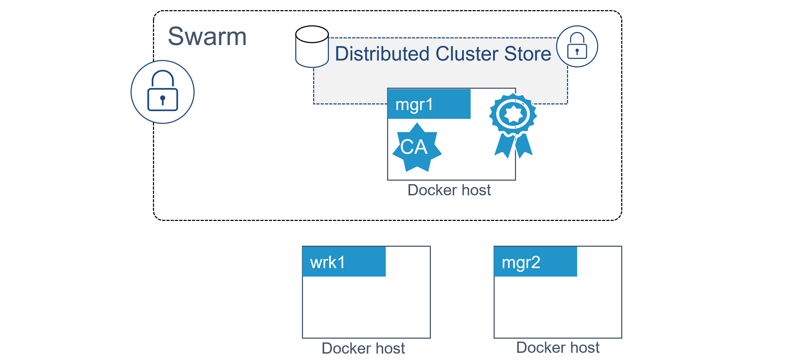
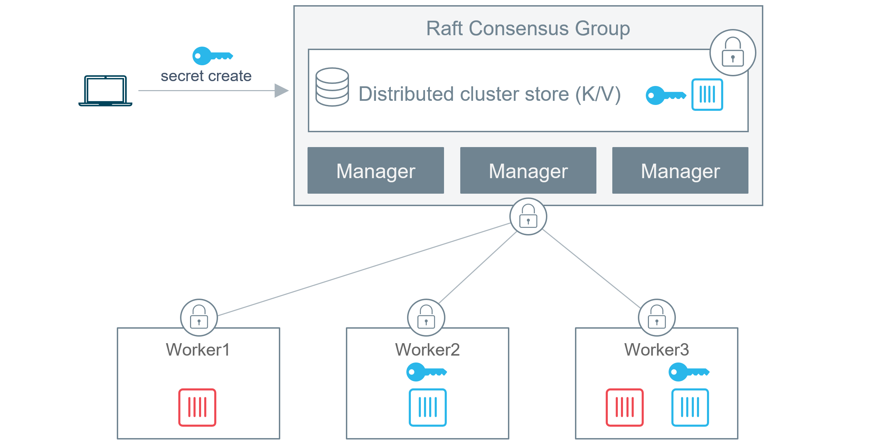

# 第十六章：Docker 中的安全性

良好的安全性建立在多层次之上，而 Docker 有很多层次。它支持所有主要的 Linux 安全技术，同时也有很多自己的技术，而且大多数都很简单易配置。

在本章中，我们将介绍一些使在 Docker 上运行容器非常安全的技术。

当我们深入探讨本章的内容时，我们将把事情分成两类：

+   Linux 安全技术

+   Docker 平台安全技术

本章的大部分内容将是针对 Linux 的。然而，Docker 平台安全技术部分是与平台无关的，并且同样适用于 Linux 和 Windows。

### Docker 中的安全性-简而言之

安全性就是多层次的！一般来说，安全层次越多，您就越安全。嗯... Docker 提供了很多安全层次。图 15.1 显示了我们将在本章中涵盖的一些安全技术。

图 15.1

图 15.1

Linux 上的 Docker 利用了大部分常见的 Linux 安全技术。这些包括命名空间，控制组（cgroups），权限，强制访问控制（MAC）系统和 seccomp。对于每一种技术，Docker 都实现了合理的默认设置，以实现无缝和相对安全的开箱即用体验。但是，它也允许您根据自己的特定要求自定义每一种技术。

Docker 平台本身提供了一些出色的本地安全技术。其中最好的一点是它们非常简单易用！

Docker Swarm Mode 默认情况下是安全的。您可以在不需要任何配置的情况下获得以下所有内容；加密节点 ID，相互认证，自动 CA 配置，自动证书轮换，加密集群存储，加密网络等等。

Docker 内容信任（DCT）允许您对图像进行签名，并验证您拉取的图像的完整性和发布者。

Docker 安全扫描分析 Docker 镜像，检测已知的漏洞，并提供详细报告。

Docker secrets 使秘密成为 Docker 生态系统中的一等公民。它们存储在加密的集群存储中，在传递给容器时进行加密，在使用时存储在内存文件系统中，并且采用最小权限模型。

重要的是要知道，Docker 与主要的 Linux 安全技术一起工作，并提供自己广泛且不断增长的安全技术。虽然 Linux 安全技术可能有点复杂，但 Docker 平台的安全技术非常简单。

### Docker 中的安全-深入挖掘

我们都知道安全性很重要。我们也知道安全性可能会很复杂和无聊！

当 Docker 决定将安全性融入其平台时，它决定要使其简单易用。他们知道如果安全性难以配置，人们就不会使用它。因此，Docker 平台提供的大多数安全技术都很简单易用。它们还提供合理的默认设置-这意味着你可以零配置得到一个相对安全的平台。当然，默认设置并不完美，但通常足以让你安全启动。如果它们不符合你的需求，你总是可以自定义它们。

我们将按以下方式组织本章的其余部分：

+   Linux 安全技术

+   命名空间

+   控制组

+   capabilities

+   强制访问控制

+   seccomp

+   Docker 平台安全技术

+   Swarm 模式

+   Docker 安全扫描

+   Docker 内容信任

+   Docker Secrets

#### Linux 安全技术

所有良好的容器平台都应该使用命名空间和 cgroups 来构建容器。最好的容器平台还将集成其他 Linux 安全技术，如*capabilities*、*强制访问控制系统*，如 SELinux 和 AppArmor，以及*seccomp*。如预期的那样，Docker 与它们都集成在一起！

在本章的这一部分，我们将简要介绍 Docker 使用的一些主要 Linux 安全技术。我们不会详细介绍，因为我希望本章的主要重点是 Docker 平台技术。

##### 命名空间

内核命名空间是容器的核心！它们让我们可以切分操作系统（OS），使其看起来和感觉像多个隔离的操作系统。这让我们可以做一些很酷的事情，比如在同一个 OS 上运行多个 web 服务器而不会出现端口冲突。它还让我们在同一个 OS 上运行多个应用程序，而不会因为共享配置文件和共享库文件而发生冲突。

一些快速的例子：

+   您可以在单个操作系统上运行多个 Web 服务器，每个 Web 服务器都在端口 443 上运行。为此，您只需在每个 Web 服务器应用程序内运行其自己的*网络命名空间*。这是因为每个*网络命名空间*都有自己的 IP 地址和完整的端口范围。您可能需要将每个端口映射到 Docker 主机上的不同端口，但每个端口都可以在不重新编写或重新配置以使用不同端口的情况下运行。

+   您可以运行多个应用程序，每个应用程序都需要自己特定版本的共享库或配置文件。为此，您可以在每个*挂载命名空间*内运行每个应用程序。这是因为每个*挂载命名空间*可以在系统上拥有任何目录的独立副本（例如/ etc，/ var，/ dev 等）。

图 15.2 显示了单个主机上运行两个 Web 服务器应用程序的高级示例，两者都使用端口 443。每个 Web 服务器应用程序都在自己的网络命名空间内运行。


图 15.2

Linux 上的 Docker 目前利用以下内核命名空间：

+   进程 ID（pid）

+   网络（net）

+   文件系统/挂载（mnt）

+   进程间通信（ipc）

+   用户（用户）

+   UTS（uts）

我们稍后将简要解释每个命名空间的作用。但最重要的是要理解**Docker 容器是命名空间的有序集合**。让我重复一遍… ***Docker 容器是命名空间的有序集合***。

例如，每个容器由自己的`pid`，`net`，`mnt`，`ipc`，`uts`和可能的`user`命名空间组成。这些命名空间的有序集合就是我们所说的容器。图 15.3 显示了一个单个 Linux 主机运行两个容器。


图 15.3

让我们简要看一下 Docker 如何使用每个命名空间：

+   `进程 ID 命名空间：` Docker 使用`pid`命名空间为每个容器提供独立的进程树。每个容器都有自己的进程树，这意味着每个容器都可以有自己的 PID 1。PID 命名空间还意味着容器无法看到或访问其他容器或其运行的主机的进程树。

+   `网络命名空间：` Docker 使用`net`命名空间为每个容器提供独立的网络堆栈。该堆栈包括接口、IP 地址、端口范围和路由表。例如，每个容器都有自己的`eth0`接口，具有自己独特的 IP 和端口范围。

+   `Mount namespace:` 每个容器都有自己独特的隔离根目录`/`文件系统。这意味着每个容器都可以有自己的`/etc`、`/var`、`/dev`等。容器内的进程无法访问 Linux 主机或其他容器的挂载命名空间 - 它们只能看到和访问自己隔离的挂载命名空间。

+   `Inter-process Communication namespace:` Docker 使用`ipc`命名空间在容器内进行共享内存访问。它还将容器与容器外的共享内存隔离开来。

+   `User namespace:` Docker 允许您使用`user`命名空间将容器内的用户映射到 Linux 主机上的不同用户。一个常见的例子是将容器的`root`用户映射到 Linux 主机上的非 root 用户。用户命名空间对于 Docker 来说是相当新的，目前是可选的。这可能会在将来发生变化。

+   `UTS namespace:` Docker 使用`uts`命名空间为每个容器提供自己的主机名。

记住...容器是一组命名空间的有序集合！！！


图 15.4

##### 控制组

如果命名空间是关于隔离的话，*控制组（cgroups）*则是关于设置限制的。

将容器类比为酒店中的房间。是的，每个房间都是隔离的，但每个房间也共享一组公共资源 - 诸如供水、供电、共享游泳池、共享健身房、共享早餐吧等。Cgroups 让我们设置限制，以便（继续使用酒店类比）没有单个容器可以使用所有的水或吃光早餐吧的所有食物。

在现实世界中，而不是愚蠢的酒店类比，容器彼此隔离，但共享一组公共的操作系统资源 - 诸如 CPU、RAM 和磁盘 I/O 之类的东西。Cgroups 让我们对这些资源中的每一个设置限制，以便单个容器不能使用主机的所有 CPU、RAM 或存储 I/O。

##### Capabilities

在容器中以 root 身份运行是一个坏主意 - root 拥有无限的权力，因此非常危险。但是，以非 root 身份运行容器也很麻烦 - 非 root 几乎没有任何权力，几乎没有用处。我们需要的是一种技术，让我们可以选择容器需要哪些 root 权限才能运行。进入*capabilities*！

在底层，Linux 的 root 账户由一长串的 capabilities 组成。其中一些包括：

+   `CAP_CHOWN`允许您更改文件所有权

+   `CAP_NET_BIND_SERVICE`允许您将套接字绑定到低编号的网络端口

+   `CAP_SETUID`允许您提升进程的特权级别

+   `CAP_SYS_BOOT`允许您重新启动系统。

列表还在继续。

Docker 使用*capabilities*，因此您可以以 root 身份运行容器，但剥离掉不需要的 root 权限。例如，如果容器唯一需要的 root 权限是绑定到低编号的网络端口的能力，您应该启动一个容器并删除所有 root 权限，然后再添加 CAP_NET_BIND_SERVICE 权限。

Docker 还施加限制，使容器无法重新添加已删除的功能。

##### 强制访问控制系统

Docker 与主要的 Linux MAC 技术（如 AppArmor 和 SELinux）兼容。

根据您的 Linux 发行版，Docker 会为所有新容器应用默认的 AppArmor 配置文件。根据 Docker 文档，这个默认配置文件是“适度保护，同时提供广泛的应用程序兼容性”。

Docker 还允许您启动没有应用策略的容器，并且可以自定义策略以满足您的特定要求。

##### seccomp

Docker 使用 seccomp，在过滤模式下，限制容器可以向主机内核发出的系统调用。

根据 Docker 安全理念，所有新容器都会配置一个默认的 seccomp 配置文件，其中包含合理的默认设置。这旨在提供适度的安全性，而不影响应用程序的兼容性。

与往常一样，您可以自定义 seccomp 配置文件，并且可以向 Docker 传递一个标志，以便可以启动没有 seccomp 配置文件的容器。

##### 关于 Linux 安全技术的最终思考

Docker 支持大多数重要的 Linux 安全技术，并提供合理的默认设置，以增加安全性但不会太严格限制。



图 15.5

其中一些技术可能很难定制，因为它们需要深入了解其工作原理以及 Linux 内核的工作原理。希望它们在未来会变得更容易配置，但目前，Docker 随附的默认配置是一个很好的起点。

#### Docker 平台安全技术

在本章的这一部分，我们将看一下**Docker 平台**提供的一些主要安全技术。

##### Swarm 模式下的安全性

Swarm Mode 是 Docker 的未来。它允许您集群多个 Docker 主机，并以声明性方式部署应用程序。每个 Swarm 由*管理者*和*工作者*组成，可以是 Linux 或 Windows。管理者组成集群的控制平面，并负责配置集群并向其分派工作。工作者是运行应用程序代码的节点，作为容器运行。

正如预期的那样，Swarm Mode 包括许多安全功能，这些功能已启用，并具有合理的默认值。这些功能包括：

+   加密节点 ID

+   通过 TLS 的双向认证

+   安全加入令牌

+   具有自动证书轮换的 CA 配置

+   加密集群存储（配置数据库）

+   加密网络

让我们走一遍构建安全 Swarm 并配置一些安全方面的过程。

要跟随操作，您至少需要三个运行 Docker 1.13 或更高版本的 Docker 主机。所引用的示例使用三个名为“mgr1”、“mgr2”和“wrk1”的 Docker 主机。每个主机都在 Ubuntu 16.04 上运行 Docker 18.01.0-ce。所有三个主机之间有网络连接，并且都可以通过名称相互 ping 通。设置如图 15.6 所示。


图 15.6

##### 配置安全 Swarm

从要成为新 Swarm 中第一个管理者的节点运行以下命令。在示例中，我们将从“mgr1”运行它。

```
$ docker swarm init
Swarm initialized: current node `(`7xam...662z`)` is now a manager.

To add a worker to this swarm, run the following command:

    docker swarm join --token `\`
     SWMTKN-1-1dmtwu...r17stb-ehp8g...hw738q `172`.31.5.251:2377

To add a manager to this swarm, run `'docker swarm join-token manager'`
and follow the instructions. 
```

`就是这样！这确实是您需要做的一切来配置一个安全的 Swarm！

“mgr1”被配置为 Swarm 的第一个管理者，也是根 CA。Swarm 已被赋予了一个加密的 Swarm ID，“mgr1”已经为自己颁发了一个客户端证书，用于标识其作为 Swarm 中的管理者。证书轮换已配置为默认值 90 天，并且已配置和加密了集群配置数据库。一组安全令牌也已创建，以便新的管理者和新的工作者可以加入 Swarm。而且所有这些只需**一个命令！**

图 15.7 显示了实验室的当前状态。


图 15.7

现在让我们将“mgr2”作为额外的管理者加入。

将新管理者加入 Swarm 是一个两步过程。在第一步中，您将提取加入新管理者到 Swarm 所需的令牌。在第二步中，您将在“mgr2”上运行`docker swarm join`命令。只要您在`docker swarm join`命令中包含管理者加入令牌，“mgr2”就会作为管理者加入 Swarm。

从“mgr1”运行以下命令以提取管理节点加入令牌。

```
$ docker swarm join-token manager
To add a manager to this swarm, run the following command:

    docker swarm join --token `\`
    SWMTKN-1-1dmtwu...r17stb-2axi5...8p7glz `\`
    `172`.31.5.251:2377 
```

`命令的输出给出了你需要在要加入 Swarm 作为管理节点的节点上运行的确切命令。在你的实验室中，加入令牌和 IP 地址将是不同的。

复制命令并在“mgr2”上运行：

```
$ docker swarm join --token SWMTKN-1-1dmtwu...r17stb-2axi5...8p7glz `\`
> `172`.31.5.251:2377

This node joined a swarm as a manager. 
```

`“mgr2”现在作为额外的管理节点加入了 Swarm。

> 加入命令的格式是`docker swarm join --token <manager-join-token> <ip-of-existing-manager>:<swarm-port>`。

你可以通过在两个管理节点中运行`docker node ls`来验证操作。

```
$ docker node ls
ID                HOSTNAME   STATUS    AVAILABILITY    MANAGER STATUS
7xamk...ge662z    mgr1       Ready     Active          Leader
i0ue4...zcjm7f *  mgr2       Ready     Active          Reachable 
```

`上面的输出显示“mgr1”和“mgr2”都是 Swarm 的一部分，都是 Swarm 管理节点。更新后的配置如图 15.8 所示。


图 15.8

两个管理节点可能是你能拥有的最糟糕的数量。然而，在演示实验室中我们只是在玩玩，而不是建立一个业务关键的生产环境 ;-)

添加 Swarm 工作节点是一个类似的两步过程。第一步是提取新工作节点的加入令牌，第二步是在要加入为工作节点的节点上运行`docker swarm join`命令。

在任一管理节点上运行以下命令以公开工作节点加入令牌。

```
$ docker swarm join-token worker

To add a worker to this swarm, run the following command:

    docker swarm join --token `\`
    SWMTKN-1-1dmtw...17stb-ehp8g...w738q `\`
    `172`.31.5.251:2377 
```

`同样，你会得到你需要在要加入为工作节点的节点上运行的确切命令。在你的实验室中，加入令牌和 IP 地址将是不同的。

复制命令并在“wrk1”上运行如下：

```
$ docker swarm join --token SWMTKN-1-1dmtw...17stb-ehp8g...w738q `\`
> `172`.31.5.251:2377

This node joined a swarm as a worker. 
```

`从 Swarm 管理节点中再次运行`docker node ls`命令。

```
$ docker node ls
ID                 HOSTNAME     STATUS     AVAILABILITY   MANAGER STATUS
7xamk...ge662z *   mgr1         Ready      Active         Leader
ailrd...ofzv1u     wrk1         Ready      Active
i0ue4...zcjm7f     mgr2         Ready      Active         Reachable 
```

`现在你有一个包含两个管理节点和一个工作节点的 Swarm。管理节点配置为高可用性（HA），并且集群存储被复制到它们两个。更新后的配置如图 15.9 所示。


图 15.9

##### 查看 Swarm 安全技术的幕后

现在我们已经建立了一个安全的 Swarm，让我们花一分钟来看看一些涉及的安全技术。

###### Swarm 加入令牌

加入现有 Swarm 的管理节点和工作节点所需的唯一事物就是相关的加入令牌。因此，保持你的加入令牌安全是至关重要的！不要在公共 GitHub 仓库上发布它们！

每个 Swarm 都维护两个不同的加入令牌：

+   一个用于加入新管理节点

+   一个用于加入新工作节点

值得了解 Swarm 加入令牌的格式。每个加入令牌由 4 个不同的字段组成，用破折号（`-`）分隔：

`前缀 - 版本 - Swarm ID - 令牌`

前缀始终为“SWMTKN”，使您能够对其进行模式匹配，并防止人们意外地公开发布它。版本字段指示了 Swarm 的版本。Swarm ID 字段是 Swarm 证书的哈希值。令牌部分是决定它是否可以用于加入节点作为管理器或工作节点的部分。

如下所示，给定 Swarm 的管理器和工作节点加入令牌除了最终的 TOKEN 字段外是相同的。

+   管理器：SWMTKN-1-1dmtwusdc…r17stb-**2axi53zjbs45lqxykaw8p7glz**

+   工作节点：SWMTKN-1-1dmtwusdc…r17stb-**ehp8gltji64jbl45zl6hw738q**

如果您怀疑您的任一加入令牌已被泄露，您可以撤销它们并用单个命令发布新的。以下示例撤销了现有的*manager*加入令牌并发布了一个新的。

```
$ docker swarm join-token --rotate manager

Successfully rotated manager join token.

To add a manager to this swarm, run the following command:

    docker swarm join --token `\`
     SWMTKN-1-1dmtwu...r17stb-1i7txlh6k3hb921z3yjtcjrc7 `\`
     `172`.31.5.251:2377 
```

请注意，旧加入令牌和新加入令牌之间唯一的区别是最后一个字段。Swarm ID 保持不变。

加入令牌存储在默认情况下由加密的集群配置数据库中。

###### TLS 和相互认证

加入 Swarm 的每个管理器和工作节点都会被发放一个客户端证书。该证书用于相互认证。它标识了节点所属的 Swarm，以及节点在 Swarm 中的角色（管理器或工作节点）。

在 Linux 主机上，您可以使用以下命令检查节点的客户端证书。

```
$ sudo openssl x509 `\`
  -in /var/lib/docker/swarm/certificates/swarm-node.crt `\`
  -text

  Certificate:
      Data:
          Version: `3` `(`0x2`)`
          Serial Number:
              `80`:2c:a7:b1:28...a8:af:89:a1:2a:51:89
      Signature Algorithm: ecdsa-with-SHA256
          Issuer: `CN``=`swarm-ca
          Validity
              Not Before: Jul `19` `07`:56:00 `2017` GMT
              Not After : Oct `17` `08`:56:00 `2017` GMT
          Subject: `O``=`mfbkgjm2tlametbnfqt2zid8x, `OU``=`swarm-manager,
          `CN``=`7xamk8w3hz9q5kgr7xyge662z
          Subject Public Key Info:
<SNIP> 
```

输出中的`Subject`数据使用标准的`O`、`OU`和`CN`字段来指定 Swarm ID、节点的角色和节点 ID。

+   组织`O`字段存储了 Swarm ID

+   组织单位`OU`字段存储了节点在 Swarm 中的角色

+   规范名称`CN`字段存储了节点的加密 ID。

这在图 15.10 中显示。


图 15.10

我们还可以直接在`Validity`部分看到证书轮换周期。

我们可以将这些值与`docker system info`命令的输出中显示的相应值进行匹配。

```
$ docker system info
<SNIP>
Swarm: active
 NodeID: 7xamk8w3hz9q5kgr7xyge662z    `# Relates to the CN field`
 Is Manager: `true`                     `# Relates to the OU field`
 ClusterID: mfbkgjm2tlametbnfqt2zid8x `# Relates to the O field`
 ...
 <SNIP>
 ...
 CA Configuration:
  Expiry Duration: `3` months           `# Relates to Validity field`
  Force Rotate: `0`
 Root Rotation In Progress: `false`
 <SNIP> 
```

###### 配置一些 CA 设置

您可以使用`docker swarm update`命令为 Swarm 配置证书轮换周期。以下示例将证书轮换周期更改为 30 天。

```
$ docker swarm update --cert-expiry 720h 
```

`Swarm 允许节点提前更新证书（在证书到期之前稍微提前），以便 Swarm 中的所有节点不会同时尝试更新它们的证书。

您可以通过向`docker swarm init`命令传递`--external-ca`标志来在创建 Swarm 时配置外部 CA。

新的`docker swarm ca`子命令可以用来管理与 CA 相关的配置。运行带有`--help`标志的命令，可以看到它可以做的事情列表。

```
$ docker swarm ca --help

Usage:  docker swarm ca `[`OPTIONS`]`

Manage root CA

Options:
      --ca-cert pem-file          Path to the PEM-formatted root CA
                                  certificate to use `for` the new cluster
      --ca-key pem-file           Path to the PEM-formatted root CA
                                  key to use `for` the new cluster
      --cert-expiry duration      Validity period `for` node certificates
                                  `(`ns`|`us`|`ms`|`s`|`m`|`h`)` `(`default 2160h0m0s`)`
  -d, --detach                    Exit immediately instead of waiting `for`
                                  the root rotation to converge
      --external-ca external-ca   Specifications of one or more certificate
                                  signing endpoints
      --help                      Print usage
  -q, --quiet                     Suppress progress output
      --rotate                    Rotate the swarm CA - `if` no certificate
                                  or key are provided, new ones will be gene`\`
rated 
```

###### 集群存储

集群存储是 Swarm 的大脑，也是存储集群配置和状态的地方。

存储目前基于`etcd`的实现，并自动配置为在 Swarm 中的所有管理节点上进行复制。它也默认是加密的。

集群存储正在成为许多 Docker 平台技术的关键组件。例如，Docker 网络和 Docker Secrets 都利用了集群存储。这就是 Swarm Mode 对 Docker 未来如此重要的原因之一——Docker 平台的许多部分已经利用了集群存储，而将来还会有更多的部分利用它。故事的寓意是，如果你不在 Swarm Mode 下运行，你将受限于你可以使用的其他 Docker 功能。

Docker 会自动处理集群存储的日常维护。然而，在生产环境中，你应该为其提供强大的备份和恢复解决方案。

关于 Swarm Mode 安全性的内容就到这里就够了。

##### 使用 Docker 安全扫描检测漏洞

快速识别代码漏洞的能力至关重要。Docker 安全扫描使检测 Docker 镜像中已知漏洞变得简单。

> **注意：**在撰写本文时，Docker 安全扫描适用于 Docker Hub 上私有仓库中的镜像。它也作为 Docker Trusted Registry 本地注册表解决方案的一部分提供。最后，所有官方 Docker 镜像都经过扫描，并在其仓库中提供扫描报告。

Docker 安全扫描对 Docker 镜像进行二进制级别的扫描，并检查其中的软件是否存在已知漏洞（CVE 数据库）。扫描完成后，会提供详细的报告。

打开网页浏览器，访问 https://hub.docker.com，并搜索`alpine`仓库。图 15.11 显示了官方 Alpine 仓库的`Tags`标签页。


图 15.11

Alpine 仓库是一个官方仓库。这意味着它会自动进行扫描，并提供扫描报告。正如你所看到的，标记为`edge`、`latest`和`3.6`的镜像都没有已知的漏洞。然而，`alpine:3.5`镜像有已知的漏洞（红色）。

如果你深入研究`alpine:3.5`镜像，你将得到一个更详细的报告，如图 15.12 所示。



图 15.12

这是一个简单而轻松的方式，可以获取有关软件已知漏洞的详细信息。

Docker 受信任的注册表（DTR）是 Docker 企业版的一部分，是一个本地 Docker 注册表，提供相同的功能，并允许您控制图像扫描的方式和时间。例如，DTR 允许您决定图像是否应在推送后自动扫描，或者是否应仅手动触发扫描。它还允许您手动上传 CVE 数据库更新 - 这对于您的 DTR 基础设施与互联网隔离并且无法自动同步更新的情况非常理想。

这就是 Docker 安全扫描 - 一种深入检查 Docker 图像已知漏洞的好方法。但要注意，拥有伟大的知识就意味着拥有伟大的责任 - 一旦您了解了漏洞，就是您的责任来处理它们。

##### 使用 Docker 内容信任对图像进行签名和验证。

Docker 内容信任（DCT）使验证下载的图像的完整性和发布者变得简单而容易。这在通过不受信任的网络（如互联网）拉取图像时尤为重要。

在高层次上，DCT 允许开发人员在将图像推送到 Docker Hub 或 Docker 受信任的注册表时对其进行签名。它还会在拉取图像时自动验证。这个高层次的过程如图 15.13 所示。


图 15.13

DCT 还可以提供重要的*上下文*。这包括诸如图像是否已经签名用于生产环境，或者图像是否已被新版本取代并因此过时等信息。

在撰写本文时，DTC 的*上下文*提供还处于起步阶段，并且配置相当复杂。

只需在 Docker 主机上启用 DCT，就可以导出一个名为`DOCKER_CONTENT_TRUST`的环境变量，其值为`1`。

```
$ `export` `DOCKER_CONTENT_TRUST``=``1` 
```

`在现实世界中，您可能希望将这变成系统的一个更为永久的特性。

如果您正在使用 Docker Universal Control Plane（Docker 企业版的一部分），您需要像图 15.14 所示，设置`仅运行已签名的图像`复选框。这将强制 UCP 集群中的所有节点仅使用已签名的图像。


图 15.14

从图 15.14 中可以看出，Universal Control Plane 通过提供列出需要签署镜像的安全主体的选项，将 DCT 推向了更高一级。例如，您可能有一个公司政策，即所有在生产中使用的镜像都需要由`secops`团队签名。

一旦启用了 DCT，您将无法再拉取和使用未签名的镜像。图 15.15 显示了如果您尝试使用 Docker CLI 和 Universal Control Plane web UI 拉取未签名镜像时会出现的错误（这两个示例都尝试拉取标记为“未签名”的镜像）


图 15.15

图 15.16 显示了 DCT 如何阻止 Docker 客户端拉取被篡改的镜像。图 15.17 显示了 DCT 阻止客户端拉取过时镜像。


图 15.16 拉取被篡改的镜像


图 15.17 拉取过时的镜像

Docker Content Trust 是一个帮助您验证从 Docker 注册表中拉取的镜像的重要技术。它在基本形式上很容易配置，但更高级的功能，如*context*，目前配置起来更复杂。

#### Docker Secrets

许多应用程序需要秘密。诸如密码、TLS 证书、SSH 密钥等。

在 Docker 1.13 之前，没有一种标准的方式以安全的方式向应用程序提供秘密。开发人员通常通过明文环境变量将秘密插入应用程序（我们都这样做过）。这远非理想。 

Docker 1.13 引入了*Docker Secrets*，有效地使秘密成为 Docker 生态系统中的一等公民。例如，有一个全新的`docker secret`子命令专门用于管理秘密。Docker Universal Control Plane UI 中还有一个页面用于创建和管理秘密。在幕后，秘密在静态时被加密，在传输时被加密，在内存文件系统中被挂载，并在最低特权模型下运行，只有明确授予对它们访问权限的服务才能使用它们。这是一个非常全面的端到端解决方案。

图 15.18 显示了一个高级工作流程：


图 15.18

以下步骤介绍了图 15.18 中显示的高级工作流程。

1.  蓝色秘密被创建并发布到 Swarm

1.  它被存储在加密的集群存储中（所有管理者都可以访问集群存储）

1.  蓝色服务已创建，并且秘密已附加到其中

1.  秘密在传递到蓝色服务中的任务（容器）时进行了加密

1.  秘密被挂载到蓝色服务的容器中，作为一个未加密的文件在`/run/secrets/`。这是一个内存中的 tmpfs 文件系统（在 Windows Docker 主机上，这一步与 tmpfs 不同，因为它们没有内存文件系统的概念）

1.  一旦容器（服务任务）完成，内存文件系统将被销毁，并且秘密将从节点中清除。

1.  红色服务中的红色容器无法访问秘密。

您可以使用`docker secret`子命令创建和管理秘密，并通过在`docker service create`命令中指定`--secret`标志来将它们附加到服务。

### 章节总结

Docker 可以配置为非常安全。它支持所有主要的 Linux 安全技术，包括：内核命名空间、cgroups、capabilities、MAC 和 seccomp。它为所有这些提供了合理的默认值，但您可以自定义它们甚至禁用它们。

除了一般的 Linux 安全技术之外，Docker 平台还包括一套自己的安全技术。Swarm Mode 建立在 TLS 之上，配置和定制非常简单。安全扫描对 Docker 镜像进行二进制级别的扫描，并提供已知漏洞的详细报告。Docker 内容信任允许您签署和验证内容，而秘密现在是 Docker 中的一等公民。

最终结果是，您的 Docker 环境可以根据您的需求配置为安全或不安全 —— 这完全取决于您如何配置它。
