# 第一章：Docker 简介

本章我们将首先解释 Docker 及其架构背后的推理。我们将涵盖 Docker 概念，如镜像、层和容器。接下来，我们将安装 Docker，并学习如何从“远程”注册表中拉取一个示例基本的 Java 应用程序镜像，并在本地机器上运行它。

Docker 是作为平台即服务公司 dotCloud 的内部工具创建的。 2013 年 3 月，它作为开源软件向公众发布。 它的源代码可以在 GitHub 上免费获得：[h](https://github.com/docker/docker) [t](https://github.com/docker/docker) [t](https://github.com/docker/docker) [p](https://github.com/docker/docker) [s](https://github.com/docker/docker) [://g](https://github.com/docker/docker) [i](https://github.com/docker/docker) [t](https://github.com/docker/docker) [h](https://github.com/docker/docker) [u](https://github.com/docker/docker) [b](https://github.com/docker/docker) [.](https://github.com/docker/docker) [c](https://github.com/docker/docker) [o](https://github.com/docker/docker) [m](https://github.com/docker/docker) [/d](https://github.com/docker/docker) [o](https://github.com/docker/docker) [c](https://github.com/docker/docker) [k](https://github.com/docker/docker) [e](https://github.com/docker/docker) [r](https://github.com/docker/docker) [/d](https://github.com/docker/docker) [o](https://github.com/docker/docker) [c](https://github.com/docker/docker) [k](https://github.com/docker/docker) [e](https://github.com/docker/docker) [r](https://github.com/docker/docker) 。不仅 Docker Inc.的核心团队致力于 Docker 的开发，还有许多大公司赞助他们的时间和精力来增强和贡献 Docker，如谷歌、微软、IBM、红帽、思科系统等。 Kubernetes 是谷歌开发的一个工具，用于根据他们在 Borg（谷歌自制的容器系统）上学到的最佳实践在计算机集群上部署容器。 在编排、自动化部署、管理和扩展容器方面，它与 Docker 相辅相成；它通过在集群中保持容器部署的平衡来管理 Docker 节点的工作负载。 Kubernetes 还提供了容器之间通信的方式，无需打开网络端口。 Kubernetes 也是一个开源项目，存放在 GitHub 上[h](https://github.com/kubernetes/kubernetes) [t](https://github.com/kubernetes/kubernetes) [t](https://github.com/kubernetes/kubernetes) [p](https://github.com/kubernetes/kubernetes) [s](https://github.com/kubernetes/kubernetes) [://g](https://github.com/kubernetes/kubernetes) [i](https://github.com/kubernetes/kubernetes) [t](https://github.com/kubernetes/kubernetes) [h](https://github.com/kubernetes/kubernetes) [u](https://github.com/kubernetes/kubernetes) [b](https://github.com/kubernetes/kubernetes) [.](https://github.com/kubernetes/kubernetes) [c](https://github.com/kubernetes/kubernetes) [o](https://github.com/kubernetes/kubernetes) [m](https://github.com/kubernetes/kubernetes) [/k](https://github.com/kubernetes/kubernetes) [u](https://github.com/kubernetes/kubernetes) [b](https://github.com/kubernetes/kubernetes) [e](https://github.com/kubernetes/kubernetes) [r](https://github.com/kubernetes/kubernetes) [n](https://github.com/kubernetes/kubernetes) [e](https://github.com/kubernetes/kubernetes) [t](https://github.com/kubernetes/kubernetes) [e](https://github.com/kubernetes/kubernetes) [s](https://github.com/kubernetes/kubernetes) [/k](https://github.com/kubernetes/kubernetes) [u](https://github.com/kubernetes/kubernetes) [b](https://github.com/kubernetes/kubernetes) [e](https://github.com/kubernetes/kubernetes) [r](https://github.com/kubernetes/kubernetes) [n](https://github.com/kubernetes/kubernetes) [e](https://github.com/kubernetes/kubernetes) [t](https://github.com/kubernetes/kubernetes) [e](https://github.com/kubernetes/kubernetes) [s](https://github.com/kubernetes/kubernetes) 。每个人都可以贡献。 让我们首先从 Docker 开始我们的旅程。 以下内容将被覆盖：

+   我们将从这个神奇工具背后的基本理念开始，并展示使用它所获得的好处，与传统虚拟化相比。

+   我们将在三个主要平台上安装 Docker：macOS、Linux 和 Windows

# Docker 的理念

Docker 的理念是将应用程序及其所有依赖项打包成一个单一的标准化部署单元。这些依赖项可以是二进制文件、库文件、JAR 文件、配置文件、脚本等。Docker 将所有这些内容打包成一个完整的文件系统，其中包含了 Java 应用程序运行所需的一切，包括虚拟机本身、诸如 Wildfly 或 Tomcat 之类的应用服务器、应用程序代码和运行时库，以及服务器上安装和部署的一切内容，以使应用程序运行。将所有这些内容打包成一个完整的镜像可以保证其可移植性；无论部署在何种环境中，它都将始终以相同的方式运行。使用 Docker，您可以在主机上运行 Java 应用程序，而无需安装 Java 运行时。与不兼容的 JDK 或 JRE、应用服务器的错误版本等相关的所有问题都将消失。升级也变得简单而轻松；您只需在主机上运行容器的新版本。

如果需要进行一些清理，您只需销毁 Docker 镜像，就好像什么都没有发生过一样。不要将 Docker 视为一种编程语言或框架，而应将其视为一种有助于解决安装、分发和管理软件等常见问题的工具。它允许开发人员和 DevOps 在任何地方构建、发布和运行其代码。任何地方也包括在多台机器上，这就是 Kubernetes 派上用场的地方；我们很快将回到这一点。

将所有应用程序代码和运行时依赖项打包为单个完整的软件单元可能看起来与虚拟化引擎相同，但实际上远非如此，我们将在下面解释。要完全了解 Docker 的真正含义，首先我们需要了解传统虚拟化和容器化之间的区别。现在让我们比较这两种技术。

# 虚拟化和容器化的比较

传统虚拟机代表硬件级虚拟化。实质上，它是一个完整的、虚拟化的物理机器，具有 BIOS 和安装了操作系统。它运行在主机操作系统之上。您的 Java 应用程序在虚拟化环境中运行，就像在您自己的机器上一样。使用虚拟机为您的应用程序带来了许多优势。每个虚拟机可以拥有完全不同的操作系统；例如，这些可以是不同的 Linux 版本、Solaris 或 Windows。虚拟机也是非常安全的；它们是完全隔离的、完整的操作系统。

然而，没有什么是不需要付出代价的。虚拟机包含操作系统运行所需的所有功能：核心系统库、设备驱动程序等。有时它们可能会占用资源并且很重。虚拟机需要完整安装，有时可能会很繁琐，设置起来也不那么容易。最后但并非最不重要的是，您需要更多的计算能力和资源来在虚拟机中执行您的应用程序，虚拟机监视程序需要首先导入虚拟机，然后启动它，这需要时间。然而，我相信，当涉及到运行 Java 应用程序时，拥有完整的虚拟化环境并不是我们经常想要的。Docker 通过容器化的概念来拯救。Java 应用程序（当然，不仅限于 Java）在 Docker 上运行在一个被称为容器的隔离环境中。容器在流行意义上不是虚拟机。它表现为一种操作系统虚拟化，但根本没有仿真。主要区别在于，每个传统虚拟机镜像都在独立的客户操作系统上运行，而 Docker 容器在主机上运行的相同内核内部运行。容器是自给自足的，不仅与底层操作系统隔离，而且与其他容器隔离。它有自己独立的文件系统和环境变量。当然，容器可以相互通信（例如应用程序和数据库容器），也可以共享磁盘上的文件。与传统虚拟化相比的主要区别在于，由于容器在相同的内核内部运行，它们利用更少的系统资源。所有操作系统核心软件都从 Docker 镜像中删除。基础容器通常非常轻量级。与经典虚拟化监视程序和客户操作系统相关的开销都没有了。这样，您可以为 Java 应用程序实现几乎裸金属的核心性能。此外，由于容器的最小开销，容器化 Java 应用程序的启动时间通常非常短。您还可以在几秒钟内部署数百个应用程序容器，以减少软件配置所需的时间。我们将在接下来的章节中使用 Kubernetes 来实现这一点。尽管 Docker 与传统虚拟化引擎有很大不同。请注意，容器不能替代所有用例的虚拟机；仍然需要深思熟虑的评估来确定对您的应用程序最好的是什么。两种解决方案都有其优势。一方面，我们有性能一般的完全隔离安全的虚拟机。另一方面，我们有一些关键功能缺失的容器，但配备了可以非常快速配置的高性能。让我们看看在使用 Docker 容器化时您将获得的其他好处。

# 使用 Docker 的好处

正如我们之前所说，使用 Docker 的主要可见好处将是非常快的性能和短的配置时间。您可以快速轻松地创建或销毁容器。容器与其他 Docker 容器有效地共享操作系统的内核和所需的库等资源。因此，在容器中运行的应用程序的多个版本将非常轻量级。结果是更快的部署、更容易的迁移和启动时间。

在部署 Java 微服务时，Docker 尤其有用。我们将在接下来的章节中详细讨论微服务。微服务应用由一系列离散的服务组成，通过 API 与其他服务通信。微服务将应用程序分解为大量的小进程。它们与单体应用相反，单体应用将所有操作作为单个进程或一组大进程运行。

使用 Docker 容器可以让您部署即插即用的软件，具有可移植性和极易分发的特点。您的容器化应用程序只需在其容器中运行；无需安装。无需安装过程具有巨大的优势；它消除了诸如软件和库冲突甚至驱动兼容性问题等问题。Docker 容器是可移植的；它们可以从任何地方运行：您的本地机器、远程服务器以及私有或公共云。所有主要的云计算提供商，如亚马逊网络服务（AWS）和谷歌的计算平台现在都支持 Docker。在亚马逊 EC2 实例上运行的容器可以轻松转移到其他环境，实现完全相同的一致性和功能。Docker 在基础架构层之上提供的额外抽象层是一个不可或缺的特性。开发人员可以创建软件而不必担心它将在哪个平台上运行。Docker 与 Java 有着相同的承诺；一次编写，到处运行；只是不是代码，而是配置您想要的服务器的方式（选择操作系统，调整配置文件，安装依赖项），您可以确信您的服务器模板将在运行 Docker 的任何主机上完全相同。

由于 Docker 的可重复构建环境，它特别适用于测试，特别是在持续集成或持续交付流程中。您可以快速启动相同的环境来运行测试。而且由于容器镜像每次都是相同的，您可以分发工作负载并并行运行测试而不会出现问题。开发人员可以在他们的机器上运行与后来在生产中运行的相同的镜像，这在测试中又有巨大的优势。

使用 Docker 容器可以加快持续集成的速度。不再有无休止的构建-测试-部署循环；Docker 容器确保应用程序在开发、测试和生产环境中运行完全相同。随着时间的推移，代码变得越来越麻烦。这就是为什么不可变基础设施的概念如今变得越来越受欢迎，容器化的概念也变得如此流行。通过将 Java 应用程序放入容器中，您可以简化部署和扩展的过程。通过拥有一个几乎不需要配置管理的轻量级 Docker 主机，您可以通过部署和重新部署容器来简单地管理应用程序。而且，由于容器非常轻量级，所以只需要几秒钟。

我们一直在谈论镜像和容器，但没有深入了解细节。现在让我们来看看 Docker 镜像和容器是什么。

# Docker 概念-镜像和容器

在处理 Kubernetes 时，我们将使用 Docker 容器；它是一个开源的容器集群管理器。要运行我们自己的 Java 应用程序，我们首先需要创建一个镜像。让我们从 Docker 镜像的概念开始。

# 镜像

将图像视为只读模板，它是创建容器的基础。这就像一个包含应用程序运行所需的所有定义的食谱。它可以是带有应用服务器（例如 Tomcat 或 Wildfly）和 Java 应用程序本身的 Linux。每个图像都是从基本图像开始的；例如 Ubuntu；一个 Linux 图像。虽然您可以从简单的图像开始，并在其上构建应用程序堆栈，但您也可以从互联网上提供的数百个图像中选择一个已经准备好的图像。有许多图像对于 Java 开发人员特别有用：`openjdk`，`tomcat`，`wildfly`等等。我们稍后将使用它们作为我们自己图像的基础。拥有，比如说，已经安装和配置正确的 Wildfly 作为您自己图像的起点要容易得多。然后您只需专注于您的 Java 应用程序。如果您是构建图像的新手，下载一个专门的基础图像是与自己开发相比获得严重速度提升的好方法。

图像是使用一系列命令创建的，称为指令。指令被放置在 Dockerfile 中。Dockerfile 只是一个普通的文本文件，包含一个有序的`root`文件系统更改的集合（与运行启动应用程序服务器的命令相同，添加文件或目录，创建环境变量等），以及稍后在容器运行时使用的相应执行参数。当您开始构建图像的过程时，Docker 将读取 Dockerfile 并逐个执行指令。结果将是最终图像。每个指令在图像中创建一个新的层。然后该图像层成为下一个指令创建的层的父层。Docker 图像在主机和操作系统之间具有高度的可移植性；可以在运行 Docker 的任何主机上的 Docker 容器中运行图像。Docker 在 Linux 中具有本地支持，但在 Windows 和 macOS 上必须在虚拟机中运行。重要的是要知道，Docker 使用图像来运行您的代码，而不是 Dockerfile。Dockerfile 用于在运行`docker build`命令时创建图像。此外，如果您将图像发布到 Docker Hub，您将发布一个带有其层的结果图像，而不是源 Dockerfile 本身。

我们之前说过，Dockerfile 中的每个指令都会创建一个新的层。层是图像的内在特性；Docker 图像是由它们组成的。现在让我们解释一下它们是什么，以及它们的特点是什么。

# 层

每个图像由一系列堆叠在一起的层组成。实际上，每一层都是一个中间图像。通过使用**联合文件系统**，Docker 将所有这些层组合成单个图像实体。联合文件系统允许透明地覆盖单独文件系统的文件和目录，从而产生一个统一的文件系统，如下图所示：

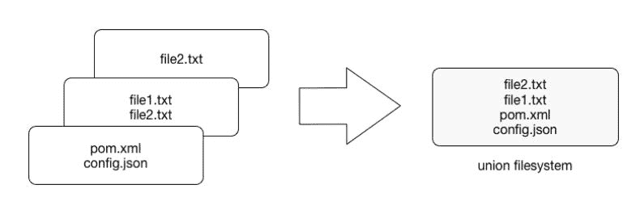

具有相同路径的目录的内容和结构在这些单独的文件系统中将在一个合并的目录中一起显示，在新的虚拟文件系统中。换句话说，顶层的文件系统结构将与下面的层的结构合并。具有与上一层相同路径的文件和目录将覆盖下面的文件和目录。删除上层将再次显示和暴露出先前的目录内容。正如我们之前提到的，层被堆叠放置，一层叠在另一层之上。为了保持层的顺序，Docker 利用了层 ID 和指针的概念。每个层包含 ID 和指向其父层的指针。没有指向父层的指针的层是堆栈中的第一层，即基础层。您可以在下图中看到这种关系：

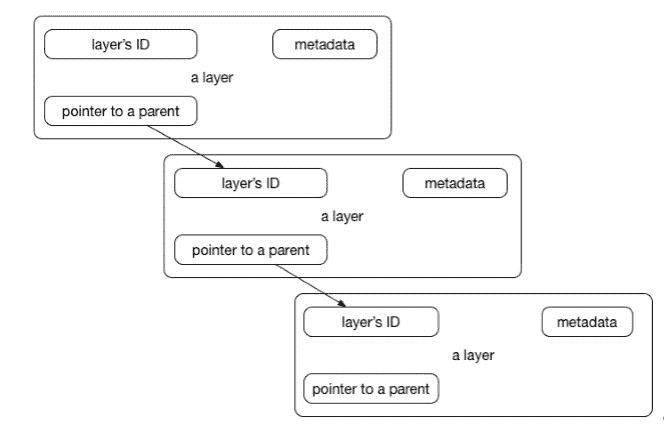

图层具有一些有趣的特性。首先，它们是可重用和可缓存的。你可以在前面的图表中看到指向父图层的指针是很重要的。当 Docker 处理 Dockerfile 时，它会查看两件事：正在执行的 Dockerfile 指令和父映像。Docker 将扫描父图层的所有子图层，并寻找其命令与当前指令匹配的图层。如果找到匹配的图层，Docker 将跳过下一个 Dockerfile 指令并重复该过程。如果在缓存中找不到匹配的图层，则会创建一个新的图层。对于向图像添加文件的指令（我们稍后将详细了解它们），Docker 为每个文件内容创建一个校验和。在构建过程中，将此校验和与现有图像的校验和进行比较，以检查是否可以从缓存中重用该图层。如果两个不同的图像有一个共同的部分，比如 Linux shell 或 Java 运行时，Docker 将在这两个图像中重用 shell 图层，Docker 跟踪所有已拉取的图层，这是一个安全的操作；正如你已经知道的，图层是只读的。当下载另一个图像时，将重用该图层，只有差异将从 Docker Hub 中拉取。这当然节省了时间、带宽和磁盘空间，但它还有另一个巨大的优势。如果修改了 Docker 图像，例如通过修改容器化的 Java 应用程序，只有应用程序图层会被修改。当你成功从 Dockerfile 构建了一个图像后，你会注意到同一 Dockerfile 的后续构建会快得多。一旦 Docker 为一条指令缓存了一个图像图层，它就不需要重新构建。后来，你只需推送更新的部分，而不是整个图像。这使得流程更简单、更快速。如果你在持续部署流程中使用 Docker，这将特别有用：推送一个 Git 分支将触发构建一个图像，然后发布应用程序给用户。由于图层重用的特性，整个流程会快得多。

可重用层的概念也是 Docker 比完整虚拟机轻量的原因之一，虚拟机不共享任何内容。多亏了层，当你拉取一个图像时，最终你不必下载其整个文件系统。如果你已经有另一个图像包含了你拉取的图像的一些层，那么只有缺失的层会被实际下载。不过，需要注意的是，层的另一个特性：除了可重用，层也是可加的。如果在容器中创建了一个大文件，然后进行提交（我们稍后会讲到），然后删除该文件，再进行另一个提交；这个文件仍然会存在于层历史中。想象一下这种情况：你拉取了基础的 Ubuntu 图像，并安装了 Wildfly 应用服务器。然后你改变主意，卸载了 Wildfly 并安装了 Tomcat。所有从 Wildfly 安装中删除的文件仍然会存在于图像中，尽管它们已经被删除。图像大小会迅速增长。理解 Docker 的分层文件系统可以在图像大小上产生很大的差异。当你将图像发布到注册表时，大小可能会成为一个问题；它需要更多的请求和更长的传输时间。

当需要在集群中部署数千个容器时，大型图像就会成为一个问题。例如，你应该始终意识到层的可加性，并尝试在 Dockerfile 的每一步优化图像，就像使用命令链接一样。在创建 Java 应用程序图像时，我们将使用命令链接技术。

因为层是可加的，它们提供了特定图像是如何构建的完整历史记录。这给了你另一个很棒的功能：可以回滚到图像历史中的某个特定点。由于每个图像包含了所有构建步骤，我们可以很容易地回到以前的步骤。这可以通过给某个层打标签来实现。我们将在本书的后面介绍图像标记。

层和镜像是密切相关的。正如我们之前所说，Docker 镜像被存储为一系列只读层。这意味着一旦容器镜像被创建，它就不会改变。但是，如果整个文件系统都是只读的，这就没有太多意义了。那么如何修改一个镜像？或者将您的软件添加到基本 Web 服务器镜像中？嗯，当我们启动一个容器时，Docker 实际上会取出只读镜像（以及所有只读层），并在层堆栈顶部添加一个可写层。现在让我们专注于容器。

# 容器

镜像的运行实例称为容器。Docker 使用 Docker 镜像作为只读模板来启动它们。如果您启动一个镜像，您将得到这个镜像的一个运行中的容器。当然，您可以有许多相同镜像的运行容器。实际上，我们将经常使用 Kubernetes 稍后做这件事。

要运行一个容器，我们使用`docker run`命令：

```
docker run [OPTIONS] IMAGE [COMMAND] [ARG...]

```

有很多可以使用的`run`命令选项和开关；我们稍后会了解它们。一些选项包括网络配置，例如（我们将在第二章 *Networking and Persistent Storage*中解释 Docker 的网络概念）。其他选项，比如`-it`（来自交互式），告诉 Docker 引擎以不同的方式运行；在这种情况下，使容器变得交互，并附加一个终端到其输出和输入。让我们专注于容器的概念，以更好地理解整个情况。我们将很快使用`docker run`命令来测试我们的设置。

那么，当我们运行`docker run`命令时，在幕后会发生什么呢？Docker 将检查您想要运行的镜像是否在本地计算机上可用。如果没有，它将从“远程”存储库中拉取下来。Docker 引擎会获取镜像并在镜像的层堆栈顶部添加一个可写层。接下来，它会初始化镜像的名称、ID 和资源限制，如 CPU 和内存。在这个阶段，Docker 还将通过从池中找到并附加一个可用的 IP 地址来设置容器的 IP 地址。执行的最后一步将是实际的命令，作为`docker run`命令的最后一个参数传递。如果使用了`it`选项，Docker 将捕获并提供容器输出，它将显示在控制台上。现在，您可以做一些通常在准备操作系统运行应用程序时会做的事情。这可以是安装软件包（例如通过`apt-get`），使用 Git 拉取源代码，使用 Maven 构建您的 Java 应用程序等。所有这些操作都将修改顶部可写层中的文件系统。然后，如果执行`commit`命令，将创建一个包含所有更改的新镜像，类似于冻结，并准备随后运行。要停止容器，请使用`docker stop`命令：

```
docker stop

```

停止容器时，将保留所有设置和文件系统更改（在可写的顶层）。在容器中运行的所有进程都将停止，并且内存中的所有内容都将丢失。这就是停止容器与 Docker 镜像的区别。

要列出系统上所有容器，无论是运行还是停止的，执行`docker ps`命令：

```
docker ps -a

```

结果，Docker 客户端将列出一个包含容器 ID（您可以用来在其他命令中引用容器的唯一标识符）、创建日期、用于启动容器的命令、状态、暴露端口和名称的表格，可以是您分配的名称，也可以是 Docker 为您选择的有趣的名称。要删除容器，只需使用`docker rm`命令。如果要一次删除多个容器，可以使用容器列表（由`docker ps`命令给出）和一个过滤器：

```
docker rm $(docker ps -a -q -f status=exited)

```

我们已经说过，Docker 图像始终是只读且不可变的。如果它没有改变图像的可能性，那么它就不会很有用。那么除了通过修改 Dockerfile 并进行重建之外，图像修改如何可能呢？当容器启动时，层堆栈顶部的可写层就可以使用了。我们实际上可以对运行中的容器进行更改；这可以是添加或修改文件，就像安装软件包、配置操作系统等一样。如果在运行的容器中修改文件，则该文件将从底层（父级）只读层中取出，并放置在顶部的可写层中。我们的更改只可能存在于顶层。联合文件系统将覆盖底层文件。原始的底层文件不会被修改；它仍然安全地存在于底层的只读层中。通过发出`docker commit`命令，您可以从运行中的容器（以及可写层中的所有更改）创建一个新的只读图像。

```
docker commit <container-id> <image-name>

```

`docker commit`命令会将您对容器所做的更改保存在可写层中。为了避免数据损坏或不一致，Docker 将暂停您要提交更改的容器。`docker commit`命令的结果是一个全新的只读图像，您可以从中创建新的容器：


作为对成功提交的回应，Docker 将输出新生成图像的完整 ID。如果您在没有首先发出`commit`的情况下删除容器，然后再次启动相同的图像，Docker 将启动一个全新的容器，而不会保留先前运行容器中所做的任何更改。无论哪种情况，无论是否有`commit`，对文件系统的更改都不会影响基本图像。通过更改容器中的顶部可写层来创建图像在调试和实验时很有用，但通常最好使用 Dockerfile 以文档化和可维护的方式管理图像。

我们现在已经了解了容器化世界中构建（Dockerfile 和图像）和运行时（容器）部分。我们还缺少最后一个元素，即分发组件。Docker 的分发组件包括 Docker 注册表、索引和存储库。现在让我们专注于它们，以便有一个完整的图片。

# Docker 注册表、存储库和索引

Docker 分发系统中的第一个组件是注册表。Docker 利用分层系统存储图像，如下面的屏幕截图所示：


您构建的图像可以存储在`远程`注册表中供他人使用。`Docker`注册表是一个存储 Docker 图像的服务（实际上是一个应用程序）。Docker Hub 是公开可用注册表的一个例子；它是免费的，并提供不断增长的现有图像的庞大集合。而存储库则是相关图像的集合（命名空间），通常提供相同应用程序或服务的不同版本。它是具有相同名称和不同标记的不同 Docker 图像的集合。

如果您的应用程序命名为`hello-world-java`，并且您的注册表的用户名（或命名空间）为`dockerJavaDeveloper`，那么您的图像将放在`dockerJavaDeveloper/hello-world-java`存储库中。您可以给图像打标签，并在单个命名存储库中存储具有不同 ID 的多个版本的图像，并使用特殊语法访问图像的不同标记版本，例如`username/image_name:tag`。`Docker`存储库与 Git 存储库非常相似。例如，`Git`，`Docker`存储库由 URI 标识，并且可以是公共的或私有的。URI 看起来与以下内容相同：

```
{registryAddress}/{namespace}/{repositoryName}:{tag}

```

Docker Hub 是默认注册表，如果不指定注册表地址，Docker 将从 Docker Hub 拉取图像。要在注册表中搜索图像，请执行`docker search`命令；例如：

```
$ docker search hello-java-world

```

如果不指定`远程`注册表，Docker 将在 Docker Hub 上进行搜索，并输出与您的搜索条件匹配的图像列表：


注册表和存储库之间的区别可能在开始时令人困惑，因此让我们描述一下如果执行以下命令会发生什么：

```
$ docker pull ubuntu:16.04

```

该命令从 Docker Hub 注册表中的`ubuntu`存储库中下载标记为`16.04`的镜像。官方的`ubuntu`存储库不使用用户名，因此在这个例子中省略了命名空间部分。

尽管 Docker Hub 是公开的，但您可以通过 Docker Hub 用户帐户免费获得一个私有仓库。最后，但并非最不重要的是，您应该了解的组件是索引。索引管理搜索和标记，还管理用户帐户和权限。实际上，注册表将身份验证委托给索引。在执行远程命令，如“推送”或“拉取”时，索引首先会查看图像的名称，然后检查是否有相应的仓库。如果有，索引会验证您是否被允许访问或修改图像。如果允许，操作将获得批准，注册表将获取或发送图像。

让我们总结一下我们到目前为止学到的东西：

+   Dockerfile 是构建图像的配方。它是一个包含有序指令的文本文件。每个 Dockerfile 都有一个基本图像，您可以在其上构建

+   图像是文件系统的特定状态：一个只读的、冻结的不可变的快照

+   图像由代表文件系统在不同时间点的更改的层组成；层与 Git 仓库的提交历史有些相似。Docker 使用层缓存

+   容器是图像的运行时实例。它们可以运行或停止。您可以运行多个相同图像的容器

+   您可以对容器上的文件系统进行更改并提交以使其持久化。提交总是会创建一个新的图像

+   只有文件系统更改可以提交，内存更改将丢失

+   注册表保存了一系列命名的仓库，这些仓库本身是由它们的 ID 跟踪的图像的集合。注册表与 Git 仓库相同：您可以“推送”和“拉取”图像

现在您应该对具有层和容器的图像的性质有所了解。但 Docker 不仅仅是一个 Dockerfile 处理器和运行时引擎。让我们看看还有什么其他可用的东西。

# 附加工具

这是一个完整的软件包，其中包含了许多有用的工具和 API，可以帮助开发人员和 DevOp 在日常工作中使用。例如，有一个 Kinematic，它是一个用于在 Windows 和 macOS X 上使用 Docker 的桌面开发环境。

从 Java 开发者的角度来看，有一些工具特别适用于程序员日常工作，比如 IntelliJ IDEA 的 Docker 集成插件（我们将在接下来的章节中大量使用这个插件）。Eclipse 的粉丝可以使用 Eclipse 的 Docker 工具，该工具从 Eclipse Mars 版本开始可用。NetBeans 也支持 Docker 命令。无论您选择哪种开发环境，这些插件都可以让您从您喜爱的 IDE 直接下载和构建 Docker 镜像，创建和启动容器，以及执行其他相关任务。

Docker 如今非常流行，难怪会有数百种第三方工具被开发出来，以使 Docker 变得更加有用。其中最突出的是 Kubernetes，这是我们在本书中将要重点关注的。但除了 Kubernetes，还有许多其他工具。它们将支持您进行与 Docker 相关的操作，如持续集成/持续交付、部署和基础设施，或者优化镜像。数十个托管服务现在支持运行和管理 Docker 容器。

随着 Docker 越来越受到关注，几乎每个月都会涌现出更多与 Docker 相关的工具。您可以在 GitHub 的 awesome Docker 列表上找到一个非常精心制作的 Docker 相关工具和服务列表，网址为 https://github.com/veggiemonk/awesome-docker。

但不仅有可用的工具。此外，Docker 提供了一组非常方便的 API。其中之一是用于管理图像和容器的远程 API。使用此 API，您将能够将图像分发到运行时 Docker 引擎。还有统计 API，它将公开容器的实时资源使用信息（如 CPU、内存、网络 I/O 和块 I/O）。此 API 端点可用于创建显示容器行为的工具；例如，在生产系统上。

现在我们知道了 Docker 背后的理念，虚拟化和容器化之间的区别，以及使用 Docker 的好处，让我们开始行动吧。我们将首先安装 Docker。

# 安装 Docker

在本节中，我们将了解如何在 Windows、macOS 和 Linux 操作系统上安装 Docker。接下来，我们将运行一个示例`hello-world`图像来验证设置，并在安装过程后检查一切是否正常运行。

Docker 的安装非常简单，但有一些事情需要注意，以使其顺利运行。我们将指出这些问题，以使安装过程变得轻松。您应该知道，Linux 是 Docker 的自然环境。如果您运行容器，它将在 Linux 内核上运行。如果您在运行 Linux 上的 Docker 上运行容器，它将使用您自己机器的内核。这在 macOS 和 Windows 上并非如此；这就是为什么如果您想在这些操作系统上运行 Docker 容器，就需要虚拟化 Linux 内核的原因。当 Docker 引擎在 macOS 或 MS Windows 上运行时，它将使用轻量级的 Linux 发行版，专门用于运行 Docker 容器。它完全运行于 RAM 中，仅使用几兆字节，并在几秒钟内启动。在 macOS 和 Windows 上安装了主要的 Docker 软件包后，默认情况下将使用操作系统内置的虚拟化引擎。因此，您的机器有一些特殊要求。对于最新的本地 Docker 设置，它深度集成到操作系统中的本地虚拟化引擎中，您需要拥有 64 位的 Windows 10 专业版或企业版。对于 macOS，最新的 Docker for Mac 是一个全新开发的本地 Mac 应用程序，具有本地用户界面，集成了 OS X 本地虚拟化、hypervisor 框架、网络和文件系统。强制要求是 Yosemite 10.10.3 或更新版本。让我们从在 macOS 上安装开始。

# 在 macOS 上安装

要获取 Mac 的本地 Docker 版本，请转到[h](http://www.docker.com) [t](http://www.docker.com) [t](http://www.docker.com) [p](http://www.docker.com) [://w](http://www.docker.com) [w](http://www.docker.com) [w](http://www.docker.com) [.](http://www.docker.com) [d](http://www.docker.com) [o](http://www.docker.com) [c](http://www.docker.com) [k](http://www.docker.com) [e](http://www.docker.com) [r](http://www.docker.com) [.](http://www.docker.com) [c](http://www.docker.com) [o](http://www.docker.com) [m](http://www.docker.com)，然后转到获取 Docker macOS 部分。Docker for Mac 是一个标准的本地`dmg`软件包，您可以挂载。您将在软件包中找到一个单一的应用程序：

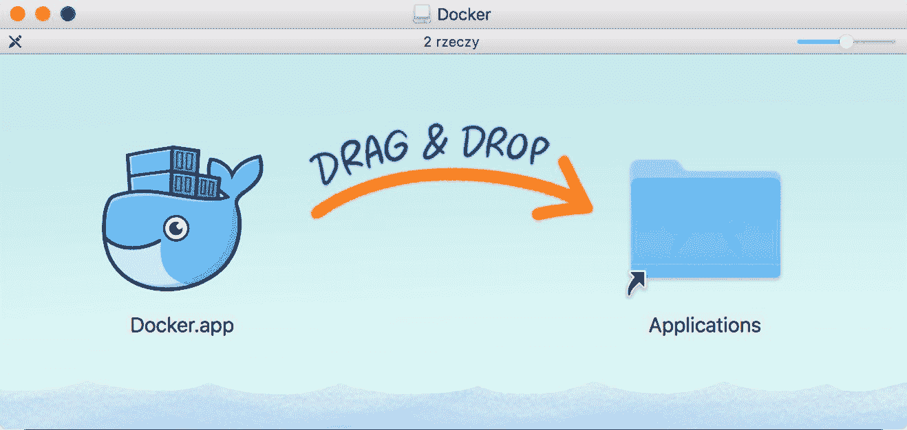

现在只需将`Docker.app`移动到您的`Applications`文件夹中，就可以了。再也没有更简单的了。如果您运行 Docker，它将作为 macOS 菜单中的一个小鲸鱼图标。该图标将在 Docker 启动过程中进行动画显示，并在完成后稳定下来：

+   如果您现在点击图标，它将为您提供一个方便的菜单，其中包含 Docker 状态和一些附加选项：

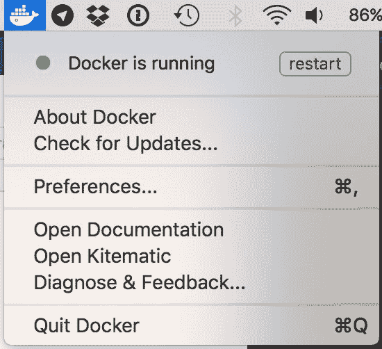

+   Docker for Mac 具有自动更新功能，这对于保持安装程序最新非常有用。首选项...窗格为您提供了自动检查更新的可能性；它默认标记为：

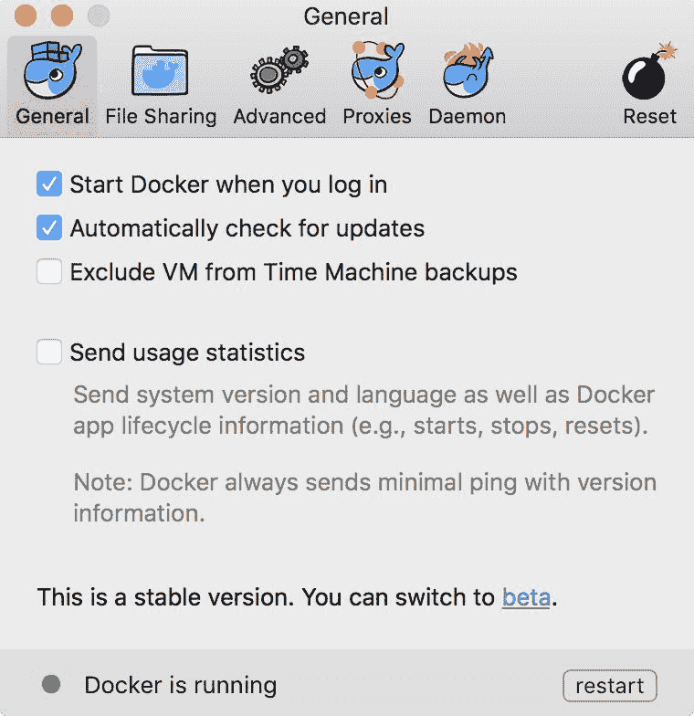

+   如果您是一个勇敢的人，您还可以切换到 beta 频道以获取更新。这样，您就可以始终拥有最新和最棒的 Docker 功能，但也会面临稳定性降低的风险，就像使用 beta 软件一样。还要注意，切换到 beta 频道将卸载当前稳定版本的 Docker 并销毁所有设置和容器。Docker 会警告您，以确保您真的想这样做：


+   首选项...的文件共享窗格将为您提供一个选项，可以将您的 macOS 目录标记为将来要运行的 Docker 容器中的绑定挂载。我们将在本书的后面详细解释挂载目录。目前，让我们只使用默认的一组选定目录：

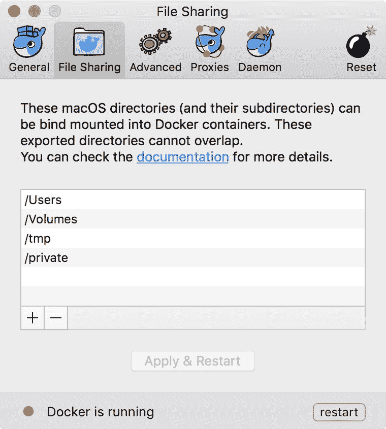

+   高级窗格有一些选项，可以调整您的计算机为 Docker 提供的资源，包括处理器数量和内存量。如果您在 macOS 上开始使用 Docker，通常默认设置是一个很好的开始：


+   代理窗格为您提供了在您的计算机上设置代理的可能性。您可以选择使用系统或手动设置，如下面的屏幕截图所示：


+   在下一页，您可以编辑一些 Docker 守护程序设置。这将包括添加注册表和注册表镜像。Docker 在拉取镜像时将使用它们。高级选项卡包含一个文本字段，您可以在其中输入包含守护程序配置的 JSON 文本：

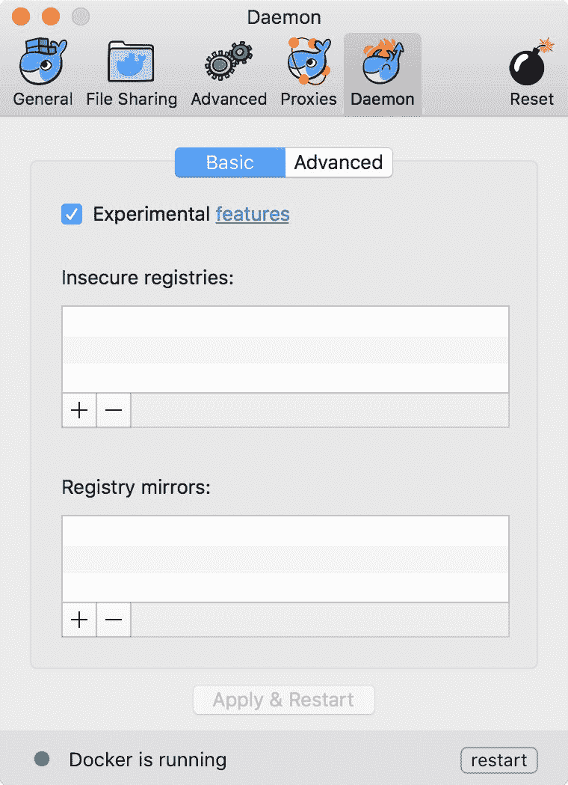

+   在守护程序窗格中，您还可以关闭 Docker 实验功能。有段时间以来，默认情况下已启用实验功能。不时，新版本的 Docker 会带来新的实验功能。在撰写本书时，它们将包括例如 Checkpoint & Restore（允许您通过对其进行检查点来冻结运行中的容器的功能），Docker 图形驱动程序插件（用于使用外部/独立进程图形驱动程序与 Docker 引擎一起使用的功能，作为使用内置存储驱动程序的替代方案），以及其他一些功能。了解新版本 Docker 中包含了哪些新功能总是很有趣。单击守护程序页面中的链接将带您转到 GitHub 页面，该页面列出并解释了所有新的实验功能。

+   最后一个“首选项...”窗格是“重置”。如果您发现您的 Docker 无法启动或表现不佳，您可以尝试将 Docker 安装重置为出厂默认设置：

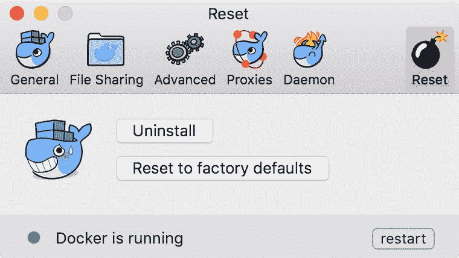

但是，您应该注意，将 Docker 重置为出厂状态也将删除您可能在计算机上拥有的所有已下载的镜像和容器。如果您有尚未推送到任何地方的镜像，首先备份总是一个好主意。

在 Docker 菜单中打开 Kitematic 是打开我们之前提到的 Kitematic 应用程序的便捷快捷方式。这是一个用于在 Windows 和 Mac OS X 上使用 Docker 的桌面实用程序。如果您尚未安装 Kitematic，Docker 将为您提供安装包的链接：


+   如果您运行 Kitematic，它将首先呈现 Docker Hub 登录屏幕。您现在可以注册 Docker Hub，然后提供用户名和密码登录：

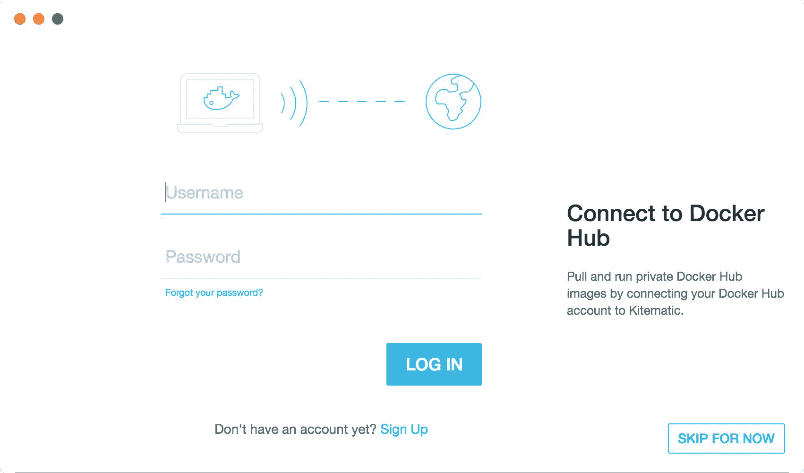

单击“暂时跳过”将带您到图像列表，而无需登录到 Docker Hub。让我们通过拉取和运行图像来测试我们的安装。让我们搜索`hello-java-world`，如下面的屏幕截图所示：

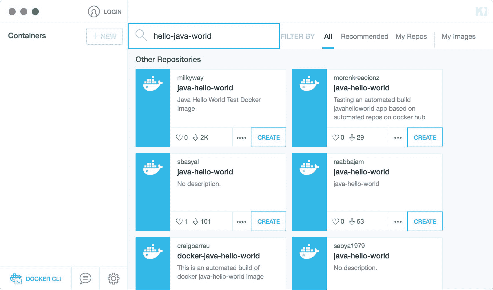

从注册表中拉取图像后，启动它。Kitematic 将呈现正在运行的容器日志，其中将是来自容器化的 Java 应用程序的著名`hello world`消息：

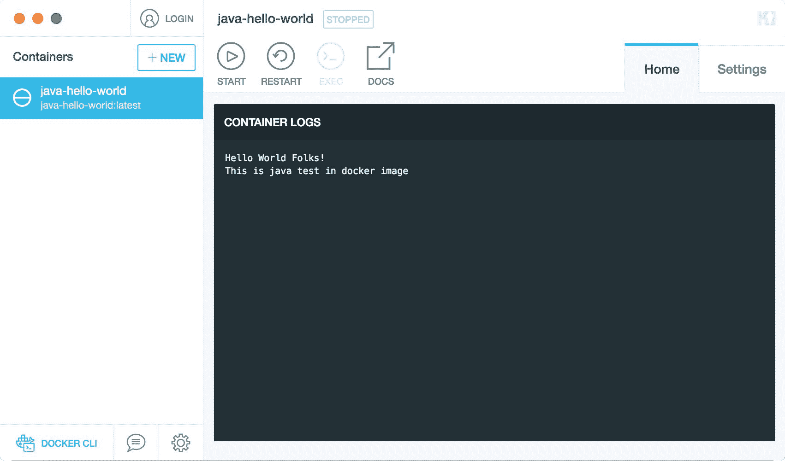

这就是在 Kitematic 中运行容器的全部内容。让我们尝试从 shell 中执行相同的操作。在终端中执行以下操作：

```
$ docker run milkyway/java-hello-world

```

因此，您将看到来自容器化的 Java 应用程序的相同问候，这次是在 macOS 终端中：

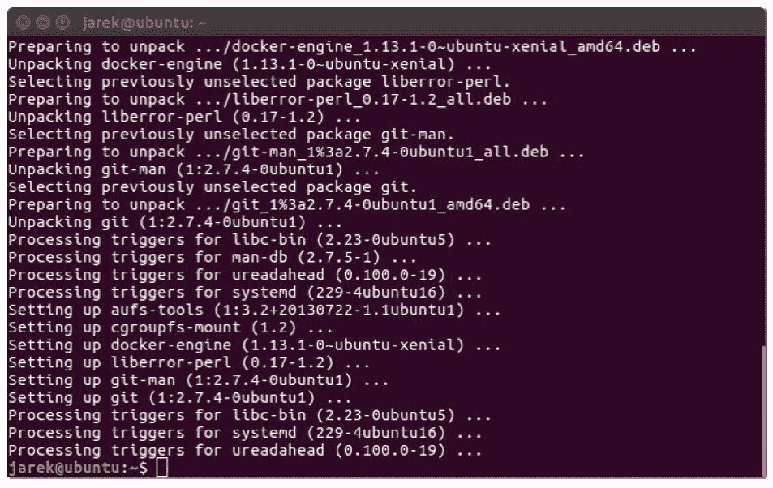

就是这样，我们在 macOS 上有一个本地的 Docker 正在运行。让我们在 Linux 上安装它。

# 在 Linux 上安装

有很多不同的 Linux 发行版，每个 Linux 发行版的安装过程可能会有所不同。我将在最新的 16.04 Ubuntu 桌面上安装 Docker：

1.  首先，我们需要允许`apt`软件包管理器使用 HTTPS 协议的存储库。从 shell 中执行：

```
$ sudo apt-get install -y --no-install-recommends apt-transport-https ca-certificates curl software-properties-common

```

1.  接下来要做的事情是将 Docker 的`apt`存储库`gpg`密钥添加到我们的`apt`源列表中：

```
$ curl -fsSL https://download.docker.com/linux/ubuntu/gpg | sudo apt-key add –

```

1.  成功后，简单的`OK`将是响应。使用以下命令设置稳定的存储库：

```
$ sudo add-apt-repository "deb [arch=amd64] https://download.docker.com/linux/ubuntu $(lsb_release -cs) stable"

```

1.  接下来，我们需要更新`apt`软件包索引：

```
$ sudo apt-get update

```

1.  现在我们需要确保`apt`安装程序将使用官方的 Docker 存储库，而不是默认的 Ubuntu 存储库（其中可能包含较旧版本的 Docker）：

```
$ apt-cache policy docker-ce

```

1.  使用此命令安装最新版本的 Docker：

```
$ sudo apt-get install -y docker-ce

```

1.  `apt`软件包管理器将下载许多软件包；这些将是所需的依赖项和`docker-engine`本身：

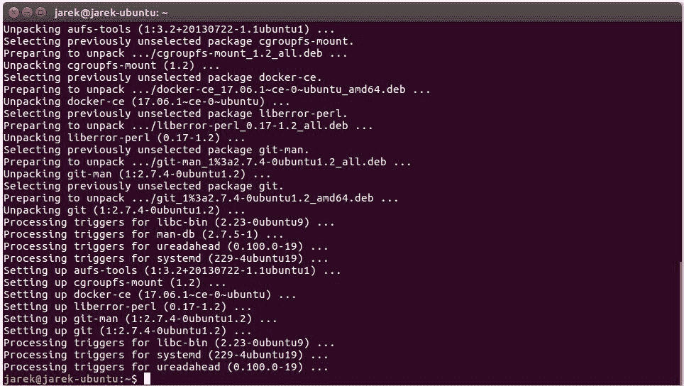

1.  就是这样，您应该已经准备好了。让我们验证一下 Docker 是否在我们的 Linux 系统上运行：

```
$sudo docker run milkyway/java-hello-world

```

1.  正如您所看到的，Docker 引擎将从 Docker Hub 拉取`milkyway/java-hello-world`镜像及其所有层，并以问候语作出响应：


但是我们需要用`sudo`运行 Docker 命令吗？原因是 Docker 守护程序始终以`root`用户身份运行，自 Docker 版本 0.5.2 以来，Docker 守护程序绑定到 Unix 套接字而不是 TCP 端口。默认情况下，该 Unix 套接字由用户`root`拥有，因此，默认情况下，您可以使用 sudo 访问它。让我们修复它，以便能够以普通用户身份运行`Docker`命令：

1.  首先，如果还不存在`Docker`组，请添加它：

```
$ sudo groupadd docker

```

1.  然后，将您自己的用户添加到 Docker 组。将用户名更改为与您首选的用户匹配：

```
$ sudo gpasswd -a jarek docker

```

1.  重新启动 Docker 守护程序：

```
$ sudo service docker restart

```

1.  现在让我们注销并再次登录，并且再次执行`docker run`命令，这次不需要`sudo`。正如您所看到的，您现在可以像普通的非`root`用户一样使用 Docker 了：

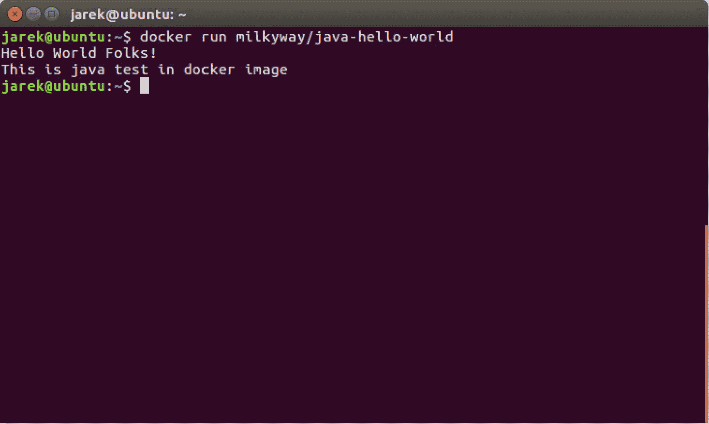

1.  就是这样。我们的 Linux Docker 安装已准备就绪。现在让我们在 Windows 上进行安装。

# 在 Windows 上安装

本机 Docker 软件包可在 64 位 Windows 10 专业版或企业版上运行。它使用 Windows 10 虚拟化引擎来虚拟化 Linux 内核。这就是安装包不再包含 VirtualBox 设置的原因，就像以前的 Docker for Windows 版本一样。本机应用程序以典型的`.msi`安装包提供。如果你运行它，它会向你打招呼，并说它将从现在开始生活在你的任务栏托盘下，小鲸鱼图标下：

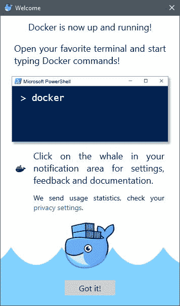

托盘中的 Docker 图标会告诉你 Docker 引擎的状态。它还包含一个小但有用的上下文菜单：


让我们探索偏好设置，看看有什么可用的。第一个选项卡，常规，允许你设置 Docker 在你登录时自动运行。如果你每天使用 Docker，这可能是推荐的设置。你也可以标记自动检查更新并发送使用统计信息。发送使用统计信息将帮助 Docker 团队改进未来版本的工具；除非你有一些关键任务、安全工作要完成，我建议打开这个选项。这是为未来版本贡献的好方法：

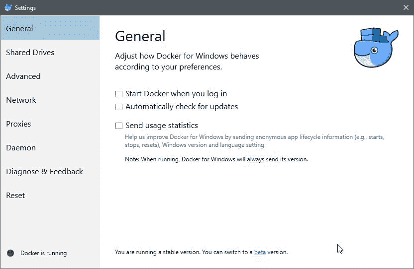

第二个选项卡，共享驱动器，允许你选择本地 Windows 驱动器，这些驱动器将可用于你将要运行的 Docker 容器：

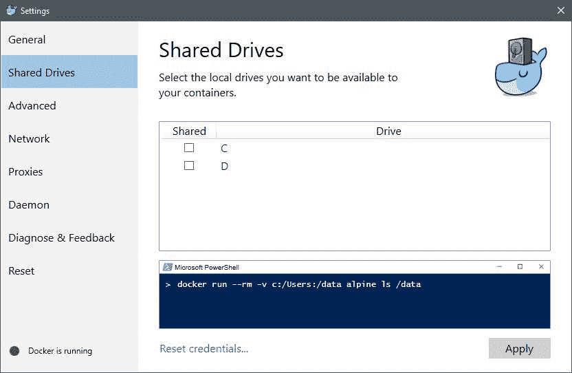

我们将在第二章中介绍 Docker 卷，*网络和持久存储*。在这里选择一个驱动器意味着你可以映射本地系统的一个目录，并将其作为 Windows 主机机器读取到你的 Docker 容器中。下一个偏好设置页面，高级，允许我们对在我们的 Windows PC 上运行的 Docker 引擎进行一些限制，并选择 Linux 内核的虚拟机镜像的位置：

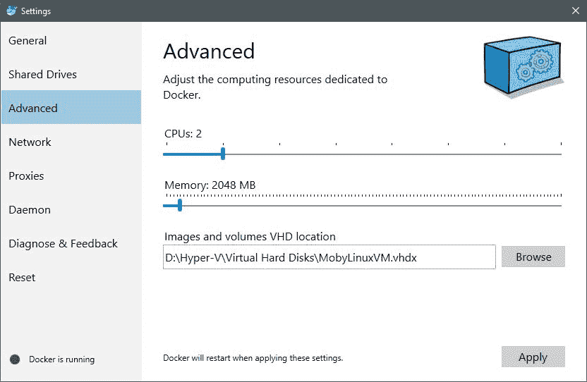

默认值通常是开箱即用的，除非在开发过程中遇到问题，我建议保持它们不变。网络让你配置 Docker 与网络的工作方式，与子网地址和掩码或 DNS 服务器一样。我们将在第二章中介绍 Docker 网络，*网络和持久存储*：

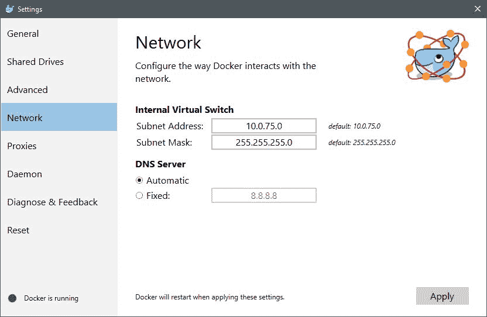

如果你在网络中使用代理，并希望 Docker 访问互联网，你可以在代理选项卡中设置代理设置：


对话框类似于您在其他应用程序中找到的，您可以在其中定义代理设置。它可以接受无代理、系统代理设置或手动设置（使用不同的代理进行 HTPP 和 HTTPS 通信）。下一个窗格可以用来配置 Docker 守护程序：


基本开关意味着 Docker 使用基本配置。您可以将其切换到高级，并以 JSON 结构的形式提供自定义设置。实验性功能与我们在 macOS 上进行 Docker 设置时已经提到的相同，这将是 Checkpoint & Restore 或启用 Docker 图形驱动程序插件，例如。您还可以指定远程注册表的列表。Docker 将从不安全的注册表中拉取图像，而不是使用纯粹的 HTTP 而不是 HTTPS。

在最后一个窗格上使用重置选项可以让您重新启动或将 Docker 重置为出厂设置：


请注意，将 Docker 重置为其初始设置也将删除当前在您的计算机上存在的所有镜像和容器。

“打开 Kitematic...”选项也出现在 Docker 托盘图标上下文菜单中，这是启动 Kitematic 的快捷方式。如果您是第一次这样做，并且没有安装 Kitematic，Docker 会询问您是否想要先下载它：


安装 Docker for Windows 就是这样。这是一个相当轻松的过程。在安装过程的最后一步，让我们检查一下 Docker 是否可以从命令提示符中运行，因为这可能是您将来启动它的方式。在命令提示符或 PowerShell 中执行以下命令：

```
docker run milkyway/java-hello-world

```

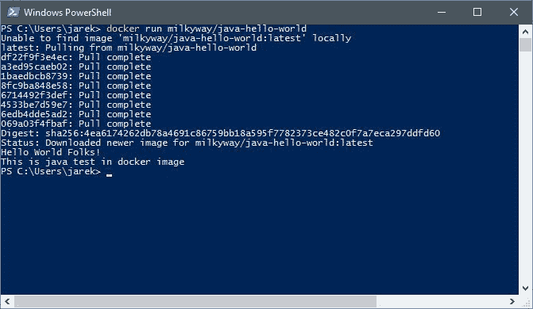

正如您在上一个屏幕截图中所看到的，我们有一个来自作为 Docker 容器启动的 Java 应用程序的 Hello World 消息。

# 摘要

就是这样。我们的 Docker for Windows 安装已经完全可用。在本章中，我们已经了解了 Docker 背后的理念以及传统虚拟化和容器化之间的主要区别。我们对 Docker 的核心概念，如镜像、层、容器和注册表，了解很多。我们应该已经在本地计算机上安装了 Docker；现在是时候继续学习更高级的 Docker 功能，比如网络和持久存储了。
