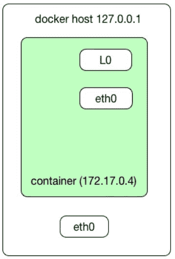
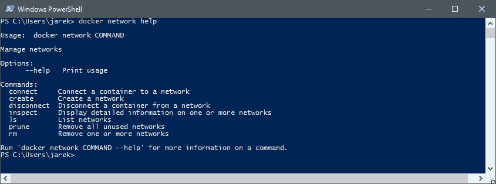
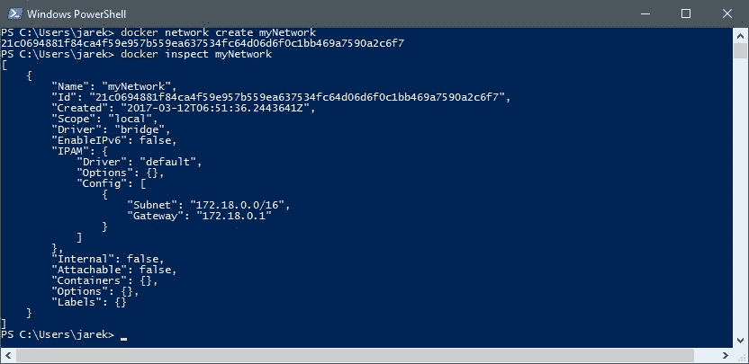
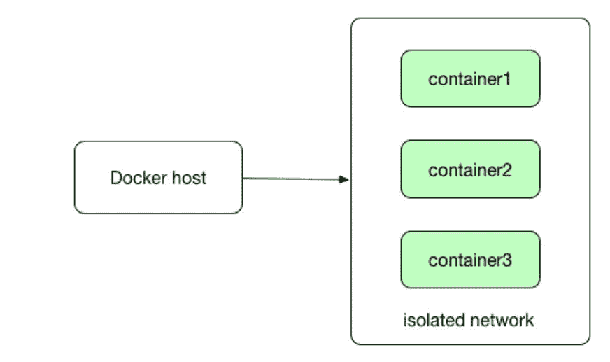
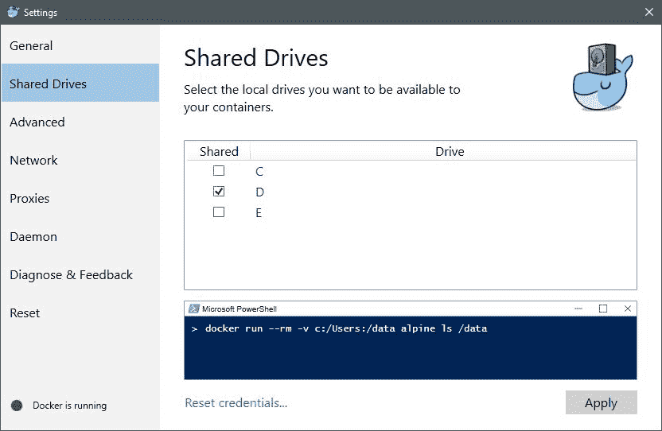

# 网络和持久存储

在上一章中，我们学到了很多关于 Docker 概念的知识。我们知道容器是镜像的运行时。它将包含您的 Java 应用程序以及所有所需的依赖项，如 JRE 或应用程序服务器。但是，很少有情况下 Java 应用程序是自给自足的。它总是需要与其他服务器通信（如数据库），或者向其他人公开自己（如在应用程序服务器上运行的 Web 应用程序，需要接受来自用户或其他应用程序的请求）。现在是描述如何将 Docker 容器开放给外部世界、网络和持久存储的时候了。在本章中，您将学习如何配置网络，并公开和映射网络端口。通过这样做，您将使您的 Java 应用程序能够与其他容器通信。想象一下以下情景：您可以有一个容器运行 Tomcat 应用程序服务器与您的 Java 应用程序通信，与另一个运行数据库的容器通信，例如`PostgreSQL`。虽然 Kubernetes 对网络的处理方式与 Docker 默认提供的有些不同，但让我们先简要地关注 Docker 本身。稍后我们将介绍 Kubernetes 的特定网络。容器与外部世界的通信不仅仅是关于网络；在本章中，我们还将关注数据卷作为在容器运行和停止周期之间持久保存数据的一种方式。

本章涵盖以下主题：

+   Docker 网络类型

+   网络命令

+   创建网络

+   映射和暴露端口

+   与卷相关的命令

+   创建和删除卷

让我们从 Docker 网络开始。

# 网络

为了使您的容器能够与外部世界通信，无论是另一个服务器还是另一个 Docker 容器，Docker 提供了不同的配置网络的方式。让我们从可用于我们的容器的网络类型开始。

# Docker 网络类型

Docker 提供了三种不同的网络类型。要列出它们，请执行`docker network ls`命令：

```
$ docker network ls

```

Docker 将输出包含唯一网络标识符、名称和在幕后支持它的驱动程序的可用网络列表：


为了了解各种网络类型之间的区别，让我们现在逐一描述它们。

# 桥接

这是 Docker 中的默认网络类型。当 Docker 服务守护程序启动时，它会配置一个名为`docker0`的虚拟桥。如果您没有使用`docker run -net=<NETWORK>`选项指定网络，Docker 守护程序将默认将容器连接到桥接网络。此外，如果您创建一个新的容器，它将连接到桥接网络。对于 Docker 创建的每个容器，它都会分配一个虚拟以太网设备，该设备将连接到桥上。虚拟以太网设备被映射为在容器中显示为`eth0`，使用 Linux 命名空间，如您可以在以下图表中看到的那样：


`in-container eth0`接口从桥的地址范围中获得一个 IP 地址。换句话说，Docker 将从桥可用的范围中找到一个空闲的 IP 地址，并配置容器的`eth0`接口为该 IP 地址。从现在开始，如果新容器想要连接到互联网，它将使用桥；主机自己的 IP 地址。桥将自动转发连接到它的任何其他网络接口之间的数据包，并允许容器与主机机器以及同一主机上的容器进行通信。桥接网络可能是最常用的网络类型。

# 主机

这种类型的网络只是将容器放在主机的网络堆栈中。也就是说，主机上定义的所有网络接口都可以被容器访问，如您可以在以下图表中看到的那样：



如果您使用`-net=host`选项启动容器，那么容器将使用主机网络。它将与普通网络一样快：没有桥接，没有转换，什么都没有。这就是为什么当您需要获得最佳网络性能时，它可能会有用。在主机网络堆栈中运行的容器将比在桥接网络上运行的容器实现更快的网络性能，无需穿越`docker0` `bridge`和`iptables`端口映射。在主机模式下，容器共享主机的网络命名空间（例如您的本地计算机），直接暴露给外部世界。通过使用`-net=host`命令开关，您的容器将通过主机的 IP 地址访问。但是，您需要意识到这可能是危险的。如果您有一个以 root 身份运行的应用程序，并且它有一些漏洞，那么存在主机网络被 Docker 容器远程控制的风险。使用主机网络类型还意味着您需要使用端口映射来访问容器内的服务。我们将在本章后面介绍端口映射。

# 无

长话短说，none 网络根本不配置网络。这种网络类型不使用任何驱动程序。当您不需要容器访问网络时，`-net=none`开关将完全禁用`docker run`命令的网络。

Docker 提供了一组简短的命令来处理网络。您可以从 shell（Linux 或 macOS）或 Windows 的命令提示符和 PowerShell 中运行它们。现在让我们来了解它们。

# 网络命令

在 Docker 中管理网络的父命令是`docker network`。您可以使用`docker network help`命令列出整个命令集，如下面的屏幕截图所示：



要获得特定命令的每个选项的详细语法和描述，请对每个命令使用`-help`开关。例如，要获取`docker network create`可用参数的描述，执行`docker network create -help`。

让我们简要描述每个可用的命令：

+   `**$ docker network ls**`：这是我们之前使用的命令，它简单地列出了容器可用的网络。它将输出网络标识符、名称、使用的驱动程序和网络的范围。

+   `**$ docker network create**`：创建新网络。命令的完整语法是，`docker network create [OPTIONS] NETWORK`。我们将在短时间内使用该命令

+   `**$ docker network rm**`：`dockercnetworkcrm`命令简单地删除网络

+   `**$ docker network connect**`：将容器连接到特定网络

+   `**$ docker network disconnect**`：正如其名称所示，它将断开容器与网络的连接

+   `**$ docker network inspect**`：docker network inspect 命令显示有关网络的详细信息。如果您遇到网络问题，这非常有用。我们现在要创建和检查我们的网络

`docker network` inspect 命令显示有关网络的详细信息。如果您遇到网络问题，这非常有用。我们现在要创建和检查我们的网络。

# 创建和检查网络

让我们创建一个网络。我们将称我们的网络为`myNetwork`。从 shell 或命令行执行以下命令：

```
$ docker network create myNetwork

```

这是命令的最简单形式，但可能会经常使用。它采用默认驱动程序（我们没有使用任何选项来指定驱动程序，我们将只使用默认的桥接驱动程序）。作为输出，Docker 将打印出新创建的网络的标识符：


稍后您将使用此标识符来连接容器或检查网络属性。命令的最后一个参数是网络的名称，这比 ID 更方便和更容易记住。在我们的情况下，网络名称是`myNetwork`。`docker network` create 命令接受更多参数，如下表所示：

| **选项** | **描述** |
| --- | --- |
| `-d, -driver="bridge"` | 管理网络的驱动程序 |
| `-aux-address=map[]` | 网络驱动程序使用的辅助 IPv4 或 IPv6 地址 |
| `-gateway=[]` | 主子网的 IPv4 或 IPv6 网关 |
| `-ip-range=[]` | 从子范围分配容器 IP |
| `-ipam-driver=default` | IP 地址管理驱动程序 |
| `-o`，`-opt=map[]` | 设置驱动程序的特定选项 |
| `-subnet=[]` | 以 CIDR 格式表示网络段的子网 |

最重要的参数之一是`-d`（`--driver`）选项，默认值为 bridge。驱动程序允许您指定网络类型。您记得，Docker 默认提供了几个驱动程序：`host`，`bridge`和`none`。

创建网络后，我们可以使用`docker network inspect`命令检查其属性。从 shell 或命令行执行以下操作：

```
$ docker network inspect myNetwork

```

作为回应，你将获得关于你的网络的大量详细信息。正如你在截图中看到的，我们新创建的网络使用桥接驱动程序，即使我们没有明确要求使用它：



正如你所看到的，容器列表是空的，原因是我们还没有将任何容器连接到这个网络。让我们现在来做。

# 将容器连接到网络

现在我们的`myNetwork`准备就绪，我们可以运行 Docker 容器并将其附加到网络。要启动容器，我们将使用`docker run --net=<NETWORK>`选项，其中`<NETWORK>`是默认网络之一的名称，或者是你自己创建的网络的名称。例如，让我们运行 Apache Tomcat，这是 Java Servlet 和 JavaServer 页面技术的开源实现：

```
docker run -it --net=myNetwork tomcat

```

这将需要一些时间。Docker 引擎将从 Docker Hub 拉取所有 Tomcat 镜像层，然后运行 Tomcat 容器。还有另一种选项可以将网络附加到容器上，你可以告诉 Docker 你希望容器连接到其他容器使用的相同网络。这样，你不需要显式指定网络，只需告诉 Docker 你希望两个容器在同一网络上运行。要做到这一点，使用`container:`前缀，就像下面的例子一样：

```
docker run -it --net=bridge myTomcat

docker run -it --net=container:myTomcat myPostgreSQL

```

在前面的例子中，我们使用桥接网络运行了`myTomcat`镜像。下一个命令将使用与`myTomcat`相同的网络运行`myPostgreSQL`镜像。这是一个非常常见的情况；你的应用程序将在与数据库相同的网络上运行，这将允许它们进行通信。当然，你在同一网络中启动的容器必须在同一 Docker 主机上运行。网络中的每个容器都可以直接与网络中的其他容器通信。尽管如此，网络本身会将容器与外部网络隔离开来，如下图所示：



如果在桥接、隔离网络中运行容器，我们需要指示 Docker 如何将容器的端口映射到主机的端口。我们现在要做的就是这个。

# 暴露端口和映射端口

通常情况下，当您希望容器化应用程序接受传入连接时，无论是来自其他容器还是来自 Docker 之外，都会出现这种情况。它可以是一个在端口 80 上监听的应用服务器，也可以是一个接受传入请求的数据库。

镜像可以暴露端口。暴露端口意味着您的容器化应用程序将在暴露的端口上监听。例如，Tomcat 应用服务器默认将在端口`8080`上监听。在同一主机和同一网络上运行的所有容器都可以与该端口上的 Tomcat 通信。暴露端口可以通过两种方式完成。它可以在 Dockerfile 中使用`EXPOSE`指令（我们将在稍后关于创建镜像的章节中进行）或者在`docker run`命令中使用`--expose`选项。接下来是这个官方 Tomcat 镜像的 Dockerfile 片段（请注意，为了示例的清晰度，它已经被缩短）：

```
FROM openjdk:8-jre-alpine

ENV CATALINA_HOME /usr/local/tomcat

ENV PATH $CATALINA_HOME/bin:$PATH

RUN mkdir -p "$CATALINA_HOME"

WORKDIR $CATALINA_HOME

EXPOSE 8080

CMD ["catalina.sh", "run"]

```

正如您所看到的，在 Dockerfile 的末尾附近有一个`EXPOSE 8080`指令。这意味着我们可以期望该容器在运行时将监听端口号`8080`。让我们再次运行最新的 Tomcat 镜像。这次，我们还将为我们的容器命名为`myTomcat`。使用以下命令启动应用服务器：

```
docker run -it --name myTomcat --net=myNetwork tomcat

```

为了检查同一网络上的容器是否可以通信，我们将使用另一个镜像`busybox`。BusyBox 是一种软件，它在一个可执行文件中提供了几个精简的 Unix 工具。让我们在单独的 shell 或命令提示符窗口中运行以下命令：

```
docker run -it --net container:myTomcat busybox

```

正如您所看到的，我们已经告诉 Docker，我们希望我们的`busybox`容器使用与 Tomcat 相同的网络。作为另一种选择，当然也可以使用`--net myNetwork`选项显式指定网络名称。

让我们检查它们是否确实可以通信。在运行`busybox`的 shell 窗口中执行以下操作：

```
$ wget localhost:8080

```

上一个指令将在另一个容器上监听的端口`8080`上执行`HTTP GET`请求。在成功下载 Tomcat 的`index.html`之后，我们证明了两个容器可以通信：


到目前为止，运行在同一主机和同一网络上的容器可以相互通信。但是如何与外部通信呢？端口映射派上了用场。我们可以将 Docker 容器暴露的端口映射到主机的端口上，这将是我们的本地主机。总体思路是我们希望主机上的端口映射到运行容器中的特定端口，就像 Tomcat 容器的端口号`8080`一样。

绑定主机到容器的端口（或一组端口），我们使用`docker run`命令的`-p`标志，如下例所示：

```
$ docker run -it --name myTomcat2 --net=myNetwork -p 8080:8080 tomcat

```

上一个命令运行了另一个 Tomcat 实例，也连接到`myNetwork`网络。然而，这一次，我们将容器的端口`8080`映射到相同编号的主机端口。`-p`开关的语法非常简单：只需输入主机端口号，冒号，然后是您想要映射的容器中的端口号：

```
$ docker run -p <hostPort>:<containerPort> <image ID or name>

```

Docker 镜像可以使用 Dockerfile 中的`EXPOSE`指令（例如`EXPOSE 7000-8000`）或`docker run`命令向其他容器暴露一系列端口，例如：

```
$ docker run --expose=7000-8000 <container ID or name>

```

然后，您可以使用`docker run`命令将一系列端口从主机映射到容器：

```
$ docker run -p 7000-8000:7000-8000 <container ID or name>

```

让我们验证一下是否可以从 Docker 外部访问 Tomcat 容器。为此，让我们运行带有映射端口的 Tomcat：

```
$ docker run -it --name myTomcat2 --net=myNetwork -p 8080:8080 tomcat 

```

然后，我们可以在我们喜爱的网络浏览器中输入以下地址：`http://localhost:8080`。

结果，我们可以看到 Tomcat 的默认欢迎页面，直接从运行的 Docker 容器中提供，如下截图所示：


很好，我们可以从 Docker 外部与我们的容器通信。顺便说一句，我们现在在主机上有两个隔离的 Tomcat 运行，没有任何端口冲突、资源冲突等。这就是容器化的力量。

您可能会问，暴露和映射端口之间有什么区别，也就是`--expose`开关和`-p`开关之间有什么区别？嗯，`--expose`将在运行时暴露一个端口，但不会创建任何映射到主机。暴露的端口只对在同一网络上运行的另一个容器和在同一 Docker 主机上运行的容器可用。另一方面，`-p`选项与`publish`相同：它将创建一个端口映射规则，将容器上的端口映射到主机系统上的端口。映射的端口将从 Docker 外部可用。请注意，如果您使用`-p`，但 Dockerfile 中没有`EXPOSE`，Docker 将执行隐式的`EXPOSE`。这是因为，如果一个端口对公众开放，它也会自动对其他 Docker 容器开放。

无法在 Dockerfile 中创建端口映射。映射一个或多个端口只是一个运行时选项。原因是端口映射配置取决于主机。Dockerfile 需要是与主机无关且可移植的。

您只能在运行时使用`-p`绑定端口。

还有一种选项，允许您一次性自动映射镜像中暴露的所有端口（即 Dockerfile 中的端口）在容器启动时。`-P`开关（这次是大写`P`）将动态分配一个随机的主机端口映射到 Dockerfile 中已经暴露的所有容器端口。

`-p`选项在映射端口时比`-P`提供更多控制。Docker 不会自动选择任何随机端口；由您决定主机上应该映射到容器端口的端口。

如果您运行以下命令，Docker 将在主机上将一个随机端口映射到 Tomcat 的暴露端口号`8080`：

```
$ docker run -it --name myTomcat3 --net=myNetwork -P tomcat

```

要确切查看已映射的主机端口，可以使用`docker ps`命令。这可能是确定当前端口映射的最快方法。`docker ps`命令用于查看正在运行的容器列表。从单独的 shell 控制台执行以下操作：

```
$ docker ps

```

在输出中，Docker 将列出所有正在运行的容器，显示在`PORTS`列中已经映射了哪些端口：


正如您在上一张截图中所看到的，我们的`myTomcat3`容器将把`8080`端口映射到主机上的`32772`端口。再次在`http://localhost:32772`地址上执行`HTTP GET`方法将会显示`myTomcat3`的欢迎页面。`docker ps`命令的替代方法是 docker port 命令，与容器 ID 或名称一起使用（这将为您提供已映射的端口信息）。在我们的情况下，这将是：

```
$ docker port myTomcat3

```

因此，Docker 将输出映射，表示容器中的端口号 80 已映射到主机上的端口号`8080`：


关于所有端口映射的信息也可以在 docker inspect 命令的结果中找到。例如，执行以下命令：

```
$ docker inspect myTomcat2

```

在`docker inspect`命令的输出中，您将找到包含映射信息的`Ports`部分：


让我们简要总结一下与暴露和映射端口相关的选项：

| **指令** | **含义** |
| --- | --- |
| `EXPOSE` | 表示指定端口上有服务可用。在 Dockerfile 中使用，使暴露的端口对其他容器开放。 |
| `--expose` | 与`EXPOSE`相同，但在运行时，在容器启动期间使用。 |
| `-p hostPort:containerPort` | 指定端口映射规则，将容器上的端口与主机上的端口进行映射。使得 Docker 外部的端口开放。 |
| `-P` | 将主机的动态分配的随机端口（或端口）映射到使用`EXPOSE`或`--expose`暴露的所有端口。 |

映射端口是一个很棒的功能。它为您提供了灵活的配置可能性，可以将您的容器开放给外部世界。事实上，如果您希望容器化的 Web 服务器、数据库或消息服务器能够与其他服务器通信，这是必不可少的。如果默认的网络驱动程序集不够用，您可以尝试在互联网上找到特定的驱动程序，或者自己开发一个。Docker 引擎网络插件扩展了 Docker 以支持各种网络技术，如 IPVLAN、MACVLAN，或者完全不同和奇特的技术。在 Docker 中，网络的可能性几乎是无限的。现在让我们专注于 Docker 容器可扩展性卷的另一个非常重要的方面。

# 持久存储

正如您在第一章中所记得的，*Docker 简介*，Docker 容器文件系统默认是临时的。如果您启动一个 Docker 镜像（即运行容器），您将得到一个读写层，位于层栈的顶部。您可以随意创建，修改和删除文件；如果您将更改提交回镜像，它们将变得持久。如果您想在镜像中创建应用程序的完整设置，包括所有环境，这是一个很好的功能。但是，当涉及存储和检索数据时，这并不是很方便。最好的选择是将容器的生命周期和您的应用程序与数据分开。理想情况下，您可能希望将这些分开，以便由您的应用程序生成（或使用）的数据不会被销毁或绑定到容器的生命周期，并且可以被重复使用。

一个完美的例子是一个 Web 应用程序服务器：Docker 镜像包含 Web 服务器软件，例如 Tomcat，部署了您的 Java 应用程序，配置好并且可以立即使用。但是，服务器将使用的数据应该与镜像分离。这是通过卷来实现的，在本章的这部分我们将重点关注卷。卷不是联合文件系统的一部分，因此写操作是即时的并且尽可能快，不需要提交任何更改。

卷存在于联合文件系统之外，并且作为主机文件系统上的普通目录和文件存在。

Docker 数据卷有三个主要用途：

+   在主机文件系统和 Docker 容器之间共享数据

+   在容器被移除时保留数据

+   与其他 Docker 容器共享数据

让我们从我们可以使用的卷相关命令列表开始。

# 与卷相关的命令

与卷相关的命令的基础是 docker volume。命令如下：

+   `**$docker volume create**`：创建一个卷

+   `**$ docker volume inspect**`：显示一个或多个卷的详细信息

+   `**$docker volume ls**`：列出卷

+   `**$ docker volume rm**`：删除一个或多个卷

+   `**$ docker volume prune**`：删除所有未使用的卷，即不再映射到任何容器的所有卷

与与网络相关的命令类似，如果您使用`-help`开关执行每个命令，您可以获得详细的描述和所有可能的选项，例如：docker volume create `-help`。让我们开始创建一个卷。

# 创建卷

正如您从第一章 *Docker 简介*中记得的那样，Docker for Windows 或 Docker for Mac 中有一个设置屏幕，允许我们指定 Docker 可以访问哪些驱动器。首先，让我们在 Docker for Windows 中标记驱动器 D，以便让它可用于 Docker 容器：



为了我们的卷示例，我在我的 D 驱动器上创建了一个`docker_volumes/volume1`目录，并在其中创建了一个空的`data.txt`文件：


有两种创建卷的方法。第一种是在运行镜像时指定`-v`选项。让我们运行我们已经知道的`busybox`镜像，并同时为我们的数据创建一个卷：

```
$ docker run -v d:/docker_volumes/volume1:/volume -it busybox

```

在上一个命令中，我们使用`-v`开关创建了一个卷，并指示 Docker 将`host`目录`d:/docker_volumes/volume1`映射到正在运行的容器中的`/volume`目录。如果我们现在列出正在运行的`busybox`容器中`/volume`目录的内容，我们可以看到我们的空`data1.txt`文件，如下面的截图所示：


`-v`选项中的参数是主机上的目录（在这种情况下是您自己的操作系统，在我们的示例中是`d:/docker_volumes/volume1`），一个冒号，以及容器中可用的路径，在我们的示例中是`/volume1`。创建的卷是一种映射的目录。它将对容器可用，并且也可以从主机操作系统中访问。映射目录（主机的`d:/docker_volumes/volume1`）中已经存在的任何文件将在映射期间在容器内可用；它们不会在映射期间被删除。

`-v`选项不仅可以用于目录，还可以用于单个文件。如果您想在容器中使用配置文件，这将非常有用。最好的例子是官方 Docker 文档中的例子：

```
$ docker run -it -v ~/.bash_history:/root/.bash_history ubuntu

```

执行上一个命令将在本地机器和正在运行的 Ubuntu 容器之间给您相同的 bash 历史记录。最重要的是，如果您退出容器，您本地机器上的 bash 历史记录将包含您在容器内执行的 bash 命令。映射文件对您作为开发人员在调试或尝试应用程序配置时也很有用。

从主机映射单个文件允许暴露应用程序的配置。

除了在启动容器时创建卷外，还有一个命令可以在启动容器之前创建卷。我们现在将使用它。

创建无名称卷的最简单形式将是：

```
$ docker volume create

```

作为输出，Docker 将为您提供卷标识符，您以后可以使用它来引用此卷。最好给卷一个有意义的名称。要创建一个独立的命名卷，请执行以下命令：

```
$ docker volume create --name myVolume

```

要列出我们现在可用的卷，执行`docker volume ls`命令：

```
$ docker volume ls

```

输出将简单地列出到目前为止我们创建的卷的列表：


以这种方式创建的卷不会显式地映射到主机上的路径。如果容器的基本映像包含指定挂载点处的数据（作为 Dockerfile 处理的结果），则此数据将在卷初始化时复制到新卷中。这与显式指定`host`目录不同。其背后的想法是，在创建图像时，您不应该关心卷在主机系统上的位置，使图像在不同主机之间可移植。让我们运行另一个容器并将命名卷映射到其中：

```
$ docker run -it -v myVolume:/volume --name myBusybox3 busybox

```

请注意，这一次，我们没有在主机上指定路径。相反，我们指示 Docker 使用我们在上一步创建的命名卷。命名卷将在容器中的`/volume`路径处可用。让我们在卷上创建一个文本文件：


如果我们现在运行另一个容器，指定相同的命名卷，我们将能够访问我们在之前创建的`myBusybox3`容器中可用的相同数据：

```
$ docker run -it -v myVolume:/volume --name myBusybox4 busybox

```

我们的两个容器现在共享单个卷，如下截图所示：


Docker 命名卷是在容器之间共享卷的一种简单方法。它们也是数据专用容器的一个很好的替代方案，这在 Docker 的旧时代曾经是一种常见做法。现在已经不再是这样了——命名卷要好得多。值得注意的是，您不仅限于每个容器只有一个卷，因为那将是一个严重的限制。

您可以多次使用`-v`来挂载多个数据卷。

在容器之间共享卷的另一个选项是`-volumes-from`开关。如果您的一个容器已经挂载了卷，通过使用此选项，我们可以指示 Docker 使用另一个容器中映射的卷，而不是提供卷的名称。考虑以下示例：

```
$ docker run -it -volumes-from myBusybox4 --name myBusybox5 busybox

```

以这种方式运行`myBusybox5`容器后，如果再次进入运行的`myBusybox5`容器中的`/volume`目录，您将看到相同的`data.txt`文件。

`docker volume ls`命令可以接受一些过滤参数，这可能非常有用。例如，您可以列出未被任何容器使用的卷：

```
docker volume ls -f dangling=true

```

不再被任何容器使用的卷可以通过使用 docker volumes prune 命令轻松删除：

```
docker volume prune

```

要列出使用特定驱动程序创建的卷（我们将在短时间内介绍驱动程序），您可以使用驱动程序过滤器来过滤列表，如下例所示：

```
docker volume ls -f driver=local

```

最后但同样重要的是，创建卷的另一种方法是在 Dockerfile 中使用`VOLUME CREATE`指令。在本书的后面，当从 Dockerfile 创建镜像时，我们将使用它。使用`VOLUME CREATE`指令创建卷与在容器启动期间使用`-v`选项相比有一个非常重要的区别：当使用`VOLUME CREATE`时，您无法指定`host`目录。这类似于暴露和映射端口。您无法在 Dockerfile 中映射端口。Dockerfile 应该是可移植的、可共享的和与主机无关的。`host`目录是 100%依赖于主机的，会在任何其他机器上出现问题，这与 Docker 的理念有点不符。因此，在 Dockerfile 中只能使用可移植指令。

如果需要在创建卷时指定`host`目录，则需要在运行时指定它。

# 删除卷

与创建卷一样，Docker 中有两种删除卷的方法。首先，您可以通过引用容器的名称并执行 docker `rm -v`命令来删除卷：

```
$ docker rm -v <containerName or ID>

```

当删除容器时，如果没有提供`-v`选项，Docker 不会警告您删除其卷。结果，您将拥有`悬空`卷——不再被容器引用的卷。正如您记得的那样，使用`docker volume prune`命令很容易摆脱它们。

另一种删除卷的选项是使用`docker volume rm`命令：

```
$ docker volume rm <volumeName or ID>

```

如果卷恰好被容器使用，Docker 引擎将不允许您删除它，并会给出警告消息：


正如您所看到的，在 Docker 中创建、共享和删除卷并不那么棘手。它非常灵活，允许创建您的应用程序所需的设置。但这种灵活性还有更多。在创建卷时，您可以指定`--driver`选项（或简写为`-d`），如果您需要映射一些外部、不太标准的存储，这可能会很有用。到目前为止，我们创建的卷都是使用本地文件系统驱动程序（文件存储在主机系统的本地驱动器上）；您可以在使用`volume inspect`命令检查卷时看到驱动程序名称。不过还有其他选项——现在让我们来看看它们。

# 卷驱动程序

与网络驱动程序插件一样，卷插件扩展了 Docker 引擎的功能，并实现了与其他类型的存储的集成。在互联网上有大量可用的免费插件；您可以在 Docker 的 GitHub 页面上找到一个列表。其中一些包括：

+   **Azure 文件存储的 Docker 卷驱动程序**：这是一个 Docker 卷驱动程序，它使用 Azure 文件存储将文件共享挂载到 Docker 容器作为卷。它使用 Azure 文件存储的网络文件共享（SMB/CIFS 协议）功能。您可以创建可以在不同主机之间无缝迁移或在不同主机上运行的多个容器之间共享卷的 Docker 容器。

+   **IPFS**：开源卷插件，允许将 IPFS 文件系统用作卷。IPFS 是一个非常有趣和有前途的存储系统；它可以以高效的方式分发大量数据。它提供了去重、高性能和集群持久性，提供安全的 P2P 内容传递、快速性能和去中心化的归档。IPFS 提供了对数据的弹性访问，独立于低延迟或对骨干网的连接。

+   **Keywhiz**：您可以使用此驱动程序使您的容器与远程 Keywhiz 服务器通信。Keywhiz 是一个用于管理和分发秘密数据的系统，例如 TLS 证书/密钥、GPG 密钥、API 令牌和数据库凭据。Keywhiz 使管理变得更容易和更安全：Keywhiz 服务器在集群中将加密的秘密数据集中存储在数据库中。客户端使用**相互认证的 TLS**（**mTLS**）来检索他们有权限访问的秘密。

从前面的例子中可以看出，它们非常有趣，有时甚至是异国情调的。由于 Docker 及其插件架构的可扩展性，您可以创建非常灵活的设置。但是，第三方驱动程序并不总是引入全新的存储类型；有时它们只是扩展现有的驱动程序。一个例子就是 Local Persist Plugin，它通过允许您在主机的任何位置指定挂载点来扩展默认的本地驱动程序功能，从而使文件始终持久存在，即使通过`docker volume rm`命令删除了卷。

如果您需要一个尚未提供的卷插件，您可以自己编写。该过程在 Docker 的 GitHub 页面上有非常详细的文档，还有可扩展的示例。

我们现在已经了解了如何将我们的容器开放给外部世界。我们可以使用网络和挂载卷来在容器和其他主机之间共享数据。让我们总结一下我们在本章中学到的内容：

+   我们可以使用网络插件来进一步扩展网络数据交换

+   卷会持久保存数据，即使容器重新启动

+   对卷上的文件的更改是直接进行的，但在更新镜像时不会包括这些更改

+   数据卷即使容器本身被删除也会持久存在

+   卷允许在主机文件系统和 Docker 容器之间共享数据，或者在其他 Docker 容器之间共享数据

+   我们可以使用卷驱动程序来进一步扩展文件交换的可能性

同一台 Docker 主机上的容器在默认的桥接网络上会自动看到彼此。

# 总结

在本章中，我们学习了 Docker 网络和存储卷功能。我们知道如何区分各种网络类型，如何创建网络，以及如何公开和映射网络端口。

我们已经学习了与卷相关的命令，现在可以创建或删除卷。在第三章 *使用微服务*中，我们将专注于使用 Docker 和 Kubernetes 部署的软件，以及后来的 Java 微服务。
