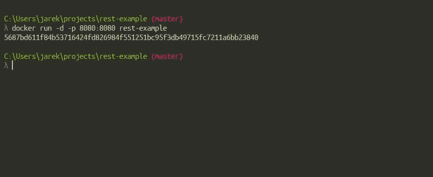
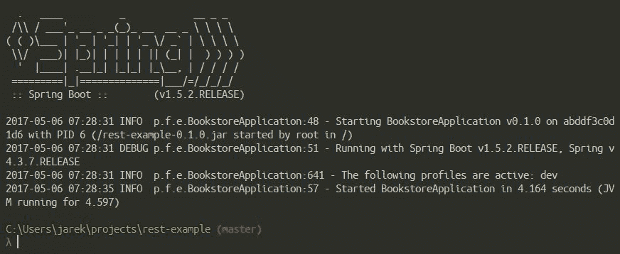

# 第六章：使用 Java 应用程序运行容器

在第五章 *使用 Java 应用程序创建镜像*中，我们学习了 Dockerfile 的结构以及如何构建我们的镜像。在这一点上，您应该能够创建自己的 Docker 镜像并开始使用它。实际上，我们已经多次运行了容器，但没有深入细节。我们手动构建了镜像，使用 Dockerfile，然后发出了`docker build`命令。我们还使用 Maven 来自动化构建过程。我们创建的镜像包含了我们简单的 REST Java 服务。我们已经运行它来检查它是否真的有效。然而，这一次，我们将更详细地讨论从我们的镜像运行容器的一些细节。本章将包括以下概念：

+   启动和停止容器

+   容器运行模式

+   监控容器

+   容器重启策略

+   资源的运行时约束

+   使用 Maven 运行容器

# 启动和停止容器

让我们回到一点，从基础知识开始：如何手动从 shell 或命令行运行和停止 Docker 容器。

# 开始

正如您在前几章中看到的那样，要从镜像中启动容器，我们使用`docker run`命令。运行的容器将有自己的文件系统、网络堆栈和与主机分开的隔离进程树。正如您在第五章 *使用 Java 应用程序创建镜像*中所记得的，每个`docker run`命令都会创建一个新的容器，并执行 Dockerfile、`CMD`或`ENTRYPOINT`中指定的命令。

`docker run`命令的语法如下：

```
$ docker run [OPTIONS] IMAGE[:TAG|@DIGEST] [COMMAND] [ARG...]

```

该命令使用镜像名称，可选的`TAG`或`DIGEST`。如果跳过`TAG`和`DIGEST`命令参数，Docker 将基于标记为`latest`的镜像运行容器。`docker run`命令还接受一组可能有用的选项，例如运行时模式、分离或前台、网络设置或 CPU 和内存的运行时限制。我们将在本章后面介绍这些内容。当然，您可以执行`docker run`命令，几乎没有任何参数，除了镜像名称。它将运行并采用镜像中定义的默认选项。指定选项可以让您覆盖图像作者指定的选项以及 Docker 引擎的运行时默认值。

`COMMAND`参数不是必需的，镜像的作者可能已经在`Dockerfile`中使用`CMD`指令提供了默认的`COMMAND`。`CMD`在 Dockerfile 中只出现一次，通常是最后一条指令。从镜像启动容器时，我们可以通过提供自己的命令或参数作为`docker run`的`COMMAND`参数来覆盖`CMD`指令。在`docker run`命令中出现在镜像名称之后的任何内容都将传递给容器，并被视为`CMD`参数。如果镜像还指定了`ENTRYPOINT`，那么`CMD`或`COMMAND`将作为参数附加到`ENTRYPOINT`。但是猜猜，我们也可以使用`docker run`命令的`--entrypoint`选项来覆盖`ENTRYPOINT`。

# 停止

要停止一个或多个正在运行的 Docker 容器，我们使用`docker stop`命令。语法很简单：

```
$ docker stop [OPTIONS] CONTAINER [CONTAINER...]

```

您可以指定一个或多个要停止的容器。`docker stop`的唯一选项是`-t`（`--time`），它允许我们指定在停止容器之前等待的时间。默认值为 10 秒，应该足够容器优雅地停止。要以更加残酷的方式停止容器，可以执行以下命令：

```
$ docker kill  CONTAINER [CONTAINER...]

```

`docker stop`和`docker kill`之间有什么区别？它们都会停止正在运行的容器。但有一个重要的区别：

+   `docker stop`：容器内的主进程首先会收到`SIGTERM`，然后经过一个宽限期，会收到`SIGKILL`

+   `docker kill`：容器内的主进程将被发送`SIGKILL`（默认）或使用`--signal`选项指定的任何信号

换句话说，`docker stop`尝试通过发送标准的 POSIX 信号`SIGTERM`来触发优雅的关闭，而`docker kill`只是残酷地杀死进程，因此关闭容器。

# 列出正在运行的容器

要列出正在运行的容器，只需执行`docker ps`命令：

```
$ docker ps

```

要包括 Docker 主机上存在的所有容器，请包括`-a`选项：

```
$ docker ps -a

```

您还可以使用`-f`选项过滤列表以指定过滤器。过滤器需要以`key=value`格式提供。当前可用的过滤器包括：

+   `id`：按容器的 id 筛选

+   `标签`：按标签筛选

+   `名称`：按容器的名称筛选

+   `退出`：按容器的退出代码筛选

+   `状态`：按状态筛选，可以是 created、restarting、running、removing、paused、exited 或 dead

+   `volume`：当指定卷名称或挂载点时，将包括挂载指定卷的容器

+   `network`：当指定网络 ID 或名称时，将包括连接到指定网络的容器

考虑以下示例，它将获取 Docker 主机上的所有容器，并通过运行状态进行筛选：

```
$ docker ps -a -f status=running

```

# 删除容器

要从主机中删除容器，我们使用`docker rm`命令。语法如下：

```
$ docker rm [OPTIONS] CONTAINER [CONTAINER...]

```

您可以一次指定一个或多个容器。如果您一遍又一遍地运行短期前台进程，这些文件系统的大小可能会迅速增长。有一个解决方案：不要手动清理，告诉 Docker 在容器退出时自动清理容器并删除文件系统。您可以通过添加`--rm`标志来实现这一点，这样在进程完成后容器数据会被自动删除。

`--rm`标志将使 Docker 在容器关闭后删除容器。

例如，使用以下示例中的`run`命令：

```
$ docker run --rm -it Ubuntu /bin/bash

```

上述命令告诉 Docker 在关闭容器时将其删除。

在启动 Docker 容器时，您可以决定是以默认模式、前台模式还是后台模式（即分离模式）运行容器。让我们解释一下它们之间的区别。

# 容器运行模式

Docker 有两种容器运行模式，前台和分离。让我们从默认模式，即前台模式开始。

# 前台

在前台模式下，您用来执行`docker run`的控制台将附加到标准输入、输出和错误流。这是默认行为；Docker 将`STDIN`、`STDOUT`和`STDERR`流附加到您的 shell 控制台。如果需要，您可以更改此行为，并为`docker run`命令使用`-a`开关。作为`-a`开关的参数，您使用要附加到控制台的流的名称。例如：

```
$ docker run -a stdin -a stdout -i -t centos /bin/bash

```

上述命令将把`stdin`和`stdout`流附加到您的控制台。

有用的`docker run`选项是`-i`或`--interactive`（用于保持`STDIN`流开放，即使未附加）和`-t`或`-tty`（用于附加`伪 tty`）开关，通常一起使用为`-it`，您需要使用它为在容器中运行的进程分配`伪 tty`控制台。实际上，我们在第五章中使用了这个选项，*使用 Java 应用程序创建镜像*，当我们运行我们的 REST 服务时。

```
$ docker run -it rest-example

```

简单地说，`-it`用于在容器启动后将命令行附加到容器。这样，您可以在 shell 控制台中查看正在运行的容器的情况，并在需要时与容器交互。

# 分离

您可以使用`-d`选项以分离模式启动 Docker 容器。这是前台模式的相反。容器启动并在后台运行，就像守护进程或服务一样。让我们尝试在后台运行我们的 rest-example，执行以下命令：

```
$ docker run -d -p 8080:8080 rest-example

```

容器启动后，您将获得控制权，并可以使用 shell 或命令行执行其他命令。Docker 将只输出容器 ID，如下面的屏幕截图所示：



您可以使用容器 ID 在其他 docker 命令中引用容器，例如，如果您需要停止容器或附加到容器。我们的服务虽然在后台运行，但仍在工作：Spring Boot 应用程序在端口`8080`上监听`HTTP` `GET`或`POST`请求。请注意，以分离模式启动的容器会在用于运行容器的根进程退出时停止。了解这一点很重要，即使您有一些在后台运行的进程（从 Dockerfile 中的指令启动），Docker 也会在启动容器的命令完成时停止容器。在我们的情况下，Spring Boot 应用程序正在运行和监听，并且同时防止 Docker 关闭容器。要将容器从后台带回到控制台的前台，您需要附加到它。

# 附加到运行的容器

要保持对分离容器的控制，请使用`docker attach`命令。`docker attach`的语法非常简单：

```
$ docker attach [OPTIONS] <container ID or name>

```

在我们的情况下，这将是在启动容器时给我们的 ID：

```
$ docker attach 5687bd611f84b53716424fd826984f551251bc95f3db49715fc7211a6bb23840

```

此时，如果有什么东西被打印出来，比如我们运行的 REST 服务的另一条日志行，您将在控制台上看到它。正如您所看到的，如果您需要实时查看写入`stdout`流的内容，`docker attach`命令会很有用。它基本上会*重新附加*您的控制台到容器中运行的进程。换句话说，它将`stdout`流传输到您的屏幕，并将`stdin`映射到您的键盘，允许您输入命令并查看它们的输出。请注意，当附加到容器时按下*CTRL + C*键序列会终止容器的运行进程，而不是从控制台中分离。要从进程中分离，请使用默认的*CTRL+P*和*CTRL+Q*键序列。如果*CTRL + P*和*CTRL + Q*序列与您现有的键盘快捷键冲突，您可以通过为`docker attach`命令设置`--detach-keys`选项来提供自己的分离序列。如果您希望能够使用*CTRL + C*分离，您可以通过将`sig-proxy`参数设置为`false`来告诉 Docker 不要向容器中运行的进程发送`sig-term`：

```
$ docker attach --sig-proxy=false [container-name or ID]

```

如果容器在后台运行，监视其行为将是很好的。Docker 提供了一套功能来实现这一点。让我们看看如何监视运行中的容器。

# 监视容器

监视运行中的 Docker 容器有一些方法。可以查看日志文件，查看容器事件和统计信息，还可以检查容器属性。让我们从 Docker 具有的强大日志记录功能开始。访问日志条目至关重要，特别是如果您的容器在分离的运行时模式下运行。让我们看看在日志记录机制方面 Docker 能提供什么。

# 查看日志

大多数应用程序将它们的日志条目输出到标准的`stdout`流。如果容器在前台模式下运行，您将在控制台上看到它。但是，当以分离模式运行容器时，您在控制台上将什么也看不到，只会看到容器 ID。但是，Docker 引擎会在主机上的历史文件中收集运行容器的所有`stdout`输出。您可以使用`docker logs`命令来显示它。命令的语法如下：

```
$ docker logs -f <container name or ID>

```

`docker logs`命令将仅将日志的最后几行输出到控制台。由于容器仍在后台运行（以分离模式），您将立即收到提示，如下面的屏幕截图所示，显示了我们的 REST 服务日志文件的片段：



`-f`标志在 Linux `tail`命令中起着相同的作用，它会在控制台上持续显示新的日志条目。当你完成后，按下*CTRL + C*停止在控制台上显示日志文件。请注意，这与在容器中按下*CTRL + C*不同，那里*CTRL + C*会终止容器内运行的进程。这次，它只会停止显示日志文件，很安全。

日志文件是永久的，即使容器停止，只要其文件系统仍然存在于磁盘上（直到使用`docker rm`命令删除为止）。默认情况下，日志条目存储在位于`/var/lib/docker`目录中的 JSON 文件中。您可以使用`docker inspect`命令查看日志文件的完整路径，并使用模板提取`LogPath`（我们将在稍后介绍`inspect`和模板）。

我们已经说过，默认情况下，日志条目将进入 JSON 文件。但这可以很容易地改变，因为 Docker 利用了日志驱动程序的概念。通过使用不同的驱动程序，您可以选择其他存储容器日志的方式。默认驱动程序是`json-file`驱动程序，它只是将条目写入 JSON 文件。每个驱动程序都可以接受附加参数。例如，JSON 驱动程序接受：

```
--log-opt max-size=[0-9+][k|m|g]

--log-opt max-file=[0-9+]

```

您可能已经猜到，这类似于我们 Java 应用程序中的滚动文件。`max-size`指定可以创建的最大文件大小；达到指定大小后，Docker 将创建一个新文件。您可以使用大小后缀`k`，`m`或`g`，其中 k 代表千字节，`m`代表兆字节，`g`代表千兆字节。将日志拆分为单独的文件使得传输、存档等变得更加容易。此外，如果文件更小，搜索日志文件会更加方便。

`docker log`命令只显示最新日志文件中的日志条目。

还有一些其他可用的日志驱动程序。列表包括：

+   `none`：它将完全关闭日志记录

+   `syslog`：这是 Docker 的`syslog`日志驱动程序。它将日志消息写入系统`syslog`

+   `journald`：将日志消息记录到`journald`。`systemd-journald`是负责事件记录的守护程序，其追加日志文件作为其日志文件

+   `splunk`：提供使用`Event Http` Collector 将日志消息写入 Splunk。Splunk 可用作企业级日志分析工具。您可以在[`www.splunk.com`](https://www.splunk.com)了解更多信息

+   `gelf`：将日志条目写入 GELF 端点，如 Graylog 或 Logstash。 Graylog 可在[`www.graylog.org`](https://www.graylog.org)找到，是一个开源日志管理工具，支持对所有日志文件进行搜索、分析和警报。您可以在[`www.elastic.co/products/logstash`](https://www.elastic.co/products/logstash)找到 Logstash，它是用于处理任何数据（包括日志数据）的管道。

+   `fluentd`：将日志消息写入`fluentd`。Fluentd 是一个用于统一日志层的开源数据收集器。Fluentd 的主要特点是通过提供统一的日志层来将数据源与后端系统分离。它体积小，速度快，并且具有数百个插件，使其成为非常灵活的解决方案。您可以在其网站[`www.fluentd.org`](https://www.fluentd.org)上了解更多关于`fluentd`的信息

+   `gcplogs`：将日志条目发送到 Google Cloud 日志记录

+   `awslogs`：此驱动程序将日志消息写入 Amazon CloudWatch 日志。

正如您所看到的，Docker 的可插拔架构在运行容器时提供了几乎无限的灵活性。要切换到其他日志驱动程序，请使用`docker run`命令的`--log-driver`选项。例如，要将日志条目存储在`syslog`中，请执行以下操作：

```
$ docker run --log-driver=syslog rest-example

```

请注意，`docker logs`命令仅适用于`json-file`和`journald`驱动程序。要访问写入其他日志引擎的日志，您将需要使用与您选择的驱动程序匹配的工具。使用专门的工具浏览日志条目通常更方便；实际上，这通常是您选择另一个日志驱动程序的原因。例如，在 Logstash 或 Splunk 中搜索和浏览日志比在充满 JSON 条目的文本文件中查找要快得多。

查看日志条目是监视我们的应用程序在主机上的行为的便捷方式。有时，看到运行容器的属性也是很好的，比如映射的网络端口或映射的卷等等。为了显示容器的属性，我们使用`docker inspect`命令，这非常有用。

# 检查容器

我们一直在使用的`docker ps`命令用于列出运行的容器，它给我们提供了很多关于容器的信息，比如它们的 ID、运行时间、映射端口等等。为了显示关于运行容器的更多细节，我们可以使用`docker inspect`。命令的语法如下：

```
$ docker inspect [OPTIONS] CONTAINER|IMAGE|TASK [CONTAINER|IMAGE|TASK...]

```

默认情况下，`docker inspect`命令将以 JSON 数组格式输出有关容器或镜像的信息。由于有许多属性，这可能不太可读。如果我们知道我们要找的是什么，我们可以提供一个模板来处理输出，使用`-f`（或`--format`）选项。模板使用来自 Go 语言的模板格式（顺便说一句，Docker 本身是用 Go 语言编写的）。`docker inspect`命令最简单和最常用的模板只是一个简短的模板，用于提取你需要的信息，例如：

```
$ docker inspect -f '{{.State.ExitCode}}' jboss/wildfly

```

由于`inspect`命令接受 Go 模板来形成容器或镜像元数据的输出，这个特性为处理和转换结果提供了几乎无限的可能性。Go 模板引擎非常强大，所以，我们可以使用模板引擎来进一步处理结果，而不是通过 grep 来处理输出，这样虽然快速但混乱。

`--format`的参数只是我们要应用于容器元数据的模板。在这个模板中，我们可以使用条件语句、循环和其他 Go 语言特性。例如，以下内容将找到所有具有非零退出代码的容器的名称：

```
$ docker inspect -f '{{if ne 0.0 .State.ExitCode }}{{.Name}} {{.State.ExitCode}}{{ end }}' $(docker ps -aq)

```

请注意，我们提供了`$(docker ps -aq)`，而不是容器 ID 或名称。因此，所有正在运行的容器的 ID 将被传递给`docker inspect`命令，这可能是一个很方便的快捷方式。花括号`{{}}`表示 Go 模板指令，它们之外的任何内容都将被直接打印出来。在 Go 模板中，`.`表示上下文。大多数情况下，当前上下文将是元数据的整个数据结构，但在需要时可以重新绑定，包括使用`with`操作。例如，这两个`inspect`命令将打印出完全相同的结果：

```
$ docker inspect -f '{{.State.ExitCode}}' wildfly

$ docker inspect -f '{{with .State}} {{.ExitCode}} {{end}}' wildfly

```

如果您在绑定的上下文中，美元符号（`$`）将始终让您进入`root`上下文。我们可以执行这个命令：

```
$ docker inspect -f '{{with .State}} {{$.Name}} exited with {{.ExitCode}} exit code \ {{end}}' wildfly

```

然后将输出：

```
/wildfly exited with 0 exit code.

```

模板引擎支持逻辑函数，如`and`、`or`和`not`；它们将返回布尔结果。还支持比较函数，如`eq`（相等）、`ne`（不相等）、`lt`（小于）、`le`（小于或等于）、`gt`（大于）和`ge`（大于或等于）。比较函数可以比较字符串、浮点数或整数。与条件函数一起使用，如`if`，所有这些在从`inspect`命令创建更复杂的输出时都非常有用：

```
$ docker inspect -f '{{if eq .State.ExitCode 0.0}} \

Normal Exit \

{{else if eq .State.ExitCode 1.0}} \

Not a Normal Exit \

{{else}} \

Still Not a Normal Exit \

{{end}}' wildfly

```

有时，`docker inspect`命令的大量输出可能会令人困惑。由于输出以 JSON 格式呈现，可以使用`jq`工具来获取输出的概述并挑选出有趣的部分。

`jq`工具可以免费获取，网址为[`stedolan.github.io/jq/`](https://stedolan.github.io/jq/)。它是一个轻量灵活的命令行 JSON 处理器，类似于 JSON 数据的`sed`命令。例如，让我们从元数据中提取容器的 IP 地址：

```
$ docker inspect <containerID> | jq -r '.[0].NetworkSettings.IPAddress'

```

正如您所看到的，`docker inspect`命令提供了有关 Docker 容器的有用信息。结合 Go 模板功能，以及可选的`jq`工具，它为您提供了一个强大的工具，可以获取有关您的容器的信息，并可以在脚本中进一步使用。但除了元数据之外，还有另一个有价值的信息来源。这就是运行时统计信息，现在我们将重点关注这一点。

# 统计信息

要查看容器的 CPU、内存、磁盘 I/O 和网络 I/O 统计信息，请使用`docker stats`命令。该命令的语法如下：

```
docker stats [OPTIONS] [CONTAINER...]

```

您可以通过指定由空格分隔的容器 ID 或名称列表来将统计量限制为一个或多个特定容器。默认情况下，如果未指定容器，则该命令将显示所有运行中容器的统计信息，如下面的屏幕截图所示：


`docker stats`命令接受选项，其中可以包括：

+   `--no-stream`：这将禁用流式统计信息，并且只拉取第一个结果

+   `-a`（`--all`）：这将显示所有（不仅仅是运行中的）容器的统计信息

统计信息可用于查看我们的容器在运行时的行为是否良好。这些信息可以用来检查是否需要对容器应用一些资源约束，我们将在本章稍后讨论运行时约束。

查看日志、容器元数据和运行时统计信息，可以在监视运行中的容器时给您几乎无限的可能性。除此之外，我们还可以全局查看 docker 主机上发生的情况。当主机上的 docker 引擎接收到命令时，它将发出我们可以观察到的事件。现在让我们来看看这个机制。

# 容器事件

为了实时观察到 docker 引擎接收的事件，我们使用`docker events`命令。如果容器已启动、停止、暂停等，事件将被发布。如果您想知道容器运行时发生了什么，这将非常有用。这是一个强大的监控功能。Docker 容器报告了大量的事件，您可以使用`docker events`命令列出。列表包括：

```
attach, commit, copy, create, destroy, detach, die, exec_create, exec_detach, exec_start, export, health_status, kill, oom, pause, rename, resize, restart, start, stop, top, unpause, update

```

`docker events`命令可以使用`-f`开关，如果您正在寻找特定内容，它将过滤输出。如果未提供过滤器，则将报告所有事件。目前可能的过滤器列表包括：

+   容器（`container=<名称或 ID>`）

+   事件（`event=<事件操作>`）

+   镜像（`image=<标签或 ID>`）

+   插件（实验性）（`plugin=<名称或 ID>`）

+   标签（`label=<键>`或`label=<键>=<值>`）

+   类型（`type=<容器或镜像或卷或网络或守护程序>`）

+   卷（`volume=<名称或 ID>`）

+   网络（`network=<名称或 ID>`）

+   守护程序（`daemon=<名称或 ID>`）

看看以下示例。在一个控制台窗口中运行了`docker events`命令，而在另一个控制台中发出了`docker run rest-example`命令。如您在以下截图中所见，`docker events`将报告我们的 rest-example 容器的创建、附加、连接和启动事件：


因此，您将获得一个时间戳和事件的名称，以及导致事件的容器的 ID。`docker events`命令可以接受其他选项，例如`--since`和`--until`，用于指定要获取事件的时间范围。监视容器事件是一个很好的工具，可以看到 Docker 主机上发生了什么。但这还不是全部。您还可以影响容器在崩溃时的行为，例如。我们使用容器重启策略来实现这一点。

# 重启策略

通过在`docker run`命令中使用`--restart`选项，您可以指定重启策略。这告诉 Docker 在容器关闭时如何反应。然后可以重新启动容器以最小化停机时间，例如在生产服务器上运行时。然而，在我们解释 Docker 重启策略之前，让我们先专注一会儿退出代码。退出代码是关键信息，它告诉我们容器无法运行或退出的原因。有时它与您将作为参数提供给`docker run`的命令有关。当`docker run`命令以非零代码结束时，退出代码遵循`chroot`标准，如您在这里所见：

+   退出代码`125`：`docker run`命令本身失败

+   退出代码`126`：提供的命令无法调用

+   退出代码`127`：提供的命令找不到

+   其他非零的、应用程序相关的退出代码

您可能还记得，在之前的章节中，我们一直在使用`docker ps`命令列出运行中的容器。要列出非运行中的容器，我们可以为`docker ps`命令添加`-a`开关。当容器完成时，退出代码可以在`docker ps -a`命令的输出中的状态列中找到。可以通过在启动容器时指定重启策略来自动重新启动崩溃的容器。通过`docker run`命令的-restart 开关来指定所需的重启策略，就像这个例子中一样：

```
$ docker run --restart=always rest-example

```

目前 Docker 有四种重启策略。让我们逐一了解它们，从最简单的开始：`no`。

# 没有

`no`策略是默认的重启策略，简单地不会在任何情况下重新启动容器。实际上，您不必指定此策略，因为这是默认行为。除非您有一些可配置的设置来运行 Docker 容器，否则`no`策略可以用作关闭开关。

# 始终

如果我们希望无论命令的退出代码是什么，容器都会重新启动，我们可以使用`always`重启策略。基本上，它就是字面意思；Docker 将在任何情况下重新启动容器。重启策略将始终重新启动容器。即使容器在重新启动之前已停止，也是如此。每当 Docker 服务重新启动时，使用 always 策略的容器也将被重新启动，无论它们是否正在执行。

使用`always`重启策略，Docker 守护程序将尝试无限次重新启动容器。

# 在失败时

这是一种特殊的重启策略，可能是最常用的。通过使用`on-failure`重启策略，您指示 Docker 在容器以非零退出状态退出时重新启动容器，否则不重新启动。这就是我们从退出代码开始解释重启策略的原因。您还可以选择为 Docker 尝试重新启动容器的次数提供一个数字。此重启策略的语法也略有不同，因为使用此策略，您还可以指定 Docker 将尝试自动重新启动容器的最大次数。

考虑这个例子：

```
$ docker run --restart=on-failure:5 rest-example

```

在失败的情况下，上述命令将运行具有我们的 REST 服务的容器，并在放弃之前尝试重新启动五次。 `on-failures`重启策略的主要好处是，当应用程序以成功的退出代码退出时（这意味着应用程序没有错误，只是执行完毕），容器将不会重新启动。可以通过我们已经知道的`docker inspect`命令获取容器的重新启动尝试次数。例如，要获取具有特定 ID 或名称的容器的重新启动次数：

```
$ docker inspect -f "{{ .RestartCount }}" <ContainerID>

```

您还可以发现容器上次启动的时间：

```
$ docker inspect -f "{{ .State.StartedAt }}" <ContainerID>

```

您应该知道，Docker 在重新启动容器之间使用延迟，以防止洪水般的保护。这是一个递增的延迟；它从 100 毫秒的值开始，然后 Docker 将加倍上一个延迟。实际上，守护程序将等待 100 毫秒，然后是 200 毫秒，400，800 等，直到达到`on-failure`限制，或者当您使用`docker stop`停止容器，或者通过执行`docker rm -f`命令强制删除容器。

如果容器成功重新启动，则延迟将重置为默认值 100 毫秒。

# unless-stopped

与`always`类似，如果我们希望容器无论退出代码如何都重新启动，我们可以使用`unless-stopped`。`unless-stopped`重启策略与`always`相同，唯一的例外是，它将重新启动容器，而不管退出状态如何，但如果容器在停止状态之前已被停止，则不会在守护程序启动时启动它。这意味着使用`unless-stopped`重启策略，如果容器在重新启动前正在运行，则系统重新启动后容器将被重新启动。当 Docker 容器中的应用程序退出时，该容器也将被停止。如果容器中运行的应用程序崩溃，容器将停止，并且该容器将保持停止状态，直到有人或某物重新启动它。

在将重启策略应用于容器之前，最好先考虑容器将用于做什么样的工作。这也取决于将在容器上运行的软件的类型。例如，数据库可能应该应用`always`或`unless-stopped`策略。如果您的容器应用了某种重启策略，当您使用`docker ps`命令列出容器时，它将显示为`Restarting`或`Up`状态。

# 更新正在运行的容器的重启策略

有时，在容器已经启动后，有必要*即时*更新 Docker 运行时参数。一个例子是，如果您想要防止容器在 Docker 主机上消耗过多资源。为了在运行时设置策略，我们可以使用`docker update`命令。除了其他运行时参数（例如内存或 CPU 约束，我们将在本章后面讨论），`docker update`命令还提供了更新运行中容器的重启策略的选项。语法非常简单，您只需要提供您希望容器具有的新重启策略以及容器的 ID 或名称：

```
$ docker update --restart=always <CONTAINER_ID or NAME>

```

运行`docker update`命令后，新的重启策略将立即生效。另一方面，如果您在已停止的容器上执行`update`命令，该策略将在以后启动容器时使用。可能的选项与您启动容器时可以指定的选项完全相同：

+   `no`（默认值）

+   `always`

+   失败时

+   `unless-stopped`

如果在 Docker 主机上运行多个容器，并且想要一次性为它们指定新的重启策略，只需提供它们所有的 ID 或名称，用空格分隔。

您还可以使用`docker events`命令查看应用了哪种重启策略，这是您已经在上一节中了解过的。`docker events`可以用来观察容器报告的运行时事件的历史记录，还会报告`docker update`事件，提供有关已更改的详细信息。如果容器已应用重启策略，事件将被发布。如果要检查运行中容器的重启策略，请使用`docker inspect`与容器 ID 或名称以及设置`--format`参数的路径：

```
$ docker inspect --format '{{ .HostConfig.RestartPolicy.Name }}' <ContainerID>

```

根据容器设置重启策略的能力非常适用于那些图像是自包含的，不需要进行更复杂的编排任务的情况。重启策略不是您可以在运行中容器上更改的唯一参数。

# 资源的运行时约束

在运行时限制 Docker 容器使用资源可能是有用的。Docker 为您提供了许多设置内存、CPU 使用或磁盘访问使用的约束的可能性。让我们从设置内存约束开始。

# 内存

值得知道，默认情况下，即如果您在没有任何约束的情况下使用默认设置，则运行的容器可以使用所有主机内存。要更改此行为，我们可以使用`docker run`命令的`--memory`（或`-m`简称）开关。它分别采用`k`，`m`或`g`后缀，表示千字节，兆字节和千兆字节。

具有设置内存约束的`docker run`命令的语法将如下所示：

```
$ docker run -it -m 512m ubuntu

```

上述命令将执行 Ubuntu 镜像，容器可以使用的最大内存为半个千兆字节。

如果您没有设置容器可以分配的内存限制，这可能会导致随机问题，其中单个容器可以轻松使整个主机系统变得不稳定和/或无法使用。因此，始终在容器上使用内存约束是明智的决定。

除了用户内存限制外，还有内存预留和内核内存约束。让我们解释一下内存预留限制是什么。在正常工作条件下，运行的容器可以并且可能会使用所需的内存，直到您使用`docker run`命令的`--memory`（`-m`）开关设置的限制。当应用内存预留时，Docker 将检测到低内存情况，并尝试强制容器将其消耗限制到预留限制。如果您没有设置内存预留限制，它将与使用`-m`开关设置的硬内存限制完全相同。

内存预留不是硬限制功能。不能保证不会超出限制。内存预留功能将尝试确保根据预留设置分配内存。

考虑以下示例：

```
$ docker run -it -m 1G --memory-reservation 500M ubuntu /bin/bash

```

上述命令将将硬内存限制设置为`1g`，然后将内存预留设置为半个千兆字节。设置这些约束后，当容器消耗的内存超过`500M`但少于`1G`时，Docker 将尝试将容器内存缩小到少于`500M`。

在下一个示例中，我们将设置内存预留而不设置硬内存限制：

```
$ docker run -it --memory-reservation 1G ubuntu /bin/bash

```

在前面的示例中，当容器启动时，它可以使用其进程所需的内存。`--memory-reservation`开关设置将阻止容器长时间消耗过多的内存，因为每次内存回收都会将容器的内存使用量缩小到预留中指定的大小。

内核内存与用户内存完全不同，主要区别在于内核内存无法交换到磁盘。它包括堆栈页面、slab 页面、套接字内存压力和 TCP 内存压力。您可以使用`--kernel-memory`开关来设置内核内存限制以约束这些类型的内存。与设置用户内存限制一样，只需提供一个带有后缀的数字，例如`k`、`b`和`g`，分别表示千字节、兆字节或千兆字节，尽管以千字节设置它可能是一个非常罕见的情况。

例如，每个进程都会占用一些堆栈页面。通过限制内核内存，您可以防止在内核内存使用过高时启动新进程。此外，由于主机无法将内核内存交换到磁盘，容器可能会通过消耗过多的内核内存来阻塞整个主机服务。

设置内核内存限制很简单。我们可以单独设置`--kernel-memory`，而不限制总内存使用量，就像下面的例子一样：

```
$ docker run -it --kernel-memory 100M ubuntu  /bin/bash

```

在上面的例子中，容器中的进程可以根据需要使用内存，但只能消耗`100M`的内核内存。我们还可以设置硬内存限制，如下面的命令所示：

```
$ docker run -it -m 1G --kernel-memory 100M ubuntu /bin/bash

```

在上述命令中，我们同时设置了内存和内核内存，因此容器中的进程可以总共使用`1G`内存，其中包括`100M`的内核内存。

与内存相关的另一个约束条件在运行容器时可能会有用，这是 swappines 约束。我们可以使用`--memory-swappiness`开关来应用约束到`docker run`命令。当你想要避免与内存交换相关的性能下降时，这可能会有所帮助。`--memory-swappiness`开关的参数是可以交换的匿名内存页面的百分比，因此它的值范围是从`0`到`100`。将值设置为零，将根据您的内核版本禁用交换或使用最小交换。相反，值为`100`会将所有匿名页面设置为可以交换出去的候选项。例如：

```
$ docker run -it --memory-swappiness=0 ubuntu /bin/bash

```

在上述命令中，我们完全关闭了`ubuntu`容器的交换。

除了设置内存使用约束外，您还可以指示 Docker 如何分配处理器能力给它将要运行的容器。

# 处理器

使用`-c`（或`--cpu-shares`作为等效项）来为`docker run`命令开关指定 CPU 份额的值是可能的。默认情况下，每个新容器都有 1024 份 CPU 份额，并且所有容器获得相同的 CPU 周期。这个百分比可以通过改变容器的 CPU 份额权重相对于所有其他正在运行的容器的权重来改变。但请注意，您不能设置容器可以使用的精确处理器速度。这是一个**相对权重**，与实际处理器速度无关。事实上，没有办法准确地说一个容器应该有权利只使用主机处理器的 2 GHz。

CPU 份额只是一个数字，与 CPU 速度没有任何关系。

如果我们启动两个容器，两者都将使用 100%的 CPU，处理器时间将在两个容器之间平均分配。原因是两个容器将拥有相同数量的处理器份额。但是如果您将一个容器的处理器份额限制为 512，它将只获得 CPU 时间的一半。这并不意味着它只能使用 CPU 的一半；这个比例只在运行 CPU 密集型进程时适用。如果另一个容器（具有`1024`份份额）处于空闲状态，我们的容器将被允许使用 100%的处理器时间。实际的 CPU 时间将取决于系统上运行的容器数量。这在一个具体的例子中更容易理解。

考虑三个容器，一个（我们称之为`Container1`）设置了`--cpu-shares`为`1024`，另外两个（`Container2`和`Container3`）设置了`--cpu-shares`为`512`。当所有三个容器中的进程尝试使用所有的 CPU 功率时，`Container1`将获得总 CPU 时间的 50%，因为它相对于其他正在运行的容器（`Container2`和`Container3`的总和）有一半的 CPU 使用量。如果我们添加一个`--cpu-share`为 1024 的第四个容器（`Container4`），我们的第一个`Container1`只会获得 CPU 的 33%，因为它现在相对于总 CPU 功率的三分之一。`Container2`将获得 16.5%，`Container3`也是 16.5%，最后一个`Container4`再次被允许使用 CPU 的 33%。

虽然`docker run`命令的`-c`或`--cpu_shares`标志修改了容器相对于所有其他运行容器的 CPU 份额权重，但它不限制容器对主机机器 CPU 的使用。但是还有另一个标志可以限制容器的 CPU 使用：`--cpu-quota`。其默认值为`100000`，表示允许使用 100%的 CPU 使用率。我们可以使用`--cpu-quota`来限制 CPU 使用，例如：

```
$ docker run -it  --cpu-quota=50000 ubuntu /bin/bash

```

在前面的命令中，容器的限制将是 CPU 资源的 50%。`--cpu-quota`通常与`docker run`的`--cpu-period`标志一起使用。这是 CPU CFS（Completely Fair Scheduler）周期的设置。默认周期值为 100000，即 100 毫秒。看一个例子：

```
$ docker run -it --cpu-quota=25000 --cpu-period=50000  ubuntu /bin/bash

```

这意味着容器可以每 50 毫秒获得 50%的 CPU 使用率。

限制 CPU 份额和使用率并不是我们可以在容器上设置的唯一与处理器相关的约束。当我们想要执行此操作时，`docker run`命令的`--cpuset`开关非常方便。考虑以下例子：

```
$ docker run -it --cpuset 4 ubuntu

```

上述命令将运行`ubuntu`镜像，并允许容器使用所有四个处理器核心。要启动容器并只允许使用一个处理器核心，可以将`--cpuset`值更改为`1`：

```
$ docker run -it --cpuset 1 ubuntu

```

当然，您可以将`--cpuset`选项与`--cpu_shares`混合在一起，以调整容器的 CPU 约束。

# 更新正在运行的容器的约束

与重启策略一样，当容器已经在运行时也可以更新约束。如果您发现您的容器占用了太多的 Docker 主机系统资源，并希望限制此使用，这可能会有所帮助。同样，我们使用`docker update`命令来执行此操作。

与重启策略一样，`docker update`命令的语法与启动容器时相同，您将所需的约束作为 docker update 命令的参数指定，然后提供容器 ID（例如从`docker ps`命令输出中获取）或其名称。同样，如果您想一次更改多个容器的约束，只需提供它们的 ID 或名称，用空格分隔。让我们看一些在运行时如何更新约束的示例：

```
$ docker update --cpu-shares 512 abbdef1231677

```

上述命令将限制 CPU 份额的值为 512。当然，您也可以同时对多个容器应用 CPU 和内存约束：

```
docker update --cpu-shares 512 -m 500M abbdef1231677 dabdff1231678

```

上述命令将更新 CPU 份额和内存限制到两个容器，标识为`abbdef1231677`和`dabdff1231678`。

当更新运行时约束时，当然也可以在一个命令中应用所需的重启策略，就像下面的例子一样：

```
$ docker update --restart=always -m 300M aabef1234716

```

正如您所看到的，设置约束的能力在运行 Docker 容器时给了您很大的灵活性。但值得注意的是，应用约束并不总是可能的。原因是约束设置功能严重依赖于 Docker 主机的内部情况，特别是其内核。例如，设置内核内存限制或`内存 swappiness`并不总是可能的，有时您会收到`您的内核不支持内核内存限制或内核不支持内存 swappiness 功能`的消息。有时这些限制是可配置的，有时不是。例如，如果您收到`警告：您的内核不支持 Ubuntu 上的 cgroup 交换限制`，您可以在 Grub 配置文件中使用`cgroup_enable=memory swapaccount=1`设置来调整 Grub 引导加载程序，例如在 Ubuntu 中，这将是`/etc/default/grub`。重要的是要阅读 Docker 打印出的日志，以确保您的约束已经生效。

在容器启动或在动态更新约束后，始终注意 Docker 输出的警告，可能会导致您的约束不起作用！

我们已经知道如何使用命令行中可用的命令来运行和观察容器。然而，如果您需要在开发流程中启动容器，例如进行集成测试，这并不是很方便。我们在第五章中使用的 Fabric8 Docker Maven 插件，用于构建镜像，如果我们需要运行容器，也会很方便。现在让我们来做吧。

# 使用 Maven 运行

该插件提供了两个与启动和停止容器相关的 Maven 目标。这将是 `docker:start` 和 `docker:stop` 。使用 `docker:start` 创建和启动容器，使用 `docker:stop` 停止和销毁容器。如果需要在集成测试期间运行容器，典型用例将是在 Maven 构建阶段中包含这些目标：`docker:start` 将绑定到 `pre-integration-test`，`docker:stop` 绑定到 `post-integration-test` 阶段。

# 插件配置

该插件使用 `pom.xml` 文件中 `<configuration>` 的 `<run>` 子元素中的配置。最重要的配置元素列表如下：

| `cmd` | 应在容器启动结束时执行的命令。如果未给出，则使用图像的默认命令。 |
| --- | --- |
| `entrypoint` | 容器的入口点。 |
| `log` | 日志配置，用于控制是否以及如何打印运行容器的日志消息。这也可以配置要使用的日志驱动程序。 |
| `memory` | 内存限制（以字节为单位） |

| n`amingStrategy` | 容器名称创建的命名策略：

+   `none`：使用来自 Docker 的随机分配的名称（默认）

+   `alias`：使用图像配置中指定的别名。如果已经存在具有此名称的容器，则会抛出错误。

|

| `network` | `<network>` 元素可用于配置容器的网络模式。它知道以下子元素：

+   `<mode>`：网络模式，可以是以下值之一：

+   `bridge`：使用默认的 Docker 桥接模式（默认）

+   `host`：共享 Docker 主机网络接口

+   `container`：连接到指定容器的网络

容器的名称取自 `<name>` 元素：

+   `custom`：使用自定义网络，必须在使用 Docker 网络创建之前创建

+   `none`：不会设置网络

|

| `ports` | `<ports>` 配置包含端口映射的列表。每个映射有多个部分，每个部分由冒号分隔。这相当于使用 `docker run` 命令和 `-p` 选项时的端口映射。一个示例条目可以看起来像这样：

```
<ports>   
<port>8080:8080</port>   
</ports>   
```

|

| `restartPolicy` | 提供了我们在本章前面讨论过的重启策略。一个示例条目可以看起来像下面这样：

```
<restartPolicy>   
<name> on-failure</name>   
<retry>5</retry>   
</restartPolicy>   
```

|

| `volumes` | 用于绑定到主机目录和其他容器的卷配置。示例配置可以看起来像下面这样：

```
<volumes>   
<bind>   
<volume>/logs</volume><volume>/opt/host_export:/opt/container_import</volume> </bind>   
</volumes>   
```

|

我们的 Java REST 服务的完整`<configuration>`元素可以看起来和以下一样。这是一个非常基本的例子，我们只在这里配置了运行时端口映射：

```
<configuration> 
<images> 
<image> 
<name>rest-example:${project.version}</name> 
<alias>rest-example</alias> 
<build> 
<from>openjdk:latest</from> 
<assembly> 
<descriptorRef>artifact</descriptorRef> 
</assembly> 
<cmd>java -jar maven/${project.name}-${project.version}.jar</cmd> 
</build> 
<run> 
<ports> 
<port>8080:8080</port> 
</ports> 
</run> 
</image> 
</images> 
</configuration>

```

配置了我们的容器后，让我们尝试运行它，使用 Maven。

# 启动和停止容器

要启动容器，请执行以下操作：

```
$ mvn clean package docker:start

```

Maven 将从源代码构建我们的 REST 服务，构建镜像，并在后台启动容器。作为输出，我们将得到容器的 ID，如你可以在以下截图中看到的那样：


容器现在在后台运行。要测试它是否在运行，我们可以发出`docker ps`命令来列出所有正在运行的容器，或者通过在映射的`8080`端口上执行一些`HTTP`方法，如`GET`或`POST`来调用服务。端口已在`<build>`配置元素中公开，并在`<run>`配置元素中公开。这很方便，不是吗？但是，如果我们想要看到容器的输出而不是在后台运行它怎么办？这也很容易；让我们首先通过发出以下命令来停止它：

```
$ mvn docker:stop

```

10 秒后（你会记得，这是在停止容器之前的默认超时时间），Maven 将输出一个声明，表示容器已经停止：

```
[INFO] DOCKER> [rest-example:0.1.0] "rest-example": Stop and removed container 51660084f0d8 after 0 ms

```

让我们再次运行容器，这次使用 Maven 的`docker:run`目标，而不是`docker:start`。执行以下操作：

```
$ mvn clean package docker:run

```

这次，Maven Docker 插件将运行容器，我们将在控制台上看到 Spring Boot 横幅，如你可以在以下截图中看到的那样：


我猜你现在可以辨别`docker:start`和`docker:run`之间的区别了。正确，`docker:run`相当于`docker run`命令的`-i`选项。`docker:run`还会自动打开`showLogs`选项，这样你就可以看到容器内发生了什么。作为替代，你可以提供`docker.follow`作为系统属性，这样`docker:start`将永远不会返回，而是阻塞，直到按下*CTRL + C*，就像当你执行`docker:run` Maven 目标时一样。

正如你所看到的，Fabric8 Docker Maven 插件给了你与从 shell 或命令行运行和停止容器时一样的控制。但这里是 Maven 构建过程本身的优势：你可以自动化事情。Docker 容器现在可以在构建过程中使用，集成测试和持续交付流程中使用；你说了算。

# 摘要

在本章中，我们已经学会了如何管理容器的生命周期，使用不同的运行模式（前台和后台）启动它，停止或删除它。我们还知道如何创建约束，使我们的容器按照我们想要的方式运行，通过使用运行时约束来限制 CPU 和 RAM 的使用。当我们的容器运行时，我们现在能够以多种方式检查容器的行为，比如读取日志输出，查看事件或浏览统计数据。如果你正在使用 Maven，作为 Java 开发人员，你可能会配置 Docker Maven 插件，以便自动启动或停止容器。

我们已经对 Docker 有了很多了解，我们可以构建和运行镜像。现在是时候更进一步了。我们将使用 Kubernetes 自动化部署、扩展和管理容器化应用程序。这是真正有趣的时刻。
