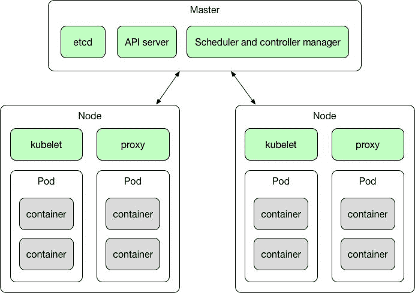
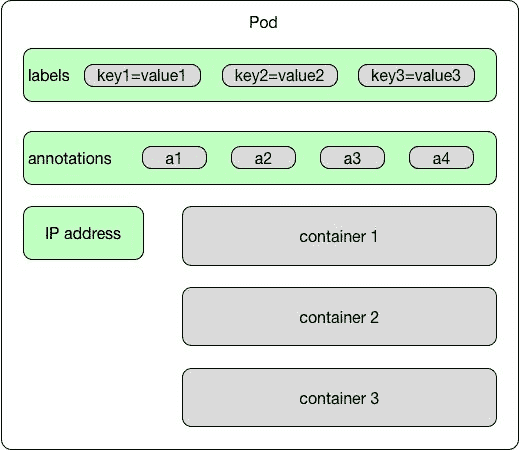

# 第七章：Kubernetes 简介

阅读完第六章，*使用 Java 应用程序运行容器*，现在您对使用 Docker 打包 Java 应用程序有了很多知识。现在是时候更进一步，专注于我们所缺少的内容--容器管理和编排。市场上有一些合适的工具，例如 Nomad、Docker Swarm、Apache Mesos 或 AZK 等。在本章中，我们将重点介绍可能是最受欢迎的工具之一，Kubernetes。Kubernetes（有时简称为 k8s）是由 Google 于 2015 年创建的用于 Docker 容器的开源编排系统。Google 开发的第一个统一容器管理系统是内部称为 Borg 的系统；Kubernetes 是它的后代。本章涵盖的主题列表将是：

+   为什么以及何时需要容器管理

+   Kubernetes 简介

+   基本的 Kubernetes 概念

让我们从回答为什么我们需要 Kubernetes 这个问题开始。我们将探讨容器管理和编排背后的原因。

# 我们为什么需要 Kubernetes？

正如您已经知道的那样，Docker 容器为运行打包成小型独立软件的 Java 服务提供了极大的灵活性。Docker 容器使应用程序的组件可移植--您可以在不需要担心依赖项或底层操作系统的情况下，在不同的环境中移动单个服务。只要操作系统能够运行 Docker 引擎，您的 Java 容器就可以在该系统上运行。

另外，正如你在第一章中所记得的，*Docker 简介*，Docker 隔离容器的概念远非传统虚拟化。区别在于 Docker 容器利用主机操作系统的资源--它们轻便、快速且易于启动。这一切都很好，但也存在一些风险。你的应用由多个独立的微服务组成。服务的数量可能会随着时间增长。此外，如果你的应用开始承受更大的负载，增加相同服务的容器数量以分担负载会很好。这并不意味着你只需要使用自己的服务器基础设施--你的容器可以部署到云端。今天我们有很多云服务提供商，比如谷歌或亚马逊。在云端运行你的容器，会给你带来很多优势。首先，你不需要管理自己的服务器。其次，在大多数云端，你只需为实际使用付费。如果负载增加，云服务的成本当然会增加，因为你将使用更多的计算能力。但如果没有负载，你将付出零成本。这说起来容易，但监控服务器使用情况，尤其是在应用或应用程序运行的组件数量庞大时，可能会有些棘手。你需要仔细查看云公司的账单，并确保你没有一个容器在云端空转。如果特定服务对你的应用不那么重要，也不需要快速响应，你可以将其迁移到最便宜的机器上。另一方面，如果另一个服务承受更大的负载并且至关重要，你可能会希望将其迁移到更强大的机器上或增加更多实例。最重要的是，通过使用 Kubernetes，这可以自动化。通过拥有管理 Docker 容器的正确工具，这可以实时完成。你的应用可以以非常灵活的方式自适应--最终用户可能甚至不会意识到他们使用的应用程序位于何处。容器管理和监控软件可以通过更好地利用你支付的硬件大大降低硬件成本。Kubernetes 处理在计算集群中的节点上进行调度，并积极管理工作负载，以确保它们的状态与用户声明的意图相匹配。使用标签和 Pods 的概念（我们将在本章后面介绍），Kubernetes 将组成应用程序的容器分组为逻辑单元，以便进行简单的管理和发现。

将应用程序以一组容器的形式运行在受管理的环境中，也改变了对软件开发的视角。你可以在服务的新版本上进行工作，当准备好时，可以实现动态滚动更新。这也意味着专注于应用程序而不是运行在其上的机器，这结果允许开发团队以更加灵活、更小、更模块化的方式运作。它使得软件开发真正地变得敏捷，这正是我们一直想要的。微服务是小型且独立的，构建和部署时间大大缩短。此外，发布的风险也更小，因此你可以更频繁地发布较小的更改，最大程度地减少一次性发布所有内容可能导致的巨大失败的可能性。

在我们开始介绍基本的 Kubernetes 概念之前，让我们总结一下 Kubernetes 给我们带来了什么：

+   快速、可预测地部署应用程序

+   动态扩展

+   无缝发布新功能

+   防故障

+   将硬件使用限制在所需的资源上

+   敏捷的应用程序开发

+   操作系统、主机和云提供商之间的可移植性

这是一系列无法轻易超越的功能。要理解如何实现这一点，我们需要了解核心的 Kubernetes 概念。到目前为止，我们只知道来自 Docker 的一个概念--容器--它是一个可移植的、独立的软件单元。容器可以包含任何我们想要的东西，无论是数据库还是 Java REST 微服务。让我们来了解剩下的部分。

# 基本的 Kubernetes 概念

集群是一组节点；它们可以是安装了 Kubernetes 平台的物理服务器或虚拟机。基本的 Kubernetes 架构如下图所示：

正如你所看到的，Kubernetes 集群由一个主节点和若干个工作节点以及一些组件组成。虽然乍一看可能会让人感到害怕和复杂，但如果我们逐个描述这些概念，从 Pod 开始，就会更容易理解。

# Pods

Pod 由一个或多个 Docker 容器组成。这是 Kubernetes 平台的基本单元，也是 Kubernetes 处理的基本执行单元。Pod 的图示如下：

在同一 Pod 中运行的容器共享相同的网络命名空间、磁盘和安全上下文。事实上，建议在同一 Pod 中运行的容器之间使用 localhost 进行通信。每个容器还可以与集群中的任何其他 Pod 或服务进行通信。

正如您从第二章中记得的，*网络和持久存储*，您可以在 Docker 容器中挂载卷。Kubernetes 还支持卷的概念。附加到 Pod 的卷可以在此 Pod 上运行的一个或多个容器内挂载。Kubernetes 支持许多不同类型的卷，作为原生支持挂载 GitHub 存储库、网络磁盘、本地硬盘等。

如果您的应用程序需要分布式存储并且需要处理大量数据，您不仅仅局限于本地硬盘。Kubernetes 还支持卷提供程序。目前，可用的持久卷提供程序列表包括：

+   GCE：谷歌云平台

+   AWS：亚马逊网络服务

+   GlusterFS：可扩展的网络文件系统。使用免费的开源软件 GlusterFS，您可以利用现有的存储硬件创建大型分布式存储解决方案

+   OpenStack Cinder：用于 OpenStack Nova 计算平台用户的块存储服务

+   CephRBD：可靠的自主分布式对象存储（RADOS），为您的应用程序提供单一统一存储集群中的对象、块和文件系统存储

+   QuoByte

+   Kube-Aliyun

网络命名空间和卷不是 Pod 的唯一属性。正如您在 Pod 的图表中所看到的，Pod 可以附加标签和注释。标签在 Kubernetes 中非常重要。它们是附加到对象（在本例中是 Pod）的键/值对。标签的理念是它们可以用于标识对象--标签对用户来说是有意义和相关的。标签的一个示例可能是：

[PRE0]

稍后，我们将使用标签选择器来选择具有指定标签的对象（如 Pods）。通过标签选择器，在 Kubernetes 中是核心分组原语，客户端或用户可以识别对象或一组对象。选择器类似于标签，也是用于使用匹配标签识别资源的键值表达式。例如，选择器表达式`app = my-rest-service`将选择所有具有标签`app = my-rest-service`的 Pods。另一方面，注释是一种可以附加到 Pods 的元数据。它们不是用于识别属性；它们是可以被工具或库读取的属性。关于注释应包含什么的规则没有规定--这取决于您。注释可以包含诸如构建或发布版本、时间戳、Git 分支名称、Git`pull`请求编号或任何其他内容，如手机号码。

标签用于识别有关 Kubernetes 对象（如 Pods）的信息。注释只是附加到对象的元数据。

我们之前说过，Pod 是 Kubernetes 中的执行的基本单位。它可以包含多个容器。具有多个 Docker 容器的 Pod 的现实生活示例可能是我们的 Java REST 微服务 Pod。例如，在之前的章节中，我们的微服务一直将其数据库数据存储在内存中。在现实生活中，数据可能应该存储在真正的数据库中。我们的 Pod 可能会有一个包含 Java JRE 和 Spring Boot 应用程序本身的容器，以及第二个包含 PostgreSQL 数据库的容器，微服务使用它来存储数据。这两个容器组成一个 Pod--一个单一的、解耦的执行单元，包含我们的 REST 服务运行所需的一切。

Pod 的定义是一个名为`Pod`清单的 JSON 或 YAML 文件。看一个包含一个容器的简单示例：

[PRE1]

在 JSON 文件中相同的`pod`清单看起来与以下内容相同：

[PRE2]

容器的`image`是 Docker 镜像名称。`containerPort`公开来自 REST 服务容器的端口，因此我们可以连接到 Pod 的 IP 上的服务。默认情况下，正如您从第一章中记得的那样，*Docker 简介*中定义的`image`中的入口点将运行。

非常重要的是要意识到 Pod 的生命周期是脆弱的。因为 Pod 被视为无状态、独立的单元，如果其中一个不健康或者只是被新版本替换，Kubernetes Master 不会对其手下留情--它只会将其杀死并处理掉。

事实上，Pod 有一个严格定义的生命周期。以下列表描述了 Pod 生命周期的各个阶段：

+   `挂起`：这个阶段意味着 Pod 已经被 Kubernetes 系统接受，但一个或多个 Docker 容器镜像尚未被创建。Pod 可能会在这个阶段停留一段时间--例如，如果需要从互联网下载镜像。

+   `运行中`：Pod 已经放置到一个节点上，并且 Pod 的所有 Docker 容器都已经被创建。

+   `成功`：Pod 中的所有 Docker 容器都已成功终止。

+   `失败`：Pod 中的所有 Docker 容器都已终止，但至少一个容器以失败状态终止或被系统终止。

+   `未知`：这通常表示与 Pod 主机的通信出现问题；由于某种原因，无法检索 Pod 的状态。

当一个 Pod 被关闭时，不仅仅是因为它失败了。更常见的情况是，如果我们的应用程序需要处理增加的负载，我们需要运行更多的 Pod。另一方面，如果负载减少或根本没有负载，那么运行大量 Pod 就没有意义--我们可以处理掉它们。当然，我们可以手动启动和停止 Pod，但自动化总是更好。这就引出了 ReplicaSets 的概念。

# ReplicaSets

ReplicaSets 是使用复制来扩展应用程序的概念。Kubernetes 复制有什么用处？通常情况下，您会希望复制您的容器（实际上就是您的应用程序）出于几个原因，包括：

+   **扩展**：当负载增加并对现有实例的数量造成过重负荷时，Kubernetes 使您能够轻松地扩展应用程序，根据需要创建额外的实例。

+   **负载均衡**：我们可以轻松地将流量分发到不同的实例，以防止单个实例或节点过载。负载均衡是因为 Kubernetes 的架构而自带的，非常方便。

+   **可靠性和容错性**：通过拥有应用程序的多个版本，可以防止一个或多个失败时出现问题。如果系统替换任何失败的容器，这一点尤为重要。

复制适用于许多用例，包括基于微服务的应用程序，其中多个独立的小型服务提供非常具体的功能，或者基于云原生应用程序，该应用程序基于任何组件随时可能失败的理论。 复制是实现它们的完美解决方案，因为多个实例自然适合于架构。

ReplicaSet 确保在任何给定时间运行指定数量的 Pod 克隆，称为副本。 如果有太多，它们将被关闭。 如果需要更多，例如由于错误或崩溃而死亡了一些，或者可能有更高的负载，将会启动一些更多的 Pod。 ReplicaSets 由部署使用。 让我们看看部署是什么。

# 部署

部署负责创建和更新应用程序的实例。 一旦部署已创建，Kubernetes Master 将应用程序实例调度到集群中的各个节点。 部署是一个更高级别的抽象层； 在进行 Pod 编排、创建、删除和更新时，它管理 ReplicaSets。 部署为 Pod 和 ReplicaSets 提供声明性更新。 部署允许轻松更新 Replica Set，以及能够回滚到先前的部署。

您只需指定所需的副本数量和每个 Pod 中要运行的容器，部署控制器将启动它们。 YAML 文件中的示例部署清单定义看起来与以下内容相同：

[PRE3]

在前面的示例中，部署控制器将创建一个包含三个运行我们的 Java REST 服务的 Pod 的 ReplicaSet。

部署是一种控制结构，负责启动或关闭 Pod。 部署通过创建或关闭副本来管理 Pod 或一组 Pod 的状态。 部署还管理对 Pod 的更新。 部署是一个更高的抽象层，它创建 ReplicaSets 资源。 ReplicaSets 监视 Pod，并确保始终运行正确数量的副本。 当您想要更新 Pod 时，您需要修改部署清单。 此修改将创建一个新的 ReplicaSet，该 ReplicaSet 将扩展，而先前的 ReplicaSet 将缩减，从而实现应用程序的无停机部署。

部署的主要目的是进行滚动更新和回滚。滚动更新是以串行、逐个更新应用程序到新版本的过程。通过逐个更新实例，您可以保持应用程序的运行。如果您一次性更新所有实例，您的应用程序很可能会出现停机时间。此外，执行滚动更新允许您在过程中捕获错误，以便在影响所有用户之前进行回滚。

部署还允许我们轻松回滚。要执行回滚，我们只需设置要回滚到的修订版本。Kubernetes 将扩展相应的副本集并缩减当前的副本集，这将导致服务回滚到指定的修订版本。实际上，在《第八章》*使用 Java 与 Kubernetes*中，我们将大量使用部署来向集群推出服务的更新。

复制是 Kubernetes 功能的重要部分。正如您所看到的，Pod 的生命周期是脆弱且短暂的。因为 Pod 及其克隆品一直在出现和消失，我们需要一些永久和有形的东西，一些将永远存在，这样我们的应用程序用户（或其他 Pod）可以发现并调用。这就引出了 Kubernetes 服务的概念。让我们现在专注于它们。

# 服务

Kubernetes 服务将一个或多个 Pod 组合成一个内部或外部进程，需要长时间运行并且可以外部访问，例如我们的 Java REST API 端点或数据库主机。这就是我们为 Pods 分配标签非常重要的地方；服务通过寻找特定标签来查找要分组的 Pods。我们使用标签选择器来选择具有特定标签的 Pods，并将服务或副本集应用于它们。其他应用程序可以通过 Kubernetes 服务发现找到我们的服务。

服务是 Kubernetes 提供网络连接到一个或多个 Pod 的抽象。正如你从关于 Docker 网络的章节中记得的那样，默认情况下，Docker 使用主机私有网络，容器只能在它们位于同一主机上时才能相互通信。在 Kubernetes 中，集群 Pod 可以与其他 Pod 通信，无论它们降落在哪个主机上。这是可能的，因为有了服务。每个服务都有自己的 IP 地址和端口，其在服务的生命周期内保持不变。服务具有集成的负载均衡器，将网络流量分发到所有 Pod。虽然 Pod 的生命周期可能很脆弱，因为它们根据应用程序的需要被启动或关闭，但服务是一个更为持续的概念。每个 Pod 都有自己的 IP 地址，但当它死亡并且另一个被带到生活时，IP 地址可能会不同。这可能会成为一个问题--如果一组 Pod 在 Kubernetes 集群内为其他 Pod 提供功能，一个可能会丢失另一个的 IP 地址。通过分配寿命的 IP 地址，服务解决了这个问题。服务抽象实现了解耦。假设我们的 Java REST 服务运行在 Spring Boot 应用程序之上。我们需要一种方式将来自互联网的 HTTP 请求，比如`GET`或`POST`，路由到我们的 Docker 容器。我们将通过设置一个使用负载均衡器将来自公共 IP 地址的请求路由到其中一个容器的 Kubernetes 服务来实现。我们将把包含 REST 服务的容器分组到一个 Pod 中，并命名为，比如，我们的小 REST 服务。然后我们将定义一个 Kubernetes 服务，它将为我们的小 REST 服务 Pod 中的任何容器提供端口`8080`。Kubernetes 将使用负载均衡器在指定的容器之间分配流量。让我们总结一下 Kubernetes 服务的特点：

+   服务是持久和永久的

+   它们提供发现

+   它们提供负载均衡

+   它们暴露了一个稳定的网络 IP 地址

+   它们通过标签的使用来查找要分组的 Pod

我们已经说过有一个内置的服务发现机制。Kubernetes 支持两种主要的查找服务的模式：环境变量和 DNS。服务发现是找出如何连接到服务的过程。Kubernetes 包含一个专门用于此目的的内置 DNS 服务器：kube-dns。

# kube-dns

Kubernetes 提供了一个 DNS 集群附加组件，每次集群启动时都会自动启动。DNS 服务本身作为一个集群服务运行--它的 SkyDNS--一个建立在`etcd`之上的服务的公告和发现的分布式服务（您将在本章后面了解到 etcd 是什么）。它利用 DNS 查询来发现可用的服务。它支持前向查找（A 记录）、服务查找（SRV 记录）和反向 IP 地址查找（PTR 记录）。实际上，服务是 Kubernetes 分配 DNS 名称的唯一类型对象；Kubernetes 生成一个解析为服务 IP 地址的内部 DNS 条目。服务被分配一个 DNS A 记录，格式为`service-name.namespace-name.svc.cluster.local`。这将解析为服务的集群 IP。例如，对于一个名为`my-rest-service`的服务，DNS 附加组件将确保该服务通过`my-rest-service.default.svc.cluster.local`主机名对集群中的其他 Pod（和其他服务）可用。基于 DNS 的服务发现提供了一种灵活和通用的方式来连接整个集群中的服务。

请注意，当使用`hostNetwork=true`选项时，Kubernetes 将使用主机的 DNS 服务器，而不使用集群的 DNS 服务器。

在我们的 Kubernetes 之旅中，还有一个概念会不时出现--命名空间。让我们找出它的用途。

# 命名空间

命名空间在 Kubernetes 内部作为一个分组机制。Pods、卷、ReplicaSets 和服务可以在命名空间内轻松合作，但命名空间提供了与集群其他部分的隔离。这种隔离的可能用例是什么？好吧，命名空间让您在同一组机器的集群中管理不同的环境。例如，您可以在同一组机器的集群中拥有不同的测试和暂存环境。

这可能会节省一些资源在您的基础设施中，但它可能是危险的；没有命名空间，将在同一集群上运行预发布版本的软件的新版本可能会有风险。有了可用的命名空间，您可以在同一集群中对不同的环境进行操作，而不必担心影响其他环境。

因为 Kubernetes 使用`default`命名空间，所以使用命名空间是可选的，但建议使用。

我们已经解释了所有 Kubernetes 的抽象概念--我们知道有 Pods、ReplicaSets、部署和服务。现在是时候转向 Kubernetes 架构的物理执行层了。所有这些小而脆弱的 Pod 都需要存在的地方。它们存在于我们现在要了解的节点中。

# 节点

节点是 Kubernetes 架构中的工作马。它可以是虚拟机器或物理机器，这取决于您的基础设施。工作节点按照主节点的指示运行任务，我们很快会解释主节点是什么。节点（在早期的 Kubernetes 生命周期中，它们被称为 Minions）可以运行一个或多个 Pod。它们在容器化环境中提供特定于应用程序的虚拟主机。

当工作节点死机时，运行在该节点上的 Pod 也会死机。

以下图表显示了节点的内容：

正如您在前面的图表中所看到的，Kubernetes 中的节点内部运行着一些非常重要的进程。让我们逐一解释它们的目的。

# Kubelet

Kubelet 可能是 Kubernetes 中最重要的控制器。它是一个进程，响应来自主节点的命令（我们将在一秒钟内解释主节点是什么）。每个节点都有这个进程在监听。主节点调用它来管理 Pod 及其容器。Kubelet 运行 Pod（正如您已经知道的，它们是共享 IP 和卷的容器集合）。Kubelet（[`kubernetes.io/v1.0/docs/admin/kubelet/`](https://kubernetes.io/v1.0/docs/admin/kubelet/)）负责在单个机器上运行的内容，它有一个任务：确保所有容器都在运行。换句话说，Kubelet 是代理的名称，节点是代理运行的机器的名称。值得知道的是，每个 Kubelet 还有一个内部的`HTTP`服务器，它监听 HTTP 请求并响应简单的 API 调用以提交新的清单。

# 代理

代理是一个创建虚拟 IP 地址的网络代理，客户端可以访问该地址。网络调用将被透明地代理到 Kubernetes 服务中的 Pod。正如您已经知道的那样，服务提供了一种将 Pod 分组成单一业务流程的方式，可以在共同的访问策略下访问。通过在节点上运行代理，我们可以调用服务 IP 地址。从技术上讲，节点的代理是一个`kube-proxy` ([`kubernetes.io/docs/admin/kube-proxy/`](https://kubernetes.io/docs/admin/kube-proxy/)) 进程，它编程`iptables`规则来捕获对服务 IP 地址的访问。Kubernetes 网络代理在每个节点上运行。没有它，我们将无法访问服务。

`kube-proxy`只知道 UDP 和 TCP，不理解 HTTP，提供负载平衡，只用于访问服务。

# Docker

最后，每个节点都需要运行一些东西。这将是一个 Docker 容器运行时，负责拉取镜像并运行容器。

所有这些节点，就像现实世界中的任何其他工作人员组一样，都需要一个管理者。在 Kubernetes 中，节点管理器的角色由一个特殊的节点执行：主节点。

# 主节点

主节点不运行任何容器--它只处理和管理集群。主节点是提供集群统一视图的中央控制点。有一个单独的主节点控制多个工作节点，实际上运行我们的容器。主节点自动处理跨集群工作节点的 Pod 调度-考虑到每个节点上的可用资源。主节点的结构如下图所示：

让我们逐个解析主节点，从`etcd`开始。

# etcd

Kubernetes 将其所有集群状态存储在[`etcd`](https://github.com/coreos/etcd)，这是一个具有强一致性模型的分布式数据存储。`etcd`是一个分布式、可靠的关键值存储，用于分布式系统的最关键数据，重点是：

+   **简单**：定义明确的面向用户的 API

+   **安全**：自动 TLS，可选客户端证书认证

+   **快速**：经过基准测试，每秒 10,000 次写入

+   **可靠**：使用 Raft 正确分布

这个状态包括集群中存在哪些节点，应该运行哪些 Pod，它们运行在哪些节点上，以及更多其他信息。整个集群状态存储在一个`etcd`实例中。这提供了一种可靠地存储配置数据的方式。另一个在主节点上运行的关键组件是 API 服务器。

# API 服务器

主节点上驻留的主要组件之一是 API 服务器。它非常重要，以至于有时候，您可能会发现主节点通常被称为 API 服务器。从技术上讲，它是一个名为`kube-apiserver`的进程，它接受并响应使用 JSON 的`HTTP` `REST`请求。它的主要目的是验证和配置 API 对象的数据，这些对象包括 Pod、服务、ReplicaSets 等。API 服务器通过提供集群的共享状态的前端，使所有其他组件进行交互。API 服务器是中央管理实体，是唯一连接到 etcd 的 Kubernetes 组件。所有其他组件必须通过 API 服务器来处理集群状态。我们将在第九章中详细介绍 Kubernetes API，*使用 Kubernetes API*。

主节点不运行任何容器--它只处理和管理整个集群。实际运行容器的节点是工作节点。

# 调度器

正如我们之前所说，如果您创建一个部署，主节点将安排将应用实例分布到集群中的各个节点上。一旦应用实例启动并运行，部署控制器将持续监视这些实例。这是一种自我修复机制--如果一个节点宕机或被删除，部署控制器将替换它。

现在我们知道了构成 Kubernetes 架构的特定组件是什么，让我们看看有哪些工具可供我们使用。

# 可用工具

在本书的其余部分，我们将使用一些工具。让我们从最重要的工具`kubectl`开始。

# kubectl

`kubectl`是针对 Kubernetes 集群运行命令的命令行界面。事实上，这是在使用 Kubernetes 时最常用的命令。在第八章，*使用 Java 与 Kubernetes*中，我们将介绍命令的语法和可能的用法。使用`kubectl`，您将与您的集群进行交互。当然，通过主节点和 API 服务器公开的 API，我们可以使用我们选择的`HTTP`客户端来执行，但使用`kubectl`更快速和更方便。`kubectl`提供了许多功能，例如列出资源、显示有关资源的详细信息、打印日志、管理集群以及在 Pod 中执行容器上的命令。

# 仪表板

Kubernetes 仪表板是一个漂亮、干净的基于 Web 的 UI，用于 Kubernetes 集群。使用仪表板，您可以管理和排除集群本身以及其中运行的应用程序。你可以说它是 Kubernetes 的用户界面。对于那些喜欢使用图形界面的人来说，仪表板可以是一个方便的工具，用于部署容器化应用程序并概览集群中运行的应用程序，以及创建或修改诸如部署、Pod 和服务等个别资源。例如，您可以扩展部署，启动滚动更新，重新启动 Pod，或使用部署向导部署新应用程序。我们还将在第八章，*使用 Java 与 Kubernetes*中使用仪表板。

# Minikube

运行集群似乎是一个需要大量设置的复杂过程。这并不一定是事实。实际上，在本地机器上轻松运行 Kubernetes 集群以进行学习、测试和开发是相当容易的。在 GitHub 上提供的`minikube`工具[`github.com/kubernetes/minikube`](https://github.com/kubernetes/minikube)允许您在自己的机器上设置本地集群。它适用于所有主要平台，包括 Linux、macOS 和 Windows。启动的集群当然将是单节点集群，但这已经足够开始进行实际的 Kubernetes 示例。实际上，在第八章，*使用 Java 与 Kubernetes*中，在我们开始将我们的`REST`服务部署到集群之前，我们将在本地运行 Kubernetes。

除了前面提到的之外，您可能会在互联网上找到许多其他与 Kubernetes 非常配合的工具和实用程序。

# 摘要

本章介绍了许多新概念。让我们简要总结一下我们对 Kubernetes 架构的了解。

Kubernetes（k8s）是一个用于自动化容器操作的开源平台，如部署、调度和在节点集群中扩展。使用 Kubernetes，您可以：

+   自动化部署和复制容器

+   在飞行中扩展和缩小容器

+   将容器组织成组，并在它们之间提供负载平衡

+   轻松推出应用程序容器的新版本

+   为您的应用程序提供容错机制——如果一个容器死了，它会被替换

+   Kubernetes 包括：

+   **集群**：一组节点。

+   **节点**：作为工作者的物理或虚拟机。每个节点运行 kubelet、代理和 Docker 引擎进程。

+   **主节点**：提供对集群的统一视图。它提供了 Kubernetes API 服务器。API 服务器提供了一个`REST`端点，可用于与集群交互。主节点还包括用于创建和复制 Pods 的控制器。

+   **Pods**：被调度到节点。每个 Pod 运行一个单独的容器或一组容器和卷。同一 Pod 中的容器共享相同的网络命名空间和卷，并可以使用本地主机相互通信。它们的生命是脆弱的；它们会不断诞生和死亡。

+   **标签**：Pods 具有附加的键/值对标签。标签用于精确选择 Pods。

+   **服务**：定义一组 Pods 和访问它们的策略的抽象。服务通过使用标签选择器来找到它们的 Pod 组。因为单个 Pod 的 IP 可能会改变，所以服务为其客户端提供了一个永久的 IP 地址。

这可能有点令人不知所措的理论。别担心，在第八章，*使用 Java 与 Kubernetes*中，我们将运行本地 Kubernetes 集群。我们的计划将包括使用`minikube`创建本地 Kubernetes 集群。然后，我们将使用我们的 Java REST 微服务部署和管理 Docker 容器。通过一些实际的、动手操作，Kubernetes 架构将会更加清晰。运行本地 Kubernetes 并不是我们要做的唯一的事情。稍后，在第十章，*在云中部署 Java 到 Kubernetes*中，我们将把我们的应用程序放在真正的云端——那是 Kubernetes 真正发光的地方。
