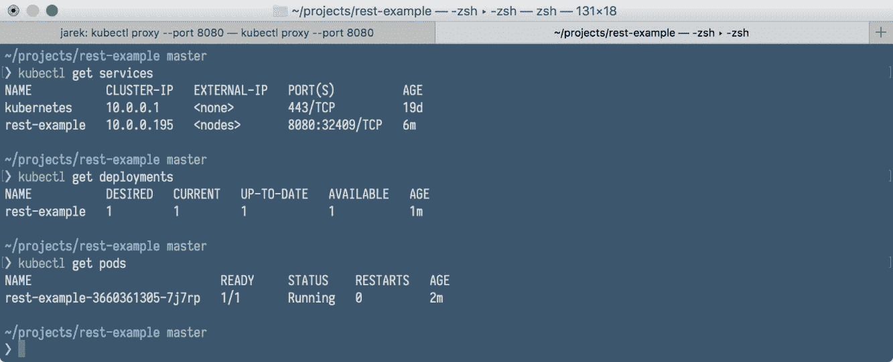
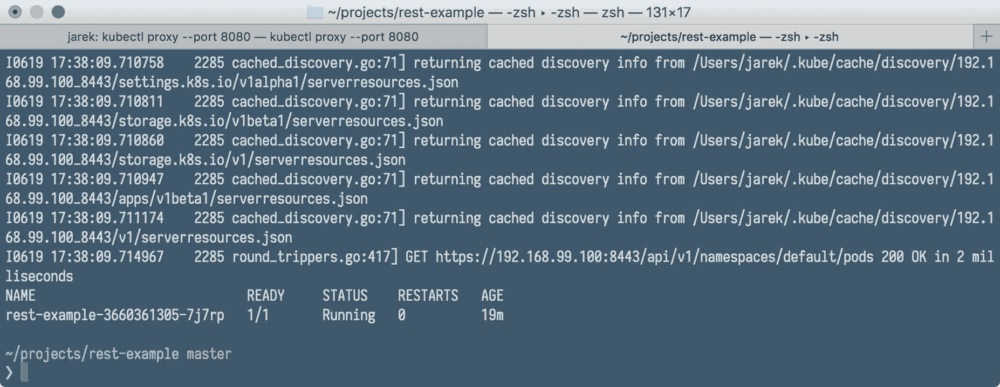
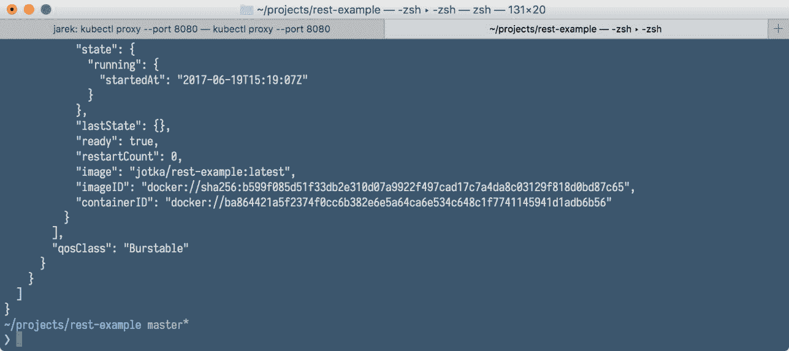

# 第九章：使用 Kubernetes API。

在第七章中，*Kubernetes 简介*，和第八章，*使用 Java 与 Kubernetes*，我们学习了 Kubernetes 的概念，并通过安装本地 Kubernetes 集群`minikube`来实践使用它们。我们了解了 Kubernetes 架构的所有组件，比如 pod、节点、部署和服务等。我们还提到了驻留在 Master 节点上的主要组件之一，即 API 服务器。正如你在第七章中所记得的，API 服务器在技术上是一个名为`kube-apiserver`的进程，它接受并响应使用 JSON 的`HTTP REST`请求。API 服务器的主要目的是验证和处理集群资源的数据，比如 Pod、服务或部署等。API 服务器是中央管理实体。它也是唯一直接连接到`etcd`的 Kubernetes 组件，`etcd`是 Kubernetes 存储其所有集群状态的分布式键值数据存储。

在之前的章节中，我们一直在使用`kubectl`命令行工具来管理我们的集群。`kubectl`是一个有用的实用工具，每当我们想要针对我们的集群执行命令时，无论是创建、编辑还是删除资源。事实上，`kubectl`也与 API 服务器通信；你可能已经注意到，在 Kubernetes 中几乎每个改变某些东西的操作基本上都是在编辑资源。如果你想要扩展或缩减你的应用程序，这将通过修改部署资源来完成。Kubernetes 将即时捕捉到变化并将其应用到资源上。此外，诸如列出 Pod 或部署的只读操作，将执行相应的`GET`请求。

实际上，如果您以更高级别的详细程度运行 kubectl 命令，例如使用`--v=6`或`--v=9`选项，您可以看到正在进行的 REST 调用。我们稍后将回到这个问题。我们可以使用 kubectl、客户端库或进行 REST 请求来访问 API。REST API 何时有用？嗯，您可以在任何编程或脚本语言中创建 REST 调用。这创造了一个全新的灵活性水平，您可以从自己的 Java 应用程序中管理 Kubernetes，从 Jenkins 中的持续交付流程中管理，或者从您正在使用的构建工具中管理，例如 Maven。可能性几乎是无限的。在本章中，我们将通过使用命令行 curl 实用程序进行 REST 调用来了解 API 概述、其结构和示例请求。本章将涵盖以下主题：

+   关于 API 版本控制的解释

+   认证（确定谁是谁）

+   授权（确定谁能做什么）

+   通过进行一些示例调用来使用 API

+   OpenAPI Swagger 文档

让我们开始 API 概述。

# API 版本控制

Kubernetes 不断发展。其功能发生变化，这也导致 API 发生变化。为了处理这些变化，并且在较长时间内不破坏与现有客户端的兼容性，Kubernetes 支持多个 API 版本，每个版本都有不同的 API 路径，例如`/api/v1`或`/apis/extensions/v1beta1`。Kubernetes API 规范中有三个 API 级别：alpha，beta 和 stable。让我们了解一下它们的区别。

# Alpha

Alpha 版本级别默认禁用，与其他软件一样，Alpha 版本应被视为有错误并且不适合生产。此外，您应该注意，Alpha 版本中引入的任何功能可能在稳定版本中并不总是可用。此外，API 的更改可能在下一个版本中不兼容。除非您非常渴望测试新功能或进行一些实验，否则不应使用`alpha`版本。

# Beta

Beta 级别与 API 的`alpha`级别完全不同，代码经过测试（仍然可能存在一些错误，因为它仍然不是`稳定`版本）。此外，与`alpha`级别相比，`beta`中的功能将不会在将来的版本中被删除。如果 API 中有破坏性的、不向后兼容的更改，Kubernetes 团队将提供迁移指南。在生产环境中使用`beta`并不是最好的主意，但您可以在非业务关键的集群上安全地使用`beta`。您也被鼓励从使用`beta`中提供反馈，这将使我们所有人使用的 Kubernetes 变得更好。`beta`级别中的版本名称将包含单词`beta`，例如`v1beta1`。

# 稳定

API 的稳定级别是经过测试的，已经准备好投入生产的软件。稳定 API 中的版本名称将是`vX`，其中`X`是一个整数，例如`v1`。

Kubernetes API 利用了 API 组的概念。引入 API 组是为了将来更容易地扩展 Kubernetes API。API 组在`REST`路径和调用的 JSON 负载的`apiVersion`字段中指定。目前，有几个 API 组正在使用：core、batch 和 extensions。组名是 API 调用的`REST`路径的一部分：`/apis/$GROUP_NAME/$VERSION`。核心组是一个例外，它不显示在`REST`路径中，例如：`/api/v1`**。**您可以在 Kubernetes API 参考中找到支持的 API 组的完整列表。

通过使用 API，您几乎可以像使用`kubectl`命令一样对集群进行任何操作。这可能是危险的；这就是为什么 Kubernetes 支持认证（确定您是谁）和授权（您可以做什么）。调用 API 服务的基本流程如下图所示：

让我们从认证开始。

# 认证

默认情况下，Kubernetes API 服务器在两个端口上提供`HTTP`请求：

+   **本地主机**，**不安全端口**：默认情况下，IP 地址为`localhost`，端口号为`8080`。没有 TLS 通信，此端口上的所有请求都将绕过身份验证和授权插件。这是为了测试和引导，以及主节点的其他组件。这也用于其他 Kubernetes 组件，如调度程序或控制器管理器来执行 API 调用。您可以使用`--insecure-port`开关更改端口号，并使用`--insecure-bind-address`命令行开关更改默认 IP。

+   **安全端口**：默认端口号是`6443`（可以使用`--secure-port`开关进行更改），通常在云提供商上是`443`。它使用 TLS 通信。可以使用`--tls-cert-file`开关设置证书。可以使用`--tls-private-key-file`开关提供私有 SSL 密钥。通过此端口传入的所有请求将由身份验证和授权模块以及准入控制模块处理。尽可能使用安全端口。通过让 API 客户端验证`api-server`呈现的 TLS 证书，它们可以验证连接既加密又不易受中间人攻击。您还应该在仅本地主机可以访问不安全端口的情况下运行`api-server`，以便通过网络传入的连接使用`HTTP`。

+   使用 minikube 直接访问 API 服务器时，您需要使用 minikube 生成的自定义 SSL 证书。客户端证书和密钥通常存储在`~/.minikube/apiserver.crt`和`~/.minikube/apiserver.key`中。在进行`HTTP`请求时，您需要将它们加载到您的`HTTP`客户端中。如果您使用`curl`，请使用`--cert`和`--key`选项来使用`cert`和`key`文件。

API 服务器的访问可以通过代理简化，在本章后面我们将开始介绍。

如果您想从不同的域发送请求到 Kubernetes API，您需要在`api-server`上启用`cors`。您可以通过在`kube-apiserver`配置中添加`--cors-allowed-origins=["http://*"]`参数来实现。通常在`/etc/default/kube-apiserver`文件中进行配置，并重新启动`kube-apiserver`。

请注意，Kubernetes 集群不会自行管理用户。相反，用户被假定由外部独立服务管理。Kubernetes 集群中没有代表普通用户帐户的资源。这就是为什么用户不能通过 API 调用添加到集群中。

Kubernetes 不会自行管理用户帐户。

Kubernetes API 支持多种身份验证形式：`HTTP`基本身份验证、持有者令牌和客户端证书。它们被称为身份验证策略。在启动`api-server`时，您可以使用命令行标志来启用或禁用这些身份验证策略。让我们看看可能的情况，从最简单的基本身份验证策略开始。

# HTTP 基本身份验证

要使用此身份验证策略，您需要使用`--basic-auth-file=<path_to_auth_file>`开关启动`api-server`。它应该是一个包含每个用户以下条目的`csv`文件：

[PRE0]

您还可以指定一个可选的第四列，其中包含用逗号分隔的组名。如果用户有多个组，整个列的内容必须用双引号括起来，例如：

[PRE1]

如果`api-server`使用基本身份验证策略，它将期望所有的`REST`调用都包含在`Authorization`头中，其中包含用`BASE64`编码的用户名和密码（类似于普通的基本身份验证保护的 web 调用），例如：

[PRE2]

要生成授权头值，您可以在 shell 中使用以下命令，它将为具有密码 secret 的用户生成值：

[PRE3]

请注意，对基本`auth`文件的任何更改都需要重新启动`api-server`才能生效。

在云中运行 Kubernetes 时，通常会使用`HTTP`基本身份验证作为默认。例如，一旦在 Google 容器引擎上启动容器集群，您将在 GCP 项目中的 VM 上运行`api-server`。如果运行`gcloud preview container clusters`列表，您将看到`api-server`监听请求的端点以及访问它所需的凭据。您将在第十章中找到更多关于在云中运行 Kubernetes 的内容，*在云上部署 Java 到 Kubernetes*。

# 静态令牌文件

要使`api-server`使用此方案，需要使用`--token-auth-file=<PATH_TO_TOKEN_FILE>`开关启动。与`HTTP`基本身份验证策略类似，提供的文件是一个包含每个用户记录的`csv`文件。记录需要采用以下格式：

[PRE4]

再次强调，组名是可选的，如果用户有多个组，您需要用逗号分隔它们并用双引号括起来。令牌只是一个`base64`编码的字符串。在 Linux 上生成令牌的示例命令可以如下：

[PRE5]

输出将是一个令牌，然后您将其输入到`token`文件中，例如：

[PRE6]

当使用这种策略时，`api-server`将期望一个值为`Bearer <` `TOKEN>`的`Authorization`头。在我们的示例中，这将看起来与以下内容相同：

[PRE7]

令牌永久有效，并且令牌列表在不重新启动 API 服务器的情况下无法更改。

# 客户端证书

为了使用这个方案，`api-server`需要使用以下开关启动：

[PRE8]

`CA_CERTIFICATE_FILE`必须包含一个或多个证书颁发机构，用于验证提交给`api-server`的客户端证书。客户端证书的/CN（通用名称）用作用户名。客户端证书还可以使用组织字段指示用户的组成员资格。要为用户包括多个组成员资格，您需要在证书中包括多个组织字段。例如，使用`openssl`命令行工具生成证书签名请求：

[PRE9]

这将为用户名`user`创建一个证书签名请求，属于两个组`group1`和`group2`。

# OpenID

OpenID connect 1.0 是 OAuth 2.0 协议之上的一个简单身份验证层。您可以在互联网上阅读有关 OpenID connect 的更多信息，网址为`https://openid.net/connect`。它允许客户端根据授权服务器执行的身份验证来验证最终用户的身份，并以一种可互操作和类似于`REST`的方式获取有关最终用户的基本配置信息。所有云提供商，包括 Azure、Amazon 和 Google 都支持 OpenID。与`OAuth2`的主要区别在于访问令牌中返回的附加字段称为`id_token`。这个令牌是一个带有众所周知字段（例如用户的电子邮件）的**JSON Web Token**（**JWT**），由服务器签名。为了识别用户，认证器使用`OAuth2token`响应中的`id_token`作为持有者令牌。要使用 OpenID 身份验证，您需要登录到您的身份提供者，该提供者将为您提供一个`id_token`（以及标准的 OAuth 2.0 `access_token`和`refresh_token`**）**。

由于进行身份验证所需的所有数据都包含在`id_token`中，Kubernetes 不需要向身份提供者发出额外的调用。这对于可扩展性非常重要，每个请求都是无状态的。

要为`kubectl`命令提供一个令牌值，您需要使用`--token`标志。或者，您可以直接将其添加到您的`kubeconfig`文件中。

这是当您执行对您的`api-server`的`HTTP`调用时会发生的事情的简化流程：

+   `kubectl`将在`authorization`标头中发送您的`id_token`到 API 服务器。

+   API 服务器将通过检查配置中命名的证书来验证 JWT 签名

+   API 服务器将检查`id_token`是否已过期

+   API 服务器将确保用户经过授权，并且如果是这样的话会向`kubectl`返回一个响应。

默认情况下，任何具有对`api-server`的访问凭据的人都可以完全访问集群。您还可以配置更精细的授权策略，现在让我们来看看授权。

# 授权

成功验证后的下一步是检查经过授权的用户允许进行哪些操作。截至今天，Kubernetes 支持四种类型的授权策略方案。要使用特定的授权模式，启动`api-server`时使用`--authorization-mode`开关。语法是：

[PRE10]

`<mode>`参数包含了 Kubernetes 应该用来对用户进行身份验证的授权插件的有序列表。当启用了多个身份验证插件时，第一个成功验证请求的插件将使 Kubernetes 跳过执行所有剩余的插件。

默认授权模式是`AlwaysAllow`，允许所有请求。

支持以下授权方案：

+   基于属性的控制

+   基于角色的控制

+   Webhook

+   `AlwaysDeny`

+   `AlwaysAllow`

让我们简要地逐一描述它们。

# 基于属性的访问控制

**基于属性的访问控制**（**ABAC**）策略将在使用`--authorization-mode=ABAC`选项启动`api-server`时使用。该策略使用本地文件，您可以以灵活的方式在其中定义每个用户应具有的权限。还有一个提供策略文件的额外选项：`--authorization-policy-file`，因此使用此策略的完整语法将是：

[PRE11]

请注意，对策略文件的任何更改都将需要重新启动`api-server`。

正如你从第七章中记得的，*Kubernetes 简介*，Kubernetes 集群使用命名空间的概念来对相关资源进行分组，如 Pod、部署或服务。`api-server`中的授权模式利用了这些命名空间。`ABAC`策略文件语法相当清晰和可读。每个条目都是描述授权规则的 JSON 对象。考虑策略文件中的以下条目，它为用户`john`提供对命名空间`myApp`的完全访问权限：

[PRE12]

下一个示例将为用户`admin`提供对所有命名空间的完全访问权限：

[PRE13]

最后，一个示例，为所有用户提供对整个集群的只读访问权限：

[PRE14]

# 基于角色的访问控制（RBAC）

**基于角色的访问控制**（**RBAC**），策略实施深度集成到了 Kubernetes 中。事实上，Kubernetes 在内部使用它来为系统组件授予必要的权限以使其正常运行。`RBAC`是 100%的 API 驱动，角色和绑定是管理员可以在集群上编写和创建的 API 资源，就像其他资源（如 Pod、部署或服务）一样。启用`RBAC`模式就像向`kube-apiserver`传递一个标志一样简单：

[PRE15]

这种模式允许您使用 Kubernetes API 创建和存储策略。在`RBAC` API 中，一组权限由角色的概念表示。命名空间角色和整个集群角色之间有区别，由`Role`资源表示，整个集群角色由`ClusterRole`资源表示。`ClusterRole`可以定义与`Role`相同的所有权限，但也可以定义一些与集群相关的权限，例如管理集群节点或修改所有可用命名空间中的资源。请注意，一旦启用了`RBAC`，API 的每个方面都将被禁止访问。

权限是可累加的；没有拒绝规则。

这是一个角色的示例，它为所有资源的所有操作提供了整套可用权限：

[PRE16]

角色是一个资源，正如你从第八章中记得的，*使用 Java 与 Kubernetes*，要使用文件创建资源，你执行`kubectl create`命令，例如：

[PRE17]

`Role`和`ClusterRole`定义了一组权限，但不直接将它们分配给用户或组。在 Kubernetes API 中有另一个资源，即`RoleBinding`或`ClusterRoleBinding`。它们将`Role`或`ClusterRole`绑定到特定的主体，可以是用户、组或服务用户。要绑定`Role`或`ClusterRole`，您需要执行`kubectl create rolebinding`命令。看一下以下示例。要在命名空间`myApp`中向名为`john`的用户授予`adminClusterRole`：

[PRE18]

下一个将在整个集群中向名为`admin`的用户授予`cluster-admin ClusterRole`：

[PRE19]

使用`kubectl create -f`的等效 YAML 文件如下：

[PRE20]

# WebHook

当`api-server`以`--authorization-mode=Webhook`选项启动时，它将调用外部的`HTTP`服务器来对用户进行授权。这使您能够创建自己的授权服务器。换句话说，WebHook 是一种`HTTP`回调模式，允许您使用远程`REST`服务器来管理授权，无论是您自己开发的，还是第三方授权服务器。

在进行授权检查时，`api-server`将执行`HTTP POST`请求，其中包含一个序列化的`api.authorization.v1beta1.SubjectAccessReview`对象的 JSON 有效负载。此对象描述了向`api-server`发出请求的用户，此用户想要执行的操作，以及作为此操作主题的资源的详细信息。示例请求有效负载可能如下例所示：

[PRE21]

远程授权服务器应提供响应，指示此用户是否被授权在指定资源上执行指定操作。响应应包含`SubjectAccessReviewStatus`字段，指定`api-server`是否应允许或拒绝访问。宽松的 JSON 响应看起来与此相同：

[PRE22]

负面响应将如下例所示出现：

[PRE23]

将授权委托给另一个服务的可能性使授权过程非常灵活，想象一下，根据用户在企业`LDAP`目录中的角色，您自己的软件授权用户在集群中执行某些操作。

# AlwaysDeny

此策略拒绝所有请求。如果您使用`--authorization-mode=AlwaysDeny`开关启动`api-server`，则将使用它。如果您正在进行一些测试或希望阻止传入请求而不实际停止`api-server`，这可能很有用。

# AlwaysAllow

如果您使用`--authorization-mode=AlwaysAllow`开启`api-server`，则所有请求将被接受，而不使用任何授权模式。只有在不需要对 API 请求进行授权时才使用此标志。

正如您所看到的，Kubernetes 中的身份验证和授权可能性非常灵活。在本章开头的图表中，我们已经看到了 API 调用流程的第三阶段：准入控制。准入控制扮演着什么角色？让我们找出来。

# 准入控制

准入控制插件在请求经过身份验证和授权后，但在对 API 资源进行任何更改之前拦截对 Kubernetes API 服务器的请求。这些插件按顺序运行，在请求被接受到集群之前运行。Kubernetes API 服务器支持一个标志`admission-control`，它接受一个逗号分隔的有序准入控制插件列表。

现在我们已经了解了 API 调用的外观，让我们实际利用一些。

# 使用 API

API 参考是一份详细的文档，可以在互联网上找到[`kubernetes.io/docs/api-reference/v1.6/`](https://kubernetes.io/docs/api-reference/v1.6/)；[当然，API 版本将来会更改，`v1.6`是写作时的当前版本。](https://kubernetes.io/docs/api-reference/v1.6/)

在我们对`api-server`进行一些实际调用之前，值得知道`kubectl`也使用 API 与 Kubernetes 集群进行通信。正如我们之前提到的，您可以通过`kubectl`命令查看正在进行的`REST`调用。查看在使用`kubectl`时发送到服务器的内容是熟悉 Kubernetes API 的好方法。

要查看`kubectl`执行的`REST`请求，可以以更高的详细级别运行它，例如使用`--v=6`或`--v=9`选项。

在我们开始实际进行`REST`调用之前，让我们简要地看一下 API 操作有哪些可能。

# API 操作

Kubernetes API 定义了 CRUD（创建、更新、读取和删除）一组操作：

+   `Create`：创建操作将在集群中创建资源。您需要在您的`REST`调用中提供的 JSON 有效负载是资源清单。这相当于我们在第八章中构建的 YAML 文件，*使用 Java 与 Kubernetes*。这次，它将以 JSON 格式呈现。

+   `Update`：更新操作可以是`Replace`或`Patch`。`Replace`将简单地用提供的规范替换整个资源对象（例如 Pod）。另一方面，`Patch`将仅对特定字段应用更改。

+   `Read`：读取操作可以是`Get`、`List`或`Watch`。通过执行`Get`，您将得到一个特定资源对象的名称。执行`List`将检索命名空间内特定类型的所有资源对象。您可以使用选择器查询。`List`操作的一种特殊形式是`List All Namespaces`，正如其名称所示，这将检索所有命名空间中的资源。`Watch`操作将流式传输对象或列表对象的结果，因为它们被更新。

+   删除：将简单地删除资源。

Kubernetes `api-server`还公开了一些其他特定于资源的操作。这包括`Rollback`，它将 Pod 模板回滚到先前的版本，或者读取/写入规模，它读取或更新给定资源的副本数量。

# 示例调用

在以下示例中，我们将使用命令行`HTTP`客户端`curl`。您不限于`curl`，可以自由使用您觉得方便的`HTTP`客户端。使用带有用户界面的`HTTP`客户端通常非常方便，它们通常以结构化形式呈现`HTTP`响应，并有时还会进行一些请求验证，如果它是格式良好的。我推荐的 GUI 客户端将是 Postman（适用于 Windows、Linux 或 Mac），或者 Mac 的 PAW。

在进行任何调用之前，让我们首先启动一个代理到 Kubernetes API 服务器。首先需要配置`kubectl`，以便能够与您的集群通信。在我们的本地 Kubernetes 安装中，使用`minikube`，`kubectl`命令将自动配置。要启动到`api-server`的代理，请执行以下命令：

[PRE24]

在代理会话运行时，发送到`localhost:8000`的任何请求将被转发到 Kubernetes API 服务器。要检查我们的`api-server`是否正在运行，让我们询问它支持的 API 版本：

[PRE25]

如果`api-server`正在运行并等待传入请求，它应该给您一个类似于这样的输出：

看起来一切都很顺利；让我们继续利用暴露的 API，开始创建服务，与之前一样。

# 使用 API 创建服务

首先，让我们创建一个服务清单文件。请注意，如果您在第八章中使用`kubectl`创建了您的服务、部署和 Pod，*使用 Java 与 Kubernetes*，您将需要使用`kubectl`或 Kubernetes 仪表板将它们删除。我们将使用相同的名称来创建服务和部署。在使用`curl`发送较大有效负载时，最好将有效负载放在外部文件中，而不是在命令行中输入。我们将使用的 JSON 文件作为有效负载与我们使用`kubectl`创建 Pod 时使用的文件非常相似，但这次是以 JSON 格式。让我们创建一个名为`service.json`的文件：

[PRE26]

请注意，JSON 文件的内容基本上与我们在使用 YAML 文件创建资源时使用的内容相同。是的，您可以清楚地看到`kubectl`命令是如何实现的，它只是从文件输入创建一个 JSON 有效负载，一点魔术都没有。

您可以在网上使用其中一个 YAML/JSON 转换器在 YAML 和 JSON 之间进行转换。Kubernetes `api-server`将接受这样的 JSON，就像`Kubectl`接受 YAML 文件一样。

准备好我们的 JSON 文件，下一步是通过调用以下命令在我们的集群中创建服务资源：

[PRE27]

定义了我们的服务，让我们创建一个部署。

# 使用 API 创建部署

创建部署与创建服务非常相似，毕竟它是创建另一种类型的 Kubernetes 资源。我们所需要的只是一个适当的 JSON 有效负载文件，我们将使用`POST HTTP`方法将其发送到`api-server`。我们的 JSON 格式的`rest-example`部署清单可以如下所示：

[PRE28]

让我们使用`deployment.json`文件名保存文件。再次，我们现在需要做的就是将这个文件发布到`api-server`。这个过程与创建服务非常相似，只是向不同的端点发送不同的有效负载进行`POST`。要使用`curl`从 shell 创建部署，请执行以下命令：

[PRE29]

在前面的示例中，您应该注意到与部署相关的 API 命令位于另一个 API 组：`extensions`。这就是为什么端点将具有不同的`REST`路径。

执行这两个`REST HTTP`请求后，我们应该在集群中创建了我们的服务和部署。当然，因为部署清单包含副本数为`1`，一个 Pod 也将被创建。让我们通过执行以下命令来检查是否属实：

[PRE30]

正如您在以下截图中所看到的，所有资源都存在于我们的集群中。然而，这一次，它们是通过两个简单的`HTTP POST`请求到 Kubernetes `api-servers`创建的，而不是使用`kubectl`：

我们之前说过，我们可以观察`kubectl`工具执行的`HTTP`请求。让我们验证一下。我们将执行最后一个命令以获取 Pod 的列表，但使用相同的额外详细级别，就像这样：

[PRE31]

输出应该类似于以下内容：

有一堆关于从集群缓存获取信息的日志行，但最后一行特别有趣，它包含了`kubectl`正在进行的实际`HTTP`请求：

[PRE32]

如果您现在使用此 URL 运行`curl GET`命令，所有身份验证和授权机制都会生效。但是通过运行`api-server`代理，我们可以通过在代理端口上执行调用来跳过授权和身份验证（请注意，`curl`默认执行`GET`方法）：

[PRE33]

作为输出，您将获得包含有关集群中 Pod 的详细信息的 JSON 响应。API 正在工作，正如您在以下截图中所看到的：

# 删除服务和部署

如果您决定进行一些清理工作，您可以通过执行`HTTP DELETE`请求来删除服务和部署，例如：

[PRE34]

通过查看 Web 文档或窥探`kubectl`调用的 URL 来找到正确的 API 操作`REST`路径（端点）可能非常不方便。有一种更好的方法；Kubernetes `api-server`的 OpenAPI 规范。让我们看看如何获取这个规范。

# Swagger 文档

Kubernetes 的`api-server`利用 OpenAPI 规范提供了可用 API 命令的列表。OpenAPI 规范定义了一种标准的、与语言无关的 REST API 接口，允许人类和计算机在没有访问源代码、文档或通过网络流量检查的情况下发现和理解服务的能力。使用随 Kubernetes`api-server`一起提供的 SwaggerUI 工具浏览 API 命令目录非常方便。您也可以使用 SwaggerUI 执行 HTTP 命令。

请注意，如果您正在使用 Minikube 运行本地集群，默认情况下未启用 SwaggerUI。您需要在集群启动期间使用以下命令启用它：

[PRE35]

在端口`8080`上仍在运行`api-server`代理的情况下，访问以下主机在您的 Web 浏览器中查看 SwaggerUI 屏幕：

[PRE36]

您将看到一个可用 API 命令的列表，分组为 API 组：

展开每个 API 部分将为您提供所有可用的端点以及每个操作的描述。SwaggerUI 是一个探索 API 的清晰可读形式的绝佳工具。

# 摘要

正如您所看到的，Kubernetes 公开的 API 是您工具库中非常强大的工具。可以通过仪表板或`kubectl`客户端执行的任何任务都作为 API 公开。您可以通过使用`HTTP`调用简单地执行集群中的几乎任何操作。Kubernetes 采用 API 优先的方法，使其可编程和可扩展。正如我们所看到的，使用 API 很容易入门。我们的服务和部署创建示例可能很简单，但应该让您了解如何使用`api-server`进行实验。使用 API，您不仅可以从命令行使用`kubectl`，还可以从您自己的应用程序、构建脚本或持续交付流水线中创建和检索集群资源。只有您的想象力和天空是极限，说到天空，现在是时候移动到那里，看看 Kubernetes 如何在云中使用了。
