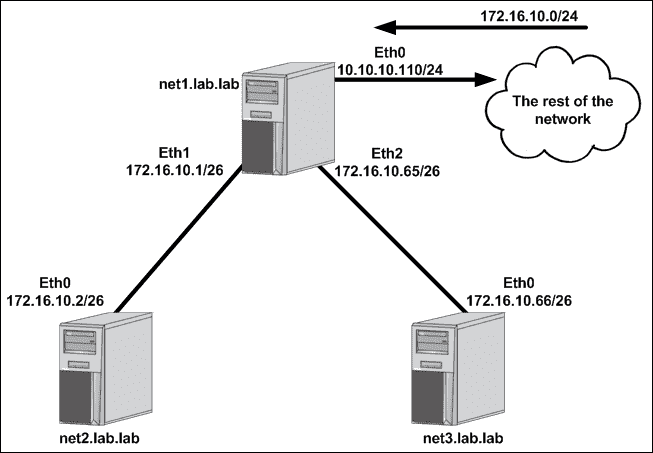
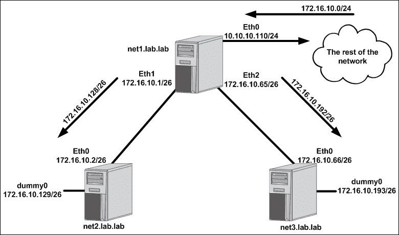
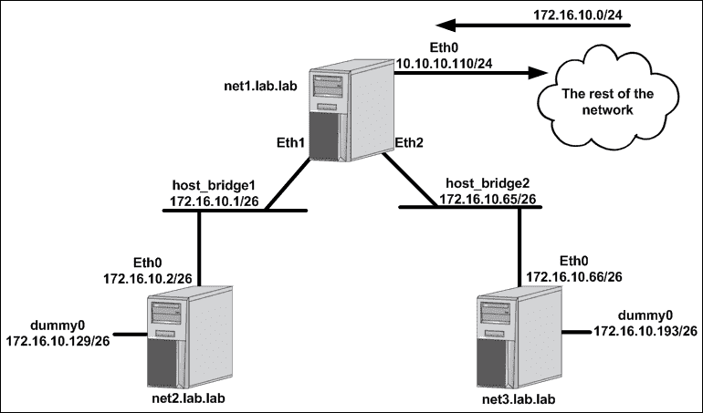

# 第一章。Linux 网络构造

在本章中，我们将涵盖以下配方：

+   使用接口和地址

+   配置 Linux 主机路由

+   探索桥接

+   建立连接

+   探索网络命名空间

# 介绍

Linux 是一个功能强大的操作系统，具有许多强大的网络构造。就像任何网络技术一样，它们单独使用时很强大，但在创造性地组合在一起时变得更加强大。Docker 是一个很好的例子，它将许多 Linux 网络堆栈的单独组件组合成一个完整的解决方案。虽然 Docker 大部分时间都在为您管理这些内容，但当查看 Docker 使用的 Linux 网络组件时，了解一些基本知识仍然是有帮助的。

在本章中，我们将花一些时间单独查看这些构造，而不是在 Docker 之外。我们将学习如何在 Linux 主机上进行网络配置更改，并验证网络配置的当前状态。虽然本章并不专门针对 Docker 本身，但重要的是要了解原语，以便在以后的章节中讨论 Docker 如何使用这些构造来连接容器。

# 使用接口和地址

了解 Linux 如何处理网络是理解 Docker 处理网络的一个重要部分。在这个配方中，我们将专注于 Linux 网络基础知识，学习如何在 Linux 主机上定义和操作接口和 IP 地址。为了演示配置，我们将在本配方中开始构建一个实验室拓扑，并在本章的其他配方中继续进行。

## 准备工作

为了查看和操作网络设置，您需要确保已安装`iproute2`工具集。如果系统上没有安装它，可以使用以下命令进行安装：

```
sudo apt-get install iproute2
```

为了对主机进行网络更改，您还需要 root 级别的访问权限。

为了在本章中进行演示，我们将使用一个简单的实验室拓扑。主机的初始网络布局如下：


在这种情况下，我们有三台主机，每台主机已经定义了一个`eth0`接口：

+   `net1`: `10.10.10.110/24`，默认网关为`10.10.10.1`

+   `net2`: `172.16.10.2/26`

+   `net3`: `172.16.10.66/26`

## 操作步骤

大多数终端主机的网络配置通常仅限于单个接口的 IP 地址、子网掩码和默认网关。这是因为大多数主机都是网络端点，在单个 IP 接口上提供一组离散的服务。但是如果我们想要定义更多的接口或操作现有的接口会发生什么呢？为了回答这个问题，让我们首先看一下像前面例子中的`net2`或`net3`这样的简单单宿主服务器。

在 Ubuntu 主机上，所有的接口配置都是在`/etc/network/interfaces`文件中完成的。让我们检查一下`net2`主机上的文件：

```
# The loopback network interface
auto lo
iface lo inet loopback

# The primary network interface
auto eth0
iface eth0 inet static
        address 172.16.10.2
        netmask 255.255.255.192
```

我们可以看到这个文件定义了两个接口——本地的`loopback`接口和接口`eth0`。`eth0`接口定义了以下信息：

+   `address`：主机接口的 IP 地址

+   `netmask`：与 IP 接口相关的子网掩码

该文件中的信息将在每次接口尝试进入上行或操作状态时进行处理。我们可以通过使用`ip addr show <interface name>`命令验证该配置文件在系统启动时是否被处理：

```
user@net2:~$ ip addr show eth0
2: eth0: <BROADCAST,MULTICAST,UP,LOWER_UP> mtu 1500 qdisc pfifo_fast state UP group default qlen 1000
    link/ether 00:0c:29:59:ca:ca brd ff:ff:ff:ff:ff:ff
    inet 172.16.10.2/26 brd 172.16.10.63 scope global eth0
       valid_lft forever preferred_lft forever
    inet6 fe80::20c:29ff:fe59:caca/64 scope link
       valid_lft forever preferred_lft forever
user@net2:~$
```

现在我们已经审查了单宿主配置，让我们来看看在单个主机上配置多个接口需要做些什么。目前为止，`net1`主机是唯一一个在本地子网之外具有可达性的主机。这是因为它有一个定义好的默认网关指向网络的其他部分。为了使`net2`和`net3`可达，我们需要找到一种方法将它们连接回网络的其他部分。为了做到这一点，让我们假设主机`net1`有两个额外的网络接口，我们可以直接连接到主机`net2`和`net3`：



让我们一起来看看如何在`net1`上配置额外的接口和 IP 地址，以完成拓扑结构。

我们要做的第一件事是验证我们在`net1`上有可用的额外接口可以使用。为了做到这一点，我们将使用`ip link show`命令：

```
user@net1:~$ ip link show
1: lo: <LOOPBACK,UP,LOWER_UP> mtu 65536 qdisc noqueue state UNKNOWN mode DEFAULT group default
    link/loopback 00:00:00:00:00:00 brd 00:00:00:00:00:00
2: **eth0**: <BROADCAST,MULTICAST,UP,LOWER_UP> mtu 1500 qdisc pfifo_fast state UP mode DEFAULT group default qlen 1000
    link/ether 00:0c:29:2d:dd:79 brd ff:ff:ff:ff:ff:ff
3: **eth1**: <BROADCAST,MULTICAST> mtu 1500 qdisc noop state DOWN mode DEFAULT group default qlen 1000
    link/ether 00:0c:29:2d:dd:83 brd ff:ff:ff:ff:ff:ff
4: **eth2**: <BROADCAST,MULTICAST> mtu 1500 qdisc noop state DOWN mode DEFAULT group default qlen 1000
    link/ether 00:0c:29:2d:dd:8d brd ff:ff:ff:ff:ff:ff
user@net1:~$
```

从输出中我们可以看到，除了`eth0`接口，我们还有`eth1`和`eth2`接口可供使用。要查看哪些接口有与之关联的 IP 地址，我们可以使用`ip address show`命令：

```
user@net1:~$ ip address show
1: lo: <LOOPBACK,UP,LOWER_UP> mtu 65536 qdisc noqueue state UNKNOWN group default
    link/loopback 00:00:00:00:00:00 brd 00:00:00:00:00:00
    inet 127.0.0.1/8 scope host lo
       valid_lft forever preferred_lft forever
    inet6 ::1/128 scope host
       valid_lft forever preferred_lft forever
2: eth0: <BROADCAST,MULTICAST,UP,LOWER_UP> mtu 1500 qdisc pfifo_fast state UP group default qlen 1000
    link/ether 00:0c:29:2d:dd:79 brd ff:ff:ff:ff:ff:ff
    inet **10.10.10.110/24** brd 10.10.10.255 scope global eth0
       valid_lft forever preferred_lft forever
    inet6 fe80::20c:29ff:fe2d:dd79/64 scope link
       valid_lft forever preferred_lft forever
3: eth1: <BROADCAST,MULTICAST> mtu 1500 qdisc noop state DOWN group default qlen 1000
    link/ether 00:0c:29:2d:dd:83 brd ff:ff:ff:ff:ff:ff
4: eth2: <BROADCAST,MULTICAST> mtu 1500 qdisc noop state DOWN group default qlen 1000
    link/ether 00:0c:29:2d:dd:8d brd ff:ff:ff:ff:ff:ff
user@net1:~$
```

前面的输出证明我们目前只在接口`eth0`上分配了一个 IP 地址。这意味着我们可以使用接口`eth1`连接到服务器`net2`，并使用接口`eth2`连接到服务器`net3`。

我们可以有两种方法来配置这些新接口。第一种是在`net1`上更新网络配置文件，包括相关的 IP 地址信息。让我们为面向主机`net2`的链接进行配置。要配置这种连接，只需编辑文件`/etc/network/interfaces`，并为两个接口添加相关的配置。完成的配置应该是这样的：

```
# The primary network interface
auto eth0
iface eth0 inet static
        address 10.10.10.110
        netmask 255.255.255.0
        gateway 10.10.10.1
**auto eth1**
**iface eth1 inet static**
 **address 172.16.10.1**
 **netmask 255.255.255.192**

```

保存文件后，您需要找到一种方法告诉系统重新加载配置文件。做到这一点的一种方法是重新加载系统。一个更简单的方法是重新加载接口。例如，我们可以执行以下命令来重新加载接口`eth1`：

```
user@net1:~$ **sudo ifdown eth1 && sudo ifup eth1**
ifdown: interface eth1 not configured
user@net1:~$
```

### 注意

在这种情况下并不需要，但同时关闭和打开接口是一个好习惯。这样可以确保如果关闭了你正在管理主机的接口，你不会被切断。

在某些情况下，您可能会发现更新接口配置的这种方法不像预期的那样工作。根据您使用的 Linux 版本，您可能会遇到一个情况，即之前的 IP 地址没有从接口中删除，导致接口具有多个 IP 地址。为了解决这个问题，您可以手动删除旧的 IP 地址，或者重新启动主机，这将防止旧的配置持续存在。

执行完命令后，我们应该能够看到接口`eth1`现在被正确地寻址了。

```
user@net1:~$ ip addr show dev eth1
3: **eth1**: <BROADCAST,MULTICAST,UP,LOWER_UP> mtu 1500 qdisc pfifo_fast state UP group default qlen 1000
    link/ether 00:0c:29:2d:dd:83 brd ff:ff:ff:ff:ff:ff
    inet **172.16.10.1/26** brd 172.16.10.63 scope global eth1
       valid_lft forever preferred_lft forever
    inet6 fe80::20c:29ff:fe2d:dd83/64 scope link
       valid_lft forever preferred_lft forever
user@net1:~$
```

要在主机`net1`上配置接口`eth2`，我们将采用不同的方法。我们将使用`iproute2`命令行来更新接口的配置，而不是依赖配置文件。为此，我们只需执行以下命令：

```
user@net1:~$ sudo ip address add **172.16.10.65/26** dev **eth2**
user@net1:~$ sudo ip link set eth2 up
```

这里需要注意的是，这种配置是不持久的。也就是说，由于它不是在系统初始化时加载的配置文件的一部分，这个配置在重新启动后将会丢失。对于使用`iproute2`或其他命令行工具集手动完成的任何与网络相关的配置都是一样的情况。

### 注意

在网络配置文件中配置接口信息和地址是最佳实践。在这些教程中，修改配置文件之外的接口配置仅用于举例。

到目前为止，我们只是通过向现有接口添加 IP 信息来修改现有接口。我们实际上还没有向任何系统添加新接口。添加接口是一个相当常见的任务，正如后面的教程将展示的那样，有各种类型的接口可以添加。现在，让我们专注于添加 Linux 所谓的虚拟接口。虚拟接口在网络中的作用类似于环回接口，并描述了一种始终处于开启和在线状态的接口类型。接口是通过使用`ip link add`语法来定义或创建的。然后，您指定一个名称，并定义您正在定义的接口类型。例如，让我们在主机`net2`和`net3`上定义一个虚拟接口：

```
user@net2:~$ sudo ip link add dummy0 type dummy
user@net2:~$ sudo ip address add 172.16.10.129/26 dev dummy0
user@net2:~$ sudo ip link set dummy0 up

user@net3:~$ sudo ip link add dummy0 type dummy
user@net3:~$ sudo ip address add 172.16.10.193/26 dev dummy0
user@net3:~$ sudo ip link set dummy0 up
```

在定义接口之后，每个主机都应该能够 ping 通自己的`dummy0`接口：

```
user@net2:~$ ping **172.16.10.129** -c 2
PING 172.16.10.129 (172.16.10.129) 56(84) bytes of data.
**64 bytes from 172.16.10.129: icmp_seq=1 ttl=64 time=0.030 ms**
**64 bytes from 172.16.10.129: icmp_seq=2 ttl=64 time=0.031 ms**
--- 172.16.10.129 ping statistics ---
2 packets transmitted, 2 received, 0% packet loss, time 999ms
rtt min/avg/max/mdev = 0.030/0.030/0.031/0.005 ms
user@net2:~$

user@net3:~$ ping **172.16.10.193** -c 2
PING 172.16.10.193 (172.16.10.193) 56(84) bytes of data.
**64 bytes from 172.16.10.193: icmp_seq=1 ttl=64 time=0.035 ms**
**64 bytes from 172.16.10.193: icmp_seq=2 ttl=64 time=0.032 ms**
--- 172.16.10.193 ping statistics ---
2 packets transmitted, 2 received, 0% packet loss, time 999ms
rtt min/avg/max/mdev = 0.032/0.033/0.035/0.006 ms
user@net3:~$
```

### 注意

您可能会想知道为什么我们必须启动`dummy0`接口，如果它们被认为是一直开启的。实际上，接口是可以在不启动接口的情况下到达的。但是，如果不启动接口，接口的本地路由将不会出现在系统的路由表中。

# 配置 Linux 主机路由

一旦您定义了新的 IP 接口，下一步就是配置路由。在大多数情况下，Linux 主机路由配置仅限于指定主机的默认网关。虽然这通常是大多数人需要做的，但 Linux 主机有能力成为一个完整的路由器。在这个教程中，我们将学习如何查询 Linux 主机的路由表，以及手动配置路由。

## 准备工作

为了查看和操作网络设置，您需要确保已安装`iproute2`工具集。如果系统上没有安装，可以使用以下命令进行安装：

```
sudo apt-get install iproute2
```

为了对主机进行网络更改，您还需要 root 级别的访问权限。本教程将继续上一个教程中的实验拓扑。我们在上一个教程之后留下的拓扑如下所示：


## 操作步骤

尽管 Linux 主机有路由的能力，但默认情况下不会这样做。为了进行路由，我们需要修改内核级参数以启用 IP 转发。我们可以通过几种不同的方式来检查设置的当前状态：

+   通过使用`sysctl`命令：

```
sysctl net.ipv4.ip_forward
```

+   通过直接查询`/proc/`文件系统：

```
more /proc/sys/net/ipv4/ip_forward
```

无论哪种情况，如果返回值为`1`，则启用了 IP 转发。如果没有收到`1`，则需要启用 IP 转发，以便 Linux 主机通过系统路由数据包。您可以使用`sysctl`命令手动启用 IP 转发，或者再次直接与`/proc/`文件系统交互：

```
sudo sysctl -w net.ipv4.ip_forward=1
echo 1 | sudo tee /proc/sys/net/ipv4/ip_forward
```

虽然这可以在运行时启用 IP 转发，但此设置不会在重新启动后保持。要使设置持久，您需要修改`/etc/sysctl.conf`，取消注释 IP 转发的行，并确保将其设置为`1`：

```
…<Additional output removed for brevity>…
# Uncomment the next line to enable packet forwarding for IPv4
**net.ipv4.ip_forward=1**
…<Additional output removed for brevity>…
```

### 注意

您可能会注意到，我们目前只修改了与 IPv4 相关的设置。不用担心；我们稍后会在第十章 *利用 IPv6*中介绍 IPv6 和 Docker 网络。

一旦我们验证了转发配置，让我们使用`ip route show`命令查看所有三个实验室主机的路由表：

```
user@**net1**:~$ ip route show
**default via 10.10.10.1 dev eth0**
10.10.10.0/24 dev eth0  proto kernel  scope link  src 10.10.10.110
172.16.10.0/26 dev eth1  proto kernel  scope link  src 172.16.10.1
172.16.10.64/26 dev eth2  proto kernel  scope link  src 172.16.10.65

user@**net2**:~$ ip route show
172.16.10.0/26 dev eth0  proto kernel  scope link  src 172.16.10.2
172.16.10.128/26 dev dummy0  proto kernel  scope link  src 172.16.10.129

user@**net3**:~$ ip route show
172.16.10.64/26 dev eth0  proto kernel  scope link  src 172.16.10.66
172.16.10.192/26 dev dummy0  proto kernel  scope link  src 172.16.10.193
```

这里有几个有趣的地方需要注意。首先，我们注意到主机列出了与其每个 IP 接口相关联的路由。根据与接口相关联的子网掩码，主机可以确定接口所关联的网络。这条路由是固有的，并且可以说是直接连接的。直接连接的路由是系统知道哪些 IP 目的地是直接连接的，而哪些需要转发到下一跳以到达远程目的地。

其次，在上一篇文章中，我们向主机`net1`添加了两个额外的接口，以便与主机`net2`和`net3`进行连接。但是，仅凭这一点，只允许`net1`与`net2`和`net3`通信。如果我们希望通过网络的其余部分到达`net2`和`net3`，它们将需要指向`net1`上各自接口的默认路由。让我们再次以两种不同的方式进行。在`net2`上，我们将更新网络配置文件并重新加载接口，在`net3`上，我们将通过命令行直接添加默认路由。

在主机`net2`上，更新文件`/etc/network/interfaces`，并在`eth0`接口上添加一个指向主机`net1`连接接口的网关：

```
# The primary network interface
auto eth0
iface eth0 inet static
        address 172.16.10.2
        netmask 255.255.255.192
 **gateway 172.16.10.1**

```

要激活新配置，我们将重新加载接口：

```
user@net2:~$ sudo ifdown eth0 && sudo ifup eth0
```

现在我们应该能够在`net2`主机的路由表中看到默认路由，指向`net1`主机直接连接的接口（`172.16.10.1`）：

```
user@net2:~$ ip route show
**default via 172.16.10.1 dev eth0**
172.16.10.0/26 dev eth0  proto kernel  scope link  src 172.16.10.2
172.16.10.128/26 dev dummy0  proto kernel  scope link  src 172.16.10.129
user@net2:~$
```

在主机`net3`上，我们将使用`iproute2`工具集动态修改主机的路由表。为此，我们将执行以下命令：

```
user@net3:~$ sudo ip route add default via 172.16.10.65
```

### 注意

请注意，我们使用关键字`default`。这代表了**无类域间路由**（**CIDR**）表示法中的默认网关或目的地`0.0.0.0/0`。我们也可以使用`0.0.0.0/0`语法执行该命令。

执行命令后，我们将检查路由表，以确保我们现在有一个默认路由指向`net1`（`172.16.10.65`）：

```
user@net3:~$ ip route show
**default via 172.16.10.65 dev eth0**
172.16.10.64/26 dev eth0  proto kernel  scope link  src 172.16.10.66
172.16.10.192/26 dev dummy0  proto kernel  scope link  src 172.16.10.193
user@net3:~$
```

此时，主机和网络的其余部分应该能够完全访问其所有物理接口。然而，在上一个步骤中创建的虚拟接口对于除了它们所定义的主机之外的任何其他主机都是不可达的。为了使它们可达，我们需要添加一些静态路由。

虚拟接口网络是`172.16.10.128/26`和`172.16.10.192/26`。因为这些网络是较大的`172.16.10.0/24`汇总的一部分，网络的其余部分已经知道要路由到`net1`主机的`10.10.10.110`接口以到达这些前缀。然而，`net1`目前不知道这些前缀位于何处，因此会将流量原路返回到它来自的地方，遵循其默认路由。为了解决这个问题，我们需要在`net1`上添加两个静态路由：



我们可以通过`iproute2`命令行工具临时添加这些路由，也可以将它们作为主机网络脚本的一部分以更持久的方式添加。让我们各做一次：

要添加指向`net2`的`172.16.10.128/26`路由，我们将使用命令行工具：

```
user@net1:~$ sudo ip route add 172.16.10.128/26 via 172.16.10.2
```

如您所见，通过`ip route add`命令语法添加手动路由。需要到达的子网以及相关的下一跳地址都会被指定。该命令立即生效，因为主机会立即填充路由表以反映更改：

```
user@net1:~$ ip route
default via 10.10.10.1 dev eth0
10.10.10.0/24 dev eth0  proto kernel  scope link  src 10.10.10.110
172.16.10.0/26 dev eth1  proto kernel  scope link  src 172.16.10.1
172.16.10.64/26 dev eth2  proto kernel  scope link  src 172.16.10.65
**172.16.10.128/26 via 172.16.10.2 dev eth1**
user@net1:~$
```

如果我们希望使路由持久化，我们可以将其分配为`post-up`接口配置。`post-up`接口配置在接口加载后直接进行。如果我们希望在`eth2`上线时立即将路由`172.16.10.192/26`添加到主机的路由表中，我们可以编辑`/etc/network/interfaces`配置脚本如下：

```
auto eth2
iface eth2 inet static
        address 172.16.10.65
        netmask 255.255.255.192
 **post-up ip route add 172.16.10.192/26 via 172.16.10.66**

```

添加配置后，我们可以重新加载接口以强制配置文件重新处理：

```
user@net1:~$ sudo ifdown eth2 && sudo ifup eth2
```

### 注意

在某些情况下，主机可能不会处理`post-up`命令，因为我们在早期的配置中手动定义了接口上的地址。在重新加载接口之前删除 IP 地址将解决此问题；然而，在这些情况下，重新启动主机是最简单（也是最干净）的操作方式。

我们的路由表现在将显示两条路由：

```
user@net1:~$ ip route
default via 10.10.10.1 dev eth0
10.10.10.0/24 dev eth0  proto kernel  scope link  src 10.10.10.110
172.16.10.0/26 dev eth1  proto kernel  scope link  src 172.16.10.1
172.16.10.64/26 dev eth2  proto kernel  scope link  src 172.16.10.65
**172.16.10.128/26 via 172.16.10.2 dev eth1**
**172.16.10.192/26 via 172.16.10.66 dev eth2**
user@net1:~$
```

为了验证这是否按预期工作，让我们从尝试 ping 主机`net2`（`172.16.10.129`）上的虚拟接口的远程工作站进行一些测试。假设工作站连接到的接口不在外部网络上，流程可能如下：


1.  具有 IP 地址`192.168.127.55`的工作站正在尝试到达连接到`net2`的虚拟接口，其 IP 地址为`172.16.10.129`。由于工作站寻找的目的地不是直接连接的，它将流量发送到其默认网关。

1.  网络中有一个指向`net1`的`eth0`接口（`10.10.10.110`）的`172.16.10.0/24`路由。目标 IP 地址（`172.16.10.129`）是该较大前缀的成员，因此网络将工作站的流量转发到主机`net1`。

1.  主机`net1`检查流量，查询其路由表，并确定它有一个指向`net2`的该前缀的路由，下一跳是`172.16.10.2`。

1.  `net2`收到请求，意识到虚拟接口直接连接，并尝试将回复发送回工作站。由于没有目的地为`192.168.127.55`的特定路由，主机`net2`将其回复发送到其默认网关，即`net1`（`172.16.10.1`）。

1.  同样，`net1`没有目的地为`192.168.127.55`的特定路由，因此它将流量通过其默认网关转发回网络。假设网络具有返回流量到工作站的可达性。

如果我们想要删除静态定义的路由，可以使用`ip route delete`子命令来实现。例如，这是一个添加路由然后删除它的示例：

```
user@net1:~$ sudo ip route add 172.16.10.128/26 via 172.16.10.2
user@net1:~$ sudo ip route delete 172.16.10.128/26
```

请注意，我们在删除路由时只需要指定目标前缀，而不需要指定下一跳。

# 探索桥接

Linux 中的桥是网络连接的关键构建块。Docker 在许多自己的网络驱动程序中广泛使用它们，这些驱动程序包含在`docker-engine`中。桥已经存在很长时间，在大多数情况下，非常类似于物理网络交换机。Linux 中的桥可以像二层桥一样工作，也可以像三层桥一样工作。

### 注意

**二层与三层**

命名法是指 OSI 网络模型的不同层。二层代表**数据链路层**，与在主机之间进行帧交换相关联。三层代表**网络层**，与在网络中路由数据包相关联。两者之间的主要区别在于交换与路由。二层交换机能够在同一网络上的主机之间发送帧，但不能根据 IP 信息进行路由。如果您希望在不同网络或子网上的两台主机之间进行路由，您将需要一台能够在两个子网之间进行路由的三层设备。另一种看待这个问题的方式是，二层交换机只能处理 MAC 地址，而三层设备可以处理 IP 地址。

默认情况下，Linux 桥是二层结构。因此，它们通常被称为协议无关。也就是说，任意数量的更高级别（三层）协议可以在同一个桥实现上运行。但是，您也可以为桥分配一个 IP 地址，将其转换为三层可用的网络结构。在本教程中，我们将通过几个示例来向您展示如何创建、管理和检查 Linux 桥。

## 准备工作

为了查看和操作网络设置，您需要确保已安装`iproute2`工具集。如果系统上没有安装，可以使用以下命令进行安装：

```
sudo apt-get install iproute2
```

为了对主机进行网络更改，您还需要具有根级别访问权限。本教程将继续上一个教程中的实验室拓扑。之前提到的所有先决条件仍然适用。

## 操作步骤

为了演示桥接工作原理，让我们考虑对我们一直在使用的实验室拓扑进行轻微更改：



与其让服务器通过物理接口直接连接到彼此，我们将利用主机`net1`上的桥接来连接到下游主机。以前，我们依赖于`net1`和任何其他主机之间的一对一映射连接。这意味着我们需要为每个物理接口配置唯一的子网和 IP 地址。虽然这是可行的，但并不是很实际。与标准接口相比，利用桥接接口为我们提供了一些在早期配置中没有的灵活性。我们可以为桥接接口分配一个单独的 IP 地址，然后将许多物理连接连接到同一个桥接上。例如，`net4`主机可以添加到拓扑结构中，其在`net1`上的接口可以简单地添加到`host_bridge2`上。这将允许它使用与`net3`相同的网关（`172.16.10.65`）。因此，虽然添加主机的物理布线要求不会改变，但这确实使我们不必为每个主机定义一对一的 IP 地址映射。

### 注意

从`net2`和`net3`主机的角度来看，当我们重新配置以使用桥接时，什么都不会改变。

由于我们正在更改如何定义`net1`主机的`eth1`和`eth2`接口，因此我们将首先清除它们的配置：

```
user@net1:~$ sudo ip address flush dev eth1
user@net1:~$ sudo ip address flush dev eth2
```

清除接口只是清除接口上的任何与 IP 相关的配置。我们接下来要做的是创建桥接本身。我们使用的语法与我们在上一个示例中创建虚拟接口时看到的非常相似。我们使用`ip link add`命令并指定桥接类型：

```
user@net1:~$ sudo ip link add host_bridge1 type bridge
user@net1:~$ sudo ip link add host_bridge2 type bridge
```

创建桥接之后，我们可以通过使用`ip link show <interface>`命令来验证它们的存在，检查可用的接口：

```
user@net1:~$ ip link show host_bridge1
5: **host_bridge1**: <BROADCAST,MULTICAST> mtu 1500 qdisc noop state DOWN mode DEFAULT group default
    link/ether f6:f1:57:72:28:a7 brd ff:ff:ff:ff:ff:ff
user@net1:~$ ip link show host_bridge2
6: **host_bridge2**: <BROADCAST,MULTICAST> mtu 1500 qdisc noop state DOWN mode DEFAULT group default
    link/ether be:5e:0b:ea:4c:52 brd ff:ff:ff:ff:ff:ff
user@net1:~$
```

接下来，我们希望使它们具有第 3 层意识，因此我们为桥接接口分配一个 IP 地址。这与我们在以前的示例中为物理接口分配 IP 地址非常相似：

```
user@net1:~$ sudo ip address add **172.16.10.1/26** dev **host_bridge1**
user@net1:~$ sudo ip address add **172.16.10.65/26** dev **host_bridge2**

```

我们可以通过使用`ip addr show dev <interface>`命令来验证 IP 地址的分配情况：

```
user@net1:~$ ip addr show dev host_bridge1
5: **host_bridge1**: <BROADCAST,MULTICAST> mtu 1500 qdisc noop state DOWN group default
    link/ether f6:f1:57:72:28:a7 brd ff:ff:ff:ff:ff:ff
    inet **172.16.10.1/26** scope global **host_bridge1**
       valid_lft forever preferred_lft forever
user@net1:~$ ip addr show dev host_bridge2
6: host_bridge2: <BROADCAST,MULTICAST> mtu 1500 qdisc noop state DOWN group default
    link/ether be:5e:0b:ea:4c:52 brd ff:ff:ff:ff:ff:ff
    inet **172.16.10.65/26** scope global **host_bridge2**
       valid_lft forever preferred_lft forever
user@net1:~$
```

下一步是将与每个下游主机关联的物理接口绑定到正确的桥上。在我们的情况下，我们希望连接到`net1`的`eth1`接口的主机`net2`成为桥`host_bridge1`的一部分。同样，我们希望连接到`net1`的`eth2`接口的主机`net3`成为桥`host_bridge2`的一部分。使用`ip link set`子命令，我们可以将桥定义为物理接口的主设备：

```
user@net1:~$ sudo ip link set dev eth1 master host_bridge1
user@net1:~$ sudo ip link set dev eth2 master host_bridge2
```

我们可以使用`bridge link show`命令验证接口是否成功绑定到桥上。

### 注意

`bridge`命令是`iproute2`软件包的一部分，用于验证桥接配置。

```
user@net1:~$ bridge link show
3: **eth1** state UP : <BROADCAST,MULTICAST,UP,LOWER_UP> mtu 1500 **master host_bridge1** state forwarding priority 32 cost 4
4: **eth2** state UP : <BROADCAST,MULTICAST,UP,LOWER_UP> mtu 1500 **master host_bridge2** state forwarding priority 32 cost 4
user@net1:~$
```

最后，我们需要将桥接接口打开，因为它们默认处于关闭状态：

```
user@net1:~$ sudo ip link set host_bridge1 up
user@net1:~$ sudo ip link set host_bridge2 up
```

再次，我们现在可以检查桥接的链路状态，以验证它们是否成功启动：

```
user@net1:~$ ip link show host_bridge1
5: **host_bridge1**: <BROADCAST,MULTICAST,UP,LOWER_UP> mtu 1500 qdisc noqueue state **UP** mode DEFAULT group default
    link/ether 00:0c:29:2d:dd:83 brd ff:ff:ff:ff:ff:ff
user@net1:~$ ip link show host_bridge2
6: **host_bridge2**: <BROADCAST,MULTICAST,UP,LOWER_UP> mtu 1500 qdisc noqueue state **UP** mode DEFAULT group default
    link/ether 00:0c:29:2d:dd:8d brd ff:ff:ff:ff:ff:ff
user@net1:~$
```

此时，您应该再次能够到达主机`net2`和`net3`。但是，虚拟接口现在无法访问。这是因为在我们清除接口`eth1`和`eth2`之后，虚拟接口的路由被自动撤销。从这些接口中删除 IP 地址使得用于到达虚拟接口的下一跳不可达。当下一跳变得不可达时，设备通常会从其路由表中撤销路由。我们可以很容易地再次添加它们：

```
user@net1:~$ sudo ip route add 172.16.10.128/26 via 172.16.10.2
user@net1:~$ sudo ip route add 172.16.10.192/26 via 172.16.10.66
```

现在一切都恢复正常了，我们可以执行一些额外的步骤来验证配置。Linux 桥，就像真正的第二层交换机一样，也可以跟踪它们接收到的 MAC 地址。我们可以使用`bridge fdb show`命令查看系统知道的 MAC 地址：

```
user@net1:~$ bridge fdb show
…<Additional output removed for brevity>…
**00:0c:29:59:ca:ca dev eth1**
**00:0c:29:17:f4:03 dev eth2**
user@net1:~$
```

我们在前面的输出中看到的两个 MAC 地址是指`net1`直接连接的接口，以便到达主机`net2`和`net3`，以及其关联的`dummy0`接口上定义的子网。我们可以通过查看主机 ARP 表来验证这一点：

```
user@net1:~$ arp -a
? (**10.10.10.1**) at **00:21:d7:c5:f2:46** [ether] on **eth0**
? (**172.16.10.2**) at **00:0c:29:59:ca:ca** [ether] on **host_bridge1**
? (**172.16.10.66**) at **00:0c:29:17:f4:03** [ether] on **host_bridge2**
user@net1:~$
```

### 注意

在旧工具更好的情况并不多见，但在`bridge`命令行工具的情况下，一些人可能会认为旧的`brctl`工具有一些优势。首先，输出更容易阅读。在学习 MAC 地址的情况下，它将通过`brctl showmacs <bridge name>`命令为您提供更好的映射视图。如果您想使用旧工具，可以安装`bridge-utils`软件包。

通过`ip link set`子命令可以从桥中移除接口。例如，如果我们想要从桥`host_bridge1`中移除`eth1`，我们将运行以下命令：

```
sudo ip link set dev eth1 nomaster
```

这将删除`eth1`与桥`host_bridge1`之间的主从绑定。接口也可以重新分配给新的桥（主机），而无需将它们从当前关联的桥中移除。如果我们想要完全删除桥，可以使用以下命令：

```
sudo ip link delete dev host_bridge2
```

需要注意的是，在删除桥之前，您不需要将所有接口从桥中移除。删除桥将自动删除所有主绑定。

# 建立连接

到目前为止，我们一直专注于使用物理电缆在接口之间建立连接。但是，如果两个接口没有物理接口，我们该如何连接它们？为此，Linux 网络具有一种称为**虚拟以太网**（**VETH**）对的内部接口类型。VETH 接口总是成对创建，使其表现得像一种虚拟补丁电缆。VETH 接口也可以分配 IP 地址，这使它们能够参与第 3 层路由路径。在本教程中，我们将通过构建之前教程中使用的实验拓扑来研究如何定义和实现 VETH 对。

## 准备工作

为了查看和操作网络设置，您需要确保已安装了`iproute2`工具集。如果系统上没有安装，可以使用以下命令进行安装：

```
sudo apt-get install iproute2
```

为了对主机进行网络更改，您还需要具有根级访问权限。本教程将继续上一个教程中的实验拓扑。之前提到的所有先决条件仍然适用。

## 操作步骤

让我们再次修改实验拓扑，以便使用 VETH 对：


再次强调，主机`net2`和`net3`上的配置将保持不变。在主机`net1`上，我们将以两种不同的方式实现 VETH 对。

在`net1`和`net2`之间的连接上，我们将使用两个不同的桥接，并使用 VETH 对将它们连接在一起。桥接`host_bridge1`将保留在`net1`上，并保持其 IP 地址为`172.16.10.1`。我们还将添加一个名为`edge_bridge1`的新桥接。该桥接将不分配 IP 地址，但将具有`net1`的接口面向`net2`（`eth1`）作为其成员。在那时，我们将使用 VETH 对连接这两个桥接，允许流量从`net1`通过两个桥接流向`net2`。在这种情况下，VETH 对将被用作第 2 层构造。

在`net1`和`net3`之间的连接上，我们将以稍微不同的方式使用 VETH 对。我们将添加一个名为`edge_bridge2`的新桥，并将`net1`主机的接口面向主机`net3`（`eth2`）放在该桥上。然后，我们将配置一个 VETH 对，并将一端放在桥`edge_bridge2`上。然后，我们将分配之前分配给`host_bridge2`的 IP 地址给 VETH 对的主机端。在这种情况下，VETH 对将被用作第 3 层构造。

让我们从在`net1`和`net2`之间的连接上添加新的边缘桥开始：

```
user@net1:~$ sudo ip link add edge_bridge1 type bridge
```

然后，我们将把面向`net2`的接口添加到`edge_bridge1`上：

```
user@net1:~$ sudo ip link set dev eth1 master edge_bridge1
```

接下来，我们将配置用于连接`host_bridge1`和`edge_bridge1`的 VETH 对。VETH 对始终成对定义。创建接口将产生两个新对象，但它们是相互依赖的。也就是说，如果删除 VETH 对的一端，另一端也将被删除。为了定义 VETH 对，我们使用`ip link add`子命令：

```
user@net1:~$ sudo ip link add **host_veth1** type veth peer name **edge_veth1**

```

### 注意

请注意，该命令定义了 VETH 连接的两侧的名称。

我们可以使用`ip link show`子命令查看它们的配置：

```
user@net1:~$ ip link show
…<Additional output removed for brevity>…
13: **edge_veth1@host_veth1**: <BROADCAST,MULTICAST,M-DOWN> mtu 1500 qdisc noop state DOWN mode DEFAULT group default qlen 1000
    link/ether 0a:27:83:6e:9a:c3 brd ff:ff:ff:ff:ff:ff
14: **host_veth1@edge_veth1**: <BROADCAST,MULTICAST,M-DOWN> mtu 1500 qdisc noop state DOWN mode DEFAULT group default qlen 1000
    link/ether c2:35:9c:f9:49:3e brd ff:ff:ff:ff:ff:ff
user@net1:~$
```

请注意，我们有两个条目显示了定义的 VETH 对的每一侧的接口。下一步是将 VETH 对的端点放在正确的位置。在`net1`和`net2`之间的连接中，我们希望一个端点在`host_bridge1`上，另一个端点在`edge_bridge1`上。为此，我们使用了分配接口给桥接的相同语法：

```
user@net1:~$ sudo ip link set **host_veth1** master **host_bridge1**
user@net1:~$ sudo ip link set **edge_veth1** master **edge_bridge1**

```

我们可以使用`ip link show`命令验证映射：

```
user@net1:~$ ip link show
…<Additional output removed for brevity>…
9: **edge_veth1@host_veth1**: <BROADCAST,MULTICAST,M-DOWN> mtu 1500 qdisc noop **master edge_bridge1** state DOWN mode DEFAULT group default qlen 1000
    link/ether f2:90:99:7d:7b:e6 brd ff:ff:ff:ff:ff:ff
10: **host_veth1@edge_veth1**: <BROADCAST,MULTICAST,M-DOWN> mtu 1500 qdisc noop **master host_bridge1** state DOWN mode DEFAULT group default qlen 1000
    link/ether da:f4:b7:b3:8d:dd brd ff:ff:ff:ff:ff:ff
```

我们需要做的最后一件事是启动与连接相关的接口：

```
user@net1:~$ sudo ip link set host_bridge1 up
user@net1:~$ sudo ip link set edge_bridge1 up
user@net1:~$ sudo ip link set host_veth1 up
user@net1:~$ sudo ip link set edge_veth1 up
```

要到达`net2`上的虚拟接口，您需要添加路由，因为在重新配置期间它再次丢失了：

```
user@net1:~$ sudo ip route add 172.16.10.128/26 via 172.16.10.2
```

此时，我们应该可以完全到达`net2`及其通过`net1`到达`dummy0`接口。

在主机`net1`和`net3`之间的连接上，我们需要做的第一件事是清理任何未使用的接口。在这种情况下，那将是`host_bridge2`：

```
user@net1:~$ sudo ip link delete dev host_bridge2
```

然后，我们需要添加新的边缘桥接（`edge_bridge2`）并将`net1`面向`net3`的接口与桥接关联起来：

```
user@net1:~$ sudo ip link add edge_bridge2 type bridge
user@net1:~$ sudo ip link set dev eth2 master edge_bridge2
```

然后，我们将为此连接定义 VETH 对：

```
user@net1:~$ sudo ip link add **host_veth2** type veth peer name **edge_veth2**

```

在这种情况下，我们将使主机端的 VETH 对与桥接不相关，而是直接为其分配一个 IP 地址：

```
user@net1:~$ sudo ip address add 172.16.10.65/25 dev host_veth2
```

就像任何其他接口一样，我们可以使用`ip address show dev`命令来查看分配的 IP 地址：

```
user@net1:~$ ip addr show dev **host_veth2**
12: host_veth2@edge_veth2: <BROADCAST,MULTICAST,UP,LOWER_UP> mtu 1500 qdisc pfifo_fast state UP group default qlen 1000
    link/ether 56:92:14:83:98:e0 brd ff:ff:ff:ff:ff:ff
    inet **172.16.10.65/25** scope global host_veth2
       valid_lft forever preferred_lft forever
    inet6 fe80::5492:14ff:fe83:98e0/64 scope link
       valid_lft forever preferred_lft forever
user@net1:~$
```

然后，我们将另一端的 VETH 对放入`edge_bridge2`连接`net1`到边缘桥接：

```
user@net1:~$ sudo ip link set edge_veth2 master edge_bridge2
```

然后，我们再次启动所有相关接口：

```
user@net1:~$ sudo ip link set edge_bridge2 up
user@net1:~$ sudo ip link set host_veth2 up
user@net1:~$ sudo ip link set edge_veth2 up
```

最后，我们读取我们到达`net3`的虚拟接口的路由：

```
user@net1:~$ sudo ip route add 172.16.10.192/26 via 172.16.10.66
```

配置完成后，我们应该再次完全进入环境和所有接口的可达性。如果配置有任何问题，您应该能够通过使用`ip link show`和`ip addr show`命令来诊断它们。

如果您曾经怀疑 VETH 对的另一端是什么，您可以使用`ethtool`命令行工具返回对的另一端。例如，假设我们创建一个非命名的 VETH 对如下所示：

```
user@docker1:/$ sudo ip link add type veth
user@docker1:/$ ip link show
…<output removed for brevity>,,,
16: **veth1@veth2**: <BROADCAST,MULTICAST,M-DOWN> mtu 1500 qdisc noop state DOWN mode DEFAULT group default qlen 1000
    link/ether 12:3f:7b:8d:33:90 brd ff:ff:ff:ff:ff:ff
17: **veth2@veth1**: <BROADCAST,MULTICAST,M-DOWN> mtu 1500 qdisc noop state DOWN mode DEFAULT group default qlen 1000
    link/ether 9e:9f:34:bc:49:73 brd ff:ff:ff:ff:ff:ff
```

在这个例子中很明显，我们可以使用`ethtool`来确定这个 VETH 对的接口索引或 ID 的一端或另一端：

```
user@docker1:/$ ethtool -S **veth1**
NIC statistics:
     peer_ifindex: **17**
user@docker1:/$ ethtool -S **veth2**
NIC statistics:
     peer_ifindex: **16**
user@docker1:/$
```

在确定 VETH 对的端点不像在这些示例中那样明显时，这可能是一个方便的故障排除工具。

# 探索网络命名空间

网络命名空间允许您创建网络的隔离视图。命名空间具有唯一的路由表，可以与主机上的默认路由表完全不同。此外，您可以将物理主机的接口映射到命名空间中，以在命名空间内使用。网络命名空间的行为与大多数现代网络硬件中可用的**虚拟路由和转发**（**VRF**）实例的行为非常相似。在本教程中，我们将学习网络命名空间的基础知识。我们将逐步介绍创建命名空间的过程，并讨论如何在网络命名空间中使用不同类型的接口。最后，我们将展示如何连接多个命名空间。

## 准备工作

为了查看和操作网络设置，您需要确保已安装了`iproute2`工具集。如果系统上没有安装，可以使用以下命令进行安装：

```
sudo apt-get install iproute2
```

为了对主机进行网络更改，您还需要具有根级别的访问权限。这个示例将继续上一个示例中的实验室拓扑。之前提到的所有先决条件仍然适用。

## 如何做…

网络命名空间的概念最好通过一个例子来进行演示，所以让我们直接回到上一个示例中的实验室拓扑：


这个图表和上一个示例中使用的拓扑是一样的，但有一个重要的区别。我们增加了两个命名空间**NS_1**和**NS_2**。每个命名空间包含主机`net1`上的特定接口：

+   NS_1:

+   `edge_bridge1`

+   `eth1`

+   `edge_veth1`

+   NS_2:

+   `edge_bridge2`

+   `eth2`

+   `edge_veth2`

请注意命名空间的边界在哪里。在任何情况下，边界都位于物理接口（`net1`主机的`eth1`和`eth2`）上，或者直接位于 VETH 对的中间。正如我们将很快看到的，VETH 对可以在命名空间之间桥接，使它们成为连接网络命名空间的理想工具。

要开始重新配置，让我们从定义命名空间开始，然后将接口添加到命名空间中。定义命名空间相当简单。我们使用`ip netns add`子命令：

```
user@net1:~$ sudo ip netns add ns_1
user@net1:~$ sudo ip netns add ns_2
```

然后可以使用`ip netns list`命令来查看命名空间：

```
user@net1:~$ ip netns list
ns_2
ns_1
user@net1:~$
```

命名空间创建后，我们可以分配特定的接口给我们确定为每个命名空间的一部分的接口。在大多数情况下，这意味着告诉一个现有的接口它属于哪个命名空间。然而，并非所有接口都可以移动到网络命名空间中。例如，桥接可以存在于网络命名空间中，但需要在命名空间内实例化。为此，我们可以使用`ip netns exec`子命令来在命名空间内运行命令。例如，要在每个命名空间中创建边缘桥接，我们将运行这两个命令：

```
user@net1:~$ sudo ip netns exec ns_1 **ip link add \**
**edge_bridge1 type bridge**
user@net1:~$ sudo ip netns exec ns_2 **ip link add \**
**edge_bridge2 type bridge**

```

让我们把这个命令分成两部分：

+   `sudo ip nent exec ns_1`：这告诉主机你想在特定的命名空间内运行一个命令，在这种情况下是`ns_1`

+   `ip link add edge_bridge1 type bridge`：正如我们在之前的示例中看到的，我们执行这个命令来构建一个桥接并给它起一个名字，在这种情况下是`edge_bridge1`。

使用相同的语法，我们现在可以检查特定命名空间的网络配置。例如，我们可以使用`sudo ip netns exec ns_1 ip link show`查看接口：

```
user@net1:~$ sudo ip netns exec ns_1 **ip link show**
1: lo: <LOOPBACK> mtu 65536 qdisc noop state DOWN mode DEFAULT group default
    link/loopback 00:00:00:00:00:00 brd 00:00:00:00:00:00
2: **edge_bridge1**: <BROADCAST,MULTICAST> mtu 1500 qdisc noop state DOWN mode DEFAULT group default
    link/ether 26:43:4e:a6:30:91 brd ff:ff:ff:ff:ff:ff
user@net1:~$
```

正如我们预期的那样，我们在命名空间中看到了我们实例化的桥接器。图表中显示在命名空间中的另外两种接口类型是可以动态分配到命名空间中的类型。为此，我们使用`ip link set`命令：

```
user@net1:~$ sudo ip link set dev **eth1** netns **ns_1**
user@net1:~$ sudo ip link set dev **edge_veth1** netns **ns_1**
user@net1:~$ sudo ip link set dev **eth2** netns **ns_2**
user@net1:~$ sudo ip link set dev **edge_veth2** netns **ns_2**

```

现在，如果我们查看可用的主机接口，我们应该注意到我们移动的接口不再存在于默认命名空间中：

```
user@net1:~$ ip link show
1: lo: <LOOPBACK,UP,LOWER_UP> mtu 65536 qdisc noqueue state UNKNOWN mode DEFAULT group default
    link/loopback 00:00:00:00:00:00 brd 00:00:00:00:00:00
2: eth0: <BROADCAST,MULTICAST,UP,LOWER_UP> mtu 1500 qdisc pfifo_fast state UP mode DEFAULT group default qlen 1000
    link/ether 00:0c:29:2d:dd:79 brd ff:ff:ff:ff:ff:ff
5: host_bridge1: <NO-CARRIER,BROADCAST,MULTICAST,UP> mtu 1500 qdisc noqueue state DOWN mode DEFAULT group default
    link/ether 56:cc:26:4c:76:f6 brd ff:ff:ff:ff:ff:ff
7: **edge_bridge1**: <NO-CARRIER,BROADCAST,MULTICAST,UP> mtu 1500 qdisc noqueue state DOWN mode DEFAULT group default
    link/ether 00:00:00:00:00:00 brd ff:ff:ff:ff:ff:ff
8: **edge_bridge2**: <NO-CARRIER,BROADCAST,MULTICAST,UP> mtu 1500 qdisc noqueue state DOWN mode DEFAULT group default
    link/ether 00:00:00:00:00:00 brd ff:ff:ff:ff:ff:ff
10: host_veth1@if9: <NO-CARRIER,BROADCAST,MULTICAST,UP> mtu 1500 qdisc pfifo_fast master host_bridge1 state LOWERLAYERDOWN mode DEFAULT group default qlen 1000
    link/ether 56:cc:26:4c:76:f6 brd ff:ff:ff:ff:ff:ff
12: host_veth2@if11: <NO-CARRIER,BROADCAST,MULTICAST,UP> mtu 1500 qdisc pfifo_fast state LOWERLAYERDOWN mode DEFAULT group default qlen 1000
    link/ether 2a:8b:54:81:36:31 brd ff:ff:ff:ff:ff:ff
user@net1:~$
```

### 注意

您可能已经注意到，`edge_bridge1`和`edge_bridge2`仍然存在于此输出中，因为我们从未删除它们。这很有趣，因为它们现在也存在于命名空间`ns_1`和`ns_2`中。重要的是要指出，由于命名空间是完全隔离的，甚至接口名称也可以重叠。

现在所有接口都在正确的命名空间中，剩下的就是应用标准的桥接映射并启动接口。由于我们需要在每个命名空间中重新创建桥接接口，我们需要重新将接口附加到每个桥接器上。这就像通常做的那样；我们只需在命名空间内运行命令：

```
user@net1:~$ sudo ip netns exec ns_1 **ip link set \**
**dev edge_veth1 master edge_bridge1**
user@net1:~$ sudo ip netns exec ns_1 **ip link set \**
**dev eth1 master edge_bridge1**
user@net1:~$ sudo ip netns exec ns_2 **ip link set \**
**dev edge_veth2 master edge_bridge2**
user@net1:~$ sudo ip netns exec ns_2 **ip link set \**
**dev eth2 master edge_bridge2**

```

一旦我们将所有接口放入正确的命名空间并连接到正确的桥接器，剩下的就是将它们全部启动：

```
user@net1:~$ sudo ip netns exec ns_1 **ip link set edge_bridge1 up**
user@net1:~$ sudo ip netns exec ns_1 **ip link set edge_veth1 up**
user@net1:~$ sudo ip netns exec ns_1 **ip link set eth1 up**
user@net1:~$ sudo ip netns exec ns_2 **ip link set edge_bridge2 up**
user@net1:~$ sudo ip netns exec ns_2 **ip link set edge_veth2 up**
user@net1:~$ sudo ip netns exec ns_2 **ip link set eth2 up**

```

接口启动后，我们应该再次可以连接到所有三个主机连接的网络。

虽然命名空间的这个示例只是将第 2 层类型的结构移入了一个命名空间，但它们还支持每个命名空间具有唯一路由表实例的第 3 层路由。例如，如果我们查看其中一个命名空间的路由表，我们会发现它是完全空的：

```
user@net1:~$ sudo ip netns exec ns_1 ip route
user@net1:~$
```

这是因为在命名空间中没有定义 IP 地址的接口。这表明命名空间内部隔离了第 2 层和第 3 层结构。这是网络命名空间和 VRF 实例之间的一个主要区别。VRF 实例只考虑第 3 层配置，而网络命名空间隔离了第 2 层和第 3 层结构。在第三章中，当我们讨论 Docker 用于容器网络的过程时，我们将在*用户定义的网络*中看到网络命名空间中的第 3 层隔离的示例。
