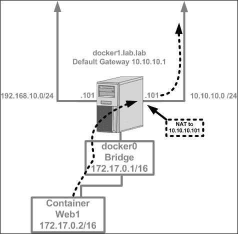
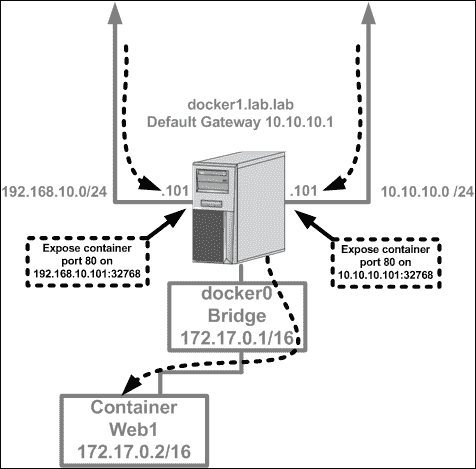
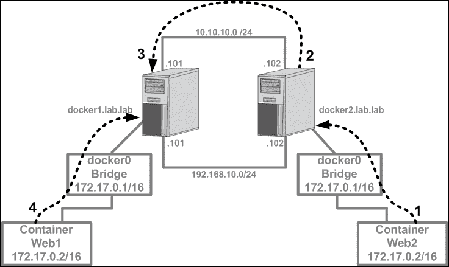
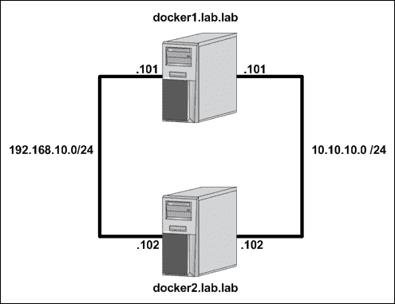

# 第二章：配置和监控 Docker 网络

在本章中，我们将涵盖以下内容：

+   验证影响 Docker 网络的主机级设置

+   在桥接模式下连接容器

+   暴露和发布端口

+   连接容器到现有容器

+   在主机模式下连接容器

+   配置服务级设置

# 介绍

Docker 使得使用容器技术比以往任何时候都更容易。Docker 以其易用性而闻名，提供了许多高级功能，但安装时使用了一组合理的默认设置，使得快速开始构建容器变得容易。虽然网络配置通常是需要在使用之前额外关注的一个领域，但 Docker 使得让容器上线并连接到网络变得容易。

# 验证影响 Docker 网络的主机级设置

Docker 依赖于主机能够执行某些功能来使 Docker 网络工作。换句话说，您的 Linux 主机必须配置为允许 IP 转发。此外，自 Docker 1.7 发布以来，您现在可以选择使用 hairpin Network Address Translation（NAT）而不是默认的 Docker 用户空间代理。在本教程中，我们将回顾主机必须启用 IP 转发的要求。我们还将讨论 NAT hairpin，并讨论该选项的主机级要求。在这两种情况下，我们将展示 Docker 对其设置的默认行为，以及您如何更改它们。

## 准备工作

您需要访问运行 Docker 的 Linux 主机，并能够停止和重新启动服务。由于我们将修改系统级内核参数，您还需要对系统具有根级访问权限。

## 如何做…

正如我们在第一章中所看到的，Linux 主机必须启用 IP 转发才能够在接口之间路由流量。由于 Docker 正是这样做的，因此 Docker 网络需要启用 IP 转发才能正常工作。如果 Docker 检测到 IP 转发被禁用，当您尝试运行容器时，它将警告您存在问题：

```
user@docker1:~$ docker run --name web1 -it \
jonlangemak/web_server_1 /bin/bash
WARNING: **IPv4 forwarding is disabled. Networking will not work.**
root@071d673821b8:/#
```

大多数 Linux 发行版将 IP 转发值默认为`disabled`或`0`。幸运的是，在默认配置中，Docker 会在 Docker 服务启动时负责更新此设置为正确的值。例如，让我们看一个刚刚重启过并且没有在启动时启用 Docker 服务的主机。如果我们在启动 Docker 之前检查设置的值，我们会发现它是禁用的。启动 Docker 引擎会自动为我们启用该设置：

```
user@docker1:~$ more /proc/sys/net/ipv4/ip_forward
**0**
user@docker1:~$
user@docker1:~$ sudo systemctl start docker
user@docker1:~$ sysctl net.ipv4.ip_forward
net.ipv4.ip_forward = **1**
user@docker1:~$
```

Docker 中的这种默认行为可以通过在运行时选项中传递`--ip-forward=false`来更改为否。

### 注意

Docker 特定参数的配置根据使用的**init 系统**而有很大不同。在撰写本文时，许多较新的 Linux 操作系统使用`systemd`作为其 init 系统。始终请查阅 Docker 文档，以了解其针对您使用的操作系统的服务配置建议。Docker 服务配置和选项将在本章的即将推出的食谱中更详细地讨论。在本食谱中，只需关注更改这些设置对 Docker 和主机本身的影响。

有关内核 IP 转发参数的进一步讨论可以在第一章的*配置 Linux 主机路由*食谱中找到，*Linux 网络构造*。在那里，您将找到如何自己更新参数以及如何通过重新启动使设置持久化。

Docker 的另一个最近的功能依赖于内核级参数，即 hairpin NAT 功能。较早版本的 Docker 实现并依赖于所谓的 Docker **用户态代理**来促进容器间和发布端口的通信。默认情况下，任何暴露端口的容器都是通过用户态代理进程来实现的。例如，如果我们启动一个示例容器，我们会发现除了 Docker 进程本身外，我们还有一个`docker-proxy`进程：

```
user@docker1:~$ docker run --name web1 -d -P jonlangemak/web_server_1
bf3cb30e826ce53e6e7db4e72af71f15b2b8f83bd6892e4838ec0a59b17ac33f
user@docker1:~$
user@docker1:~$ ps aux | grep docker
root       771  0.0  0.1 509676 41656 ?        Ssl  19:30   0:00 /usr/bin/docker daemon
root      1861  0.2  0.0 117532 28024 ?        Sl   19:41   0:00 **docker-proxy -proto tcp -host-ip 0.0.0.0 -host-port 32769 -container-ip 172.17.0.2 -container-port 80**
…<Additional output removed for brevity>…
user@docker1:~$
```

每个发布的端口都会在 Docker 主机上启动一个新的`docker-proxy`进程。作为用户态代理的替代方案，您可以选择让 Docker 使用 hairpin NAT 而不是用户态代理。Hairpin NAT 依赖于主机系统配置为在主机的本地环回接口上启用路由。同样，当 Docker 服务启动时，Docker 服务会负责更新正确的主机参数以启用此功能，如果被告知这样做的话。

Hairpin NAT 依赖于内核参数`net.ipv4.conf.docker0.route_localnet`被启用（设置为`1`），以便主机可以通过主机的环回接口访问容器服务。这可以通过与我们描述 IP 转发参数的方式实现：

使用`sysctl`命令：

```
sysctl net.ipv4.conf.docker0.route_localnet 
```

通过直接查询`/proc/`文件系统：

```
more /proc/sys/net/ipv4/conf/docker0/route_localnet
```

如果返回的值是`0`，那么 Docker 很可能处于其默认配置，并依赖于用户态代理。由于您可以选择在两种模式下运行 Docker，我们需要做的不仅仅是更改内核参数，以便对 hairpin NAT 进行更改。我们还需要告诉 Docker 通过将选项`--userland-proxy=false`作为运行时选项传递给 Docker 服务来更改其发布端口的方式。这样做将启用 hairpin NAT，并告诉 Docker 更新内核参数以使 hairpin NAT 正常工作。让我们启用 hairpin NAT 以验证 Docker 是否正在执行其应该执行的操作。

首先，让我们检查内核参数的值：

```
user@docker1:~$ sysctl net.ipv4.conf.docker0.route_localnet
net.ipv4.conf.docker0.route_localnet = 0
user@docker1:~$
```

它目前被禁用。现在我们可以告诉 Docker 通过将`--userland-proxy=false`作为参数传递给 Docker 服务来禁用用户态代理。一旦 Docker 服务被告知禁用用户态代理，并且服务被重新启动，我们应该看到参数在主机上被启用：

```
user@docker1:~$ sysctl net.ipv4.conf.docker0.route_localnet
net.ipv4.conf.docker0.route_localnet = **1**
user@docker1:~$
```

此时运行具有映射端口的容器将不会创建额外的`docker-proxy`进程实例：

```
user@docker1:~$ docker run --name web1 -d -P jonlangemak/web_server_1
5743fac364fadb3d86f66cb65532691fe926af545639da18f82a94fd35683c54
user@docker1:~$ ps aux | grep docker
root      2159  0.1  0.1 310696 34880 ?        Ssl  14:26   0:00 /usr/bin/docker daemon --userland-proxy=false
user@docker1:~$
```

此外，我们仍然可以通过主机的本地接口访问容器：

```
user@docker1:~$ **curl 127.0.0.1:32768**
<body>
  <html>
    <h1><span style="color:#FF0000;font-size:72px;">**Web Server #1 - Running on port 80**</span>
    </h1>
</body>
  </html>
user@docker1:~$
```

再次禁用参数会导致此连接失败：

```
user@docker1:~$ **sudo sysctl -w net.ipv4.conf.docker0.route_localnet=0**
net.ipv4.conf.docker0.route_localnet = 0
user@docker1:~$ curl 127.0.0.1:32768
**curl: (7) Failed to connect to 127.0.0.1 port 32768: Connection timed out**
user@docker1:~$
```

# 在桥接模式下连接容器

正如我们之前提到的，Docker 带有一组合理的默认值，可以使您的容器在网络上进行通信。从网络的角度来看，Docker 的默认设置是将任何生成的容器连接到`docker0`桥接器上。在本教程中，我们将展示如何在默认桥接模式下连接容器，并解释离开容器和目的地容器的网络流量是如何处理的。

## 做好准备

您需要访问 Docker 主机，并了解您的 Docker 主机如何连接到网络。在我们的示例中，我们将使用一个具有两个物理网络接口的 Docker 主机，就像下图所示的那样：


您需要确保可以查看`iptables`规则以验证**netfilter**策略。如果您希望下载和运行示例容器，您的 Docker 主机还需要访问互联网。在某些情况下，我们所做的更改可能需要您具有系统的根级访问权限。

## 如何做…

安装并启动 Docker 后，您应该注意到添加了一个名为`docker0`的新 Linux 桥。默认情况下，`docker0`桥的 IP 地址为`172.17.0.1/16`：

```
user@docker1:~$ **ip addr show docker0**
5: docker0: <NO-CARRIER,BROADCAST,MULTICAST,UP> mtu 1500 qdisc noqueue state DOWN group default
    link/ether 02:42:54:87:8b:ea brd ff:ff:ff:ff:ff:ff
    inet **172.17.0.1/16** scope global docker0
       valid_lft forever preferred_lft forever
user@docker1:~$
```

Docker 将在未指定网络的情况下启动的任何容器放置在`docker0`桥上。现在，让我们看一个在此主机上运行的示例容器：

```
user@docker1:~$ **docker run -it jonlangemak/web_server_1 /bin/bash**
root@abe6eae2e0b3:/# **ip addr**
1: **lo**: <LOOPBACK,UP,LOWER_UP> mtu 65536 qdisc noqueue state UNKNOWN qlen 1
    link/loopback 00:00:00:00:00:00 brd 00:00:00:00:00:00
    inet **127.0.0.1/8** scope host lo
       valid_lft forever preferred_lft forever
    inet6 ::1/128 scope host
       valid_lft forever preferred_lft forever
6: **eth0**@if7: <BROADCAST,MULTICAST,UP,LOWER_UP> mtu 1500 qdisc noqueue state UP
    link/ether 02:42:ac:11:00:02 brd ff:ff:ff:ff:ff:ff
    inet **172.17.0.2/16** scope global eth0
       valid_lft forever preferred_lft forever
    inet6 fe80::42:acff:fe11:2/64 scope link
       valid_lft forever preferred_lft forever
root@abe6eae2e0b3:/# 
```

通过以交互模式运行容器，我们可以查看容器认为自己的网络配置是什么。在这种情况下，我们可以看到容器有一个非回环网络适配器（`eth0`），IP 地址为`172.17.0.2/16`。

此外，我们可以看到容器认为其默认网关是 Docker 主机上的`docker0`桥接口：

```
root@abe6eae2e0b3:/# **ip route**
**default via 172.17.0.1 dev eth0**
172.17.0.0/16 dev eth0  proto kernel  scope link  src 172.17.0.2
root@abe6eae2e0b3:/#
```

通过运行一些基本测试，我们可以看到容器可以访问 Docker 主机的物理接口以及基于互联网的资源。

### 注意

基于互联网的访问容器本身的前提是 Docker 主机可以访问互联网。

```
root@abe6eae2e0b3:/# **ping 10.10.10.101 -c 2**
PING 10.10.10.101 (10.10.10.101): 48 data bytes
**56 bytes from 10.10.10.101: icmp_seq=0 ttl=64 time=0.084 ms**
**56 bytes from 10.10.10.101: icmp_seq=1 ttl=64 time=0.072 ms**
--- 10.10.10.101 ping statistics ---
2 packets transmitted, 2 packets received, 0% packet loss
round-trip min/avg/max/stddev = 0.072/0.078/0.084/0.000 ms
root@abe6eae2e0b3:/#
root@abe6eae2e0b3:/# **ping 4.2.2.2 -c 2**
PING 4.2.2.2 (4.2.2.2): 48 data bytes
**56 bytes from 4.2.2.2: icmp_seq=0 ttl=50 time=29.388 ms**
**56 bytes from 4.2.2.2: icmp_seq=1 ttl=50 time=26.766 ms**
--- 4.2.2.2 ping statistics ---
2 packets transmitted, 2 packets received, 0% packet loss
round-trip min/avg/max/stddev = 26.766/28.077/29.388/1.311 ms
root@abe6eae2e0b3:/#
```

考虑到容器所在的网络是由 Docker 创建的，我们可以安全地假设网络的其余部分不知道它。也就是说，外部网络不知道`172.17.0.0/16`网络，因为它是本地的 Docker 主机。也就是说，容器能够访问`docker0`桥之外的资源似乎有些奇怪。Docker 通过将容器的 IP 地址隐藏在 Docker 主机的 IP 接口后使其工作。流量流向如下图所示：



由于容器的流量在物理网络上被视为 Docker 主机的 IP 地址，其他网络资源知道如何将流量返回到容器。为了执行这种出站 NAT，Docker 使用 Linux netfilter 框架。我们可以使用 netfilter 命令行工具`iptables`来查看这些规则：

```
user@docker1:~$ sudo iptables -t nat -L
Chain PREROUTING (policy ACCEPT)
target     prot opt source               destination
DOCKER     all  --  anywhere             anywhere             ADDRTYPE match dst-type LOCAL

Chain INPUT (policy ACCEPT)
target     prot opt source               destination

Chain OUTPUT (policy ACCEPT)
target     prot opt source               destination
DOCKER     all  --  anywhere            !127.0.0.0/8          ADDRTYPE match dst-type LOCAL

Chain POSTROUTING (policy ACCEPT)
target     prot opt source               destination
**MASQUERADE  all  --  172.17.0.0/16        anywhere**

Chain DOCKER (2 references)
target     prot opt source               destination
RETURN     all  --  anywhere             anywhere
**user@docker1:~$**

```

正如你所看到的，我们在`POSTROUTING`链中有一个规则，它将来自我们的`docker0`桥（`172.17.0.0/16`）的任何东西伪装或隐藏在主机接口的背后。

尽管出站连接是默认配置和允许的，但 Docker 默认情况下不提供一种从 Docker 主机外部访问容器中的服务的方法。为了做到这一点，我们必须在容器运行时传递额外的标志给 Docker。具体来说，当我们运行容器时，我们可以传递`-P`标志。为了检查这种行为，让我们看一个暴露端口的容器镜像：

```
docker run --name web1 -d -P jonlangemak/web_server_1
```

这告诉 Docker 将一个随机端口映射到容器镜像暴露的任何端口。在这个演示容器的情况下，镜像暴露端口`80`。运行容器后，我们可以看到主机端口映射到容器：

```
user@docker1:~$ docker run --name web1 **-P** -d jonlangemak/web_server_1
556dc8cefd79ed1d9957cc52827bb23b7d80c4b887ee173c2e3b8478340de948
user@docker1:~$
user@docker1:~$ docker port web1
**80/tcp -> 0.0.0.0:32768**
user@docker1:~$
```

正如我们所看到的，容器端口`80`已经映射到主机端口`32768`。这意味着我们可以通过主机的接口在端口`32768`上访问容器上运行的端口`80`的服务。与出站容器访问类似，入站连接也使用 netfilter 来创建端口映射。我们可以通过检查 NAT 和过滤表来看到这一点：

```
user@docker1:~$ sudo iptables -t nat -L
Chain PREROUTING (policy ACCEPT)
target     prot opt source               destination
DOCKER     all  --  anywhere             anywhere             ADDRTYPE match dst-type LOCAL

Chain INPUT (policy ACCEPT)
target     prot opt source               destination

Chain OUTPUT (policy ACCEPT)
target     prot opt source               destination
DOCKER     all  --  anywhere            !127.0.0.0/8          ADDRTYPE match dst-type LOCAL

Chain POSTROUTING (policy ACCEPT)
target     prot opt source          destination
MASQUERADE  all  --  172.17.0.0/16  anywhere
**MASQUERADE  tcp  --  172.17.0.2     172.17.0.2           tcp dpt:http**

Chain DOCKER (2 references)
target     prot opt source               destination
RETURN     all  --  anywhere             anywhere
**DNAT       tcp  --  anywhere             anywhere             tcp dpt:32768 to:172.17.0.2:80**
user@docker1:~$ sudo iptables -t filter -L
Chain INPUT (policy ACCEPT)
target     prot opt source               destination

Chain FORWARD (policy ACCEPT)
target     prot opt source               destination
DOCKER-ISOLATION  all  --  anywhere             anywhere
DOCKER     all  --  anywhere             anywhere
ACCEPT     all  --  anywhere             anywhere             ctstate RELATED,ESTABLISHED
ACCEPT     all  --  anywhere             anywhere
ACCEPT     all  --  anywhere             anywhere

Chain OUTPUT (policy ACCEPT)
target     prot opt source               destination

Chain DOCKER (1 references)
target     prot opt source               destination
**ACCEPT     tcp  --  anywhere             172.17.0.2           tcp dpt:http**

Chain DOCKER-ISOLATION (1 references)
target     prot opt source               destination
RETURN     all  --  anywhere             anywhere
user@docker1:~$
```

由于连接在所有接口（`0.0.0.0`）上暴露，我们的入站图将如下所示：



如果没有另行定义，生活在同一主机上的容器，因此是相同的`docker0`桥，可以通过它们分配的 IP 地址在任何端口上固有地相互通信，这些端口绑定到服务。允许这种通信是默认行为，并且可以在后面的章节中更改，当我们讨论**容器间通信**（**ICC**）配置时会看到。

### 注意

应该注意的是，这是在没有指定任何额外网络参数的情况下运行的容器的默认行为，也就是说，使用 Docker 默认桥接网络的容器。后面的章节将介绍其他选项，允许您将生活在同一主机上的容器放置在不同的网络上。

生活在不同主机上的容器之间的通信需要使用先前讨论的流程的组合。为了测试这一点，让我们通过添加一个名为`docker2`的第二个主机来扩展我们的实验。假设主机`docker2`上的容器`web2`希望访问主机`docker1`上的容器`web1`，后者在端口`80`上托管服务。流程将如下所示：



让我们在每个步骤中走一遍流程，并展示数据包在每个步骤中传输时的样子。在这种情况下，容器`web1`正在暴露端口`80`，该端口已发布到主机`docker1`的端口`32771`。

1.  流量离开容器`web2`，目的地是主机`docker1`的`10.10.10.101`接口上的暴露端口（`32771`）：

1.  流量到达容器的默认网关，即`docker0`桥接的 IP 接口（`172.17.0.1`）。主机进行路由查找，并确定目的地位于其`10.10.10.102`接口之外，因此它将容器的真实源 IP 隐藏在该接口的 IP 地址后面：

1.  流量到达`docker1`主机，并由 netfilter 规则检查。`docker1`有一个规则，将容器 1 的服务端口（`80`）暴露在主机的端口`32271`上：

1.  目标端口从`32771`更改为`80`，并传递到`web1`容器，该容器在正确的端口`80`上接收流量：

为了自己尝试一下，让我们首先运行`web1`容器并检查服务暴露在哪个端口上：

```
user@docker1:~/apache$ docker run --name web1 -P \
-d jonlangemak/web_server_1
974e6eba1948ce5e4c9ada393b1196482d81f510de 12337868ad8ef65b8bf723
user@docker1:~/apache$
user@docker1:~/apache$ docker port web1
80/tcp -> **0.0.0.0:32771**
user@docker1:~/apache$
```

现在让我们在主机 docker2 上运行一个名为 web2 的第二个容器，并尝试访问端口 32771 上的 web1 服务…

```
user@docker2:~$ docker run --name web2 -it \
jonlangemak/web_server_2 /bin/bash
root@a97fea6fb0c9:/#
root@a97fea6fb0c9:/# curl http://**10.10.10.101:32771**
<body>
  <html>
    <h1><span style="color:#FF0000;font-size:72px;">**Web Server #1 - Running on port 80**</span>
    </h1>
</body>
  </html>
```

# 暴露和发布端口

正如我们在之前的例子中看到的，将容器中的服务暴露给外部世界是 Docker 的一个关键组成部分。到目前为止，我们已经让镜像和 Docker 引擎在实际端口映射方面为我们做了大部分工作。为了做到这一点，Docker 使用了容器镜像的元数据以及用于跟踪端口分配的内置系统的组合。在这个示例中，我们将介绍定义要暴露的端口以及发布端口的选项的过程。

## 准备工作

您需要访问一个 Docker 主机，并了解您的 Docker 主机如何连接到网络。在这个示例中，我们将使用之前示例中使用的`docker1`主机。您需要确保可以查看`iptables`规则以验证 netfilter 策略。如果您希望下载和运行示例容器，您的 Docker 主机还需要访问互联网。在某些情况下，我们所做的更改可能需要您具有系统的 root 级别访问权限。

## 操作步骤…

虽然经常混淆，但暴露端口和发布端口是两个完全不同的操作。暴露端口实际上只是一种记录容器可能提供服务的端口的方式。这些定义存储在容器元数据中作为镜像的一部分，并可以被 Docker 引擎读取。发布端口是将容器端口映射到主机端口的实际过程。这可以通过使用暴露的端口定义自动完成，也可以在不使用暴露端口的情况下手动完成。

让我们首先讨论端口是如何暴露的。暴露端口的最常见机制是在镜像的**Dockerfile**中定义它们。当您构建一个容器镜像时，您有机会定义要暴露的端口。考虑一下我用来构建本书一些演示容器的 Dockerfile 定义：

```
FROM ubuntu:12.04
MAINTAINER Jon Langemak jon@interubernet.com
RUN apt-get update && apt-get install -y apache2 net-tools inetutils-ping curl
ADD index.html /var/www/index.html
ENV APACHE_RUN_USER www-data
ENV APACHE_RUN_GROUP www-data
ENV APACHE_LOG_DIR /var/log/apache2
**EXPOSE 80**
CMD ["/usr/sbin/apache2", "-D", "FOREGROUND"]
```

作为 Dockerfile 的一部分，我可以定义我希望暴露的端口。在这种情况下，我知道 Apache 默认会在端口`80`上提供其 Web 服务器，所以这是我希望暴露的端口。

### 注意

请注意，默认情况下，Docker 始终假定您所指的端口是 TCP。如果您希望暴露 UDP 端口，可以在端口定义的末尾包括`/udp`标志来实现。例如，`EXPOSE 80/udp`。

现在，让我们运行一个使用这个 Dockerfile 构建的容器，看看会发生什么：

```
user@docker1:~$ docker run --name web1 -d jonlangemak/web_server_1
b0177ed2d38afe4f4d8c26531d00407efc0fee6517ba5a0f49955910a5dbd426
user@docker1:~$
user@docker1:~$ docker port web1
user@docker1:~$
```

正如我们所看到的，尽管有一个定义的要暴露的端口，Docker 实际上并没有在主机和容器之间映射任何端口。如果您回忆一下之前的示例，其中容器提供了一个服务，我们在`docker run`命令语法中包含了`-P`标志。`-P`标志告诉 Docker 发布所有暴露的端口。让我们尝试使用设置了`-P`标志的容器运行此容器：

```
user@docker1:~$ docker run --name web1 -d -P jonlangemak/web_server_1
d87d36d7cbcfb5040f78ff730d079d353ee81fde36ecbb5ff932ff9b9bef5502
user@docker1:~$
user@docker1:~$ docker port web1
**80/tcp -> 0.0.0.0:32775**
user@docker1:~$
```

在这里，我们可以看到 Docker 现在已经自动将暴露的端口映射到主机上的一个随机高端口。端口`80`现在将被视为已发布。

除了通过镜像 Dockerfile 暴露端口，我们还可以在容器运行时暴露它们。以这种方式暴露的任何端口都将与 Dockerfile 中暴露的端口合并。例如，让我们再次运行相同的容器，并在`docker run`命令中暴露端口`80` UDP：

```
user@docker1:~$ docker run --name web1 **--expose=80/udp \**
-d -P jonlangemak/web_server_1
f756deafed26f9635a3b9c738089495efeae86a393f94f17b2c4fece9f71a704
user@docker1:~$
user@docker1:~$ docker port web1
**80/udp -> 0.0.0.0:32768**
**80/tcp -> 0.0.0.0:32776**
user@docker1:~$
```

如您所见，我们不仅发布了来自 Dockerfile 的端口（`80/tcp`），还发布了来自`docker run`命令的端口（`80/udp`）。

### 注意

在容器运行时暴露端口允许您有一些额外的灵活性，因为您可以定义要暴露的端口范围。这在 Dockerfile 的`expose`语法中目前是不可能的。当暴露一系列端口时，您可以通过在命令的末尾添加您要查找的容器端口来过滤`docker port`命令的输出。

虽然暴露方法确实很方便，但它并不能满足我们所有的需求。对于您想要更多控制使用的端口和接口的情况，您可以在启动容器时绕过`expose`并直接发布端口。通过传递`-P`标志发布所有暴露的端口，通过传递`-p`标志允许您指定映射端口时要使用的特定端口和接口。`-p`标志可以采用几种不同的形式，语法看起来像这样：

```
–p <host IP interface>:<host port>:<container port>
```

任何选项都可以省略，唯一需要的字段是容器端口。例如，以下是您可以使用此语法的几种不同方式：

+   指定主机端口和容器端口：

```
–p <host port>:<container port>
```

+   指定主机接口、主机端口和容器端口：

```
–p <host IP interface>:<host port>:<container port>
```

+   指定主机接口，让 Docker 选择一个随机的主机端口，并指定容器端口：

```
–p <host IP interface>::<container port>
```

+   只指定一个容器端口，让 Docker 使用一个随机的主机端口：

```
–p <container port>
```

到目前为止，我们看到的所有发布的端口都使用了目标 IP 地址（`0.0.0.0`），这意味着它们绑定到 Docker 主机的所有 IP 接口。默认情况下，Docker 服务始终将发布的端口绑定到所有主机接口。然而，正如我们将在本章的下一个示例中看到的那样，我们可以告诉 Docker 通过传递`--ip`参数来使用特定的接口。

鉴于我们还可以在`docker run`命令中定义要绑定的发布端口的接口，我们需要知道哪个选项优先级更高。一般规则是，在容器运行时定义的任何选项都会获胜。例如，让我们看一个例子，我们告诉 Docker 服务通过向服务传递以下选项来绑定到`docker1`主机的`192.168.10.101` IP 地址：

```
--ip=10.10.10.101
```

现在，让我们以几种不同的方式运行一个容器，并查看结果：

```
user@docker1:~$ docker run --name web1 -P -d jonlangemak/web_server_1
629129ccaebaa15720399c1ac31c1f2631fb4caedc7b3b114a92c5a8f797221d
user@docker1:~$ docker port web1
**80/tcp -> 10.10.10.101:32768**
user@docker1:~$
```

在前面的例子中，我们看到了预期的行为。发布的端口绑定到服务级别`--ip`选项（`10.10.10.101`）中指定的 IP 地址。然而，如果我们在容器运行时指定 IP 地址，我们可以覆盖服务级别的设置：

```
user@docker1:~$ docker run --name web2 **-p 0.0.0.0::80 \**
-d jonlangemak/web_server_2
7feb252d7bd9541fe7110b2aabcd6a50522531f8d6ac5422f1486205fad1f666
user@docker1:~$ docker port web2
**80/tcp -> 0.0.0.0:32769**
user@docker1:~$
We can see that we specified a host IP address of 0.0.0.0, which will match all the IP addresses on the Docker host. When we check the port mapping, we see that the 0.0.0.0 specified in the command overrode the service-level default.
```

您可能不会发现暴露端口的用途，而是完全依赖手动发布它们。`EXPOSE`命令不是创建镜像的 Dockerfile 的要求。不定义暴露端口的容器镜像可以直接发布，如以下命令所示：

```
user@docker1:~$ docker run --name noexpose **-p 0.0.0.0:80:80 \**
-d jonlangemak/web_server_noexpose
2bf21219b45ba05ef7169fc30d5eac73674857573e54fd1a0499b73557fdfd45
user@docker1:~$ docker port noexpose
**80/tcp -> 0.0.0.0:80**
user@docker1:~$
```

在上面的示例中，容器镜像`jonlangemak/web_server_noexpose`是一个不在其定义中暴露任何端口的容器。

# 连接容器到现有容器

到目前为止，Docker 网络连接依赖于将托管在容器中的单个服务暴露给物理网络。但是，如果您想将一个容器中的服务暴露给另一个容器而不暴露给 Docker 主机怎么办？在本教程中，我们将介绍如何在同一 Docker 主机上运行的两个容器之间映射服务。

## 准备工作

您将需要访问 Docker 主机，并了解您的 Docker 主机如何连接到网络。在本教程中，我们将使用之前教程中使用过的`docker1`主机。您需要确保可以访问`iptables`规则以验证 netfilter 策略。如果您希望下载和运行示例容器，您的 Docker 主机还需要访问互联网。在某些情况下，我们所做的更改可能需要您具有系统的根级访问权限。

## 操作步骤...

有时将一个容器中的服务映射到另一个容器中被称为映射容器模式。映射容器模式允许您启动一个利用现有或主要容器网络配置的容器。也就是说，映射容器将使用与主容器相同的 IP 和端口配置。举个例子，让我们考虑运行以下容器：

```
user@docker1:~$ docker run --name web4 -d -P \
jonlangemak/web_server_4_redirect
```

运行此容器将以桥接模式启动容器，并将其附加到`docker0`桥接，正如我们所期望的那样。

此时，拓扑看起来非常标准，类似于以下拓扑所示：


现在在同一主机上运行第二个容器，但这次指定网络应该是主容器`web4`的网络：

```
user@docker1:~$ docker run --name web3 -d **--net=container:web4 \**
jonlangemak/web_server_3_8080
```

我们的拓扑现在如下所示：


请注意，容器`web3`现在被描述为直接连接到`web4`，而不是`docker0`桥接。通过查看每个容器的网络配置，我们可以验证这是否属实：

```
user@docker1:~$ **docker exec web4 ip addr show**
1: lo: <LOOPBACK,UP,LOWER_UP> mtu 65536 qdisc noqueue state UNKNOWN qlen 1
    link/loopback 00:00:00:00:00:00 brd 00:00:00:00:00:00
    inet 127.0.0.1/8 scope host lo
       valid_lft forever preferred_lft forever
    inet6 ::1/128 scope host
       valid_lft forever preferred_lft forever
16: **eth0**@if17: <BROADCAST,MULTICAST,UP,LOWER_UP> mtu 1500 qdisc noqueue state UP
    **link/ether 02:42:ac:11:00:02** brd ff:ff:ff:ff:ff:ff
    **inet 172.17.0.2/16** scope global eth0
       valid_lft forever preferred_lft forever
    inet6 fe80::42:acff:fe11:2/64 scope link
       valid_lft forever preferred_lft forever
user@docker1:~$
user@docker1:~$ **docker exec web3 ip addr show**
1: lo: <LOOPBACK,UP,LOWER_UP> mtu 65536 qdisc noqueue state UNKNOWN qlen 1
    link/loopback 00:00:00:00:00:00 brd 00:00:00:00:00:00
    inet 127.0.0.1/8 scope host lo
       valid_lft forever preferred_lft forever
    inet6 ::1/128 scope host
       valid_lft forever preferred_lft forever
16: **eth0**@if17: <BROADCAST,MULTICAST,UP,LOWER_UP> mtu 1500 qdisc noqueue state UP
    **link/ether 02:42:ac:11:00:02** brd ff:ff:ff:ff:ff:ff
    **inet 172.17.0.2/16** scope global eth0
       valid_lft forever preferred_lft forever
    inet6 fe80::42:acff:fe11:2/64 scope link
       valid_lft forever preferred_lft forever
user@docker1:~$
```

正如我们所看到的，接口在 IP 配置和 MAC 地址方面都是相同的。在`docker run`命令中使用`--net:container<container name/ID>`的语法将新容器加入到与所引用容器相同的网络结构中。这意味着映射的容器具有与主容器相同的网络配置。

这种配置有一个值得注意的限制。加入另一个容器网络的容器无法发布自己的任何端口。因此，这意味着我们无法将映射容器的端口发布到主机，但我们可以在本地使用它们。回到我们的例子，这意味着我们无法将容器`web3`的端口`8080`发布到主机。但是，容器`web4`可以在本地使用容器`web3`的未发布服务。例如，这个例子中的每个容器都托管一个 Web 服务：

+   `web3`托管在端口`8080`上运行的 Web 服务器

+   `web4`托管在端口`80`上运行的 Web 服务器

从外部主机的角度来看，无法访问容器`web3`的 Web 服务。但是，我们可以通过容器`web4`访问这些服务。容器`web4`托管一个名为`test.php`的 PHP 脚本，该脚本提取其自己的 Web 服务器以及在端口`8080`上运行的 Web 服务器的索引页面。脚本如下：

```
<?
$page = file_get_contents('**http://localhost:80/**');
echo $page;
$page1 = file_get_contents('**http://localhost:8080/**');
echo $page1;
?>
```

脚本位于 Web 服务器的根托管目录（`/var/www/`）中，因此我们可以通过浏览`web4`容器的发布端口，然后跟上`test.php`来访问端口：

```
user@docker1:~$ docker port web4
80/tcp -> 0.0.0.0:32768
user@docker1:~$
user@docker1:~$ curl **http://localhost:32768/test.php**
<body>
  <html>
    <h1><span style="color:#FF0000;font-size:72px;">**Web Server #4 - Running on port 80**</span>
    </h1>
</body>
  </html>
<body>
  <html>
    <h1><span style="color:#FF0000;font-size:72px;">**Web Server #3 - Running on port 8080**</span>
    </h1>
</body>
  </html>
user@docker1:~$
```

如您所见，脚本能够从两个容器中提取索引页面。让我们停止容器`web3`，然后再次运行此测试，以证明它确实是提供此索引页面响应的容器：

```
user@docker1:~$ docker stop web3
web3
user@docker1:~$ curl **http://localhost:32768/test.php**
<body>
  <html>
    <h1><span style="color:#FF0000;font-size:72px;">**Web Server #4 - Running on port 80**</span>
    </h1>
</body>
  </html>
user@docker1:~$
```

如您所见，我们不再从映射的容器中获得响应。映射容器模式对于需要向现有容器提供服务但不需要直接将映射容器的任何端口发布到 Docker 主机或外部网络的情况非常有用。尽管映射容器无法发布自己的任何端口，但这并不意味着我们不能提前发布它们。

例如，当我们运行主容器时，我们可以暴露端口`8080`：

```
user@docker1:~$ docker run --name web4 -d **--expose 8080 \**
**-P** jonlangemak/web_server_4_redirect
user@docker1:~$ docker run --name web3 -d **--net=container:web4 \**
jonlangemak/web_server_3_8080
```

因为我们在运行主容器（`web4`）时发布了映射容器的端口，所以在运行映射容器（`web3`）时就不需要再次发布它。现在我们应该能够通过其发布的端口直接访问每个服务：

```
user@docker1:~$ docker port web4
**80/tcp -> 0.0.0.0:32771**
**8080/tcp -> 0.0.0.0:32770**
user@docker1:~$
user@docker1:~$ curl **localhost:32771**
<body>
  <html>
    <h1><span style="color:#FF0000;font-size:72px;">**Web Server #4 - Running on port 80**</span>
    </h1>
</body>
  </html>
user@docker1:~$ curl **localhost:32770**
<body>
  <html>
    <h1><span style="color:#FF0000;font-size:72px;">**Web Server #3 - Running on port 8080**</span>
    </h1>
</body>
  </html>
user@docker1:~$
```

在映射容器模式下，应注意不要尝试在不同的容器上公开或发布相同的端口。由于映射容器与主容器共享相同的网络结构，这将导致端口冲突。

# 在主机模式下连接容器

到目前为止，我们所做的所有配置都依赖于使用`docker0`桥来促进容器之间的连接。我们不得不考虑端口映射、NAT 和容器连接点。由于我们连接和寻址容器的方式的性质以及确保灵活的部署模型，必须考虑这些因素。主机模式采用了一种不同的方法，直接将容器绑定到 Docker 主机的接口上。这不仅消除了入站和出站 NAT 的需要，还限制了我们可以部署容器的方式。由于容器将位于与物理主机相同的网络结构中，我们不能重叠服务端口，因为这将导致冲突。在本教程中，我们将介绍在主机模式下部署容器，并描述这种方法的优缺点。

## 准备工作

您需要访问一个 Docker 主机，并了解您的 Docker 主机如何连接到网络。在本教程中，我们将使用之前教程中使用过的`docker1`和`docker2`主机。您需要确保可以查看`iptables`规则以验证 netfilter 策略。如果您希望下载和运行示例容器，您的 Docker 主机还需要访问互联网。在某些情况下，我们所做的更改可能需要您具有系统的根级访问权限。

## 如何做…

从 Docker 的角度来看，在这种模式下部署容器相当容易。就像映射容器模式一样，我们将一个容器放入另一个容器的网络结构中；主机模式直接将一个容器放入 Docker 主机的网络结构中。不再需要发布和暴露端口，因为你将容器直接映射到主机的网络接口上。这意味着容器进程可以执行某些特权操作，比如在主机上打开较低级别的端口。因此，这个选项应该谨慎使用，因为在这种配置下容器将对系统有更多的访问权限。

这也意味着 Docker 不知道你的容器在使用什么端口，并且无法阻止你部署具有重叠端口的容器。让我们在主机模式下部署一个测试容器，这样你就能明白我的意思了：

```
user@docker1:~$ docker run --name web1 -d **--net=host \**
jonlangemak/web_server_1
64dc47af71fade3cde02f7fed8edf7477e3cc4c8fc7f0f3df53afd129331e736
user@docker1:~$
user@docker1:~$ curl **localhost**
<body>
  <html>
    <h1><span style="color:#FF0000;font-size:72px;">**Web Server #1 - Running on port 80**</span>
    </h1>
</body>
  </html>
user@docker1:~$
```

为了使用主机模式，我们在容器运行时传递`--net=host`标志。在这种情况下，你可以看到没有任何端口映射，我们仍然可以访问容器中的服务。Docker 只是将容器绑定到 Docker 主机，这意味着容器提供的任何服务都会自动映射到 Docker 主机的接口上。

如果我们尝试在端口`80`上运行另一个提供服务的容器，我们会发现 Docker 并不会阻止我们：

```
user@docker1:~$ docker run --name web2 -d **--net=host \**
**jonlangemak/web_server_2**
c1c00aa387111e1bb09e3daacc2a2820c92f6a91ce73694c1e88691c3955d815
user@docker1:~$
```

虽然从 Docker 的角度来看，这看起来像是一个成功的容器启动，但实际上容器在被生成后立即死掉了。如果我们检查容器`web2`的日志，我们会发现它遇到了冲突，无法启动：

```
user@docker1:~$ docker logs **web2**
apache2: Could not reliably determine the server's fully qualified domain name, using 127.0.1.1 for ServerName
(98)**Address already in use: make_sock: could not bind to address 0.0.0.0:80**
**no listening sockets available, shutting down**
Unable to open logs
user@docker1:~$
```

在主机模式下部署容器会限制你可以运行的服务数量，除非你的容器被构建为在不同端口上提供相同的服务。

由于服务的配置和它所使用的端口是容器的责任，我们可以通过一种方式部署多个使用相同服务端口的容器。举个例子，我们之前提到的两个 Docker 主机，每个主机有两个网络接口：


在一个场景中，你的 Docker 主机有多个网络接口，你可以让容器绑定到不同接口上的相同端口。同样，由于这是容器的责任，只要你不尝试将相同的端口绑定到多个接口上，Docker 就不会知道你是如何实现这一点的。

解决方案是更改服务绑定到接口的方式。大多数服务在启动时绑定到所有接口（`0.0.0.0`）。例如，我们可以看到我们的容器`web1`绑定到 Docker 主机上的`0.0.0.0:80`：

```
user@docker1:~$ sudo netstat -plnt
Active Internet connections (only servers)
Proto Recv-Q Send-Q Local Address           Foreign Address         State       PID/Program name
**tcp        0      0 0.0.0.0:80              0.0.0.0:*               LISTEN      3724/apache2**
tcp        0      0 0.0.0.0:22              0.0.0.0:*               LISTEN      1056/sshd
tcp6       0      0 :::22                   :::*                    LISTEN      1056/sshd
user@docker1:~$ 
```

我们可以限制服务的范围，而不是让服务绑定到所有接口。如果我们可以将容器服务绑定到一个接口，我们就可以将相同的端口绑定到不同的接口而不会引起冲突。在这个例子中，我创建了两个容器镜像，允许您向它们传递一个环境变量（`$APACHE_IPADDRESS`）。该变量在 Apache 配置中被引用，并指定服务应该绑定到哪个接口。我们可以通过在主机模式下部署两个容器来测试这一点：

```
user@docker1:~$ docker run --name web6 -d --net=host \
**-e APACHE_IPADDRESS=10.10.10.101** jonlangemak/web_server_6_pickip
user@docker1:~$ docker run --name web7 -d --net=host \
**-e APACHE_IPADDRESS=192.168.10.101** jonlangemak/web_server_7_pickip
```

请注意，在每种情况下，我都会向容器传递一个不同的 IP 地址，以便它绑定到。快速查看主机上的端口绑定应该可以确认容器不再绑定到所有接口：

```
user@docker1:~$ sudo netstat -plnt
[sudo] password for user:
Active Internet connections (only servers)
Proto Recv-Q Send-Q Local Address           Foreign Address         State       PID/Program name
**tcp        0      0 192.168.10.101:80       0.0.0.0:*               LISTEN      1518/apache2**
**tcp        0      0 10.10.10.101:80         0.0.0.0:*               LISTEN      1482/apache2**
tcp        0      0 0.0.0.0:22              0.0.0.0:*               LISTEN      1096/sshd
tcp6       0      0 :::22                   :::*                    LISTEN      1096/sshd
user@docker1:~$
```

请注意，Apache 不再绑定到所有接口，我们有两个 Apache 进程，一个绑定到 Docker 主机的每个接口。来自另一个 Docker 主机的测试将证明每个容器在其各自的接口上提供 Apache：

```
user@docker2:~$ curl **http://10.10.10.101**
<body>
  <html>
    <h1><span style="color:#FF0000;font-size:72px;">**Web Server #6 - Running on port 80**</span>
    </h1>
</body>
  </html>
user@docker2:~$
user@docker2:~$ curl **http://192.168.10.101**
<body>
  <html>
    <h1><span style="color:#FF0000;font-size:72px;">**Web Server #7 - Running on port 80**</span>
    </h1>
</body>
  </html>
user@docker2:~$
```

虽然主机模式有一些限制，但它也更简单，可能因为缺乏 NAT 和使用`docker0`桥而提供更高的性能。

### 注意

请记住，由于 Docker 不涉及主机模式，如果您有一个基于主机的防火墙来执行策略，您可能需要手动打开防火墙端口，以便容器可以被访问。

# 配置服务级设置

虽然许多设置可以在容器运行时配置，但有一些设置必须作为启动 Docker 服务的一部分进行配置。也就是说，它们需要在服务配置中定义为 Docker 选项。在之前的示例中，我们接触到了一些这些服务级选项，比如`--ip-forward`、`--userland-proxy`和`--ip`。在这个示例中，我们将介绍如何将服务级参数传递给 Docker 服务，以及讨论一些关键参数的功能。

## 准备工作

您需要访问 Docker 主机，并了解您的 Docker 主机如何连接到网络。在本教程中，我们将使用之前教程中使用的`docker1`和`docker2`主机。您需要确保可以访问`iptables`规则以验证 netfilter 策略。如果您希望下载和运行示例容器，您的 Docker 主机还需要访问互联网。

## 操作步骤…

为了传递运行时选项或参数给 Docker，我们需要修改服务配置。在我们的情况下，我们使用的是 Ubuntu 16.04 版本，它使用`systemd`来管理在 Linux 主机上运行的服务。向 Docker 传递参数的推荐方法是使用`systemd`的附加文件。要创建附加文件，我们可以按照以下步骤创建一个服务目录和一个 Docker 配置文件：

```
sudo mkdir /etc/systemd/system/docker.service.d
sudo vi /etc/systemd/system/docker.service.d/docker.conf
```

将以下行插入`docker.conf`配置文件中：

```
[Service] 
ExecStart= 
ExecStart=/usr/bin/dockerd
```

如果您希望向 Docker 服务传递任何参数，可以通过将它们附加到第三行来实现。例如，如果我想在服务启动时禁用 Docker 自动启用主机上的 IP 转发，我的文件将如下所示：

```
[Service] 
ExecStart= 
ExecStart=/usr/bin/dockerd --ip-forward=false
```

在对系统相关文件进行更改后，您需要要求`systemd`重新加载配置。使用以下命令完成：

```
sudo systemctl daemon-reload
```

最后，您可以重新启动服务以使设置生效：

```
systemctl restart docker
```

每次更改配置后，您需要重新加载`systemd`配置以及重新启动服务。

### docker0 桥接地址

正如我们之前所看到的，`docker0`桥的 IP 地址默认为`172.17.0.1/16`。但是，如果您希望，可以使用`--bip`配置标志更改此 IP 地址。例如，您可能希望将`docker0`桥的子网更改为`192.168.127.1/24`。这可以通过将以下选项传递给 Docker 服务来完成：

```
ExecStart=/usr/bin/dockerd **--bip=192.168.127.1/24**

```

更改此设置时，请确保配置 IP 地址（`192.168.127.1/24`）而不是您希望定义的子网（`192.168.127.0/24`）。以前的 Docker 版本需要重新启动主机或手动删除现有的桥接才能分配新的桥接 IP。在较新的版本中，您只需重新加载`systemd`配置并重新启动服务，新的桥接 IP 就会被分配：

```
user@docker1:~$ **sudo systemctl daemon-reload**
user@docker1:~$ **sudo systemctl restart docker**
user@docker1:~$
user@docker1:~$ **ip addr show docker0**
5: docker0: <NO-CARRIER,BROADCAST,MULTICAST,UP> mtu 1500 qdisc noqueue state DOWN group default
    link/ether 02:42:a6:d1:b3:37 brd ff:ff:ff:ff:ff:ff
    inet **192.168.127.1/24** scope global docker0
       valid_lft forever preferred_lft forever
user@docker1:~$
```

除了更改`docker0`桥的 IP 地址，您还可以定义 Docker 可以分配给容器的 IP 地址。这是通过使用`--fixed-cidr`配置标志来完成的。例如，假设以下配置：

```
ExecStart=/usr/bin/dockerd --bip=192.168.127.1/24
**--fixed-cidr=192.168.127.128/25**

```

在这种情况下，`docker0`桥接口本身位于`192.168.127.0/24`子网中，但我们告诉 Docker 只从子网`192.168.127.128/25`中分配容器 IP 地址。如果我们添加这个配置，再次重新加载`systemd`并重新启动服务，我们可以看到 Docker 将为第一个容器分配 IP 地址`192.168.127.128`：

```
user@docker1:~$ docker run --name web1 -it \
jonlangemak/web_server_1 /bin/bash
root@ff8872212cb4:/# **ip addr show eth0**
6: eth0@if7: <BROADCAST,MULTICAST,UP,LOWER_UP> mtu 1500 qdisc noqueue state UP
    link/ether 02:42:c0:a8:7f:80 brd ff:ff:ff:ff:ff:ff
    **inet 192.168.127.128/24** scope global eth0
       valid_lft forever preferred_lft forever
    inet6 fe80::42:c0ff:fea8:7f80/64 scope link
       valid_lft forever preferred_lft forever
root@ff8872212cb4:/#
```

由于容器使用定义的`docker0`桥接 IP 地址作为它们的默认网关，固定的 CIDR 范围必须是`docker0`桥本身上定义的子网的较小子网。

### 发布端口的 Docker 接口绑定

在某些情况下，您可能有一个 Docker 主机，它有多个位于不同网络段的网络接口。例如，考虑这样一个例子，您有两个主机，它们都有两个网络接口：



考虑这样一种情况，我们在主机`docker1`上启动一个提供 Web 服务的容器，使用以下语法：

```
docker run -d --name web1 -P jonlangemak/web_server_1
```

如您所见，我们传递了`-P`标志，告诉 Docker 将图像中存在的任何暴露端口发布到 Docker 主机上的随机端口。如果我们检查端口映射，我们注意到虽然有动态端口分配，但没有主机 IP 地址分配：

```
user@docker1:~$ docker run -d --name web1 -P jonlangemak/web_server_1
d96b4dd005edb2218257a7701b674f51f4318b92baf4be686400d77912c75e58
user@docker1:~$ docker port web1
80/tcp -> **0.0.0.0:32768**
user@docker1:~$
```

Docker 不是指定特定的 IP 地址，而是用`0.0.0.0`指定所有接口。这意味着容器中的服务可以在 Docker 主机的任何 IP 接口上的端口`32768`上访问。我们可以通过从`docker2`主机进行测试来证明这一点：

```
user@docker2:~$ curl http://**10.10.10.101:32768**
<body>
  <html>
    <h1><span style="color:#FF0000;font-size:72px;">**Web Server #1 - Running on port 80**</span>
    </h1>
</body>
  </html>
user@docker2:~$ curl http://**192.168.10.101:32768**
<body>
  <html>
    <h1><span style="color:#FF0000;font-size:72px;">**Web Server #1 - Running on port 80**</span>
    </h1>
</body>
  </html>
user@docker2:~$
```

如果我们希望限制 Docker 默认发布端口的接口，我们可以将`--ip`选项传递给 Docker 服务。继续上面的例子，我的选项现在可能是这样的：

```
ExecStart=/usr/bin/dockerd --bip=192.168.127.1/24
--fixed-cidr=192.168.127.128/25 **--ip=192.168.10.101**

```

将这些选项传递给 Docker 服务，并重新运行我们的容器，将导致端口只映射到定义的 IP 地址：

```
user@docker1:~$ docker port web1
80/tcp -> **192.168.10.101:32768**
user@docker1:~$
```

如果我们从`docker2`主机再次运行我们的测试，我们应该看到服务只暴露在`192.168.10.101`接口上，而不是`10.10.10.101`接口上：

```
user@docker2:~$ curl http://**10.10.10.101:32768**
curl: (7) Failed to connect to 10.10.10.101 port 32768: **Connection refused**
user@docker2:~$
user@docker2:~$ curl http://**192.168.10.101:32768**
<body>
  <html>
    <h1><span style="color:#FF0000;font-size:72px;">**Web Server #1 - Running on port 80**</span>
    </h1>
</body>
  </html>
user@docker2:~$
```

请记住，此设置仅适用于已发布的端口。 这不会影响容器可能用于出站连接的接口。 这由主机的路由表决定。

### 容器接口 MTU

在某些情况下，可能需要更改容器的网络接口的 MTU。 这可以通过向 Docker 服务传递`--mtu`选项来完成。 例如，我们可能希望将容器的接口 MTU 降低到`1450`以适应某种封装。 要做到这一点，您可以传递以下标志：

```
ExecStart=/usr/bin/dockerd  **--mtu=1450**

```

添加此选项后，您可能会检查`docker0`桥 MTU 并发现它保持不变，如下面的代码所示：

```
user@docker1:~$ **ip addr show docker0**
5: docker0: <NO-CARRIER,BROADCAST,MULTICAST,UP> **mtu 1500** qdisc noqueue state DOWN group default
    link/ether 02:42:a6:d1:b3:37 brd ff:ff:ff:ff:ff:ff
    inet 192.168.127.1/24 scope global docker0
       valid_lft forever preferred_lft forever
    inet6 fe80::42:a6ff:fed1:b337/64 scope link
       valid_lft forever preferred_lft forever
user@docker1:~$ 
```

这实际上是预期行为。 Linux 桥默认情况下会自动使用与其关联的任何从属接口中的最低 MTU。 当我们告诉 Docker 使用 MTU 为`1450`时，我们实际上是在告诉它以 MTU 为`1450`启动任何容器。 由于此时没有运行任何容器，桥的 MTU 保持不变。 让我们启动一个容器来验证这一点：

```
user@docker1:~$ docker run --name web1 -d jonlangemak/web_server_1
18f4c038eadba924a23bd0d2841ac52d90b5df6dd2d07e0433eb5315124ce427
user@docker1:~$
user@docker1:~$ **docker exec web1 ip addr show**
1: lo: <LOOPBACK,UP,LOWER_UP> mtu 65536 qdisc noqueue state UNKNOWN qlen 1
    link/loopback 00:00:00:00:00:00 brd 00:00:00:00:00:00
    inet 127.0.0.1/8 scope host lo
       valid_lft forever preferred_lft forever
    inet6 ::1/128 scope host
       valid_lft forever preferred_lft forever
10: **eth0**@if11: <BROADCAST,MULTICAST,UP,LOWER_UP> **mtu 1450** qdisc noqueue state UP
    link/ether 02:42:c0:a8:7f:02 brd ff:ff:ff:ff:ff:ff
    inet 192.168.127.2/24 scope global eth0
       valid_lft forever preferred_lft forever
    inet6 fe80::42:c0ff:fea8:7f02/64 scope link
       valid_lft forever preferred_lft forever
user@docker1:~$
```

我们可以看到容器的 MTU 正确为`1450`。 检查 Docker 主机，我们应该看到桥的 MTU 现在也较低：

```
user@docker1:~$ **ip addr show docker0**
5: docker0: <BROADCAST,MULTICAST,UP,LOWER_UP> **mtu 1450** qdisc noqueue state UP group default
    link/ether 02:42:a6:d1:b3:37 brd ff:ff:ff:ff:ff:ff
    inet 192.168.127.1/24 scope global docker0
       valid_lft forever preferred_lft forever
    inet6 fe80::42:a6ff:fed1:b337/64 scope link
       valid_lft forever preferred_lft forever
user@docker1:~$
```

以较低的 MTU 启动容器自动影响了桥的 MTU，正如我们所预期的那样。

### 容器默认网关

默认情况下，Docker 将任何容器的默认网关设置为`docker0`桥的 IP 地址。 这是有道理的，因为容器需要通过`docker0`桥进行路由才能到达外部网络。 但是，可以覆盖此设置，并让 Docker 将默认网关设置为`docker0`桥网络上的另一个 IP 地址。

例如，我们可以通过传递这些配置选项给 Docker 服务来将默认网关更改为`192.168.127.50`。

```
ExecStart=/usr/bin/dockerd --bip=192.168.127.1/24 --fixed-cidr=192.168.127.128/25 **--default-gateway=192.168.127.50**

```

如果我们添加这些设置，重新启动服务并生成一个容器，我们可以看到新容器的默认网关已配置为`192.168.127.50`：

```
user@docker1:~$ docker run --name web1 -it \
jonlangemak/web_server_1 /bin/bash
root@b36baa4d0950:/# ip addr show eth0
12: eth0@if13: <BROADCAST,MULTICAST,UP,LOWER_UP> mtu 1500 qdisc noqueue state UP
    link/ether 02:42:c0:a8:7f:80 brd ff:ff:ff:ff:ff:ff
    inet 192.168.127.128/24 scope global eth0
       valid_lft forever preferred_lft forever
    inet6 fe80::42:c0ff:fea8:7f80/64 scope link
       valid_lft forever preferred_lft forever
root@b36baa4d0950:/#
root@b36baa4d0950:/# **ip route show**
**default via 192.168.127.50 dev eth0**
192.168.127.0/24 dev eth0  proto kernel  scope link  src 192.168.127.128
root@b36baa4d0950:/# 
```

请记住，此时此容器在其当前子网之外没有连接性，因为该网关目前不存在。 为了使容器在其本地子网之外具有连接性，需要从容器中访问`192.168.127.50`并具有连接到外部网络的能力。

### 注意

服务级别还有其他配置选项，例如`--iptables`和`--icc`。 这些将在后面的章节中讨论它们的相关用例。
