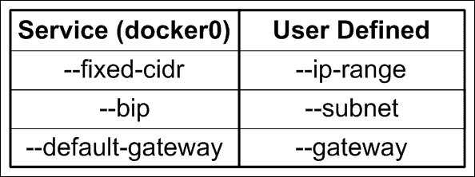
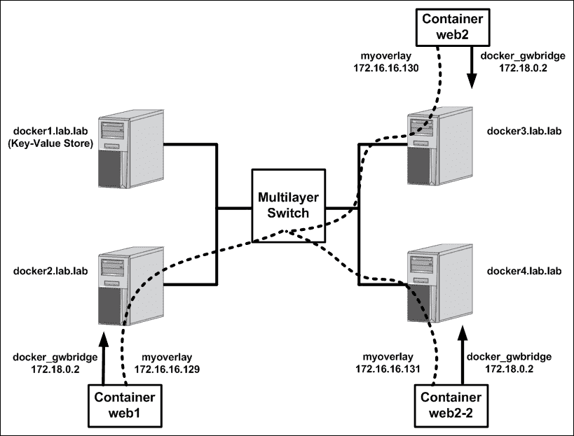
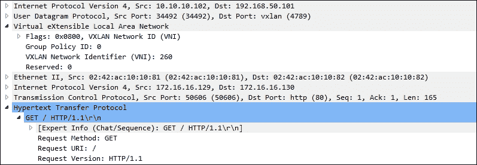

# 第三章：用户定义的网络

在这一章中，我们将涵盖以下配方：

+   查看 Docker 网络配置

+   创建用户定义的网络

+   将容器连接到网络

+   定义用户定义的桥接网络

+   创建用户定义的覆盖网络

+   隔离网络

# 介绍

早期版本的 Docker 依赖于一个基本静态的网络模型，这对大多数容器网络需求来说工作得相当好。然而，如果您想做一些不同的事情，您就没有太多选择了。例如，您可以告诉 Docker 将容器部署到不同的桥接，但 Docker 和该网络之间没有一个强大的集成点。随着 Docker 1.9 中用户定义的网络的引入，游戏已经改变了。您现在可以直接通过 Docker 引擎创建和管理桥接和多主机网络。此外，第三方网络插件也可以通过 libnetwork 及其**容器网络模型**（**CNM**）模型与 Docker 集成。

### 注意

CNM 是 Docker 用于定义容器网络模型的模型。在第七章中，*使用 Weave Net*，我们将研究一个第三方插件（Weave），它可以作为 Docker 驱动程序集成。本章的重点将放在 Docker 引擎中默认包含的网络驱动程序上。

转向基于驱动程序的模型象征着 Docker 网络的巨大变化。除了定义新网络，您现在还可以动态连接和断开容器接口。这种固有的灵活性为连接容器打开了许多新的可能性。

# 查看 Docker 网络配置

如前所述，现在可以通过添加`network`子命令直接通过 Docker 定义和管理网络。`network`命令为您提供了构建网络并将容器连接到网络所需的所有选项：

[PRE0]

在这个配方中，我们将学习如何查看定义的 Docker 网络以及检查它们的具体细节。

## 做好准备

`docker network`子命令是在 Docker 1.9 中引入的，因此您需要运行至少该版本的 Docker 主机。在我们的示例中，我们将使用 Docker 版本 1.12。您还需要对当前网络布局有很好的了解，这样您就可以跟着我们检查当前的配置。假设每个 Docker 主机都处于其本机配置中。

## 如何做…

我们要做的第一件事是弄清楚 Docker 认为已经定义了哪些网络。这可以使用`network ls`子命令来完成：

[PRE1]

正如我们所看到的，Docker 显示我们已经定义了三种不同的网络。要查看有关网络的更多信息，我们可以使用`network inspect`子命令检索有关网络定义及其当前状态的详细信息。让我们仔细查看每个定义的网络。

### Bridge

桥接网络代表 Docker 引擎默认创建的`docker0`桥：

[PRE2]

`inspect`命令的输出向我们展示了关于定义网络的大量信息：

+   `Driver`：在这种情况下，我们可以看到网络桥实现了`Driver`桥。尽管这似乎是显而易见的，但重要的是要指出，所有网络功能，包括本机功能，都是通过驱动程序实现的。

+   `子网`：在这种情况下，`子网`是我们从`docker0`桥预期的默认值，`172.17.0.1/16`。

+   `bridge.default_bridge`：值为`true`意味着 Docker 将为所有容器提供此桥，除非另有规定。也就是说，如果您启动一个没有指定网络（`--net`）的容器，该容器将最终出现在此桥上。

+   `bridge.host_binding_ipv4`：默认情况下，这将设置为`0.0.0.0`或所有接口。正如我们在第二章中所看到的，*配置和监控 Docker 网络*，我们可以通过将`--ip`标志作为 Docker 选项传递给服务，告诉 Docker 在服务级别限制这一点。

+   `bridge.name`：正如我们所怀疑的，这个网络代表`docker0`桥。

+   `driver.mtu`：默认情况下，这将设置为`1500`。正如我们在第二章中所看到的，*配置和监控 Docker 网络*，我们可以通过将`--mtu`标志作为 Docker 选项传递给服务，告诉 Docker 在服务级别更改**MTU**（最大传输单元）。

### 无

`none`网络表示的就是它所说的，什么也没有。当您希望定义一个绝对没有网络定义的容器时，可以使用`none`模式。检查网络后，我们可以看到就网络定义而言，没有太多内容：

[PRE3]

如您所见，`Driver`由`null`表示，这意味着这根本不是这个网络的`Driver`。`none`网络模式有一些用例，我们将在稍后讨论连接和断开连接到定义网络的容器时进行介绍。

### 主机

*host*网络代表我们在第二章中看到的主机模式，*配置和监视 Docker 网络*，在那里容器直接绑定到 Docker 主机自己的网络接口。通过仔细观察，我们可以看到，与`none`网络一样，对于这个网络并没有太多定义。

[PRE4]

尽管主机网络肯定比`none`模式做得更多，但从检查其定义来看，似乎并非如此。这里的关键区别在于这个网络使用主机`Driver`。由于这种网络类型使用现有主机的网络接口，我们不需要将其作为网络的一部分进行定义。

使用`network ls`命令时，可以传递附加参数以进一步过滤或更改输出：

+   `--quiet`（`-q`）：仅显示数字网络 ID

+   `--no-trunc`：这可以防止命令自动截断输出中的网络 ID，从而使您可以看到完整的网络 ID

+   `--filter`（`-f`）：根据网络 ID、网络名称或网络定义（内置或用户定义）对输出进行过滤

例如，我们可以使用以下过滤器显示所有用户定义的网络：

[PRE5]

或者我们可以显示所有包含`158`的网络 ID 的网络：

[PRE6]

# 创建用户定义的网络

到目前为止，我们已经看到，每个 Docker 安装都有至少两种不同的网络驱动程序，即桥接和主机。除了这两种之外，由于先决条件而没有最初定义，还有另一个`Driver`叠加，也可以立即使用。本章的后续内容将涵盖有关桥接和叠加驱动程序的具体信息。

因为使用主机`Driver`创建另一个主机网络的迭代没有意义，所以内置的用户定义网络仅限于桥接和叠加驱动程序。在本教程中，我们将向您展示创建用户定义网络的基础知识，以及与`network create`和`network rm` Docker 子命令相关的选项。

## 准备工作

`docker network`子命令是在 Docker 1.9 中引入的，因此您需要运行至少该版本的 Docker 主机。在我们的示例中，我们将使用 Docker 版本 1.12。您还需要对当前网络布局有很好的了解，以便在我们检查当前配置时能够跟随。假定每个 Docker 主机都处于其本机配置中。

### 注意

警告：在 Linux 主机上创建网络接口必须谨慎进行。Docker 将尽力防止您自找麻烦，但在定义 Docker 主机上的新网络之前，您必须对网络拓扑有一个很好的了解。要避免的一个常见错误是定义与网络中其他子网重叠的新网络。在远程管理的情况下，这可能会导致主机和容器之间的连接问题。

## 如何做到这一点…

网络是通过使用`network create`子命令来定义的，该命令具有以下选项：

[PRE7]

让我们花点时间讨论每个选项的含义：

+   `aux-address`：这允许您定义 Docker 在生成容器时不应分配的 IP 地址。这相当于 DHCP 范围中的 IP 保留。

+   `Driver`：网络实现的`Driver`。内置选项包括 bridge 和 overlay，但您也可以使用第三方驱动程序。

+   `gateway`：网络的网关。如果未指定，Docker 将假定它是子网中的第一个可用 IP 地址。

+   `internal`：此选项允许您隔离网络，并将在本章后面更详细地介绍。

+   `ip-range`：这允许您指定用于容器寻址的已定义网络子网的较小子网。

+   `ipam-driver`：除了使用第三方网络驱动程序外，您还可以利用第三方 IPAM 驱动程序。对于本书的目的，我们将主要关注默认或内置的 IPAM`Driver`。

+   `ipv6`：这在网络上启用 IPv6 网络。

+   `label`：这允许您指定有关网络的其他信息，这些信息将被存储为元数据。

+   `ipam-opt`：这允许您指定要传递给 IPAM`Driver`的选项。

+   `opt`：这允许您指定可以传递给网络`Driver`的选项。将在相关的配方中讨论每个内置`Driver`的特定选项。

+   `subnet`：这定义了与您正在创建的网络类型相关联的子网。

您可能会注意到这里一些重叠，即 Docker 网络的服务级别可以定义的一些设置与前面列出的用户定义选项之间。检查这些选项时，您可能会想要比较以下配置标志：

尽管这些设置在很大程度上是等效的，但它们并不完全相同。唯一完全相同的是`--fixed-cidr`和`ip-range`。这两个选项都定义了一个较大主网络的较小子网络，用于容器 IP 寻址。另外两个选项是相似的，但并不相同。

在服务选项的情况下，`--bip`适用于`docker0`桥接口，`--default-gateway`适用于容器本身。在用户定义方面，`--subnet`和`--gateway`选项直接适用于正在定义的网络构造（在此比较中是一个桥接）。请记住，`--bip`选项期望接收一个网络中的 IP 地址，而不是网络本身。以这种方式定义桥接 IP 地址既覆盖了子网，也覆盖了网关，这在定义用户定义网络时是分开定义的。也就是说，服务定义在这方面更加灵活，因为它允许您定义桥接的接口以及分配给容器的网关。

保持合理的默认设置主题，实际上并不需要这些选项来创建用户定义网络。您可以通过只给它一个名称来创建您的第一个用户定义网络：

[PRE8]

经过检查，我们可以看到 Docker 使用的默认设置：

[PRE9]

Docker 假设如果您没有指定`Driver`，那么您想要使用桥接`Driver`创建网络。如果您在创建网络时没有定义子网，它还会自动选择并分配一个子网给这个桥接。

### 注意

在创建网络时，建议您为网络指定子网。正如我们将在后面看到的，不是所有的网络拓扑都依赖于将容器网络隐藏在主机接口后面。在这些情况下，定义一个可路由的不重叠子网将是必要的。

它还会自动选择子网的第一个可用 IP 地址作为网关。因为我们没有为`Driver`定义任何选项，所以网络没有，但在这种情况下会使用默认值。这些将在与每个特定`Driver`相关的配方中讨论。

空的网络，即没有活动端点的网络，可以使用 `network rm` 命令删除：

[PRE10]

这里值得注意的另一项是，Docker 使用户定义的网络持久化。在大多数情况下，手动定义的任何 Linux 网络结构在系统重新启动时都会丢失。Docker 记录网络配置并在 Docker 服务重新启动时负责回放。这对于通过 Docker 而不是自己构建网络来说是一个巨大的优势。

# 连接容器到网络

虽然拥有创建自己网络的能力是一个巨大的进步，但如果没有一种方法将容器连接到网络，这就毫无意义。在以前的 Docker 版本中，这通常是在容器运行时通过传递 `--net` 标志来完成的，指定容器应该使用哪个网络。虽然这仍然是这种情况，但 `docker network` 子命令也允许您将正在运行的容器连接到现有网络或从现有网络断开连接。

## 准备工作

`docker network` 子命令是在 Docker 1.9 中引入的，因此您需要运行至少该版本的 Docker 主机。在我们的示例中，我们将使用 Docker 版本 1.12。您还需要对当前网络布局有很好的了解，这样您就可以在我们检查当前配置时跟上。假设每个 Docker 主机都处于其本机配置中。

## 如何做…

通过 `network connect` 和 `network disconnect` 子命令来连接和断开连接容器：

[PRE11]

让我们回顾一下连接容器到网络的选项：

+   **别名**：这允许您在连接容器的网络中为容器名称解析定义别名。我们将在第五章中更多地讨论这一点，*容器链接和 Docker DNS*，在那里我们将讨论 DNS 和链接。

+   **IP**：这定义了要用于容器的 IP 地址。只要 IP 地址当前未被使用，它就可以工作。一旦分配，只要容器正在运行或暂停，它就会保留。停止容器将删除保留。

+   **IP6**：这定义了要用于容器的 IPv6 地址。适用于 IPv4 地址的相同分配和保留要求也适用于 IPv6 地址。

+   **Link**：这允许您指定与另一个容器的链接。我们将在第五章中更多地讨论这个问题，*容器链接和 Docker DNS*，在那里我们将讨论 DNS 和链接。

一旦发送了`network connect`请求，Docker 会处理所有所需的配置，以便容器开始使用新的接口。让我们来看一个快速的例子：

[PRE12]

在上面的输出中，我们启动了一个简单的容器，没有指定任何与网络相关的配置。结果是容器被映射到了`docker0`桥接。现在让我们尝试将这个容器连接到我们在上一个示例中创建的网络`mynetwork`：

[PRE13]

如您所见，容器现在在`mynetwork`网络上有一个 IP 接口。如果我们现在再次检查网络，我们应该看到一个容器关联：

[PRE14]

网络也可以很容易地断开连接。例如，我们现在可以通过将容器从桥接网络中移除来从`docker0`桥接中移除容器：

[PRE15]

有趣的是，Docker 还负责确保在连接和断开容器与网络时容器的连通性。例如，在将容器从桥接网络断开连接之前，容器的默认网关仍然在`docker0`桥接之外：

[PRE16]

这是有道理的，因为我们不希望在将容器连接到新网络时中断容器的连接。然而，一旦我们通过断开与桥接网络的接口来移除托管默认网关的网络，我们会发现 Docker 会将默认网关更新为`mynetwork`桥接的剩余接口：

[PRE17]

这确保了无论连接到哪个网络，容器都具有连通性。

最后，我想指出连接和断开容器与网络时`none`网络类型的一个有趣方面。正如我之前提到的，`none`网络类型告诉 Docker 不要将容器分配给任何网络。然而，这并不仅仅意味着最初，它是一个配置状态，告诉 Docker 容器不应该与任何网络关联。例如，假设我们使用`none`网络启动以下容器：

[PRE18]

如您所见，除了回环接口之外，容器没有任何网络接口。现在，让我们尝试将这个容器连接到一个新的网络：

[PRE19]

Docker 告诉我们，这个容器被定义为没有网络，并且阻止我们将容器连接到任何网络。如果我们检查`none`网络，我们可以看到这个容器实际上附加到它上面：

[PRE20]

为了将这个容器连接到一个新的网络，我们首先必须将其与`none`网络断开连接：

[PRE21]

一旦您将其与`none`网络断开连接，您就可以自由地将其连接到任何其他定义的网络。

# 定义用户定义的桥接网络

通过使用桥接`Driver`，用户可以提供自定义桥接以连接到容器。您可以创建尽可能多的桥接，唯一的限制是您必须在每个桥接上使用唯一的 IP 地址。也就是说，您不能与已在其他网络接口上定义的现有子网重叠。

在这个教程中，我们将学习如何定义用户定义的桥接，以及在创建过程中可用的一些独特选项。

## 准备工作

`docker network`子命令是在 Docker 1.9 中引入的，因此您需要运行至少该版本的 Docker 主机。在我们的示例中，我们将使用 Docker 版本 1.12。您还需要对当前网络布局有很好的了解，这样您就可以跟着我们检查当前的配置。假设每个 Docker 主机都处于其本机配置中。

## 如何做…

在上一个教程中，我们讨论了定义用户定义网络的过程。虽然那里讨论的选项适用于所有网络类型，但我们可以通过传递`--opt`标志将其他选项传递给我们的网络实现的`Driver`。让我们快速回顾一下与桥接`Driver`可用的选项：

+   `com.docker.network.bridge.name`：这是您希望给桥接的名称。

+   `com.docker.network.bridge.enable_ip_masquerade`：这指示 Docker 主机在容器尝试路由离开本地主机时，隐藏或伪装该网络中所有容器在 Docker 主机接口后面。

+   `com.docker.network.bridge.enable_icc`：这为桥接打开或关闭**容器间连接**（**ICC**）模式。这个功能在第六章 *保护容器网络*中有更详细的介绍。

+   `com.docker.network.bridge.host_binding_ipv4`：这定义了应该用于端口绑定的主机接口。

+   `com.docker.network.driver.mtu`：这为连接到这个桥接的容器设置 MTU。

这些选项可以直接与我们在 Docker 服务下定义的选项进行比较，以更改默认的`docker0`桥。

如何做到这一点...

上表比较了影响`docker0`桥的服务级设置与您在定义用户定义的桥接网络时可用的设置。它还列出了在任一情况下如果未指定设置，则使用的默认设置。

在定义容器网络时，通过驱动程序特定选项和`network create`子命令的通用选项，我们在定义容器网络时具有相当大的灵活性。让我们通过一些快速示例来构建用户定义的桥接。

### 示例 1

[PRE22]

前面的`network create`语句定义了具有以下特征的网络：

+   一个类型为`bridge`的用户定义网络

+   一个`子网`为`10.15.20.0/24`

+   一个`网关`或桥接 IP 接口为`10.15.20.1`

+   两个保留地址：`10.15.20.2`和`10.15.20.3`

+   主机上的端口绑定接口为`10.10.10.101`

+   一个名为`linuxbridge1`的 Linux 接口名称

+   一个名为`testbridge1`的 Docker 网络

请记住，其中一些选项仅用于示例目的。实际上，在前面的示例中，我们不需要为网络驱动程序定义“网关”，因为默认设置将覆盖我们。

如果我们在检查后创建了前面提到的网络，我们应该看到我们定义的属性：

[PRE23]

### 注意

您传递给网络的选项不会得到验证。也就是说，如果您将`host_binding`拼错为`host_bniding`，Docker 仍然会让您创建网络，并且该选项将被定义；但是，它不会起作用。

### 示例 2

[PRE24]

前面的`network create`语句定义了具有以下特征的网络：

+   一个类型为`bridge`的用户定义网络

+   一个`子网`为`192.168.50.0/24`

+   一个`网关`或桥接 IP 接口为`192.168.50.1`

+   一个容器网络范围为`192.168.50.128/25`

+   主机上的 IP 伪装关闭

+   一个名为`testbridge2`的 Docker 网络

如示例 1 所述，如果我们创建桥接网络，则无需定义驱动程序类型。此外，如果我们可以接受网关是容器定义子网中的第一个可用 IP，我们也可以将其从定义中排除。创建后检查此网络应该显示类似于这样的结果：

[PRE25]

# 创建用户定义的覆盖网络

虽然创建自己的桥接能力确实很吸引人，但你的范围仍然局限于单个 Docker 主机。覆盖网络`Driver`旨在通过允许您使用覆盖网络在多个 Docker 主机上扩展一个或多个子网来解决这个问题。覆盖网络是在现有网络之上构建隔离网络的一种手段。在这种情况下，现有网络为覆盖提供传输，并且通常被称为**底层网络**。覆盖`Driver`实现了 Docker 所谓的多主机网络。

在这个示例中，我们将学习如何配置覆盖`Driver`的先决条件，以及部署和验证基于覆盖的网络。

## 准备就绪

在接下来的示例中，我们将使用这个实验室拓扑：

拓扑结构由总共四个 Docker 主机组成，其中两个位于`10.10.10.0/24`子网，另外两个位于`192.168.50.0/24`子网。当我们按照这个示例进行操作时，图中显示的主机将扮演以下角色：

+   `docker1`：作为 Consul**键值存储**提供服务的 Docker 主机

+   `docker2`：参与覆盖网络的 Docker 主机

+   `docker3`：参与覆盖网络的 Docker 主机

+   `docker4`：参与覆盖网络的 Docker 主机

如前所述，覆盖`Driver`不是默认实例化的。这是因为覆盖`Driver`需要满足一些先决条件才能工作。

### 一个键值存储

由于我们现在处理的是一个分布式系统，Docker 需要一个地方来存储关于覆盖网络的信息。为此，Docker 使用一个键值存储，并支持 Consul、etcd 和 ZooKeeper。它将存储需要在所有节点之间保持一致性的信息，如 IP 地址分配、网络 ID 和容器端点。在我们的示例中，我们将部署 Consul。

侥幸的是，Consul 本身可以作为一个 Docker 容器部署：

[PRE26]

运行这个镜像将启动一个 Consul 键值存储的单个实例。一个单个实例就足够用于基本的实验测试。在我们的情况下，我们将在主机`docker1`上启动这个镜像。所有参与覆盖的 Docker 主机必须能够通过网络访问键值存储。

### 注意

只有在演示目的下才应该使用单个集群成员运行 Consul。您至少需要三个集群成员才能具有任何故障容忍性。确保您研究并了解您决定部署的键值存储的配置和故障容忍性。

### Linux 内核版本为 3.16

您的 Linux 内核版本需要是 3.16 或更高。您可以使用以下命令检查当前的内核版本：

[PRE27]

### 打开端口

Docker 主机必须能够使用以下端口相互通信：

+   TCP 和 UDP `7946`（Serf）

+   UDP `4789`（VXLAN）

+   TCP `8500`（Consul 键值存储）

### Docker 服务配置选项

参与覆盖的所有主机都需要访问键值存储。为了告诉它们在哪里，我们定义了一些服务级选项：

[PRE28]

cluster-store 变量定义了键值存储的位置。在我们的情况下，它是在主机`docker1`（`10.10.10.101`）上运行的容器。我们还需要启用`cluster-advertise`功能并传递一个接口和端口。这个配置更多地涉及使用 Swarm 集群，但该标志也作为启用多主机网络的一部分。也就是说，您需要传递一个有效的接口和端口。在这种情况下，我们使用主机物理接口和端口`0`。在我们的示例中，我们将这些选项添加到主机`docker2`，`docker3`和`docker4`上，因为这些是参与覆盖网络的主机。

添加选项后，重新加载`systemd`配置并重新启动 Docker 服务。您可以通过检查`docker info`命令的输出来验证 Docker 是否接受了该命令：

[PRE29]

## 如何做…

现在我们已经满足了使用覆盖`Driver`的先决条件，我们可以部署我们的第一个用户定义的覆盖网络。定义用户定义的覆盖网络遵循与定义用户定义的桥网络相同的过程。例如，让我们使用以下命令配置我们的第一个覆盖网络：

[PRE30]

就像用户定义的桥一样，我们不必输入太多信息来创建我们的第一个覆盖网络。事实上，唯一的区别在于我们必须将`Driver`指定为覆盖类型，因为默认的`Driver`类型是桥接。一旦我们输入命令，我们应该能够在参与覆盖网络的任何节点上看到定义的网络。

[PRE31]

当主机`docker2`创建网络时，它将网络配置推送到存储中。现在所有主机都可以看到新的网络，因为它们都在读写来自同一个键值存储的数据。一旦网络创建完成，任何参与覆盖的节点（配置了正确的服务级选项）都可以查看、连接容器到并删除覆盖网络。

例如，如果我们去到主机`docker4`，我们可以删除最初在主机`docker2`上创建的网络：

[PRE32]

现在让我们用更多的配置来定义一个新的覆盖。与用户定义的桥接不同，覆盖`Driver`目前不支持在创建时使用`--opt`标志传递任何附加选项。也就是说，我们可以在覆盖类型网络上配置的唯一选项是`network create`子命令的一部分。

+   `aux-address`：与用户定义的桥接一样，这个命令允许您定义 Docker 在生成容器时不应分配的 IP 地址。

+   `gateway`：虽然您可以为网络定义一个网关，如果您不这样做，Docker 会为您做这个，但实际上在覆盖网络中并不使用这个。也就是说，没有接口会被分配这个 IP 地址。

+   `internal`：此选项允许您隔离网络，并在本章后面更详细地介绍。

+   `ip-range`：允许您指定一个较小的子网，用于容器寻址。

+   `ipam-driver`：除了使用第三方网络驱动程序，您还可以利用第三方 IPAM 驱动程序。在本书中，我们将主要关注默认或内置的 IPAM 驱动程序。

+   `ipam-opt`：这允许您指定要传递给 IPAM 驱动程序的选项。

+   `subnet`：这定义了与您创建的网络类型相关联的子网。

让我们在主机`docker4`上重新定义网络`myoverlay`：

[PRE33]

在这个例子中，我们使用以下属性定义网络：

+   一个`subnet`为`172.16.16.0/24`

+   一个保留或辅助地址为`172.16.16.2`（请记住，Docker 将分配一个网关 IP 作为子网中的第一个 IP，尽管实际上并没有使用。在这种情况下，这意味着`.1`和`.2`在这一点上在技术上是保留的。）

+   一个可分配的容器 IP 范围为`172.16.16.128/25`

+   一个名为`myoverlay`的网络

与以前一样，这个网络现在可以在参与覆盖配置的三个主机上使用。现在让我们从主机`docker2`上的覆盖网络中定义我们的第一个容器：

[PRE34]

在这里，我们要求主机启动一个名为`web1`的容器，并将其连接到网络`myoverlay`。现在让我们检查容器的 IP 接口配置：

[PRE35]

令人惊讶的是，容器有两个接口。`eth0`接口连接到与覆盖网络`myoverlay`相关联的网络，但`eth1`与一个新网络`172.18.0.0/16`相关联。

### 注意

到目前为止，您可能已经注意到容器中的接口名称使用 VETH 对命名语法。Docker 使用 VETH 对将容器连接到桥接，并直接在容器侧接口上配置容器 IP 地址。这将在第四章中进行详细介绍，*构建 Docker 网络*，在这里我们将详细介绍 Docker 如何将容器连接到网络。

为了找出它连接到哪里，让我们试着找到容器的`eth1`接口连接到的 VETH 对的另一端。如第一章所示，*Linux 网络构造*，我们可以使用`ethtool`来查找 VETH 对的对等`接口 ID`。然而，当查看用户定义的网络时，有一种更简单的方法可以做到这一点。请注意，在前面的输出中，VETH 对的名称具有以下语法：

[PRE36]

幸运的是，`if`后面显示的数字是 VETH 对的另一端的`接口 ID`。因此，在前面的输出中，我们看到`eth1`接口的匹配接口具有`接口 ID`为`11`。查看本地 Docker 主机，我们可以看到我们定义了一个接口`11`，它的`对等接口 ID`是`10`，与容器中的`接口 ID`匹配。

[PRE37]

注意，VETH 对的这一端（`接口 ID 11`）有一个名为`docker_gwbridge`的主机。也就是说，VETH 对的这一端是桥接`docker_gwbridge`的一部分。让我们再次查看 Docker 主机上定义的网络：

[PRE38]

除了我们的覆盖网络，还有一个同名的新用户定义桥接。如果我们检查这个桥接，我们会看到我们的容器按预期连接到它，并且网络定义了一些选项：

[PRE39]

正如我们所看到的，此桥的 ICC 模式已禁用。ICC 防止同一网络桥上的容器直接通信。但是这个桥的目的是什么，为什么生成在`myoverlay`网络上的容器被连接到它上面呢？

`docker_gwbridge`网络是用于覆盖连接的容器的外部容器连接的解决方案。覆盖网络可以被视为第 2 层网络段。您可以将多个容器连接到它们，并且该网络上的任何内容都可以跨越本地网络段进行通信。但是，这并不允许容器与网络外的资源通信。这限制了 Docker 通过发布端口访问容器资源的能力，以及容器与外部网络通信的能力。如果我们检查容器的路由配置，我们可以看到它的默认网关指向`docker_gwbridge`的接口：

[PRE40]

再加上`docker_gwbridge`启用了 IP 伪装的事实，这意味着容器仍然可以与外部网络通信：

[PRE41]

与默认桥网络一样，如果容器尝试通过路由到达外部网络，它们将隐藏在其 Docker 主机 IP 接口后面。

这也意味着，由于我使用`-P`标志在此容器上发布了端口，Docker 已经使用`docker_gwbridge`发布了这些端口。我们可以使用`docker port`子命令来验证端口是否已发布：

[PRE42]

通过使用`iptables`检查 netfilter 规则来验证端口是否在`docker_gwbridge`上发布：

[PRE43]

正如您在前面的输出中所看到的，Docker 正在使用`docker_gwbridge`上的容器接口来为 Docker 主机的接口提供端口发布。

此时，我们的容器拓扑如下：

将容器添加到覆盖网络会自动创建桥`docker_gwbridge`，用于容器连接到主机以及离开主机。`myoverlay`覆盖网络仅用于与定义的`subnet`，`172.16.16.0/24`相关的连接。

现在让我们启动另外两个容器，一个在主机`docker3`上，另一个在主机`docker4`上：

[PRE44]

请注意，当我尝试在两个主机上运行相同的容器时，Docker 告诉我容器`web2`已经存在。Docker 不允许您在同一覆盖网络上以相同的名称运行容器。请回想一下，Docker 正在将与覆盖中的每个容器相关的信息存储在键值存储中。当我们开始讨论 Docker 名称解析时，使用唯一名称变得很重要。

### 注意

此时您可能会注意到容器可以通过名称解析彼此。这是与用户定义的网络一起提供的非常强大的功能之一。我们将在第五章中更详细地讨论这一点，*容器链接和 Docker DNS*，在那里我们将讨论 DNS 和链接。

使用唯一名称在`docker4`上重新启动容器：

[PRE45]

现在我们有三个容器在运行，每个主机上都有一个参与覆盖。让我们花点时间来想象这里发生了什么：

我已经在图表上删除了主机和底层网络，以便更容易阅读。如描述的那样，每个容器都有两个 IP 网络接口。一个 IP 地址位于共享的覆盖网络上，位于`172.16.16.128/25`网络中。另一个位于桥接`docker_gwbridge`上，每个主机上都是相同的。由于`docker_gwbridge`独立存在于每个主机上，因此不需要为此接口设置唯一的地址。该桥上的容器接口仅用作容器与外部网络通信的手段。也就是说，位于相同主机上的每个容器，在覆盖类型网络上都会在同一桥上接收一个 IP 地址。

您可能会想知道这是否会引起安全问题，因为所有连接到覆盖网络的容器，无论连接到哪个网络，都会在共享桥上（`docker_gwbridge`）上有一个接口。请回想一下之前我指出过`docker_gwbridge`已禁用了 ICC 模式。这意味着，虽然可以将许多容器部署到桥上，但它们都无法通过桥上的 IP 接口直接与彼此通信。我们将在第六章中更详细地讨论这一点，*容器网络安全*，在那里我们将讨论容器安全，但现在知道 ICC 可以防止在共享桥上发生 ICC。

容器在覆盖网络上相信它们在同一网络段上，或者彼此相邻的第 2 层。让我们通过从容器`web1`连接到容器`web2`上的 web 服务来证明这一点。回想一下，当我们配置容器`web2`时，我们没有要求它发布任何端口。

与其他 Docker 网络构造一样，连接到同一覆盖网络的容器可以直接在它们绑定服务的任何端口上相互通信，而无需发布端口：

### 注意

重要的是要记住，Docker 主机没有直接连接到覆盖连接的容器的手段。对于桥接网络类型，这是可行的，因为主机在桥接上有一个接口，在覆盖类型网络的情况下，这个接口是不存在的。

[PRE46]

正如你所看到的，我们可以成功地从容器`web1`访问运行在容器`web2`中的 web 服务器。这些容器不仅位于完全不同的主机上，而且主机本身位于完全不同的子网上。这种类型的通信以前只有在两个容器坐在同一主机上，并连接到同一个桥接时才可用。我们可以通过检查每个相应容器上的 ARP 和 MAC 条目来证明容器相信自己是第 2 层相邻的：

[PRE47]

我们可以看到容器有一个 ARP 条目，来自远程容器，指定其 IP 地址以及 MAC 地址。如果容器不在同一网络上，容器`web1`将不会有`web2`的 ARP 条目。

我们可以验证我们从`docker4`主机上的`web2-2`容器对所有三个容器之间的本地连接性：

[PRE48]

现在我们知道覆盖网络是如何工作的，让我们谈谈它是如何实现的。覆盖传输所使用的机制是 VXLAN。我们可以通过查看在物理网络上进行的数据包捕获来看到容器生成的数据包是如何穿越底层网络的。

在从捕获中获取的数据包的前面的屏幕截图中，我想指出一些项目：

+   外部 IP 数据包源自`docker2`主机（`10.10.10.102`），目的地是`docker3`主机（`192.168.50.101`）。

+   我们可以看到外部 IP 数据包是 UDP，并且被检测为 VXLAN 封装。

+   **VNI**（VXLAN 网络标识符）或段 ID 为`260`。VNI 在每个子网中是唯一的。

+   内部帧具有第 2 层和第 3 层标头。第 2 层标头具有容器 `web2` 的目标 MAC 地址，如前所示。IP 数据包显示了容器 `web1` 的源和容器 `web2` 的目标。

Docker 主机使用自己的 IP 接口封装覆盖流量，并通过底层网络将其发送到目标 Docker 主机。来自键值存储的信息用于确定给定容器所在的主机，以便 VXLAN 封装将流量发送到正确的主机。

您现在可能想知道 VXLAN 覆盖的所有配置在哪里。到目前为止，我们还没有看到任何实际涉及 VXLAN 或隧道的配置。为了提供 VXLAN 封装，Docker 为每个用户定义的覆盖网络创建了我所说的 *覆盖命名空间*。正如我们在第一章中看到的 *Linux 网络构造*，您可以使用 `ip netns` 工具与网络命名空间进行交互。然而，由于 Docker 将它们的网络命名空间存储在非默认位置，我们将无法使用 `ip netns` 工具查看任何由 Docker 创建的命名空间。默认情况下，命名空间存储在 `/var/run/netns` 中。问题在于 Docker 将其网络命名空间存储在 `/var/run/docker/netns` 中，这意味着 `ip netns` 工具正在错误的位置查看由 Docker 创建的网络命名空间。为了解决这个问题，我们可以创建一个 `symlink`，将 `/var/run/docker/netns/` 链接到 `/var/run/nents`，如下所示：

[PRE49]

请注意，定义了两个网络命名空间。覆盖命名空间将使用以下语法进行标识 `x-<id>`，其中 `x` 是一个随机数。

### 注意

我们在输出中看到的另一个命名空间与主机上运行的容器相关联。在下一章中，我们将深入探讨 Docker 如何创建和使用这些命名空间。

因此，在我们的情况下，覆盖命名空间是 `2-4695c5484e`，但它是从哪里来的呢？如果我们检查这个命名空间的网络配置，我们会看到它定义了一些不寻常的接口：

[PRE50]

这些接口定义了我之前提到的叠加网络命名空间。之前我们看到`web2-2`容器有两个接口。`eth1`接口是 VETH 对的一端，另一端放在`docker_gwbridge`上。在前面的叠加网络命名空间中显示的 VETH 对代表了容器`eth0`接口的一侧。我们可以通过匹配 VETH 对的一侧来证明这一点。请注意，VETH 对的这一端显示另一端的`接口 ID`为`12`。如果我们查看容器`web2-2`，我们会看到它的`eth0`接口的 ID 为`12`。反过来，容器的接口显示了一个 ID 为`13`的对 ID，这与我们在叠加命名空间中看到的输出相匹配：

[PRE51]

现在我们知道容器的叠加接口（`eth0`）是如何连接的，我们需要知道进入叠加命名空间的流量是如何封装并发送到其他 Docker 主机的。这是通过叠加命名空间的`vxlan1`接口完成的。该接口具有特定的转发条目，描述了叠加中的所有其他端点：

[PRE52]

请注意，我们有两个条目引用 MAC 地址和目的地。MAC 地址表示叠加中另一个容器的 MAC 地址，IP 地址是容器所在的 Docker 主机。我们可以通过检查其他主机来验证：

[PRE53]

有了这些信息，叠加命名空间就知道为了到达目的地 MAC 地址，它需要在 VXLAN 中封装流量并将其发送到`10.10.10.102`（`docker2`）。

# 隔离网络

用户定义的网络可以支持所谓的内部模式。我们在早期关于创建用户定义网络的示例中看到了这个选项，但并没有花太多时间讨论它。在创建网络时使用`--internal`标志可以防止连接到网络的容器与任何外部网络通信。

## 准备工作

`docker network`子命令是在 Docker 1.9 中引入的，因此您需要运行至少该版本的 Docker 主机。在我们的示例中，我们将使用 Docker 版本 1.12。您还需要对当前网络布局有很好的了解，以便在我们检查当前配置时能够跟上。假设每个 Docker 主机都处于其本机配置中。

## 如何做…

将用户定义的网络设置为内部网络非常简单，只需在`network create`子命令中添加`--internal`选项。由于用户定义的网络可以是桥接类型或覆盖类型，我们应该了解 Docker 如何在任何情况下实现隔离。

### 创建内部用户定义的桥接网络

定义一个用户定义的桥接并传递`internal`标志，以及在主机上为桥接指定自定义名称的标志。我们可以使用以下命令来实现这一点：

[PRE54]

现在，让我们看一下 Docker 分配给桥接的 IP 信息：

[PRE55]

有了这些信息，我们现在来检查一下 Docker 为这个桥接在 netfilter 中编程了什么。让我们检查过滤表并查看：

### 注意

在这种情况下，我正在使用`iptables-save`语法来查询当前的规则。有时，这比查看单个表更易读。

[PRE56]

在这里，我们可以看到 Docker 添加了两条规则。第一条规定，任何不是源自桥接子网并且正在离开桥接接口的流量应该被丢弃。这可能很难理解，所以最容易的方法是以一个例子来思考。假设您网络上的主机`192.168.127.57`正在尝试访问这个桥接上的某些内容。该流量的源 IP 地址不会在桥接子网中，这满足了规则的第一部分。它还将尝试离开（或进入）`mybridge1`，满足了规则的第二部分。这条规则有效地阻止了所有入站通信。

第二条规则寻找没有在桥接子网中具有目的地，并且具有桥接`mybridge1`的入口接口的流量。在这种情况下，容器可能具有 IP 地址 172.19.0.5/16。如果它试图离开本地网络进行通信，目的地将不在`172.19.0.0/16`中，这将匹配规则的第一部分。当它试图离开桥接朝向外部网络时，它将匹配规则的第二部分，因为它进入`mybridge1`接口。这条规则有效地阻止了所有出站通信。

在这两条规则之间，桥接内部不允许任何流量进出。但是，这并不妨碍在同一桥接上的容器之间的容器之间的连接。

应该注意的是，Docker 允许您在针对内部桥接运行容器时指定发布（`-P`）标志。但是，端口将永远不会被映射：

[PRE57]

### 创建内部用户定义的覆盖网络

创建内部覆盖遵循相同的过程。我们只需向`network create`子命令传递`--internal`标志。然而，在覆盖网络的情况下，隔离模型要简单得多。我们可以按以下方式创建内部覆盖网络：

[PRE58]

创建后，它与非内部覆盖没有什么不同。区别在于当我们在内部覆盖上运行容器时：

[PRE59]

检查容器接口配置，我们可以看到容器只有一个接口，它是覆盖网络（`192.10.10.0/24`）的成员。通常连接容器到`docker_gwbridge`（`172.18.0.0/16`）网络以进行外部连接的接口缺失：

[PRE60]

覆盖网络本质上是隔离的，因此需要`docker_gwbridge`。不将容器接口映射到`docker_gwbridge`意味着没有办法在覆盖网络内部或外部进行通信。
