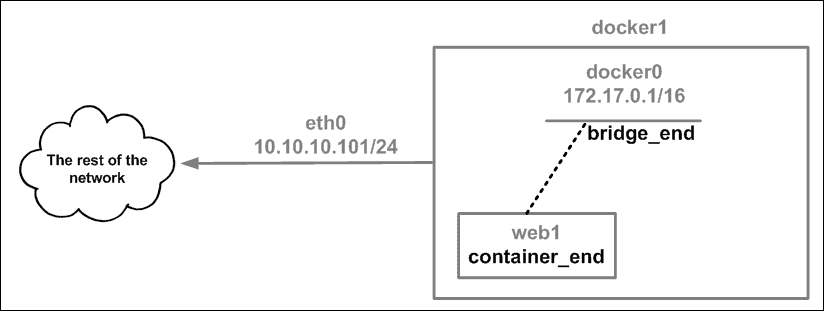
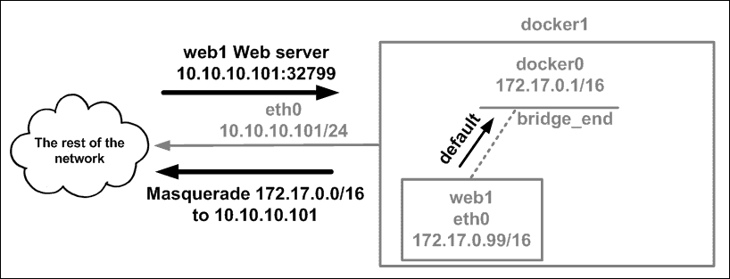
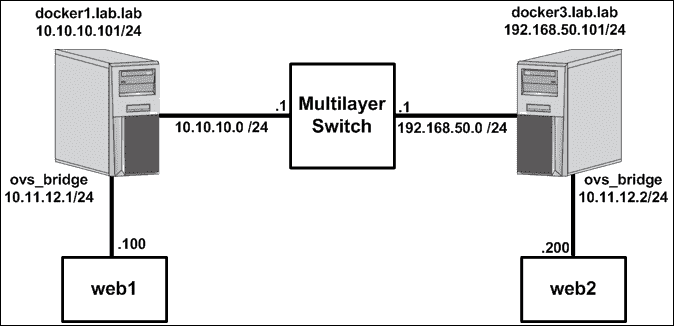
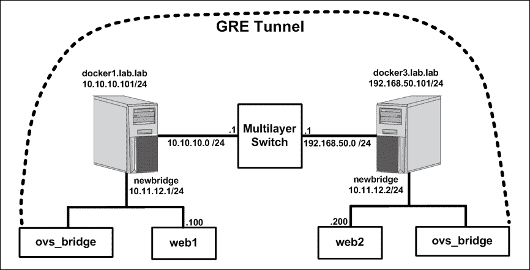

# 第四章。构建 Docker 网络

在本章中，我们将涵盖以下教程：

+   手动网络容器

+   指定自己的桥

+   使用 OVS 桥

+   使用 OVS 桥连接 Docker 主机

+   OVS 和 Docker 一起

# 介绍

正如我们在前几章中看到的，Docker 在处理许多容器网络需求方面做得很好。然而，这并不限制您只能使用 Docker 提供的网络元素来连接容器。因此，虽然 Docker 可以为您提供网络，但您也可以手动连接容器。这种方法的缺点是 Docker 对容器的网络状态不知情，因为它没有参与网络配置。正如我们将在第七章 *使用 Weave Net*中看到的，Docker 现在也支持自定义或第三方网络驱动程序，帮助弥合本机 Docker 和第三方或自定义容器网络配置之间的差距。

# 手动网络容器

在第一章 *Linux 网络构造*和第二章 *配置和监视 Docker 网络*中，我们回顾了常见的 Linux 网络构造，以及涵盖了 Docker 容器网络的本机选项。在这个教程中，我们将演示如何手动网络连接容器，就像 Docker 在默认桥接网络模式下所做的那样。了解 Docker 如何处理容器的网络配置是理解容器网络的非本机选项的关键构建块。

## 准备工作

在这个教程中，我们将演示在单个 Docker 主机上的配置。假设这个主机已经安装了 Docker，并且 Docker 处于默认配置。为了查看和操作网络设置，您需要确保已安装`iproute2`工具集。如果系统上没有安装，可以使用以下命令进行安装：

```
sudo apt-get install iproute2 
```

为了对主机进行网络更改，您还需要 root 级别的访问权限。

## 如何做…

为了手动配置容器的网络，我们需要明确告诉 Docker 在运行时不要配置容器的网络。为此，我们使用`none`网络模式来运行容器。例如，我们可以使用以下语法启动一个没有任何网络配置的 web 服务器容器：

```
user@docker1:~$ docker run --name web1 **--net=none** -d \
jonlangemak/web_server_1
c108ca80db8a02089cb7ab95936eaa52ef03d26a82b1e95ce91ddf6eef942938
user@docker1:~$
```

容器启动后，我们可以使用`docker exec`子命令来检查其网络配置：

```
user@docker1:~$ docker exec web1 ip addr
1: lo: <LOOPBACK,UP,LOWER_UP> mtu 65536 qdisc noqueue state UNKNOWN qlen 1
    link/loopback 00:00:00:00:00:00 brd 00:00:00:00:00:00
    inet 127.0.0.1/8 scope host lo
       valid_lft forever preferred_lft forever
    inet6 ::1/128 scope host
       valid_lft forever preferred_lft forever
user@docker1:~$ 
```

正如你所看到的，除了本地环回接口之外，容器没有定义任何接口。此时，没有办法连接到容器。我们所做的实质上是在一个气泡中创建了一个容器：


因为我们的目标是模拟默认的网络配置，现在我们需要找到一种方法将容器`web1`连接到`docker0`桥，并从桥的 IP 分配（`172.17.0.0/16`）中分配一个 IP 地址给它。

话虽如此，我们需要做的第一件事是创建我们将用来连接容器到`docker0`桥的接口。正如我们在第一章中看到的，*Linux 网络构造*，Linux 有一个名为**虚拟以太网**（**VETH**）对的网络组件，这对于此目的非常有效。接口的一端将连接到`docker0`桥，另一端将连接到容器。

让我们从创建 VETH 对开始：

```
user@docker1:~$ **sudo ip link add bridge_end type veth \**
**peer name container_end**
user@docker1:~$ ip link show
…<Additional output removed for brevity>…
5: **container_end@bridge_end**: <BROADCAST,MULTICAST,M-DOWN> mtu 1500 qdisc noop state DOWN mode DEFAULT group default qlen 1000
    link/ether ce:43:d8:59:ac:c1 brd ff:ff:ff:ff:ff:ff
6: **bridge_end@container_end**: <BROADCAST,MULTICAST,M-DOWN> mtu 1500 qdisc noop state DOWN mode DEFAULT group default qlen 1000
    link/ether 72:8b:e7:f8:66:45 brd ff:ff:ff:ff:ff:ff
user@docker1:~$
```

正如预期的那样，现在我们有两个直接关联的接口。现在让我们将其中一个端口绑定到`docker0`桥上并启用该接口：

```
user@docker1:~$ sudo ip link set dev **bridge_end** master docker0
user@docker1:~$ sudo ip link set **bridge_end** up
user@docker1:~$ ip link show bridge_end
6: **bridge_end@container_end**: <NO-CARRIER,BROADCAST,MULTICAST,UP,M-DOWN> mtu 1500 qdisc pfifo_fast **master docker0** state LOWERLAYERDOWN mode DEFAULT group default qlen 1000
    link/ether 72:8b:e7:f8:66:45 brd ff:ff:ff:ff:ff:ff
user@docker1:~$

```

### 注意

此时接口的状态将显示为`LOWERLAYERDOWN`。这是因为接口的另一端未绑定，仍处于关闭状态。

下一步是将 VETH 对的另一端连接到容器。这就是事情变得有趣的地方。Docker 会在自己的网络命名空间中创建每个容器。这意味着 VETH 对的另一端需要落入容器的网络命名空间。关键是确定容器的网络命名空间是什么。可以通过两种不同的方式找到给定容器的命名空间。

第一种方法依赖于将容器的**进程 ID**（**PID**）与已定义的网络命名空间相关联。它比第二种方法更复杂，但可以让您了解一些网络命名空间的内部情况。您可能还记得第三章中所述，默认情况下，我们无法使用命令行工具`ip netns`查看 Docker 创建的命名空间。为了查看它们，我们需要创建一个符号链接，将 Docker 存储其网络命名空间的位置（`/var/run/docker/netns`）与`ip netns`正在查找的位置（`/var/run/netns`）联系起来。

```
user@docker1:~$ cd /var/run
user@docker1:/var/run$ sudo ln -s /var/run/docker/netns netns
```

现在，如果我们尝试列出命名空间，我们应该至少看到一个列在返回中：

```
user@docker1:/var/run$ sudo ip netns list
**712f8a477cce**
default
user@docker1:/var/run$
```

但是我们怎么知道这是与此容器关联的命名空间呢？要做出这一决定，我们首先需要找到相关容器的 PID。我们可以通过检查容器来检索这些信息：

```
user@docker1:~$ docker inspect web1
…<Additional output removed for brevity>…
        "State": {
            "Status": "running",
            "Running": true,
            "Paused": false,
            "Restarting": false,
            "OOMKilled": false,
            "Dead": false,
            **"Pid": 3156**,
            "ExitCode": 0,
            "Error": "",
            "StartedAt": "2016-10-05T21:32:00.163445345Z",
            "FinishedAt": "0001-01-01T00:00:00Z"
        },
…<Additional output removed for brevity>…
user@docker1:~$ 
```

现在我们有了 PID，我们可以使用`ip netns identify`子命令从 PID 中找到网络命名空间的名称：

```
user@docker1:/var/run$ sudo ip netns identify **3156**
**712f8a477cce**
user@docker1:/var/run$ 
```

### 注意

即使您选择使用第二种方法，请确保创建符号链接，以便`ip netns`在后续步骤中起作用。

找到容器网络命名空间的第二种方法要简单得多。我们可以简单地检查和引用容器的网络配置：

```
user@docker1:~$ docker inspect web1
…<Additional output removed for brevity>… 
"NetworkSettings": {
            "Bridge": "",
            "SandboxID": "712f8a477cceefc7121b2400a22261ec70d6a2d9ab2726cdbd3279f1e87dae22",
            "HairpinMode": false,
            "LinkLocalIPv6Address": "",
            "LinkLocalIPv6PrefixLen": 0,
            "Ports": {},
 **"SandboxKey": "/var/run/docker/netns/712f8a477cce",**
            "SecondaryIPAddresses": null,
            "SecondaryIPv6Addresses": null,
            "EndpointID": "", 
…<Additional output removed for brevity>… 
user@docker1:~$
```

注意名为`SandboxKey`的字段。您会注意到文件路径引用了我们说过 Docker 存储其网络命名空间的位置。此路径中引用的文件名是容器的网络命名空间的名称。Docker 将网络命名空间称为沙盒，因此使用了这种命名约定。

现在我们有了网络命名空间名称，我们可以在容器和`docker0`桥之间建立连接。回想一下，VETH 对可以用来连接网络命名空间。在这个例子中，我们将把 VETH 对的容器端放在容器的网络命名空间中。这将把容器桥接到`docker0`桥上的默认网络命名空间中。为此，我们首先将 VETH 对的容器端移入我们之前发现的命名空间中：

```
user@docker1:~$ sudo ip link set container_end netns **712f8a477cce**

```

我们可以使用`docker exec`子命令验证 VETH 对是否在命名空间中：

```
user@docker1:~$ docker exec web1 ip link show
1: lo: <LOOPBACK,UP,LOWER_UP> mtu 65536 qdisc noqueue state UNKNOWN
    link/loopback 00:00:00:00:00:00 brd 00:00:00:00:00:00
5: **container_end@if6**: <BROADCAST,MULTICAST> mtu 1500 qdisc noop state DOWN qlen 1000
    link/ether 86:15:2a:f7:0e:f9 brd ff:ff:ff:ff:ff:ff
user@docker1:~$
```

到目前为止，我们已成功地使用 VETH 对将容器和默认命名空间连接在一起，因此我们的连接现在看起来像这样：



然而，容器 `web1` 仍然缺乏任何类型的 IP 连通性，因为它尚未被分配可路由的 IP 地址。回想一下，在第一章中，*Linux 网络构造*，我们看到 VETH 对接口可以直接分配 IP 地址。为了给容器分配一个可路由的 IP 地址，Docker 简单地从 `docker0` 桥的子网中分配一个未使用的 IP 地址给 VETH 对的容器端。

### 注意

IPAM 是允许 Docker 为您管理容器网络的巨大优势。没有 IPAM，你将需要自己跟踪分配，并确保你不分配任何重叠的 IP 地址。

```
user@docker1:~$ sudo ip netns exec 712f8a477cce ip \
addr add 172.17.0.99/16 dev container_end
```

在这一点上，我们可以启用接口，我们应该可以从主机到容器的可达性。但在这样做之前，让我们通过将 `container_end` VETH 对重命名为 `eth0` 来使事情变得更清晰一些：

```
user@docker1:~$ sudo ip netns exec 712f8a477cce ip link \
set dev container_end name eth0
```

现在我们可以启用新命名的 `eth0` 接口，这是 VETH 对的容器端：

```
user@docker1:~$ sudo ip netns exec 712f8a477cce ip link \
set eth0 up
user@docker1:~$ ip link show bridge_end
6: **bridge_end**@if5: <BROADCAST,MULTICAST,UP,LOWER_UP> mtu 1500 qdisc pfifo_fast master docker0 state UP mode DEFAULT group default qlen 1000
    link/ether 86:04:ed:1b:2a:04 brd ff:ff:ff:ff:ff:ff
user@docker1:~$ sudo ip netns exec **4093b3b4e672 ip link show eth0**
5: **eth0**@if6: <BROADCAST,MULTICAST,UP,LOWER_UP> mtu 1500 qdisc pfifo_fast state UP mode DEFAULT group default qlen 1000
    link/ether 86:15:2a:f7:0e:f9 brd ff:ff:ff:ff:ff:ff
user@docker1:~$ sudo ip netns exec **4093b3b4e672 ip addr show eth0**
5: eth0@if6: <BROADCAST,MULTICAST,UP,LOWER_UP> mtu 1500 qdisc pfifo_fast state UP group default qlen 1000
    link/ether 86:15:2a:f7:0e:f9 brd ff:ff:ff:ff:ff:ff
    inet **172.17.0.99/16** scope global eth0
       valid_lft forever preferred_lft forever
    inet6 fe80::8415:2aff:fef7:ef9/64 scope link
       valid_lft forever preferred_lft forever
user@docker1:~$
```

如果我们从主机检查，现在我们应该可以到达容器：

```
user@docker1:~$ ping **172.17.0.99** -c 2
PING 172.17.0.99 (172.17.0.99) 56(84) bytes of data.
**64 bytes from 172.17.0.99: icmp_seq=1 ttl=64 time=0.104 ms**
**64 bytes from 172.17.0.99: icmp_seq=2 ttl=64 time=0.045 ms**
--- 172.17.0.99 ping statistics ---
2 packets transmitted, 2 received, 0% packet loss, time 999ms
rtt min/avg/max/mdev = 0.045/0.074/0.104/0.030 ms
user@docker1:~$
user@docker1:~$ curl **http://172.17.0.99**
<body>
  <html>
    <h1><span style="color:#FF0000;font-size:72px;">**Web Server #1 - Running on port 80**</span></h1>
</body>
  </html>
user@docker1:~$
```

连接已经建立，我们的拓扑现在看起来是这样的：


因此，虽然我们有 IP 连通性，但只限于相同子网上的主机。最后剩下的问题是解决主机级别的容器连通性。对于出站连通性，主机将容器的 IP 地址隐藏在主机接口 IP 地址的后面。对于入站连通性，在默认网络模式下，Docker 使用端口映射将 Docker 主机的 NIC 上的随机高端口映射到容器的暴露端口。

在这种情况下解决出站问题就像给容器指定一个指向 `docker0` 桥的默认路由，并确保你有一个 netfilter masquerade 规则来覆盖这个一样简单：

```
user@docker1:~$ sudo ip netns exec 712f8a477cce ip route \
add default via **172.17.0.1**
user@docker1:~$ docker exec -it **web1** ping 4.2.2.2 -c 2
PING 4.2.2.2 (4.2.2.2): 48 data bytes
**56 bytes from 4.2.2.2: icmp_seq=0 ttl=50 time=39.764 ms**
**56 bytes from 4.2.2.2: icmp_seq=1 ttl=50 time=40.210 ms**
--- 4.2.2.2 ping statistics ---
2 packets transmitted, 2 packets received, 0% packet loss
round-trip min/avg/max/stddev = 39.764/39.987/40.210/0.223 ms
user@docker1:~$
```

如果你像我们在这个例子中使用 `docker0` 桥，你就不需要添加自定义 netfilter masquerade 规则。这是因为默认的伪装规则已经覆盖了整个 `docker0` 桥的子网：

```
user@docker1:~$ sudo iptables -t nat -L
…<Additional output removed for brevity>…
Chain POSTROUTING (policy ACCEPT)
target     prot opt source               destination
**MASQUERADE  all  --  172.17.0.0/16        anywhere**
…<Additional output removed for brevity>…
user@docker1:~$
```

对于入站服务，我们需要创建一个自定义规则，使用**网络地址转换**（**NAT**）将主机上的随机高端口映射到容器中暴露的服务端口。我们可以使用以下规则来实现：

```
user@docker1:~$ sudo iptables -t nat -A DOCKER ! -i docker0 -p tcp -m tcp \
--dport 32799 -j DNAT --to-destination 172.17.0.99:80
```

在这种情况下，我们将主机接口上的端口`32799`进行 NAT 转发到容器上的端口`80`。这将允许外部网络上的系统通过 Docker 主机的接口访问在`web1`上运行的 Web 服务器，端口为`32799`。

最后，我们成功地复制了 Docker 在默认网络模式下提供的内容：



这应该让您对 Docker 在幕后所做的事情有所了解。跟踪容器 IP 地址、发布端口的端口分配以及`iptables`规则集是 Docker 代表您跟踪的三个主要事项。鉴于容器的短暂性质，手动完成这些工作几乎是不可能的。

# 指定您自己的桥接

在大多数网络场景中，Docker 严重依赖于`docker0`桥。`docker0`桥是在启动 Docker 引擎服务时自动创建的，并且是 Docker 服务生成的任何容器的默认连接点。我们在之前的配方中也看到，可以在服务级别修改这个桥的一些属性。在这个配方中，我们将向您展示如何告诉 Docker 使用完全不同的桥接。

## 准备工作

在这个配方中，我们将演示在单个 Docker 主机上的配置。假设这个主机已经安装了 Docker，并且 Docker 处于默认配置状态。为了查看和操作网络设置，您需要确保安装了`iproute2`工具集。如果系统上没有安装，可以使用以下命令进行安装：

```
sudo apt-get install iproute2 
```

为了对主机进行网络更改，您还需要 root 级别的访问权限。

## 操作步骤

与其他服务级参数一样，指定 Docker 使用不同的桥接是通过更新我们在第二章中向您展示如何创建的 systemd drop-in 文件来完成的，*配置和监控 Docker 网络*。

在指定新桥之前，让我们首先确保没有正在运行的容器，停止 Docker 服务，并删除`docker0`桥：

```
user@docker1:~$ docker ps -a
CONTAINER ID        IMAGE               COMMAND             CREATED             STATUS              PORTS               NAMES
user@docker1:~$
user@docker1:~$ sudo systemctl stop docker
user@docker1:~$
user@docker1:~$ sudo ip link delete dev docker0
user@docker1:~$
user@docker1:~$ ip link show dev docker0
Device "docker0" does not exist.
user@docker1:~$
```

在这一点上，默认的`docker0`桥已被删除。现在，让我们为 Docker 创建一个新的桥接。

### 注意

如果您不熟悉`iproute2`命令行工具，请参考第一章中的示例，*Linux 网络构造*。

```
user@docker1:~$ sudo ip link add mybridge1 type bridge
user@docker1:~$ sudo ip address add 10.11.12.1/24 dev mybridge1
user@docker1:~$ sudo ip link set dev mybridge1 up
user@docker1:~$ ip addr show dev mybridge1
7: mybridge1: <BROADCAST,MULTICAST,UP,LOWER_UP> mtu 1500 qdisc noqueue state UNKNOWN group default
    link/ether 9e:87:b4:7b:a3:c0 brd ff:ff:ff:ff:ff:ff
    inet **10.11.12.1/24** scope global mybridge1
       valid_lft forever preferred_lft forever
    inet6 fe80::9c87:b4ff:fe7b:a3c0/64 scope link
       valid_lft forever preferred_lft forever
user@docker1:~$
```

我们首先创建了一个名为`mybridge1`的桥接，然后给它分配了 IP 地址`10.11.12.1/24`，最后启动了接口。此时，接口已经启动并可达。现在我们可以告诉 Docker 使用这个桥接作为其默认桥接。要做到这一点，编辑 Docker 的 systemd drop-in 文件，并确保最后一行如下所示：

```
ExecStart=/usr/bin/dockerd --bridge=mybridge1
```

现在保存文件，重新加载 systemd 配置，并启动 Docker 服务：

```
user@docker1:~$ sudo systemctl daemon-reload
user@docker1:~$ sudo systemctl start docker
```

现在，如果我们启动一个容器，我们应该看到它被分配到桥接`mybridge1`上：

```
user@docker1:~$ **docker run --name web1 -d -P jonlangemak/web_server_1**
e8a05afba6235c6d8012639aa79e1732ed5ff741753a8c6b8d9c35a171f6211e
user@docker1:~$ **ip link show**
1: lo: <LOOPBACK,UP,LOWER_UP> mtu 65536 qdisc noqueue state UNKNOWN mode DEFAULT group default qlen 1
    link/loopback 00:00:00:00:00:00 brd 00:00:00:00:00:00
2: eth0: <BROADCAST,MULTICAST,UP,LOWER_UP> mtu 1500 qdisc pfifo_fast state UP mode DEFAULT group default qlen 1000
    link/ether 62:31:35:63:65:63 brd ff:ff:ff:ff:ff:ff
3: eth1: <BROADCAST,MULTICAST> mtu 1500 qdisc noop state DOWN mode DEFAULT group default qlen 1000
    link/ether 36:b3:5c:94:c0:a6 brd ff:ff:ff:ff:ff:ff
17: **mybridge1**: <BROADCAST,MULTICAST,UP,LOWER_UP> mtu 1500 qdisc noqueue state UP mode DEFAULT group default qlen 1000
    link/ether 7a:1b:30:e6:94:b7 brd ff:ff:ff:ff:ff:ff
**22: veth68fb58a@if21**: <BROADCAST,MULTICAST,UP,LOWER_UP> mtu 1500 qdisc noqueue **master mybridge1** state UP mode DEFAULT group default
    link/ether 7a:1b:30:e6:94:b7 brd ff:ff:ff:ff:ff:ff link-netnsid 0
user@docker1:~$
```

请注意，在服务启动时并未创建`docker0`桥接。还要注意，我们在默认命名空间中看到了一个 VETH 对的一端，其主接口为`mybridge1`。

利用我们从本章第一个配方中学到的知识，我们还可以确认 VETH 对的另一端在容器的网络命名空间中：

```
user@docker1:~$ docker inspect web1 | grep SandboxKey
            "SandboxKey": "/var/run/docker/netns/926ddab911ae",
user@docker1:~$ 
user@docker1:~$ sudo ip netns exec **926ddab911ae ip link show**
1: lo: <LOOPBACK,UP,LOWER_UP> mtu 65536 qdisc noqueue state UNKNOWN mode DEFAULT group default qlen 1
    link/loopback 00:00:00:00:00:00 brd 00:00:00:00:00:00
**21: eth0@if22**: <BROADCAST,MULTICAST,UP,LOWER_UP> mtu 1500 qdisc noqueue state UP mode DEFAULT group default
    link/ether 02:42:0a:0b:0c:02 brd ff:ff:ff:ff:ff:ff link-netnsid 0
user@docker1:~$ 
```

我们可以看出这是一个 VETH 对，因为它使用`<interface>@<interface>`的命名语法。如果我们比较 VETH 对接口的编号，我们可以看到这两个与 VETH 对的主机端匹配，索引为`22`连接到 VETH 对的容器端，索引为`21`。

### 注意

您可能会注意到我在使用`ip netns exec`和`docker exec`命令在容器内执行命令时来回切换。这样做的目的不是为了混淆，而是为了展示 Docker 代表您在做什么。需要注意的是，为了使用`ip netns exec`语法，您需要在我们在早期配方中演示的位置放置符号链接。只有在手动配置命名空间时才需要使用`ip netns exec`。

如果我们查看容器的网络配置，我们可以看到 Docker 已经为其分配了`mybridge1`子网范围内的 IP 地址：

```
user@docker1:~$ docker exec web1 ip addr show dev **eth0**
8: eth0@if9: <BROADCAST,MULTICAST,UP,LOWER_UP> mtu 1500 qdisc noqueue state UP
    link/ether 02:42:0a:0b:0c:02 brd ff:ff:ff:ff:ff:ff
    inet **10.11.12.2/24** scope global eth0
       valid_lft forever preferred_lft forever
    inet6 fe80::42:aff:fe0b:c02/64 scope link
       valid_lft forever preferred_lft forever
user@docker1:~$
```

现在 Docker 也在为桥接分配 IP 地址时跟踪 IP 分配。IP 地址管理是 Docker 在容器网络空间提供的一个重要价值。将 IP 地址映射到容器并自行管理将是一项重大工作。

最后一部分将是处理容器的 NAT 配置。由于`10.11.12.0/24`空间不可路由，我们需要隐藏或伪装容器的 IP 地址在 Docker 主机上的物理接口后面。幸运的是，只要 Docker 为您管理桥，Docker 仍然会负责制定适当的 netfilter 规则。我们可以通过检查 netfilter 规则集来确保这一点：

```
user@docker1:~$ sudo iptables -t nat -L -n
…<Additional output removed for brevity>…
Chain POSTROUTING (policy ACCEPT)
target     prot opt source               destination
**MASQUERADE  all  --  10.11.12.0/24        0.0.0.0/0**
…<Additional output removed for brevity>…
Chain DOCKER (2 references)
target     prot opt source               destination
RETURN     all  --  0.0.0.0/0            0.0.0.0/0
**DNAT       tcp  --  0.0.0.0/0            0.0.0.0/0            tcp dpt:32768 to:10.11.12.2:80**

```

此外，由于我们使用`-P`标志在容器上暴露端口，入站 NAT 也已分配。我们还可以在相同的输出中看到这个 NAT 转换。总之，只要您使用的是 Linux 桥，Docker 将像使用`docker0`桥一样为您处理整个配置。

# 使用 OVS 桥

对于寻找额外功能的用户来说，OpenVSwitch（OVS）正在成为本地 Linux 桥的流行替代品。OVS 在略微更高的复杂性的代价下，为 Linux 桥提供了显著的增强。例如，OVS 桥不能直接由我们到目前为止一直在使用的`iproute2`工具集进行管理，而是需要自己的命令行管理工具。然而，如果您正在寻找在 Linux 桥上不存在的功能，OVS 很可能是您的最佳选择。Docker 不能本地管理 OVS 桥，因此使用 OVS 桥需要手动建立桥和容器之间的连接。也就是说，我们不能只是告诉 Docker 服务使用 OVS 桥而不是默认的`docker0`桥。在本教程中，我们将展示如何安装、配置和直接连接容器到 OVS 桥，以取代标准的`docker0`桥。

## 准备工作

在本教程中，我们将演示在单个 Docker 主机上的配置。假设该主机已安装了 Docker，并且 Docker 处于默认配置。为了查看和操作网络设置，您需要确保已安装`iproute2`工具集。如果系统上没有安装，可以使用以下命令进行安装：

```
sudo apt-get install iproute2 
```

为了对主机进行网络更改，您还需要 root 级别的访问权限。

## 如何做…

我们需要执行的第一步是在我们的 Docker 主机上安装 OVS。为了做到这一点，我们可以直接拉取 OVS 包：

```
user@docker1:~$ sudo apt-get install openvswitch-switch
```

如前所述，OVS 有自己的命令行工具集，其中一个工具被命名为`ovs-vsctl`，用于直接管理 OVS 桥。更具体地说，`ovs-vsctl`用于查看和操作 OVS 配置数据库。为了确保 OVS 正确安装，我们可以运行以下命令：

```
user@docker1:~$ sudo ovs-vsctl -V
ovs-vsctl (Open vSwitch) 2.5.0
Compiled Mar 10 2016 14:16:49
DB Schema 7.12.1
user@docker1:~$ 
```

这将返回 OVS 版本号，并验证我们与 OVS 的通信。我们接下来要做的是创建一个 OVS 桥。为了做到这一点，我们将再次使用`ovs-vsctl`命令行工具：

```
user@docker1:~$ sudo ovs-vsctl add-br ovs_bridge
```

这个命令将添加一个名为`ovs_bridge`的 OVS 桥。创建后，我们可以像查看任何其他网络接口一样查看桥接口：

```
user@docker1:~$ ip link show dev ovs_bridge
6: ovs_bridge: <BROADCAST,MULTICAST> mtu 1500 qdisc noop state DOWN mode DEFAULT group default qlen 1
    link/ether b6:45:81:aa:7c:47 brd ff:ff:ff:ff:ff:ff
user@docker1:~$ 
```

但是，要查看任何特定于桥的信息，我们将再次需要依赖`ocs-vsctl`命令行工具。我们可以使用`show`子命令查看有关桥的信息：

```
user@docker1:~$ sudo ovs-vsctl show
0f2ced94-aca2-4e61-a844-fd6da6b2ce38
    Bridge ovs_bridge
        Port ovs_bridge
            Interface ovs_bridge
                type: internal
    ovs_version: "2.5.0"
user@docker1:~$ 
```

为 OVS 桥分配 IP 地址并更改其状态可以再次使用更熟悉的`iproute2`工具完成：

```
user@docker1:~$ sudo ip addr add dev ovs_bridge 10.11.12.1/24
user@docker1:~$ sudo ip link set dev ovs_bridge up
```

一旦启动，接口就像任何其他桥接口一样。我们可以看到 IP 接口已经启动，本地主机可以直接访问它：

```
user@docker1:~$ ip addr show dev ovs_bridge
6: ovs_bridge: <BROADCAST,MULTICAST**,UP,LOWER_UP**> mtu 1500 qdisc noqueue state UNKNOWN group default qlen 1
    link/ether b6:45:81:aa:7c:47 brd ff:ff:ff:ff:ff:ff
    inet **10.11.12.1/24** scope global ovs_bridge
       valid_lft forever preferred_lft forever
    inet6 fe80::b445:81ff:feaa:7c47/64 scope link
       valid_lft forever preferred_lft forever
user@docker1:~$ 
user@docker1:~$ ping 10.11.12.1 -c 2
PING 10.11.12.1 (10.11.12.1) 56(84) bytes of data.
**64 bytes from 10.11.12.1: icmp_seq=1 ttl=64 time=0.036 ms**
**64 bytes from 10.11.12.1: icmp_seq=2 ttl=64 time=0.025 ms**
--- 10.11.12.1 ping statistics ---
2 packets transmitted, 2 received, 0% packet loss, time 999ms
rtt min/avg/max/mdev = 0.025/0.030/0.036/0.007 ms
user@docker1:~$
```

我们接下来要做的是创建我们将用来连接容器到 OVS 桥的 VETH 对：

```
user@docker1:~$ sudo ip link add ovs_end1 type veth \
peer name container_end1
```

创建后，我们需要将 VETH 对的 OVS 端添加到 OVS 桥上。这是 OVS 与标准 Linux 桥有很大区别的地方之一。每个连接到 OVS 的都是以端口的形式。这比 Linux 桥提供的更像是物理交换机。再次强调，因为我们直接与 OVS 桥交互，我们需要使用`ovs-vsctl`命令行工具：

```
user@docker1:~$ sudo ovs-vsctl add-port ovs_bridge ovs_end1
```

添加后，我们可以查询 OVS 以查看所有桥接口的端口：

```
user@docker1:~$ sudo ovs-vsctl list-ports ovs_bridge
**ovs_end1**
user@docker1:~$
```

如果您检查定义的接口，您会看到 VETH 对的 OVS 端将`ovs-system`列为其主机：

```
user@docker1:~$ **ip link show dev ovs_end1**
8: **ovs_end1@container_end1**: <BROADCAST,MULTICAST> mtu 1500 qdisc noop **master ovs-system** state DOWN mode DEFAULT group default qlen 1000
    link/ether 56:e0:12:94:c5:43 brd ff:ff:ff:ff:ff:ff
user@docker1:~$
```

不要深入细节，这是预期的。`ovs-system`接口代表 OVS 数据路径。现在，只需知道这是预期的行为即可。

现在 OVS 端已经完成，我们需要专注于容器端。这里的第一步将是启动一个没有任何网络配置的容器。接下来，我们将按照之前的步骤手动连接容器命名空间到 VETH 对的另一端：

+   启动容器：

```
docker run --name web1 --net=none -d jonlangemak/web_server_1
```

+   查找容器的网络命名空间：

```
docker inspect web1 | grep SandboxKey
"SandboxKey": "/var/run/docker/netns/54b7dfc2e422"
```

+   将 VETH 对的容器端移入该命名空间：

```
sudo ip link set container_end1 netns 54b7dfc2e422
```

+   将 VETH 接口重命名为`eth0`：

```
sudo ip netns exec 54b7dfc2e422 ip link set dev \
container_end1 name eth0
```

+   将`eth0`接口的 IP 地址设置为该子网中的有效 IP：

```
sudo ip netns exec 54b7dfc2e422 ip addr add \
10.11.12.99/24 dev eth0
```

+   启动容器端的接口

```
sudo ip netns exec 54b7dfc2e422 ip link set dev eth0 up
```

+   启动 VETH 对的 OVS 端：

```
sudo ip link set dev ovs_end1 up
```

此时，容器已成功连接到 OVS，并可以通过主机访问：

```
user@docker1:~$ ping 10.11.12.99 -c 2
PING 10.11.12.99 (10.11.12.99) 56(84) bytes of data.
**64 bytes from 10.11.12.99: icmp_seq=1 ttl=64 time=0.469 ms**
**64 bytes from 10.11.12.99: icmp_seq=2 ttl=64 time=0.028 ms**
--- 10.11.12.99 ping statistics ---
2 packets transmitted, 2 received, 0% packet loss, time 999ms
rtt min/avg/max/mdev = 0.028/0.248/0.469/0.221 ms
user@docker1:~$
```

如果我们想更深入地了解 OVS，可以使用以下命令查看交换机的 MAC 地址表：

```
user@docker1:~$ sudo ovs-appctl fdb/show ovs_bridge
port  VLAN  MAC                Age
LOCAL     0  b6:45:81:aa:7c:47    7
 **1     0  b2:7e:e8:42:58:39    7** 
user@docker1:~$
```

注意它在`port 1`上学到的 MAC 地址。但`port 1`是什么？要查看给定 OVS 的所有端口，可以使用以下命令：

```
user@docker1:~$ sudo ovs-dpctl show
system@ovs-system:
        lookups: hit:13 missed:11 lost:0
        flows: 0
        masks: hit:49 total:1 hit/pkt:2.04
        port 0: ovs-system (internal)
 **port 1: ovs_bridge (internal)**
        port 2: ovs_end1 
user@docker1:~$
```

在这里，我们可以看到`port 1`是我们预配的 OVS 桥，我们将 VETH 对的 OVS 端连接到了这里。

正如我们所看到的，连接到 OVS 所需的工作量可能很大。幸运的是，有一些很棒的工具可以帮助我们简化这个过程。其中一个比较显著的工具是由 Jérôme Petazzoni 开发的，名为**Pipework**。它可以在 GitHub 上找到，网址如下：

[`github.com/jpetazzo/pipework`](https://github.com/jpetazzo/pipework)

如果我们使用 Pipework 来连接到 OVS，并假设桥已经创建，我们可以将连接容器到桥所需的步骤从`6`减少到`1`。

要使用 Pipework，必须先从 GitHub 上下载它。可以使用 Git 客户端完成这一步：

```
user@docker1:~$ git clone https://github.com/jpetazzo/pipework
…<Additional output removed for brevity>… 
user@docker1:~$ cd pipework/
user@docker1:~/pipework$ ls
**docker-compose.yml  doctoc  LICENSE  pipework  pipework**.spec  README.md
user@docker1:~/pipework$
```

为了演示使用 Pipework，让我们启动一个名为`web2`的新容器，没有任何网络配置：

```
user@docker1:~$ docker run --name web2 --net=none -d \
jonlangemak/web_server_2
985384d0b0cd1a48cb04de1a31b84f402197b2faade87d073e6acdc62cf29151
user@docker1:~$
```

现在，我们要做的就是将这个容器连接到我们现有的 OVS 桥上，只需运行以下命令，指定 OVS 桥的名称、容器名称和我们希望分配给容器的 IP 地址：

```
user@docker1:~/pipework$ sudo ./pipework **ovs_bridge \**
**web2 10.11.12.100/24**
Warning: arping not found; interface may not be immediately reachable
user@docker1:~/pipework$
```

Pipework 会为我们处理所有的工作，包括将容器名称解析为网络命名空间，创建一个唯一的 VETH 对，正确地将 VETH 对的端点放在容器和指定的桥上，并为容器分配一个 IP 地址。

Pipework 还可以帮助我们在运行时为容器添加额外的接口。考虑到我们以`none`网络模式启动了这个容器，容器目前只有根据第一个 Pipework 配置连接到 OVS。然而，我们也可以使用 Pipework 将连接添加回`docker0`桥：

```
user@docker1:~/pipework$ sudo ./pipework docker0 -i eth0 web2 \
172.17.0.100/16@172.17.0.1
```

语法类似，但在这种情况下，我们指定了要使用的接口名称（`eth0`），并为`172.17.0.1`的接口添加了一个网关。这将允许容器使用`docker0`桥作为默认网关，并且允许它使用默认的 Docker 伪装规则进行出站访问。我们可以使用一些`docker exec`命令验证配置是否存在于容器中：

```
user@docker1:~/pipework$ **docker exec web2 ip addr**
1: lo: <LOOPBACK,UP,LOWER_UP> mtu 65536 qdisc noqueue state UNKNOWN qlen 1
    link/loopback 00:00:00:00:00:00 brd 00:00:00:00:00:00
    inet 127.0.0.1/8 scope host lo
       valid_lft forever preferred_lft forever
    inet6 ::1/128 scope host
       valid_lft forever preferred_lft forever
9: **eth1**@if10: <BROADCAST,MULTICAST,UP,LOWER_UP> mtu 1500 qdisc noqueue state UP qlen 1000
    link/ether da:40:35:ec:c2:45 brd ff:ff:ff:ff:ff:ff
    inet **10.11.12.100/24** scope global eth1
       valid_lft forever preferred_lft forever
    inet6 fe80::d840:35ff:feec:c245/64 scope link
       valid_lft forever preferred_lft forever
11: **eth0**@if12: <BROADCAST,MULTICAST,UP,LOWER_UP> mtu 1500 qdisc noqueue state UP qlen 1000
    link/ether 2a:d0:32:ef:e1:07 brd ff:ff:ff:ff:ff:ff
    inet **172.17.0.100/16** scope global eth0
       valid_lft forever preferred_lft forever
    inet6 fe80::28d0:32ff:feef:e107/64 scope link
       valid_lft forever preferred_lft forever
user@docker1:~/pipework$ **docker exec web2 ip route**
**default via 172.17.0.1 dev eth0**
10.11.12.0/24 dev eth1  proto kernel  scope link  src 10.11.12.100
172.17.0.0/16 dev eth0  proto kernel  scope link  src 172.17.0.100
user@docker1:~/pipework$ 
```

因此，虽然 Pipework 可以使许多这些手动工作变得更容易，但您应该始终查看 Docker 是否有本机手段来提供您正在寻找的网络连接。让 Docker 管理您的容器网络连接具有许多好处，包括自动 IPAM 分配和用于入站和出站连接的 netfilter 配置。许多这些非本机配置已经有第三方 Docker 网络插件在进行中，这将允许您无缝地利用它们从 Docker 中。

# 使用 OVS 桥连接 Docker 主机

上一个教程展示了我们如何可以使用 OVS 来代替标准的 Linux 桥。这本身并不是很有趣，因为它并没有比标准的 Linux 桥做更多的事情。可能有趣的是，与您的 Docker 容器一起使用 OVS 的一些更高级的功能。例如，一旦创建了 OVS 桥，就可以相当轻松地在两个不同的 Docker 主机之间配置 GRE 隧道。这将允许连接到任一 Docker 主机的任何容器直接彼此通信。在这个教程中，我们将讨论使用 OVS 提供的 GRE 隧道连接两个 Docker 主机所需的配置。

### 注意

再次强调，这个教程仅用于举例说明。这种行为已经得到 Docker 的用户定义的覆盖网络类型的支持。如果出于某种原因，您需要使用 GRE 而不是 VXLAN，这可能是一个合适的替代方案。与往常一样，在开始自定义之前，请确保您使用任何 Docker 本机网络构造。这将为您节省很多麻烦！

## 准备工作

在这个教程中，我们将演示在两个 Docker 主机上的配置。这些主机需要能够在网络上相互通信。假设主机已经安装了 Docker，并且 Docker 处于默认配置。为了查看和操作网络设置，您需要确保已安装了`iproute2`工具集。如果系统上没有安装，可以使用以下命令进行安装：

```
sudo apt-get install iproute2 
```

为了对主机进行网络更改，您还需要 root 级别的访问权限。

## 如何做…

为了本教程的目的，我们将假设在本例中使用的两台主机上有一个基本配置。也就是说，每台主机只安装了 Docker，并且其配置与默认配置相同。

我们将使用的拓扑将如下图所示。两个不同子网上的两个 Docker 主机：


此配置的目标是在每台主机上配置 OVS，将容器连接到 OVS，然后将两个 OVS 交换机连接在一起，以允许通过 GRE 进行 OVS 之间的直接通信。我们将在每台主机上按照以下步骤来实现这一目标：

1.  安装 OVS。

1.  添加一个名为`ovs_bridge`的 OVS 桥。

1.  为该桥分配一个 IP 地址。

1.  运行一个网络模式设置为`none`的容器。

1.  使用 Pipework 将该容器连接到 OVS 桥（假设每台主机上都安装了 Pipework。如果没有，请参考之前的安装步骤）。

1.  使用 OVS 在另一台主机上建立一个 GRE 隧道。

让我们从第一台主机`docker1`开始配置：

```
user@docker1:~$ sudo apt-get install openvswitch-switch
…<Additional output removed for brevity>… 
Setting up openvswitch-switch (2.0.2-0ubuntu0.14.04.3) ...
openvswitch-switch start/running
user@docker1:~$
user@docker1:~$ sudo ovs-vsctl add-br ovs_bridge
user@docker1:~$ sudo ip addr add dev ovs_bridge 10.11.12.1/24
user@docker1:~$ sudo ip link set dev ovs_bridge up
user@docker1:~$
user@docker1:~$ docker run --name web1 --net=none -dP \
jonlangemak/web_server_1
5e6b335b12638a7efecae650bc8e001233842bb97ab07b32a9e45d99bdffe468
user@docker1:~$
user@docker1:~$ cd pipework
user@docker1:~/pipework$ sudo ./pipework ovs_bridge \
web1 10.11.12.100/24
Warning: arping not found; interface may not be immediately reachable
user@docker1:~/pipework$
```

此时，您应该有一个正在运行的容器。您应该能够从本地 Docker 主机访问该容器：

```
user@docker1:~$ curl http://**10.11.12.100**
<body>
  <html>
    <h1><span style="color:#FF0000;font-size:72px;">**Web Server #1 - Running on port 80**</span>
    </h1>
</body>
  </html>
user@docker1:~$
```

现在，让我们在第二台主机`docker3`上执行类似的配置：

```
user@docker3:~$ sudo apt-get install openvswitch-switch
…<Additional output removed for brevity>… 
Setting up openvswitch-switch (2.0.2-0ubuntu0.14.04.3) ...
openvswitch-switch start/running
user@docker3:~$
user@docker3:~$ sudo ovs-vsctl add-br ovs_bridge
user@docker3:~$ sudo ip addr add dev ovs_bridge 10.11.12.2/24
user@docker3:~$ sudo ip link set dev ovs_bridge up
user@docker3:~$
user@docker3:~$ docker run --name web2 --net=none -dP \
jonlangemak/web_server_2
155aff2847e27c534203b1ae01894b0b159d09573baf9844cc6f5c5820803278
user@docker3:~$
user@docker3:~$ cd pipework
user@docker3:~/pipework$ sudo ./pipework ovs_bridge web2 10.11.12.200/24
Warning: arping not found; interface may not be immediately reachable
user@docker3:~/pipework$
```

这样就完成了对第二台主机的配置。确保您可以连接到本地主机上运行的`web2`容器：

```
user@docker3:~$ curl http://**10.11.12.200**
<body>
  <html>
    <h1><span style="color:#FF0000;font-size:72px;">**Web Server #2 - Running on port 80**</span>
    </h1>
</body>
  </html>
user@docker3:~$
```

此时，我们的拓扑看起来是这样的：



如果我们的目标是允许容器`web1`直接与容器`web2`通信，我们将有两个选项。首先，由于 Docker 不知道 OVS 交换机，它不会尝试根据连接到它的容器应用 netfilter 规则。也就是说，通过正确的路由配置，这两个容器可以直接路由到彼此。然而，即使在这个简单的例子中，这也需要大量的配置。由于我们在两台主机之间共享一个公共子网（就像 Docker 在默认模式下一样），配置变得不那么简单。为了使其工作，您需要做以下几件事：

+   在每个容器中添加路由，告诉它们另一个容器的特定`/32`路由位于子网之外。这是因为每个容器都认为整个`10.11.12.0/24`网络是本地的，因为它们都在该网络上有一个接口。您需要一个比`/24`更具体（更小）的前缀来强制容器路由以到达目的地。

+   在每个 Docker 主机上添加路由，告诉它们另一个容器的特定`/32`路由位于子网之外。同样，这是因为每个主机都认为整个`10.11.12.0/24`网络是本地的，因为它们都在该网络上有一个接口。您需要一个比`/24`更具体（更小）的前缀来强制主机路由以到达目的地。

+   在多层交换机上添加路由，以便它知道`10.11.12.100`可以通过`10.10.10.101`（`docker1`）到达，`10.11.12.200`可以通过`192.168.50.101`（`docker3`）到达。

现在想象一下，如果你正在处理一个真实的网络，并且必须在路径上的每个设备上添加这些路由。第二个，也是更好的选择是在两个 OVS 桥之间创建隧道。这将阻止网络看到`10.11.12.0/24`的流量，这意味着它不需要知道如何路由它：


幸运的是，对于我们来说，这个配置在 OVS 上很容易实现。我们只需添加另一个类型为 GRE 的 OVS 端口，并指定另一个 Docker 主机作为远程隧道目的地。

在主机`docker1`上，按以下方式构建 GRE 隧道：

```
user@docker1:~$ sudo ovs-vsctl add-port ovs_bridge ovs_gre \
-- set interface ovs_gre type=gre options:remote_ip=192.168.50.101
```

在主机`docker3`上，按以下方式构建 GRE 隧道：

```
user@docker3:~$ sudo ovs-vsctl add-port ovs_bridge ovs_gre \
-- set interface ovs_gre type=gre options:remote_ip=10.10.10.101
```

此时，两个容器应该能够直接相互通信：

```
user@**docker1**:~$ docker exec -it **web1** curl http://**10.11.12.200**
<body>
  <html>
    <h1><span style="color:#FF0000;font-size:72px;">**Web Server #2 - Running on port 80**</span>
    </h1>
</body>
  </html>
user@docker1:~$

user@**docker3**:~$ docker exec -it **web2** curl http://**10.11.12.100**
<body>
  <html>
    <h1><span style="color:#FF0000;font-size:72px;">**Web Server #1 - Running on port 80**</span>
    </h1>
</body>
  </html>
user@docker3:~$
```

作为最终证明这是通过 GRE 隧道传输的，我们可以在主机的一个物理接口上运行`tcpdump`，同时在容器之间进行 ping 测试：


# OVS 和 Docker 一起

到目前为止，这些配方展示了手动配置 Docker 网络时可能出现的几种可能性。尽管这些都是可能的解决方案，但它们都需要大量的手动干预和配置，并且在它们当前的形式下不容易消化。如果我们以前的配方作为例子，有一些显著的缺点：

+   您负责跟踪容器上的 IP 分配，增加了将不同容器分配冲突的风险

+   没有动态端口映射或固有的出站伪装来促进容器与网络的通信。

+   虽然我们使用了 Pipework 来减轻配置负担，但仍然需要进行相当多的手动配置才能将容器连接到 OVS 桥接器。

+   大多数配置默认情况下不会在主机重启后持久化。

话虽如此，根据我们迄今所学到的知识，我们可以利用 OVS 的 GRE 功能的另一种方式，同时仍然使用 Docker 来管理容器网络。在这个示例中，我们将回顾这个解决方案，并描述如何使其成为一个更持久的解决方案，可以在主机重启后仍然存在。

### 注意

再次强调，这个示例仅用于举例说明。这种行为已经得到 Docker 的用户定义的覆盖网络类型的支持。如果出于某种原因，您需要使用 GRE 而不是 VXLAN，这可能是一个合适的替代方案。与以往一样，在开始自定义之前，请确保使用任何 Docker 原生网络构造。这将为您节省很多麻烦！

## 准备工作

在这个示例中，我们将演示在两个 Docker 主机上的配置。这些主机需要能够通过网络相互通信。假设主机已安装了 Docker，并且 Docker 处于默认配置状态。为了查看和操作网络设置，您需要确保已安装了`iproute2`工具集。如果系统上没有安装，可以使用以下命令进行安装：

```
sudo apt-get install iproute2 
```

为了对主机进行网络更改，您还需要具有根级别的访问权限。

## 如何做…

受到上一个示例的启发，我们的新拓扑将看起来类似，但有一个重要的区别：



您会注意到每个主机现在都有一个名为`newbridge`的 Linux 桥。我们将告诉 Docker 使用这个桥而不是`docker0`桥来进行默认容器连接。这意味着我们只是使用 OVS 的 GRE 功能，将其变成`newbridge`的从属。使用 Linux 桥进行容器连接意味着 Docker 能够为我们进行 IPAM，并处理入站和出站 netfilter 规则。使用除`docker0`之外的桥接器更多是与配置有关，而不是可用性，我们很快就会看到。

我们将再次从头开始配置，假设每个主机只安装了 Docker 的默认配置。我们要做的第一件事是配置每个主机上将要使用的两个桥接。我们将从主机`docker1`开始：

```
user@docker1:~$ sudo apt-get install openvswitch-switch
…<Additional output removed for brevity>…
Setting up openvswitch-switch (2.0.2-0ubuntu0.14.04.3) ...
openvswitch-switch start/running
user@docker1:~$
user@docker1:~$ sudo ovs-vsctl add-br ovs_bridge
user@docker1:~$ sudo ip link set dev ovs_bridge up
user@docker1:~$
user@docker1:~$ sudo ip link add newbridge type bridge
user@docker1:~$ sudo ip link set newbridge up
user@docker1:~$ sudo ip address add 10.11.12.1/24 dev newbridge
user@docker1:~$ sudo ip link set newbridge up
```

此时，我们在主机上配置了 OVS 桥和标准 Linux 桥。为了完成桥接配置，我们需要在 OVS 桥上创建 GRE 接口，然后将 OVS 桥绑定到 Linux 桥上。

```
user@docker1:~$ sudo ovs-vsctl add-port ovs_bridge ovs_gre \
-- set interface ovs_gre type=gre options:remote_ip=192.168.50.101
user@docker1:~$
user@docker1:~$ sudo ip link set ovs_bridge master newbridge
```

现在桥接配置已经完成，我们可以告诉 Docker 使用`newbridge`作为其默认桥接。我们通过编辑 systemd drop-in 文件并添加以下选项来实现这一点：

```
ExecStart=/usr/bin/dockerd --bridge=newbridge --fixed-cidr=10.11.12.128/26
```

请注意，除了告诉 Docker 使用不同的桥接之外，我还告诉 Docker 只从`10.11.12.128/26`分配容器 IP 地址。当我们配置第二个 Docker 主机（`docker3`）时，我们将告诉 Docker 只从`10.11.12.192/26`分配容器 IP 地址。这是一个技巧，但它可以防止两个 Docker 主机在不知道对方已经分配了什么 IP 地址的情况下出现重叠的 IP 地址问题。

### 注意

第三章，“用户定义网络”表明，本地覆盖网络通过跟踪参与覆盖网络的所有主机之间的 IP 分配来解决了这个问题。

为了让 Docker 使用新的选项，我们需要重新加载系统配置并重新启动 Docker 服务：

```
user@docker1:~$ sudo systemctl daemon-reload
user@docker1:~$ sudo systemctl restart docker
```

最后，启动一个容器而不指定网络模式：

```
user@docker1:~$ **docker run --name web1 -d -P jonlangemak/web_server_1**
82c75625f8e5436164e40cf4c453ed787eab102d3d12cf23c86d46be48673f66
user@docker1:~$
user@docker1:~$ docker exec **web1 ip addr**
…<Additional output removed for brevity>…
8: **eth0**@if9: <BROADCAST,MULTICAST,UP,LOWER_UP> mtu 1500 qdisc noqueue state UP
    link/ether 02:42:0a:0b:0c:80 brd ff:ff:ff:ff:ff:ff
    inet **10.11.12.128/24** scope global eth0
       valid_lft forever preferred_lft forever
    inet6 fe80::42:aff:fe0b:c80/64 scope link
       valid_lft forever preferred_lft forever
user@docker1:~$
```

正如预期的那样，我们运行的第一个容器获得了`10.11.12.128/26`网络中的第一个可用 IP 地址。现在，让我们继续配置第二个主机`docker3`：

```
user@docker3:~$ sudo apt-get install openvswitch-switch
…<Additional output removed for brevity>…
Setting up openvswitch-switch (2.0.2-0ubuntu0.14.04.3) ...
openvswitch-switch start/running
user@docker3:~$
user@docker3:~$ sudo ovs-vsctl add-br ovs_bridge
user@docker3:~$ sudo ip link set dev ovs_bridge up
user@docker3:~$
user@docker3:~$ sudo ip link add newbridge type bridge
user@docker3:~$ sudo ip link set newbridge up
user@docker3:~$ sudo ip address add 10.11.12.2/24 dev newbridge
user@docker3:~$ sudo ip link set newbridge up
user@docker3:~$
user@docker3:~$ sudo ip link set ovs_bridge master newbridge
user@docker3:~$ sudo ovs-vsctl add-port ovs_bridge ovs_gre \
-- set interface ovs_gre type=gre options:remote_ip=10.10.10.101
user@docker3:~$
```

在这个主机上，通过编辑 systemd drop-in 文件，告诉 Docker 使用以下选项：

```
ExecStart=/usr/bin/dockerd --bridge=newbridge --fixed-cidr=10.11.12.192/26
```

重新加载系统配置并重新启动 Docker 服务：

```
user@docker3:~$ sudo systemctl daemon-reload
user@docker3:~$ sudo systemctl restart docker
```

现在在这个主机上启动一个容器：

```
user@docker3:~$ **docker run --name web2 -d -P jonlangemak/web_server_2**
eb2b26ee95580a42568051505d4706556f6c230240a9c6108ddb29b6faed9949
user@docker3:~$
user@docker3:~$ docker exec **web2 ip addr**
…<Additional output removed for brevity>…
9: **eth0**@if10: <BROADCAST,MULTICAST,UP,LOWER_UP> mtu 1500 qdisc noqueue state UP
    link/ether 02:42:0a:0b:0c:c0 brd ff:ff:ff:ff:ff:ff
    inet **10.11.12.192/24** scope global eth0
       valid_lft forever preferred_lft forever
    inet6 fe80::42:aff:fe0b:cc0/64 scope link
       valid_lft forever preferred_lft forever
user@docker3:~$
```

此时，每个容器应该能够通过 GRE 隧道相互通信：

```
user@docker3:~$ docker exec -it **web2** curl http://**10.11.12.128**
<body>
  <html>
    <h1><span style="color:#FF0000;font-size:72px;">**Web Server #1 - Running on port 80**</span>
    </h1>
</body>
  </html>
user@docker3:~$
```

此外，每个主机仍然可以通过 IPAM、发布端口和容器伪装来获得 Docker 提供的所有好处，以便进行出站访问。

我们可以验证端口发布：

```
user@docker1:~$ docker port **web1**
80/tcp -> 0.0.0.0:**32768**
user@docker1:~$ curl http://**localhost:32768**
<body>
  <html>
    <h1><span style="color:#FF0000;font-size:72px;">**Web Server #1 - Running on port 80**</span>
    </h1>
</body>
  </html>
user@docker1:~$
```

我们可以通过默认的 Docker 伪装规则验证出站访问：

```
user@docker1:~$ docker exec -it web1 ping **4.2.2.2** -c 2
PING 4.2.2.2 (4.2.2.2): 48 data bytes
**56 bytes from 4.2.2.2: icmp_seq=0 ttl=50 time=30.797 ms**
**56 bytes from 4.2.2.2: icmp_seq=1 ttl=50 time=31.399 ms**
--- 4.2.2.2 ping statistics ---
2 packets transmitted, 2 packets received, 0% packet loss
round-trip min/avg/max/stddev = 30.797/31.098/31.399/0.301 ms
user@docker1:~$
```

这种设置的最后一个优点是我们可以很容易地使其在主机重启后保持。唯一需要重新创建的配置将是 Linux 桥接`newbridge`和`newbridge`与 OVS 桥接之间的连接的配置。为了使其持久化，我们可以在每个主机的网络配置文件(`/etc/network/interfaces`)中添加以下配置。

### 注意

除非在主机上安装了桥接实用程序包，否则 Ubuntu 不会处理与桥接相关的接口文件中的配置。

```
sudo apt-get install bridge-utils
```

+   主机`docker1`：

```
auto newbridge
iface newbridge inet static
  address 10.11.12.1
  netmask 255.255.255.0
  bridge_ports ovs_bridge
```

+   主机`docker3`：

```
auto newbridge
iface newbridge inet static
  address 10.11.12.2
  netmask 255.255.255.0
  bridge_ports ovs_bridge
```

将`newbridge`配置信息放入网络启动脚本中，我们完成了两项任务。首先，在实际 Docker 服务启动之前，我们创建了 Docker 期望使用的桥接。如果没有这个，Docker 服务将无法启动，因为它找不到这个桥接。其次，这个配置允许我们通过指定桥接的`bridge_ports`在创建桥接的同时将 OVS 绑定到`newbridge`上。因为这个配置之前是通过`ip link`命令手动完成的，所以绑定不会在系统重启后保持。
