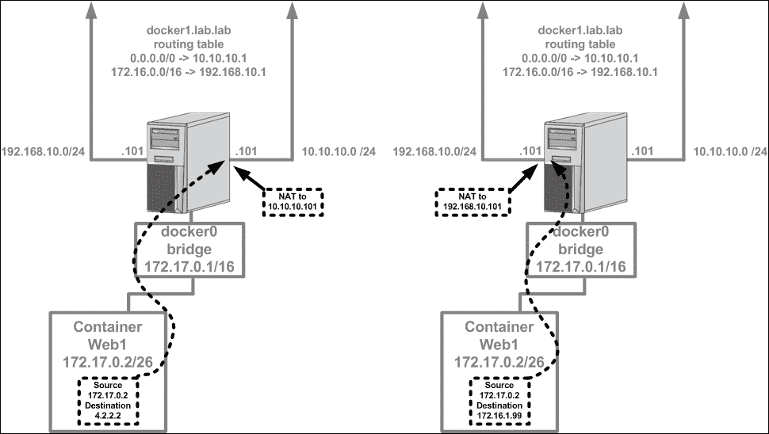
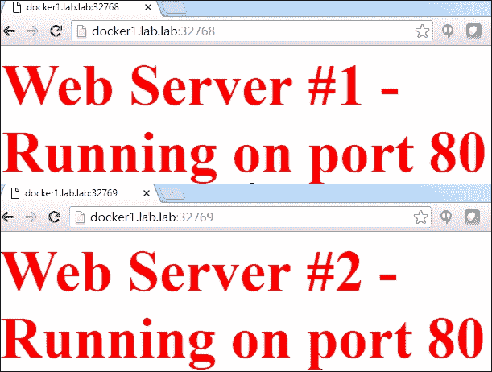
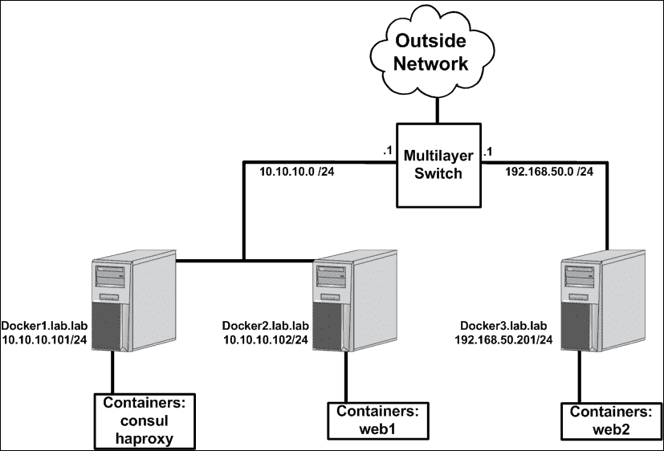
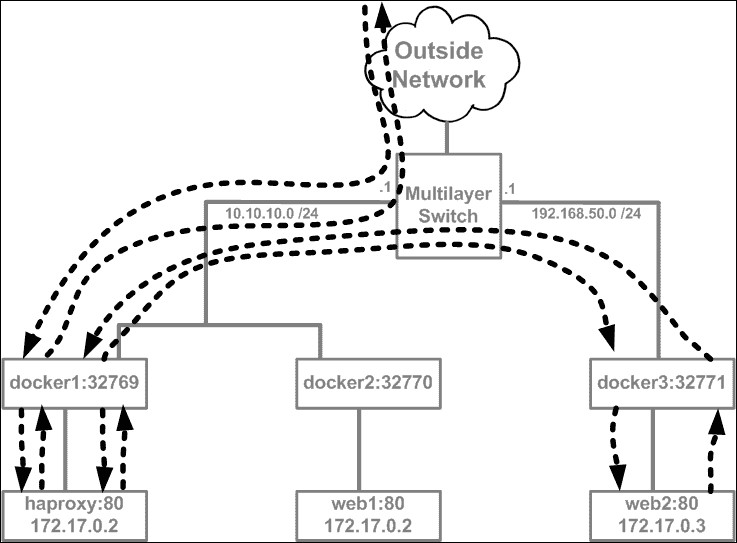
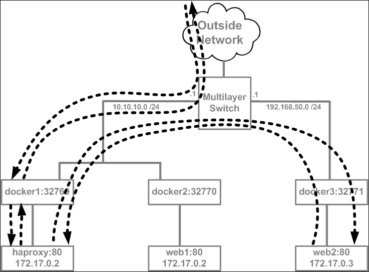

# 第六章。保护容器网络

在本章中，我们将涵盖以下示例：

+   启用和禁用 ICC

+   禁用出站伪装

+   管理 netfilter 到 Docker 集成

+   创建自定义 iptables 规则

+   通过负载均衡器公开服务

# 介绍

随着您转向基于容器的应用程序，您需要认真考虑的一项内容是网络安全。特别是容器可能导致需要保护的网络端点数量激增。当然，并非所有端点都完全暴露在网络中。然而，默认情况下，那些没有完全暴露的端点会直接相互通信，这可能会引起其他问题。在涉及基于容器的应用程序时，有许多方法可以解决网络安全问题，本章并不旨在解决所有可能的解决方案。相反，本章旨在审查配置选项和相关网络拓扑，这些选项可以根据您自己的网络安全要求以多种不同的方式组合。我们将详细讨论一些我们在早期章节中接触到的功能，如 ICC 模式和出站伪装。此外，我们将介绍一些不同的技术来限制容器的网络暴露。

# 启用和禁用 ICC

在早期章节中，我们接触到了 ICC 模式的概念，但对其工作机制并不了解。ICC 是 Docker 本地的一种方式，用于隔离连接到同一网络的所有容器。提供的隔离可以防止容器直接相互通信，同时允许它们的暴露端口被发布，并允许出站连接。在这个示例中，我们将审查在默认的`docker0`桥接上下文以及用户定义的网络中基于 ICC 的配置选项。

## 准备工作

在这个示例中，我们将使用两个 Docker 主机来演示 ICC 在不同网络配置中的工作方式。假设本实验室中使用的两个 Docker 主机都处于默认配置。在某些情况下，我们所做的更改可能需要您具有系统的根级访问权限。

## 操作方法…

ICC 模式可以在原生的`docker0`桥以及使用桥驱动的任何用户定义的网络上进行配置。在本教程中，我们将介绍如何在`docker0`桥上配置 ICC 模式。正如我们在前几章中看到的，与`docker0`桥相关的设置需要在服务级别进行。这是因为`docker0`桥是作为服务初始化的一部分创建的。这也意味着，要对其进行更改，我们需要编辑 Docker 服务配置，然后重新启动服务以使更改生效。在进行任何更改之前，让我们有机会审查默认的 ICC 配置。为此，让我们首先查看`docker0`桥的配置：

```
user@docker1:~$ docker network inspect bridge
[
    {
        "Name": "bridge",
        "Id": "d88fa0a96585792f98023881978abaa8c5d05e4e2bbd7b4b44a6e7b0ed7d346b",
        "Scope": "local",
        "Driver": "bridge",
        "EnableIPv6": false,
        "IPAM": {
            "Driver": "default",
            "Options": null,
            "Config": [
                {
                    "Subnet": "172.17.0.0/16",
                    "Gateway": "172.17.0.1"
                }
            ]
        },
        "Internal": false,
        "Containers": {},
        "Options": {
            "com.docker.network.bridge.default_bridge": "true",
            **"com.docker.network.bridge.enable_icc": "true",**
            "com.docker.network.bridge.enable_ip_masquerade": "true",
            "com.docker.network.bridge.host_binding_ipv4": "0.0.0.0",
            "com.docker.network.bridge.name": "docker0",
            "com.docker.network.driver.mtu": "1500"
        },
        "Labels": {}
    }
]
user@docker1:~$
```

### 注意

重要的是要记住，`docker network`子命令用于管理所有 Docker 网络。一个常见的误解是它只能用于管理用户定义的网络。

正如我们所看到的，`docker0`桥配置为 ICC 模式（`true`）。这意味着 Docker 不会干预或阻止连接到这个桥的容器直接相互通信。为了证明这一点，让我们启动两个容器：

```
user@docker1:~$ docker run -d --name=web1 jonlangemak/web_server_1
417dd2587dfe3e664b67a46a87f90714546bec9c4e35861476d5e4fa77e77e61
user@docker1:~$ docker run -d --name=web2 jonlangemak/web_server_2
a54db26074c00e6771d0676bb8093b1a22eb95a435049916becd425ea9587014
user@docker1:~$
```

请注意，我们没有指定`-P`标志，这告诉 Docker 不要发布任何容器暴露的端口。现在，让我们获取每个容器的 IP 地址，以便验证连接：

```
user@docker1:~$ docker exec **web1** ip addr show dev eth0 | grep inet
    inet **172.17.0.2/16** scope global eth0
    inet6 fe80::42:acff:fe11:2/64 scope link
 user@docker1:~$ docker exec **web2** ip addr show dev eth0 | grep inet
    inet **172.17.0.3/16** scope global eth0
    inet6 fe80::42:acff:fe11:3/64 scope link
user@docker1:~$
```

现在我们知道了 IP 地址，我们可以验证每个容器是否可以访问另一个容器在其上监听的任何服务：

```
user@docker1:~$ docker exec -it **web1** ping **172.17.0.3** -c 2
PING 172.17.0.3 (172.17.0.3): 48 data bytes
**56 bytes from 172.17.0.3: icmp_seq=0 ttl=64 time=0.198 ms**
**56 bytes from 172.17.0.3: icmp_seq=1 ttl=64 time=0.082 ms**
--- 172.17.0.3 ping statistics ---
2 packets transmitted, 2 packets received, 0% packet loss
round-trip min/avg/max/stddev = 0.082/0.140/0.198/0.058 ms
user@docker1:~$
user@docker1:~$ docker exec **web2** curl -s **http://172.17.0.2**
<body>
  <html>
    <h1><span style="color:#FF0000;font-size:72px;">**Web Server #1 - Running on port 80**</span>
    </h1>
</body>
  </html>
user@docker1:~$
```

根据这些测试，我们可以假设容器被允许在任何监听的协议上相互通信。这是启用 ICC 模式时的预期行为。现在，让我们更改服务级别设置并重新检查我们的配置。为此，在 Docker 服务的 systemd drop in 文件中设置以下配置：

```
ExecStart=/usr/bin/dockerd --icc=false
```

现在重新加载 systemd 配置，重新启动 Docker 服务，并检查 ICC 设置：

```
user@docker1:~$ sudo systemctl daemon-reload
user@docker1:~$ sudo systemctl restart docker
user@docker1:~$ docker network inspect bridge
…<Additional output removed for brevity>…
        "Options": {
            "com.docker.network.bridge.default_bridge": "true",
 **"com.docker.network.bridge.enable_icc": "false",**
            "com.docker.network.bridge.enable_ip_masquerade": "true",
            "com.docker.network.bridge.host_binding_ipv4": "0.0.0.0",
            "com.docker.network.bridge.name": "docker0",
            "com.docker.network.driver.mtu": "1500" 
…<Additional output removed for brevity>… 
user@docker1:~$
```

现在我们已经确认了 ICC 被禁用，让我们再次启动我们的两个容器并运行相同的连接性测试：

```
user@docker1:~$ docker start web1
web1
user@docker1:~$ docker start web2
web2
user@docker1:~$
user@docker1:~$ docker exec -it **web1** ping **172.17.0.3** -c 2
PING 172.17.0.3 (172.17.0.3): 48 data bytes
user@docker1:~$ docker exec -it **web2** curl -m 1 http://172.17.0.2
**curl: (28) connect() timed out!**
user@docker1:~$
```

如您所见，我们的两个容器之间没有连接。但是，Docker 主机本身仍然能够访问服务：

```
user@docker1:~$ curl **http://172.17.0.2**
<body>
  <html>
    <h1><span style="color:#FF0000;font-size:72px;">**Web Server #1 - Running on port 80**</span>
    </h1>
</body>
  </html>
user@docker1:~$ **curl http://172.17.0.3**
<body>
  <html>
    <h1><span style="color:#FF0000;font-size:72px;">**Web Server #2 - Running on port 80**</span>
    </h1>
</body>
  </html>
user@docker1:~$
```

我们可以检查用于实现 ICC 的 netfilter 规则，方法是查看过滤表的`iptables`规则`FORWARD`链：

```
user@docker1:~$ sudo iptables -S FORWARD
-P FORWARD ACCEPT
-A FORWARD -j DOCKER-ISOLATION
-A FORWARD -o docker0 -j DOCKER
-A FORWARD -o docker0 -m conntrack --ctstate RELATED,ESTABLISHED -j ACCEPT
-A FORWARD -i docker0 ! -o docker0 -j ACCEPT
**-A FORWARD -i docker0 -o docker0 -j DROP**
user@docker1:~$ 
```

前面加粗的规则是防止在`docker0`桥上进行容器之间通信的。如果在禁用 ICC 之前检查了这个`iptables`链，我们会看到这个规则设置为`ACCEPT`，如下所示：

```
user@docker1:~$ sudo iptables -S FORWARD
-P FORWARD ACCEPT
-A FORWARD -j DOCKER-ISOLATION
**-A FORWARD -i docker0 -o docker0 -j ACCEPT**
-A FORWARD -o docker0 -j DOCKER
-A FORWARD -o docker0 -m conntrack --ctstate RELATED,ESTABLISHED -j ACCEPT
-A FORWARD -i docker0 ! -o docker0 -j ACCEPT
user@docker1:~$
```

正如我们之前所看到的，链接容器允许您绕过这一规则，允许源容器访问目标容器。如果我们移除这两个容器，我们可以通过以下方式重新启动它们：

```
user@docker1:~$ **docker run -d --name=web1 jonlangemak/web_server_1**
9846614b3bac6a2255e135d19f20162022a40d95bd62a0264ef4aaa89e24592f
user@docker1:~$ **docker run -d --name=web2 --link=web1 jonlangemak/web_server_2**
b343b570189a0445215ad5406e9a2746975da39a1f1d47beba4d20f14d687d83
user@docker1:~$
```

现在，如果我们用`iptables`检查规则，我们可以看到两个新规则添加到了过滤表中：

```
user@docker1:~$ sudo iptables -S
-P INPUT ACCEPT
-P FORWARD ACCEPT
-P OUTPUT ACCEPT
-N DOCKER
-N DOCKER-ISOLATION
-A FORWARD -j DOCKER-ISOLATION
-A FORWARD -o docker0 -j DOCKER
-A FORWARD -o docker0 -m conntrack --ctstate RELATED,ESTABLISHED -j ACCEPT
-A FORWARD -i docker0 ! -o docker0 -j ACCEPT
-A FORWARD -i docker0 -o docker0 -j DROP
**-A DOCKER -s 172.17.0.3/32 -d 172.17.0.2/32 -i docker0 -o docker0 -p tcp -m tcp --dport 80 -j ACCEPT**
**-A DOCKER -s 172.17.0.2/32 -d 172.17.0.3/32 -i docker0 -o docker0 -p tcp -m tcp --sport 80 -j ACCEPT**
-A DOCKER-ISOLATION -j RETURN
user@docker1:~$ 
```

这两个新规则允许`web2`访问`web1`的任何暴露端口。请注意，第一个规则定义了从`web2`(`172.17.0.3`)到`web1`(`172.17.0.2`)的访问，目的端口为`80`。第二个规则翻转了 IP，并指定端口`80`作为源端口，允许流量返回到`web2`。

### 注意

早些时候，当我们讨论用户定义的网络时，您看到我们可以将 ICC 标志传递给用户定义的桥接。然而，目前不支持使用覆盖驱动程序禁用 ICC 模式。

# 禁用出站伪装

默认情况下，容器允许通过伪装或隐藏其真实 IP 地址在 Docker 主机的 IP 地址后访问外部网络。这是通过 netfilter `masquerade`规则实现的，这些规则将容器流量隐藏在下一跳中引用的 Docker 主机接口后面。当我们讨论跨主机的容器之间的连接时，我们在第二章*配置和监控 Docker 网络*中看到了这方面的详细示例。虽然这种类型的配置在许多方面都是理想的，但在某些情况下，您可能更喜欢禁用出站伪装功能。例如，如果您不希望容器完全具有出站连接性，禁用伪装将阻止容器与外部网络通信。然而，这只是由于缺乏返回路由而阻止了出站流量。更好的选择可能是将容器视为任何其他单独的网络端点，并使用现有的安全设备来定义网络策略。在本教程中，我们将讨论如何禁用 IP 伪装以及如何在容器在外部网络中进行遍历时提供唯一的 IP 地址。

## 准备工作

在本示例中，我们将使用单个 Docker 主机。假设在此实验中使用的 Docker 主机处于其默认配置中。您还需要访问更改 Docker 服务级别设置。在某些情况下，我们所做的更改可能需要您具有系统的根级访问权限。我们还将对 Docker 主机连接的网络设备进行更改。

## 如何做…

您会记得，Docker 中的 IP 伪装是通过 netfilter `masquerade`规则处理的。在其默认配置中的 Docker 主机上，我们可以通过使用`iptables`检查规则集来看到这个规则：

```
user@docker1:~$ sudo iptables -t nat -S
-P PREROUTING ACCEPT
-P INPUT ACCEPT
-P OUTPUT ACCEPT
-P POSTROUTING ACCEPT
-N DOCKER
-A PREROUTING -m addrtype --dst-type LOCAL -j DOCKER
-A OUTPUT ! -d 127.0.0.0/8 -m addrtype --dst-type LOCAL -j DOCKER
**-A POSTROUTING -s 172.17.0.0/16 ! -o docker0 -j MASQUERADE**
-A DOCKER -i docker0 -j RETURN
user@docker1:~$
```

此规则指定流量的来源为`docker0`网桥子网，只有 NAT 流量可以离开主机。`MASQUERADE`目标告诉主机对 Docker 主机的下一跳接口的流量进行源 NAT。也就是说，如果主机有多个 IP 接口，容器的流量将源 NAT 到下一跳使用的任何接口。这意味着根据 Docker 主机接口和路由表配置，容器流量可能潜在地隐藏在不同的 IP 地址后面。例如，考虑一个具有两个接口的 Docker 主机，如下图所示：



在左侧示例中，流量正在采用默认路由，因为`4.2.2.2`的目的地在主机的路由表中没有更具体的前缀。在这种情况下，主机执行源 NAT，并在流经 Docker 主机到外部网络时将流量的源从`172.17.0.2`更改为`10.10.10.101`。但是，如果目的地落入`172.17.0.0/16`，容器流量将被隐藏在右侧示例中所示的`192.168.10.101`接口后面。

Docker 的默认行为可以通过操纵`--ip-masq` Docker 选项来更改。默认情况下，该选项被认为是`true`，可以通过指定该选项并将其设置为`false`来覆盖。我们可以通过在 Docker systemd drop in 文件中指定该选项来实现这一点：

```
ExecStart=/usr/bin/dockerd --ip-masq=false
```

现在重新加载 systemd 配置，重新启动 Docker 服务，并检查 ICC 设置：

```
user@docker1:~$ sudo systemctl daemon-reload
user@docker1:~$ sudo systemctl restart docker
user@docker1:~$
user@docker1:~$ sudo iptables -t nat -S
-P PREROUTING ACCEPT
-P INPUT ACCEPT
-P OUTPUT ACCEPT
-P POSTROUTING ACCEPT
-N DOCKER
-A PREROUTING -m addrtype --dst-type LOCAL -j DOCKER
-A OUTPUT ! -d 127.0.0.0/8 -m addrtype --dst-type LOCAL -j DOCKERuser@docker1:~$
```

注意，`masquerade`规则现在已经消失。在此主机上生成的容器流量将尝试通过其实际源 IP 地址路由到 Docker 主机外部。在 Docker 主机上进行`tcpdump`将捕获此流量通过原始容器 IP 地址退出主机的`eth0`接口：

```
user@docker1:~$ sudo tcpdump –n -i **eth0** dst 4.2.2.2
tcpdump: verbose output suppressed, use -v or -vv for full protocol decode
listening on eth0, link-type EN10MB (Ethernet), capture size 65535 bytes
09:06:10.243523 IP **172.17.0.2 > 4.2.2.2**: ICMP echo request, id 3072, seq 0, length 56
09:06:11.244572 IP **172.17.0.2 > 4.2.2.2**: ICMP echo request, id 3072, seq 256, length 56
```

由于外部网络不知道`172.17.0.0/16`在哪里，这个请求将永远不会收到响应，有效地阻止了容器与外部世界的通信。

虽然这可能是阻止与外部世界通信的一种有用手段，但并不完全理想。首先，您仍然允许流量出去；响应只是不知道要返回到哪里，因为它试图返回到源。此外，您影响了 Docker 主机上所有网络的所有容器。如果`docker0`桥接分配了一个可路由的子网，并且外部网络知道该子网的位置，您可以使用现有的安全工具来制定安全策略决策。

例如，假设`docker0`桥接被分配了一个子网`172.10.10.0/24`，并且我们禁用了 IP 伪装。我们可以通过更改 Docker 选项来指定新的桥接 IP 地址来实现这一点：

```
ExecStart=/usr/bin/dockerd --ip-masq=false **--bip=172.10.10.1/24**

```

与以前一样，离开容器并前往外部网络的流量在穿过 Docker 主机时不会改变。假设一个小的网络拓扑，如下图所示：


假设从容器到`4.2.2.2`的流量。在这种情况下，出口流量应该天然工作：

+   容器生成流量到`4.2.2.2`，并使用它的默认网关，即`docker0`桥接 IP 地址

+   Docker 主机进行路由查找，未能找到特定的前缀匹配，并将流量转发到其默认网关，即交换机。

+   交换机进行路由查找，未能找到特定的前缀匹配，并将流量转发到其默认路由，即防火墙。

+   防火墙进行路由查找，未能找到特定的前缀匹配，确保流量在策略中被允许，执行隐藏 NAT 到公共 IP 地址，并将流量转发到其默认路由，即互联网。

因此，没有任何额外的配置，出口流量应该能够到达目的地。问题在于返回流量。当来自互联网目的地的响应返回到防火墙时，它将尝试确定如何返回到源。这个路由查找可能会失败，导致防火墙丢弃流量。

### 注意

在某些情况下，边缘网络设备（在本例中是防火墙）将所有私有 IP 地址路由回内部（在本例中是交换机）。在这种情况下，防火墙可能会将返回流量转发到交换机，但交换机没有特定的返回路由，导致了同样的问题。

为了使其工作，防火墙和交换机需要知道如何将流量返回到特定的容器。为此，我们需要在每个设备上添加特定的路由，将`docker0`桥接子网指向`docker1`主机：


一旦这些路由设置好，在 Docker 主机上启动的容器应该能够连接到外部网络：

```
user@docker1:~$ docker run -it --name=web1 jonlangemak/web_server_1 /bin/bash
root@132530812e1f:/# **ping 4.2.2.2**
**PING 4.2.2.2 (4.2.2.2): 48 data bytes**
**56 bytes from 4.2.2.2: icmp_seq=0 ttl=50 time=33.805 ms**
**56 bytes from 4.2.2.2: icmp_seq=1 ttl=50 time=40.431 ms**

```

在 Docker 主机上进行`tcpdump`将显示流量以原始容器 IP 地址离开：

```
user@docker1:~$ sudo tcpdump –n **-i eth0 dst 4.2.2.2**
tcpdump: verbose output suppressed, use -v or -vv for full protocol decode
listening on eth0, link-type EN10MB (Ethernet), capture size 65535 bytes
10:54:42.197828 IP **172.10.10.2 > 4.2.2.2**: ICMP echo request, id 3328, seq 0, length 56
10:54:43.198882 IP **172.10.10.2 > 4.2.2.2**: ICMP echo request, id 3328, seq 256, length 56
```

这种类型的配置提供了使用现有安全设备来决定容器是否可以访问外部网络资源的能力。但是，这也取决于安全设备与您的 Docker 主机的距离。例如，在这种配置中，Docker 主机上的容器可以访问连接到交换机的任何其他网络端点。执行点（在本例中是防火墙）只允许您限制容器与互联网的连接。此外，为每个 Docker 主机分配可路由的 IP 空间可能会引入 IP 分配约束，特别是在大规模情况下。

# 管理 netfilter 到 Docker 的集成

默认情况下，Docker 会为您执行大部分 netfilter 配置。它会处理诸如发布端口和出站伪装之类的事情，并允许您阻止或允许 ICC。但是，这都是可选的，您可以告诉 Docker 不要修改或添加任何现有的`iptables`规则。如果这样做，您将需要生成自己的规则来提供类似的功能。如果您已经广泛使用`iptables`规则，并且不希望 Docker 自动更改您的配置，这可能会对您有吸引力。在本教程中，我们将讨论如何禁用 Docker 自动生成`iptables`规则，并向您展示如何手动创建类似的规则。

## 准备工作

在本示例中，我们将使用单个 Docker 主机。假设在本实验中使用的 Docker 主机处于其默认配置中。您还需要访问更改 Docker 服务级别的设置。在某些情况下，我们所做的更改可能需要您具有系统的根级访问权限。

## 如何做…

正如我们已经看到的，当涉及到网络配置时，Docker 会为您处理很多繁重的工作。它还允许您在需要时自行配置这些内容。在我们自己尝试配置之前，让我们确认一下 Docker 实际上在我们的`iptables`规则方面为我们配置了什么。让我们运行以下容器：

```
user@docker1:~$ docker run -dP --name=web1 jonlangemak/web_server_1
f5b7b389890398588c55754a09aa401087604a8aa98dbf55d84915c6125d5e62
user@docker1:~$ docker run -dP --name=web2 jonlangemak/web_server_2
e1c866892e7f3f25dee8e6ba89ec526fa3caf6200cdfc705ce47917f12095470
user@docker1:~$
```

运行这些容器将产生以下拓扑结构：


### 注意

稍后给出的示例将不直接使用主机的`eth1`接口。它只是用来说明 Docker 生成的规则是以涵盖 Docker 主机上的所有物理接口的方式编写的。

正如我们之前提到的，Docker 使用`iptables`来处理以下项目：

+   出站容器连接（伪装）

+   入站端口发布

+   容器之间的连接

由于我们使用的是默认配置，并且我们已经在两个容器上发布了端口，我们应该能够在`iptables`中看到这三个项目的配置。让我们首先查看 NAT 表：

### 注意

在大多数情况下，我更喜欢打印规则并解释它们，而不是将它们列在格式化的列中。每种方法都有权衡，但如果您喜欢列表模式，您可以用`-vL`替换`-S`。

```
user@docker1:~$ sudo iptables -t nat -S
-P PREROUTING ACCEPT
-P INPUT ACCEPT
-P OUTPUT ACCEPT
-P POSTROUTING ACCEPT
-N DOCKER
-A PREROUTING -m addrtype --dst-type LOCAL -j DOCKER
-A OUTPUT ! -d 127.0.0.0/8 -m addrtype --dst-type LOCAL -j DOCKER
**-A POSTROUTING -s 172.17.0.0/16 ! -o docker0 -j MASQUERADE**
-A POSTROUTING -s 172.17.0.2/32 -d 172.17.0.2/32 -p tcp -m tcp --dport 80 -j MASQUERADE
-A POSTROUTING -s 172.17.0.3/32 -d 172.17.0.3/32 -p tcp -m tcp --dport 80 -j MASQUERADE
-A DOCKER -i docker0 -j RETURN
**-A DOCKER ! -i docker0 -p tcp -m tcp --dport 32768 -j DNAT --to-destination 172.17.0.2:80**
**-A DOCKER ! -i docker0 -p tcp -m tcp --dport 32769 -j DNAT --to-destination 172.17.0.3:80**
user@docker1:~$
```

让我们回顾一下前面输出中每个加粗行的重要性。第一个加粗行处理了出站隐藏 NAT 或`MASQUERADE`：

```
-A POSTROUTING -s 172.17.0.0/16 ! -o docker0 -j MASQUERADE
```

该规则正在寻找符合两个特征的流量：

+   源 IP 地址必须匹配`docker0`桥的 IP 地址空间

+   该流量不是通过`docker0`桥出口的。也就是说，它是通过其他接口如`eth0`或`eth1`离开的

结尾处的跳转语句指定了`MASQUERADE`的目标，它将根据路由表将容器流量源 NAT 到主机的 IP 接口之一。

接下来的两行加粗的内容提供了类似的功能，并为每个容器提供了所需的 NAT。让我们来看其中一个：

```
-A DOCKER ! -i docker0 -p tcp -m tcp --dport 32768 -j DNAT --to-destination 172.17.0.2:80
```

该规则正在寻找符合三个特征的流量：

+   流量不是通过`docker0`桥接进入的

+   流量是 TCP

+   流量的目的端口是`32768`

最后的跳转语句指定了`DNAT`的目标和容器的真实服务端口（`80`）的目的地。请注意，这两条规则在 Docker 主机的物理接口方面是通用的。正如我们之前看到的，主机上的任何接口都可以进行端口发布和出站伪装，除非我们“明确限制范围。

我们要审查的下一个表是过滤表：

```
user@docker1:~$ sudo iptables -t filter -S
-P INPUT ACCEPT
-P FORWARD ACCEPT
-P OUTPUT ACCEPT
-N DOCKER
-N DOCKER-ISOLATION
-A FORWARD -j DOCKER-ISOLATION
-A FORWARD -o docker0 -j DOCKER
**-A FORWARD -o docker0 -m conntrack --ctstate RELATED,ESTABLISHED -j ACCEPT**
**-A FORWARD -i docker0 ! -o docker0 -j ACCEPT**
**-A FORWARD -i docker0 -o docker0 -j ACCEPT**
**-A DOCKER -d 172.17.0.2/32 ! -i docker0 -o docker0 -p tcp -m tcp --dport 80 -j ACCEPT**
**-A DOCKER -d 172.17.0.3/32 ! -i docker0 -o docker0 -p tcp -m tcp --dport 80 -j ACCEPT**
-A DOCKER-ISOLATION -j RETURN
user@docker1:~$
```

同样，您会注意到默认链的链策略设置为`ACCEPT`。在过滤表的情况下，这对功能有更严重的影响。这意味着除非在规则中明确拒绝，否则一切都被允许。换句话说，如果没有定义规则，一切仍然可以工作。Docker 在默认策略未设置为`ACCEPT`的情况下插入这些规则。稍后，当我们手动创建规则时，我们将把默认策略设置为`DROP`，以便您可以看到规则的影响。前面的规则需要更多的解释，特别是如果您不熟悉`iptables`规则的工作原理。让我们逐一审查加粗的线。

第一行加粗的线负责允许来自外部网络的流量返回到容器中。在这种情况下，规则是特定于容器本身生成流量并期望来自外部网络的响应的实例：

```
-A FORWARD -o docker0 -m conntrack --ctstate RELATED,ESTABLISHED -j ACCEPT
```

该规则正在寻找符合两个特征的流量：

+   流量是通过`docker0`桥接离开的

+   流量具有`RELATED`或`ESTABLISHED`的连接状态。这将包括作为现有流或与之相关的会话

最后的跳转语句引用了`ACCEPT`的目标，这将允许流量通过。

第二行加粗的线允许容器与外部网络的连接：

```
-A FORWARD -i docker0 ! -o docker0 -j ACCEPT
```

该规则正在寻找符合两个特征的流量：

+   流量是通过`docker0`桥接进入的

+   流量不是通过`docker0`桥接离开的

这是一种非常通用的方式来识别来自容器并且通过`docker0`桥接以外的任何其他接口离开的流量。最后的跳转语句引用了`ACCEPT`的目标，这将允许流量通过。与第一条规则结合起来，将允许从容器生成的流向外部网络的流量工作。

加粗的第三行允许容器间的连接：

```
-A FORWARD -i docker0 -o docker0 -j ACCEPT
```

该规则正在寻找符合两个特征的流量：

+   流量是通过`docker0`桥进入的

+   流量通过`docker0`桥出口

这是另一种通用的方法来识别源自`docker0`桥上容器的流量，以及目标是`docker0`桥上的流量。结尾处的跳转语句引用了一个`ACCEPT`目标，这将允许流量通过。这与我们在早期章节中看到的在禁用 ICC 模式时转换为`DROP`目标的规则相同。

最后两行加粗的允许发布的端口到达容器。让我们检查其中一行：

```
-A DOCKER -d 172.17.0.2/32 ! -i docker0 -o docker0 -p tcp -m tcp --dport 80 -j ACCEPT
```

该规则正在寻找符合五个特征的流量：

+   流量是发送到已发布端口的容器

+   流量不是通过`docker0`桥进入的

+   流量通过`docker0`桥出口

+   协议是 TCP

+   端口号是`80`

这个规则特别允许发布的端口工作，通过允许访问容器的服务端口（`80`）。结尾处的跳转语句引用了一个`ACCEPT`目标，这将允许流量通过。

### 手动创建所需的 iptables 规则

现在我们已经看到 Docker 如何自动处理规则生成，让我们通过一个示例来了解如何自己建立这种连接。为此，我们首先需要指示 Docker 不创建任何`iptables`规则。为此，在 Docker systemd drop in 文件中将`--iptables` Docker 选项设置为`false`：

```
ExecStart=/usr/bin/dockerd --iptables=false
```

我们需要重新加载 systemd drop in 文件并重新启动 Docker 服务，以便 Docker 重新读取服务参数。为了确保从空白状态开始，如果可能的话，重新启动服务器或手动清除所有`iptables`规则（如果您不熟悉管理`iptables`规则，最好的方法就是重新启动服务器以清除它们）。在接下来的示例中，我们假设我们正在使用空规则集。一旦 Docker 重新启动，您可以重新启动两个容器，并确保系统上没有`iptables`规则存在：

```
user@docker1:~$ docker start web1
web1
user@docker1:~$ docker start web2
web2
user@docker1:~$ sudo iptables -S
-P INPUT **ACCEPT**
-P FORWARD **ACCEPT**
-P OUTPUT **ACCEPT**
user@docker1:~$
```

如您所见，当前没有定义`iptables`规则。我们还可以看到过滤表中默认链策略设置为`ACCEPT`。现在让我们将过滤表中的默认策略更改为每个链的`DROP`。除此之外，让我们还包括一条规则，允许 SSH 进出主机，以免破坏我们的连接：

```
user@docker1:~$ sudo iptables -A INPUT -i eth0 -p tcp --dport 22 \
-m state --state NEW,ESTABLISHED -j ACCEPT
user@docker1:~$ sudo iptables -A OUTPUT -o eth0 -p tcp --sport 22 \
-m state --state ESTABLISHED -j ACCEPT
user@docker1:~$ sudo iptables -P INPUT DROP
user@docker1:~$ sudo iptables -P FORWARD DROP
user@docker1:~$ sudo iptables -P OUTPUT DROP
```

现在让我们再次检查过滤表，以确保规则已被接受：

```
user@docker1:~$ sudo iptables -S
-P INPUT **DROP**
-P FORWARD **DROP**
-P OUTPUT **DROP**
-A INPUT -i eth0 -p tcp -m tcp --dport 22 -m state --state NEW,ESTABLISHED -j ACCEPT
-A OUTPUT -o eth0 -p tcp -m tcp --sport 22 -m state --state ESTABLISHED -j ACCEPT
user@docker1:~$
```

此时，容器`web1`和`web2`将不再能够相互到达：

```
user@docker1:~$ docker exec -it web1 ping 172.17.0.3 -c 2
PING 172.17.0.3 (172.17.0.3): 48 data bytes
user@docker1:~$
```

### 注意

根据您的操作系统，您可能会注意到此时`web1`实际上能够 ping 通`web2`。最有可能的原因是`br_netfilter`内核模块尚未加载。没有这个模块，桥接的数据包将不会被 netfilter 检查。要解决这个问题，您可以使用`sudo modprobe br_netfilter`命令手动加载模块。要使模块在每次启动时加载，您还可以将其添加到`/etc/modules`文件中。当 Docker 管理`iptables`规则集时，它会负责为您加载模块。

现在，让我们开始构建规则集，以重新创建 Docker 自动为我们构建的连接。我们要做的第一件事是允许容器的入站和出站访问。我们将使用以下两条规则来实现：

```
user@docker1:~$ sudo iptables -A FORWARD -i docker0 ! \
-o docker0 -j ACCEPT
user@docker1:~$ sudo iptables -A FORWARD -o docker0 \
-m conntrack --ctstate RELATED,ESTABLISHED -j ACCEPT
```

尽管这两条规则将允许容器从外部网络生成和接收流量，但此时连接仍然无法工作。为了使其工作，我们需要应用`masquerade`规则，以便容器流量将被隐藏在`docker0`主机的接口后面。如果我们不这样做，流量将永远不会返回，因为外部网络对容器所在的`172.17.0.0/16`网络一无所知：

```
user@docker1:~$ sudo iptables -t nat -A POSTROUTING \
-s 172.17.0.0/16 ! -o docker0 -j MASQUERADE
```

有了这个设置，容器现在将能够到达外部网络的网络端点：

```
user@docker1:~$ docker exec -it **web1** ping **4.2.2.2** -c 2
PING 4.2.2.2 (4.2.2.2): 48 data bytes
**56 bytes from 4.2.2.2: icmp_seq=0 ttl=50 time=36.261 ms**
**56 bytes from 4.2.2.2: icmp_seq=1 ttl=50 time=55.271 ms**
--- 4.2.2.2 ping statistics ---
2 packets transmitted, 2 packets received, 0% packet loss
round-trip min/avg/max/stddev = 36.261/45.766/55.271/9.505 ms
user@docker1:~$
```

然而，容器仍然无法直接相互通信：

```
user@docker1:~$ docker exec -it web1 ping 172.17.0.3 -c 2
PING 172.17.0.3 (172.17.0.3): 48 data bytes
user@docker1:~$ docker exec -it web1 curl -S http://172.17.0.3
user@docker1:~$
```

我们需要添加最后一条规则：

```
sudo iptables -A FORWARD -i docker0 -o docker0 -j ACCEPT
```

由于容器之间的流量既进入又离开`docker0`桥，这将允许容器之间的互联：

```
user@docker1:~$ docker exec -it **web1** ping **172.17.0.3** -c 2
PING 172.17.0.3 (172.17.0.3): 48 data bytes
**56 bytes from 172.17.0.3: icmp_seq=0 ttl=64 time=0.092 ms**
**56 bytes from 172.17.0.3: icmp_seq=1 ttl=64 time=0.086 ms**
--- 172.17.0.3 ping statistics ---
2 packets transmitted, 2 packets received, 0% packet loss
round-trip min/avg/max/stddev = 0.086/0.089/0.092/0.000 ms
user@docker1:~$
user@docker1:~$ docker exec -it **web1** curl **http://172.17.0.3**
<body>
  <html>
    <h1><span style="color:#FF0000;font-size:72px;">**Web Server #2 - Running on port 80**</span>
    </h1>
</body>
  </html>
user@docker1:~$
```

唯一剩下的配置是提供一个发布端口的机制。我们可以首先在 Docker 主机上配置目标 NAT 来实现这一点。即使 Docker 没有配置 NAT 规则，它仍然会代表你跟踪端口分配。在容器运行时，如果你选择发布一个端口，Docker 会为你分配一个端口映射，即使它不处理发布。明智的做法是使用 Docker 分配的端口以防止重叠：

```
user@docker1:~$ docker port web1
80/tcp -> 0.0.0.0:**32768**
user@docker1:~$ docker port web2
80/tcp -> 0.0.0.0:**32769**
user@docker1:~$
user@docker1:~$ sudo iptables -t nat -A PREROUTING ! -i docker0 \
-p tcp -m tcp --dport **32768** -j DNAT --to-destination **172.17.0.2:80**
user@docker1:~$ sudo iptables -t nat -A PREROUTING ! -i docker0 \
-p tcp -m tcp --dport **32769** -j DNAT --to-destination **172.17.0.3:80**
user@docker1:~$
```

使用 Docker 分配的端口，我们可以为每个容器定义一个入站 NAT 规则，将入站连接转换为 Docker 主机上的外部端口到真实的容器 IP 和服务端口。最后，我们只需要允许入站流量：

```
user@docker1:~$ sudo iptables -A FORWARD -d **172.17.0.2/32** ! -i docker0 -o docker0 -p tcp -m tcp --dport **80** -j ACCEPT
user@docker1:~$ sudo iptables -A FORWARD -d **172.17.0.3/32** ! -i docker0 -o docker0 -p tcp -m tcp --dport **80** -j ACCEPT
```

一旦这些规则配置好了，我们现在可以测试来自 Docker 主机外部的已发布端口的连接：



# 创建自定义 iptables 规则

在前面的配方中，我们介绍了 Docker 如何处理最常见的容器网络需求的`iptables`规则。然而，可能会有一些情况，您希望扩展默认的`iptables`配置，以允许更多的访问或限制连接的范围。在这个配方中，我们将演示如何实现自定义的`iptables`规则的一些示例。我们将重点放在限制连接到运行在您的容器上的服务的源的范围，以及允许 Docker 主机本身连接到这些服务。

### 注意

后面提供的示例旨在演示您配置`iptables`规则集的选项。它们在这些示例中的实现方式可能或可能不适合您的环境，并且可以根据您的安全需求以不同的方式和位置部署。

## 准备就绪

我们将使用与前一个配方相同的 Docker 主机和相同的配置。Docker 服务应该配置为使用`--iptables=false`服务选项，并且应该定义两个容器——`web1`和`web2`。如果您不确定如何达到这种状态，请参阅前一个配方。为了定义一个新的`iptables`策略，我们还需要清除 NAT 和 FILTER 表中的所有现有`iptables`规则。这样做的最简单方法是重新启动主机。

### 注意

当默认策略为拒绝时刷新`iptables`规则将断开任何远程管理会话。如果您没有控制台访问权限，要小心不要意外断开自己！

如果您不想重新启动，可以将默认的过滤策略更改回`allow`。然后，按照以下步骤刷新过滤和 NAT 表：

```
sudo iptables -P INPUT ACCEPT
sudo iptables -P FORWARD ACCEPT
sudo iptables -P OUTPUT ACCEPT
sudo iptables -t filter -F
sudo iptables -t nat -F
```

## 怎么做...

此时，您应该再次拥有两个运行的容器和一个空的默认`iptables`策略的 Docker 主机。首先，让我们再次将默认的过滤策略更改为`deny`，同时确保我们仍然允许通过 SSH 进行管理连接：

```
user@docker1:~$ sudo iptables -A INPUT -i eth0 -p tcp --dport 22 \
-m state --state NEW,ESTABLISHED -j ACCEPT
user@docker1:~$ sudo iptables -A OUTPUT -o eth0 -p tcp --sport 22 \
-m state --state ESTABLISHED -j ACCEPT
user@docker1:~$ sudo iptables -P INPUT DROP
user@docker1:~$ sudo iptables -P FORWARD DROP
user@docker1:~$ sudo iptables -P OUTPUT DROP
```

因为我们将专注于过滤表周围的策略，让我们将 NAT 策略放在上一篇配方中未更改的状态下。这些 NAT 覆盖了每个容器中服务的出站伪装和入站伪装：

```
user@docker1:~$ sudo iptables -t nat -A POSTROUTING -s \
172.17.0.0/16 ! -o docker0 -j MASQUERADE
user@docker1:~$ sudo iptables -t nat -A PREROUTING ! -i docker0 \
-p tcp -m tcp --dport 32768 -j DNAT --to-destination 172.17.0.2:80
user@docker1:~$ sudo iptables -t nat -A PREROUTING ! -i docker0 \
-p tcp -m tcp --dport 32769 -j DNAT --to-destination 172.17.0.3:80
```

您可能有兴趣配置的项目之一是限制容器在外部网络上可以访问的范围。您会注意到，在以前的示例中，容器被允许与外部任何东西通信。这是因为过滤规则相当通用：

```
sudo iptables -A FORWARD -i docker0 ! -o docker0 -j ACCEPT
```

此规则允许容器与除`docker0`之外的任何接口上的任何东西通信。与其允许这样做，我们可以指定我们想要允许出站的端口。因此，例如，如果我们发布端口`80`，然后我们可以定义一个反向或出站规则，只允许特定的返回流量。让我们首先重新创建我们在上一个示例中使用的入站规则：

```
user@docker1:~$ sudo iptables -A FORWARD -d 172.17.0.2/32 \
! -i docker0 -o docker0 -p tcp -m tcp --dport 80 -j ACCEPT
user@docker1:~$ sudo iptables -A FORWARD -d 172.17.0.3/32 \
! -i docker0 -o docker0 -p tcp -m tcp --dport 80 -j ACCEPT
```

现在我们可以轻松地用特定规则替换更通用的出站规则，只允许端口`80`上的返回流量。例如，让我们放入一个规则，允许容器`web1`只在端口`80`上返回流量：

```
user@docker1:~$ sudo iptables -A FORWARD -s 172.17.0.2/32 -i \
docker0 ! -o docker0 -p tcp -m tcp --sport 80 -j ACCEPT
```

如果我们检查一下，我们应该能够从外部网络访问`web1`上的服务：


然而，此时容器`web1`除了在端口`80`上无法与外部网络上的任何东西通信，因为我们没有使用通用的出站规则：

```
user@docker1:~$ docker exec -it web1 ping 4.2.2.2 -c 2
PING 4.2.2.2 (4.2.2.2): 48 data bytes
user@docker1:~$
```

为了解决这个问题，我们可以添加特定的规则，允许来自`web1`容器的 ICMP 之类的东西：

```
user@docker1:~$ sudo iptables -A FORWARD -s 172.17.0.2/32 -i \
docker0 ! -o docker0 -p icmp -j ACCEPT
```

上述规则与前一篇配方中的状态感知返回规则相结合，将允许 web1 容器发起和接收返回的 ICMP 流量。

```
user@docker1:~$ sudo iptables -A FORWARD -o docker0 -m conntrack \
--ctstate RELATED,ESTABLISHED -j ACCEPT
```

```
user@docker1:~$ docker exec -it **web1 ping 4.2.2.2** -c 2
PING 4.2.2.2 (4.2.2.2): 48 data bytes
**56 bytes from 4.2.2.2: icmp_seq=0 ttl=50 time=33.892 ms**
**56 bytes from 4.2.2.2: icmp_seq=1 ttl=50 time=34.326 ms**
--- 4.2.2.2 ping statistics ---
2 packets transmitted, 2 packets received, 0% packet loss
round-trip min/avg/max/stddev = 33.892/34.109/34.326/0.217 ms
user@docker1:~$
```

在`web2`容器的情况下，其 Web 服务器仍然无法从外部网络访问。如果我们希望限制可以与 Web 服务器通信的流量源，我们可以通过更改入站端口`80`规则或指定出站端口`80`规则中的目的地来实现。例如，我们可以通过在出口规则中指定目标来将流量源限制为外部网络上的单个设备：

```
user@docker1:~$ sudo iptables -A FORWARD -s 172.17.0.3/32 **-d \**
**10.20.30.13** -i docker0 ! -o docker0 -p tcp -m tcp --sport 80 \
-j ACCEPT
```

现在，如果我们尝试使用外部网络上 IP 地址为`10.20.30.13`的实验室设备，我们应该能够访问 Web 服务器：

```
[user@lab1 ~]# ip addr show dev eth0 | grep inet
    inet **10.20.30.13/24** brd 10.20.30.255 scope global eth0
 [user@lab2 ~]# **curl http://docker1.lab.lab:32769**
<body>
  <html>
    <h1><span style="color:#FF0000;font-size:72px;">**Web Server #2 - Running on port 80**</span>
    </h1>
</body>
  </html>
[user@lab1 ~]#
```

但是，如果我们尝试使用具有不同 IP 地址的不同实验室服务器，连接将失败：

```
[user@lab2 ~]# ip addr show dev eth0 | grep inet
    inet **10.20.30.14/24** brd 10.20.30.255 scope global eth0
[user@lab2 ~]# **curl http://docker1.lab.lab:32769**
[user@lab2 ~]#
```

同样，这条规则可以作为入站规则或出站规则实现。

以这种方式管理`iptables`规则时，您可能已经注意到 Docker 主机本身不再能够与容器及其托管的服务进行通信：

```
user@docker1:~$ ping 172.17.0.2 -c 2
PING 172.17.0.2 (172.17.0.2) 56(84) bytes of data.
**ping: sendmsg: Operation not permitted**
**ping: sendmsg: Operation not permitted**
--- 172.17.0.2 ping statistics ---
2 packets transmitted, 0 received, 100% packet loss, time 999ms
user@docker1:~$
```

这是因为我们一直在过滤表中编写的所有规则都在转发链中。转发链仅适用于主机正在转发的流量，而不适用于源自主机或目的地为主机本身的流量。为了解决这个问题，我们可以在过滤表的`INPUT`和`OUTPUT`链中放置规则。为了允许容器之间的 ICMP 流量，我们可以指定以下规则：

```
user@docker1:~$ sudo iptables -A OUTPUT -o docker0 -p icmp -m \
state --state NEW,ESTABLISHED -j ACCEPT
user@docker1:~$ sudo iptables -A INPUT -i docker0 -p icmp -m \
state --state ESTABLISHED -j ACCEPT
```

添加到输出链的规则查找流向`docker0`桥（流向容器）的流量，协议为 ICMP，并且是新的或已建立的流量。添加到输入链的规则查找流向`docker0`桥（流向主机）的流量，协议为 ICMP，并且是已建立的流量。由于流量是从 Docker 主机发起的，这些规则将匹配并允许容器的 ICMP 流量工作：

```
user@docker1:~$ ping **172.17.0.2** -c 2
PING 172.17.0.2 (172.17.0.2) 56(84) bytes of data.
**64 bytes from 172.17.0.2: icmp_seq=1 ttl=64 time=0.081 ms**
**64 bytes from 172.17.0.2: icmp_seq=2 ttl=64 time=0.021 ms**
--- 172.17.0.2 ping statistics ---
2 packets transmitted, 2 received, 0% packet loss, time 999ms
rtt min/avg/max/mdev = 0.021/0.051/0.081/0.030 ms
user@docker1:~$
```

然而，这仍然不允许容器本身对默认网关进行 ping。这是因为我们添加到输入链的规则仅匹配进入`docker0`桥的流量，只寻找已建立的会话。为了使其双向工作，您需要向第二条规则添加`NEW`标志，以便它也可以匹配容器向主机生成的新流量：

```
user@docker1:~$ sudo iptables -A INPUT -i docker0 -p icmp -m \
state --state NEW,ESTABLISHED -j ACCEPT
```

由于我们添加到输出链的规则已经指定了新的或已建立的流量，容器到主机的 ICMP 连接现在也将工作：

```
user@docker1:~$ docker exec -it **web1** ping  
PING 172.17.0.1 (172.17.0.1): 48 data bytes
**56 bytes from 172.17.0.1: icmp_seq=0 ttl=64 time=0.073 ms**
**56 bytes from 172.17.0.1: icmp_seq=1 ttl=64 time=0.079 ms**
^C--- 172.17.0.1 ping statistics ---
2 packets transmitted, 2 packets received, 0% packet loss
round-trip min/avg/max/stddev = 0.073/0.076/0.079/0.000 ms
user@docker1:~$
```

# 通过负载均衡器公开服务

隔离容器的另一种方法是使用负载均衡器作为前端。这种操作模式有几个优点。首先，负载均衡器可以为多个后端节点提供智能负载均衡。如果一个容器死掉，负载均衡器可以将其从负载均衡池中移除。其次，您实际上是将容器隐藏在负载均衡**虚拟 IP**（**VIP**）地址后面。客户端认为他们直接与容器中运行的应用程序进行交互，而实际上他们是在与负载均衡器进行交互。在许多情况下，负载均衡器可以提供或卸载安全功能，如 SSL 和 Web 应用程序防火墙，使基于容器的应用程序更容易以安全的方式进行扩展。在本教程中，我们将学习如何做到这一点以及 Docker 中可用的一些功能，使这更容易实现。

## 准备工作

在以下示例中，我们将使用多个 Docker 主机。我们还将使用用户定义的覆盖网络。假设您知道如何为覆盖网络配置 Docker 主机。如果不知道，请参阅第三章中的*创建用户定义的覆盖网络*教程，*用户定义的网络*。

## 如何做…

负载均衡不是一个新概念，在物理和虚拟机空间中是一个众所周知的概念。然而，使用容器进行负载均衡增加了额外的复杂性，这可能会使事情变得更加复杂。首先，让我们看看在没有容器的情况下负载均衡通常是如何工作的：


在这种情况下，我们有一个简单的负载均衡器配置，其中负载均衡器为单个后端池成员（`192.168.50.150`）提供 VIP。流程如下：

+   客户端向托管在负载均衡器上的 VIP（10.10.10.150）发出请求

+   负载均衡器接收请求，确保它具有该 IP 的 VIP，然后代表客户端向后端池成员发出请求

+   服务器接收来自负载均衡器的请求，并直接回应负载均衡器

+   负载均衡器然后回应客户端

在大多数情况下，对话涉及两个不同的会话，一个是客户端和负载均衡器之间的会话，另一个是负载均衡器和服务器之间的会话。每个都是一个独立的 TCP 会话。

现在，让我们展示一个在容器空间中可能如何工作的示例。查看以下图中显示的拓扑：



在这个例子中，我们将使用基于容器的应用服务器作为后端池成员，以及基于容器的负载均衡器。让我们做出以下假设：

+   主机`docker2`和`docker3`将为许多支持许多不同 VIP 的不同网络演示容器提供托管

+   我们将为每个要定义的 VIP 使用一个负载均衡器容器（`haproxy`实例）

+   每个演示服务器都公开端口`80`

鉴于此，我们可以假设主机网络模式对于负载均衡器主机（`docker1`）以及托管主机（`docker2`和`docker3`）都不可行，因为它需要容器在大量端口上公开服务。在用户定义网络引入之前，这将使我们不得不处理`docker0`桥上的端口映射。

这很快就会成为一个管理和故障排除的问题。例如，拓扑可能真的是这样的：



在这种情况下，负载均衡器 VIP 将是主机`docker1`上的发布端口，即`32769`。Web 服务器本身也在发布端口以公开其 Web 服务器。让我们看一下负载均衡请求可能是什么样子：

+   外部网络的客户端生成对`http://docker1.lab.lab:32769`的请求。

+   `docker1`主机接收请求并通过`haproxy`容器上的发布端口转换数据包。这将把目的地 IP 和端口更改为`172.17.0.2:80`。

+   `haproxy`容器接收请求并确定被访问的 VIP 具有包含`docker2:23770`和`docker3:32771`的后端池。它选择`docker3`主机进行此会话，并向`docker3:32771`发送请求。

+   当请求穿过主机`docker1`时，它执行出站`MASQUERADE`并隐藏容器在主机的 IP 接口后面。

+   请求被发送到主机的默认网关（MLS），然后转发请求到主机`docker3`。

+   `docker3`主机接收请求并通过`web2`容器上的发布端口转换数据包。这将把目的地 IP 和端口更改为`172.17.0.3:80`。

+   `web2`容器接收请求并向`docker1`回复

+   `docker3`主机接收到回复，并通过入站发布端口将数据包翻译回去。

+   请求在`docker1`接收，通过出站`MASQUERADE`进行翻译，并传递到`haproxy`容器。

+   然后`haproxy`容器回应客户端。`docker1`主机将`haproxy`容器的响应翻译回自己的 IP 地址和端口`32769`，响应返回到客户端。

虽然可行，但要跟踪这些内容是很多的。此外，负载均衡器节点需要知道每个后端容器的发布端口和 IP 地址。如果容器重新启动，发布端口可能会改变，从而使其无法访问。在大型后端池中进行故障排除也会是一个头痛的问题。

因此，虽然这当然是可行的，但引入用户定义的网络可以使这更加可管理。例如，我们可以利用覆盖类型网络来进行后端池成员的管理，并完全消除大部分端口发布和出站伪装的需要。这种拓扑结构看起来更像这样：



让我们看看构建这种配置需要做些什么。我们需要做的第一件事是在其中一个节点上定义一个用户定义的覆盖类型网络。我们将在`docker1`上定义它，并称之为`presentation_backend`：

```
user@docker1:~$ docker network create -d overlay \
--internal presentation_backend
bd9e9b5b5e064aee2ddaa58507fa6c15f49e4b0a28ea58ffb3da4cc63e6f8908
user@docker1:~$
```

### 注意

请注意，当我创建这个网络时，我传递了`--internal`标志。你会记得在第三章中，*用户定义的网络*，这意味着只有连接到这个网络的容器才能访问它。

接下来我们要做的是创建两个 Web 容器，它们将作为负载均衡器的后端池成员。我们将在`docker2`和`docker3`主机上进行操作：

```
user@docker2:~$ docker run -dP **--name=web1 --net \**
**presentation_backend** jonlangemak/web_server_1
6cc8862f5288b14e84a0dd9ff5424a3988de52da5ef6a07ae593c9621baf2202
user@docker2:~$
user@docker3:~$ docker run -dP **--name=web2 --net \**
**presentation_backend** jonlangemak/web_server_2
e2504f08f234220dd6b14424d51bfc0cd4d065f75fcbaf46c7b6dece96676d46
user@docker3:~$
```

剩下要部署的组件是负载均衡器。如前所述，`haproxy`有一个负载均衡器的容器镜像，所以我们将在这个例子中使用它。在运行容器之前，我们需要准备一个配置，以便将其传递给`haproxy`使用。这是通过将一个卷挂载到容器中来完成的，我们很快就会看到。配置文件名为`haproxy.cfg`，我的示例配置看起来像这样：

```
global
    log 127.0.0.1   local0
defaults
    log     global
    mode    http
    option  httplog
    timeout connect 5000
    timeout client 50000
    timeout server 50000
    stats enable
    stats auth user:docker
    stats uri /lbstats
frontend all
 **bind *:80**
 **use_backend pres_containers**

backend **pres_containers**
    balance **roundrobin**
 **server web1 web1:80 check**
 **server web2 web2:80 check**
    option httpchk HEAD /index.html HTTP/1.0
```

在前面的配置中有几个值得指出的地方：

+   我们将`haproxy`服务绑定到端口`80`上的所有接口

+   任何命中端口`80`的容器的请求都将被负载均衡到名为`pres_containers`的池中

+   `pres_containers`池以循环轮询的方式在两个服务器之间进行负载均衡：

+   `web1`的端口`80`

+   `web2`的端口`80`

这里的一个有趣的地方是，我们可以按名称定义池成员。这是与用户定义的网络一起出现的一个巨大优势，这意味着我们不需要担心跟踪容器 IP 地址。

我将这个配置文件放在了我的主目录中名为`haproxy`的文件夹中：

```
user@docker1:~/haproxy$ pwd
**/home/user/haproxy**
user@docker1:~/haproxy$ ls
**haproxy.cfg**
user@docker1:~/haproxy$
```

一旦配置文件就位，我们可以按照以下方式运行容器：

```
user@docker1:~$ docker run -d --name haproxy --net \
presentation_backend -p 80:80 -v \
~/haproxy:/usr/local/etc/haproxy/ haproxy
d34667aa1118c70cd333810d9c8adf0986d58dab9d71630d68e6e15816741d2b
user@docker1:~$
```

您可能想知道为什么我在连接容器到“内部”类型网络时指定了端口映射。回想一下前几章中提到的端口映射在所有网络类型中都是全局的。换句话说，即使我目前没有使用它，它仍然是容器的一个特性。因此，如果我将来连接一个可以使用端口映射的网络类型到容器中，它就会使用端口映射。在这种情况下，我首先需要将容器连接到覆盖网络，以确保它可以访问后端 web 服务器。如果`haproxy`容器在启动时无法解析池成员名称，它将无法加载。

此时，`haproxy`容器已经可以访问其池成员，但我们无法从外部访问`haproxy`容器。为了做到这一点，我们将连接另一个可以使用端口映射的接口到容器中。在这种情况下，这将是`docker0`桥：

```
user@docker1:~$ docker network connect bridge haproxy
user@docker1:~
```

在这一点上，`haproxy`容器应该可以在以下 URL 外部访问：

+   负载均衡 VIP：`http://docker1.lab.lab`

+   HAProxy 统计信息：`http://docker1.lab.lab/lbstats`

如果我们检查统计页面，我们应该看到`haproxy`容器可以通过覆盖网络访问每个后端 web 服务器。我们可以看到每个的健康检查都返回`200 OK`状态：


现在，如果我们检查 VIP 本身并刷新几次，我们应该看到来自每个容器的网页：


这种拓扑结构为我们提供了比我们最初在容器负载均衡方面的概念更多的优势。基于覆盖网络的使用不仅提供了基于名称的容器解析，还显著减少了流量路径的复杂性。当然，无论哪种情况，流量都会采用相同的物理路径，但我们不需要依赖那么多不同的 NAT 来使流量工作。这也使整个解决方案变得更加动态。这种设计可以很容易地复制，为许多不同的后端覆盖网络提供负载均衡。
