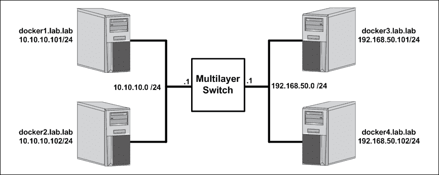
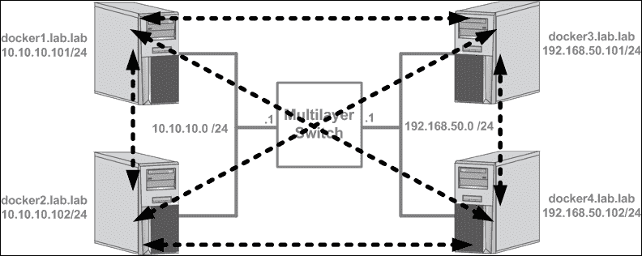
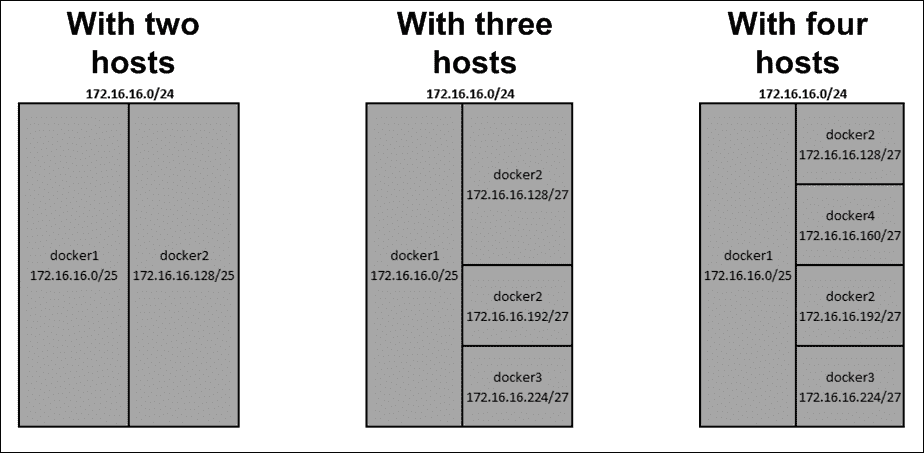
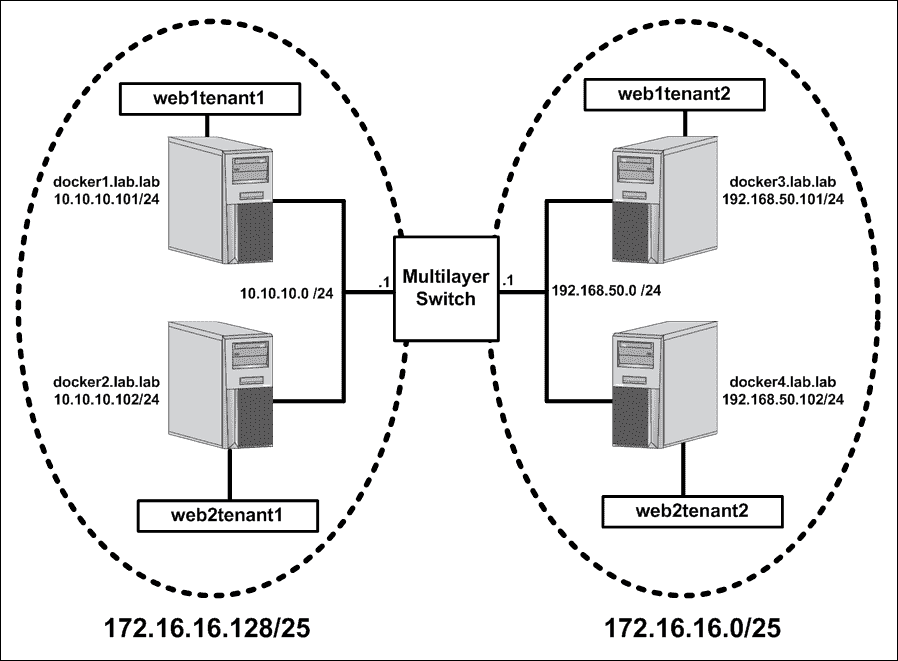

# 第七章。使用 Weave Net

在本章中，我们将涵盖以下操作：

+   安装和配置 Weave

+   运行连接到 Weave 的容器

+   理解 Weave IPAM

+   使用 WeaveDNS

+   Weave 安全性

+   使用 Weave 网络插件

# 介绍

Weave Net（简称 Weave）是 Docker 的第三方网络解决方案。早期，它为用户提供了 Docker 本身没有提供的额外网络功能。例如，Weave 在 Docker 开始支持用户定义的覆盖网络和嵌入式 DNS 之前，提供了覆盖网络和 WeaveDNS。然而，随着最近的发布，Docker 已经开始从网络的角度获得了与 Weave 相同的功能。也就是说，Weave 仍然有很多可提供的功能，并且是第三方工具如何与 Docker 交互以提供容器网络的有趣示例。在本章中，我们将介绍安装和配置 Weave 的基础知识，以便与 Docker 一起工作，并从网络的角度描述 Weave 的一些功能。虽然我们将花一些时间演示 Weave 的一些功能，但这并不是整个 Weave 解决方案的操作指南。本章不会涵盖 Weave 的许多功能。我建议您查看他们的网站，以获取有关功能和功能的最新信息（[`www.weave.works/`](https://www.weave.works/)）。

# 安装和配置 Weave

在这个示例中，我们将介绍安装 Weave 以及如何在 Docker 主机上提供 Weave 服务。我们还将展示 Weave 如何处理希望参与 Weave 网络的主机的连接。

## 准备工作

在这个示例中，我们将使用与第三章中使用的相同的实验室拓扑，*用户定义的网络*，在那里我们讨论了用户定义的覆盖网络：



您将需要一些主机，最好其中一些位于不同的子网。假设在本实验中使用的 Docker 主机处于其默认配置中。在某些情况下，我们所做的更改可能需要您具有系统的根级访问权限。

## 如何做…

Weave 是通过 Weave CLI 工具安装和管理的。一旦下载，它不仅管理与 Weave 相关的配置，还管理 Weave 服务的提供。在您希望配置的每个主机上，您只需运行以下三个命令：

+   将 Weave 二进制文件下载到您的本地系统：

```
user@docker1:~$ sudo curl -L git.io/weave -o \
/usr/local/bin/weave
```

+   使文件可执行：

```
user@docker1:~$ sudo chmod +x /usr/local/bin/weave
```

+   运行 Weave：

```
user@docker1:~$ **weave launch**

```

如果所有这些命令都成功完成，您的 Docker 主机现在已准备好使用 Weave 进行 Docker 网络。要验证，您可以使用`weave status`命令检查 Weave 状态：

```
user@docker1:~$ weave status
        Version: 1.7.1 (up to date; next check at 2016/10/11 01:26:42)

        **Service: router**
       Protocol: weave 1..2
           Name: 12:d2:fe:7a:c1:f2(docker1)
     Encryption: disabled
  PeerDiscovery: enabled
        Targets: 0
    Connections: 0
          Peers: 1
 TrustedSubnets: none

        **Service: ipam**
         Status: idle
          Range: 10.32.0.0/12
  DefaultSubnet: 10.32.0.0/12

        **Service: dns**
         Domain: weave.local.
       Upstream: 10.20.30.13
            TTL: 1
        Entries: 0

        **Service: proxy**
        Address: unix:///var/run/weave/weave.sock

        **Service: plugin**
     DriverName: weave
user@docker1:~$ 
```

此输出为您提供了有关 Weave 的所有五个与网络相关的服务的信息。它们是`router`、`ipam`、`dns`、`proxy`和`plugin`。此时，您可能想知道所有这些服务都在哪里运行。保持与 Docker 主题一致，它们都在主机上的容器内运行：


正如您所看到的，有三个与 Weave 相关的容器在主机上运行。运行`weave launch`命令生成了所有三个容器。每个容器提供 Weave 用于网络容器的独特服务。`weaveproxy`容器充当一个 shim 层，允许直接从 Docker CLI 利用 Weave。`weaveplugin`容器实现了 Docker 的自定义网络驱动程序。"`weave`"容器通常被称为 Weave 路由器，并提供与 Weave 网络相关的所有其他服务。

每个容器都可以独立配置和运行。使用`weave launch`命令运行 Weave 意味着您想要使用所有三个容器，并使用一组合理的默认值部署它们。但是，如果您希望更改与特定容器相关的设置，您需要独立启动容器。可以通过以下方式完成：

```
weave launch-router
weave launch-proxy
weave launch-plugin
```

如果您希望在特定主机上清理 Weave 配置，可以发出`weave reset`命令，它将清理所有与 Weave 相关的服务容器。为了开始我们的示例，我们将只使用 Weave 路由器容器。让我们清除 Weave 配置，然后在我们的主机`docker1`上只启动该容器：

```
user@docker1:~$ weave reset
user@docker1:~$ weave launch-router
e5af31a8416cef117832af1ec22424293824ad8733bb7a61d0c210fb38c4ba1e
user@docker1:~$
```

Weave 路由器（weave 容器）是我们需要提供大部分网络功能的唯一容器。让我们通过检查 weave 容器配置来查看默认情况下传递给 Weave 路由器的配置选项：

```
user@docker1:~$ docker inspect weave
…<Additional output removed for brevity>…
        "Args": 
            "**--port**",
            "6783",
            "**--name**",
            "12:d2:fe:7a:c1:f2",
            "**--nickname**",
            "docker1",
            "**--datapath**",
            "datapath",
            "**--ipalloc-range**",
            "10.32.0.0/12",
            "**--dns-effective-listen-address**",
            "172.17.0.1",
            "**--dns-listen-address**",
            "172.17.0.1:53",
            "**--http-addr**",
            "127.0.0.1:6784",
            "**--resolv-conf**",
            "/var/run/weave/etc/resolv.conf" 
…<Additional output removed for brevity>… 
user@docker1:~$
```

在前面的输出中有一些值得指出的项目。IP 分配范围被给定为`10.32.0.0/12`。这与我们默认在`docker0`桥上处理的`172.17.0.0/16`有很大不同。此外，还定义了一个 IP 地址用作 DNS 监听地址。回想一下，Weave 还提供了 WeaveDNS，可以用来解析 Weave 网络上其他容器的名称。请注意，这个 IP 地址就是主机上`docker0`桥接口的 IP 地址。

现在让我们将另一个主机配置为 Weave 网络的一部分：

```
user@docker2:~$ sudo curl -L git.io/weave -o /usr/local/bin/weave
user@docker2:~$ sudo chmod +x /usr/local/bin/weave
user@docker2:~$ **weave launch-router 10.10.10.101**
48e5035629b5124c8d3bedf09fca946b333bb54aff56704ceecef009b53dd449
user@docker2:~$
```

请注意，我们以与之前相同的方式安装了 Weave，但是当我们启动路由器容器时，我们指定了第一个 Docker 主机的 IP 地址。在 Weave 中，这就是我们将多个主机连接在一起的方式。您希望连接到 Weave 网络的任何主机只需指定 Weave 网络上任何现有节点的 IP 地址。如果我们检查新连接的节点上的 Weave 状态，我们应该看到它显示为已连接：

```
user@docker2:~$ weave status
        Version: 1.7.1 (up to date; next check at 2016/10/11 03:36:22)
        Service: router
       Protocol: weave 1..2
           Name: e6:b1:90:cd:76:da(docker2)
     Encryption: disabled
  PeerDiscovery: enabled
        Targets: 1
 **Connections: 1 (1 established)**
 **Peers: 2 (with 2 established connections)**
 TrustedSubnets: none
…<Additional output removed for brevity>…
user@docker2:~$
```

安装了 Weave 后，我们可以继续以相同的方式连接另外两个剩余的节点：

```
user@**docker3**:~$ weave launch-router **10.10.10.102**
user@**docker4**:~$ weave launch-router **192.168.50.101**

```

在每种情况下，我们将先前加入的 Weave 节点指定为我们尝试加入的节点的对等体。在我们的情况下，我们的加入模式看起来像下面的图片所示：

![如何做...然而，我们也可以让每个节点加入到任何其他现有节点，并且得到相同的结果。也就是说，将节点`docker2`、`docker3`和`docker4`加入到`docker1`会产生相同的最终状态。这是因为 Weave 只需要与现有节点通信，以获取有关 Weave 网络当前状态的信息。由于所有现有成员都有这些信息，因此无论加入新节点时与哪个节点通信都无所谓。如果现在检查任何 Weave 节点的状态，我们应该看到我们有四个对等体：```user@docker4:~$ weave status        Version: 1.7.1 (up to date; next check at 2016/10/11 03:25:22)        Service: router       Protocol: weave 1..2           Name: 42:ec:92:86:1a:31(docker4)     Encryption: disabled  PeerDiscovery: enabled        Targets: 1 **Connections: 3 (3 established)** **Peers: 4 (with 12 established connections)** TrustedSubnets: none …<Additional output removed for brevity>… user@docker4:~$```我们可以看到这个节点有三个连接，分别连接到其他两个加入的节点。这给我们总共四个对等体，共有十二个连接，每个 Weave 节点有三个连接。因此，尽管只在三个节点之间配置了对等连接，但最终我们得到了所有主机之间的容器连接的全网格：

现在 Weave 的配置已经完成，我们在所有启用 Weave 的 Docker 主机之间建立了一个完整的网状网络。您可以使用`weave status connections`命令验证每个主机与其他对等体的连接情况。

```
user@docker1:~$ weave status connections
-> **192.168.50.102**:6783   established fastdp 42:ec:92:86:1a:31(**docker4**)
<- **10.10.10.102**:45632    established fastdp e6:b1:90:cd:76:da(**docker2**)
<- **192.168.50.101**:38411  established fastdp ae:af:a6:36:18:37(**docker3**)
user@docker1:~$ 
```

您会注意到，此配置不需要配置独立的键值存储。

还应该注意，可以使用 Weave CLI 的`connect`和`forget`命令手动管理 Weave 对等体。如果在实例化 Weave 时未指定 Weave 网络的现有成员，可以使用 Weave connect 手动连接到现有成员。此外，如果从 Weave 网络中删除成员并且不希望其返回，可以使用`forget`命令告诉网络完全忘记对等体。

# 运行 Weave 连接的容器

Weave 是一个有趣的例子，展示了第三方解决方案与 Docker 交互的不同方式。它提供了几种不同的与 Docker 交互的方法。第一种是 Weave CLI，通过它不仅可以配置 Weave，还可以像通过 Docker CLI 一样生成容器。第二种是网络插件，它直接与 Docker 绑定，允许您将 Docker 容器配置到 Weave 网络上。在本教程中，我们将演示如何使用 Weave CLI 将容器连接到 Weave 网络。Weave 网络插件将在本章的后续教程中介绍。

### 注意

Weave 还提供了一个 API 代理服务，允许 Weave 在 Docker 和 Docker CLI 之间透明地插入自己。本章不涵盖该配置，但他们在此链接上有关于该功能的广泛文档。

[`www.weave.works/docs/net/latest/weave-docker-api/`](https://www.weave.works/docs/net/latest/weave-docker-api/)

## 准备工作

假设您正在构建本章第一个教程中创建的实验室。还假设主机已安装了 Docker 和 Weave。我们还假设在上一章中定义的 Weave 对等体已经就位。

## 如何做…

使用 Weave CLI 管理容器连接时，有两种方法可以将容器连接到 Weave 网络。

第一种方法是使用`weave`命令来运行一个容器。Weave 通过将`weave run`后面指定的任何内容传递给`docker run`来实现这一点。这种方法的优势在于，Weave 知道了连接，因为它实际上是在告诉 Docker 运行容器。

这使得 Weave 处于一个完美的位置，可以确保容器以适当的配置启动，以便在 Weave 网络上工作。例如，我们可以使用以下语法在主机`docker1`上启动名为`web1`的容器：

```
user@docker1:~$ **weave** run -dP --name=web1 jonlangemak/web_server_1
```

请注意，`run`命令的语法与 Docker 的相同。

### 注意

尽管有相似之处，但有几点不同值得注意。Weave 只能在后台或`-d`模式下启动容器。此外，您不能指定`--rm`标志在执行完毕后删除容器。

一旦以这种方式启动容器，让我们看一下容器的接口配置：

```
user@docker1:~$ docker exec web1 ip addr
…<Loopback interface removed for brevity>…
20: **eth0**@if21: <BROADCAST,MULTICAST,UP,LOWER_UP> mtu 1500 qdisc noqueue state UP
    link/ether 02:42:ac:11:00:02 brd ff:ff:ff:ff:ff:ff
    inet **172.17.0.2/16** scope global eth0
       valid_lft forever preferred_lft forever
    inet6 fe80::42:acff:fe11:2/64 scope link
       valid_lft forever preferred_lft forever
22: **ethwe**@if23: <BROADCAST,MULTICAST,UP,LOWER_UP> mtu 1410 qdisc noqueue state UP
    link/ether a6:f2:d0:36:6f:bd brd ff:ff:ff:ff:ff:ff
    inet **10.32.0.1/12** scope global ethwe
       valid_lft forever preferred_lft forever
    inet6 fe80::a4f2:d0ff:fe36:6fbd/64 scope link
       valid_lft forever preferred_lft forever
user@docker1:~$
```

请注意，容器现在有一个名为`ethwe`的额外接口，其 IP 地址为`10.32.0.1/12`。这是 Weave 网络接口，除了 Docker 网络接口（`eth0`）之外添加的。如果我们检查，我们会注意到，由于我们传递了`-P`标志，Docker 已经将容器暴露的端口发布到了`eth0`接口上。

```
user@docker1:~$ docker port **web1**
**80**/tcp -> 0.0.0.0:**32785**
user@docker1:~$ sudo iptables -t nat -S
…<Additional output removed for brevity>…
-A DOCKER ! -i docker0 -p tcp -m tcp --dport **32768** -j DNAT --to-destination **172.17.0.2:80** 
user@docker1:~$
```

这证明了我们之前看到的所有端口发布功能仍然是通过 Docker 网络结构完成的。Weave 接口只是添加到现有的 Docker 本机网络接口中。

连接容器到 Weave 网络的第二种方法可以通过两种不同的方式实现，但基本上产生相同的结果。可以通过使用 Weave CLI 启动当前停止的容器，或者将正在运行的容器附加到 Weave 来将现有的 Docker 容器添加到 Weave 网络。让我们看看每种方法。首先，让我们以与通常使用 Docker CLI 相同的方式在主机`docker2`上启动一个容器，然后使用 Weave 重新启动它：

```
user@docker2:~$ **docker** run -dP --name=web2 jonlangemak/web_server_2
5795d42b58802516fba16eed9445950123224326d5ba19202f23378a6d84eb1f
user@docker2:~$ **docker stop web2**
web2
user@docker2:~$ **weave start web2**
web2
user@docker2:~$ docker exec web2 ip addr
…<Loopback interface removed for brevity>…
15: **eth0**@if16: <BROADCAST,MULTICAST,UP,LOWER_UP> mtu 1500 qdisc noqueue state UP
    link/ether 02:42:ac:11:00:02 brd ff:ff:ff:ff:ff:ff
    inet **172.17.0.2/16** scope global eth0
       valid_lft forever preferred_lft forever
    inet6 fe80::42:acff:fe11:2/64 scope link
       valid_lft forever preferred_lft forever
17: **ethwe**@if18: <BROADCAST,MULTICAST,UP,LOWER_UP> mtu 1410 qdisc noqueue state UP
    link/ether e2:22:e0:f8:0b:96 brd ff:ff:ff:ff:ff:ff
    inet **10.44.0.0/12** scope global ethwe
       valid_lft forever preferred_lft forever
    inet6 fe80::e022:e0ff:fef8:b96/64 scope link
       valid_lft forever preferred_lft forever
user@docker2:~$
```

因此，正如您所看到的，当使用 Weave CLI 重新启动容器时，Weave 已经处理了将 Weave 接口添加到容器中。类似地，我们可以在主机`docker3`上启动我们的`web1`容器的第二个实例，然后使用`weave attach`命令动态连接到 Weave 网络：

```
user@docker3:~$ docker run -dP --name=web1 jonlangemak/web_server_1
dabdf098964edc3407c5084e56527f214c69ff0b6d4f451013c09452e450311d
user@docker3:~$ docker exec web1 ip addr
…<Loopback interface removed for brevity>…
5: **eth0**@if6: <BROADCAST,MULTICAST,UP,LOWER_UP> mtu 1500 qdisc noqueue state UP
    link/ether 02:42:ac:11:00:02 brd ff:ff:ff:ff:ff:ff
    inet **172.17.0.2/16** scope global eth0
       valid_lft forever preferred_lft forever
    inet6 fe80::42:acff:fe11:2/64 scope link
       valid_lft forever preferred_lft forever
user@docker3:~$ 
user@docker3:~$ **weave attach web1**
**10.36.0.0**
user@docker3:~$ docker exec web1 ip addr
…<Loopback interface removed for brevity>…
5: **eth0**@if6: <BROADCAST,MULTICAST,UP,LOWER_UP> mtu 1500 qdisc noqueue state UP
    link/ether 02:42:ac:11:00:02 brd ff:ff:ff:ff:ff:ff
    inet **172.17.0.2/16** scope global eth0
       valid_lft forever preferred_lft forever
    inet6 fe80::42:acff:fe11:2/64 scope link
       valid_lft forever preferred_lft forever
15: **ethwe**@if16: <BROADCAST,MULTICAST,UP,LOWER_UP> mtu 1410 qdisc noqueue state UP
    link/ether de:d6:1c:03:63:ba brd ff:ff:ff:ff:ff:ff
    inet **10.36.0.0/12** scope global ethwe
       valid_lft forever preferred_lft forever
    inet6 fe80::dcd6:1cff:fe03:63ba/64 scope link
       valid_lft forever preferred_lft forever
user@docker3:~$
```

正如我们在前面的输出中所看到的，容器在我们手动将其附加到 Weave 网络之前没有 `ethwe` 接口。附加是动态完成的，无需重新启动容器。除了将容器添加到 Weave 网络外，您还可以使用 `weave detach` 命令动态将其从 Weave 中移除。

在这一点上，您应该已经连接到了 Weave 网络的所有容器之间的连通性。在我的情况下，它们被分配了以下 IP 地址：

+   `web1` 在主机 `docker1` 上：`10.32.0.1`

+   `web2` 在主机 `docker2` 上：`10.44.0.0`

+   `web1` 在主机 `docker3` 上：`10.36.0.0`

```
user@docker1:~$ **docker exec -it web1 ping 10.44.0.0 -c 2**
PING 10.40.0.0 (10.40.0.0): 48 data bytes
**56 bytes from 10.40.0.0: icmp_seq=0 ttl=64 time=0.447 ms**
**56 bytes from 10.40.0.0: icmp_seq=1 ttl=64 time=0.681 ms**
--- 10.40.0.0 ping statistics ---
2 packets transmitted, 2 packets received, 0% packet loss
round-trip min/avg/max/stddev = 0.447/0.564/0.681/0.117 ms
user@docker1:~$ **docker exec -it web1 ping 10.36.0.0 -c 2**
PING 10.44.0.0 (10.44.0.0): 48 data bytes
**56 bytes from 10.44.0.0: icmp_seq=0 ttl=64 time=1.676 ms**
**56 bytes from 10.44.0.0: icmp_seq=1 ttl=64 time=0.839 ms**
--- 10.44.0.0 ping statistics ---
2 packets transmitted, 2 packets received, 0% packet loss
round-trip min/avg/max/stddev = 0.839/1.257/1.676/0.419 ms
user@docker1:~$
```

这证明了 Weave 网络正在按预期工作，并且容器位于正确的网络段上。

# 了解 Weave IPAM

正如我们在前几章中多次看到的那样，IPAM 是任何容器网络解决方案的关键组成部分。当您开始在多个 Docker 主机上使用常见网络时，IPAM 的关键性变得更加清晰。随着 IP 分配数量的增加，能够通过名称解析这些容器也变得至关重要。与 Docker 一样，Weave 为其容器网络解决方案提供了集成的 IPAM。在本章中，我们将展示如何配置和利用 Weave IPAM 来管理 Weave 网络中的 IP 分配。

## 做好准备

假设您正在基于本章第一个配方中创建的实验室进行构建。还假设主机已安装了 Docker 和 Weave。Docker 应该处于其默认配置状态，Weave 应该已安装但尚未进行对等连接。如果您需要删除先前示例中定义的对等连接，请在每个主机上发出 `weave reset` 命令。

## 如何做…

Weave 对 IPAM 的解决方案依赖于整个 Weave 网络使用一个大的子网，然后将其划分为较小的部分，并直接分配给每个主机。然后主机从分配给它的 IP 地址池中分配容器 IP 地址。为了使其工作，Weave 集群必须就要分配给每个主机的 IP 分配达成一致意见。它首先在集群内部达成共识。如果您大致知道您的集群将有多大，您可以在初始化期间向 Weave 提供具体信息，以帮助它做出更好的决定。

### 注意

本教程的目标不是深入讨论 Weave 与 IPAM 使用的共识算法的细节。有关详细信息，请参阅以下链接：

[`www.weave.works/docs/net/latest/ipam/`](https://www.weave.works/docs/net/latest/ipam/)

为了这个示例，我们假设您不知道您的集群有多大，我们将假设它将从两个主机开始并从那里扩展。

重要的是要理解，Weave 中的 IPAM 在您首次配置容器之前处于空闲状态。例如，让我们从在主机`docker1`上配置 Weave 开始：

```
user@docker1:~$ **weave launch-router --ipalloc-range 172.16.16.0/24**
469c81f786ac38618003e4bd08eb7303c1f8fa84d38cc134fdb352c589cbc42d
user@docker1:~$
```

您应该注意到的第一件事是添加参数`--ipalloc-range`。正如我们之前提到的，Weave 是基于一个大子网的概念工作。默认情况下，这个子网是`10.32.0.0/12`。在 Weave 初始化期间，可以通过向 Weave 传递`--ipalloc-range`标志来覆盖此默认设置。为了使这些示例更容易理解，我决定将默认子网更改为更易管理的内容；在这种情况下，是`172.16.16.0/24`。

让我们还在主机`docker2`上运行相同的命令，但是传递主机`docker1`的 IP 地址，以便它可以立即进行对等连接：

```
user@docker2:~$ **weave launch-router --ipalloc-range \**
**172.16.16.0/24 10.10.10.101**
9bfb1cb0295ba87fe88b7373a8ff502b1f90149741b2f43487d66898ffad775d
user@docker2:~$
```

请注意，我再次向 Weave 传递了相同的子网。每个运行 Weave 的主机上的 IP 分配范围相同是至关重要的。只有同意相同 IP 分配范围的主机才能正常运行。现在让我们检查一下 Weave 服务的状态：

```
user@docker2:~$ weave status
…<Additional output removed for brevity>…
Connections: 1 (1 established)
          **Peers: 2 (with 2 established connections)**
 TrustedSubnets: none

        Service: **ipam**
         Status: **idle**
          Range: **172.16.16.0/24**
  DefaultSubnet: **172.16.16.0/24** 
…<Additional output removed for brevity>… 
user@docker2:~$
```

输出显示两个对等点，表明我们对`docker1`的对等连接成功。请注意，IPAM 服务显示为`idle`状态。`idle`状态意味着 Weave 正在等待更多对等点加入，然后才会做出关于哪些主机将获得哪些 IP 分配的决定。让我们看看当我们运行一个容器时会发生什么：

```
user@docker2:~$ weave run -dP --name=web2 jonlangemak/web_server_2
379402b05db83315285df7ef516e0417635b24923bba3038b53f4e58a46b4b0d
user@docker2:~$
```

如果我们再次检查 Weave 状态，我们应该看到 IPAM 现在已从**idle**更改为**ready**：

```
user@docker2:~$ weave status
…<Additional output removed for brevity>… 
    Connections: 1 (1 established)
          Peers: 2 (with 2 established connections)
 TrustedSubnets: none

        Service: **ipam**
         Status: **ready**
          Range: 172.16.16.0/24
  DefaultSubnet: 172.16.16.0/24 
…<Additional output removed for brevity>… 
user@docker2:~$
```

连接到 Weave 网络的第一个容器迫使 Weave 达成共识。此时，Weave 已经决定集群大小为两，并已尽最大努力在主机之间分配可用的 IP 地址。让我们在主机`docker1`上运行一个容器，然后检查分配给每个容器的 IP 地址：

```
user@docker1:~$ weave run -dP --name=web1 jonlangemak/web_server_1
**fbb3eac42115**9308f41d795638c3a4689c92a9401718fd1988083bfc12047844
user@docker1:~$ **weave ps**
weave:expose 12:d2:fe:7a:c1:f2
**fbb3eac42115** 02:a7:38:ab:73:23 **172.16.16.1/24**
user@docker1:~$
```

使用**weave ps**命令，我们可以看到我们刚刚在主机`docker1`上生成的容器收到了 IP 地址`172.16.16.1/24`。如果我们检查主机`docker2`上的容器`web2`的 IP 地址，我们会看到它获得了 IP 地址`172.16.16.128/24`：

```
user@docker2:~$ **weave ps**
weave:expose e6:b1:90:cd:76:da
**dde411fe4c7b** c6:42:74:89:71:da **172.16.16.128/24**
user@docker2:~$
```

这是非常合理的。Weave 知道网络中有两个成员，所以它直接将分配分成两半，基本上为每个主机提供自己的`/25`网络分配。`docker1`开始分配`/24`的前半部分，`docker2`则从后半部分开始。

尽管完全分配了整个空间，这并不意味着我们现在用完了 IP 空间。这些初始分配更像是预留，可以根据 Weave 网络的大小进行更改。例如，我们现在可以将主机`docker3`添加到 Weave 网络，并在其上启动`web1`容器的另一个实例：

```
user@docker3:~$ **weave launch-router --ipalloc-range \**
**172.16.16.0/24 10.10.10.101**
8e8739f48854d87ba14b9dcf220a3c33df1149ce1d868819df31b0fe5fec2163
user@docker3:~$ **weave run -dP --name=web1 jonlangemak/web_server_1**
**0c2193f2d756**9943171764155e0e93272f5715c257adba75ed544283a2794d3e
user@docker3:~$ weave ps
weave:expose ae:af:a6:36:18:37
**0c2193f2d756** 76:8d:4c:ee:08:db **172.16.16.224/24**
user@docker3:~$ 
```

因为网络现在有更多成员，Weave 只是进一步将初始分配分成更小的块。根据分配给每个主机上容器的 IP 地址，我们可以看到 Weave 试图保持分配在有效的子网内。以下图片显示了第三和第四个主机加入 Weave 网络时 IP 分配的情况：



重要的是要记住，尽管分配给每台服务器的分配是灵活的，但当它们为容器分配 IP 地址时，它们都使用与初始分配相同的掩码。这确保容器都假定它们在同一个网络上，并且彼此直接连接，无需有路由指向其他主机。

为了证明初始 IP 分配必须在所有主机上相同，我们可以尝试使用不同的子网加入最后一个主机`docker4`：

```
user@docker4:~$ weave launch-router --ipalloc-range 172.64.65.0/24 10.10.10.101
9716c02c66459872e60447a6a3b6da7fd622bd516873146a874214057fe11035
user@docker4:~$ weave status
…<Additional output removed for brevity>…
        Service: router
       Protocol: weave 1..2
           Name: 42:ec:92:86:1a:31(docker4)
     Encryption: disabled
  PeerDiscovery: enabled
        Targets: 1
 **Connections: 1 (1 failed)**
…<Additional output removed for brevity>…
user@docker4:~$
```

如果我们检查 Weave 路由器容器的日志，我们会发现它无法加入现有的 Weave 网络，因为定义了错误的 IP 分配：

```
user@docker4:~$ docker logs weave
…<Additional output removed for brevity>… 
INFO: 2016/10/11 02:16:09.821503 ->[192.168.50.101:6783|ae:af:a6:36:18:37(docker3)]: **connection shutting down due to error: Incompatible IP allocation ranges (received: 172.16.16.0/24, ours: 172.64.65.0/24)** 
…<Additional output removed for brevity>… 
```

加入现有的 Weave 网络的唯一方法是使用与所有现有节点相同的初始 IP 分配。

最后，重要的是要指出，不是必须以这种方式使用 Weave IPAM。您可以通过在`weave run`期间手动指定 IP 地址来手动分配 IP 地址，就像这样：

```
user@docker1:~$ weave run **1.1.1.1/24** -dP --name=wrongip \
jonlangemak/web_server_1
259004af91e3b0367bede723c9eb9d3fbdc0c4ad726efe7aea812b79eb408777
user@docker1:~$
```

在指定单个 IP 地址时，您可以选择任何 IP 地址。正如您将在后面的配方中看到的那样，您还可以指定用于分配的子网，并让 Weave 跟踪该子网在 IPAM 中的分配。在从子网分配 IP 地址时，子网必须是初始 Weave 分配的一部分。

如果您希望手动为某些容器分配 IP 地址，可能明智的是在初始 Weave 配置期间配置额外的 Weave 参数，以限制动态分配的范围。您可以在启动时向 Weave 传递`--ipalloc-default-subnet`参数，以限制动态分配给主机的 IP 地址的范围。例如，您可以传递以下内容：

```
weave launch-router --ipalloc-range 172.16.16.0/24 \
--ipalloc-default-subnet 172.16.16.0/25
```

这将配置 Weave 子网为`172.16.16.0/25`，使较大网络的其余部分可用于手动分配。我们将在后面的教程中看到，这种类型的配置在 Weave 如何处理 Weave 网络上的网络隔离中起着重要作用。

# 使用 WeaveDNS

自然而然，在 IPAM 之后要考虑的下一件事是名称解析。无论规模如何，都需要一种方法来定位和识别容器，而不仅仅是 IP 地址。与较新版本的 Docker 一样，Weave 为解析 Weave 网络上的容器名称提供了自己的 DNS 服务。在本教程中，我们将审查 WeaveDNS 的默认配置，以及它是如何实现的，以及一些相关的配置设置，让您可以立即开始运行。

## 准备工作

假设您正在构建本章第一个教程中创建的实验室。还假设主机已安装了 Docker 和 Weave。Docker 应该处于默认配置状态，并且 Weave 应该已成功地与所有四个主机进行了对等连接，就像我们在本章的第一个教程中所做的那样。

## 如何做…

如果您一直在本章中跟随到这一点，您已经配置了 WeaveDNS。WeaveDNS 随 Weave 路由器容器一起提供，并且默认情况下已启用。我们可以通过查看 Weave 状态来看到这一点：

```
user@docker1:~$ weave status
…<Additional output removed for brevity>…
        Service: dns
         Domain: weave.local.
       Upstream: 10.20.30.13
            TTL: 1
        Entries: 0
…<Additional output removed for brevity>…
```

当 Weave 配置 DNS 服务时，它会从一些合理的默认值开始。在这种情况下，它检测到我的主机 DNS 服务器是`10.20.30.13`，因此将其配置为上游解析器。它还选择了`weave.local`作为域名。如果我们使用 weave run 语法启动容器，Weave 将确保容器以允许其使用此 DNS 服务的方式进行配置。例如，让我们在主机`docker1`上启动一个容器：

```
user@docker1:~$ weave run -dP --name=web1 jonlangemak/web_server_1
c0cf29fb07610b6ffc4e55fdd4305f2b79a89566acd0ae0a6de09df06979ef36
user@docker1:~$ docker exec –t web1 more /etc/resolv.conf
**nameserver 172.17.0.1**
user@docker1:~$
```

启动容器后，我们可以看到 Weave 已经配置了容器的`resolv.conf`文件，与 Docker 的默认配置不同。回想一下，默认情况下，在非用户定义的网络中，Docker 会给容器分配与 Docker 主机本身相同的 DNS 配置。在这种情况下，Weave 给容器分配了一个名为`172.17.0.1`的名称服务器，默认情况下是分配给`docker0`桥接口的 IP 地址。您可能想知道 Weave 如何期望容器通过与`docker0`桥接口通信来解析自己的 DNS 系统。解决方案非常简单。Weave 路由器容器以主机模式运行，并绑定到端口`53`的服务。

```
user@docker1:~$ docker network inspect **host**
…<Additional output removed for brevity>… 
"Containers": {        "03e3e82a5e0ced0b973e2b31ed9c2d3b8fe648919e263965d61ee7c425d9627c": {
                "Name": "**weave**",
…<Additional output removed for brevity>…
```

如果我们检查主机上绑定的端口，我们可以看到 weave 路由器正在暴露端口`53`：

```
user@docker1:~$ sudo netstat -plnt
Active Internet connections (only servers)
…<some columns removed to increase readability>…
Proto Local Address State       PID/Program name
tcp   **172.17.0.1:53** LISTEN      **2227/weaver**

```

这意味着 Weave 容器中的 WeaveDNS 服务将在`docker0`桥接口上监听 DNS 请求。让我们在主机`docker2`上启动另一个容器：

```
user@docker2:~$ **weave run -dP --name=web2 jonlangemak/web_server_2**
b81472e86d8ac62511689185fe4e4f36ac4a3c41e49d8777745a60cce6a4ac05
user@docker2:~$ **docker exec -it web2 ping web1 -c 2**
PING web1.weave.local (10.32.0.1): 48 data bytes
**56 bytes from 10.32.0.1: icmp_seq=0 ttl=64 time=0.486 ms**
**56 bytes from 10.32.0.1: icmp_seq=1 ttl=64 time=0.582 ms**
--- web1.weave.local ping statistics ---
2 packets transmitted, 2 packets received, 0% packet loss
round-trip min/avg/max/stddev = 0.486/0.534/0.582/0.048 ms
user@docker2:~$ 
```

只要两个容器都在 Weave 网络上并且具有适当的设置，Weave 将自动生成一个包含容器名称的 DNS 记录。我们可以使用`weave status dns`命令从任何 Weave 启用的主机上查看 Weave 知道的所有名称记录：

```
user@docker2:~$ weave status dns
**web1         10.32.0.1       86029a1305f1 12:d2:fe:7a:c1:f2**
**web2         10.44.0.0       56927d3bf002 e6:b1:90:cd:76:da**
user@docker2:~$ 
```

在这里，我们可以看到目标主机的 Weave 网络接口的容器名称、IP 地址、容器 ID 和 MAC 地址。

这很有效，但依赖于容器配置了适当的设置。这是另一种情况，使用 Weave CLI 会非常有帮助，因为它确保这些设置在容器运行时生效。例如，如果我们在主机`docker3`上使用 Docker CLI 启动另一个容器，然后将其连接到 Docker，它将不会获得 DNS 记录：

```
user@docker3:~$ docker run -dP --name=web1 jonlangemak/web_server_1
cd3b043bd70c0f60a03ec24c7835314ca2003145e1ca6d58bd06b5d0c6803a5c
user@docker3:~$ **weave attach web1**
**10.36.0.0**
user@docker3:~$ docker exec -it **web1 ping web2**
**ping: unknown host**
user@docker3:~$
```

这有两个原因不起作用。首先，容器不知道在哪里查找 Weave DNS，并且试图通过 Docker 提供的 DNS 服务器来解析它。在这种情况下，这是在 Docker 主机上配置的一个：

```
user@docker3:~$ **docker exec -it web1 more /etc/resolv.conf**
# Dynamic resolv.conf(5) file for glibc resolver(3) generated by resolvconf(8)
#     DO NOT EDIT THIS FILE BY HAND -- YOUR CHANGES WILL BE OVERWRITTEN
**nameserver 10.20.30.13**
**search lab.lab**
user@docker3:~$
```

其次，当容器被连接时，Weave 没有在 WeaveDNS 中注册记录。为了使 Weave 在 WeaveDNS 中为容器生成记录，容器必须在相同的域中。为此，当 Weave 通过其 CLI 运行容器时，它会传递容器的主机名以及域名。当我们在 Docker 中运行容器时，我们可以通过提供主机名来模拟这种行为。例如：

```
user@docker3:~$ docker stop web1
user@docker3:~$ docker rm web1
user@docker3:~$ docker run -dP **--hostname=web1.weave.local \**
--name=web1 jonlangemak/web_server_1
04bb1ba21b692b4117a9b0503e050d7f73149b154476ed5a0bce0d049c3c9357
user@docker3:~$
```

现在当我们将容器连接到 Weave 网络时，我们应该看到为其生成的 DNS 记录：

```
user@docker3:~$ weave attach web1
**10.36.0.0**
user@docker3:~$ weave status dns
web1         10.32.0.1       86029a1305f1 12:d2:fe:7a:c1:f2
**web1         10.36.0.0       5bab5eae10b0 ae:af:a6:36:18:37**
web2         10.44.0.0       56927d3bf002 e6:b1:90:cd:76:da
user@docker3:~$
```

### 注意

如果您希望该容器还能够解析 WeaveDNS 中的记录，还需要向容器传递`--dns=172.17.0.1`标志，以确保其 DNS 服务器设置为`docker0`桥的 IP 地址。

您可能已经注意到，我们现在在 WeaveDNS 中有相同容器名称的两个条目。这是 Weave 在 Weave 网络中提供基本负载平衡的方式。例如，如果我们回到`docker2`主机，让我们尝试多次 ping 名称`web1`：

```
user@docker2:~$ **docker exec -it web2 ping web1 -c 1**
PING **web1.weave.local (10.32.0.1):** 48 data bytes
**56 bytes from 10.32.0.1: icmp_seq=0 ttl=64 time=0.494 ms**
--- web1.weave.local ping statistics ---
1 packets transmitted, 1 packets received, 0% packet loss
round-trip min/avg/max/stddev = 0.494/0.494/0.494/0.000 ms
user@docker2:~$ **docker exec -it web2 ping web1 -c 1**
PING **web1.weave.local (10.36.0.0):** 48 data bytes
**56 bytes from 10.36.0.0: icmp_seq=0 ttl=64 time=0.796 ms**
--- web1.weave.local ping statistics ---
1 packets transmitted, 1 packets received, 0% packet loss
round-trip min/avg/max/stddev = 0.796/0.796/0.796/0.000 ms
user@docker2:~$ **docker exec -it web2 ping web1 -c 1**
PING **web1.weave.local (10.32.0.1):** 48 data bytes
**56 bytes from 10.32.0.1: icmp_seq=0 ttl=64 time=0.507 ms**
--- web1.weave.local ping statistics ---
1 packets transmitted, 1 packets received, 0% packet loss
round-trip min/avg/max/stddev = 0.507/0.507/0.507/0.000 ms
user@docker2:~$
```

请注意，在第二次 ping 尝试期间，容器解析为不同的 IP 地址。由于 WeaveDNS 中有相同名称的多个记录，我们可以仅使用 DNS 提供基本负载平衡功能。Weave 还将跟踪容器的状态，并将死掉的容器从 WeaveDNS 中移除。例如，如果我们在`docker3`主机上杀死容器，我们应该看到`web1`记录中的一个被移出 DNS，只留下`web1`的单个记录：

```
user@docker3:~$ docker stop web1
web1
user@docker3:~$ weave status dns
**web1         10.32.0.1       86029a1305f1 12:d2:fe:7a:c1:f2**
web2         10.44.0.0       56927d3bf002 e6:b1:90:cd:76:da
user@docker3:~$
```

### 注意

有许多不同的配置选项可供您自定义 WeaveDNS 的工作方式。要查看完整指南，请查看[`www.weave.works/docs/net/latest/weavedns/`](http:// https://www.weave.works/docs/net/latest/weavedns/)上的文档。

# Weave 安全性

Weave 提供了一些属于安全性范畴的功能。由于 Weave 是一种基于覆盖的网络解决方案，它提供了在物理或底层网络中传输覆盖流量的加密能力。当您的容器可能需要穿越公共网络时，这可能特别有用。此外，Weave 允许您在某些网络段内隔离容器。Weave 依赖于为每个隔离的段使用不同的子网来实现此目的。在本配方中，我们将介绍如何配置覆盖加密以及如何为 Weave 网络中的不同容器提供隔离。

## 准备工作

假设您正在构建本章第一个配方中创建的实验室。还假设主机已安装了 Docker 和 Weave。Docker 应该处于默认配置状态，Weave 应该已安装但尚未进行对等连接。如果您需要删除先前示例中定义的对等连接，请在每个主机上发出`weave reset`命令。

## 如何做…

配置 Weave 以加密覆盖网络相当容易实现；但是，必须在 Weave 的初始配置期间完成。使用前面配方中的相同实验拓扑，让我们运行以下命令来构建 Weave 网络：

+   在主机`docker1`上：

```
weave launch-router **--password notverysecurepwd \**
**--trusted-subnets 192.168.50.0/24** --ipalloc-range \
172.16.16.0/24 --ipalloc-default-subnet 172.16.16.128/25
```

+   在主机`docker2`，`docker3`和`docker4`上：

```
weave launch-router **--password notverysecurepwd \**
**--trusted-subnets 192.168.50.0/24** --ipalloc-range \
172.16.16.0/24 --ipalloc-default-subnet \
172.16.16.128/25 10.10.10.101
```

您会注意到我们在主机上运行的命令基本相同，只是最后三个主机指定`docker1`作为对等体以构建 Weave 网络。在任何情况下，在 Weave 初始化期间，我们传递了一些额外的参数给路由器：

+   `--password`：这是启用 Weave 节点之间通信加密的参数。与我的示例不同，您应该选择一个非常安全的密码来使用。这需要在运行 weave 的每个节点上相同。

+   `--trusted-subnets`：这允许您定义主机子网为受信任的，这意味着它们不需要加密通信。当 Weave 进行加密时，它会退回到比通常使用的更慢的数据路径。由于使用`--password`参数会打开端到端的加密，定义一些子网不需要加密可能是有意义的

+   `--ipalloc-range`：在这里，我们定义更大的 Weave 网络为`172.16.16.0/24`。我们在之前的配方中看到了这个命令的使用：

+   `--ipalloc-default-subnet`：这指示 Weave 默认从更大的 Weave 分配中的较小子网中分配容器 IP 地址。在这种情况下，那就是`172.16.16.128/25`。

现在，让我们在每个主机上运行以下容器：

+   `docker1`：

```
weave run -dP --name=web1tenant1 jonlangemak/web_server_1
```

+   `docker2`：

```
weave run -dP --name=web2tenant1 jonlangemak/web_server_2
```

+   `docker3`：

```
weave run **net:172.16.16.0/25** -dP --name=web1tenant2 \
jonlangemak/web_server_1
```

+   `docker4`：

```
weave run **net:172.16.16.0/25** -dP --name=web2tenant2 \
jonlangemak/web_server_2
```

请注意，在主机`docker3`和`docker4`上，我添加了`net:172.16.16.0/25`参数。回想一下，当我们启动 Weave 网络时，我们告诉 Weave 默认从`172.16.16.128/25`中分配 IP 地址。只要在更大的 Weave 网络范围内，我们可以在容器运行时覆盖这一设置，并为 Weave 提供一个新的子网来使用。在这种情况下，`docker1`和`docker2`上的容器将获得`172.16.16.128/25`内的 IP 地址，因为这是默认设置。`docker3`和`docker4`上的容器将获得`172.16.16.0/25`内的 IP 地址，因为我们覆盖了默认设置。一旦您启动了所有容器，我们可以确认这一点：

```
user@docker4:~$ weave status dns
web1tenant1  172.16.16.129   26c58ef399c3 12:d2:fe:7a:c1:f2
**web1tenant2  172.16.16.64    4c569073d663 ae:af:a6:36:18:37**
web2tenant1  172.16.16.224   211c2e0b388e e6:b1:90:cd:76:da
**web2tenant2  172.16.16.32    191207a9fb61 42:ec:92:86:1a:31**
user@docker4:~$
```

正如我之前提到的，使用不同的子网是 Weave 提供容器分割的方式。在这种情况下，拓扑将如下所示：



虚线象征着 Weave 在覆盖网络中为我们提供的隔离。由于`tenant1`容器位于与`tenant2`容器不同的子网中，它们将无法连接。这样，Weave 使用基本的网络来实现容器隔离。我们可以通过一些测试来证明这一点：

```
user@docker4:~$ docker exec -**it web2tenant2** curl http://**web1tenant2**
<body>
  <html>
    <h1><span style="color:#FF0000;font-size:72px;">**Web Server #1 - Running on port 80**</span>
    </h1>
</body>
  </html>
user@docker4:~$ docker exec -it **web2tenant2** curl http://**web1tenant1**
user@docker4:~$ docker exec -it **web2tenant2** curl http://**web2tenant1**
user@docker4:~$
user@docker4:~$ **docker exec -it web2tenant2 ping web1tenant1 -c 1**
PING web1tenant1.weave.local (172.16.16.129): 48 data bytes
--- web1tenant1.weave.local ping statistics ---
1 packets transmitted, 0 packets received, **100% packet loss**
user@docker4:~$
```

当`web2tenant2`容器尝试访问其自己租户（子网）中的服务时，它按预期工作。尝试访问`tenant1`中的服务将不会收到响应。但是，由于 DNS 在 Weave 网络中是共享的，容器仍然可以解析`tenant1`中容器的 IP 地址。

这也说明了加密的例子，以及我们如何指定某些主机为受信任的。无论容器位于哪个子网中，Weave 仍然在所有主机之间建立连接。由于我们在 Weave 初始化期间启用了加密，所有这些连接现在应该是加密的。但是，我们还指定了一个受信任的网络。受信任的网络定义了不需要在它们之间进行加密的节点。在我们的情况下，我们指定`192.168.50.0/24`为受信任的网络。由于有两个具有这些 IP 地址的节点，`docker3`和`docker4`，我们应该看到它们之间的连接是未加密的。我们可以在主机上使用 weave status connections 命令来验证这一点。我们应该得到以下响应：

+   `docker1`（截断输出）：

```
<- 10.10.10.102:45888    established encrypted   sleeve 
<- 192.168.50.101:57880  established encrypted   sleeve 
<- 192.168.50.102:45357  established encrypted   sleeve 
```

+   `docker2`（截断输出）：

```
<- 192.168.50.101:35207  established encrypted   sleeve 
<- 192.168.50.102:34640  established encrypted   sleeve 
-> 10.10.10.101:6783     established encrypted   sleeve 
```

+   `docker3`（截断输出）：

```
-> 10.10.10.101:6783     established encrypted   sleeve 
**-> 192.168.50.102:6783   established unencrypted fastdp** 
-> 10.10.10.102:6783     established encrypted   sleeve 
```

+   `docker4`（截断输出）：

```
-> 10.10.10.102:6783     established encrypted   sleeve 
**<- 192.168.50.101:36315  established unencrypted fastdp** 
-> 10.10.10.101:6783     established encrypted   sleeve 
```

您可以看到所有的连接都显示为加密，除了主机`docker3`（`192.168.50.101`）和主机`docker4`（`192.168.50.102`）之间的连接。由于两个主机需要就受信任的网络达成一致，主机`docker1`和`docker2`将永远不会同意它们的连接是未加密的。

# 使用 Weave 网络插件

Weave 的一个特点是它可以以几种不同的方式操作。正如我们在本章的前几个示例中看到的，Weave 有自己的 CLI，我们可以使用它直接将容器配置到 Weave 网络中。虽然这当然是一种紧密集成的工作方式，但它要求您利用 Weave CLI 或 Weave API 代理与 Docker 集成。除了这些选项，Weave 还编写了一个原生的 Docker 网络插件。这个插件允许您直接从 Docker 中使用 Weave。也就是说，一旦插件注册，您就不再需要使用 Weave CLI 将容器配置到 Weave 中。在本示例中，我们将介绍如何安装和使用 Weave 网络插件。

## 准备工作

假设您正在基于本章第一个示例中创建的实验室进行构建。还假设主机已经安装了 Docker 和 Weave。Docker 应该处于默认配置状态，Weave 应该已安装，并且所有四个主机已成功互联，就像我们在本章的第一个示例中所做的那样。

## 如何做…

与 Weave 的其他组件一样，利用 Docker 插件非常简单。您只需要告诉 Weave 启动它。例如，如果我决定在主机`docker1`上使用 Docker 插件，我可以这样启动插件：

```
user@docker1:~$ **weave launch-plugin**
3ef9ee01cc26173f2208b667fddc216e655795fd0438ef4af63dfa11d27e2546
user@docker1:~$ 
```

就像其他服务一样，该插件以容器的形式存在。在运行了前面的命令之后，您应该看到插件作为名为`weaveplugin`的容器运行：


一旦运行，您还应该看到它注册为一个网络插件：

```
user@docker1:~$ docker info
…<Additional output removed for brevity>… 
Plugins:
 Volume: local
 Network: host **weavemesh** overlay bridge null 
…<Additional output removed for brevity>… 
user@docker1:~$ 
```

我们还可以将其视为使用`docker network`子命令定义的网络类型：

```
user@docker1:~$ docker network ls
NETWORK ID        NAME              DRIVER            SCOPE
79105142fbf0      bridge            bridge            local
bb090c21339c      host              host              local
9ae306e2af0a      none              null              local
**20864e3185f5      weave             weavemesh         local**
user@docker1:~$ 
```

在这一点上，通过 Docker 直接将容器连接到 Weave 网络可以直接完成。您只需要在启动容器时指定`weave`的网络名称。例如，我们可以运行：

```
user@docker1:~$ docker run -dP --name=web1 --**net=weave** \
jonlangemak/web_server_1
4d84cb472379757ae4dac5bf6659ec66c9ae6df200811d56f65ffc957b10f748
user@docker1:~$
```

如果我们查看容器接口，我们应该看到我们习惯在 Weave 连接的容器中看到的两个接口：

```
user@docker1:~$ docker exec web1 ip addr
…<loopback interface removed for brevity>…
83: **ethwe**0@if84: <BROADCAST,MULTICAST,UP,LOWER_UP> mtu 1410 qdisc noqueue state UP
    link/ether 9e:b2:99:c4:ac:c4 brd ff:ff:ff:ff:ff:ff
    inet **10.32.0.1/12** scope global ethwe0
       valid_lft forever preferred_lft forever
    inet6 fe80::9cb2:99ff:fec4:acc4/64 scope link
       valid_lft forever preferred_lft forever
86: **eth1**@if87: <BROADCAST,MULTICAST,UP,LOWER_UP> mtu 1500 qdisc noqueue state UP
    link/ether 02:42:ac:12:00:02 brd ff:ff:ff:ff:ff:ff
    inet **172.18.0.2/16** scope global eth1
       valid_lft forever preferred_lft forever
    inet6 fe80::42:acff:fe12:2/64 scope link
       valid_lft forever preferred_lft forever
user@docker1:~$
```

但是，您可能会注意到`eth1`的 IP 地址不在`docker0`桥上，而是在我们在早期章节中看到的`docker_gwbridge`上使用的。使用网关桥而不是`docker0`桥的好处是，网关桥默认情况下已禁用 ICC。这可以防止 Weave 连接的容器意外地在`docker0`桥上跨通信，如果您启用了 ICC 模式。

插件方法的一个缺点是 Weave 不在中间告诉 Docker 有关 DNS 相关的配置，这意味着容器没有注册它们的名称。即使它们注册了，它们也没有接收到解析 WeaveDNS 所需的正确名称解析设置。我们可以指定容器的正确设置的两种方法。在任何一种情况下，我们都需要在容器运行时手动指定参数。第一种方法涉及手动指定所有必需的参数。手动完成如下：

```
user@docker1:~$ docker run -dP --name=web1 \
**--hostname=web1.weave.local --net=weave --dns=172.17.0.1 \**
**--dns-search=weave.local** jonlangemak/web_server_1
6a907ee64c129d36e112d0199eb2184663f5cf90522ff151aa10c2a1e6320e16
user@docker1:~$
```

为了注册 DNS，您需要在前面的代码中显示的四个加粗设置：

+   `--hostname=web1.weave.local`：如果您不将容器的主机名设置为`weave.local`中的名称，DNS 服务器将不会注册该名称。

+   `--net=weave`：它必须在 Weave 网络上才能正常工作。

+   `--dns=172.17.0.1`：我们需要告诉它使用在`docker0`桥 IP 地址上监听的 Weave DNS 服务器。但是，您可能已经注意到，该容器实际上并没有在`docker0`桥上拥有 IP 地址。相反，由于我们连接到`docker-gwbridge`，我们在`172.18.0.0/16`网络中有一个 IP 地址。在任何一种情况下，由于两个桥都有 IP 接口，容器可以通过`docker_gwbridge`路由到`docker0`桥上的 IP 接口。

+   `--dns-search=weave.local`：这允许容器解析名称而无需指定**完全限定域名**（**FQDN**）。

一旦使用这些设置启动容器，您应该看到 WeaveDNS 中注册的记录：

```
user@docker1:~$ weave status dns
**web1         10.32.0.1       7b02c0262786 12:d2:fe:7a:c1:f2**
user@docker1:~$
```

第二种解决方案仍然是手动的，但涉及从 Weave 本身提取 DNS 信息。您可以从 Weave 中注入 DNS 服务器和搜索域，而不是指定它。Weave 有一个名为`dns-args`的命令，将为您返回相关信息。因此，我们可以简单地将该命令作为容器参数的一部分注入，而不是指定它，就像这样：

```
user@docker2:~$ docker run --hostname=web2.weave.local \
--net=weave **$(weave dns-args)** --name=web2 -dP \
jonlangemak/web_server_2
597ffde17581b7203204594dca84c9461c83cb7a9076ed3d1ed3fcb598c2b77d
user@docker2:~$
```

当然，这并不妨碍需要指定网络或容器的 FQDN，但它确实减少了一些输入。此时，您应该能够看到 WeaveDNS 中定义的所有记录，并能够通过名称访问 Weave 网络上的服务。

```
user@docker1:~$ weave status dns
**web1         10.32.0.1       7b02c0262786 12:d2:fe:7a:c1:f2**
**web2         10.32.0.2       b154e3671feb 12:d2:fe:7a:c1:f2**
user@docker1:~$
user@docker2:~$ **docker exec -it web2 ping web1 -c 2**
PING web1 (10.32.0.1): 48 data bytes
**56 bytes from 10.32.0.1: icmp_seq=0 ttl=64 time=0.139 ms**
**56 bytes from 10.32.0.1: icmp_seq=1 ttl=64 time=0.130 ms**
--- web1 ping statistics ---
2 packets transmitted, 2 packets received, 0% packet loss
round-trip min/avg/max/stddev = 0.130/0.135/0.139/0.000 ms
user@docker1:~$
```

您可能注意到这些容器的 DNS 配置并不完全符合您的预期。例如，`resolv.conf`文件并未显示我们在容器运行时指定的 DNS 服务器。

```
user@docker1:~$ docker exec web1 more /etc/resolv.conf
::::::::::::::
/etc/resolv.conf
::::::::::::::
search weave.local
**nameserver 127.0.0.11**
options ndots:0
user@docker1:~$
```

然而，如果您检查容器的配置，您会看到正确的 DNS 服务器被正确定义。

```
user@docker1:~$ docker inspect web1
…<Additional output removed for brevity>…
            "**Dns**": [
                "**172.17.0.1**"
            ],
…<Additional output removed for brevity>…
user@docker1:~$
```

请记住，用户定义的网络需要使用 Docker 的嵌入式 DNS 系统。我们在容器的`resolv.conf`文件中看到的 IP 地址引用了 Docker 的嵌入式 DNS 服务器。反过来，当我们为容器指定 DNS 服务器时，嵌入式 DNS 服务器会将该服务器添加为嵌入式 DNS 中的转发器。这意味着，尽管请求仍然首先到达嵌入式 DNS 服务器，但请求会被转发到 WeaveDNS 进行解析。

### 请注意

Weave 插件还允许您使用 Weave 驱动程序创建额外的用户定义网络。然而，由于 Docker 将其视为全局范围，它们需要使用外部密钥存储。如果您有兴趣以这种方式使用 Weave，请参考[`www.weave.works/docs/net/latest/plugin/`](https://www.weave.works/docs/net/latest/plugin/)上的 Weave 文档。
