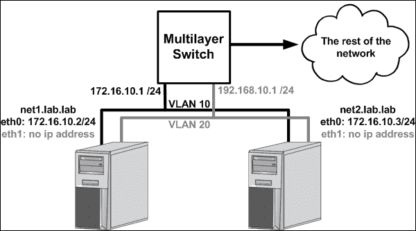
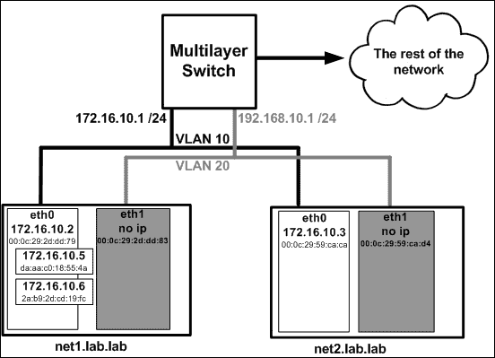
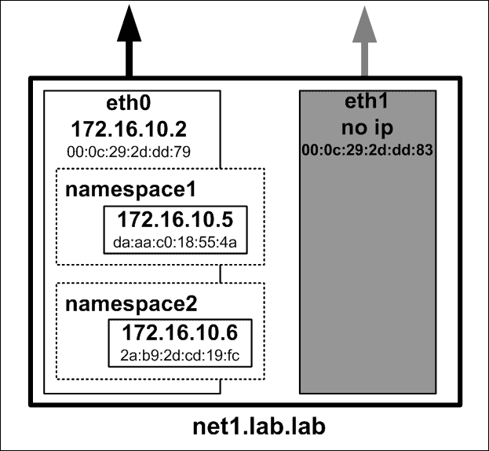
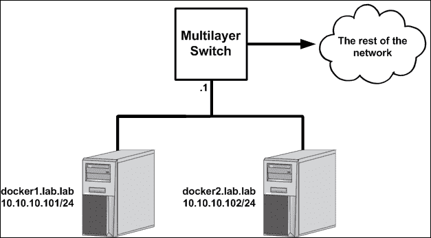
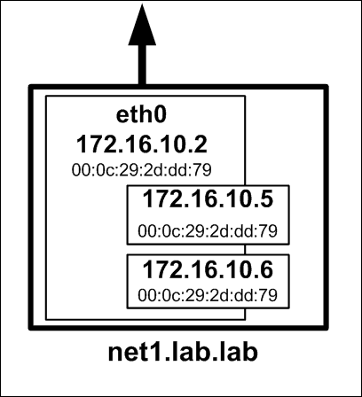
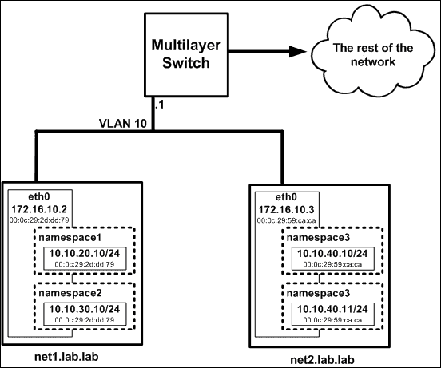
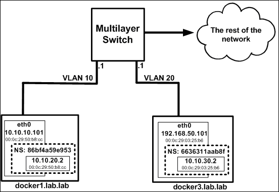

# 第九章：探索网络功能

在本章中，我们将涵盖以下内容：

+   使用 Docker 的预发布版本

+   理解 MacVLAN 接口

+   使用 Docker MacVLAN 网络驱动程序

+   理解 IPVLAN 接口

+   使用 Docker IPVLAN 网络驱动程序

+   使用 MacVLAN 和 IPVLAN 网络标记 VLAN ID

# 介绍

尽管我们在前几章讨论过的许多功能自从一开始就存在，但许多功能是最近才引入的。Docker 是一个快速发展的开源软件，有许多贡献者。为了管理功能的引入、测试和潜在发布，Docker 以几种不同的方式发布代码。在本章中，我们将展示如何探索尚未包含在软件生产或发布版本中的功能。作为其中的一部分，我们将回顾 Docker 引入的两个较新的网络功能。其中一个是 MacVLAN，最近已经合并到软件的发布版本中，版本号为 1.12。第二个是 IPVLAN，仍然处于预发布软件渠道中。在我们回顾如何使用 Docker 预发布软件渠道之后，我们将讨论 MacVLAN 和 IPVLAN 网络接口的基本操作，然后讨论它们在 Docker 中作为驱动程序的实现方式。

# 使用 Docker 的预发布版本

Docker 提供了两种不同的渠道，您可以在其中预览未发布的代码。这使用户有机会审查既定发布的功能，也可以审查完全实验性的功能，这些功能可能永远不会进入实际发布版本。审查这些功能并对其提供反馈是开源软件开发的重要组成部分。Docker 认真对待收到的反馈，许多在这些渠道中测试过的好主意最终会进入生产代码发布中。在本篇中，我们将回顾如何安装测试和实验性的 Docker 版本。

## 准备工作

在本教程中，我们将使用一个新安装的 Ubuntu 16.04 主机。虽然这不是必需的，但建议您在当前未安装 Docker 的主机上安装 Docker 的预发布版本。如果安装程序检测到 Docker 已经安装，它将警告您不要安装实验或测试代码。也就是说，我建议在专用的开发服务器上进行来自这些渠道的软件测试。在许多情况下，虚拟机用于此目的。如果您使用虚拟机，我建议您安装基本操作系统，然后对 VM 进行快照，以便为自己创建还原点。如果安装出现问题，您可以始终恢复到此快照以从已知良好的系统开始。

正如 Docker 在其文档中所指出的：

> *实验性功能尚未准备好投入生产。它们提供给您在沙盒环境中进行测试和评估。*

请在使用非生产代码的任何一列火车时牢记这一点。强烈建议您在 GitHub 上就任何渠道中存在的所有功能提供反馈。

## 如何做…

如前所述，终端用户可以使用两个不同的预发布软件渠道。

+   [`experimental.docker.com/`](https://experimental.docker.com/)：这是下载和安装 Docker 实验版本的脚本的 URL。该版本包括完全实验性的功能。其中许多功能可能在以后的某个时候集成到生产版本中。然而，许多功能不会这样做，而是仅用于实验目的。

+   [`test.docker.com/`](https://test.docker.com/)：这是下载和安装 Docker 测试版本的脚本的 URL。Docker 还将其称为**发布候选**（**RC**）版本的代码。这些代码具有计划发布但尚未集成到 Docker 生产或发布版本中的功能。

要安装任一版本，您只需从 URL 下载脚本并将其传递给 shell。例如：

+   要安装实验版，请运行此命令：

```
curl -sSL https://experimental.docker.com/ | sh
```

+   要安装测试版或候选发布版，请运行此命令：

```
curl -sSL https://test.docker.com/ | sh
```

### 注意

值得一提的是，您也可以使用类似的配置来下载 Docker 的生产版本。除了[`test.docker.com/`](https://test.docker.com/)和[`experimental.docker.com/`](https://experimental.docker.com/)之外，还有[`get.docker.com/`](https://get.docker.com/)，它将安装软件的生产版本。

如前所述，这些脚本的使用应该在当前未安装 Docker 的机器上进行。安装后，您可以通过检查`docker info`的输出来验证是否安装了适当的版本。例如，在安装实验版本时，您可以在输出中看到实验标志已设置：

```
user@docker-test:~$ sudo docker info
Containers: 0
 Running: 0
 Paused: 0
 Stopped: 0
Images: 0
Server Version: 1.12.2
…<Additional output removed for brevity>…
Experimental: true
Insecure Registries:
 127.0.0.0/8
user@docker-test:~$
```

在测试或 RC 版本中，您将看到类似的输出；但是，在 Docker info 的输出中不会列出实验变量：

```
user@docker-test:~$ sudo docker info
Containers: 0
 Running: 0
 Paused: 0
 Stopped: 0
Images: 0
Server Version: 1.12.2-rc3
…<Additional output removed for brevity>…
Insecure Registries:
 127.0.0.0/8
user@docker-test:~$
```

通过脚本安装后，您会发现 Docker 已安装并运行，就好像您通过操作系统的默认软件包管理器安装了 Docker 一样。虽然脚本应该在安装的最后提示您，但建议将您的用户帐户添加到 Docker 组中。这样可以避免您在使用 Docker CLI 命令时需要提升权限使用`sudo`。要将您的用户帐户添加到 Docker 组中，请使用以下命令：

```
user@docker-test:~$ sudo usermod -aG docker <your username>
```

确保您注销并重新登录以使设置生效。

请记住，这些脚本也可以用于更新任一渠道的最新版本。在这些情况下，脚本仍会提示您有关在现有 Docker 安装上安装的可能性，但它将提供措辞以指示您可以忽略该消息：

```
user@docker-test:~$ **curl -sSL https://test.docker.com/ | sh
Warning: the "docker" command appears to already exist on this system.

If you already have Docker installed, this script can cause trouble, which is why we're displaying this warning and provide the opportunity to cancel the installation.

If you installed the current Docker package using this script and are using it again to update Docker, you can safely ignore this message.

You may press Ctrl+C now to abort this script.
+ sleep 20
```

虽然这不是获取测试和实验代码的唯一方法，但肯定是最简单的方法。您也可以下载预构建的二进制文件或自行构建二进制文件。有关如何执行这两种操作的信息可在 Docker 的 GitHub 页面上找到：[`github.com/docker/docker/tree/master/experimental`](https://github.com/docker/docker/tree/master/experimental)。

# 理解 MacVLAN 接口

我们将要看的第一个特性是 MacVLAN。在这个教程中，我们将在 Docker 之外实现 MacVLAN，以更好地理解它的工作原理。了解 Docker 之外的 MacVLAN 如何工作对于理解 Docker 如何使用 MacVLAN 至关重要。在下一个教程中，我们将介绍 Docker 网络驱动程序对 MacVLAN 的实现。

## 准备工作

在这个示例中，我们将使用两台 Linux 主机（`net1`和`net2`）来演示 MacVLAN 功能。我们的实验室拓扑将如下所示：



假设主机处于基本配置状态，每台主机都有两个网络接口。 `eth0`接口将有一个静态 IP 地址，并作为每个主机的默认网关。 `eth1`接口将配置为没有 IP 地址。 供参考，您可以在每个主机的网络配置文件（`/etc/network/interfaces`）中找到以下内容：

+   `net1.lab.lab`

```
auto eth0
iface eth0 inet static
        address 172.16.10.2
        netmask 255.255.255.0
        gateway 172.16.10.1
        dns-nameservers 10.20.30.13
        dns-search lab.lab

auto eth1
iface eth1 inet manual
```

+   `net2.lab.lab`

```
auto eth0
iface eth0 inet static
        address 172.16.10.3
        netmask 255.255.255.0
        gateway 172.16.10.1
        dns-nameservers 10.20.30.13
        dns-search lab.lab

auto eth1
iface eth1 inet manual
```

### 注意

虽然我们将在这个示例中涵盖创建拓扑所需的所有步骤，但如果有些步骤不清楚，您可能希望参考第一章, *Linux 网络构造*。第一章, *Linux 网络构造*，更深入地介绍了基本的 Linux 网络构造和 CLI 工具。

## 如何操作…

MacVLAN 代表一种完全不同的接口配置方式，与我们到目前为止所见过的方式完全不同。我们之前检查的 Linux 网络配置依赖于松散模仿物理网络结构的构造。MacVLAN 接口在逻辑上是绑定到现有网络接口的，并且被称为**父**接口，可以支持一个或多个 MacVLAN 逻辑接口。让我们快速看一下在我们的实验室主机上配置 MacVLAN 接口的一个示例。

配置 MacVLAN 类型接口的方式与 Linux 网络接口上的所有其他类型非常相似。使用`ip`命令行工具，我们可以使用`link`子命令来定义接口：

```
user@net1:~$ sudo ip link add macvlan1 link eth0 type macvlan 
```

这个语法应该对你来说很熟悉，因为我们在书的第一章中定义了多种不同的接口类型。创建后，下一步是为其配置 IP 地址。这也是通过`ip`命令完成的：

```
user@net1:~$ sudo ip address add 172.16.10.5/24 dev macvlan1

```

最后，我们需要确保启动接口。

```
user@net1:~$ sudo ip link set dev macvlan1 up
```

接口现在已经启动，我们可以使用`ip addr show`命令来检查配置：

```
user@net1:~$ ip addr show
1: …<loopback interface configuration removed for brevity>…
2: **eth0**: <BROADCAST,MULTICAST,UP,LOWER_UP> mtu 1500 qdisc pfifo_fast state UP group default qlen 1000
    link/ether 00:0c:29:2d:dd:79 brd ff:ff:ff:ff:ff:ff
    inet **172.16.10.2/24** brd 172.16.10.255 scope global eth0
       valid_lft forever preferred_lft forever
    inet6 fe80::20c:29ff:fe2d:dd79/64 scope link
       valid_lft forever preferred_lft forever
3: eth1: <BROADCAST,MULTICAST,UP,LOWER_UP> mtu 1500 qdisc pfifo_fast state UP group default qlen 1000
    link/ether 00:0c:29:2d:dd:83 brd ff:ff:ff:ff:ff:ff
    inet6 fe80::20c:29ff:fe2d:dd83/64 scope link
       valid_lft forever preferred_lft forever
4: **macvlan1@eth0**: <BROADCAST,MULTICAST,UP,LOWER_UP> mtu 1500 qdisc noqueue state UNKNOWN group default
    link/ether da:aa:c0:18:55:4a brd ff:ff:ff:ff:ff:ff
    inet **172.16.10.5/24** scope global macvlan1
       valid_lft forever preferred_lft forever
    inet6 fe80::d8aa:c0ff:fe18:554a/64 scope link
       valid_lft forever preferred_lft forever
user@net1:~$
```

现在我们已经配置了接口，有几个有趣的地方需要指出。首先，MacVLAN 接口的名称使得很容易识别接口的父接口。回想一下，我们提到每个 MacVLAN 接口都必须与一个父接口关联。在这种情况下，我们可以通过查看 MacVLAN 接口名称中`macvlan1@`后面列出的名称来知道这个 MacVLAN 接口的父接口是`eth0`。其次，分配给 MacVLAN 接口的 IP 地址与父接口（`eth0`）处于相同的子网中。这是有意为之，以允许外部连接。让我们在同一个父接口上定义第二个 MacVLAN 接口，以演示允许的连接性：

```
user@net1:~$ sudo ip link add macvlan2 link eth0 type macvlan
user@net1:~$ sudo ip address add 172.16.10.6/24 dev macvlan2
user@net1:~$ sudo ip link set dev macvlan2 up
```

我们的网络拓扑如下：



我们有两个 MacVLAN 接口绑定到 net1 的`eth0`接口。如果我们尝试从外部子网访问任一接口，连接性应该如预期般工作：

```
user@test_server:~$** ip addr show dev **eth0** |grep inet
    inet **10.20.30.13/24** brd 10.20.30.255 scope global eth0
user@test_server:~$ ping 172.16.10.5 -c 2
PING 172.16.10.5 (172.16.10.5) 56(84) bytes of data.
64 bytes from 172.16.10.5: icmp_seq=1 ttl=63 time=0.423 ms
64 bytes from 172.16.10.5: icmp_seq=2 ttl=63 time=0.458 ms
--- 172.16.10.5 ping statistics ---
2 packets transmitted, 2 received, 0% packet loss, time 1000ms
rtt min/avg/max/mdev = 0.423/0.440/0.458/0.027 ms
user@test_server:~$ ping 172.16.10.6 -c 2
PING 172.16.10.6 (172.16.10.6) 56(84) bytes of data.
64 bytes from 172.16.10.6: icmp_seq=1 ttl=63 time=0.510 ms
64 bytes from 172.16.10.6: icmp_seq=2 ttl=63 time=0.532 ms
--- 172.16.10.6 ping statistics ---
2 packets transmitted, 2 received, 0% packet loss, time 1000ms
rtt min/avg/max/mdev = 0.510/0.521/0.532/0.011 ms
```

在前面的输出中，我尝试从`net1`主机的子网外部的测试服务器上到达`172.16.10.5`和`172.16.10.6`。在这两种情况下，我们都能够到达 MacVLAN 接口的 IP 地址，这意味着路由正在按预期工作。这就是为什么我们给 MacVLAN 接口分配了服务器`eth0`接口现有子网内的 IP 地址。由于多层交换机知道`172.16.10.0/24`位于 VLAN 10 之外，它只需为 VLAN 10 上的新 IP 地址发出 ARP 请求，以获取它们的 MAC 地址。Linux 主机已经有一个指向允许返回流量到达测试服务器的交换机的默认路由。然而，这绝不是 MacVLAN 接口的要求。我本可以轻松选择另一个 IP 子网用于接口，但那将阻止外部路由的固有工作。

另一个需要指出的地方是父接口不需要有关联的 IP 地址。例如，让我们通过在主机`net1`上建立两个更多的 MacVLAN 接口来扩展拓扑。一个在主机`net1`上，另一个在主机`net2`上：

```
user@net1:~$ sudo ip link add macvlan3 link eth1 type macvlan
user@net1:~$ sudo ip address add 192.168.10.5/24 dev macvlan3
user@net1:~$ sudo ip link set dev macvlan3 up

user@net2:~$ sudo ip link add macvlan4 link eth1 type macvlan
user@net2:~$ sudo ip address add 192.168.10.6/24 dev macvlan4
user@net2:~$ sudo ip link set dev macvlan4 up
```

我们的拓扑如下：


尽管在物理接口上没有定义 IP 地址，但主机现在将`192.168.10.0/24`网络视为已定义，并认为该网络是本地连接的：

```
user@net1:~$ ip route
default via 172.16.10.1 dev eth0
172.16.10.0/24 dev eth0  proto kernel  scope link  src 172.16.10.2
172.16.10.0/24 dev macvlan1  proto kernel  scope link  src 172.16.10.5
172.16.10.0/24 dev macvlan2  proto kernel  scope link  src 172.16.10.6
192.168.10.0/24 dev macvlan3  proto kernel  scope link  src 192.168.10.5
user@net1:~$
```

这意味着两个主机可以直接通过它们在该子网上的关联 IP 地址相互到达：

```
user@**net1**:~$ ping **192.168.10.6** -c 2
PING 192.168.10.6 (192.168.10.6) 56(84) bytes of data.
64 bytes from 192.168.10.6: icmp_seq=1 ttl=64 time=0.405 ms
64 bytes from 192.168.10.6: icmp_seq=2 ttl=64 time=0.432 ms
--- 192.168.10.6 ping statistics ---
2 packets transmitted, 2 received, 0% packet loss, time 1000ms
rtt min/avg/max/mdev = 0.405/0.418/0.432/0.024 ms
user@net1:~$
```

此时，您可能会想知道为什么要使用 MacVLAN 接口类型。从外观上看，它似乎与创建逻辑子接口没有太大区别。真正的区别在于接口的构建方式。通常，子接口都使用相同的父接口的 MAC 地址。您可能已经注意到在先前的输出和图表中，MacVLAN 接口具有与其关联的父接口不同的 MAC 地址。我们也可以在上游多层交换机（网关）上验证这一点：

```
switch# show ip arp vlan 10
Protocol  Address          Age (min)  Hardware Addr   Type   Interface
Internet  172.16.10.6             8   a2b1.0cd4.4e73  ARPA   Vlan10
Internet  172.16.10.5             8   4e19.f07f.33e0  ARPA   Vlan10
Internet  172.16.10.2             0   000c.292d.dd79  ARPA   Vlan10
Internet  172.16.10.3            62   000c.2959.caca  ARPA   Vlan10
Internet  172.16.10.1             -   0021.d7c5.f245  ARPA   Vlan10
```

### 注意

在测试中，您可能会发现 Linux 主机对于配置中的每个 IP 地址都呈现相同的 MAC 地址。根据您运行的操作系统，您可能需要更改以下内核参数，以防止主机呈现相同的 MAC 地址：

```
echo 1 | sudo tee /proc/sys/net/ipv4/conf/all/arp_ignore
echo 2 | sudo tee /proc/sys/net/ipv4/conf/all/arp_announce
echo 2 | sudo tee /proc/sys/net/ipv4/conf/all/rp_filter
```

请记住，以这种方式应用这些设置不会在重新启动后持久存在。

从 MAC 地址来看，我们可以看到父接口（`172.16.10.2`）和两个 MacVLAN 接口（`172.16.10.5`和`6`）具有不同的 MAC 地址。MacVLAN 允许您使用不同的 MAC 地址呈现多个接口。其结果是您可以拥有多个 IP 接口，每个接口都有自己独特的 MAC 地址，但都使用同一个物理接口。

由于父接口负责多个 MAC 地址，它需要处于混杂模式。当选择为父接口时，主机应自动将接口置于混杂模式。您可以通过检查 ip 链接详细信息来验证：

```
user@net2:~$ ip -d link
…<output removed for brevity>…
2: **eth1**: <BROADCAST,MULTICAST,UP,LOWER_UP> mtu 1500 qdisc pfifo_fast state UP mode DEFAULT group default qlen 1000
    link/ether 00:0c:29:59:ca:d4 brd ff:ff:ff:ff:ff:ff **promiscuity 1
…<output removed for brevity>…
```

### 注意

如果父接口处于混杂模式是一个问题，您可能会对本章后面讨论的 IPVLAN 配置感兴趣。

与我们见过的其他 Linux 接口类型一样，MacVLAN 接口也支持命名空间。这可以导致一些有趣的配置选项。现在让我们来看看如何在独立的网络命名空间中部署 MacVLAN 接口。

让我们首先删除所有现有的 MacVLAN 接口：

```
user@net1:~$ sudo ip link del macvlan1
user@net1:~$ sudo ip link del macvlan2
user@net1:~$ sudo ip link del macvlan3
user@net2:~$ sudo ip link del macvlan4
```

就像我们在第一章中所做的那样，*Linux 网络构造*，我们可以创建一个接口，然后将其移入一个命名空间。我们首先创建命名空间：

```
user@net1:~$ sudo ip netns add namespace1
```

然后，我们创建 MacVLAN 接口：

```
user@net1:~$ sudo ip link add macvlan1 link eth0 type macvlan
```

接下来，我们将接口移入新创建的网络命名空间：

```
user@net1:~$ sudo ip link set macvlan1 netns namespace1
```

最后，从命名空间内部，我们为其分配一个 IP 地址并将其启动：

```
user@net1:~$ sudo ip netns exec namespace1 ip address \
add 172.16.10.5/24 dev macvlan1
user@net1:~$ sudo ip netns exec namespace1 ip link set \
dev macvlan1 up
```

让我们也在第二个命名空间中创建一个第二个接口，用于测试目的：

```
user@net1:~$ sudo ip netns add namespace2
user@net1:~$ sudo ip link add macvlan2 link eth0 type macvlan
user@net1:~$ sudo ip link set macvlan2 netns namespace2
user@net1:~$ sudo ip netns exec namespace2 ip address \
add 172.16.10.6/24 dev macvlan2
user@net1:~$ sudo ip netns exec namespace2 ip link set \
dev macvlan2 up
```

### 注意

当您尝试不同的配置时，通常会多次创建和删除相同的接口。这样做时，您可能会生成具有相同 IP 地址但不同 MAC 地址的接口。由于我们将这些 MAC 地址呈现给上游物理网络，因此请务必确保上游设备或网关具有要到达的 IP 的最新 ARP 条目。许多交换机和路由器在长时间内不会为新的 MAC 条目 ARP 而具有长的 ARP 超时值是很常见的。

此时，我们的拓扑看起来是这样的：



父接口（`eth0`）像以前一样有一个 IP 地址，但这次，MacVLAN 接口存在于它们自己独特的命名空间中。尽管位于不同的命名空间中，但它们仍然共享相同的父接口，因为这是在将它们移入命名空间之前完成的。

此时，您应该注意到外部主机无法再 ping 通所有 IP 地址。相反，您只能到达`172.16.10.2`的`eth0` IP 地址。原因很简单。正如您所记得的，命名空间类似于**虚拟路由和转发**（**VRF**），并且有自己的路由表。如果您检查一下两个命名空间的路由表，您会发现它们都没有默认路由：

```
user@net1:~$ sudo ip netns exec **namespace1** ip route
172.16.10.0/24 dev macvlan1  proto kernel  scope link  src 172.16.10.5
user@net1:~$ sudo ip netns exec **namespace2** ip route
172.16.10.0/24 dev macvlan2  proto kernel  scope link  src 172.16.10.6
user@net1:~$
```

为了使这些接口在网络外可达，我们需要为每个命名空间指定一个默认路由，指向该子网上的网关（`172.16.10.1`）。同样，这是将 MacVLAN 接口 addressing 在与父接口相同的子网中的好处。路由已经存在于物理网络上。添加路由并重新测试：

```
user@net1:~$ sudo ip netns exec namespace1 ip route \
add 0.0.0.0/0 via 172.16.10.1
user@net1:~$ sudo ip netns exec namespace2 ip route \
add 0.0.0.0/0 via 172.16.10.1
```

从外部测试主机（为简洁起见删除了一些输出）：

```
user@test_server:~$** ping 172.16.10.2 -c 2
PING 172.16.10.2 (172.16.10.2) 56(84) bytes of data.
64 bytes from 172.16.10.2: icmp_seq=1 ttl=63 time=0.459 ms
64 bytes from 172.16.10.2: icmp_seq=2 ttl=63 time=0.441 ms
user@test_server:~$** ping 172.16.10.5 -c 2
PING 172.16.10.5 (172.16.10.5) 56(84) bytes of data.
64 bytes from 172.16.10.5: icmp_seq=1 ttl=63 time=0.521 ms
64 bytes from 172.16.10.5: icmp_seq=2 ttl=63 time=0.528 ms
user@test_server:~$** ping 172.16.10.6 -c 2
PING 172.16.10.6 (172.16.10.6) 56(84) bytes of data.
64 bytes from 172.16.10.6: icmp_seq=1 ttl=63 time=0.524 ms
64 bytes from 172.16.10.6: icmp_seq=2 ttl=63 time=0.551 ms

```

因此，虽然外部连接似乎按预期工作，但请注意，这些接口都无法相互通信：

```
user@net1:~$ sudo ip netns exec **namespace2** ping **172.16.10.5
PING 172.16.10.5 (172.16.10.5) 56(84) bytes of data.
--- 172.16.10.5 ping statistics ---
5 packets transmitted, 0 received, **100% packet loss**, time 0ms
user@net1:~$ sudo ip netns exec **namespace2** ping **172.16.10.2
PING 172.16.10.2 (172.16.10.2) 56(84) bytes of data.
--- 172.16.10.2 ping statistics ---
5 packets transmitted, 0 received, **100% packet loss**, time 0ms
user@net1:~$
```

这似乎很奇怪，因为它们都共享相同的父接口。问题在于 MacVLAN 接口的配置方式。MacVLAN 接口类型支持四种不同的模式：

+   **VEPA**：**虚拟以太网端口聚合器**（**VEPA**）模式强制所有源自 MacVLAN 接口的流量从父接口出去，无论目的地如何。即使流量的目的地是共享同一父接口的另一个 MacVLAN 接口，也会受到此策略的影响。在第 2 层场景中，由于标准生成树规则，两个 MacVLAN 接口之间的通信可能会被阻止。您可以在上游路由器上在两者之间进行路由。

+   **桥接**：MacVLAN 桥接模式模仿标准 Linux 桥接。允许在同一父接口上的两个 MacVLAN 接口之间直接进行通信，而无需经过主机的父接口。这对于您期望在同一父接口上跨接口进行高级别通信的情况非常有用。

+   **私有**：此模式类似于 VEPA 模式，具有完全阻止在同一父接口上的接口之间通信的功能。即使允许流量经过父接口然后回流到主机，通信也会被丢弃。

+   **透传**：旨在直接将父接口与 MacVLAN 接口绑定。在此模式下，每个父接口只允许一个 MacVLAN 接口，并且 MacVLAN 接口继承父接口的 MAC 地址。

如果不知道在哪里查找，很难分辨出来，我们的 MacVLAN 接口碰巧是 VEPA 类型，这恰好是默认值。我们可以通过向`ip`命令传递详细信息（`-d`）标志来查看这一点：

```
user@net1:~$ sudo ip netns exec namespace1 ip -d link show
1: lo: <LOOPBACK> mtu 65536 qdisc noop state DOWN mode DEFAULT group default
    link/loopback 00:00:00:00:00:00 brd 00:00:00:00:00:00 promiscuity 0
20: **macvlan1@if2**: <BROADCAST,MULTICAST,UP,LOWER_UP> mtu 1500 qdisc noqueue state UNKNOWN mode DEFAULT group default
    link/ether 36:90:37:f6:08:cc brd ff:ff:ff:ff:ff:ff promiscuity 0
 macvlan  mode vepa
user@net1:~$
```

在我们的情况下，VEPA 模式阻止了两个命名空间接口直接通信。更常见的是，MacVLAN 接口被定义为类型`bridge`，以允许在同一父接口上的接口之间进行通信。然而，即使在这种模式下，子接口也不被允许直接与直接分配给父接口的 IP 地址（在本例中为`172.16.10.2`）进行通信。这应该是一个单独的段落。

```
user@net1:~$ sudo ip netns del namespace1
user@net1:~$ sudo ip netns del namespace2
```

现在我们可以重新创建两个接口，为每个 MacVLAN 接口指定`bridge`模式：

```
user@net1:~$ sudo ip netns add namespace1
user@net1:~$ sudo ip link add macvlan1 link eth0 type \
macvlan **mode bridge
user@net1:~$ sudo ip link set macvlan1 netns namespace1
user@net1:~$ sudo ip netns exec namespace1 ip address \
add 172.16.10.5/24 dev macvlan1
user@net1:~$ sudo ip netns exec namespace1 ip link set \
dev macvlan1 up

user@net1:~$ sudo ip netns add namespace2
user@net1:~$ sudo ip link add macvlan2 link eth0 type \
macvlan **mode bridge
user@net1:~$ sudo ip link set macvlan2 netns namespace2
user@net1:~$ sudo ip netns exec namespace2 sudo ip address \
add 172.16.10.6/24 dev macvlan2
user@net1:~$ sudo ip netns exec namespace2 ip link set \
dev macvlan2 up
```

在指定了`bridge`模式之后，我们可以验证这两个接口可以直接互连：

```
user@net1:~$ sudo ip netns exec **namespace1 ping 172.16.10.6 -c 2
PING 172.16.10.6 (172.16.10.6) 56(84) bytes of data.
64 bytes from 172.16.10.6: icmp_seq=1 ttl=64 time=0.041 ms
64 bytes from 172.16.10.6: icmp_seq=2 ttl=64 time=0.030 ms
--- 172.16.10.6 ping statistics ---
2 packets transmitted, 2 received, 0% packet loss, time 999ms
rtt min/avg/max/mdev = 0.030/0.035/0.041/0.008 ms
user@net1:~$
```

然而，我们也注意到我们仍然无法到达在父接口（`eth0`）上定义的主机 IP 地址：

```
user@net1:~$ sudo ip netns exec **namespace1 ping 172.16.10.2 -c 2
PING 172.16.10.2 (172.16.10.2) 56(84) bytes of data.
--- 172.16.10.2 ping statistics ---
2 packets transmitted, 0 received, **100% packet loss**, time 1008ms
user@net1:~$
```

# 使用 Docker MacVLAN 网络驱动程序

当我开始写这本书时，Docker 的当前版本是 1.10，那时 MacVLAN 功能已经包含在 Docker 的候选版本中。自那时起，1.12 版本已经发布，将 MacVLAN 推入软件的发布版本。也就是说，使用 MacVLAN 驱动程序的唯一要求是确保您安装了 1.12 或更新版本的 Docker。在本章中，我们将讨论如何为从 Docker 创建的容器使用 MacVLAN 网络驱动程序。

## 准备工作

在本教程中，我们将使用两台运行 Docker 的 Linux 主机。我们的实验拓扑将包括两个生活在同一网络上的 Docker 主机。它将如下所示：



假设每个主机都运行着 1.12 或更高版本的 Docker，以便可以访问 MacVLAN 驱动程序。主机应该有一个单独的 IP 接口，并且 Docker 应该处于默认配置状态。在某些情况下，我们所做的更改可能需要您具有系统的根级访问权限。

## 如何做…

就像所有其他用户定义的网络类型一样，MacVLAN 驱动程序是通过`docker network`子命令处理的。创建 MacVLAN 类型网络与创建任何其他网络类型一样简单，但有一些特定于此驱动程序的事项需要牢记。

+   在定义网络时，您需要指定上游网关。请记住，MacVLAN 接口显示在父接口的相同接口上。它们需要主机或接口的上游网关才能访问外部子网。

+   在其他用户定义的网络类型中，如果您决定不指定一个子网，Docker 会为您生成一个子网供您使用。虽然 MacVLAN 驱动程序仍然是这种情况，但除非您指定父接口所在的网络，否则它将无法正常工作。就像我们在上一个教程中看到的那样，MacVLAN 依赖于上游网络设备知道如何路由 MacVLAN 接口。这是通过在与父接口相同的子网上定义容器的 MacVLAN 接口来实现的。您还可以选择使用没有定义 IP 地址的父接口。在这些情况下，只需确保您在 Docker 中定义网络时指定的网关可以通过父接口到达。

+   作为驱动程序的选项，您需要指定希望用作所有连接到 MacVLAN 接口的容器的父接口的接口。如果不将父接口指定为选项，Docker 将创建一个虚拟网络接口并将其用作父接口。这将阻止该网络与外部网络的任何通信。

+   使用 MacVLAN 驱动程序创建网络时，可以使用`--internal 标志`。当指定时，父接口被定义为虚拟接口，阻止流量离开主机。

+   MacVLAN 用户定义网络与父接口之间是一对一的关系。也就是说，您只能在给定的父接口上定义一个 MacVLAN 类型网络。

+   一些交换机供应商限制每个端口可以学习的 MAC 地址数量。虽然这个数字通常非常高，但在使用这种网络类型时，请确保考虑到这一点。

+   与其他用户定义的网络类型一样，您可以指定 IP 范围或一组辅助地址，希望 Docker 的 IPAM 不要分配给容器。在 MacVLAN 模式下，这些设置更为重要，因为您直接将容器呈现到物理网络上。

考虑到我们当前的实验室拓扑，我们可以在每个主机上定义网络如下：

```
user@docker1:~$ docker network create -d macvlan \
--subnet 10.10.10.0/24 --ip-range 10.10.10.0/25 \
--gateway=10.10.10.1 --aux-address docker1=10.10.10.101 \
--aux-address docker2=10.10.10.102 -o parent=eth0 macvlan_net

user@docker2:~$ docker network create -d macvlan \
--subnet 10.10.10.0/24 --ip-range 10.10.10.128/25 \
--gateway=10.10.10.1 --aux-address docker1=10.10.10.101 \
--aux-address docker2=10.10.10.102 -o parent=eth0 macvlan_net
```

使用这种配置，网络上的每个主机将使用可用子网的一半，本例中为`/25`。由于 Docker 的 IPAM 自动为我们保留网关 IP 地址，因此无需通过将其定义为辅助地址来阻止其分配。但是，由于 Docker 主机接口本身确实位于此范围内，我们确实需要使用辅助地址来保留这些地址。

现在，我们可以在每个主机上定义容器，并验证它们是否可以彼此通信：

```
user@docker1:~$ docker run -d --name=web1 \
--net=macvlan_net jonlangemak/web_server_1
user@docker1:~$ **docker exec web1 ip addr
1: lo: <LOOPBACK,UP,LOWER_UP> mtu 65536 qdisc noqueue state UNKNOWN qlen 1
    link/loopback 00:00:00:00:00:00 brd 00:00:00:00:00:00
    inet 127.0.0.1/8 scope host lo
       valid_lft forever preferred_lft forever
    inet6 ::1/128 scope host
       valid_lft forever preferred_lft forever
7: **eth0@if2**: <BROADCAST,MULTICAST,UP,LOWER_UP> mtu 1500 qdisc noqueue state UNKNOWN
    link/ether 02:42:0a:0a:0a:02 brd ff:ff:ff:ff:ff:ff
    inet **10.10.10.2/24** scope global eth0
       valid_lft forever preferred_lft forever
    inet6 fe80::42:aff:fe0a:a02/64 scope link
       valid_lft forever preferred_lft forever
user@docker1:~$
user@docker2:~$ docker run -d --name=web2 \
--net=macvlan_net jonlangemak/web_server_2
user@docker2:~$ **docker exec web2 ip addr
1: lo: <LOOPBACK,UP,LOWER_UP> mtu 65536 qdisc noqueue state UNKNOWN qlen 1
    link/loopback 00:00:00:00:00:00 brd 00:00:00:00:00:00
    inet 127.0.0.1/8 scope host lo
       valid_lft forever preferred_lft forever
    inet6 ::1/128 scope host
       valid_lft forever preferred_lft forever
4: **eth0@if2**: <BROADCAST,MULTICAST,UP,LOWER_UP> mtu 1500 qdisc noqueue state UNKNOWN
    link/ether 02:42:0a:0a:0a:80 brd ff:ff:ff:ff:ff:ff
    inet **10.10.10.128/24** scope global eth0
       valid_lft forever preferred_lft forever
    inet6 fe80::42:aff:fe0a:a80/64 scope link
       valid_lft forever preferred_lft forever
user@docker2:~$
```

请注意，在容器运行时不需要发布端口。由于容器此时具有唯一可路由的 IP 地址，因此不需要进行端口发布。任何容器都可以在其自己的唯一 IP 地址上提供任何服务。

与其他网络类型一样，Docker 为每个容器创建一个网络命名空间，然后将容器的 MacVLAN 接口映射到其中。此时，我们的拓扑如下所示：


### 注意

可以通过检查容器本身或链接 Docker 的`netns`目录来找到命名空间名称，就像我们在前面的章节中看到的那样，因此`ip netns`子命令可以查询 Docker 定义的网络命名空间。

从一个生活在子网之外的外部测试主机，我们可以验证每个容器服务都可以通过容器的 IP 地址访问到：

```
user@test_server:~$ **curl http://10.10.10.2
<body>
  <html>
    <h1><span style="color:#FF0000;font-size:72px;">**Web Server #1 - Running on port 80**</span>
    </h1>
</body>
  </html>
user@test_server:~$ **curl http://10.10.10.128
<body>
  <html>
    <h1><span style="color:#FF0000;font-size:72px;">**Web Server #2 - Running on port 80**</span>
    </h1>
</body>
  </html>
[root@tools ~]#
```

但是，您会注意到连接到 MacVLAN 网络的容器尽管位于同一接口上，但无法从本地主机访问：

```
user@docker1:~$ **ping 10.10.10.2
PING 10.10.10.2 (10.10.10.2) 56(84) bytes of data.
From 10.10.10.101 icmp_seq=1 **Destination Host Unreachable
--- 10.10.10.2 ping statistics ---
5 packets transmitted, 0 received, +1 errors, **100% packet loss**, time 0ms
user@docker1:~$
```

Docker 当前的实现仅支持 MacVLAN 桥接模式。我们可以通过检查容器内接口的详细信息来验证 MacVLAN 接口的操作模式：

```
user@docker1:~$ docker exec web1 ip -d link show
1: lo: <LOOPBACK,UP,LOWER_UP> mtu 65536 qdisc noqueue state UNKNOWN
    link/loopback 00:00:00:00:00:00 brd 00:00:00:00:00:00
5: **eth0@if2**: <BROADCAST,MULTICAST,UP,LOWER_UP> mtu 1500 qdisc noqueue state UNKNOWN
    link/ether 02:42:0a:0a:0a:02 brd ff:ff:ff:ff:ff:ff
 macvlan  mode bridge
user@docker1:~$
```

# 理解 IPVLAN 接口

IPVLAN 是 MacVLAN 的一种替代方案。IPVLAN 有两种模式。第一种是 L2 模式，它的操作方式与 MacVLAN 非常相似，唯一的区别在于 MAC 地址的分配方式。在 IPVLAN 模式下，所有逻辑 IP 接口使用相同的 MAC 地址。这使得您可以保持父 NIC 不处于混杂模式，并且还可以防止您遇到任何可能的 NIC 或交换机端口 MAC 限制。第二种模式是 IPVLAN 层 3。在层 3 模式下，IPVLAN 就像一个路由器，转发 IPVLAN 连接网络中的单播数据包。在本文中，我们将介绍基本的 IPVLAN 网络结构，以了解它的工作原理和实现方式。

## 准备工作

在本文中，我们将使用本章中“理解 MacVLAN 接口”食谱中的相同 Linux 主机（`net1`和`net2`）。有关拓扑结构的更多信息，请参阅本章中“理解 MacVLAN”食谱的“准备工作”部分。

### 注意

较旧版本的`iproute2`工具集不包括对 IPVLAN 的完全支持。如果 IPVLAN 配置的命令不起作用，很可能是因为您使用的是不支持的较旧版本。您可能需要更新以获取具有完全支持的新版本。较旧的版本对 IPVLAN 有一些支持，但缺乏定义模式（L2 或 L3）的能力。

## 操作步骤

如前所述，IPVLAN 的 L2 模式在功能上几乎与 MacVLAN 相同。主要区别在于 IPVLAN 利用相同的 MAC 地址连接到同一主机的所有 IPVLAN 接口。您会记得，MacVLAN 接口利用不同的 MAC 地址连接到同一父接口的每个 MacVLAN 接口。

我们可以创建与 MacVLAN 配方中相同的接口，以显示接口地址是使用相同的 MAC 地址创建的：

```
user@net1:~$ sudo ip link add ipvlan1 link eth0  **type ipvlan mode l2
user@net1:~$ sudo ip address add 172.16.10.5/24 dev ipvlan1
user@net1:~$ sudo ip link set dev ipvlan1 up

user@net1:~$ sudo ip link add ipvlan2 link eth0 **type ipvlan mode l2
user@net1:~$ sudo ip address add 172.16.10.6/24 dev ipvlan2
user@net1:~$ sudo ip link set dev ipvlan2 up
```

请注意，配置中唯一的区别是我们将类型指定为 IPVLAN，模式指定为 L2。在 IPVLAN 的情况下，默认模式是 L3，因此我们需要指定 L2 以使接口以这种方式运行。由于 IPVLAN 接口继承了父接口的 MAC 地址，我们的拓扑应该是这样的：



我们可以通过检查接口本身来证明这一点：

```
user@net1:~$ ip -d link
…<loopback interface removed for brevity>…
2: **eth0**: <BROADCAST,MULTICAST,UP,LOWER_UP> mtu 1500 qdisc pfifo_fast state UP mode DEFAULT group default qlen 1000
    link/ether **00:0c:29:2d:dd:79** brd ff:ff:ff:ff:ff:ff promiscuity 1 addrgenmode eui64
3: eth1: <BROADCAST,MULTICAST,UP,LOWER_UP> mtu 1500 qdisc pfifo_fast state UP mode DEFAULT group default qlen 1000
    link/ether 00:0c:29:2d:dd:83 brd ff:ff:ff:ff:ff:ff promiscuity 0 addrgenmode eui64
28: **ipvlan1@eth0**: <BROADCAST,MULTICAST,UP,LOWER_UP> mtu 1500 qdisc noqueue state UNKNOWN mode DEFAULT group default
    link/ether **00:0c:29:2d:dd:79** brd ff:ff:ff:ff:ff:ff promiscuity 0
 ipvlan  mode l2** addrgenmode eui64
29: **ipvlan2@eth0**: <BROADCAST,MULTICAST,UP,LOWER_UP> mtu 1500 qdisc noqueue state UNKNOWN mode DEFAULT group default
    link/ether **00:0c:29:2d:dd:79** brd ff:ff:ff:ff:ff:ff promiscuity 0
 ipvlan  mode l2** addrgenmode eui64
user@net1:~$
```

如果我们从本地子网外部向这些 IP 发起流量，我们可以通过检查上游网关的 ARP 表来验证每个 IP 报告相同的 MAC 地址：

```
switch#show ip arp vlan 10
Protocol  Address          Age (min)  Hardware Addr   Type   Interface
Internet  172.16.10.6             0   000c.292d.dd79  ARPA   Vlan30
Internet  172.16.10.5             0   000c.292d.dd79  ARPA   Vlan30
Internet  172.16.10.2           111   000c.292d.dd79  ARPA   Vlan30
Internet  172.16.10.3           110   000c.2959.caca  ARPA   Vlan30
Internet  172.16.10.1             -   0021.d7c5.f245  ARPA   Vlan30
```

虽然我们在这里不会展示一个例子，但是 IPVLAN 接口在 L2 模式下也像我们在最近几个配方中看到的 MacVLAN 接口类型一样具有命名空间感知能力。唯一的区别在于接口 MAC 地址，就像我们在前面的代码中看到的那样。与父接口无法与子接口通信以及反之的相同限制也适用。

现在我们知道了 IPVLAN 在 L2 模式下的工作原理，让我们讨论一下 IPVLAN L3 模式。L3 模式与我们到目前为止所见到的情况有很大不同。正如 L3 模式的名称所暗示的那样，这种接口类型在所有附加的子接口之间路由流量。这在命名空间配置中最容易理解。例如，让我们看一下这个快速实验的拓扑：



在上图中，您可以看到我在我们的两个实验主机上创建了四个独立的命名空间。我还创建了四个独立的 IPVLAN 接口，将它们映射到不同的命名空间，并为它们分配了各自独特的 IP 地址。由于这些是 IPVLAN 接口，您会注意到所有 IPVLAN 接口共享父接口的 MAC 地址。为了构建这个拓扑，我在每个相应的主机上使用了以下配置：

```
user@net1:~$ sudo ip link del dev ipvlan1
user@net1:~$ sudo ip link del dev ipvlan2
user@net1:~$ sudo ip netns add namespace1
user@net1:~$ sudo ip netns add namespace2
user@net1:~$ sudo ip link add ipvlan1 link eth0 type ipvlan mode l3
user@net1:~$ sudo ip link add ipvlan2 link eth0 type ipvlan mode l3
user@net1:~$ sudo ip link set ipvlan1 netns namespace1
user@net1:~$ sudo ip link set ipvlan2 netns namespace2
user@net1:~$ sudo ip netns exec namespace1 ip address \
add 10.10.20.10/24 dev ipvlan1
user@net1:~$ sudo ip netns exec namespace1 ip link set dev ipvlan1 up
user@net1:~$ sudo ip netns exec namespace2 sudo ip address \
add 10.10.30.10/24 dev ipvlan2
user@net1:~$ sudo ip netns exec namespace2 ip link set dev ipvlan2 up

user@net2:~$ sudo ip netns add namespace3
user@net2:~$ sudo ip netns add namespace4
user@net2:~$ sudo ip link add ipvlan3 link eth0 type ipvlan mode l3
user@net2:~$ sudo ip link add ipvlan4 link eth0 type ipvlan mode l3
user@net2:~$ sudo ip link set ipvlan3 netns namespace3
user@net2:~$ sudo ip link set ipvlan4 netns namespace4
user@net2:~$ sudo ip netns exec namespace3 ip address \
add 10.10.40.10/24 dev ipvlan3
user@net2:~$ sudo ip netns exec namespace3 ip link set dev ipvlan3 up
user@net2:~$ sudo ip netns exec namespace4 sudo ip address \
add 10.10.40.11/24 dev ipvlan4
user@net2:~$ sudo ip netns exec namespace4 ip link set dev ipvlan4 up
```

一旦配置完成，您会注意到唯一可以相互通信的接口是主机`net2`上的那些接口（`10.10.40.10`和`10.10.40.11`）。让我们逻辑地看一下这个拓扑，以理解其中的原因：


从逻辑上看，它开始看起来像一个路由网络。你会注意到所有分配的 IP 地址都是唯一的，没有重叠。正如我之前提到的，IPVLAN L3 模式就像一个路由器。从概念上看，你可以把父接口看作是那个路由器。如果我们从三层的角度来看，只有命名空间 3 和 4 中的接口可以通信，因为它们在同一个广播域中。其他命名空间需要通过网关进行路由才能相互通信。让我们检查一下所有命名空间的路由表，看看情况如何：

```
user@net1:~$ sudo ip netns exec **namespace1** ip route
10.10.20.0/24** dev ipvlan1  proto kernel  scope link  src 10.10.20.10
user@net1:~$ sudo ip netns exec **namespace2** ip route
10.10.30.0/24** dev ipvlan2  proto kernel  scope link  src 10.10.30.10
user@net2:~$ sudo ip netns exec **namespace3** ip route
10.10.40.0/24** dev ipvlan3  proto kernel  scope link  src 10.10.40.10
user@net2:~$ sudo ip netns exec **namespace4** ip route
10.10.40.0/24** dev ipvlan4  proto kernel  scope link  src 10.10.40.11
```

如预期的那样，每个命名空间只知道本地网络。因此，为了让这些接口进行通信，它们至少需要一个默认路由。这就是事情变得有点有趣的地方。IPVLAN 接口不允许广播或组播流量。这意味着如果我们将接口的网关定义为上游交换机，它永远也无法到达，因为它无法进行 ARP。然而，由于父接口就像一种路由器，我们可以让命名空间使用 IPVLAN 接口本身作为网关。我们可以通过以下方式添加默认路由来实现这一点：

```
user@net1:~$ sudo ip netns exec namespace1 ip route add \
default dev ipvlan1
user@net1:~$ sudo ip netns exec namespace2 ip route add \
default dev ipvlan2
user@net2:~$ sudo ip netns exec namespace3 ip route add \
default dev ipvlan3
user@net2:~$ sudo ip netns exec namespace4 ip route add \
default dev ipvlan4
```

在添加这些路由之后，你还需要在每台 Linux 主机上添加路由，告诉它们如何到达这些远程子网。由于这个示例中的两台主机是二层相邻的，最好在主机本身进行这些操作。虽然你也可以依赖默认路由，并在上游网络设备上配置这些路由，但这并不理想。你实际上会在网关上的同一个 L3 接口上进行路由，这不是一个很好的网络设计实践。如果主机不是二层相邻的，那么在多层交换机上添加路由就是必需的。

```
user@net1:~$ sudo ip route add 10.10.40.0/24 via 172.16.10.3
user@net2:~$ sudo ip route add 10.10.20.0/24 via 172.16.10.2
user@net2:~$ sudo ip route add 10.10.30.0/24 via 172.16.10.2
```

在安装了所有路由之后，你应该能够从任何一个命名空间到达所有其他命名空间。

```
user@net1:~$ **sudo ip netns exec namespace1 ping 10.10.30.10 -c 2
PING 10.10.30.10 (10.10.30.10) 56(84) bytes of data.
64 bytes from 10.10.30.10: icmp_seq=1 ttl=64 time=0.047 ms
64 bytes from 10.10.30.10: icmp_seq=2 ttl=64 time=0.033 ms
--- 10.10.30.10 ping statistics ---
2 packets transmitted, 2 received, 0% packet loss, time 999ms
rtt min/avg/max/mdev = 0.033/0.040/0.047/0.007 ms
user@net1:~$ **sudo ip netns exec namespace1 ping 10.10.40.10 -c 2
PING 10.10.40.10 (10.10.40.10) 56(84) bytes of data.
64 bytes from 10.10.40.10: icmp_seq=1 ttl=64 time=0.258 ms
64 bytes from 10.10.40.10: icmp_seq=2 ttl=64 time=0.366 ms
--- 10.10.40.10 ping statistics ---
2 packets transmitted, 2 received, +3 duplicates, 0% packet loss, time 1001ms
rtt min/avg/max/mdev = 0.258/0.307/0.366/0.042 ms
user@net1:~$ **sudo ip netns exec namespace1 ping 10.10.40.11 -c 2
PING 10.10.40.11 (10.10.40.11) 56(84) bytes of data.
64 bytes from 10.10.40.11: icmp_seq=1 ttl=64 time=0.246 ms
64 bytes from 10.10.40.11: icmp_seq=2 ttl=64 time=0.366 ms
--- 10.10.40.11 ping statistics ---
2 packets transmitted, 2 received, +3 duplicates, 0% packet loss, time 1001ms
rtt min/avg/max/mdev = 0.246/0.293/0.366/0.046 ms
user@net1:~$ s
```

正如你所看到的，IPVLAN L3 模式与我们到目前为止所见到的不同。与 MacVLAN 或 IPVLAN L2 不同，你需要告诉网络如何到达这些新接口。

# 使用 Docker IPVLAN 网络驱动程序

正如我们在前一个配方中所看到的，IPVLAN 提供了一些有趣的操作模式，这些模式可能与大规模容器部署相关。目前，Docker 在其实验软件通道中支持 IPVLAN。在本配方中，我们将审查如何使用 Docker IPVLAN 驱动程序消耗附加 IPVLAN 的容器。

## 准备工作

在本配方中，我们将使用两台运行 Docker 的 Linux 主机。我们的实验拓扑将如下所示：


假设每个主机都在运行 Docker 的实验通道，以便访问实验性的 IPVLAN 网络驱动程序。请参阅有关使用和消费实验软件通道的第 1 个配方。主机应该有一个单独的 IP 接口，并且 Docker 应该处于默认配置。在某些情况下，我们所做的更改可能需要您具有系统的根级访问权限。

## 如何操作…

一旦您的主机运行了实验性代码，请通过查看`docker info`的输出来验证您是否处于正确的版本：

```
user@docker1:~$ docker info
…<Additional output removed for brevity>…
Server Version: 1.12.2
…<Additional output removed for brevity>…
Experimental: true
user@docker1:~$
```

在撰写本文时，您需要在 Docker 的实验版本上才能使用 IPVLAN 驱动程序。

Docker IPVLAN 网络驱动程序提供了层 2 和层 3 操作模式。由于 IPVLAN L2 模式与我们之前审查的 MacVLAN 配置非常相似，因此我们将专注于在本配方中实现 L3 模式。我们需要做的第一件事是定义网络。在这样做之前，在使用 IPVLAN 网络驱动程序时需要记住一些事情：

+   虽然它允许您在定义网络时指定网关，但该设置将被忽略。请回想一下前一个配方，您需要使用 IPVLAN 接口本身作为网关，而不是上游网络设备。Docker 会为您配置这个。

+   作为驱动程序的一个选项，您需要指定要用作所有附加 IPVLAN 接口的父接口的接口。如果您不将父接口指定为选项，Docker 将创建一个虚拟网络接口，并将其用作父接口。这将阻止该网络与外部网络进行通信。

+   在使用 IPVLAN 驱动程序创建网络时，可以使用`--internal`标志。当指定时，父接口被定义为虚拟接口，阻止流量离开主机。

+   如果您没有指定子网，Docker IPAM 将为您选择一个。这是不建议的，因为这些是可路由的子网。不同 Docker 主机上的 IPAM 可能会选择相同的子网。请始终指定您希望定义的子网。

+   IPVLAN 用户定义网络和父接口之间是一对一的关系。也就是说，在给定的父接口上只能定义一个 IPVLAN 类型的网络。

您会注意到，许多前面的观点与适用于 Docker MacVLAN 驱动程序的观点相似。一个重要的区别在于，我们不希望使用与父接口相同的网络。在我们的示例中，我们将在主机`docker1`上使用子网`10.10.20.0/24`，在主机`docker3`上使用子网`10.10.30.0/24`。现在让我们在每台主机上定义网络：

```
user@docker1:~$ docker network  create -d ipvlan -o parent=eth0 \
--subnet=10.10.20.0/24 -o ipvlan_mode=l3 ipvlan_net
16a6ed2b8d2bdffad04be17e53e498cc48b71ca0bdaed03a565542ba1214bc37

user@docker3:~$ docker network  create -d ipvlan -o parent=eth0 \
--subnet=10.10.30.0/24 -o ipvlan_mode=l3 ipvlan_net
6ad00282883a83d1f715b0f725ae9115cbd11034ec59347524bebb4b673ac8a2
```

创建后，我们可以在每个使用 IPVLAN 网络的主机上启动一个容器：

```
user@docker1:~$ docker run -d --name=web1 --net=ipvlan_net \
jonlangemak/web_server_1
93b6be9e83ee2b1eaef26abd2fb4c653a87a75cea4b9cd6bf26376057d77f00f

user@docker3:~$ docker run -d --name=web2 --net=ipvlan_net \
jonlangemak/web_server_2
89b8b453849d12346b9694bb50e8376f30c2befe4db8836a0fd6e3950f57595c
```

您会注意到，我们再次不需要处理发布端口。容器被分配了一个完全可路由的 IP 地址，并且可以在该 IP 上提供任何服务。分配给容器的 IP 地址将来自指定的子网。在这种情况下，我们的拓扑结构如下：



一旦运行起来，您会注意到容器没有任何连接。这是因为网络不知道如何到达每个 IPVLAN 网络。为了使其工作，我们需要告诉上游网络设备如何到达每个子网。为此，我们将在多层交换机上添加以下路由：

```
ip route 10.10.20.0 255.255.255.0 10.10.10.101
ip route 10.10.30.0 255.255.255.0 192.168.50.101
```

一旦建立了这种路由，我们就能够路由到远程容器并访问它们提供的任何服务：

```
user@docker1:~$ **docker exec web1 curl -s http://10.10.30.2
<body>
  <html>
    <h1><span style="color:#FF0000;font-size:72px;">**Web Server #2 - Running on port 80**</span>
    </h1>
</body>
  </html>
user@docker1:~$
```

您会注意到，在这种模式下，容器还可以访问主机接口：

```
user@docker1:~$ **docker exec -it web1 ping 10.10.10.101 -c 2
PING 10.10.10.101 (10.10.10.101): 48 data bytes
56 bytes from 10.10.10.101: icmp_seq=0 ttl=63 time=0.232 ms
56 bytes from 10.10.10.101: icmp_seq=1 ttl=63 time=0.321 ms
--- 10.10.10.101 ping statistics ---
2 packets transmitted, 2 packets received, 0% packet loss
round-trip min/avg/max/stddev = 0.232/0.277/0.321/0.045 ms
user@docker1:~$
```

虽然这样可以工作，但重要的是要知道这是通过遍历父接口到多层交换机然后再返回来实现的。如果我们尝试在相反的方向进行 ping，上游交换机（网关）会生成 ICMP 重定向。

```
user@docker1:~$ ping 10.10.20.2 -c 2
PING 10.10.20.2 (10.10.20.2) 56(84) bytes of data.
From **10.10.10.1**: icmp_seq=1 **Redirect Host(New nexthop: 10.10.10.101)
64 bytes from 10.10.20.2: icmp_seq=1 ttl=64 time=0.270 ms
From **10.10.10.1**: icmp_seq=2 **Redirect Host(New nexthop: 10.10.10.101)
64 bytes from 10.10.20.2: icmp_seq=2 ttl=64 time=0.368 ms
--- 10.10.20.2 ping statistics ---
2 packets transmitted, 2 received, 0% packet loss, time 1000ms
rtt min/avg/max/mdev = 0.270/0.319/0.368/0.049 ms
user@docker1:~$
```

因此，虽然主机到容器的连接是有效的，但如果您需要主机与本地容器通信，则这不是最佳模型。

# 使用 MacVLAN 和 IPVLAN 网络标记 VLAN ID

MacVLAN 和 IPVLAN Docker 网络类型都具有的一个特性是能够在特定 VLAN 上标记容器。这是可能的，因为这两种网络类型都利用了一个父接口。在这个教程中，我们将向您展示如何创建支持 VLAN 标记或 VLAN 感知的 Docker 网络类型。由于这个功能在任一网络类型的情况下都是相同的，我们将重点介绍如何在 MacVLAN 类型网络中配置这个功能。

## 准备工作

在这个教程中，我们将使用单个 Docker 主机来演示 Linux 主机如何向上游网络设备发送 VLAN 标记帧。我们的实验拓扑将如下所示：


假设这个主机正在运行 1.12 版本。主机有两个网络接口，`eth0`的 IP 地址是`10.10.10.101`，`eth1`是启用的，但没有配置 IP 地址。

## 操作步骤…

MacVLAN 和 IPVLAN 网络驱动程序带来的一个有趣特性是能够提供子接口。子接口是通常物理接口的逻辑分区。对物理接口进行分区的标准方法是利用 VLAN。你通常会听到这被称为 dot1q 干线或 VLAN 标记。为了做到这一点，上游网络接口必须准备好接收标记帧并能够解释标记。在我们之前的所有示例中，上游网络端口都是硬编码到特定的 VLAN。这就是这台服务器的`eth0`接口的情况。它插入了交换机上的一个端口，该端口静态配置为 VLAN 10。此外，交换机还在 VLAN 10 上有一个 IP 接口，我们的情况下是`10.10.10.1/24`。它充当服务器的默认网关。从服务器的`eth0`接口发送的帧被交换机接收并最终进入 VLAN 10。这一点非常简单明了。

另一个选择是让服务器告诉交换机它希望在哪个 VLAN 中。为此，我们在服务器上创建一个特定于给定 VLAN 的子接口。离开该接口的流量将被标记为 VLAN 号并发送到交换机。为了使其工作，交换机端口需要配置为**干线**。干线是可以携带多个 VLAN 并且支持 VLAN 标记（dot1q）的接口。当交换机接收到帧时，它会引用帧中的 VLAN 标记，并根据标记将流量放入正确的 VLAN 中。从逻辑上讲，您可以将干线配置描述如下：


我们将`eth1`接口描述为一个宽通道，可以支持连接到大量 VLAN。我们可以看到干线端口可以连接到所有可能的 VLAN 接口，这取决于它接收到的标记。`eth0`接口静态绑定到 VLAN 10 接口。

### 注意

在生产环境中，限制干线端口上允许的 VLAN 是明智的。不这样做意味着某人可能只需指定正确的 dot1q 标记就可以潜在地访问交换机上的任何 VLAN。

这个功能已经存在很长时间了，Linux 系统管理员可能熟悉用于创建 VLAN 标记子接口的手动过程。有趣的是，Docker 现在可以为您管理这一切。例如，我们可以创建两个不同的 MacVLAN 网络：

```
user@docker1:~$ docker network create -d macvlan **-o parent=eth1.19 \
 --subnet=10.10.90.0/24 --gateway=10.10.90.1 vlan19
8f545359f4ca19ee7349f301e5af2c84d959e936a5b54526b8692d0842a94378

user@docker1:~$ docker network create -d macvlan **-o parent=eth1.20 \
--subnet=192.168.20.0/24 --gateway=192.168.20.1 vlan20
df45e517a6f499d589cfedabe7d4a4ef5a80ed9c88693f255f8ceb91fe0bbb0f
user@docker1:~$
```

接口的定义与任何其他 MacVLAN 接口一样。不同的是，我们在父接口名称上指定了`.19`和`.20`。在接口名称后面指定带有数字的点是定义子接口的常见语法。如果我们查看主机网络接口，我们应该会看到两个新接口的添加：

```
user@docker1:~$ ip -d link show
…<Additional output removed for brevity>…
5: **eth1.19@eth1**: <BROADCAST,MULTICAST,UP,LOWER_UP> mtu 1500 qdisc noqueue state UP mode DEFAULT group default
    link/ether 00:0c:29:50:b8:d6 brd ff:ff:ff:ff:ff:ff promiscuity 0
 vlan protocol 802.1Q id 19** <REORDER_HDR> addrgenmode eui64
6: **eth1.20@eth1**: <BROADCAST,MULTICAST,UP,LOWER_UP> mtu 1500 qdisc noqueue state UP mode DEFAULT group default
    link/ether 00:0c:29:50:b8:d6 brd ff:ff:ff:ff:ff:ff promiscuity 0
 vlan protocol 802.1Q id 20** <REORDER_HDR> addrgenmode eui64
user@docker1:~$
```

从这个输出中我们可以看出，这些都是 MacVLAN 或 IPVLAN 接口，其父接口恰好是物理接口`eth1`。

如果我们在这两个网络上启动容器，我们会发现它们最终会进入基于我们指定的网络的 VLAN 19 或 VLAN 20 中：

```
user@docker1:~$ **docker run --net=vlan19 --name=web1 -d \
jonlangemak/web_server_1
7f54eec28098eb6e589c8d9601784671b9988b767ebec5791540e1a476ea5345
user@docker1:~$
user@docker1:~$ **docker run --net=vlan20 --name=web2 -d \
jonlangemak/web_server_2
a895165c46343873fa11bebc355a7826ef02d2f24809727fb4038a14dd5e7d4a
user@docker1:~$
user@docker1:~$ **docker exec web1 ip addr show dev eth0
7: eth0@if5: <BROADCAST,MULTICAST,UP,LOWER_UP> mtu 1500 qdisc noqueue state UNKNOWN
    link/ether 02:42:0a:0a:5a:02 brd ff:ff:ff:ff:ff:ff
    inet **10.10.90.2/24** scope global eth0
       valid_lft forever preferred_lft forever
    inet6 fe80::42:aff:fe0a:5a02/64 scope link
       valid_lft forever preferred_lft forever
user@docker1:~$
user@docker1:~$ **docker exec web2 ip addr show dev eth0
8: eth0@if6: <BROADCAST,MULTICAST,UP,LOWER_UP> mtu 1500 qdisc noqueue state UNKNOWN
    link/ether 02:42:c0:a8:14:02 brd ff:ff:ff:ff:ff:ff
    inet **192.168.20.2/24** scope global eth0
       valid_lft forever preferred_lft forever
    inet6 fe80::42:c0ff:fea8:1402/64 scope link
       valid_lft forever preferred_lft forever
user@docker1:~$
```

如果我们尝试向它们的网关发送流量，我们会发现两者都是可达的：

```
user@docker1:~$ **docker exec -it web1 ping 10.10.90.1 -c 2
PING 10.10.90.1 (10.10.90.1): 48 data bytes
56 bytes from 10.10.90.1: icmp_seq=0 ttl=255 time=0.654 ms
56 bytes from 10.10.90.1: icmp_seq=1 ttl=255 time=0.847 ms
--- 10.10.90.1 ping statistics ---
2 packets transmitted, 2 packets received, 0% packet loss
round-trip min/avg/max/stddev = 0.654/0.750/0.847/0.097 ms
user@docker1:~$ **docker exec -it web2 ping 192.168.20.1 -c 2
PING 192.168.20.1 (192.168.20.1): 48 data bytes
56 bytes from 192.168.20.1: icmp_seq=0 ttl=255 time=0.703 ms
56 bytes from 192.168.20.1: icmp_seq=1 ttl=255 time=0.814 ms
--- 192.168.20.1 ping statistics ---
2 packets transmitted, 2 packets received, 0% packet loss
round-trip min/avg/max/stddev = 0.703/0.758/0.814/0.056 ms
user@docker1:~$
```

如果我们捕获服务器发送的帧，甚至能够在第 2 层标头中看到 dot1q（VLAN）标记：


与 Docker 创建的其他网络结构一样，Docker 也会在您删除这些用户定义的网络时进行清理。此外，如果您更喜欢自己建立子接口，Docker 可以使用您已经创建的接口，只要名称与您指定的父接口相同即可。

能够在用户定义的网络中指定 VLAN 标签是一件大事，这使得将容器呈现给物理网络变得更加容易。
