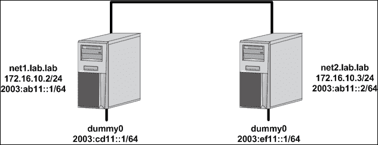
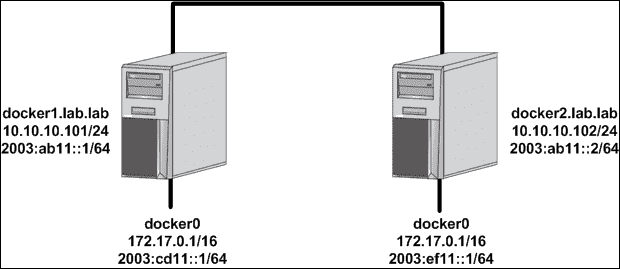

# 第十章：利用 IPv6

在本章中，我们将涵盖以下教程：

+   IPv6 命令行基础知识

+   在 Docker 中启用 IPv6 功能

+   使用 IPv6 启用的容器

+   配置 NDP 代理

+   用户定义的网络和 IPv6

# 介绍

在本书的这一部分，我们一直专注于 IPv4 网络。然而，IPv4 并不是我们唯一可用的 IP 协议。尽管 IPv4 仍然是最广为人知的协议，但 IPv6 开始引起了重大关注。公共 IPv4 空间已经耗尽，许多人开始预见到私有 IPv4 分配用尽的问题。IPv6 看起来可以通过定义更大的可用 IP 空间来解决这个问题。然而，IPv6 与 IPv4 有一些不同之处，使一些人认为实施 IPv6 将会很麻烦。我认为，当你考虑部署容器技术时，你也应该考虑如何有效地利用 IPv6。尽管 IPv6 是一个不同的协议，但它很快将成为许多网络的要求。随着容器代表着在你的网络上引入更多 IP 端点的可能性，尽早进行过渡是一个好主意。在本章中，我们将看看 Docker 目前支持的 IPv6 功能。

# IPv6 命令行基础知识

即使你了解 IPv6 协议的基础知识，第一次在 Linux 主机上使用 IPv6 可能会有点令人畏惧。与 IPv4 类似，IPv6 有其独特的一套命令行工具，可以用来配置和排除 IPv6 连接问题。其中一些工具与我们在 IPv4 中使用的相同，只是语法略有不同。其他工具则是完全独特于 IPv6。在这个教程中，我们将介绍如何配置和验证基本的 IPv6 连接。

## 准备工作

在这个教程中，我们将使用由两个 Linux 主机组成的小型实验室：


每台主机都分配了一个 IPv4 地址和一个 IPv6 地址给其物理接口。你需要 root 级别的访问权限来对每台主机进行网络配置更改。

### 注意

这个教程的目的不是教授 IPv6 或 IPv6 网络设计的基础知识。本教程中的示例仅供举例。虽然在示例中我们可能会涵盖一些基础知识，但假定读者已经对 IPv6 协议的工作原理有基本的了解。

## 如何做…

如前图所示，每台 Linux 主机都被分配了 IPv4 和 IPv6 IP 地址。这些都是作为主机网络配置脚本的一部分进行配置的。以下是两台实验主机的示例配置：

+   `net1.lab.lab`

```
auto eth0
iface eth0 inet static
        address 172.16.10.2
        netmask 255.255.255.0
        gateway 172.16.10.1
        dns-nameservers 10.20.30.13
        dns-search lab.lab
**iface eth0 inet6 static**
 **address 2003:ab11::1**
 **netmask 64**

```

+   `net2.lab.lab`

```
auto eth0
iface eth0 inet static
        address 172.16.10.3
        netmask 255.255.255.0
        gateway 172.16.10.1
        dns-nameservers 10.20.30.13
        dns-search lab.lab
**iface eth0 inet6 static**
 **address 2003:ab11::2**
 **netmask 64**

```

请注意，在每种情况下，我们都将 IPv6 地址添加到现有的物理网络接口上。在这种类型的配置中，IPv4 和 IPv6 地址共存于同一个网卡上。这通常被称为运行**双栈**，因为两种协议共享同一个物理适配器。配置完成后，您需要重新加载接口以使配置生效。然后，您应该能够通过使用`ifconfig`工具或`ip`（`iproute2`）工具集来确认每台主机是否具有正确的配置：

```
user@net1:~$ **ifconfig eth0**
eth0      Link encap:Ethernet  HWaddr 00:0c:29:2d:dd:79
inet addr:172.16.10.2  Bcast:172.16.10.255  Mask:255.255.255.0
 **inet6 addr: fe80::20c:29ff:fe2d:dd79/64 Scope:Link**
 **inet6 addr: 2003:ab11::1/64 Scope:Global**
          UP BROADCAST RUNNING MULTICAST  MTU:1500  Metric:1
          RX packets:308 errors:0 dropped:0 overruns:0 frame:0
          TX packets:348 errors:0 dropped:0 overruns:0 carrier:0
          collisions:0 txqueuelen:1000
          RX bytes:32151 (32.1 KB)  TX bytes:36732 (36.7 KB)
user@net1:~$

user@net2:~$ ip -6 addr show dev eth0
2: eth0: <BROADCAST,MULTICAST,UP,LOWER_UP> mtu 1500 qlen 1000
 **inet6 2003:ab11::2/64 scope global**
       valid_lft forever preferred_lft forever
 **inet6 fe80::20c:29ff:fe59:caca/64 scope link**
       valid_lft forever preferred_lft forever
user@net2:~$
```

使用较旧的`ifconfig`工具的优势在于您可以同时看到 IPv4 和 IPv6 接口信息。当使用`ip`工具时，您需要通过传递`-6`标志来指定您希望看到 IPv6 信息。当我们在后面使用`ip`工具配置 IPv6 接口时，我们将看到这种情况是一样的。

在任一情况下，两台主机现在似乎都已经在它们的`eth0`接口上配置了 IPv6。但是，请注意，实际上我们定义了两个 IPv6 地址。您会注意到一个地址的范围是本地的，另一个地址的范围是全局的。在 IPv6 中，每个 IP 接口都被分配了全局和本地 IPv6 地址。本地范围的接口仅对其分配的链路上的通信有效，并且通常用于到达同一段上的相邻设备。在大多数情况下，链路本地地址是由主机自己动态确定的。这意味着几乎每个启用 IPv6 的接口都有一个链路本地 IPv6 地址，即使您没有在接口上专门配置全局 IPv6 地址。使用链路本地 IP 地址的数据包永远不会被路由器转发，这将限制它们在定义的段上。在我们的大部分讨论中，我们将专注于全局地址。

### 注意

任何对 IPv6 地址的进一步引用都是指全局范围的 IPv6 地址，除非另有说明。

由于我们的两台主机都在同一个子网上，我们应该能够使用 IPv6 从一台服务器到达另一台服务器：

```
user@net1:~$ **ping6 2003:ab11::2 -c 2**
PING 2003:ab11::2(2003:ab11::2) 56 data bytes
**64 bytes from 2003:ab11::2: icmp_seq=1 ttl=64 time=0.422 ms**
**64 bytes from 2003:ab11::2: icmp_seq=2 ttl=64 time=0.401 ms**
--- 2003:ab11::2 ping statistics ---
2 packets transmitted, 2 received, 0% packet loss, time 999ms
rtt min/avg/max/mdev = 0.401/0.411/0.422/0.022 ms
user@net1:~$
```

请注意，我们使用`ping6`工具而不是标准的 ping 工具来验证 IPv6 的可达性。

我们想要检查的最后一件事是邻居发现表。IPv6 的另一个重大变化是它不使用 ARP 来查找 IP 端点的硬件或 MAC 地址。这样做的主要原因是 IPv6 不支持广播流量。ARP 依赖广播来工作，因此不能在 IPv6 中使用。相反，IPv6 使用邻居发现，它利用多播。

话虽如此，当排除本地网络故障时，您需要查看邻居发现表，而不是 ARP 表。为此，我们可以使用熟悉的`iproute2`工具集：

```
user@net1:~$ **ip -6 neighbor show**
fe80::20c:29ff:fe59:caca dev eth0 lladdr 00:0c:29:59:ca:ca DELAY
**2003:ab11::2 dev eth0 lladdr 00:0c:29:59:ca:ca REACHABLE**
user@net1:~$
```

与 ARP 表类似，邻居表向我们显示了我们希望到达的 IPv6 地址的硬件或 MAC 地址。请注意，与之前一样，我们向`ip`命令传递了`-6`标志，告诉它我们需要 IPv6 信息。

现在我们已经建立了基本的连接性，让我们在每个主机上添加一个新的 IPv6 接口。为此，我们几乎可以按照添加 IPv4 接口时所做的相同步骤进行操作。例如，添加虚拟接口几乎是相同的：

```
user@net1:~$ sudo ip link add ipv6_dummy type dummy
user@net1:~$ sudo ip -6 address add 2003:cd11::1/64 dev ipv6_dummy
user@net1:~$ sudo ip link set ipv6_dummy up
```

请注意，唯一的区别是我们需要再次传递`-6`标志，告诉`iproute2`我们正在指定一个 IPv6 地址。在其他方面，配置与我们在 IPv4 中所做的方式完全相同。让我们也在第二个主机上配置另一个虚拟接口：

```
user@net2:~$ sudo ip link add ipv6_dummy type dummy
user@net2:~$ sudo ip -6 address add 2003:ef11::1/64 dev ipv6_dummy
user@net2:~$ sudo ip link set ipv6_dummy up
```

此时，我们的拓扑现在如下所示：



现在让我们检查每个主机的 IPv6 路由表。与之前一样，我们也可以使用`iproute2`工具来检查 IPv6 路由表：

```
user@net1:~$ ip -6 route
**2003:ab11::/64 dev eth0  proto kernel  metric 256  pref medium**
**2003:cd11::/64 dev ipv6_dummy  proto kernel  metric 256  pref medium**
fe80::/64 dev eth0  proto kernel  metric 256  pref medium
fe80::/64 dev ipv6_dummy  proto kernel  metric 256  pref medium
user@net1:~$

user@net2:~$ ip -6 route
**2003:ab11::/64 dev eth0  proto kernel  metric 256  pref medium**
**2003:ef11::/64 dev ipv6_dummy  proto kernel  metric 256  pref medium**
fe80::/64 dev eth0  proto kernel  metric 256  pref medium
fe80::/64 dev ipv6_dummy  proto kernel  metric 256  pref medium
user@net2:~$
```

正如我们所看到的，每个主机都知道自己直接连接的接口，但不知道其他主机的虚拟接口。为了使任何一个主机能够到达其他主机的虚拟接口，我们需要进行路由。由于这些主机是直接连接的，可以通过添加默认的 IPv6 路由来解决。每个默认路由将引用另一个主机作为下一跳。虽然这是可行的，但让我们改为向每个主机添加特定路由，引用虚拟接口所在的网络：

```
user@net1:~$ sudo ip -6 route add **2003:ef11::/64 via 2003:ab11::2**
user@net2:~$ sudo ip -6 route add **2003:cd11::/64 via 2003:ab11::1**

```

添加这些路由后，任何一个主机都应该能够到达其他主机的`ipv6_dummy`接口：

```
user@net1:~$ **ping6 2003:ef11::1 -c 2**
PING 2003:ef11::1(2003:ef11::1) 56 data bytes
**64 bytes from 2003:ef11::1: icmp_seq=1 ttl=64 time=0.811 ms**
**64 bytes from 2003:ef11::1: icmp_seq=2 ttl=64 time=0.408 ms**
--- 2003:ef11::1 ping statistics ---
2 packets transmitted, 2 received, 0% packet loss, time 999ms
rtt min/avg/max/mdev = 0.408/0.609/0.811/0.203 ms
user@net1:~$
```

### 注意

您可能会注意到，只在单个主机上添加一个路由就可以使该主机到达另一个主机上的虚拟接口。这是因为我们只需要路由来将流量从发起主机上移出。流量将由主机的 `eth0` 接口（`2003:ab11::/64`）发出，而另一个主机知道如何到达它。如果 ping 是从虚拟接口发出的，您需要这两个路由才能使其正常工作。

现在我们已经配置并验证了基本的连接性，让我们迈出最后一步，使用网络命名空间重建这些接口。为此，让我们首先清理虚拟接口，因为我们将在命名空间内重用这些 IPv6 子网：

```
user@net1:~$ sudo ip link del dev ipv6_dummy
user@net2:~$ sudo ip link del dev ipv6_dummy
```

我们要配置的配置如下：


虽然与上一个配置非常相似，但有两个主要区别。您会注意到我们现在使用网络命名空间来封装新接口。这样做，我们已经为 VETH 对的一端配置了新接口的 IPv6 地址。VETH 对的另一端位于默认网络命名空间中的主机上。

### 注意

如果您对一些 Linux 网络构造不太熟悉，请查看第一章中的 *Linux 网络构造*，在那里我们会更详细地讨论命名空间和 VETH 接口。

要进行配置，我们将应用以下配置：

添加一个名为 `net1_ns` 的新网络命名空间：

```
user@net1:~$ sudo ip netns add net1_ns
```

创建一个名为 `host_veth1` 的 VETH 对，并将另一端命名为 `ns_veth1`：

```
user@net1:~$ sudo ip link add host_veth1 type veth peer name ns_veth1
```

将 VETH 对的命名空间端移入命名空间：

```
user@net1:~$ sudo ip link set dev ns_veth1 netns net1_ns
```

在命名空间内，给 VETH 接口分配一个 IP 地址：

```
user@net1:~$ sudo ip netns exec net1_ns ip -6 address \
add 2003:cd11::2/64 dev ns_veth1
```

在命名空间内，启动接口：

```
user@net1:~$ sudo ip netns exec net1_ns ip link set ns_veth1 up
```

在命名空间内，添加一个路由以到达另一个主机上的命名空间：

```
user@net1:~$ sudo ip netns exec net1_ns ip -6 route \
add 2003:ef11::/64 via 2003:cd11::1
```

给 VETH 对的主机端分配一个 IP 地址：

```
user@net1:~$ sudo ip -6 address add 2003:cd11::1/64 dev host_veth1
```

启动 VETH 接口的主机端：

```
user@net1:~$ sudo ip link set host_veth1 up
```

### 注意

请注意，我们只在命名空间内添加了一个路由以到达另一个命名空间。我们没有在 Linux 主机上添加相同的路由。这是因为我们之前已经在配方中添加了这个路由，以便到达虚拟接口。如果您删除了该路由，您需要将其添加回来才能使其正常工作。

我们现在必须在第二个主机上执行类似的配置：

```
user@net2:~$ sudo ip netns add net2_ns
user@net2:~$ sudo ip link add host_veth1 type veth peer name ns_veth1
user@net2:~$ sudo ip link set dev ns_veth1 netns net2_ns
user@net2:~$ sudo ip netns exec net2_ns ip -6 address add \
2003:ef11::2/64 dev ns_veth1
user@net2:~$ sudo ip netns exec net2_ns ip link set ns_veth1 up
user@net2:~$ sudo ip netns exec net2_ns ip -6 route add \
2003:cd11::/64 via 2003:ef11::1
user@net2:~$ sudo ip -6 address add 2003:ef11::1/64 dev host_veth1
user@net2:~$ sudo ip link set host_veth1 up
```

添加后，您应该能够验证每个命名空间是否具有到达其他主机命名空间所需的路由信息：

```
user@net1:~$ sudo ip netns exec net1_ns ip -6 route
2003:cd11::/64 dev ns_veth1  proto kernel  metric 256  pref medium
**2003:ef11::/64 via 2003:cd11::1 dev ns_veth1  metric 1024  pref medium**
fe80::/64 dev ns_veth1  proto kernel  metric 256  pref medium
user@net1:~$
user@net2:~$ sudo ip netns exec net2_ns ip -6 route
**2003:cd11::/64 via 2003:ef11::1 dev ns_veth1  metric 1024  pref medium**
2003:ef11::/64 dev ns_veth1  proto kernel  metric 256  pref medium
fe80::/64 dev ns_veth1  proto kernel  metric 256  pref medium
user@net2:~$
```

但是当我们尝试从一个命名空间到另一个命名空间时，连接失败：

```
user@net1:~$ **sudo ip netns exec net1_ns ping6 2003:ef11::2 -c 2**
PING 2003:ef11::2(2003:ef11::2) 56 data bytes
--- 2003:ef11::2 ping statistics ---
2 packets transmitted, 0 received, **100% packet loss**, time 1007ms
user@net1:~$
```

这是因为我们现在正在尝试将 Linux 主机用作路由器。如果您回忆起早期章节，当我们希望 Linux 内核转发或路由数据包时，我们必须启用该功能。这是通过更改每个主机上的这两个内核参数来完成的：

```
user@net1:~$ sudo sysctl **net.ipv6.conf.default.forwarding=1**
net.ipv6.conf.default.forwarding = 1
user@net1:~$ sudo sysctl **net.ipv6.conf.all.forwarding=1**
net.ipv6.conf.all.forwarding = 1
```

### 注意

请记住，以这种方式定义的设置在重新启动时不会持久保存。

一旦在两个主机上进行了这些设置，您的 ping 现在应该开始工作：

```
user@net1:~$ **sudo ip netns exec net1_ns ping6 2003:ef11::2 -c 2**
PING 2003:ef11::2(2003:ef11::2) 56 data bytes
**64 bytes from 2003:ef11::2: icmp_seq=1 ttl=62 time=0.540 ms**
**64 bytes from 2003:ef11::2: icmp_seq=2 ttl=62 time=0.480 ms**
--- 2003:ef11::2 ping statistics ---
2 packets transmitted, 2 received, 0% packet loss, time 999ms
rtt min/avg/max/mdev = 0.480/0.510/0.540/0.030 ms
user@net1:~$
```

有趣的是，在启用内核中的 IPv6 转发后，检查主机上的邻居表：

```
user@net1:~$ ip -6 neighbor
**2003:ab11::2 dev eth0 lladdr 00:0c:29:59:ca:ca router STALE**
2003:cd11::2 dev host_veth1 lladdr a6:14:b5:39:da:96 STALE
fe80::20c:29ff:fe59:caca dev eth0 lladdr 00:0c:29:59:ca:ca router STALE
fe80::a414:b5ff:fe39:da96 dev host_veth1 lladdr a6:14:b5:39:da:96 STALE
user@net1:~$
```

您是否注意到另一个 Linux 主机的邻居条目有什么不同之处？现在，它的邻居定义中包含`router`标志。当 Linux 主机在内核中启用 IPv6 转发时，它会在该段上作为路由器进行广告。

# 启用 Docker 中的 IPv6 功能

Docker 中默认禁用 IPv6 功能。与我们之前审查的其他功能一样，要启用它需要在服务级别进行设置。一旦启用，Docker 将为与 Docker 关联的主机接口以及容器本身提供 IPv6 地址。

## 准备就绪

在这个示例中，我们将使用由两个 Docker 主机组成的小型实验室：


每个主机都有分配给其物理接口的 IPv4 地址和 IPv6 地址。您需要对每个主机进行网络配置更改的根级访问权限。假定已安装了 Docker，并且它是默认配置。

## 如何做…

如前所述，除非告知，Docker 不会为容器提供 IPv6 地址。要在 Docker 中启用 IPv6，我们需要向 Docker 服务传递一个服务级标志。

### 注意

如果您需要复习定义 Docker 服务级参数，请参阅第二章中的最后一个示例，*配置和监视 Docker 网络*，在那里我们讨论了在运行`systemd`的系统上配置这些参数。

除了启用 IPv6 功能，您还需要为`docker0`桥定义一个子网。为此，我们将修改 Docker 的`systemd`附加文件，并确保它具有以下选项：

+   在主机`docker1`上：

```
ExecStart=/usr/bin/dockerd --ipv6 --fixed-cidr-v6=2003:cd11::/64
```

+   在主机`docker2`上：

```
ExecStart=/usr/bin/dockerd --ipv6 --fixed-cidr-v6=2003:ef11::/64
```

如果我们应用此配置，在每个主机上重新加载`systemd`配置并重新启动 Docker 服务，我们应该会看到`docker0`桥已经从定义的 IPv6 CIDR 范围中获取了第一个可用的 IP 地址：

```
user@docker1:~$ ip -6 addr show dev docker0
3: docker0: <NO-CARRIER,BROADCAST,MULTICAST,UP> mtu 1500
    **inet6 2003:cd11::1/64 scope global tentative**
       valid_lft forever preferred_lft forever
    inet6 fe80::1/64 scope link tentative
       valid_lft forever preferred_lft forever
user@docker1:~$

user@docker2:~$ ip -6 addr show dev docker0
5: docker0: <NO-CARRIER,BROADCAST,MULTICAST,UP> mtu 1500
 **inet6 2003:ef11::1/64 scope global tentative**
       valid_lft forever preferred_lft forever
    inet6 fe80::1/64 scope link tentative
       valid_lft forever preferred_lft forever
user@docker2:~$
```

此时，我们的拓扑结构看起来很像第一个配方中的样子：



Docker 将为其创建的每个容器分配一个 IPv6 地址和一个 IPv4 地址。让我们在第一个主机上启动一个容器，看看我的意思是什么：

```
user@docker1:~$ **docker run -d --name=web1 jonlangemak/web_server_1**
50d522d176ebca2eac0f7e826ffb2e36e754ce27b3d3b4145aa8a11c6a13cf15
user@docker1:~$
```

请注意，我们没有向容器传递`-P`标志来发布容器暴露的端口。如果我们在本地测试，我们可以验证主机可以从容器的 IPv4 和 IPv6 地址访问容器内的服务：

```
user@docker1:~$ docker exec web1 ifconfig eth0
eth0      Link encap:Ethernet  HWaddr 02:42:ac:11:00:02
          **inet addr:172.17.0.2  Bcast:0.0.0.0  Mask:255.255.0.0**
          inet6 addr: fe80::42:acff:fe11:2/64 Scope:Link
 **inet6 addr: 2003:cd11::242:ac11:2/64 Scope:Global**
          UP BROADCAST RUNNING MULTICAST  MTU:1500  Metric:1
          RX packets:16 errors:0 dropped:0 overruns:0 frame:0
          TX packets:8 errors:0 dropped:0 overruns:0 carrier:0
          collisions:0 txqueuelen:0
          RX bytes:1792 (1.7 KB)  TX bytes:648 (648.0 B)

user@docker1:~$ **curl http://172.17.0.2**
<body>
  <html>
    <h1><span style="color:#FF0000;font-size:72px;">Web Server #1 - Running on port 80</span>
    </h1>
</body>
  </html>
user@docker1:~$ **curl -g http://[2003:cd11::242:ac11:2]**
<body>
  <html>
    <h1><span style="color:#FF0000;font-size:72px;">Web Server #1 - Running on port 80</span>
    </h1>
</body>
  </html>
user@docker1:~$
```

### 注意

在使用带有 IPv6 地址的`curl`时，您需要将 IPv6 地址放在方括号中，然后通过传递`-g`标志告诉`curl`不要进行全局匹配。

正如我们所看到的，IPv6 地址的行为与 IPv4 地址的行为相同。随之而来，同一主机上的容器可以使用其分配的 IPv6 地址直接相互通信，跨过`docker0`桥。让我们在同一主机上启动第二个容器：

```
user@docker1:~$ docker run -d --name=web2 jonlangemak/web_server_2
```

快速验证将向我们证明这两个容器可以像预期的那样使用其 IPv6 地址直接相互通信：

```
user@docker1:~$ docker exec **web2** ip -6 addr show dev eth0
10: eth0@if11: <BROADCAST,MULTICAST,UP,LOWER_UP> mtu 1500
    inet6 **2003:cd11::242:ac11:3/64** scope global nodad
       valid_lft forever preferred_lft forever
    inet6 fe80::42:acff:fe11:3/64 scope link
       valid_lft forever preferred_lft forever
user@docker1:~$
user@docker1:~$ **docker exec -it web1 curl -g \**
**http://[2003:cd11::242:ac11:3]**
<body>
  <html>
    <h1><span style="color:#FF0000;font-size:72px;">**Web Server #2 - Running on port 80**</span>
    </h1>
</body>
  </html>
user@docker1:~$
```

# 使用 IPv6 启用的容器

在上一个配方中，我们看到了 Docker 如何处理启用 IPv6 的容器的基本分配。到目前为止，我们看到的行为与之前章节中处理 IPv4 地址容器时所看到的行为非常相似。然而，并非所有网络功能都是如此。Docker 目前在 IPv4 和 IPv6 之间并没有完全的功能对等。特别是，正如我们将在这个配方中看到的，Docker 对于启用 IPv6 的容器并没有`iptables`（ip6tables）集成。在本章中，我们将回顾一些我们之前在仅启用 IPv4 的容器中访问过的网络功能，并看看在使用 IPv6 寻址时它们的表现如何。

## 准备工作

在这个配方中，我们将继续构建上一个配方中构建的实验室。您需要 root 级别的访问权限来对每个主机进行网络配置更改。假设 Docker 已安装，并且是默认配置。

## 操作步骤

如前所述，Docker 目前没有针对 IPv6 的主机防火墙，特别是 netfilter 或`iptables`的集成。这意味着我们以前依赖 IPv4 的几个功能在处理容器的 IPv6 地址时会有所不同。让我们从一些基本功能开始。在上一个示例中，我们看到了在连接到`docker0`桥接器的同一主机上的两个容器可以直接相互通信。

这种行为是预期的，并且在使用 IPv4 地址时的方式基本相同。如果我们想要阻止这种通信，我们可能会考虑在 Docker 服务中禁用**容器间通信**（**ICC**）。让我们更新主机`docker1`上的 Docker 选项，将 ICC 设置为`false`：

```
ExecStart=/usr/bin/dockerd --icc=false --ipv6 --fixed-cidr-v6=2003:cd11::/64
```

然后，我们可以重新加载`systemd`配置，重新启动 Docker 服务，并重新启动容器：

```
user@docker1:~$ **docker start web1**
web1
user@docker1:~$ **docker start web2**
web2
user@docker1:~$ docker exec web2 ifconfig eth0
eth0      Link encap:Ethernet  HWaddr 02:42:ac:11:00:03
          **inet addr:172.17.0.3**  Bcast:0.0.0.0  Mask:255.255.0.0
          inet6 addr: fe80::42:acff:fe11:3/64 Scope:Link
          **inet6 addr: 2003:cd11::242:ac11:3**/64 Scope:Global
          UP BROADCAST RUNNING MULTICAST  MTU:1500  Metric:1
          RX packets:12 errors:0 dropped:0 overruns:0 frame:0
          TX packets:8 errors:0 dropped:0 overruns:0 carrier:0
          collisions:0 txqueuelen:0
          RX bytes:1128 (1.1 KB)  TX bytes:648 (648.0 B)

user@docker1:~$
user@docker1:~$ **docker exec -it web1 curl http://172.17.0.3**
curl: (7) couldn't connect to host
user@docker1:~$ **docker exec -it web1 curl -g \**
**http://[2003:cd11::242:ac11:3]**
<body>
  <html>
    <h1><span style="color:#FF0000;font-size:72px;">**Web Server #2 - Running on port 80**</span>
    </h1>
</body>
  </html>
user@docker1:~$
```

正如我们所看到的，IPv4 尝试失败，随后的 IPv6 尝试成功。由于 Docker 没有管理与容器的 IPv6 地址相关的防火墙规则，因此没有任何阻止 IPv6 地址之间直接连接的内容。

由于 Docker 没有管理与 IPv6 相关的防火墙规则，您可能还会认为出站伪装和端口发布等功能也不再起作用。虽然这在某种意义上是正确的，即 Docker 不会创建 IPv6 相关的 NAT 规则和防火墙策略，但这并不意味着容器的 IPv6 地址无法从外部网络访问。让我们通过一个示例来向您展示我的意思。让我们在第二个 Docker 主机上启动一个容器：

```
user@docker2:~$ docker run -dP --name=web2 jonlangemak/web_server_2
5e2910c002db3f21aa75439db18e5823081788e69d1e507c766a0c0233f6fa63
user@docker2:~$
user@docker2:~$ docker port web2
**80/tcp -> 0.0.0.0:32769**
user@docker2:~$
```

请注意，当我们在主机`docker2`上运行容器时，我们传递了`-P`标志，告诉 Docker 发布容器的暴露端口。如果我们检查端口映射，我们可以看到主机选择了端口`32768`。请注意，端口映射指示 IP 地址为`0.0.0.0`，通常表示任何 IPv4 地址。让我们从另一个 Docker 主机执行一些快速测试，以验证工作和不工作的内容：

```
user@docker1:~$ **curl http://10.10.10.102:32769**
<body>
  <html>
    <h1><span style="color:#FF0000;font-size:72px;">**Web Server #2 - Running on port 80**</span>
    </h1>
</body>
  </html>
user@docker1:~$
```

如预期的那样，IPv4 端口映射起作用。通过利用`iptables` NAT 规则将端口`32769`映射到实际服务端口`80`，我们能够通过 Docker 主机的 IPv4 地址访问容器的服务。现在让我们尝试相同的示例，但使用主机的 IPv6 地址：

```
user@docker1:~$ **curl -g http://[2003:ab11::2]:32769**
<body>
  <html>
    <h1><span style="color:#FF0000;font-size:72px;">**Web Server #2 - Running on port 80**</span>
    </h1>
</body>
  </html>
user@docker1:~$
```

令人惊讶的是，这也起作用。您可能想知道这是如何工作的，考虑到 Docker 不管理或集成任何主机 IPv6 防火墙策略。答案实际上非常简单。如果我们查看第二个 Docker 主机的开放端口，我们会看到有一个绑定到端口`32769`的`docker-proxy`服务：

```
user@docker2:~$ sudo netstat -plnt
…<output removed for brevity>…
Active Internet connections (only servers)
Local Address   Foreign Address         State       PID/Program name
0.0.0.0:22      0.0.0.0:*               LISTEN      1387/sshd
127.0.0.1:6010  0.0.0.0:*               LISTEN      3658/0
:::22           :::*                    LISTEN      1387/sshd
::1:6010        :::*                    LISTEN      3658/0
**:::32769        :::*                    LISTEN      2390/docker-proxy**
user@docker2:~$
```

正如我们在前几章中看到的，`docker-proxy`服务促进了容器之间和发布端口的连接。为了使其工作，`docker-proxy`服务必须绑定到容器发布的端口。请记住，监听所有 IPv4 接口的服务使用`0.0.0.0`的语法来表示所有 IPv4 接口。类似地，IPv6 接口使用`:::`的语法来表示相同的事情。您会注意到`docker-proxy`端口引用了所有 IPv6 接口。尽管这可能因操作系统而异，但绑定到所有 IPv6 接口也意味着绑定到所有 IPv4 接口。也就是说，前面的`docker-proxy`服务实际上正在监听所有主机的 IPv4 和 IPv6 接口。

### 注意

请记住，`docker-proxy`通常不用于入站服务。这些依赖于`iptables` NAT 规则将发布的端口映射到容器。但是，在这些规则不存在的情况下，主机仍然在其所有接口上监听端口`32769`的流量。

这样做的最终结果是，尽管没有 IPv6 NAT 规则，我仍然能够通过 Docker 主机接口访问容器服务。以这种方式，具有 IPv6 的发布端口仍然有效。但是，只有在使用`docker-proxy`时才有效。尽管这种操作模式仍然是默认的，但打算在 hairpin NAT 的支持下移除。我们可以通过将`--userland-proxy=false`参数传递给 Docker 作为服务级选项来在 Docker 主机上启用 hairpin NAT。这样做将阻止这种 IPv6 端口发布方式的工作。

最后，缺乏防火墙集成也意味着我们不再支持出站伪装功能。在 IPv4 中，这个功能允许容器与外部网络通信，而不必担心路由或 IP 地址重叠。离开主机的容器流量总是隐藏在主机 IP 接口之一的后面。然而，这并不是一个强制性的配置。正如我们在前几章中看到的，您可以非常容易地禁用出站伪装功能，并为`docker0`桥接分配一个可路由的 IP 地址和子网。只要外部或外部网络知道如何到达该子网，容器就可以非常容易地拥有一个独特的可路由 IP 地址。

IPv6 出现的一个原因是 IPv4 地址的迅速枯竭。IPv4 中的 NAT 作为一个相当成功的，尽管同样麻烦的临时缓解了地址枯竭问题。这意味着许多人认为，我们不应该在 IPv6 方面实施任何形式的 NAT。相反，所有 IPv6 前缀都应该是本地可路由和可达的，而不需要 IP 转换的混淆。缺乏 IPv6 防火墙集成，直接将 IPv6 流量路由到每个主机是 Docker 实现跨多个 Docker 主机和外部网络可达性的当前手段。这要求每个 Docker 主机使用唯一的 IPv6 CIDR 范围，并且 Docker 主机知道如何到达所有其他 Docker 主机定义的 CIDR 范围。虽然这通常需要物理网络具有网络可达性信息，在我们简单的实验室示例中，每个主机只需要对其他主机的 CIDR 添加静态路由。就像我们在第一个配方中所做的那样，我们将在每个主机上添加一个 IPv6 路由，以便两者都知道如何到达另一个`docker0`桥接的 IPv6 子网：

```
user@docker1:~$ sudo ip -6 route add 2003:ef11::/64 via 2003:ab11::2
user@docker2:~$ sudo ip -6 route add 2003:cd11::/64 via 2003:ab11::1
```

添加路由后，每个 Docker 主机都知道如何到达另一个主机的 IPv6 `docker0`桥接子网：


如果我们现在检查，我们应该在每个主机上的容器之间有可达性：

```
user@docker2:~$ docker exec web2 ifconfig eth0
eth0      Link encap:Ethernet  HWaddr 02:42:ac:11:00:02
          **inet addr:172.17.0.2**  Bcast:0.0.0.0  Mask:255.255.0.0
          inet6 addr: fe80::42:acff:fe11:2/64 Scope:Link
          **inet6 addr: 2003:ef11::242:ac11:2/64** Scope:Global
          UP BROADCAST RUNNING MULTICAST  MTU:1500  Metric:1
          RX packets:43 errors:0 dropped:0 overruns:0 frame:0
          TX packets:34 errors:0 dropped:0 overruns:0 carrier:0
          collisions:0 txqueuelen:0
          RX bytes:3514 (3.5 KB)  TX bytes:4155 (4.1 KB)

user@docker2:~$
user@docker1:~$ **docker exec -it web1 curl -g http://[2003:ef11::242:ac11:2]**
<body>
  <html>
    <h1><span style="color:#FF0000;font-size:72px;">**Web Server #2 - Running on port 80**</span>
    </h1>
</body>
  </html>
user@docker1:~$
```

正如我们所看到的，主机`docker1`上的容器能够成功地直接路由到运行在主机`docker2`上的容器。只要每个 Docker 主机具有适当的路由信息，容器就能够直接路由到彼此。

这种方法的缺点是容器现在是一个完全暴露的网络端点。我们不再能够通过 Docker 发布的端口仅暴露某些端口到外部网络的优势。如果您希望确保仅在 IPv6 接口上暴露某些端口，那么用户态代理可能是您目前的最佳选择。在设计围绕 IPv6 连接的服务时，请记住这些选项。

# 配置 NDP 代理

正如我们在上一个教程中看到的，Docker 中 IPv6 支持的一个主要区别是缺乏防火墙集成。没有这种集成，我们失去了出站伪装和完整端口发布功能。虽然这在所有情况下可能并非必要，但当不使用时会失去一定的便利因素。例如，在仅运行 IPv4 模式时，管理员可以安装 Docker 并立即将容器连接到外部网络。这是因为容器只能通过 Docker 主机的 IP 地址进行入站（发布端口）和出站（伪装）连接。这意味着无需通知外部网络有关额外子网的信息，因为外部网络只能看到 Docker 主机的 IP 地址。在 IPv6 模型中，外部网络必须知道容器子网才能路由到它们。在本章中，我们将讨论如何配置 NDP 代理作为解决此问题的方法。

## 准备工作

在本教程中，我们将使用以下实验拓扑：


您需要 root 级别的访问权限来对每个主机进行网络配置更改。假设 Docker 已安装，并且是默认配置。

## 如何做…

前面的拓扑图显示我们的主机是双栈连接到网络的，但是 Docker 还没有配置为使用 IPv6。就像我们在上一个教程中看到的那样，配置 Docker 以支持 IPv6 通常意味着在外部网络上配置路由，以便它知道如何到达您为`docker0`桥定义的 IPv6 CIDR。然而，假设一会儿这是不可能的。假设您无法控制外部网络，这意味着您无法向其他网络端点广告或通知有关 Docker 主机上任何新定义的 IPv6 子网。

假设虽然您无法广告任何新定义的 IPv6 网络，但您可以在现有网络中保留额外的 IPv6 空间。例如，主机当前在`2003:ab11::/64`网络中定义了接口。如果我们划分这个空间，我们可以将其分割成四个`/66`网络：

+   `2003:ab11::/66`

+   `2003:ab11:0:0:4000::/66`

+   `2003:ab11:0:0:8000::/66`

+   `2003:ab11:0:0:c000::/66`

假设我们被允许为我们的使用保留最后两个子网。我们现在可以在 Docker 中启用 IPv6，并将这两个网络分配为 IPv6 CIDR 范围。以下是每个 Docker 主机的配置选项：

+   `docker1`

```
ExecStart=/usr/bin/dockerd --ipv6 --fixed-cidr-v6=2003:ab11:0:0:8000::/66
```

+   `docker2`

```
ExecStart=/usr/bin/dockerd --ipv6 --fixed-cidr-v6=2003:ab11:0:0:c000::/66
```

将新配置加载到`systemd`中并重新启动 Docker 服务后，我们的实验室拓扑现在看起来是这样的：


让我们在两个主机上启动一个容器：

```
user@docker1:~$ docker run -d --name=web1 jonlangemak/web_server_1
user@docker2:~$ docker run -d --name=web2 jonlangemak/web_server_2
```

现在确定`web1`容器的分配的 IPv6 地址：

```
user@docker1:~$ docker exec web1 ip -6 addr show dev eth0
4: eth0@if5: <BROADCAST,MULTICAST,UP,LOWER_UP> mtu 1500
    inet6 **2003:ab11::8000:242:ac11:2/66** scope global nodad
       valid_lft forever preferred_lft forever
    inet6 fe80::42:acff:fe11:2/64 scope link
       valid_lft forever preferred_lft forever
user@docker1:~$
```

现在，让我们尝试从`web2`容器到达该容器：

```
user@docker2:~$ **docker exec -it web2 ping6 \**
**2003:ab11::8000:242:ac11:2**  -c 2
PING 2003:ab11::8000:242:ac11:2 (2003:ab11::8000:242:ac11:2): 48 data bytes
**56 bytes from 2003:ab11::c000:0:0:1: Destination unreachable: Address unreachable**
**56 bytes from 2003:ab11::c000:0:0:1: Destination unreachable: Address unreachable**
--- 2003:ab11::8000:242:ac11:2 ping statistics ---
2 packets transmitted, 0 packets received, **100% packet loss**
user@docker2:~$
```

这失败是因为 Docker 主机认为目标地址直接连接到它们的`eth0`接口。当`web2`容器尝试连接时，会发生以下操作：

+   容器进行路由查找，并确定地址`2003:ab11::8000:242:ac11:2`不在其本地子网`2003:ab11:0:0:c000::1/66`内，因此将流量转发到其默认网关（`docker0`桥接口）

+   主机接收流量并进行路由查找，确定`2003:ab11::8000:242:ac11:2`的目标地址落在其本地子网`2003:ab11::/64`（`eth0`）内，并使用 NDP 尝试找到具有该目标 IP 地址的主机

+   主机对此查询没有响应，流量失败

我们可以通过检查`docker2`主机的 IPv6 邻居表来验证这一点：

```
user@docker2:~$ ip -6 neighbor show
fe80::20c:29ff:fe50:b8cc dev eth0 lladdr 00:0c:29:50:b8:cc STALE
2003:ab11::c000:242:ac11:2 dev docker0 lladdr 02:42:ac:11:00:02 REACHABLE
**2003:ab11::8000:242:ac11:2 dev eth0  FAILED**
fe80::42:acff:fe11:2 dev docker0 lladdr 02:42:ac:11:00:02 REACHABLE
user@docker2:~$
```

按照正常的路由逻辑，一切都按预期工作。然而，IPv6 有一个叫做 NDP 代理的功能，可以帮助解决这个问题。熟悉 IPv4 中代理 ARP 的人会发现 NDP 代理提供了类似的功能。基本上，NDP 代理允许主机代表另一个端点回答邻居请求。在我们的情况下，我们可以告诉两个 Docker 主机代表容器回答。为了做到这一点，我们首先需要在主机上启用 NDP 代理。这是通过启用内核参数`net.ipv6.conf.eth0.proxy_ndp`来完成的，如下面的代码所示：

```
user@docker1:~$ sudo sysctl net.ipv6.conf.eth0.proxy_ndp=1
net.ipv6.conf.eth0.proxy_ndp = 1
user@docker1:~$
user@docker2:~$ sudo sysctl net.ipv6.conf.eth0.proxy_ndp=1
net.ipv6.conf.eth0.proxy_ndp = 1
user@docker2:~$
```

### 注意

请记住，以这种方式定义的设置在重启后不会持久保存。

一旦启用了这个功能，我们需要手动告诉每个主机要回答哪个 IPv6 地址。我们通过向每个主机的邻居表添加代理条目来实现这一点。在前面的例子中，我们需要为源容器和目标容器都这样做，以便允许双向流量。首先，在主机`docker1`上为目标添加条目：

```
user@docker1:~$ sudo ip -6 neigh add proxy \
**2003:ab11::8000:242:ac11:2** dev eth0
```

然后，确定`web2`容器的 IPv6 地址，它将作为流量的源，并在主机`docker2`上为其添加代理条目：

```
user@docker2:~$ docker exec web2 ip -6 addr show dev eth0
6: eth0@if7: <BROADCAST,MULTICAST,UP,LOWER_UP> mtu 1500
    inet6 **2003:ab11::c000:242:ac11:2/66** scope global nodad
       valid_lft forever preferred_lft forever
    inet6 fe80::42:acff:fe11:2/64 scope link
       valid_lft forever preferred_lft forever
user@docker2:~$
user@docker2:~$ sudo ip -6 neigh add proxy \
**2003:ab11::c000:242:ac11:2** dev eth0
```

这将告诉每个 Docker 主机代表容器回复邻居请求。Ping 测试现在应该按预期工作：

```
user@docker2:~$ **docker exec -it web2 ping6 \**
**2003:ab11::8000:242:ac11:2** -c 2
PING 2003:ab11::8000:242:ac11:2 (2003:ab11::8000:242:ac11:2): 48 data bytes
**56 bytes from 2003:ab11::8000:242:ac11:2: icmp_seq=0 ttl=62 time=0.462 ms**
**56 bytes from 2003:ab11::8000:242:ac11:2: icmp_seq=1 ttl=62 time=0.660 ms**
--- 2003:ab11::8000:242:ac11:2 ping statistics ---
2 packets transmitted, 2 packets received, 0% packet loss
round-trip min/avg/max/stddev = 0.462/0.561/0.660/0.099 ms
user@docker2:~$
```

我们应该在每个主机上看到相关的邻居条目：

```
user@docker1:~$ ip -6 neighbor show
fe80::20c:29ff:fe7f:3d64 dev eth0 lladdr 00:0c:29:7f:3d:64 router REACHABLE
2003:ab11::8000:242:ac11:2 dev docker0 lladdr 02:42:ac:11:00:02 REACHABLE
fe80::42:acff:fe11:2 dev docker0 lladdr 02:42:ac:11:00:02 DELAY
**2003:ab11::c000:242:ac11:2 dev eth0 lladdr 00:0c:29:7f:3d:64 REACHABLE**
user@docker1:~$
user@docker2:~$ ip -6 neighbor show
fe80::42:acff:fe11:2 dev docker0 lladdr 02:42:ac:11:00:02 REACHABLE
2003:ab11::c000:242:ac11:2 dev docker0 lladdr 02:42:ac:11:00:02 REACHABLE
fe80::20c:29ff:fe50:b8cc dev eth0 lladdr 00:0c:29:50:b8:cc router REACHABLE
**2003:ab11::8000:242:ac11:2 dev eth0 lladdr 00:0c:29:50:b8:cc REACHABLE**
user@docker2:~$
```

就像代理 ARP 一样，NDP 代理是通过主机在邻居发现请求中提供自己的 MAC 地址来工作的。我们可以看到，在这两种情况下，邻居表中的 MAC 地址实际上是每个主机的`eth0` MAC 地址。

```
user@docker1:~$ ip link show dev eth0
2: eth0: <BROADCAST,MULTICAST,UP,LOWER_UP> mtu 1500 qdisc pfifo_fast state UP mode DEFAULT group default qlen 1000
    link/ether **00:0c:29:50:b8:cc** brd ff:ff:ff:ff:ff:ff
user@docker1:~$
user@docker2:~$ ip link show dev eth0
2: eth0: <BROADCAST,MULTICAST,UP,LOWER_UP> mtu 1500 qdisc pfifo_fast state UP mode DEFAULT group default qlen 1000
    link/ether **00:0c:29:7f:3d:64** brd ff:ff:ff:ff:ff:ff
user@docker2:~$
```

这种方法在无法将 Docker IPv6 子网广告传播到外部网络的情况下效果相当不错。然而，它依赖于每个希望代理的 IPv6 地址的单独代理条目。对于每个生成的容器，您都需要生成一个额外的 IPv6 代理地址。

# 用户定义的网络和 IPv6

就像我们在 IPv4 中看到的那样，用户定义的网络可以利用 IPv6 寻址。也就是说，所有与网络相关的参数都与 IPv4 和 IPv6 相关。在本章中，我们将介绍如何定义用户定义的 IPv6 网络，并演示一些相关的配置选项。

## 准备工作

在这个示例中，我们将使用一个单独的 Docker 主机。假设 Docker 已安装并处于默认配置。不需要使用`--ipv6`服务级参数启用 Docker 服务，以便在用户定义的网络上使用 IPv6 寻址。

## 如何做到这一点...

在使用用户定义的网络时，我们可以为 IPv4 和 IPv6 定义配置。此外，当我们运行容器时，我们可以指定它们的 IPv4 和 IPv6 地址。为了演示这一点，让我们首先定义一个具有 IPv4 和 IPv6 寻址的用户定义网络：

```
user@docker1:~$ docker network create -d bridge \
--subnet 2003:ab11:0:0:c000::/66 --subnet 192.168.127.0/24 \
--ipv6 ipv6_bridge
```

这个命令的语法应该对你来说很熟悉，来自第三章*用户定义的网络*，在那里我们讨论了用户定义的网络。然而，有几点需要指出。

首先，您会注意到我们定义了`--subnet`参数两次。这样做，我们既定义了一个 IPv4 子网，也定义了一个 IPv6 子网。当定义 IPv4 和 IPv6 地址时，`--gateway`和`--aux-address`字段可以以类似的方式使用。其次，我们定义了一个选项来在此网络上启用 IPv6。如果您不定义此选项以启用 IPv6，则主机的网关接口将不会被定义。

一旦定义好，让我们在网络上启动一个容器，看看我们的配置是什么样的：

```
user@docker1:~$ docker run -d --name=web1 --net=ipv6_bridge \
--ip 192.168.127.10 --ip6 2003:ab11::c000:0:0:10 \
jonlangemak/web_server_1
```

这个语法对你来说也应该很熟悉。请注意，我们指定这个容器应该是用户定义网络`ipv6_bridge`的成员。这样做，我们还可以使用`--ip`和`--ip6`参数为容器定义 IPv4 和 IPv6 地址。

如果我们检查网络，我们应该看到容器附加以及与网络定义以及容器网络接口相关的所有相关信息：

```
user@docker1:~$ docker network inspect ipv6_bridge
[
    {
        "Name": "ipv6_bridge",
        "Id": "0c6e760998ea6c5b99ba39f3c7ce63b113dab2276645e5fb7a2207f06273401a",
        "Scope": "local",
        "Driver": "**bridge**",
        "IPAM": {
            "Driver": "default",
            "Options": {},
            "Config": [
                {
                    "Subnet": "**192.168.127.0/24**"
                },
                {
                    "Subnet": "**2003:ab11:0:0:c000::/66**"
                }
            ]
        },
        "Containers": {
            "38e7ac1a0d0ce849a782c5045caf770c3310aca42e069e02a55d0c4a601e6b5a": {
                "Name": "web1",
                "EndpointID": "a80ac4b00d34d462ed98084a238980b3a75093591630b5832f105d400fabb4bb",
                "MacAddress": "02:42:c0:a8:7f:0a",
                "IPv4Address": "**192.168.127.10/24**",
                "IPv6Address": "**2003:ab11::c000:0:0:10/66**"
            }
        },
        "Options": {
            "**com.docker.network.enable_ipv6": "true"**
        }
    }
]
user@docker1:~$
```

通过检查主机的网络配置，我们应该看到已创建了一个与这些网络匹配的新桥：

```
user@docker1:~$ ip addr show
…<Additional output removed for brevity>… 
9: br-0b2efacf6f85: <BROADCAST,MULTICAST,UP,LOWER_UP> mtu 1500 qdisc noqueue state UP group default
    link/ether 02:42:09:bc:9f:77 brd ff:ff:ff:ff:ff:ff
    inet **192.168.127.1/24** scope global br-0b2efacf6f85
       valid_lft forever preferred_lft forever
    inet6 **2003:ab11::c000:0:0:1/66** scope global
       valid_lft forever preferred_lft forever
    inet6 fe80::42:9ff:febc:9f77/64 scope link
       valid_lft forever preferred_lft forever
    inet6 fe80::1/64 scope link
       valid_lft forever preferred_lft forever
…<Additional output removed for brevity>…
user@docker1:~$ 
```

如果我们检查容器本身，我们会注意到这些接口是这个网络上的容器将用于其 IPv4 和 IPv6 默认网关的接口：

```
user@docker1:~$ docker exec web1 **ip route**
**default via 192.168.127.1 dev eth0**
192.168.127.0/24 dev eth0  proto kernel  scope link  src 192.168.127.10
user@docker1:~$ docker exec web1 **ip -6 route**
2003:ab11:0:0:c000::/66 dev eth0  proto kernel  metric 256
fe80::/64 dev eth0  proto kernel  metric 256
**default via 2003:ab11::c000:0:0:1 dev eth0  metric 1024**
user@docker1:~$
```

就像默认网络模式一样，用户定义的网络不支持主机防火墙集成，以支持出站伪装或入站端口发布。关于 IPv6 的连接，主机内外的情况与`docker0`桥相同，需要原生路由 IPv6 流量。

您还会注意到，如果您在主机上启动第二个容器，嵌入式 DNS 将同时适用于 IPv4 和 IPv6 寻址。

```
user@docker1:~$ docker run -d --name=web2 --net=ipv6_bridge \
jonlangemak/web_server_1
user@docker1:~$
user@docker1:~$ **docker exec -it web2 ping web1 -c 2**
PING web1 (192.168.127.10): 48 data bytes
**56 bytes from 192.168.127.10: icmp_seq=0 ttl=64 time=0.113 ms**
**56 bytes from 192.168.127.10: icmp_seq=1 ttl=64 time=0.111 ms**
--- web1 ping statistics ---
2 packets transmitted, 2 packets received, 0% packet loss
round-trip min/avg/max/stddev = 0.111/0.112/0.113/0.000 ms
user@docker1:~$ 
user@docker1:~$ **docker exec -it web2 ping6 web1 -c 2**
PING web1 (2003:ab11::c000:0:0:10): 48 data bytes
**56 bytes from web1.ipv6_bridge: icmp_seq=0 ttl=64 time=0.113 ms**
**56 bytes from web1.ipv6_bridge: icmp_seq=1 ttl=64 time=0.127 ms**
--- web1 ping statistics ---
2 packets transmitted, 2 packets received, 0% packet loss
round-trip min/avg/max/stddev = 0.113/0.120/0.127/0.000 ms
user@docker1:~$
```
